> [!cite]
> **Bibliographic Information**
> - **Source Type**:: AI-Report/Article
> - **Title**:: Report_An-Investigation-into-the-Application-of-Formal-Pedagogical-and-Andragogical-Theories-to-the-Architectural-Design-of-Personal-Knowledge-Management-Systems_🆔20251023220714
> - **Author(s)**:: 🌩️♊URG011_v1.1_🆔20251022221217
> - **Year**:: 2025
> - **Publisher / Journal**:: ⁉️
> - **Volume / Issue**:: 001
> - **Page(s)**:: 001
> - **URL / DOI**:: <https://gemini.google.com/gem/4a40a40aa594/865a42b5cc771d3b>
> - **Date Accessed**:: 2025-10-25T16:31:22

-----

> [!pre-read-questions]
>
>   - What is the fundamental difference between **pedagogy** (teaching children) and **andragogy** (teaching adults), and why does this distinction matter for designing a PKM system?
>   - In what ways is a traditional, folder-based file system an *obstacle* to the learning theory of **Constructivism**?
>   - How does the act of creating an "atomic note" (Zettelkasten method) serve as a practical application of **Piaget's** theories of assimilation and accommodation?
>   - What is **Self-Directed Learning (SDL)**, and how can a PKM's *architecture* (e.g., networked links) either support or hinder a learner's autonomy?
>   - Beyond simple recall, how do "Maps of Content" (MOCs) and linking facilitate the higher-order cognitive process of **knowledge synthesis**?

-----

> [!abstract]
>
> This article provides an in-depth investigation into the intersection of formal learning theory and the architectural design of Personal Knowledge Management (PKM) systems. It posits that the majority of users unconsciously structure their digital knowledge systems using an outdated and inefficient **pedagogical** (teacher-directed) model, resulting in "digital graveyards" of disconnected information. This document argues for a deliberate architectural shift towards a framework grounded in **andragogy** (adult learning theory) and **constructivism**.
>
> We will deconstruct the core principles of andragogy, as defined by Malcolm Knowles, to establish the *motivation* and *orientation* of the adult learner—a self-directed, problem-centered individual. We will then analyze the mechanisms of **constructivism** (both cognitive and social), positing that learning is an active process of *building*, not a passive one of *receiving*. The central thesis is that a PKM system's architecture is not a neutral container; it is an active learning environment. We will demonstrate how specific PKM architectures—namely the networked, graph-based model of "atomic" and "linked" notes—are a direct manifestation of constructivist principles. This design, in turn, is uniquely suited to support the adult learner's primary goals: robust **knowledge synthesis** and long-term **retention**.

# 1.0 📜 INTRODUCTION

> [!quote]
> "The adult learner… is a person who is 'self-directed.' He sees himself as being responsible for his own learning. He doesn't wait to be told what to do. He takes the initiative in diagnosing his own learning needs, formulating his own learning goals, identifying resources for learning, choosing and implementing appropriate learning strategies, and evaluating his own learning outcomes."
>
> — **Malcolm S. Knowles**, *Self-Directed Learning: A Guide for Learners and Teachers* (1975)

> [!the-purpose]
>
> The purpose of this article is to build a formal, theoretical bridge between the fields of cognitive science, adult education, and information architecture. We are in the midst of a data explosion, yet "knowledge" remains as elusive as ever. Many of us, as professionals and lifelong learners, meticulously collect articles, notes, and highlights, only to entomb them in a digital filing cabinet—a nested hierarchy of folders that mirrors the physical filing cabinets of the 20th century. We build "digital graveyards" of information, and then wonder why they fail to produce insight.
>
> The fundamental problem, I argue, is a **profound mismatch of models**. We are adult, **self-directed learners** (an *andragogical* model) attempting to build knowledge using a system designed for a child's passive reception of information (a *pedagogical* model). We are **constructivists**—learning by actively building and connecting ideas—stuck using a rigid, *instructivist* architecture that prizes categorization over connection.
>
> This article will investigate how the formal theories of **andragogy** and **constructivism** can and *should* serve as the architectural blueprint for a modern Personal Knowledge Management (PKM) system. We will move beyond the "how-to" of specific apps and instead focus on the *why*. Why do networked links (like `[[wiki-links]]`) feel so revolutionary? Because they are a functional implementation of a 70-year-old learning theory. How can we design a system that doesn't just *store* knowledge, but actively *generates* synthesis and ensures retention? By aligning its architecture with the very way our adult minds are built to learn.

# 2.0 ✒️🏛️ HISTORICAL CONTEXT & FOUNDATIONAL THEORIES

To build a new system, we must first understand the bedrock it rests on. Our current predicament—the "digital graveyard"—is the result of a historical inertia, a failure to update our information *architectures* to match our evolved understanding of human *cognition*. This journey requires us to trace three distinct intellectual lineages: the evolution of "teaching" (Pedagogy to Andragogy), the evolution of "learning" (Instructivism to Constructivism), and the evolution of "knowledge storage" (Filing Cabinets to Networked Graphs).

## FROM PEDAGOGY TO ANDRAGOGY: THE EVOLVING LEARNER

For centuries, the dominant model of education was **pedagogy**, a term derived from the Greek *paid* (child) and *agogos* (leader). This model is defined by a directed, dependent relationship:

  - The teacher (or system) decides *what* is learned.
  - The teacher decides *how* it is learned.
  - The teacher decides *when* it is learned.
  - The learner is a passive receptacle, motivated by external rewards and punishments (e.g., grades).

This model is perfectly reflected in a traditional, hierarchical folder system: `C:\My Documents\University\Fall Semester\PSYC101\Lecture_Notes\Week_3.doc`. The structure is rigid, pre-determined, and assumes the "teacher" (your past self) knew the one, correct place to file a piece of information.

Then, in the mid-20th century, theorists like **Malcolm Knowles** popularized **andragogy** (from the Greek *anēr* or "man," meaning adult). Knowles argued that to teach adults as if they were children was not just inefficient, but disrespectful to their nature. He proposed a set of core assumptions about the adult learner that fundamentally changed the game:

1. **Self-Concept:** Adults move from being dependent personalities to **self-directing** human beings. They must *own* their learning.
1. **Experience:** Adults accumulate a growing reservoir of **experience** that becomes a rich resource for learning.
1. **Readiness to Learn:** Adults' readiness to learn becomes oriented increasingly to the developmental tasks of their social roles.
1. **Orientation to Learning:** Their time perspective shifts from one of postponed application to one of **immediacy of application**. Their orientation shifts from subject-centered to **problem-centered**.
1. **Motivation to Learn:** The motivation for adults is increasingly **internal**.

> [!key-claim]
>
> The failure of most PKM systems is that they are architected **pedagogically** for a user who is, by nature, **andragogical**. An adult, self-directed, problem-centered learner is given a rigid, subject-centered, teacher-directed filing system. The system fights the user's core nature. A successful PKM *must* be andragogical, placing the self-directed learner in total control of a system designed for immediate, problem-centered application.

## FROM INSTRUCTIVISM TO CONSTRUCTIVISM: THE EVOLVING MIND

Running parallel to the evolution of the "learner" was the evolution of the "mind." The mid-20th century was dominated by **Behaviorism** (B.F. Skinner) and its educational application, **Instructivism**. This theory posited the mind as a "black box." Learning was a simple stimulus-response loop. The "teacher" provides a stimulus (information), and the "learner" provides a correct response (regurgitation). Knowledge is *transmitted*, not built. This is the philosophy of copy-paste.

This model was shattered by a cognitive revolution, most notably by **Jean Piaget** and **Lev Vygotsky**. They championed **Constructivism**, a theory that is perhaps the single most important concept for understanding knowledge.

> [!definition]
>
> **Constructivism:** A learning theory positing that learners are not passive recipients of information. Instead, they *actively construct* their own knowledge and understanding. New information is integrated with existing mental frameworks (schemas) through a dynamic, personal, and creative process.

**Piaget's Cognitive Constructivism** gave us the core mechanisms. He saw the learner as a "lone scientist" exploring the world. Learning happens via two processes:

  - **Assimilation:** Forcing new information to fit into an *existing* mental model (schema). (e.g., Seeing a zebra and calling it a "stripy horse.")
  - **Accommodation:** *Changing* your mental models to fit new, conflicting information. (e.g., Creating a *new* category for "zebra" that is distinct from "horse.")

**Vygotsky's Social Constructivism** added a crucial layer. He argued learning is not a "lone scientist" activity, but an inherently *social* one. Knowledge is co-created through language and interaction. His key concepts were:

  - **More Knowledgeable Other (MKO):** Anyone (a person, a book, a *system*) that has a better understanding or ability than the learner.
  - **Zone of Proximal Development (ZPD):** The "sweet spot" of learning—the space between what a learner can do alone and what they can achieve *with guidance* from an MKO.

> [!ask-yourself-this]
>
>   - **How did the historical development of this idea shape our current understanding?**
>       - Our understanding of PKM is a direct product of these parallel histories. We *use* hierarchical folders because that's how we were *taught* (pedagogy, instructivism) and how *physical files* worked. The new wave of "linked-thought" tools (Obsidian, Roam) is the *first* architectural shift that truly embraces the *learner* (andragogy) and the *mind* (constructivism).
>   - **Are there any abandoned theories that are as interesting as the current one?**
>       - Yes. The core idea of **Behaviorism**, while insufficient as a total theory of learning, is still relevant. Techniques like Spaced Repetition (SRS) are, in essence, a behaviorist mechanism (a stimulus-response loop) that can be *plugged into* a constructivist system to great effect. We shouldn't abandon it, but rather see it as one tool in a much larger cognitive toolkit.

## FROM MEMEX TO ZETTELKASTEN: THE EVOLVING SYSTEM

Finally, we must trace the history of the *system* itself.

  - **Vannevar Bush (1945):** In his seminal essay "As We May Think," Bush proposed the **"Memex,"** a conceptual device that would store all a person's books, records, and communications. Its revolutionary feature was not storage, but *retrieval*. He described "associative trails"—the ability to *link* two distinct items, creating a new, persistent "trail" of thought that could be saved and shared. This was the conceptual birth of hypertext and networked thought.
  - **Niklas Luhmann (Mid-20th C.):** While Bush dreamed, this German sociologist *built*. Luhmann created a physical **Zettelkasten** (slip-box) of over 90,000 "atomic" notes. Each note contained one idea. But its genius was its *addressing system*. Notes were not filed by *topic*, but were chained together. A note on "justice" might be `21/3d`, and a follow-up thought would be `21/3e`. A new, related idea might be `21/3d1`. This system allowed for a *non-hierarchical, networked growth of ideas*. It was a physical implementation of Bush's Memex and a practical application of constructivism. Luhmann called it his "second brain," and it was his partner in co-creation.
  - **The Digital Filing Cabinet (1980s-2010s):** Computers gave us folders. This was an intuitive metaphor, but a tragic *regression* from the ideas of Bush and Luhmann. It forced knowledge back into the rigid, pedagogical, hierarchical structure. We gained *search*, but we lost *associative trails*.
  - **The Networked Revival (2010s-Present):** Tools like The Archive (Zettelkasten-focused), Roam Research, and Obsidian finally brought Bush's and Luhmann's core concept into the digital mainstream. The `[[wiki-link]]` is the "associative trail" made real. The "graph view" is the first *visual manifestation* of a constructivist knowledge structure.

We now stand at the confluence of these three histories. We have a *learner model* (Andragogy), a *cognitive model* (Constructivism), and a *system model* (Networked Graph). The task is to weave them together.

-----

# **3.0 🔭🔬 DEEP EXPOSITION: A MULTI-FACETED ANALYSIS**

## 3.1 ⚛️ FOUNDATIONAL PRINCIPLES: THE "WHY"

The "why" of a modern PKM architecture rests on two foundational pillars. The first, Andragogy, defines *who the user is* and *what they need*. The second, Constructivism, defines *how that user's mind actually works*. A successful PKM *must* serve as the bridge between the user's *need* and their *mind*.

> [!principle-point]
>
> **Core Principle 1: Andragogy (The Learner's Mandate)**
>
> The PKM system must be architected to serve the principles of **Self-Directed Learning (SDL)**. SDL, a cornerstone of andragogy, is a process "in which individuals take the initiative… in diagnosing their learning needs, formulating learning goals, identifying human and material resources for learning, choosing and implementing appropriate learning strategies, and evaluating learning outcomes."[^1]
>
> A PKM is not a "Personal *Storage* System." It is a "Personal *Knowledge* System," and knowledge, for an adult, is synonymous with SDL. Let's break down how a PKM's architecture *must* serve Knowles' assumptions:
>
>   - **Self-Concept:** The user *must* be the architect. A system that imposes a rigid, unchangeable structure (a pedagogical "curriculum") is a violation of the adult's self-concept as a self-directing individual. The architecture must be fluid, emergent, and entirely owned by the user.
>   - **Experience:** The PKM's primary purpose is to be the *externalization* of the user's unique, accumulated experience and thought. It is the "reservoir." This means the system must be *optimized for contribution*, not just consumption. The friction to create a new note (a new "experience") must be as close to zero as possible.
>   - **Readiness & Orientation to Learning:** The adult learner is **problem-centered**. They do not learn "sociology" for its own sake; they learn it to solve a problem (e.g., "Why is my team communication breaking down?"). This has a *profound* architectural implication: **Topical, hierarchical folders are the enemy of problem-centered learning.** A problem like "team communication" draws on psychology, sociology, management theory, and personal experience. A rigid folder system (`\Psychology\`, `\Sociology\`) *prevents* the necessary synthesis. The architecture *must* allow for a single note (the "problem") to connect *across* all these domains.

> [!quote]
> "The highest function of the teacher is to get the student to the point where he can learn on his own, and the highest function of a… learning resource is to be useful to a self-directing learner."
>
> — *Paraphrased from Malcolm Knowles*

> [!principle-point]
>
> **Core Principle 2: Constructivism (The Mind's Mandate)**
>
> If andragogy is the "why," constructivism is the "how." The PKM system must be an *active cognitive workbench* for the construction of knowledge, not a passive *warehouse* for the storage of facts. Learning is the *creation* of new, robust, and interconnected mental schemas. The PKM's architecture must be a physical-digital mirror of this internal, mental process.
>
>   - **The Failure of "Copy-Paste":** The instructivist model (learning by transmission) is embodied by `Ctrl+C`, `Ctrl+V`. This action involves *zero* cognitive construction. The information passes *through* the user, but is not *processed* by them. A PKM architecture that encourages this is a "digital graveyard."
>   - **The Triumph of "Re-phrasing":** The constructivist model is embodied by the **Feynman Technique**—or, more practically, by the **Zettelkasten's principle of atomic notes in one's own words**. This process *forces* the learner to engage in Piaget's assimilation and accommodation. You *must* break down the new idea, compare it to your existing schemas (your other notes), and then *re-build* it in your own language to fit it into your network. The *effort* of this re-phrasing *is* the act of learning.
>   - **The Schema as a "Map":** A PKM's architecture *is* the user's externalized schema. In a folder system, that schema is a rigid, top-down tree. In a networked system, the schema is an *emergent, bottom-up web*. This web-like structure is a far more accurate representation of how the human brain actually stores and connects concepts.

> [!definition]
>
> **Schema (pl. Schemas or Schemata):** In cognitive psychology, a schema is a mental framework or concept that helps organize and interpret information. It is the "scaffolding" or "mental model" we use to understand the world. All new information is understood *relative* to our existing schemas.

A PKM architected for constructivism, therefore, is not a "note-taking app." It is a "schema-building app." Its primary feature is not *storage*, but *connection*.

-----

## 4.0 ⚙️ MECHANISMS AND PROCESSES: THE "HOW"

We have the "why": to serve the *self-directed* (andragogical) learner's need to *build* (constructivist) knowledge. Now, "how" do we translate this theory into a physical/digital architecture? This is where we move from abstract principles to concrete mechanisms. The entire system boils down to the failure of one architecture and the triumph of another.

### 4.1 THE PEDAGOGICAL ARCHITECTURE: FAILURE OF THE HIERARCHY

The default architecture for all digital file systems is the **hierarchy**, or the "folder tree." This model is a direct descendant of the physical filing cabinet, which was, in turn, a reflection of the Linnaean taxonomy in biology. It is a pedagogical, instructivist model.

  - **How it Works:** You create a rigid, top-down taxonomy. `\Project A\`, `\Project B\`. Or `\Topics\Physics\`, `\Topics\Philosophy\`.
  - **The Cognitive Process it Enforces:** **Categorization**. When you acquire a new piece of information, the primary question you must answer is, "Which *one box* does this belong in?"
  - **Why it Fails:**
    1. **It's a "Write-Only" System:** It requires you to make a categorization decision *up front*, when you know the *least* about the information and its future connections. This friction is high, so notes get dumped in an `\Inbox\` to be "filed later" (which never comes).
    1. **It's Monogamous:** It forces a "one-to-one" relationship. A note can only live in *one* folder. But what about a note on "the physics of free will"? Does it go in `\Physics\` or `\Philosophy\`? You are forced to "cleave" the idea in two, or worse, duplicate the file, creating version control nightmares.
    1. **It Hides Connections:** The *most important* insights often live at the *intersection* of domains (the "interstitial" or "liminal" spaces). The hierarchical model, by its very design, *builds walls* between domains. To see a connection between `\Physics\` and `\Philosophy\`, you must actively remember that both exist and manually open both folders. The system offers *zero help*.
    1. **It's Rigid:** It assumes your initial taxonomy was correct. When you discover, six months later, that your entire understanding was flawed, the "cognitive cost" of re-architecting your folder structure is so massive that you simply abandon it. The system *punishes* accommodation.

> [!analogy]
>
> A hierarchical folder system is like a **library** where every book is chained to a specific, immovable shelf. You can only read about "French History" in the "France" aisle. You are forbidden from taking that book and placing it next to a book on "Renaissance Art" to compare them. It is a system built for *storage* and *retrieval by known address*, not for *synthesis* or *discovery*.

```mermaid
graph TD
    A(Root) --> B(📁 Physics);
    A --> C(📁 Philosophy);
    A --> D(📁 Psychology);
    
    B --> B1(📄 Quantum Mechanics);
    B --> B2(📄 Relativity);
    
    C --> C1(📄 Free Will);
    C --> C2(📄 Ethics);
    
    D --> D1(📄 Cognitive Bias);
    D --> D2(📄 Consciousness);

    subgraph Z[The Problem]
        direction LR
        C1(📄 Free Will) -.-> B1(📄 Quantum Mechanics);
        D2(📄 Consciousness) -.-> B1;
        D2 -.-> C1;
    end

    style Z fill:#fdd,stroke:#c00,stroke-width:2px,stroke-dasharray: 5 5
    linkStyle 7 stroke:#c00,stroke-width:2px,stroke-dasharray: 5 5;
    linkStyle 8 stroke:#c00,stroke-width:2px,stroke-dasharray: 5 5;
    linkStyle 9 stroke:#c00,stroke-width:2px,stroke-dasharray: 5 5;
```

*A diagram showing the failure of hierarchy. The desired connections (dotted red lines) between `Free Will`, `Consciousness`, and `Quantum Mechanics` are *blocked* by the rigid folder structure.*

### 4.2 THE ANDRAGOGICAL/CONSTRUCTIVIST ARCHITECTURE: POWER OF THE NETWORK

The alternative architecture is the **networked** or **graph-based** model. This is the model of the Memex, the Zettelkasten, and modern "linked-thought" tools. It is an andragogical, constructivist model.

  - **How it Works:** It has no (or a very shallow) hierarchy. There is just a "pool" of notes. The primary organizational tool is the **bi-directional link** (`[[wiki-link]]`).
  - **The Cognitive Process it Enforces:** **Connection**. When you acquire a new piece of information, the primary question is, "What *existing knowledge* does this relate to?"
  - **Why it Succeeds:**
    1. **It's a "Write-First" System:** The friction to create is zero. You write the note (`📄 The Physics of Free Will`). You don't need to categorize it. You simply *connect* it to `[[Free Will]]` and `[[Quantum Mechanics]]`.
    1. **It's Polygamous:** The note doesn't "live" anywhere. It exists as a node. It can be linked to *one* other note or *one thousand*. It can appear in `[[Physics MOC]]`, `[[Philosophy MOC]]`, and `[[Book Project Ideas]]` simultaneously, without duplication.
    1. **It Reveals Connections:** This is its superpower. By its very design, it *exposes* interstitial insights. The "graph view" is a literal map of your constructivist schema. You can *see* that `[[Cognitive Bias]]` and `[[Marketing]]` are heavily linked, an insight you may never have had otherwise.
    1. **It's Fluid:** The system *rewards* accommodation. When your understanding changes, you don't "move" anything. You just *add new links* or *write a new note* that links the two old, conflicting ideas. The structure is *emergent*—it grows and adapts *with* you. This is the ultimate tool for a self-directed learner.

> [!analogy]
>
> A networked system is a **roundtable discussion**. Every "note" is a "person" (an expert on one topic). You can "tap" any note on the shoulder and ask, "Who else in this room do you know?" The note `[[Free Will]]` will point you to `[[Quantum Mechanics]]` and `[[Consciousness]]`. You are not a librarian; you are a *facilitator of a conversation* between your own ideas.

### 4.3 CORE MECHANISMS OF A CONSTRUCTIVIST PKM

To make the networked architecture *work*, two specific processes (mechanisms) are required.

#### MECHANISM 1: THE ATOMIC NOTE (THE ACT OF CONSTRUCTION)

This is the core principle of the Zettelkasten. An **atomic note** is a single note that contains *one* idea, *in your own words*.

  - **Why it works (Constructivism):** It *prevents* passive copy-pasting (the instructivist trap). It *forces* you to process the idea, to break it down, and to re-articulate it. This is Piaget's assimilation/accommodation in practice. The "difficulty" of writing the note *is* the learning.
  - **Why it works (Network):** A "blob" note (e.g., 20 pages of lecture notes) is a "black hole" in a network. It's too big to link *from*, and its internal concepts can't be linked *to*. By atomizing your knowledge, you create *nodes* with a high "surface area" for connection. You can link *directly* to `[[The Uncertainty Principle]]` rather than just to "Week 3 Physics Notes."

#### MECHANISM 2: MAPS OF CONTENT (MOCS) (THE ACT OF SYNTHESIS)

If atomic notes are the "bricks," **Maps of Content (MOCs)** are the "blueprints." A MOC is simply a note *about* other notes. It is an index, a summary, a synthesis.

  - **Why it works (Andragogy):** It is the *epitome* of problem-centered learning. You have a problem, "I need to understand my team's communication issues." You create a new note, `[[Team Comms MOC]]`. You then *gather* (by linking) all your atomic notes: `[[Psychological Safety]]`, `[[Vygotsky's ZPD]]`, `[[Management Theory]]`, `[[My notes from 1-on-1 with Bob]]`.
  - **Why it works (Constructivism):** The MOC *is* the act of synthesis. It *is* Vygotsky's ZPD in action. The MOC is the "More Knowledgeable Other" (which you, yourself, are building) that guides your learning. You are actively *constructing* a new, higher-level schema from your existing, lower-level atomic notes. This is the "Aha\!" moment, codified.

-----

## 5.0 🔬 OBSERVATIONAL EVIDENCE AND MANIFESTATIONS: THE "WHAT"

When a user shifts their PKM architecture from a pedagogical (hierarchical) to an andragogical/constructivist (networked) model, the results are not theoretical. They are tangible, observable, and transformative. The "what" manifests as a fundamental optimization of the two key goals of any knowledge system: synthesis and retention.

### MANIFESTATION 1: OPTIMIZED KNOWLEDGE SYNTHESIS

> [!definition]
>
> **Knowledge Synthesis:** A higher-order cognitive process that involves combining, integrating, and abstracting information from two or more sources to create a new, original, or more complex understanding. It is the *opposite* of rote memorization.

  - **In the Hierarchical Model:** Synthesis is a *discrete, high-friction event*. To write a paper, you must manually *hunt* for notes in 10 different folders, load them all into your working memory (your "RAM"), and *then* try to find the connections. The system provides *no help*.
  - **In the Networked Model:** Synthesis is a *continuous, low-friction process*.
      - **Micro-Synthesis:** Happens *every time you link*. When you write a new note and think, "Oh, this relates to `[[that old idea]]`," you have performed a micro-act of synthesis. You have *fused* two formerly separate ideas.
      - **Macro-Synthesis:** Happens *when you build a MOC*. As described in 4.3, the MOC is the *workbench* for synthesis.
      - **Serendipitous Synthesis:** Happens *by browsing*. By following the "breadcrumb trail" of links from one note to another, you stumble upon connections you never would have engineered. The system becomes an "insight-generating engine."

> [!evidence]
>
> The primary evidence for this is the *visual graph* in tools like Obsidian. This graph is a literal, real-time visualization of your knowledge synthesis. "Clusters" in the graph represent *synthesized topics*. "Bridge notes" (nodes that connect two different clusters) represent *interdisciplinary synthesis*. The user can *see* their knowledge being woven together. Niklas Luhmann's 90,000-note Zettelkasten, which led to over 70 books, is the definitive, real-world proof that a networked system is a "synthesis machine."[^2]

### MANIFESTATION 2: ENHANCED KNOWLEDGE RETENTION

Retention is the other side of the coin. It's useless to synthesize an idea if you forget it tomorrow. The constructivist architecture is, by its nature, a powerful retention-building tool, far superior to passive re-reading.

  - **Failure of the Hierarchical Model:** A "write-and-file" system has *zero* native retention mechanisms. You are relying on the Ebbinghaus "forgetting curve," and you *will* forget. Re-reading a 20-page "blob" note is passive, inefficient, and does not build strong memory.
  - **Success of the Networked Model:** This architecture promotes retention through two powerful cognitive science principles:

    1. **Depth of Processing (Encoding Strength):** As established by Craik and Lockhart, memory is a byproduct of the *depth* at which information is processed.[^3]

          - *Shallow Processing:* Passively highlighting a sentence. (Poor retention).
          - *Deep Processing:* Forcing yourself to re-articulate that sentence *in your own words* to create an *atomic note* and then *thinking* about what other notes to *link* it to. (Excellent retention).
          - The *constructivist* act of *creating* the atomic note is, in itself, the single best way to *encode* it into long-term memory.

    1. **Active Retrieval Practice (Retrieval Strength):** Memory is not like a hard drive (write once, read many). It is like a muscle. The *act of retrieving* a memory *strengthens* it. This is the "testing effect."[^4]

          - A networked PKM is a *native* "active retrieval" engine.
          - When you write a new note on `[[Free Will]]`, you *retrieve* your memory of `[[Quantum Mechanics]]` to link to it.
          - When you browse your MOC for `[[Project A]]`, you are *retrieving* all the atomic notes it links to.
          - You are *constantly* engaged in low-stakes, spaced retrieval, not by a rigid SRS algorithm, but through the *organic, daily process* of working in your system. You are strengthening the *pathways* (the links) every time you traverse them.

> [!key-claim]
>
> A constructivist, networked PKM does not *just* store your knowledge; it creates the ideal conditions for *long-term retention*. It transforms learning from a passive act of "reviewing" to an active one of *processing* (encoding) and *connecting* (retrieval). It bakes "desirable difficulty" into the system, ensuring that the knowledge you build is the knowledge you keep.

-----

## 6.0 🌍 BROADER IMPLICATIONS AND SIGNIFICANCE: THE "SO WHAT"

The "so what" of this investigation is a fundamental reframing of our relationship with information. Choosing a PKM architecture is not a trivial matter of personal preference, like choosing a text editor's color scheme. **The architecture of your knowledge system is a pedagogical commitment.** It is an *epistemological stance*—a statement about what you believe knowledge *is* and how you believe it is *acquired*.

### THE USER AS ARCHITECT, NOT LIBRARIAN

The pedagogical/hierarchical model casts the user as a **librarian**. Their job is *clerical*: to passively receive new "books" (information) and diligently file them on the correct, pre-defined shelf. The goal is a *tidy* system.

The andragogical/constructivist model recasts the user as an **architect**. Their job is *creative*: to actively *build* a unique, emergent *structure* of thought. The goal is an *insightful* system. This is the shift from a "Personal *Filing* System" to a "Personal *Thinking* System." It moves the user from a passive documentarian of other people's thoughts to an active author of their own.

> [!connection-ideas]
>
> The principles discussed here strongly connect to the field of [[Generative AI]]. An LLM is, in essence, a massive, *impersonal* networked graph of statistical relationships. Your *personal* knowledge graph (your PKM) is a *curated, constructed, and opinionated* graph of *your* understanding. The future of knowledge work will be the *dialogue* between these two graphs—using the LLM (as Vygotsky's MKO) to help you build and navigate your own, personal "second brain."

### FROM "KNOWLEDGE MANAGEMENT" TO "KNOWLEDGE CREATION"

This architectural shift moves the entire discipline of PKM from a focus on *management* (a defensive, cost-centered activity) to a focus on *creation* (an offensive, value-generating activity).

  - A "digital graveyard" is a cost center. It costs time and disk space, and provides no value.
  - A "digital workbench" or "idea factory" is a *capital asset*. It is an engine for producing the novel insights, syntheses, and creations that define modern knowledge work. Luhmann's 90,000 notes were not a "collection"; they were the *partner* with which he *created* 70 books. This reframes the entire purpose of "keeping notes."

> [!counter-argument]
>
> An important counter-argument suggests that this constructivist, networked model is **too chaotic and high-friction**. "It's just easier to put the PDF in the `\Physics\` folder. I don't have time to make atomic notes."
>
> This is important because it highlights the *true cost*. This critique is correct, but only in the *short term*.
>
>   - The "folder" method is a *short-term optimization* for *storage*. It has a low "ingest" cost but a *catastrophically high* "retrieval and synthesis" cost.
>   - The "networked" method is a *long-term optimization* for *synthesis*. It has a slightly higher "ingest" cost (you must *process* the note), but a *near-zero* "retrieval and synthesis" cost, as that work has *already been done*.
> 
> It is the difference between "learning for the test" (cramming, then forgetting) and "learning for mastery" (building a deep, lasting schema). The andragogical model trusts the adult learner to make that long-term investment.

> [!quote]
> "The landscape is not a fixed entity; it is a fluid set of relationships that you can manipulate and orchestrate through your movement… The camera is a box for capturing light, but the lens, guided by your feet, is the pen with which you write the story."
>
> — *From user-provided exemplar*
>
> This is a perfect metaphor. The hierarchical system is a "fixed entity." The networked system is a "fluid set of relationships." Your PKM is the "lens," and your *constructivist linking* is the "pen with which you write the story" of your own understanding.

-----

## 7.0 ❔ FRONTIER RESEARCH & UNANSWERED QUESTIONS

Based on this investigation, the frontier is not about *if* this model works, but *how to optimize it*. The core challenge is managing the "desirable difficulty" of constructivism without it becoming "debilitating friction."

  - **The Role of AI as MKO:** How can AI (like ChatGPT, Gemini) be integrated as a *true* Vygotsky-an "More Knowledgeable Other"? Can it operate *within our ZPD*? For example, can an AI scan an incoming article *and* my existing PKM, and then *suggest* "Here are 5 atomic notes you should write from this, and here are 10 *existing* notes in your vault you should link them to"? This would augment, not replace, the constructivist process.
  - **Social Constructivism in a Personal System:** Vygotsky was clear that learning is *social*. A PKM is *personal*. How do we bridge this gap? This is the frontier of "Digital Gardens" and "multiplayer" PKM systems. How do we share our *graphs*? How do we link *between* personal vaults, creating a "social network of thought" that respects individual construction?
  - **Cognitive Load and Emergent Structure:** A pure, flat graph of 10,000 notes can be as overwhelming as 10,000 files in an `\Inbox\`. The MOC is one solution. But what are the *other* "scaffolding" mechanisms we need? Are tags (a "light" hierarchy) a necessary compromise? This is the debate over "emergent vs. imposed" structure, and the optimal balance is still an open question.

> [!question]
>
>   - **What is the single biggest unanswered question in this field right now?**
>       - The biggest question is one of **cognitive scaffolding and automation**. How do we design a system that *automates* the *clerical* parts of PKM (filing, tagging, linking) while *protecting* and *enhancing* the *cognitive* parts (re-phrasing, synthesizing, accommodating)? If we automate *too much*, we remove the "desirable difficulty" that creates retention. If we automate *too little*, the friction becomes too high and we abandon the system. Finding this "automated ZPD" is the key.

-----

## 8.0 🦕 CONCLUSION

> [!summary]
>
> We have traveled from the origins of teaching to the frontiers of AI-assisted cognition. We have established that the common "digital graveyard" of hierarchical folders is not a failing of the *user*, but a failing of the *architecture*. It is a pedagogical, instructivist system imposed on an andragogical, constructivist *mind*. It is a system built to *store* facts, not *build* wisdom.
>
> The solution is a deliberate architectural shift. By embracing the principles of **andragogy**, we center the **self-directed, problem-oriented adult learner**. By building on the principles of **constructivism**, we provide that learner with a *cognitive workbench* (not a filing cabinet) that mirrors how the mind *actually learns*: by *actively building schemas*.
>
> This new architecture—the **networked graph**—uses **atomic notes** as the mechanism for *construction* (Piagetian accommodation) and **Maps of Content (MOCs)** as the mechanism for *synthesis* (Vygotskian ZPD). This model is not just "different"; it is *fundamentally aligned* with the cognitive science of knowledge retention and synthesis. It transforms the user from a passive librarian into an active architect, and the PKM from a "digital graveyard" into a "knowledge creation engine."

-----

## 9.0 🧠 KEY QUESTIONS FOR ACTIVE READING & REFLECTION

> [!ask-yourself-this]
>
>   - **How would I explain the central idea of this article to someone with no background in this field? (The Feynman Technique)**
>       - Your Answer Goes Here: "Most people use their computer's 'notes' app like a stack of shoeboxes. You label a box 'Recipes,' dump 100 recipes in, and then you have to dig through the whole box to find one. This is slow and messy, and you'll never invent a *new* recipe. A *better* way is to write each *ingredient* on its own index card. Then, you *link* the 'flour' card to the 'egg' card, the 'egg' card to the 'sugar' card, etc. Soon, you're not just *storing* recipes; you can *see* the *connections* that *make* a recipe. You can see 'flour' also connects to 'gravy' and 'bread.' You've created a *web* of ideas, not a *box* of junk. This web lets you *invent* new things, and the *act of writing the cards and linking them* makes you remember everything *way* better. This article argues we should build our digital 'second brains' like the web of index cards (active, connected) not the stack of shoeboxes (passive, siloed)."
>   - **What was the most surprising or counter-intuitive concept presented? Why?**
>       - Your Answer Goes Here: (e.g., "The idea that 'folders' are actually *bad* for organizing knowledge. It seems counter-intuitive because my whole life I've been *told* to use folders. But the argument that they *hide* connections and force you to make a decision ('where does this go?') *before* you even understand the idea makes perfect sense. The counter-argument that a *messy-looking* graph is *better* than a *tidy* folder list is the most surprising, and compelling, idea.")
>   - **What pre-existing knowledge did this article connect with or challenge for me?**
>       - Your Answer Goes Here: (e.g., "This article directly connected with my struggles using Evernote/Notion. I *have* a 'digital graveyard.' I dump things in, and I never see them again. I thought *I* was the problem—that I was just 'undisciplined.' This article reframes the problem: my *architecture* was fighting me. It challenged my belief that 'being organized' means 'having a neat folder structure.' It suggests true organization is about 'being connected.'")

> [!quote]
> "Before we can wield our lenses with intent, we must first dismantle one of the most pervasive and misleading myths… Understanding the true relationship… is the single most important conceptual leap an aspiring landscape photographer can make."
>
> — *From user-provided exemplar*

> [!important]
>
> Identify three key terms or concepts from this article. Write your own definition for each and create a new note to link them back to this one.
>
> 1.  `[[Andragogy vs. Pedagogy]]`
> 1.  `[[Constructivism (Learning Theory)]]`
> 1.  `[[Networked vs. Hierarchical PKM Architecture]]`

> [!question]
>
>   - **What is one question I still have after reading this? Where might I look for an answer?**
>       - Your Answer Goes Here: (e.g., "This article perfectly sells the *why* of a networked, constructivist PKM. But it only briefly mentions *how* to start. My question is: what is the *practical first step* for someone who has 10 years of 'digital graveyard' in a hierarchical system? How do you *migrate*? Do you start fresh (a 'digital Sabbath') or try to "convert" old notes? I would look for an answer by searching for "how to migrate from Evernote to Obsidian" or "strategies for starting a Zettelkasten from scratch.")

-----

## 10.0 📚 REFERENCES

> [!cite]
>
>   - **Additional Sources Used in Research:**
>   - Bush, V. (1945). As We May Think. *The Atlantic Monthly*.
>   - Piaget, J. (1971). *Biology and Knowledge*. University of Chicago Press.
>   - Vygotsky, L. S. (1978). *Mind in Society: The Development of Higher Psychological Processes*. Harvard University Press.
>   - Ahrens, S. (2017). *How to Take Smart Notes: One Simple Technique to Boost Writing, Learning and Thinking*.
>   - Sio, U. N., & Ormerod, T. C. (2009). Does incubation enhance problem-solving? A meta-analytic review. *Psychological Bulletin*, *135*(1), 94-120. (Related to synthesis and serendipity).
>   - User-provided file. (2025, October 20). *AI-Note\_Exemplars-for-LLMs\_🆔20251020184551.md*.

[^1]:

    Knowles, M. S. (1975). *Self-Directed Learning: A Guide for Learners and Teachers*. Association Press.

[^2]:

    Schmidt, J. (2018). Niklas Luhmann's Card Index: The Fabrication of Serendipity. *Sociologica*, *12*(1), 53-60.

[^3]:

    Craik, F. I. M., & Lockhart, R. S. (1972). Levels of processing: A framework for memory research. *Journal of Verbal Learning and Verbal Behavior*, *11*(6), 671-684.

[^4]:

    Roediger, H. L., & Karpicke, J. D. (2006). Test-Enhanced Learning: Taking Memory Tests Improves Long-Term Retention. *Psychological Science*, *17*(3), 249-255.
