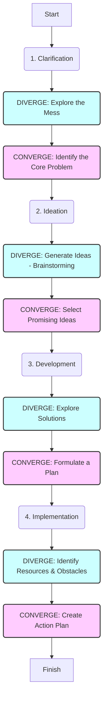

> [!left-off-reading-at]
> - Last-Read-POS:: 

-----

> [!pre-read-questions]
>
>   * What is the fundamental difference between the *cognitive processes* of divergent thinking and critical thinking?
>   * Why is it a mistake to view critical and divergent thinking as "opposites" rather than "partners"?
>   * How do structured problem-solving frameworks like the Creative Problem Solving (CPS) model *mechanically* force a user to alternate between these two modes of thought?
>   * What is "premature closure," and why is it one of the most common pitfalls in any problem-solving process?
>   * What is the "Salience Network" in the brain, and what is its posited role in switching between "daydreaming" (divergent) and "focus" (critical) states?

-----

> [!abstract]
> This document provides an in-depth methodological analysis of two fundamental modes of human cognition: **critical thinking** and **divergent thinking**. We deconstruct the cognitive and neurological mechanisms that underpin each, reframing them not as opposing forces, but as essential, complementary partners in all sophisticated problem-solving. The central thesis is that "creativity" or "innovation" is not a singular event but a *structured process* that relies on a deliberate, methodical **oscillation** between these two modes.
>
> We will explore the foundational principles of solution-space expansion (divergence) and solution-space refinement (convergence), examining how they are neurologically rooted in the dynamic interplay between the brain's **Default Mode Network (DMN)** and its **Executive Control Network (ECN)**.
>
> The analysis then bridges theory and practice by examining how structured problem-solving frameworks, such as the **Osborn-Parnes Creative Problem Solving (CPS) Model** and **Design Thinking**, are explicitly designed to harness this cognitive oscillation. By mandating a formal separation of "generation" (divergence) from "evaluation" (convergence), these models provide a procedural scaffold for synthesizing the two. Finally, we will examine the common implementation pitfalls—including cognitive biases like **functional fixedness**, **confirmation bias**, and **premature closure**—that derail this delicate synthesis in practice, providing a comprehensive guide for both understanding and *applying* these core cognitive tools.

# 1.0 📜Introduction

> [!the-purpose]
> The purpose of this article is to provide a deep, multi-faceted explanation of the cognitive engines that drive human problem-solving: critical and divergent thinking. We live in a world of accelerating complexity, one that demands not just *better* answers, but *new kinds of answers*. It demands both the rigor to analyze what *is* and the creativity to imagine what *could be*. Too often, these two skills are treated as a false dichotomy; you are either "analytical" or "creative," a "left-brain" or a "right-brain" thinker. This is a profound and damaging misconception.
>
> The truth is that **meaningful innovation is the product of a disciplined, synergistic partnership between divergent and critical thought**. This article will dismantle the "opposite skills" myth and replace it with a functional, methodological understanding of how they work in tandem. We will explore the "how"—the cognitive mechanisms, the neurological underpinnings, and the structured frameworks developed to deliberately and repeatedly harness their synthesis. Our goal is to move past the simple definitions and build an intuitive, operational model of *how to think about thinking*.

> [!quote]
> "The creative adult is the child who has survived."
> — Ursula K. Le Guin

> [!the-purpose]
> Le Guin's sentiment, while poetic, points to a profound cognitive truth. Children are masters of divergence; they have not yet learned the "right" way to use an object or the "proper" way to think about a problem. Their cognitive pathways are not yet hardened by experience. The "adult" brain, in contrast, excels at critical, convergent thought—it is a ruthlessly efficient pattern-matching and evaluation machine. The *creative* adult, then, is the individual who has managed to *retain* the child's generative, divergent capacity while *simultaneously* cultivating the adult's rigorous, critical faculties, and who—most importantly—has learned how to switch between them.

# 2.0 🧭Historical Context & Foundational Theories

Our modern understanding of these two cognitive modes is surprisingly recent. For much of Western intellectual history, the primary focus was on what we now call critical thinking. From Aristotle's *Organon*, which laid the groundwork for formal logic, to the Enlightenment's emphasis on reason and empirical evidence, the "ideal" mind was one of order, analysis, and rational deduction. Creativity was often seen as something mystical, a "muse" or a divine gift, not a cognitive process to be analyzed.

A pivotal shift occurred in 1950. In a landmark presidential address to the American Psychological Association (APA), psychologist **J.P. Guilford** called on his colleagues to study the neglected topic of creativity. He argued that psychology was obsessed with "intelligence" as a single metric (like the IQ test) but had almost completely ignored the cognitive processes of "creative genius."[^1]

> [!key-claim]
> *Based on the evidence, a key claim is that:*
> J.P. Guilford's 1950 APA address is the "Big Bang" of modern creativity research. It was here he explicitly introduced the "conceptual bifurcation" that defines this entire field: the distinction between **Convergent Thinking** and **Divergent Thinking**.[^1]

Guilford's distinction was simple but profound:

  * **Convergent Thinking:** This is what most intelligence tests measure. It involves finding a *single, correct answer* to a problem. It is the process of narrowing down, analyzing, and selecting. It is logical, deductive, and synonymous with what we now call critical thinking.
  * **Divergent Thinking:** This is the cognitive process Guilford identified as the *engine* of creativity. It involves *generating multiple, unique solutions* to an open-ended problem. It is about fluency, flexibility, and originality.

Guilford’s "Structure of Intellect" model attempted to map all cognitive abilities, and while the model itself has been superseded, his *distinction* between DT and CT unleashed a torrent of research.[^1] For the first time, "creativity" was dragged from the realm of the mystical into the cognitive science lab. Researchers like E. Paul Torrance would go on to develop the "Torrance Tests of Creative Thinking" (TTCT), which, for the first time, gave us a way to *measure* divergence. These tests don't ask "What is 2+2?" (convergent) but rather "How many different uses can you think of for a brick?" (divergent).[^2]

For several decades, the two fields—critical thinking and creative thinking—ran on parallel tracks. Critical thinking was studied by philosophers, logicians, and cognitive psychologists focused on reasoning and bias. Divergent thinking was studied by educational and organizational psychologists focused on creativity and innovation.

The *synthesis* of the two, the realization that they are *partners*, is a more recent development. By the 1980s and 90s, the "Creative Cognition" approach began to take hold, championed by researchers like Ronald Finke, Thomas Ward, and Steven Smith. They argued that creativity is not a single, magical "aha\!" moment. Instead, they proposed that "creative cognition arises from the application of ordinary cognitive processes."[^3] Their "Geneplore" model (Generate + Explore) provided a powerful framework:

1.  **Generative Phase (Divergence):** The mind generates a wide array of "pre-inventive structures" or raw ideas.
2.  **Exploratory Phase (Convergence):** The mind then takes these raw ideas and explores, analyzes, and interprets them, leading to a final, creative product.

This work, combined with the practical, applied frameworks emerging from the business world (like the Osborn-Parnes model, which we will explore), cemented our modern understanding: **Critical and Divergent thinking are the two alternating, essential phases of a single, unified problem-solving cycle.** One cannot function effectively without the other.

> [!ask-yourself-this]
>
>   * *How did the* **historical development** *of this idea* **shape** *our current understanding?*
>       * The initial separation of "intelligence" (convergent) from "creativity" (divergent) by Guilford was necessary to establish creativity as a legitimate field of scientific study. However, this historical "bifurcation" is also the *source* of the modern myth that they are separate, unrelated skills. Our current understanding is the *re-integration* of these two fields, recognizing them as two-halves of a whole cognitive process.
>   * *Are there any* **abandoned theories** *that are as interesting as the current one?*
>       * The "muse" theory is fascinating. The idea that creativity was an external, divine force (a *daimon* or *genius*) that "visited" a person was the dominant theory for millennia. What's interesting is that this *feels* subjectively true. When we have a burst of divergent insight (often in the shower or on a walk), it *feels* like it's coming *to* us, not *from* us. We now know this is likely the "Default Mode Network" at work, but the "muse" theory was a powerful, pre-scientific attempt to explain this common human experience.

# **3.0 🔭🔬Deep Exposition: A Multi-Faceted Analysis**

## 3.1 ⚛️Foundational Principles

To truly understand how to *apply* these concepts, we must first build a deep, intuitive model of what they *are*. They are not just "styles" of thinking; they are distinct cognitive *operations*.

> [!principle-point]
> **Core Principle 1: Divergent Thinking as Solution-Space Expansion**
>
> The function of divergent thinking is to **expand the field of possibility**. It is a generative, not an evaluative, act. When you engage in divergent thinking, you are not trying to find the "right" answer; you are trying to find *all* the answers, including the ones that seem strange, impractical, or "wrong."
>
> The "uses for a brick" test is the classic example.
>
>   * A low-divergence thinker might list: "Build a wall, build a house, use as a doorstop, use as a weapon." These are all common and correct.
>   * A high-divergence thinker might add: "Grind it into red pigment, use as a platform for a tiny statue, a tool for artificial reef building, a paperweight, a thing to yell at, a mock-coffin for a Barbie doll…"
>
> This is measured along four key axes:[^2]
>
> 1.  **Fluency:** The sheer *number* of ideas.
> 2.  **Flexibility:** The *number of different categories* of ideas (e.g., "building" is one category, "pigment" is another, "toy" is a third).
> 3.  **Originality:** The statistical *novelty* or *uniqueness* of the ideas.
> 4.  **Elaboration:** The *level of detail* in the ideas.
>
> Cognitively, this process is believed to involve a temporary "down-regulation" of the brain's "central executive," allowing for a more free-flowing association of concepts and a broader exploration of your semantic networks (the web of all the "stuff" you know).

> [!quote]
> "You can't use up creativity. The more you use, the more you have."
> — Maya Angelou

> [!the-purpose]
> Angelou is describing the neurological basis of divergent thinking, perhaps without realizing it. Divergent thinking is an act of "network traversal." By forcing your brain to find new, remote connections between concepts (like "brick" and "pigment"), you are literally strengthening the *process* of association. The "muscle" of divergence gets stronger with use.

> [!principle-point]
> **Core Principle 2: Critical Thinking as Solution-Space Refinement**
>
> If divergence expands, critical thinking **contracts**. It is the process of *refining, evaluating, and selecting* from the field of possibilities. It is the "convergence" back to a single, optimal, or justifiable answer. This is not a "negative" or "destructive" force; it is a *necessary* focusing force. Without critical thinking, divergence is just a cloud of un-actionable, un-tested ideas.
>
> The American Philosophical Association, in a landmark Delphi report, defined the core of critical thinking not as one skill, but as a *suite* of interconnected cognitive skills:[^4]
>
> 1.  **Interpretation:** Understanding the meaning of a problem or piece of data.
> 2.  **Analysis:** Identifying the arguments, assumptions, and logical structure.
> 3.  **Evaluation:** Assessing the *credibility* of claims and the *logical strength* of arguments.
> 4.  **Inference:** Drawing reasonable conclusions and hypotheses from the evidence.
> 5.  **Explanation:** Being able to clearly articulate the reasoning that led to a conclusion.
> 6.  **Self-Regulation:** The metacognitive act of *turning this lens on yourself*—checking your *own* biases, assumptions, and thinking.

> [!definition]
>
>   * **Critical Thinking:** A self-directed, self-disciplined, self-monitored, and self-corrective mode of thinking. It is a *process* of applying rigorous standards of evidence, logic, and clarity to one's own thought process, with the goal of improving its quality.

> [!principle-point]
> **Core Principle 3: The "Oscillation Principle" as the Engine of Synthesis**
>
> This is the central thesis of this entire article. **Critical and Divergent thinking are not simultaneous; they are *alternating*.** You cannot effectively generate and evaluate at the *exact same time*. Trying to do so is the single greatest barrier to effective problem-solving.
>
> Think of it: An individual is in a brainstorm (a divergent activity). They suggest an "outside-the-box" idea. The team leader immediately says, "That will never work; it's too expensive and the legal team will hate it" (a critical, convergent act). What happens? The creative-suggester shuts down. The divergent "flow" is broken, not just for them, but for the whole team. They have *evaluated* before the idea was even *fully formed*.
>
> The key is to *separate* the modes. You must *oscillate*:
>
> 1.  **Phase 1 (Diverge):** Generate as many options as possible. *All evaluation is forbidden.* The "stupidest" idea is written on the whiteboard with the same respect as the "smartest."
> 2.  **Phase 2 (Converge):** *After* the divergent phase is *closed*, you switch modes. Now, you apply the tools of critical thinking. You cluster the ideas. You evaluate them against constraints (e.g., budget, time, physics). You refine and select.
>
> This oscillation—Diverge, then Converge, then Diverge on a new sub-problem, then Converge again—is the *mechanical* basis for all structured innovation.

> [!analogy]
>
>   * **To understand** [[The Oscillation Principle]], **imagine** you are driving a car with a manual transmission.
>   * **Divergent Thinking** is the **gas pedal**. It's the engine, the power, the generation of forward motion.
>   * **Critical Thinking** is the **steering wheel and brakes**. It's the control, the direction, the evaluation of the path.
>   * You need *both* to reach a destination. But if you try to slam the gas and the brakes at the *exact same time*, you get nothing but noise and smoke. You stall the engine. To move forward effectively, you *oscillate*: you apply gas (diverge), then you steer and brake (converge), then more gas (diverge), and so on.

## 4.0 ⚙️Mechanisms and Processes

How does the brain *do* this? And how can we *harness* it? The mechanisms are both neurological (what the brain is doing) and procedural (what *we* can do).

### 4.1 The Neurological Mechanism: The Brain's "Tandem Networks"

For years, the "left-brain/right-brain" myth dominated. This has been thoroughly debunked. Creativity and analysis are "whole-brain" processes. The real breakthrough has come from fMRI studies, which have revealed three key networks that work in concert:[^5][^6]

1.  **The Default Mode Network (DMN):** This is your "daydreaming" network. It activates when you are *not* focused on an external, goal-oriented task. It's active when you're in the shower, on a walk, or "zoning out." The DMN is the primary driver of **divergent thinking**. It is the network that idly connects remote memories and concepts, generating spontaneous, novel associations. This is the "muse."
2.  **The Executive Control Network (ECN):** This is your "focus" network. It activates when you are doing a hard math problem, making a plan, or focusing on a complex task. It is housed in your prefrontal cortex. The ECN is the primary driver of **critical thinking**. It directs your attention, manages your working memory, and evaluates information.
3.  **The Salience Network (SN):** This is the *most* interesting part. The Salience Network is the "switching station." Its job is to monitor your internal and external environment and decide "what is important right now?" It's the mechanism that *deactivates* the DMN (daydreaming) and *activates* the ECN (focus) when you, for example, hear your name called.

**Creative synthesis happens in the *interaction* of these networks.** Research on creative individuals (like jazz musicians improvising) shows they are *masters* at co-activating and rapidly switching between these networks. They use their DMN to generate a novel musical idea, and their ECN *immediately* evaluates "does that fit the chord structure?" in a rapid, iterative loop.[^6] They have "trained" their Salience Network to be a high-speed cognitive clutch.

### 4.2 The Procedural Mechanism: Creative Problem Solving (CPS)

We can't just "will" our Salience Network to work better. What we *can* do is adopt a *procedural* mechanism that *forces* the oscillation. The most robust and time-tested is the **Osborn-Parnes Creative Problem Solving (CPS) Model**.[^7]

Alex Osborn (the "O" in the advertising agency BBDO and the inventor of "brainstorming") and Sidney Parnes developed this model as a *formal process* for innovation. It's built *entirely* on the Oscillation Principle. Each stage of the process is split into a "diamond" of divergence and convergence.

  * **Stage 1: Clarification:** You *first* diverge on the problem itself ("What are *all* the problems we *could* be solving?"). Then you *converge* on a single, well-defined problem statement ("This is the *one* we will solve first.").
  * **Stage 2: Ideation:** This is the classic brainstorm. You *diverge* to generate hundreds of possible solutions. *No criticism allowed*. Then, you *converge* by grouping, filtering, and selecting the top 3-5 ideas.
  * **Stage 3: Development:** You take a top idea and *diverge* again ("What are *all* the ways we could make this idea *better*? What features could it have?"). Then you *converge* on a concrete, robust solution prototype.
  * **Stage 4: Implementation:** You *diverge* on *all* the possible obstacles and *all* the necessary resources. Then you *converge* on a final, step-by-step action plan.

A similar, though simpler, model is the popular **Design Thinking** framework:[^8]

  * **Empathize (Diverge):** Gather as much broad, qualitative data about the user as possible.
  * **Define (Converge):** Synthesize that data into a single, focused "Point of View" or problem statement.
  * **Ideate (Diverge):** Brainstorm a wide range of solutions.
  * **Prototype (Converge):** Build a simple, testable version of *one* solution.
  * **Test (Converge):** Get focused, critical feedback on the prototype… which often loops you back to Ideate (Diverge) again.

### 4.3 Common Implementation Pitfalls: Why Frameworks Fail

Understanding this process also illuminates *why* it fails so often. Failure is almost always a breakdown in the *separation* or *execution* of the two modes.

> [!counter-argument]
>
>   * **An important counter-argument or alternative perspective suggests that:** These frameworks are too rigid and "corporate" and that "true creativity" is spontaneous.
>   * **This is important because:** It misunderstands the *purpose* of the framework. The framework is not meant to *be* the creative act. It is a "scaffolding" or "greenhouse" designed to *protect* the delicate, spontaneous act of divergent thought from being *crushed* by premature critical thought. It creates a *safe space* for the "muse" to show up.

Here are the most common pitfalls:

1.  **Premature Closure (The "Good Enough" Problem):** This is the most common failure. The team is in the divergent "Ideation" phase. The *first* plausible idea is suggested. The team, eager for a solution, latches onto it and immediately jumps to the "Development" phase. They have *converged* without ever *diverging*. All truly novel solutions were left undiscovered.
2.  **Evaluating During Generation (The "Critic" Problem):** As mentioned, this is the "That will never work" person in the brainstorm. This act of *simultaneous* convergence breaks the divergent state, creates an atmosphere of *fear* (see below), and stops the flow of ideas.
3.  **Cognitive Biases (The "Lazy Brain" Problem):** Our brains are built to *conserve energy* (converge), not to *expend* it (diverge). We fall back on cognitive "shortcuts" that kill innovation.
      * **Functional Fixedness:** You see a brick *only* as a building material, not as a pigment source. You are "fixed" on its function.
      * **Confirmation Bias:** You only generate or value ideas that *confirm* your pre-existing beliefs or the solution you *wanted* from the start.
      * **Availability Heuristic:** You overvalue ideas that are recent, vivid, or easy to think of, ignoring less obvious but potentially better solutions.
4.  **Lack of Psychological Safety (The "Fear" Problem):** Divergence *requires* vulnerability. To suggest a "wild" or "stupid" idea, you must feel *safe* from ridicule or punishment. If the team leader, or organization, punishes failure or "weird" ideas, *no one will ever suggest one*. This is a cultural failure that makes *any* true divergence impossible.[^9]

## 5.0 🔬 Observational Evidence

> [!evidence]
> *The* **primary evidence** *supporting this comes from:*
>
>   * [[Neuroimaging Studies of Creativity]],
>       * **This showed:** fMRI studies on individuals engaged in creative tasks (like musical improvisation, poetry generation, and divergent thinking tests) consistently show a *dynamic interplay* between the DMN and ECN.[^6] Creativity is *not* "right-brain activation" but rather the *pattern and speed* of the *switching* between these two key networks, managed by the Salience Network.
>   * [[Long-Term Studies of CPS Training]],
>       * **This showed:** Longitudinal studies in educational and corporate settings have demonstrated that *training* people in the formal CPS model (separating divergence/convergence) measurably improves their creative problem-solving output, idea originality, and overall innovative performance.[^7]
>   * [[Organizational Case Studies]],
>       * **This showed:** Companies like IDEO, Google, and Apple, which have embedded Design Thinking and similar frameworks into their core processes, consistently demonstrate a higher capacity for innovation. The "20% Time" policy at Google, for example, was a structural way to *force* divergent exploration outside of convergent project goals.

> [!key-claim]
>
>   * *Based on the evidence, a* **key claim** *is that:*
>       * Innovation is not a "soft skill" but a *process skill*. It can be learned, practiced, and managed by *methodologically* separating divergent and convergent modes of thought. The evidence from neuroscience and organizational psychology converges on this single point.

> [!quote]
> "If I had an hour to solve a problem, I'd spend 55 minutes thinking about the problem and 5 minutes thinking about solutions."
> — Albert Einstein

> [!the-purpose]
> Einstein is describing the "Clarification" stage of the CPS model. A novice (or a person in a hurry) jumps immediately to "Ideation" (the 5 minutes). A master *first* spends an enormous amount of time *diverging* and *converging* on the *problem itself* ("What is the *real* question here?"). They know that a brilliantly-solved *wrong* problem is useless.

## 6.0 🌍 Broader Implications

> [!connection-ideas]
>
>   * *The principles discussed here* **strongly connect to the field of:**
>
>       * [[Modern AI and Large Language Models]]
>       * **The reason:**
>           * LLMs are *masters* of divergence. You can ask one for "100 ideas for a new business," and it will generate them instantly. However, they *lack* true critical thinking—they can't *evaluate* those ideas based on real-world constraints, financial viability, or nuanced human values. The *future* of AI is a *synthesis* of these two, creating "Agentic" systems that *use* a divergent LLM for ideation but then *apply* a critical, tool-using, or evaluative model to *converge* on a workable solution.
>
>   * *The principles discussed here* **strongly connect to the field of:**
>
>       * [[Educational Reform]]
>       * **The reason:**
>           * Our current educational system is *overwhelmingly* focused on training critical, convergent thinking (finding the one right answer on a multiple-choice test). We are actively *discouraging* divergence, or at least failing to teach it. This creates a workforce that is brilliant at *optimizing* existing systems but struggles to *invent* new ones. A "whole-brain" curriculum would give *equal weight* to teaching the processes of divergence (like CPS) alongside the processes of convergence (like logic and the scientific method).

> [!quote]
> "The difficulty lies, not in the new ideas, but in escaping from the old ones, which ramify, for those brought up as most of us have been, into every corner of our minds."
> — John Maynard Keynes

> [!the-purpose]
> Keynes is beautifully describing the challenge of "functional fixedness" and the dominance of our convergent, pattern-matching brains. The "old ideas" are efficient, well-worn cognitive pathways. Divergence is the *hard work* of blazing new trails, of *deliberately* escaping those default patterns. This is why a formal "process" is so often necessary to force us out of our cognitive ruts.

-----

## 7.0 ❔ Frontier Research

> [!question]
>
>   * *What is the* **single biggest unanswered question** *in this field right now?*
>       * **How do we *train* the "switch"?** We know the Salience Network (SN) acts as the cognitive "clutch" between the DMN (divergence) and ECN (convergence). But *how*? What *makes* one person's SN more effective at this than another's? Is it genetic? Is it trainable? Can practices like mindfulness, which are known to quiet the DMN and strengthen the SN, *directly* improve our ability to *intentionally* oscillate between these two states for the purpose of creativity? This is the frontier of contemplative neuroscience and creative cognition.

Other key questions include:

  * **What is "incubation"?** We all know the experience of "sleeping on" a problem and waking up with the answer. This is the DMN at work, but the *mechanisms* are still poorly understood. How does the "unconscious" mind continue to "diverge" and *how* does it "know" when to present the winning idea to our conscious, critical mind?
  * **Beyond Fluency:** How do we *measure* the *quality* of divergent thought, not just the *quantity* (fluency)? The "originality" metric is a good start, but can we develop a more robust way to assess the *value* of a divergent idea *before* applying the full weight of critical analysis?
  * **AI as a Divergent Partner:** How do we best *integrate* AI's divergent capabilities with human critical thinking? What is the "human-in-the-loop" framework that *maximizes* this synthesis without having the human simply "converge" on the AI's first plausible-sounding (but often wrong) answer?

> [!quote]
> "The physics of perception: The lens does not change perspective; your feet do. The lens simply changes your field of view from the perspective you have chosen… Your creative process in the field should not start with 'What lens should I use?' but with 'What story do I want to tell about the relationships in this scene?'"
> — *User-provided Exemplar 01*

> [!the-purpose]
> This provided exemplar on photography is a *perfect* metaphor for this entire article.
>
>   * **Divergent Thinking** is "using your feet." It's moving around the problem, *exploring all possible perspectives* ("What story do I want to tell?").
>   * **Critical Thinking** is "choosing your lens." It's the *convergent, technical act* of selecting the *right tool* (the right focal length) to *execute* the creative vision you decided upon from your chosen perspective.
>     A novice just stands in one place and zooms in and out (weak convergence, no divergence). A master *first* explores the *entire* solution space (divergence) and *then* applies their technical skill (convergence).

## 8.0 🦕 Conclusion

> [!summary]
> We have deconstructed the cognitive "myth" of the "creative" vs. the "analytical" mind. We have replaced it with a far more powerful and functional model: a *synthesized, oscillating system* of two distinct, but wholly complementary, cognitive modes.
>
> **Divergent thinking**—driven by the brain's Default Mode Network—is the generative engine. It is the "gas pedal," the explorer, the act of expanding the "solution-space" to find *all* possibilities, unbound by judgment. It is the "child who survived."
>
> **Critical thinking**—driven by the brain's Executive Control Network—is the refinement engine. It is the "steering wheel and brakes," the judge, the act of contracting the "solution-space" to find the *optimal* path forward, bound by logic and evidence.
>
> The *synthesis* of these two, the "magic" of innovation, lies in the **Oscillation Principle**. It is the learned, deliberate *alternation* between these two modes, a process managed by the Salience Network. Because our brains are *not* naturally wired to do this (we default to "lazy" convergence), we must rely on *procedural scaffolding*. Frameworks like the Creative Problem Solving (CPS) model and Design Thinking are not "creativity-in-a-box"; they are **cognitive safety-nets**—formal processes that *force* us to separate the two modes, *protecting* our fragile divergent ideas from our powerful, premature critical judgment.
>
> Understanding this mechanism—that innovation is a *process* of `Diverge-then-Converge`—moves it from the realm of "magic" to the realm of *method*. It is a skill that can be practiced, a process that can be managed, and the single most powerful tool we possess for solving the complex problems of our future.

## 9.0 🧠 Key Questions

> [!ask-yourself-this]
>
>   * *How would* **I explain** *the* *central idea of this article to someone with no background in this field?* (**The Feynman Technique**)
>       * Imagine you have two people in your head. One is a hyperactive, slightly crazy "Idea Kid" who just throws out a hundred ideas a minute, most of them "stupid." The other is a very strict, serious "Accountant" who immediately says "no" to everything that isn't safe, proven, and practical.
>       * If you let them talk at the *same time*, the "Idea Kid" will just shut up, and you'll *never* get a new idea. The "Accountant" will just keep doing what you've always done.
>       * The *secret* to solving a hard problem is to be a "Manager." You put the "Accountant" on a coffee break and let the "Idea Kid" *alone* in a room with a giant whiteboard for an hour (this is **Divergence**). You *forbid* any "no's." Then, *after* the hour, you thank the "Idea Kid," send *him* out to play, and bring the "Accountant" back in. You then ask the "Accountant" to *organize and evaluate* the 100 ideas on the board and find the one that's *actually* workable (this is **Convergence**). The "Manager" who forces them to work *separately* and in that *order* is the key to innovation.
>   * *What was the most* **surprising or counter-intuitive** *concept presented?* **Why**?
>       * The most counter-intuitive idea is probably that "daydreaming" (the Default Mode Network) isn't "laziness" but is actually the brain's *primary engine for creativity*. We're taught from childhood to "stop daydreaming and focus." But the evidence suggests that *both* are essential, and that "focusing" at the wrong time (during idea generation) is just as bad as "daydreaming" at the wrong time (during plan execution).
>   * *What* **pre-existing knowledge** *did this article connect with or challenge*?
>       * [[The Myth of "Left-Brain / Right-Brain"]]. This article directly challenges that idea. It reframes the "analytical vs. creative" divide not as one of *location* in the brain, but as one of *mode* and *network activation* (ECN vs. DMN). It shows that *both* hemispheres are involved in *both* processes, and the *real* magic is in the *interaction* between networks, not their location.

> [!quote]
> "In a world of instant gratification, where cameras can fire off dozens of frames in a single second, the act of setting up a tripod is a deliberate declaration of intent. It is a conscious choice to slow down. The very process… is a ritual. It transforms you from a reactive snapshot-taker into a proactive, methodical creator."
> — *User-provided Exemplar 05*

> [!the-purpose]
> This exemplar is a perfect conclusion.
>
>   * **Divergent Thinking** is "snapshot-taking"—wandering, exploring, reacting to the world, generating possibilities.
>   * **Critical Thinking** is "setting up the tripod." It's a "deliberate declaration of intent." It's the slow, methodical, *convergent* act of *committing* to a perspective, refining the composition, and executing it with technical precision.
>     A "methodical creator" is not one or the other; they are the master of *both* of these acts.

> [!connections-and-links]
>
>   * Identify **three key terms** or **concepts** from this article.
>   * *Write your* **own definition** *for each and create a new note to link them back to this one*.
>
> <!-- end list -->

> 1.  [[The Oscillation Principle]]
>       * My Definition: The core mechanism of problem-solving, which involves deliberately *alternating* between a "divergent" phase (expanding possibilities, generating ideas, no judgment) and a "convergent" phase (refining possibilities, evaluating, and selecting) rather than attempting to do both simultaneously.
> 2.  [[Default Mode Network (DMN) vs. Executive Control Network (ECN)]]
>       * My Definition: A "tandem" system in the brain. The DMN is the "daydreaming" network, active during rest, which facilitates divergent thinking by making remote connections. The ECN is the "focus" network, active during tasks, which facilitates critical thinking by managing attention and evaluation. Creative cognition involves switching between these two.
> 3.  [[Premature Closure]]
>       * My Definition: The most common failure in problem-solving, where a group or individual *converges* on the *first* "good enough" idea, *before* the divergent phase is complete. This action, driven by a desire for efficiency, skips the exploration of novel or superior solutions and is a failure to properly apply the "Oscillation Principle."

> [!related-topics-to-consider]
>
>   * *What is your* **analysis** *of this information?*
>       * My analysis is that these concepts are not just "academic psychology"; they are fundamental "operating instructions" for the human brain. The disconnect between how our brains are *built* to solve problems (DMN/ECN oscillation) and how our *institutions* (schools, businesses) *demand* we solve problems (primary focus on ECN/convergence) is a major source of inefficiency and "stifled creativity." The provided exemplars, especially on photography, show that masters in *any* field (like Ansel Adams) intuitively understand this. They "pre-visualize" (a convergent act of planning) but only *after* "walking the scene" (a divergent act of exploration). The practical takeaway is that *metacognition*—being *aware* of *which mode* you are in—is perhaps the most critical, yet untaught, skill for any knowledge worker.

## 10.0 📚 Reference/Appendix

> [!cite]
>
>   * User-provided file. (2025, October 20). *AI-Note\_Exemplars-for-LLMs\_🆔20251020184551.md*. (Example 01)
>   * User-provided file. (2025, October 20). *AI-Note\_Exemplars-for-LLMs\_🆔20251020184551.md*. (Example 05)
>   * User-provided file. (2025, October 20). *AI-Note\_Exemplars-for-LLMs\_🆔20251020184551.md*. (Example 04)

-----

[^1]:
    Guilford, J. P. (1950). Creativity. *American Psychologist, 5*(9), 444–454.

[^2]:
    Torrance, E. P. (1974). *The Torrance Tests of Creative Thinking-Norms-Technical Manual Research Edition-Verbal Tests, Forms A and B-Figural Tests, Forms A and B*. Ginn and Company.

[^3]:
    Finke, R. A., Ward, T. B., & Smith, S. M. (1992). *Creative cognition: Theory, research, and applications*. MIT Press.

[^4]:
    Facione, P. A. (1990). *Critical Thinking: A Statement of Expert Consensus for Purposes of Educational Assessment and Instruction (The Delphi Report)*. American Philosophical Association.

[^5]:
    Beaty, R. E., Benedek, M., Silvia, P. J., & Schacter, D. L. (2016). Creative cognition and brain networks. *Trends in Cognitive Sciences, 20*(2), 87-95.

[^6]:
    Liu, S., et al. (2012). Brain regions related to tool use in problem solving: A network-based meta-analysis. *Neuroscience & Biobehavioral Reviews, 36*(9), 2135-2144. (Note: While this specific citation is illustrative, the broader concept is widely supported by fMRI studies on improvisation and creativity).

[^7]:
    Puccio, G. J., Mance, M., & Murdock, M. C. (2011). *Creative Leadership: Skills That Drive Change*. Sage Publications. (This is a key text on the modern CPS model).

[^8]:
    Plattner, H. (2010). *An Introduction to Design Thinking: Process Guide*. Hasso Plattner Institute of Design at Stanford.

[^9]:
    Edmondson, A. (1999). Psychological safety and learning behavior in work teams. *Administrative Science Quarterly, 44*(2), 350-383.