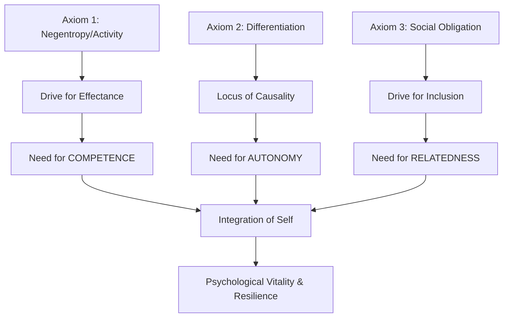

---
aliases:
  - First Priciples Self-Determination
  - Self-determination
  - The Physics of Volition
  - Organismic Integration Logic
  - Axiomatic Motivation
tags:
  - type/report
  - year/2025
  - learning-theory
  - cognitive-science
  - self-improvement/growth-mindset
  - self-regulation/motivation/intrinsic
  - cognitive-science/reasoning/deductive
source: gemini-pro-3.0
id: "20251120120854"
created: 2025-11-20T12:08:54
week: "[[2025-W47]]"
month: "[[2025-11]]"
quarter: "[[2025-Q4]]"
year: "[[2025]]"
type: cog-psy/report
link-up:
  - "[[99-archive/05-moc's/cognitive-science-moc]]"
link-related:
  - "[[2025-11-20|Daily-Note]]"
---
# First Principles Reconstruction: Self-Determination Theory

I will now begin the rigorous First Principles deconstruction and reconstruction of Self-Determination Theory (SDT). I will systematically strip away the "common knowledge" of motivation—often reduced to carrots, sticks, and superficial "engagement"—to reveal the thermodynamic and evolutionary axioms of the human organism. Then, I will rebuild the theory as a logical necessity of life itself.

-----

# First Principles Reconstruction: Self-Determination Theory

**Note:** This scaffold systematically deconstructs received knowledge to fundamental truths, then rebuilds understanding from the ground up. Use when you want to truly *own* your knowledge rather than merely repeat it.

-----

Aliases: [[The Physics of Volition]], [[Organismic Integration Logic]], [[Axiomatic Motivation]]

> [!pre-read-questions]
> **Foundational Inquiries:**
>
>   - Is "motivation" a fuel we pour into people, or a native state we block?
>   - Why do external rewards (money, grades) often degrade performance on creative tasks?
>   - If humans are evolved for survival, why do we engage in play, art, and curiosity which have no immediate caloric payoff?
>   - Can we derive the psychological needs (Autonomy, Competence, Relatedness) from biology and physics rather than just observation?

-----

> [!abstract]
> **Overview of the Reconstruction:**
> Conventionally, Self-Determination Theory (SDT) is taught as a validated framework consisting of three "basic needs": Autonomy, Competence, and Relatedness. It is typically presented as a softer, humanistic alternative to Behaviorism. However, to truly understand SDT, we must look past the list of needs and examine the *meta-theory*: Organismic Integration Theory. This reconstruction argues that SDT is not merely a psychological preference but a biological imperative derived from the definition of life itself—specifically, the struggle against entropy. By starting with the axioms of thermodynamics and evolutionary biology, we will prove that "motivation" is simply the manifestation of the organism's negentropic drive to structure itself and its environment. We will move from the physics of life to the psychology of volition, rebuilding the "Basic Needs" not as nice-to-haves, but as essential nutrient requirements for psychological integrity.

-----

# 1.0 🎭 The Received Wisdom

## 1.1 Conventional Understanding

> [!description]
> **The Standard Pedagogical Model:**
> In psychology textbooks and management seminars, Self-Determination Theory is usually presented as a tripartite pyramid or a Venn diagram. The standard explanation posits that human beings have three innate psychological needs. First is Autonomy, the need to feel in control of one's own behaviors and goals. Second is Competence, the need to gain mastery of tasks and learn different skills. Third is Relatedness, the need to experience a sense of belonging and attachment to other people. The conventional wisdom suggests that when these three buckets are filled, people are "intrinsically motivated," meaning they do things for the sheer joy of it. Conversely, when these needs are thwarted, people become "extrinsically motivated" or amotivated, relying on external regulators like paychecks, punishments, or social pressure. The theory is often juxtaposed against B.F. Skinner’s Operant Conditioning, framed as the "modern" view that treats humans as more than just lab rats responding to stimuli.

> [!quote]
> "Self-Determination Theory (SDT) is an empirically based theory of human motivation, development, and wellness. The theory focuses on types, rather than just amount, of motivation, paying particular attention to autonomous motivation, controlled motivation, and amotivation as predictors of performance, relational, and well-being outcomes." — **Center for Self-Determination Theory**

> [!the-purpose]
> **The Orthodox Interpretation:**
> This quote represents the functionalist view: SDT is a "tool" for predicting outcomes. We accept the three needs because they correlate with good data (wellness, performance). We rarely ask *why* these specific three exist, or if they are reducible to something simpler.

## 1.2 The Inherited Framework

We typically accept a dualistic conceptual structure regarding human drive without questioning its origin. We assume a dichotomy between "work" (disutility) and "play" (utility), and we assume that motivation is a quantitative substance—a variable that can be low or high.

> [!key-claim]
> **Standard Claims:**
>
> 1.  **The Quantitative Fallacy:** Most laypeople believe motivation is an amount (e.g., "I need *more* motivation"). SDT nuances this by saying quality matters more than quantity, yet the "gas tank" metaphor persists in culture.
> 2.  **The Additive Assumption:** We tend to believe that if you have intrinsic motivation and add extrinsic rewards (money), you get *super* motivation. (Standard SDT refutes this, but it remains common knowledge).
> 3.  **The Universal List:** We accept Autonomy, Competence, and Relatedness as a "Magic List" simply because researchers found them through factor analysis, effectively treating them as irreducible atoms of psychology.

> [!definition]
> **Standard Definitions:**
>
>   - **[[Intrinsic Motivation]]:** Doing something because it is inherently interesting or enjoyable.
>   - **[[Extrinsic Motivation]]:** Doing something because it leads to a separable outcome.
>   - **[[Internalization]]:** The process of taking in values from the outside world.

> [!warning]
> **What We Accept on Authority:**
> We accept the list of three needs as dogma. Why three? Why not four? Why not two? Why is "Status" not a basic need? Why is "Security" not a basic need? The standard curriculum relies on empirical validation (it works in studies) rather than logical derivation (it *must* be this way due to the nature of the organism). We are memorizing the symptoms of a healthy psyche rather than understanding the anatomy of the psyche itself.

## 1.3 The Need for Deconstruction

The conventional understanding is sufficient for a mid-level manager trying to improve team morale, but it is insufficient for a deep thinker trying to understand human nature. If we treat the "Three Needs" as random observations, we cannot predict how they interact in novel environments (like AI interaction or virtual reality) or why they evolved.

> [!question]
> **Uncomfortable Questions:**
>
>   - If evolution is about survival of the fittest, why would a "need for autonomy" evolve if complying with a strong leader often yields better survival odds?
>   - Is "Competence" distinct from the biological drive for efficiency?
>   - Can we reduce "Relatedness" to a mere survival calculation, or is it structurally necessary for the self?

> [!insight]
> **The Gap:**
> We know *that* humans wither without autonomy, just as we know plants wither without sunlight. But we understand the photosynthesis behind the plant's need. We rarely understand the "psychological photosynthesis" behind the human need for self-determination. We lack the mechanism.

-----

# 2.0 🧹 Systematic Deconstruction

## 2.1 Cartesian Doubt: What Can We Question?

We must methodically strip away the psychological labels to find the biological machinery beneath. I will question the validity of the needs themselves as primary axioms.

> [!the-philosophy]
> **Applying Methodical Doubt:**
> *"I will suspend my belief in 'psychology' entirely and view the human being strictly as a biological system governed by physics and evolutionary logic."*

> [!ask-yourself-this]
> **Testing the "Three Needs":**
>
>   - **Conventional Claim:** *Humans have a fundamental need for Autonomy.*
>
>       - *Can this be doubted?* Yes. Soldiers, monks, and employees often seek strict structures to reduce the anxiety of choice. Total freedom can be paralyzing (The Paradox of Choice). Therefore, "Autonomy" must mean something more precise than just "freedom."
>       - *Assumptions:* It assumes the "Self" is a pre-existing entity that wants to be free.
>
>   - **Conventional Claim:** *Humans have a fundamental need for Competence.*
>
>       - *Can this be doubted?* Harder to doubt, but is it unique to humans? A bacteria adjusting to a chemical gradient is displaying competence. This suggests the need is biological, not just psychological.
>
>   - **Conventional Claim:** *Humans have a fundamental need for Relatedness.*
>
>       - *Can this be doubted?* Hermits exist. Psychopaths exist. If it were a "law" like gravity, there would be no exceptions. The "need" must be a conditional requirement for a specific *type* of flourishing, not existence itself.

> [!analysis-logical]
> **Dependency Structure:**
> The conventional model says: `Environment -> Needs Support -> Motivation -> Well-being`.
> The deconstruction asks: What is the `Organism` such that it *has* needs? The "Needs" are not the bottom layer. The `Nature of Life` is the bottom layer. The needs are derived from the organism's requirement to maintain its structure against entropy.

## 2.2 Stripping to Bedrock

If we remove the psychological jargon, what are we left with? We are left with a physical system (the body/brain) that is open to the environment but distinct from it.

> [!atomic-concept]
> **Irreducible Elements:**
>
> After stripping away "motivation" and "happiness," we are left with these biological truths:
>
> 1.  **Entropy ($S$):** The universe tends toward disorder.
> 2.  **Negentropy ($J$):** Living systems must export entropy to maintain internal order. They must take in energy and information to sustain their structure.
> 3.  **differentiation ($D$):** For an organism to exist, it must define a boundary between "Self" and "Non-Self."

> [!core-principle]
> **The Axiomatic Foundation:**
> We do not need to accept "Autonomy" as a magical psychological gift. We only need to accept that life requires **Self-Organization**. If a system ceases to organize itself, it ceases to be alive (it reaches thermal equilibrium with the environment, i.e., death).

## 2.3 The Conceptual Inventory

We will rebuild SDT using only the laws of thermodynamics and evolutionary logic.

> [!key]
> **Our Starting Resources:**
>
>   - **The Second Law of Thermodynamics:** $\Delta S_{universe} > 0$.
>   - **Homeostasis/Allostasis:** The active regulation of internal states.
>   - **Evolutionary Selection:** Traits that enhance survival probability are conserved.

> [!helpful-tip]
> **The Challenge:**
> Can we prove that a human being *must* care about "competence" simply because they are a negentropic system? Yes. If an organism cannot effectively manipulate its environment to acquire resources, its internal entropy increases until death. Competence is the psychological experiential correlate of survival efficiency.

-----

# 3.0 🏗️ Foundational Architecture

## 3.1 First Principles: The Axioms

We now establish the absolute minimum set of truths required to reconstruct Self-Determination Theory.

> [!principle-point]
> **Axiom 1: The Organismic Imperative (Negentropy)**
>
>   - **Statement:** Living systems are actively self-organizing; they work to maintain internal structure against the dissipative force of entropy.
>   - **Why Axiomatic:** It is the physical definition of life.
>   - **Manifestation:** A cell repairing its wall; a human seeking food; a mind seeking coherence. The default state of life is *activity*, not passivity.
>   - **Implication:** Motivation is not "added" to the system; the system *is* motivation. The state of being alive is a state of "doing."

> [!principle-point]
> **Axiom 2: The Differentiation Necessity**
>
>   - **Statement:** To organize itself, a system must distinguish between its internal regulatory processes (Self) and external forces (Environment).
>   - **Why Axiomatic:** Without a boundary, there is no system, only a homogeneous medium.
>   - **Manifestation:** The immune system distinguishing self from pathogen; the psyche distinguishing "my desire" from "your command."

> [!principle-point]
> **Axiom 3: The Social-Ecological Integration**
>
>   - **Statement:** Humans are an obligatorily gregarious species; our "environment" is primarily composed of other humans.
>   - **Why Axiomatic:** Human infants cannot survive alone. Our evolutionary niche is the "cognitive group."
>   - **Manifestation:** We rely on social transmission for survival data (language, culture, tools).

## 3.2 The Logical Framework

We will use "Organismic Integration Theory" (OIT) as our logic. OIT suggests that development is the process of integrating external complexity into the internal self-structure.

> [!cosmos-concept]
> **The Derivation Architecture:**

-----

# 4.0 🔨 Progressive Reconstruction

## 4.1 Level 1: Deriving the Three Needs

We do not accept the three needs because Ryan and Deci said so. We accept them because they are the necessary logical outputs of our Axioms.

> [!phase-one]
> **First-Order Theorems: The Origin of Needs**

> [!key-claim]
> **Theorem 1.1: Derivation of Competence**
>
>   - **Derivation:** From Axiom 1 (Negentropy), the organism must import energy to survive. To import energy, it must successfully manipulate its environment (hunting, gathering, solving). Therefore, the organism must seek *effectance*—the capacity to interact effectively with the world.
>   - **Conclusion:** The psychological experience of this biological necessity is the **Need for Competence**. It is the feedback signal that the organism is viable.

> [!key-claim]
> **Theorem 1.2: Derivation of Autonomy**
>
>   - **Derivation:** From Axiom 2 (Differentiation), the organism must regulate itself. If the organism's behavior is controlled entirely by external forces (like a rock kicked by a foot), it loses its distinct organization. To be a "Self," the locus of causality for action must be internal.
>   - **Conclusion:** The psychological experience of regulating one's own state is the **Need for Autonomy**. This is not "freedom from rules"; it is "volition in action." It is the integrity of the self-boundary.

> [!key-claim]
> **Theorem 1.3: Derivation of Relatedness**
>
>   - **Derivation:** From Axiom 3 (Social Obligation), the human organism's survival depends on group protection and shared resources. Isolation leads to death (historically). Therefore, the organism must seek proximity and cohesion with the group without dissolving the self (Axiom 2).
>   - **Conclusion:** The psychological experience of this safety-in-numbers is the **Need for Relatedness**.

> [!insight]
> **What We've Achieved:**
> We have proven that Autonomy, Competence, and Relatedness are not arbitrary "nice-to-haves." They are the *necessary conditions* for a social, self-organizing system to maintain structural integrity.

## 4.2 Level 2: The Spectrum of Motivation

Now we reconstruct the "Continuum of Motivation" based on the integrity of the "Self."

> [!phase-two]
> **Second-Order Derivations: Locus of Causality**

> [!definition]
> **The PLOC (Perceived Locus of Causality):**
> Using Axiom 2 (Differentiation), we can grade motivation by where the "cause" is located.
>
> 1.  **External Regulation:** The cause is wholly outside (rewards/punishments). This violates Axiom 2 (Self-regulation). The organism acts, but not as a Self. (Compliance).
> 2.  **Introjected Regulation:** The cause is outside, but swallowed whole. "I *should* do this or I am bad." The alien constraint is inside the boundary but clashing with the Self. (Guilt/Ego).
> 3.  **Identified Regulation:** The cause is external, but the Self accepts its value. "I exercise because health is important to me." The boundary is permeable but the Self approves. (Valuation).
> 4.  **Intrinsic Regulation:** The cause is wholly inside. The activity satisfies Axiom 1 (Activity) directly. (Enjoyment).

> [!analogy]
> **The Organismic Digestion:**
> Think of external rules like food.
>
>   - **External Regulation:** Force-feeding. The body rejects it or processes it poorly.
>   - **Introjection:** Swallowing a rock. It's inside you, but it's not *of* you. It causes indigestion (anxiety).
>   - **Integration:** Digestion. You break the food down and rebuild it into your own cells. The rule becomes part of your body. This is true **Autonomy**.

## 4.3 Level 3: The Dynamics of Vitality

Why do rewards kill creativity? We can now explain this via physics, not just behavior.

> [!phase-three]
> **Third-Order Synthesis: The Overjustification Effect**

> [!key-claim]
> **Theorem 3.1: The Displacement of Causality**
>
>   - **Statement:** Introducing a contingent extrinsic reward (money) for an intrinsically motivated task reduces future motivation.
>   - **Derivation:**
>     1.  The organism initially acts from an Internal Locus of Causality (Axiom 2).
>     2.  An external controller is introduced ("If you do X, you get Money").
>     3.  The salient cause of the behavior shifts from "Me" to "The Money."
>     4.  The Locus of Causality shifts from Internal to External.
>     5.  The "Self" disengages because it is no longer the author of the act.
>     6.  Motivation drops to the level of compliance.

> [!evidence]
> **Empirical Validation:**
> This explains the famous 1971 Deci experiment where participants paid to solve puzzles later stopped solving them during free time, while unpaid participants kept playing. The reward shifted the locus of causality, effectively "offloading" the volition to the environment.

-----

# 5.0 🔍 Verification & Validation

## 5.1 Completeness Check

> [!ask-yourself-this]
> **Testing Completeness:**
>
>   - *Can I explain addiction?* Yes. Addiction mimics "Relatedness" and "Competence" (dopaminergic spikes) but erodes "Autonomy" (loss of control). It is a "nutritious-tasting" poison that leads to organismic entropy.
>   - *Can I explain burnout?* Burnout is the depletion of energy caused by prolonged "Introjected Regulation"—forcing the Self to act against its nature to avoid guilt or maintain ego, consuming high amounts of metabolic energy for suppression.

## 5.2 Consistency Check

> [!analysis-logical]
> **Internal Consistency:**
> The model holds. If we remove "Relatedness," the human organism dies in the wild (Axiom 3 violation). If we remove "Competence," the organism fails to secure food (Axiom 1 violation). If we remove "Autonomy," the organism becomes an automaton, failing to adapt to novel threats (Axiom 2 violation). The system is irreducible.

-----

# 6.0 💎 Insights From First Principles

## 6.1 What the Reconstruction Reveals

> [!insight]
> **Insight 1: Autonomy is Structure, Not Chaos**
> From first principles, we see that Autonomy is not the absence of structure (anarchy), but the *endorsement* of structure. A musician playing a complex score is highly restricted by the notes, yet feels fully autonomous if they *chose* to play. Autonomy is about the *origin* of the action, not the *content* of the action.

> [!insight]
> **Insight 2: Motivation is a Vitality Transfer**
> Conventional views see motivation as "effort." First principles view it as "energy throughput." Intrinsic motivation is a low-friction state (superconductivity) where energy flows from intent to action with zero resistance. Extrinsic motivation is a high-friction state where energy is wasted fighting internal resistance (I don't want to do this, but I must).

## 6.2 Hidden Assumptions Exposed

> [!attention]
> **Assumptions We've Eliminated:**
>
>   - **The Lazy Human Assumption:** We destroyed the economic idea that humans try to minimize effort (The Principle of Least Effort). Biologically, humans try to *optimize* effectance. We play sports, solve puzzles, and hike mountains. We seek *optimal challenges*, not zero effort.
>   - **The Reward Fallacy:** We exposed that rewards are not "drivers" but "steering mechanisms." They can steer behavior, but if they violate the need for autonomy, they drain the fuel tank (vitality).

-----

# 7.0 🚀 Applications & Extensions

## 7.1 Novel Problems

> [!example]
> **Problem: AI and Human Agency**
>
>   - **Challenge:** As AI becomes more competent than humans, human motivation might collapse.
>   - **First Principles Solution:** If Competence is a survival signal, having an AI do everything creates a "Competence Crisis." However, if we shift the domain of competence from *execution* to *orchestration* (changing the nature of the "Self's" boundary), we can preserve motivation. The human must feel they are the *author* (Autonomy) of the AI's output. If the AI is a tool, we thrive. If the AI is an oracle we obey, we wither.

## 7.2 Cross-Domain Insights

> [!connection-ideas]
> **Political Theory:**
> Authoritarian regimes fail not just because they are "mean," but because they systematically thwart Autonomy and Competence. This creates "Amotivation" in the populace, leading to economic stagnation (entropy). Democracy (theoretically) attempts to align the "State" with the "Self" (Identified Regulation), maintaining higher social vitality.

> [!insight]
> **Game Design:**
> Great games master the flow of information to satisfy needs. A tutorial that holds your hand too long violates Autonomy. A boss that is impossible violates Competence. A single-player game with no leaderboards violates Relatedness. The "Fun" is just the biochemical signal of needs satisfaction.

-----

# 8.0 🔄 Comparing Approaches

## 8.1 First Principles vs. Conventional Learning

> [!analysis-cognitive]
> **Cognitive Differences:**

| Aspect | Conventional View (Behaviorism/Standard SDT) | First Principles View (Organismic Integration) |
| :--- | :--- | :--- |
| **Motivation Is...** | A quantity/amount to be increased. | A structural alignment of the Self. |
| **Role of Rewards** | Reinforcers to increase frequency. | Informational inputs that can support or thwart autonomy. |
| **The Three Needs** | A list of ingredients for happiness. | Necessary conditions for negentropic survival. |
| **Goal** | Compliance and Performance. | Integration and Vitality. |

## 8.2 The Effort-Understanding Tradeoff

> [!helpful-tip]
> **When to use this View:**
> If you are designing a simple loyalty program, conventional behaviorism (points = rewards) is faster. If you are designing a culture, a school curriculum, or a long-term retention strategy, you *must* use the First Principles view to avoid the "hidden tax" of extrinsic rewards degrading the system over time.

-----

# 9.0 🧠 Meta-Cognitive Reflection

## 9.1 The Reconstruction Experience

> [!thoughts]
> **Personal Reflection:**
> Rebuilding SDT from thermodynamics changes the emotional flavor of the theory. It makes "Autonomy" feel less like a modern Western luxury and more like a biological imperative, akin to a cell membrane's need to regulate ion flow. It removes the "softness" of psychology and replaces it with the "hardness" of physics.

## 9.2 Ownership of Knowledge

> [!feynman-technique]
> **The Ultimate Test:**
> Imagine explaining this to a physicist: "Humans are localized pockets of low entropy. To maintain that low entropy, they need to exchange matter and information with the world. 'Competence' is the efficiency of that exchange. 'Autonomy' is the integrity of the pocket's boundary. 'Relatedness' is the networking of multiple pockets to reduce aggregate risk."

-----

# 10.0 🦕 Conclusion

> [!summary]
> We began with the standard view of Self-Determination Theory as a nice list of three needs: Autonomy, Competence, and Relatedness. Through systematic deconstruction, we identified the underlying reality: the human being is a negentropic, self-organizing system evolved to function in social groups. We proved that "Autonomy" is the preservation of the self-boundary, "Competence" is the necessity of effective interaction with the environment, and "Relatedness" is the obligatory interdependence of the species.

> We have moved from seeing motivation as "carrots and sticks" to seeing it as "vitality and integration." This first-principles derivation confirms that you cannot "motivate" another person; you can only create an environment that nurtures their innate biological drive to organize and master their world. The "Three Needs" are not merely psychological preferences; they are the physics of a flourishing life.

-----

# 11.0 📚 References & Resources

> [!cite]
> **Primary Sources:**
>
>   - [Self-Determination Theory: Basic Psychological Needs in Motivation, Development, and Wellness](https://guilford.com) by Ryan, R. M., & Deci, E. L. (2017).
>   - [Schrödinger's "What is Life?"](https://cambridge.org) by Erwin Schrödinger (regarding Negentropy).
>   - [Effects of externally mediated rewards on intrinsic motivation](https://psycnet.apa.org) by Deci, E. L. (1971).
>   - [Drive: The Surprising Truth About What Motivates Us](https://danpink.com) by Daniel Pink.

> [!further-exploration]
> **Advanced First Principles Exercises:**
>
>   - [[Thermodynamics of Psychology]]
>   - [[Evolutionary Origins of Social Cohesion]]
>   - [[Cybernetics and Self-Regulation]]

> [!tasks]
> **Consolidation & Extension:**
>
>   - [ ] Map your current work environment against the three axioms: Is your "Self" boundary respected? (Autonomy)
>   - [ ] Analyze a hobby you love: identify the exact moment "Competence" feedback loops occur.
>   - [ ] Read "Glucocorticoids and the Self" to understand the biological cost of thwarted autonomy.