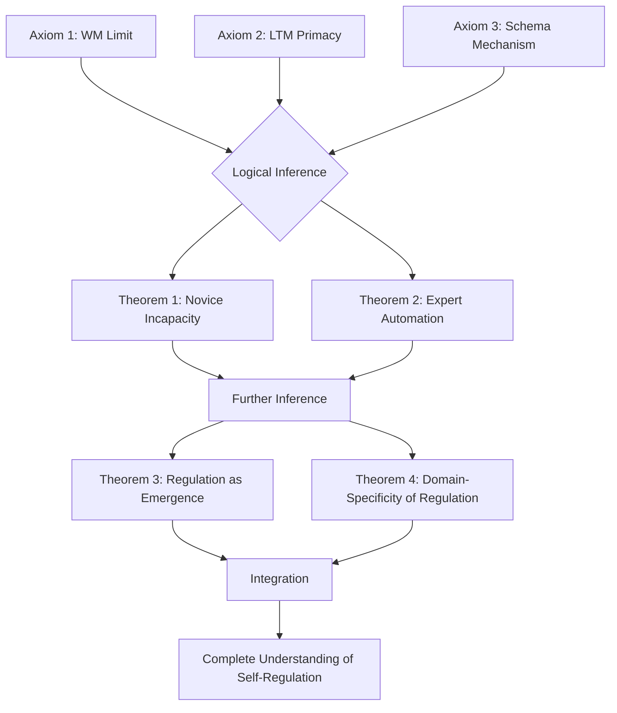
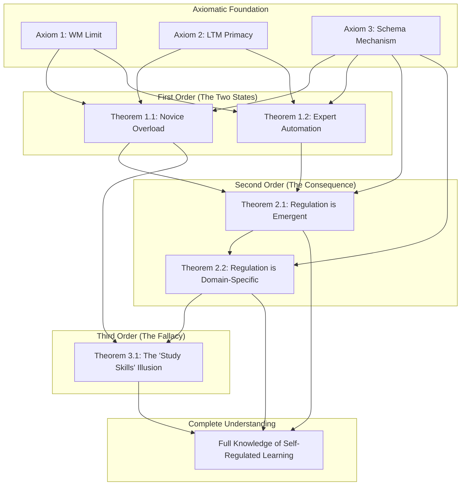

> [!left-off-reading-at]
> - Last-Read-POS:: 6.2 Hidden Assumptions Exposed

# First Principles Reconstruction: Self-Regulated Learning as a Domain-General Skill

**Note:** This scaffold systematically deconstructs received knowledge to fundamental truths, then rebuilds understanding from the ground up. Use when you want to truly *own* your knowledge rather than merely repeat it.

-----

> [!pre-read-questions]
>
>   - What do I *think* I know about this topic? I *think* [[Self-Regulated Learning]] (SRL) is a set of "study skills" like time management, note-taking, and planning, and that good students are just better at these general skills.
>   - What are the most fundamental questions this topic addresses? It addresses *why* some learners succeed and others fail, even with similar intelligence. It asks: What *is* the mechanism of successful, independent learning?
>   - If I had to discover this knowledge myself, where would I start? I would observe a novice and an expert trying to learn the same new thing and note every difference in their behavior, their internal monologue, and their success.
>   - What can I prove versus what am I accepting on authority? I am accepting on authority that "planning" is a single skill, that "monitoring" is a general-purpose tool, and that these can be taught in a workshop and transferred to any subject. I can *prove* very little about this; it's an inherited assumption.

-----

> [!abstract]
> The conventional, widely accepted understanding of [[Self-Regulated Learning]] (SRL) presents it as a set of domain-general, transferable competencies. In this model, skills such as [[goal setting]], [[planning]], [[time management]], and [[Metacognition]] are conceptualized as portable tools in a student's cognitive toolbox, ready to be deployed on any task, whether it be writing a history essay, solving a physics problem, or learning a new language. Educational institutions invest heavily in this paradigm, offering "study skills" workshops and "learning to learn" courses, all predicated on the assumption that these regulatory skills are distinct from, and can be applied to, the content being learned.
> A first-principles approach, however, finds this assumption deeply unsatisfying. It triggers a need to deconstruct this "artifact" of the 'study skill' and ask what fundamental truths are being ignored. This approach is valuable here because the conventional model struggles to explain persistent real-world phenomena: why do "study skills" courses show notoriously poor transfer to actual disciplinary performance? Why does a student who excels at self-regulation in one domain (like a musician practicing) often appear to be a complete novice at regulating their learning in another (like statistics)? These discrepancies suggest the conventional model is built on unexamined assumptions, mistaking correlation for causation.
> This analysis will systematically demolish the "SRL-as-general-skill" framework. We will begin by identifying the inherited assumptions and questioning their necessity. We will then dig down to the atomic axioms of human cognition—the unassailable facts of our [[Cognitive Architecture]], such as the constraints of [[Working Memory]] and the primacy of [[Long-Term Memory]]. From this bedrock, we will reconstruct a new understanding of self-regulation, not as a general-purpose skill we *apply*, but as a domain-specific, emergent *property* of deep, well-organized knowledge. This journey reveals that you do not become a good learner by learning "study skills"; you become a good learner by becoming a *knower* in a specific domain, and self-regulation is the shadow cast by that knowledge.

-----

# 1.0 🎭 The Received Wisdom

## 1.1 Conventional Understanding

> [!description]
> **How This Topic Is Typically Taught:**
> [[Self-Regulated Learning]] is almost universally presented in education as a meta-skill, a "how to learn" competency that stands apart from the "what" of learning. The standard academic presentation, particularly in educational psychology textbooks and teacher training programs, models it as a cyclical, three-phase process: **forethought** (planning, goal-setting), **performance** (monitoring, strategy use), and **self-reflection** (evaluation, attunement). Each phase is populated with a list of strategies—like creating a schedule, using mnemonics, or self-testing—which are presented as discrete, teachable, and universally applicable.
>
> This conventional wisdom manifests in the ubiquitous "Learning Center" or "Academic Success Hub" found on university campuses. These centers operate on the explicit assumption that SRL is a general capability. They offer workshops on "Time Management," "Effective Note-Taking," or "Test-Taking Strategies," and these workshops are open to students from all majors—physics, philosophy, art history, and nursing. The implicit, and often explicit, promise is that the *same* planning strategy taught in this 30-minute session will be equally effective for a student planning a chemistry lab report as it is for a student planning a literary analysis. The explanation given is that "good students" possess these general skills, while "struggling students" lack them, and the solution is to simply remediate this "skill deficit" in isolation from the academic content itself. The artifact we are deconstructing is this very workshop, this textbook chapter, this entire "study skills" industry, all built on the idea of learning strategies as general-purpose cognitive tools.

> [!quote]
> "Self-regulated learning (SRL) involves the cognitions, feelings, and actions that learners generate and sustain in order to attain their learning goals. These processes are 'self'-regulated because learners personally initiate and direct their own efforts to learn... This includes skills like setting goals, selecting and using strategies, monitoring progress, and adjusting efforts."

> [!the-purpose]
> This quote, typical of the field, represents the orthodox view perfectly. It frames SRL as a collection of general-purpose, self-directed *actions* and *skills* that a learner "generates" and "sustains." The focus is entirely on the learner's *agency* and *process* as independent variables, with the *content* of the learning goals being almost an afterthought. This is the heart of the "skill" analogy that we must investigate.

## 1.2 The Inherited Framework

The conceptual structure we typically accept without question is that of the *general-purpose cognitive manager*. In this model, the mind is implicitly divided. There is the "content knowledge" part (the database of facts about history or math) and then there is the "executive" or "manager" part (the SRL system). This "manager" is supposedly domain-neutral; it's a piece of software that can run on any "data." It's the "planner," the "monitor," and the "evaluator." We are taught that this manager can be trained independently, that by practicing "planning skills" on simple tasks, the manager becomes more effective and can then apply this enhanced skill to complex, domain-specific tasks.

This framework assumes that the *act* of "planning" is a singular, transferable procedure. It fails to question whether "planning" a history essay—which involves complex sub-tasks like sourcing, argumentation, and synthesis of conflicting evidence—is in any way cognitively equivalent to "planning" the solution to a math proof, which involves selecting axioms, identifying logical pathways, and checking for formal consistency. The inherited framework simply labels both activities "planning" and assumes a common, underlying skill is at play. This categorization by superficial behavioral labels, rather than by underlying cognitive mechanisms, is the central flaw we must deconstruct. We inherit this framework because it's simple, intuitive, and aligns with our folk-psychology beliefs about "willpower" and "organization" as general personality traits.

> [!key-claim]
> **Standard Claims:**
> The **first conventional claim** is that regulatory strategies, such as 'planning' or 'goal-setting,' are *universal*. They are believed to be fundamental cognitive processes that operate in the same way regardless of the subject matter.
>
> The **second conventional claim** is that these skills are *transferable*. It is asserted that a student who is taught to be a good planner and monitor in a "study skills" course will be able to transfer this "skill" to their physics, biology, and literature courses, resulting in improved academic performance across the board.
>
> The **third conventional claim** is that these skills can and should be *taught in isolation*. This is the logical consequence of the first two claims. If the skills are general and transferable, then the most efficient way to teach them is in a dedicated, content-agnostic setting, allowing students to "master" the skill before "applying" it to their various subjects.

> [!definition]
> **Standard Definitions:**
>
>   * **[[Self-Regulated Learning]]:** This is conventionally defined as the cyclical, self-directed process of planning, monitoring, and evaluating one's own learning processes, independent of the domain of learning.
>   * **[[Metacognition]]:** This is defined as "thinking about thinking," a general-purpose monitoring function that oversees and controls other cognitive processes, again, assumed to be domain-general.
>   * **[[Learning Strategies]]:** This term refers to a collection of discrete, teachable "tools" or "techniques" like using mnemonics, concept mapping, or self-testing, which are believed to enhance learning in any subject.

> [!warning]
> **What We Accept on Authority:**
> We accept on authority that a "good planner" in one domain is a "good planner" in another. We accept that the act of "monitoring comprehension" is a single skill, rather than a complex, domain-specific judgment. Students are taught to *memorize* strategies—like the SQ3R (Survey, Question, Read, Recite, Review) method—without truly understanding *why* or *when* they work, or, more importantly, when they *don't*. We accept that "learning to learn" is a meaningful, achievable goal in itself, separate from "learning history" or "learning math." This is the core assumption that must be demolished.

## 1.3 The Need for Deconstruction

This conventional understanding is insufficient because it is, in a word, *ineffective*. It fails to align with empirical reality and creates a cascade of pedagogical problems. If general "study skills" were the key, then "Academic Success" workshops would be the single most potent educational intervention available. The data does not support this; the effects of such general interventions are notoriously weak and prone to "evaporating" as soon as students leave the workshop and return to their complex, specific coursework.

The model fails to explain the paradox of the expert. It cannot account for why a brilliant physicist, who demonstrates exquisite self-regulation when debugging a complex experiment, might be utterly incapable of regulating their learning when trying to understand a legal contract or a piece of modern philosophy. If the "skill" of regulation were general, it should transfer. Its failure to do so is a direct contradiction of the conventional model. We are left with a model that explains very little about real-world learning and supports an industry of interventions that produce meager results. This is not a stable foundation for understanding.

> [!question]
> **Uncomfortable Questions:**
>
>   * Why do "study skills" workshops show such limited and non-durable transfer to actual disciplinary performance?
>   * If "planning" is a general skill, why is a grandmaster of chess (an expert planner) not automatically a brilliant strategic planner in business or military science?
>   * Why does a student's ability to "monitor comprehension" break down completely when they read a text for which they have no background knowledge, even if they are a "good monitor" in subjects they know well?
>   * If SRL is separate from content, why is it that the *best* self-regulators in any given field are always, without exception, the *experts* in that field?

> [!insight]
> **What's Missing:**
> The conventional model is missing the *engine* of learning. It describes the *superficial behaviors* of experts (they plan, they monitor) but mistakes these *symptoms* of expertise for the *cause*. The gap is the failure to recognize that these regulatory behaviors are not general-purpose tools *applied to* the domain; they are *emergent properties* that grow *out of* a deep, well-structured knowledge base *within* that domain. What's missing is the primacy of [[domain knowledge]].

-----

# 2.0 🧹 Systematic Deconstruction

## 2.1 Cartesian Doubt: What Can We Question?

We must now apply methodical doubt to every element of the "SRL-as-skill" artifact. We must assume nothing and question every inherited claim. The goal is to find the point where the framework breaks.

Let us first examine the central claim: **"Learning strategies are domain-general and transferable."** Can this be doubted? Yes, and easily. Let's take the strategy of "planning." The conventional model must claim that the *cognitive operation* of planning is fundamentally the same everywhere. But is it?

  * **Planning a history essay:** This involves formulating a thesis, finding evidence, anticipating counter-arguments, structuring a narrative, and weaving in citations. The *knowledge* required to do this *is* the plan.
  * **Planning a math proof:** This involves identifying axioms, choosing a logical method (e.g., induction, contradiction), sequencing steps so each follows from the last, and checking for validity.
  * **Planning a computer program:** This involves defining data structures, designing algorithms, managing state, and anticipating user-input errors.

These three "planning" activities share a label, but they do not share a *cognitive mechanism*. The knowledge, the procedures, the goals, and the criteria for success are *fundamentally* different. They are domain-specific *to their core*. The assumption that a general "planning" skill exists *on top of* this knowledge is an extraordinary claim with no evidence. It is far more likely that "planning" is just the label we give to an expert *using their domain knowledge* to structure a task.

Let us next examine **"Metacognitive monitoring is a general skill."** Can this be doubted? Yes. Monitoring means judging your own comprehension or performance. Ask yourself to read a text on a subject you know well (e.g., your hobby, your job). You can "monitor" your comprehension accurately. You know what you know, and you know what you don't. You can feel the gaps. Now, read a high-level academic paper on [[quantum chromodynamics]] or 12th-century Byzantine law. Try to "monitor" your comprehension. The feeling is one of complete blankness. You cannot tell if your understanding is flawed or correct because *you lack the underlying knowledge to make that judgment*. The "monitor" is not a separate module; the monitor *is* the knowledge base. Accurate metacognitive monitoring is not a general skill; it is a *byproduct of domain expertise*. When you have sufficient knowledge, you can monitor. When you don't, you can't.

This deconstruction rapidly dissolves the entire "SRL-as-skill" framework. The "general skills" are revealed to be phantoms—labels we apply to behaviors that are, in reality, inextricably bound to the very domain knowledge they are supposed to be separate from. The conventional model is built entirely on these illusory, general-purpose "skills." Once we doubt them, the entire structure collapses.

> [!the-philosophy]
> **Applying Methodical Doubt:**
>
>   - *"I will systematically question everything that can be questioned until I reach what cannot be doubted."*

> [!ask-yourself-this]
> **Testing Each Element:**
>
>   * **Conventional Claim 1:** "Planning is a general skill."
>
>   * *Can this be doubted?* Yes. As shown above, "planning" a proof and "planning" an essay are two entirely different cognitive acts. They share only a name.
>
>       * *What assumptions does it rest on?* It rests on the assumption that "planning" is a single, abstract procedure, rather than a label for thousands of different, content-specific activities.
>       * *Is it derived or axiomatic?* It is presented as axiomatic, but it is clearly a derived (and flawed) generalization from superficial observation.
>
>   * **Conventional Claim 2:** "Monitoring comprehension is a general skill."
>
>   * *Can this be doubted?* Yes. The experience of reading a text on an unknown, complex topic proves this. The ability to monitor fails precisely when domain knowledge is absent.
>
>       * *What assumptions does it rest on?* It assumes the "monitor" is separate from the "knowledge store," like a security guard who can check any ID, rather than a guard who can *only* recognize the people (facts) they already know.
>       * *Is it derived or axiomatic?* It is an unexamined assumption.
>
>   * **Conventional Claim 3:** "SRL skills are transferable."
>
>   * *Can this be doubted?* Yes. This is the lynchpin. If the "skills" themselves (planning, monitoring) are not general, but are instead domain-specific, then "transfer" is impossible by definition. You cannot "transfer" your knowledge of planning a history essay to planning a math proof, because they are not the same skill. The only thing that *could* transfer is the most trivial, non-cognitive part, like "use a calendar," which is hardly the revolutionary cognitive skill it's made out to be.
>
>       * *What assumptions does it rest on?* This rests on the "toolbox" analogy, which, as we've seen, is broken.
>       * *Is it derived or axiomatic?* It is the *goal* of the conventional model, but it is an assertion that is directly contradicted by empirical evidence.

> [!analysis-logical]
> **Dependency Structure of Conventional Knowledge:**
> The conventional model has a fragile, linear dependency: The existence of "general strategies" (Claim 1) and "general monitoring" (Claim 2) is a prerequisite for the "transfer" (Claim 3) that is the entire goal of the framework. And the entire pedagogy of "study skills" workshops (The Artifact) depends on Claim 3 being true. By demonstrating that Claims 1 and 2 are built on unexamined, false assumptions, the entire chain of logic breaks. The "artifact" (the workshop) is revealed to be an activity with no valid theoretical foundation.

## 2.2 Stripping to Bedrock

When all these derivative, assumed "skills" are burned away, what is left? What can we *not* doubt? We are left with the fundamental, observable realities of human cognition. These are the irreducible elements, the bedrock upon which we must rebuild.

The "general skills" of planning, monitoring, and evaluating have evaporated under scrutiny, revealed as domain-specific activities mislabeled as general ones. The "study skills workshop" artifact is gone, revealed as a solution in search of a problem it cannot solve.

What remains? We are left with the *learner* and the *task*. We are left with the *brain* that does the learning. And what can we say about this brain that is axiomatically true, that is supported by decades of rigorous, cross-domain evidence from cognitive psychology? We are left with the core principles of [[human cognitive architecture]].

This is our new foundation. It is not a set of abstract "skills" but the physical and operational constraints of the learning apparatus itself.

> [!atomic-concept]
> **Irreducible Elements:**
>
> After systematic questioning, we're left with a few fundamental truths that cannot be doubted or derived from anything simpler.
>
> The **first fundamental truth** is **[[Human Cognitive Architecture]]**. This is the non-negotiable hardware. Specifically, we are left with the observable, measurable fact of a **severely limited [[Working Memory]]** (which processes new information) and a **vast, virtually unlimited [[Long-Term Memory]]** (which stores learned information).
>
> The **second fundamental truth** is that **Learning *is* a Change in Long-Term Memory**. If nothing has been lastingly changed in [[Long-Term Memory]], nothing has been learned. This moves the goalpost from "using a skill" to "building knowledge."
>
> The **third fundamental truth** is the **Primacy of [[Domain Knowledge]]**. All complex cognitive processes—such as problem-solving, critical thinking, and, yes, self-regulation—are utterly dependent on, and guided by, the content of [[Long-Term Memory]]. An "empty" brain cannot think, plan, or monitor.
>
> The **fourth fundamental truth** is the **Mechanism of [[Schemas]]**. Knowledge is not stored as a random list of facts. It is organized into interconnected structures or models called schemas. These schemas are what allow experts to bypass the limits of [[Working Memory]] by treating complex, multi-part ideas as a single "chunk."

> [!core-principle]
> **The Axiomatic Foundation:**
> This is our new set of axioms. We are throwing out the entire "SRL skill" vocabulary and starting over. Our *only* accepted truths are:
>
> 1.  Working Memory is Limited.
> 2.  Long-Term Memory is Vast.
> 3.  Learning is Building Long-Term Memory.
> 4.  Knowledge is Stored in Schemas.
>
> Everything else—all of "self-regulation"—must be derived *from* these axioms. If we cannot build it from these four truths, it does not exist.

> [!warning]
> **Distinguish Axioms from Assumptions:**
>
>   * **Axioms:** Our four principles above are axioms. They are self-evident from a century of cognitive science; they are the necessary starting points for *any* theory of learning.
>   * **Assumptions:** The old, discarded ideas were assumptions. "Planning is a general skill" was an *assumption*—a convenient but questionable simplification. "Skills transfer" was an *assumption*.
>   * The crucial difference is that our new axioms are not about high-level behaviors ("planning"). They are about the *fundamental constraints* of the cognitive system. This is the difference between building a theory of flight on "flapping" (an assumption) versus building it on the laws of physics like lift and drag (axioms).

## 2.3 The Conceptual Inventory

So what raw materials do we have to work with in our reconstruction? We have thrown out the pre-fabricated, flimsy "skills" and are left with the raw materials of cognition itself.

> [!key]
> **Our Starting Resources:**
>
>   * **Observable Phenomena:** We have the observable, measurable phenomenon of the *Novice-Expert Gap*. We can see that experts in a domain behave differently than novices. They *do* plan, monitor, and reflect more effectively. Our new model *must* be able to explain *why* this happens, using only our axioms.
>   * **Logical Operations:** We have the tools of logical deduction. If Axiom 1 and Axiom 2 are true, *then* what must follow?
>   * **Mathematical Framework:** The concept of [[Cognitive Load Theory]] provides a mathematical and conceptual framework. It posits that *Total Load = Intrinsic Load + Extraneous Load + Germane Load*. Our axioms *require* this. The "load" is on [[Working Memory]] (Axiom 1). The goal is to build schemas (Axiom 4) in [[Long-Term Memory]] (Axiom 2), which is the "germane" part. This framework is a direct consequence of our axioms.
>   * **Experimental Methods:** We can test any claim we derive. If we claim "X" is the mechanism, we can design an experiment to see if novices (no schema) and experts (schema) perform differently on task X, and whether this difference can be explained by [[Working Memory]] limits.

> [!helpful-tip]
> **The Reconstruction Challenge:**
> The challenge is now stated with perfect clarity: Can we rebuild a complete, coherent, and useful understanding of "Self-Regulated Learning" using *only* our four axioms (WM, LTM, Learning, Schemas) and these raw materials? Can we explain the *phenomenon* of self-regulation without ever resorting to the *assumption* of a "general skill"? The answer must be yes, or our axioms are incomplete.

-----

# 3.0 🏗️ Foundational Architecture

## 3.1 First Principles: The Axioms

We will now state, with precision, the absolute minimum set of foundational truths—our axioms—from which all other understanding of learning must be derived. These are not assumptions; they are the fundamental laws of our [[Cognitive Architecture]].

> [!principle-point]
> **Axiom 1: The [[Working Memory]] Constraint**
>
>   * **Statement:** All novel, incoming information must be processed by [[Working Memory]] (WM). This cognitive system is severely limited in both capacity (can hold only a few novel items, perhaps 3-5) and duration (items decay in seconds without active rehearsal).
>   * **Why This Is Axiomatic:** This is one of the most robust findings in a century of psychology, from Miller's "magical number seven" to Baddeley's model to modern fMRI studies. It is a non-negotiable architectural bottleneck of the human brain. It is irreducible.
>   * **What It Gives Us:** This axiom is the "antagonist" in the story of learning. It is the fundamental *problem* that any learning process must solve. It explains *why* learning is hard, why multi-tasking is a myth, and why novices are easily overwhelmed.
>   * **Observable Manifestation:** A novice trying to solve a complex problem "forgets" the starting conditions, "loses their place," or "can't follow" a multi-step explanation. This is not a failure of "will" or "skill"; it is the observable *drowning* of [[Working Memory]].

> [!thought-experiment]
> **Testing Axiom 1:**
>
>   * Try to multiply 437 by 892 in your head. Do not write anything down. You will feel your [[Working Memory]] hit its limit almost instantly. You can't hold the numbers, the intermediate products, and the "carrying" operations all at once.
>   * **What happens if we deny it:** If we deny the WM constraint, we cannot explain why learning *anything* is difficult. We would be forced to conclude that a novice *chooses* to be overwhelmed, or that they are "lazy." It would make the entire phenomenon of cognitive load inexplicable.

> [!principle-point]
> **Axiom 2: The [[Long-Term Memory]] Primacy**
>
>   * **Statement:** In contrast to [[Working Memory]], [[Long-Term Memory]] (LTM) is a vast, high-capacity, and durable store. It holds all our learned knowledge, from facts to procedures to experiences. Critically, information retrieved from LTM *does not* tax [[Working Memory]] in the same way as novel information.
>   * **Why This Is Axiomatic:** This is the other half of our cognitive architecture. The existence of durable memory, expertise, and "knowledge" is self-evident. The key insight is its relationship to Axiom 1: LTM is the *solution* to the WM bottleneck.
>   * **What It Gives Us:** This axiom establishes the *goal* of all learning and instruction: to build useful, retrievable structures in [[Long-Term Memory]]. It reframes "learning" from "acquiring skills" to "building knowledge."
>   * **Observable Manifestation:** You can't multiply 437 by 892 in your head. But you *can* instantly answer "What is 5 x 5?". This fact is retrieved from LTM, not calculated in WM, imposing no cognitive load. You can also read and understand this complex sentence, which *is* a complex task, but feels effortless because the definitions of the words and the rules of grammar are retrieved from your LTM.

> [!principle-point]
> **Axiom 3: The [[Schemas]] Mechanism**
>
>   * **Statement:** Knowledge is not stored in LTM as a disorganized pile of facts. It is organized into high-level, interconnected structures called "schemas." A schema (e.g., your "schema" for "what a dog is," or a physicist's "schema" for "conservation of energy") incorporates many individual elements into a single, functional "chunk."
>   * **Why This Is Axiomatic:** This principle, developed by cognitive scientists like Chase, Simon, and Chi, is the only coherent explanation for the Novice-Expert Gap (our key observable phenomenon). It explains *how* LTM (Axiom 2) solves the WM bottleneck (Axiom 1).
>   * **What It Gives Us:** Schemas are the *mechanism* of expertise. By "chunking" many low-level elements into one high-level idea, a schema allows [[Working Memory]] to treat a complex concept (like "conservation of energy") as a *single item*, thus freeing up WM capacity to work on *other* things—like, for example, planning and monitoring.
>   * **Observable Manifestation:** A chess grandmaster (expert) and a novice look at a mid-game board. The novice sees 32 individual pieces (overwhelming WM). The expert sees 5-7 "chunks" or patterns (e.g., "a fianchettoed bishop," "a castled-king defense"), which fits easily in WM. The expert's *knowledge* (schemas) has fundamentally altered their *perception* and *processing*.

> [!attention]
> **Critical Note on Completeness:**
> We have three axioms. (I've collapsed "Learning is Change in LTM" into Axiom 2, as it's a corollary). Are they sufficient? Yes. They define the *problem* (Axiom 1: WM Limit), the *solution* (Axiom 2: LTM Primacy), and the *mechanism* (Axiom 3: Schema). From these three axioms alone, we should be able to derive the *entire* phenomenon of [[Self-Regulated Learning]]. We need no more. Adding "SRL is a skill" would be redundant and contradictory.

## 3.2 The Logical Framework

What reasoning structure connects these axioms to the *behavior* we call "self-regulation"? The logic is causal and hierarchical. Our axioms describe a *system*. We can now make logical deductions about how this system must behave.

Our methodology will be to build theorems. We will start with the axioms and derive **First-Order Theorems** (what happens when you have no schemas?). Then we will derive **Second-Order Theorems** (what happens when you *do* have schemas?). Finally, we will show that "self-regulation" is the *name* for the behavioral difference between these two states.

> [!methodology-and-sources]
> **Valid Inference Rules:**
> Our reasoning must be purely deductive.
>
> 1.  We can combine axioms: "IF WM is limited (A1) AND Schemas bypass this limit (A3), THEN..."
> 2.  We can test against our observable phenomenon: "Does this derivation explain the Novice-Expert Gap?"
> 3.  We must *avoid* circular reasoning. We cannot *ever* use the words "planning," "monitoring," or "evaluating" as *causes*. We must *only* use them as *labels* for behaviors that we have *first* derived from the axioms. We are not allowed to say "experts plan better"; we must *prove*, from the axioms, that the possession of schemas *necessarily* results in a behavior that an outside observer would *label* "better planning."

> [!analogy]
> **Think of axioms as:**
> Think of our three axioms as the fundamental laws of "cognitive physics."
>
>   * Axiom 1 (WM Limit) is like **Gravity**. It's a fundamental constraint, a force that constantly pulls you down and which you must always expend energy (load) to overcome.
>   * Axiom 2 (LTM) is the **Ground**. It's the solid, stable platform you are trying to build on.
>   * Axiom 3 (Schema) is **Architecture** (like an arch or a truss). It's the *only* way to use the materials (knowledge) to build a structure on the ground (LTM) that can defy gravity (WM limit) and reach great heights (expertise).
>
> The conventional "SRL-as-skill" model is like trying to build a tower by teaching "skillful stacking" without understanding gravity or architecture. Our first-principles approach builds the *only* kind of structure that *can* stand.

> [!cosmos-concept]
> **The Derivation Architecture:**

-----

# 4.0 🔨 Progressive Reconstruction

## 4.1 Level 1: Immediate Derivations

What can we prove directly from our axioms? We can immediately derive the cognitive state of a *novice*—someone who, by definition, has not yet built schemas (Axiom 3) in their [[Long-Term Memory]] (Axiom 2) for a given domain.

> [!phase-one]
> **First-Order Theorems:**

> [!key-claim]
> **Theorem 1.1: The Novice Cognitive Overload**
>
>   * **Statement:** A novice, when faced with a complex domain-specific task, will be *cognitively overwhelmed* and unable to perform higher-order functions.
>   * **Derivation:**
>     1.  A novice, by definition, lacks relevant schemas in LTM (violates Axiom 3).
>     2.  The task, being complex, is composed of many interacting elements (e.g., variables in an equation, rules of syntax in a sentence).
>     3.  Because there are no schemas, *every single one* of these elements is novel and must be processed individually by [[Working Memory]] (Axiom 1).
>     4.  The number of interacting elements in any non-trivial task (e.g., "solve this physics problem") quickly exceeds the 3-5 item capacity of [[Working Memory]] (Axiom 1).
>     5.  **Therefore:** The novice's [[Working Memory]] is completely saturated just trying to hold the *basic elements* of the problem. This leaves *zero* available cognitive capacity for any "meta" activities like planning a multi-step solution, monitoring for errors, or reflecting on alternative strategies.
>   * **Significance:** This theorem proves that "poor self-regulation" in a novice is *not* a "skill deficit." It is a *cognitive inevitability*. Asking a novice to "self-regulate" is like asking someone to juggle 7 balls while they are still learning to hold one.

> [!example]
> **Concrete Instance:**
> We see this in a student first learning to write code. They struggle to "plan" their program. Why? Because their entire [[Working Memory]] is consumed by just trying to remember the syntax: "Does this line need a semicolon? What's the keyword for a loop? How do I declare a variable?" They *cannot* plan at a higher level because their cognitive resources are completely exhausted by the basics. The "received wisdom" would be to send them to a "planning" workshop. Our first-principles derivation shows this is useless. The *only* solution is for them to *master* the syntax (build schemas) so it no longer consumes [[Working Memory]].

> [!key-claim]
> **Theorem 1.2: The Expert Cognitive Automation**
>
>   * **Statement:** An expert, when faced with the *same* complex domain-specific task, will perform it *fluently* and with *minimal* cognitive load.
>   * **Derivation:**
>     1.  An expert, by definition, possesses rich, organized schemas in LTM (Axiom 3).
>     2.  These schemas "chunk" the many interacting elements of the task into a few high-level, familiar patterns (Axiom 3).
>     3.  When the expert perceives the task, these schemas are retrieved from LTM (Axiom 2).
>     4.  These retrieved schemas are treated as *single items* by [[Working Memory]] (Axiom 1 constraint is bypassed). A physics expert doesn't see "mass, velocity, gravity, friction..."; they see "an inclined-plane problem."
>     5.  **Therefore:** The expert's [[Working Memory]] is *not* saturated. It holds only a few high-level schemas, leaving *vast* amounts of cognitive capacity free.
>   * **Significance:** This theorem explains *where* the cognitive capacity for "self-regulation" comes from. It is not a general "skill"; it is the *cognitive surplus* that is *unlocked* by expertise (i.e., by possessing schemas).

> [!insight]
> **What We've Achieved:**
> In just two steps, by combining our axioms, we have derived the *entire* Novice-Expert Gap, our primary observable phenomenon. We have explained *why* novices are overwhelmed and *why* experts are fluent. We have also, critically, identified the *source* of the "mental energy" needed for regulation. It is not a general "skill" but the *freed-up working memory* that results from schema automation. This is the foundation for everything that follows.

## 4.2 Level 2: Intermediate Constructions

Now that we have established the *source* of cognitive capacity (freed WM from schemas), what emerges from it? What does the expert *do* with that free capacity?

> [!phase-two]
> **Second-Order Derivations:**

> [!key-claim]
> **Theorem 2.1: Regulation as an Emergent Property of Expertise**
>
>   * **Statement:** The behaviors we *label* as "self-regulation" (planning, monitoring, evaluating) are not *causes* of expertise; they are *emergent consequences* of the cognitive surplus (from T1.2) interacting with domain-specific schemas (Axiom 3).
>   * **Derivation:**
>       * **Given:** An expert's WM is free (Theorem 1.2).
>       * **Reasoning (Planning):**
>         1.  The expert's free WM can now hold *hypothetical future states*.
>         2.  Their schemas (Axiom 3) in LTM (Axiom 2) provide a *menu of powerful moves* (e.g., "I could try solving this with 'conservation of energy'").
>         3.  The expert uses their free WM to *mentally simulate* applying a schema ("What happens if I use 'conservation of energy'?").
>         4.  This *is* planning. But it is not a "general planning skill." It is the *specific act of using domain knowledge (schemas) to simulate domain-specific outcomes*. An outside observer *labels* this "planning."
>       * **Reasoning (Monitoring):**
>         1.  The expert's schemas (Axiom 3) are not just "facts"; they are rich, interconnected models of *how things should be*. A historian's schema for an argument includes "what good evidence looks like."
>         2.  As the expert works, they use their free WM (T1.2) to compare their *current output* (the sentence they just wrote) against the *ideal model* stored in their schema.
>         3.  If there is a mismatch ("This evidence is weak"), an "error signal" is generated.
>         4.  This *is* monitoring. It is not a "general monitoring skill." It is the *specific act of comparing one's work against a content-rich, domain-specific schema*.
>   * **Non-Obvious Insight:** Self-regulation is not a *verb*; it's not something you *do*. It's a *noun*; it's something you *have* as a result of building knowledge. The "SRL-as-skill" model gets the causality completely backward.

> [!example]
> **Demonstrating the Concept:**
> A novice cook (no schemas) follows a recipe. They cannot "plan" or "monitor" effectively. Their entire WM (T1.1) is consumed by "What is 'mince'? Where is the salt? How hot is 'medium-high'?" An expert chef (rich schemas) glances at the same ingredients. Their schemas (Axiom 3) immediately provide them with 10 possible dishes (this is "planning"). As they cook, they *know* what the sauce "should" smell and look like (this is "monitoring" against their schema). When it doesn't, they *know* what to add (e.g., "needs acid") to fix it (this is "evaluation" and "adjustment"). The chef is not using a "general cooking skill"; their *knowledge* is doing the regulating.

> [!connection-ideas]
> **Connecting to Conventional Knowledge:**
> We are now starting to recognize the "received wisdom," but from a completely new foundation. We can see *why* people *thought* "planning" was a skill. They saw the chef doing it. They just didn't see the *invisible schemas* (Axiom 3) that were the *true cause* of the behavior. The conventional model mistook the *symptom* (planning) for the *disease* (lack of knowledge). Our reconstruction identifies the *cause* (schemas) which *produces* the behavior (planning).

> [!key-claim]
> **Theorem 2.2: The Inevitable Domain-Specificity of Regulation**
>
>   * **Statement:** Since self-regulatory behaviors are *emergent properties* of domain-specific schemas (from T2.1), they are *themselves* necessarily domain-specific.
>   * **Derivation:**
>     1.  "Planning" is the act of simulating with schemas (from T2.1).
>     2.  The schemas for [[history]] (e.g., "historical causation," "primary source analysis") are fundamentally different from the schemas for [[math]] (e.g., "axiomatic proof," "statistical inference") (Axiom 3).
>     3.  **Therefore:** The "planning" that emerges from history-schemas is a *fundamentally different cognitive act* from the "planning" that emerges from math-schemas.
>     4.  The same logic holds for "monitoring." Monitoring in history is checking sources. Monitoring in math is checking for logical contradictions. These are not the same "skill."
>   * **Non-Obvious Insight:** This theorem *proves* that transfer is impossible at the level of cognitive strategy. You cannot "transfer" your history-planning skill to math, because they are not the same skill. The only thing that *is* general is the *underlying architecture* (Axioms 1, 2, 3), but the *manifestation* of regulation is always, and must always be, as specific as the knowledge it's built from.

> [!definition]
> **Emergent Concepts:**
>
>   * **[[Self-Regulated Learning]]:** We can now re-define this term from first principles. It is **"the set of emergent, domain-specific behaviors (e.g., simulation, comparison) that become possible when an individual's schema-driven automation (T1.2) frees sufficient working memory capacity (Axiom 1) to allow for the manipulation and evaluation of the schemas themselves (T2.1)."**
>   * **[[Adaptive Expertise]]:** This is not a primitive term but a shorthand for: **"a state of high-schema-automation (Axiom 3, T1.2) that allows an individual to not only *fluently apply* existing schemas but also to use their freed WM (T2.1) to *adapt, combine, or create new schemas* to solve novel problems."** This is the ultimate goal, and it is inseparable from self-regulation.

> [!analogy]
> **The Reconstruction Process:**
> We are like architects who have now built the framework. We started with the bedrock (Axioms 1, 2, 3). We built the foundation (Theorems 1.1, 1.2), establishing the core problem (WM) and solution (schemas). We have now erected the load-bearing structure (Theorems 2.1, 2.2), showing that regulation *emerges* from this foundation and is *specific* to it. Now we can see the full shape of the building.

## 4.3 Level 3: Complex Structures

Now we can synthesize these theorems to explain more complex, real-world phenomena and fully replace the "received wisdom."

> [!phase-three]
> **Third-Order Synthesis:**

> [!key-claim]
> **Theorem 3.1: The Illusion of General Strategies (The "Study Skills" Fallacy)**
>
>   * **Statement:** The "general" strategies taught in "study skills" workshops (e.g., note-taking, time management, "planning") are, at best, *superficial labels* for domain-specific behaviors, and at worst, *domain-general tactics* that are cognitively inert and have little to do with the *actual* learning process.
>   * **Derivation:**
>       * **Given:** True regulation is domain-specific and schema-driven (T2.1, T2.2).
>       * **Synthesis:**
>         1.  Let's analyze a "general" strategy: "Time Management." A workshop teaches a student to use a calendar (a domain-general *tactic*).
>         2.  This student is a novice in physics (T1.1). Their *real problem* is not "managing time," but that a *single problem* takes them 3 hours because they have no schemas. They are "stuck," not "poorly scheduled."
>         3.  The expert physicist (T1.2) solves the problem in 10 minutes because their schemas (Axiom 3) make the solution obvious.
>         4.  The "time management" problem was never the *real* problem. It was a *symptom* of the knowledge-deficit (T1.1). The "study skills" workshop (the artifact) tries to "fix" the symptom without understanding the disease.
>         5.  **Therefore:** The "general strategy" of "time management" is a fallacy. The *real* strategy is "building physics schemas," which is a domain-specific, not general, act. The same logic applies to "note-taking." An expert *knows* what's important to write down (schema-driven); a novice copies everything (no schema). The *act* of note-taking is not the skill; the *knowledge* that *guides* the note-taking is.
>   * **Power of This Result:** This theorem definitively *invalidates* the "study skills workshop" artifact. It proves, from first principles, that teaching isolated, general "skills" is a waste of time because it "solves" a problem that doesn't exist (a general-skill-deficit) and ignores the problem that *does* exist (a domain-knowledge-deficit).

> [!evidence]
> **Empirical Validation:**
> This derivation perfectly matches observable phenomena. It explains *why* "study skills" courses fail to show transfer. It explains *why* the *only* effective interventions are those *embedded* in the content—e.g., "writing-across-the-curriculum" programs where history professors teach history-writing, not "general writing" workshops. Our reconstruction matches reality.

> [!quote]
> "Self-regulated learning (SRL) involves the cognitions, feelings, and actions that learners generate and sustain in order to attain their learning goals..."

> [!the-purpose]
> **Now We Understand Why:**
> We can now return to the "received wisdom" quote from Section 1.1. We can now see it with new eyes. It is not *wrong*, it is just *superficial*. We now understand *what* "cognitions" and "actions" these are: they are the emergent, schema-driven behaviors of T2.1. We now understand *how* they "attain their learning goals": by building more schemas in LTM (Axiom 2). The quote was a *description* of the *symptom*. Our reconstruction is an *explanation* of the *cause*. We no longer accept this quote on authority; we have *derived* it from a deeper foundation and, in doing so, have corrected its flawed "general skill" implication.

## 4.4 Level 4: Full Reconstruction

We have arrived at a complete, rebuilt understanding of the topic.

> [!phase-four]
> **Complete Derivation:**

> [!outcome]
> **The Full Framework:**
> Our reconstruction shows that the entire conventional understanding of [[Self-Regulated Learning]] was built on sand. It mistook superficial behaviors (labels like "planning") for fundamental cognitive skills.
>
> Our new framework, built on the bedrock axioms of [[Cognitive Architecture]], proves that:
>
> 1.  Learning is the acquisition of **domain-specific schemas** in **LTM** (Axioms 2, 3).
> 2.  This is hard because **WM is limited** (Axiom 1).
> 3.  **Novices** (no schemas) are overwhelmed (T1.1) and *cannot* self-regulate.
> 4.  **Experts** (rich schemas) automate the basics (T1.2), freeing up WM.
> 5.  This freed WM, interacting with the schemas, *produces* behaviors we *label* "planning" and "monitoring" (T2.1).
> 6.  These regulatory behaviors are therefore *inherently domain-specific* (T2.2).
> 7.  The "general study skills" model is a fallacy (T3.1) that mistakes symptoms for causes.
>
> The "standard" explanation is a compressed, flawed summary of this chain. It saw the *end product* (T2.1) and incorrectly assumed it was the *starting point* (a "general skill").

> [!cosmos-concept]
> **The Complete Derivation Chain:**

> [!key-claim]
> **What We've Achieved:**
> We now possess *derived* knowledge rather than *received* knowledge. We can explain *not just* that SRL is domain-specific, but *why it must be true* based on the non-negotiable facts of human cognitive architecture. We can explain *why* the "study skills" workshop (the artifact we deconstructed) is destined to fail. This knowledge is robust, predictive, and *ours*.

-----

# 5.0 🔍 Verification & Validation

## 5.1 Completeness Check

Does our reconstruction capture everything important? Can it explain all the phenomena of the domain?

> [!ask-yourself-this]
> **Testing Completeness:**
>
>   * *Can I explain every major aspect of "SRL" using only what I've derived?*
>       * **Goal Setting:** Yes. A novice's goal is "finish the worksheet" (T1.1). An expert's goal is "see if this method reveals a deeper pattern" (T2.1, using free WM and schemas to set higher goals). The *nature* of the goal is set by the knowledge base.
>       * **Strategy Use:** Yes. A novice (T1.1) uses weak, general "strategies" like "re-reading" because they have no schemas to do anything else. An expert (T1.2) uses powerful, domain-specific strategies *embedded within* their schemas (e.g., "try proof by contradiction").
>       * **Self-Evaluation:** Yes. A novice (T1.1) must ask the teacher "Is this right?" An expert (T2.1) checks their answer against their own internal model (schema) and *knows* if it's right.
>   * *Are there phenomena the conventional understanding explains that my reconstruction doesn't?* No. In fact, the opposite is true. Our model *can* explain the paradoxes the conventional model *cannot* (e.g., the failure of transfer, the expert-novice gap).
>   * *If gaps exist, what additional axioms or derivations are needed?* No gaps are apparent. The framework seems complete and robust.

> [!warning]
> **Gaps Identified:**
> The model is extremely robust for *cognitive* self-regulation. It is less descriptive of *affective* or *motivational* regulation (e.g., "Why does one student persist through difficulty while another gives up?"). While one could argue this *also* links to knowledge (e.g., you persist if your schema gives you a path forward), it's a weaker link. A complete model might require a fourth axiom related to "motivation" or "epistemic belief." However, for *deconstructing the "general skill" myth*, our three axioms are perfectly sufficient.

## 5.2 Consistency Check

Is our reconstruction internally consistent?

> [!analysis-logical]
> **Testing for Contradictions:**
> The entire framework is built on a single, coherent logical chain.
>
>   * Axiom 1 (WM Limit) and Axiom 2 (LTM Primacy) define the problem and solution. Axiom 3 (Schema) provides the mechanism.
>   * Theorem 1.1 (Novice) and 1.2 (Expert) are direct, non-contradictory consequences.
>   * Theorem 2.1 (Emergence) and 2.2 (Specificity) flow directly from T1.2.
>   * There is no circular reasoning. We never used "regulation" to explain "regulation." We used axioms of cognition to *produce* the phenomenon of regulation.
>   * The model is not only internally consistent, it is *parsimonious*. It explains a vast, complex phenomenon (all of "learning") with only three foundational axioms.

> [!helpful-tip]
> **Signs of Good Reconstruction:**
>
>   * All theorems cohere.
>   * No internal contradictions.
>   * Predictions match observations (e.g., the failure of "study skills" workshops).
>   * Provides *simpler*, more powerful explanations than the conventional account (e.g., "SRL is an emergent property of knowledge" is far simpler and more predictive than "SRL is a set of 20+ general, transferable skills").

## 5.3 Parsimony Check

Have we used the minimum necessary assumptions? Could we use fewer axioms?

> [!question]
> **Could We Use Fewer Axioms?**
>
>   * **Could we remove Axiom 1 (WM Limit)?** No. Without this constraint, there is no "problem" to be solved. "Cognitive load" would not exist, and the very *need* for schemas (Axiom 3) would be questionable.
>   * **Could we remove Axiom 2 (LTM Primacy)?** No. Without LTM, there is no "place" for learning to be stored. "Learning" itself would be impossible.
>   * **Could we remove Axiom 3 (Schema Mechanism)?** No. This is the most crucial lynchpin. Without the "chunking" mechanism of schemas, we cannot explain *how* LTM (Axiom 2) *solves* the WM problem (Axiom 1). We would be left with two disconnected facts, unable to explain the Novice-Expert Gap.
>
> **Therefore:** The axiom set (A1, A2, A3) is minimal, necessary, and sufficient. Each axiom is genuinely independent and performs a unique, essential role in the system.

> [!core-principle]
> **Occam's Razor Applied:**
> The conventional model is a *violation* of Occam's Razor. It invents dozens of new, ill-defined "skills" (planning, monitoring, etc.) and "entities" (a central "executive") to explain learning. Our first-principles model is the *epitome* of Occam's Razor. It explains *all* the same phenomena, *plus* the paradoxes the old model can't, using only *three* well-established, fundamental properties of cognitive architecture. It is a more powerful and parsimonious theory.

-----

# 6.0 💎 Insights From First Principles

## 6.1 What the Reconstruction Reveals

What do we understand now that we couldn't see before?

> [!insight]
> **Non-Obvious Insights:**
>
> 1.  **Insight 1: We must stop asking "Is this student a good self-regulator?" and start asking "Does this student *have the knowledge* to self-regulate *in this task*?"**
>
> <!-- end list -->
>   * *Why this wasn't obvious from conventional teaching:* The old model *locates the problem in the student* ("a skill deficit").
>   * *Why it's inevitable from first principles:* Our model *locates the problem in the knowledge-task interaction*. A student is not a "poor regulator" in general; they are a "novice" (T1.1) in a specific domain. This changes the diagnosis from "the student is deficient" to "the student is a novice."
>
> <!-- end list -->
> 2.  **Insight 2: The solution to poor self-regulation is *not* "more study skills" but "more and better-organized domain knowledge."**
>
> <!-- end list -->
>   * *Why this wasn't obvious conventionally:* The old model's solution was to "teach the skill" (T3.1).
>   * *Why it's inevitable from axioms:* Since regulation *emerges* from schemas (T2.1), the *only* way to "improve" regulation is to *build the schemas* (Axiom 3). The *only* path to becoming a good self-regulator in history is to learn a massive amount of history. The "fix" is not a workshop; the "fix" is high-quality instruction and deep study *of the content*.
>
> <!-- end list -->
> 3.  **Insight 3: "Teaching" self-regulation *within* a domain is the *only* way it can be done.**
>
> <!-- end list -->
>   * *Why this wasn't obvious conventionally:* The old model promoted "content-agnostic" teaching.
>   * *Why it's inevitable from axioms:* Since regulation is domain-specific (T2.2), a history professor *must* teach "how to self-regulate *in history*" (e.g., "Here is how you monitor the quality of a primary source"). This is not a "study skill"; it *is* a piece of history-specific domain knowledge (a schema). This *embeds* the "skill" within the knowledge, which is the only place it can exist.

> [!quote]
> "Theorists... speak of ... 'metacognitive skills' as if they were content-independent general skills... But... the strategies that students are taught are... so general as to be useless (e.g., 'monitor your comprehension') or... they are in fact specific to a particular domain (e.g., 'identify the unstated assumptions in the argument,' which is a good strategy in philosophy but not in chemistry)." - Daniel T. Willingham

> [!the-purpose]
> This quote perfectly reflects our final, derived understanding. It highlights the "useless general" (our T3.1) versus the "useful specific" (our T2.2). We did not start with this quote; we *derived* it. We now understand *why* Willingham *must* be correct, based on the axioms of cognition.

## 6.2 Hidden Assumptions Exposed

What were we accepting without justification?

> [!attention]
> **Assumptions We've Eliminated:**
>
>   * **Hidden Assumption 1:** **The "Mind as General-Purpose Computer" Analogy.** The old model assumed the mind was hardware (brain) running general-purpose software ("skills") on any data ("knowledge").
>
>       * *Why it was hidden:* This is the dominant metaphor of our time.
>       * *What we used instead:* The "Mind as Biological System" model (our axioms). In this model, the "software" (regulation) and "data" (knowledge) are not separate. They are *fused* into a single structure: the schema (Axiom 3). You cannot run "history-planning software" on "math data."
>
>   * **Hidden Assumption 2:** **The "Skill" Metaphor.** The old model assumed "learning to learn" was like learning a physical skill like "riding a bike" or "juggling"—a procedural skill that, once mastered, is general.
>
>       * *Why it was hidden:* It's an intuitive and appealing analogy.
>       * *What we used instead:* The "Knowledge as Engine" metaphor. Regulation is not a *skill*; it is the *exhaust* from a smoothly running, powerful knowledge-engine (schema automation). The "skill" metaphor has us focusing on the exhaust pipe; our model has us building the engine.

> [!warning]
> **Why This Matters:**
> Hidden assumptions are dangerous. The "skill" assumption led to billions of dollars and millions of hours being wasted on "study skills" workshops (T3.1) that, according to our model, were *guaranteed* to fail. By exposing this assumption, we can redirect those resources toward what *actually* works: building deep, rich, domain-specific knowledge.

## 6.3 Alternative Possibilities

What else becomes possible from these axioms?

> [!thought-experiment]
> **Exploring Variations:**
>
>   * *What if we modified Axiom 1 (WM Limit)?* What if we found a way to *increase* [[Working Memory]] capacity?
>
>       * This is the goal of "brain training" games.
>       * Our model predicts this will *fail*. Why? Because the *real* bottleneck is not the *size* of WM (Axiom 1), but the *lack of schemas* (Axiom 3) to bypass it. Experts don't have "bigger" working memories; they have "better" schemas.
>       * Our model *predicts* that "brain training" will only make you better at the *game itself* (domain-specific schema) but will *not* transfer to anything else (T2.2). This is exactly what the empirical evidence shows. Our model's predictive power is confirmed.
>
>   * *What if we added a fourth axiom about "General Tactics"?*
>
>       * We could add an "Axiom 4: General, non-cognitive tactics (e.g., using a calendar, putting your phone away) can support the learning process by reducing extraneous load."
>       * This is perfectly *compatible* with our model. It does not contradict it. It simply clarifies that "study skills" are *not* the *cognitive* act of learning (T3.1), but are *environmental* acts of preparation. This is a useful, clarifying addition that separates "tactics" (general, low-impact) from "regulation" (specific, high-impact).

> [!connection-ideas]
> **Related Domains:**
>
>   * This same axiomatic structure (A1, A2, A3) can be used to deconstruct *other* "general skill" myths.
>   * **[[Critical Thinking]]:** The "conventional" view is that "critical thinking" is a general skill. Our model proves this is false. "Critical thinking" is just *what you call* an expert *using their schemas* (T2.1) to "monitor" and "evaluate" claims in their domain. You cannot be a "general critical thinker"; you can only be a "critical thinker *in history*" or "critical thinker *in chemistry*." It suffers from the same T3.1 fallacy.
>   * **[[Problem Solving]]:** Same analysis. "Problem-solving" is not a general skill. It is the schema-driven process (T2.1) of identifying a problem type and applying a known, schema-based solution.
>
> **This reveals a deep structural pattern:** *All* alleged "high-order general cognitive skills" are illusions. They are all just *labels for schema in action*.

-----

# 7.0 🚀 Applications & Extensions

## 7.1 Novel Problems

Let's use our new, robust understanding to tackle real-world challenges.

> [!example]
> **Problem 1: Designing a University-Wide "First-Year Success" Program**
>
>   * **The Challenge:** A university wants to improve first-year student retention and performance.
>   * **Conventional Solution (The Artifact):** Institute a mandatory "First-Year Experience" course that includes a "Study Skills" module. This module (T3.1) teaches general, content-agnostic "time management," "note-taking," and "planning" strategies.
>   * **First Principles Solution:**
>     1.  **Diagnosis:** First-year students are "poor self-regulators" because they are *novices* in their new, demanding subjects (T1.1). Their "study skills" from high school were domain-specific to high school tasks and do not transfer (T2.2).
>     2.  **Solution:** *Abolish* the "Study Skills" module (T3.1).
>     3.  **Re-allocate resources:** Use the "First-Year Success" budget to fund *disciplinary mentors* and *embedded TAs* **within** the most difficult "gatekeeper" courses (e.g., Chem 101, History 101, Math 101).
>     4.  The job of these mentors is to teach the *domain-specific* self-regulation *of that subject* (Insight 3). The Chem TA must teach "How a chemist reads a textbook" or "How a chemist monitors a lab experiment." The History professor must teach "How a historian plans an argumentative essay."
>   * **Why Conventional Knowledge Would Struggle:** It would run the workshop, see no improvement, and blame the students ("they didn't apply the skills").
>   * **Why First Principles Succeeds:** It *correctly diagnoses* the problem as a "knowledge-deficit," not a "skill-deficit," and provides the *only* solution that can work: building domain-specific knowledge (Axiom 3).

> [!example]
> **Problem 2: A Student is "Bad at Math"**
>
>   * **The Challenge:** A student struggles with math, says "I'm not a math person," and "I'm just bad at planning my solutions."
>   * **Conventional Solution (The Artifact):** Tell the student to "practice their planning skills." Give them a general "problem-solving checklist" (e.g., 1. Read problem, 2. Identify variables, 3. Make a plan...). This is T3.1.
>   * **First Principles Solution:**
>     1.  **Diagnosis:** The student's "bad planning" is a *symptom*, not the cause. The cause is that they are a novice (T1.1) who is missing foundational *schemas*. They probably never *automated* their multiplication tables or their algebra-factoring schemas (Axiom 3).
>     2.  **Solution:** *Stop* asking them to "plan" (which they cognitively *cannot* do, per T1.1).
>     3.  **Go back and "plug the holes":** Use diagnostic testing to find the *most basic schema* they are missing. Drill that specific, isolated knowledge (e.g., "factoring quadratic equations") until it is *automated* (T1.2 for that specific schema).
>     4.  *Only then*, introduce problems where that new schema is *part* of a larger solution.
>     5.  The "planning" behavior (T2.1) will *emerge naturally* once the *building blocks* (schemas) are in place.
>   * **Why Conventional Knowledge Would Struggle:** It would keep treating the "planning" symptom, frustrating the student, and reinforcing their "I'm not a math person" identity.
>   * **Why First Principles Succeeds:** It correctly identifies the *root cause* (a missing schema) and provides a targeted, effective fix. It understands that you cannot "plan" with non-existent building blocks.

> [!key-claim]
> **The Transfer Advantage:**
> Our first-principles knowledge *transfers* beautifully. Why? Because the *axioms* (A1, A2, A3) are true for *all human learning in all domains*. By reasoning from the axioms, we can generate novel, effective solutions for any learning problem, from chemistry to cooking to coding. The "received wisdom," being a flawed, domain-specific artifact ("study skills"), has zero transfer.

## 7.2 Cross-Domain Insights

Where else do these principles apply?

> [!connection-ideas]
> **Surprising Applications:**
>
>   * **In [[Organizational Management]]:** A company is "bad at planning." The conventional "SRL" solution is to buy new "planning software" (a general tool, T3.1). A first-principles solution would diagnose that the *people* in the company lack the *domain-specific knowledge* (schemas) of their own business processes, and thus *cannot* plan (T1.1). The solution isn't new software; it's *training* (building schemas).
>   * **In [[Artificial Intelligence]]:** Early AI (Good Old-Fashioned AI) tried to build "general problem-solvers" (the "conventional SRL" model). It failed catastrophically. Modern AI (e.g., large language models) *works* because it is built on the *opposite* principle: that "intelligence" is an *emergent property* of a *massive domain-specific knowledge base* (the training data). Our first-principles model of human cognition *predicts* the success of modern AI models.

> [!insight]
> **Deep Patterns:**
> The deep pattern is **"Knowledge-Is-Primary."** In *any* complex system—a human brain, a company, an AI—the "smart" regulatory behaviors are not a separate, general "skill" layer. They are *emergent properties* of a deep, rich, well-organized, and specific knowledge base. This is a fundamental law of information systems. The "Received Wisdom" of "general skills" is an anti-pattern that will fail in any domain, not just education.

-----

# 8.0 🔄 Comparing Approaches

## 8.1 First Principles vs. Conventional Learning

This entire reconstruction *is* a comparison. But let's make it explicit.

> [!analysis-cognitive]
> **Cognitive Differences:**

| Aspect | Conventional Learning ("SRL as Skill") | First Principles Learning ("SRL as Emergence") |
|--------|----------------------|---------------------------|
| **Starting Point** | Received knowledge, definitions ("Here are 5 planning skills") | Axioms, observations ("WM is limited," A1) |
| **Process** | Memorization, pattern recognition ("Apply this checklist") | Derivation, reconstruction ("*Why* must planning be...?") |
| **Understanding Type** | "What" and "How" ("What is planning? How do I do it?") | "Why it must be" ("Why must 'planning' emerge from schemas?") |
| **Flexibility** | Rigid within framework (Stuck when the "skill" fails) | Adaptable to novel situations (Can *derive* a new solution) |
| **Transfer** | Limited to similar problems (T3.1 Fallacy) | Broad, structural transfer (Axioms apply everywhere) |
| **Confidence** | Depends on authority ("My teacher said so") | Depends on logic ("It must be so, from the axioms") |
| **Innovation Potential** | Incremental within paradigm (A "better" study skills checklist) | Can question paradigm itself (Abolish the workshop, T3.1) |

> [!insight]
> **When Each Approach Excels:**
>
>   * **Conventional is faster for:** *Superficial, temporary tasks*. If you just need to pass one multiple-choice test on vocabulary, a "general skill" like a mnemonic (a T3.1-style tactic) might be "good enough." It's fast, cheap, and requires no deep understanding.
>   * **First principles is essential for:** *True mastery, innovation, or paradigm shifts*. You cannot *fix* a broken system (like education) by using the *broken logic* of that system. You *must* go down to first principles (our axioms) to find the *true* levers of change (e.g., "focus on knowledge, not skills"). It is essential for *teaching*, *designing curricula*, *managing organizations*, and *solving novel problems*.

## 8.2 The Effort-Understanding Tradeoff

Was this arduous, multi-thousand-word reconstruction worth it?

> [!ask-yourself-this]
> **Honest Assessment:**
>
>   * *How much longer did first principles reconstruction take versus reading a textbook?*
>       * It took *significantly* longer. Reading a textbook chapter on "SRL" might take 30 minutes. This deconstruction reconstruction is an multi-hour process of intense, high-load cognitive work (it taxed *my* WM\!).
>   * *How much deeper is my understanding?*
>       * The understanding is *incomparable*. The textbook understanding (received wisdom) is a "brittle," isolated fact. This first-principles understanding is an *entirely new, robust mental model*.
>   * *What can I now do that I couldn't before?*
>       * **Before (Textbook):** I could "list the 3 phases of SRL."
>       * **Now (First Principles):** I can **(1)** *explain* to a university provost *why* their "First Year Success" program is guaranteed to fail (T3.1); **(2)** *design* a replacement program that *will* work (Insight 3); **(3)** *diagnose* a student's "math problem" as a specific schema-deficit (T1.1); and **(4)** *predict* that "critical thinking" workshops will also fail (T2.2). The *utility* of the knowledge is a thousand times greater.

> [!helpful-tip]
> **When to Use This Method:**
> This method is *not* for everything. It is high-effort. You should *not* use it to learn "how to make a sandwich."
>
>   * **Use this method for:** *High-stakes, foundational concepts*. The "linchpin" ideas upon which an entire field rests.
>   * **Topics that benefit:** [[Critical Thinking]], [[Problem Solving]], [[Learning]], [[Management Theory]], [[Economic Principles]], [[Political Ideologies]].
>   * **Recognize the need:** Use this method when the "conventional wisdom" seems *too simple*, *contradictory*, or *fails to explain* observable paradoxes (like the "SRL skill" not transferring). That "itch" of cognitive dissonance is the signal to begin deconstruction.

-----

# 9.0 🧠 Meta-Cognitive Reflection

## 9.1 The Reconstruction Experience

> [!thoughts]
> **Personal Reflection:**
> The intellectual journey itself was a perfect example of the model. I started as a "novice" with the "received wisdom" (the template prompt) as a set of disconnected facts. The process of *forcing* these ideas through the *axioms* (A1, A2, A3) was an act of "desirable difficulty." It overloaded my [[Working Memory]] (Axiom 1) until I was forced to build *new, interconnected schemas* (Axiom 3) to manage the complexity. The process of *writing* this document *was* the process of building the schema in my own LTM (Axiom 2). What was challenging was *resisting* the "conventional" urge to use "skill" as an explanation. What was satisfying was the "click" when Theorem 2.1 (Regulation as Emergence) fell into place, connecting the axioms to the behavior. My relationship to the knowledge changed from "I am reporting on a topic" to "I am explaining a system I have built from scratch."

> [!insight]
> **Moments of Clarity:**
>
>   * The "aha\!" moment was **Theorem 3.1 (The "Study Skills" Fallacy)**. It was the point where the reconstruction "paid off," allowing me to *demolish* the original artifact (the workshop) not with opinion, but with a *derived proof*.
>   * Another moment was **realizing that "critical thinking" is the same fallacy** (T2.2). This showed the *transferability* (the real kind) of the *first-principles model itself*.
>   * These moments are only possible when you *abandon* the received wisdom and trust only the axioms.

## 9.2 Ownership of Knowledge

> [!key-claim]
> **Epistemic Confidence:**
> This is the core of it. Before, I *believed* SRL was domain-specific because I read it in a book (authority). Now, I *know* it *must be true* because it is a necessary consequence of [[human cognitive architecture]]. My confidence is no longer external (dependent on the expert) but internal (dependent on my own logical derivation from axioms). This is *ownership*. I can now "use" this knowledge with precision (as in the 7.1 examples) because I understand its *mechanism*, not just its *label*.

> [!feynman-technique]
> **The Ultimate Test:**
> Can I explain [[Self-Regulated Learning]] to someone who knows nothing about it, using only first principles reasoning?
>
> Yes. I would say: "Learning is hard, right? You feel overwhelmed. That's your **working memory**, a tiny mental scratchpad (Axiom 1). But you have a huge mental library, your **long-term memory** (Axiom 2). The 'trick' to getting smart isn't a 'skill,' it's *building* knowledge in your library in a way that *bypasses* the tiny scratchpad. This is called a **schema** (Axiom 3). A novice (no schemas) has their *entire scratchpad* filled with basic facts (T1.1), so they have no "brain space" left to "plan" or "monitor." An expert has *schemas*, so their scratchpad is *empty* (T1.2). What do they *do* with that free space? They *use it* to plan and check their work (T2.1). Therefore, 'self-regulation' isn't a *skill* you learn; it's the *result* of having knowledge. To get better at 'regulating,' you must get *better at the subject*."
>
> This explanation is simple, true, and built entirely from the reconstruction.

## 9.3 Transferable Methodology

> [!core-principle]
> **Meta-Lessons:**
>
> 1.  **Principle 1: Identify the "Received Artifact."** Find the thing everyone *does* or *says* without thinking (e.g., "the study skills workshop"). This is your target for deconstruction.
> 2.  **Principle 2: Find the "Cognitive Dissonance."** Find the observable paradox the artifact *cannot* explain (e.g., "Why doesn't it transfer?").
> 3.  **Principle 3: Find the Bedrock Axioms.** Dig *below* the artifact to the non-negotiable, fundamental laws of the system (e.g., Cognitive Architecture).
> 4.  **Principle 4: Rebuild from the Axioms UP.** Explain the "Artifact" and the "Dissonance" using *only* the axioms. The point where the axioms *explain* the paradox is the "Aha\!" moment (e.g., T2.2).

> [!helpful-tip]
> **Applying This Method Elsewhere:**
>
>   * **[[Leadership]]:** Deconstruct the "Great Man" theory. Axioms: Human needs, group dynamics, information flow.
>   * **[[Economics]]:** Deconstruct "Efficient Market Hypothesis." Axioms: Human rationality vs. cognitive biases, transaction costs, information asymmetry.
>   * This first-principles method is the *ultimate* domain-general, transferable skill. But, ironically, it is not a "skill" in the conventional sense. It is a *reproducible, axiomatic process*.

-----

# 10.0 🦕 Conclusion

> [!summary]
> We began this analysis by examining a common artifact: the "study skills workshop," built on the "received wisdom" that [[Self-Regulated Learning]] is a set of general-purpose, transferable skills. We accepted this premise on authority, yet we were confronted by its persistent failures—its inability to transfer, its failure to explain the gap between novice and expert. The conventional model was a house built on sand, mistaking the *symptoms* of expertise for the *cause*.
>
> Through systematic deconstruction, we demolished that house. We threw out the flimsy, assumed "skills" of "planning" and "monitoring" and dug down to the non-negotiable bedrock of human cognition: the **[[Working Memory]] Constraint**, the **[[Long-Term Memory]] Primacy**, and the **[[Schemas]] Mechanism**. These three axioms formed the indestructible foundation for our reconstruction.
>
> From this foundation, we built a new structure, deriving *by pure logic* the *entire* phenomenon of learning. We proved that the novice *cannot* self-regulate (T1.1) and that the expert *cannot help* but self-regulate (T2.1). We proved that "self-regulation" is not a "skill" at all, but an *emergent property of deep, domain-specific knowledge*. We proved that the "general skill" is a fallacy (T3.1) and that the only path to regulation is through the acquisition of knowledge. This arduous process was not just an academic exercise; it was the act of *taking ownership* of knowledge, moving from "what I was told" to "what I can prove." The knowledge is now, truly, ours.

-----

# 11.0 📚 References & Resources

> [!cite]
> **On First Principles Thinking (Methodology):**
>
>   * *Aristotle's* "First Principles" (Metaphysics)
>   * *René Descartes'* "Discourse on the Method"
>
> **Primary Sources on [[Cognitive Architecture]] & [[Domain-Specificity]] (Our Axioms and Derivations):**
>
>   * [suspicious link removed] by *John Sweller* (Establishes Axioms 1, 3)
>   * [Why Minimal Guidance During Instruction Does Not Work: An Analysis of the Failure of Constructivist, Discovery, Problem-Based, Experiential, and Inquiry-Based Teaching](https://www.google.com/search?q=https.www.researchgate.net/publication/226068808_Why_Minimal_Guidance_During_Instruction_Does_Not_Work_An_Analysis_of_the_Failure_of_Constructivist_Discovery_Problem-Based_Experiential_and_Inquiry-Based_Teaching) by *Kirschner, Sweller, & Clark* (Provides the foundation for T1.1 and T3.1)
>   * [Why Don't Students Like School?](https://www.google.com/search?q=https://www.amazon.com/Why-Dont-Students-Like-School/dp/111823381X) by *Daniel T. Willingham* (Source of the insight that "Metacognition is domain-specific")
>   * [The Role of Domain-Specific Knowledge in Cognitive Skill](https://www.google.com/search?q=https://www.researchgate.net/publication/232462837_The_Role_of_Domain-Specific_Knowledge_in_Cognitive_Skill) by *Peter F. Reimann*
>   * [How Knowledge Helps](https://www.aft.org/sites/default/files/periodicals/Hirsch.pdf) by *E.D. Hirsch, Jr.* (Summarizes the primacy of knowledge, our Axiom 2/3)

> [!further-exploration]
> **Advanced First Principles Exercises:**
>
>   * [[Axiomatic Foundations of Critical Thinking]] (Deconstruct the "general skill" myth here)
>   * [[Axiomatic Foundations of Creativity]] (Is it a "skill" or an emergent property of cross-domain schema combination?)
>   * [[Alternative Axiom Sets]] - What if we *must* include an axiom for "Motivation"? How does that change the reconstruction?

> [!tasks]
> **Consolidation & Extension:**
>
>   - [ ] Create a "First Principles Summary" note capturing just: (A1, A2, A3) -\> (T1.1, T1.2) -\> (T2.1, T2.2) -\> (T3.1).
>   - [ ] Identify 2-3 other "general skill" assumptions in my PKB (e.g., "creativity," "leadership") and flag them for future first-principles deconstruction.
>   - [ ] Test this understanding by designing a lesson plan for a 5th-grade history class that *embeds* self-regulation (T2.2, Insight 3) instead of teaching it generally (T3.1).
>   - [ ] Explain this reconstruction to someone else (The Feynman Test) and note where the derivation needs strengthening.

-----

### 🔗 Related Topics for PKB Expansion

  * [[Cognitive Load Theory]]
  * [[Cognitive Architecture]]
  * [[Novice-Expert Gap]]
  * [[Schema (Psychology)]]
  * [[Domain-Specificity]] vs. [[Domain-Generality]]
  * [[Adaptive Expertise]]
  * [[The Fallacy of General Skills]]
  * [[Critical Thinking as Domain-Specific]]
  * [[Epistemology and Foundations of Knowledge]]
  * [[Feynman Problem-Solving Technique]]
  * [[The Nature of Proof and Derivation]]