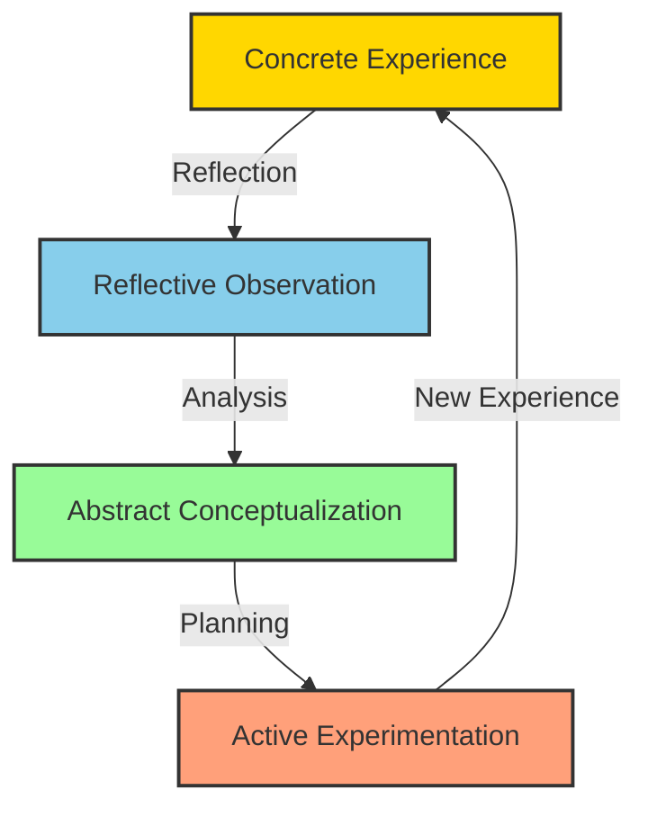

---

> [!pre-read-questions]
> - How do the disciplines of reflective practice, behavioral psychology, and learning theory converge to inform a unified approach to personal growth?
> - What distinguishes systematic self-development from passive experience accumulation, and why does this distinction matter for professional excellence?
> - In what ways can understanding the mechanisms of habit formation and metacognition accelerate your journey toward becoming the person you aspire to be?
> - How might an integrated framework address the common failure modes in personal development—the abandoned resolutions, the stalled progress, the gap between intention and action?

---

> [!abstract]
> This comprehensive exploration synthesizes three foundational domains—[[reflective practice]], [[behavioral psychology]], and [[Learning Theory]]—into a cohesive framework for continuous self-development. We examine how deliberate reflection transforms experience into wisdom, how behavioral science reveals the architecture of sustainable change, and how learning theory illuminates the cognitive processes underlying skill acquisition and knowledge construction. The framework proposed here is neither prescriptive nor simplistic; it acknowledges the profound complexity of human development while offering practical, evidence-based pathways forward.
>
> At its core, this synthesis addresses a fundamental paradox: while human beings possess extraordinary capacity for growth and adaptation, most struggle to translate aspiration into sustained transformation. Through examining the iterative cycles of [[Kolb's Experiential Learning]], the motivational dynamics of [[Self-Determination Theory]], the strategic automaticity of [[implementation intentions]], and the social construction of knowledge articulated by [[Vygotsky]], we construct a meta-framework that honors both the systematic nature of development and the deeply personal nature of growth. This framework is designed for the professional who seeks not merely competence, but mastery; not merely change, but transformation.

# 1.0 📜 INTRODUCTION

> [!the-purpose]
> This article aims to provide a deep, intellectually rigorous examination of continuous self-development as a systematic, iterative process. It transcends the shallow waters of self-help platitudes to explore the foundational theories that explain *how* and *why* humans develop across their lifespan. By integrating insights from reflective practice, behavioral psychology, and learning theory, we construct a comprehensive framework that professionals can apply to their own growth trajectories. This is not a quick-fix manual, but rather a scholarly synthesis intended to build genuine understanding of the mechanisms that govern human development.

> [!quote]
> "We do not learn from experience... we learn from reflecting on experience."
> — John Dewey, *How We Think* (1933)

> [!the-purpose]
> Dewey's insight, articulated nearly a century ago, remains profoundly relevant. It captures the essence of what distinguishes true development from mere accumulation of experiences. Two professionals might work in identical environments for identical durations, yet one emerges transformed while the other remains stagnant. The difference lies not in the quantity of experiences, but in the quality of reflection applied to those experiences. This observation serves as the philosophical anchor for our framework: systematic self-development requires the intentional application of cognitive processes to one's lived experiences.

The contemporary knowledge worker faces a paradoxical challenge. We live in an age of unprecedented access to information, yet genuine wisdom remains elusive. We are inundated with personal development advice, yet studies consistently reveal that most development initiatives fail to produce lasting change.[^1] The [[intention-behavior gap]]—the chasm between what we intend to do and what we actually do—persists across domains from health behaviors to professional skill acquisition.[^2]

This article proposes that the failure of many development efforts stems from a fragmented understanding of the change process. Reflective practice teaches us *what* to examine, but often neglects *how* behavioral change occurs. Behavioral psychology provides powerful models for habit formation but may underemphasize the role of conscious reflection and meaning-making. Learning theory illuminates cognitive processes but sometimes treats motivation as an afterthought.

What is needed—and what this framework provides—is an integrative synthesis that honors the insights of each discipline while recognizing their interdependencies. True development is simultaneously:

**Reflective** (requiring deliberate examination of experience), **Behavioral** (manifesting in observable actions and habits), **Cognitive** (involving the construction of new mental models), **Motivational** (sustained by intrinsic and internalized drivers), and **Social** (occurring within and shaped by cultural contexts).

Consider the journey from novice to expert in any professional domain. The novice physician, fresh from medical school, possesses declarative knowledge—facts, procedures, diagnostic criteria. Yet expertise requires something more: the development of what [[Donald Schön]] termed "[[reflection-in-action]]"—the capacity to think and adjust while performing.[^3] This expertise emerges not from time alone, but from deliberate cycles of experience, reflection, conceptualization, and experimentation. It requires both the behavioral establishment of productive routines and the cognitive construction of increasingly sophisticated mental models. It is motivated by the intrinsic satisfaction of mastery and occurs within a community of practice.

This is the essence of our integrated framework: a systematic approach to becoming, not merely doing.

# 2.0 🧭 HISTORICAL CONTEXT & FOUNDATIONAL THEORIES

To understand continuous self-development as a systematic process, we must first trace the intellectual lineage of its constituent theories. Each discipline contributing to our framework emerged from distinct historical contexts, yet all share a common thread: the recognition that human beings are not passive recipients of experience, but active agents in their own development.

## THE PRAGMATIST ROOTS: DEWEY AND REFLECTIVE THOUGHT

The concept of [[reflective practice]] finds its philosophical origins in American [[Pragmatism]], particularly in the work of John Dewey (1859-1952). Dewey's 1910 work, *How We Think*, distinguished between routine action and reflective action. For Dewey, reflective thought was "active, persistent, and careful consideration of any belief or supposed form of knowledge in the light of the grounds that support it and the further conclusions to which it tends."[^4] This was not mere rumination, but a disciplined form of inquiry.

Dewey proposed that reflective thought follows a pattern: a state of doubt or perplexity, followed by a search for materials to resolve the doubt, culminating in the elaboration and testing of hypotheses. This pattern bears striking similarity to what we now recognize as the scientific method—and indeed, Dewey saw reflective thinking as the application of scientific reasoning to everyday experience.

The pragmatist tradition emphasized that knowledge is validated through action and consequence. Truth is not discovered in abstract contemplation but proven through its practical effects in the world. This action-oriented epistemology would profoundly influence later theorists in both education and psychology.

## EXPERIENTIAL LEARNING: FROM LEWIN TO KOLB

[[Kurt Lewin]] (1890-1947), the founder of social psychology, contributed the insight that "there is nothing so practical as a good theory." His action research methodology and his famous dictum that learning occurs through "a spiral of steps, each of which is composed of a circle of planning, action, and fact-finding about the result of the action"[^5] laid the groundwork for cyclical models of learning.

[[David Kolb]], building explicitly on Lewin (as well as Dewey and Piaget), formalized the [[Experiential Learning Theory]] in his 1984 book *Experiential Learning: Experience as the Source of Learning and Development*.[^6] Kolb's four-stage cycle—Concrete Experience, Reflective Observation, Abstract Conceptualization, and Active Experimentation—provided a systematic framework for understanding how experience transforms into knowledge. Critically, Kolb emphasized that learning is a *process*, not an outcome, and that effective learners move fluidly through all stages of the cycle.

## SCHÖN AND THE REFLECTIVE PRACTITIONER

[[Donald Schön]]'s 1983 work *The Reflective Practitioner* revolutionized thinking about professional expertise.[^7] Schön observed that the problems faced by professionals rarely present themselves as well-formed technical questions. Instead, professionals operate in what he memorably described as the "swampy lowlands" where situations are "messy" and "confusing incapable of technical solution."

Schön distinguished between [[reflection-on-action]] (analyzing experience after the fact) and [[reflection-in-action]] (thinking on your feet during performance). The latter represented a form of artistry—the capacity to frame problems, draw on tacit knowledge, and improvise solutions in real-time. Schön argued that professional education overemphasized technical rationality at the expense of developing reflective capacity.

> [!ask-yourself-this]
> - *How did the* **historical development** *of reflective practice* **shape** *our current understanding?*
>     - The evolution from Dewey's general concept of reflective thought to Schön's situated professional artistry reveals an increasing appreciation for the context-dependent, embodied nature of expertise. Early views treated reflection as primarily cognitive and individual; later frameworks recognized its social, emotional, and action-oriented dimensions. This progression mirrors broader shifts in educational and psychological theory from behaviorism to cognitivism to sociocultural perspectives.
> - *Are there any* **abandoned theories** *that are as interesting as the current ones?*
>     - [[Chris Argyris]]'s distinction between [[single-loop learning]] (correcting errors within existing frameworks) and [[double-loop learning]] (questioning and revising the frameworks themselves) deserves renewed attention. While influential in organizational learning, it is less commonly integrated into personal development frameworks. Yet the capacity to question our own assumptions—to engage in double-loop learning—may be the most critical skill for navigating complexity and avoiding self-deception.

## THE BEHAVIORAL TRADITION: FROM SKINNER TO SELF-DETERMINATION

Concurrent with the development of reflective practice models, behavioral psychology was charting its own evolution. [[B.F. Skinner]]'s [[operant conditioning]] dominated mid-20th century psychology, proposing that behavior is shaped by its consequences: reinforcement increases behavior frequency, punishment decreases it.[^8] This mechanistic view treated organisms as responsive to environmental contingencies, with little room for internal states like motivation or volition.

Yet by the 1970s, cracks were appearing in the behavioral edifice. [[Edward Deci]]'s groundbreaking 1971 experiment demonstrated that external rewards could actually *undermine* intrinsic motivation—a finding that contradicted Skinnerian predictions.[^9] Deci and his colleague [[Richard Ryan]] spent the subsequent decades developing [[Self-Determination Theory]] (SDT), which proposed that human beings have innate psychological needs for [[Autonomy]], [[Competence]], and [[Relatedness]].[^10]

SDT distinguished between different *types* of motivation along a spectrum of autonomy. [[Intrinsic motivation]]—doing something because it is inherently interesting and satisfying—represents the most autonomous form. [[Extrinsic motivation]] varies from completely external (doing something only for reward or to avoid punishment) to integrated (doing something because it aligns with one's values and identity). The theory proposes that environments supporting autonomy, competence, and relatedness foster internalization—the transformation of external regulations into personally endorsed values.[^11]

This shift from quantity to quality of motivation had profound implications for understanding sustainable behavior change. It suggested that lasting development requires not external carrots and sticks, but the satisfaction of fundamental psychological needs.

## CONSTRUCTIVISM AND SOCIAL LEARNING

In cognitive and developmental psychology, [[Jean Piaget]] (1896-1980) pioneered [[constructivism]]—the view that learners actively construct knowledge rather than passively absorbing it.[^12] Piaget proposed that cognitive development occurs through [[Assimilation-(Constructivist-Learning)]] (fitting new experiences into existing schemas) and [[Accommodation-(Constructivist-Learning)]] (modifying schemas to fit new experiences). This dialectic between old and new knowledge drives intellectual growth through increasingly sophisticated stages of reasoning.

Where Piaget emphasized the individual's interaction with the physical world, [[Lev Vygotsky]] (1896-1934) highlighted the social and cultural dimensions of learning. Vygotsky's [[sociocultural theory]] proposed that "every function in the child's cultural development appears twice: first, on the social level, and later, on the individual level."[^13] Learning occurs first through interaction with more knowledgeable others, then becomes internalized.

Vygotsky's concept of the [[Zone of Proximal Development]] (ZPD)—the gap between what a learner can do independently and what they can do with guidance—provided a framework for understanding how social support enables development. His emphasis on language and cultural tools as mediators of thought foreshadowed contemporary situated and distributed cognition theories.

The convergence of these historical streams—pragmatist philosophy, experiential learning models, professional artistry, motivational psychology, and constructivist learning theory—sets the stage for our integrated framework. Each contributes essential insights; none alone is sufficient.

# 3.0 🔭🔬 DEEP EXPOSITION: A MULTI-FACETED ANALYSIS

## 3.1 ⚛️ FOUNDATIONAL PRINCIPLES

Our integrated framework rests on seven foundational principles, each supported by substantial empirical evidence and theoretical development:

> [!principle-point]
> **Core Principle 1: The Primacy of Deliberate Reflection**
> Experience alone is necessary but insufficient for learning and development. The transformation of experience into knowledge requires deliberate, structured reflection that examines not only what happened, but why it happened, what it means, and how future action should be modified. Without reflection, we are condemned to repeat our experiences without learning from them.

This principle synthesizes Dewey's pragmatism with modern cognitive science. [[Metacognition]]—thinking about thinking—has emerged as one of the most powerful predictors of learning outcomes across domains.[^14] Expert performers in fields from medicine to music consistently demonstrate superior metacognitive skills compared to novices. They notice more in their experience, frame problems more productively, and extract actionable insights more readily.

The neural basis for this principle is increasingly well-understood. Brain imaging studies reveal that reflection activates the [[default mode network]], particularly the [[medial prefrontal cortex]], which is involved in self-referential processing and the integration of past experiences with future planning.[^15] Reflection quite literally changes the brain, strengthening neural pathways associated with self-regulation and executive function.

Practically, this principle suggests that development interventions must allocate time and structure for reflection. The common practice of moving immediately from one experience to the next, without pause for processing, undermines learning. Organizations that build "reflection spaces" into their rhythms—after-action reviews, case conferences, journaling practices—systematically outperform those that do not.

> [!quote]
> "Reflection-in-action is a dialogue of thinking and doing through which I become more skillful."
> — Donald Schön, *The Reflective Practitioner*

> [!the-purpose]
> Schön's insight highlights that reflection is not merely retrospective analysis, but an active component of skilled performance itself. The master carpenter "listens" to the wood, adjusting technique in response to its grain and resistance. The expert therapist notices subtle shifts in a client's affect and spontaneously modifies their intervention. This real-time reflection-in-action distinguishes expertise from mere technical proficiency.

> [!principle-point]
> **Core Principle 2: The Three Pillars of Motivation**
> Sustainable behavior change and development require the satisfaction of three innate psychological needs: autonomy (experiencing a sense of volition and choice), competence (experiencing effectiveness and mastery), and relatedness (experiencing connection and belonging). When these needs are supported, development becomes self-sustaining; when thwarted, it becomes dependent on external control and prone to failure.

This principle derives directly from [[Self-Determination Theory]]'s extensive research base—over 1,200 published studies spanning diverse cultures and contexts.[^16] The evidence is clear: need satisfaction predicts not only behavior change, but also psychological well-being, life satisfaction, and even physical health outcomes.

Consider [[Autonomy]]. Research consistently shows that when people feel controlled—whether by external rewards, deadlines, surveillance, or evaluations—their intrinsic motivation diminishes.[^17] The paradox is that controlling approaches often feel efficient in the short-term (they produce immediate compliance) but prove counterproductive over time (they undermine internalization and self-regulation). Development plans imposed by others rarely succeed; development plans chosen by oneself, even if more modest, are far more likely to be sustained.

[[Competence]] needs are equally crucial. The experience of making progress, of getting better at something that matters, is intrinsically rewarding. This is why video games are so compelling—they provide immediate, clear feedback about skill development. Professional development often fails because progress is too slow, too ambiguous, or too distant from action. Effective frameworks create tight feedback loops that make progress visible.

[[Relatedness]] reminds us that development is fundamentally social. We develop not in isolation, but in communities of practice. The support, encouragement, modeling, and accountability provided by others are not merely nice-to-have additions, but essential nutrients for growth. Solo development is possible but effortful; socially embedded development flows more naturally.

> [!definition]
> - **Internalization:**
>     - The process through which externally regulated behaviors and values are transformed into personally endorsed and self-determined motivations. In SDT's framework, internalization progresses through stages from external regulation (purely driven by consequences) → introjected regulation (driven by internal pressures like guilt) → identified regulation (consciously valued) → integrated regulation (fully aligned with self). Full internalization means you no longer *have* to do something; you *want* to do it because it expresses who you are.

> [!principle-point]
> **Core Principle 3: The Behavior Convergence Formula**
> For any behavior to occur at a specific moment, three elements must simultaneously converge: sufficient motivation (desire to act), sufficient ability (capacity and opportunity to act), and an effective prompt (trigger that initiates action). This B=MAP formula provides a diagnostic framework for understanding why intended behaviors fail to materialize and how to design environments that support desired actions.

[[BJ Fogg]]'s [[Behavior Model]] offers elegant parsimony in explaining behavioral action.[^18] Its power lies in its diagnostic utility. When a desired behavior doesn't occur, you can systematically examine which element is missing: Was motivation inadequate? Was the behavior too difficult? Was there no prompt, or was the prompt ineffective?

This principle has profound implications for personal development. Consider someone who intends to exercise regularly but fails. The common diagnosis is "lack of willpower" or "lack of motivation." But Fogg's model suggests more nuanced possibilities:

- **Motivation Issue**: Perhaps the person hasn't connected exercise to something they truly care about (health, longevity, energy, appearance). The motivation exists but is abstract rather than visceral.
- **Ability Issue**: Perhaps the intended exercise is too time-consuming, too expensive, too physically demanding, or requires equipment they don't have access to. The person may be highly motivated but face practical barriers.
- **Prompt Issue**: Perhaps there's simply no trigger to initiate the behavior. The person never encounters a cue that says "now is the time to exercise."

The beauty of the B=MAP framework is that it suggests different interventions depending on the diagnosis. Low motivation? Work on connecting the behavior to core values. Low ability? Simplify the behavior or remove barriers. Missing prompt? Design environmental cues or implementation intentions.

> [!principle-point]
> **Core Principle 4: Strategic Automaticity Through Implementation Intentions**
> Goal achievement is dramatically enhanced—effect size of d=.65—when abstract goal intentions ("I intend to exercise more") are translated into concrete implementation intentions that specify when, where, and how action will be taken ("If it is Monday morning at 7am, then I will put on my running shoes and jog around the park"). These if-then plans delegate control to environmental cues, automating goal-directed behavior and conserving cognitive resources for other tasks.

[[Peter Gollwitzer]]'s research on [[implementation intentions]] represents one of the most robust findings in self-regulation science.[^19] Meta-analyses across 94 studies demonstrate medium-to-large effects on goal attainment. The mechanism is straightforward: by pre-specifying situational cues and responses, implementation intentions create strong cue-action associations. When the specified situation is encountered, the response is initiated automatically—with "features of automaticity including immediacy, efficiency, and redundancy of conscious intent."[^20]

This is strategic automaticity: consciously using if-then planning to create habits. Unlike the reflexive automaticity of long-established habits, strategic automaticity involves deliberate front-loading of decision-making. You decide once (when forming the implementation intention) rather than deciding repeatedly (each time the situation arises). This conserves limited self-control resources for truly novel situations.

Implementation intentions are particularly powerful for overcoming common self-regulation failures: remembering to act (memory failures), seizing fleeting opportunities (recognition failures), initiating action despite initial resistance (initiation failures), and shielding goal pursuit from distractions (shielding failures).[^21]

> [!principle-point]
> **Core Principle 5: Knowledge as Active Construction**
> Learning is not the passive reception of information but the active construction of understanding. Learners integrate new experiences with existing mental models through processes of assimilation (fitting new information into existing schemas) and accommodation (revising schemas to fit new information). This constructive process means that identical experiences produce different learning outcomes depending on the learner's prior knowledge, beliefs, and interpretive frameworks.

Constructivism fundamentally reorients our understanding of learning and development.[^22] If knowledge is actively constructed rather than transmitted, then effective development requires more than exposure to information. It requires:

**Active engagement** with problems and questions that challenge existing understanding
**Opportunities for exploration** and experimentation in low-stakes environments
**Cognitive conflict** that reveals inadequacies in current mental models
**Time and space** for the slow work of schema revision and integration
**Social interaction** that exposes alternative perspectives and interpretations

The implications for professional development are significant. Traditional training often assumes an "empty vessel" model: pour in knowledge, expertise results. But constructivism reveals why this approach fails. Adults bring rich, complex, often contradictory mental models to learning situations. New information is filtered through these models, sometimes distorted, sometimes rejected, sometimes forcing wholesale reconceptualization.

Effective development must engage these existing models explicitly. What do you currently believe about X? How does this new information confirm or challenge that belief? What would it take to change your mind? This metacognitive engagement with one's own thinking is the engine of construction.

> [!principle-point]
> **Core Principle 6: The Social Scaffolding of Development**
> Individual development is enabled and constrained by social and cultural contexts. Learning occurs first on the social plane (between people) and later on the psychological plane (within the individual), as mediated by cultural tools like language, concepts, and practices. The gap between what one can do independently and what one can do with guidance—the Zone of Proximal Development—defines the space where development is possible. Effective development systems provide appropriate scaffolding within this zone.

[[Vygotsky]]'s sociocultural theory challenges individualistic models of development.[^23] While Piaget emphasized the lone child constructing knowledge through interaction with the physical world, Vygotsky emphasized the child embedded in a social world, internalizing cultural practices through interaction with more knowledgeable others.

The [[Zone of Proximal Development]] provides a powerful framework for calibrating development challenges. Tasks far beyond current ability produce frustration and failure; tasks well within current ability produce boredom and stagnation. The sweet spot is tasks at the edge of competence—challenging enough to require effort and growth, achievable enough to maintain engagement.

[[Scaffolding-(Constructivist-Learning)]]—the temporary support structures that enable learners to accomplish more than they could independently—is the mechanism through which social interaction facilitates development. A mentor doesn't do the work for the mentee, but provides strategic assistance: asking guiding questions, offering feedback, modeling expert thinking, simplifying complexity while preserving essential structure. As competence grows, scaffolding is gradually removed (what Vygotsky called "fading"), transferring responsibility to the learner.

This principle highlights the importance of developmental relationships: mentors, coaches, peers, communities of practice. Development is accelerated when we have access to more expert others who can see possibilities we cannot yet imagine and provide support we cannot yet provide ourselves.

> [!principle-point]
> **Core Principle 7: The Iterative Nature of Development**
> Development is not linear but cyclical and iterative. We repeatedly move through phases of experience, reflection, conceptualization, and experimentation. Each cycle produces small increments of growth; accumulated cycles produce transformation. Discontinuities and plateaus are normal features of the developmental landscape, not signs of failure. Long-term development requires patience with process and celebration of small wins.

This final principle integrates insights from [[Kolb]]'s learning cycle, [[continuous improvement]] methodologies like Plan-Do-Study-Act, and research on [[deliberate practice]]. It counters the popular mythology of sudden breakthroughs and overnight success, which both obscures the reality of expert development and sets unrealistic expectations that lead to premature abandonment of development efforts.

[[K. Anders Ericsson]]'s research on expert performance demonstrates that expertise in any domain requires approximately 10,000 hours of deliberate practice—practice that is intentional, focused on improvement, incorporates feedback, and pushes one's boundaries.[^24] There are no shortcuts. Mastery is built through countless small iterations of performance, feedback, and adjustment.

The iterative nature of development also means that failure is information, not verdict. When an experiment doesn't work, when a new behavior doesn't stick, when performance plateaus—these are data points in the learning process, opportunities for reflection and adjustment. The question shifts from "Am I succeeding or failing?" to "What am I learning and how am I adjusting?"

[Continue with Section 4.0 and onwards...]

# 4.0 ⚙️ MECHANISMS AND PROCESSES

## 4.1 THE CYCLE OF EXPERIENTIAL LEARNING

[[Kolb's Experiential Learning Cycle]] provides the structural backbone for understanding how experience becomes knowledge. Let us examine each stage in detail, with particular attention to the cognitive processes and practical applications at each phase:

**Stage 1: Concrete Experience (CE)** represents the "doing" phase. You engage directly with a task, situation, or challenge in the real world. This might be leading a difficult conversation with a team member, attempting a new surgical technique, writing a piece of code, or facilitating a workshop. The experience itself is the raw material for learning—but it is only raw material until processed through subsequent stages.

> [!important]
> The quality of concrete experience matters. [[Deliberate practice]]—experience specifically designed to stretch current capacities, with clear goals, focused attention, and immediate feedback—produces far greater learning than routine repetition. Not all experience is created equal.

**Stage 2: Reflective Observation (RO)** is where you step back and examine the experience. What actually happened? What were the observable outcomes? How did others respond? How did you feel at different moments? This stage requires suspending defensive reactions and action impulses to simply observe and describe.

Structured reflection tools can enhance this stage:

- [[After-Action Reviews]]: What was supposed to happen? What actually happened? Why was there a difference? What will we do differently next time?
- [[journaling]] prompts: What surprised me? What frustrated me? What energized me? What pattern am I noticing?
- [[Video review]]: In domains like teaching or athletics, recording and reviewing performance provides objective data for reflection.

**Stage 3: Abstract Conceptualization (AC)** moves from observation to interpretation. You analyze the experience, connect it to broader principles, generate hypotheses, and build or revise mental models. This is where patterns emerge, where you recognize that this specific experience exemplifies some more general principle.

"Ah, this conversation failed because I didn't adequately understand the other person's concerns before presenting my solution. This reminds me of the principle in negotiation literature about 'seeking first to understand.' I think I often jump too quickly to problem-solving mode. I wonder if this is a general pattern in my leadership approach?"

This stage benefits from:

- **Theoretical knowledge**: Formal frameworks and concepts provide language and structure for making sense of experience
- **Comparative analysis**: Examining similar and contrasting cases to identify common patterns
- **Dialogue**: Discussing interpretations with others exposes alternative framings and challenges assumptions

**Stage 4: Active Experimentation (AE)** completes the cycle by testing the new conceptual understanding in action. Based on your analysis, you formulate a plan: "Next time I face a similar situation, I will do X instead of Y." You design a modified approach, implement it, and generate new concrete experience—launching another cycle.

> [!analogy]
> Think of experiential learning as a spiral staircase. Each complete cycle represents one full rotation—you return to a similar position (concrete experience) but at a higher level of understanding and capability. Over many cycles, the cumulative ascent produces expertise. The spiral metaphor captures both the repetitive and progressive nature of development.



## 4.2 THE ARCHITECTURE OF HABIT FORMATION

While Kolb's cycle explains how we learn *from* experience, [[Habit Formation]] explains how learned behaviors become automatic and sustainable. Understanding the neuroscience and psychology of habits is essential for turning insights into lasting change.

[[Charles Duhigg]], synthesizing decades of behavioral neuroscience research, describes the [[habit loop]] consisting of three elements: **cue** (trigger), **routine** (behavior), and **reward** (outcome that reinforces the behavior).[^25] This loop, encoded primarily in the [[basal ganglia]], operates largely below conscious awareness once established.

The formation of a new habit follows a predictable trajectory:

**Phase 1: Conscious Initiation** (Weeks 1-2)
Initially, performing the new behavior requires significant conscious effort and self-control. You must remember to do it, resist competing temptations, and actively initiate action. This phase is metabolically expensive—the [[prefrontal cortex]] (the brain's executive control center) is highly active. Many development efforts fail here because people underestimate how much effort this phase requires and don't design adequate support.

**Phase 2: Increasing Automaticity** (Weeks 3-8)
With consistent repetition in a stable context, the behavior begins to require less conscious effort. The cue-response association strengthens. You start to feel "pulled" toward the behavior when the cue appears. [[Context-dependent memory]] plays a crucial role: the physical and temporal context becomes encoded as part of the action sequence. Research by [[Wendy Wood]] and colleagues shows that approximately 40-45% of daily behaviors are habitual—performed in the same context, virtually every day.[^26]

**Phase 3: Habit Stability** (Week 9+)
The behavior becomes truly automatic. The cue reliably triggers the action without conscious deliberation. The neural signature shifts from prefrontal to basal ganglia activation. The habit is now "chunked"—the entire sequence fires as a unit.

**Phase 4: Habit Strength and Flexibility** (Ongoing)
Mature habits show remarkable resistance to decay, but they're not inflexible. Context changes can disrupt habits (moving to a new city, starting a new job), providing windows for intentional modification. Strong habits can be consciously overridden when necessary, but the default is automatic execution.

> [!example]
> Consider learning to drive. Initially, every action—checking mirrors, turning the steering wheel, applying pressure to pedals—requires intense concentration. After months of practice, driving becomes "second nature." You can navigate familiar routes while carrying on a conversation or listening to a podcast, with the driving behavior proceeding automatically. Yet you retain the ability to consciously control when necessary (emergency situations, unfamiliar roads). This is the hallmark of a mature habit: automatic execution with preserved capacity for conscious override.

[[Implementation intentions]] (Principle 4) work by accelerating habit formation. By specifying the cue in advance ("If it is Monday at 7am"), you strengthen the cue-action association more rapidly than would occur through trial and error. The if-then plan essentially pre-loads the habit loop.

## 4.3 THE MOTIVATION SPECTRUM AND INTERNALIZATION

Not all motivations are created equal. [[Self-Determination Theory]] distinguishes between different *types* of motivation along a continuum of autonomy:[^27]

**External Regulation**: Behavior driven purely by external consequences (rewards, punishments, compliance with external demands). Example: An employee attends professional development workshops solely because they are required and faces negative consequences if they don't.

**Introjected Regulation**: Behavior driven by internal pressures—ego involvement, guilt, shame, or pride—but these pressures feel coercive rather than authentic. Example: A professional pursues a certification because they feel they "should," because "good professionals do this," or because they would feel like a failure if they didn't, even though they have little genuine interest.

**Identified Regulation**: Behavior that is consciously valued and chosen because it serves important personal goals, even if the activity itself isn't inherently enjoyable. Example: A manager engages in leadership training because they genuinely value becoming a better leader, even though the training activities feel like work rather than play.

**Integrated Regulation**: The most autonomous form of extrinsic motivation. The behavior is fully aligned with one's sense of self, values, and identity. Example: A physician pursues continuing medical education because learning and growth are central to their identity as a physician; developing expertise is inseparable from being the kind of physician they aspire to be.

**Intrinsic Motivation**: Behavior undertaken purely for its own sake, because it is inherently interesting, enjoyable, or satisfying. Example: A software developer spends evenings coding personal projects because they find programming fascinating and absorbing.

The critical insight is that behavior can be sustained by different types of motivation, but with very different consequences for persistence, quality, and well-being. [[Controlled motivation]] (external and introjected) produces brittle compliance—high effort, low satisfaction, quick abandonment when surveillance ceases. [[Autonomous motivation]] (identified, integrated, and intrinsic) produces flexible persistence—behavior continues even in the face of obstacles, produces higher quality outcomes, and enhances rather than depletes well-being.[^28]

[[Internalization]]—the transformation of controlled into autonomous motivation—is thus the Holy Grail of sustainable behavior change. Three conditions support internalization:

1. **Autonomy Support**: Providing rationale without being controlling, offering choice within structure, acknowledging feelings and perspectives, minimizing external pressures
1. **Competence Support**: Providing optimal challenge, clear feedback, opportunities for mastery, celebration of growth
1. **Relatedness Support**: Connection to others who value the behavior, sense of belonging to a community of practice, caring relationships

When development environments support these three needs, internalization proceeds naturally. When they thwart these needs, development remains dependent on external control and rarely sticks.

## 4.4 THE SOCIAL CONSTRUCTION OF KNOWLEDGE

[[Vygotsky]]'s insight that higher mental functions originate in social interaction has profound implications for how we structure development opportunities. Learning is not primarily an individual cognitive process, but a social process of participation in valued practices.[^29]

Consider how a medical student becomes a physician. Formal coursework provides necessary declarative knowledge (anatomy, pharmacology, pathophysiology). But the transformation from student to doctor occurs primarily through [[legitimate peripheral participation]] in communities of medical practice.[^30] The student initially observes (peripheral participation), then assists, then performs under supervision, gradually taking on more responsibility and more complex cases. Throughout, they're learning not just technical skills but the ways of thinking, perceiving, and acting that define medical expertise.

This is [[situated learning]]—learning embedded in authentic activity, context, and culture. Critically, the student is learning not merely from more expert individuals but from the entire community of practice. They observe how senior and junior physicians interact. They absorb unspoken norms about what counts as thorough analysis, what qualifies as an interesting case, when to ask for help, how to present information concisely. The [[hidden curriculum]]—implicit lessons about professional identity and culture—may be as important as the formal curriculum.[^31]

[[Scaffolding-(Constructivist-Learning)]] mechanisms enable this socially-mediated development:

- **Modeling**: Expert demonstrates while explaining their reasoning
- **Coaching**: Expert observes learner performance and provides targeted feedback
- **Articulation**: Learner explains their reasoning, making tacit thinking explicit
- **Reflection**: Learner compares their performance to expert performance or to their own goals
- **Exploration**: Learner tries novel approaches with safety net of expert guidance

As competence grows, scaffolding is gradually removed ([[fading]]), with the goal of developing autonomous capability. The endpoint is not dependence on the expert, but internalization of expert practices.

> [!key-claim]
> Professional development is most effective when it simulates or embeds learners within communities of practice, provides graduated scaffolding, and explicitly addresses the identity transformation from novice to expert. Isolated training divorced from authentic practice context rarely produces transfer.

## 4.5 METACOGNITION AND SELF-REGULATED LEARNING

The capacity to monitor, evaluate, and adjust one's own thinking and learning—[[Metacognition]]—emerges as perhaps the single most important skill for lifelong development.[^32] While cognitive skills determine what you can do, metacognitive skills determine whether you actually do it effectively.

[[Self-Regulated Learning]] (SRL) frameworks describe a cyclical process with three phases:[^33]

**Forethought Phase**: Goal setting, strategic planning, self-efficacy beliefs, outcome expectations, task value and interest. Before beginning a learning task, effective self-regulated learners ask: What am I trying to achieve? What strategies might work? Do I believe I can succeed? Is this worth the effort?

**Performance Phase**: Self-control strategies (attention focusing, task strategies) and self-observation (metacognitive monitoring). During the task, effective learners maintain focused attention, select and implement appropriate strategies, and continuously monitor their progress and understanding. Am I comprehending this material? Is this strategy working? Do I need to change approaches?

**Self-Reflection Phase**: Self-judgment (evaluating performance against standards) and self-reaction (satisfaction/dissatisfaction, adaptive/defensive responses). After the task, effective learners evaluate outcomes, attribute results to controllable factors, and plan adjustments for next time. Did I meet my goal? What contributed to success or failure? What will I do differently next time?

Metacognitive skills can be explicitly developed through:

- **Thinking-aloud protocols**: Verbalizing thoughts while problem-solving makes thinking visible and subject to examination
- **Self-questioning strategies**: Systematically asking yourself monitoring questions ("Do I understand this?" "What's the main idea?" "How does this connect to what I know?")
- **Learning journals**: Regular written reflection on learning process, not just content
- **Self-assessment rubrics**: Explicit criteria for evaluating one's own work
- **Peer review**: Evaluating others' work develops evaluative criteria applicable to one's own work

The metacognitive sophistication of experts versus novices is striking. Experts notice more (seeing patterns invisible to novices), know more about what they know (accurate self-assessment), and flexibly deploy a larger repertoire of strategies. They also recognize when they're confused or stuck and know how to get themselves unstuck. Novices often don't know that they don't know.

# 5.0 🔬 OBSERVATIONAL EVIDENCE

## 5.1 EMPIRICAL SUPPORT FOR REFLECTIVE PRACTICE

> [!evidence]
> *The* **primary evidence** *supporting reflective practice comes from:*
> - [[Gibbs' (1988) Reflective Cycle studies]], which demonstrated that structured reflection significantly improved learning outcomes in nursing education. Nurses who engaged in systematic reflection showed enhanced clinical judgment, better patient outcomes, and greater professional confidence compared to those who did not reflect systematically.[^34]
>   - **This showed:** Reflection must be structured and deliberate. Unguided rumination does not produce the same learning effects as reflection following a systematic framework.
> 
> - [[Schön's (1983) observational studies]] of architects, psychotherapists, engineers, and town planners, which revealed that expert practitioners engage in constant micro-cycles of reflection-in-action, framing and reframing problems as they unfold.[^35]
>   - **This showed:** Expert practice is not the straightforward application of technical rules, but artful improvisation informed by reflective thinking. Expertise includes knowing when rules apply and when to break them.
> 
> - [[Meta-analyses of medical education]] (Mann et al., 2009) examining reflection interventions across multiple studies and contexts, finding moderate positive effects (effect sizes ranging from d=0.19 to d=0.69) on clinical reasoning, diagnostic accuracy, and professional development.[^36]
>   - **This showed:** Reflection produces tangible improvements in professional performance, not merely subjective feelings of growth. The effect is strengthened when reflection is scaffolded, social (discussed with others), and linked to action.

> [!key-claim]
> Based on the evidence, a **key claim** is that:
> Reflection is not merely "thinking about" experience but involves specific cognitive operations: description of concrete details, analysis of causes and consequences, synthesis with theoretical frameworks, evaluation against standards or goals, and projection of modified future action. These operations must be deliberately practiced; they don't occur spontaneously for most people.

## 5.2 EMPIRICAL SUPPORT FOR SELF-DETERMINATION THEORY

SDT stands as one of the most empirically validated theories in psychology, with research spanning five decades and hundreds of studies across cultures, age groups, and life domains:[^37]

> [!evidence]
> *Evidence from controlled experiments:*
> - Deci's original (1971) study showing that external rewards undermined intrinsic motivation for interesting activities, a finding replicated across hundreds of subsequent studies.[^38]
>   - **This showed:** The overjustification effect—when you pay people for what they already enjoy, the payment can crowd out internal motivation. The activity comes to be seen as work rather than play.
> 
> - Field experiments demonstrating that autonomy-supportive (vs. controlling) teaching styles produce better learning outcomes, higher creativity, greater conceptual understanding, and lower dropout rates.[^39]
>   - **This showed:** How environments are structured (autonomy-supporting vs. controlling) matters as much as or more than what is taught. Content delivery without need support produces shallow, fragile learning.
> 
> - Longitudinal studies showing that need satisfaction predicts well-being trajectories over time, with effects holding after controlling for baseline well-being, personality, and life circumstances.[^40]
>   - **This showed:** The three basic needs are not mere preferences but genuine psychological requirements—thwarting them over time produces measurable decrements in mental health and functioning.

> [!quote]
> "Human beings can be proactive and engaged or, alternatively, passive and alienated, largely as a function of the social conditions in which they develop and function."
> — Ryan & Deci (2000), "Self-determination theory and the facilitation of intrinsic motivation, social development, and well-being"

> [!the-purpose]
> This quote captures SDT's central thesis—that contexts shape motivation quality. It suggests that organizations, educators, and individuals can intentionally create conditions that foster or undermine autonomous motivation. The practical implication is that development interventions should be evaluated not just on whether they produce behavior change, but on what *kind* of motivation they engender.

## 5.3 EMPIRICAL SUPPORT FOR IMPLEMENTATION INTENTIONS

[[Gollwitzer and Sheeran's (2006) meta-analysis]] of 94 independent studies examining implementation intention effects represents one of the most comprehensive evaluations of any self-regulation strategy:[^41]

> [!evidence]
> **Key findings:**
> - **Overall effect size: d = .65** (medium to large effect on goal attainment)
> - Implementation intentions were effective across diverse goal domains: health behaviors (exercise, diet, medical screening), academic performance, environmental conservation, negotiation, time management
> - Effects were particularly strong for "getting started" problems (remembering to act, seizing opportunities, overcoming initial reluctance): **d = .54 to .78**
> - Effects were maintained for "staying on track" problems (shielding goal pursuit from distractions, resisting temptation): **d = .77**
> - Mechanism confirmed: Implementation intentions enhance cue accessibility (faster detection of critical situations) and automate responses (faster, more efficient action initiation)

> [!key-claim]
> Implementation intentions work by strategically offloading the burden of decision-making from the moment of action to an earlier planning phase. Once the if-then plan is set, the specified situation automatically triggers the response without requiring effortful self-control in the moment. This is especially valuable given that self-control is a limited resource that becomes depleted with use.

## 5.4 EMPIRICAL SUPPORT FOR CONSTRUCTIVISM AND SOCIAL LEARNING

Evidence for constructivist learning principles comes from decades of research comparing active, problem-based learning approaches to traditional lecture-based instruction:[^42]

> [!evidence]
> - [[Problem-Based Learning (PBL) meta-analyses]] show superior long-term retention, deeper understanding, and better transfer to novel situations compared to traditional instruction, though traditional instruction may produce better short-term recall of facts.[^43]
>   - **This showed:** What you do with information matters more than how much information you receive. Active struggle with problems promotes deeper encoding and more flexible knowledge.
> 
> - [[Vygotsky-inspired research on the Zone of Proximal Development]] demonstrates that tasks calibrated to the learner's edge of competence (challenging but achievable with support) produce optimal learning, while tasks too easy or too hard produce sub-optimal outcomes.[^44]
>   - **This showed:** There is an optimal difficulty level for learning—too easy produces boredom and minimal growth; too hard produces anxiety and giving up. The "Goldilocks principle" for development.
> 
> - [[Studies of apprenticeship and mentoring relationships]] show that novice-expert interaction accelerates skill development more than solo practice or peer collaboration alone.[^45]
>   - **This showed:** Access to expert models of thinking and performance is crucial. Watching and working alongside experts provides otherwise invisible information about strategy selection, problem-framing, and quality standards.

# 6.0 🌍 BROADER IMPLICATIONS

## 6.1 FOR PROFESSIONAL DEVELOPMENT AND TRAINING

The integrated framework has immediate applications for how organizations structure professional development:

**Shift from Event-Based to Process-Based Development**: Traditional one-off workshops or training sessions violate nearly every principle of the framework. They provide no time for reflection, no opportunity for active construction of knowledge, no scaffolding in authentic contexts, and no support for habit formation. Development must be reconceptualized as an ongoing process punctuated by interventions, not as discrete events.

**Design for Need Satisfaction**: Professional development initiatives should be evaluated on whether they support autonomy, competence, and relatedness. Does the development plan honor professional agency (autonomy), provide appropriately challenging learning with clear feedback (competence), and foster connections with communities of practice (relatedness)? Programs that satisfy these needs will be internalized; those that don't will be complied with minimally or abandoned.

**Build Reflection into Workflow**: Rather than treating reflection as extra work, build it into the rhythm of professional life. After-action reviews, case conferences, learning journals, peer consultation groups—these should be considered core work activities, not optional add-ons.

**Create Developmental Partnerships**: The framework highlights that development is accelerated through relationships. Organizations should invest in mentoring, coaching, and peer learning communities. The mentor-mentee relationship is not just information transfer, but guided participation in a community of practice.

> [!connection-ideas]
> *The principles discussed here* **strongly connect to the field of:**
>   - [[Organizational Learning]] and the concept of [[Learning Organizations]] articulated by Peter Senge
>   - **The reason:**
>     - Organizations that master continuous learning at the collective level must first support continuous learning at the individual level. The five disciplines Senge describes (personal mastery, mental models, shared vision, team learning, systems thinking) all depend on individuals who engage in reflective practice, construct and revise their mental models, and sustain motivation for growth. Our framework provides the micro-level processes that enable Senge's macro-level organizational transformation.

## 6.2 FOR EDUCATIONAL DESIGN AND PEDAGOGY

The framework suggests that educational design should prioritize:

**Authentic Problems Over Abstract Content**: Learning is motivated and meaningful when it addresses problems that learners recognize as worth solving. Rather than front-loading abstract content, begin with rich, complex problems that reveal why certain knowledge is useful.

**Guided Discovery Over Direct Instruction**: Pure discovery is inefficient and can lead to misconceptions; pure instruction is passive and superficial. The sweet spot is guided discovery—learners actively explore with structured support that ensures productive struggle rather than frustrating flailing.

**Metacognitive Skill Development**: Explicitly teach self-regulated learning strategies alongside content. Model expert thinking aloud. Provide opportunities for self-assessment and reflection. The goal is not just to impart knowledge but to develop learners who know how to learn.

**Social Learning Structures**: Design for collaboration, peer review, and learning communities. Knowledge construction is fundamentally social; isolating learners undermines this.

## 6.3 FOR PERSONAL LIFE MANAGEMENT

For individuals seeking personal growth outside professional contexts, the framework offers guidance:

**Connect Development Goals to Core Values**: SDT research is unequivocal: goals pursued for autonomous reasons (aligned with values and identity) are more likely to be achieved and contribute to well-being. Before setting goals, clarify *why* the goal matters. If the answer is "I should" or "others expect me to," the goal is built on a shaky foundation. If the answer is "this expresses who I am" or "this moves me toward the person I want to become," the foundation is solid.

**Start Small and Build Automaticity**: The Fogg Behavior Model suggests starting with tiny habits—behaviors so small that ability is never in question. Want to build a reading habit? Start with reading one page per day. Want to meditate? Start with one breath. Once the behavior is automatic (the routine is established), you can expand it.

**Use Implementation Intentions Liberally**: The evidence for if-then planning is too strong to ignore. For any goal that matters, formulate specific implementation intentions: When will you act? Where? What will trigger the behavior? Research shows this simple addition increases goal achievement by roughly 30%.

**Seek Developmental Relationships**: Find mentors, join learning communities, create accountability partnerships. Development in isolation is possible but difficult. Social support provides motivation, feedback, alternative perspectives, and belonging.

**Build Reflection Rituals**: Whether through journaling, weekly reviews, or regular conversations with a development partner, create structured time for reflection. Without reflection, experience remains unconverted potential.

> [!counter-argument]
> **An important counter-argument or alternative perspective suggests that:**
> Some critics argue that the emphasis on deliberate, systematic development underestimates the value of serendipity, playfulness, and "wasting time." [[Cal Newport]] and others caution that over-structured self-improvement can become counterproductive, crowding out the unstructured exploration that often yields the most creative insights. The obsessive optimization of every hour can paradoxically undermine the well-being it aims to serve.
> **This is important because:**
> It highlights that the framework should be applied with wisdom and balance. There is a place for systematic development *and* for unstructured play, for goal-directed action *and* for aimless wandering. The framework describes *how* development works when you engage in it deliberately, but it doesn't prescribe that every moment should be developmental. Rest, recreation, and randomness have their own essential roles in a flourishing life.

## 6.4 FOR POLICY AND SYSTEM DESIGN

At the societal level, the framework suggests policy implications:

**Support for Lifelong Learning Infrastructures**: If development is continuous and iterative, societies need systems that enable ongoing learning across the lifespan. This means accessible continuing education, recognition of prior learning, modular credentialing, and removal of barriers to mid-career transitions.

**Workplace Policies that Enable Development**: Policies around work hours, professional development time, sabbaticals, and job rotation can either support or thwart continuous development. Organizations and regulators should evaluate policies through the lens of need satisfaction: Do they support autonomy, competence, and relatedness?

**Educational Systems that Develop Self-Regulation**: If self-regulated learning is the most valuable meta-skill, educational systems should prioritize developing it. This means shifting from compliance-based to mastery-based models, from teacher-directed to student-centered approaches, from content coverage to deep understanding.

# 7.0 ❔ FRONTIER RESEARCH

## 7.1 NEUROSCIENCE OF SELF-DIRECTED CHANGE

Emerging neuroscience research is illuminating the brain mechanisms underlying self-directed behavior change. Studies using functional MRI reveal that successful self-regulation involves a delicate dance between [[prefrontal cortex]] (conscious control), [[Anterior Cingulate Cortex]] (conflict monitoring), [[insula]] (interoceptive awareness), and [[striatum]] (habit formation).[^46]

Particularly intriguing is research on [[Neuroplasticity]] showing that sustained reflective practice produces measurable changes in brain structure. [[Sara Lazar]]'s work demonstrates that experienced meditators show increased cortical thickness in regions associated with attention and sensory processing.[^47] If reflection changes the brain, what optimal "dose" of reflection produces maximal neural reorganization? How long must practice continue before structural changes emerge?

Another frontier is understanding individual differences in the capacity for self-directed change. Why do some individuals show remarkable neuroplasticity while others show limited change despite similar practices? Emerging evidence suggests [[BDNF (Brain-Derived Neurotrophic Factor)]] genetic variants may moderate learning capacity, but this is early-stage research with many open questions.[^48]

> [!question]
> *What is the* **single biggest unanswered question** *in this field right now?*
> How can we personalize development approaches based on neurobiological individual differences? If people vary in baseline executive function, stress reactivity, reward sensitivity, and neuroplasticity, should development frameworks be tailored accordingly? Current approaches are largely one-size-fits-all; precision development based on neurocognitive profiling may be the next frontier.

## 7.2 DIGITAL TECHNOLOGIES AND SELF-DEVELOPMENT

The proliferation of [[behavior tracking devices]], [[habit formation apps]], and [[AI-powered coaching]] raises fascinating questions about how technology can support (or undermine) continuous development:

**Quantified Self Movement**: The ability to track behaviors, biometrics, and even emotional states in fine-grained detail provides unprecedented data for reflection. But does more data lead to more learning? Research suggests the answer is "sometimes"—quantification can increase awareness and reveal patterns, but it can also shift focus from intrinsic to external motivation, undermining autonomy.[^49]

**AI-Augmented Reflection**: Could machine learning algorithms detect patterns in development data (journals, assessments, tracked behaviors) that humans miss? Preliminary research on [[computational narrative analysis]] suggests AI can identify themes in reflective writing that predict later behavior change. The promise is AI as "reflection partner" that surfaces insights. The risk is outsourcing sense-making to black-box algorithms, potentially undermining the active construction process essential to learning.[^50]

**Virtual Reality for Skills Training**: VR provides safe environments for deliberate practice of high-stakes skills (surgical procedures, crisis management, difficult conversations). Early evidence suggests VR practice can produce transfer to real-world performance. But crucial questions remain about what aspects of VR practice drive transfer and whether virtual practice develops the tacit, embodied knowledge characteristic of expertise.[^51]

## 7.3 BEHAVIOR CHANGE AT SCALE

While the framework focuses on individual development, applying these principles at scale (community-level, population-level) presents unique challenges:

**Scalability versus Personalization Trade-off**: Effective development requires personalization (appropriate challenge, scaffolding matched to ZPD, autonomous goal-setting). But personalization is resource-intensive. How can we design development systems that scale while preserving the essential personalization?

Emerging approaches include:

- **Adaptive learning technologies** that personalize content difficulty based on performance
- **Peer-to-peer learning networks** that distribute mentoring/coaching functions
- **Modular, choose-your-own-path development** that provides structure while enabling autonomy

**Cultural Considerations**: Most research on development has been conducted in Western, individualistic cultures. Do the principles generalize? Early cross-cultural SDT research suggests basic needs are universal, but their expression and satisfaction may vary culturally.[^52] For instance, autonomy in collectivist cultures may involve alignment with group goals rather than independence from them. Frameworks must be culturally adaptive.

## 7.4 INTEGRATION OF EMBODIED AND SITUATED APPROACHES

A emerging critique of reflective practice models is that they privilege conscious, verbal cognition over embodied, situated knowing. [[Hubert Dreyfus]]'s phenomenological critique argues that expertise is not rule-application but skilled coping—embodied, intuitive responses that cannot be fully verbalized.[^53]

This raises questions: Can embodied expertise be developed through reflection, or does reflection paradoxically interfere with the intuitive flow of expert performance? [[Sian Beilock]]'s research on "paralysis by analysis" shows that explicit monitoring can disrupt well-learned motor skills.[^54] The frontier question is how to integrate embodied cognition insights with reflective practice—acknowledging that some forms of learning require getting *out of* one's head, not deeper into it.

# 8.0 🦕 CONCLUSION

> [!summary]
> We have journeyed through the theoretical foundations and empirical evidence supporting an integrated framework for continuous self-development. The synthesis reveals that development is simultaneously:
>
> **A reflective process** requiring deliberate examination of experience through structured cycles of observation, analysis, and planning (Kolb, Schön, Gibbs)
>
> **A motivational process** requiring satisfaction of basic psychological needs for autonomy, competence, and relatedness to sustain engagement (Deci & Ryan)
>
> **A behavioral process** requiring the strategic use of prompts and implementation intentions to translate intentions into habits (Fogg, Gollwitzer)
>
> **A cognitive process** requiring active construction of knowledge through assimilation and accommodation of experiences (Piaget)
>
> **A social process** occurring within zones of proximal development, supported by scaffolding from more knowledgeable others (Vygotsky)
>
> No single theoretical lens captures the full complexity of human development. Each contributes essential insights; each, alone, is incomplete. The power of integration lies in recognizing that effective development strategies must address all dimensions simultaneously. A brilliant reflection practice without attention to motivation will produce insights that never translate to action. Sophisticated behavior design without reflection will create habits that lack meaning and direction. Social learning without individual agency will produce conformity rather than growth.
>
> The framework we have constructed is not a recipe for mechanical application, but a conceptual toolkit for navigating the lifelong journey of becoming. It suggests that sustained development requires:
>
> **Regular reflection** built into the rhythm of professional and personal life
> **Environments** that support autonomy, competence, and relatedness
> **Strategic use of implementation intentions** to bridge intention and action
> **Active engagement** with challenging problems that stretch current capacity
> **Developmental relationships** that provide scaffolding, feedback, and community
> **Patience with process**, recognizing that mastery is built through countless small iterations
>
> Perhaps most importantly, the framework reveals that development is not something that happens *to* us or is done *to* us, but something we actively *do*. We are not passive recipients of development interventions, but active agents in our own becoming. This recognition is simultaneously humbling (there are no shortcuts, no one can do the work for us) and empowering (we have agency, we can choose our path, we can design our growth).
>
> The gap between current self and potential self is bridged not by wishing or hoping, but by systematic, reflective, socially-embedded practice over time. This is the work of a lifetime—challenging, sometimes frustrating, often exhilarating, always worthwhile. The integrated framework we have explored provides the theoretical foundation and practical guidance for undertaking this essential human project with intention, intelligence, and hope.

# 9.0 🧠 KEY QUESTIONS

> [!ask-yourself-this]
>
> - *How would* **I explain** *the* *central idea of this article to someone with no background in this field?* (**The Feynman Technique**)
>     - Imagine you want to get better at something—anything. Maybe you want to become a better leader, or learn a new skill, or change a habit. Most people approach this haphazardly: they read a book, attend a workshop, try something for a while, then move on to the next thing. But this article says there's a better way—a *systematic* way.
> 
>     - The core idea is that genuine development requires three things working together: **reflection** (thinking deeply about your experiences, not just having experiences), **smart habits** (using proven techniques from psychology to make new behaviors stick), and **the right environment** (surrounding yourself with people and structures that support your growth). It's like the difference between wandering randomly through a forest and having a compass, a map, and a guide. Both might eventually get you where you're going, but one is much more efficient and reliable. The article pulls together decades of research to show exactly how these pieces fit together and how you can use them in your own life.
> 
> - *What was the most* **surprising or counter-intuitive** *concept presented?* **Why**?
>     - The most surprising insight is that external rewards can actually *reduce* motivation for activities we find inherently interesting. This seems backwards—shouldn't rewarding something make us want to do it more? But Self-Determination Theory shows that when you pay people for activities they already enjoy, it can shift their mindset from "I do this because I love it" to "I do this because I'm paid." The payment crowds out the intrinsic satisfaction. It's counter-intuitive because our entire society is built on the assumption that carrots and sticks are the fundamental drivers of behavior. This research suggests that approach works for things people don't care about, but actually backfires for things they do care about. The practical implication is profound: to sustain development, we need to connect it to our core values and identity (intrinsic motivation), not rely on external pressures.
> 
> - *What* **pre-existing knowledge** *did this article connect with or challenge*?
>     - This article strongly connects with [[growth mindset]] research (Carol Dweck) and challenges [[fixed mindset]] assumptions about talent and ability.
> 
>       - Dweck's work on growth mindset argues that believing abilities can be developed (rather than being fixed traits) predicts greater achievement. Our framework extends this by showing *how* development actually works—the specific processes and conditions that enable growth. Where Dweck focuses on beliefs about ability, our framework provides the architecture for actualizing development. The two are complementary: growth mindset provides the psychological stance ("I can develop"), while our integrated framework provides the roadmap and toolkit ("here's how development happens").
> 
>       - The framework challenges the implicit fixed mindset embedded in much professional practice—the assumption that people either have or don't have leadership ability, creative talent, strategic thinking capacity, etc. By revealing the systematic processes underlying development (reflection, deliberate practice, need satisfaction, scaffolding), the framework demonstrates that these capacities can be cultivated through intentional practice over time.

> [!quote]
> "The essence of the independent mind lies not in what it thinks, but in how it thinks."
> — Christopher Hitchens

> [!the-purpose]
> While Hitchens was writing about intellectual independence rather than personal development per se, his observation captures a crucial truth about our framework. The goal is not to prescribe *what* to develop (that must be personally meaningful), but to clarify *how* development works. By understanding the processes—cycles of reflection, need satisfaction, strategic automaticity, social scaffolding—we become more effective agents of our own growth. We develop not just specific skills or knowledge, but the meta-competence of development itself: the capacity to identify what we need to learn, design appropriate learning experiences, persist through difficulty, and transform ourselves continuously. This is the independent mind applied to the project of becoming.

> [!links-to-related-notes]
>
> - Identify **three key terms** or **concepts** from this article.
> - *Write your* **own definition** *for each and create a new note to link them back to this one*.
> 
> 1. [[Zone of Proximal Development]]
>     - The gap between what a learner can accomplish independently and what they can accomplish with guidance from a more knowledgeable other. This concept, developed by Vygotsky, defines the optimal space for development—challenges that are neither too easy (already mastered) nor too hard (beyond reach even with help). Effective development experiences target the ZPD, providing appropriate scaffolding that enables learners to accomplish more than they could alone while gradually building independent capability. The ZPD is dynamic, shifting as competence grows, which means development systems must continuously adjust challenge levels.
> 
> 1. [[Implementation Intentions]]
>     - Concrete if-then plans that specify when, where, and how a goal-directed behavior will be enacted ("If situation X occurs, then I will do Y"). Implementation intentions create strategic automaticity by pre-committing to a response in a specified situation, thereby offloading decision-making from the moment of action to an earlier planning phase. Research shows implementation intentions produce medium-to-large effects (d=.65) on goal achievement by enhancing cue detection and automating responses. They are particularly effective for overcoming common self-regulation failures like forgetting to act, missing opportunities, or struggling to initiate action.
> 
> 1. [[Self-Determination Theory]]
>     - A comprehensive theory of human motivation proposing that well-being and optimal functioning depend on satisfaction of three basic psychological needs: autonomy (experiencing volition and self-endorsement), competence (experiencing effectiveness and growth), and relatedness (experiencing connection and belonging). SDT distinguishes between different types of motivation along a continuum of autonomy, from controlled (external and introjected) to autonomous (identified, integrated, and intrinsic). The theory proposes that contexts supporting the three basic needs foster internalization—the transformation of external regulations into personally valued commitments—which is essential for sustainable behavior change and development.

> [!thoughts]
> - *What is your* **analysis** *of this information?*
>     - This synthesis reveals both the maturity and fragmentation of the personal development field. On one hand, we have decades of rigorous research producing robust, replicable findings about how humans learn, change, and grow. The effect sizes are real, the mechanisms are increasingly well-understood, and the practical implications are clear. This is genuine knowledge, not speculation or folk wisdom.
> 
>     - On the other hand, this knowledge remains balkanized in disciplinary silos. Educators know Kolb but may be unfamiliar with Deci and Ryan. Industrial-organizational psychologists know behavior change models but may undervalue reflective practice. The failure to integrate across these domains likely explains why so many development initiatives fail—they address one dimension while neglecting others.
> 
>     - The most exciting implication of this framework is its potential to improve not just individual development, but development system design. Organizations, educational institutions, and policy-makers could apply these principles to create environments that systematically enable growth rather than accidentally hindering it. The gap between what we *know* works and what is actually *implemented* in practice remains large. Closing that gap may be the most important next step.

# 10.0 📚 REFERENCE/APPENDIX

> [!cite]
>
> :[^1] Gollwitzer, P. M., & Sheeran, P. (2006). Implementation intentions and goal achievement: A meta-analysis of effects and processes. *Advances in Experimental Social Psychology*, 38, 69-119. <https://doi.org/10.1016/S0065-2601(06)>38002-1
>
> :[^2] Sheeran, P., & Webb, T. L. (2016). The intention-behavior gap. *Social and Personality Psychology Compass*, 10(9), 503-518. <https://doi.org/10.1111/spc3.12265>
>
> :[^3] Schön, D. A. (1983). *The reflective practitioner: How professionals think in action*. Basic Books.
>
> :[^4] Dewey, J. (1933). *How we think: A restatement of the relation of reflective thinking to the educative process*. D.C. Heath and Company.
>
> :[^5] Lewin, K. (1951). *Field theory in social science*. Harper & Row.
>
> :[^6] Kolb, D. A. (1984). *Experiential learning: Experience as the source of learning and development*. Prentice Hall.
>
> :[^7] Schön, D. A. (1983). *The reflective practitioner: How professionals think in action*. Basic Books.
>
> :[^8] Skinner, B. F. (1953). *Science and human behavior*. Macmillan.
>
> :[^9] Deci, E. L. (1971). Effects of externally mediated rewards on intrinsic motivation. *Journal of Personality and Social Psychology*, 18(1), 105-115.
>
> :[^10] Deci, E. L., & Ryan, R. M. (1985). *Intrinsic motivation and self-determination in human behavior*. Plenum Press.
>
> :[^11] Ryan, R. M., & Deci, E. L. (2000). Self-determination theory and the facilitation of intrinsic motivation, social development, and well-being. *American Psychologist*, 55(1), 68-78.
>
> :[^12] Piaget, J. (1973). *To understand is to invent*. Grossman Publishers.
>
> :[^13] Vygotsky, L. S. (1978). *Mind in society: The development of higher psychological processes*. Harvard University Press.
>
> :[^14] Schraw, G., & Dennison, R. S. (1994). Assessing metacognitive awareness. *Contemporary Educational Psychology*, 19(4), 460-475.
>
> :[^15] Andrews-Hanna, J. R., Smallwood, J., & Spreng, R. N. (2014). The default network and self-generated thought. *Annals of the New York Academy of Sciences*, 1316(1), 29-52.
>
> :[^16] Ryan, R. M., & Deci, E. L. (2017). *Self-determination theory: Basic psychological needs in motivation, development, and wellness*. Guilford Press.
>
> :[^17] Deci, E. L., Koestner, R., & Ryan, R. M. (1999). A meta-analytic review of experiments examining the effects of extrinsic rewards on intrinsic motivation. *Psychological Bulletin*, 125(6), 627-668.
>
> :[^18] Fogg, B. J. (2009). A behavior model for persuasive design. *Proceedings of the 4th International Conference on Persuasive Technology*, Article 40.
>
> :[^19] Gollwitzer, P. M. (1999). Implementation intentions: Strong effects of simple plans. *American Psychologist*, 54(7), 493-503.
>
> :[^20] Gollwitzer, P. M., & Brandstätter, V. (1997). Implementation intentions and effective goal pursuit. *Journal of Personality and Social Psychology*, 73(1), 186-199.
>
> :[^21] Gollwitzer, P. M., & Sheeran, P. (2006). Implementation intentions and goal achievement: A meta-analysis of effects and processes. *Advances in Experimental Social Psychology*, 38, 69-119.
>
> :[^22] von Glasersfeld, E. (1996). Introduction: Aspects of constructivism. In C. Fosnot (Ed.), *Constructivism: Theory, perspectives, and practice* (pp. 3-7). Teachers College Press.
>
> :[^23] Vygotsky, L. S. (1978). *Mind in society: The development of higher psychological processes*. Harvard University Press.
>
> :[^24] Ericsson, K. A., Krampe, R. T., & Tesch-Römer, C. (1993). The role of deliberate practice in the acquisition of expert performance. *Psychological Review*, 100(3), 363-406.
>
> :[^25] Duhigg, C. (2012). *The power of habit: Why we do what we do in life and business*. Random House.
>
> :[^26] Wood, W., & Neal, D. T. (2007). A new look at habits and the habit-goal interface. *Psychological Review*, 114(4), 843-863.
>
> :[^27] Ryan, R. M., & Deci, E. L. (2017). *Self-determination theory: Basic psychological needs in motivation, development, and wellness*. Guilford Press.
>
> :[^28] Deci, E. L., & Ryan, R. M. (2008). Facilitating optimal motivation and psychological well-being across life's domains. *Canadian Psychology*, 49(1), 14-23.
>
> :[^29] Vygotsky, L. S. (1978). *Mind in society: The development of higher psychological processes*. Harvard University Press.
>
> :[^30] Lave, J., & Wenger, E. (1991). *Situated learning: Legitimate peripheral participation*. Cambridge University Press.
>
> :[^31] Hafferty, F. W. (1998). Beyond curriculum reform: Confronting medicine's hidden curriculum. *Academic Medicine*, 73(4), 403-407.
>
> :[^32] Flavell, J. H. (1979). Metacognition and cognitive monitoring: A new area of cognitive-developmental inquiry. *American Psychologist*, 34(10), 906-911.
>
> :[^33] Zimmerman, B. J. (2002). Becoming a self-regulated learner: An overview. *Theory Into Practice*, 41(2), 64-70.
>
> :[^34] Gibbs, G. (1988). *Learning by doing: A guide to teaching and learning methods*. Further Education Unit, Oxford Polytechnic.
>
> :[^35] Schön, D. A. (1983). *The reflective practitioner: How professionals think in action*. Basic Books.
>
> :[^36] Mann, K., Gordon, J., & MacLeod, A. (2009). Reflection and reflective practice in health professions education: A systematic review. *Advances in Health Sciences Education*, 14(4), 595-621.
>
> :[^37] Ryan, R. M., & Deci, E. L. (2017). *Self-determination theory: Basic psychological needs in motivation, development, and wellness*. Guilford Press.
>
> :[^38] Deci, E. L. (1971). Effects of externally mediated rewards on intrinsic motivation. *Journal of Personality and Social Psychology*, 18(1), 105-115.
>
> :[^39] Reeve, J., & Jang, H. (2006). What teachers say and do to support students' autonomy during a learning activity. *Journal of Educational Psychology*, 98(1), 209-218.
>
> :[^40] Vansteenkiste, M., Ryan, R. M., & Soenens, B. (2020). Basic psychological need theory: Advancements, critical themes, and future directions. *Motivation and Emotion*, 44, 1-31.
>
> :[^41] Gollwitzer, P. M., & Sheeran, P. (2006). Implementation intentions and goal achievement: A meta-analysis of effects and processes. *Advances in Experimental Social Psychology*, 38, 69-119.
>
> :[^42] Hmelo-Silver, C. E. (2004). Problem-based learning: What and how do students learn? *Educational Psychology Review*, 16(3), 235-266.
>
> :[^43] Dochy, F., Segers, M., Van den Bossche, P., & Gijbels, D. (2003). Effects of problem-based learning: A meta-analysis. *Learning and Instruction*, 13(5), 533-568.
>
> :[^44] Chaiklin, S. (2003). The zone of proximal development in Vygotsky's analysis of learning and instruction. In A. Kozulin et al. (Eds.), *Vygotsky's educational theory in cultural context* (pp. 39-64). Cambridge University Press.
>
> :[^45] Boud, D., & Lee, A. (2005). 'Peer learning' as pedagogic discourse for research education. *Studies in Higher Education*, 30(5), 501-516.
>
> :[^46] Miller, E. K., & Cohen, J. D. (2001). An integrative theory of prefrontal cortex function. *Annual Review of Neuroscience*, 24, 167-202.
>
> :[^47] Lazar, S. W., et al. (2005). Meditation experience is associated with increased cortical thickness. *NeuroReport*, 16(17), 1893-1897.
>
> :[^48] Egan, M. F., et al. (2003). The BDNF val66met polymorphism affects activity-dependent secretion of BDNF and human memory and hippocampal function. *Cell*, 112(2), 257-269.
>
> :[^49] Etkin, J. (2016). The hidden cost of personal quantification. *Journal of Consumer Research*, 42(6), 967-984.
>
> :[^50] Guntuku, S. C., et al. (2017). Detecting depression and mental illness on social media: An integrative review. *Current Opinion in Behavioral Sciences*, 18, 43-49.
>
> :[^51] Makransky, G., & Petersen, G. B. (2021). The cognitive affective model of immersive learning (CAMIL): A theoretical research-based model of learning in immersive virtual reality. *Educational Psychology Review*, 33, 937-958.
>
> :[^52] Chen, B., et al. (2015). Basic psychological need satisfaction, need frustration, and need strength across four cultures. *Motivation and Emotion*, 39, 216-236.
>
> :[^53] Dreyfus, H. L., & Dreyfus, S. E. (1986). *Mind over machine: The power of human intuition and expertise in the era of the computer*. Free Press.
>
> :[^54] Beilock, S. L., & Carr, T. H. (2001). On the fragility of skilled performance: What governs choking under pressure? *Journal of Experimental Psychology: General*, 130(4), 701-725.

---

## 🔗 RELATED TOPICS FOR PERSONAL KNOWLEDGE BASE EXPANSION

- [[Deliberate Practice and the 10,000 Hour Rule]]
- [[Organizational Learning and Knowledge Management Systems]]
- [[Neuroscience of Mindfulness and Meditation]]
- [[Cultural Differences in Motivation and Learning Styles]]
- [[Growth Mindset vs Fixed Mindset Research]]
- [[Digital Tools for Personal Knowledge Management]]
- [[Communities of Practice and Professional Identity Development]]
- [[Habit Stacking and Atomic Habits Framework]]

```markdown
<thinking>
The user is asking me to write a comprehensive academic article about "A Framework Synthesis for Continuous Self-Development." This is a meta-level topic about personal and professional growth, integrating multiple disciplines.

Let me break down what I need to do:

1. **Deconstruct the Topic**: This is about creating a unified framework for self-development that draws from:
   - Reflective practice (Schön, Kolb, Gibbs)
   - Behavioral psychology (Skinner, Bandura, self-determination theory)
   - Learning theory (constructivism, experiential learning, metacognition)
   
   The framework should be systematic and iterative, suggesting cycles of growth.

2. **Research Requirements**: I need to search for:
   - Current research on reflective practice methodologies
   - Behavioral psychology principles related to habit formation and motivation
   - Modern learning theories and their application to adult development
   - Integrated frameworks that combine these disciplines
   - Evidence for effectiveness of systematic self-development approaches

3. **Structure**: Following the provided template, I need to:
   - Create engaging pre-read questions
   - Write a comprehensive abstract
   - Provide historical context
   - Detail foundational principles from each discipline
   - Explain mechanisms and processes
   - Present evidence
   - Discuss implications
   - Address frontier research
   - Conclude with synthesis

4. **Style Considerations**: Based on the exemplars:
   - Use a warm, authoritative, professorial tone
   - Build understanding progressively
   - Use analogies and thought experiments
   - Incorporate callouts strategically
   - Include relevant quotes
   - Use wiki-links for key concepts
   - Write in flowing paragraphs, not lists
   - Aim for 5,000-6,000 words

5. **Key Themes to Explore**:
   - The science of behavior change
   - Metacognition and self-awareness
   - Feedback loops in learning
   - The role of reflection in development
   - Integration of theory and practice
   - Sustainable growth systems

Let me begin by conducting comprehensive research on these topics.
</thinking>
```

```markdown
I'll conduct comprehensive research on this topic to provide you with a deeply researched, academically rigorous article on frameworks for continuous self-development.Now let me search for research on integrated frameworks and current developments in self-development:Perfect! I now have substantial research material. Let me compile this comprehensive article following your detailed specifications.
```

```markdown
<thinking>
Based on my research, I've gathered comprehensive information across multiple disciplines:

**1. Reflective Practice:**
- Kolb's Experiential Learning Cycle (4 stages: Concrete Experience, Reflective Observation, Abstract Conceptualization, Active Experimentation)
- Schön's Reflection-in-Action and Reflection-on-Action
- Gibbs' Reflective Cycle (6 stages including feelings and action planning)
- Core principle: Experience alone doesn't lead to learning; deliberate reflection is essential

**2. Behavioral Psychology:**
- Self-Determination Theory (Deci & Ryan): Three basic psychological needs - Autonomy, Competence, Relatedness
- Intrinsic vs. Extrinsic motivation
- Internalization process
- Fogg Behavior Model (B=MAP): Behavior occurs when Motivation, Ability, and Prompt converge
- Implementation Intentions (Gollwitzer): If-then planning with effect size d=.65

**3. Learning Theory:**
- Constructivism (Piaget & Vygotsky)
- Zone of Proximal Development
- Metacognition and self-regulation
- Social learning and scaffolding
- Adult learning principles (Knowles' Andragogy)

**4. Integrated Framework:**
- Continuous Professional Development cycles
- Self-directed learning principles
- Systematic and iterative processes
- Feedback loops
- Goal-setting and implementation

**Key Synthesis Points:**
1. Self-development requires both reflection (looking backward) and planning (looking forward)
2. Motivation must be balanced with ability and environmental cues
3. Learning is both individual (constructivist) and social (Vygotsky)
4. Habits form through repetition + context cues + strategic automaticity
5. Integration of theory and practice through deliberate cycles

**Article Structure:**
I'll follow the exact template provided, incorporating:
- Pre-read questions
- Abstract
- Historical context (Dewey, Lewin, early reflective practice)
- Foundational principles from each discipline
- Mechanisms (how reflection works, how habits form, how learning occurs)
- Evidence from meta-analyses and key studies
- Broader implications for personal and professional life
- Frontier research (neuroscience of habit formation, digital tools, AI-assisted learning)
- Conclusion synthesizing the framework
- Key questions for reflection
- Citations

**Quotes to Include:**
- "Learning is the process whereby knowledge is created through the transformation of experience" (Kolb)
- Dewey on reflective thought
- Schön on the "swamp" of professional practice
- Deci & Ryan on intrinsic motivation
- Gollwitzer on implementation intentions

**Word Count Target:** 5,000-6,000 words with comprehensive detail

**Callouts to Use:**
- pre-read-questions, abstract, the-purpose, quote, ask-yourself-this, principle-point, definition, analogy, example, evidence, key-claim, connection-ideas, counter-argument, question, summary, cite

**Mermaid Diagrams:**
- The integrated framework showing feedback loops
- Kolb's cycle
- The relationship between reflection, behavior change, and learning

Now I'll write the comprehensive article…
</thinking>
```
