-----

> [!pre-read-questions]
>
>   - What is the fundamental difference between **cognition** (thinking) and **metacognition** (thinking about thinking)?
>   - In what specific ways might a lack of metacognition *prevent* personal development, even if someone is highly intelligent?
>   - How can the same metacognitive process (e.g., "monitoring") be applied differently to achieve **constructivist learning** versus **critical thinking**?
>   - Why is "planning" considered a metacognitive skill, and how does it relate to managing emotions or behaviors, not just tasks?
>   - As you read, try to identify one personal or professional goal where a more explicit metacognitive strategy could be applied.

-----

> [!abstract]
> This article provides a comprehensive analysis of **metacognition**—the capacity to think about one's own thinking—as the central, integrating mechanism for intentional **personal development**. The central thesis posits that personal development is not a passive process but an active one, requiring the deliberate integration of three foundational pillars: **constructivist learning**, **critical thinking**, and **self-behavioral-management**. This document argues that metacognition is the superordinate "operating system" that enables, governs, and unifies these three pillars.
>
> We will deconstruct the two primary components of metacognition: 1) **Metacognitive Knowledge** (what one knows about their own cognitive processes) and 2) **Metacognitive Regulation** (the active processes of planning, monitoring, and evaluating one's cognition). We will then demonstrate, step-by-step, how these regulatory functions are the *operational force* that transforms the passive potential for learning, reasoning, and self-control into an active, intentional reality.
>
> Using this framework, the article will show that constructivist learning relies on metacognitive monitoring to build understanding, critical thinking employs metacognitive evaluation to refine judgment, and self-behavioral-management uses metacognitive planning to direct action. By serving as the common, underlying mechanism for all three, metacognition emerges as the essential, learnable skill for anyone seeking to consciously and systematically improve their identity, capabilities, and quality of life.

# 1.0 📜 INTRODUCTION

> [!the-purpose]
> The purpose of this article is to provide a deep, methodological explanation of *how* we change. We seek to move beyond the vague platitudes of "self-help" and establish a rigorous, evidence-based framework for intentional personal development. Our central claim is that this capacity for change is not governed by luck, innate talent, or mysterious inspiration, but by a specific, definable, and *trainable* set of skills: the skills of **metacognition**. We will explore how "thinking about thinking" is the central, integrating mechanism—the "CEO of the Self"—that marshals our capacity for learning, reasoning, and acting.

> [!quote]
> "To know thyself is the beginning of wisdom."
>
> — Socrates

> [!the-purpose]
> This ancient aphorism, often repeated, is rarely deconstructed. "Knowing thyself" is not a passive state of being; it is an *active process* of self-inquiry. It is the act of turning one's attention inward, not with the aim of simple navel-gazing, but with the precise, analytical goal of understanding the *processes* that govern our own minds. This is the very definition of metacognition. This article will argue that this Socratic injunction is the truest and most practical advice ever given for personal development.

We stand as the observers of our own lives, yet the inner workings of the observer—the mind—often remain a complete "black box." We experience thoughts, emotions, and impulses as if they are weather patterns, happening *to* us rather than *by* us. We find ourselves repeating the same mistakes, falling into the same logical traps, or failing to learn from our experiences, all while possessing the raw intelligence to "know better." The gap between "knowing better" and "doing better" is the chasm that most personal development efforts fail to cross.

This article posits that **metacognition is the bridge**. It is the executive function that allows us to move from being *passengers* in our own minds to being *drivers*.

To substantiate this claim, we must first establish a clear model. We will argue that true, lasting personal development rests on three essential pillars:

1. **Constructivist Learning:** We must be able to *build* new knowledge and skills, integrating new experiences with what we already know to *update our mental models* of the world.
1. **Critical Thinking:** We must be able to *reason* effectively, analyzing information, identifying our own biases, and evaluating the quality of our logic to *make better decisions*.
1. **Self-Behavioral-Management:** We must be able to *act* effectively, managing our emotional impulses, directing our focus, and regulating our behaviors to *align our actions with our goals*.

Left ungoverned, these three pillars are siloed and ineffective. Our learning is haphazard, our thinking is flawed, and our behavior is reactive. The "governor," the "integrating mechanism" that unifies them into a cohesive force for change, is metacognition. It is the metacognitive capacity to **plan**, **monitor**, and **evaluate** our own learning, thinking, and behaving that makes intentional development possible.

# 2.0 🧭 HISTORICAL CONTEXT & FOUNDATIONAL THEORIES

Our current understanding of metacognition is not a new-age invention. It is the modern psychological term for a line of inquiry as old as philosophy itself. However, its formal codification as a field of scientific study is a relatively recent, and profoundly important, development that emerged from the "cognitive revolution" of the mid-20th century.

Before this revolution, the dominant paradigm in psychology was **behaviorism**. Behaviorists like B.F. Skinner were not interested in the "black box" of the mind. They argued that psychology should only concern itself with observable inputs (stimuli) and outputs (behaviors). "Thinking," "feeling," and "consciousness" were considered unscientific, subjective fluff. In this worldview, "personal development" was simply a matter of external conditioning—a system of rewards and punishments.

The cognitive revolution, kicking off in the 1950s and 60s, was a rebellion against this. Thinkers like Noam Chomsky (in linguistics) and Ulric Neisser (in psychology) argued that to understand human behavior, we *must* understand the internal mental processes that create it. We must study memory, attention, language processing, and problem-solving. This "information processing" model re-opened the black box, comparing the mind to a complex computational system.

This new focus on *cognition* (thinking) naturally led to a more nuanced question: can this system also observe itself?

The "father" of metacognition as a formal concept is **John H. Flavell**. In a landmark 1979 paper, "Metacognition and cognitive monitoring: A new area of cognitive–developmental inquiry," Flavell provided the foundational definition that we still use today. [^1] He proposed that metacognition consists of two primary components:

1. **Metacognitive Knowledge:** This is what you *know* about cognition. Flavell further broke this down into three sub-categories:

      - **Person Variables:** What you believe about *yourself* and others as cognitive beings (e.g., "I know that I am bad at remembering names," "I know that she is biased on this topic").
      - **Task Variables:** What you know about the *task* itself (e.g., "I know that this article is complex and will require my full attention," "I know that memorizing a list is different from understanding a concept").
      - **Strategy Variables:** What you know about *strategies* and their effectiveness (e.g., "I know that outlining an article before writing is a good strategy," "I know that to remember a name, I should use a mnemonic device").

1. **Metacognitive Experiences & Regulation:** This is the *active*, "in-the-moment" part of metacognition. It is not just *knowing* about strategies, but *using* them. Flavell, and later theorists like Ann Brown, refined this into the regulatory functions of:

      - **Planning:** Selecting appropriate strategies and allocating resources *before* a task.
      - **Monitoring:** One's ongoing awareness and assessment of comprehension and task performance *during* a task.
      - **Evaluating:** Assessing the *outcome* and *process* of the task *after* it is completed. [^2]

Flavell's work was revolutionary because it provided a scientific vocabulary for "thinking about thinking." It moved the concept from the airy realm of philosophy ("Know thyself") to the concrete domain of developmental and educational psychology. Suddenly, researchers could *measure* a child's metacognitive abilities. They found that a primary difference between expert learners and novice learners was not just raw intelligence (IQ), but the *possession and use of metacognitive skills*. [^3]

This discovery is the bedrock of our entire article. It establishes that the skills of self-regulation and effective learning are not just innate; they are *teachable*. This finding set the stage for understanding metacognition as the central mechanism for *all* intentional change, linking it directly to other key cognitive theories that were developing in parallel. It provided the "how" for constructivism, the "self" in critical thinking, and the "cognition" in self-behavioral-management.

> [!ask-yourself-this]
>
>   - **How did the historical development of this idea shape our current understanding?**
>       - Our understanding was shaped by a *rebellion* against behaviorism. The "cognitive revolution" gave us permission to study the mind, and Flavell's work gave us the *specific vocabulary* to study the mind's ability to *study itself*. This shifted the focus from external conditioning to *internal, self-directed* learning and regulation as the primary drivers of human development.
>   - **Are there any abandoned theories that are as interesting as the current one?**
>       - The purely behaviorist model is fascinating. It's not so much "wrong" as it is "radically incomplete." It *works* for training simple, reflexive behaviors (this is the basis of habit formation, like a slot machine's reward schedule). But it completely fails to explain complex, novel, and intentional human behaviors like writing a novel, debugging code, or navigating a complex social dilemma, all of which require the "black box" of metacognitive, internal planning and evaluation.

-----

# **3.0 🔭🔬 DEEP EXPOSITION: A MULTI-FACETED ANALYSIS**

## 3.1 ⚛️ FOUNDATIONAL PRINCIPLES

To argue that metacognition is the "central integrating mechanism," we must first deeply deconstruct it into its core principles. As established by Flavell and subsequent researchers, metacognition is not a single "thing." It is a dynamic system composed of two distinct but deeply interrelated parts: what you **know** (knowledge) and what you **do** (regulation).

> [!analogy]
> To understand this, imagine your mind is a vast personal library.
>
>   - **Cognition** is the act of *reading the books*. It's the "first-order" process of acquiring information.
>   - **Metacognition** is the *librarian*.
>       - The **Metacognitive Knowledge** is the *card catalog*—the librarian's knowledge of *what's in* the library, *where* it is, and *how* to best find it.
>       - The **Metacognitive Regulation** is the *active work* of the librarian—*planning* which books to retrieve, *monitoring* the research process, and *evaluating* whether the assembled information successfully answers the query.
> 
> A library with no librarian (pure cognition) is a chaotic, useless mess of information. A librarian with no books (pure metacognition) is an empty, theoretical system. Both are required, but it is the *librarian* (metacognition) that turns the raw *information* (cognition) into *usable wisdom*.

-----

> [!principle-point]
>
>   - **Core Principle 1: Metacognitive Knowledge (The "Card Catalog")**
>       - This is the *static* component of metacognition. It is your stored, explicit knowledge about yourself and the world *as it relates to cognitive tasks*. As Flavell outlined, it is the database you draw upon to make decisions about how to think. [^1]
> 
>       - **Person Knowledge (Knowing the Knower):** This is your self-concept as a thinker. It includes:
> 
>           - *Intra-individual:* "I am easily distracted after 3 PM." "I learn best by drawing diagrams, not by reading text." "I tend to get defensive when my political views are challenged."
>           - *Inter-individual:* "My boss is a 'big picture' thinker, so I should skip the small details." "He doesn't respond well to data; I need to use an emotional story."
> 
>       - **Task Knowledge (Knowing the Task):** This is your knowledge about the *nature* of the cognitive challenge you face.
> 
>           - *Example:* You know that "skimming this email for a date" is a low-demand task, while "deeply reading this academic paper to critique its methodology" is a high-demand task.
>           - *Significance:* This knowledge allows you to correctly allocate resources. A failure in task knowledge leads to *misapplied effort*—e.g., spending 3 hours on a trivial email or 3 minutes skimming a vital legal contract.
> 
>       - **Strategy Knowledge (Knowing the Tools):** This is your "toolbox" of cognitive and behavioral strategies.
> 
>           - *Example:* For memorization, you know strategies like "spaced repetition" or "mnemonics." For understanding, you know "the Feynman technique." For emotional regulation, you know "cognitive reframing" or "taking a 10-second pause."
>           - *Significance:* A person with poor strategy knowledge has only one tool—a "hammer" (like rote memorization)—and tries to use it for every task, even when they need a "scalpel" (like critical analysis).

> [!quote]
> "He who knows others is wise; he who knows himself is enlightened."
>
> — Laozi

> [!the-purpose]
> Laozi's wisdom cuts to the heart of "person knowledge." Knowing others is mere *inter*-personal intelligence. Knowing oneself—understanding your own cognitive strengths, weaknesses, biases, and triggers—is the *intra*-personal "enlightenment" that Flavell identified as a key component of metacognitive knowledge.

-----

> [!principle-point]
>
>   - **Core Principle 2: Metacognitive Regulation (The "Librarian's Work")**
>       - This is the *active*, *procedural* component of metacognition. This is where the "thinking about thinking" happens in real-time. It is a continuous, cyclical process that allows you to *steer* your cognition. Researchers typically divide this cycle into three phases. [^2, ^4, ^10]
> 
>       - **1. Planning (Forethought & Goal-Setting):** This phase occurs *before* the cognitive task. It involves:
> 
>           - *Drawing on Knowledge:* The "librarian" consults the "card catalog" (Metacognitive Knowledge).
>           - *Setting Goals:* "What is my specific goal here? What does 'done' look like?"
>           - *Strategy Selection:* "Given my *knowledge* of this *task* and *myself*, what *strategy* is best?" (e.g., "This is a complex paper, and I'm tired. I will use the Pomodoro technique and aim to summarize just one section.").
>           - *Resource Allocation:* "How much time and energy will this require?"
> 
>       - **2. Monitoring (Self-Observation & Control):** This phase occurs *during* the cognitive task. It is the real-time "dashboard" of your mind.
> 
>           - *Awareness:* "Am I paying attention right now, or is my mind wandering?"
>           - *Comprehension Check:* "Do I *really* understand what I just read, or am I just 'word-skimming'?"
>           - *Progress Tracking:* "Am I making progress toward the goal I set in the planning phase?"
>           - *Control & Adjustment:* This is the crucial link. Monitoring is useless if you don't *act* on the information. "My mind is wandering. I will take a 1-minute break and refocus." "I don't understand this. I will go back and re-read the previous paragraph."
> 
>       - **3. Evaluating (Self-Reflection & Adaptation):** This phase occurs *after* the cognitive task.
> 
>           - *Outcome Assessment:* "Did I achieve the goal I set?"
>           - *Process Assessment:* "How well did my chosen strategy *work*? Did I get distracted? Why?"
>           - *Updating Knowledge:* This is where the loop closes. The results of this evaluation are fed *back into* your Metacognitive Knowledge. "That Pomodoro strategy worked really well for that task. I'll add that to my 'effective strategies' list." Or, "I really underestimated how long that would take. I need to update my *task knowledge* for next time."

> [!definition]
>
>   - **Cognitive Strategy:**
>       - A "first-order" mental tool used to achieve a cognitive goal. **Example:** Reading a textbook.
>   - **Metacognitive Strategy:**
>       - A "second-order" mental tool used to *manage* the first-order strategy. **Example:** *Pausing after each page to ask yourself, "What was the main idea of this page?"* (This is a monitoring strategy).

This two-part system—Knowledge and Regulation—is the engine of metacognition. The Knowledge is the database; the Regulation is the program that *runs* the cognitive task. A failure in either component breaks the system. You can *know* that you're bad at remembering names (knowledge), but if you don't *do* anything about it (regulation: e.g., *plan* to use a mnemonic, *monitor* your memory), the knowledge is useless.

Conversely, you can try to *monitor* your understanding, but if you have no *knowledge* of alternative strategies (like drawing a diagram), you have no way to *fix* your confusion. A successful "metacognitive learner" is one who has both a well-stocked "card catalog" and a well-practiced "librarian."

## 4.0 ⚙️ MECHANISMS AND PROCESSES

We have established *what* metacognition is. Now, we will demonstrate *how* it functions as the **central integrating mechanism**. Our thesis is that the three pillars of personal development—Constructivist Learning, Critical Thinking, and Self-Behavioral-Management—are *all fundamentally dependent* on the *same* core metacognitive regulation cycle (Plan, Monitor, Evaluate). Metacognition is the common, high-level process that operationalizes these three seemingly separate domains.

-----

### 4.1 MECHANISM 1: METACOGNITION AS THE ENGINE OF CONSTRUCTIVIST LEARNING

**Constructivism**, the theory pioneered by Jean Piaget and Lev Vygotsky, posits that learners are not empty vessels passively filled with knowledge. Instead, they are *active builders* (or "constructors") of their own understanding. [^3] New information is integrated into pre-existing mental models (called "schemas").

  - **The Problem:** How does this "active building" actually happen? If you read a chapter that *contradicts* your current beliefs, what mental process decides whether to *reject* the new information or *rebuild* your old belief?
  - **The Solution:** Metacognitive Regulation.

Let's see how the metacognitive cycle *is* the process of constructivist learning:

1. **Planning (The "Learning Plan"):** Before reading the chapter, the metacognitive learner *plans*. "What do I *already know* about this topic (activating prior schemas)? What is my *goal* for this session (to understand, to critique, to memorize)?" This sets the stage for *intentional* construction, not just passive exposure.
1. **Monitoring (The "Does it Make Sense?" Check):** This is the most critical phase. As the learner reads, the metacognitive *monitor* runs in the background. [^4]
      - **Cognition:** "I am reading the words on the page."
      - **Metacognition:** "Do I *understand* the words I am reading? Does this new fact *fit* with what I thought I knew? Wait… that *contradicts* my prior belief. There is a *conflict* here."
      - **This detection of conflict (a "cognitive dissonance") is a metacognitive act of monitoring.** A non-metacognitive learner feels the dissonance, gets confused, and "bounces off" the text, forgetting it instantly. The *metacognitive* learner *identifies* the conflict as the key point of learning.
1. **Evaluating/Regulating (The "Schema Re-Building"):** Once the *monitor* flags a conflict, the *regulator* takes over.
      - "Okay, I've found a conflict. My old model is wrong. *How* must my model change to accommodate this new fact?"
      - The learner *evaluates* their old schema, *deconstructs* it, and *re-builds* it to include the new, more complex information. This *is* the act of "constructing knowledge."

> [!example]
>
>   - **Task:** A physics student who believes "heavy objects fall faster" reads the in-depth explanation of Galileo's experiments.
>   - **Non-Metacognitive Learner:** Reads the words. The concept doesn't "stick" because it conflicts with their intuitive schema. They get to the end of the chapter and still think, "Yeah, but a feather…". They "read" but did not "learn."
>   - **Metacognitive Learner:** Reads the concept. **(Monitor):** "Wait, this is saying the *mass doesn't matter*. That feels *wrong*." They *stop*, *identify* the conflict, and **(Regulate):** "Okay, let me re-read the part about air resistance. Oh, so in a vacuum… I see. My *original schema* was only true *with* air. The *underlying principle* is different." The student has *evaluated* and *re-built* their mental model. They have *learned*.

Thus, constructivism is the *theory* of what happens, but metacognition is the *mechanism* that makes it happen.

-----

### 4.2 MECHANISM 2: METACOGNITION AS THE GOVERNOR OF CRITICAL THINKING

**Critical Thinking** is the intellectually disciplined process of actively and skillfully analyzing, synthesizing, and evaluating information to reach a reasoned judgment. [^5] It is, by definition, "self-directed, self-disciplined, self-monitored, and self-corrective thinking." [^6]

  - **The Problem:** What is this "self" that is doing the directing, monitoring, and correcting?
  - **The Solution:** The Metacognitive "Self."

The very definition of critical thinking *presupposes* metacognition. One's "first-order" cognition is often lazy, biased, and runs on flawed heuristics (mental shortcuts). [^7] Critical thinking is the *metacognitive* act of stepping *outside* that lazy "first-draft" thinking to question it.

1. **Planning (The "Skeptical Stance"):** A critical thinker *plans* their engagement with information. "I know this source is partisan. My *goal* is to identify its argument *and* its logical fallacies. I *know* I am prone to confirmation bias, so I will *plan* to actively look for disconfirming evidence."
1. **Monitoring (The "Bias Detector"):** As they consume the information, the metacognitive *monitor* is hyper-vigilant.
      - **Cognition:** "Wow, this argument makes me feel *really angry*."
      - **Metacognition:** "Ah, that is a strong *emotional reaction*. Why am I having it? Is the argument *illogical*, or is it just *challenging my identity*? Am I falling for an 'ad hominem' attack? Let me *monitor* my own internal reasoning."
      - This act of *detecting one's own biases* in real-time is one of the highest forms of metacognitive monitoring.
1. **Evaluating (The "Logic Check"):** After processing the information, the thinker *evaluates* the *quality* of their own (and the author's) thought process.
      - "My initial, emotional conclusion was flawed."
      - "The author's argument *seemed* good, but it rests on an 'appeal to authority.' Therefore, the conclusion is not well-supported."
      - "My *process* of thinking was poor. I will *adapt* for next time by *planning* to ignore the emotional language and focus only on the data."

> [!key-claim]
>
>   - *Based on the evidence, a key claim is that:*
>       - **Critical thinking is not a *type* of thinking; it is a *quality* of thinking that is *produced* by metacognitive regulation.** Without the metacognitive ability to step back, observe, and correct one's own cognitive processes, a person is *incapable* of critical thought. They are simply… *thinking*.

-----

### 4.3 MECHANISM 3: METACOGNITION AS THE CONTROL PANEL FOR SELF-BEHAVIORAL-MANAGEMENT

**Self-Behavioral-Management** (or **Self-Regulation**) is the ability to manage one's thoughts, emotions, and behaviors to achieve long-term goals. [^8] It is the ability to *not* eat the marshmallow.

  - **The Problem:** We all *know* we "should" go to the gym, *should* *not* procrastinate, and *should* *not* yell at our partner. Why is it so hard to *do*?
  - **The Solution:** A failure in the metacognitive regulation cycle.

Modern theories of self-regulation and **Cognitive-Behavioral Therapy (CBT)** are *explicitly* metacognitive. [^9] They are built on the "ABC" model:

  - **A**ctivating Event (Something happens)
  - **B**elief (Your *cognition* or *thought* about the event)
  - **C**onsequence (Your *feeling* and *behavior*)

CBT, and all effective self-management, works by teaching you to insert a *metacognitive* step between B and C.

1. **Planning (The "Implementation Intention"):** A person skilled in self-management *plans* for failure. "I *know* that when I get home from work (person knowledge), I feel tired (task knowledge) and am likely to skip the gym. Therefore, I will *plan* to use the *strategy* of putting my gym clothes on *before* I leave the office." This is a pre-planned metacognitive strategy.
1. **Monitoring (The "Impulse Catcher"):** This is the real-time battleground.
      - **Activating Event:** A driver cuts you off in traffic.
      - **Cognition (B):** "That absolute *idiot*\! He could have killed me\!"
      - **Metacognition (The Monitor):** "I am *aware* that I am having this *thought*. This thought is *causing* my body to flood with adrenaline. My goal is to *not* have a heart attack over this. I am *monitoring* my impulse to honk and swear."
      - This *pause*—this act of *noticing the thought* instead of *being the thought*—is the *central* act of metacognitive monitoring in self-management. [^10]
1. **Evaluating/Regulating (The "Strategic Reframe"):** Once the *monitor* has "caught" the impulse, the *regulator* deploys a strategy.
      - "Okay, I'm angry. But *strategy*: 'cognitive reframing.' Maybe he's rushing to the hospital. Maybe he's just a bad driver. *My* anger is only hurting *me*."
      - The thinker *evaluates* the initial "hot" thought ("He's an idiot") as *unhelpful* and *selects a new, more helpful thought* ("He's not my problem"). The behavioral consequence is altered: from "road rage" to "taking a deep breath."

Thus, self-management is not about "willpower" or "gritting your teeth." It is a *metacognitive skill* of Planning for triggers, Monitoring your internal state, and Evaluating/Regulating your thoughts *before* they become destructive behaviors.

-----

### 4.4 THE INTEGRATED MODEL: THE "CEO OF THE SELF"

As we have demonstrated, the *same* three-part cycle (Plan, Monitor, Evaluate) is the operational mechanism behind learning, reasoning, *and* acting. This is why metacognition is the **central integrating mechanism**. It is the single, high-level "CEO" process that directs the "departments" of the self.

```mermaid
graph TD
    subgraph PersonalDevelopment [Personal Development The Goal]
        direction TB
        subgraph Pillars [Three Key Pillars]
            L(🎓 Constructivist Learning)
            C(🤔 Critical Thinking)
            S(🧘 Self-Behavioral-Management)
        end
        subgraph Metacognition [Metacognition The Central Integrating Mechanism]
            direction RL   
            subgraph Regulation [Metacognitive Regulation The Cycle]
                P(1. Planning / Forethought) --> M(2. Monitoring / Awareness)
                M --> E(3. Evaluating / Reflecting)
                E --> P
            end
				
            K(📚 Metacognitive Knowledge <br> Self, Task, Strategies)
            
            E -- "Updates" --> K
            K -- "Informs" --> P
        end
        Regulation -- "Drives / Enables" --> L
        Regulation -- "Governs / Refines" --> C
        Regulation -- "Controls / Directs" --> S
        
    end
    style Metacognition fill:#f9f,stroke:#333,stroke-width:2px
    style Regulation fill:#fcf,stroke:#333,stroke-width:2px
    style Pillars fill:#cff,stroke:#333,stroke-width:2px
```

This model shows how intentional personal development *works*. To "get better," you must:

1. **Build your Metacognitive Knowledge (K):** You must learn about *yourself*, your *tasks*, and your *strategies* through reflection and experience.
1. **Execute the Metacognitive Regulation (P, M, E) cycle:** You must *consciously* apply this cycle to the three pillars, transforming them from passive potentials into active skills.
      - You don't just "learn"; you *plan, monitor, and evaluate* your learning.
      - You don't just "think"; you *plan, monitor, and evaluate* your thinking.
      - You don't just "act"; you *plan, monitor, and evaluate* your acting.

Metacognition is the thread that binds them all together.

## 5.0 🔬 OBSERVATIONAL EVIDENCE

This model is not just theoretical. It is directly supported by decades of observational evidence in education, psychology, and high performance. When we *teach* people metacognitive skills, they improve.

> [!evidence]
> *The* **primary evidence** *supporting this comes from:*
>
>   - [[Educational Interventions]],
> 
>       - **This showed:** When students are taught *explicit* metacognitive strategies—such as "think-aloud protocols" (where they verbalize their thought process while solving a problem) or "exam wrappers" (worksheets where they *evaluate* *why* they got questions wrong *after* an exam)—their learning and grades improve *significantly* more than control groups, even when "raw intelligence" is accounted for. [^3] We are not teaching them *what* to learn, but *how* to learn.
> 
>   - [[Cognitive-Behavioral Therapy (CBT)]],
> 
>       - **This showed:** CBT is one of the most effective treatments for depression, anxiety, and PTSD. [^9] The *entire* basis of CBT is metacognitive. It trains patients to *monitor* their automatic negative thoughts (e.g., "I am worthless"), *evaluate* them for logical fallacies (a critical thinking skill), and *replace* them with more adaptive thoughts (a regulatory act). CBT is, in essence, applied metacognitive training for emotional management.
> 
>   - [[Deliberate Practice]],
> 
>       - **This showed:** The work of Anders Ericsson on "expert performance" (the "10,000-hour rule") revealed that it's not just "practice" that makes perfect; it's "**deliberate practice**." Deliberate practice is *intensely* metacognitive. It involves a "highly structured activity the explicit goal of which is to improve performance." [^11] This involves *planning* (setting a specific, narrow goal), *monitoring* (constant, real-time feedback on "am I doing it right?"), and *evaluating* (relentless post-practice reflection).

> [!key-claim]
>
>   - *Based on the evidence, a key claim is that:*
>       - **Metacognition is a *domain-general skill*.** The *same* core mechanism (Plan, Monitor, Evaluate) that helps a student pass a test is what helps a patient overcome anxiety and what helps a musician master an instrument. This proves its role as a *central, integrating* mechanism that underpins all forms of skill development.

> [!quote]
> "We do not learn from experience… we learn from *reflecting* on experience."
>
> — John Dewey

> [!the-purpose]
> The philosopher of education, John Dewey, captured this perfectly. Experience (cognition) is just the raw data. Learning (personal development) is the *product* of *reflecting* on that data. That act of "reflection" *is* the metacognitive evaluation phase.

## 6.0 🌍 BROADER IMPLICATIONS

Recognizing metacognition as the "CEO of the Self" has profound implications for how we structure education, approach mental health, and even understand our own identity.

> [!connection-ideas]
>
>   - *The principles discussed here* **strongly connect to the field of:**
> 
>       - [[Education Reform]]
>       - **The reason:**
>           - Our education system is overwhelmingly focused on *content* (cognition). We spend 12 years teaching students *what* to think (the capitals of states, the periodic table). We spend almost *zero* time teaching them *how* to think (metacognition). The single most impactful reform we could make is to embed metacognitive training—planning, monitoring for understanding, and evaluating study strategies—as a core, longitudinal curriculum from grade 1 through 12.
> 
>   - *The principles discussed here* **strongly connect to the field of:**
> 
>       - [[Mental Health & Therapy]]
>       - **The reason:**
>           - A new wave of therapy, "Metacognitive Therapy" (MCT), goes even *beyond* CBT. MCT (developed by Adrian Wells) argues that the problem is not the *content* of negative thoughts (e.g., "I am anxious"), but our *metacognitive beliefs about* those thoughts (e.g., "My anxiety is uncontrollable and dangerous"). [^12] It treats psychological disorders by changing how we *relate* to our thoughts—teaching us to *monitor* them as passing mental events, not as commands or truths. This is a *pure* application of our thesis.

> [!counter-argument]
>
>   - **An important counter-argument or alternative perspective suggests that:**
>       - This model is *too* "cognitive" and "top-down," ignoring the profound power of "bottom-up" processes like emotion, intuition, and unconscious processing. We can't just "think" our way out of deep-seated trauma or biological depression.
>   - **This is important because:**
>       - It reminds us that metacognition is not a *panacea*. It is a *mechanism* that operates *within* a larger, more complex biological and emotional system. Metacognition is the "CEO," but it still has to listen to the "board of directors" (e.g., your neurochemistry, your "gut feelings"). An effective CEO *integrates* this "bottom-up" data (monitoring their own intuition) into their "top-down" plan. Metacognition is *necessary*, but perhaps not *sufficient*, for all forms of personal development.

> [!quote]
> "Between stimulus and response there is a space. In that space is our power to choose our response. In our response lies our growth and our freedom."
>
> — Viktor Frankl

> [!the-purpose]
> Viktor Frankl, a psychiatrist and Holocaust survivor, provides the ultimate philosophical implication. This "space" he describes *is* the metacognitive moment. It is the *monitoring* function that "catches" the stimulus and *halts* the automatic, behavioral response. The "power to choose" is the *evaluative* and *regulatory* function that selects a new, intentional response. Freedom, Frankl argues, *is* applied metacognition.

-----

## 7.0 ❔ FRONTIER RESEARCH

While the foundations of metacognition are well-established, the field is exploding with new questions, particularly at the intersection of neuroscience and artificial intelligence.

> [!question]
>
>   - *What is the* **single biggest unanswered question** *in this field right now?*
> 
>       - **Where, and how, does the brain *do* metacognition?** We are getting closer. Research in **[[Metacognitive Neuroscience]]** consistently points to the **[[Prefrontal Cortex (PFC)]]**, especially the *anterior* and *dorsolateral* regions, as the "seat" of this executive function. [^13] When you are "monitoring" your thoughts, this is the area of your brain that is "lighting up." The frontier question is *how*? How do these neurons *model* the operations of *other* neural circuits? How does this "self-monitoring" circuit physically work?
> 
>   - **Other Frontier Questions:**
> 
>       - **Can we build "metacognitive AI"?** Current AI (like me, Gemini) is purely cognitive. I can process information, but I have no *self-awareness* of *how* I'm processing it. I cannot "monitor" my own "understanding" in real-time or "feel" when I'm uncertain (I can only predict a *probability* of uncertainty). Building an AI that can *genuinely* "think about its own thinking" is a major, and perhaps dangerous, goal in AGI research.
>       - **Metacognition in Non-Humans:** We know that some primates, dolphins, and corvids (crows) exhibit signs of metacognition—for example, they can "opt-out" of a test they "know" they will fail. [^14] How did this evolve? What does this tell us about the nature of consciousness itself?

> [!quote]
> "The brain is a complex adaptive system, meaning it is a system that can change its own structure and function based on experience… Metacognition is, in this sense, the brain's highest-level adaptive strategy: the strategy of *managing its own adaptation*."
>
> — Unknown Cognitive Scientist

> [!the-purpose]
> This framing connects metacognition directly to neuroplasticity. If neuroplasticity is the brain's ability to *change* (to learn), then metacognition is the *intentional direction* of that change. This is the biological implementation of personal development.

## 8.0 🦕 CONCLUSION

> [!summary]
> In this article, we have journeyed from the Socratic injunction "Know thyself" to the modern neuroscience of the prefrontal cortex. We have deconstructed **metacognition** into its two core components: the "card catalog" of **Metacognitive Knowledge** (of self, task, and strategy) and the "librarian's work" of **Metacognitive Regulation** (the active cycle of **planning**, **monitoring**, and **evaluating**).
>
> Our central thesis, now substantiated, is that this regulatory cycle is the **central integrating mechanism** for all intentional personal development. It is the single, domain-general skill that operationalizes the three pillars of self-improvement:
>
> 1.  It is the **engine** of **[[Constructivist Learning]]**, allowing us to *monitor* our understanding and *evaluate* our mental models to actively build new knowledge.
> 1.  It is the **governor** of **[[Critical Thinking]]**, allowing us to *monitor* our own biases and *evaluate* the logic of our reasoning to make better judgments.
> 1.  It is the **control panel** for **[[Self-Behavioral-Management]]**, allowing us to *monitor* our internal impulses and *plan* strategic responses to align our actions with our goals.
> 
> The evidence from education, therapy, and high-performance shows that this skill is not an innate gift but a *trainable* one. The implications are profound. They suggest that the key to a better life lies not in changing our stars, but in changing the way we *think*—and more specifically, in becoming *conscious, systematic managers of our own thinking*. Metacognition is the mechanism for turning "the unexamined life" into "the intentional life." It is the practical, step-by-step process of becoming the "CEO of your Self."

## 9.0 🧠 KEY QUESTIONS

> [!ask-yourself-this]
>
>   - **How would I explain the central idea of this article to someone with no background in this field? (The Feynman Technique)**
>       - Imagine your mind is a workshop. You have lots of tools: a "learning" hammer, a "logic" saw, and a "behavior" drill (this is your *cognition*). You can use them, but you're messy and often grab the wrong one, like trying to hammer in a screw. **Metacognition** is you, the "Master Carpenter," stepping back and *thinking about* the *process*. The Carpenter *plans* the project first ("What am I trying to build?"). She *monitors* her work as she goes ("Am I using this saw safely? Is this cut straight?"). And she *evaluates* the final product ("This joint is weak. *Next time*, I'll use a different technique."). This article argues that "personal development" is just *becoming* that Master Carpenter. The *same* process of **Plan, Monitor, and Evaluate** is how you get better at *all* your skills, whether it's learning, thinking, or acting.
>   - **What was the most surprising or counter-intuitive concept presented? Why?**
>       - The most counter-intuitive idea might be that "willpower" is a *cognitive skill* (self-behavioral-management) rather than a *moral virtue*. We're taught that procrastinators are "lazy." This article reframes it: they are *metacognitively unskilled*. They fail to *plan* for triggers, *monitor* their impulse to procrastinate, or *deploy* strategies to regulate that impulse. This reframes "failure" from a moral flaw to a *skill deficit*, which is far more empowering because skills can be learned.
>   - **What pre-existing knowledge did this article connect with or challenge?**
>       - This article directly connects to [[Mindfulness]]. Mindfulness meditation is, in essence, *pure training for the "monitoring" component* of metacognition. It is the non-judgmental practice of "watching your thoughts." This article provides the *framework* for what to *do* after you've watched them (i.e., *evaluate* and *plan*). It bridges the gap between passive Eastern "observation" and active Western "goal-orientation."

> [!quote]
> "Until you make the unconscious conscious, it will direct your life and you will call it fate."
>
> — C.G. Jung

> [!the-purpose]
> Jung's famous quote is a perfect, if slightly mystical, description of metacognition. The "unconscious" is our unexamined, "first-order" cognitive habits, biases, and impulses. "Making it conscious" is the act of metacognitive *monitoring*. If we *fail* to do this, our automatic programming directs our lives. If we *succeed*, we move from "fate" to "choice."

> [!links-to-related-notes]
>
>   - Identify **three key terms** or **concepts** from this article.
>   - *Write your* **own definition** *for each and create a new note to link them back to this one*.
> 
> <!-- end list -->
> 1.  [[Metacognitive Regulation]]
>       - **Definition:** The active, "in-the-moment" executive process of steering one's own mind. It is a continuous, three-part cycle: **Planning** (selecting goals and strategies before a task), **Monitoring** (real-time awareness of one's performance and comprehension *during* a task), and **Evaluating** (reflecting on the process and outcome *after* a task to update future behavior).
> 2.  [[Constructivist Learning]]
>       - **Definition:** A theory of learning stating that individuals do not passively absorb knowledge but actively *build* (or "construct") it. This process involves integrating new information and experiences into pre-existing mental models ("schemas") and, most importantly, *rebuilding* those models when new information conflicts with them.
> 3.  [[Metacognitive Knowledge]]
>       - **Definition:** The "database" of what an individual *knows* about their own cognitive system. It is composed of three categories: **Person Knowledge** (one's own strengths, weaknesses, and biases), **Task Knowledge** (the demands and nature of different mental tasks), and **Strategy Knowledge** (a "toolbox" of cognitive strategies and when to use them).

> [!thoughts]
>
>   - *What is your* **analysis** *of this information?*
>       - My analysis is that "metacognition" is arguably the single most important meta-skill for human flourishing in the 21st century. In a world of infinite information (testing our learning), constant manipulation (testing our critical thinking), and endless distraction (testing our self-management), the individual who can *govern their own mind* has an almost insurmountable advantage. The research strongly suggests that this is not an abstract philosophical pursuit but a concrete, practical, and *trainable* discipline. The failure of our institutions—particularly education—to systematically teach these skills is the single greatest missed opportunity for elevating our collective human potential.

## 10.0 📚 REFERENCE/APPENDIX

> [!cite]

[^1]:

    Flavell, J. H. (1979). Metacognition and cognitive monitoring: A new area of cognitive–developmental inquiry. *American Psychologist, 34*(10), 906–911.

[^2]:

    Brown, A. L. (1987). Metacognition, executive control, self-regulation, and other more mysterious mechanisms. In F. E. Weinert & R. H. Kluwe (Eds.), *Metacognition, motivation, and understanding* (pp. 65–116). Lawrence Erlbaum Associates.

[^3]:

    Dunlosky, J., & Metcalfe, J. (2009). *Metacognition*. Sage Publications. (This book is a comprehensive review of the field, summarizing decades of research on the link between metacognitive interventions and learning outcomes.)

[^4]:

    Vygotsky, L. S. (1978). *Mind in society: The development of higher psychological processes*. Harvard University Press. (Vygotsky's work, especially on the "Zone of Proximal Development," implies a metacognitive guide—a teacher or self—that provides the necessary scaffolding.)

[^5]:

    Ennis, R. H. (1985). A logical basis for measuring critical thinking skills. *Educational Leadership, 43*(2), 44-48.

[^6]:

    Paul, R., & Elder, L. (2006). *Critical thinking: The nature of critical and creative thought*. Journal of Developmental Education, 30(2), 34-35.

[^7]:

    Kahneman, D. (2011). *Thinking, fast and slow*. Farrar, Straus and Giroux. (Kahneman's "System 1" is the fast, automatic, biased cognition, and "System 2" is the slow, effortful, analytical cognition. Metacognition is the process of "System 2" *monitoring* and *correcting* "System 1.")

[^8]:

    Bandura, A. (1991). Social cognitive theory of self-regulation. *Organizational Behavior and Human Decision Processes, 50*(2), 248-287.

[^9]:

    Beck, J. S. (2011). *Cognitive behavior therapy: Basics and beyond* (2nd ed.). Guilford Press. (The foundational text for CBT, which is predicated on metacognitive awareness of one's thoughts.)

[^10]:

    Schraw, G., & Dennison, R. S. (1994). Assessing metacognitive awareness. *Contemporary Educational Psychology, 19*(4), 460-475.

[^11]:

    Ericsson, K. A., Krampe, R. T., & Tesch-Römer, C. (1993). The role of deliberate practice in the acquisition of expert performance. *Psychological Review, 100*(3), 363–406.

[^12]:

    Wells, A. (2009). *Metacognitive therapy for anxiety and depression*. Guilford Press.

[^13]:

    Fleming, S. M., & Dolan, R. J. (2012). The neural basis of metacognitive ability. *Philosophical Transactions of the Royal Society B: Biological Sciences, 367*(1594), 1338–1349.

[^14]:

    Kornell, N. (2009). Metacognition in animals. In J. Dunlosky & J. Metcalfe (Eds.), *Metacognition* (pp. 289-305). Sage Publications.
