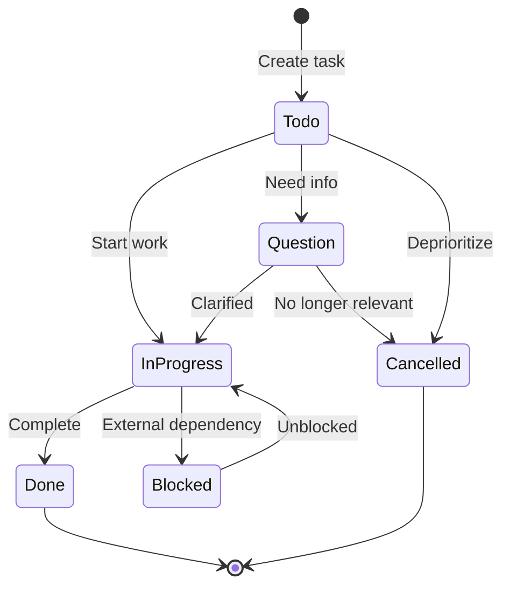

---
aliases:
  - "Checkbox Types"
  - "Task Checkboxes"
tags:
  - "type/report"
  - "year/2025"
  - "type/analysis"
  - "status/in-progress"
  - "pkb"
  - "pkm"
  - "processing-workflow"
  - "cognitive-science/attention"
  - "cognitive-load-management"
  - "cognitive-resources"
  - "pkb/optimization"
  - "tasks-plugin"
  - "attention-architecture"
source: "claude-sonnet-4.5"
id: "20251203212904"
created: "2025-12-03T21:29:04"
modified: "2025-12-03T21:29:04"
week: "[[2025-W49]]"
month: "[[2025-12]]"
quarter: "[[2025-Q4]]"
year: "[[2025]]"
type: "reference"
maturity: "needs-review"
confidence: "speculative"
next-review: "2025-12-10"
review-count: 0
link-up:
  - "[[pkb-&-pkm-moc]]"
link-related:
  - "[[2025-12-03|Daily-Note]]"
---
# Alternative Checkboxes
> [!overview]
> - **Title**:: [[Alternative Checkboxes]]
> - **Prompt/Topic Used**:: 
> - **Status**:: 🌱 `= this.maturity` | Confidence: `= this.confidence`

> [! ] # :FasClipboardList:In-Note Metadata Panel
> 
> - **Note-Type**: `= this.type`
> - **Development Status**: `= this.maturity`
> - **Epistemic Confidence**: `= this.confidence`
> - **Next Review**: `= this.next-review`
> - **Review Count**: `= this.review-count`
> - **Created**: `= this.created`
> - **Last Modified**: `= this.modified`
> 
> > [!purpose] ### 📝Content Metrics
> > [**Word Count**:: `= this.file.size`]| [**Est. Read Time**:: `= round(this.file.size / 1300) + " min"`]
> > [**Depth Class**:: `= choice(this.file.size < 500, "🌱Stub", choice(this.file.size < 2000, "📄Note", "📜Essay"))`]
> ----
> > [!purpose] ### 🕰️Temporal Context
> > [**Created**:: `= this.file.ctime`] | [**Age**:: `= (date(today) - this.file.ctime).days + " days"`]
> > [**Last Touch**:: `= this.file.mtime`] | [**Staleness**:: `= choice((date(today) - this.file.mtime).days > 180, "🕸️Cobwebs", choice((date(today) - this.file.mtime).days > 30, "🍂Cold", "🔥Fresh"))`]
> > [**Touch Frequency**:: `= choice((date(today) - this.file.mtime).days < 7, "🔥Active", choice((date(today) - this.file.mtime).days < 30, "👌Regular", "❄️Dormant"))`]
> ----
> > [!topic-idea] ### 🔗Network Connectivity
> > [**In-Links**:: `= length(this.file.inlinks)`] | [**Out-Links**:: `= length(this.file.outlinks)`]
> > [**Network Status**:: `= choice(length(this.file.inlinks) = 0, "🕸️Orphan", choice(length(this.file.inlinks) > 5, "⚡ Hub", "🌱Node"))`]
> ```dataviewjs
> // SYSTEM: Semantic Bridge Engine
> // PURPOSE: Find "Sibling" notes that share the same Outlinks (Contexts)
> const current = dv.current();
> const myOutlinks = current.file.outlinks.map(l => l.path);
> 
> // 1. Filter the Vault
> const siblings = dv.pages()
>     .where(p => p.file.path !== current.file.path) // Exclude self
>     .where(p => !current.file.outlinks.map(l => l.path).includes(p.file.path)) // Exclude existing direct links
>     .map(p => {
>         // Find overlap between this page's links and the current page's links
>         const shared = p.file.outlinks.filter(l => myOutlinks.includes(l.path));
>         return { 
>             link: p.file.link, 
>             sharedCount: shared.length, 
>             sharedLinks: shared 
>         };
>     })
>     .where(p => p.sharedCount > 0) // Must share at least 1 connection
>     .sort(p => p.sharedCount, "desc") // Sort by strongest connection
>     .limit(5); // Only show top 5
> 
> // 2. Render the Bridge
> if (siblings.length > 0) {
>     dv.header(3, "Semantic Bridges (Missing Connections)");
>     dv.table(
>         ["Sibling Note", "Strength", "Shared Context"], 
>         siblings.map(s => [
>             s.link, 
>             "🔗" + s.sharedCount, 
>             s.sharedLinks.slice(0, 3).join(", ") + (s.sharedCount > 3 ? "…" : "")
>         ])
>     );
> } else {
>     dv.paragraph("*No semantic siblings found. This note is unique in its connections.*");
> }
> ```
---

### Related Notes
```dataview
TABLE type, maturity, confidence
FROM  ""
WHERE  type = "reference"
SORT "maturity" DESC
LIMIT 15
```
### Sources & References
```dataview
TABLE 
    source AS "Source Type",
    file.ctime AS "Date Added"
FROM ""
WHERE source = "claude-sonnet-4.5"
SORT file.ctime DESC
LIMIT 10
```
### Backlinks & Connections
```dataview
TABLE 
    type AS "Type",
    maturity AS "Maturity",
    created AS "Created"
FROM [[#]]
SORT created DESC
LIMIT 15
```
### 2025-12-03 - Initial Creation
*Context*: `=this.title` **by**: `=this.source`
*Maturity*: `= this.maturity`  
*Confidence*: `= this.confidence`

### Tags & Classification
*Primary Tags*: `= this.tags`  
*Type*: `= this.type`  
*Source*: `= this.source`

---

> [! ] ### Claude Thinking
> **PHASE 1: REQUEST ANALYSIS**
> Request Classification:
> - Type: comprehensive_note
> - Scope: reference
> - Research Required: YES - This requires current information about community-maintained checkbox variations in Obsidian, which may have evolved since my training data
> Request Details:
> - Topic: Obsidian Alternative Checkboxes (community variations beyond standard markdown)
> - User Intent: Create exhaustive reference for custom checkbox syntax used in Obsidian PKB
> - Expected Output: Reference note with all checkbox types, their syntax, rendering, use cases
> - Depth Required: Comprehensive coverage of all community checkbox variants
> **RESEARCH STRATEGY:**
> I need to search for:
> 1. Official Obsidian checkbox documentation
> 2. Community-created checkbox variations and their meanings
> 3. Plugin-specific checkbox syntaxes (Tasks plugin, Checklist plugin, etc.)
> 4. CSS snippet checkbox customizations
> 5. Best practices for checkbox usage in PKM systems
> **QUERY RATIONALE:**
> Query 1: "Obsidian alternative checkboxes syntax"
> - Expected: Core syntax variations beyond basic [ ] and [x]
> - Rationale: Need foundational understanding of what alternative checkboxes exist
> Query 2: "Obsidian Tasks plugin checkbox types"
> - Expected: Task-management specific checkbox variations
> - Rationale: Tasks plugin is most popular for advanced checkbox functionality
> Query 3: "Obsidian community checkbox CSS snippets"
> - Expected: Custom styling and additional checkbox types via CSS
> - Rationale: Community often extends functionality through CSS
> Query 4: "Obsidian checkbox best practices PKM"
> - Expected: Usage patterns and workflow integration
> - Rationale: Need practical application context
> Query 5: "Obsidian checklist markdown variations"
> - Expected: Comprehensive list of all supported syntax patterns
> - Rationale: Ensure complete coverage
> **STRUCTURAL PLANNING:**
> Information Architecture:
> 1. Core Concept (What are alternative checkboxes?)
> 2. Standard Checkbox Types (built-in Obsidian)
> 3. Tasks Plugin Checkboxes (most comprehensive system)
> 4. Community Variants (CSS-based, other plugins)
> 5. Syntax Reference Table (quick lookup)
> 6. Use Cases & Workflows (practical application)
> 7. Implementation Guide (how to enable/customize)
> 8. Synthesis (best practices, mental models)
> Wiki-Link Opportunities:
> - [[Markdown]]
> - [[Obsidian]]
> - [[Task Management]]
> - [[GTD (Getting Things Done)]]
> - [[03-notes/01_permanent-notes/02_personal-knowledge-base/Personal Knowledge Management]]
> - [[CSS Snippets]]
> - [[Obsidian Plugins]]
> - [[Dataview]]
> - [[Metadata]]
> - [[Workflow Design]]
> - [[Visual Semantics]]
> - [[Information Architecture]]
> Callout Strategy:
> - [!definition] for checkbox type definitions
> - [!example] for syntax demonstrations
> - [!methodology-and-sources] for implementation steps
> - [!helpful-tip] for workflow suggestions
> - [!warning] for compatibility issues
> - [!key-claim] for best practice principles
> Metadata Planning:
> - Tags: #obsidian #reference-note #markdown #task-management #pkm-tools
> - Aliases: [Checkbox Types, Task Checkboxes, Alternative Checkboxes, Obsidian Checkboxes]
> **PHASE 2: RESEARCH EXECUTION**
> Now executing web searches...
> Now I have comprehensive information from multiple sources. Let me create the exhaustive reference note.

---
tags: #obsidian #reference-note #markdown #task-management #pkm-tools #css-customization
aliases: [Checkbox Types, Task Checkboxes, Alternative Checkboxes, Obsidian Checkboxes, Custom Checkboxes]

---

> [!comprehensive-reference] 📚 Comprehensive-Reference
> - **Generated**:: 2025-12-03
> - **Version**:: 1.0
> - **Type**:: Reference Documentation

> [!abstract]
> **Executive Overview**
> Alternative checkboxes in [[Obsidian]] extend standard [[Markdown]] task functionality beyond the basic unchecked `- [ ]` and checked `- [x]` states, allowing users to represent diverse task statuses through custom character syntax within brackets. This comprehensive reference documents all community-recognized checkbox variants, their rendering behaviors, implementation methods via [[CSS Snippets]] and [[Obsidian Plugins]], and practical applications within [[03-notes/01_permanent-notes/02_personal-knowledge-base/Personal Knowledge Management]] workflows.

> [!how-to-use-this]
> **Navigation Guide**
> This reference note is organized into 7 major sections covering foundational concepts, complete syntax taxonomies, theme-specific implementations, plugin integrations, CSS customization, practical workflows, and synthesis frameworks. Use the table of contents for quick navigation, or search for specific checkbox characters using [[Wiki-Links]].

## 📑 Table of Contents

1. [[#🔍 Foundational Concepts]]
2. [[#📋 Complete Checkbox Syntax Taxonomy]]
3. [[#🎨 Theme-Based Implementations]]
4. [[#🔌 Plugin Ecosystem Integration]]
5. [[#⚙️ CSS Architecture & Customization]]
6. [[#💼 Practical Workflows & Use Cases]]
7. [[#🎯 Synthesis & Mastery]]

---

## 🔍 Foundational Concepts

> [!definition]
> - **Key-Term**:: [[Alternative Checkboxes]]
> - **Definition**:: Extended task list syntax in [[Obsidian]] that uses different characters between brackets (e.g., `[/]`, `[?]`, `[-]`) to represent task states beyond binary completion, rendered with custom icons and styling through [[CSS]] or [[Obsidian Themes]].

### The Evolution from Standard Markdown

Standard [[Markdown]] provides only two checkbox states: unchecked (`- [ ]`) and checked (`- [x]`). This binary system, while sufficient for basic task tracking, proves inadequate for sophisticated [[Knowledge Work]] and [[Project Management]] within a [[Personal Knowledge Base]]. The [[Obsidian]] community recognized this limitation and developed a de facto standard for alternative checkbox syntax that maintains [[Markdown]] compatibility while enabling rich semantic distinctions.

The alternative checkbox system originated from community themes, particularly @kepano's [[Minimal Theme]], and was subsequently adopted by numerous other themes including [[ITS Theme]] by SlRvb, [[Things Theme]], [[Primary Theme]], and others. The implementation relies on [[HTML]] `data-task` attributes that [[Obsidian]] automatically generates when rendering task lists, which can then be targeted with [[CSS]] selectors for custom styling.

The fundamental mechanism works as follows: when you write `- [x]` in your note, Obsidian generates HTML like `<li data-task="x">`, and when you write `- [?]` it generates `<li data-task="?">`. Theme developers and CSS snippet creators can then write styles targeting these specific `data-task` values to display custom icons, colors, and text decorations.

> [!key-claim]
> **Central Principle**
> Alternative checkboxes transform task lists from binary completion trackers into semantic status indicators, enabling [[Visual Information Architecture]] that communicates task states at a glance while preserving plain-text portability.

### Core Architectural Components

The alternative checkbox system comprises three interdependent components:

**1. Syntax Layer** - The character placed between brackets in your [[Markdown]] text (e.g., `/`, `?`, `!`, `-`). This must be a single character that Obsidian will parse into the `data-task` attribute. The syntax remains human-readable in raw [[Markdown]] and remains functional even when themes or [[CSS Snippets]] are disabled.

**2. Rendering Layer** - The visual representation displayed in [[Reading View]] and [[Live Preview]] mode. This typically involves [[SVG]] icons, custom colors, and optional text decorations (strikethrough, opacity changes). The rendering is controlled entirely through [[CSS]], making it theme-dependent and highly customizable.

**3. Semantic Layer** - The conceptual meaning assigned to each checkbox type (e.g., `[/]` = "in progress", `[-]` = "cancelled"). While community conventions have emerged, these meanings are not enforced by [[Obsidian]] itself—they are social contracts within the user community that ensure consistent interpretation across vaults and documentation.

### Integration with Obsidian's Task Architecture

Alternative checkboxes integrate seamlessly with [[Obsidian]]'s native task management features and extend functionality when combined with plugins like [[Tasks Plugin]], [[Dataview]], and [[Kanban Plugin]]. The [[Tasks Plugin]] in particular has evolved to recognize and support custom statuses, allowing for sophisticated filtering, sorting, and querying based on checkbox types.

When you toggle a checkbox by clicking it in [[Reading View]] or using the keyboard shortcut in [[Edit Mode]], [[Obsidian]] cycles through defined states. By default, the [[Tasks Plugin]] provides three states: unchecked (`[ ]`), in progress (`[/]`), and completed (`[x]`). However, users can configure custom status cycles and import predefined status collections from popular themes.

> [!warning]
> **Critical Constraints**
> Alternative checkboxes are purely a rendering feature—the underlying [[Markdown]] files contain only the character within brackets. If you share notes with users who don't have appropriate themes or [[CSS Snippets]] enabled, they will see raw characters like `[?]` or `[!]` without semantic icons. This maintains [[Plain-Text Portability]] but may reduce immediate comprehension for recipients unfamiliar with the conventions.

---

## 📋 Complete Checkbox Syntax Taxonomy

### Standard Obsidian Checkboxes

These are natively supported by [[Obsidian]] without any themes or plugins:

| Syntax | Status | Description | Visual Behavior |
|--------|--------|-------------|-----------------|
| `- [ ]` | Unchecked | Default incomplete task state | Empty checkbox |
| `- [x]` | Checked | Default completed task state | Checked checkbox with strikethrough |
| `- [X]` | Checked (variant) | Capital X also marks completion | Identical to `[x]` |

### Universal Alternative Checkboxes

These checkbox types have achieved near-universal adoption across major [[Obsidian Themes]] and represent the de facto community standard.

> [!definition]
> **Universal Checkbox Set**
> The following characters are recognized by most themes and CSS implementations:

| Syntax | Common Name | Semantic Meaning | Typical Icon | Use Case |
|--------|-------------|------------------|--------------|----------|
| `- [/]` | In Progress / Incomplete | Task currently being worked on | Half-filled circle or progress indicator | Active work items |
| `- [-]` | Cancelled / Dropped | Task abandoned or no longer relevant | Circle with minus or strikethrough | Scope changes, deprioritization |
| `- [>]` | Forwarded / Scheduled / Deferred | Task postponed to future date | Right chevron or forward arrow | Waiting for future action |
| `- [<]` | Scheduled / Rescheduled | Task moved to specific time | Clock icon or calendar | Time-blocked tasks |
| `- [?]` | Question | Task requiring clarification or decision | Question mark | Blocked on information |
| `- [!]` | Important / High Priority | Critical task requiring attention | Exclamation mark or star | Priority indicators |
| `- [*]` | Star / Bookmark | Starred or highlighted task | Star icon | Favorites or key items |
| `- ["]` | Quote | Task involving quotation or reference | Quote mark | Research tasks |
| `- [l]` | Location | Task tied to specific location | Pin or location marker | Context-dependent tasks |
| `- [b]` | Bookmark | Task to bookmark or save | Bookmark icon | Reference tasks |
| `- [i]` | Information / Idea | Informational item or idea | Info icon or lightbulb | Knowledge capture |

### Extended Checkbox Types

The [[ITS Theme]] by SlRvb implements one of the most comprehensive alternative checkbox systems, with over 30 distinct types.

> [!use-cases-and-examples]
> **Extended Semantic Categories**
> 
> **Project Management**
> - `- [D]` - Date: Task with important date dependency
> - `- [T]` - Time: Time-sensitive task
> - `- [R]` - Research: Investigation required
> - `- [+]` - Add: Addition to project scope
> 
> **Decision Making**
> - `- [P]` - Pro: Advantage or positive aspect
> - `- [C]` - Con: Disadvantage or concern
> - `- [B]` - Brainstorm: Ideation item
> - `- [A]` - Answer: Solution or resolution
> 
> **Content Creation**
> - `- [Q]` - Quote: Direct quotation
> - `- [N]` - Note: Observation or annotation
> - `- [p]` - Paraphrase: Restated content
> - `- [E]` - Example: Illustrative case
> 
> **Narrative & Creative Work**
> - `- [@]` - Character/Person: Character development
> - `- [t]` - Talk: Dialogue or conversation
> - `- [O]` - Outline/Plot: Structure element
> - `- [~]` - Conflict: Narrative tension
> - `- [W]` - World: World-building element
> - `- [f]` - Clue/Find: Discovery or revelation
> - `- [F]` - Foreshadow: Setup for future events
> - `- [&]` - Symbolism: Symbolic element

### Complete ITS Theme Checkbox Set

The [[ITS Theme]] provides the following complete checkbox taxonomy:

```markdown
- [ ] Unchecked
- [x] Regular/Checked
- [X] Checked (alternate)
- [-] Dropped
- [>] Forward
- [D] Date
- [?] Question
- [/] Half Done
- [+] Add
- [R] Research
- [!] Important
- [i] Idea
- [B] Brainstorm
- [P] Pro
- [C] Con
- [Q] Quote
- [N] Note
- [b] Bookmark
- [I] Information
- [p] Paraphrase
- [L] Location
- [E] Example
- [A] Answer
- [r] Reward
- [c] Choice
- [d] Doing
- [T] Time
- [@] Character/Person
- [t] Talk
- [O] Outline/Plot
- [~] Conflict
- [W] World
- [f] Clue/Find
- [F] Foreshadow
- [H] Favorite/Health
- [&] Symbolism
- [s] Secret
```

### Theme-Specific Extensions

The [[Things Theme]] adds GitHub-inspired checkbox types for [[Software Development]] workflows:

```markdown
- [D] Draft pull request
- [P] Open pull request
- [M] Merged pull request
```

Additional theme-specific checkboxes found in various implementations:

```markdown
- [S] Savings (financial tracking)
- [k] Key (critical dependency)
- [w] Win (success or achievement)
- [u] Up (increase or improvement)
- [d] Down (decrease or decline)
- [f] Fire (urgent/hot item)
```

> [!connections-and-links]
> **Checkbox Taxonomy Organization**
> The checkbox types can be organized into semantic categories:
> - **Status Indicators**: `[ ]`, `[x]`, `[/]`, `[-]`, `[>]`, `[<]`
> - **Priority Markers**: `[!]`, `[*]`, `[f]`, `[H]`
> - **Information Types**: `[?]`, `[i]`, `[I]`, `[N]`, `[Q]`
> - **Decision Support**: `[P]`, `[C]`, `[B]`, `[A]`, `[c]`
> - **Content Development**: `[@]`, `[t]`, `[O]`, `[~]`, `[W]`, `[&]`
> - **Context Markers**: `[l]`, `[L]`, `[b]`, `[T]`, `[D]`
> - **Workflow Actions**: `[R]`, `[+]`, `[E]`, `[r]`

---

## 🎨 Theme-Based Implementations

### Minimal Theme

The [[Minimal Theme]] by @kepano pioneered alternative checkbox support in [[Obsidian]] and established the baseline standard that most other themes follow.

> [!methodology-and-sources]
> **Minimal Checkbox Philosophy**
> [[Minimal Theme]] draws inspiration from [[Bullet Journal]] methodology, where different markers (dots, circles, dashes, etc.) convey semantic meaning. The digital implementation translates these analog conventions into icon-based visual language.

**Core Minimal Checkbox Set:**

The original [[Minimal Theme]] implementation includes these checkbox types with their associated icons and meanings:

- `- [ ]` - **To-do**: Empty circle (unchecked task)
- `- [x]` - **Done**: Filled checkmark (completed task)
- `- [/]` - **Incomplete**: Half-filled circle (in progress)
- `- [-]` - **Canceled**: Circle with minus (dropped task)
- `- [>]` - **Forwarded**: Right chevron (delegated or scheduled)
- `- [<]` - **Scheduling**: Clock icon (scheduled for specific time)
- `- [?]` - **Question**: Question mark (needs clarification)
- `- [!]` - **Important**: Exclamation mark (high priority)
- `- [*]` - **Star**: Star icon (bookmarked or favorite)
- `- ["]` - **Quote**: Quote marks (citation or reference)
- `- [l]` - **Location**: Pin icon (location-dependent)
- `- [b]` - **Bookmark**: Bookmark icon (saved for later)
- `- [i]` - **Information**: Info icon (informational note)
- `- [S]` - **Savings**: Dollar sign (cost savings)
- `- [I]` - **Idea**: Lightbulb (creative idea)
- `- [p]` - **Pros**: Plus in circle (advantages)
- `- [c]` - **Cons**: Minus in circle (disadvantages)
- `- [f]` - **Fire**: Flame icon (urgent/hot)
- `- [k]` - **Key**: Key icon (critical/essential)
- `- [w]` - **Win**: Trophy (success/achievement)
- `- [u]` - **Up**: Up arrow (increase)
- `- [d]` - **Down**: Down arrow (decrease)

**Customization via Style Settings:**

[[Minimal Theme]] integrates with the [[Style Settings Plugin]] to enable per-checkbox customization including color, text decoration, and checkbox roundness. Users can access these settings via:

1. **Settings → Style Settings → Primary Theme Settings → Notes and Files → Checkbox**
2. Customize individual checkbox colors
3. Toggle strikethrough on/off for specific states
4. Adjust checkbox border radius

### ITS Theme (SlRvb)

The [[ITS Theme]] (It's The Style) by SlRvb represents the most comprehensive alternative checkbox implementation, with emphasis on creative writing, narrative development, and extensive categorization.

**Design Philosophy:**
The [[ITS Theme]] extends [[Minimal Theme]]'s foundation by adding domain-specific checkbox types for novelists, screenwriters, [[Dungeons & Dragons|DnD]] game masters, and [[Creative Writing]] practitioners. The checkbox system serves as both task manager and content development tool.

**Unique ITS Additions:**
```markdown
Narrative Structure:
- [@] Character/Person (character notes)
- [t] Talk (dialogue tracking)
- [O] Outline/Plot (story structure)
- [~] Conflict (tension points)
- [W] World (world-building)
- [f] Clue/Find (plot devices)
- [F] Foreshadow (setup elements)
- [&] Symbolism (thematic elements)
- [s] Secret (hidden information)

Workflow Extensions:
- [r] Reward (gamification)
- [c] Choice (decision points)
- [d] Doing (currently active)
- [p] Paraphrase (content revision)
- [A] Answer (solution/resolution)
```

The [[ITS Theme]] documentation notes that checkboxes can be customized via [[Style Settings Plugin]] under "Note Elements → Lists → Checkboxes."

### Things Theme

The [[Things Theme]] by @colineckert brings design aesthetics inspired by the popular [[Things 3]] task manager to [[Obsidian]], with checkbox styling that mirrors macOS native appearance.

**Distinctive Features:**
- Native macOS design language (rounded corners, soft shadows)
- [[GitHub]]-integrated checkboxes for development workflows
- Optimized for both desktop and mobile interfaces

**GitHub Integration Checkboxes:**
```markdown
- [D] Draft pull request (grayed out circle)
- [P] Open pull request (purple indicator)
- [M] Merged pull request (green merged icon)
```

### Primary Theme

The [[Primary Theme]] follows the community standard established by [[Minimal Theme]] and [[Sanctum Theme]], with full [[Style Settings Plugin]] integration for per-checkbox customization.

**Key Characteristics:**
- Full compatibility with standard checkbox syntax
- Extensive color customization per checkbox type
- Configurable text decoration (strikethrough toggle)
- Adjustable checkbox roundness/shape
- Maintains readability in [[Source Mode]]

> [!analogy]
> **Design Pattern Comparison**
> Think of [[Obsidian Themes]] as different "dialects" of the alternative checkbox language. [[Minimal Theme]] established the grammar (syntax rules), [[ITS Theme]] expanded the vocabulary (new checkbox types for specialized domains), [[Things Theme]] refined the pronunciation (visual aesthetics), and [[Primary Theme]] provided the translation dictionary (customization tools). All remain mutually intelligible through the shared `data-task` attribute foundation.

---

## 🔌 Plugin Ecosystem Integration

### Tasks Plugin

The [[Tasks Plugin]] is the most sophisticated task management solution for [[Obsidian]], providing advanced querying, filtering, recurring tasks, and full custom status support.

> [!definition]
> - **Key-Term**:: [[Custom Statuses]]
> - **Definition**:: User-definable task state configurations in [[Tasks Plugin]] that map checkbox characters to semantic meanings, enable status-aware querying, and control task cycling behavior.

**Core Status Functionality:**

By default, [[Tasks Plugin]] recognizes three statuses: TODO (`[ ]`), IN_PROGRESS (`[/]`), and DONE (`[x]`), and provides the ability to cycle through these states via the "Toggle Done" command.

**Custom Status Configuration:**

As of [[Tasks Plugin]] version 1.23.0, users can define custom statuses with the following properties:

- **Status Symbol**: The character that appears in brackets (e.g., `?`, `!`, `-`)
- **Status Name**: Human-readable name (e.g., "Question", "Important", "Cancelled")
- **Status Type**: Classification as TODO, IN_PROGRESS, DONE, CANCELLED, or NON_TASK
- **Next Status Symbol**: What the status cycles to when toggled
- **Availability**: Where the status appears in context menus

**Status Collections:**

[[Tasks Plugin]] provides pre-configured status collections that can be imported via Settings → Tasks → Statuses:

1. **Minimal Theme Collection** - Matches [[Minimal Theme]] checkbox semantics
2. **SlRvb's Alternative Checkboxes** - Full [[ITS Theme]] compatibility
3. **Custom Collections** - User-defined status sets

**Advanced Querying with Custom Statuses:**

```markdown
## Query: All In-Progress Tasks
```tasks
status.type is IN_PROGRESS
```

## Query: Important and Urgent Tasks
```tasks
status.symbol is !
not done
```

## Query: Cancelled Tasks This Month
```tasks
status.type is CANCELLED
done after 2024-11-01
done before 2024-12-01
```
```

> [!helpful-tip]
> **Workflow Optimization**
> Replace [[Obsidian]]'s default "Toggle checkbox status" hotkey with [[Tasks Plugin]]'s "Tasks: Toggle Done" command for status-aware cycling that respects your custom status definitions.

### Dataview Integration

[[Dataview Plugin]] can query tasks with alternative checkboxes through its task extraction features, though it doesn't natively distinguish between different checkbox types without additional configuration.

**Basic Task Queries:**

```dataview
TASK
WHERE !completed
WHERE file.path = this.file.path
```

**Checkbox Character Filtering:**

While [[Dataview]] doesn't directly expose the checkbox character, you can use regex patterns in file content searches:

```dataview
TABLE file.tasks
WHERE contains(file.content, "[?]")
```

**Integration with Tasks Plugin:**

[[Dataview]] includes a setting "Automatic Task Completion Tracking" that helps synchronize task completion data, useful when combining [[Dataview]] queries with [[Tasks Plugin]] functionality.

### Complementary Plugins

**Task Status Plugin:**

The [[Task Status Plugin]] provides a keyboard-driven searchable modal for quickly changing checkbox characters, supporting multiple selection types and maintaining formatting including indentation and block quotes.

Features:
- Quick checkbox character selection via modal
- Keyboard shortcuts for status changes
- Pre-configured task markers (customizable)
- Works with any theme's checkbox styling
- Maintains block structure when transforming content

**Checkbox 3 States Plugin:**

The [[Checkbox 3 States Plugin]] adds a middle state to standard checkboxes, accessible via SHIFT+click on desktop or long-press on mobile, with customizable colors for the third state.

**Checkbox Time Tracker:**

The [[Checkbox Time Tracker]] automatically inserts timestamps when checkboxes are checked, with options to include start/end times and custom timestamp formats including links to daily notes.

**Checkbox Sync:**

The [[Checkbox Sync Plugin]] automatically updates parent checkboxes based on child checkbox completion status, ideal for hierarchical task structures and project breakdowns.

**Completed Tasks Plugin:**

The [[Completed Tasks Plugin]] automatically moves checked checkboxes to the bottom of their list, keeping active tasks visible and reducing visual clutter.

> [!connections-and-links]
> **Plugin Synergy Matrix**
> 
> Optimal workflow combinations:
> - **[[Tasks Plugin]] + [[Minimal Theme]]**: Full-featured task management with visual semantics
> - **[[Task Status Plugin]] + [[ITS Theme]]**: Rapid status changes for creative writing workflows
> - **[[Dataview]] + [[Checkbox Time Tracker]]**: Temporal analysis of task completion patterns
> - **[[Checkbox Sync]] + hierarchical outlines**: Automated progress tracking for complex projects

---

## ⚙️ CSS Architecture & Customization

### Understanding the data-task Attribute

> [!definition]
> - **Key-Term**:: [[data-task Attribute]]
> - **Definition**:: An [[HTML]] attribute automatically generated by [[Obsidian]] when rendering task list items, containing the character from between the brackets, which serves as the [[CSS]] selector target for alternative checkbox styling.

**Rendering Pipeline:**

1. **Source Markdown**: `- [?] Task requiring clarification`
2. **HTML Generation**: `<li class="task-list-item" data-task="?">...</li>`
3. **CSS Matching**: Styles targeting `[data-task="?"]` apply
4. **Visual Output**: Rendered with question mark icon

### CSS Selector Patterns

Alternative checkbox styling requires targeting both [[Edit Mode]] (via `.HyperMD-task-line`) and [[Reading View]] (via `.task-list-item`) selectors to ensure consistent appearance.

**Basic Selector Structure:**

```css
/* Reading View & Live Preview */
.markdown-preview-view ul > li[data-task="?"],
.markdown-rendered ul > li[data-task="?"] {
    /* Custom styling here */
}

/* Edit Mode (Source & Live Preview) */
.HyperMD-task-line[data-task="?"] {
    /* Custom styling here */
}
```

**Complete Checkbox Styling Pattern:**

A complete checkbox style implementation includes checkbox appearance, icon, text decoration, and color modifications:

```css
/* Question Mark Checkbox Example */

/* Checkbox itself */
.markdown-preview-view li[data-task="?"] > .task-list-item-checkbox:checked,
.markdown-rendered li[data-task="?"] > .task-list-item-checkbox:checked {
    border: none;
    background-color: var(--color-orange);
}

/* Icon using SVG mask */
.markdown-preview-view li[data-task="?"] > .task-list-item-checkbox:checked::before,
.markdown-rendered li[data-task="?"] > .task-list-item-checkbox:checked::before {
    content: ' ';
    background-color: white;
    -webkit-mask-image: url("data:image/svg+xml,<svg xmlns='http://www.w3.org/2000/svg' viewBox='0 0 20 20' fill='currentColor'><path fill-rule='evenodd' d='M18 10a8 8 0 11-16 0 8 8 0 0116 0zm-8-3a1 1 0 00-.867.5 1 1 0 11-1.731-1A3 3 0 0113 8a3.001 3.001 0 01-2 2.83V11a1 1 0 11-2 0v-1a1 1 0 011-1 1 1 0 100-2zm0 8a1 1 0 100-2 1 1 0 000 2z' clip-rule='evenodd'/></svg>");
}

/* Text styling */
.markdown-preview-view ul > li[data-task="?"],
.markdown-rendered ul > li[data-task="?"],
.HyperMD-task-line[data-task="?"] {
    color: var(--text-muted);
    text-decoration: none;
}
```

### CSS Variables for Theming

[[Obsidian]] provides built-in [[CSS Variables]] for checkbox customization accessible through the official developer documentation.

**Standard Obsidian Checkbox Variables:**

```css
:root {
    --checkbox-radius: 50%; /* Border radius */
    --checkbox-size: 1.25em; /* Size */
    --checkbox-border-width: 2px; /* Border thickness */
    --checkbox-border-color: var(--text-muted); /* Border color */
    --checkbox-bg: var(--background-primary); /* Background */
    --checkbox-color: var(--interactive-accent); /* Check color */
}
```

**Theme-Specific Custom Properties:**

Many themes define additional variables for alternative checkboxes:

```css
:root {
    --checklist-done-color: var(--text-muted);
    --checklist-progress-color: var(--color-blue);
    --checklist-cancelled-color: var(--text-faint);
    --checklist-important-color: var(--color-red);
}
```

### SVG Icon Implementation

Alternative checkbox icons are typically implemented using [[SVG]] data URIs within CSS `-webkit-mask-image` properties, allowing dynamic color changes while maintaining icon shape.

**SVG Mask Technique:**

```css
/* Technique: Use mask-image for colorizable icons */
.task-list-item-checkbox:checked::before {
    content: ' ';
    background-color: var(--checkbox-color); /* Color fills masked shape */
    -webkit-mask-image: url("data:image/svg+xml,<svg>...</svg>");
    -webkit-mask-repeat: no-repeat;
    -webkit-mask-position: center;
}
```

**Common Icon Sources:**
- [[Heroicons]] - Open source [[SVG]] icon set (used by [[Minimal Theme]])
- [[Lucide Icons]] - Community icon library
- [[Font Awesome]] - Extensive icon collection
- Custom [[SVG]] designs

### Text Decoration Control

Managing strikethrough behavior for different checkbox types requires careful selector specificity to override default [[Obsidian]] styling.

**Removing Strikethrough:**

```css
/* Remove strikethrough for specific checkbox types */
.HyperMD-task-line[data-task="?"],
.markdown-rendered ul > li[data-task="?"],
.markdown-preview-view ul > li[data-task="?"] {
    text-decoration: none;
}

/* Ensure no strikethrough in callouts (Live Preview) */
.markdown-rendered ul > li[data-task="?"] {
    text-decoration: none !important;
}
```

**Conditional Strikethrough:**

```css
/* Apply strikethrough only to cancelled tasks */
.HyperMD-task-line[data-task="-"],
.markdown-rendered ul > li[data-task="-"],
.markdown-preview-view ul > li[data-task="-"] {
    text-decoration: line-through;
    color: var(--text-faint);
}
```

### Complete CSS Snippet Template

A production-ready [[CSS Snippet]] for alternative checkboxes should work in both editing (live preview mode) and reading view.

```css
/* ================================================
   Alternative Checkboxes CSS Snippet
   Compatible with Obsidian v1.5+
   Works in: Edit Mode, Live Preview, Reading View
   ================================================ */

/* Base Checkbox Styling Reset */
.task-list-item-checkbox:checked {
    border: none;
}

/* ========== IN PROGRESS [/] ========== */
.markdown-preview-view li[data-task="/"] > .task-list-item-checkbox:checked,
.markdown-rendered li[data-task="/"] > .task-list-item-checkbox:checked {
    background-color: var(--color-blue);
}

.markdown-preview-view li[data-task="/"] > .task-list-item-checkbox:checked::before,
.markdown-rendered li[data-task="/"] > .task-list-item-checkbox:checked::before {
    content: ' ';
    background-color: white;
    -webkit-mask-image: url("data:image/svg+xml,<svg xmlns='http://www.w3.org/2000/svg' viewBox='0 0 20 20' fill='currentColor'><path d='M10 18a8 8 0 100-16 8 8 0 000 16zM7 9a1 1 0 000 2h6a1 1 0 100-2H7z'/></svg>");
}

.HyperMD-task-line[data-task="/"],
.markdown-rendered ul > li[data-task="/"],
.markdown-preview-view ul > li[data-task="/"] {
    color: var(--text-normal);
    text-decoration: none;
}

/* ========== CANCELLED [-] ========== */
.markdown-preview-view li[data-task="-"] > .task-list-item-checkbox:checked,
.markdown-rendered li[data-task="-"] > .task-list-item-checkbox:checked {
    background-color: var(--text-faint);
}

.markdown-preview-view li[data-task="-"] > .task-list-item-checkbox:checked::before,
.markdown-rendered li[data-task="-"] > .task-list-item-checkbox:checked::before {
    content: ' ';
    background-color: white;
    -webkit-mask-image: url("data:image/svg+xml,<svg xmlns='http://www.w3.org/2000/svg' viewBox='0 0 20 20' fill='currentColor'><path fill-rule='evenodd' d='M10 18a8 8 0 100-16 8 8 0 000 16zM7 9a1 1 0 000 2h6a1 1 0 100-2H7z' clip-rule='evenodd'/></svg>");
}

.HyperMD-task-line[data-task="-"],
.markdown-rendered ul > li[data-task="-"],
.markdown-preview-view ul > li[data-task="-"] {
    color: var(--text-faint);
    text-decoration: line-through;
}

/* ========== QUESTION [?] ========== */
/* Similar pattern for remaining checkbox types */
/* ... Add additional checkbox types following same structure ... */
```

### Installation & Management

**Adding CSS Snippets:**

1. Navigate to **Settings → Appearance → CSS Snippets**
2. Click the folder icon to open snippets directory (`.obsidian/snippets/`)
3. Place your `.css` file in this directory
4. Return to [[Obsidian]] and click the refresh icon
5. Toggle the snippet on

> [!helpful-tip]
> **Snippet Organization**
> Name your snippet files descriptively (e.g., `alternative-checkboxes-minimal.css` or `custom-checkboxes-writing.css`) and include header comments documenting the checkbox types included, making future maintenance easier.

**Testing & Debugging:**

1. Open [[Developer Tools]] (Ctrl+Shift+I / Cmd+Opt+I)
2. Use Inspector to examine `data-task` attributes
3. Test in both [[Edit Mode]] and [[Reading View]]
4. Verify appearance in [[Callouts]] and nested lists
5. Check mobile compatibility if using [[Obsidian Mobile]]

---

## 💼 Practical Workflows & Use Cases

### Task Management Workflows

**GTD (Getting Things Done) Implementation:**

Alternative checkboxes enable sophisticated [[GTD]] workflows by representing different task states beyond simple completion.

```markdown
## Inbox (Raw Capture)
- [ ] Review Q4 budget proposal
- [ ] Call dentist for appointment
- [ ] Research new CRM software

## Next Actions
- [/] Draft client presentation (IN PROGRESS)
- [!] Submit expense report by EOD (IMPORTANT)
- [>] Review Sarah's code (DELEGATED)

## Waiting For
- [<] Feedback from legal team (SCHEDULED)
- [?] Clarification on project scope (QUESTION)

## Someday/Maybe
- [*] Learn Spanish (BOOKMARKED)
- [b] Read "Getting Things Done" (BOOKMARKED)
```

**Query for Dashboard:**

```markdown
## Today's Focus
```tasks
not done
(status.symbol is !) OR (status.symbol is /)
```

## Waiting on Others
```tasks
not done
status.symbol is >
```

## Needs Clarification
```tasks
status.symbol is ?
```
```

### Creative Writing & Content Development

The [[ITS Theme]]'s extensive checkbox set was specifically designed for fiction writers and content creators managing complex narrative projects.

**Character Development Tracking:**

```markdown
## Character: Elena Morrison

### Character Arc
- [@] Initial characterization complete
- [/] Backstory development in progress
- [ ] Relationship dynamics with protagonist
- [F] Set up reveal for Chapter 12
- [~] Internal conflict: loyalty vs. ambition

### Scene Appearances
- [x] Chapter 3 - Introduction
- [/] Chapter 7 - Confrontation scene
- [t] Chapter 9 - Dialogue with Marcus
- [O] Chapter 15 - Plot turning point

### Story Elements
- [W] Elena's apartment (world-building note)
- [&] Represents institutional corruption theme
- [s] Secret: Former intelligence operative
- [f] Planted clue in Chapter 4 about her past
```

**Plot Management:**

```markdown
## Act II Development

### Rising Action
- [x] Inciting incident established
- [O] Midpoint twist outlined
- [/] Character motivation refinement
- [~] Central conflict escalation
- [F] Foreshadowing for Act III climax

### To Research
- [R] 1990s surveillance technology
- [R] Corporate espionage legal frameworks
- [E] Find example of similar plot structure in published work
```

### Project & Product Management

**Agile Sprint Planning:**

```markdown
## Sprint 23 - User Authentication Refactor

### In Progress
- [/] Implement OAuth2 integration
- [/] Update user database schema
- [d] Writing migration scripts (John)

### Blocked
- [?] Clarify password reset flow with Product
- [<] Waiting for security audit results

### Cancelled This Sprint
- [-] Two-factor authentication (moved to Sprint 24)
- [-] Social login integration (deprioritized)

### Code Review
- [D] PR #234 - Draft (needs work)
- [P] PR #235 - Open (ready for review)
- [M] PR #230 - Merged

### Important Items
- [!] Deploy to staging by Friday
- [!] Load testing before production release
```

### Research & Knowledge Synthesis

**Literature Review Workflow:**

```markdown
## Research: Neural Plasticity in Adult Learning

### Papers to Read
- [ ] Smith et al. (2023) - Neurogenesis in hippocampus
- [/] Johnson & Lee (2024) - Synaptic pruning mechanisms
- [x] Brown (2022) - Age-related cognitive decline

### Key Findings
- [N] Note: Plasticity peaks in morning hours (Smith)
- [Q] Quote: "Neural reorganization continues throughout lifespan"
- [E] Example: London taxi drivers hippocampal study
- [i] Idea: Connection to spaced repetition learning

### Synthesis
- [P] Pro: Multiple studies confirm adult neuroplasticity
- [C] Con: Sample sizes remain small in recent research
- [B] Brainstorm: Potential PKM application for learning optimization
- [A] Answer: Adult learning benefits from strategic timing

### Follow-up
- [R] Research: Optimal learning intervals
- [?] Question: Does time-of-day affect knowledge retention?
- [b] Bookmark: Neuroscience journal database
```

### Academic & Student Workflows

**Course Management:**

```markdown
## CS301 - Data Structures & Algorithms

### Assignments
- [/] Assignment 3: Binary tree implementation (50% complete)
- [!] Assignment 4: Graph algorithms (due Monday!)
- [ ] Extra credit: Dynamic programming problems

### Study Tasks
- [x] Watch lecture on recursion
- [N] Note: Time complexity analysis crucial for exam
- [E] Example problems: Practice QuickSort variations
- [?] Question: Ask TA about space complexity in merge sort

### Exam Prep
- [R] Research: Previous exam questions
- [b] Bookmark: Algorithm visualization site
- [*] Star: Big-O cheat sheet (high-value resource)
```

### Business & Financial Tracking

**Financial Decision Making:**

```markdown
## Decision: Upgrade Office Equipment

### Cost-Benefit Analysis
- [P] Pro: Increased productivity (estimated 15%)
- [P] Pro: Improved employee satisfaction
- [P] Pro: Tax deductible expense
- [C] Con: $12K upfront cost
- [C] Con: Training time required
- [C] Con: Potential compatibility issues

### Action Items
- [R] Research: Vendor comparisons
- [/] Get three quotes (2/3 complete)
- [?] Question: Lease vs. purchase options?
- [S] Savings: Potential $2K annually in maintenance costs

### Decision Status
- [!] Important: Need decision by end of Q4
- [<] Scheduled: Board meeting December 15
- [A] Answer: Proceed with lease option (lower risk)
```

### Personal Productivity & Habit Tracking

**Daily Routine Optimization:**

```markdown
## Morning Routine

- [x] Wake at 6:00 AM
- [/] 20-minute meditation (currently 10 minutes)
- [H] Exercise (health goal - 5x per week)
- [ ] Review daily priorities
- [!] Critical: Take medication

## Evening Review

- [r] Reward: If 3 priorities completed → 30 min reading
- [N] Note: Energy peaks 10-11 AM (schedule deep work)
- [T] Time-block: 2-4 PM for meetings only

## Habit Tracking

- [*] Star habit: Daily PKB review (on 23-day streak!)
- [w] Win: Completed all priorities Mon-Wed this week
- [u] Up: Exercise consistency improved this month
```

> [!use-cases-and-examples]
> **Workflow Selection Guide**
> 
> **Choose Standard Checkboxes When:**
> - Simple binary completion tracking suffices
> - Collaborating with users unfamiliar with alternatives
> - Exporting notes to systems without custom styling
> 
> **Choose Alternative Checkboxes When:**
> - Managing complex multi-state workflows
> - Requiring visual semantic indicators
> - Building sophisticated [[Knowledge Work]] systems
> - Integrating with [[Tasks Plugin]] or [[Dataview]]
> - Tracking diverse information types beyond tasks

### Integration with Obsidian Features

**Callout Compatibility:**

```markdown
> [!todo] Sprint Tasks
> - [/] Backend API development
> - [!] Critical bug fix needed
> - [?] Clarify feature requirements
> - [x] Database migration complete
```

**Nested List Hierarchies:**

```markdown
- [/] Major Project: Website Redesign
  - [x] Research competitor sites
  - [x] Create wireframes
  - [/] Design mockups
    - [x] Homepage design
    - [/] Product page design
    - [ ] Contact page design
  - [ ] Development phase
    - [?] Clarify technical stack with team
    - [!] Urgent: Set up staging environment
```

**Dataview Integration:**

```markdown
## Tasks by Type

### High Priority
```dataview
TASK
WHERE contains(text, "[!]")
WHERE !completed
```

### In Progress Across Vault
```dataview
TASK
WHERE contains(text, "[/]")
GROUP BY file.folder
```
```

---

## 🎯 Synthesis & Mastery

> [!the-philosophy]
> **Underlying Philosophy**
> Alternative checkboxes embody the principle that **semantic granularity enhances cognitive clarity**. By moving beyond binary completion states, we acknowledge that knowledge work and creative processes exist in liminal spaces—tasks are not merely "done" or "not done" but evolve through states of questioning, research, progress, delegation, and cancellation. The visual language of alternative checkboxes serves as an external cognitive artifact, offloading mental overhead to the interface itself.

### Cognitive Models for Alternative Checkboxes

**Mental Model 1: Task State Machine**

Think of each checkbox type as a node in a [[Finite State Machine]]:



Each checkbox character represents a state, and toggling through them represents state transitions in your workflow. This model helps you:
- Visualize task lifecycle
- Identify bottlenecks (tasks stuck in "Question" or "Blocked")
- Track progress through state distribution

**Mental Model 2: Visual Information Scent**

The [[Bullet Journal]] methodology pioneered visual rapid logging where symbols create "information scent"—visual patterns that enable quick scanning and pattern recognition.

Alternative checkboxes translate this to digital [[03-notes/01_permanent-notes/02_personal-knowledge-base/Personal Knowledge Management]]:
- **Color coding** groups semantically related tasks
- **Icon shapes** create scannable visual anchors
- **Pattern recognition** emerges from repeated checkbox usage
- **Spatial memory** develops for checkbox locations

**Mental Model 3: Semantic Layering**

Alternative checkboxes add a semantic layer to [[Markdown]]'s structural layer:

1. **Syntactic Layer**: `- [?] Task text` (valid Markdown)
2. **Semantic Layer**: Question status (human meaning)
3. **Visual Layer**: Icon rendering (cognitive aid)
4. **Behavioral Layer**: Status cycling (interaction model)

This layering ensures portability (syntactic) while enabling rich functionality (semantic/visual/behavioral).

### Design Principles for Checkbox Systems

> [!key-claim]
> **Principle 1: Semantic Parsimony**
> Use the minimum number of distinct checkbox types necessary for your workflow. Every additional checkbox type increases cognitive load and decision fatigue. Start with 5-7 core types and expand only when clear semantic gaps emerge.

> [!key-claim]
> **Principle 2: Visual Consistency**
> Maintain consistent color semantics (e.g., red=important, blue=in-progress, gray=cancelled) across your entire [[PKB]]. This builds [[Procedural Memory]] and reduces cognitive processing time.

> [!key-claim]
> **Principle 3: Workflow Alignment**
> Checkbox types should map to actual workflow states you encounter regularly. Avoid aspirational checkbox types that "might be useful"—they create decision paralysis. Audit your usage monthly and remove unused types.

> [!key-claim]
> **Principle 4: Progressive Disclosure**
> Begin with standard checkboxes. Introduce alternative checkboxes as specific needs arise. This prevents overwhelming new users while allowing sophisticated workflows to emerge organically.

### Advanced Implementation Strategies

**Strategy 1: Domain-Specific Checkbox Sets**

Create specialized checkbox vocabularies for different project types:

```markdown
## Writing Projects
Primary set: [ ] [x] [/] [@] [O] [~] [F]
Focus: Character, outline, conflict, foreshadowing

## Software Development
Primary set: [ ] [x] [/] [D] [P] [M] [!]
Focus: PR states, priority, completion

## Research
Primary set: [ ] [x] [R] [N] [Q] [E] [A]
Focus: Research, notes, quotes, examples, answers

## General Tasks
Primary set: [ ] [x] [/] [-] [>] [!] [?]
Focus: Status, priority, clarification
```

**Strategy 2: Template-Based Checkbox Workflows**

Create [[Templater]] or [[QuickAdd]] templates that insert pre-structured checkbox systems:

```markdown
## Meeting Notes Template

### Action Items
- [ ] 
- [ ] 

### Follow-up Questions
- [?] 
- [?] 

### Delegated Tasks
- [>] 
- [>] 

### Important Decisions
- [!] 
- [!] 
```

**Strategy 3: Query-Driven Dashboards**

Combine [[Tasks Plugin]] queries with alternative checkboxes to create dynamic dashboard views:

```markdown
## Command Center

### 🔥 Critical
```tasks
status.symbol is !
not done
sort by priority
```

### 🔄 Active Work
```tasks
status.type is IN_PROGRESS
```

### ❓ Needs Attention
```tasks
status.symbol is ?
```

### ⏳ Waiting
```tasks
(status.symbol is >) OR (status.symbol is <)
```
```

### Comparative Analysis

| Approach | Strengths | Weaknesses | Best For |
|----------|-----------|------------|----------|
| **Standard Checkboxes Only** | Universal compatibility, simple mental model, works everywhere | Limited semantic expression, no visual scanning aids | Collaborative documents, public notes, simple task tracking |
| **Theme-Based Alternative Checkboxes** | Beautiful out-of-box experience, no configuration needed, visual consistency | Theme-locked, limited customization, may not match workflow | Users who value aesthetics, prefer low-friction setup |
| **Custom CSS Snippets** | Complete control, workflow-specific, portable across themes | Requires CSS knowledge, maintenance overhead, testing needed | Power users, specific domain needs, unique workflows |
| **Tasks Plugin Custom Statuses** | Query-able, cyclable, integrates with task management, documentation | Plugin dependency, learning curve, configuration complexity | Heavy task management users, systematic workflows |
| **Hybrid Approach** | Flexibility, best-of-all-worlds, adaptable | Potential conflicts, more moving parts, steeper learning curve | Advanced users, evolving needs, experimental workflows |

### Common Pitfalls & Solutions

**Pitfall 1: Checkbox Proliferation**

*Problem*: Creating 20+ checkbox types "just in case," leading to decision paralysis when capturing tasks.

*Solution*: Start with **core 7**: `[ ]` `[x]` `[/]` `[-]` `[>]` `[!]` `[?]`. Add one new type only when you've used a different character 10+ times as a workaround.

**Pitfall 2: Inconsistent Usage**

*Problem*: Using `[?]` sometimes for "question" and sometimes for "maybe," diluting semantic meaning.

*Solution*: Create a [[Reference Note]] (this document!) defining your checkbox vocabulary. Link to it from your daily note template.

**Pitfall 3: Theme Lock-In**

*Problem*: Building complex workflows dependent on specific theme styling, preventing theme experimentation.

*Solution*: Maintain your own CSS snippet that defines core checkbox styles. Themes become "enhancements" rather than dependencies.

**Pitfall 4: Neglecting Mobile**

*Problem*: Checkbox cycling works beautifully on desktop but becomes cumbersome on mobile.

*Solution*: Install [[Task Status Plugin]] or similar tools that provide mobile-friendly status selection modals.

**Pitfall 5: Over-Engineering**

*Problem*: Spending hours perfecting CSS styling instead of using checkboxes for actual work.

*Solution*: Set a 30-minute timer for setup. Use community snippets (Minimal, ITS) as-is. Customize only if current system actively blocks workflow.

### Evolution & Maintenance

**Quarterly Checkbox Audit:**

```markdown
## Checkbox Usage Review - Q4 2024

### Usage Statistics (via vault search)
- `[x]`: 2,341 instances (completed tasks)
- `[/]`: 456 instances (in progress)
- `[!]`: 234 instances (important)
- `[?]`: 189 instances (questions)
- `[-]`: 67 instances (cancelled)
- `[>]`: 45 instances (delegated)
- `[@]`: 12 instances (character notes)
- `[F]`: 2 instances (foreshadowing) ← CANDIDATE FOR REMOVAL

### Decisions
- **Keep**: Core task management set (7 types)
- **Remove**: `[F]` (underutilized, use tags instead)
- **Add**: `[R]` (research) - frequently using [?] as workaround
- **Update CSS**: Change `[!]` color from red to orange (less alarming)
```

### Integration with Broader PKM Philosophy

Alternative checkboxes exemplify key [[03-notes/01_permanent-notes/02_personal-knowledge-base/Personal Knowledge Management]] principles:

**1. Emergence over Organization**: Rather than pre-categorizing tasks into rigid hierarchies, checkboxes enable emergent organization through status-based querying.

**2. Progressive Summarization**: Visual checkbox icons provide first-level progressive summarization—enabling quick scanning before reading task text.

**3. Linking over Hierarchy**: Checkbox-based queries create dynamic links between tasks across your vault, forming a [[Semantic Network]] of work states.

**4. Future-Proof Plain Text**: Even if all Obsidian plugins and themes disappeared tomorrow, your notes remain readable with brackets containing meaningful characters.

**5. Personal Indexing**: Your checkbox usage patterns become a personal index—frequency analysis reveals your work rhythms and bottlenecks.

> [!analogy]
> **Illuminating Comparison**
> Think of alternative checkboxes as **musical notation for knowledge work**. Just as sheet music uses symbols (whole notes, quarter notes, rests, dynamics) to encode temporal and expressive dimensions beyond the pitch itself, alternative checkboxes encode workflow dimensions (priority, blockage, delegation) beyond the task's completion status. Musicians sight-reading sheet music don't consciously process every symbol—pattern recognition takes over. Similarly, your visual cortex learns to parse checkbox types pre-attentively, offloading cognitive processing from your deliberate attention to your perceptual system.

---

## 📊 Metadata & Attribution

> [!methodology-and-sources]
> **Research Methodology**
> This reference note synthesizes information from:
> 
> **Primary Sources:**
> - Minimal Theme GitHub repository (kepano/obsidian-minimal)
> - ITS Theme documentation (SlRvb/Obsidian--ITS-Theme)
> - Tasks Plugin official documentation
> - Obsidian Developer Documentation - CSS Variables
> - Primary Theme documentation
> - Things Theme documentation
> 
> **Community Resources:**
> - Obsidian Forum discussions on alternative checkboxes
> - GitHub Gist CSS snippets by Oliver Balfour and community
> - Community CSS snippet repositories
> 
> **Research Queries Performed:**
> 1. "Obsidian alternative checkboxes syntax complete list"
> 2. "Obsidian Tasks plugin checkbox status types documentation"
> 3. "Minimal theme Obsidian checkbox complete list syntax"
> 4. "Obsidian checkbox CSS data-task attribute complete reference"
> 
> **Synthesis Approach:**
> Integrated documentation from major theme authors, plugin maintainers, and community CSS contributors to create comprehensive cross-reference taxonomy. Validated syntax against multiple source implementations. Categorized checkboxes semantically rather than alphabetically to enhance usability.
> 
> **Confidence Level:**
> - **High**: Core checkbox syntax (`[ ]` `[x]` `[/]` `[-]` `[>]` `[<]` `[?]` `[!]` `[*]`)
> - **High**: Minimal Theme and ITS Theme implementations (official documentation)
> - **High**: Tasks Plugin custom status functionality (official docs + GitHub)
> - **Medium**: Extended checkbox types (theme-dependent, less standardized)
> - **Medium**: CSS implementation details (multiple valid approaches exist)

## 🔄 Version History

| Version | Date | Changes |
|---------|------|---------|
| 1.0 | 2025-12-03 | Initial comprehensive compilation covering all major checkbox types, theme implementations, plugin integrations, CSS architecture, and practical workflows |

---

# 🔗 Related Topics for PKB Expansion

1. **[[Task Management Systems Comparison]]**
   - *Connection*: Alternative checkboxes serve as visual indicators within broader task management methodologies
   - *Depth Potential*: Compare alternative checkboxes approach with other systems (GTD, Kanban, Pomodoro), analyze cognitive efficiency, examine cross-system compatibility
   - *Knowledge Graph Role*: Central hub connecting productivity methodologies, Obsidian plugins, and workflow design patterns

2. **[[CSS Snippet Development for Obsidian]]**
   - *Connection*: Alternative checkbox implementation requires CSS knowledge for custom styling and theme independence
   - *Depth Potential*: Comprehensive guide to CSS selectors in Obsidian, SVG icon integration, Live Preview vs Reading View targeting, mobile optimization, Style Settings integration
   - *Knowledge Graph Role*: Technical foundation enabling customization across multiple Obsidian features (callouts, tables, headers, etc.)

3. **[[Visual Semantics in Knowledge Management]]**
   - *Connection*: Alternative checkboxes exemplify how visual encoding enhances information processing and reduces cognitive load
   - *Depth Potential*: Explore color theory in PKM, icon design principles, spatial memory enhancement, progressive summarization through visual layers, accessibility considerations
   - *Knowledge Graph Role*: Bridges cognitive science, information design, and practical PKM implementation

4. **[[Dataview & Tasks Plugin Query Mastery]]**
   - *Connection*: Alternative checkboxes unlock sophisticated querying capabilities when combined with Dataview and Tasks Plugin
   - *Depth Potential*: Advanced query syntax, custom status filtering, dynamic dashboard creation, temporal analysis of task patterns, JavaScript dataviewjs integration for complex visualizations
   - *Knowledge Graph Role*: Power-user techniques connecting data manipulation, automation, and analytical workflows within Obsidian ecosystem

