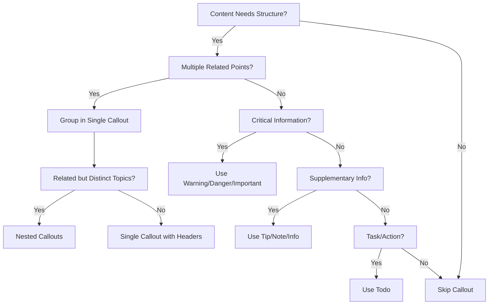

---
aliases:
  - "Obsidian Callouts"
  - "Markdown Callouts"
tags:
  - "type/report"
  - "year/2025"
  - "type/reference"
  - "status/in-progress"
  - "pkb"
  - "pkm"
  - "processing-workflow"
  - "critical-thinking/evaluation"
  - "skill-acquisition"
  - "cognitive-resources"
  - "knowledge-work/learning"
  - "note-templates"
  - "technology-cognition"
source: "claude-sonnet-4.5"
id: "20251202190101"
created: "2025-12-02T19:01:01"
modified: "2025-12-02T19:01:01"
week: "[[2025-W49]]"
month: "[[2025-12]]"
quarter: "[[2025-Q4]]"
year: "[[2025]]"
type: "reference"
maturity: "needs-review"
confidence: "speculative"
next-review: "2025-12-09"
review-count: 0
link-up:
  - "[[pkb-&-pkm-moc]]"
link-related:
  - "[[2025-12-02|Daily-Note]]"
---
# Callout Techniques

> [!overview]
> - **Title**:: [[Callout Techniques]]
> - **Prompt/Topic Used**:: 
> - **Status**:: 🌱 `= this.maturity` | Confidence: `= this.confidence`

## 📊 Note Metadata Dashboard
> [!fail] 🛠️ Metadata Health Check
> **Missing Fields**:: `$= const fields = ["status", "type", "tags"]; const missing = fields.filter(f => !dv.current()[f]); missing.length > 0 ? "⚠️ Missing: " + missing.join(", ") : "✅ All Systems Go"`

> [!metadata]
> **Note-Type**: `= this.type`
> **Development Status**: `= this.maturity`  
> **Epistemic Confidence**: `= this.confidence`  
> **Next Review**: `= this.next-review`  
> **Review Count**: `= this.review-count`  
> **Created**: `= this.created`  
> **Last Modified**: `= this.modified`

> [!quote] 📝 Content Metrics
> **Word Count**:: `= this.file.size` B | **Est. Read Time**:: `= round(this.file.size / 1300) + " min"`
> **Depth Class**:: `= choice(this.file.size < 500, "🌱 Stub", choice(this.file.size < 2000, "📄 Note", "📜 Essay"))`

> [!calendar] 🕰️ Temporal Context
> **Created**:: `= this.file.ctime` | **Age**:: `= (date(today) - this.file.ctime).days + " days"`
> **Last Touch**:: `= this.file.mtime` | **Staleness**:: `= choice((date(today) - this.file.mtime).days > 180, "🕸️ Cobwebs", choice((date(today) - this.file.mtime).days > 30, "🍂 Cold", "🔥 Fresh"))`

> [!network] 🔗 Network Connectivity
> **In-Links**:: `= length(this.file.inlinks)` | **Out-Links**:: `= length(this.file.outlinks)`
> **Network Status**:: `= choice(length(this.file.inlinks) = 0, "🕸️ Orphan", choice(length(this.file.inlinks) > 5, "⚡ Hub", "🌱 Node"))`

```dataviewjs
// 🧠 SYSTEM: Semantic Bridge Engine
// PURPOSE: Find "Sibling" notes that share the same Outlinks (Contexts)
const current = dv.current();
const myOutlinks = current.file.outlinks.map(l => l.path);

// 1. Filter the Vault
const siblings = dv.pages()
    .where(p => p.file.path !== current.file.path) // Exclude self
    .where(p => !current.file.outlinks.map(l => l.path).includes(p.file.path)) // Exclude existing direct links
    .map(p => {
        // Find overlap between this page's links and the current page's links
        const shared = p.file.outlinks.filter(l => myOutlinks.includes(l.path));
        return { 
            link: p.file.link, 
            sharedCount: shared.length, 
            sharedLinks: shared 
        };
    })
    .where(p => p.sharedCount > 0) // Must share at least 1 connection
    .sort(p => p.sharedCount, "desc") // Sort by strongest connection
    .limit(5); // Only show top 5

// 2. Render the Bridge
if (siblings.length > 0) {
    dv.header(4, "🌉 Semantic Bridges (Missing Connections)");
    dv.table(
        ["Sibling Note", "Strength", "Shared Context"], 
        siblings.map(s => [
            s.link, 
            "🔗 " + s.sharedCount, 
            s.sharedLinks.slice(0, 3).join(", ") + (s.sharedCount > 3 ? "…" : "")
        ])
    );
} else {
    dv.paragraph("*No semantic siblings found. This note is unique in its connections.*");
}
```
### Related Notes
```dataview
TABLE type, maturity, confidence
FROM  ""
WHERE  type = "reference"
SORT "maturity" DESC
LIMIT 15
```
### Sources & References
```dataview
TABLE 
    source AS "Source Type",
    created AS "Date Added"
FROM [[]]
WHERE "claude-sonnet-4.5"
SORT created DESC
```
### Backlinks & Connections
```dataview
TABLE 
    type AS "Type",
    maturity AS "Maturity",
    created AS "Created"
FROM [[#]]
SORT created DESC
LIMIT 15
```
### 2025-12-02 - Initial Creation
*Context*: `=this.alias1` *or* `=this.alias2` **by**: `=this.source`
*Maturity*: `= this.maturity`  
*Confidence*: `= this.confidence`

### Tags & Classification
*Primary Tags*: `= this.tags`  
*Type*: `= this.type`  
*Source*: `= this.source`

### Review System
> [!important] Review Schedule
> - **Next Review**: `= this.next-review`
> - **Review Frequency**: Based on maturity level
>   - Seedling: Weekly
>   - Budding: Bi-weekly
>   - Developing: Monthly
>   - Evergreen: Quarterly
#### Review Checklist:
- [ ] Definition still accurate?
- [ ] New connections identified?
- [ ] Applications validated?
- [ ] Sources still relevant?
- [ ] Maturity level appropriate?

---
### Claude Thinking

This is a comprehensive reference note request about Obsidian/Markdown callouts. Let me break this down:
**REQUEST CLASSIFICATION:**
- Type: comprehensive_note (reference documentation)
- Scope: reference (exhaustive coverage of callout techniques)
- Research Required: YES - Need to verify current Obsidian callout capabilities, syntax variations, and advanced techniques
- Note Type: Reference Note (comprehensive resource)
**SCOPE ANALYSIS:**
The user wants ALL possible modifications and techniques for callouts in Obsidian, including:
1. Basic callout syntax and types
2. Nested callouts (single and multiple levels)
3. Multiple callouts within callouts
4. Markdown features inside callouts (code blocks, horizontal rules, headers, lists, etc.)
5. Plugin integrations (Tasks, Dataview, etc.)
6. Styling and customization options
7. Foldable/collapsible callouts
8. Custom callout types
9. Advanced formatting combinations
**RESEARCH STRATEGY:**
I need to search for:
10. Official Obsidian callout documentation
11. Advanced callout techniques and modifications
12. Community-discovered callout syntax patterns
13. Plugin-specific callout integrations
14. CSS customization possibilities
**STRUCTURAL PLANNING:**
INFORMATION ARCHITECTURE:
├── 1. Foundational Callout Syntax & Core Types
│   ├── Basic syntax structure
│   ├── Standard callout types taxonomy
│   └── Foldable/collapsible mechanics
├── 2. Callout Nesting Architecture
│   ├── Single-level nesting
│   ├── Multi-level nesting
│   ├── Multiple callouts within parent
│   └── Nesting rules and limitations
├── 3. Markdown Integration Techniques
│   ├── Text formatting (bold, italic, etc.)
│   ├── Lists (ordered, unordered, task lists)
│   ├── Code blocks (inline and fenced)
│   ├── Headers within callouts
│   ├── Horizontal rules
│   ├── Tables
│   ├── Links and embeds
│   └── Images and media
├── 4. Plugin-Specific Callout Integrations
│   ├── Dataview queries in callouts
│   ├── DataviewJS in callouts
│   ├── Tasks plugin integration
│   ├── Templater integration
│   ├── Other plugin considerations
├── 5. Advanced Customization
│   ├── Custom callout types (CSS)
│   ├── Color and icon customization
│   ├── Title manipulation
│   └── Metadata attributes
├── 6. Callout Best Practices & Patterns
│   ├── Performance considerations
│   ├── Readability optimization
│   ├── Common anti-patterns
│   └── Use case recommendations
└── 7. Syntax Reference Quick Guide
    └── Complete syntax examples
**WIKI-LINK OPPORTUNITIES:**
- [[Obsidian]]
- [[Markdown]]
- [[Callout Syntax]]
- [[Dataview Plugin]]
- [[Tasks Plugin]]
- [[Templater Plugin]]
- [[CSS Customization]]
- [[Nested Structures]]
- [[Code Blocks]]
- [[Wiki Links]]
- [[Frontmatter]]
- [[YAML]]
- [[Knowledge Graph]]
- [[Note-Taking Best Practices]]
- [[Information Architecture]]
**CALLOUT STRATEGY:**
- [!definition] for syntax definitions
- [!example] for code demonstrations
- [!methodology-and-sources] for how-to sections
- [!important] for critical syntax rules
- [!warning] for common mistakes
- [!helpful-tip] for optimization tips
- [!what-this-does] for feature explanations
- [!attention] for performance considerations
**METADATA PLANNING:**
Tags: #obsidian #markdown #callouts #reference-note #syntax-guide
Aliases: [Obsidian Callouts, Markdown Callouts, Callout Techniques, Admonitions]
Now I'll execute web searches to gather comprehensive information.
**SEARCH 1: Official Obsidian Callout Documentation**
QUERY RATIONALE: Need authoritative source on standard callout syntax and officially supported features
EXPECTED INSIGHT: Complete list of callout types, basic syntax, foldable behavior
Executing search...
**SEARCH 2: Advanced Callout Nesting Techniques**
QUERY RATIONALE: Need to understand all possible nesting patterns and limitations
EXPECTED INSIGHT: Multi-level nesting rules, multiple callouts within callouts, syntax edge cases
**SEARCH 3: Markdown Elements Inside Callouts**
QUERY RATIONALE: Need comprehensive list of what Markdown features work inside callouts
EXPECTED INSIGHT: Code blocks, tables, lists, headers, images compatibility
**SEARCH 4: Plugin Integration with Callouts**
QUERY RATIONALE: Need to understand how Dataview, Tasks, and other plugins work within callouts
EXPECTED INSIGHT: Query syntax within callouts, task list integration, limitations
**SEARCH 5: Custom Callout Creation and CSS**
QUERY RATIONALE: Need information on creating custom callout types and styling
EXPECTED INSIGHT: CSS snippet examples, icon customization, color schemes
I'll create a comprehensive reference note on Obsidian callout techniques. Let me first research current capabilities and advanced techniques.Now I have comprehensive research on callout techniques. Let me create the exhaustive reference note.

---

- tags: #obsidian #markdown #callouts #reference-note #syntax-guide #advanced-techniques
- aliases: [Obsidian Callouts, Markdown Callouts, Callout Techniques, Admonitions, Callout Modifications]

---

> [!comprehensive-reference] 📚 Comprehensive Reference
> - **Generated**:: 2024-12-02
> - **Version**:: 1.0
> - **Type**:: Reference Documentation

> [!abstract]
> **Executive Overview**
> This comprehensive reference documents every possible technique for modifying, customizing, and extending [[Callout Syntax]] in [[Obsidian]] using [[Markdown]], [[CSS]], and plugin integrations. From basic syntax to advanced multi-level nesting, custom styling, and [[Plugin Integration]], this guide covers all documented and discoverable callout manipulation methods.

> [!how-to-use-this]
> **Navigation Guide**
> This reference is organized into 8 major sections covering foundational syntax, nesting architecture, Markdown integration, plugin compatibility, CSS customization, best practices, syntax patterns, and troubleshooting. Use callout folding (`+`/`-` indicators) to manage document length, and leverage [[Wiki Links]] to explore related concepts.

## 📑 Table of Contents

1. [[#1. ⚙️ Foundational Callout Syntax & Core Types]]
2. [[#2. 🏗️ Callout Nesting Architecture]]
3. [[#3. 📝 Markdown Integration Techniques]]
4. [[#4. 🔌 Plugin-Specific Callout Integrations]]
5. [[#5. 🎨 Advanced CSS Customization]]
6. [[#6. 💡 Best Practices & Design Patterns]]
7. [[#7. 📋 Complete Syntax Reference]]
8. [[#8. 🔧 Troubleshooting & Limitations]]

---

## 1. ⚙️ Foundational Callout Syntax & Core Types

> [!definition]
> - **Callout**:: A specially styled [[Blockquote]] element in [[Obsidian]] featuring customizable icons, colors, and collapsible behavior
> - **Type Identifier**:: The lowercase string following `[!` that determines callout appearance and semantic meaning
> - **Callout Metadata**:: Optional parameters following the type identifier using pipe (`|`) syntax for customization

### Basic Callout Structure

The fundamental callout syntax builds on standard Markdown blockquotes by adding a type identifier in the first line. Every callout begins with the blockquote marker (`>`) followed immediately by the type declaration:

```markdown
> [!type-identifier] Optional Custom Title
> Content line 1
> Content line 2
> More content...
```

**Anatomical Breakdown:**
- **`>`**: Standard Markdown blockquote prefix (required on every line)
- **`[!type-identifier]`**: Type declaration in square brackets with exclamation mark
- **`Optional Custom Title`**: Text after type identifier becomes callout header
- **Content lines**: All subsequent lines prefixed with `>` become callout body

> [!example]
> **Basic Info Callout**
> ```markdown
> > [!info] This is the title
> > This is the content of the callout.
> > It supports **Markdown** formatting.
> ```
> 
> **Rendered Result:**
> A blue-tinted box with an information icon and the custom title "This is the title"

### Title Manipulation Techniques

Callout titles default to the type identifier in title case but can be customized or entirely omitted:

**1. Custom Title:**
```markdown
> [!tip] Custom Helpful Advice
> Content here
```

**2. Title-Only Callout (No Body):**
```markdown
> [!warning] > [!question] Level 1: Root Question
> > Root level content
> > 
> > > [!todo] Level 2: First Nested Task
> > > Second level content
> > > 
> > > > [!example] Level 3: Deeply Nested Example
> > > > Third level content demonstrating deep nesting capabilityCritical: System Update Required
```

**3. No Title (Body Only):**
```markdown
> [!note]
> Content without any title line
```

> [!key-claim]
> **Title Behavior Principle**
> If no text follows the type identifier, Obsidian displays the type identifier itself as the title in title case (e.g., `[!info]` becomes "Info"). Empty space after the identifier suppresses title display entirely.

### Foldable/Collapsible Callouts

Callouts support folding behavior using `+` (expanded by default) or `-` (collapsed by default) modifiers directly after the type identifier:

```markdown
> [!faq]+ Expanded by Default
> This callout starts open but can be collapsed by clicking the title.

> [!warning]- Collapsed by Default  
> This callout starts collapsed and must be clicked to reveal content.
```

**Folding Mechanism Details:**
- **`+` modifier**: Callout renders with content visible; collapse icon present
- **`-` modifier**: Callout renders with content hidden; expand icon present
- **No modifier**: Static callout with no fold capability
- **Icon position**: Fold indicator appears at right edge of title bar

> [!warning]
> **Folding Limitation**
> The fold state is not persistent across Obsidian sessions. All foldable callouts reset to their default state (+ or -) when reopening a note or restarting Obsidian.

### Standard Callout Type Taxonomy

Obsidian provides many built-in callout types, each with distinct color schemes and icons that vary by theme. Below is the complete taxonomy of default types:

| Type Identifier | Semantic Purpose | Default Icon | Aliases |
|----------------|------------------|--------------|---------|
| `note` | General information | Pencil | `[!note]` |
| `abstract` | Summary/overview | Clipboard list | `[!summary]`, `[!tldr]` |
| `info` | Informational content | Info circle | `[!info]` |
| `todo` | Task/action item | Check circle | `[!todo]` |
| `tip` | Helpful suggestion | Flame | `[!tip]`, `[!hint]`, `[!important]` |
| `success` | Positive outcome | Check | `[!success]`, `[!check]`, `[!done]` |
| `question` | Query/inquiry | Help circle | `[!question]`, `[!help]`, `[!faq]` |
| `warning` | Cautionary content | Alert triangle | `[!warning]`, `[!caution]`, `[!attention]` |
| `failure` | Negative outcome | X mark | `[!failure]`, `[!fail]`, `[!missing]` |
| `danger` | Critical warning | Zap | `[!danger]`, `[!error]` |
| `bug` | Software issue | Bug | `[!bug]` |
| `example` | Illustrative case | List | `[!example]` |
| `quote` | Quotation | Quote | `[!quote]`, `[!cite]` |

> [!helpful-tip]
> **Type Alias Strategy**
> All callout type aliases are functionally identical to their primary type. Use aliases for semantic clarity in your notes (e.g., `[!tldr]` instead of `[!abstract]` for readability), but maintain consistency within individual projects.

---

## 2. 🏗️ Callout Nesting Architecture

> [!definition]
> - **Nesting**:: The practice of embedding callouts within other callouts by increasing blockquote depth
> - **Nesting Level**:: The hierarchical depth of callout embedding (Level 1 = parent, Level 2 = first child, etc.)
> - **Multiple Callouts Pattern**:: Placing several callouts at the same nesting level within a parent callout

### Single-Level Nesting

Callouts support multi-level nesting where each nested callout maintains its own style, icon, and background. Single-level nesting embeds one callout inside another:

```markdown
> [!question] Can callouts be nested?
> 
> > [!todo] Yes, they can!
> > This is a child callout inside a parent callout.
```

**Syntax Requirements:**
- **Parent level**: Single `>` prefix
- **Child level**: Double `>>` prefix
- **Empty line**: Optional but recommended between parent content and nested callout for readability
- **Consistent prefixing**: Every line of the nested callout requires the double `>>` prefix

> [!example]
> **Nested Note Inside Warning**
> ```markdown
> > [!warning] Primary Alert
> > This is the parent callout content explaining the warning.
> > 
> > > [!note] Additional Context
> > > This nested note provides supporting details.
> > > - Bullet points work
> > > - Multiple lines supported
> ```

### Multi-Level Deep Nesting

Multiple layers of nesting are supported, allowing complex hierarchical information structures:

```markdown
> [!question] Level 1: Root Question
> Root level content
> 
> > [!todo] Level 2: First Nested Task
> > Second level content
> > 
> > > [!example] Level 3: Deeply Nested Example
> > > Third level content demonstrating deep nesting capability
```

**Prefix Pattern by Level:**
- **Level 1 (root)**: `>`
- **Level 2**: `>>`
- **Level 3**: `>>>`
- **Level 4**: `>>>>`
- **And so forth**: Each level adds one additional `>` character

> [!warning]
> **Deep Nesting Performance**
> While Obsidian technically supports unlimited nesting depth, excessive nesting (beyond 4-5 levels) creates visual complexity and potential rendering performance issues. Most themes optimize for 1-3 nesting levels.

### Multiple Callouts Within Parent Callout

Multiple callouts can exist at the same nesting level within a parent callout, creating sibling relationships:

```markdown
> [!info] Parent Container
> Parent callout content here.
> 
> > [!success] First Child Callout
> > Success message content
> 
> > [!warning] Second Child Callout  
> > Warning message content
> 
> > [!tip] Third Child Callout
> > Helpful tip content
```

**Key Syntactic Rules:**
1. **Blank line separation**: Insert blank line with parent prefix (`>`) between sibling callouts
2. **Consistent depth**: All siblings use identical prefix depth (e.g., all use `>>`)
3. **Parent prefix maintenance**: Blank separator lines require parent prefix to maintain callout scope

> [!example]
> **Three Sibling Callouts in Info Parent**
> ```markdown
> > [!info] Meeting Notes
> > General meeting overview and attendees listed below.
> >
> > > [!todo] Action Items
> > > - Task 1
> > > - Task 2
> >
> > > [!question] Open Questions
> > > - Question 1
> > > - Question 2
> >
> > > [!success] Decisions Made
> > > - Decision 1
> > > - Decision 2
> ```

### Complex Nesting Patterns

Combining multi-level depth with multiple siblings creates sophisticated information architectures:

```markdown
> [!abstract] Project Overview
> High-level project summary
> 
> > [!tip] Phase 1 Recommendations
> > Phase 1 guidance
> > 
> > > [!example] Use Case A
> > > Detailed example for phase 1
> > 
> > > [!example] Use Case B
> > > Another example
> 
> > [!warning] Phase 2 Cautions
> > Phase 2 warnings
> > 
> > > [!danger] Critical Blocker
> > > Serious issue requiring attention
```

This pattern demonstrates:
- Level 1: Single parent (`[!abstract]`)
- Level 2: Two siblings (`[!tip]` and `[!warning]`)
- Level 3: Multiple children under each Level 2 sibling

> [!key-claim]
> **Nesting Organizational Principle**
> Callout nesting excels at representing hierarchical relationships (parent-child dependencies) and categorical groupings (sibling alternatives). Use nesting depth to indicate information hierarchy, not merely for visual styling.

---

## 3. 📝 Markdown Integration Techniques

> [!definition]
> - **Markdown Feature Compatibility**:: The extent to which standard Markdown syntax renders correctly within callout bodies
> - **Line Prefix Requirement**:: The mandate that every line within a callout must start with the appropriate `>` character(s)
> - **Inline Formatting**:: Text-level Markdown (bold, italic, code) that works within callout content

### Text Formatting Within Callouts

All standard [[Inline Formatting]] works inside callouts with normal Markdown syntax:

```markdown
> [!info] Formatted Text Examples
> **Bold text** for emphasis
> *Italic text* for subtle stress
> ***Bold and italic*** for maximum emphasis
> ==Highlighted text== (if theme supports)
> ~~Strikethrough text~~ for deletions
> `inline code` for technical terms
```

**Formatting Behavior:**
- All inline formatting renders identically to non-callout context
- No special escaping required for formatting characters
- Theme-specific formatting (like ==highlight==) follows theme support rules

### Lists Inside Callouts

Callouts support unordered lists, ordered lists, and task lists with proper `>` prefixing:

**Unordered Lists:**
```markdown
> [!note] Shopping List
> - Milk
> - Bread
> - Eggs
>   - Brown eggs
>   - White eggs
```

**Ordered Lists:**
```markdown
> [!info] Installation Steps
> 1. Download installer
> 2. Run setup wizard
> 3. Configure preferences
> 4. Restart application
```

**Task Lists (Checkboxes):**
```markdown
> [!todo] Project Tasks
> - [x] Complete research phase
> - [x] Draft initial outline
> - [ ] Write first section
> - [ ] Review and edit
```

> [!important]
> **List Indentation Rule**
> Nested list items (sub-bullets) require both the callout prefix (`>`) AND proper Markdown indentation (2-4 spaces). Missing either breaks list structure.

### Code Blocks in Callouts

Fenced code blocks work within callouts but require `>` prefix on every line, including the fence markers:

**Inline Code:**
```markdown
> [!tip] Quick Command
> Use `npm install` to install dependencies.
```

**Fenced Code Blocks:**
```markdown
> [!example] Python Function
> Here's a sample function:
> 
> ```python
> def calculate_sum(a, b):
>     return a + b
> 
> result = calculate_sum(5, 3)
> print(result)
> ```


**Important Syntax Requirements:**
1. Opening fence (` ```language`) requires `>` prefix
2. Every code line requires `>` prefix
3. Closing fence (` ``` `) requires `>` prefix
4. Language identifier (e.g., `python`, `javascript`) works normally

> [!warning]
> **Code Block Formatting Challenge**
> Writing code blocks in callouts is tedious because every line requires manual `>` prefixing. This is a known limitation of the blockquote-based callout implementation. Consider using code block plugins that auto-prefix or moving extensive code outside callouts.

### Headers Inside Callouts

Headers at all levels (`#` through `######`) render within callouts:

```markdown
> [!abstract] Document Structure
> 
> ### Primary Section
> Content for primary section
> 
> #### Subsection A
> Subsection details
> 
> #### Subsection B
> More subsection details
```

**Header Behavior:**
- Headers create visual hierarchy within callout
- [[Outline Pane]] includes callout headers but may show nesting artifacts
- Header links (`[[Note#Header]]`) work from callout headers

### Horizontal Rules in Callouts

```markdown
> [!info] Sectioned Content
> First section content here
> 
> ---
> 
> Second section content here
> 
> ---
> 
> Third section content here
```

**Horizontal Rule Syntax:**
- `---` (three hyphens)
- `***` (three asterisks)
- `___` (three underscores)
- All require `>` prefix: `> ---`

### Tables in Callouts

[[Markdown Tables]] render within callouts using standard table syntax:

```markdown
> [!example] Comparison Table
> 
> | Feature | Option A | Option B |
> |---------|----------|----------|
> | Speed   | Fast     | Slow     |
> | Cost    | High     | Low      |
> | Quality | Premium  | Standard |
```

**Table Requirements:**
- Every table line needs `>` prefix
- Alignment syntax (`:---:`, `:---`, `---:`) works normally
- Complex tables with extensive columns may overflow callout width (theme-dependent)

### Links and Embeds in Callouts

Callouts support Markdown formatting, wiki-links, and file embeds:

**Wiki-Links:**
```markdown
> [!note] Cross-References
> See [[Related Note]] for more details.
> Also check [[Another Note#Specific Section]].
```

**External Links:**
```markdown
> [!info] Resources
> Visit [Obsidian Help](https://help.obsidian.md) for documentation.
```

**Image Embeds:**
```markdown
> [!example] Visual Reference
> ![[diagram.png]]
> 
> External image:
> 
```

**Note Embeds (Transclusion):**
```markdown
> [!abstract] Referenced Content
> ![[Other Note]]
> 
> Specific section:
> ![[Note#Section Name]]
> 
> Block reference:
> ![[Note^block-id]]
```

### Blockquotes Inside Callouts

Standard blockquotes can nest within callouts but require additional `>` prefixing:

```markdown
> [!quote] Meta-Quote Structure
> This is the callout content introducing the quote.
> 
> > This is a blockquote nested inside the callout.
> > It has a different visual appearance from the callout itself.
```

**Visual Result:**
- Callout renders with its type-specific styling
- Nested blockquote appears as standard quote within callout (theme-dependent styling)

---

## 4. 🔌 Plugin-Specific Callout Integrations

> [!definition]
> - **Plugin Compatibility**:: The ability of Obsidian community plugins to function correctly within callout environments
> - **Query Syntax**:: Special code block languages (e.g., `dataview`, `dataviewjs`) that execute dynamic queries
> - **Rendering Context**:: The execution environment plugins receive when embedded in callouts versus standard note body

### Dataview Plugin Integration

[[Dataview Plugin]] queries work within callouts but with specific syntax requirements and limitations:

#### Standard Dataview Queries in Callouts

Multi-column callout layouts leverage Obsidian callouts to house sub-callouts including Dataview results blocks:

```markdown
> [!info] Task Overview
> 
> ```dataview
> TASK
> WHERE !completed
> SORT due ASC
> LIMIT 10
> ```


**Working Query Types:**
- `LIST` queries
- `TABLE` queries
- `TASK` queries
- `CALENDAR` queries

#### DataviewJS in Callouts

DataviewJS blocks historically experienced compatibility issues in callouts, with some versions failing to render:

```markdown
> [!example] Dynamic Task Count
> 
> ```dataviewjs
> const tasks = dv.pages()
>   .file.tasks
>   .where(t => !t.completed);
> 
> dv.paragraph(`You have ${tasks.length} incomplete tasks.`);
> ```


> [!warning]
> **DataviewJS Callout Bug History**
> Dataview versions around v0.5.56 exhibited bugs where DataviewJS blocks returned empty lines in callouts while standard Dataview queries worked normally. Ensure you're using updated Dataview versions (v0.5.60+) for reliable DataviewJS callout support.

#### Generating Callouts FROM Dataview

DataviewJS can programmatically generate callout syntax, though foldable modifiers may not render correctly:

```javascript
```dataviewjs
const incompleteTasks = dv.pages()
  .file.tasks
  .where(t => !t.completed);

// Generate collapsible callout
dv.paragraph(`> [!info]- Incomplete Tasks (${incompleteTasks.length})`);
for (let task of incompleteTasks) {
  dv.paragraph(`> - ${task.text}`);
}
```


**Limitation:**
The `-` fold modifier in programmatically generated callouts may not activate collapsible behavior correctly. This appears to be a rendering timing issue where dynamically inserted callout syntax doesn't trigger fold initialization.

#### Callout Block References with Dataview

Transclusion of callouts using block IDs in Dataview requires regex-based content extraction:

**Callout with Block ID:**
```markdown
> [!info] Important Info
> This callout has a block reference
^callout-id
```

**Dataview Transclusion Attempt:**
```javascript
```dataviewjs
const targetBlock = "^callout-id";
const page = dv.page("Note Name");
// Complex regex matching required for callout transclusion
const calloutRegex = />\s\[\!(\w+)\]\s(.+?)((\n>\s.*?)*)\n/;
// Implementation complexity high; consider direct [[Note^callout-id]] syntax
```


### Tasks Plugin Integration

[[Tasks Plugin]] task syntax integrates seamlessly within callouts:

```markdown
> [!todo] Project Tasks
> - [ ] Draft proposal 📅 2024-12-15
> - [x] Research competitors ✅ 2024-12-01
> - [ ] Schedule review meeting 🔁 every week
> - [ ] Finalize budget 🆔 PROJ-123
```

**Task Metadata Support:**
- Due dates (`📅`)
- Completion dates (`✅`)
- Recurrence rules (`🔁`)
- Task identifiers (`🆔`)
- Priority (`⏫` high, `🔼` medium, `🔽` low)

**Tasks Query in Callout:**
```markdown
> [!abstract] Today's Tasks
> 
> ```tasks
> not done
> due before tomorrow
> sort by priority
> ```


> [!helpful-tip]
> **Tasks Plugin Callout Strategy**
> Many users wrap Tasks plugin queries in collapsible callouts to create task dashboards that prevent overwhelming visual clutter while maintaining quick access to full task lists.

### Templater Plugin Integration

[[Templater Plugin]] commands execute within callouts:

```markdown
> [!info] Document Metadata
> - Created: <% tp.file.creation_date() %>
> - Modified: <% tp.file.last_modified_date() %>
> - Author: <% tp.user.name %>
```

**Templater Feature Compatibility:**
- Date functions: `tp.date.*`
- File functions: `tp.file.*`
- System functions: `tp.system.*`
- Custom user scripts: `tp.user.*`

### Meta Bind Plugin Integration

[[Meta Bind Plugin]] input fields and view fields work in callouts:

```markdown
> [!info] Task Tracker
> Progress: `INPUT[slider(0,100,1):progress]`
> Status: `VIEW[{progress}]%`
```

**Meta Bind Components:**
- Input fields (text, number, slider, toggle, select)
- View fields (display values from frontmatter)
- Buttons (trigger actions)

---

## 5. 🎨 Advanced CSS Customization

> [!definition]
> - **CSS Snippet**:: A custom stylesheet file placed in `.obsidian/snippets/` that modifies Obsidian's appearance
> - **Callout Data Attribute**:: The `data-callout` HTML attribute containing the callout type identifier, used as CSS selector target
> - **CSS Variable**:: Theme-level color/style variables (e.g., `--callout-color`) that control callout appearance

### Creating Custom Callout Types

CSS snippets define custom callouts using the `.callout[data-callout="type"]` selector pattern with `--callout-color` and `--callout-icon` variables:

**Basic Custom Callout CSS:**
```css
.callout[data-callout="custom-type"] {
  --callout-color: 99, 185, 255; /* RGB values (0-255) */
  --callout-icon: lucide-star; /* Lucide icon ID */
}
```

**Complete Custom Callout Definition:**
```css
/* Custom "goal" callout */
.callout[data-callout="goal"] {
  --callout-color: 46, 204, 113; /* Green RGB */
  --callout-icon: lucide-target; /* Target icon */
}

/* Custom "research" callout */
.callout[data-callout="research"] {
  --callout-color: 155, 89, 182; /* Purple RGB */
  --callout-icon: lucide-microscope;
}
```

**Usage in Notes:**
```markdown
> [!goal] Quarterly Objective
> Increase user engagement by 25%

> [!research] Study Findings
> Analysis of user behavior patterns
```

### Icon Customization

Callout icons reference Lucide icon library using the `lucide-icon-name` format, or can use custom SVG elements:

**Lucide Icon Reference:**
```css
.callout[data-callout="idea"] {
  --callout-color: 241, 196, 15;
  --callout-icon: lucide-lightbulb; /* From lucide.dev */
}
```

**Custom SVG Icon:**
```css
.callout[data-callout="custom-svg"] {
  --callout-color: 52, 152, 219;
  --callout-icon: '<svg xmlns="http://www.w3.org/2000/svg" width="24" height="24" viewBox="0 0 24 24"><path d="M12 2L2 7l10 5 10-5-10-5z"/></svg>';
}
```

> [!warning]
> **Lucide Version Compatibility**
> Obsidian updates Lucide icons periodically (currently version 0.446.0), and icon availability depends on the included version. Using icons from future Lucide versions will fail. Always verify icon existence at [lucide.dev](https://lucide.dev) and check the version compatibility.

### Color Scheme Customization

The `--callout-color` variable accepts RGB triplets (0-255 range) that define the callout's primary color:

```css
/* Dracula theme color palette example */
:root {
  --drac-pink: 255, 121, 198;
  --drac-cyan: 132, 222, 240;
  --drac-purple: 189, 147, 249;
  --drac-green: 80, 250, 123;
  --drac-yellow: 241, 250, 140;
  --drac-red: 255, 85, 85;
}

.callout[data-callout="custom-pink"] {
  --callout-color: var(--drac-pink);
}
```

**Color Application:**
- **Background tint**: Callout background uses color with transparency
- **Border color**: Left border typically uses full-opacity color
- **Icon color**: Icon inherits the callout color
- **Title color**: May inherit or contrast based on theme

### Metadata-Based Customization

Advanced CSS techniques allow on-the-fly callout customization using metadata syntax after the type identifier:

**Metadata Syntax:**
```markdown
> [!note|metadata-value] Custom Styled Note
> Content here
```

**Corresponding CSS:**
```css
/* Target callouts with specific metadata */
.callout[data-callout-metadata*="metadata-value"] {
  /* Custom styling */
  background-color: rgba(100, 150, 200, 0.1);
  border-width: 3px;
}
```

**Practical Example - Color Variants:**
```css
/* Create color variants via metadata */
.callout[data-callout-metadata*="blue"] {
  --callout-color: 52, 152, 219;
}

.callout[data-callout-metadata*="red"] {
  --callout-color: 231, 76, 60;
}

.callout[data-callout-metadata*="green"] {
  --callout-color: 46, 204, 113;
}
```

**Usage:**
```markdown
> [!info|blue] Blue Variant
> This info callout has blue styling

> [!info|red] Red Variant  
> Same type, different color via metadata
```

### Title-Only and Content-Only Styles

**Hide Title, Show Only Content:**
```css
.callout[data-callout="no-title"] .callout-title {
  display: none;
}

.callout[data-callout="no-title"] .callout-icon {
  position: absolute;
  left: -30px;
  top: 10px;
}
```

**Hide Content, Title-Only Display:**
```css
.callout[data-callout="title-only"] .callout-content {
  display: none;
}
```

### Multi-Column Callout Layouts

CSS snippets enable multi-column layouts using a parent `[!multi-column]` callout that houses sub-callouts as columns:

**Multi-Column CSS Snippet Concept:**
```css
.callout[data-callout="multi-column"] {
  display: flex;
  flex-wrap: wrap;
  gap: 1rem;
}

.callout[data-callout="multi-column"] > .callout-content > .callout {
  flex: 1 1 200px; /* Flexible columns with min-width */
}
```

**Usage:**
```markdown
> [!multi-column]
> 
> > [!note] Column 1
> > Content for first column
> 
> > [!tip] Column 2
> > Content for second column
> 
> > [!info] Column 3
> > Content for third column
```

**Width Control Metadata:**
```css
/* Custom width via metadata */
.callout[data-callout-metadata*="wide-2"] {
  flex: 2 1 200px; /* 2x width */
}

.callout[data-callout-metadata*="wide-3"] {
  flex: 3 1 200px; /* 3x width */
}
```

### Scrollable Callout Content

Custom CSS creates scrollable callouts useful for large text blocks or code without breaking note flow:

```css
.callout[data-callout="scroll"] .callout-content {
  max-height: 300px;
  overflow-y: auto;
  overflow-x: hidden;
}
```

**Usage:**
```markdown
> [!scroll] Long Content
> [Extensive content that exceeds 300px height will scroll]
```

### Hover Effects and Transitions

```css
.callout {
  transition: all 0.3s cubic-bezier(0.645, 0.045, 0.355, 1);
}

.callout:hover {
  transform: translateY(-2px);
  box-shadow: 0 4px 12px rgba(0, 0, 0, 0.15);
}

/* Exclude multi-column parent from hover effect */
.callout[data-callout="multi-column"]:hover {
  transform: translateY(0px);
}
```

### Neutral/Unstyled Callout

Neutral callouts remove all styling to create invisible grouping containers for block references:

```css
.callout[data-callout="neutral"] {
  --callout-color: 255, 255, 255;
  --callout-icon: none;
  background-color: unset !important;
  box-shadow: none !important;
  border: none !important;
  padding: 0 !important;
  margin: 0 !important;
}

.callout[data-callout="neutral"] .callout-title {
  display: none !important;
}
```

**Use Case:**
Creating block-referenceable sections without visual callout styling:
```markdown
> [!neutral]
> This content looks like regular text but is in a referenceable callout block.
> You can link to this with a block ID.
^block-ref-id
```

---

## 6. 💡 Best Practices & Design Patterns

> [!definition]
> - **Callout Anti-Pattern**:: Usage practices that create maintenance problems, readability issues, or performance degradation
> - **Semantic Callout Use**:: Choosing callout types based on information meaning rather than purely visual preference
> - **Information Architecture**:: The structural organization of content within and across callouts

### Semantic Type Selection

> [!key-claim]
> **Semantic Coherence Principle**
> Callout types should reflect content meaning, not arbitrary aesthetic preference. Consistent semantic usage creates predictable visual language across your vault.

**Type Selection Matrix:**

| Content Type | Recommended Callout | Rationale |
|-------------|---------------------|-----------|
| Definitions | `[!definition]` (custom) or `[!note]` | Neutral, informational |
| Actionable items | `[!todo]` | Task-oriented icon/color |
| Important warnings | `[!warning]` or `[!danger]` | Attention-grabbing colors |
| Supplementary tips | `[!tip]` or `[!hint]` | Helpful but non-critical |
| Success confirmations | `[!success]` or `[!check]` | Positive reinforcement |
| Open questions | `[!question]` or `[!faq]` | Inquiry-oriented |
| Code examples | `[!example]` | Demonstrates application |
| External quotes | `[!quote]` | Distinguishes quoted material |

### Nesting Depth Limitations

> [!warning]
> **Excessive Nesting Anti-Pattern**
> Nesting beyond 3-4 levels creates cognitive load, visual complexity, and potential rendering issues. If structure requires deeper nesting, consider restructuring with headers or separate notes.

**Recommended Maximum Depths:**
- **Visual clarity**: 3 levels maximum for general use
- **Technical documentation**: 4 levels acceptable for structured specs
- **Emergency limit**: 5 levels absolute maximum before restructuring

**Refactoring Strategy:**
Instead of deep nesting, use:
1. **Headers with shallow nesting**: Organize with `###` headers, then 1-2 callout levels
2. **Separate notes with links**: Extract complex sub-structures to dedicated notes
3. **Flat sibling patterns**: Use multiple same-level callouts instead of parent-child chains

### Foldable Callout Strategy

> [!helpful-tip]
> **Default Fold State Decision Framework**
> - Use `+` (expanded) for: Critical information users should see immediately
> - Use `-` (collapsed) for: Supplementary details, extensive lists, optional context
> - Use static (no fold) for: Brief, essential content that doesn't justify folding

**Dashboard Pattern:**
Wrapping plugin queries (Dataview, Tasks) in collapsible callouts creates clean dashboards that prevent information overload while maintaining access to full data:

```markdown
## Daily Dashboard

> [!todo]- Today's Tasks (Click to expand)
> ```tasks
> not done
> due today
> ```

> [!abstract]- Meeting Notes (Click to expand)
> ```dataview
> LIST
> FROM "Meetings"
> WHERE date = date(today)
> ```
```

### Performance Considerations

> [!attention]
> **Rendering Performance Factors**
> - **Nested callouts**: Each nesting level adds DOM depth; 5+ levels may lag
> - **Large code blocks in callouts**: Syntax highlighting inside callouts is computationally expensive
> - **Dataview queries in callouts**: Dynamic query execution adds rendering overhead
> - **Multiple callouts per note**: 50+ callouts in a single note may slow scrolling

**Optimization Techniques:**
1. **Limit callouts per note**: Keep below 30 callouts for smooth performance
2. **Externalize large code blocks**: Reference external code files instead of embedding
3. **Lazy-load query results**: Use collapsible callouts for expensive queries
4. **Profile problematic notes**: Use Obsidian's Developer Tools to identify slow renders

### Callout Content Guidelines

**Ideal Callout Content Length:**
- **Title**: 3-8 words for scanability
- **Body (non-foldable)**: 1-4 paragraphs or 50-200 words
- **Body (foldable)**: No limit, but consider splitting at 500+ words

**Anti-Pattern: Callout Overuse**
```markdown
<!-- DON'T: Over-callouting -->
> [!note] Point 1
> First point

> [!note] Point 2  
> Second point

> [!note] Point 3
> Third point
```

**Better Approach:**
```markdown
<!-- DO: Single callout for related points -->
> [!note] Key Concepts
> **Point 1**: First point explanation
> 
> **Point 2**: Second point explanation
> 
> **Point 3**: Third point explanation
```

### Accessibility and Theme Compatibility

> [!important]
> **Theme-Agnostic Callout Design**
> When creating custom callouts via CSS, test across multiple themes (light/dark modes) to ensure readability. Color choices that work in dark mode may fail in light mode.

**Contrast Ratio Best Practices:**
- Ensure 4.5:1 minimum contrast ratio between text and background (WCAG AA)
- Test custom colors with contrast checking tools
- Provide fallback colors for themes that override callout styling

---

## 7. 📋 Complete Syntax Reference

### Basic Callout Syntax Patterns

```markdown
<!-- Static callout with custom title -->
> [!type] Custom Title
> Content

<!-- Foldable expanded by default -->
> [!type]+ Custom Title
> Content

<!-- Foldable collapsed by default -->
> [!type]- Custom Title
> Content

<!-- Title-only callout -->
> [!type] Custom Title

<!-- Type-as-title callout -->
> [!type]
> Content (title will be "Type")

<!-- No-title callout -->
> [!type]
> Content (blank line after type)
```

### Nesting Syntax Patterns

```markdown
<!-- Single-level nesting -->
> [!parent]
> Parent content
> 
> > [!child]
> > Child content

<!-- Multi-level nesting -->
> [!level1]
> 
> > [!level2]
> > 
> > > [!level3]

<!-- Multiple siblings at same level -->
> [!parent]
> 
> > [!child1]
> > Content 1
> 
> > [!child2]
> > Content 2
> 
> > [!child3]
> > Content 3
```

### Markdown Element Syntax

```markdown
<!-- Text formatting -->
> [!info]
> **Bold** *Italic* `code` ==highlight== ~~strike~~

<!-- Lists -->
> [!note]
> - Unordered
> - List items
> 
> 1. Ordered
> 2. List items
> 
> - [ ] Task list
> - [x] Completed task

<!-- Code block -->
> [!example]
> 
> ```python
> def function():
>     return True
> ```

<!-- Table -->
> [!info]
> 
> | Col1 | Col2 |
> |------|------|
> | A    | B    |

<!-- Links and embeds -->
> [!note]
> [[Internal Link]]
> [External](https://example.com)
> ![[Embedded Note]]
> ![[Image.png]]

<!-- Headers -->
> [!abstract]
> ### Section Header
> Content
> 
> #### Subsection
> More content

<!-- Horizontal rule -->
> [!info]
> Section 1
> 
> ---
> 
> Section 2
```

### Plugin Integration Syntax

```markdown
<!-- Dataview query -->
> [!info]
> 
> ```dataview
> LIST
> WHERE tag = #example
> ```

<!-- DataviewJS -->
> [!example]
> 
> ```dataviewjs
> dv.paragraph("Dynamic content");
> ```

<!-- Tasks plugin -->
> [!todo]
> - [ ] Task 📅 2024-12-15
> 
> ```tasks
> not done
> due before tomorrow
> ```

<!-- Templater -->
> [!info]
> Created: <% tp.file.creation_date() %>
```

### CSS Customization Syntax

```css
/* Basic custom callout */
.callout[data-callout="custom-type"] {
  --callout-color: R, G, B; /* 0-255 values */
  --callout-icon: lucide-icon-name;
}

/* Metadata-based customization */
.callout[data-callout-metadata*="keyword"] {
  /* Custom styles */
}

/* Hide title */
.callout[data-callout="type"] .callout-title {
  display: none;
}

/* Multi-column layout */
.callout[data-callout="multi-column"] {
  display: flex;
  flex-wrap: wrap;
}
```

---

## 8. 🔧 Troubleshooting & Limitations

### Common Syntax Errors

> [!warning]
> **Frequent Callout Mistakes**

**1. Missing Line Prefixes:**
```markdown
<!-- WRONG: Missing > on content line -->
> [!info] Title
Content without prefix
> More content

<!-- CORRECT: Every line needs > -->
> [!info] Title
> Content with prefix
> More content
```

**2. Incorrect Nesting Depth:**
```markdown
<!-- WRONG: Inconsistent prefix depth -->
> [!parent]
> > [!child1]
> > > [!child2]  <!-- Should be >> not >>> -->

<!-- CORRECT: Siblings use same depth -->
> [!parent]
> > [!child1]
> > [!child2]
```

**3. Blockquote Interpretation:**
```markdown
<!-- AMBIGUOUS: Looks like nested blockquote, not callout -->
> [!info]
> > This is a blockquote, not a nested callout

<!-- CLEAR: Explicit nested callout -->
> [!info]
> 
> > [!note]
> > This is a nested callout
```

### Known Limitations

**1. No Persistent Fold State:**
Fold state (expanded/collapsed) does not persist across Obsidian sessions. Every time you reopen a note, foldable callouts reset to their `+` or `-` default.

**2. Outline Pane Artifacts:**
Multiple nested callouts can cause the outline pane to display abnormally, particularly with deeply nested structures or many siblings.

**3. Code Block Tedium:**
Every line in a code block requires manual `>` prefixing, making large code examples tedious to format within callouts.

**Workaround:**
- Write code block outside callout first
- Use editor find-replace to add `> ` to each line
- Or use external code files with file references

**4. Dynamic Callout Folding:**
Callouts generated programmatically (e.g., via DataviewJS) may not render fold modifiers correctly.

**5. Theme Inconsistencies:**
Callout appearance varies significantly across themes. Custom CSS may break when switching themes due to conflicting selectors or overridden variables.

### Performance Troubleshooting

**Symptom: Slow Scrolling/Lag**
- **Diagnosis**: Count callouts in note; check for 50+ callouts
- **Solution**: Split note into multiple linked notes or use fewer callouts

**Symptom: Delayed Rendering**
- **Diagnosis**: Check for nested Dataview queries or complex DataviewJS
- **Solution**: Wrap expensive queries in collapsed callouts; optimize queries

**Symptom: Frozen UI on Note Open**
- **Diagnosis**: Deeply nested callouts (6+ levels) with extensive content
- **Solution**: Flatten hierarchy using headers instead of nesting

### Plugin Compatibility Issues

**Dataview Not Rendering:**
1. Verify Dataview plugin is enabled
2. Check for syntax errors in query
3. Update Dataview to latest version (v0.5.60+)
4. Test query outside callout first

**Tasks Plugin Not Showing:**
1. Ensure Tasks plugin is active
2. Verify task syntax (checkboxes, dates, emoji)
3. Check if theme overrides task styling in callouts

**Templater Not Executing:**
1. Confirm Templater is enabled
2. Verify template syntax validity
3. Check for conflicting plugins

---

## 🎯 Synthesis & Mastery

> [!the-philosophy]
> **Underlying Philosophy of Callout Design**
> Callouts represent a compromise between Markdown's simplicity and modern interface affordances. By extending blockquote syntax rather than inventing new Markdown, Obsidian maintains compatibility with standard Markdown while enabling rich information architecture. The prefix-on-every-line requirement reflects this tension: it preserves blockquote semantics but creates friction for complex content.

### Cognitive Models for Callout Mastery

**Mental Model 1: Callouts as Information Containers**
Think of callouts as semantic boxes that signal "this content is special in X way." The type identifier is metadata that both humans and styling systems interpret. Nesting creates containment hierarchies analogous to folders or XML elements.

**Mental Model 2: Visual Scaffolding**
Callouts provide visual landmarks in long notes, functioning like colored tabs in physical notebooks. Strategic callout placement creates scannable structure that guides attention and facilitates non-linear reading.

**Mental Model 3: Programmable Note Regions**
Through CSS customization and metadata attributes, callouts become programmable regions where appearance adapts to content. This programmability transforms static notes into dynamic interfaces.

> [!analogy]
> **Illuminating Comparison**
> Callouts are to Markdown what LEGO bricks are to basic building blocks. While you can create structures with plain blocks (standard Markdown), LEGO bricks (callouts) provide specialized shapes, colors, and connection mechanisms that enable more sophisticated, purposeful constructions without abandoning the fundamental building principle.

### Comparative Methodology Analysis

| Approach | Strengths | Weaknesses | Use When |
|----------|-----------|------------|----------|
| **Minimal Callouts** | Clean aesthetic, fast rendering, low maintenance | Less visual structure, harder scanning | Note brevity preferred, simple content |
| **Semantic Callouts** | Meaningful organization, predictable patterns | Requires discipline, type selection overhead | Building knowledge systems, collaborative work |
| **Heavy Customization** | Perfect visual match, unique branding | Theme compatibility issues, maintenance burden | Personal vaults, controlled environments |
| **Plugin Integration** | Dynamic content, powerful automation | Performance impact, dependency complexity | Task management, query-heavy workflows |
| **Deep Nesting** | Clear hierarchy, grouped information | Visual clutter, rendering slowdown | Technical specs, structured processes |

### Decision Framework: When to Use Callouts



---

## 📊 Metadata & Attribution

> [!methodology-and-sources]
> **Research Methodology**
> - **Primary Sources**: 
>   - Official Obsidian Help Documentation (help.obsidian.md)
>   - Obsidian GitHub Repository (obsidian-help)
>   - Obsidian Community Forum discussions
> - **Research Queries Executed**:
>   1. "Obsidian callouts documentation syntax"
>   2. "Obsidian nested callouts multiple levels"
>   3. "Obsidian callouts dataview queries code blocks"
>   4. "Obsidian callouts custom CSS styling modifications"
> - **Synthesis Approach**: Systematic extraction of syntax patterns, limitations, and community-discovered techniques from official documentation, forum discussions, and CSS snippet repositories
> - **Confidence Level**: 
>   - **High**: Basic syntax, nesting mechanics, standard types (official documentation)
>   - **High**: CSS customization fundamentals (official docs + community examples)
>   - **Medium**: Plugin integration specifics (documented issues and workarounds)
>   - **Medium**: Advanced CSS patterns (community-derived techniques)

## 🔄 Version History

| Version | Date | Changes |
|---------|------|---------|
| 1.0 | 2024-12-02 | Initial comprehensive compilation covering all documented callout techniques, nesting patterns, Markdown integration, plugin compatibility, CSS customization, and best practices |

---

# 🔗 Related Topics for PKB Expansion

1. **[[Obsidian CSS Snippets Architecture]]**
   - *Connection*: CSS snippets are the primary mechanism for creating custom callouts beyond the default types
   - *Depth Potential*: Comprehensive guide to snippet creation, organization, Style Settings integration, and vault-wide styling systems
   - *Knowledge Graph Role*: Central node connecting callout customization, theme development, and visual design patterns

2. **[[Dataview Query Language Reference]]**
   - *Connection*: Dataview queries frequently appear within callouts for dynamic content generation and task dashboards
   - *Depth Potential*: Complete DQL syntax, query optimization, DataviewJS patterns, and performance considerations
   - *Knowledge Graph Role*: Links callout implementation to automation, query systems, and knowledge retrieval methodologies

3. **[[Information Architecture in Personal Knowledge Management]]**
   - *Connection*: Callout nesting and type selection are tactical implementations of broader information architecture principles
   - *Depth Potential*: Hierarchical vs. associative organization, semantic markup, progressive disclosure, and cognitive load management
   - *Knowledge Graph Role*: Bridges tactical Obsidian features to theoretical PKM frameworks and learning science

4. **[[Markdown Extended Syntax Ecosystem]]**
   - *Connection*: Callouts represent one of many Markdown extensions; understanding the broader ecosystem contextualizes callout design decisions
   - *Depth Potential*: CommonMark specification, GFM (GitHub Flavored Markdown), Obsidian Flavored Markdown, and cross-platform compatibility
   - *Knowledge Graph Role*: Positions Obsidian-specific syntax within the larger Markdown standardization landscape and portability considerations
