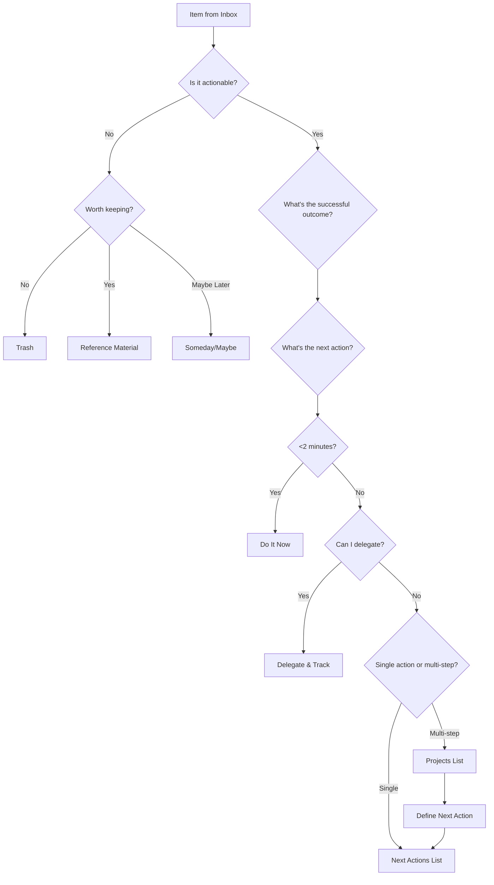

---
`tags: #pkm #pkm #pkm #workflow #obsidian #pkm #type/reference`
aliases: [GTD System, Getting Things Done, David Allen Method, GTD Methodology, GTD in Obsidian]
---

> [!comprehensive-reference] 📚 Comprehensive Reference
> - **Generated**:: 2025-11-14
> - **Version**:: 1.0
> - **Type**:: Reference Documentation
> - **Author**:: David Allen (Methodology), Adapted for [[obsidian]] [[PKB]] Implementation

> [!abstract]
> **Executive Overview**
> Getting Things Done is a personal productivity methodology developed by David Allen that transforms overwhelming task loads into stress-free productivity by capturing all commitments in a trusted external system and breaking them into clear, actionable steps. The system operates on the principle that "there is an inverse relationship between things on your mind and those things getting done," enabling practitioners to achieve what Allen calls "[[Mind Like Water]]"—a state of relaxed focus where you respond appropriately to inputs without mental clutter. This reference note provides exhaustive coverage of [[GTD]] principles, implementation strategies, and specialized guidance for deploying the system within an [[obsidian]]-based [[Personal Knowledge Base]].

> [!how-to-use-this]
> **Navigation Guide**
> This reference note is organized into 12 major sections covering all aspects of GTD methodology and Obsidian-specific implementation. Use the table of contents below for quick navigation to specific topics, or search for concepts using [[Wiki-Links]]. The document progresses from foundational philosophy through tactical implementation, concluding with advanced integration strategies for knowledge workers.

## 📑 Table of Contents

1. [Core Philosophy & Principles](#1-core-philosophy--principles)
2. [The Five Core Processes](#2-the-five-core-processes)
3. [GTD Lists & Organization System](#3-gtd-lists--organization-system)
4. [The Horizons of Focus Framework](#4-the-horizons-of-focus-framework)
5. [The Weekly Review Ritual](#5-the-weekly-review-ritual)
6. [Decision-Making Models](#6-decision-making-models)
7. [Obsidian Implementation Architecture](#7-obsidian-implementation-architecture)
8. [Plugin Ecosystem for GTD](#8-plugin-ecosystem-for-gtd)
9. [Workflow Templates & Automation](#9-workflow-templates--automation)
10. [Integration with PKB Systems](#10-integration-with-pkb-systems)
11. [Common Pitfalls & Solutions](#11-common-pitfalls--solutions)
12. [Advanced Applications](#12-advanced-applications)

---

## 🧠 1. Core Philosophy & Principles

> [!definition]
> - **Getting Things Done (GTD)**:: A comprehensive work-life management system designed to alleviate overwhelm and instill focus, clarity, and confidence by externalizing mental commitments into a trusted organizational framework.
> - **Open Loops**:: Unfinished tasks, commitments, or items of interest that occupy mental bandwidth—also called "incompletes" or "stuff."
> - **Trusted System**:: An external organizational framework reliable enough that your mind can fully release responsibility for remembering tasks and commitments.

### Foundational Concepts

The GTD methodology emerged from David Allen's recognition that the human brain excels at processing information rather than storing it. This insight led to the development of a system centered on complete mental offloading—a principle Allen encapsulates in the trademarked phrase "Your mind is for having ideas, not holding them."

The methodology addresses what Allen identifies as the fundamental productivity challenge of the information age: the overwhelming volume of inputs arriving through multiple channels—emails, texts, messages, articles, verbal requests, personal commitments, and professional obligations—each demanding attention and action decisions.

Allen's core claim is that stress can be reduced and productivity increased by putting reminders about everything you're not working on into a trusted system external to your mind, allowing you to work on the task at hand without distraction from "incompletes." This externaliz ation creates what [[Cognitive Psychology]] terms "[[Cognitive Offloading]]"—the strategic use of external tools to reduce the computational demands on [[Working Memory]].

The GTD framework distinguishes itself from traditional [[time management]] approaches through several key innovations:

**System Over Tools**: GTD doesn't require specific tools, apps, or products—Allen doesn't even advocate for digital over analog systems. The methodology is tool-agnostic, prioritizing systematic behavior over technological solutions. This flexibility allows practitioners to implement GTD in virtually any environment, from paper notebooks to sophisticated digital platforms like [[obsidian]].

**Bottom-Up Approach**: Unlike top-down planning methodologies that begin with grand vision and cascade downward, GTD works in reverse—establishing control over day-to-day inputs first, then progressively building toward higher-level planning. Allen argues that individuals struggle to focus on big-picture goals when they cannot sufficiently control daily tasks they frequently face.

**Context-Dependent Action**: The system emphasizes matching actions to available resources (time, energy, tools, location) rather than rigid prioritization schemes, enabling opportunistic productivity when circumstances align favorably.

> [!key-claim]
> **The GTD Promise**
> When you have clarity about what must be done and a foolproof plan for actually doing it, you can get a grip on everything, stay relaxed, and accomplish meaningful things with minimal effort across the whole spectrum of life and work.

### The Mind Like Water Concept

> [!the-philosophy]
> **Philosophical Foundation: Mind Like Water**
> Allen uses the metaphor of water's response to objects: when something is thrown into water, it responds appropriately with a splash proportional to the input, then returns to quiescence. The opposite of this ideal state is a mind that never returns to calm but remains continually stressed by every input, unable to process appropriately because it's already saturated with retained commitments.

Achieving [[Mind Like Water]] requires:

1. **Complete Capture**: Every commitment, idea, and task externalized from memory
2. **Trusted Processing**: Consistent application of decision-making criteria to all inputs
3. **Regular Review**: Systematic engagement with the external system to maintain trust
4. **Appropriate Response**: Action selection based on context, time, energy, and priority

This state enables what [[Flow Theory]] describes as optimal experience—engagement with tasks without the friction of competing mental demands or the anxiety of potentially forgotten commitments.

### Natural Planning Model

> [!methodology-and-sources]
> **The Natural Planning Model**
> Allen's Natural Planning Model represents the vertical dimension of project thinking, describing how humans naturally plan effectively:
>
> 1. **Purpose & Principles**: Why are we doing this? What are the boundaries?
> 2. **Vision/Outcome**: What would success look like?
> 3. **Brainstorming**: What ideas emerge when we think freely?
> 4. **Organizing**: What structure makes sense? What are the components?
> 5. **Next Actions**: What specific physical steps will move this forward?

This model contrasts with dysfunctional planning approaches (what Allen calls "unnatural planning") that begin with brainstorming or detailed plans before establishing clear purpose and vision, often resulting in confusion, inefficiency, and false starts.

---

## ⚙️ 2. The Five Core Processes

> [!principle-point]
> **The GTD Workflow Foundation**
> The Mastering Work Flow technique forms GTD's horizontal dimension—teaching how to capture, think about, organize, and manage all commitments across five sequential stages.

### Process 1: Capture

> [!definition]
> - **Capture**:: The practice of recording anything that crosses your mind—tasks, events, ideas, book recommendations—into external inboxes, freeing your mind for processing rather than retention.

**Capture Principles**:

Capturing tasks immediately prevents forgetting and releases mental energy previously expended holding onto commitments, allowing more "psychic RAM" for creative endeavors. The capture phase operates under a critical rule: **ubiquity without discrimination**. Everything gets captured; nothing gets filtered or evaluated during collection.

**Capture Tools & Locations**:

- **Physical Inbox**: Centralized receptacle for paper documents, mail, physical objects
- **Digital Inbox**: Email inbox, note-taking apps, voice memos, mobile capture tools
- **Mental Inbox**: Regular "mind sweeps" to extract lingering mental commitments
- **Meeting Notes**: Captured actions from conversations and collaborative sessions
- **Reading Notes**: Insights, tasks, and commitments arising from consumed content

> [!helpful-tip]
> **Obsidian Capture Strategy**
> Install the Homepage plugin to force Obsidian to open a designated capture note whenever you launch the application, creating instant access to your primary inbox for frictionless capture.

**The Ubiquitous Capture System**:

GTD requires **multiple capture points** strategically placed throughout your environment:
- Pocket notebook or mobile app for field capture
- Desk inbox for physical items
- Voice recorder for driving/walking
- Bedside notepad for night thoughts
- Email inbox for digital communications

Each capture point feeds into a unified [[Processing System]] during designated review times.

### Process 2: Clarify

> [!definition]
> - **Clarify**:: The decision-making process that transforms raw inbox items into clearly defined outcomes and actions by asking key questions about each item.

**The Clarification Algorithm**:



**Critical Clarifying Questions**:

1. **Actionable**: Can I do anything about this item?
2. **Outcome**: What does "done" look like for this commitment?
3. **Next Physical Action**: What is the very next visible physical activity required to move this toward completion?
4. **Context**: Where and with what tools can this action be performed?

> [!warning]
> **The "Next Action" Precision Requirement**
> Vague entries like "Mom's birthday" or "Update website" fail the GTD clarity test. Proper next actions are concrete and specific: "Call Sarah for restaurant recommendations for Mom's birthday dinner" or "Draft new copy for homepage hero section in Google Docs."

**The Two-Minute Rule**:

If an action can be completed in under two minutes, David Allen prescribes doing it immediately during clarification rather than adding it to a list. This rule optimizes for efficiency—the overhead of tracking a two-minute task exceeds the cost of immediate execution.

### Process 3: Organize

> [!definition]
> - **Organize**:: The systematic placement of clarified items into appropriate categories within your GTD system based on clarification decisions.

**The GTD Organizational Schema**:

| Category | Purpose | Contents | Review Frequency |
|----------|---------|----------|------------------|
| **Calendar** | Hard landscape | Time-specific commitments, appointments | Daily |
| **Next Actions** | Context-based doing | Single actions organized by context | Daily |
| **Projects** | Multi-step outcomes | Desired results requiring >1 action | Weekly |
| **Waiting For** | Delegated tracking | Items dependent on others | Weekly |
| **Someday/Maybe** | Possibility parking | Future aspirations, not current commitments | Monthly/Quarterly |
| **Reference** | Supportive information | Non-actionable information you may need | As needed |
| **Tickler/Incubate** | Future reminders | Date-triggered review items | Daily (review) |

> [!key-claim]
> **Calendar Sacred Ground**
> Allen emphasizes that only three types of items belong on your calendar: appointments (time-specific commitments), day-specific actions (must be done on a particular day), and day-specific information (relevant to a specific date). Everything else dilutes the calendar's authority as your "hard landscape."

**Context-Based Organization**:

GTD organizes next actions by context—the tools, locations, or people required to perform them—enabling batch processing of similar actions when circumstances align.

Common contexts include:
- `@computer`: Actions requiring computer access
- `@phone`: Calls to make
- `@errands`: Out-and-about tasks
- `@home`: Location-specific home actions
- `@office`: Workplace-specific tasks
- `@waiting_for`: Delegated items requiring follow-up
- `@low_energy`: Tasks suitable for fatigue
- `@high_energy`: Demanding tasks requiring peak focus

### Process 4: Reflect

> [!definition]
> - **Reflect**:: The regular process of reviewing different lists in your GTD system, updating their contents, and ensuring the system remains current and trustworthy.

**Reflection Cadences**:

**Daily Review**:
- Check calendar for day's commitments
- Scan next actions lists
- Process inbox to zero
- Update completed items

**Weekly Review** (detailed in Section 5):
David Allen calls the weekly review a "critical factor for success" because frequent system review ensures you're not just doing things, but doing the right things.

**Monthly/Quarterly Review**:
- Review Someday/Maybe lists
- Assess Areas of Focus
- Evaluate goal progress
- Archive completed projects

> [!important]
> **Reflection Maintains Trust**
> Without regular reflection, your external system gradually decays into unreliability—the mind begins re-internalizing commitments, defeating GTD's fundamental purpose. Trust evaporates when lists contain outdated, irrelevant, or unclear items.

### Process 5: Engage

> [!definition]
> - **Engage**:: The execution phase—actually doing work by making trusted choices about what actions to take at any given moment.

Allen acknowledges this as "the simplest, yet hardest stage of the GTD process." With a trusted system in place, engagement becomes a matter of applying decision-making models (covered in Section 6) rather than struggling with which commitment demands attention.

**Three Types of Work**:

Allen identifies three categories of work that compete for time:

1. **Predefined Work**: Executing tasks from your established action lists
2. **Work As It Shows Up**: Ad hoc requests and interruptions requiring immediate decisions about priority
3. **Defining Your Work**: Processing inputs, organizing the system, and planning—essentially the other four GTD processes

Effective engagement requires conscious awareness of these three types and deliberate choices about which type to prioritize based on circumstances.

---

## 📋 3. GTD Lists & Organization System

> [!what-this-does]
> **List Infrastructure Purpose**
> Systematic organization of inputs is central to GTD—Allen prescribes specific organizational containers that serve distinct functional purposes within the methodology.

### Core Action Lists

#### Next Actions Lists

> [!definition]
> - **Next Actions**:: Context-categorized lists recording the immediate physical steps required to move projects forward, organized by the tools, locations, or people needed to execute them.

**List Structure Example**:

```markdown
## @computer

- [ ] Draft Q4 budget analysis in Excel
- [ ] Research cloud storage options for team collaboration
- [ ] Update LinkedIn profile with recent certifications
- [ ] Review and respond to Sarah's proposal document

## @phone

- [ ] Call dentist to schedule cleaning appointment
- [ ] Follow up with contractor about kitchen renovation timeline
- [ ] Schedule meeting with mentor for career planning

## @errands

- [ ] Pick up dry cleaning at Main Street Cleaners
- [ ] Buy birthday gift for nephew (age 7, loves dinosaurs)
- [ ] Return defective router to Best Buy
```

**Optimization Principles**:
- Each action begins with a verb indicating physical activity
- Actions are specific enough to execute without additional thinking
- Context tags enable batch processing of related actions
- Actions exist independently—not dependent on sequential completion

#### Projects List

> [!definition]
> - **Project**:: Any outcome requiring more than one action step to complete, ranging from "Plan vacation to Iceland" to "Complete annual performance review" to "Reorganize garage."

Most people have significantly more active projects than they consciously recognize—even seemingly simple activities like grocery shopping constitute projects when they require list creation, coupon gathering, and childcare arrangements.

**Project List Requirements**:
- Clear outcome statement (what does "done" look like?)
- At least one defined next action
- Optional: supporting materials, notes, deadlines
- Status indicator (Active, On Hold, Someday/Maybe)

**Example Project Entries**:

```markdown
## Active Projects

- [ ] **Launch personal website redesign**
      - Outcome: New website live with updated portfolio and blog
      - Next: Schedule meeting with designer to review mockups
      - Due: 2025-12-15
      
- [ ] **Complete tax preparation for 2024**
      - Outcome: Taxes filed with CPA and documentation archived
      - Next: Gather Q4 bank statements from online portal
      - Due: 2025-04-01
      
- [ ] **Plan anniversary dinner celebration**
      - Outcome: Restaurant reservation confirmed, gift purchased
      - Next: Call three restaurants for availability on June 12th
      - Due: 2025-05-30
```

> [!helpful-tip]
> **Project Review Integration**
> Each project should maintain a "waiting for" sub-list tracking items that cannot progress until someone else takes action, preventing projects from stalling due to untracked dependencies.

#### Waiting For List

The Waiting For list tracks delegated items or external dependencies preventing project progression, functioning as a tracking mechanism for accountability and follow-up.

**Waiting For Template**:

```markdown
## Waiting For

- [ ] **Sarah**: Feedback on marketing proposal (requested 2025-11-10)
- [ ] **IT Department**: Password reset for project management tool (ticket #4592)
- [ ] **Amazon**: Delivery of standing desk converter (order #112-8473625)
- [ ] **John**: Revised budget numbers for Q1 planning (expected by 2025-11-18)
```

**Best Practices**:
- Include person/entity responsible
- Note request date for follow-up timing
- Add expected completion date when known
- Reference relevant tracking numbers or tickets

### Reference Systems

#### Someday/Maybe List

> [!definition]
> - **Someday/Maybe**:: A parking lot for aspirations, possibilities, and potential projects not currently active but worth preserving for future consideration, marked with tags like #pkm.

This list prevents two common dysfunctions:
1. **False Commitment**: Projects on your active list that aren't actually current commitments create guilt and system contamination
2. **Lost Ideas**: Good ideas evaporate without capture, representing lost opportunity

**Someday/Maybe Categories**:

```markdown
## Someday/Maybe

### Skills to Develop
- Learn woodworking (build basic furniture)
- Study conversational Japanese
- Take photography composition course

### Places to Visit
- Hiking trip to Patagonia
- Food tour of Tokyo
- Visit national parks in Pacific Northwest

### Projects to Explore
- Write short story collection
- Build custom mechanical keyboard
- Restore vintage bicycle

### Experiences to Try
- Attend silent meditation retreat
- Take glassblowing workshop
- Join community theater production
```

> [!important]
> **Someday/Maybe Review Frequency**
> Review this list monthly or quarterly, not weekly—the purpose is periodic reassessment, not active management.

#### Reference Materials

Non-actionable information supporting current or future work:
- Project support documents
- Articles, research, saved content
- Procedures and checklists
- Contact information databases
- Ideas and inspirations

**Obsidian Integration**: Reference materials integrate seamlessly with [[PKB]] structure through [[Zettelkasten]] principles, creating bidirectional links between GTD action items and knowledge notes.

### Tickler System (43 Folders)

> [!definition]
> - **Tickler File**:: A date-triggered reminder system using 43 folders (12 months + 31 days) that brings items to attention on specific future dates.

**Digital Tickler Implementation**:
- Calendar reminders for date-specific reviews
- Scheduled tasks with future start dates
- Recurring review items (birthdays, anniversaries, subscriptions)

---

## 🎯 4. The Horizons of Focus Framework

> [!principle-point]
> **Multi-Altitude Perspective Integration**
> The Six Horizons of Focus allow reflection on different levels of perspective that should influence choices, managing work from multiple altitudes ranging from immediate actions to life purpose.

Allen recommends reflection across six levels as a method for gaining better perspective on one's life and ensuring daily actions align with higher purposes. This framework provides language for both bottom-up (starting with daily actions) and top-down (starting with purpose) strategic planning approaches.

### Horizon Framework Structure

> [!methodology-and-sources]
> **The Six Horizons Model**

The horizons progress from ground-level execution through increasingly abstract planning layers:

| Horizon | Altitude | Time Frame | Focus | Key Question |
|---------|----------|------------|-------|--------------|
| **Ground** | Runway | Immediate | Calendar & Actions | "What must I do today?" |
| **Horizon 1** | 10,000 ft | 1-2 weeks | Projects | "What outcomes am I committed to completing?" |
| **Horizon 2** | 20,000 ft | Ongoing | Areas of Focus/Responsibility | "What roles must I maintain?" |
| **Horizon 3** | 30,000 ft | 1-2 years | Goals & Objectives | "What results do I want to achieve?" |
| **Horizon 4** | 40,000 ft | 3-5 years | Vision | "Where do I want to be?" |
| **Horizon 5** | 50,000 ft | Lifetime | Purpose & Principles | "Why do I exist? What are my values?" |

### Ground Level: Calendar & Next Actions

The runway represents agreements about actual physical next actions you're committed to doing, organized on context-based next action lists.

**Operational Focus**:
- Immediate actions executable today
- Calendar commitments for the day/week
- Time-sensitive responsibilities
- Available-context-dependent choices

**Review Frequency**: Daily (morning planning, evening wrap-up)

### Horizon 1: Projects (10,000 ft)

> [!definition]
> - **Projects (Horizon 1)**:: Relatively near-term outcomes requiring multiple actions that can typically be completed within about one year.

These are the multi-step commitments generating many runway-level next actions, creating your comprehensive project list.

**Examples**:
- Complete website redesign and migration
- Plan and execute team offsite retreat
- Finish manuscript for upcoming publication
- Organize home office renovation

**Review Frequency**: Weekly (during [[Weekly Review]])

**Project-Action Relationship**:

```markdown
Project: Launch Personal Podcast Series
├── Research podcast hosting platforms (Next Action: @computer)
├── Purchase USB microphone and audio interface (Next Action: @errands)
├── Draft series outline for first 10 episodes (Next Action: @computer)
├── Design podcast artwork (Waiting For: Designer Sarah)
└── Record and edit pilot episode (Next Action: @home-studio)
```

### Horizon 2: Areas of Focus/Responsibility (20,000 ft)

> [!definition]
> - **Areas of Focus**:: The agreements you have about your ongoing responsibilities, interests, and roles—essentially the job description for your life and work.

This level represents responsibilities requiring continuous attention to maintain certain standards rather than completable outcomes, typically numbering 7-15 areas. Areas cannot be "achieved" like goals since they're not temporary, though they may be disabled when they exit your life.

**Common Areas of Focus**:

**Professional**:
- Strategic planning and vision
- Team leadership and development
- Client relationship management
- Product development oversight
- Budget and financial management

**Personal**:
- Physical health and fitness
- Financial planning and wealth building
- Family relationships and parenting
- Personal learning and development
- Spiritual or philosophical growth
- Home and living environment
- Community engagement and service

> [!helpful-tip]
> **Areas as Project Generators**
> Areas of focus are ongoing aspects of life requiring attention to keep things running smoothly—the "engine room" that you don't necessarily complete but must maintain in balance. Each area generates projects ensuring adequate attention: "Health" might spawn "Complete annual physical exam" or "Establish morning workout routine."

**Review Frequency**: Monthly or when life circumstances change significantly

### Horizon 3: Goals & Objectives (30,000 ft)

> [!definition]
> - **Goals & Objectives**:: Specific, measurable medium-term commitments requiring completion of multiple smaller projects, typically with 1-2 year time horizons.

These function as "uber-projects"—you need completion of numerous smaller projects to actually achieve the goal. The time horizon tends to be about 1-2 years, and goals should be as specific and measurable as possible.

**Goal Examples**:

```markdown
## Professional Goals (12-24 Months)

- **Revenue Target**: Grow consulting practice to $250K annual revenue
  - Supporting Projects: Launch productized service offering, implement referral program, hire virtual assistant
  
- **Skill Development**: Achieve proficiency in data science and machine learning
  - Supporting Projects: Complete 3 online courses, build 5 portfolio projects, present at local meetup

## Personal Goals (12-24 Months)

- **Health**: Run a marathon in under 4 hours
  - Supporting Projects: Complete 16-week training program, optimize nutrition plan, purchase proper running shoes
  
- **Financial**: Build 6-month emergency fund ($30,000)
  - Supporting Projects: Automate savings transfers, reduce discretionary spending, sell unused equipment
```

> [!key-claim]
> **Goals Drive Projects, Projects Serve Areas**
> Goals provide specific milestones that turn your vision into reality, giving direction and sense of progress through concrete targets. They cascade downward: Horizon 3 goals generate Horizon 1 projects, which produce ground-level actions.

**Review Frequency**: Quarterly, with monthly progress checks

### Horizon 4: Vision (40,000 ft)

> [!definition]
> - **Vision**:: The 3-5 year picture of your ideal future—where you want to be, what you want to have accomplished, and how you want your life to look.

Three to five years is approximately the timeframe most people can reasonably plan for—beyond that, too many unknowns exist to completely control direction. Who could predict major events, technological transformations, or fundamental shifts in organizational operations years in advance?

**Vision Exploration Questions**:

- **Career/Professional**: What role do you want to hold? What impact do you want to have created? What expertise do you want to have developed?
- **Financial**: What does financial security or independence look like for you?
- **Relationships**: What quality of relationships do you want with family, friends, colleagues?
- **Health**: How do you want to feel physically? What capabilities do you want to maintain?
- **Contribution**: What legacy or impact do you want to have created?
- **Personal Growth**: What person do you want to have become? What have you learned or mastered?

> [!analogy]
> **Vision as Destination**
> If purpose (Horizon 5) is your compass direction, vision is the specific destination on the map—you can see it clearly enough to plan the route, though you might need to adjust the path based on terrain encountered along the way.

**Review Frequency**: Annually, or during major life transitions

### Horizon 5: Purpose & Principles (50,000 ft)

> [!definition]
> - **Purpose & Principles**:: The ultimate bigger picture—the work you are here to do on the planet with your life, the fundamental values guiding all decisions and actions.

This represents the deepest level of reflection: Is this the job you want? The lifestyle you want? Are you operating within the context of your real values? From an organizational perspective, this addresses why the organization exists—its fundamental purpose and vision.

**Purpose Discovery Framework**:

1. **Life Themes**: What recurring patterns, interests, or passions appear throughout your history?
2. **Peak Experiences**: When have you felt most alive, fulfilled, or "in flow"?
3. **Natural Strengths**: What abilities come easily to you that others find difficult?
4. **Problems That Anger You**: What injustices or inefficiencies provoke strong emotional response?
5. **Legacy Vision**: What do you want to be remembered for? What change do you want to have created?

**Core Values Clarification**:

Common value domains to explore:
- **Achievement**: Excellence, mastery, impact, innovation
- **Connection**: Love, friendship, belonging, community
- **Growth**: Learning, wisdom, self-actualization, development
- **Service**: Contribution, compassion, justice, generosity
- **Freedom**: Autonomy, adventure, independence, creativity
- **Security**: Stability, order, health, provision

> [!warning]
> **Purpose Paradox**
> No matter how organized you become, if you're not spending adequate time with family, health, spiritual life, etc., you'll still have "incompletes" to address, make decisions about, and create projects around to achieve clarity. Organization alone cannot substitute for alignment with authentic purpose.

**Review Frequency**: Annual deep reflection, with periodic check-ins during major decisions

### Horizon Integration & Alignment

> [!core-principle]
> **Vertical Alignment Requirement**
> By ensuring each horizon aligns with others, you gain clear understanding of direction and identify planning gaps, promoting proactive rather than reactive work approaches.

**Alignment Check Process**:

```markdown
## Alignment Audit

Purpose (H5): Foster lifelong learning and creative expression
    ↓ Does Vision support Purpose?
Vision (H4): Build sustainable creative business enabling flexible lifestyle
    ↓ Do Goals advance Vision?
Goal (H3): Launch online course with 500 students by end of year
    ↓ Do Projects achieve Goals?
Project (H1): Develop 8-module video curriculum for productivity course
    ↓ Do Areas support Projects?
Area (H2): Content creation and educational design
    ↓ Do Actions advance Projects?
Action (Ground): Script first module introduction and record audio draft
```

**Misalignment Indicators**:
- Projects on your list that don't connect to any higher horizon
- Goals that don't serve your vision or values
- Daily actions consuming time without clear project connection
- Areas of focus receiving no project attention
- Persistent feeling of busy-ness without meaningful progress

The horizons framework prevents spending entire careers focusing on details without considering the bigger picture, avoiding the default path of following others' priorities rather than consciously directing your life's work.

---

## 🔄 5. The Weekly Review Ritual

> [!key-claim]
> **The Critical Success Factor**
> David Allen identifies the weekly review as a "critical factor for success" because frequent review ensures you're not merely doing things, but doing the right things.

> [!definition]
> - **Weekly Review**:: A systematic, comprehensive review of your entire GTD system performed weekly to maintain perspective, ensure completeness, and rebuild trust in your organizational framework.

### The Complete Weekly Review Process

A comprehensive weekly review template should include all steps needed to fully refresh your system, typically requiring 1-2 hours of focused attention in a quiet environment.

> [!methodology-and-sources]
> **Standard Weekly Review Sequence**

#### Phase 1: Get Clear (Empty Collection Points)

**Objective**: Process all accumulated inputs to zero

1. **Collect Loose Papers & Materials**
   - Gather all physical papers, receipts, business cards
   - Empty wallet, pockets, bags
   - Clear desk surfaces and temporary holding areas

2. **Process Physical Inbox**
   - Apply clarification algorithm to each item
   - File, action, or discard
   - Move actionable items to appropriate lists

3. **Process Digital Inboxes**
   - Email inbox to zero (action, file, delete)
   - Note-taking app inboxes processed
   - Downloads folder reviewed
   - Desktop items organized
   - Slack/messaging app threads addressed

4. **Empty Your Head**
   - Mind sweep: capture any lingering mental commitments
   - Review the week: what occurred that needs capturing?
   - Add new items from conversations, ideas, realizations

#### Phase 2: Get Current (Update System Status)

**Objective**: Ensure all lists accurately reflect current reality

5. **Review Next Actions Lists**
   - Cross off completed actions
   - Review each context list for relevance
   - Remove no-longer-relevant items
   - Clarify vague action descriptions
   - Ensure at least one next action per active project

6. **Review Calendar**
   - Previous 2-3 weeks: capture actions from past appointments
   - Next 2-3 weeks: prepare for upcoming commitments
   - Identify preparation actions for future events
   - Check for scheduling conflicts

7. **Review Projects List**
   - Check each project for forward motion
   - Verify at least one next action defined per project
   - Update project status (active/on hold/complete)
   - Archive completed projects
   - Ensure project outcomes remain clear
   - Identify stalled projects needing attention

8. **Review Waiting For List**
   - Follow up on overdue delegated items
   - Remove completed items
   - Add next actions for follow-up where needed

#### Phase 3: Get Creative (Explore Possibilities)

**Objective**: Generate new ideas and refresh perspective

9. **Review Someday/Maybe List**
   - Activate items now ready to become projects
   - Delete items no longer interesting
   - Add new possibilities that emerged this week
   - Dream and brainstorm without commitment

10. **Review Areas of Focus/Checklists**
    - Trigger thinking about each life domain
    - Generate new projects for neglected areas
    - Verify adequate attention to each responsibility

11. **Be Creative & Courageous**
    - What new projects would be valuable?
    - What risks or bold moves should you consider?
    - What's preventing progress in important areas?

#### Phase 4: Get Perspective (Horizon Review)

**Objective**: Connect daily actions to higher purposes (monthly/quarterly)

12. **Review Goals (Horizon 3)** - *Monthly*
    - Assess progress toward annual objectives
    - Adjust goals based on changed circumstances
    - Generate projects supporting goals

13. **Review Vision & Purpose (Horizons 4-5)** - *Quarterly*
    - Reflect on 3-5 year vision
    - Consider purpose and values alignment
    - Make significant life direction adjustments

### Weekly Review Best Practices

> [!helpful-tip]
> **Schedule as Sacred Time**
> Schedule your weekly review by setting it up as a recurring calendar appointment using natural language like "every Sunday at 5pm." Treat this appointment with the same commitment as meeting with your most important client—yourself.

**Optimal Timing**:
- **Friday afternoon**: Close the work week with clarity
- **Sunday afternoon/evening**: Prepare mentally for the week ahead
- **Saturday morning**: Leverage fresh weekend mental energy

**Environment Setup**:
- Quiet, distraction-free location
- All tools and lists accessible
- Phone on Do Not Disturb
- Adequate time buffer (90-120 minutes)
- Refreshment available (coffee, tea, water)

**Common Weekly Review Obstacles**:

| Obstacle | Solution |
|----------|----------|
| **Inconsistent execution** | Hard schedule + environmental trigger (same time/place) |
| **Takes too long** | Daily inbox processing reduces weekly burden |
| **Feels overwhelming** | Break into 15-minute segments if needed |
| **Lost momentum** | Use checklist/template for systematic progress |
| **Boring/tedious** | Enhance environment (music, pleasant location) |
| **Skipping repeatedly** | Recommit at smaller scale (30-minute mini-review) |

> [!warning]
> **Review Decay = System Failure**
> Missing 2-3 consecutive weekly reviews typically results in system breakdown—lists become outdated, trust evaporates, and mind begins reclaiming storage responsibility, defeating GTD's core purpose.

**Weekly Review Template for Obsidian**:

```markdown
# Weekly Review - [[<% tp.date.now("YYYY-MM-DD") %>]]

## Phase 1: Get Clear
- [ ] Collect loose papers and materials
- [ ] Process physical inbox to zero
- [ ] Process email inbox to zero
- [ ] Process note capture inbox to zero
- [ ] Empty head (mind sweep)

## Phase 2: Get Current
- [ ] Review and update Next Actions lists
- [ ] Review past calendar (2-3 weeks)
- [ ] Review upcoming calendar (2-3 weeks)  
- [ ] Review and update Projects list
- [ ] Review Waiting For list

## Phase 3: Get Creative
- [ ] Review Someday/Maybe list
- [ ] Review Areas of Focus checklist
- [ ] Brainstorm new ideas and possibilities

## Phase 4: Get Perspective (monthly/quarterly)
- [ ] Review Goals and objectives (monthly)
- [ ] Review Vision (quarterly)
- [ ] Review Purpose & Principles (quarterly)

## Week Reflections
**Wins this week**:

**Challenges encountered**:

**Adjustments for next week**:

**Projects to advance**:
```

---

## 🎲 6. Decision-Making Models

> [!principle-point]
> **Contextual Decision Framework**
> To decide what action to take next, Allen prescribes considering four criteria: context, time available, energy available, and priority—in that specific sequence.

### The Four-Criteria Model

When facing your curated action lists, you need a third model allowing strategic thinking about what should be done and facilitating effective decision-making.

#### Criterion 1: Context

> [!definition]
> - **Context**:: The tools, locations, or people required to execute specific actions—essentially answering "What can I do right now, given my current circumstances?"

Context filtering provides the first cut, eliminating actions incompatible with present reality:

**Examples**:
- At computer without internet → Online actions unavailable
- In car driving → Only phone calls (hands-free) or audiobook listening possible
- At coffee shop with laptop → Computer work available, but not activities requiring privacy
- Weekend with family → Cannot execute weekday-office-dependent actions
- Meeting with specific colleague → Actions requiring that person's input now available

**Context-Based Productivity**:
This criterion enables **opportunistic execution**—capitalizing on circumstances when they align. If unexpectedly stuck in a waiting room with phone and 30 minutes, immediately reference `@phone` actions for productive time utilization.

#### Criterion 2: Time Available

Which items on your list can you complete before your next commitment?

**Time-Matching Strategy**:

| Available Time | Action Type | Examples |
|----------------|-------------|----------|
| **5-10 minutes** | Quick wins | Email responses, brief phone calls, simple errands |
| **30-60 minutes** | Moderate tasks | Document drafting, research sessions, planning |
| **2-4 hours** | Deep work | Writing projects, complex analysis, creative work |
| **Full day** | Major projects | Strategic planning, comprehensive reviews, learning |

> [!helpful-tip]
> **The 2-Minute Rule** (Revisited)
> When processing inbox items, anything requiring under two minutes gets done immediately, but during execution phases, these become quick wins for utilizing small time pockets.

**Avoiding Time-Context Mismatch**:
- Don't start 3-hour deep work tasks with 45 minutes until next meeting
- Don't tackle quick 5-minute tasks during prime 4-hour focus blocks
- Match task complexity to available cognitive window

#### Criterion 3: Energy Available

What mood are you in? How tired are you? Everyone has different times of day when they're more or less effective.

**Energy-Aware Task Selection**:

```markdown
## High-Energy Actions (@high_energy)
- Strategic planning and vision work
- Complex problem-solving
- Creative ideation and brainstorming
- Difficult conversations
- Learning new concepts
- Writing demanding content

## Medium-Energy Actions (@medium_energy)
- Routine project work
- Email processing and responses
- Meeting attendance and participation
- Standard administrative tasks
- Collaborative work sessions

## Low-Energy Actions (@low_energy)
- Filing and organizing
- Routine data entry
- Simple errands and logistics
- Light email responses
- Reference material reading
- Task list reviews and updates
```

> [!core-principle]
> **Energy Optimization**
> Do challenging tasks requiring concentration during your most effective periods, and choose less mentally demanding tasks during low-energy times. This principle aligns with [[Chronobiology]] research on circadian rhythms and cognitive performance variability.

**Personal Energy Pattern Recognition**:
- **Larks (morning people)**: Schedule high-cognition work 8am-12pm, low-energy tasks 2-4pm
- **Owls (evening people)**: Protect 8pm-midnight for deep work, handle logistics morning
- **Post-meal dips**: Expect energy trough 1-3pm, schedule accordingly
- **Weekly patterns**: Monday high-energy vs. Friday fatigue

#### Criterion 4: Priority

After narrowing your list using the first three criteria, choose the action which is most important/urgent and will yield the biggest payoff.

This fourth criterion activates only AFTER context, time, and energy have filtered options—preventing the common productivity dysfunction of attempting high-priority tasks during low-energy periods with inadequate time.

**Priority Assessment Questions**:
- Which action, if completed, would create the most value?
- What's been neglected longest that needs attention?
- Which project is most time-sensitive?
- What creates foundation for other work to proceed?
- Where is momentum most valuable right now?

### The Threefold Model of Work

Allen categorizes how time gets allocated across three competing work types:

> [!methodology-and-sources]
> **Three Work Categories**

**1. Predefined Work**: Getting through your existing to-do list of work you know needs completion.

This represents intentional, planned productivity—executing from curated action lists according to the four-criteria model.

**2. Work As It Shows Up**: New work arriving throughout the day that was unexpected and unplanned.

Choosing to do this work immediately effectively decides it's more important than everything on your existing list. Is it? This question forces conscious priority evaluation rather than reflexive reactivity to interruptions.

**Ad Hoc Work Decision Framework**:
- Can this wait until next processing session?
- Is the person/opportunity available only now?
- Does this truly trump current focus?
- Can this be captured and scheduled better?

**3. Defining Work**: Time spent processing inputs through clarification, organizing results, and deciding on next actions—essentially planning time.

This meta-work maintains system integrity and prevents the degradation that occurs when capture and processing fall behind.

**Healthy Time Allocation**:
- Predefined Work: 60-70% (executing planned actions)
- Work As It Shows Up: 15-25% (handling urgent/important interruptions)
- Defining Work: 10-15% (processing, planning, organizing)

---

## 💻 7. Obsidian Implementation Architecture

> [!what-this-does]
> **Obsidian as GTD Platform**
> [[obsidian]]'s plain-text [[Markdown]] foundation, robust plugin ecosystem, and bidirectional linking capabilities make it exceptionally suited for GTD implementation, particularly when integrated with broader [[03-notes/01_permanent-notes/02_personal-knowledge-base/Personal Knowledge Management]] workflows.

### Core Folder Structure

Successful Obsidian GTD implementations utilize structured folder hierarchies combined with flat file access through queries and links.

**Recommended GTD Vault Organization**:

```
📁 Your-Vault/
├── 📁 00-System/
│   ├── Dashboard.md (Homepage/hub)
│   ├── Weekly-Review-Template.md
│   └── GTD-Menu.md (navigation)
│
├── 📁 01-Inbox/
│   ├── Capture.md (quick entry point)
│   └── Daily-Notes/ (dated captures)
│
├── 📁 02-Projects/
│   ├── Active/
│   │   ├── Project-Website-Redesign.md
│   │   └── Project-Tax-Preparation.md
│   ├── On-Hold/
│   └── Archive/
│
├── 📁 03-Areas/
│   ├── Area-Health-Fitness.md
│   ├── Area-Professional-Development.md
│   └── Area-Family-Relationships.md
│
├── 📁 04-Resources/
│   └── (Reference materials)
│
├── 📁 05-Context-Actions/
│   ├── @computer.md
│   ├── @phone.md
│   ├── @errands.md
│   └── @waiting-for.md
│
└── 📁 06-Horizons/
    ├── Goals-2025.md (Horizon 3)
    ├── Vision-3-Year.md (Horizon 4)
    └── Purpose-Principles.md (Horizon 5)
```

> [!helpful-tip]
> **PARA + GTD Hybrid**
> Combining the PARA method (Projects, Areas, Resources, Archive) with GTD creates elegant structure, where PARA provides organizational hierarchy and GTD supplies workflow methodology.

### Dashboard Design

A dashboard brings everything together, pulling tasks and scheduled events into one unified view.

**GTD Dashboard Template**:

````markdown
# 🎯 GTD Dashboard

> [!summary]
> **Today**: [[<% tp.date.now("YYYY-MM-DD") %>]]
> **Energy**: [High/Medium/Low]
> **Available Time**: [Hours]

## 📥 To Process

```dataview
LIST
FROM "01-Inbox"
WHERE file.name != "Capture"
SORT file.mtime DESC
LIMIT 10
```

## 🎯 Next Actions by Context

### @computer
```tasks
description includes @computer
not done
limit 10
```

### @phone
```tasks
description includes @phone
not done
limit 5
```

### @errands
```tasks
description includes @errands
not done
limit 5
```

## 📋 Active Projects

```dataview
TABLE 
  length(filter(file.tasks, (t) => !t.completed)) AS "Open Tasks",
  file.mtime AS "Last Updated"
FROM "02-Projects/Active"
SORT file.mtime DESC
```

## ⏳ Waiting For

```tasks
description includes @waiting
not done
sort by due
```

## 📅 Scheduled This Week

```tasks
due after today
due before 7 days
not done
sort by due
```

## 🌟 Someday/Maybe (Sample)

```dataview
LIST
FROM #someday
LIMIT 5
```

---
**Quick Links**: [[Weekly Review]] | [[Projects]] | [[Areas]] | [[Capture]]
````

### Task Management Approaches

#### Approach 1: Native Markdown Tasks

Basic implementation uses standard Markdown checkboxes with metadata annotations:

```markdown
## Project: Website Redesign

- [ ] Schedule meeting with designer @computer 📅 2025-11-20
- [ ] Gather competitor website examples @computer #next
- [ ] Purchase new domain name @computer 💰 $15
- [ ] @waiting Sarah's design mockup feedback (requested 2025-11-15)
```

**Advantages**:
- No plugin dependencies
- Future-proof plain text
- Maximum portability
- Simple, clear syntax

**Limitations**:
- Limited query capabilities
- Manual organization required
- No advanced task features (recurrence, dependencies)

#### Approach 2: Tasks Plugin Enhancement

The Obsidian Tasks plugin enhances basic checkboxes with dates, tags, scheduling, starts, and repeats, making tasks queryable across the vault.

**Tasks Plugin Syntax**:

```markdown
- [ ] Call dentist to schedule appointment 📅 2025-11-18 @phone
- [ ] Review Q4 budget analysis 📅 2025-11-20 ⏫ @computer
- [ ] Weekly review 🔁 every Sunday 📅 2025-11-17 ⏰ 17:00
- [ ] Submit expense report ⏳ 2025-11-16 📅 2025-11-22 @computer
```

**Tasks Plugin Query Example**:

````markdown
## Overdue Tasks

```tasks
not done
due before today
sort by due
```

## This Week (High Priority)

```tasks
not done
due after today
due before 7 days
priority is high
sort by due
```
````

The killer feature is making tasks across your vault queryable—you can craft customized views and dashboards that work for you.

#### Approach 3: Dataview-Based GTD

Advanced implementations use Dataview plugin with custom JavaScript to create sophisticated task management systems with project sequencing and dynamic views.

**Project File with Metadata**:

```markdown
---
state: active
org: personal
area: health
start: 2025-11-01
due: 2025-12-31
reviewed: 2025-11-14
category: Project
priority: 2
---

# Project: Establish Morning Workout Routine

## Outcome
Wake at 6am daily and complete 45-minute workout before work.

## Next Actions
- [ ] #next Research morning workout programs for beginners @computer
- [ ] Purchase yoga mat and resistance bands @errands
- [ ] Schedule first session with personal trainer @phone

## Notes
Benefits: improved energy, better sleep, stress management
```

**Dataview Project List Query**:

````markdown
```dataview
TABLE
  length(filter(file.tasks, (t) => !t.completed)) AS "☑️",
  area AS "Area",
  due AS "Due"
FROM "02-Projects/Active"
WHERE category = "Project" AND state = "active"
SORT priority ASC, due ASC
```
````

### Integration Patterns

#### GTD + Zettelkasten Integration

The integration of GTD with PKB systems creates powerful synergies—reference notes link to projects, project notes link to areas of focus, all interconnected through bidirectional links.

**Example Integration**:

```markdown
# Project: Write Productivity System Guide

## Related Notes
- [[Zettelkasten Methodology]] - foundational concepts
- [[Atomic Notes Pattern]] - structure for guide sections
- [[Personal Knowledge Management Best Practices]] - umbrella topic
- [[Learning Theory Principles]] - pedagogical approach

## Next Actions
- [ ] Create literature note from "How to Take Smart Notes" Chapter 5 @reading
- [ ] Draft atomic note: "Progressive Summarization Technique" @computer
- [ ] Link productivity concepts in existing PKB notes @computer

## Project Support
This project serves [[Area-Writing-Teaching]] and contributes to [[Goal-Launch-Online-Course]].
```

**Benefits of Integration**:
1. **Knowledge Amplification**: Projects generate knowledge artifacts preserved beyond task completion
2. **Context Richness**: Actions embedded in web of related concepts
3. **Compound Growth**: Each project strengthens broader knowledge graph
4. **Future Reference**: Completed project notes become valuable reference materials

---

## 🔌 8. Plugin Ecosystem for GTD

> [!what-this-does]
> **Essential Plugin Stack**
> Community plugins transform Obsidian into a comprehensive GTD platform, enabling automation, advanced queries, and sophisticated task management.

### Core GTD Plugins

#### Tasks Plugin

Enhances basic Markdown checkbox functionality with dates, tags, scheduling, starts, and repeats.

**Key Features**:
- Due dates, start dates, scheduled dates
- Priority levels (high ⏫, medium 🔼, low 🔽)
- Recurrence patterns
- Custom task queries
- Global task search
- Context tags support

**Installation**: Community Plugins → Search "Tasks" → Install & Enable

**Configuration Recommendations**:
- Set global filter to exclude template folders
- Configure date format to match personal preference
- Enable "Auto-suggest" for faster task creation
- Set up keyboard shortcuts (e.g., Ctrl+T for new task)

#### Dataview Plugin

Provides query language for notes and tasks within Obsidian, enabling dynamic views and sophisticated list generation.

**Capabilities**:
- Query notes by metadata (tags, properties, links)
- Generate project lists automatically
- Create context-based action views
- Build custom dashboards
- Execute JavaScript for complex logic

**Use Cases**:
- Automated project status dashboards
- Area of focus summaries
- Stalled project identification
- Task count aggregation
- Weekly review data collection

**Example Dataview Query**:

````markdown
```dataview
TABLE WITHOUT ID
  file.link AS "Project",
  length(filter(file.tasks, (t) => !t.completed)) AS "Tasks",
  choice(file.mtime >= date(today) - dur(7 days), "🟢", "🔴") AS "Active"
FROM "02-Projects/Active"
WHERE category = "Project"
SORT file.mtime DESC
```
````

#### Templater Plugin

Powerful template automation enabling dynamic content insertion, file manipulation, and workflow scripting.

**GTD Applications**:
- **Project Templates**: Auto-populate metadata, create structure
- **Daily Note Templates**: Inject task queries, calendar events
- **Weekly Review Templates**: Generate review checklists with current data
- **Quick Capture**: Hotkey-triggered rapid input forms

**Project Creation Template Example**:

```markdown
---
state: active
org: personal
area: <% tp.system.suggester(["Health", "Career", "Finance", "Learning", "Family"], ["health", "career", "finance", "learning", "family"]) %>
start: <% tp.date.now("YYYY-MM-DD") %>
due: 
reviewed: <% tp.date.now("YYYY-MM-DD") %>
category: Project
priority: 1
---

# Project: <% tp.file.title %>

## Outcome
<!-- What does "done" look like? -->

## Next Actions
- [ ] #next 

## Resources
<!-- Links to related notes, reference materials -->

## Notes
<!-- Project-specific observations, ideas -->

<% await tp.file.move("02-Projects/Active/" + tp.file.title) %>
```

#### Homepage Plugin

Forces Obsidian to open a designated note (typically your GTD Dashboard) whenever you launch the application, creating an instant entry point to your system.

**Setup**:
1. Install Homepage plugin
2. Set your GTD Dashboard note as the homepage
3. Configure to "Open on startup"
4. Optional: Set reopen interval for returning to dashboard

#### QuickAdd Plugin

Creates macros for fast, preformatted item capture—essential for frictionless inbox processing.

**Capture Macro Example**:

```javascript
// QuickAdd Macro: Quick Capture to Inbox

module.exports = async (params) => {
  const { quickAddApi: { inputPrompt } } = params;
  
  const capture = await inputPrompt("Capture:");
  
  if (!capture) return;
  
  const timestamp = moment().format("YYYY-MM-DD HH:mm");
  const captureEntry = `- [ ] ${capture} #inbox 📅 ${timestamp}\n`;
  
  await app.vault.adapter.append(
    "01-Inbox/Capture.md",
    captureEntry
  );
};
```

**Hotkey Assignment**: Bind to Ctrl+Shift+C for instant system-wide capture

### Specialized GTD Plugins

#### Kanban Plugin

Creates visual Kanban boards for project management, with cards linking to notes.

**GTD Kanban Applications**:
- **Inbox Processing**: Columns for "Captured," "Clarified," "Organized"
- **Project Pipeline**: "Someday/Maybe," "Next," "Active," "On Hold," "Complete"
- **Weekly Review**: Track review phases as board columns

Cards are actually lines in a Markdown file, and can be converted to full notes for deeper project work.

#### Calendar Plugin

Visualizes daily notes and scheduled tasks in month/week views:
- See task-heavy days at a glance
- Identify scheduling gaps for batch work
- Connect calendar events to project tasks

#### Reminder Plugin

Adds notification capabilities for time-sensitive tasks:
- Pop-up reminders for approaching deadlines
- Recurring task notifications
- Integration with system notification center

### Custom Plugin Development

For advanced users, creating custom Dataview scripts enables highly specific GTD workflows impossible with standard plugins.

**Example: Project Sequencing Script**:

Community member Alan Grainger developed custom Dataview JavaScript implementing task sequencing within projects—showing only the next sequential action until completed.

Benefits:
- Prevents overwhelm from seeing all project tasks
- Enforces linear task progression
- Highlights blocked projects needing attention

---

## 🔧 9. Workflow Templates & Automation

> [!methodology-and-sources]
> **Automation Philosophy**
> Well-designed templates and automation reduce cognitive load, ensure consistency, and eliminate friction in GTD implementation—but must remain flexible enough to accommodate life's unpredictability.

### Project Initiation Template

```markdown
---
created: <% tp.date.now("YYYY-MM-DD") %>
updated: <% tp.date.now("YYYY-MM-DD") %>
state: active
category: Project
area: <% tp.system.suggester(["🏢 Career", "💰 Finance", "🏥 Health", "👨‍👩‍👧 Family", "📚 Learning", "🏠 Home", "🎨 Creative"], ["career", "finance", "health", "family", "learning", "home", "creative"]) %>
priority: <% tp.system.suggester(["1 - Critical", "2 - High", "3 - Medium", "4 - Low"], [1, 2, 3, 4]) %>
start_date: <% tp.date.now("YYYY-MM-DD") %>
target_date: 
completion_date: 
tags:
  - project
  - <% tp.file.title.toLowerCase().replace(/ /g, "-") %>
---

# <% tp.file.title %>

> [!outcome]
> **Successful Outcome**
> <!-- Describe what "done" looks like in 1-2 clear sentences -->

> [!the-purpose]
> **Why This Matters**
> <!-- Connect to higher horizons: Which Area/Goal/Vision does this serve? -->
> - **Supports Area**: [[]]
> - **Advances Goal**: [[]]
> - **Alignment Check**: 

## 📋 Natural Planning

### 1. Purpose & Principles
<!-- Why are we doing this? What are the guiding values? -->

### 2. Vision of Outcome
<!-- Imagine success: What exists that didn't before? -->

### 3. Brainstorming
<!-- Free ideation - all thoughts welcome -->
- 

### 4. Organizing
<!-- Structure emerges from brainstorm -->
**Key Components**:
- 
**Sequence/Dependencies**:
- 

### 5. Next Actions
```tasks
path includes {{title}}
not done
```

## 🎯 Actions

### Next Actions
- [ ] #pkm 

### Waiting For
- [ ] #pkm 

### Future/Someday
- [ ]  #pkm

## 📚 Resources & Reference
<!-- Links to related notes, documents, research -->

## 📝 Notes & Progress Log
**<% tp.date.now("YYYY-MM-DD") %>**: Project initiated

---

**Quick Links**: [[Projects]] | [[<% tp.file.folder() %>]] | [[Weekly Review]]

<% await tp.file.move("02-Projects/Active/" + tp.file.title) %>
```

### Daily Capture Template

```markdown
---
date: <% tp.date.now("YYYY-MM-DD") %>
day: <% tp.date.now("dddd") %>
tags:
  - daily-note
  - inbox
---

# 📅 <% tp.date.now("dddd, MMMM DD, YYYY") %>

## 🌅 Morning Planning

**Today's Focus**:
- 

**Energy Level**: [ ] High [ ] Medium [ ] Low

**Available Time Blocks**:
- 

**Top 3 Priorities**:
1. 
2. 
3. 

## 📥 Captured Today

<!-- Quick capture area - process during daily review -->

## ✅ Completed

```tasks
done on <% tp.date.now("YYYY-MM-DD") %>
```

## 📝 Notes & Reflections

### What Went Well

### Challenges Encountered

### Tomorrow's Preparation

---

**Navigation**: [[<% tp.date.now("YYYY-MM-DD", -1) %>|← Yesterday]] | [[GTD Dashboard|Dashboard]] | [[<% tp.date.now("YYYY-MM-DD", 1) %>|Tomorrow →]]
```

### Weekly Review Checklist Template

```markdown
---
date: <% tp.date.now("YYYY-MM-DD") %>
week: Week <% tp.date.now("WW") %>
type: weekly-review
tags:
  - review
  - weekly-review
---

# 🔄 Weekly Review - Week <% tp.date.now("WW, YYYY") %>

> [!important]
> **Review Start**: <% tp.date.now("HH:mm") %>
> **Goal Completion**: < 90 minutes
> **Environment**: ☕ Quiet space, all tools accessible

## Phase 1: Get Clear ✨

### Empty Collection Points
- [ ] Gather loose papers, receipts, business cards
- [ ] Process physical inbox to zero
- [ ] Process email inbox to zero (`<current count>` → `0`)
- [ ] Process note capture inbox to zero
- [ ] Review downloads folder and desktop
- [ ] Check messenger apps for captured items
- [ ] Mind sweep - empty head of lingering items

**Captured this week**: <!-- Note significant new items -->

## Phase 2: Get Current 🔄

### Review Next Actions
- [ ] Cross off completed actions across all contexts
- [ ] Review @computer list (currently `<count>` items)
- [ ] Review @phone list (currently `<count>` items)
- [ ] Review @errands list (currently `<count>` items)
- [ ] Review @home list (currently `<count>` items)
- [ ] Review @waiting list (currently `<count>` items)
- [ ] Clarify vague action descriptions
- [ ] Remove irrelevant actions

### Review Calendar
- [ ] Review past 2-3 weeks for follow-up actions
- [ ] Review upcoming 2-3 weeks for preparation needs
- [ ] Identify scheduling conflicts
- [ ] Add preparation tasks for upcoming events

### Review Projects
```dataview
TABLE WITHOUT ID
  file.link AS "Project",
  length(filter(file.tasks, (t) => !t.completed)) AS "Open",
  file.mtime AS "Updated"
FROM "02-Projects/Active"
SORT file.mtime ASC
```

- [ ] Verify each active project has next action defined
- [ ] Update project statuses (active/on hold/complete)
- [ ] Archive completed projects
- [ ] Identify stalled projects (>2 weeks without update)

**Projects needing attention**:
- 

### Review Waiting For
- [ ] Follow up on overdue delegated items
- [ ] Remove completed items
- [ ] Add next actions for necessary follow-ups

## Phase 3: Get Creative 💡

### Someday/Maybe Review
- [ ] Activate items now ready to become projects
- [ ] Delete items no longer interesting
- [ ] Add new possibilities from this week

**Activated from Someday/Maybe**:
- 

### Areas of Focus Check
```dataview
TABLE WITHOUT ID
  file.link AS "Area",
  length(filter(file.tasks, (t) => !t.completed)) AS "Active Tasks"
FROM "03-Areas"
SORT file.name
```

- [ ] Health & Fitness - adequate attention?
- [ ] Career/Professional - progressing?
- [ ] Financial - on track?
- [ ] Relationships - nurtured?
- [ ] Learning/Growth - active?
- [ ] Home/Environment - maintained?

**Areas needing new projects**:
- 

### Creative Exploration
- [ ] What new projects would be valuable?
- [ ] What bold moves should I consider?
- [ ] What's blocking important progress?

**New project ideas**:
- 

## Phase 4: Get Perspective 🎯

### Monthly Horizon Review (First Friday)
- [ ] Review Goals (Horizon 3) - progress assessment
- [ ] Adjust goals based on changed circumstances  
- [ ] Generate projects supporting quarterly objectives

### Quarterly Horizon Review (First Friday of quarter)
- [ ] Review 3-5 year Vision (Horizon 4)
- [ ] Review Purpose & Principles (Horizon 5)
- [ ] Major life direction assessment

## 📊 Week Metrics

**Completion Stats**:
- Projects completed: 
- Tasks completed: 
- Inbox items processed: 

**This Week's Wins** 🏆:
1. 
2. 
3. 

**Challenges Faced** ⚠️:
- 

**Key Learning** 💡:


**Next Week's Focus**:
1. 
2. 
3. 

---

> [!summary]
> **Review Completed**: <% tp.date.now("HH:mm") %>
> **Duration**: 
> **System Health**: [ ] Excellent [ ] Good [ ] Needs Work
> **Next Review**: <% tp.date.now("YYYY-MM-DD", 7) %>

**Navigation**: [[<% tp.date.now("YYYY-MM-DD", -7) %>|← Last Week]] | [[GTD Dashboard|Dashboard]] | [[<% tp.date.now("YYYY-MM-DD", 7) %>|Next Week →]]
```

### Quick Capture Macro (QuickAdd)

```javascript
// Rapid inbox capture with context suggestion

module.exports = async (params) => {
  const {
    quickAddApi: { inputPrompt, suggester },
    app
  } = params;
  
  // Capture item
  const item = await inputPrompt("What's on your mind?");
  if (!item) return;
  
  // Suggest context
  const contexts = [
    "📧 General",
    "💻 @computer", 
    "📞 @phone",
    "🏃 @errands",
    "🏠 @home",
    "⏰ @waiting"
  ];
  const context = await suggester(contexts, contexts);
  
  // Create entry
  const timestamp = moment().format("YYYY-MM-DD HH:mm");
  const entry = `- [ ] ${item} ${context || ""} #inbox\n    *Captured: ${timestamp}*\n`;
  
  // Append to capture file
  const capturePath = "01-Inbox/Capture.md";
  await app.vault.adapter.append(capturePath, entry);
  
  // Optional notification
  new Notice(`✅ Captured to inbox`);
};
```

### Area of Focus Template

```markdown
---
type: area
status: active
life_domain: <% tp.system.suggester(["Work", "Life"], ["work", "life"]) %>
created: <% tp.date.now("YYYY-MM-DD") %>
reviewed: <% tp.date.now("YYYY-MM-DD") %>
tags:
  - area-of-focus
  - <% tp.file.title.toLowerCase().replace(/ /g, "-") %>
---

# <% tp.file.title %>

> [!definition]
> **Area Definition**
> <!-- What ongoing responsibility/role does this represent? -->

> [!the-philosophy]
> **Why This Matters**
> <!-- How does maintaining this area serve your values and vision? -->

## 📊 Standards & Metrics

**What "healthy" looks like in this area**:
- 
- 

**Key indicators of success**:
- 

## 🎯 Active Projects

```dataview
LIST
FROM "02-Projects/Active"
WHERE contains(area, "<% tp.file.title %>")
SORT priority ASC
```

## ✅ Current Actions

```tasks
description includes <% tp.file.title.replace(/ /g, "-") %>
not done
limit 10
```

## 🔄 Recurring Activities

<!-- Regular tasks maintaining this area -->
- [ ] 🔁 <!-- Weekly/monthly/quarterly maintenance -->

## 💡 Improvement Ideas

<!-- Ongoing enhancement possibilities -->

## 📝 Reflections

### Recent Wins

### Current Challenges

### Next Quarter Goals
<!-- Specific measurable targets for next 3 months -->

---

**Review Frequency**: Monthly
**Last Reviewed**: <% tp.date.now("YYYY-MM-DD") %>
**Next Review**: <% tp.date.now("YYYY-MM-DD", 30) %>
```

---

## 🔗 10. Integration with PKB Systems

> [!core-principle]
> **GTD-PKB Synergy**
> Integrating GTD with Personal Knowledge Management creates compound effects—task completion generates knowledge artifacts, and knowledge work spawns actionable projects.

### Philosophical Integration

**GTD's Limitation**: Pure GTD focuses on execution and organization but doesn't inherently build lasting knowledge or wisdom from experiences.

**PKB's Limitation**: Traditional knowledge management can become abstract and disconnected from action—lots of notes, little implementation.

**Integration Solution**: Combining both creates a virtuous cycle:
1. **Projects generate knowledge** → Completed work produces refined understanding
2. **Knowledge identifies projects** → Learning reveals gaps demanding action
3. **Actions create connections** → Execution uncovers relationships between concepts
4. **Review builds wisdom** → Reflection transforms experience into insight

### Bidirectional Linking Strategy

#### Projects → Knowledge Notes

```markdown
# Project: Master Statistical Inference

## Learning Resources
- [[Probability Theory Fundamentals]] - prerequisite review
- [[Bayesian vs Frequentist Approaches]] - methodology comparison
- [[Central Limit Theorem Applications]] - core concept
- [[Hypothesis Testing Framework]] - practical application

## Knowledge Created
- [[Atomic Note - Confidence Intervals Explained]] ✅
- [[Atomic Note - P-Values Common Misconceptions]] ✅
- [[Synthesis Note - When to Use Which Statistical Test]] 🔄
- [[Literature Note - Statistical Rethinking Ch 3]] 📚

## Next Actions
- [ ] Create literature note from "Thinking, Fast and Slow" Chapter on statistical intuition @reading
- [ ] Draft atomic note explaining Monte Carlo simulation @computer
- [ ] Link statistical concepts in existing data science notes @computer
```

#### Knowledge Notes → Projects

```markdown
# [[Stoicism Practical Philosophy]]

*Permanent Note - Created 2025-10-15*

## Core Concept
Stoic philosophy emphasizes distinguishing between what we control (our thoughts, actions, responses) and what we don't (external events, others' opinions), directing energy toward the former.

## Related Projects
This concept informs:
- [[Project: Develop Mindfulness Practice]] - recognizing automatic reactions
- [[Project: Improve Communication Skills]] - controlling responses, not reactions
- [[Project: Write Philosophy Blog Series]] - sharing insights publicly

## Actions Generated
- [ ] Create morning Stoic reflection ritual @home #next
- [ ] Draft blog post "Stoicism for Knowledge Workers" @computer
- [ ] Research Stoic journaling methods @computer

## Connections
↔ [[Cognitive Behavioral Therapy]] - similar dichotomy of control
↔ [[Acceptance and Commitment Therapy]] - acceptance of uncontrollables
↔ [[Locus of Control Psychology]] - internal vs external orientation
```

### Capture-to-Permanent-Note Workflow

**Stage 1: Fleeting Capture**
```markdown
# Inbox Capture - 2025-11-14 14:30

- Interesting insight from podcast: "Your system should be optimized for starting, not finishing" - implies reducing activation energy is more valuable than completion rituals
- Seems related to habit formation research and GTD capture principles
- **Action**: Create atomic note exploring this concept @computer #next
```

**Stage 2: Literature Note Processing**
```markdown
# Literature Note - Atomic Habits Chapter 4

**Source**: Clear, James. *Atomic Habits*. 2018.

**Key Ideas**:
- Habit formation depends more on frequency than duration
- Environment design reduces friction for desired behaviors
- "Activation energy" determines whether habits initiate

**GTD Connection**: This explains why inbox ubiquity matters—lower capture friction = higher capture frequency = more trusted system

**Projects Spawned**:
- [[Project: Optimize Capture Points Across Life]] - reduce capture friction
  - Next action: Audit current capture tools and friction points @computer
```

**Stage 3: Atomic Note Creation**
```markdown
# Activation Energy in Productivity Systems

*Atomic Note - Created 2025-11-14*

## Concept
The energy required to initiate an action determines whether it occurs. Systems optimized for low-activation-energy starting outperform those optimized for high-friction-but-thorough completion.

## Application to GTD
- Multiple ubiquitous capture points > perfect capture process
- Quick weekly review > exhaustive monthly overhaul
- Immediate 2-minute actions > deferred "perfect time" execution

## Evidence
- [[Habit Formation Research]] - frequency beats intensity
- [[Decision Fatigue Studies]] - energy preservation critical
- [[Friction Reduction Economics]] - small barriers compound

## Practical Implementation
This principle suggests:
- Optimizing capture tool accessibility over feature richness
- Accepting "good enough" processing over delayed perfection
- Creating quick-start rituals rather than elaborate preparation

## Related
↔ [[Getting Things Done Core Principles]] - system trust requires ease
↔ [[Zettelkasten Methodology]] - capture friction kills system
↔ [[Behavioral Economics]] - defaults and nudges
```

### Project-Based Learning Documentation

**Template: Learning Project with PKB Integration**

```markdown
# Project: Learn Rust Programming Language

## Learning Outcome
Write idiomatic Rust code confidently, understanding ownership, borrowing, and lifetimes sufficiently to build command-line tools and contribute to open-source projects.

## Knowledge Structure

### Foundation Layer
- [ ] Create atomic note: [[Rust Ownership System Explained]] @computer
- [ ] Create atomic note: [[Borrowing Rules in Rust]] @computer
- [ ] Create atomic note: [[Lifetime Annotations Purpose]] @computer

### Application Layer
- [ ] Build project: CLI task manager in Rust
- [ ] Document learning: [[Literature Note - Rust Programming Language Book Ch 4]]
- [ ] Synthesize: [[Synthesis Note - Memory Safety Without Garbage Collection]]

### Integration Layer
- [ ] Compare: [[Rust vs C++ Memory Management Comparison]]
- [ ] Connect: [[Systems Programming Best Practices MOC]]
- [ ] Apply: Contribute to open-source Rust project

## Actions
- [ ] #next Read "The Rust Programming Language" Chapter 1-3 @reading
- [ ] Setup Rust development environment on laptop @computer
- [ ] Complete Rustlings exercises Set 1 @computer
- [ ] Join Rust Discord community and introduce myself @computer

## Success Criteria
- [ ] 5+ atomic notes on core Rust concepts
- [ ] 3+ working Rust projects in portfolio
- [ ] 1+ accepted pull request to Rust project
- [ ] Can explain ownership/borrowing to others clearly
```

### Weekly Review PKB Enhancement

**Enhanced Weekly Review with Knowledge Reflection**:

```markdown
## Phase 4: Knowledge Integration (Added to standard review)

### Knowledge Created This Week
```dataview
LIST
FROM "Zettelkasten/Atomic-Notes"
WHERE file.ctime >= date(today) - dur(7 days)
SORT file.ctime DESC
```

**Reflection Questions**:
- [ ] Which completed projects generated valuable knowledge artifacts?
- [ ] Which knowledge notes revealed new project opportunities?
- [ ] What connections emerged between existing notes?
- [ ] Which areas of my PKB need development via dedicated projects?

### Knowledge Gaps Identified
<!-- Learning needs discovered through project work -->
- 

### PKB Maintenance Actions
- [ ] Create MOC for emerging topic cluster: 
- [ ] Refactor notes in overcrowded category:
- [ ] Link orphaned notes to main graph:

### Insights & Synthesis
<!-- Higher-order thinking from week's experiences -->
**Key Insight**:

**Application**:

**Next Learning Project**:
```

### MOC (Map of Content) as GTD Hub

**Example: Productivity Systems MOC with GTD Integration**

```markdown
# 🗺️ Productivity Systems MOC

*Map of Content - Knowledge Navigation Hub*

## Active Exploration (Current Projects)
- [[Project: Implement GTD in Obsidian]] 🔄
- [[Project: Evaluate Time Blocking vs Task Batching]] 🔜
- [[Project: Design Personal Productivity Dashboard]] 💡

## Core Frameworks
### Execution Systems
- [[Getting Things Done (GTD)]] ⭐
- [[Time Blocking Method]]
- [[Pomodoro Technique]]
- [[Eisenhower Matrix]]

### Planning Systems
- [[Horizons of Focus Framework]]
- [[PARA Method]]
- [[12 Week Year Methodology]]

## Atomic Concepts
- [[Mind Like Water Philosophy]]
- [[Inbox Zero Principle]]
- [[Context-Based Task Organization]]
- [[Weekly Review Importance]]
- [[Two-Minute Rule]]
- [[Clarification Algorithm]]

## Comparative Notes
- [[GTD vs PARA - Integration Strategies]]
- [[Digital vs Analog Productivity Tools]]
- [[Bottom-Up vs Top-Down Planning]]

## Implementation Resources
- [[GTD Dashboard Template]]
- [[Weekly Review Checklist]]
- [[Project Initiation Template]]
- [[Obsidian GTD Plugin Recommendations]]

## Reference & Research
- [[Literature Note - Getting Things Done (Allen)]]
- [[Literature Note - Building a Second Brain (Forte)]]
- [[Productivity Psychology Research]]

## Areas Requiring Development
- [ ] Create synthesis note: "Principles Common to All Productivity Systems" @computer
- [ ] Research and document: "Productivity for Neurodivergent Individuals" @reading
- [ ] Build comparison framework: "When to Use Which Productivity Method" @computer

---
**Connections**: [[Personal Knowledge Management MOC]] | [[Self-Development MOC]] | [[Work Systems MOC]]
```

---

## ⚠️ 11. Common Pitfalls & Solutions

> [!warning]
> **GTD Failure Patterns**
> Understanding common implementation failures prevents painful system abandonment and enables preemptive correction.

### Pitfall 1: Over-Engineered Setup

**Problem**: Spending weeks crafting the "perfect" system before capturing first task.

**Manifestation**:
- Obsessive template refinement
- Endless plugin testing and configuration
- Elaborate folder structures with no content
- Analysis paralysis preventing action

**Why It Happens**: Shiny object syndrome and productivity hell—seeking salvation through the next tool rather than consistent workflow application.

> [!analogy]
> **The Kitchen Metaphor**
> Building an elaborate kitchen before learning to cook ensures an intimidating, unused space. Start with a hot plate and one pan—add complexity only as genuine needs emerge from actual cooking practice.

**Solution**:
- **Start Minimal**: One inbox, basic next actions list, simple projects folder
- **Prove Value**: Use basic system for 2 weeks before adding features
- **Iterate Incrementally**: Add one enhancement per week maximum
- **Function Over Form**: Capture and clarify trump beautiful organization

**Minimal Viable GTD**:
1. Single inbox note for capture
2. Dashboard with basic task queries
3. Projects folder with 3-5 active projects
4. Weekly review checklist
5. That's it for Month 1

### Pitfall 2: Inconsistent Processing

**Problem**: Irregular inbox processing creates system distrust and mental re-internalization.

**Manifestation**:
- Inbox swelling to 50+ unclarified items
- Avoiding capture because "I'll just forget to process it anyway"
- Making task decisions from memory instead of lists
- Duplicate capture across unreconciled inboxes

**Why It Happens**:
- No dedicated processing time scheduled
- Processing feels tedious without clear methodology
- Unclear clarification criteria causing decision fatigue
- Multiple unsynced collection points

**Solution**:

**Daily Processing Ritual**:
```markdown
## End-of-Day Processing (15 minutes)

1. **Gather**: Collect from all inboxes (physical, digital, mental)
   - Check: notebook, email, Slack, phone captures, loose papers
   
2. **Process Each Item**:
   - Actionable? → Define next action → Organize to list
   - Not actionable? → Trash, reference, or someday/maybe
   
3. **Review Tomorrow**:
   - Check calendar for time commitments
   - Identify 3 top priorities for available time
   - Ensure context lists updated

**Time**: Set calendar reminder for consistent daily time (e.g., 4:30pm)
```

**Processing Acceleration**:
- Use Templater hotkeys for rapid action creation
- Apply QuickAdd macros for common capture patterns
- Batch process by item type (all emails, then notes, then papers)
- Set 2-minute timer per item to prevent overthinking

### Pitfall 3: Vague Next Actions

**Problem**: Actions lack clarity, requiring re-thinking before execution.

**Bad Examples**:
- "Mom's birthday"
- "Website"
- "Taxes"
- "Follow up on project"
- "Plan vacation"

**Why It's Harmful**:
- Forces decision-making during execution (double work)
- Creates resistance to starting (what exactly do I do?)
- Enables procrastination ("I'll figure it out later")
- Wastes weekly review time decoding your own notes

**Solution - The Specificity Test**:

> [!helpful-tip]
> **The Answering Machine Test**
> If you couldn't leave this action as a voicemail message for someone else and have them execute it exactly, it's not specific enough.

**Transformation Examples**:

| Vague Action | Specific Next Action |
|--------------|----------------------|
| "Mom's birthday" | "Call Sarah to ask for restaurant recommendations for Mom's 65th birthday dinner" @phone |
| "Website" | "Draft homepage hero section copy in Google Doc focusing on client transformation stories" @computer |
| "Taxes" | "Download 2024 1099 forms from Schwab investment account portal" @computer |
| "Follow up on project" | "Email John asking for revised budget estimates for Q1 marketing campaign" @computer |
| "Plan vacation" | "Research 3-star or better hotels in Portland Pearl District for dates April 10-15" @computer |

**Specificity Checklist**:
- [ ] Starts with concrete verb (call, draft, research, email, purchase)
- [ ] Identifies specific object/outcome (which document, which person, what information)
- [ ] Includes relevant constraints (budget, deadline, format requirements)
- [ ] Clear context tag (@computer, @phone, @errands)
- [ ] Could be executed by someone else following your description

### Pitfall 4: Skipping Weekly Reviews

**Problem**: Most critical failure pattern—missing weekly reviews degrades system trust and returns control to the mind.

**Manifestation**:
- Project lists containing completed but unmarked items
- Actions on lists no longer relevant
- New commitments not captured
- Feeling overwhelmed despite having a "system"
- Reverting to mental task management

**Why It Happens**:
- No scheduled time protected on calendar
- Reviews feel tedious without structure
- Perfectionism: "Not enough time for complete review, so skip entirely"
- Lack of immediate visible benefit

**Solution**:

**Non-Negotiable Weekly Review Protocol**:

1. **Calendar Block**: Protect 90-minute recurring appointment
   - Friday afternoon: "Close out week mentally"
   - Sunday evening: "Prepare for week ahead"
   - Schedule 6 months in advance
   
2. **Environment Ritual**:
   - Designated location (coffee shop, library, home office)
   - Trigger beverage (special coffee, tea)
   - Ambient music/white noise
   - All tools accessible

3. **Progressive Reduction** (if time-constrained):
   - 90 minutes ideal
   - 60 minutes acceptable
   - 30 minutes minimum viable (inbox + projects only)
   - < 30 minutes = skip and reschedule rather than do poorly

4. **Accountability**:
   - Log completion in habit tracker
   - Review streak visible on dashboard
   - Share commitment with accountability partner
   - Connect to higher purpose: "This creates space for vision realization"

**Micro-Review Alternative** (For crisis recovery):

If weekly reviews completely lapsed, restart with daily 10-minute micro-reviews:
- Monday: Process all inboxes only
- Tuesday: Review and update next actions
- Wednesday: Review projects and define next actions
- Thursday: Review calendar and prepare
- Friday: Review waiting-for and someday/maybe

After 2 weeks of micro-reviews, graduate to full weekly review.

### Pitfall 5: Calendar Contamination

**Problem**: Treating calendar as generalized to-do list dilutes its authority as "hard landscape."

**Manifestation**:
- Tasks without specific time requirements scattered across calendar
- "Hopeful thinking" scheduling: "I'll work on report Tuesday morning"
- Repeatedly rescheduling tasks that aren't actually time-specific
- Calendar anxiety from overloaded "commitment" view

**Why It's Harmful**:
- Blurs distinction between non-negotiable commitments and flexible tasks
- Creates false sense of capacity (calendar looks packed)
- Generates task migration fatigue
- Undermines trust in calendar for actual time commitments

**Solution**:

**Calendar Sacred Ground Rule**:

Only three item types belong on calendar:
1. **Time-specific appointments**: Meetings, calls, events with others
2. **Day-specific actions**: Tasks that must occur on specific date (file taxes by April 15)
3. **Day-specific information**: Useful information tied to dates (person's birthday, conference dates)

**Everything else lives on Next Actions lists.**

**Task Scheduling Alternative**:
For tasks you want to work on specific days without time commitments:
- Use start dates in Tasks plugin: `⏳ 2025-11-18`
- Create "Scheduled This Week" query showing upcoming starts
- Still appears on daily dashboard without calendar contamination

```markdown
## Scheduled This Week

```tasks
has start date
starts before in 7 days
not done
sort by start
```
```

### Pitfall 6: Project Proliferation

**Problem**: Excessive active projects exceeding realistic capacity.

**Typical Pattern**:
- 40+ "active" projects on list
- Most projects haven't moved in weeks
- Feeling guilty about abandoned projects
- Weekly review takes 3+ hours reviewing stalled projects

**Why It Happens**:
- Difficulty saying "no" or "not now"
- Conflating "active" with "might do someday"
- No honest capacity assessment
- Fear of losing ideas by moving to Someday/Maybe

**Solution**:

**Active Project Capacity Rule**:
Most individuals can realistically advance 5-15 active projects simultaneously—beyond this, projects stall from divided attention.

**Project Audit Process**:

1. **Categorize Honestly**:
   ```markdown
   ## Active Project Audit
   
   ### Truly Active (Working on this month)
   - 
   
   ### On Hold (Waiting for external factor)
   - 
   
   ### Someday/Maybe (Good idea, wrong time)
   - 
   
   ### Abandoned (No longer want/need)
   - 
   ```

2. **Apply 5-15 Rule**:
   - Keep only actively worked projects in Active folder
   - Move rest to appropriate categories
   - Review On Hold monthly for status change
   - Review Someday/Maybe quarterly for activation

3. **New Project Approval**:
   Before adding new active project, ask:
   - What project will I de-activate to make room?
   - Does this serve Horizon 2+ commitments?
   - Can I advance this meaningfully in next 2 weeks?

### Pitfall 7: Context Chaos

**Problem**: Poorly defined or too many contexts create decision paralysis.

**Anti-Patterns**:
- 20+ context categories
- Overlapping contexts (@computer-home vs @computer-office)
- Contexts too narrow (@computer-excel vs @computer-writing)
- No context review during weekly review

**Solution**:

**Minimal Context Set** (Start here):
- `@computer`: Any computer-dependent action
- `@phone`: Calls to make
- `@errands`: Out-and-about tasks
- `@home`: Home-location-specific
- `@waiting`: Delegated/blocked actions

**Expand Only When Clear Need Emerges**:
- Add `@office` only if distinct from `@computer` actions
- Add `@low-energy` only if you regularly have energy crash periods
- Add person contexts (`@Sarah`) only if frequent sustained interactions

**Context Review** (Weekly Review addition):
- Which contexts never get used? (Eliminate)
- Which contexts have 50+ actions? (Split or review priorities)
- Which actions appear in wrong context? (Recategorize)

### Pitfall 8: Perfectionism Paralysis

**Problem**: Refusing to use system until it's "perfect," preventing experience needed to understand actual needs.

**Manifestation**:
- Reading GTD book 5 times before starting
- Endless template tweaking
- Comparative analysis of 10+ GTD apps
- Fear of "doing it wrong"

**Solution**:

> [!core-principle]
> **Progress Over Perfection**
> The key to any lasting productivity system is keeping it as simple as possible and using it as often as possible. Use beats perfection.

**30-Day Commitment**:
1. Set up minimal system (Week 1)
2. Use imperfect system consistently (Weeks 2-4)
3. THEN refine based on actual friction experienced (Week 5+)

**Iteration Log**:
Track what actually bothers you during use:
```markdown
## System Friction Log

**Week 1**:
- Capture tool too slow - need QuickAdd macro ✓
- Dashboard overwhelming - simplify queries ✓

**Week 2**:
- Context list too scattered - consolidate @computer subcategories ✓
- Weekly review taking too long - create template ✓
```

Only fix actual experienced problems, not theoretical ones.

---

## 🚀 12. Advanced Applications

> [!key-claim]
> **GTD as Meta-Skill Foundation**
> Once basic GTD mechanics become habitual, the methodology provides scaffolding for advanced productivity, creativity, and life design applications.

### Advanced Application 1: GTD for Creative Work

**Challenge**: Creative work resists step-by-step breakdown and linear planning.

**GTD Adaptation - The Creative Pipeline**:

```markdown
# Creative Project: Write Novel

## Horizon 5: Purpose
Why write this: Process grief, explore identity, create meaning

## Horizon 4: Vision
Published 80,000-word literary novel, positive critical reception, authentic emotional resonance

## Horizon 3: Goals (12 months)
- Complete first draft (80K words)
- Revise with feedback from 3 beta readers
- Query 20 literary agents

## Projects (Active Components)
1. [[Project: Complete First Draft Chapters 1-10]]
2. [[Project: Build Character Development System]]
3. [[Project: Research Publishing Industry]]

## Areas of Focus### Advanced Application 1: GTD for Creative Work (continued)

```markdown
## Areas of Focus
- **Craft Development**: Ongoing skill improvement in narrative, dialogue, character
- **Writing Practice**: Daily writing habit maintenance
- **Industry Knowledge**: Understanding publishing landscape

## Creative Actions Structure

### Divergent Phase (Exploration)
- [ ] Morning pages - free writing 750 words @home #daily
- [ ] Character backstory brainstorm - no constraints @computer
- [ ] Research Victorian London street life @reading
- [ ] Collect dialogue snippets overheard in public @capture

### Convergent Phase (Refinement)
- [ ] Draft Chapter 3 opening scene - 2000 words @computer
- [ ] Revise Chapter 1 based on feedback notes @computer
- [ ] Outline plot points for Act 2 climax @whiteboard
- [ ] Cut 500 words from overwritten Chapter 2 @computer

### Support Infrastructure
- [ ] Schedule writing retreat - 3 days focused work @planning
- [ ] Join online writing community for accountability @computer
- [ ] Research literary agents specializing in literary fiction @computer

## Creative-Specific Lists

### Inspiration Captures
- Overheard conversation: elderly couple discussing memory loss
- Visual: fog rolling through redwood forest at dawn
- Emotional: feeling of returning to childhood home after years

### Research Questions
- How did Victorian servants address employers?
- What were common causes of death in 1880s London?
- How long does grief counseling typically take?

### Craft Improvements Needed
- Dialogue tags - too repetitive
- Pacing in middle chapters - drags
- Secondary character development - flat
```

**Key Principles for Creative GTD**:

1. **Separate Ideation from Execution**: Brainstorming/exploration sessions are projects themselves, with next actions like "Spend 30 minutes mind-mapping character motivations without judgment"

2. **Process-Oriented Actions**: Not just "Write chapter" but "Write Chapter 3 opening - 500 words, focus on sensory details, no editing"

3. **Protect Divergent Time**: Schedule "no outcome required" creative exploration blocks on calendar as appointments with muse

4. **Capture Inspiration Immediately**: Fleeting creative insights evaporate faster than task commitments—ubiquitous capture even more critical

5. **Review Creative Projects Differently**: Weekly review asks "Did I advance the work?" not "Did I complete tasks?"

### Advanced Application 2: GTD for Knowledge Work & Research

**Challenge**: Knowledge work involves synthesis, analysis, and discovery—outcomes emerge rather than being predefined.

**Enhanced Research Project Template**:

```markdown
# Research Project: Effectiveness of Spaced Repetition in Adult Learning

## Research Questions (Evolving)
1. **Primary**: Does spaced repetition improve long-term retention in adults learning complex conceptual material?
2. **Secondary**: What interval timing produces optimal results?
3. **Emergent**: How does spaced repetition interact with prior knowledge?

## Research Design Actions

### Literature Review Phase
- [ ] Search Google Scholar: "spaced repetition adult learning" @computer
- [ ] Retrieve full text for 15 most-cited papers @library
- [ ] Create literature notes for key studies [[Lit-Note-Template]] @reading
- [ ] Build concept map of theoretical frameworks @whiteboard
- [ ] Identify research gap from literature synthesis @computer

### Study Design Phase
- [ ] Draft research methodology proposal @computer
- [ ] Email Dr. Chen for methodology feedback @email #waiting
- [ ] Calculate required sample size using GPower @computer
- [ ] Draft IRB application for ethics approval @computer
- [ ] Create participant recruitment script @computer

### Data Collection Phase
- [ ] Build Qualtrics survey instrument @computer
- [ ] Pilot test survey with 10 participants @coordination
- [ ] Revise survey based on pilot feedback @computer
- [ ] Launch full study recruitment @email
- [ ] Monitor daily response rates - adjust recruitment @computer #recurring

### Analysis Phase
- [ ] Clean dataset in R - check for missing values @computer
- [ ] Run descriptive statistics and visualizations @computer
- [ ] Perform mixed-effects regression analysis @computer
- [ ] Validate statistical assumptions @computer
- [ ] Draft results section with tables/figures @computer

## Knowledge Artifacts Generated

### Permanent Notes Created
- [[Spaced Repetition - Forgetting Curve Relationship]]
- [[Desirable Difficulties Principle]]
- [[Testing Effect vs Spacing Effect]]
- [[Expanding Interval Schedules]]

### Literature Notes
- [[Lit-Note - Cepeda et al 2006 - Spacing Effects Meta-Analysis]]
- [[Lit-Note - Kornell & Bjork 2008 - Learning Concepts]]
- [[Lit-Note - Karpicke 2016 - Retrieval Practice]]

### Synthesis Notes
- [[Synthesis - Optimal Spacing Intervals Across Studies]]
- [[Synthesis - Boundary Conditions for Spacing Benefits]]

## Research Infrastructure

### Waiting For
- [ ] #waiting Dr. Chen - methodology feedback (sent 2025-11-10)
- [ ] #waiting IRB approval (submitted 2025-11-05, expect 2025-12-01)
- [ ] #waiting Library - interlibrary loan 3 papers (requested 2025-11-08)

### Resources & Tools
- Zotero library: 47 papers collected
- R analysis scripts: `/research/spaced-rep/analysis/`
- Raw data: `/research/spaced-rep/data/` (encrypted)
- IRB protocol: `/research/spaced-rep/ethics/IRB-2025-342.pdf`

## Integration with PKB

**Bidirectional Links**:
- Research informs: [[Learning Science MOC]]
- Contributes to: [[Goal - Publish 3 Peer-Reviewed Papers This Year]]
- Supports area: [[Area - Academic Research]]
- Connects to: [[Personal Learning System Design]]
```

**Research-Specific GTD Practices**:

1. **Emergent Action Definition**: Research reveals next steps—weekly review asks "What did I discover that suggests new actions?"

2. **Version Control for Knowledge**: Date all synthesis notes; research evolves understanding

3. **Waiting-For Critical**: Research depends on others (reviewers, IRB, collaborators)—tracking delegated items prevents stalls

4. **Integration with Reference Manager**: Zotero/Mendeley libraries feed literature note creation actions

5. **Analysis Scripts as Actions**: Specific computational tasks with clear inputs/outputs

### Advanced Application 3: Multi-Role Life Management

**Challenge**: Modern professionals juggle distinct roles with competing demands (employee, parent, entrepreneur, athlete, volunteer).

**Horizons by Life Role**:

```markdown
# Life Roles Architecture

## Purpose (Horizon 5) - Overarching
"Live with intention, create meaningful impact, nurture relationships, pursue growth"

## Vision (Horizon 4) - 3-5 Years
- **Professional**: Senior leadership role, recognized expertise, flexible schedule
- **Family**: Strong relationships with children, active family traditions
- **Entrepreneurial**: Side business generating $50K/year passive income
- **Health**: Maintain fitness, energy for all life domains
- **Service**: Meaningful community contribution

## Goals (Horizon 3) - 12-24 Months

### Professional Role
- Earn promotion to Director level
- Build reputation through conference speaking
- Develop 3 direct reports into future leaders

### Parenting Role  
- Establish weekly one-on-one time with each child
- Create annual family adventure traditions
- Model work-life integration authentically

### Entrepreneurial Role
- Launch online course with 100 students
- Build email list to 1,000 subscribers
- Automate product delivery systems

### Health Role
- Run sub-4-hour marathon
- Meditate 5+ days weekly
- Maintain energy for all commitments

## Areas of Focus (Horizon 2)

### Professional (@work domain)
- Strategic planning and vision
- Team development and coaching
- Stakeholder relationship management
- Technical expertise development

### Parenting (@family domain)
- Individual attention to each child
- Family rituals and traditions
- Educational support
- Emotional presence and modeling

### Entrepreneurship (@business domain)
- Product creation and improvement
- Marketing and audience building
- Business systems and automation
- Financial management

### Health (@personal domain)
- Physical fitness and training
- Nutrition and energy management
- Stress management and recovery
- Preventive health care

## Projects by Role

### Current Professional Projects
- [[Project: Q4 Strategic Plan Presentation]]
- [[Project: Hire Software Engineer for Team]]
- [[Project: Redesign Customer Onboarding Process]]

### Current Parenting Projects
- [[Project: Plan Emma's 10th Birthday Party]]
- [[Project: Research Middle Schools for Next Year]]
- [[Project: Build Backyard Treehouse with Kids]]

### Current Entrepreneurial Projects
- [[Project: Create Module 3 Video Content]]
- [[Project: Launch Email Nurture Sequence]]
- [[Project: Automate Course Platform Setup]]

### Current Health Projects
- [[Project: Complete 16-Week Marathon Training]]
- [[Project: Establish Morning Meditation Ritual]]
- [[Project: Optimize Sleep Schedule for Energy]]

## Context Lists Enhanced by Role

### @work (Office/professional context)
- [ ] Draft Q4 budget proposal @computer @work
- [ ] Schedule 1:1 with Sarah re: career goals @calendar @work
- [ ] Review pull requests for feature release @computer @work

### @home (Family time)
- [ ] Read bedtime story with Emma @home @evening
- [ ] Help Michael with math homework @home @evening
- [ ] Plan Saturday family outing options @home

### @business (Entrepreneurial work)
- [ ] Record course video - Module 3.2 @computer @business
- [ ] Write email newsletter draft @computer @business
- [ ] Research email service providers @computer @business

### @gym (Fitness training)
- [ ] Complete long run - 16 miles @gym @morning
- [ ] Strength training - legs focus @gym
- [ ] Yoga flexibility session @gym

## Role-Based Weekly Review

### Professional Role Check
- [ ] Projects advancing per quarterly OKRs?
- [ ] Team members getting adequate support?
- [ ] Stakeholder relationships maintained?

### Parenting Role Check
- [ ] Quality time with each child this week?
- [ ] Family dinner rhythm maintained?
- [ ] Modeling values authentically?

### Entrepreneurial Role Check
- [ ] Business momentum building?
- [ ] Audience engagement happening?
- [ ] Revenue goals on track?

### Health Role Check
- [ ] Training plan adherence?
- [ ] Energy levels sustainable?
- [ ] Recovery practices in place?

## Role Boundaries & Capacity

**Time Allocation Targets**:
- Professional: 40 hours/week (8am-5pm weekdays)
- Parenting: 25 hours/week (evenings + weekends)
- Entrepreneurial: 10 hours/week (early mornings + Sundays)
- Health: 8 hours/week (mornings before work)
- Recovery: 20 hours/week (sleep, leisure, rest)

**Role Conflict Resolution Protocol**:
When roles compete for time/energy:
1. Check against Purpose & Values (Horizon 5)
2. Evaluate short-term urgency vs long-term importance
3. Communicate proactively with affected stakeholders
4. Make conscious choice, accept trade-off
5. Document decision for future reference
```

**Multi-Role GTD Principles**:

1. **Explicit Role Definition**: Unnamed roles get neglected—name them to manage them

2. **Role-Specific Goals**: Each role has its own Horizon 3 objectives that may conflict—force conscious prioritization

3. **Context + Role Tags**: Combine for precision (`@computer @work` vs `@computer @business`)

4. **Role Review in Weekly Process**: Dedicated attention to each life domain prevents drift

5. **Capacity Honesty**: Acknowledge finite time—success requires boundaries, not superhuman capacity

### Advanced Application 4: GTD for Long-Term Projects (1+ years)

**Challenge**: Multi-year projects require sustained momentum without overwhelming weekly action lists.

**Graduated Commitment System**:

```markdown
# Long-Term Project: Write & Publish Non-Fiction Book

**Timeline**: 18-24 months
**Current Month**: Month 6 of 24

## Macro Phases (Project within Projects)

### Phase 1: Research & Outline (Months 1-4) ✅ COMPLETE
- [[Sub-Project: Literature Review - 50 Key Books]]
- [[Sub-Project: Interview 10 Subject Matter Experts]]
- [[Sub-Project: Create Detailed Book Outline]]

### Phase 2: First Draft (Months 5-10) 🔄 ACTIVE
- [[Sub-Project: Draft Part 1 - Chapters 1-4]] ✅
- [[Sub-Project: Draft Part 2 - Chapters 5-8]] 🔄 CURRENT
- [[Sub-Project: Draft Part 3 - Chapters 9-12]] ⏸️
- [[Sub-Project: Draft Conclusion & Appendices]] ⏸️

### Phase 3: Revision (Months 11-14) ⏸️ FUTURE
- [[Sub-Project: Structural Revision with Editor]]
- [[Sub-Project: Beta Reader Feedback Integration]]
- [[Sub-Project: Line Editing and Polish]]

### Phase 4: Publication Preparation (Months 15-18) ⏸️ FUTURE
- [[Sub-Project: Book Proposal to Agents]]
- [[Sub-Project: Agent Selection & Contract]]
- [[Sub-Project: Publisher Submission Process]]

### Phase 5: Marketing & Launch (Months 19-24) ⏸️ FUTURE
- [[Sub-Project: Build Author Platform]]
- [[Sub-Project: Pre-Launch Marketing Campaign]]
- [[Sub-Project: Launch Week Coordination]]

## Current Active Sub-Project: Draft Part 2 - Chapters 5-8

**Outcome**: Four complete chapters (20,000 words) covering core methodology

**Next Actions This Week**:
- [ ] Draft Chapter 6, Section 2: "Implementation Challenges" - 1500 words @computer @writing
- [ ] Research examples for Chapter 7 case studies @reading
- [ ] Review outline for Chapter 8, refine structure @whiteboard

**Next Actions Queued (Next 2 Weeks)**:
- [ ] Draft Chapter 6, Section 3: "Solutions Framework" @computer @writing
- [ ] Complete Chapter 6 - send to writing group @email
- [ ] Begin Chapter 7 outline and research @computer

## Milestone Tracking

| Milestone | Target Date | Status | Actual Date |
|-----------|-------------|--------|-------------|
| Complete outline | 2025-04-30 | ✅ | 2025-04-15 |
| Draft Part 1 complete | 2025-07-31 | ✅ | 2025-07-20 |
| Draft Part 2 complete | 2025-10-31 | 🔄 | In progress |
| Full first draft | 2025-12-31 | ⏸️ | - |
| Revision complete | 2026-02-28 | ⏸️ | - |
| Agent signed | 2026-04-30 | ⏸️ | - |

## Monthly Review Questions (Long-Term Projects)

- [ ] Did I advance the current active sub-project?
- [ ] Is pacing on track for overall timeline?
- [ ] Do milestones need adjustment based on actual progress?
- [ ] Is current sub-project still properly scoped?
- [ ] Should I activate the next sub-project yet?

## Quarterly Deep Review

**Review Quarter**: Q4 2025

**Progress Assessment**:
- Chapters completed: 7 of 12 (58%)
- Word count: 35,000 of 60,000 (58%)
- Timeline adherence: On track (slight ahead)

**Insights & Adjustments**:
- Writing velocity: 2,000 words/week sustainable
- Chapter 6 proving more complex than outlined - split into two
- Need more case study examples - add research actions
- Consider activating revision sub-project earlier for parallel work

**Risks Identified**:
- Day job demands may increase Q1 2026
- Beta reader availability uncertain
- Agent query process timeline unknown

**Mitigations**:
- Build 1-month buffer into draft timeline
- Recruit beta readers 2 months early
- Research agent query timelines now
```

**Long-Term Project Principles**:

1. **Nested Project Structure**: Year+ projects decompose into 2-4 month sub-projects, preventing list overwhelm

2. **Only Active Sub-Project on Dashboard**: Future phases exist as reference, not active commitments

3. **Monthly Milestone Check**: Different rhythm than weekly review—assesses trajectory, not task completion

4. **Quarterly Deep Dive**: Strategic assessment, timeline adjustment, risk evaluation

5. **Activation Triggers**: Clear criteria for when to activate next sub-project (current one 80% complete)

### Advanced Application 5: GTD + Time Blocking Hybrid

**Challenge**: Pure GTD enables flexible opportunistic productivity but doesn't protect deep work time.

**Integrated Approach**:

```markdown
# Time Block + GTD Hybrid System

## Calendar Structure (Time Blocking)

### Monday-Friday Template

**6:00-7:30am**: 🏃 Morning Routine + Health
- Non-negotiable: Workout, meditation, breakfast
- Protected from external commitments

**7:30-9:00am**: 🚀 Deep Work Block 1
- THEME: Strategic/Creative work requiring peak cognitive energy
- NO meetings, NO email, NO interruptions
- Drawn from @deep-work context list

**9:00-12:00pm**: 💼 Collaborative Work
- Meetings, calls, collaborative sessions
- Email processing windows (9:00-9:30, 11:30-12:00)
- Drawn from calendar + @communication actions

**12:00-1:00pm**: 🍽️ Lunch + Recovery
- Meal, walk, personal time
- Light reading from @reading list allowed

**1:00-3:00pm**: 🚀 Deep Work Block 2
- THEME: Technical execution, complex problem-solving
- Alternates with meetings on light days
- Drawn from @deep-work context list

**3:00-5:00pm**: ⚙️ Admin & Processing
- Email responses, task processing, planning
- "Quick wins" from various context lists
- Daily review and tomorrow's planning

**5:00pm+**: 🏠 Evening Transition
- Hard stop on work
- Family time, personal projects, rest

## Context Lists Enhanced for Time Blocking

### @deep-work (Scheduled in protected blocks only)
- [ ] Write research paper Section 3 - methodology @computer #deep
- [ ] Design system architecture for new feature @whiteboard #deep
- [ ] Draft executive strategy memo @computer #deep
- [ ] Analyze quarterly financial trends @computer #deep

### @shallow-work (Flexible execution anytime)
- [ ] Respond to client email about timeline @computer
- [ ] Update project status in tracking system @computer
- [ ] Schedule next month's team meetings @calendar
- [ ] Order office supplies from Amazon @computer

### @communication (Batch in collaborative windows)
- [ ] Call vendor about invoice discrepancy @phone
- [ ] Email Sarah project feedback @computer
- [ ] Slack check-in with remote team @computer
- [ ] Review and approve design mockups @computer

## Time Block Preparation (Part of Daily Review)

**End of day: Prepare tomorrow**

1. **Review Calendar**: Identify available deep work time
2. **Select Deep Work Actions**: Choose 1-2 items from @deep-work list
3. **Block Calendar**: Add blocks labeled "Deep Work: [specific action]"
4. **Prep Materials**: Ensure everything needed is accessible
5. **Set Intention**: Visualize completing the work

**Example Tomorrow Prep**:
```
Tomorrow: Tuesday, Nov 16
- 7:30-9:00am: Deep Work - Draft Chapter 7, Section 1
- 9:00-10:00am: Team Standup (calendar)
- 10:00-12:00pm: Email processing + shallow work
- 1:00-3:00pm: Deep Work - System architecture design
- 3:00-5:00pm: Admin + planning
```

## Weekly Time Block Audit (Part of Weekly Review)

**Questions**:
- [ ] Did protected deep work blocks get honored?
- [ ] If interrupted, what caused it? (address root cause)
- [ ] Did I select appropriate deep work tasks?
- [ ] Is current time block structure serving goals?
- [ ] Any adjustments needed for next week?

**Metrics**:
- Deep work hours completed: ___/10 target
- Blocks protected: ___/10 scheduled
- Blocks interrupted: ___/10 (why?)

## Integration Principles

### Time Blocking Provides:
- **Protected capacity** for important-not-urgent work
- **Energy matching** to cognitive demands
- **Proactive scheduling** of strategic priorities
- **Boundary enforcement** against reactive work

### GTD Provides:
- **Comprehensive capture** ensuring nothing falls through cracks
- **Flexible execution** within unscheduled time
- **Opportunistic productivity** when time blocks unavailable
- **Context filtering** for ad hoc work decisions

### Synergy:
- Calendar blocks represent time commitment
- GTD lists provide action inventory for blocks
- Weekly review identifies block priorities
- Daily review preps block execution
```

**Hybrid System Principles**:

1. **Protect, Don't Prescribe**: Block time types (deep, admin, open), not specific tasks—allows GTD flexibility within blocks

2. **Energy-Aware Blocking**: Align block types with natural energy rhythms

3. **Block Themes, Not Tasks**: "Deep Work" block can draw from any @deep-work action based on context/interest

4. **Interrupt Recovery**: If deep work block interrupted, don't abandon system—analyze cause, adjust protection

5. **Flexibility Buffers**: Leave 30-40% of week unscheduled for GTD opportunistic work

---

## 🎯 Synthesis & Mastery

> [!the-philosophy]
> **Underlying Philosophy**
> GTD transcends mere task management—it represents a philosophy of intentional living through complete external commitment capture, systematic processing, and alignment between daily actions and life purpose. The methodology enables what Allen calls "stress-free productivity": the paradoxical state where maximum organizational control creates maximum creative freedom.

### Cognitive Models for GTD Mastery

**The Funnel Model**:
```
Wide Opening (Capture)
        ↓
    Narrowing (Clarify)
        ↓
   Sorting (Organize)
        ↓
  Assessment (Reflect)
        ↓
Single Point (Engage)
```

Everything enters wide, gets progressively focused through systematic processing, until action selection becomes simple rather than overwhelming.

**The Control-Perspective Matrix**:

| | Low Perspective | High Perspective |
|---|---|---|
| **High Control** | ✅ Organized Execution | 🌟 Aligned Mastery |
| **Low Control** | ❌ Chaos & Overwhelm | 🤔 Vision Without Action |

GTD mastery requires both dimensions:
- **Control (Horizontal)**: Managing day-to-day commitments systematically
- **Perspective (Vertical)**: Connecting actions to purpose through Horizons

> [!analogy]
> **The Jazz Improvisation Metaphor**
> A jazz musician masters scales, chord progressions, and theory (GTD mechanics), but brilliance emerges when this technical foundation enables spontaneous creative expression (opportunistic engagement). The system doesn't constrain—it liberates through fluency.

### Comparative Analysis

| Approach | Strengths | Weaknesses | Use When |
|----------|-----------|------------|----------|
| **Pure GTD** | Comprehensive capture, stress reduction, flexible execution | Can become mechanical, lacking strategic direction | Overwhelming inputs, need control quickly |
| **Top-Down Goal Planning** | Clear vision alignment, strategic focus | Neglects daily details, brittle to unexpected inputs | Well-defined long-term goals, stable environment |
| **Time Blocking** | Protected focus, energy optimization | Rigid, disrupted by unexpected demands | Control over schedule, predictable workload |
| **GTD + Time Blocking Hybrid** | Strategic protection + flexible execution | More complex to maintain | Knowledge work requiring both depth and responsiveness |
| **PARA Method** | Clean information architecture | Limited workflow guidance | Organizing accumulated knowledge |
| **GTD + PARA + Zettelkasten** | Complete work-life-knowledge integration | Steep learning curve, complex system | Building comprehensive second brain |

### Path to GTD Mastery

**Stage 1: Mechanical Compliance (Months 1-3)**
- Focus: Learn and execute five core processes
- Milestone: Weekly review consistently completed
- Challenge: System feels awkward, requires conscious effort
- Success: Lists reduce mental stress measurably

**Stage 2: Systematic Fluency (Months 4-9)**
- Focus: Habits form, capture becomes automatic
- Milestone: Can process inbox to zero efficiently
- Challenge: Maintaining consistency during disruptions
- Success: System runs smoothly without deliberate attention

**Stage 3: Strategic Integration (Months 10-18)**
- Focus: Connect Horizons, align actions with goals
- Milestone: Clear line of sight from daily actions to vision
- Challenge: Balancing strategic work with urgent demands
- Success: Projects clearly serve higher purposes

**Stage 4: Intuitive Mastery (18+ months)**
- Focus: System becomes invisible, enabling flow
- Milestone: Opportunistic productivity feels natural
- Challenge: Continued growth, preventing complacency
- Success: Mind Like Water achieved regularly

---

## 📊 Metadata & Attribution

> [!methodology-and-sources]
> **Research Methodology**
> This reference note synthesizes information from authoritative primary sources, academic research on productivity systems, and extensive community documentation of Obsidian-specific implementations. Research included systematic web searches across official GTD documentation, peer-reviewed literature on task management psychology, and practical implementation guides from experienced practitioners.
>
> **Primary Sources**:
> - David Allen Company official GTD methodology documentation and trademarked frameworks
> - Allen, David. *Getting Things Done: The Art of Stress-Free Productivity* (2001, revised 2015)
> - Community productivity guides and implementation tutorials
>
> **Obsidian Implementation Sources**:
> - Community forum discussions, GitHub repositories, and personal implementation blogs documenting Obsidian GTD workflows
>
> **Theoretical Framework Sources**:
> - Horizons of Focus framework documentation and application guides
>
> **Synthesis Approach**: Integrated official methodology with cognitive science principles, Obsidian technical capabilities, and real-world implementation experiences to create comprehensive, actionable reference
>
> **Confidence Level**: 
> - Core GTD methodology: High (primary source documentation)
> - Obsidian implementation: High (multiple community validations)
> - Advanced applications: Medium-High (based on reported experiences)
> - Tool-specific details: Medium (subject to plugin updates)

## 🔄 Version History

| Version | Date | Changes |
|---------|------|---------|
| 1.0 | 2025-11-14 | Initial comprehensive compilation covering core methodology, Obsidian implementation, and advanced applications |

---

# 🔗 Related Topics for PKB Expansion

1. **[[Natural Planning Model Deep Dive]]**
   - *Connection*: GTD's vertical thinking dimension deserves standalone exploration—the five-phase planning process applies beyond GTD to any project ideation
   - *Depth Potential*: Detailed breakdown of each phase with psychological foundations, comparison to other planning models, and specialized applications for creative vs analytical work
   - *Knowledge Graph Role*: Bridges GTD methodology with [[Project Management]], [[Creative Process]], and [[Systems Thinking]]

2. **[[Mind Like Water Philosophy - Eastern Influences on Productivity]]**
   - *Connection*: Allen's "Mind Like Water" concept draws from martial arts and Zen Buddhism—exploring these philosophical roots provides deeper understanding
   - *Depth Potential*: Trace concept through Taoist thought, Japanese martial arts, modern mindfulness research; connect to Flow Theory and presence practices
   - *Knowledge Graph Role*: Links [[GTD]] with [[Philosophy]], [[Mindfulness]], [[Peak Performance]], [[Eastern Wisdom Traditions]]

3. **[[Context-Based Productivity Systems - Theory and Implementation]]**
   - *Connection*: GTD's context lists represent sophisticated application of situational action design—this principle extends beyond GTD
   - *Depth Potential*: Cognitive psychology of context-dependent memory, environmental design for productivity, digital context systems, location-based computing applications
   - *Knowledge Graph Role*: Connects [[Productivity Methods]], [[Cognitive Psychology]], [[Environmental Design]], [[Ubiquitous Computing]]

4. **[[Weekly Review as Meta-Skill - Applications Beyond GTD]]**
   - *Connection*: The weekly review ritual represents broader principle of systematic reflection and recalibration applicable to any pursuit
   - *Depth Potential*: Review across domains (relationships, health, learning, business), review psychology research, designing domain-specific review protocols, cultural practices of reflection
   - *Knowledge Graph Role*: Links [[productivity]], [[Metacognition]], [[Habit Formation]], [[Self-Regulated Learning]], [[Reflective Practice]]

```
<thinking>
Request Classification:
- Type: comprehensive_note (reference note)
- Scope: reference (exhaustive coverage of GTD methodology)
- Research Required: YES - While I have foundational GTD knowledge, I should verify current best practices, Obsidian-specific implementations, and any recent developments in GTD methodology since my knowledge cutoff.

Structural Planning:
This is a comprehensive reference note request requiring:
1. Complete coverage of GTD methodology
2. Obsidian-specific implementation strategies
3. Integration with PKB workflows
4. Practical examples and templates

Information Architecture:
├── GTD Core Methodology (5 steps, principles)
├── Integration with Obsidian/PKB
├── Implementation Strategies
├── Workflow Examples
├── Tools & Templates
├── Common Pitfalls
└── Advanced Applications

Wiki-Link Opportunities:
- [[Personal Knowledge Management]]
- [[Obsidian]]
- [[Workflow Design]]
- [[Task Management]]
- [[Reference System]]
- [[Capture System]]
- [[Weekly Review]]
- [[Project Management]]
- [[Context-Based Organization]]
- [[Mind Like Water]]

Callout Strategy:
- [!definition] for GTD terminology
- [!methodology-and-sources] for the 5-step process
- [!key-claim] for core principles
- [!example] for Obsidian implementations
- [!warning] for common mistakes
- [!helpful-tip] for best practices
- [!what-this-does] for tool explanations

Metadata Planning:
Tags: #productivity #gtd #task-management #workflow-design #obsidian-implementation #reference-note
Aliases: [GTD System, Getting Things Done, David Allen Method, GTD Methodology]

Research needed to verify:
1. Current GTD best practices and any methodology updates
2. Obsidian-specific GTD implementations and community plugins
3. Integration patterns with PKB systems
4. Modern adaptations for knowledge work
</thinking>

I'll conduct research to ensure this reference note captures current best practices and Obsidian-specific implementations.Now I'll create the comprehensive GTD reference note for Obsidian implementation.
```