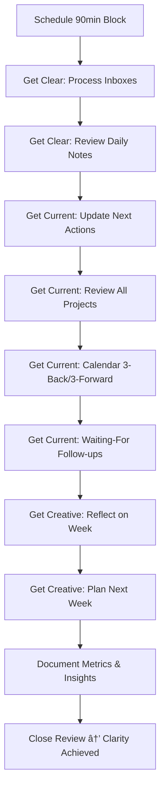
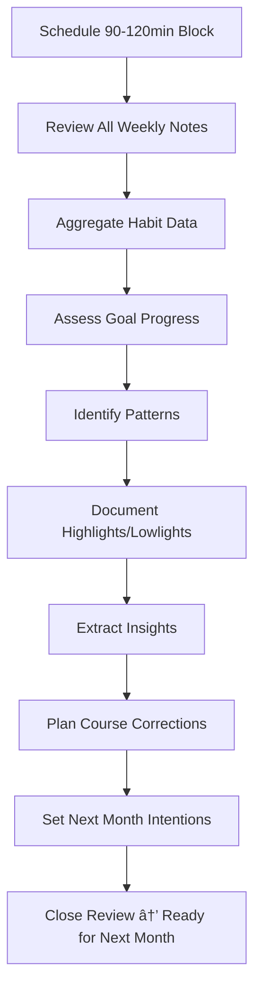

---
title:
aliases:
  - Personal Review System
  - PKB Review Framework
  - Periodic Review Methodology
  - Reflective Practice in Obsidian
  - Review Automation System
tags:
  - year/2025
  - pkm
  - pkb/architecture
  - obsidian
  - reference-note
  - productivity
  - self-improvement
id: "20251121175854"
created: 2025-11-21T17:58:54
week: "[[2025-W47]]"
month: "[[2025-11]]"
quarter: "[[2025-Q4]]"
year: "[[2025]]"
type: reference
link-up:
  - 
link-related:
  - "[[2025-11-21|Daily-Note]]"
  - "[[permeant-note_moc]]"
---


---

aliases: [Personal Review System, PKB Review Framework, Periodic Review Methodology, Reflective Practice in Obsidian, Review Automation System]
---

> [!comprehensive-reference] 📚Comprehensive-Reference
> - **Generated**:: 2025-11-21
> - **Version**:: 1.0
> - **Type**:: Reference Documentation (Personal Review Systems)
> - **Scope**:: Complete implementation guide for conducting systematic personal reviews in Obsidian using Periodic Notes, Templater, and complementary plugins

> [!abstract]
> **Executive Overview**
> This reference comprehensively documents the theory, practice, and technical implementation of systematic [[Personal Review Systems]] within [[obsidian]], integrating [[Periodic Notes]], [[Templater]], [[dataview]], and [[Calendar Plugin]] to create automated, sustainable [[Reflective Practice]] workflows across daily, weekly, monthly, quarterly, and annual timeframes.

> [!how-to-use-this]
> **Navigation Guide**
> This reference is organized into 12 major sections covering philosophical foundations through advanced technical implementation. Use the table of contents for quick navigation. Start with Sections 1-3 for conceptual grounding, then proceed to Sections 4-7 for plugin setup, Sections 8-11 for review-specific templates, and Section 12 for troubleshooting. Beginners should follow sections sequentially; experienced users can jump to specific review types or advanced automation sections.

---

# 📑 Table of Contents

1. [[#🯠Foundations Why Personal Reviews Matter]]
2. [[#🧠 Review Psychology & Cognitive Science]]
3. [[#ğŸ—ï¸ Plugin Ecosystem Overview]]
4. [[#âš™ï¸ Technical Setup Core Plugin Configuration]]
5. [[#📠Template Architecture & Design Principles]]
6. [[#📅 Daily Review System]]
7. [[#📊 Weekly Review System (GTD-Inspired)]]
8. [[#🌙 Monthly Review System]]
9. [[#📈 Quarterly Review System]]
10. [[#🊠Annual Review System]]
11. [[#🤖 Advanced Automation Workflows]]
12. [[#ğŸ› ï¸ Troubleshooting & Optimization]]

---

## 🯠Foundations: Why Personal Reviews Matter

> [!the-philosophy]
> **The Examined Life Principle**
> 
> Personal reviews transform scattered experiences into systematic learning. Without [[Reflective Practice]], we repeat mistakes, forget insights, and lose track of progress. Reviews create the feedback loops essential for [[Self-Regulated Learning]] and [[Metacognitive Development]].

### The Purpose of Systematic Reviews

Personal review systems address a fundamental challenge in knowledge work: our brains excel at creating and processing information but struggle with comprehensive storage and retrieval. This is the core insight behind both [[GTD (Getting Things Done)]] methodology and [[Building a Second Brain]] philosophy.

> [!key-claim]
> **Central Thesis**: Regular, structured personal reviews serve three irreplaceable functions:
> 
> 1. **Closure & Processing**: Convert open cognitive loops into completed thoughts
> 2. **Pattern Recognition**: Surface insights invisible during day-to-day execution
> 3. **Course Correction**: Enable proactive adjustment before problems compound

### Review Cadences & Their Purposes

Different review frequencies serve distinct cognitive and practical purposes:

| Review Type | Primary Function | Cognitive Focus | Time Investment |
|-------------|------------------|-----------------|-----------------|
| **Daily** | Capture & immediate reflection | [[Working Memory]] management | 5-15 minutes |
| **Weekly** | Processing & planning | [[Executive Function]] optimization | 30-90 minutes |
| **Monthly** | Pattern analysis & goal alignment | [[Metacognition]] & strategic thinking | 45-120 minutes |
| **Quarterly** | Direction assessment | Strategic evaluation & pivoting | 2-4 hours |
| **Annual** | Identity & values alignment | Life trajectory & meaning-making | 4-8 hours |

> [!analogy]
> **The Telescope Metaphor**
> 
> Daily reviews are like looking through a microscope—examining immediate details. Weekly reviews use binoculars—seeing the week's landscape. Monthly reviews are wide-angle lenses—capturing broader patterns. Quarterly reviews are aerial photography—revealing terrain you can't see from ground level. Annual reviews are orbital perspective—seeing the entire geography of your life.

### The Compounding Effect of Reviews

Research on reflective practice shows that consistent self-reflection correlates with higher achievement, better goal attainment, and improved life satisfaction. The benefits compound:

- **Week 1**: Slight improvement in task management
- **Month 1**: Noticeable clarity on priorities
- **Quarter 1**: Significant behavioral changes
- **Year 1**: Transformed decision-making patterns
- **Year 3+**: Systematic [[03-notes/01_permanent-notes/02_personal-knowledge-base/Personal Knowledge Management]] mastery

---

## 🧠 Review Psychology & Cognitive Science

> [!definition]
> - **Reflective Practice**:: [[Reflective Practice]]
> - **Definition**:: The systematic examination of one's experiences, decisions, and outcomes to extract learning and improve future performance. Rooted in [[Metacognition]]—thinking about thinking.

### Cognitive Mechanisms Behind Effective Reviews

The psychological principle of the **peak-end rule** states that our memory of experiences is disproportionately influenced by peak moments and conclusions. This means:

1. **Reflection shapes memory**: How we review experiences literally changes how we remember them
2. **Ending matters most**: Final reflections disproportionately affect overall assessment
3. **Documented reviews persist**: Written reflections override memory biases

> [!thought-experiment]
> **The Lost Year Scenario**
> 
> Imagine two people experience identical years with identical events. Person A never reflects; Person B conducts monthly reviews. At year end:
> 
> - Person A vaguely recalls highlights, feels year "went by fast"
> - Person B has documented 12 months of insights, sees clear progression, identifies patterns
> 
> Same experiences, radically different learning outcomes. The difference: systematic reflection.

### The Processing Pipeline: From Experience to Wisdom

Reviews facilitate a four-stage transformation:


> [!methodology-and-sources]
> **Zimmerman's Self-Regulated Learning Cycle**
> 
> Educational psychologist Barry Zimmerman identified three phases essential for learning:
> 
> 1. **Forethought Phase** (Planning): Set goals, strategize, activate prior knowledge
> 2. **Performance Phase** (Execution): Monitor progress, adjust tactics, maintain focus
> 3. **Self-Reflection Phase** (Review): Evaluate outcomes, attribute causality, adapt
> 
> Personal reviews operationalize Phase 3, which then informs the next cycle's Phase 1.

### Why Reviews Fail: Common Psychological Barriers

Understanding why review systems break down is as important as understanding why they work:

> [!warning]
> **The Seven Deadly Sins of Personal Reviews**
> 
> 1. **Perfection Paralysis**: Waiting for the "perfect system" before starting
> 2. **Overwhelm Accumulation**: Letting unprocessed items pile up until review feels impossible
> 3. **Guilt Spiral**: Using reviews to shame rather than learn
> 4. **Vanity Metrics**: Tracking impressive-sounding but meaningless data
> 5. **Inconsistency**: Reviewing sporadically rather than systematically
> 6. **Surface-Level Processing**: Going through motions without genuine reflection
> 7. **Action Avoidance**: Reflecting without implementing insights

---

## ğŸ—ï¸ Plugin Ecosystem Overview

> [!what-this-does]
> This section maps the complete plugin architecture required for a comprehensive review system in [[obsidian]]. Each plugin serves specific functions that, when integrated, create a seamless review workflow.

### Core Plugin Stack (Essential)

The minimal viable plugin stack for periodic reviews consists of three essential plugins that work synergistically:

#### 1. Periodic Notes Plugin

> [!definition]
> - **Periodic Notes**:: [[Periodic Notes]]
> - **Definition**:: Plugin that extends Obsidian's core daily notes functionality to include weekly, monthly, quarterly, and yearly note creation with customizable templates, folder locations, and file naming conventions.

**Core Capabilities**:
- Automated note creation for multiple time periods
- Independent folder structure for each period type
- Customizable date formats using Moment.js syntax
- Calendar integration for visual navigation
- Navigation commands (next/previous period)
- Template assignment per period type

**Critical Configuration Parameters**:

```yaml
# Periodic Notes Settings Structure
Daily Notes:
  Format: YYYY-MM-DD
  Template: Templates/Daily-Template.md
  Folder: Journal/Daily/

Weekly Notes:
  Format: gggg-[W]WW  # ISO week format
  Template: Templates/Weekly-Template.md
  Folder: Journal/Weekly/

Monthly Notes:
  Format: YYYY-MM
  Template: Templates/Monthly-Template.md
  Folder: Journal/Monthly/

Quarterly Notes:
  Format: YYYY-[Q]Q
  Template: Templates/Quarterly-Template.md
  Folder: Journal/Quarterly/

Yearly Notes:
  Format: YYYY
  Template: Templates/Yearly-Template.md
  Folder: Journal/Yearly/
```

> [!helpful-tip]
> **ISO Week vs. Week of Year**
> 
> Periodic Notes uses "Week of Year" (ww) by default where the first week starts on January 1st. For ISO week dating (where the first week contains the first Thursday), use uppercase WW format. Choose based on your regional conventions and stick with it for consistency.

#### 2. Templater Plugin

> [!definition]
> - **Templater**:: [[Templater]]
> - **Definition**:: Advanced templating plugin that enables dynamic content generation using variables, functions, and JavaScript code within Obsidian notes. Transforms static templates into intelligent, context-aware document generators.

**Core Capabilities**:
- Dynamic date/time insertion with formatting
- User input prompts for interactive templates
- Conditional logic and control flow
- JavaScript execution for complex operations
- File property manipulation
- Automatic file movement and organization
- Dataview query integration within templates

**Essential Templater Commands**:

| Command | Function | Example Usage |
|---------|----------|---------------|
| `<% tp.date.now("FORMAT") %>` | Current date/time | `<% tp.date.now("YYYY-MM-DD") %>` |
| `<% tp.date.yesterday("FORMAT") %>` | Previous day | `<% tp.date.yesterday("YYYY-MM-DD") %>` |
| `<% tp.date.tomorrow("FORMAT") %>` | Next day | `<% tp.date.tomorrow("YYYY-MM-DD") %>` |
| `<% tp.date.weekday("FORMAT", 0) %>` | Specific weekday | `<% tp.date.weekday("YYYY-MM-DD", -7) %>` |
| `<% tp.system.prompt("QUESTION") %>` | User input prompt | `<% tp.system.prompt("What went well?") %>` |
| `<% tp.file.cursor() %>` | Cursor positioning | Place cursor for immediate typing |
| `<% tp.file.move("/path/") %>` | Automated filing | `<% tp.file.move("/Journal/Daily/") %>` |

> [!example]
> **Dynamic Weekly Navigation Bar**
> 
> A sophisticated Templater snippet can create navigation links to adjacent periods and related notes automatically:
> 
> ```markdown
> ↠[[<% tp.date.now("gggg-[W]WW", -7) %>|Last Week]] | [[<% tp.date.now("gggg-[W]WW", 7) %>|Next Week]] →
> 
> 📅 [[<% tp.date.now("YYYY-MM") %>|This Month]] | [[<% tp.date.now("YYYY-[Q]Q") %>|This Quarter]] | [[<% tp.date.now("YYYY") %>|This Year]]
> ```
> 
> This auto-generates contextual navigation without manual date calculation.

#### 3. Dataview Plugin

> [!definition]
> - **Dataview**:: [[dataview]]
> - **Definition**:: Query language plugin that treats your vault as a database, enabling dynamic aggregation, filtering, and display of note data based on frontmatter, inline fields, tags, and content. Supports both declarative queries (DQL) and JavaScript (DataviewJS) for advanced operations.

**Core Capabilities for Reviews**:
- Aggregating tasks across multiple notes
- Querying notes by date ranges, tags, or metadata
- Calculating statistics (habit tracking, time spent)
- Generating dynamic progress dashboards
- Creating auto-updating indexes
- Pulling metadata from daily notes into weekly/monthly summaries

**Essential Dataview Query Patterns**:

> [!methodology-and-sources]
> **Review-Optimized Dataview Queries**
> 
> **Query 1: Unprocessed Daily Notes (Weekly Review)**
> ```dataview
> TABLE file.ctime as "Created"
> FROM "Journal/Daily"
> WHERE file.ctime >= date(now) - dur(7 days)
>   AND file.ctime < date(now)
> SORT file.ctime DESC
> ```
> 
> **Query 2: Habit Tracking Aggregation (Monthly Review)**
> ```dataviewjs
> const pages = dv.pages('"Journal/Daily"')
>   .where(p => p.file.ctime >= dv.date('2025-11-01') 
>     && p.file.ctime < dv.date('2025-12-01'));
> 
> dv.table(["Date", "Exercise", "Reading", "Meditation"],
>   pages.map(p => [
>     p.file.name,
>     p.exercise || "âŒ",
>     p.reading || "âŒ",
>     p.meditation || "âŒ"
>   ])
> );
> ```
> 
> **Query 3: Incomplete Tasks Across Vault (Weekly Processing)**
> ```dataview
> TASK
> FROM "Projects" OR "Journal"
> WHERE !completed
>   AND (due < date(now) OR !due)
> GROUP BY file.link
> ```

### Complementary Plugins (Recommended)

#### Calendar Plugin

> [!what-this-does]
> Provides visual calendar interface for navigating periodic notes. Integrates seamlessly with Periodic Notes, allowing note creation by clicking dates or week numbers.

**Key Features**:
- Monthly calendar grid view
- Week number display (for weekly note access)
- Visual indicators for existing notes
- Customizable week start day
- Quick navigation between periods

**Configuration Alignment**:
- Ensure Calendar's "Weekly Notes" setting matches Periodic Notes configuration
- Settings automatically migrate from Calendar plugin to Periodic Notes
- Customize dot indicators for daily note status

#### Tasks Plugin

> [!definition]
> - **Tasks Plugin**:: [[Tasks Plugin]]
> - **Definition**:: Advanced task management system with support for due dates, scheduled dates, recurring tasks, priorities, and powerful query syntax for task aggregation and filtering.

**Why Essential for Reviews**:
- Enables task sequencing within projects
- Supports recurring tasks critical for review checklists
- Provides rich query language for dashboard creation
- Handles task migration between periodic notes
- Supports GTD contexts and waiting-for tracking

**Task Format for Reviews**:

```markdown
- [ ] Process inbox 📥 due::2025-11-22 recurs::weekly
- [ ] Review weekly goals â° due::2025-11-22 priority::high
- [ ] Check waiting-for list 👥 due::2025-11-22 recurs::weekly
```

#### QuickAdd Plugin

> [!what-this-does]
> Macro automation plugin for rapid note creation and content capture. Particularly valuable for friction-free idea capture during reviews.

**Review-Specific Use Cases**:
- Rapid inbox item capture with pre-formatting
- Quick insight logging during review sessions
- Automated metadata addition
- Template selection shortcuts
- Hotkey-driven review workflows

#### Tracker Plugin

> [!definition]
> - **Tracker Plugin**:: [[Tracker Plugin]]
> - **Definition**:: Visualization plugin that renders charts and graphs from inline field data across multiple notes, enabling visual habit tracking and metric analysis.

**Application in Reviews**:
- Visualize habit consistency over time
- Display mood tracking trends
- Show productivity metrics
- Render progress toward goals
- Create motivational dashboards

> [!example]
> **Habit Tracker in Weekly Review**
> 
> Emoji-based habit tracking with visual charts:
> 
> ```markdown
> ## 📊 Habit Tracking
> 
> | Day | Exercise | Reading | Meditation |
> |-----|----------|---------|------------|
> | Mon | ✅ | ✅ | ⌠|
> | Tue | ✅ | ⌠| ✅ |
> | Wed | ⌠| ✅ | ✅ |
> | Thu | ✅ | ✅ | ✅ |
> | Fri | ✅ | ✅ | ⌠|
> | Sat | ✅ | ✅ | ✅ |
> | Sun | ⌠| ✅ | ✅ |
> 
> Tracker
> searchType: tag
> searchTarget: habit-tracker
> folder: Journal/Daily
> ```

#### DB Folder Plugin

> [!definition]
> - **DB Folder**:: [[DB Folder]]
> - **Definition**:: Creates Notion-like database views from folders, enabling spreadsheet-style editing of note metadata and inline fields.

**Review Workflow Enhancement**:
- Bulk-edit daily note fields
- Quickly update habit tracking data
- Batch process weekly items
- Spreadsheet view of monthly metrics
- Simplified data entry for reviews

---

## âš™ï¸ Technical Setup: Core Plugin Configuration

> [!methodology-and-sources]
> **Setup Philosophy**
> 
> Configure plugins following the **Progressive Disclosure Principle**: Start with minimal, functional setup, then incrementally add sophistication as you understand your actual review needs. Avoid over-engineering before you've established review habits.

### Phase 1: Folder Structure Creation

Before configuring plugins, establish a logical folder hierarchy that supports automated file organization:

> [!the-goal]
> **Folder Architecture Goals**
> 
> 1. **Clarity**: Obvious where each note type belongs
> 2. **Automation-Friendly**: Easy for Templater to auto-file notes
> 3. **Scalability**: Accommodates years of notes without reorganization
> 4. **Queryability**: Dataview can easily target specific periods

#### Recommended Folder Structure

```
Your-Vault/
│
├── 📠Templates/
│   ├── Daily-Template.md
│   ├── Weekly-Template.md
│   ├── Monthly-Template.md
│   ├── Quarterly-Template.md
│   └── Yearly-Template.md
│
├── 📠Journal/
│   ├── 📠Daily/
│   │   ├── 📠2025/
│   │   │   ├── 📠01-January/
│   │   │   │   ├── 2025-01-01.md
│   │   │   │   ├── 2025-01-02.md
│   │   │   │   └── …
│   │   │   ├── 📠02-February/
│   │   │   └── …
│   │   └── 📠2024/ [Archive]
│   │
│   ├── 📠Weekly/
│   │   ├── 📠2025/
│   │   │   ├── 2025-W01.md
│   │   │   ├── 2025-W02.md
│   │   │   └── …
│   │   └── 📠2024/ [Archive]
│   │
│   ├── 📠Monthly/
│   │   ├── 2025-01.md
│   │   ├── 2025-02.md
│   │   └── …
│   │
│   ├── 📠Quarterly/
│   │   ├── 2025-Q1.md
│   │   ├── 2025-Q2.md
│   │   └── …
│   │
│   └── 📠Yearly/
│       ├── 2025.md
│       ├── 2024.md
│       └── …
│
└── 📠Projects/ [Separate from reviews]
```

> [!helpful-tip]
> **Year-Based Sub-Folders for Daily/Weekly Notes**
> 
> Daily and weekly notes accumulate rapidly (365+ and 52+ per year respectively). Organizing them into year-based subdirectories prevents folder bloat while maintaining chronological clarity. Monthly/quarterly/yearly notes can remain in single folders since they accumulate slowly.

### Phase 2: Periodic Notes Configuration

#### Step-by-Step Plugin Settings

Navigate to Settings → Community Plugins → Periodic Notes:

**Daily Notes Configuration**:

```yaml
Enabled: ✅ ON
Format: YYYY-MM-DD
Template: Templates/Daily-Template.md
Folder: 01-journal/01-daily/<% tp.date.now("YYYY") %>/<% tp.date.now("MM-MMMM") %>
```

> [!attention]
> **Dynamic Folder Paths with Templater**
> 
> You can embed Templater syntax directly in the folder path to create dynamic, date-based folder hierarchies. The `<% tp.date.now("YYYY") %>` command auto-creates year folders as needed.

**Weekly Notes Configuration**:

```yaml
Enabled: ✅ ON
Format: gggg-[W]WW  # ISO week: 2025-W01
Template: Templates/Weekly-Template.md
Folder: 01-journal/02-weekly/<% tp.date.now("YYYY") %>
```

> [!key-claim]
> **Week Format Decision is Critical**
> 
> Choose between:
> - `gggg-[W]WW` = ISO Week (week 1 contains first Thursday)
> - `YYYY-[W]ww` = Week of Year (week 1 starts Jan 1)
> 
> This decision affects all date calculations and should align with your regional/organizational conventions. **Document your choice** and never change it mid-vault.

**Monthly Notes Configuration**:

```yaml
Enabled: ✅ ON
Format: YYYY-MM
Template: Templates/Monthly-Template.md
Folder: 01-journal/03-monthly
```

**Quarterly Notes Configuration**:

```yaml
Enabled: ✅ ON
Format: YYYY-[Q]Q
Template: Templates/Quarterly-Template.md
Folder: 01-journal/04-quarterly
```

**Yearly Notes Configuration**:

```yaml
Enabled: ✅ ON
Format: YYYY
Template: Templates/Yearly-Template.md
Folder: 01-journal/05-yearly
```

### Phase 3: Templater Configuration

Navigate to Settings → Community Plugins → Templater:

**Critical Settings**:

```yaml
Template folder location: Templates
Trigger Templater on new file creation: ✅ ON
Enable System Commands: ✅ ON
```

> [!warning]
> **"Trigger on New File" Must Be Enabled**
> 
> This setting is essential for automatic template application. When Periodic Notes creates a new note, Templater immediately executes any embedded commands, enabling dynamic content generation and automatic file organization.

**Advanced Configuration**:

```yaml
Enable Folder Templates: ✅ ON
Folder Templates:
  - Add new Folder Template:
    - Folder: /Journal
    - Template: Templates/filename_template.md
```

> [!what-this-does]
> **Filename Template Magic**
> 
> The `filename_template.md` acts as a routing system. It uses Templater logic to detect the note's filename pattern (e.g., "2025-11-22" vs "2025-W47" vs "2025-11"), then applies the appropriate periodic template and moves the file to the correct subfolder.

**Example Filename Template**:

```markdown
<%*
const filename = tp.file.title;
// Daily Note Pattern: YYYY-MM-DD
if (/^\d{4}-\d{2}-\d{2}$/.test(filename)) {
  await tp.file.include("[[Daily-Template]]");
  const year = filename.substring(0, 4);
  const month = filename.substring(5, 7);
  const monthName = moment(filename).format("MM-MMMM");
  await tp.file.move(`Journal/Daily/${year}/${monthName}/${filename}`);
}
// Weekly Note Pattern: YYYY-WXX
else if (/^\d{4}-W\d{2}$/.test(filename)) {
  await tp.file.include("[[Weekly-Template]]");
  const year = filename.substring(0, 4);
  await tp.file.move(`Journal/Weekly/${year}/${filename}`);
}
// Monthly Note Pattern: YYYY-MM
else if (/^\d{4}-\d{2}$/.test(filename)) {
  await tp.file.include("[[Monthly-Template]]");
  await tp.file.move(`Journal/Monthly/${filename}`);
}
// Quarterly Note Pattern: YYYY-QX
else if (/^\d{4}-Q\d$/.test(filename)) {
  await tp.file.include("[[Quarterly-Template]]");
  await tp.file.move(`Journal/Quarterly/${filename}`);
}
// Yearly Note Pattern: YYYY
else if (/^\d{4}$/.test(filename)) {
  await tp.file.include("[[Yearly-Template]]");
  await tp.file.move(`Journal/Yearly/${filename}`);
}
%>
```

> [!helpful-tip]
> **Regex Pattern Matching for Auto-Routing**
> 
> This template uses regular expressions (regex) to identify note types by filename pattern, then applies the correct template and moves to the appropriate folder. **Test thoroughly** with sample notes before deploying vault-wide.

### Phase 4: Calendar Plugin Setup

Navigate to Settings → Community Plugins → Calendar:

**Essential Settings**:

```yaml
Start week on: Monday [or your preference]
Show week number: ✅ ON
Words per dot: 250 [adjust based on daily note length]
Dot threshold: 0 [show dot for any note]
```

**Integration Verification**:

- Click a date → should create daily note using Periodic Notes settings
- Click a week number → should create weekly note
- Verify notes appear in correct folders with correct names

---

## 📠Template Architecture & Design Principles

> [!the-philosophy]
> **The Living Template Principle**
> 
> Templates are not static forms—they're dynamic systems that evolve with your review practice. Start minimal, observe friction points, incrementally add sophistication. Your templates should feel like helpful structure, not bureaucratic overhead.

### Universal Template Components

Every effective periodic review template shares these foundational elements:

> [!core-principle]
> **The Five-Section Framework**
> 
> Regardless of review frequency, all templates should include:
> 
> 1. **Metadata & Navigation** → Orientation within time
> 2. **Capture/Data Entry** → What happened this period
> 3. **Analysis & Reflection** → What does it mean
> 4. **Forward Planning** → What comes next
> 5. **Connection & Context** → Links to related notes

### Template Design Anti-Patterns

> [!warning]
> **Common Template Mistakes That Kill Review Habits**
> 
> 1. **The Questionnaire Trap**: 30+ reflection questions create analysis paralysis
> 2. **The Data Graveyard**: Collecting metrics you never analyze or act on
> 3. **The Perfection Prison**: Templates so elaborate they take hours to complete
> 4. **The Copy-Paste Syndrome**: Identical questions at every review level
> 5. **The Friction Factory**: Manual steps that could be automated
> 6. **The Vagueness Void**: Prompts too abstract to generate actionable insights
> 7. **The Missing Links**: No connection between review levels (daily → weekly → monthly)

### Metadata Strategy for Reviews

Consistent, structured metadata enables powerful Dataview queries and cross-note analysis:

> [!methodology-and-sources]
> **Standardized Frontmatter Taxonomy**
> 
> ```yaml
> ---
> type: daily-note | weekly-review | monthly-review | quarterly-review | annual-review
> date: YYYY-MM-DD
> week: YYYY-WXX [for weekly/daily]
> month: YYYY-MM [for monthly/daily]
> quarter: YYYY-QX [for quarterly/monthly/daily]
> year: YYYY
> status: draft | complete | archived
> energy_level: 1-10 [subjective scale]
> mood: emoji or text descriptor
> focus_area: tag or topic
> tags: [#review, #reflection, #productivity, specific themes]
> ---
> ```
> 
> **Why This Structure**:
> - `type` enables filtering by review category
> - Temporal metadata allows hierarchical aggregation
> - `status` tracks review completion
> - Subjective metrics (`energy_level`, `mood`) reveal patterns over time
> - `focus_area` enables thematic analysis across periods

### Progressive Disclosure in Template Design

Templates should reveal complexity gradually:

> [!example]
> **Three-Tier Template Architecture**
> 
> **Tier 1: Minimal Viable Template** (Core structure only)
> - Encourages immediate use without intimidation
> - Sufficient for establishing habit
> - Example: Daily template with just date, tasks, brief reflection
> 
> **Tier 2: Enhanced Template** (After 30 days of Tier 1)
> - Adds habit tracking, energy logging, win documentation
> - Dataview queries for pattern visibility
> - Example: Weekly template aggregating daily data
> 
> **Tier 3: Advanced Template** (After 90 days of consistent use)
> - Sophisticated automation, visual dashboards, predictive insights
> - Custom JavaScript for complex analysis
> - Example: Monthly template with habit trend charts, goal progress bars

---

## 📅 Daily Review System

> [!definition]
> - **Daily Review**:: [[Daily Review]]
> - **Definition**:: Brief end-of-day reflection (5-15 minutes) focused on capturing the day's events, processing immediate insights, and preparing for the next day. Primary function is [[Working Memory]] management and maintaining [[Open Loop]] hygiene.

### Purpose & Cognitive Function

Daily reviews transform transient working memory into persistent external memory, freeing cognitive resources for creative work rather than remembering.

**Three Core Objectives**:

1. **Capture**: Document events before memory decay
2. **Close Loops**: Convert lingering thoughts into next actions
3. **Set Stage**: Prime tomorrow's focus

> [!helpful-tip]
> **Daily Reviews Are NOT Full Reflections**
> 
> Resist the urge to do deep analysis daily. Daily reviews are rapid capture and light processing. Save heavy synthesis for weekly+ reviews. Think "record" not "analyze."

### Daily Template: Minimal Viable Version

```markdown
---
type: daily-note
date: <% tp.date.now("YYYY-MM-DD") %>
week: <% tp.date.now("gggg-[W]WW") %>
month: <% tp.date.now("YYYY-MM") %>
quarter: <% tp.date.now("YYYY-[Q]Q") %>
year: <% tp.date.now("YYYY") %>
tags: [#daily, #journal]
---

# <% tp.date.now("dddd, MMMM DD, YYYY") %>

↠[[<% tp.date.yesterday("YYYY-MM-DD") %>|Yesterday]] | [[<% tp.date.tomorrow("YYYY-MM-DD") %>|Tomorrow]] →
📅 [[<% tp.date.now("gggg-[W]WW") %>|This Week]] | [[<% tp.date.now("YYYY-MM") %>|This Month]]

---

## ✅ Tasks
<% tp.file.cursor(1) %>

## 📠Notes & Captures

### 💡 Key Insights


### 📚 Learning Moments


---

## 🌟 Daily Win
*One thing I'm proud of today:*


## 🯠Tomorrow's Focus
*Top priority for tomorrow:*


---

## 📊 Quick Metrics
- Energy:: 
- Mood:: 
- Exercise:: 
- Reading:: 
```

> [!what-this-does]
> **Component Breakdown**
> 
> - **Navigation Links**: Auto-generate links to adjacent days and parent periods
> - **Tasks Section**: Integrates with Tasks plugin for query aggregation
> - **Captures**: Low-friction input for ideas, learnings, observations
> - **Daily Win**: Anchors memory with peak-end rule—always end on positive note
> - **Tomorrow's Focus**: Activates forethought phase of SRL cycle
> - **Metrics**: Inline fields for Dataview analysis in weekly/monthly reviews

### Daily Template: Enhanced Version (Add After 30 Days)

`````markdown
---
type: daily-note
date: <% tp.date.now("YYYY-MM-DD") %>
week: <% tp.date.now("gggg-[W]WW") %>
month: <% tp.date.now("YYYY-MM") %>
tags: [#daily, #journal]
energy: 
mood: 
---

# <% tp.date.now("dddd, MMMM DD, YYYY") %>

↠[[<% tp.date.yesterday("YYYY-MM-DD") %>|Yesterday]] | [[<% tp.date.tomorrow("YYYY-MM-DD") %>|Tomorrow]] →
📅 [[<% tp.date.now("gggg-[W]WW") %>|This Week]] | [[<% tp.date.now("YYYY-MM") %>|This Month]] | [[<% tp.date.now("YYYY") %>|This Year]]

---

## 📋 Today's Tasks

### ✅ Completed
```tasks
done on <% tp.date.now("YYYY-MM-DD") %>
```

### â° Pending
```tasks
not done
due on <% tp.date.now("YYYY-MM-DD") %>
```

---

## 📠Journal

### 🌅 Morning Intention
*What's the one thing that would make today great?*
<% tp.file.cursor(1) %>

### 🌙 Evening Reflection
*What happened today?*


---

## 🯠Habit Tracking

| Habit | Status | Notes |
|-------|--------|-------|
| 🃠Exercise | | |
| 📖 Reading | | |
| 🧘 Meditation | | |
| 💧 Hydration | | |
| 😴 Sleep (hours) | | |

---

## 💡 Learning & Insights

### 📚 Captured Knowledge


### 🔗 Interesting Links
- 

---

## 🌟 Gratitude & Wins

### Today's Win


### Grateful For


---

## 🯠Tomorrow's Setup

**Top 3 Priorities**:
1. 
2. 
3. 

**Potential Obstacles**:


**Energy Forecast**: 1-10 → 

---

## 📊 Metadata
- Energy:: 
- Mood:: 
- Focus Area:: 
- Social Battery:: 1-10 → 
- Creativity:: 1-10 → 
```

> [!insight]
> **Habit Tracking Design**
> 
> Use emoji checkboxes (✅/âŒ) or simple symbols for rapid entry. The table format enables easy Dataview aggregation into weekly charts. Resist tracking more than 5-7 habits—focus beats exhaustiveness.

### Daily Review Process & Timing

> [!methodology-and-sources]
> **Optimal Daily Review Cadence**
> 
> **Evening Review (Preferred)**: 5-15 minutes before end of workday or before bed
> - Captures fresh memories
> - Creates closure for the day
> - Primes tomorrow's focus
> - Leverages peak-end rule—ending day with reflection improves next-day mood
> 
> **Morning Review (Alternative)**: First 10 minutes of day
> - Reviews yesterday's notes
> - Sets today's intention
> - Works better for night owls who lack evening energy

**Process Flow**:

```mermaid
graph TD
    A[Open Today's Daily Note] --> B[Log Completed Tasks]
    B --> C[Brain Dump: Ideas/Learnings]
    C --> D[Document One Win]
    D --> E[Set Tomorrow's Focus]
    E --> F[Quick Metrics Entry]
    F --> G[Close Note, Day Complete]
`````

---

## 📊 Weekly Review System (GTD-Inspired)

> [!definition]
> - **Weekly Review**:: [[Weekly Review]]
> - **Definition**:: Comprehensive 30-90 minute review process originating from David Allen's GTD methodology. Purpose is to achieve "clarity and control" by processing all inputs, reviewing all projects, and ensuring every commitment has a next action.

### Purpose & Cognitive Function

The weekly review is the backbone of GTD. It transforms scattered commitments into organized action lists, and ensures nothing falls through cracks.

> [!key-claim]
> **Weekly Review is Your System's Heartbeat**
> 
> Skip weekly reviews, and your PKB degrades into chaos within 2-3 weeks. Daily reviews capture; weekly reviews process and organize. This is non-negotiable maintenance for trusted system status.

**Five Core Objectives**:

1. **Clear Collect Points**: Process inbox to zero
2. **Review Project List**: Ensure every active project has next action
3. **Update Context Lists**: Refresh @contexts (computer, errands, calls, agenda)
4. **Review Calendar**: Reflect on past week, preview upcoming 2-3 weeks
5. **Reflect & Plan**: Identify wins, lessons, focus areas for next week

### Weekly Template: GTD Standard Version

Multiple GTD practitioners converge on similar weekly review structures, refined through years of practice:

`````markdown
---
type: weekly-review
date: <% tp.date.now("YYYY-MM-DD") %>
week: <% tp.date.now("gggg-[W]WW") %>
month: <% tp.date.now("YYYY-MM") %>
quarter: <% tp.date.now("YYYY-[Q]Q") %>
year: <% tp.date.now("YYYY") %>
status: draft
tags: [#weekly-review, #gtd, #planning]
---

# Week <% tp.date.now("WW") %>: <% tp.date.now("MMMM DD") %> - <% tp.date.now("MMMM DD", 6, tp.file.title, "gggg-[W]WW") %>

↠[[<% tp.date.now("gggg-[W]WW", -7) %>|Last Week]] | [[<% tp.date.now("gggg-[W]WW", 7) %>|Next Week]] →
📅 [[<% tp.date.now("YYYY-MM") %>|This Month]] | [[<% tp.date.now("YYYY-[Q]Q") %>|This Quarter]]

---

### Review Last Week's Daily Notes

```dataview
TABLE WITHOUT ID
  link(file.name) as "Day",
  energy as "Energy",
  mood as "Mood"
FROM "01-journal/01-daily"
WHERE week = "<% tp.date.now("gggg-[W]WW") %>"
SORT file.name ASC
```

**Quick Scan**: Any unprocessed items in daily notes?

---

## 📋 GET CURRENT (20 min)

### Review Next Actions

> [!methodology-and-sources]
> Check all context lists. Mark completed. Delete irrelevant. Upgrade priorities as needed.

```tasks
not done
path includes Projects
group by filename
limit 4
```

**Actions**:
- [ ] Mark completed tasks as done
- [ ] Delete no-longer-relevant tasks
- [ ] Upgrade 3-5 tasks to **This Week** priority
- [ ] Downgrade stale tasks or move to Someday/Maybe

---

### Review Projects

> [!key-claim]
> Every active project MUST have at least one next action. Projects without next actions are "stuck" and need attention NOW.

```dataview
TABLE WITHOUT ID
  link(file.name) as "Project",
  status as "Status",
FROM "02-projects"
SORT priority DESC
```

**For Each Project**:
- [ ] Does it have a next action? If not, add one NOW
- [ ] Is the outcome still clear and relevant?
- [ ] Any waiting-for items to follow up?
- [ ] Update status if needed (active/paused/complete)

---

### Review Calendar

> [!methodology-and-sources]
> Calendar review serves three functions: reflect on past commitments (did I miss anything?), prep for upcoming week (what needs advance prep?), and scan 2-3 weeks ahead for future obligations.

**Past Week** (3 weeks back):
- Any follow-ups triggered by past meetings?
- Commitments I made that need next actions?

**Upcoming Week**:
- What events require preparation?
- Any scheduling conflicts to resolve?

**Future Horizon** (3 weeks ahead):
- Major deadlines approaching?
- Travel or special events requiring early action?

---

### Review Waiting-For List

```tasks
tags include #waiting-for
not done
group by filename
```

**Actions**:
- [ ] Follow up on items over 1 week old
- [ ] Document any received items as complete
- [ ] Add reminder tasks for critical waits

---

### Review Someday/Maybe

**Quick Scan**:
- Anything ready to move to active projects?
- Anything to delete (no longer interesting)?
- New ideas to add?

**Promoted to Active**:


---

## 🯠GET CREATIVE (15 min)

### Week in Review

**🌟 Wins This Week**
1. 
2. 
3. 

**📚 Key Learnings**


**🔄 What I'd Do Differently**


**💡 Insights That Surfaced**


---

### Looking Ahead: Next Week

**Theme/Focus**: 

**Top 3 Outcomes**:
1. 
2. 
3. 

**Potential Obstacles**:


**Who I Need to Connect With**:
- 

**Energy Forecast**: 
*How do I anticipate feeling next week? What self-care is needed?*


---

## 📊 Weekly Metrics

```dataviewjs
// Habit tracking visualization
const days = dv.pages('"Journal/Daily"')
  .where(p => p.week == "<% tp.date.now("gggg-[W]WW") %>");

dv.table(["Day", "Energy", "Exercise", "Reading", "Meditation"],
  days.map(d => [
    d.file.name,
    d.energy || "—",
    d.exercise || "âŒ",
    d.reading || "âŒ",
    d.meditation || "âŒ"
  ])
);
```

**Observations**:
*Any patterns in energy, habits, or productivity this week?*


---

## ✅ Review Complete

Date Completed:: <% tp.date.now("YYYY-MM-DD HH:mm") %>
Duration:: 
Clarity Level:: 1-10 → 
`````

> [!helpful-tip]
> **Weekly Review Duration Calibration**
> 
> A thorough weekly review typically takes 1-2 hours, especially initially. As your system matures and you maintain daily reviews, this can compress to 30-60 minutes. Don't rush—quality trumps speed.

### Weekly Review Process Flow



> [!warning]
> **The Weekly Review Non-Negotiables**
> 
> If you only do three things in weekly review, make them these:
> 
> 1. **Inbox to Zero**: All collect points processed
> 2. **Every Project Has Next Action**: No "stuck" projects
> 3. **Calendar Reviewed**: No surprises upcoming
> 
> Everything else is enhancement. These three are essential for system trust.

---

## 🌙 Monthly Review System

> [!definition]
> - **Monthly Review**:: [[Monthly Review]]
> - **Definition**:: Mid-depth review (45-120 minutes) focused on pattern recognition across weekly data, goal progress assessment, and strategic course correction. Bridges tactical weekly execution with strategic quarterly planning.

### Purpose & Cognitive Function

Monthly reviews shift from operational (What did I do?) to analytical (What does it mean?) perspective. They surface patterns invisible at weekly granularity.

**Four Core Objectives**:

1. **Pattern Detection**: Identify recurring themes, energy cycles, productivity patterns
2. **Goal Calibration**: Assess progress toward quarterly/annual goals
3. **Habit Analysis**: Evaluate consistency and effectiveness of tracked behaviors
4. **Strategic Adjustment**: Course-correct before small deviations become large problems

> [!analogy]
> **The Flight Analogy**
> 
> If daily reviews are checking instruments during flight, and weekly reviews are minor heading corrections, monthly reviews are landing at an airport, checking the map, and confirming you're still heading to the right destination.

### Monthly Template: Comprehensive Version

`````markdown
---
type: monthly-review
date: <% tp.date.now("YYYY-MM-DD") %>
month: <% tp.date.now("YYYY-MM") %>
quarter: <% tp.date.now("YYYY-[Q]Q") %>
year: <% tp.date.now("YYYY") %>
status: draft
tags: [#monthly-review, #reflection, #planning]
---

# <% tp.date.now("MMMM YYYY") %> Review

↠[[<% tp.date.now("YYYY-MM", -1, tp.file.title, "YYYY-MM") %>|Last Month]] | [[<% tp.date.now("YYYY-MM", 1, tp.file.title, "YYYY-MM") %>|Next Month]] →
📅 [[<% tp.date.now("YYYY-[Q]Q") %>|This Quarter]] | [[<% tp.date.now("YYYY") %>|This Year]]

---

## 📊 MONTH AT A GLANCE

### Weekly Reviews Completed

```dataview
TABLE WITHOUT ID
  link(file.name) as "Week",
  status as "Status"
FROM "Journal/Weekly"
WHERE month = "<% tp.date.now("YYYY-MM") %>"
SORT file.name ASC
```

### Daily Note Activity

```dataviewjs
const month = "<% tp.date.now("YYYY-MM") %>";
const days = dv.pages('"Journal/Daily"')
  .where(p => p.month == month);

dv.paragraph(`**Total Days Logged**: ${days.length}/30`);
dv.paragraph(`**Average Energy**: ${(days.array().map(d => d.energy).filter(e => e).reduce((a,b) => a+b, 0) / days.length).toFixed(1)}/10`);
```

---

## 🯠GOAL PROGRESS REVIEW

> [!key-claim]
> Monthly reviews are where you compare intentions against reality. Where goals aren't progressing, either the goal needs revision or your actions need recalibration.

### Quarterly Goals (from [[<% tp.date.now("YYYY-[Q]Q") %>]])

**Goal 1**: 
- **Status**: On Track / Behind / Ahead
- **Progress**: X%
- **Key Actions This Month**:
- **Adjustments Needed**:

**Goal 2**: 
- **Status**: 
- **Progress**: 
- **Key Actions This Month**:
- **Adjustments Needed**:

**Goal 3**: 
- **Status**: 
- **Progress**: 
- **Key Actions This Month**:
- **Adjustments Needed**:

---

## 📈 PATTERN ANALYSIS

> [!methodology-and-sources]
> Pattern analysis surfaces insights only visible across 4+ weeks of data. Look for correlations between variables (e.g., low energy days correlating with skipped exercise).

### Habit Consistency

```dataviewjs
// Aggregate habit completion rates
const month = "<% tp.date.now("YYYY-MM") %>";
const days = dv.pages('"Journal/Daily"')
  .where(p => p.month == month);

const habits = ["exercise", "reading", "meditation"];
const results = habits.map(habit => {
  const completed = days.where(d => d[habit] === "✅").length;
  const rate = ((completed / days.length) * 100).toFixed(0);
  return [habit, completed, days.length, rate + "%"];
});

dv.table(["Habit", "Completed", "Total Days", "Success Rate"], results);
```

**Analysis**:
*Which habits were most consistent? Least? Why?*
<% tp.file.cursor(1) %>

---

### Energy & Productivity Patterns

**High Energy Days**:
*What characterized days where energy was 7+?*


**Low Energy Days**:
*What patterns emerged on days with energy <5?*


**Most Productive Times**:
*When did I do my best work this month?*


---

### Social & Relational Patterns

Who did I interact with most frequently? Were these energizing or draining relationships?


---

## 🌟 HIGHLIGHTS & LOWLIGHTS

> [!the-philosophy]
> Documenting both peaks and valleys creates balanced perspective and enables learning from both successes and challenges.

### Wins & Accomplishments

**Professional**:
1. 
2. 
3. 

**Personal**:
1. 
2. 
3. 

**Unexpected Positives**:


---

### Challenges & Disappointments

**What Didn't Go Well**:
1. 
2. 
3. 

**Lessons Learned**:


**Growth Opportunities Identified**:


---

## 💡 INSIGHTS & REVELATIONS

### Key Learnings This Month


### Shifts in Thinking


### Questions I'm Sitting With


---

## 🔄 COURSE CORRECTIONS

### What to Start Doing


### What to Stop Doing


### What to Continue Doing


### What to Do Differently


---

## 📅 NEXT MONTH PLANNING

### Theme/Intention for <% tp.date.now("MMMM", 1, tp.file.title, "YYYY-MM") %>


### Top 3 Outcomes

1. 
2. 
3. 

### Projects to Advance


### Habits to Emphasize


### People to Connect With


### Self-Care Priorities


---

## 📚 CONTENT CONSUMED

### Books


### Articles/Essays


### Courses/Learning


---

## 🙠GRATITUDE

**Three Things I'm Grateful For**:
1. 
2. 
3. 

---

## 📊 COMPREHENSIVE METRICS

### Time Allocation (Estimate %)
- Work:: 
- Learning:: 
- Health/Fitness:: 
- Relationships:: 
- Leisure:: 
- Admin/Chores:: 

### Subjective Assessments (1-10)
- Overall Month Satisfaction:: 
- Progress Toward Goals:: 
- Work-Life Balance:: 
- Mental Health:: 
- Physical Health:: 
- Relationship Quality:: 

---

## ✅ Review Complete

Completed:: <% tp.date.now("YYYY-MM-DD HH:mm") %>
Duration:: 
Insights Captured:: 
Clarity Gained:: 1-10 → 
`````

### Monthly Review Process & Best Practices

> [!helpful-tip]
> **Optimal Monthly Review Timing**
> 
> Conduct monthly reviews in the first 3-5 days of the new month when memories of the previous month are fresh but you have distance for perspective. Avoid waiting until mid-month when data feels stale.

**Process Flow**:



> [!warning]
> **The Monthly Review Trap: Over-Optimization**
> 
> Monthly reviews can devolve into obsessive metric analysis without actionable outcomes. Remember: the goal is insight → adjustment → action, not exhaustive data collection.

---

## 📈 Quarterly Review System

> [!definition]
> - **Quarterly Review**:: [[Quarterly Review]]
> - **Definition**:: Strategic review (2-4 hours) focused on evaluating 3-month performance against goals, identifying major trends, and recalibrating direction for the next quarter. Functions as a "mini-annual review" with action-oriented focus.

### Purpose & Cognitive Function

Quarterly reviews operate at the strategic level, bridging monthly pattern analysis with annual identity reflection.

**Three Core Objectives**:

1. **Trajectory Assessment**: Are you moving toward your annual goals?
2. **Strategic Pivoting**: What major course corrections are needed?
3. **Capacity Calibration**: Is your quarterly goal volume sustainable?

> [!key-claim]
> **Quarters Enable Realistic Goal Cycles**
> 
> Quarterly planning aligns with human attention cycles better than annual planning. 90 days is long enough for meaningful progress, short enough to maintain focus.

### Quarterly Template: Strategic Version

`````markdown
---
type: quarterly-review
date: <% tp.date.now("YYYY-MM-DD") %>
quarter: <% tp.date.now("YYYY-[Q]Q") %>
year: <% tp.date.now("YYYY") %>
status: draft
tags: [#quarterly-review, #strategy, #okr]
---

# Q<% tp.date.now("Q YYYY") %> Review

↠[[<% tp.date.now("YYYY-[Q]Q", -3, tp.file.title, "YYYY-[Q]Q") %>|Last Quarter]] | [[<% tp.date.now("YYYY-[Q]Q", 3, tp.file.title, "YYYY-[Q]Q") %>|Next Quarter]] →
📅 [[<% tp.date.now("YYYY") %>|This Year]]

---

## 📊 QUARTER OVERVIEW

### Monthly Reviews Completed

```dataview
TABLE WITHOUT ID
  link(file.name) as "Month",
  status as "Status"
FROM "Journal/Monthly"
WHERE quarter = "<% tp.date.now("YYYY-[Q]Q") %>"
SORT file.name ASC
```

### Goals Achieved

**Major Outcomes This Quarter**:
1. 
2. 
3. 

---

## 🯠OKR EVALUATION

> [!definition]
> - **OKR (Objectives & Key Results)**:: [[OKR Framework]]
> - **Definition**:: Goal-setting framework where Objectives define *what* you want to achieve (qualitative, inspirational) and Key Results define *how* you'll measure success (quantitative, specific).

### Objective 1: [Name]

**Key Result 1**: [Metric]
- Target: 
- Actual: 
- Achievement: X%
- **Analysis**: 

**Key Result 2**: [Metric]
- Target: 
- Actual: 
- Achievement: X%
- **Analysis**: 

**Key Result 3**: [Metric]
- Target: 
- Actual: 
- Achievement: X%
- **Analysis**: 

**Overall Objective Achievement**: X%

---

### Objective 2: [Name]
[Repeat structure]

---

### Objective 3: [Name]
[Repeat structure]

---

## 📈 TREND ANALYSIS

> [!methodology-and-sources]
> Quarterly reviews reveal trends invisible at monthly granularity. Look for persistent patterns across all three months.

### Productivity Trends

**Average Productive Hours/Week**:
- Month 1: 
- Month 2: 
- Month 3: 
- **Trend**: ↑ Increasing / → Stable / ↓ Decreasing

**Analysis**:


---

### Energy & Well-Being Trends

```dataviewjs
// Aggregate quarterly energy levels
const quarter = "<% tp.date.now("YYYY-[Q]Q") %>";
const days = dv.pages('"Journal/Daily"')
  .where(p => p.quarter == quarter && p.energy);

const avgEnergy = days.array()
  .map(d => d.energy)
  .reduce((a,b) => a+b, 0) / days.length;

dv.paragraph(`**Average Energy Level**: ${avgEnergy.toFixed(1)}/10`);

// Month-by-month breakdown
const months = ["01", "02", "03"]; // Adjust based on quarter
// [Additional breakdown logic]
```

**Observations**:
*Did energy increase, decrease, or remain stable? What factors influenced this?*


---

### Learning & Growth

**Skills Developed**:
- 
- 
- 

**Knowledge Domains Expanded**:
- 
- 

**Competencies Improved**:
- 
- 

---

## 🌟 QUARTERLY HIGHLIGHTS

### Professional Achievements


### Personal Growth


### Relationship Milestones


### Creative Outputs


---

## 🔄 QUARTERLY CHALLENGES

### Major Obstacles Faced


### Strategies That Didn't Work


### Persistent Problems


### Lessons Learned


---

## 💡 BIG INSIGHTS

> [!insight]
> Quarterly reviews should surface 2-3 major insights that shift your understanding or approach. If you don't have any, you're not reflecting deeply enough.

### Insight 1:


### Insight 2:


### Insight 3:


---

## 🯠NEXT QUARTER PLANNING

### Q<% tp.date.now("Q", 3, tp.file.title, "YYYY-[Q]Q") %> Theme:


### Objectives & Key Results

**Objective 1**: 
- **KR1**: 
- **KR2**: 
- **KR3**: 

**Objective 2**: 
- **KR1**: 
- **KR2**: 
- **KR3**: 

**Objective 3**: 
- **KR1**: 
- **KR2**: 
- **KR3**: 

---

### Projects to Initiate


### Habits to Build


### Relationships to Invest In


### Learning Goals


---

## 📚 CONTENT INVENTORY

### Books Completed
1. 
2. 
3. 

### Courses Finished


### Conferences/Events Attended


---

## 📊 HOLISTIC WELLNESS REVIEW

Review six dimensions of balanced life:

### Mind (Cognitive & Intellectual)
- **Assessment**: 1-10 → 
- **Observations**: 
- **Goals for Next Quarter**: 

### Body (Physical Health)
- **Assessment**: 1-10 → 
- **Observations**: 
- **Goals for Next Quarter**: 

### Soul (Spiritual & Meaning)
- **Assessment**: 1-10 → 
- **Observations**: 
- **Goals for Next Quarter**: 

### Work (Professional & Career)
- **Assessment**: 1-10 → 
- **Observations**: 
- **Goals for Next Quarter**: 

### Play (Leisure & Joy)
- **Assessment**: 1-10 → 
- **Observations**: 
- **Goals for Next Quarter**: 

### Love (Relationships & Connection)
- **Assessment**: 1-10 → 
- **Observations**: 
- **Goals for Next Quarter**: 

---

## ✅ Review Complete

Completed:: <% tp.date.now("YYYY-MM-DD HH:mm") %>
Duration:: 
Major Shifts Identified:: 
Confidence in Q<% tp.date.now("Q", 3) %> Plan:: 1-10 → 
`````

---

## 🊠Annual Review System

> [!definition]
> - **Annual Review**:: [[Annual Review]]
> - **Definition**:: Comprehensive life review (4-8 hours) examining the past year through multiple lenses—achievements, failures, growth, relationships, values alignment—and setting direction for the coming year. Combines rigorous self-assessment with forward-looking strategy.

### Purpose & Cognitive Function

Annual reviews operate at the identity and values level. They answer existential questions: Am I becoming who I want to be? Is my life aligned with my values? What needs fundamental change?

**Five Core Objectives**:

1. **Identity Assessment**: Who did I become this year?
2. **Values Audit**: Did I live according to my stated values?
3. **Trajectory Evaluation**: Where is my life heading?
4. **Relationship Review**: How did connections deepen or erode?
5. **Vision Setting**: What does next year's ideal self look like?

> [!the-philosophy]
> **The Decade Perspective**
> 
> Most people overestimate what they can do in a year and underestimate what they can do in ten years. Annual reviews contextualize the year within the decade-long arc of your life.

### Annual Template: Comprehensive Reflection Version

`````markdown
---
type: annual-review
date: <% tp.date.now("YYYY-MM-DD") %>
year: <% tp.date.now("YYYY") %>
status: draft
tags: [#annual-review, #life-reflection, #planning]
---

# <% tp.date.now("YYYY") %> Annual Review

↠[[<% tp.date.now("YYYY", -1, tp.file.title, "YYYY") %>|Last Year]] | [[<% tp.date.now("YYYY", 1, tp.file.title, "YYYY") %>|Next Year]] →

> [!quote]
> *"We do not learn from experience… we learn from reflecting on experience." — John Dewey*

---

## 📊 YEAR AT A GLANCE

### Reviews Completed

```dataview
TABLE WITHOUT ID
  file.link as "Review",
  type as "Type",
  date as "Date"
FROM "Journal"
WHERE year = "<% tp.date.now("YYYY") %>"
  AND (type = "quarterly-review" OR type = "monthly-review")
SORT date ASC
```

### Annual Statistics

**Days Journaled**: /365
**Average Daily Energy**: /10
**Books Read**: 
**New Skills Learned**: 
**Major Projects Completed**: 

---

## 🯠ANNUAL GOALS REVIEW

> [!methodology-and-sources]
> Start by revisiting goals set last January. Resist revising history—document what you *actually* planned, not what you wish you'd planned.

### Goal 1: [Name]
- **Planned Outcome**: 
- **Actual Outcome**: 
- **Achievement**: X%
- **Why Gap Exists**: 
- **Lessons Learned**: 

[Repeat for all major annual goals]

---

## 🌟 THE HIGHLIGHT REEL

> [!key-claim]
> Document 10-15 peak moments from the year. These anchor memory and counteract negativity bias.

### Professional Wins
1. 
2. 
3. 
4. 
5. 

### Personal Achievements
1. 
2. 
3. 
4. 
5. 

### Relationship Highlights
1. 
2. 
3. 

### Creative Outputs
1. 
2. 
3. 

### Unexpected Positives


---

## 💔 THE LOWLIGHT REEL

> [!warning]
> Process disappointments with compassion, not shame. The goal is learning, not self-flagellation.

### Failures & Disappointments
1. 
2. 
3. 

**What These Taught Me**:


---

### Persistent Challenges

**Problems That Recurred All Year**:


**Why They Persist**:


**Strategies That Failed**:


---

## 💡 DEEPEST LEARNINGS

> [!insight]
> Annual reviews should generate 5-10 major learnings. These become your operating principles for next year.

### About Myself


### About Relationships


### About Work


### About Life


---

## 📈 GROWTH ASSESSMENT

### Skills Developed
| Skill | Starting Level | Ending Level | Evidence |
|-------|----------------|--------------|----------|
| | /10 | /10 | |
| | /10 | /10 | |
| | /10 | /10 | |

### Character Development

**Strengths That Emerged**:


**Weaknesses I Addressed**:


**Blind Spots Discovered**:


---

## 🧭 VALUES AUDIT

> [!the-philosophy]
> Living according to stated values creates fulfillment. Misalignment creates cognitive dissonance and dissatisfaction.

### My Core Values (Stated)
1. 
2. 
3. 
4. 
5. 

### Alignment Assessment

**Value 1**: [Name]
- **How I Lived It**: 
- **Where I Compromised**: 
- **Alignment Score**: /10

[Repeat for each core value]

### Values to Emphasize Next Year


---

## 🔗 RELATIONSHIP REVIEW

Relationships are the substrate of a meaningful life. Annual reviews should rigorously examine relational patterns.

### Energy Creators (People Who Energized Me)
| Person | Relationship Type | Why Energizing | Time Invested |
|--------|-------------------|----------------|---------------|
| | | | hours/year |
| | | | hours/year |
| | | | hours/year |

### Energy Drainers (People Who Depleted Me)
| Person | Relationship Type | Why Draining | Time Invested |
|--------|-------------------|--------------|---------------|
| | | | hours/year |
| | | | hours/year |

**Action Plan**:
- **Invest More In**: 
- **Reduce Time With**: 
- **Boundaries to Set**: 

---

### New Relationships Formed


### Relationships That Deepened


### Relationships That Ended or Faded


---

## 🚀 LIFE TRAJECTORY ANALYSIS

> [!thought-experiment]
> **The Five-Year Projection**
> 
> If you continue on your current trajectory for five years, where will you end up? Is that where you want to go?

**Current Trajectory in Five Years**:
- **Career**: 
- **Health**: 
- **Relationships**: 
- **Finances**: 
- **Skills/Knowledge**: 

**Desired Trajectory in Five Years**:
- **Career**: 
- **Health**: 
- **Relationships**: 
- **Finances**: 
- **Skills/Knowledge**: 

**Gap Between Current & Desired**:


**Course Corrections Needed**:
1. 
2. 
3. 

---

## âš“ BOAT ANCHORS & ENERGY DRAINERS

> [!definition]
> - **Boat Anchors**:: [[Boat Anchors]]
> - **Definition**:: People, mindsets, habits, or commitments that hold you back from your potential. They create drag on your life's forward momentum.

### People Boat Anchors
*Who consistently diminished or undermined me?*


### Mindset Boat Anchors
*What self-limiting beliefs persisted?*


### Habit Boat Anchors
*What behaviors consistently sabotaged progress?*


### Commitment Boat Anchors
*What obligations drained energy without providing value?*


**Action Plan to Remove/Mitigate**:
1. 
2. 
3. 

---

## 😱 CONFRONTING FEAR

> [!key-claim]
> Fear prevents more progress than lack of ability. Annual reviews must make fear visible and actionable.

### Fears That Held Me Back

**Fear 1**: 
- **How It Manifested**: 
- **Opportunities Lost**: 
- **Strategy to Face It**: 

**Fear 2**: 
- **How It Manifested**: 
- **Opportunities Lost**: 
- **Strategy to Face It**: 

**Fear 3**: 
- **How It Manifested**: 
- **Opportunities Lost**: 
- **Strategy to Face It**: 

---

## 📚 CONTENT CONSUMED

### Books Read (Total: )
[List all books]

**Top 3 Most Impactful**:
1. 
2. 
3. 

### Courses/Programs Completed


### Conferences/Events Attended


### Podcasts/Media That Shaped Thinking


---

## 💰 FINANCIAL REVIEW

### Income & Expenses
- **Total Income**: 
- **Total Expenses**: 
- **Savings Rate**: %
- **Net Worth Change**: ↑/↓ 

### Financial Wins


### Financial Mistakes


### Next Year Financial Goals


---

## 🥠HEALTH & WELLNESS AUDIT

### Physical Health
- **Weight/Body Composition**: 
- **Fitness Level**: 
- **Injuries/Illnesses**: 
- **Medical Checkups Completed**: 
- **Assessment**: /10

### Mental Health
- **Therapy Sessions**: 
- **Meditation/Mindfulness Practice**: 
- **Stress Management**: 
- **Assessment**: /10

### Sleep
- **Average Hours**: 
- **Sleep Quality**: /10
- **Improvements Needed**: 

---

## 🨠CREATIVE OUTPUTS

### Content Created
- **Blog Posts**: 
- **Videos**: 
- **Projects**: 
- **Other**: 

### Creative Satisfaction
*How fulfilled do I feel by my creative work?* /10

**What I'd Do Differently**:


---

## 🧘 LIFE DOMAINS SATISFACTION

| Domain | Satisfaction (1-10) | Why This Score | Goal for Next Year |
|--------|---------------------|----------------|-------------------|
| Career | | | |
| Health | | | |
| Relationships | | | |
| Finances | | | |
| Personal Growth | | | |
| Recreation | | | |
| Environment | | | |
| Contribution | | | |

---

## 🯠NEXT YEAR VISION

> [!the-mission]
> **Vision Before Goals**
> 
> Effective annual planning starts with vision, not goals. Imagine your ideal future self, then reverse-engineer the path.

### Theme for <% tp.date.now("YYYY", 1) %>


### Vision Statement
*If <% tp.date.now("YYYY", 1) %> were wildly successful, what would be true by December 31?*


---

### Annual Goals

**Goal 1**: 
- **Category**: Career / Health / Relationships / Other
- **Why It Matters**: 
- **Success Criteria**: 
- **Key Milestones**: 
    - Q1: 
    - Q2: 
    - Q3: 
    - Q4: 

**Goal 2**: 
[Repeat structure]

**Goal 3**: 
[Repeat structure]

---

### Habits to Build

**Habit 1**: 
- **Frequency**: Daily / Weekly / Monthly
- **Trigger**: 
- **Reward**: 
- **Tracking Method**: 

[Repeat for 3-5 key habits]

---

### Projects to Complete
1. 
2. 
3. 
4. 
5. 

---

### Relationships to Deepen
| Person | Current Depth | Desired Depth | Action Plan |
|--------|---------------|---------------|-------------|
| | /10 | /10 | |
| | /10 | /10 | |
| | /10 | /10 | |

---

### Learning Goals


### Financial Targets


### Health Milestones


---

## 📅 QUARTERLY ROADMAP

### Q1 <% tp.date.now("YYYY", 1) %>
**Focus**: 
**Major Milestones**: 

### Q2 <% tp.date.now("YYYY", 1) %>
**Focus**: 
**Major Milestones**: 

### Q3 <% tp.date.now("YYYY", 1) %>
**Focus**: 
**Major Milestones**: 

### Q4 <% tp.date.now("YYYY", 1) %>
**Focus**: 
**Major Milestones**: 

---

## 🙠GRATITUDE

**Ten Things I'm Grateful For From <% tp.date.now("YYYY") %>**:
1. 
2. 
3. 
4. 
5. 
6. 
7. 
8. 
9. 
10. 

---

## ğŸ GIFTS TO MY FUTURE SELF

Write a letter to yourself one year from now.

**Dear Future Me,**

[Letter content]

---

## ✅ Review Complete

Completed:: <% tp.date.now("YYYY-MM-DD HH:mm") %>
Duration:: 
Clarity Achieved:: 1-10 → 
Confidence in <% tp.date.now("YYYY", 1) %> Plan:: 1-10 → 
`````

### Annual Review Process & Timing

> [!helpful-tip]
> **Optimal Annual Review Schedule**
> 
> Conduct annual reviews during the last week of December or first week of January. Many find late December preferable when the year's events are fresh. Block 4-8 hours over 2-3 sessions rather than attempting in one sitting.

---

## 🤖 Advanced Automation Workflows

> [!what-this-does]
> This section details sophisticated automation techniques that reduce manual effort in review workflows, enabling you to focus on reflection rather than data entry.

### Auto-Populating Weekly Summaries from Daily Notes

Use Dataview to automatically aggregate data from daily notes into weekly summaries:

> [!example]
> **Automatic Habit Aggregation**
> 
> In your Weekly Template, add this Dataview query:
> 
 ```
 const weekNum = "<% tp.date.now("gggg-[W]WW") %>";
 const dailies = dv.pages('"Journal/Daily"')
   .where(p => p.week === weekNum);
 
 // Aggregate habits
 const habits = ["exercise", "reading", "meditation"];
 const habitData = habits.map(habit => {
   const completed = dailies.where(d => d[habit] === "✅").length;
   const percentage = ((completed / dailies.length) * 100).toFixed(0);
   return [habit, `${completed}/${dailies.length}`, percentage + "%"];
 });
 
 dv.table(["Habit", "Completed Days", "Success Rate"], habitData);
 
 // Calculate average energy
 const avgEnergy = dailies.array()
   .map(d => d.energy)
   .filter(e => e !== null && e !== undefined)
   .reduce((sum, val) => sum + val, 0) / dailies.length;
 
 dv.paragraph(`**Average Weekly Energy**: ${avgEnergy.toFixed(1)}/10`);
 ```
> 
> This eliminates manual data transfer, ensuring weekly reviews stay current.

### Task Rollover Automation

Implement automatic task migration between periodic notes:

> [!methodology-and-sources]
> **Automatic Task Migration Process**
> 
> Using the Tasks plugin with Templater:
> 
 ```markdown
 ## â° Incomplete Tasks from Last Week
 
 ```tasks
 not done
 path includes Journal/Weekly/<% tp.date.now("gggg-[W]WW", -7) %>
 ```
 
 ## 📋 This Week's Tasks
 
 [Migrate important tasks manually after review]

 
 **Alternative: Automatic Migration with Templater**
 
 Some users prefer fully automated task migration where incomplete tasks automatically move to the next period's note. This requires Templater 
 
```
<%*
const lastWeek = tp.date.now("gggg-[W]WW", -7);
const lastWeekPath = `Journal/Weekly/${lastWeek}.md`;
const lastWeekFile = app.vault.getAbstractFileByPath(lastWeekPath);
if (lastWeekFile) {
const content = await app.vault.read(lastWeekFile);
const incompleteTasks = content
.split('\n')
.filter(line => line.includes('- [ ]'));
if (incompleteTasks.length > 0) {
tR += "## â° Rolled Over from Last Week\n\n";
tR += incompleteTasks.join('\n');
 }
 }
%>
```
 

### Dynamic Period Completion Percentage

Calculate how far through a period you are for progress context:

 [!example]
 **Week Completion Progress Bar**
 
 ```
 
<% 
const dayOfWeek = moment().isoWeekday(); // 1=Monday, 7=Sunday
const percentComplete = ((dayOfWeek / 7) * 100).toFixed(0);
const filled = Math.round(dayOfWeek / 7 * 10);
const empty = 10 - filled;
%>
 
**Day <%= dayOfWeek %> of 7** (<%= percentComplete %>% complete)
 
[<%= 'â–ˆ'.repeat(filled) %><%= 'â–‘'.repeat(empty) %>]
 ```
This visual indicator provides immediate context for where you are in the week.

### Automated Goal Progress Tracking

Use Dataview to calculate goal progress dynamically:

 [!methodology-and-sources]
 **Dynamic Goal Tracker**
 
 In your Monthly Review, auto-calculate progress toward goals:
 
```
// Define quarterly goals with targets
const goals = [
{name: "Write 12 articles", target: 12, taskTag: "#goal-writing"},
{name: "Read 10 books", target: 10, taskTag: "#goal-reading"},
{name: "Exercise 80 times", target: 80, taskTag: "#goal-exercise"}
];
const quarter = "<% tp.date.now("YYYY-[Q]Q") %>";
const results = goals.map(goal => {
const completed = dv.pages()
.where(p => p.quarter === quarter)
.file.tasks
.where(t => t.completed && t.text.includes(goal.taskTag))
.length;
const percentage = ((completed / goal.target) * 100).toFixed(0);
const status = percentage >= 100 ? "✅" : percentage >= 75 ? "🟡" : "🔴";
return [goal.name, completed, goal.target, percentage + "%", status];
});
dv.table(
["Goal", "Completed", "Target", "Progress", "Status"],
results
);

 ```

### Custom Navigation Bars with Smart Links

Create sophisticated navigation that adapts based on current date:

> [!example]
> **Smart Multi-Level Navigation**
> 


```
<%*
// Get current date components
const today = moment();
const yesterday = moment().subtract(1, 'days');
const tomorrow = moment().add(1, 'days');
const thisWeek = moment().format('gggg-[W]WW');
const lastWeek = moment().subtract(7, 'days').format('gggg-[W]WW');
const nextWeek = moment().add(7, 'days').format('gggg-[W]WW');
const thisMonth = moment().format('YYYY-MM');
const thisQuarter = moment().format('YYYY-[Q]Q');
const thisYear = moment().format('YYYY');
%>

## 🧭 Navigation
 
**Daily**: ↠[[<%= yesterday.format('YYYY-MM-DD') %>|Yesterday]] | [[<%= tomorrow.format('YYYY-MM-DD') %>|Tomorrow]] →
 
**Weekly**: ↠[[<%= lastWeek %>|Last Week]] | [[<%= nextWeek %>|Next Week]] →
 
**Hierarchical**: [[<%= thisWeek %>|This Week]] → [[<%= thisMonth %>|This Month]] → [[<%= thisQuarter %>|This Quarter]] → [[<%= thisYear %>|This Year]]
```

## ğŸ› ï¸ Troubleshooting & Optimization

> [!warning]
> **Common Issues & Solutions**

### Problem 1: Templates Not Auto-Applying

**Symptoms**: Creating a periodic note results in blank file or wrong template.

**Diagnosis**:
Templater must have "Trigger on new file creation" enabled and the filename must match expected pattern.

**Solutions**:
1. Verify Settings → Templater → "Trigger Templater on new file creation" is ON
2. Check that filename format matches exactly (e.g., `2025-W47` not `2025-w47`)
3. Test filename_template.md regex patterns with actual note names
4. Check Obsidian console (Ctrl+Shift+I) for JavaScript errors

### Problem 2: Dataview Queries Return No Results

**Symptoms**: Dataview tables/lists show "No results" despite notes existing.

**Diagnosis**: Metadata format mismatch or folder path incorrect.

**Solutions**:
1. Verify frontmatter uses correct key names (e.g., `week:` not `Week:`)
2. Check folder paths in `FROM "Journal/Daily"` match actual structure
3. Ensure date formats are consistent (ISO format recommended)
4. Test query in Dataview sandbox to isolate issue

### Problem 3: Periodic Notes Create Files in Root

**Symptoms**: New periodic notes appear in vault root instead of correct folder.

**Diagnosis**: Folder path in Periodic Notes settings doesn't match or Templater file.move() isn't executing.

**Solutions**:
1. Verify folder paths exist before creating notes
2. Check Templater folder template is properly configured
3. Manually move misplaced notes, then test automation with new note
4. Check for typos in folder paths (case-sensitive on some systems)

### Problem 4: Review Habit Inconsistency

**Symptoms**: Skipping reviews frequently, feeling overwhelmed by templates.

**Diagnosis**: Templates too complex or review timing misaligned with energy.

**Solutions**:
1. **Simplify templates**: Cut reflection prompts by 50%
2. **Adjust timing**: Experiment with morning vs. evening reviews
3. **Reduce frequency**: Start with weekly only, add monthly later
4. **Lower barriers**: Create "minimal review" versions for low-energy days
5. **Schedule explicitly**: Block calendar time for reviews

> [!helpful-tip]
> **The 80/20 Rule for Reviews**
> 
> 80% of review value comes from 20% of activities. Focus on: (1) Inbox processing, (2) Project next actions, (3) Calendar scanning, (4) Weekly reflection. Everything else is optional enhancement.

### Problem 5: Data Entry Friction Kills Momentum

**Symptoms**: Avoiding reviews because manual data entry takes too long.

**Diagnosis**: Insufficient automation; relying on memory instead of capture.

**Solutions**:
1. **Implement QuickAdd macros** for rapid capture
2. **Use inline fields** in daily notes (`exercise:: ✅`) instead of prose
3. **Set up Dataview queries** to auto-aggregate data
4. **Use DB Folder** for spreadsheet-style bulk editing
5. **Accept imperfection**: 80% complete notes beat 0% perfect notes

### Problem 6: Too Many Metrics, No Insights

**Symptoms**: Tracking 20+ data points but gaining no actionable insights.

**Diagnosis**: Measurement without analysis; vanity metrics.

**Solutions**:
1. **Prune ruthlessly**: Track only what you'll act on
2. **Ask "So what?"**: For each metric, define what change would trigger action
3. **Focus on trends**: Absolute values matter less than directional changes
4. **Simplify visualizations**: One chart showing key insight beats five showing everything

---

# 🔗 Related Topics for PKB Expansion

1. **[[GTD Implementation in Obsidian - Deep Dive]]**
   - *Connection*: Weekly reviews are central to GTD methodology, and Obsidian enables sophisticated GTD implementations beyond traditional task managers
   - *Depth Potential*: Context-based action lists, project sequencing, waiting-for management, someday/maybe processing, GTD workflow automation
   - *Knowledge Graph Role*: Bridges task management with knowledge work, showing how reviews integrate with action systems

2. **[[Metacognition & Self-Regulated Learning Theory]]**
   - *Connection*: Personal reviews operationalize Zimmerman's SRL cycle—forethought, performance, self-reflection phases
   - *Depth Potential*: Metacognitive monitoring techniques, executive function optimization, cognitive load management, learning strategy selection
   - *Knowledge Graph Role*: Provides theoretical foundation for why reviews work, grounding practice in cognitive science

3. **[[Progressive Summarization in Zettelkasten Systems]]**
   - *Connection*: Review systems naturally implement progressive summarization—daily captures → weekly syntheses → monthly insights → quarterly wisdom
   - *Depth Potential*: Layered processing methodology, information distillation techniques, emergence of evergreen notes from temporal notes
   - *Knowledge Graph Role*: Shows how review data transforms into permanent knowledge

4. **[[Habit Formation & Behavioral Change Science]]**
   - *Connection*: Habit tracking is core feature of daily reviews, and consistency of review practice itself is habit formation challenge
   - *Depth Potential*: Implementation intentions, habit stacking, trigger-action patterns, streak psychology, failure recovery protocols
   - *Knowledge Graph Role*: Explains mechanisms making review habits sustainable (or why they fail)

---

## 📊 Metadata & Attribution

> [!methodology-and-sources]
> **Research Methodology**
> - Web search analysis of periodic notes implementations (2023-2025)
> - GTD methodology resources (David Allen's systems and community implementations)
> - Community-developed template repositories on GitHub
> - Personal review frameworks from productivity researchers (Sahil Bloom, RescueTime, reflection practitioners)
> - Official plugin documentation from Periodic Notes, Templater, Dataview developers
> 
> **Synthesis Approach**: Integrated technical implementation (plugins/templates) with cognitive science foundations (SRL, metacognition, reflective practice) and real-world usage patterns (GTD, habit tracking, goal setting)
> 
> **Confidence Levels**:
> - Plugin setup instructions: 🟢 HIGH (based on official docs + community validation)
> - Template structures: 🟢 HIGH (refined through extensive community use)
> - Review frequency recommendations: 🟢 HIGH (grounded in GTD + educational psychology)
> - Automation complexity: 🟡 MEDIUM (requires testing in specific vault contexts)

---

## 🔄 Version History

| Version | Date | Changes |
|---------|------|---------|
| 1.0 | 2025-11-21 | Initial comprehensive reference covering foundations through advanced automation |


```
<thinking>
Let me analyze this request using the ReAct protocol.

**PHASE 1: ANALYZE**

Request Classification:
- Type: comprehensive_note (Reference Note)
- Scope: reference (exhaustive coverage needed)
- Research Required: YES - Need current best practices for periodic reviews in Obsidian, plugin capabilities, and PKM review methodologies

Structural Planning:
- Information Architecture:
  * Foundations: What are personal reviews and why they matter
  * Technical Implementation: Plugin setup (Periodic Notes, Templater, Calendar, Dataview)
  * Review Frameworks: Different review types (daily, weekly, monthly, quarterly, yearly)
  * Template Architecture: Specific template designs for each review type
  * Automation Workflows: How to connect plugins for seamless operation
  * Advanced Techniques: Progressive summarization, metrics tracking, goal alignment
  * Troubleshooting: Common issues and solutions
  
- Wiki-Link Opportunities:
  * [[Periodic Notes]]
  * [[Templater]]
  * [[Personal Knowledge Management]]
  * [[Reflective Practice]]
  * [[GTD (Getting Things Done)]]
  * [[Spaced Repetition]]
  * [[Zettelkasten]]
  * [[Progressive Summarization]]
  * [[Metacognition]]
  * [[Self-Regulated Learning]]
  * [[Calendar Plugin]]
  * [[Dataview]]
  * [[QuickAdd]]
  * [[Weekly Review]]
  * [[Monthly Review]]
  * [[Quarterly Planning]]
  * [[Yearly Reflection]]
  * [[Habit Tracking]]
  * [[Goal Setting]]
  * [[Time-Block Planning]]

- Callout Strategy:
  * Use [!definition] for key concepts
  * Use [!methodology-and-sources] for setup processes
  * Use [!example] for template snippets
  * Use [!helpful-tip] for optimization suggestions
  * Use [!warning] for common pitfalls
  * Use [!what-this-does] for plugin explanations
  * Use [!the-philosophy] for review principles
  * Use [!quick-reference] for cheat sheets

- Metadata Planning:
  * Tags: #pkm #obsidian #periodic-reviews #templater #reference-note #productivity
  * Aliases: [Personal Review System, PKB Review Framework, Periodic Review Methodology, Reflective Practice in Obsidian]

**RESEARCH TRIGGER EVALUATION:**
YES - I should search for:
1. Current Periodic Notes plugin capabilities and best practices (2024-2025)
2. Templater advanced techniques for review automation
3. Modern PKM review methodologies
4. Integration patterns between plugins for review systems

Let me execute web searches:

Search 1: "Periodic Notes Obsidian plugin 2024 best practices"
- Rationale: Need current plugin capabilities, recent updates, community best practices
- Expected Insight: Feature set, template integration, folder structure recommendations

Search 2: "Templater Obsidian advanced templates review automation"
- Rationale: Need sophisticated Templater techniques for dynamic review templates
- Expected Insight: Script examples, date manipulation, metadata extraction patterns

Search 3: "personal review system PKM weekly monthly quarterly"
- Rationale: Need established frameworks for review cadences beyond tool-specific implementation
- Expected Insight: Review methodologies, question frameworks, reflection prompts

Search 4: "Obsidian review workflow integration Calendar Dataview"
- Rationale: Need multi-plugin integration patterns for complete review systems
- Expected Insight: How different plugins work together, automation possibilities

Search 5: "GTD weekly review Obsidian implementation"
- Rationale: GTD's weekly review is a gold standard; need Obsidian-specific implementation
- Expected Insight: Checklist structure, processing workflows, capture integration
</thinking>Now I have sufficient research material. Let me create the comprehensive reference note.
```