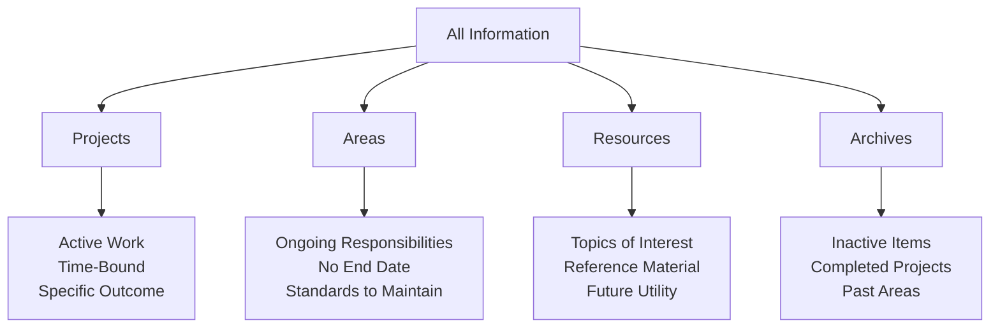
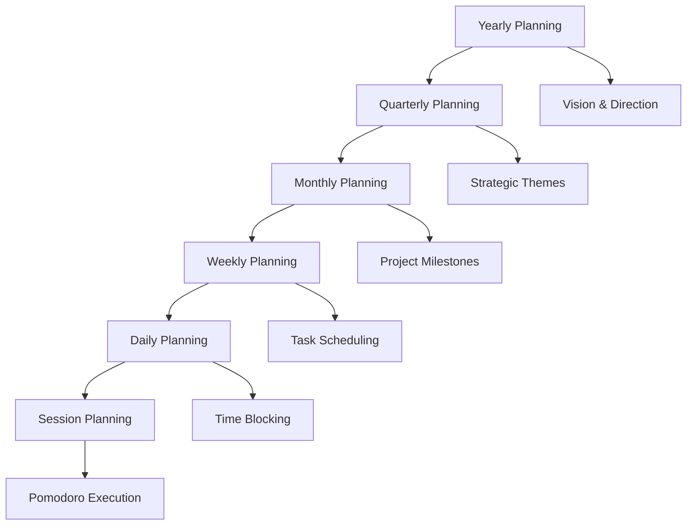

Weekly Planning: Task Orchestration

---
tags: #pkm #pkm #cognitive-science #type/report/psychology #type/reference #pkm #pkb
aliases: [Planning in PKB, Knowledge Work Planning, Self-Education Planning, PKB Planning Systems, Planning for Self-Directed Learning]
---

> [!comprehensive-reference] 📚 Comprehensive-Reference
> - **Generated**:: 2025-11-14
> - **Version**:: 1.0
> - **Type**:: Reference Documentation

> [!abstract]
> **Executive Overview**
> Planning in the context of [[03-notes/01_permanent-notes/02_personal-knowledge-base/Personal Knowledge Management]] and [[Self Directed Learning|Self-Directed Learning]] is the metacognitive process of systematically organizing cognitive resources, time allocation, and learning objectives to maximize knowledge acquisition and application within a [[PKB]] environment. This reference note synthesizes cognitive science research, planning methodologies, and Obsidian-specific implementation strategies to provide a comprehensive framework for planning knowledge work and self-education activities.

> [!how-to-use-this]
> **Navigation Guide**
> This reference note is organized into 7 major sections covering theoretical foundations, planning frameworks, temporal planning strategies, Obsidian implementation, integration patterns, challenges and solutions, and advanced optimization techniques. Use the table of contents below for quick navigation, or search for specific terms using [[wiki-links]].

## 📑 Table of Contents

1. [[#🧠 Theoretical Foundations Planning in Self-Regulated Learning|Theoretical Foundations]]
2. [[#⚙️ Core Planning Frameworks for Knowledge Work|Core Planning Frameworks]]
3. [[#📅 Temporal Planning Architectures|Temporal Planning Architectures]]
4. [[#🔧 Obsidian-Specific Planning Implementation|Obsidian Implementation]]
5. [[#🔗 Integration Patterns Connecting Planning Systems|Integration Patterns]]
6. [[#⚠️ Common Planning Challenges Solutions|Challenges & Solutions]]
7. [[#🚀 Advanced Planning Optimization|Advanced Optimization]]

---

# 🧠 Theoretical Foundations: Planning in Self-Regulated Learning

## The Cognitive Science of Planning

> [!definition]
> - **Planning (Cognitive Psychology Context)**:: The metacognitive process of formulating action sequences, allocating resources, and establishing goals before engaging in task execution. Planning is a forward-reaching cognitive activity that transforms abstract intentions into concrete action pathways.
> - **Metacognitive Planning**:: The specific subset of planning activities that involves thinking about one's own cognitive processes, including task analysis, strategy selection, resource allocation, and performance monitoring.

Planning is recognized as a fundamental component of self-regulated learning, operating within the "forethought phase" of Zimmerman's Cyclical Phases Model. Research demonstrates that planning strategy enhances self-efficacy, which in turn promotes learning behaviors and cognitive strategy deployment. The planning phase encompasses goal setting, task analysis, strategic planning, and activation of motivational beliefs that drive subsequent performance.

### The MAPS Model: Planning as Metacognitive Foundation

The MAPS model (Metacognition, Agency, Possible Selves) positions planning within a dynamic feed-forward process where metacognitive knowledge enables effective self-regulation. Planning involves metacognitive monitoring (assessing current state) and metacognitive control (using those assessments to direct behavior), creating an ongoing cycle that shapes learning outcomes.

> [!principle-point]
> **Core Cognitive Principle**
> Planning is an effortful process that reduces cognitive load by externalizing task management. When individuals actively plan and regulate learning activities, they demonstrate better delayed gratification, more effective organization strategies, and enhanced self-efficacy. The metacognitive component of self-regulated learning encompasses self-beliefs (like mindset and self-efficacy) and regulation of emotions, both critical for effective planning.

### The Three-Phase Cycle of Self-Regulated Learning

Zimmerman's model breaks self-regulated learning into three cyclical phases:

1. **Forethought Phase** (Planning Domain)
   - [[Goal Setting]]: Establishing specific, measurable learning objectives
   - [[Task Analysis]]: Breaking complex learning into component elements  
   - [[Strategic Planning]]: Selecting appropriate methods and tools
   - [[Motivational Beliefs]]: Activating self-efficacy and outcome expectations

2. **Performance Phase** (Execution Domain)
   - Self-control strategies
   - Self-observation and monitoring
   - Task engagement

3. **Self-Reflection Phase** (Evaluation Domain)
   - Self-judgment against standards
   - Self-reaction and attribution
   - Feed-forward to next planning cycle

> [!key-claim]
> **Planning's Primacy in Learning Effectiveness**
> Research from the Education Endowment Foundation shows that explicit teaching of planning strategies leads to +7 to +8 months of additional academic progress. Metacognitive strategies that support learners in planning, monitoring, and evaluating their learning demonstrate high effectiveness across all age groups and subject domains, with planning being the initiating component that sets the entire self-regulation cycle in motion.

### Planning and Working Memory

> [!connection-ideas]
> **The Cognitive Load Relationship**
> Planning reduces [[Working Memory]] burden by creating external cognitive scaffolds. David Allen's [[GTD]] methodology explicitly addresses this: "There is an inverse relationship between things on your mind and those things getting done." When planning systems externalize commitments, they free working memory for higher-order cognitive tasks rather than mere recall.

Metacognition at early ages directly predicts later academic performance, suggesting that planning capabilities compound over time. The act of planning itself strengthens metacognitive abilities, creating a positive feedback loop where better planning leads to better learning outcomes, which reinforces planning behaviors.

### The Dual Nature of Planning

Planning operates on two complementary levels:

| Planning Level | Function | Example in PKB Context |
|----------------|----------|------------------------|
| **Strategic (Macro)** | Long-term goal architecture, system design | Designing a [[Zettelkasten]] structure for comprehensive topic coverage over years |
| **Tactical (Micro)** | Daily task selection, session organization | Planning today's [[Deliberate Practice]] session on a specific concept |
| **Operational** | Real-time resource allocation | Deciding to switch from reading to note-making based on cognitive fatigue |

> [!methodology-and-sources]
> **Empirical Evidence for Planning Effectiveness**
> Cross-lagged structural equation modeling reveals causal relationships from planning strategy to monitoring strategy, demonstrating that effective planning creates the foundation for effective execution monitoring. Planning strategy use directly predicts the deployment of cognitive strategies, mediated by self-efficacy. The pathway is: Planning → Self-Efficacy → Learning Behaviors → Cognitive Strategy Use.

---

# ⚙️ Core Planning Frameworks for Knowledge Work

## Getting Things Done (GTD): The Foundation

> [!definition]
> - **Getting Things Done (GTD)**:: A personal productivity system developed by David Allen that moves all items of interest, information, issues, tasks, and projects out of one's mind by recording them externally, then breaking them into actionable work items with known time limits.
> - **Trusted System**:: The external repository (digital or analog) that holds all commitments, ensuring nothing is lost and reducing anxiety about forgetting.

### The Five-Phase GTD Workflow

GTD operates through five sequential stages that transform inputs into completed actions:

**1. Capture** 
- Collect everything demanding attention into inbox systems
- Zero cognitive overhead during capture—no evaluation yet
- Multiple capture points (physical inbox, digital capture tools, voice memos)

**2. Clarify** 
- Process each item: "What is it?" and "Is it actionable?"
- If actionable and <2 minutes → do immediately
- If actionable and longer → delegate, defer, or project
- If not actionable → trash, someday/maybe, or reference

**3. Organize**
Sort tasks into context-based categories:
- **Context**: Tools/location needed (@computer, @phone, @office)
- **Project**: Grouped by desired outcome
- **Priority**: Based on importance and deadlines
- **Time Available**: Quick tasks vs. deep work blocks
- **Energy Available**: Cognitive demand matching

**4. Reflect** (Weekly Review)
- Review all projects and active lists
- Process new inputs accumulated during week
- Update project plans and next actions
- Ensure system remains current and trustworthy

**5. Engage**
Select next action based on four criteria:
1. Context (where you are)
2. Time available
3. Energy available  
4. Priority

> [!key-claim]
> **GTD's Cognitive Liberation**
> The fundamental promise of GTD is stress reduction through complete externalization. When your "reminder system" is external and trusted, your mind stops repeatedly surfacing incomplete commitments, allowing genuine focus on current tasks. GTD can be understood as an application of [[Distributed Cognition]] or [[Extended Mind]] theory.

### GTD for Knowledge Work: Adaptations

> [!use-cases-and-examples]
> # **PKB Application of GTD**
> 
> **Traditional GTD**: "Write quarterly report" → "Draft outline for Q3 metrics" (@computer, 30min)
> 
> **Knowledge Work GTD**: "Master retrieval practice techniques" → 
> - Project: [[Retrieval Practice]] mastery
> - Next Actions: 
>   - "Read Chapter 3 of 'Make It Stick'" (@reading-chair, 45min, med-energy)
>   - "Create 10 flashcards on spacing effects" (@computer, 20min, low-energy)
>   - "Write synthesis note connecting spacing to my calculus studying" (@computer, 60min, high-energy)

Critics note that GTD can become overly complex, with excessive pre-planning overhead. For PKB contexts, a simplified capture-clarify-engage cycle often suffices, reserving full GTD structure for complex multi-month learning projects.

## PARA Method: Information Architecture

> [!definition]
> - **PARA Method**:: A universal organizational framework separating information into four top-level categories: Projects (active, time-bound), Areas (ongoing responsibilities), Resources (topics of interest), Archives (inactive items). Created by Tiago Forte for knowledge workers managing significant digital information.

### PARA Structure



> [!principle-point]
> **The Actionability Gradient**
> PARA organizes by actionability, not topic. The same subject (e.g., "Python programming") might exist across all four categories:
> - **Projects**: "Build web scraper for research data collection" (by Dec 15)
> - **Areas**: "Programming skills maintenance" (ongoing)
> - **Resources**: "Python best practices articles" (reference)
> - **Archives**: "Completed Python course from 2023"

### PARA in PKB Contexts

PARA's strength for knowledge work lies in its universal framework—it applies identically to tasks, files, notes, and reference materials. This consistency enables scalable organization as information volumes grow, with clear distinctions between active work and long-term knowledge assets.

| PARA Category | PKB Planning Function | Planning Horizon |
|---------------|----------------------|------------------|
| **Projects** | Active learning goals with completion criteria | 1 week - 6 months |
| **Areas** | Domains of continuous development | Ongoing/Indefinite |
| **Resources** | Reference materials supporting both | As-needed access |
| **Archives** | Completed learning projects, past notes | Historical record |

## Time Blocking: Temporal Allocation

> [!definition]
> - **[[03-notes/01_permanent-notes/02_personal-knowledge-base/Time Blocking]]**:: A time management method where specific time blocks with defined start and end times are allocated to individual tasks or categories of work, creating a proactive schedule that protects focused work periods.

### Time Blocking Core Principles

Time blocking's effectiveness stems from several cognitive principles:

1. **Proactive vs. Reactive Scheduling**: Intentional time allocation prevents reactive firefighting
2. **Context Preservation**: Reduced task-switching preserves cognitive momentum
3. **Flow State Access**: 90-minute deep work blocks enable entry into flow states, characterized by complete immersion and enhanced productivity
4. **Realistic Capacity Planning**: Visual time representation reveals actual available capacity

### Time Blocking Framework

Effective time blocking follows this systematic approach:

**Weekly Planning**
1. Review goals and projects in task manager
2. Identify high-priority outcomes for the week
3. Schedule non-negotiable commitments (meetings, appointments)
4. Block time for highest-priority goal work
5. Create buffers for unexpected interruptions

**Daily Refinement**
1. Morning review of time blocks
2. Adjustment based on energy levels and emerging priorities
3. Notification reminders as blocks approach
4. End-of-day review and next-day blocking

> [!helpful-tip]
> **The 80/20 Blocking Rule**
> Schedule only 80% of available time in blocks, leaving 20% as buffer for unexpected issues, interruptions, and cognitive rest. Over-scheduling creates rigidity that collapses when reality intervenes.

### Types of Time Blocks

> [!methodology-and-sources]
> **Time Block Categories for Knowledge Work**
> 
> **Deep Work Blocks** (90-120 minutes)
> - [[Deliberate Practice]] on challenging concepts
> - [[Creative Synthesis]] writing  
> - Complex problem-solving
> - Original research and analysis
> 
> **Shallow Work Blocks** (25-45 minutes)
> - Email and communication
> - Administrative tasks
> - Quick note processing
> - File organization
> 
> **Learning Blocks** (45-90 minutes)
> - Reading and annotation
> - Video course consumption
> - Flashcard review ([[03-notes/01_permanent-notes/01_cognitive-development/Spaced Repetition]])
> - Light concept exploration
> 
> **Integration Blocks** (30-60 minutes)
> - [[Weekly Review]] processes
> - Cross-linking notes
> - [[Progressive Summarization]]
> - Knowledge consolidation

## Eisenhower Matrix: Priority Quadrants

> [!definition]
> - **Eisenhower Matrix**:: A prioritization framework dividing tasks into four quadrants based on urgency and importance, enabling strategic decision-making about task selection and delegation.

### The Four Quadrants

```
┌────────────────────────┬─────────────────────────┐
│   URGENT & IMPORTANT   │  NOT URGENT & IMPORTANT │
│      (DO FIRST)        │      (SCHEDULE)         │
│                        │                         │
│  • Crises              │  • Planning             │
│  • Deadlines           │  • Skill development    │
│  • Critical problems   │  • Relationship building│
│                        │  • Strategic learning   │
├────────────────────────┼─────────────────────────┤
│  URGENT & UNIMPORTANT  │ NOT URGENT & UNIMPORTANT│
│     (DELEGATE)         │      (ELIMINATE)        │
│                        │                         │
│  • Interruptions       │  • Busywork             │
│  • Some calls/emails   │  • Time wasters         │
│  • Minor requests      │  • Trivial activities   │
└────────────────────────┴─────────────────────────┘
```

> [!key-claim]
> **The Quadrant II Revolution**
> For self-directed learners, Quadrant II (Important but Not Urgent) contains the highest-leverage activities: [[Deliberate Practice]], [[System Building]], [[Relationship Cultivation]], and [[Strategic Planning]]. Most people spend excessive time in Quadrants I and III (urgent tasks), neglecting Quadrant II until items become urgent, creating chronic crisis management.

### Eisenhower Matrix in PKB Planning

The matrix integrates with other planning systems:

| Integration | How It Works |
|-------------|--------------|
| **GTD + Eisenhower** | After clarifying tasks in GTD, tag with quadrant → prioritize Quadrant II in time blocking |
| **PARA + Eisenhower** | Projects in Quadrant I/II are active; Quadrant III candidates for delegation; Quadrant IV move to Archives |
| **Time Blocking + Eisenhower** | Allocate prime cognitive hours (mornings) to Quadrant II deep work |

## Pomodoro Technique: Focused Intervals

> [!definition]
> - **Pomodoro Technique**:: A time management method using 25-minute focused work intervals ("Pomodoros") followed by 5-minute breaks, with longer 15-30 minute breaks after four cycles. Designed to maintain mental freshness and prevent burnout.

The Pomodoro Technique excels for tasks requiring sustained attention while providing frequent rest opportunities. The timer creates urgency that combats procrastination, while regular breaks prevent mental fatigue.

### Pomodoro Protocol

**Single Cycle**:
1. Choose a task
2. Set timer for 25 minutes
3. Work with full focus (no interruptions)
4. When timer rings, mark one Pomodoro complete
5. Take 5-minute break
6. After 4 Pomodoros, take 15-30 minute break

> [!use-cases-and-examples]
> **Pomodoro Applications in Self-Education**
> 
> **Reading Dense Academic Material**:
> - Pomodoro 1: Read 10 pages with highlighting
> - Break: Reflect on key ideas
> - Pomodoro 2: Create permanent notes on highlights
> - Break: Physical movement
> - Pomodoro 3: Link new notes to existing knowledge
> - Break: Mental rest
> - Pomodoro 4: Write synthesis connecting concepts
> - Long Break: 20 minutes away from desk
> 
> **Modified Pomodoros for Flow Work**:
> Many practitioners adapt intervals (50/10 for deeper work, 15/5 for administrative tasks) based on task demands. The rigid 25/5 structure is a starting point, not a universal law.

## Integrating Multiple Frameworks

> [!principle-point]
> **The Framework Stack Principle**
> Productivity frameworks are not mutually exclusive—they address different planning dimensions. The most effective personal planning systems combine multiple frameworks strategically:
> 
> - **GTD** for comprehensive task capture and organization
> - **PARA** for information architecture and file organization  
> - **Eisenhower Matrix** for priority determination
> - **Time Blocking** for execution scheduling
> - **Pomodoro** for focused session management

### Example Integrated Workflow

A comprehensive GTD + Time Blocking integration:

**Weekly Cycle**:
1. **Sunday Evening** (GTD Reflect phase): 
   - Review all projects
   - Clarify captured items from week
   - Identify next actions
   - Tag with Eisenhower quadrant

2. **Weekly Planning Block** (Time Blocking setup):
   - Review calendar for fixed commitments
   - Identify Quadrant II priorities from GTD system
   - Schedule time blocks for highest-impact next actions
   - Leave 20% buffer time

3. **Daily Morning** (Refinement):
   - Review today's blocks
   - Adjust based on energy/context
   - Confirm Pomodoro allocation within blocks

4. **Execution** (Engage):
   - Work time blocks as scheduled
   - Use Pomodoro within blocks for deep work
   - Capture new inputs to GTD inbox
   - Adjust remaining blocks if necessary

---

# 📅 Temporal Planning Architectures

## The Hierarchy of Planning Horizons

Effective planning operates across multiple temporal scales, each serving distinct cognitive functions:



### Yearly Planning: Strategic Vision

**Purpose**: Establish overarching learning direction and identity goals

> [!the-goal]
> **Yearly Planning Objectives**
> - Define [[Possible Selves]]: Who you're becoming as a learner
> - Identify 3-5 strategic learning domains
> - Establish measurable annual outcomes
> - Create theme or focus for the year

**Key Questions**:
- What expertise do I want to develop?
- What knowledge gaps limit my goals?
- What learning would compound most over time?
- What does mastery look like in my priority domains?

> [!example]
> **Yearly Plan Example**
> 
> **Theme**: "Year of Systematic Learning"
> 
> **Strategic Domains**:
> 1. [[Cognitive Psychology]]: Build research-level understanding
> 2. [[Statistical Analysis]]: Progress from novice to intermediate practitioner  
> 3. [[Technical Writing]]: Develop publication-quality skills
> 
> **Annual Outcomes**:
> - Write 12 synthesis papers (one per month)
> - Complete 3 major research projects
> - Build comprehensive Zettelkasten with 500+ permanent notes

### Quarterly Planning: Theme Translation

**Purpose**: Convert annual vision into 90-day actionable themes

**Quarterly Planning Components**:

1. **Theme Selection** (1-2 major focus areas from annual plan)
2. **Project Definition** (2-4 major projects with completion criteria)
3. **Capability Building** (skills to develop this quarter)
4. **Resource Acquisition** (books, courses, tools needed)

> [!methodology-and-sources]
> **Quarterly OKR Framework for Learning**
> 
> **Objective**: Achieve intermediate statistical fluency
> 
> **Key Results**:
> - KR1: Complete full course on Bayesian inference (measured: course completion)
> - KR2: Solve 50 practice problems across distribution types (measured: problem log)
> - KR3: Apply statistical analysis to 2 original research questions (measured: completed analyses)
> - KR4: Create 30 permanent notes on statistical concepts (measured: note count)

### Monthly Planning: Project Milestones

**Purpose**: Break quarterly projects into monthly achievements

**Monthly Review Components**:

Using [[Obsidian Templates]] and [[Periodic Notes]], monthly planning creates checkpoints that maintain momentum while allowing course correction.

**Monthly Planning Template Structure**:

```markdown
# Month: YYYY-MM

## Quarterly Context
- Active Quarter Theme: [[Q2-2024-Statistical-Fluency]]
- Quarter Progress: 33% complete

## This Month's Focus
### Primary Project: [[Bayesian-Inference-Course]]
- Target: Complete modules 4-6
- Time Allocation: 15 hours (5 hours/week)

### Secondary Project: [[Statistical-Problem-Practice]]
- Target: Solve 20 problems (5/week)
- Time Allocation: 8 hours

## Success Metrics
- [ ] Course progress: 50% → 75%
- [ ] Problem count: 30 → 50
- [ ] Permanent notes: 15 → 25
- [ ] Integration: Write 1 synthesis connecting statistics to existing knowledge

## Obstacles & Mitigations
- **Risk**: Course complexity increases in Module 5
- **Mitigation**: Allocate extra review time, find supplementary resources

## Resources Needed
- [ ] Additional textbook on Bayesian methods
- [ ] Study group or discussion forum access
```

### Weekly Planning: Task Orchestration

**Purpose**: Translate monthly milestones into specific next actions and time allocations

Weekly planning is where strategic vision meets tactical execution. The weekly review combines GTD's reflection phase with time blocking's proactive scheduling.

**Weekly Review Protocol** (60-90 minutes, Sunday evening or Friday afternoon):

1. **Review Previous Week** (15 min)
   - What got completed?
   - What got blocked? Why?
   - What consumed unexpected time?
   - Energy patterns observed?

2. **Process Inputs** (20 min)
   - Empty all capture inboxes
   - Clarify items into projects/actions
   - Update project statuses
   - Archive completed items

3. **Preview Week Ahead** (15 min)
   - Check calendar for fixed commitments
   - Review monthly goals for week's contribution
   - Identify 3-5 "Big Rocks" (highest-impact outcomes)

4. **Schedule Time Blocks** (20 min)
   - Block deep work for Big Rocks
   - Schedule routine activities (review, admin)
   - Leave buffer time (20% minimum)
   - Plan Pomodoro allocation within blocks

5. **Prepare Resources** (10 min)
   - Queue reading materials
   - Prepare note templates
   - Ensure tools are accessible

> [!helpful-tip]
> **The "Big Rocks First" Principle**
> Schedule your most important outcomes (Quadrant II work) FIRST when energy is highest, then fit smaller tasks around them. If you schedule small tasks first, Big Rocks never fit.

**Weekly Planning in Obsidian**:

Obsidian's [[Periodic Notes]] plugin combined with [[Templater]] and [[dataview]] enables automated weekly note generation that pulls in data from daily notes and displays progress toward goals.

### Daily Planning: Execution Roadmap

**Purpose**: Create a focused roadmap for the day's work within the context of weekly goals

Daily notes in Obsidian serve as the operational hub for knowledge work, combining planning, execution tracking, and reflection in a single temporal container.

**Daily Planning Components**:

**Morning Planning Ritual** (10-15 minutes):

1. **Review Day's Context**
   - Check calendar for commitments
   - Review weekly Big Rocks
   - Assess energy level and available time blocks

2. **Select Today's Priorities** (Rule of 3)
   - Choose 1 Big Rock to advance
   - Select 2 supporting tasks
   - Ensure alignment with weekly goals

3. **Time Block Allocation**
   - Assign specific time blocks to priorities
   - Plan Pomodoro sessions within blocks
   - Schedule breaks and buffer time

4. **Resource Preparation**
   - Open relevant notes/files
   - Queue tools needed
   - Minimize distractions

**Evening Reflection Ritual** (5-10 minutes):

1. **Completion Review**
   - Mark completed tasks
   - Note uncompleted items (transfer or drop)
   - Celebrate wins (reinforcement)

2. **Learning Capture**
   - What did I learn today?
   - What connections emerged?
   - What questions arose?

3. **Process Optimization**
   - What worked well?
   - What hindered progress?
   - How can tomorrow improve?

> [!example]
> **Daily Note Structure**
> 
> ```markdown
> # 2025-11-14 Thursday
> 
> ## Context
> Week: [[2025-W46]]
> Energy: ⚡⚡⚡ (High - well rested)
> 
> ## Today's Priorities
> 1. 🎯 **Big Rock**: Complete Bayesian inference Module 5
>    - Time Block: 9:00-11:30 AM (3 Pomodoros)
> 2. 📝 **Support**: Write permanent note on conjugate priors
>    - Time Block: 2:00-3:00 PM (2 Pomodoros)
> 3. 🔄 **Support**: Solve 5 practice problems
>    - Time Block: 4:00-5:00 PM (2 Pomodoros)
> 
> ## Time Blocks
> - 9:00-11:30: Deep Work - Module 5
> - 11:30-12:00: Break
> - 12:00-1:00: Lunch
> - 1:00-2:00: Emails & admin
> - 2:00-3:00: Note writing
> - 3:00-4:00: Break / walk
> - 4:00-5:00: Practice problems
> - 5:00-5:15: Daily reflection
> 
> ## Evening Reflection
> ### Completed
> - [x] Module 5 complete (2.5 hours)
> - [x] Conjugate priors note written
> - [x] 5 practice problems solved
> 
> ### Learned Today
> - Conjugate priors dramatically simplify posterior calculations
> - Beta distribution is conjugate prior for binomial likelihood
> - Connection to my existing knowledge on probability distributions
> 
> ### Tomorrow's Setup
> - Start Module 6 (Markov Chain Monte Carlo)
> - Need to review sampling methods first
> ```

### Session Planning: Focused Execution

**Purpose**: Manage attention and cognitive resources within individual work sessions

Session-level planning using the Pomodoro Technique creates micro-commitments that overcome procrastination and maintain focus during execution.

**Pomodoro Session Structure**:

**Pre-Session** (2 min):
- Clear workspace
- Silence notifications  
- State intention: "I will work on X for 25 minutes"
- Set timer

**During Session** (25 min):
- Single-task focus
- Note distractions without following them
- Capture interruptions in "distraction log"
- Push through resistance

**Break** (5 min):
- Physical movement
- No screens
- Mental reset
- Prepare for next session

**Post-4-Pomodoros** (15-30 min):
- Longer break
- Review progress
- Adjust remaining session plan
- Restore cognitive resources

---

# 🔧 Obsidian-Specific Planning Implementation

## Plugin Ecosystem for Planning

Obsidian's planning capabilities emerge from strategic plugin combinations. The core planning stack consists of Periodic Notes, Templater, Dataview, Tasks, and Calendar, which together create an automated planning environment.

### Essential Planning Plugins

| Plugin | Function | Planning Role |
|--------|----------|---------------|
| **[[Periodic Notes]]** | Creates daily, weekly, monthly, quarterly, yearly notes with customizable templates | Temporal structure foundation |
| **[[Templater]]** | Dynamic template engine with JavaScript capabilities for date manipulation, variable insertion, and automation | Template automation and note generation |
| **[[dataview]]** | Query language and JavaScript API for filtering, sorting, and extracting data from markdown pages | Progress tracking, task aggregation, metrics visualization |
| **[[Tasks Plugin]]** | Advanced task management with due dates, priorities, recurrence, filtering | Task lifecycle management |
| **[[Calendar Plugin]]** | Monthly calendar view enabling visual navigation and note creation by clicking dates | Visual temporal navigation |
| **[[Day Planner]]** | Timeline view of daily tasks with time-blocking interface, integrates with Google Calendar | Time-block visualization and execution |

### Advanced Planning Plugins

| Plugin | Function | Use Case |
|--------|----------|----------|
| **Charts** | Create visual charts from note data | Progress visualization, habit tracking graphs |
| **Heatmap Calendar** | Generate heatmap visualizations | Consistency tracking, activity patterns |
| **DB Folder** | Notion-like database views of folders | Project dashboard creation |
| **Tracker** | Extract and visualize tracked data | Habit metrics, learning analytics |

## Implementing Periodic Notes Architecture

### Setup Configuration

Periodic Notes requires configuration for each temporal level you want to use:

**Periodic Notes Settings**:

```
Daily Notes:
├─ Folder: Periodic/Daily
├─ Format: YYYY-MM-DD
└─ Template: Templates/Daily-Note-Template.md

Weekly Notes:
├─ Folder: Periodic/Weekly  
├─ Format: gggg-[W]WW
└─ Template: Templates/Weekly-Note-Template.md

Monthly Notes:
├─ Folder: Periodic/Monthly
├─ Format: YYYY-MM
└─ Template: Templates/Monthly-Note-Template.md

Quarterly Notes:
├─ Folder: Periodic/Quarterly
├─ Format: YYYY-[Q]Q
└─ Template: Templates/Quarterly-Note-Template.md

Yearly Notes:
├─ Folder: Periodic/Yearly
├─ Format: YYYY
└─ Template: Templates/Yearly-Note-Template.md
```

**Templater Settings**:
- ✅ Enable "Trigger Templater on new file creation"
- ✅ Enable "Automatic jump to cursor"
- ✅ Set template folder location

**Dataview Settings**:
- ✅ Enable "JavaScript Queries"
- ✅ Enable "Inline JavaScript Queries"

### Daily Note Template Architecture

Daily notes serve as the operational hub, combining planning, task management, logging, and reflection. Template automation reduces friction while maintaining consistency.

**Comprehensive Daily Template**:

```markdown
---
date: 2025-10-25
week: [[2025-W43]]
month: [[2025-10]]
quarter: [[2025-Q4]]
year: [[2025]]
energy: 
mood:
sleep_hours:
tags: [daily-note]
---

# Saturday, October 25th, 2025

## 📅 Temporal Context
- **Week**: [[2025-W43]]
- **This Week's Theme**: `= this.week.theme`
- **Monthly Goal**: `= this.month.primary_goal`

## 🎯 Today's Plan

### Big Rock 🎯
- [ ] [Primary outcome for today]

### Supporting Tasks 📝
- [ ] [Supporting task 1]
- [ ] [Supporting task 2]

### Routine Items 🔄
- [ ] Morning review
- [ ] Spaced repetition (20 min)
- [ ] Evening reflection

## ⏰ Time Blocks

| Time | Block | Type | Task |
|------|-------|------|------|
| 9:00-11:00 | Deep Work | 🧠 | [Big Rock work] |
| 11:00-12:00 | Buffer | ☕ | Break / Overflow |
| 12:00-1:00 | Lunch | 🍽️ | Meal + walk |
| 1:00-2:00 | Admin | 📧 | Email / Communications |
| 2:00-4:00 | Learning | 📚 | [Course/Reading] |
| 4:00-5:00 | Integration | 🔗 | Note-making / Linking |
| 5:00-5:30 | Review | 🔍 | Reflection + tomorrow's setup |

## 📊 Tasks Overview

### Due Today


````
```dataview
TASK
FROM "Projects" OR "Areas"
WHERE !completed AND due = this.file.day
```
````

### Can Do Today  

````
```
TASK
FROM "Projects" OR "Areas"
WHERE !completed AND (due = null OR due > this.file.day)
SORT file.name DESC
LIMIT 10
```
````

### Completed Today

````
```
TASK
FROM "Projects" OR "Areas" OR ""
WHERE completed AND completion = this.file.day
```
````

## 📝 Notes & Captures

### Quick Captures
- 

### Ideas
- 

### Observations
- 

## 🔗 Notes Created/Modified Today

````
```
LIST
FROM ""
WHERE file.cday = this.file.day OR file.mday = this.file.day
SORT file.mtime DESC
```
````

## 🌙 Evening Reflection

### Wins 🎉
- 
- 

### Learned 💡
- 
- 

### Challenges ⚠️
- 
- 

### Tomorrow's Priority
- 

### Energy Patterns
**Morning**: 
**Afternoon**: 
**Evening**: 

---
**Previous Day**: [[2025-10-24]]
**Next Day**: [[2025-10-26]]
````


### Weekly Note Template Architecture

Weekly notes aggregate data from daily notes, providing progress visualization and enabling weekly review practices.

**Comprehensive Weekly Template**:

```markdown
---
week_number: 10
year: 2025
month: [[2025-03]]
quarter: [[2025-Q1]]
theme: 
primary_goal:
tags: [weekly-note]
---

# Week 10 | 2025

## 📅 Week Overview
**Dates**: Mar 3rd - Mar 9th
**Monthly Context**: [[2025-03]]
**Quarterly Context**: [[2025-Q1]]

## 🎯 This Week's Focus

### Weekly Theme
> [!the-goal]
> [What's the overarching theme for this week?]

### Primary Goals (2-3 Maximum)
1. [ ] [Primary goal 1 - aligned with monthly milestone]
2. [ ] [Primary goal 2 - aligned with quarterly theme]
3. [ ] [Primary goal 3 - if applicable]

### Supporting Objectives
- [ ] [Supporting objective 1]
- [ ] [Supporting objective 2]

## 📊 Weekly Progress Dashboard


### Daily Notes This Week


````
```dataview
TABLE 
  energy as "Energy",
  mood as "Mood",
  sleep_hours as "Sleep"
FROM "Periodic/Daily"
WHERE week = this.file.link
SORT file.name ASC
```
````

### Habit Tracking


````
```
TABLE
  file.link as "Date",
  morning_review as "🌅 Morning",
  spaced_rep as "🔁 SRS",
  deep_work as "🧠 Deep",
  exercise as "💪 Exercise",
  reading as "📚 Read",
  reflection as "🌙 Reflect"
FROM "Periodic/Daily"
WHERE week = this.file.link
SORT file.name ASC
```
````

### Tasks Completed This Week

````
```
TASK
FROM "Projects" OR "Areas"
WHERE completed
  AND completion >= date("2025-03-03")
  AND completion <= date("2025-03-09")
GROUP BY file.link
```
````

### Notes Created This Week

````
```
LIST
FROM ""
WHERE file.cday >= date("2025-03-03")
  AND file.cday <= date("2025-03-09")
SORT file.ctime DESC
```
````

## 🔍 Weekly Review

### Wins This Week 🎉
- 
- 

### Key Learnings 💡
- 
- 

### Challenges & Blockers ⚠️
**Challenge**:
**Root Cause**:
**Mitigation**:

### Process Improvements
**What worked well?**
- 

**What didn't work?**
- 

**Adjustments for next week:**
- 

## 📈 Goal Progress

### Monthly Goal Advancement
**Monthly Goal**: `= this.month.primary_goal`
**Progress This Week**: [Describe contribution]
**Remaining**: [What's left to achieve monthly goal]

### Quarterly Theme Alignment  
**Quarterly Theme**: `= this.quarter.theme`
**This Week's Contribution**: [How this week advanced quarterly theme]

## 🗓️ Next Week Preview

### Upcoming Commitments
- [Meeting/Event 1]
- [Meeting/Event 2]

### Priorities for Next Week
1. 
2. 
3. 

### Resources Needed
- 

---
**Previous Week**: [[2025-W09]]
**Next Week**: [[2025-W11]]
**Daily Notes**: 
- [[2025-03-03]] | [[2025-03-04]] | [[2025-03-05]] | [[2025-03-06]] | [[2025-03-07]] | [[2025-03-08]] | [[2025-03-09]]
````

## Task Management with Tasks Plugin

The Tasks plugin extends Obsidian's native checkbox functionality with comprehensive task lifecycle management including due dates, scheduling, priorities, and recurrence.

### Task Syntax

**Basic Task**:
```markdown
- [ ] This is a basic task
```

**Task with Due Date**:
```markdown
- [ ] Complete Module 5 📅 2025-11-15
```

**Task with Scheduled Date** (when you plan to work on it):
```markdown
- [ ] Write synthesis note ⏳ 2025-11-14
```

**Task with Priority**:
```markdown
- [ ] ⏫ High priority task
- [ ] 🔼 Medium priority task
- [ ] 🔽 Low priority task
```

**Recurring Task**:
```markdown
- [ ] Daily review 🔁 every day
- [ ] Weekly planning 🔁 every week on Sunday
- [ ] Monthly reflection 🔁 every month on the 1st
```

### Task Queries in Notes

**Show tasks due today**:
````markdown
```tasks
not done
due today
```
````

**Show high-priority tasks**:
````markdown

```tasks
not done
(priority is high) OR (priority is highest)
sort by priority
`````

**Show tasks scheduled for this week**:
````markdown
```tasks
not done
scheduled after yesterday
scheduled before next week
group by filename
```
````
## Time Blocking with Day Planner

Day Planner provides visual timeline interface for time-blocked task execution, integrating with both Tasks plugin and external calendars (Google Calendar, iCloud).

### Day Planner Setup

**Configuration**:
1. Enable Dataview plugin (required dependency)
2. Enable Daily Notes OR Periodic Notes
3. Install Day Planner
4. Configure timeline preferences

**Time Block Syntax in Daily Notes**:

```markdown


# Day Planner

- [ ] 09:00 - 11:00 Deep Work: Bayesian inference study
- [ ] 11:00 - 11:15 Break & stretch
- [ ] 11:15 - 12:00 Create permanent note on conjugate priors
- [ ] 12:00 - 13:00 Lunch
- [ ] 13:00 - 14:00 Email & communications
- [ ] 14:00 - 16:00 Practice problems (5 problems target)
- [ ] 16:00 - 17:00 Note linking & knowledge integration
- [ ] 17:00 - 17:15 Daily reflection
```

**Timeline View**: Day Planner renders these as color-coded blocks on a timeline, showing:
- Current time indicator
- Completed blocks (checked)
- Active blocks
- Upcoming blocks
- Conflicts or overlaps

### External Calendar Integration

Day Planner can display events from internet calendars (Google Calendar, iCloud, Outlook) by adding ICS links in settings.

This enables:
- Seeing fixed commitments within Obsidian
- Planning time blocks around meetings
- Unified view of planned vs. scheduled time

---

# 🔗 Integration Patterns: Connecting Planning Systems

## Vertical Integration: Temporal Hierarchy Linking

Effective planning requires each temporal level to inform and be informed by adjacent levels.

### Bottom-Up Flow (Emergent Planning)

**Daily → Weekly**:
Dataview queries in weekly notes automatically aggregate daily data, surfacing patterns and progress without manual summarization.

`````markdown
<!-- In Weekly Note -->
## This Week's Completions
```dataview
TABLE
  rows.file.tasks as "Completed Tasks"
FROM "Periodic/Daily"
WHERE week = this.file.link
  AND file.tasks.completed = true
FLATTEN file.tasks as task
GROUP BY file.link
```
`````


**Weekly → Monthly**:
`````markdown
<!-- In Monthly Note -->
## Weekly Themes This Month
```dataview
TABLE theme as "Weekly Theme", primary_goal as "Primary Goal"
FROM "Periodic/Weekly"
WHERE month = this.file.link
SORT file.name ASC
```
`````


**Monthly → Quarterly**:

`````markdown
<!-- In Quarterly Note -->
## Monthly Milestones Progress
```dataview
TABLE 
  primary_goal as "Goal",
  completion_percent as "Progress"
FROM "Periodic/Monthly"
WHERE quarter = this.file.link
```
`````

### Top-Down Flow (Intentional Planning)

**Yearly → Quarterly**:
- Annual strategic domains become quarterly themes
- Yearly outcomes decompose into quarterly projects
- Capabilities identified annually drive quarterly skill-building

**Quarterly → Monthly**:
- Quarterly projects break into monthly milestones
- Monthly goals derive from quarterly OKRs
- Resource acquisition spreads across months

**Monthly → Weekly**:
- Monthly milestones inform weekly Big Rocks
- Week-by-week progression toward monthly goal
- Buffer weeks for integration and consolidation

**Weekly → Daily**:
- Weekly Big Rocks become daily priorities
- Weekly time allocation guides daily time blocks
- Daily tasks serve weekly objectives

> [!principle-point]
> **The Bidirectional Planning Principle**
> Planning effectiveness emerges from bidirectional flow: top-down intentionality provides direction, while bottom-up emergence provides reality-testing and course correction. Static top-down plans fail when they ignore bottom-up feedback; reactive bottom-up execution fails without top-down vision.

## Horizontal Integration: Cross-System Coherence

### GTD + PARA Integration

**PARA as GTD's Organization Structure**:

| GTD Component | PARA Location | Rationale |
|---------------|---------------|-----------|
| **Projects List** | `/Projects` folder | Active, time-bound work with completion criteria |
| **Next Actions Lists** | Task properties in project notes | Actions live with their projects |
| **Waiting For** | `/Projects/_Waiting` or task tags | Track delegated/blocked items |
| **Someday/Maybe** | `/Areas` or `/Resources` | Ongoing interests or future possibilities |
| **Reference** | `/Resources` folder | Topic-organized reference materials |
| **Archive** | `/Archives` folder | Completed projects, inactive areas |

**Workflow Example**:
1. Capture item in inbox
2. Clarify: "Learn Bayesian statistics" is a project
3. Create project note in `/Projects/Bayesian-Statistics-Mastery.md`
4. Define outcome, list next actions as tasks
5. Organize: Add to weekly planning
6. Execute: Schedule next action in time blocks

### Eisenhower + Time Blocking Integration

**Quadrant-Based Time Allocation**:

```markdown
## Weekly Time Budget by Quadrant

### Quadrant II (Important, Not Urgent) - 60% of discretionary time
- Deep Work Blocks: 12 hours
- Learning Blocks: 8 hours
- Strategic Planning: 2 hours

### Quadrant I (Important, Urgent) - 25% of discretionary time
- Deadline-driven work: 5 hours
- Crisis response buffer: 3 hours

### Quadrant III (Urgent, Not Important) - 10% of discretionary time
- Necessary admin: 2 hours

### Quadrant IV (Neither) - 5% (minimize)
- Unavoidable but unimportant: 1 hour
```

**Daily Time Blocking Using Quadrants**:

| Time Block | Quadrant | Task Type | Rationale |
|------------|----------|-----------|-----------|
| 9:00-11:00 | II | Deep Work: Learning | Peak cognitive hours for important work |
| 11:00-12:00 | III | Admin/Email | Post-peak for less demanding work |
| 2:00-4:00 | II | Creative Synthesis | Secondary peak for important work |
| 4:00-5:00 | I | Deadline tasks | Lower energy for urgent necessities |

### Task Management + Periodic Notes Integration

Tasks created in daily notes flow upward to weekly reviews via Dataview queries, while projects in PARA structure push tasks downward into daily execution.

**Task Creation Pattern**:
````markdown
<!-- In Project Note: /Projects/Bayesian-Stats-Mastery.md -->
## Next Actions
- [ ] Read Chapter 3: Conjugate Priors 📅 2025-11-15 ⏳ 2025-11-14
- [ ] Solve 10 practice problems 📅 2025-11-16
- [ ] Write permanent note on Beta distribution 📅 2025-11-17

<!-- Tasks automatically appear in daily notes via query -->
<!-- In Daily Note: 2025-11-14 -->
## Tasks Scheduled Today
```tasks
not done
scheduled on 2025-11-14
```
````

## Plugin Workflow Integration

### Automated Planning Pipeline

Modern Obsidian planning leverages automation to reduce friction while maintaining system integrity.

**Daily Note Generation Workflow**:
1. **Trigger**: Click date in Calendar plugin OR run "Open Daily Note" command
2. **Templater**: Executes Daily-Note-Template.md
   - Calculates date context (week, month, quarter, year)
   - Creates links to parent periodic notes
   - Generates task query blocks
3. **Dataview**: Executes queries to populate:
   - Tasks due today (from all project notes)
   - Tasks scheduled today
   - Weekly theme and monthly goal (from parent notes)
4. **Result**: Fully populated daily note ready for planning

**Weekly Note Generation Workflow**:
1. **Trigger**: Click week in Calendar OR run "Open Weekly Note" command
2. **Templater**: Executes Weekly-Note-Template.md
   - Calculates week number, date range
   - Links to daily notes for the week
   - Creates parent note links (month, quarter)
3. **Dataview**: Automatically aggregates:
   - Habit tracking data from daily notes
   - Completed tasks from the week
   - Energy and mood patterns
   - Notes created during week
4. **Result**: Weekly dashboard showing progress and patterns

> [!what-this-does]
> **The Automation Advantage**
> By automating note structure and data aggregation, the system:
> - Eliminates manual data entry
> - Ensures consistency across temporal levels
> - Surfaces patterns not visible in individual days
> - Reduces cognitive overhead of maintaining the system
> - Makes planning sustainable long-term

---

# ⚠️ Common Planning Challenges & Solutions

## Over-Planning Paralysis

> [!warning]
> **The Planning Trap**
> Excessive planning becomes procrastination in disguise. When planning feels productive but prevents execution, it becomes a sophisticated avoidance mechanism.

### Symptoms
- Spending >20% of available time on planning
- Constantly revising plans without executing
- Creating elaborate systems that are never used
- Perfectionism blocking action ("plan isn't perfect yet")
- Planning as a substitute for uncomfortable tasks

### Solutions

**1. Time-Box Planning Activities**
- Daily planning: 10-15 minutes maximum
- Weekly review: 60-90 minutes maximum
- Monthly planning: 2 hours maximum
- Quarterly planning: Half-day maximum

**2. Adopt "Plan-Do-Reflect" Cycles**
```
Plan (20%) → Execute (60%) → Reflect (20%)
```
If execution falls below 50% of time, reduce planning scope.

**3. Use the 2-Minute Rule**
If planning for a task takes longer than doing the task, do the task.

**4. Implement "Good Enough" Planning**
- Plans need only be detailed enough to start
- Refinement happens during execution
- Accept that plans will change

> [!example]
> **Over-Planning vs. Sufficient Planning**
> 
> **Over-Planned**: Spend 3 hours creating elaborate reading notes template with 15 custom fields, color-coding system, and integration scripts before reading first book.
> 
> **Sufficiently Planned**: Create basic book note template (title, author, key ideas, connections) in 15 minutes. Refine template based on actual use over first 5 books.

## Under-Planning: Reactive Drift

### Symptoms
- Constant firefighting, always responding to urgent
- No time for important but non-urgent work (Quadrant II)
- Forgetting commitments
- Working on easy tasks while critical work languishes
- Feeling busy but not productive

### Solutions

**1. Minimum Viable Planning (MVP)**
Even minimal planning beats no planning:
- **Daily minimum**: Choose top 3 tasks each morning (5 minutes)
- **Weekly minimum**: Sunday evening 30-minute review of week ahead
- **Monthly minimum**: First-Sunday quarterly planning (90 minutes)

**2. Emergency Planning Protocol**
When falling into reactive mode:
1. **STOP**: Take 15-minute timeout
2. **LIST**: Brain-dump all open commitments
3. **TRIAGE**: Apply Eisenhower Matrix
4. **BLOCK**: Schedule next 3 days with Quadrant II time
5. **COMMIT**: Protect blocked time

**3. Build Planning Triggers**
- Set recurring calendar events for planning sessions
- Create environmental cues (Sunday planning routine with coffee)
- Use Obsidian Daily Note creation as planning trigger

## Planning-Execution Gap

> [!key-claim]
> **The Implementation Intention Principle**
> Plans fail at the moment of execution when they lack specific implementation intentions—concrete specifications of when, where, and how actions will occur. "I'll study statistics this week" fails; "I'll study Bayesian inference 9-11am in my home office on Monday" succeeds.

### Symptoms
- Well-made plans that don't get executed
- Repeatedly scheduling then postponing tasks
- Abstract goals without concrete actions
- Plans living in separate system from daily work

### Solutions

**1. Implementation Intention Format**
Transform every plan into:
```
"I will [BEHAVIOR] at [TIME] in [LOCATION] using [TOOLS]"
```

**Example Transformations**:
- ❌ "Read more this week"
- ✅ "I will read for 30 minutes at 7:00 AM in my reading chair with physical book and notebook"

- ❌ "Work on Bayesian project"
- ✅ "I will solve 5 practice problems at 2:00 PM at my desk using course problem set and calculator"

**2. Single Source of Truth**
GTD emphasizes the "trusted system"—all commitments in one place. Fragmented planning across multiple tools creates execution friction.

For PKB planning:
- Tasks live in project notes (PARA structure)
- Daily notes query tasks (Dataview)
- Time blocks scheduled in calendar
- All three sync continuously

**3. Commitment Devices**
- **Social**: Share goals with accountability partner
- **Environmental**: Remove distractions before planned work
- **Financial**: Invest in resources (courses, books) creating sunk-cost motivation
- **Technological**: Use Obsidian Day Planner notifications as execution prompts

## Scope Creep and Goal Inflation

### Symptoms
- Adding new goals before completing current ones
- Quarterly plans with 10 major projects
- Daily task lists with 20 items
- Constantly feeling behind

### Solutions

**1. The Rule of 3**
- **Yearly**: 3 strategic domains maximum
- **Quarterly**: 3 major projects maximum
- **Monthly**: 3 primary milestones maximum
- **Weekly**: 3 Big Rocks maximum
- **Daily**: 3 priority tasks maximum

**2. Finish Before Starting**
- Complete one project before launching another
- Archive or drop 1 project when adding a new one
- Regular pruning of Someday/Maybe list

**3. Capacity Mapping**
Calculate realistic capacity:
```
Available hours per week: 168
- Sleep: 56 (8 hours/day)
- Work: 40 (if employed)
- Life maintenance: 21 (3 hours/day for meals, hygiene, chores)
-----------------------------------
Remaining: 51 hours/week

Knowledge work capacity: ~20-30 hours/week (accounting for:
- Cognitive fatigue
- Social time
- Physical health
- Buffer/flexibility)
```

With 20-30 hours/week, carefully allocate:
- Deep work: 10-15 hours (core learning/creation)
- Shallow work: 5-10 hours (admin, organization)
- Integration: 5 hours (reviewing, linking, synthesizing)

## Planning System Abandonment

### Symptoms
- Starting new systems every few months
- Complex systems that fall into disuse
- Guilt about unused planning templates
- Reverting to email inbox as task manager

### Solutions

**1. Start Minimal, Grow Gradually**
Obsidian planning systems should begin with core plugins (Periodic Notes, Templater, Calendar) and basic templates. Advanced features (Dataview queries, Charts, custom scripts) added only after foundational habits established.

**Week 1-4**: Daily notes only, basic template
**Month 2-3**: Add weekly notes and review process
**Quarter 2**: Add monthly notes and tracking
**Year 2+**: Add advanced queries, visualizations

**2. Friction Audit**
Identify and eliminate sources of system friction:
- Is note creation too slow? → Simplify templates
- Are queries breaking? → Use simpler Dataview syntax
- Is daily review taking too long? → Remove unnecessary sections
- Forgetting to open Obsidian? → Set environment/time triggers

**3. Regular System Retrospectives**
Monthly question: "Is this planning system serving me or am I serving it?"

If system feels burdensome:
- Simplify templates
- Remove unused sections
- Focus on highest-leverage elements
- Remember: Imperfect system used beats perfect system abandoned

---

# 🚀 Advanced Planning Optimization

## Metacognitive Planning: Planning How You Plan

> [!the-philosophy]
> **Second-Order Planning**
> The most sophisticated planning involves planning your planning processes—establishing meta-level routines that ensure planning itself remains effective and adaptive.

### The Meta-Planning Framework

**Quarterly Planning Review** (90 minutes):
1. **Effectiveness Audit**
   - Which planning practices provided highest ROI?
   - Which consumed time without proportional benefit?
   - What fell through the cracks despite planning?

2. **Process Refinement**
   - Adjust template structures based on usage patterns
   - Simplify or eliminate unused sections
   - Add automation for repetitive elements

3. **Tool Optimization**
   - Review plugin effectiveness
   - Update Dataview queries for better insights
   - Integrate new tools only if solving specific pain point

4. **Habit Reinforcement**
   - Identify planning rituals that stuck
   - Troubleshoot abandoned routines
   - Redesign environment to support planning habits

### Planning Metrics and Analytics

Dataview and Charts plugins enable quantitative analysis of planning effectiveness.

**Key Planning Metrics**:

| Metric | What It Reveals | Target Range |
|--------|-----------------|--------------|
| **Plan Completion Rate** | % of planned tasks completed | 70-85% (>85% suggests under-planning; <70% suggests over-planning) |
| **Deep Work Hours** | Weekly time in Quadrant II | 10-15 hours/week |
| **Planning Time Ratio** | Time spent planning vs. executing | 15-25% |
| **Goal Progression Rate** | Monthly advancement toward quarterly goals | 25-35%/month |
| **System Engagement** | Days using planning system | 80-100% |

**Tracking Implementation**:

```markdown
<!-- In Daily Note YAML -->
---
deep_work_hours: 3.5
planning_time: 0.25
completed_priority_tasks: 2
total_priority_tasks: 3
---

<!-- In Weekly Note Dataview Query -->
## Weekly Planning Analytics
```dataview
TABLE
  sum(rows.deep_work_hours) as "Deep Work",
  sum(rows.planning_time) as "Planning Time",
  round((sum(rows.planning_time) / (sum(rows.deep_work_hours) + sum(rows.planning_time))) * 100, 1) + "%" as "Planning Ratio"
FROM "Periodic/Daily"
WHERE week = this.file.link
```
```

## Energy-Aware Planning

> [!principle-point]
> **The Chronotype-Capacity Principle**
> Effective planning accounts for natural energy fluctuations throughout day, week, and month. Forcing high-cognitive-demand work during low-energy periods creates planning-execution gaps.

### Daily Energy Mapping

**Step 1: Energy Tracking** (2 weeks minimum)
Track energy in daily notes using 3-point scale:
- ⚡⚡⚡ = High energy, sharp focus
- ⚡⚡ = Moderate energy, decent focus
- ⚡ = Low energy, difficult to focus

Track across time blocks:
```markdown
## Energy Log
- 8:00-10:00: ⚡⚡⚡
- 10:00-12:00: ⚡⚡
- 12:00-2:00: ⚡ (post-lunch dip)
- 2:00-4:00: ⚡⚡
- 4:00-6:00: ⚡⚡⚡
```

**Step 2: Pattern Analysis**
After 2 weeks, use Dataview to analyze:
```markdown
```dataview
TABLE
  file.link as "Date",
  morning as "Morning",
  afternoon as "Afternoon",
  evening as "Evening"
FROM "Periodic/Daily"
WHERE file.day >= date(today) - dur(14 days)
```
```

**Step 3: Task-Energy Matching**
Match task types to energy levels:

| Energy Level | Optimal Tasks | Time Blocking |
|--------------|---------------|---------------|
| **Peak (⚡⚡⚡)** | [[Deliberate Practice]], creative synthesis, complex problem-solving | 9:00-11:00 AM, 4:00-6:00 PM |
| **Moderate (⚡⚡)** | Learning, reading, note-making, routine practice | 2:00-4:00 PM |
| **Low (⚡)** | Admin, email, organization, review, shallow work | 12:00-2:00 PM |

### Weekly Energy Patterns

Some individuals show weekly energy patterns:
- Monday: Lower energy (weekend transition)
- Tuesday-Thursday: Peak energy  
- Friday: Moderate (anticipating weekend)

**Adaptive Weekly Planning**:
- Schedule Deep Work projects on Tuesday-Thursday
- Use Monday for planning, organization, easy wins
- Use Friday for integration, review, lighter work

## Context-Aware Planning

### Contextual Productivity

GTD's context-based organization recognizes that effectiveness depends on matching tasks to available contexts (location, tools, people).

**Context Categories for Knowledge Work**:

**Environmental Contexts**:
- `@deep-work-space`: Quiet, distraction-free environment required
- `@library`: Public study space acceptable
- `@mobile`: Can work on phone/tablet
- `@anywhere`: Location-independent

**Tool Contexts**:
- `@computer`: Requires full computer setup
- `@tablet`: Works on tablet (reading, light writing)
- `@paper`: Physical materials needed
- `@specialized-software`: Requires specific applications

**Cognitive Contexts**:
- `@high-cognition`: Requires peak mental capacity
- `@medium-cognition`: Moderate cognitive demand
- `@low-cognition`: Minimal mental resources needed

**Implementation in Obsidian**:
```markdown
<!-- Project Note Tasks with Contexts -->
## Next Actions
- [ ] Write statistical synthesis paper @computer @deep-work-space @high-cognition 📅 2025-11-20
- [ ] Read Chapter 4 of textbook @anywhere @tablet @medium-cognition 📅 2025-11-15
- [ ] Organize reference notes @computer @low-cognition 📅 2025-11-16
```

**Context-Based Daily Planning**:
```markdown
## Today's Context Availability
- Location: Home office (all contexts available)
- Energy: ⚡⚡⚡ (morning), ⚡⚡ (afternoon)
- Tools: Computer, tablet available
- Interruptions: Low (focused work day)

## Context-Matched Schedule
### 9:00-11:00 (@deep-work-space + @high-cognition)
- [ ] Write synthesis paper

### 11:00-12:00 (@computer + @low-cognition)  
- [ ] Organize reference notes

### 2:00-4:00 (@anywhere + @medium-cognition)
- [ ] Read textbook chapter
```

## Project-Based Learning Architecture

### Learning Projects vs. Learning Areas

> [!definition]
> - **Learning Project**:: Time-bound learning goal with specific completion criteria and deliverable. Example: "Master Bayesian inference sufficient to apply to research questions" (3-month project, completion = solved 10 real problems using Bayesian methods)
> - **Learning Area**:: Ongoing domain of continuous development without end date. Example: "Statistical competency" (career-long area)

### Project-Based Learning Planning

**Project Definition Template**:
```markdown
---
type: learning-project
domain: [[Statistics]]
area: [[Statistical-Competency]]
start_date: 2025-11-01
target_completion: 2026-02-01
status: active
completion_criteria:
  - Successfully apply Bayesian inference to 10 research problems
  - Write 5 synthesis notes connecting concepts
  - Teach method to colleague (test of understanding)
---

# Project: Bayesian Inference Mastery

## Outcome Definition
> [!the-goal]
> By 2026-02-01, achieve functional competency in Bayesian inference methods sufficient to:
> 1. Formulate appropriate priors for research contexts
> 2. Apply MCMC sampling for posterior estimation
> 3. Interpret and communicate Bayesian results

## Learning Roadmap

### Phase 1: Foundations (Weeks 1-4)
- [ ] Complete online course modules 1-5
- [ ] Read Chapters 1-3 of primary textbook
- [ ] Create 10 permanent notes on core concepts
- [ ] Solve 20 practice problems

### Phase 2: Application (Weeks 5-8)
- [ ] Apply to 3 simple research questions
- [ ] Complete course modules 6-10
- [ ] Create 15 permanent notes
- [ ] Solve 30 more complex problems

### Phase 3: Integration (Weeks 9-12)
- [ ] Apply to 5 real research questions
- [ ] Write 3 synthesis papers
- [ ] Present method to colleague
- [ ] Create teaching materials

## Weekly Time Allocation
- Deep learning: 6 hours/week
- Practice problems: 3 hours/week
- Note-making: 2 hours/week
- Integration/synthesis: 2 hours/week
**Total: 13 hours/week**

## Progress Tracking
````
```dataview
TABLE
  week as "Week",
  hours_invested as "Hours",
  concepts_learned as "Concepts",
  problems_solved as "Problems"
FROM "Learning-Logs/Bayesian-Project"
SORT week ASC
```
```
````


## Adaptive Planning: The Feedback Loop

### The OODA Loop for Planning

Borrowed from military strategy, the OODA loop (Observe-Orient-Decide-Act) provides framework for adaptive planning:

**Observe**: Collect data on planning effectiveness
- What got done vs. what was planned?
- Where did estimates diverge from reality?
- What unexpected obstacles emerged?

**Orient**: Analyze patterns and context
- Are completion rates trending up or down?
- Do certain task types consistently overrun estimates?
- Is the planning system too rigid or too loose?

**Decide**: Determine adjustments
- Should next week's planning be more conservative?
- Do templates need simplification?
- Should deep work blocks be longer/shorter?

**Act**: Implement changes
- Adjust next week's plan based on insights
- Update templates with lessons learned
- Modify time estimates for similar future tasks

### Weekly Feedback Integration

**End-of-Week Review Questions**:
1. **Completion Analysis**: "What % of planned work was completed?"
   - >85%? → Plan was too easy or conservative
   - 70-85%? → Sweet spot, realistic planning
   - <70%? → Over-ambitious planning or poor execution

2. **Obstacle Identification**: "What prevented planned work?"
   - External interruptions → Need better boundary protection
   - Task complexity underestimated → Improve estimation
   - Energy mismatch → Adjust task-energy pairing

3. **Process Improvement**: "What single change would most improve next week?"
   - Focus on highest-leverage adjustment
   - Implement immediately in next week's plan

> [!helpful-tip]
> **The 1% Improvement Protocol**
> Rather than overhauling entire planning system, aim for 1% improvements weekly. After 52 weeks of 1% improvements, planning system is 68% more effective through compound gains.

---

## 📊 Synthesis & Cognitive Models

> [!the-philosophy]
> **Planning as Distributed Cognition**
> Planning systems function as cognitive prosthetics—external structures that augment human cognitive limitations (particularly working memory constraints) by distributing cognitive work across time, space, and tools. Effective planning doesn't just organize tasks; it fundamentally restructures how cognition operates.

### Mental Model: Planning as Architecture

> [!analogy]
> **The Construction Metaphor**
> 
> Think of planning like architectural blueprints:
> 
> - **Yearly Plans** = City zoning (broad spatial organization)
> - **Quarterly Plans** = Building design (specific structures)
> - **Monthly Plans** = Floor plans (room arrangements)
> - **Weekly Plans** = Construction schedule (sequencing)
> - **Daily Plans** = Work orders (immediate tasks)
> 
> Just as builders don't construct buildings room-by-room without plans, learners shouldn't pursue knowledge goal-by-goal without planning architecture. Yet plans must remain flexible—discovering foundation problems requires design adjustments, just as learning obstacles require plan revisions.

### The Planning Paradox

> [!key-claim]
> **Rigidity-Flexibility Tension**
> Effective planning creates structure without rigidity, commitment without inflexibility. Plans provide direction while remaining adaptive. The challenge: plans detailed enough to guide action but flexible enough to accommodate reality. No day goes exactly as planned; success isn't perfect plan execution but skillful plan adaptation.

**Resolution Strategies**:
1. **Fixed Outcomes, Flexible Paths**: Commit to goals but adapt methods
2. **Time-Boxed Rigidity**: Protect some blocks absolutely (deep work) while leaving others flexible (admin)
3. **Buffer Integration**: Built-in slack enables adaptation without system collapse
4. **Regular Replanning**: Weekly/daily plan refinement normalizes adjustment

### Cognitive Load Distribution

Planning distributes cognitive load across three axes:

**Temporal Distribution**:
- Heavy planning during designated times (weekly review)
- Light execution-time cognition (just follow plan)
- Eliminates constant decision-making overhead

**Spatial Distribution**:
- Cognition moves from working memory to external systems
- Task details stored in notes, not brain
- Mental capacity freed for actual work

**Instrumental Distribution**:
Obsidian plugins (Dataview, Templater, Tasks) perform computational work humans perform poorly (aggregation, calculation, pattern detection), while humans perform cognitive work computers cannot (meaning-making, priority judgment, creative synthesis).

---

## 📊 Metadata & Attribution

> [!methodology-and-sources]
> **Research Methodology**
> 
> This reference note synthesizes:
> - **Cognitive Science Research**: Self-regulated learning theory, metacognition, planning effectiveness studies
> - **Productivity Frameworks**: GTD, PARA, Eisenhower Matrix, Time Blocking, Pomodoro Technique
> - **PKB Best Practices**: Obsidian community implementations, plugin ecosystems, workflow patterns
> - **Primary Sources**: Academic literature on planning, productivity system documentation, Obsidian technical guides
> 
> **Research Approach**:
> 1. Systematic web searches on planning theory, self-regulated learning, productivity frameworks
> 2. Technical documentation review for Obsidian plugins and implementation patterns
> 3. Integration synthesis connecting cognitive science to practical implementation
> 4. Multi-scale organization from theoretical foundations through tactical execution
> 
> **Confidence Levels**:
> - Cognitive science foundations: HIGH (strong academic research base)
> - Planning framework descriptions: HIGH (well-documented methodologies)
> - Obsidian implementation: HIGH (verified through plugin documentation)
> - Specific workflow recommendations: MEDIUM (based on community practices, individual variation)

## 🔄 Version History

| Version | Date | Changes |
|---------|------|---------|
| 1.0 | 2025-11-14 | Initial comprehensive compilation |

---

# 🔗 Related Topics for PKB Expansion

1. **[[Self-Regulated Learning Theory]]**
   - *Connection*: Planning is the forethought phase of the self-regulated learning cycle; understanding the full cycle enhances planning effectiveness
   - *Depth Potential*: Explore performance and reflection phases, creating complete SRL framework in PKB
   - *Knowledge Graph Role*: Core theory node linking planning, monitoring, evaluation, and metacognition

2. **[[Time Management vs. Attention Management]]**
   - *Connection*: Planning traditionally focuses on time allocation, but emerging frameworks emphasize managing attention and cognitive resources
   - *Depth Potential*: Investigate attention economics, flow states, context-switching costs, and deep work optimization
   - *Knowledge Graph Role*: Bridges planning theory with cognitive psychology and productivity research

3. **[[Progressive Summarization in PKB Systems]]**
   - *Connection*: Tiago Forte's method for organizing knowledge parallels PARA framework and complements planning-based retrieval
   - *Depth Potential*: Explore how summarization layers interact with planning systems for just-in-time knowledge retrieval
   - *Knowledge Graph Role*: Connects information organization with planning execution

4. **[[Habit Formation and Planning Systems Integration]]**
   - *Connection*: Daily planning rituals become habitual through consistent practice; understanding habit formation strengthens planning sustainability
   - *Depth Potential*: Investigate cue-routine-reward loops, implementation intentions, environment design for planning habits
   - *Knowledge Graph Role*: Links behavioral psychology with planning practices, explaining system adoption/abandonment
     

```
     
<thinking>
## Request Classification & Analysis

**Request Type**: Comprehensive Reference Note
**Scope**: Reference (exhaustive coverage)
**Topic Domain**: Knowledge Management / Metacognition / Self-Regulated Learning
**Research Required**: YES - Need current best practices, recent methodological developments, and authoritative sources on planning frameworks

**Why Research is Needed**:
1. Planning methodologies in PKB contexts have evolved significantly
2. Need to verify current best practices for Obsidian-based planning systems
3. Should include evidence-based approaches from cognitive science
4. Want to ensure alignment with contemporary self-regulated learning research

## Structural Planning

**Information Architecture Decision**:
This note will be organized around THREE core dimensions:
1. THEORETICAL FOUNDATION (why planning matters - cognitive science basis)
2. PLANNING FRAMEWORKS (systematic approaches - from daily to long-term)
3. PKB IMPLEMENTATION (Obsidian-specific practical application)

This structure flows from abstract understanding → concrete methodology → specific tools, following andragogical principles.

**Hierarchy Decisions**:
- Level 1 Headers (#): Major conceptual divisions
- Level 2 Headers (##): Specific frameworks/aspects within divisions
- Level 3 Headers (###): Implementation details and examples

**Wiki-Link Opportunities Identified**:
- [[Self-Regulated Learning]]
- [[Metacognition]]
- [[Working Memory]]
- [[Goal Setting]]
- [[Zettelkasten]]
- [[Daily Notes]]
- [[Weekly Reviews]]
- [[Project Management]]
- [[Task Management]]
- [[Cognitive Load]]
- [[Deliberate Practice]]
- [[Time Blocking]]
- [[GTD]] (Getting Things Done)
- [[PARA Method]]
- [[Progressive Summarization]]
- [[Spaced Repetition]]
- [[Retrieval Practice]]
- [[Obsidian Templates]]
- [[Dataview Plugin]]
- [[Tasks Plugin]]
- [[Calendar Plugin]]
- [[Periodic Notes]]

**Callout Strategy**:
- [!definition] for key planning concepts
- [!principle-point] for cognitive science foundations
- [!methodology-and-sources] for planning frameworks
- [!what-this-does] for Obsidian implementations
- [!example] for concrete illustrations
- [!helpful-tip] for practical guidance
- [!warning] for common pitfalls
- [!connections-and-links] for knowledge graph building

**Metadata Planning**:
Tags: #planning #pkm #self-regulated-learning #metacognition #reference-note
Aliases: [Planning in PKB, Knowledge Work Planning, Self-Education Planning, PKB Planning Systems]

## Research Query Strategy

I need to execute systematic web research to ensure this reference note captures:
1. Current evidence on planning in self-regulated learning
2. PKB/Obsidian planning system best practices
3. Cognitive science foundations of planning
4. Integration of planning with knowledge work
5. Specific Obsidian plugin capabilities for planning

Let me execute these searches now.
</thinking>
```

```
I'll conduct comprehensive research to build an authoritative reference note on planning for knowledge work and self-education within PKB systems.Now I have comprehensive research on planning theory, PKB systems, productivity frameworks, and Obsidian implementation. Let me create an exhaustive reference note.
```