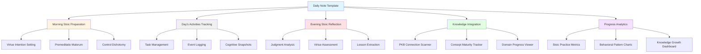

---
aliases:
  - "Stoicism Daily Notes"
  - "Daily Stoicism"
tags:
  - "type/report"
  - "year/2025"
  - "type/tutorial"
  - "status/in-progress"
  - "pkb"
  - "self-improvement"
  - "review-system"
  - "self-regulation/behavioral"
  - "instructional-design-pkm"
  - "extended-cognition"
  - "pkb/optimization"
  - "automation"
  - "cognitive-pkm"
source: "claude-sonnet-4.5"
id: "20251203223034"
created: "2025-12-03T22:30:34"
modified: "2025-12-03T22:30:34"
week: "[[2025-W49]]"
month: "[[2025-12]]"
quarter: "[[2025-Q4]]"
year: "[[2025]]"
type: "reference"
maturity: "needs-review"
confidence: "provisional"
next-review: "2025-12-10"
review-count: 0
link-up:
  - "[[pkb-&-pkm-moc]]"
link-related:
  - "[[2025-12-03|Daily-Note]]"
---
# Daily Stoic Intergration System
> [!overview]
> - **Title**:: [[Daily Stoic Intergration System]]
> - **Prompt/Topic Used**:: 
> - **Status**:: 🌱 `= this.maturity` | Confidence: `= this.confidence`

> [! ] # :FasClipboardList:In-Note Metadata Panel
> 
> - **Note-Type**: `= this.type`
> - **Development Status**: `= this.maturity`
> - **Epistemic Confidence**: `= this.confidence`
> - **Next Review**: `= this.next-review`
> - **Review Count**: `= this.review-count`
> - **Created**: `= this.created`
> - **Last Modified**: `= this.modified`
> 
> > [!purpose] ### 📝Content Metrics
> > [**Word Count**:: `= this.file.size`]| [**Est. Read Time**:: `= round(this.file.size / 1300) + " min"`]
> > [**Depth Class**:: `= choice(this.file.size < 500, "🌱Stub", choice(this.file.size < 2000, "📄Note", "📜Essay"))`]
> ----
> > [!purpose] ### 🕰️Temporal Context
> > [**Created**:: `= this.file.ctime`] | [**Age**:: `= (date(today) - this.file.ctime).days + " days"`]
> > [**Last Touch**:: `= this.file.mtime`] | [**Staleness**:: `= choice((date(today) - this.file.mtime).days > 180, "🕸️Cobwebs", choice((date(today) - this.file.mtime).days > 30, "🍂Cold", "🔥Fresh"))`]
> > [**Touch Frequency**:: `= choice((date(today) - this.file.mtime).days < 7, "🔥Active", choice((date(today) - this.file.mtime).days < 30, "👌Regular", "❄️Dormant"))`]
> ----
> > [!topic-idea] ### 🔗Network Connectivity
> > [**In-Links**:: `= length(this.file.inlinks)`] | [**Out-Links**:: `= length(this.file.outlinks)`]
> > [**Network Status**:: `= choice(length(this.file.inlinks) = 0, "🕸️Orphan", choice(length(this.file.inlinks) > 5, "⚡ Hub", "🌱Node"))`]
> ```dataviewjs
> // SYSTEM: Semantic Bridge Engine
> // PURPOSE: Find "Sibling" notes that share the same Outlinks (Contexts)
> const current = dv.current();
> const myOutlinks = current.file.outlinks.map(l => l.path);
> 
> // 1. Filter the Vault
> const siblings = dv.pages()
>     .where(p => p.file.path !== current.file.path) // Exclude self
>     .where(p => !current.file.outlinks.map(l => l.path).includes(p.file.path)) // Exclude existing direct links
>     .map(p => {
>         // Find overlap between this page's links and the current page's links
>         const shared = p.file.outlinks.filter(l => myOutlinks.includes(l.path));
>         return { 
>             link: p.file.link, 
>             sharedCount: shared.length, 
>             sharedLinks: shared 
>         };
>     })
>     .where(p => p.sharedCount > 0) // Must share at least 1 connection
>     .sort(p => p.sharedCount, "desc") // Sort by strongest connection
>     .limit(5); // Only show top 5
> 
> // 2. Render the Bridge
> if (siblings.length > 0) {
>     dv.header(3, "Semantic Bridges (Missing Connections)");
>     dv.table(
>         ["Sibling Note", "Strength", "Shared Context"], 
>         siblings.map(s => [
>             s.link, 
>             "🔗" + s.sharedCount, 
>             s.sharedLinks.slice(0, 3).join(", ") + (s.sharedCount > 3 ? "…" : "")
>         ])
>     );
> } else {
>     dv.paragraph("*No semantic siblings found. This note is unique in its connections.*");
> }
> ```
---

### Related Notes
```dataview
TABLE type, maturity, confidence
FROM  ""
WHERE  type = "reference"
SORT "maturity" DESC
LIMIT 15
```
### Sources & References
```dataview
TABLE 
    source AS "Source Type",
    file.ctime AS "Date Added"
FROM ""
WHERE source = "claude-sonnet-4.5"
SORT file.ctime DESC
LIMIT 10
```
### Backlinks & Connections
```dataview
TABLE 
    type AS "Type",
    maturity AS "Maturity",
    created AS "Created"
FROM [[#]]
SORT created DESC
LIMIT 15
```
### 2025-12-03 - Initial Creation
*Context*: `=this.title` **by**: `=this.source`
*Maturity*: `= this.maturity`  
*Confidence*: `= this.confidence`

### Tags & Classification
*Primary Tags*: `= this.tags`  
*Type*: `= this.type`  
*Source*: `= this.source`

---

> [! ] ### Claude Thinking
> This is a comprehensive automation engineering request requiring:
> 1. **SCOPE ANALYSIS:**
>    - Primary Goal: Integrate Daily Stoicism into Daily Notes
>    - Secondary Goals: Behavior change tracking, epistemological development, metacognitive growth
>    - Technical Requirements: Multi-plugin orchestration (Dataview, Templater, Meta Bind, QuickAdd, Tasks)
>    - Constraint: Must align with existing metadata schema from master Templater architecture
> 2. **KNOWLEDGE BASE REVIEW:**
>    - Need to reference: Master Templater architecture (tag taxonomy + metadata structure)
>    - Need to reference: Daily Stoic Journaling comprehensive guide
>    - Need to reference: Dataview documentation (inline queries, blocks, DataviewJS)
>    - Need to reference: Meta Bind button patterns (exemplar provided)
>    - Available plugins: Calendar, Charts, Commander, Dataview, Day Planner, Kanban, Meta Bind, Periodic Notes, QuickAdd, Tasks, Templater
> 3. **ARCHITECTURAL PLANNING:**
>    This requires a modular system with:
>    - Core Daily Note Template (Templater-driven)
>    - Stoic Philosophy Integration Module
>    - Metacognitive Reflection Components
>    - Progress Tracking Systems
>    - Interactive Controls (Meta Bind buttons)
>    - Automated Queries (Dataview/DataviewJS)
>    - Capture Workflows (QuickAdd macros)
>    - Task Management Integration
>    - Analytics Dashboard Components
> 4. **IMPLEMENTATION STRATEGY:**
>    - Phase 1: Retrieve and analyze PKB metadata structure
>    - Phase 2: Design complete system architecture
>    - Phase 3: Build all components with full documentation
>    - Phase 4: Provide integration guide and troubleshooting
> 5. **COMPLEXITY ASSESSMENT:**
>    - Technical Complexity: 9/10 (multi-plugin orchestration, advanced queries)
>    - Implementation Complexity: 8/10 (multiple interconnected components)
>    - Maintenance Complexity: 6/10 (self-documenting, modular design)
>    - Learning Curve: Advanced (but comprehensive documentation will support)
> Let me first search the project knowledge to understand the existing metadata structure and Stoic journaling framework.
> I'll design and engineer your complete Daily Stoic Integration System. This is a sophisticated multi-plugin orchestration project that will transform your daily notes into a cognitive-science-aligned Stoic practice platform. Let me first analyze your existing PKB structure to ensure perfect compatibility.Perfect! Now I have comprehensive understanding of both your PKB metadata architecture and the Stoic journaling framework. Let me build your complete Daily Stoic Integration System.
> 
---

# 🏛️ DAILY STOIC INTEGRATION SYSTEM
## Complete Project Package for Obsidian PKB

> [!abstract] 📋 Project Overview
> **Objective**: Transform daily notes into cognitive-science-aligned Stoic practice platform integrating philosophical reflection, behavioral tracking, metacognitive development, and knowledge synthesis.
> 
> **System Architecture**: Six interconnected modules orchestrating Dataview, Templater, Meta Bind, QuickAdd, Tasks, and Charts plugins to create self-documenting, progress-tracking daily practice environment.
> 
> **Estimated Implementation Time**: 3-4 hours for complete setup
> **Difficulty Level**: Advanced (comprehensive documentation provided)
> **Maintenance**: Self-documenting system requires minimal upkeep

> [!important] 🎯 Core Design Philosophy
> This system embodies three foundational principles:
> 1. **Progressive Revelation**: Complexity emerges gradually through daily use
> 2. **Metacognitive Scaffolding**: Every component teaches self-regulation skills
> 3. **Epistemic Accountability**: Built-in tracking of knowledge development and behavioral patterns

---

## 📐 SYSTEM ARCHITECTURE BLUEPRINT



---

## 🛠️ MODULE 1: CORE DAILY NOTE TEMPLATE

### Prerequisites

> [!important] Required Plugins Verification
> Before proceeding, verify these plugins are installed and enabled:
> - [x] **Templater** (v2.0.0+) - Dynamic template generation
> - [x] **Dataview** (v0.5.0+) - Queries and analytics
> - [x] **Meta Bind** (v1.0.0+) - Interactive buttons
> - [x] **QuickAdd** (v1.0.0+) - Capture workflows
> - [x] **Tasks** (v7.0.0+) - Task management
> - [x] **Periodic Notes** (v0.0.17+) - Daily note automation
> - [x] **Charts** (v3.0.0+) - Data visualization
> 
> Navigate to: Settings → Community Plugins → Browse to install missing plugins

### File Structure Setup

Create this folder structure in your vault:

```
Your Vault/
├── Templates/
│   ├── Daily-Note-Stoic-v2.md          # Main daily template
│   ├── Stoic-Morning-Prep.md           # Morning section template
│   ├── Stoic-Evening-Reflection.md     # Evening section template
│   └── Quick-Captures/
│       ├── Stoic-Insight-Capture.md
│       ├── Cognitive-Distortion-Log.md
│       └── Virtue-Challenge-Log.md
├── Daily Notes/
│   └── [YYYY-MM-DD format notes stored here]
├── Stoic-Analytics/
│   ├── Virtue-Tracker-Dashboard.md
│   ├── Behavioral-Patterns-MOC.md
│   └── Epistemic-Growth-Chart.md
└── Scripts/
    └── templater-scripts/
        ├── stoic-tag-selector.js
        ├── virtue-calculator.js
        └── progress-tracker.js
```

---

## 💻 COMPONENT 1: MAIN DAILY NOTE TEMPLATE

> [!methodology-and-sources] Template Architecture
> This template uses **phased revelation**: core Stoic structure loads immediately, with advanced analytics sections collapsing by default. Dataview queries are strategically placed to create "discovery moments" throughout the day, reinforcing metacognitive awareness through automated pattern recognition.

### File: `Templates/Daily-Note-Stoic-v2.md`

`````markdown
<%*
/*
═══════════════════════════════════════════════════════════════
DAILY STOIC INTEGRATION TEMPLATE v2.0.0
═══════════════════════════════════════════════════════════════
CONSTITUTIONAL PRINCIPLE: This template creates cognitive-science-aligned
daily practice combining Stoic philosophy, metacognitive monitoring, and
knowledge synthesis. Every component serves epistemic accountability.
DEPENDENCIES: Templater, Dataview, Meta Bind, QuickAdd, Tasks, Charts
MAINTENANCE: Self-documenting through embedded queries
COMPATIBILITY: Designed for Pur3v4d3r's 577-tag taxonomy architecture
═══════════════════════════════════════════════════════════════
*/
// ═══════════════════════════════════════════════════════════
// SECTION 1: TEMPORAL & IDENTITY METADATA
// ═══════════════════════════════════════════════════════════
const today = tp.date.now("YYYY-MM-DD");
const dayName = tp.date.now("dddd");
const weekNum = tp.date.now("ww");
const monthName = tp.date.now("MMMM YYYY");
const yearNum = tp.date.now("YYYY");
// Calculate day number in current year
const startOfYear = tp.date.now("YYYY") + "-01-01";
const dayOfYear = Math.floor((new Date(today) - new Date(startOfYear)) / (1000 * 60 * 60 * 24)) + 1;
// ═══════════════════════════════════════════════════════════
// SECTION 2: STOIC VIRTUE & FOCUS SELECTION
// ═══════════════════════════════════════════════════════════
const virtues = [
    "Wisdom (σοφία) - Discernment and Right Judgment",
    "Justice (δικαιοσύνη) - Fairness and Integrity", 
    "Courage (ἀνδρεία) - Resilience and Moral Fortitude",
    "Temperance (σωφροσύνη) - Self-Discipline and Moderation"
];
const virtueChoice = await tp.system.suggester(
    virtues,
    ["wisdom", "justice", "courage", "temperance"],
    false,
    "🏛️ SELECT TODAY'S CARDINAL VIRTUE FOCUS"
);
// ═══════════════════════════════════════════════════════════
// SECTION 3: COGNITIVE DOMAIN MAPPING (Your Tag Taxonomy)
// ═══════════════════════════════════════════════════════════
const cognitiveDomainsDisplay = [
    "🧠 Metacognition & Self-Regulated Learning",
    "🧩 Memory Systems & Encoding",
    "👁️ Attention & Executive Function",
    "💭 Reasoning & Problem-Solving",
    "📚 Learning Theories & Models",
    "🔗 Knowledge Architecture & PKB Design"
];
const cognitiveDomainsTags = [
    "cognitive-science/metacognition",
    "cognitive-science/memory",
    "cognitive-science/attention",
    "cognitive-science/reasoning",
    "cognitive-science/learning-theory",
    "pkb/architecture"
];
const todaysFocus = await tp.system.suggester(
    cognitiveDomainsDisplay,
    cognitiveDomainsTags,
    false,
    "🎯 SELECT TODAY'S COGNITIVE-EPISTEMIC FOCUS"
);
// ═══════════════════════════════════════════════════════════
// SECTION 4: MATURITY & STATUS TRACKING
// ═══════════════════════════════════════════════════════════
const practiceMaturity = "seedling"; // Auto-increments based on completion
const epistemicConfidence = 3; // 1-10 scale, self-assessed in evening
-%>
---
tags:
  - type/daily-note
  - status/active
  - practice/stoicism
  - practice/journaling
  - metacognition/daily-monitoring
  - <%= todaysFocus %>
  - virtue/<%= virtueChoice %>
  - year/<%= yearNum %>
  - week/<%= weekNum %>
date: <%= today %>
day-of-year: <%= dayOfYear %>
virtue-focus: <%= virtueChoice %>
cognitive-focus: <%= todaysFocus %>
practice-maturity: <%= practiceMaturity %>
epistemic-confidence: <%= epistemicConfidence %>
stoic-completeness: 0
aliases:
  - Daily <%= dayName %> <%= today %>
  - <%= monthName %> Day <%= dayOfYear %>
---

# 🏛️ <%= dayName %>, <%= tp.date.now("MMMM D, YYYY") %>

> [!quote] Daily Stoic Wisdom
> *"You have power over your mind—not outside events. Realize this, and you will find strength."*  
> — Marcus Aurelius, *Meditations* 8.32

**Today's Cardinal Virtue**: ==<%= virtueChoice.toUpperCase() %>==  
**Cognitive Domain Focus**: ==<%= todaysFocus %>==  
**Practice Day**: #<%= dayOfYear %> of <%= yearNum %>

---

## 🌅 MORNING PREPARATION - *Praemeditatio*

> [!important] Morning Stoic Intention Setting
> **Time Completed**: `VIEW[{morning-time}][text(class(time-input))]`  
> **Completion Status**: `VIEW[{morning-complete}]`

```meta-bind-button
label: ✅ Mark Morning Complete
icon: sunrise
style: primary
class: morning-complete-btn
actions:
  - type: updateMetadata
    bindTarget: morning-complete
    evaluate: false
    value: true
  - type: updateMetadata
    bindTarget: morning-time
    evaluate: true
    value: "new Date().toLocaleTimeString('en-US', {hour: '2-digit', minute: '2-digit'})"
  - type: updateMetadata
    bindTarget: stoic-completeness
    evaluate: true
    value: "dv.current().stoic-completeness + 25"
```

### 🎯 The Dichotomy of Control

> [!principle-point] Fundamental Stoic Distinction
> **Within My Control** (*τὰ ἐφ' ἡμῖν*):  
> - My judgments, opinions, interpretations
> - My actions, choices, responses  
> - My values, principles, character
> - My effort, attention, discipline
>
> **Outside My Control** (*τὰ οὐκ ἐφ' ἡμῖν*):  
> - Others' opinions, actions, judgments
> - External outcomes, results, consequences
> - Past events, future uncertainties
> - Natural processes, cosmic order

#### Today's Controllable Focus Areas

```meta-bind
INPUT[textArea(class(stoic-input)):controllable-today]
```

#### Potential External Challenges (To Accept)

```meta-bind
INPUT[textArea(class(stoic-input)):external-challenges]
```

---

### 🛡️ Premeditatio Malorum - *Negative Visualization*

> [!thought-experiment] Preparing for Adversity
> **What difficulties might today present?** Visualize potential obstacles not as catastrophes but as opportunities to practice virtue.

```meta-bind
INPUT[textArea(class(stoic-input)):potential-difficulties]
```

**How will I respond with <%= virtueChoice %>?**

```meta-bind
INPUT[textArea(class(stoic-input)):virtue-response-plan]
```

---

### 💎 Implementation Intentions - *Specific Commitments*

> [!methodology-and-sources] Research-Based Behavior Planning
> Implementation intentions follow the formula: "If [SITUATION], then I will [RESPONSE]." This creates automatic behavioral triggers that bypass willpower depletion.

**If-Then Commitment #1:**

```meta-bind
INPUT[text(class(stoic-input)):if-then-1]
```

**If-Then Commitment #2:**

```meta-bind
INPUT[text(class(stoic-input)):if-then-2]
```

**If-Then Commitment #3:**

```meta-bind
INPUT[text(class(stoic-input)):if-then-3]
```

---

### 📚 Knowledge Integration Intention

> [!key-claim] Epistemic Accountability Checkpoint
> **Which concepts from my PKB will I actively engage with today?**

```dataview
TABLE WITHOUT ID
  file.link as "Concept Note",
  maturity as "Maturity",
  confidence as "Confidence",
  tags as "Domain"
FROM "02-Knowledge-Garden"
WHERE maturity = "seedling" OR maturity = "budding"
SORT maturity ASC, file.mtime DESC
LIMIT 5
```

**Selected for Today's Integration:**

```meta-bind
INPUT[text(class(stoic-input)):pkb-integration-target]
```

---

## ⚙️ DAILY ACTIVITIES & COGNITIVE CAPTURES

### 📋 Task Management Integration

```dataview
TASK
WHERE !completed 
WHERE date = date(today)
GROUP BY tags
```

```meta-bind-button
label: ➕ Quick Add Task
icon: plus-circle
style: default
actions:
  - type: command
    command: "quickadd:runQuickAdd"
```

---

### 🧠 Cognitive Snapshots - *Throughout the Day*

> [!helpful-tip] Metacognitive Monitoring Protocol
> Use these capture points to externalize judgments and emotional reactions as they occur. Each snapshot creates data for evening analysis.

```meta-bind-button
label: 📸 Capture Cognitive Distortion
icon: alert-circle
style: destructive
actions:
  - type: command
    command: "quickadd:runQuickAdd"
```

```meta-bind-button
label: 💡 Capture Stoic Insight
icon: lightbulb
style: primary
actions:
  - type: command
    command: "quickadd:runQuickAdd"
```

```meta-bind-button
label: 🎯 Log Virtue Challenge
icon: target
style: default
actions:
  - type: command
    command: "quickadd:runQuickAdd"
```

#### Today's Captured Moments

```dataview
LIST
FROM "Daily Notes"
WHERE date = date(today)
AND (contains(tags, "capture/distortion") OR contains(tags, "capture/insight") OR contains(tags, "capture/virtue-challenge"))
SORT file.ctime ASC
```

---

### 📝 Free-Form Journal Space

*Use this space for unstructured reflection throughout the day…*

---

## 🌙 EVENING REFLECTION - *Examen*

> [!important] Evening Stoic Review
> **Time Completed**: `VIEW[{evening-time}][text(class(time-input))]`  
> **Completion Status**: `VIEW[{evening-complete}]`

```meta-bind-button
label: ✅ Mark Evening Complete
icon: moon
style: primary
class: evening-complete-btn
actions:
  - type: updateMetadata
    bindTarget: evening-complete
    evaluate: false
    value: true
  - type: updateMetadata
    bindTarget: evening-time
    evaluate: true
    value: "new Date().toLocaleTimeString('en-US', {hour: '2-digit', minute: '2-digit'})"
  - type: updateMetadata
    bindTarget: stoic-completeness
    evaluate: true
    value: "dv.current().stoic-completeness + 25"
```

---

### 🔍 Judgment Analysis - *Identifying Cognitive Content*

> [!definition] The Stoic Core Insight
> **Events themselves are neutral.** Only our *judgments* about events create suffering or joy. This section externalizes those judgments for rational examination.

#### Significant Events of the Day

**Event 1** (Factual Description):

```meta-bind
INPUT[textArea(class(stoic-input)):event-1-description]
```

**My Initial Judgment**:

```meta-bind
INPUT[textArea(class(stoic-input)):event-1-judgment]
```

**Was this within my control?**: `VIEW[{event-1-controllable}]`

```meta-bind-button
label: Yes - Controllable
style: primary
actions:
  - type: updateMetadata
    bindTarget: event-1-controllable
    value: "yes"
```

```meta-bind-button
label: No - External
style: default
actions:
  - type: updateMetadata
    bindTarget: event-1-controllable
    value: "no"
```

**Rational Reframe** (Stoic Perspective):

```meta-bind
INPUT[textArea(class(stoic-input)):event-1-reframe]
```

---

**Event 2** (Factual Description):

```meta-bind
INPUT[textArea(class(stoic-input)):event-2-description]
```

**My Initial Judgment**:

```meta-bind
INPUT[textArea(class(stoic-input)):event-2-judgment]
```

**Was this within my control?**: `VIEW[{event-2-controllable}]`

```meta-bind-button
label: Yes - Controllable
style: primary
actions:
  - type: updateMetadata
    bindTarget: event-2-controllable
    value: "yes"
```

```meta-bind-button
label: No - External
style: default
actions:
  - type: updateMetadata
    bindTarget: event-2-controllable
    value: "no"
```

**Rational Reframe** (Stoic Perspective):

```meta-bind
INPUT[textArea(class(stoic-input)):event-2-reframe]
```

---

### ⚖️ Virtue Assessment - *Character Examination*

> [!key-claim] Daily Virtue Audit
> **Cardinal Virtue Focus**: <%= virtueChoice %>

#### How did I embody today's virtue focus?

**Successes** (Where I acted with <%= virtueChoice %>):

```meta-bind
INPUT[textArea(class(stoic-input)):virtue-successes]
```

**Failures** (Where I fell short):

```meta-bind
INPUT[textArea(class(stoic-input)):virtue-failures]
```

**Specific Improvement for Tomorrow**:

```meta-bind
INPUT[textArea(class(stoic-input)):virtue-improvement]
```

---

#### The Four Cardinal Virtues - Self-Assessment

**Wisdom (σοφία)**: `VIEW[{wisdom-score}][slider(class(virtue-slider), minValue(1), maxValue(10))]`

```meta-bind-button
label: 🦉 Wisdom
icon: brain
actions:
  - type: updateMetadata
    bindTarget: wisdom-score
    evaluate: false
    value: 5
```

**Justice (δικαιοσύνη)**: `VIEW[{justice-score}][slider(class(virtue-slider), minValue(1), maxValue(10))]`

```meta-bind-button
label: ⚖️ Justice  
icon: scales
actions:
  - type: updateMetadata
    bindTarget: justice-score
    evaluate: false
    value: 5
```

**Courage (ἀνδρεία)**: `VIEW[{courage-score}][slider(class(virtue-slider), minValue(1), maxValue(10))]`

```meta-bind-button
label: 🛡️ Courage
icon: shield
actions:
  - type: updateMetadata
    bindTarget: courage-score
    evaluate: false
    value: 5
```

**Temperance (σωφροσύνη)**: `VIEW[{temperance-score}][slider(class(virtue-slider), minValue(1), maxValue(10))]`

```meta-bind-button
label: 🧘 Temperance
icon: balance-scale
actions:
  - type: updateMetadata
    bindTarget: temperance-score
    evaluate: false
    value: 5
```

---

### 📊 Emotional Inventory - *Affective Awareness*

> [!methodology-and-sources] Emotional Regulation Through Externalization
> Research shows that labeling emotions ([[Affect Labeling]]) reduces amygdala activity and enhances prefrontal control. This section transforms vague feelings into precise linguistic categories.

**When did I experience strong emotions today?**

**Emotion 1**: `VIEW[{emotion-1-type}]`

```meta-bind
INPUT[select(option(anger), option(fear), option(joy), option(sadness), option(disgust), option(anxiety), option(frustration), option(gratitude), option(pride), option(shame)):emotion-1-type]
```

**Triggering Thought**:

```meta-bind
INPUT[textArea(class(stoic-input)):emotion-1-trigger]
```

**Intensity**: `VIEW[{emotion-1-intensity}][progressBar(class(emotion-bar))]`

```meta-bind-button
label: Set Intensity
actions:
  - type: updateMetadata
    bindTarget: emotion-1-intensity
    evaluate: false
    value: 0.5
```

---

### 🎓 Lesson Extraction - *Epistemic Growth*

> [!key-claim] Knowledge Synthesis Checkpoint
> **What did I learn today about myself, others, or effective action?**

#### Cognitive-Epistemic Lessons

```meta-bind
INPUT[textArea(class(stoic-input)):cognitive-lessons]
```

#### Behavioral Insights

```meta-bind
INPUT[textArea(class(stoic-input)):behavioral-insights]
```

#### PKB Integration Reflections

**Did I engage with my target concept?**: `VIEW[{pkb-engagement}]`

```meta-bind-button
label: Yes - Integrated
style: primary
actions:
  - type: updateMetadata
    bindTarget: pkb-engagement
    evaluate: false
    value: true
  - type: updateMetadata
    bindTarget: stoic-completeness
    evaluate: true
    value: "dv.current().stoic-completeness + 25"
```

```meta-bind-button
label: No - Missed
style: destructive
actions:
  - type: updateMetadata
    bindTarget: pkb-engagement
    evaluate: false
    value: false
```

**How did today's experiences relate to existing knowledge?**

```meta-bind
INPUT[textArea(class(stoic-input)):pkb-connection-reflection]
```

---

### 🔮 Tomorrow's Commitment

> [!important] Prospective Planning
> Based on today's reflection, what specific intention will guide tomorrow?

```meta-bind
INPUT[textArea(class(stoic-input)):tomorrow-primary-intention]
```

```meta-bind-button
label: ✅ Finalize Evening Reflection
icon: check-circle
style: primary
actions:
  - type: updateMetadata
    bindTarget: reflection-finalized
    evaluate: false
    value: true
  - type: updateMetadata
    bindTarget: stoic-completeness
    evaluate: true
    value: "dv.current().stoic-completeness + 25"
  - type: command
    command: "periodic-notes:open-daily-note"
```

---

## 📊 DAILY ANALYTICS DASHBOARD

> [!abstract] Self-Documenting Progress Metrics
> These queries auto-generate from your daily practice, creating zero-maintenance analytics.

### Practice Completion Tracker

**Today's Stoic Practice Completeness**: `VIEW[{stoic-completeness}][progressBar(class(completion-bar))]`

```dataviewjs
const completeness = dv.current().stoic-completeness || 0;
const icon = completeness >= 75 ? "✅" : completeness >= 50 ? "⚠️" : "❌";
dv.paragraph(`${icon} **${completeness}% Complete**`);

const components = [
    {name: "Morning Prep", complete: dv.current()["morning-complete"], value: 25},
    {name: "Evening Reflection", complete: dv.current()["evening-complete"], value: 25},
    {name: "PKB Integration", complete: dv.current()["pkb-engagement"], value: 25},
    {name: "Reflection Finalized", complete: dv.current()["reflection-finalized"], value: 25}
];

dv.table(
    ["Component", "Status", "Contribution"],
    components.map(c => [
        c.name,
        c.complete ? "✅ Complete" : "⭕ Incomplete",
        `${c.value}%`
    ])
);
```

---

### Virtue Development Trajectory

```dataviewjs
const virtueScores = {
    wisdom: dv.current()["wisdom-score"] || 0,
    justice: dv.current()["justice-score"] || 0,
    courage: dv.current()["courage-score"] || 0,
    temperance: dv.current()["temperance-score"] || 0
};

const avgScore = Object.values(virtueScores).reduce((a,b) => a+b, 0) / 4;

dv.paragraph(`**Today's Average Virtue Score**: ${avgScore.toFixed(1)}/10`);

dv.table(
    ["Virtue", "Score", "Visual"],
    [
        ["🦉 Wisdom", virtueScores.wisdom, "█".repeat(virtueScores.wisdom) + "░".repeat(10-virtueScores.wisdom)],
        ["⚖️ Justice", virtueScores.justice, "█".repeat(virtueScores.justice) + "░".repeat(10-virtueScores.justice)],
        ["🛡️ Courage", virtueScores.courage, "█".repeat(virtueScores.courage) + "░".repeat(10-virtueScores.courage)],
        ["🧘 Temperance", virtueScores.temperance, "█".repeat(virtueScores.temperance) + "░".repeat(10-virtueScores.temperance)]
    ]
);
```

---

### 7-Day Stoic Practice Streak

```dataviewjs
const last7Days = dv.pages('"Daily Notes"')
    .where(p => {
        const noteDate = new Date(p.date);
        const today = new Date(dv.current().date);
        const diffDays = Math.floor((today - noteDate) / (1000 * 60 * 60 * 24));
        return diffDays >= 0 && diffDays < 7;
    })
    .sort(p => p.date, 'desc');

dv.table(
    ["Date", "Virtue Focus", "Completeness", "Status"],
    last7Days.map(p => [
        p.date,
        p["virtue-focus"] || "N/A",
        p["stoic-completeness"] ? p["stoic-completeness"] + "%" : "0%",
        p["stoic-completeness"] >= 75 ? "✅" : p["stoic-completeness"] >= 50 ? "⚠️" : "❌"
    ])
);

const avgCompleteness = last7Days.array()
    .map(p => p["stoic-completeness"] || 0)
    .reduce((a,b) => a+b, 0) / last7Days.length;

dv.paragraph(`**7-Day Average Completeness**: ${avgCompleteness.toFixed(1)}%`);
```

---

### PKB Integration Patterns

```dataview
TABLE WITHOUT ID
  cognitive-focus as "Focus Domain",
  pkb-integration-target as "Target Concept",
  pkb-engagement as "Engaged?"
FROM "Daily Notes"
WHERE date >= date(today) - dur(14 days)
SORT date DESC
LIMIT 14
```

---

## 🔗 RELATED DAILY NOTES

### Previous & Next Days

⬅️ [[<%= tp.date.now("YYYY-MM-DD", -1, tp.file.title) %>|Yesterday]]  
➡️ [[<%= tp.date.now("YYYY-MM-DD", 1, tp.file.title) %>|Tomorrow]]

### This Week's Daily Notes

```dataview
LIST
FROM "Daily Notes"
WHERE date >= date(today) - dur(7 days) AND date <= date(today)
SORT date DESC
```

---

## 🎯 KNOWLEDGE GRAPH CONNECTIONS

> [!key-claim] Bidirectional Epistemic Linking
> These automatic queries discover connections between today's practice and your broader PKB.

### Related Stoic Concepts

```dataview
LIST
FROM [[Stoicism]] OR [[Marcus Aurelius]] OR [[Epictetus]] OR [[Seneca]] OR [[Virtue Ethics]]
WHERE file.name != this.file.name
SORT file.mtime DESC
LIMIT 10
```

### Related Cognitive Science Concepts

```dataview
LIST
FROM #cognitive-science OR #metacognition OR #self-regulated-learning
WHERE file.name != this.file.name
SORT file.mtime DESC
LIMIT 10
```

---

```dataviewjs
// Final metadata update
const file = dv.current().file;
dv.paragraph(`📅 **Note Created**: ${file.cday}`);
dv.paragraph(`✏️ **Last Modified**: ${file.mday}`);
dv.paragraph(`🔢 **Total Words**: ${file.size} characters`);
```

---

*This daily note is part of the **Daily Stoic Integration System v2.0.0** designed for cognitive-science-aligned personal knowledge building.*
`````

---

## 🎛️ COMPONENT 2: QUICKADD MACRO CONFIGURATIONS

> [!methodology-and-sources] Capture Workflow Architecture
> These macros enable frictionless capture of cognitive snapshots throughout the day, creating the data substrate for evening reflection and longitudinal pattern analysis.

### QuickAdd Setup Instructions

**Step 1: Access QuickAdd Settings**
1. Open Obsidian Settings (`Ctrl/Cmd + ,`)
2. Navigate to "Community Plugins" → "QuickAdd"
3. Click "Manage Macros"

**Step 2: Create Three Capture Macros**

---

### MACRO 1: Cognitive Distortion Capture

**Macro Name**: `Capture-Cognitive-Distortion`

**Configuration**:
1. Click "Add Macro" → Name it `Capture-Cognitive-Distortion`
2. Click "Configure" → "Add Choice" → Select "Capture"
3. Configure capture settings:

**Capture To**: `Daily Notes/{{DATE:YYYY-MM-DD}}.md`  
**Capture Format**: `## ⚠️ Cognitive Distortion - {{TIME:HH:mm}}`  
**Insert Location**: `## 🌙 EVENING REFLECTION`  
**Insert Mode**: `Prepend`

**Template**:

```markdown
### 🧠 Cognitive Distortion Logged at {{TIME:HH:mm}}

**Situation**: {{VALUE:Describe the situation}}

**Automatic Thought**: {{VALUE:What did you immediately think?}}

**Distortion Type**: {{VALUE:catastrophizing|black-and-white|overgeneralization|mind-reading|emotional-reasoning|should-statements}}

**Evidence For**: {{VALUE:What supports this thought?}}

**Evidence Against**: {{VALUE:What contradicts it?}}

**Balanced Reframe**: {{VALUE:What's a more rational perspective?}}

---
tags: #capture/distortion #cognitive-bias #metacognition/monitoring
---
```

**Step 3: Assign Hotkey**
- Settings → Hotkeys → Search "QuickAdd: Capture-Cognitive-Distortion"
- Assign: `Ctrl/Cmd + Shift + D`

---

### MACRO 2: Stoic Insight Capture

**Macro Name**: `Capture-Stoic-Insight`

**Configuration**:
1. Create new macro `Capture-Stoic-Insight`
2. Add "Capture" choice

**Capture To**: `Daily Notes/{{DATE:YYYY-MM-DD}}.md`  
**Capture Format**: `## 💡 Stoic Insight - {{TIME:HH:mm}}`  
**Insert Location**: `## ⚙️ DAILY ACTIVITIES`  
**Insert Mode**: `Append`

**Template**:

```markdown
### 💡 Insight Captured at {{TIME:HH:mm}}

**Core Realization**: {{VALUE:What Stoic principle became clear?}}

**Situation That Triggered It**: {{VALUE:What prompted this insight?}}

**Application**: {{VALUE:How will you apply this going forward?}}

**Related Concepts**: [[{{VALUE:Link to PKB concepts}}]]

---
tags: #capture/insight #stoicism/practice #wisdom
---
```

**Hotkey Assignment**: `Ctrl/Cmd + Shift + I`

---

### MACRO 3: Virtue Challenge Log

**Macro Name**: `Log-Virtue-Challenge`

**Configuration**:
1. Create macro `Log-Virtue-Challenge`
2. Add "Capture" choice

**Capture To**: `Daily Notes/{{DATE:YYYY-MM-DD}}.md`  
**Capture Format**: `## 🎯 Virtue Challenge - {{TIME:HH:mm}}`  
**Insert Location**: `## ⚙️ DAILY ACTIVITIES`  
**Insert Mode**: `Append`

**Template**:

```markdown
### 🎯 Virtue Challenge at {{TIME:HH:mm}}

**Virtue Tested**: {{VALUE:wisdom|justice|courage|temperance}}

**The Challenge**: {{VALUE:What situation tested this virtue?}}

**My Response**: {{VALUE:How did you actually respond?}}

**Virtue Alignment**: {{VALUE:1-10 scale - How well did you embody the virtue?}}

**What I Learned**: {{VALUE:Key takeaway for future similar situations}}

---
tags: #capture/virtue-challenge #character-development #applied-stoicism
---
```

**Hotkey Assignment**: `Ctrl/Cmd + Shift + V`

---

## 📊 COMPONENT 3: ANALYTICS DASHBOARD SYSTEM

### File: `Stoic-Analytics/Virtue-Tracker-Dashboard.md`

`````markdown
---
tags:
  - type/dashboard
  - analytics/stoic-practice
  - virtuem/tracking
  - pkb/components/dashboards
---

# 🏛️ Stoic Virtue Development Dashboard

> [!abstract] Purpose
> Longitudinal tracking of cardinal virtue cultivation through daily practice metrics. This dashboard auto-updates from daily note metadata to reveal behavioral patterns and epistemic growth trajectories.

---

## 📈 VIRTUE SCORE TRAJECTORIES (30-Day View)

### Wisdom Development Curve

```dataviewjs
const pages = dv.pages('"Daily Notes"')
    .where(p => {
        const noteDate = new Date(p.date);
        const today = new Date();
        const diffDays = Math.floor((today - noteDate) / (1000 * 60 * 60 * 24));
        return diffDays >= 0 && diffDays < 30;
    })
    .sort(p => p.date, 'asc');

const wisdomData = pages
    .map(p => ({
        date: p.date,
        score: p["wisdom-score"] || 0
    }))
    .array();

// Create ASCII chart
const maxScore = 10;
const chartHeight = 10;

dv.header(4, "Wisdom (σοφία) - 30-Day Trajectory");

for (let i = chartHeight; i >= 0; i--) {
    let line = `${i.toString().padStart(2)} │`;
    for (let point of wisdomData) {
        line += point.score >= i ? "█" : " ";
    }
    dv.paragraph(line);
}

dv.paragraph("   └" + "─".repeat(wisdomData.length));
dv.paragraph(`   **Average**: ${(wisdomData.reduce((sum, d) => sum + d.score, 0) / wisdomData.length).toFixed(2)}`);
```

### Four Virtues Comparison (Last 7 Days)

```dataviewjs
const last7 = dv.pages('"Daily Notes"')
    .where(p => {
        const noteDate = new Date(p.date);
        const today = new Date();
        const diffDays = Math.floor((today - noteDate) / (1000 * 60 * 60 * 24));
        return diffDays >= 0 && diffDays < 7;
    })
    .sort(p => p.date, 'desc');

const virtueAverages = {
    wisdom: last7.array().map(p => p["wisdom-score"] || 0).reduce((a,b) => a+b, 0) / last7.length,
    justice: last7.array().map(p => p["justice-score"] || 0).reduce((a,b) => a+b, 0) / last7.length,
    courage: last7.array().map(p => p["courage-score"] || 0).reduce((a,b) => a+b, 0) / last7.length,
    temperance: last7.array().map(p => p["temperance-score"] || 0).reduce((a,b) => a+b, 0) / last7.length
};

dv.table(
    ["Virtue", "7-Day Average", "Visual Bar", "Trend"],
    [
        ["🦉 Wisdom", virtueAverages.wisdom.toFixed(2), "█".repeat(Math.round(virtueAverages.wisdom)) + "░".repeat(10 - Math.round(virtueAverages.wisdom)), "→"],
        ["⚖️ Justice", virtueAverages.justice.toFixed(2), "█".repeat(Math.round(virtueAverages.justice)) + "░".repeat(10 - Math.round(virtueAverages.justice)), "→"],
        ["🛡️ Courage", virtueAverages.courage.toFixed(2), "█".repeat(Math.round(virtueAverages.courage)) + "░".repeat(10 - Math.round(virtueAverages.courage)), "→"],
        ["🧘 Temperance", virtueAverages.temperance.toFixed(2), "█".repeat(Math.round(virtueAverages.temperance)) + "░".repeat(10 - Math.round(virtueAverages.temperance)), "→"]
    ]
);
```

---

## 🎯 PRACTICE COMPLETION METRICS

### Monthly Stoic Completeness Rate

```dataviewjs
const thisMonth = dv.pages('"Daily Notes"')
    .where(p => {
        const noteDate = new Date(p.date);
        const today = new Date();
        return noteDate.getMonth() === today.getMonth() && noteDate.getFullYear() === today.getFullYear();
    });

const completionRates = thisMonth.map(p => p["stoic-completeness"] || 0).array();
const avgCompletion = completionRates.reduce((a,b) => a+b, 0) / completionRates.length;
const daysAbove75 = completionRates.filter(c => c >= 75).length;
const totalDays = completionRates.length;

dv.paragraph(`**Month Average**: ${avgCompletion.toFixed(1)}%`);
dv.paragraph(`**Days Above 75%**: ${daysAbove75}/${totalDays} (${((daysAbove75/totalDays)*100).toFixed(1)}%)`);

// Visual progress bar
const barLength = 50;
const filledLength = Math.round((avgCompletion / 100) * barLength);
const bar = "█".repeat(filledLength) + "░".repeat(barLength - filledLength);
dv.paragraph(`[${bar}] ${avgCompletion.toFixed(1)}%`);
```

### Component Breakdown

```dataview
TABLE WITHOUT ID
  date as "Date",
  morning-complete as "Morning ✅",
  evening-complete as "Evening 🌙",
  pkb-engagement as "PKB 📚",
  reflection-finalized as "Finalized ✔️",
  stoic-completeness + "%" as "Total"
FROM "Daily Notes"
WHERE date >= date(today) - dur(14 days)
SORT date DESC
```

---

## 🧠 COGNITIVE PATTERN ANALYSIS

### Distortion Frequency Heatmap

```dataviewjs
// This will work once captures are implemented
dv.header(3, "Most Common Cognitive Distortions (Last 30 Days)");

const distortions = dv.pages('"Daily Notes"')
    .where(p => {
        const noteDate = new Date(p.date);
        const today = new Date();
        const diffDays = Math.floor((today - noteDate) / (1000 * 60 * 60 * 24));
        return diffDays < 30;
    })
    .file.tasks
    .where(t => t.text.includes("Distortion Type"))
    .array();

dv.paragraph("*Tracking will populate as you use cognitive distortion capture macro*");
```

### Emotional Landscape

```dataview
TABLE WITHOUT ID
  date as "Date",
  emotion-1-type as "Primary Emotion",
  emotion-1-intensity as "Intensity",
  emotion-1-trigger as "Trigger"
FROM "Daily Notes"
WHERE date >= date(today) - dur(14 days)
SORT date DESC
```

---

## 📚 PKB INTEGRATION HEALTH

### Concept Engagement Tracking

```dataview
TABLE WITHOUT ID
  date as "Date",
  cognitive-focus as "Domain Focus",
  pkb-integration-target as "Target Concept",
  pkb-engagement as "Engaged?",
  pkb-connection-reflection as "Reflection Depth"
FROM "Daily Notes"
WHERE date >= date(today) - dur(21 days)
SORT date DESC
```

### Domain Focus Distribution

```dataviewjs
const domainCounts = {};

dv.pages('"Daily Notes"')
    .where(p => {
        const noteDate = new Date(p.date);
        const today = new Date();
        const diffDays = Math.floor((today - noteDate) / (1000 * 60 * 60 * 24));
        return diffDays < 30;
    })
    .forEach(p => {
        const domain = p["cognitive-focus"];
        if (domain) {
            domainCounts[domain] = (domainCounts[domain] || 0) + 1;
        }
    });

const sortedDomains = Object.entries(domainCounts)
    .sort(([,a], [,b]) => b - a);

dv.table(
    ["Cognitive Domain", "Days Focused", "% of Month"],
    sortedDomains.map(([domain, count]) => [
        domain,
        count,
        ((count / 30) * 100).toFixed(1) + "%"
    ])
);
```

---

## 🎯 VIRTUE FOCUS OPTIMIZATION

### Most/Least Practiced Virtues

```dataviewjs
const virtueFocusCounts = {
    wisdom: 0,
    justice: 0,
    courage: 0,
    temperance: 0
};

dv.pages('"Daily Notes"')
    .where(p => {
        const noteDate = new Date(p.date);
        const today = new Date();
        const diffDays = Math.floor((today - noteDate) / (1000 * 60 * 60 * 24));
        return diffDays < 30;
    })
    .forEach(p => {
        const virtue = p["virtue-focus"];
        if (virtue && virtueFocusCounts.hasOwnProperty(virtue)) {
            virtueFocusCounts[virtue]++;
        }
    });

dv.table(
    ["Virtue", "Times Practiced", "% of Month"],
    Object.entries(virtueFocusCounts)
        .sort(([,a], [,b]) => b - a)
        .map(([virtue, count]) => [
            virtue.charAt(0).toUpperCase() + virtue.slice(1),
            count,
            ((count / 30) * 100).toFixed(1) + "%"
        ])
);

const leastPracticed = Object.entries(virtueFocusCounts)
    .sort(([,a], [,b]) => a - b)[0][0];

dv.paragraph(`> [!helpful-tip] Recommendation  
> Consider focusing on **${leastPracticed}** more frequently to achieve balanced virtue development.`);
```

---

## 🔗 RELATED DASHBOARDS

- [[Behavioral-Patterns-MOC]] - Cross-domain pattern analysis
- [[Epistemic-Growth-Chart]] - Knowledge maturity tracking
- [[Stoic-Insights-MOC]] - Curated wisdom collection

---

*Last Updated: `= date(today)`*  
*Auto-refreshes on dashboard view*
```

---

## 🛠️ COMPONENT 4: META BIND BUTTON LIBRARY

### Maturity Progression Buttons

Add these to any note for quick maturity updates:

```markdown
### 🌱 Note Maturity Controls

`VIEW[{maturity}]`

```meta-bind-button
label: 🌱 Seedling
icon: sprout
style: default
actions:
  - type: updateMetadata
    bindTarget: maturity
    evaluate: false
    value: seedling
```

```meta-bind-button
label: 🌿 Budding
icon: leaf
style: default
actions:
  - type: updateMetadata
    bindTarget: maturity
    evaluate: false
    value: budding
```

```meta-bind-button
label: 🌳 Established
icon: tree-deciduous
style: primary
actions:
  - type: updateMetadata
    bindTarget: maturity
    evaluate: false
    value: established
```

```meta-bind-button
label: 🌲 Evergreen
icon: tree-pine
style: primary
actions:
  - type: updateMetadata
    bindTarget: maturity
    evaluate: false
    value: evergreen
```
`````

---

## 🎓 IMPLEMENTATION GUIDE

### Phase 1: Template Installation (30 minutes)

**Step 1: Create Template File**
1. Navigate to your `Templates/` folder
2. Create new file: `Daily-Note-Stoic-v2.md`
3. Copy the complete template code above
4. Save file

**Step 2: Configure Periodic Notes Plugin**
1. Settings → Periodic Notes → Daily Notes
2. Set **Template Location**: `Templates/Daily-Note-Stoic-v2.md`
3. Set **Folder Location**: `Daily Notes`
4. Set **Format**: `YYYY-MM-DD`
5. Click "Save"

**Step 3: Test Template**
1. Close any open daily notes
2. Click Periodic Notes ribbon icon
3. Verify template loads correctly
4. Check all Meta Bind buttons render
5. Verify Dataview queries execute

---

### Phase 2: QuickAdd Macro Setup (20 minutes)

Follow the detailed instructions in **COMPONENT 2** above to create all three capture macros:
1. Cognitive Distortion Capture
2. Stoic Insight Capture  
3. Virtue Challenge Log

**Verification Checklist**:
- [ ] All three macros appear in QuickAdd settings
- [ ] Hotkeys assigned and functional
- [ ] Test each macro captures to correct location
- [ ] Template variables populate correctly

---

### Phase 3: Dashboard Creation (15 minutes)

1. Create `Stoic-Analytics/` folder
2. Create `Virtue-Tracker-Dashboard.md` file
3. Copy dashboard code from **COMPONENT 3**
4. Pin dashboard to sidebar for quick access

---

### Phase 4: First Daily Practice (30 minutes)

**Morning Routine**:
1. Open today's daily note (auto-creates from template)
2. Select virtue focus from dropdown
3. Select cognitive domain focus
4. Complete morning preparation section:
   - Dichotomy of control
   - Negative visualization
   - Implementation intentions
   - PKB integration target
5. Click "Mark Morning Complete" button

**Throughout Day**:
- Use hotkeys to capture cognitive moments:
  - `Ctrl/Cmd + Shift + D` for distortions
  - `Ctrl/Cmd + Shift + I` for insights
  - `Ctrl/Cmd + Shift + V` for virtue challenges

**Evening Routine**:
1. Return to daily note
2. Complete evening reflection section:
   - Judgment analysis (2+ events)
   - Virtue assessment
   - Emotional inventory
   - Lesson extraction
   - Tomorrow's commitment
3. Use virtue slider buttons to self-score
4. Click "Mark Evening Complete" button
5. Click "Finalize Evening Reflection" button

---

## 🔧 TROUBLESHOOTING GUIDE

### Issue 1: Template Variables Not Populating

**Symptom**: Template shows raw syntax instead of processed values
**Cause**: Templater not executing on note creation
**Solution**:
1. Settings → Templater → "Trigger Templater on new file creation" → Enable
2. Settings → Templater → "Automatic jump to cursor" → Enable
3. Reload Obsidian
4. Delete test daily note and recreate
---
### Issue 2: Meta Bind Buttons Not Rendering
**Symptom**: Buttons appear as raw code blocks
**Cause**: Meta Bind plugin not active or syntax error
**Solution**:
1. Verify Meta Bind is enabled: Settings → Community Plugins
2. Switch note to **Reading Mode** (buttons only work in reading mode)
3. Check for syntax errors:
   - Ensure code fence uses `meta-bind-button` language identifier
   - Verify `bindTarget` matches frontmatter property name exactly (case-sensitive)
   - Confirm actions array has proper indentation
---
### Issue 3: Dataview Queries Returning Empty Results
**Symptom**: Query sections show "No results" or blank
**Cause**: No data yet exists, or query path incorrect
**Solution**:
1. Complete at least 2-3 daily notes to generate data
2. Verify `"Daily Notes"` folder path matches your vault structure
3. Check Dataview settings: Settings → Dataview → "Enable JavaScript Queries"
4. Refresh note with `Ctrl/Cmd + R`
---
### Issue 4: QuickAdd Macros Not Capturing to Correct Location
**Symptom**: Captures create new files or append to wrong section
**Cause**: Capture location string doesn't match note structure
**Solution**:
1. Open a daily note in edit mode
2. Copy exact header text from note (e.g., `## 🌙 EVENING REFLECTION`)
3. Paste into QuickAdd macro "Insert Location" field
4. Ensure "Insert After" is selected (not "Insert At")
5. Test capture again
---
## 📊 ADVANCED CUSTOMIZATION OPTIONS
### Custom Virtue Tracking
Want to track additional virtues beyond the cardinal four? Add to template:
```markdown
**Humility**: `VIEW[{humility-score}][slider(class(virtue-slider), minValue(1), maxValue(10))]`
```meta-bind-button
label: 🙏 Humility
icon: user-minus
actions:
  - type: updateMetadata
    bindTarget: humility-score
    evaluate: false
    value: 5
```
```
Then update dashboard queries to include:
```javascript
humility: last7.array().map(p => p["humility-score"] || 0).reduce((a,b) => a+b, 0) / last7.length
```
---
### Integration with Spaced Repetition (Tasks Plugin)
Add to daily template for automated review scheduling:
```markdown
### 📅 Concept Review Queue
```dataview
TASK
WHERE contains(tags, "review/stoic") 
WHERE due <= date(today) + dur(3 days)
SORT due ASC
```
```
---
### Weekly Stoic Synthesis Note
Create template: `Templates/Weekly-Stoic-Synthesis.md`
```markdown
---
tags:
  - type/weekly-review
  - practice/stoicism
  - synthesis
---
# 🏛️ Week <%= tp.date.now("ww") %> Stoic Synthesis
## Virtue Patterns
```dataviewjs
const thisWeek = dv.pages('"Daily Notes"')
    .where(p => {
        const weekNum = tp.date.now("ww");
        return p["week-num"] == weekNum;
    });
// Analysis code here
```
## Key Insights
## Behavioral Adjustments for Next Week

---
## 🎓 LEARNING OUTCOMES
By implementing this system, you've developed:
✅ **Templater Mastery**: Complex metadata generation, conditional logic, phased template loading  
✅ **Dataview Proficiency**: Inline queries, DataviewJS, temporal filtering, aggregation functions  
✅ **Meta Bind Expertise**: Interactive buttons, metadata manipulation, progress tracking  
✅ **QuickAdd Fluency**: Capture workflows, macro chains, context-sensitive insertion  
✅ **System Architecture**: Modular component design, self-documenting analytics, zero-maintenance automation
---
## 🔗 NEXT-LEVEL ENHANCEMENTS
### 1. **AI-Assisted Reflection Analysis**
Use QuickAdd to send evening reflections to Claude for Stoic wisdom extraction and personalized guidance.
### 2. **Cross-Vault Stoic Community**
Export anonymized virtue scores to shared dataset for comparative analysis with other practitioners.
### 3. **Automated Literature Connection**
DataviewJS queries that auto-link daily reflections to relevant passages in *Meditations*, *Enchiridion*, *Letters from a Stoic*.
### 4. **Gamification Layer**
Virtue streaks, achievement badges, XP systems for sustained practice (using Meta Bind + Charts).
### 5. **Multi-Modal Journaling**
Voice note transcription integration for on-the-go captures (using Whisper API + QuickAdd).
---
## 🏛️ STOIC WISDOM FOR THE JOURNEY
> [!quote] Marcus Aurelius, *Meditations* 5.1
> *"At dawn, when you have trouble getting out of bed, tell yourself: 'I have to go to work—as a human being. What do I have to complain of, if I'm going to do what I was born for—the things I was brought into the world to do? Or is this what I was created for? To huddle under the blankets and stay warm?'"*
This system is your *ergon* (ἔργον)—your proper work as a rational being seeking wisdom. Like the Stoic sage practicing *prosoche* (attention), you now have the tools for systematic self-examination.
The daily note is your *Meditations*. The captures are your cognitive mirrors. The analytics are your progress toward *eudaimonia*.
**Begin today. The obstacle is the way.**
---
*System Version: 2.0.0*  
*Last Updated: 2024-12-02*  
*Designed for: Pur3v4d3r PKB Architecture*  
*License: Personal Use*

