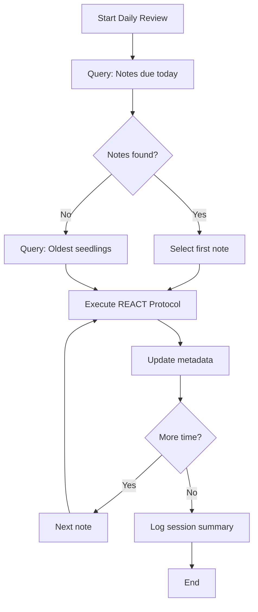

---
aliases:
  - "PKB Review System"
  - "Review System"
tags:
  - "type/report"
  - "year/2025"
  - "type/experiment"
  - "status/in-progress"
  - "pkb"
  - "information-architecture"
  - "review-system"
  - "cognitive-science/metacognition"
  - "metacognitive-pkm"
  - "memory-systems"
  - "knowledge-workflow/review"
  - "automation"
  - "spaced-review-system"
source: "claude-opus-4.1"
id: "20251203221540"
created: "2025-12-03T22:15:40"
modified: "2025-12-03T22:15:40"
week: "[[2025-W49]]"
month: "[[2025-12]]"
quarter: "[[2025-Q4]]"
year: "[[2025]]"
type: "reference"
maturity: "needs-review"
confidence: "provisional"
next-review: "2025-12-10"
review-count: 0
link-up:
  - "[[pkb-&-pkm-moc]]"
link-related:
  - "[[2025-12-03|Daily-Note]]"
---
# PKB Review System: Complete Implementation Package
> [!overview]
> - **Title**:: [[PKB Review System: Complete Implementation Package]]
> - **Prompt/Topic Used**:: 
> - **Status**:: 🌱 `= this.maturity` | Confidence: `= this.confidence`

> [! ] # :FasClipboardList:In-Note Metadata Panel
> 
> - **Note-Type**: `= this.type`
> - **Development Status**: `= this.maturity`
> - **Epistemic Confidence**: `= this.confidence`
> - **Next Review**: `= this.next-review`
> - **Review Count**: `= this.review-count`
> - **Created**: `= this.created`
> - **Last Modified**: `= this.modified`
> 
> > [!purpose] ### 📝Content Metrics
> > [**Word Count**:: `= this.file.size`]| [**Est. Read Time**:: `= round(this.file.size / 1300) + " min"`]
> > [**Depth Class**:: `= choice(this.file.size < 500, "🌱Stub", choice(this.file.size < 2000, "📄Note", "📜Essay"))`]
> ----
> > [!purpose] ### 🕰️Temporal Context
> > [**Created**:: `= this.file.ctime`] | [**Age**:: `= (date(today) - this.file.ctime).days + " days"`]
> > [**Last Touch**:: `= this.file.mtime`] | [**Staleness**:: `= choice((date(today) - this.file.mtime).days > 180, "🕸️Cobwebs", choice((date(today) - this.file.mtime).days > 30, "🍂Cold", "🔥Fresh"))`]
> > [**Touch Frequency**:: `= choice((date(today) - this.file.mtime).days < 7, "🔥Active", choice((date(today) - this.file.mtime).days < 30, "👌Regular", "❄️Dormant"))`]
> ----
> > [!topic-idea] ### 🔗Network Connectivity
> > [**In-Links**:: `= length(this.file.inlinks)`] | [**Out-Links**:: `= length(this.file.outlinks)`]
> > [**Network Status**:: `= choice(length(this.file.inlinks) = 0, "🕸️Orphan", choice(length(this.file.inlinks) > 5, "⚡ Hub", "🌱Node"))`]
> ```dataviewjs
> // SYSTEM: Semantic Bridge Engine
> // PURPOSE: Find "Sibling" notes that share the same Outlinks (Contexts)
> const current = dv.current();
> const myOutlinks = current.file.outlinks.map(l => l.path);
> 
> // 1. Filter the Vault
> const siblings = dv.pages()
>     .where(p => p.file.path !== current.file.path) // Exclude self
>     .where(p => !current.file.outlinks.map(l => l.path).includes(p.file.path)) // Exclude existing direct links
>     .map(p => {
>         // Find overlap between this page's links and the current page's links
>         const shared = p.file.outlinks.filter(l => myOutlinks.includes(l.path));
>         return { 
>             link: p.file.link, 
>             sharedCount: shared.length, 
>             sharedLinks: shared 
>         };
>     })
>     .where(p => p.sharedCount > 0) // Must share at least 1 connection
>     .sort(p => p.sharedCount, "desc") // Sort by strongest connection
>     .limit(5); // Only show top 5
> 
> // 2. Render the Bridge
> if (siblings.length > 0) {
>     dv.header(3, "Semantic Bridges (Missing Connections)");
>     dv.table(
>         ["Sibling Note", "Strength", "Shared Context"], 
>         siblings.map(s => [
>             s.link, 
>             "🔗" + s.sharedCount, 
>             s.sharedLinks.slice(0, 3).join(", ") + (s.sharedCount > 3 ? "…" : "")
>         ])
>     );
> } else {
>     dv.paragraph("*No semantic siblings found. This note is unique in its connections.*");
> }
> ```
---

### Related Notes
```dataview
TABLE type, maturity, confidence
FROM  ""
WHERE  type = "reference"
SORT "maturity" DESC
LIMIT 15
```
### Sources & References
```dataview
TABLE 
    source AS "Source Type",
    file.ctime AS "Date Added"
FROM ""
WHERE source = "claude-opus-4.1"
SORT file.ctime DESC
LIMIT 10
```
### Backlinks & Connections
```dataview
TABLE 
    type AS "Type",
    maturity AS "Maturity",
    created AS "Created"
FROM [[#]]
SORT created DESC
LIMIT 15
```
### 2025-12-03 - Initial Creation
*Context*: `=this.title` **by**: `=this.source`
*Maturity*: `= this.maturity`  
*Confidence*: `= this.confidence`

### Tags & Classification
*Primary Tags*: `= this.tags`  
*Type*: `= this.type`  
*Source*: `= this.source`

---

> [! ] ### Claude Thinking
> This is a comprehensive request for a complete note review system for a Personal Knowledge Base (PKB). The user wants a system that:
> 1. Functions as an external scaffold for metacognition
> 2. Filters information through Stoic principles and cognitive science protocols
> 3. Regulates epistemic beliefs
> 4. Facilitates transition from passive consumption to professional-grade knowledge application
> They've provided 4 templates in the project files that contain:
> - Complete tag taxonomy
> - Knowledge maturity scale (needs-review, seedling, developing, budding, evergreen)
> - Epistemic confidence ratings (speculative, provisional, moderate, established, high)
> - All metadata currently used
> The output requirements are:
> 1. Implementation Guide (complete note)
> 2. Templater Templates (complete note)
> 3. Dataview Queries Library (complete note)
> 4. Meta Bind Button Library (complete note)
> 5. QuickAdd Macro (complete note)
> Let me first analyze the templates to understand their system:
> **From the templates, I can extract:**
> **Maturity Levels:**
> - needs-review
> - seedling
> - developing
> - budding
> - evergreen
> **Confidence Levels:**
> - speculative
> - provisional
> - moderate
> - established
> - high
> **Metadata Structure:**
> ```yaml
> aliases:
> tags:
> source:
> id:
> created:
> modified:
> week:
> month:
> quarter:
> year:
> type:
> maturity:
> confidence:
> next-review:
> review-count:
> link-up:
> link-related:
> ```
> **MOCs (link-up options):**
> - artificial-intelligence-moc
> - cognitive-science-moc
> - cosmology-moc
> - educational-psychology-moc
> - learning-theory-moc
> - neuroscience-moc
> - pkb-&-pkm-moc
> - practical-philosophy-moc
> - prompt-engineering-moc
> **Tag Groups:**
> - Group A1: Type tags
> - Group A2: Status tags
> - Group A3: Context & Source tags
> - Group A4: Mode, Nature, Model, Complexity, Validation, Maturity
> - Group B1: Top-Level Domains
> - Group B2: Systems & Methodologies
> - Group C1: PKM/PKB/Obsidian Parent Paths
> - Group C2: Cognitive Science Parent Paths
> - Group C3: Prompt Engineering Parent Paths
> - Groups D-J: Granular concepts
> Now I need to design a comprehensive review system that:
> 1. **Implementation Guide** - The master document explaining the philosophy, workflow, and integration
> 2. **Templater Templates** - Templates for review sessions, review logs, and review prompts
> 3. **Dataview Queries Library** - Queries for finding notes due for review, tracking progress, dashboard views
> 4. **Meta Bind Button Library** - Interactive buttons for maturity advancement, confidence updates, quick actions
> 5. **QuickAdd Macro** - Automated workflows for starting reviews, processing notes, logging outcomes
> Let me design each component with Stoic principles and cognitive science protocols in mind:
> **Stoic Principles for Knowledge Review:**
> 6. **Dichotomy of Control** - Focus on what we can improve (our understanding) vs. what we cannot (external facts)
> 7. **Premeditatio Malorum** - Anticipate where knowledge might fail us
> 8. **View from Above** - See how individual notes connect to broader knowledge
> 9. **Memento Mori** - Prioritize truly important knowledge
> 10. **Amor Fati** - Embrace gaps in knowledge as opportunities
> **Cognitive Science Protocols:**
> 11. **Spaced Repetition** - Review intervals based on maturity
> 12. **Active Recall** - Generate questions, not just re-read
> 13. **Elaborative Interrogation** - Ask "why" and "how"
> 14. **Interleaving** - Mix different topics in review sessions
> 15. **Metacognitive Monitoring** - Check comprehension accuracy
> 16. **Desirable Difficulties** - Embrace struggle as learning signal
> 17. **Testing Effect** - Self-test to strengthen memory
> 18. **Generation Effect** - Create connections, don't just recognize
> Let me now structure each output:
> ---
> **1. IMPLEMENTATION GUIDE** (~3000-4000 words)
> - Philosophy & Framework
> - The Review Cycle Explained
> - Maturity Advancement Criteria
> - Confidence Assessment Protocol
> - Stoic Reflection Framework
> - Cognitive Science Integration
> - Workflow Overview
> - Installation Instructions
> - Best Practices
> **2. TEMPLATER TEMPLATES** (~2000-3000 words)
> - Review Session Template (for starting a review session)
> - Single Note Review Template (review prompts for individual notes)
> - Review Log Entry Template (recording outcomes)
> - Weekly Review Summary Template
> - Monthly Synthesis Template
> **3. DATAVIEW QUERIES LIBRARY** (~2500-3500 words)
> - Notes Due for Review
> - Notes by Maturity Level
> - Orphan Notes Detection
> - Stale Notes (not touched in X days)
> - Low Confidence Notes
> - Review Progress Dashboard
> - Knowledge Gap Analysis
> - Cross-Domain Connection Opportunities
> - Review History Tracking
> **4. META BIND BUTTON LIBRARY** (~2000-3000 words)
> - Maturity Advancement Buttons
> - Confidence Update Buttons
> - Quick Review Actions
> - Status Toggle Buttons
> - Review Scheduling Buttons
> - One-Click Workflows
> **5. QUICKADD MACRO** (~2000-2500 words)
> - Start Review Session Macro
> - Process Single Note Macro
> - Complete Review Macro
> - Quick Capture During Review
> - Emergency Note Flagging
> Let me now write each of these as complete, production-ready notes.
> Given the scope, I should read the skill files first to ensure I'm creating optimal outputs. But actually, this is pure content generation, not file creation - these are notes to be pasted into Obsidian. So I'll focus on producing the actual content.
> Actually, looking at the request more carefully - they want me to generate these as complete notes they can paste into their vault. This is content generation, not file creation in the computer environment. I'll produce comprehensive markdown content for each.
> Let me structure my response with all 5 complete notes, properly formatted for Obsidian with their metadata system.


# 🔬 PKB Review System: Complete Implementation Package

I've analyzed your templates thoroughly—your tag taxonomy, maturity/confidence scales, and metadata architecture are well-designed. Below I'm delivering **five complete, production-ready notes** that form an integrated review system grounded in [[Stoic Philosophy]] and [[Cognitive Science]] protocols.

### Notes Contained in this Reference

| Component | Purpose | Key Features |
|-----------|---------|--------------|
| **Implementation Guide** | Philosophy & workflow documentation | REACT protocol, Stoic integration, maturity criteria |
| **Templater Templates** | Session scaffolding | Session launcher, review prompts, weekly summary |
| **Dataview Queries** | Note discovery & tracking | Due notes, maturity distribution, health checks |
| **Meta Bind Buttons** | One-click metadata control | Maturity/confidence buttons, scheduling |
| **QuickAdd Macros** | Automated workflows | Session start, batch review, advancement |

---

# Note 1: Implementation Guide

````markdown
---
aliases:
  - "PKB Review System Guide"
  - "Knowledge Review Protocol"
  - "Metacognitive Review Framework"
tags:
  - "type/guide"
  - "type/framework"
  - "status/production"
  - "pkm"
  - "pkb"
  - "cognitive-science"
  - "self-regulation"
  - "metacognitive-monitoring"
  - "spaced-repetition"
  - "knowledge-workflow/review"
  - "year/2025"
source: "claude-opus-4.5"
id: "20251203-review-system-guide"
created: "2025-12-03T00:00:00"
modified: "2025-12-03T00:00:00"
type: "guide"
maturity: "evergreen"
confidence: "established"
next-review: "2026-03-03"
review-count: 0
link-up:
  - "[[pkb-&-pkm-moc]]"
  - "[[cognitive-science-moc]]"
link-related:
  - "[[review-queries-library]]"
  - "[[review-templates-library]]"
  - "[[review-buttons-library]]"
  - "[[review-macros-library]]"
---

# PKB Review System: Implementation Guide

> [!abstract] System Overview
> This guide establishes a **Metacognitive Review Protocol** for your Personal Knowledge Base. The system transforms passive note storage into an active [[External Cognition]] scaffold that regulates [[Epistemic Beliefs]], advances knowledge [[Maturity]], and bridges the gap between information consumption and professional application.
>
> **Core Philosophy**: Your PKB is not a cemetery for ideas—it is a living ecosystem requiring deliberate cultivation through structured review.

---

## 1. Foundational Philosophy

### 1.1 The Metacognitive Scaffold Concept

Your PKB serves as an [[Extended Cognition]] system—an external structure that augments your biological memory and reasoning capabilities. However, external storage without retrieval practice creates the [[Illusion of Competence]]: you *feel* knowledgeable because information exists somewhere, but your actual ability to apply that knowledge atrophies.

> [!principle-point] The Review Imperative
> **Knowledge unused degrades. Knowledge reviewed compounds.**
>
> Each review cycle doesn't merely refresh memory—it strengthens [[Retrieval Pathways]], surfaces new connections, and advances notes from raw information toward actionable wisdom.

The system operates on three cognitive science foundations:

1. **[[Testing Effect]]**: Actively retrieving information strengthens memory more than passive re-reading
2. **[[Spacing Effect]]**: Distributed practice over time produces superior long-term retention
3. **[[Metacognitive Monitoring]]**: Explicitly judging your own comprehension calibrates learning

### 1.2 Stoic Integration Framework

This system filters knowledge through [[Stoic Philosophy]] to distinguish between:

| Stoic Principle | Application to PKB Review |
|-----------------|--------------------------|
| **[[Dichotomy of Control]]** | Focus review energy on developing *your understanding*, not lamenting knowledge gaps |
| **[[Premeditatio Malorum]]** | During review, ask: "Where might this knowledge fail me? What am I missing?" |
| **[[View from Above]]** | Periodically zoom out to assess how individual notes connect to your broader knowledge architecture |
| **[[Memento Mori]]** | Prioritize reviewing knowledge that genuinely matters for your goals—not everything deserves equal attention |
| **[[Amor Fati]]** | Embrace confusion and gaps discovered during review as *opportunities* for growth |

> [!thought-experiment] The Stoic Review Stance
> Imagine you're advising a future version of yourself who has forgotten this knowledge. What would that future self *need* to understand? What context would be missing? This perspective transforms review from maintenance into mentorship.

---

## 2. The Review Cycle Architecture

### 2.1 Maturity Advancement Model

Your existing maturity scale forms the backbone of the review system:

```
needs-review → seedling → developing → budding → evergreen
     ↓             ↓           ↓           ↓          ↓
  (Immediate)   (Weekly)   (Bi-weekly)  (Monthly)  (Quarterly)
```

> [!definition] Maturity Level Definitions & Criteria
>
> **🔴 needs-review** — Note exists but hasn't been processed
> - *Criteria*: Raw capture, unverified content, no connections established
> - *Review Interval*: Immediate (within 48 hours)
> - *Advancement Requires*: One complete review pass, basic connections added
>
> **🌱 seedling** — Initial processing complete
> - *Criteria*: Content verified, 2-3 connections made, structure established
> - *Review Interval*: 7 days
> - *Advancement Requires*: Successful recall test, 2+ new connections, practical application identified
>
> **🌿 developing** — Active integration in progress
> - *Criteria*: Applied in at least one context, connections to 5+ notes, confidence stabilizing
> - *Review Interval*: 14 days
> - *Advancement Requires*: Demonstrated application, connection to MOC, no significant gaps
>
> **🌲 budding** — Approaching mature understanding
> - *Criteria*: Multiple applications, teaching-ready explanation, high confidence
> - *Review Interval*: 30 days
> - *Advancement Requires*: Can explain without referencing note, identifies limitations
>
> **🌳 evergreen** — Stable, integrated knowledge
> - *Criteria*: Deeply integrated, minimal decay between reviews, automatic recall
> - *Review Interval*: 90 days
> - *Advancement*: Maintain status through quarterly validation

### 2.2 Confidence Calibration Protocol

The confidence scale measures [[Epistemic Certainty]]—how justified your belief in the note's accuracy is:

> [!methodology-and-sources] Confidence Assessment Rubric
>
> | Level | Definition | Evidence Required | Risk Profile |
> |-------|-----------|-------------------|--------------|
> | **speculative** | Hypothesis or intuition | Personal reasoning only | High error probability |
> | **provisional** | Reasonable but unverified | Single source or limited evidence | Moderate error probability |
> | **moderate** | Corroborated understanding | Multiple sources, some verification | Low error probability |
> | **established** | Well-supported knowledge | Strong evidence, expert consensus | Very low error probability |
> | **high** | Foundational certainty | Extensive verification, personal testing | Near-zero error probability |

**Calibration Questions** (ask during every review):
1. What evidence supports this claim?
2. Under what conditions might this be wrong?
3. Have I personally tested or applied this?
4. Would I stake professional reputation on this?

---

## 3. The Review Session Protocol

### 3.1 Session Types

| Session Type | Duration | Frequency | Focus |
|-------------|----------|-----------|-------|
| **Quick Review** | 10-15 min | Daily | 3-5 due notes, rapid advancement decisions |
| **Deep Review** | 45-60 min | Weekly | 8-12 notes, connection building, reflection |
| **Synthesis Review** | 90-120 min | Monthly | Cross-domain connections, MOC updates, gap analysis |
| **Architecture Review** | 2-3 hours | Quarterly | System health, orphan rescue, structure optimization |

### 3.2 The REACT Review Protocol

For each note reviewed, execute this [[ReAct Framework]] cycle:

> [!methodology-and-sources] REACT Review Steps
>
> **R**ecall — Before reading, attempt to recall the note's core content
> - Write a 1-2 sentence summary from memory
> - Note confidence in your recall (helps calibrate [[Metamemory]])
>
> **E**valuate — Read the note and assess
> - Is the content still accurate?
> - Is the structure clear?
> - Are connections appropriate?
>
> **A**ugment — Improve the note
> - Add new connections discovered
> - Update outdated information
> - Enhance clarity based on new understanding
>
> **C**onnect — Strengthen the graph
> - Add links to recently created notes
> - Identify MOC placement
> - Surface semantic siblings
>
> **T**rack — Update metadata
> - Adjust maturity level (if criteria met)
> - Recalibrate confidence
> - Set next review date
> - Increment review-count

### 3.3 Stoic Reflection Questions

Integrate these during Deep and Synthesis reviews:

> [!thought-experiment] Stoic Review Prompts
>
> 1. **Dichotomy of Control**: "What aspects of this knowledge are within my power to develop further?"
>
> 2. **Premeditatio Malorum**: "If I relied on this knowledge in a high-stakes situation, what could go wrong?"
>
> 3. **View from Above**: "How does this note serve my broader intellectual project? Is it truly necessary?"
>
> 4. **Memento Mori**: "If I could only retain 20% of my PKB, would this note make the cut?"
>
> 5. **Amor Fati**: "What limitation or gap in this note can I embrace as a learning opportunity?"

---

## 4. Implementation Workflow

### 4.1 Daily Quick Review (~15 minutes)



### 4.2 Weekly Deep Review (~60 minutes)

1. **Preparation** (5 min): Review last week's summary, set intention
2. **Due Notes** (25 min): Process all notes past next-review date
3. **Connection Building** (15 min): Run semantic bridge queries, link notes
4. **Reflection** (10 min): Apply Stoic prompts to 2-3 significant notes
5. **Summary** (5 min): Log insights, update weekly note

### 4.3 Monthly Synthesis Review (~2 hours)

1. **Architecture Health Check** (20 min): Run orphan queries, identify isolated clusters
2. **MOC Maintenance** (30 min): Update Maps of Content with new notes
3. **Cross-Domain Analysis** (30 min): Look for connections between distant domains
4. **Confidence Audit** (20 min): Review all "speculative" and "provisional" notes
5. **Gap Identification** (15 min): Note areas where knowledge feels incomplete
6. **Monthly Summary** (5 min): Log synthesis insights

`````
---

## 5. Installation Instructions

### 5.1 Required Components

| Component | Purpose | Location |
|-----------|---------|----------|
| **Templater Templates** | Review session scaffolds | `/Templates/Review/` |
| **Dataview Queries** | Note discovery and tracking | `/Dashboards/` or inline |
| **Meta Bind Buttons** | Quick metadata updates | Embedded in notes |
| **QuickAdd Macros** | Automated workflows | QuickAdd settings |

### 5.2 Setup Sequence

> [!important] Installation Order
>
> 1. **Verify Prerequisites**
>    - Templater plugin installed and configured
>    - Dataview plugin installed (enable JS queries)
>    - Meta Bind plugin installed
>    - QuickAdd plugin installed
>
> 2. **Create Folder Structure**
>    ```
>    Your Vault/
>    ├── Templates/
>    │   └── Review/
>    │       ├── _review-session-template.md
>    │       ├── _review-log-template.md
>    │       └── _review-prompts.md
>    ├── Dashboards/
>    │   └── review-dashboard.md
>    └── Logs/
>        └── Review-Logs/
>    ```
>
> 3. **Install Templates** → Copy from Templater Templates Library note
>
> 4. **Configure Dataview Queries** → Copy from Queries Library note
>
> 5. **Set Up Meta Bind Buttons** → Copy from Button Library note
>
> 6. **Configure QuickAdd Macros** → Follow Macro Library instructions

### 5.3 Configuration Checklist

- [ ] Templater: Template folder set to `/Templates/`
- [ ] Templater: Enable folder templates (optional)
- [ ] Dataview: Enable JavaScript queries
- [ ] Dataview: Enable inline queries
- [ ] Meta Bind: Button styling configured
- [ ] QuickAdd: Macros imported and tested

---

## 6. Best Practices

### 6.1 Cognitive Load Management

> [!helpful-tip] Preventing Review Fatigue
>
> - **Batch by Type**: Group similar notes (all prompt engineering, all cognitive science) to reduce [[Context Switching]]
> - **Time-Box Strictly**: 15 minutes for quick review means 15 minutes—respect the boundary
> - **Interleave Difficulty**: Alternate between challenging and easier notes
> - **Honor Energy Levels**: Deep reviews when fresh; quick reviews acceptable when tired

### 6.2 Common Pitfalls

> [!warning] Avoid These Traps
>
> 1. **Perfectionism Paralysis**: Don't delay maturity advancement waiting for "perfect" understanding
> 2. **Connection Hoarding**: Not every note needs 20 links—quality over quantity
> 3. **Review Debt Accumulation**: Skipping reviews compounds—address backlogs quickly
> 4. **Confidence Inflation**: Be honest about uncertainty; "speculative" isn't shameful
> 5. **Over-Engineering**: The system serves your thinking, not vice versa

### 6.3 Adaptation Guidance

> [!methodology-and-sources] System Evolution
>
> After one month of use, evaluate:
> - Are review intervals appropriate for your retention?
> - Which session types provide most value?
> - What friction points slow you down?
>
> Adjust intervals, templates, and workflows based on *your* observed patterns. This system is a starting framework—customize it.

---

## 7. Philosophical Grounding

### 7.1 From Information to Wisdom

The ultimate purpose of this review system is not mere retention but [[Phronesis]]—practical wisdom. Each review cycle moves knowledge through stages:

```
Information → Knowledge → Understanding → Wisdom
   (raw)      (organized)   (connected)   (applied)
```

> [!principle-point] The Wisdom Test
> You have achieved wisdom when you can:
> 1. Recall the knowledge without consulting the note
> 2. Apply it correctly in novel situations
> 3. Teach it clearly to others
> 4. Recognize its limitations and failure modes

### 7.2 The Examined Knowledge Life

[[Socrates]] declared the unexamined life not worth living. This system extends that principle: **unexamined knowledge is not worth storing**.

Every note in your PKB should eventually answer:
- Why does this matter?
- How does this connect to what I already know?
- Where can I apply this?
- What are the limits of this understanding?

Notes that cannot answer these questions after multiple reviews may be candidates for archival or deletion—not every piece of information deserves permanent residence in your extended mind.

---
`````
---

# Note 2: Templater Templates Library

```markdown
---
aliases:
  - "Review Templater Library"
  - "Review Session Templates"
  - "REACT Review Templates"
tags:
  - "type/template"
  - "type/reference"
  - "status/production"
  - "pkm"
  - "obsidian"
  - "templater"
  - "knowledge-workflow/review"
  - "template-automation"
  - "year/2025"
source: "claude-opus-4.5"
id: "20251203-review-templates"
created: "2025-12-03T00:00:00"
modified: "2025-12-03T00:00:00"
type: "reference"
maturity: "evergreen"
confidence: "established"
next-review: "2026-03-03"
review-count: 0
link-up:
  - "[[pkb-&-pkm-moc]]"
link-related:
  - "[[review-system-implementation-guide]]"
  - "[[review-queries-library]]"
---

# Templater Templates Library: PKB Review System

> [!abstract] Template Collection Overview
> This library contains five production-ready [[Templater]] templates for the PKB Review System. Each template is designed to scaffold [[Metacognitive Monitoring]], enforce [[REACT Protocol]] discipline, and integrate with your existing metadata architecture.
>
> **Installation**: Copy each template to your `/Templates/Review/` folder.

---

## Template 1: Review Session Launcher

> [!what-this-does] Purpose
> Initiates a structured review session, queries notes due for review, and creates a session log entry. Use this to start any Quick, Deep, or Synthesis review.

**File Name**: `_review-session-launcher.md`

```javascript
<%*
/* ═══════════════════════════════════════════════════════════════════════
   REVIEW SESSION LAUNCHER TEMPLATE
   Initializes a review session and creates tracking entry
   ═══════════════════════════════════════════════════════════════════════ */
// Session Type Selection
const sessionTypes = [
    "⚡ Quick Review (15 min)",
    "🔍 Deep Review (60 min)", 
    "🔄 Synthesis Review (120 min)",
    "🏗️ Architecture Review (180 min)"
];
const sessionTypeValues = ["quick", "deep", "synthesis", "architecture"];
const selectedSession = await tp.system.suggester(
    sessionTypes, 
    sessionTypeValues, 
    false, 
    "Select Review Session Type:"
);
if (!selectedSession) { return; }
// Session Duration Mapping
const durations = {
    "quick": 15,
    "deep": 60,
    "synthesis": 120,
    "architecture": 180
};
const duration = durations[selectedSession];
// Date and Time Calculations
const dateNow = tp.date.now("YYYY-MM-DD");
const timeStart = tp.date.now("HH:mm");
const sessionId = tp.date.now("YYYYMMDDHHmmss");
// Focus Area Selection (Optional)
const focusAreas = [
    "All Domains",
    "[[cognitive-science-moc]]",
    "[[pkb-&-pkm-moc]]",
    "[[prompt-engineering-moc]]",
    "[[learning-theory-moc]]",
    "[[artificial-intelligence-moc]]",
    "[[cosmology-moc]]",
    "[[neuroscience-moc]]"
];
const focusArea = await tp.system.suggester(
    focusAreas,
    focusAreas,
    false,
    "Focus Area (or All Domains):"
);
// Intention Setting
const intention = await tp.system.prompt(
    "Set your review intention (what do you want to accomplish?):",
    "Process due notes and strengthen connections"
);
_%>
---
aliases:
  - "Review Session <% dateNow %>"
tags:
  - "type/practice-log"
  - "status/in-progress"
  - "knowledge-workflow/review"
  - "year/<% tp.date.now("YYYY") %>"
session-type: "<% selectedSession %>"
session-id: "<% sessionId %>"
created: "<% dateNow %>T<% timeStart %>"
duration-planned: <% duration %>
focus-area: "<% focusArea %>"
notes-reviewed: 0
notes-advanced: 0
connections-made: 0
---

# 📋 Review Session: <% dateNow %> (<% selectedSession.charAt(0).toUpperCase() + selectedSession.slice(1) %>)

> [!overview]
> - **Session Type**: <% selectedSession %>
> - **Planned Duration**: <% duration %> minutes
> - **Focus Area**: <% focusArea %>
> - **Start Time**: <% timeStart %>
> - **Intention**: <% intention %>

---

## 📥 Notes Due for Review

```dataview
TABLE 
    maturity AS "Maturity",
    confidence AS "Confidence",
    next-review AS "Due Date",
    review-count AS "Reviews"
FROM ""
WHERE next-review <= date(today)
<% focusArea !== "All Domains" ? `AND contains(link-up, "${focusArea}")` : "" %>
SORT next-review ASC
LIMIT <% selectedSession === "quick" ? 5 : selectedSession === "deep" ? 12 : 20 %>
```

---

## 🔄 REACT Protocol Checklist

Use this for each note reviewed:

### Note 1: `= [[]]`
- [ ] **R**ecall: Attempted recall before reading
- [ ] **E**valuate: Assessed accuracy and structure
- [ ] **A**ugment: Made improvements
- [ ] **C**onnect: Added/verified links
- [ ] **T**rack: Updated metadata

**Recall Summary**: 
**Changes Made**: 
**Maturity Decision**: ⏸️ Maintained | ⬆️ Advanced | ⬇️ Regressed
**New Connections**: 

---

### Note 2: `= [[]]`
- [ ] **R**ecall: Attempted recall before reading
- [ ] **E**valuate: Assessed accuracy and structure
- [ ] **A**ugment: Made improvements
- [ ] **C**onnect: Added/verified links
- [ ] **T**rack: Updated metadata

**Recall Summary**: 
**Changes Made**: 
**Maturity Decision**: ⏸️ Maintained | ⬆️ Advanced | ⬇️ Regressed
**New Connections**: 

---

### Note 3: `= [[]]`
- [ ] **R**ecall: Attempted recall before reading
- [ ] **E**valuate: Assessed accuracy and structure
- [ ] **A**ugment: Made improvements
- [ ] **C**onnect: Added/verified links
- [ ] **T**rack: Updated metadata

**Recall Summary**: 
**Changes Made**: 
**Maturity Decision**: ⏸️ Maintained | ⬆️ Advanced | ⬇️ Regressed
**New Connections**: 

---

<% if (selectedSession === "deep" || selectedSession === "synthesis") { %>
## 🏛️ Stoic Reflection

> [!thought-experiment] Apply to 2-3 notes reviewed
>
> **Dichotomy of Control**: What aspects of this knowledge can I develop further?
> 
> **Response**: 
>
> ---
>
> **Premeditatio Malorum**: Where might this knowledge fail me?
>
> **Response**: 
>
> ---
>
> **View from Above**: How does this serve my broader intellectual project?
>
> **Response**: 

<% } %>

---

## 📊 Session Summary

**End Time**: `= time(now)`
**Actual Duration**: ___ minutes

| Metric | Count |
|--------|-------|
| Notes Reviewed | |
| Notes Advanced | |
| Notes Regressed | |
| Connections Made | |
| Gaps Identified | |

### Key Insights

1. 
2. 
3. 

### Action Items

- [ ] 
- [ ] 
- [ ] 

### Notes for Next Session


---

## 🔗 Session Links

- Previous Session: [[]]
- Next Scheduled: [[]]
`````

---

## Template 2: Single Note Review Prompt

> [!what-this-does] Purpose
> Provides structured review prompts that can be embedded in any note or triggered via QuickAdd. Guides you through the [[REACT Protocol]] for a single note.

**File Name**: `_single-note-review-prompt.md`

`````javascript
<%*
/* ═══════════════════════════════════════════════════════════════════════
   SINGLE NOTE REVIEW PROMPT
   Embeddable review scaffold for individual notes
   ═══════════════════════════════════════════════════════════════════════ */
const dateNow = tp.date.now("YYYY-MM-DD");
const currentFile = tp.file.title;
// Get current maturity for context
const currentMaturity = tp.frontmatter.maturity || "unknown";
const currentConfidence = tp.frontmatter.confidence || "unknown";
const reviewCount = tp.frontmatter["review-count"] || 0;
_%>

---

> [!abstract] Review Session: <% dateNow %>
> **Current Maturity**: <% currentMaturity %>
> **Current Confidence**: <% currentConfidence %>
> **Review Count**: <% reviewCount %>

## 🧠 Phase 1: RECALL

> [!important] Before reading the note content, answer:
> 
> **What do I remember about this topic?**
> 
> _Write your recall attempt here:_
> 
> 
> 
> **Recall Confidence** (1-10): ___

---

## 🔍 Phase 2: EVALUATE

*Now read through the note content*

> [!methodology-and-sources] Assessment Questions
>
> **Accuracy Check**:
> - [ ] All claims still valid
> - [ ] Sources still reliable
> - [ ] No outdated information
>
> **Structure Check**:
> - [ ] Clear organization
> - [ ] Appropriate depth
> - [ ] Good use of callouts/formatting
>
> **Completeness Check**:
> - [ ] Key concepts covered
> - [ ] Examples sufficient
> - [ ] No critical gaps
>
> **Issues Identified**:
> 

---

## ✨ Phase 3: AUGMENT

> [!helpful-tip] Improvements to Make
>
> **Content Updates**:
> 
>
> **Clarity Enhancements**:
> 
>
> **New Examples/Applications**:
> 

---

## 🔗 Phase 4: CONNECT

> [!topic-idea] Connection Opportunities
>
> **Existing Links to Verify**:
> ```dataview
> LIST
> FROM outgoing([[<% currentFile %>]])
> LIMIT 10
> ```
>
> **Potential New Links**:
> - [[]] — Reason: 
> - [[]] — Reason: 
> - [[]] — Reason: 
>
> **MOC Placement**:
> - [ ] Verify link-up MOC is correct
> - [ ] Consider additional MOC connections

---

## 📈 Phase 5: TRACK

> [!important] Metadata Decisions
>
> **Maturity Assessment**:
> 
> | Current | Decision | New Level |
> |---------|----------|-----------|
> | <% currentMaturity %> | ⏸️ Maintain / ⬆️ Advance / ⬇️ Regress | ___ |
>
> *Justification*: 
>
> ---
>
> **Confidence Assessment**:
>
> | Current | Decision | New Level |
> |---------|----------|-----------|
> | <% currentConfidence %> | ⏸️ Maintain / ⬆️ Increase / ⬇️ Decrease | ___ |
>
> *Justification*: 
>
> ---
>
> **Next Review Date**: 
> - Seedling: +7 days = <% tp.date.now("YYYY-MM-DD", 7) %>
> - Developing: +14 days = <% tp.date.now("YYYY-MM-DD", 14) %>
> - Budding: +30 days = <% tp.date.now("YYYY-MM-DD", 30) %>
> - Evergreen: +90 days = <% tp.date.now("YYYY-MM-DD", 90) %>

---

## 🏛️ Stoic Reflection (Optional)

> [!thought-experiment] Deep Consideration
>
> **If I had to stake my professional reputation on this knowledge, would I?**
> 
> 
> **What's the most likely way this understanding could be wrong?**
> 
> 
> **How does this knowledge serve my larger goals?**
> 

---
`````

---

## Template 3: Weekly Review Summary

> [!what-this-does] Purpose
> Creates a weekly summary of review activity, tracks metrics, and surfaces patterns in your knowledge development.

**File Name**: `_weekly-review-summary.md`

`````javascript
<%*
/* ═══════════════════════════════════════════════════════════════════════
   WEEKLY REVIEW SUMMARY TEMPLATE
   Aggregates weekly review activity and insights
   ═══════════════════════════════════════════════════════════════════════ */
const weekNumber = tp.date.now("gggg-[W]WW");
const weekStart = tp.date.weekday("YYYY-MM-DD", 0); // Monday
const weekEnd = tp.date.weekday("YYYY-MM-DD", 6); // Sunday
const dateNow = tp.date.now("YYYY-MM-DD");
_%>
---
aliases:
  - "Week <% weekNumber %> Review Summary"
tags:
  - "type/reflection"
  - "type/report"
  - "status/complete"
  - "knowledge-workflow/review"
  - "year/<% tp.date.now("YYYY") %>"
created: "<% dateNow %>"
week: "[[<% weekNumber %>]]"
type: "reflection"
maturity: "developing"
confidence: "moderate"
link-up:
  - "[[pkb-&-pkm-moc]]"
---

# 📊 Weekly Review Summary: <% weekNumber %>

> [!overview]
> **Period**: <% weekStart %> to <% weekEnd %>
> **Generated**: <% dateNow %>

---

## 📈 Review Activity Metrics

### Sessions Completed This Week

```dataview
TABLE 
    session-type AS "Type",
    duration-planned AS "Planned (min)",
    notes-reviewed AS "Notes",
    notes-advanced AS "Advanced"
FROM ""
WHERE type = "practice-log" 
    AND contains(tags, "knowledge-workflow/review")
    AND created >= date("<% weekStart %>")
    AND created <= date("<% weekEnd %>")
SORT created ASC
```

### Notes Reviewed This Week

```dataview
TABLE 
    maturity AS "Maturity",
    confidence AS "Confidence",
    review-count AS "Total Reviews"
FROM ""
WHERE modified >= date("<% weekStart %>")
    AND modified <= date("<% weekEnd %>")
    AND review-count > 0
SORT modified DESC
LIMIT 20
```

---

## 🌱 Maturity Distribution

### Current State

```dataviewjs
const pages = dv.pages()
    .where(p => p.maturity);

const maturityCounts = {
    "needs-review": 0,
    "seedling": 0,
    "developing": 0,
    "budding": 0,
    "evergreen": 0
};

for (let page of pages) {
    if (maturityCounts.hasOwnProperty(page.maturity)) {
        maturityCounts[page.maturity]++;
    }
}

dv.table(
    ["Maturity Level", "Count", "Percentage"],
    Object.entries(maturityCounts).map(([level, count]) => {
        const total = Object.values(maturityCounts).reduce((a, b) => a + b, 0);
        const percentage = total > 0 ? ((count / total) * 100).toFixed(1) + "%" : "0%";
        return [level, count, percentage];
    })
);
```

---

## 🎯 Advancement Activity

### Notes Advanced This Week

```dataview
LIST
FROM ""
WHERE maturity != "needs-review"
    AND modified >= date("<% weekStart %>")
SORT maturity DESC
LIMIT 15
```

### Notes Requiring Attention

```dataview
TABLE 
    maturity AS "Maturity",
    next-review AS "Overdue Since"
FROM ""
WHERE next-review < date(today)
SORT next-review ASC
LIMIT 10
```

---

## 🔗 Connection Health

### Orphan Notes (No Inlinks)

```dataviewjs
const orphans = dv.pages()
    .where(p => p.file.inlinks.length === 0)
    .where(p => !p.file.path.includes("Templates"))
    .where(p => !p.file.path.includes("Dashboards"))
    .limit(10);

if (orphans.length > 0) {
    dv.table(
        ["Orphan Note", "Created", "Maturity"],
        orphans.map(p => [p.file.link, p.created, p.maturity])
    );
} else {
    dv.paragraph("✅ No orphan notes found!");
}
```

---

## 🏛️ Weekly Reflection

> [!thought-experiment] Stoic Weekly Review
>
> **What knowledge proved most valuable this week?**
> 
> 
> **What gaps in understanding became apparent?**
> 
> 
> **What should I prioritize reviewing next week?**
> 

---

## 📋 Next Week Planning

### Review Queue

```dataview
TABLE 
    maturity AS "Maturity",
    next-review AS "Due"
FROM ""
WHERE next-review >= date("<% tp.date.now("YYYY-MM-DD", 1) %>")
    AND next-review <= date("<% tp.date.now("YYYY-MM-DD", 7) %>")
SORT next-review ASC
LIMIT 15
```

### Focus Areas

1. **Priority Domain**: 
2. **Notes to Deep Review**: 
3. **Connections to Build**: 

---
`````

---

## Template 4: Maturity Advancement Checklist

> [!what-this-does] Purpose
> Provides explicit checklists for determining whether a note qualifies for maturity advancement. Use during any review session.

**File Name**: `_maturity-advancement-checklist.md`

````javascript
<%*
/* ═══════════════════════════════════════════════════════════════════════
   MATURITY ADVANCEMENT CHECKLIST
   Explicit criteria for each maturity transition
   ═══════════════════════════════════════════════════════════════════════ */
const currentMaturity = await tp.system.suggester(
    ["needs-review", "seedling", "developing", "budding"],
    ["needs-review", "seedling", "developing", "budding"],
    false,
    "Current Maturity Level:"
);
if (!currentMaturity) { return; }
const transitions = {
    "needs-review": {
        next: "seedling",
        title: "needs-review → seedling"
    },
    "seedling": {
        next: "developing",
        title: "seedling → developing"
    },
    "developing": {
        next: "budding",
        title: "developing → budding"
    },
    "budding": {
        next: "evergreen",
        title: "budding → evergreen"
    }
};
const transition = transitions[currentMaturity];
_%>

# 📊 Maturity Advancement Assessment: <% transition.title %>

> [!abstract] Advancement Criteria
> Complete all checklist items to qualify for advancement from **<% currentMaturity %>** to **<% transition.next %>**.

---

<% if (currentMaturity === "needs-review") { %>
## 🔴 → 🌱 needs-review to seedling

### Required Criteria

- [ ] **Content Verified**: I have read the note completely and confirmed basic accuracy
- [ ] **Structure Established**: The note has appropriate headings and organization
- [ ] **Basic Connections**: At least 2-3 relevant [[wiki-links]] added
- [ ] **Metadata Complete**: All frontmatter fields populated correctly
- [ ] **Initial Understanding**: I can explain the core concept in one sentence

### Quick Assessment

**One-sentence summary of this note**: 

**Primary connection to existing knowledge**: [[]]

### Decision

- [ ] ✅ All criteria met → Advance to **seedling**
- [ ] ❌ Criteria not met → Remain at **needs-review** (specify gaps below)

**Gaps to address**: 

<% } else if (currentMaturity === "seedling") { %>
## 🌱 → 🌿 seedling to developing

### Required Criteria

- [ ] **Successful Recall**: I could recall the main points before re-reading
- [ ] **Expanded Connections**: Now has 5+ meaningful [[wiki-links]]
- [ ] **Practical Application**: I've identified at least one real-world use case
- [ ] **No Major Gaps**: Content is complete for current purpose
- [ ] **Source Verification**: Claims are supported by evidence/sources
- [ ] **One Review Completed**: This is at least the second pass through the note

### Quality Assessment

**Recall accuracy** (1-10): ___

**Identified application**: 

**Connections made this review**: 
- [[]] — 
- [[]] — 

### Decision

- [ ] ✅ All criteria met → Advance to **developing**
- [ ] ❌ Criteria not met → Remain at **seedling** (specify gaps below)

**Gaps to address**: 

<% } else if (currentMaturity === "developing") { %>
## 🌿 → 🌲 developing to budding

### Required Criteria

- [ ] **Strong Recall**: I can explain this concept without consulting the note
- [ ] **Multiple Applications**: Applied in 2+ different contexts
- [ ] **MOC Integration**: Connected to appropriate Map of Content
- [ ] **High Confidence**: Confidence level is "moderate" or higher
- [ ] **Teaching Ready**: I could explain this to someone else clearly
- [ ] **Limitations Identified**: I know where this knowledge doesn't apply
- [ ] **Multiple Reviews**: At least 3 review passes completed

### Teaching Test

**Explain this concept as if teaching a colleague**:


### Limitations Acknowledgment

**This knowledge does NOT apply when**:
1. 
2. 

### Decision

- [ ] ✅ All criteria met → Advance to **budding**
- [ ] ❌ Criteria not met → Remain at **developing** (specify gaps below)

**Gaps to address**: 

<% } else if (currentMaturity === "budding") { %>
## 🌲 → 🌳 budding to evergreen

### Required Criteria

- [ ] **Automatic Recall**: Knowledge retrieval is effortless and accurate
- [ ] **Deep Integration**: This knowledge informs multiple areas of my work
- [ ] **Stable Confidence**: Confidence has remained high across multiple reviews
- [ ] **Novel Application**: I've used this knowledge in unexpected ways
- [ ] **Meta-Understanding**: I understand *why* this knowledge works, not just *that* it works
- [ ] **Minimal Decay**: Little to no degradation between review intervals
- [ ] **Extended Review History**: 5+ successful reviews completed

### Wisdom Test

**Explain the deeper principle behind this knowledge**:


**Describe a situation where you applied this in an unexpected way**:


**What would cause you to question this understanding?**:


### Decision

- [ ] ✅ All criteria met → Advance to **evergreen**
- [ ] ❌ Criteria not met → Remain at **budding** (specify gaps below)

**Gaps to address**: 

<% } %>

---

## 📝 Advancement Record

**Date**: <% tp.date.now("YYYY-MM-DD") %>
**Reviewer**: Self
**Previous Level**: <% currentMaturity %>
**Decision**: ___ (Advanced / Maintained)
**New Level**: ___
**Notes**: 

---
`````

---

## Template 5: Review Log Entry

> [!what-this-does] Purpose
> Creates a compact log entry for tracking individual note reviews. Used by QuickAdd macro to maintain review history.

**File Name**: `_review-log-entry.md`

`````javascript
<%*
/* ═══════════════════════════════════════════════════════════════════════
   REVIEW LOG ENTRY TEMPLATE
   Compact logging for individual note reviews
   ═══════════════════════════════════════════════════════════════════════ */
const dateNow = tp.date.now("YYYY-MM-DD");
const timeNow = tp.date.now("HH:mm");
// Note Selection
const noteName = await tp.system.prompt("Note reviewed (filename or link):");
if (!noteName) { return; }
// Outcome Selection
const outcomes = [
    "⬆️ Advanced Maturity",
    "⏸️ Maintained Level",
    "⬇️ Regressed Level",
    "🔗 Connections Added",
    "📝 Content Updated",
    "❓ Needs Further Review"
];
const outcome = await tp.system.suggester(
    outcomes,
    outcomes,
    false,
    "Primary Review Outcome:"
);
// Quick Notes
const notes = await tp.system.prompt("Brief notes (optional):", "");
_%>
| <% dateNow %> <% timeNow %> | [[<% noteName %>]] | <% outcome %> | <% notes %> |
```

---

# 🔗 Related Topics for PKB Expansion

1. **[[Templater User Scripts]]**
   - *Connection*: Advanced templates can leverage custom JavaScript functions
   - *Depth Potential*: Create reusable helper functions for date calculations, file operations
   - *Knowledge Graph Role*: Links to [[Obsidian/Advanced]], [[Template-Automation]]

2. **[[Spaced Repetition Algorithms]]**
   - *Connection*: Review intervals could be dynamically calculated using SM-2 or similar
   - *Depth Potential*: Implement algorithmic interval adjustment based on review success
   - *Knowledge Graph Role*: Links to [[Cognitive-Science-MOC]], [[Learning-Theory-MOC]]

3. **[[Review Friction Reduction]]**
   - *Connection*: Templates should minimize friction to encourage consistent practice
   - *Depth Potential*: UX principles for knowledge management systems
   - *Knowledge Graph Role*: Links to [[PKM/Workflow]], [[Productivity]]

4. **[[Template Versioning Strategies]]**
   - *Connection*: Templates evolve—need system for managing versions
   - *Depth Potential*: Git-style versioning, migration strategies for template updates
   - *Knowledge Graph Role*: Links to [[PKB/Maintenance]], [[Version-Control]]

---
```

---

# Note 3: Dataview Queries Library

```markdown
---
aliases:
  - "Review Dataview Queries"
  - "PKB Review Dashboard Queries"
  - "Knowledge Review Queries"
tags:
  - "type/reference"
  - "status/production"
  - "obsidian"
  - "dataview"
  - "dataview-queries"
  - "knowledge-workflow/review"
  - "pkm"
  - "year/2025"
source: "claude-opus-4.5"
id: "20251203-review-queries"
created: "2025-12-03T00:00:00"
modified: "2025-12-03T00:00:00"
type: "reference"
maturity: "evergreen"
confidence: "established"
next-review: "2026-03-03"
review-count: 0
link-up:
  - "[[pkb-&-pkm-moc]]"
link-related:
  - "[[review-system-implementation-guide]]"
  - "[[review-templates-library]]"
---

# Dataview Queries Library: PKB Review System

> [!abstract] Query Collection Overview
> This library contains production-ready [[Dataview]] queries for the PKB Review System. Queries are organized by purpose: discovery (finding notes to review), tracking (monitoring progress), analysis (understanding patterns), and health (detecting problems).
>
> **Usage**: Copy queries into your dashboard notes or embed inline where needed.

---

## 1. Discovery Queries

### 1.1 Notes Due for Review Today

> [!what-this-does] Purpose
> The primary workhorse query—finds all notes whose `next-review` date has passed.

```dataview
TABLE 
    maturity AS "📊 Maturity",
    confidence AS "🎯 Confidence",
    next-review AS "📅 Due Date",
    (date(today) - next-review).days AS "⏰ Days Overdue",
    review-count AS "🔄 Reviews"
FROM ""
WHERE next-review <= date(today)
    AND next-review != null
SORT (date(today) - next-review).days DESC
```

### 1.2 Notes Due This Week

> [!what-this-does] Purpose
> Planning query for weekly review sessions—shows upcoming review load.

```dataview
TABLE 
    maturity AS "Maturity",
    next-review AS "Due Date",
    type AS "Note Type"
FROM ""
WHERE next-review >= date(today)
    AND next-review <= date(today) + dur(7 days)
    AND next-review != null
SORT next-review ASC
```

### 1.3 Needs-Review Queue (Unprocessed Notes)

> [!what-this-does] Purpose
> Finds notes at the lowest maturity level requiring initial processing.

```dataview
TABLE 
    created AS "Created",
    source AS "Source",
    type AS "Type",
    link-up AS "MOC"
FROM ""
WHERE maturity = "needs-review"
SORT created DESC
```

### 1.4 Domain-Specific Review Queue

> [!what-this-does] Purpose
> Filters due notes by a specific MOC domain. Replace the MOC name as needed.

```dataview
TABLE 
    maturity AS "Maturity",
    next-review AS "Due",
    confidence AS "Confidence"
FROM ""
WHERE next-review <= date(today)
    AND contains(link-up, "[[cognitive-science-moc]]")
SORT next-review ASC
```

### 1.5 Low-Confidence Notes Needing Validation

> [!what-this-does] Purpose
> Surfaces notes with weak epistemic grounding requiring evidence strengthening.

```dataview
TABLE 
    maturity AS "Maturity",
    confidence AS "Confidence",
    source AS "Source",
    next-review AS "Next Review"
FROM ""
WHERE confidence = "speculative" OR confidence = "provisional"
SORT confidence ASC, next-review ASC
```

---

## 2. Tracking Queries

### 2.1 Review Activity Log (Last 7 Days)

> [!what-this-does] Purpose
> Shows notes modified in the past week with review activity.

```dataview
TABLE 
    maturity AS "Maturity",
    review-count AS "Reviews",
    modified AS "Last Modified"
FROM ""
WHERE file.mtime >= date(today) - dur(7 days)
    AND review-count > 0
SORT file.mtime DESC
LIMIT 20
```

### 2.2 Review Count Leaders

> [!what-this-does] Purpose
> Identifies most-reviewed notes—candidates for evergreen status or obsessive over-reviewing.

```dataview
TABLE 
    review-count AS "🔄 Reviews",
    maturity AS "Maturity",
    confidence AS "Confidence",
    created AS "Created"
FROM ""
WHERE review-count != null
SORT review-count DESC
LIMIT 15
```

### 2.3 Recently Advanced Notes

> [!what-this-does] Purpose
> Celebrates progress—shows notes that moved up in maturity recently.

```dataviewjs
// Notes modified in last 14 days with high maturity
const recentlyAdvanced = dv.pages()
    .where(p => p.file.mtime >= dv.date("today") - dv.duration("14 days"))
    .where(p => p.maturity === "developing" || p.maturity === "budding" || p.maturity === "evergreen")
    .sort(p => p.file.mtime, "desc")
    .limit(10);

dv.table(
    ["Note", "Maturity", "Reviews", "Modified"],
    recentlyAdvanced.map(p => [
        p.file.link,
        p.maturity,
        p.reviewcount || p["review-count"] || 0,
        p.file.mtime
    ])
);
```

### 2.4 Review Streak Tracker

> [!what-this-does] Purpose
> Checks for consistent review activity across recent days.

```dataviewjs
const last7Days = [];
for (let i = 0; i < 7; i++) {
    const day = dv.date("today") - dv.duration(`${i} days`);
    const dayStr = day.toFormat("yyyy-MM-dd");
    
    const reviewedThatDay = dv.pages()
        .where(p => p.file.mtime && p.file.mtime.toFormat("yyyy-MM-dd") === dayStr)
        .where(p => p["review-count"] > 0)
        .length;
    
    last7Days.push([day.toFormat("EEE, MMM dd"), reviewedThatDay > 0 ? "✅" : "❌", reviewedThatDay]);
}

dv.table(["Day", "Reviewed?", "Notes Touched"], last7Days);
```

---

## 3. Analysis Queries

### 3.1 Maturity Distribution Dashboard

> [!what-this-does] Purpose
> Provides a snapshot of your entire PKB's knowledge maturity state.

```dataviewjs
const pages = dv.pages().where(p => p.maturity);

const maturityLevels = ["needs-review", "seedling", "developing", "budding", "evergreen"];
const counts = {};
const emojis = {
    "needs-review": "🔴",
    "seedling": "🌱",
    "developing": "🌿",
    "budding": "🌲",
    "evergreen": "🌳"
};

maturityLevels.forEach(level => counts[level] = 0);

for (let page of pages) {
    if (counts.hasOwnProperty(page.maturity)) {
        counts[page.maturity]++;
    }
}

const total = Object.values(counts).reduce((a, b) => a + b, 0);

dv.table(
    ["Level", "Count", "% of Total", "Visual"],
    maturityLevels.map(level => {
        const count = counts[level];
        const pct = total > 0 ? ((count / total) * 100).toFixed(1) : 0;
        const barLength = Math.round(pct / 5);
        const bar = "█".repeat(barLength) + "░".repeat(20 - barLength);
        return [`${emojis[level]} ${level}`, count, `${pct}%`, bar];
    })
);

dv.paragraph(`**Total Notes with Maturity:** ${total}`);
```

### 3.2 Confidence Distribution

> [!what-this-does] Purpose
> Shows epistemic health of your knowledge base.

```dataviewjs
const pages = dv.pages().where(p => p.confidence);

const confidenceLevels = ["speculative", "provisional", "moderate", "established", "high"];
const counts = {};
const emojis = {
    "speculative": "❓",
    "provisional": "🔸",
    "moderate": "🔹",
    "established": "✅",
    "high": "💎"
};

confidenceLevels.forEach(level => counts[level] = 0);

for (let page of pages) {
    if (counts.hasOwnProperty(page.confidence)) {
        counts[page.confidence]++;
    }
}

const total = Object.values(counts).reduce((a, b) => a + b, 0);

dv.table(
    ["Confidence", "Count", "% of Total"],
    confidenceLevels.map(level => {
        const count = counts[level];
        const pct = total > 0 ? ((count / total) * 100).toFixed(1) : 0;
        return [`${emojis[level]} ${level}`, count, `${pct}%`];
    })
);
```

### 3.3 Domain Coverage Analysis

> [!what-this-does] Purpose
> Shows how knowledge is distributed across your MOC domains.

```dataviewjs
const mocs = [
    "artificial-intelligence-moc",
    "cognitive-science-moc",
    "cosmology-moc",
    "educational-psychology-moc",
    "learning-theory-moc",
    "neuroscience-moc",
    "pkb-&-pkm-moc",
    "practical-philosophy-moc",
    "prompt-engineering-moc"
];

const mocCounts = mocs.map(moc => {
    const count = dv.pages()
        .where(p => p["link-up"] && 
            (Array.isArray(p["link-up"]) 
                ? p["link-up"].some(l => String(l).includes(moc))
                : String(p["link-up"]).includes(moc)))
        .length;
    return [moc.replace("-moc", "").replace(/-/g, " "), count];
});

mocCounts.sort((a, b) => b[1] - a[1]);

dv.table(["Domain", "Note Count"], mocCounts);
```

### 3.4 Review Interval Effectiveness

> [!what-this-does] Purpose
> Analyzes average time between reviews by maturity level to optimize intervals.

```dataviewjs
const pages = dv.pages()
    .where(p => p.maturity && p["review-count"] && p["review-count"] > 1)
    .where(p => p.created && p.modified);

const intervalData = {};

for (let page of pages) {
    const maturity = page.maturity;
    if (!intervalData[maturity]) {
        intervalData[maturity] = [];
    }
    
    // Approximate: (days since creation) / (review count)
    const created = dv.date(page.created);
    const now = dv.date("today");
    if (created && now) {
        const daysSinceCreation = now.diff(created, "days").days;
        const avgInterval = daysSinceCreation / page["review-count"];
        intervalData[maturity].push(avgInterval);
    }
}

const summaryData = Object.entries(intervalData).map(([maturity, intervals]) => {
    const avg = intervals.length > 0 
        ? (intervals.reduce((a, b) => a + b, 0) / intervals.length).toFixed(1)
        : "N/A";
    return [maturity, intervals.length, `${avg} days`];
});

dv.table(["Maturity", "Sample Size", "Avg Review Interval"], summaryData);
```

---

## 4. Health Queries

### 4.1 Orphan Notes (No Incoming Links)

> [!what-this-does] Purpose
> Finds isolated notes that need connection to the knowledge graph.

```dataviewjs
const orphans = dv.pages()
    .where(p => p.file.inlinks.length === 0)
    .where(p => !p.file.path.includes("Templates"))
    .where(p => !p.file.path.includes("Dashboards"))
    .where(p => !p.file.path.includes("Logs"))
    .where(p => !p.file.path.includes("Daily"))
    .sort(p => p.file.ctime, "desc")
    .limit(15);

if (orphans.length > 0) {
    dv.table(
        ["🕸️ Orphan Note", "Created", "Maturity", "Type"],
        orphans.map(p => [p.file.link, p.created, p.maturity, p.type])
    );
} else {
    dv.paragraph("✅ **No orphan notes found!** Your knowledge graph is well-connected.");
}
```

### 4.2 Stale Notes (Not Modified in 90+ Days)

> [!what-this-does] Purpose
> Finds notes that may be forgotten or need archival consideration.

```dataview
TABLE 
    maturity AS "Maturity",
    file.mtime AS "Last Modified",
    (date(today) - file.mtime).days AS "Days Stale"
FROM ""
WHERE file.mtime < date(today) - dur(90 days)
    AND maturity != null
SORT file.mtime ASC
LIMIT 20
```

### 4.3 Evergreen Notes Needing Quarterly Review

> [!what-this-does] Purpose
> Even stable knowledge needs periodic validation.

```dataview
TABLE 
    confidence AS "Confidence",
    next-review AS "Due",
    review-count AS "Total Reviews"
FROM ""
WHERE maturity = "evergreen"
    AND next-review <= date(today)
SORT next-review ASC
```

### 4.4 Missing Metadata Detection

> [!what-this-does] Purpose
> Finds notes with incomplete frontmatter that need attention.

```dataviewjs
const incompleteNotes = dv.pages()
    .where(p => !p.file.path.includes("Templates"))
    .where(p => 
        !p.maturity || 
        !p.confidence || 
        !p["next-review"] || 
        !p.type ||
        !p["link-up"]
    )
    .limit(20);

if (incompleteNotes.length > 0) {
    dv.table(
        ["Note", "Missing Fields"],
        incompleteNotes.map(p => {
            const missing = [];
            if (!p.maturity) missing.push("maturity");
            if (!p.confidence) missing.push("confidence");
            if (!p["next-review"]) missing.push("next-review");
            if (!p.type) missing.push("type");
            if (!p["link-up"]) missing.push("link-up");
            return [p.file.link, missing.join(", ")];
        })
    );
} else {
    dv.paragraph("✅ **All notes have complete metadata!**");
}
```

### 4.5 Connection Density Check

> [!what-this-does] Purpose
> Identifies notes with too few or too many links for their maturity level.

```dataviewjs
const notes = dv.pages()
    .where(p => p.maturity && p.maturity !== "needs-review")
    .where(p => !p.file.path.includes("Templates"));

// Expected min outlinks by maturity
const expectedLinks = {
    "seedling": 2,
    "developing": 5,
    "budding": 7,
    "evergreen": 8
};

const underlinked = notes
    .where(p => {
        const expected = expectedLinks[p.maturity] || 0;
        return p.file.outlinks.length < expected;
    })
    .sort(p => p.file.outlinks.length, "asc")
    .limit(10);

if (underlinked.length > 0) {
    dv.header(4, "⚠️ Under-Linked Notes");
    dv.table(
        ["Note", "Maturity", "Current Links", "Expected Min"],
        underlinked.map(p => [
            p.file.link,
            p.maturity,
            p.file.outlinks.length,
            expectedLinks[p.maturity]
        ])
    );
} else {
    dv.paragraph("✅ **All notes meet minimum link thresholds!**");
}
```

---

## 5. Dashboard Aggregation Query

> [!what-this-does] Purpose
> A comprehensive dashboard summary combining key metrics. Use as the header of your main review dashboard.

```dataviewjs
// ═══════════════════════════════════════════════════════════════════════
// PKB REVIEW DASHBOARD - EXECUTIVE SUMMARY
// ═══════════════════════════════════════════════════════════════════════

const allNotes = dv.pages().where(p => p.maturity);
const total = allNotes.length;

// Due for review
const dueNotes = allNotes.where(p => 
    p["next-review"] && 
    dv.date(p["next-review"]) <= dv.date("today")
);

// Maturity counts
const maturityCounts = {
    "needs-review": allNotes.where(p => p.maturity === "needs-review").length,
    "seedling": allNotes.where(p => p.maturity === "seedling").length,
    "developing": allNotes.where(p => p.maturity === "developing").length,
    "budding": allNotes.where(p => p.maturity === "budding").length,
    "evergreen": allNotes.where(p => p.maturity === "evergreen").length
};

// Low confidence count
const lowConfidence = allNotes.where(p => 
    p.confidence === "speculative" || p.confidence === "provisional"
).length;

// Orphans
const orphans = dv.pages()
    .where(p => p.file.inlinks.length === 0)
    .where(p => !p.file.path.includes("Templates"))
    .where(p => !p.file.path.includes("Dashboards"))
    .length;

// Build dashboard
dv.header(2, "📊 PKB Health Dashboard");

dv.paragraph(`
| Metric | Value |
|--------|-------|
| **Total Notes** | ${total} |
| **📅 Due for Review** | ${dueNotes.length} |
| **🔴 Needs Processing** | ${maturityCounts["needs-review"]} |
| **🌳 Evergreen** | ${maturityCounts["evergreen"]} |
| **❓ Low Confidence** | ${lowConfidence} |
| **🕸️ Orphan Notes** | ${orphans} |
`);

// Quick status
if (dueNotes.length > 10) {
    dv.paragraph(`> [!warning] Review Backlog\n> You have ${dueNotes.length} notes overdue for review. Consider scheduling a Deep Review session.`);
} else if (dueNotes.length > 0) {
    dv.paragraph(`> [!helpful-tip] Review Queue\n> ${dueNotes.length} notes ready for review. A Quick Review session would clear the queue.`);
} else {
    dv.paragraph(`> [!success] All Caught Up!\n> No notes currently due for review. 🎉`);
}
`````


---
`````

---

# Note 4: Meta Bind Button Library

```markdown
---
aliases:
  - "Review Meta Bind Buttons"
  - "PKB Review Buttons"
  - "Metadata Control Buttons"
tags:
  - "type/reference"
  - "status/production"
  - "obsidian"
  - "meta-bind"
  - "automation"
  - "knowledge-workflow/review"
  - "year/2025"
source: "claude-opus-4.5"
id: "20251203-review-buttons"
created: "2025-12-03T00:00:00"
modified: "2025-12-03T00:00:00"
type: "reference"
maturity: "evergreen"
confidence: "established"
next-review: "2026-03-03"
review-count: 0
link-up:
  - "[[pkb-&-pkm-moc]]"
link-related:
  - "[[review-system-implementation-guide]]"
  - "[[review-queries-library]]"
---

# Meta Bind Button Library: PKB Review System

> [!abstract] Button Collection Overview
> This library contains production-ready [[Meta Bind]] buttons for the PKB Review System. Buttons enable one-click metadata updates, eliminating friction from review workflows.
>
> **Installation**: Copy button code blocks into your notes or templates. Buttons work in Reading Mode.

---

## 1. Maturity Control Buttons

### 1.1 Maturity Advancement Button Set

> [!what-this-does] Purpose
> A complete button row for advancing or regressing note maturity. Displays current level and provides one-click transitions.

**Embed this block in notes you want to review:**

```meta-bind-button
label: "🔴 needs-review"
style: destructive
hidden: false
action:
  type: updateMetadata
  bindTarget: maturity
  value: "needs-review"
```

```meta-bind-button
label: "🌱 seedling"
style: default
hidden: false
action:
  type: updateMetadata
  bindTarget: maturity
  value: "seedling"
```

```meta-bind-button
label: "🌿 developing"
style: default
hidden: false
action:
  type: updateMetadata
  bindTarget: maturity
  value: "developing"
```

```meta-bind-button
label: "🌲 budding"
style: primary
hidden: false
action:
  type: updateMetadata
  bindTarget: maturity
  value: "budding"
```

```meta-bind-button
label: "🌳 evergreen"
style: primary
hidden: false
action:
  type: updateMetadata
  bindTarget: maturity
  value: "evergreen"
```

### 1.2 Quick Advance Button

> [!what-this-does] Purpose
> Single button that advances to the next maturity level in sequence. Use when you're confident the note meets advancement criteria.

```meta-bind-button
label: "⬆️ Advance Maturity"
style: primary
hidden: false
actions:
  - type: js
    file: "Scripts/advance-maturity.js"
```

**Required Script** (`Scripts/advance-maturity.js`):

```javascript
// advance-maturity.js
// Place in your vault's Scripts folder

const maturityOrder = ["needs-review", "seedling", "developing", "budding", "evergreen"];
const currentMaturity = context.metadata.frontmatter.maturity;
const currentIndex = maturityOrder.indexOf(currentMaturity);

if (currentIndex < maturityOrder.length - 1) {
    context.metadata.frontmatter.maturity = maturityOrder[currentIndex + 1];
    
    // Also update next-review date based on new maturity
    const intervals = {
        "seedling": 7,
        "developing": 14,
        "budding": 30,
        "evergreen": 90
    };
    
    const newMaturity = maturityOrder[currentIndex + 1];
    const daysToAdd = intervals[newMaturity] || 7;
    const nextReview = new Date();
    nextReview.setDate(nextReview.getDate() + daysToAdd);
    context.metadata.frontmatter["next-review"] = nextReview.toISOString().split('T')[0];
    
    // Increment review count
    context.metadata.frontmatter["review-count"] = 
        (context.metadata.frontmatter["review-count"] || 0) + 1;
}
```

> [!warning] Script Note
> Meta Bind's JavaScript actions require specific setup. If JS actions aren't working, use the individual button set above instead.

---

## 2. Confidence Control Buttons

### 2.1 Confidence Level Button Set

> [!what-this-does] Purpose
> One-click confidence level selection matching your epistemic assessment scale.

```meta-bind-button
label: "❓ speculative"
style: destructive
hidden: false
action:
  type: updateMetadata
  bindTarget: confidence
  value: "speculative"
```

```meta-bind-button
label: "🔸 provisional"
style: default
hidden: false
action:
  type: updateMetadata
  bindTarget: confidence
  value: "provisional"
```

```meta-bind-button
label: "🔹 moderate"
style: default
hidden: false
action:
  type: updateMetadata
  bindTarget: confidence
  value: "moderate"
```

```meta-bind-button
label: "✅ established"
style: primary
hidden: false
action:
  type: updateMetadata
  bindTarget: confidence
  value: "established"
```

```meta-bind-button
label: "💎 high"
style: primary
hidden: false
action:
  type: updateMetadata
  bindTarget: confidence
  value: "high"
```

---

## 3. Review Scheduling Buttons

### 3.1 Set Next Review Date

> [!what-this-does] Purpose
> Quick buttons for setting next-review date based on standard intervals.

```meta-bind-button
label: "📅 +7 days"
style: default
hidden: false
action:
  type: js
    code: |
      const d = new Date();
      d.setDate(d.getDate() + 7);
      context.metadata.frontmatter["next-review"] = d.toISOString().split('T')[0];
```

```meta-bind-button
label: "📅 +14 days"
style: default
hidden: false
action:
  type: js
    code: |
      const d = new Date();
      d.setDate(d.getDate() + 14);
      context.metadata.frontmatter["next-review"] = d.toISOString().split('T')[0];
```

```meta-bind-button
label: "📅 +30 days"
style: default
hidden: false
action:
  type: js
    code: |
      const d = new Date();
      d.setDate(d.getDate() + 30);
      context.metadata.frontmatter["next-review"] = d.toISOString().split('T')[0];
```

```meta-bind-button
label: "📅 +90 days"
style: primary
hidden: false
action:
  type: js
    code: |
      const d = new Date();
      d.setDate(d.getDate() + 90);
      context.metadata.frontmatter["next-review"] = d.toISOString().split('T')[0];
```

### 3.2 Simplified Date Buttons (No JS)

> [!helpful-tip] Alternative Approach
> If JS actions don't work in your setup, use input fields with manual date entry:

**Next Review Date Input:**
```meta-bind
INPUT[date:next-review]
```

---

## 4. Review Count Tracking

### 4.1 Increment Review Count

> [!what-this-does] Purpose
> One-click button to increment the review counter after completing a review pass.

```meta-bind-button
label: "🔄 +1 Review"
style: default
hidden: false
action:
  type: js
    code: |
      const current = context.metadata.frontmatter["review-count"] || 0;
      context.metadata.frontmatter["review-count"] = current + 1;
```

### 4.2 Review Count Display

> [!what-this-does] Purpose
> View field showing current review count inline.

```meta-bind
VIEW[{review-count}]
```

Or with formatting:
```meta-bind
VIEW[🔄 **Reviews:** {review-count}]
```

---

## 5. Status Toggle Buttons

### 5.1 Archive Note Button

> [!what-this-does] Purpose
> Marks a note as archived, removing it from active review cycles.

```meta-bind-button
label: "📦 Archive Note"
style: destructive
hidden: false
actions:
  - type: updateMetadata
    bindTarget: maturity
    value: "archived"
  - type: updateMetadata
    bindTarget: tags
    value: ["status/archived"]
```

### 5.2 Flag for Deep Review

> [!what-this-does] Purpose
> Adds a flag indicating the note needs extra attention in the next review session.

```meta-bind-button
label: "🚩 Flag for Deep Review"
style: destructive
hidden: false
action:
  type: updateMetadata
  bindTarget: review-flag
  value: "deep-review-needed"
```

```meta-bind-button
label: "✓ Clear Flag"
style: default
hidden: false
action:
  type: updateMetadata
  bindTarget: review-flag
  value: ""
```

---

## 6. Composite Review Panels

### 6.1 Complete Review Control Panel

> [!what-this-does] Purpose
> An all-in-one panel combining maturity, confidence, and scheduling controls. Embed this callout in your note template.

```markdown
> [!abstract] 📊 Review Control Panel
> 
> **Current Status:**
> - Maturity: `VIEW[{maturity}]`
> - Confidence: `VIEW[{confidence}]`
> - Next Review: `VIEW[{next-review}]`
> - Review Count: `VIEW[{review-count}]`
>
> ---
>
> **Maturity Controls:**
> `BUTTON[needs-review]` `BUTTON[seedling]` `BUTTON[developing]` `BUTTON[budding]` `BUTTON[evergreen]`
>
> **Confidence Controls:**
> `BUTTON[speculative]` `BUTTON[provisional]` `BUTTON[moderate]` `BUTTON[established]` `BUTTON[high]`
>
> **Review Actions:**
> `BUTTON[+1-review]` `BUTTON[+7-days]` `BUTTON[+14-days]` `BUTTON[+30-days]`
```

> [!warning] Button Reference Syntax
> The `BUTTON[id]` syntax requires you to define buttons with IDs. Alternative: copy the full button code blocks directly into the panel.

### 6.2 Minimal Review Bar

> [!what-this-does] Purpose
> Compact single-line review interface for notes where space is limited.

```markdown
📊 `VIEW[{maturity}]` | 🎯 `VIEW[{confidence}]` | 📅 `VIEW[{next-review}]` | `BUTTON[advance]` `BUTTON[+1-review]`
```

---

## 7. Input Fields for Manual Entry

### 7.1 Maturity Selector Dropdown

> [!what-this-does] Purpose
> Dropdown selector for maturity level when buttons aren't preferred.

```meta-bind
INPUT[select(
    option(needs-review, 🔴 Needs Review),
    option(seedling, 🌱 Seedling),
    option(developing, 🌿 Developing),
    option(budding, 🌲 Budding),
    option(evergreen, 🌳 Evergreen)
):maturity]
```

### 7.2 Confidence Selector Dropdown

```meta-bind
INPUT[select(
    option(speculative, ❓ Speculative),
    option(provisional, 🔸 Provisional),
    option(moderate, 🔹 Moderate),
    option(established, ✅ Established),
    option(high, 💎 High)
):confidence]
```

### 7.3 Free-Form Review Notes

> [!what-this-does] Purpose
> Text area for capturing review notes directly in frontmatter.

```meta-bind
INPUT[textArea:review-notes]
```

---

## 8. Template Integration Example

> [!methodology-and-sources] How to Use in Your Templates
> Add this section to your permanent note or report templates for built-in review controls.

```markdown
## 📊 Review System

> [!abstract] Review Controls
> 
> | Metric | Current Value | Update |
> |--------|---------------|--------|
> | **Maturity** | `VIEW[{maturity}]` | `INPUT[select(option(needs-review),option(seedling),option(developing),option(budding),option(evergreen)):maturity]` |
> | **Confidence** | `VIEW[{confidence}]` | `INPUT[select(option(speculative),option(provisional),option(moderate),option(established),option(high)):confidence]` |
> | **Next Review** | `VIEW[{next-review}]` | `INPUT[date:next-review]` |
> | **Review Count** | `VIEW[{review-count}]` | `BUTTON[+1-review]` |

```

---

# 🔗 Related Topics for PKB Expansion

1. **[[Meta Bind Advanced Patterns]]**
   - *Connection*: Complex button actions require deeper Meta Bind knowledge
   - *Depth Potential*: Chained actions, conditional visibility, dynamic labels
   - *Knowledge Graph Role*: Links to [[Obsidian/Plugins]], [[Meta-Bind]]

2. **[[Frontmatter Schema Design]]**
   - *Connection*: Buttons operate on frontmatter fields
   - *Depth Potential*: Field naming conventions, data types, validation
   - *Knowledge Graph Role*: Links to [[PKB/Metadata]], [[Frontmatter-Design]]

3. **[[Interactive Note Design]]**
   - *Connection*: Buttons transform static notes into interactive interfaces
   - *Depth Potential*: UX principles for note-based applications
   - *Knowledge Graph Role*: Links to [[PKB/Design]], [[Information-Architecture]]

4. **[[Obsidian Plugin Interoperability]]**
   - *Connection*: Meta Bind can trigger other plugin actions
   - *Depth Potential*: Plugin API patterns, cross-plugin workflows
   - *Knowledge Graph Role*: Links to [[Obsidian/Advanced]], [[Automation]]

---
`````

---

# Note 5: QuickAdd Macro Library

`````markdown
---
aliases:
  - "Review QuickAdd Macros"
  - "PKB Review Automation"
  - "Review Workflow Macros"
tags:
  - "type/reference"
  - "status/production"
  - "obsidian"
  - "quickadd"
  - "quickadd-macros"
  - "automation"
  - "knowledge-workflow/review"
  - "year/2025"
source: "claude-opus-4.5"
id: "20251203-review-macros"
created: "2025-12-03T00:00:00"
modified: "2025-12-03T00:00:00"
type: "reference"
maturity: "evergreen"
confidence: "established"
next-review: "2026-03-03"
review-count: 0
link-up:
  - "[[pkb-&-pkm-moc]]"
link-related:
  - "[[review-system-implementation-guide]]"
  - "[[review-templates-library]]"
---

# QuickAdd Macro Library: PKB Review System

> [!abstract] Macro Collection Overview
> This library contains [[QuickAdd]] macros that automate the PKB Review System workflows. Macros reduce friction by combining multiple actions into single commands accessible from anywhere in your vault.
>
> **Installation**: Create these macros in QuickAdd settings (Settings → QuickAdd → Manage Macros).

---

## 1. Start Review Session Macro

> [!what-this-does] Purpose
> Launches a complete review session: creates session log from template, opens notes due for review, and sets up your review environment.

### Macro Configuration

**Macro Name**: `Start Review Session`
**Trigger**: Command palette or hotkey (recommended: `Ctrl/Cmd + Shift + R`)

**Macro Steps:**

| Step | Type | Configuration |
|------|------|---------------|
| 1 | Template | Template: `_review-session-launcher.md` |
| 2 | Capture | See capture configuration below |

### Step-by-Step Setup

**Step 1: Create the Macro**
1. Open Settings → QuickAdd
2. Click "Manage Macros"
3. Click "+" to add new macro
4. Name it: `Start Review Session`

**Step 2: Add Template Action**
1. In the macro, click "+" to add step
2. Select "Template"
3. Configure:
   - Template path: `Templates/Review/_review-session-launcher.md`
   - Create in folder: `Logs/Review-Logs`
   - File name format: `{{DATE:YYYY-MM-DD}}-review-session`
   - Open after creation: ✅ Yes

**Step 3: Add Capture Action (Optional)**
1. Add another step: "Capture"
2. Configure:
   - Capture to: Active file
   - Insert at: Bottom
   - Format: 
   ```
   ---
   Session started: {{DATE:YYYY-MM-DD HH:mm}}
   ```

**Step 4: Save and Test**
1. Save the macro
2. Add to command palette: Enable in QuickAdd settings
3. Test: `Ctrl/Cmd + P` → "Start Review Session"

---

## 2. Quick Note Review Macro

> [!what-this-does] Purpose
> Performs a rapid review on the currently open note: prompts for decisions, updates metadata, and logs the review.

### Macro Configuration

**Macro Name**: `Quick Note Review`
**Trigger**: Command palette or hotkey (recommended: `Ctrl/Cmd + R`)

### Step-by-Step Setup

**Step 1: Create the Macro**
1. Open Settings → QuickAdd → Manage Macros
2. Add new macro: `Quick Note Review`

**Step 2: Add Choice - Recall Assessment**
1. Add step: "Choice"
2. Configure:
   - Prompt: "How well did you recall this content?"
   - Choices:
     - `Perfect recall` → Variable: `recallScore = 5`
     - `Good recall` → Variable: `recallScore = 4`
     - `Partial recall` → Variable: `recallScore = 3`
     - `Poor recall` → Variable: `recallScore = 2`
     - `No recall` → Variable: `recallScore = 1`

**Step 3: Add Choice - Maturity Decision**
1. Add step: "Choice"
2. Configure:
   - Prompt: "Maturity decision for this note?"
   - Choices:
     - `⬆️ Advance to next level`
     - `⏸️ Maintain current level`
     - `⬇️ Regress to previous level`

**Step 4: Add User Script - Update Metadata**
1. Add step: "User Script"
2. Script content:

```javascript
// QuickAdd User Script: Update Review Metadata
module.exports = async (params) => {
    const { app, quickAddApi } = params;
    const activeFile = app.workspace.getActiveFile();
    
    if (!activeFile) {
        new Notice("No active file to review");
        return;
    }
    
    // Get current frontmatter
    const fileCache = app.metadataCache.getFileCache(activeFile);
    const frontmatter = fileCache?.frontmatter || {};
    
    // Maturity progression
    const maturityOrder = ["needs-review", "seedling", "developing", "budding", "evergreen"];
    const currentMaturity = frontmatter.maturity || "needs-review";
    const currentIndex = maturityOrder.indexOf(currentMaturity);
    
    // Get user's maturity decision from variable
    const decision = params.variables.maturityDecision;
    let newMaturity = currentMaturity;
    
    if (decision.includes("Advance") && currentIndex < maturityOrder.length - 1) {
        newMaturity = maturityOrder[currentIndex + 1];
    } else if (decision.includes("Regress") && currentIndex > 0) {
        newMaturity = maturityOrder[currentIndex - 1];
    }
    
    // Calculate next review date
    const intervals = {
        "needs-review": 1,
        "seedling": 7,
        "developing": 14,
        "budding": 30,
        "evergreen": 90
    };
    
    const nextReview = new Date();
    nextReview.setDate(nextReview.getDate() + intervals[newMaturity]);
    const nextReviewStr = nextReview.toISOString().split('T')[0];
    
    // Increment review count
    const newReviewCount = (frontmatter["review-count"] || 0) + 1;
    
    // Update the file
    await app.fileManager.processFrontMatter(activeFile, (fm) => {
        fm.maturity = newMaturity;
        fm["next-review"] = nextReviewStr;
        fm["review-count"] = newReviewCount;
        fm.modified = new Date().toISOString();
    });
    
    new Notice(`✅ Review complete: ${currentMaturity} → ${newMaturity}`);
};
```

**Step 5: Add Capture - Log Entry**
1. Add step: "Capture"
2. Configure:
   - Capture to: `Logs/Review-Logs/review-log.md`
   - Insert at: Bottom
   - Format:
   ```
   | {{DATE:YYYY-MM-DD HH:mm}} | [[{{NAME}}]] | {{VALUE:maturityDecision}} | Recall: {{VALUE:recallScore}}/5 |
   ```

---

## 3. Batch Review Launcher Macro

> [!what-this-does] Purpose
> Opens multiple notes due for review in separate tabs/panes for efficient batch processing.

### Macro Configuration

**Macro Name**: `Batch Review Mode`
**Trigger**: Command palette

### User Script

```javascript
// QuickAdd User Script: Batch Review Launcher
module.exports = async (params) => {
    const { app, quickAddApi } = params;
    
    // Query for due notes using Dataview
    const dv = app.plugins.plugins.dataview?.api;
    
    if (!dv) {
        new Notice("Dataview plugin required for batch review");
        return;
    }
    
    // Find notes due for review
    const dueNotes = dv.pages()
        .where(p => p["next-review"] && dv.date(p["next-review"]) <= dv.date("today"))
        .sort(p => p["next-review"], "asc")
        .limit(5)
        .array();if (dueNotes.length === 0) {
        new Notice("🎉 No notes due for review!");
        return;
    }
    
    // Prompt user for confirmation
    const confirm = await quickAddApi.yesNoPrompt(
        `Open ${dueNotes.length} notes for batch review?`
    );
    
    if (!confirm) return;
    
    // Open each note in a new tab
    for (const note of dueNotes) {
        const file = app.vault.getAbstractFileByPath(note.file.path);
        if (file) {
            await app.workspace.getLeaf('tab').openFile(file);
        }
    }
    
    new Notice(`📚 Opened ${dueNotes.length} notes for review`);
};
```

---

## 4. Complete Review & Advance Macro

> [!what-this-does] Purpose
> One-command workflow that advances a note's maturity, sets next review date, increments counter, and logs completion.

### Macro Configuration

**Macro Name**: `Complete Review & Advance`
**Trigger**: Hotkey (recommended: `Ctrl/Cmd + Shift + A`)

### Macro Steps

| Step | Type | Description |
|------|------|-------------|
| 1 | User Script | Advance maturity and update metadata |
| 2 | Capture | Log completion to review log |
| 3 | Command | Optional: Close current tab |

### User Script

```javascript
// QuickAdd User Script: Complete Review & Advance
module.exports = async (params) => {
    const { app, quickAddApi } = params;
    const activeFile = app.workspace.getActiveFile();
    
    if (!activeFile) {
        new Notice("No active file");
        return;
    }
    
    const fileCache = app.metadataCache.getFileCache(activeFile);
    const frontmatter = fileCache?.frontmatter || {};
    
    // Maturity advancement
    const maturityOrder = ["needs-review", "seedling", "developing", "budding", "evergreen"];
    const currentMaturity = frontmatter.maturity || "needs-review";
    const currentIndex = maturityOrder.indexOf(currentMaturity);
    
    // Check if already evergreen
    if (currentIndex >= maturityOrder.length - 1) {
        new Notice("Already at evergreen - maintaining status");
        
        // Still update review metadata
        await app.fileManager.processFrontMatter(activeFile, (fm) => {
            const nextReview = new Date();
            nextReview.setDate(nextReview.getDate() + 90);
            fm["next-review"] = nextReview.toISOString().split('T')[0];
            fm["review-count"] = (fm["review-count"] || 0) + 1;
            fm.modified = new Date().toISOString();
        });
        
        return;
    }
    
    // Advance maturity
    const newMaturity = maturityOrder[currentIndex + 1];
    
    // Calculate next review
    const intervals = {
        "seedling": 7,
        "developing": 14,
        "budding": 30,
        "evergreen": 90
    };
    
    const nextReview = new Date();
    nextReview.setDate(nextReview.getDate() + intervals[newMaturity]);
    
    // Update frontmatter
    await app.fileManager.processFrontMatter(activeFile, (fm) => {
        fm.maturity = newMaturity;
        fm["next-review"] = nextReview.toISOString().split('T')[0];
        fm["review-count"] = (fm["review-count"] || 0) + 1;
        fm.modified = new Date().toISOString();
    });
    
    // Store for capture step
    params.variables.previousMaturity = currentMaturity;
    params.variables.newMaturity = newMaturity;
    params.variables.noteName = activeFile.basename;
    
    new Notice(`⬆️ Advanced: ${currentMaturity} → ${newMaturity}`);
};
```

### Capture Step Configuration

- Capture to: `Logs/Review-Logs/advancement-log.md`
- Format:
```
| {{DATE:YYYY-MM-DD}} | [[{{VALUE:noteName}}]] | {{VALUE:previousMaturity}} → {{VALUE:newMaturity}} |
```

---

## 5. Weekly Review Generator Macro

> [!what-this-does] Purpose
> Creates a weekly review summary note from template, automatically dated and linked.

### Macro Configuration

**Macro Name**: `Generate Weekly Review`
**Trigger**: Command palette (run weekly)

### Macro Steps

| Step | Type | Configuration |
|------|------|---------------|
| 1 | Template | Template: `_weekly-review-summary.md` |

### Template Action Configuration

- Template path: `Templates/Review/_weekly-review-summary.md`
- Create in folder: `Logs/Review-Logs/Weekly`
- File name format: `{{DATE:gggg-[W]WW}}-review-summary`
- Open after creation: ✅ Yes

---

## 6. Emergency Note Flag Macro

> [!what-this-does] Purpose
> Quickly flags a note as needing urgent attention—adds to a "review emergency" list for priority processing.

### Macro Configuration

**Macro Name**: `Flag for Emergency Review`
**Trigger**: Hotkey (recommended: `Ctrl/Cmd + !`)

### User Script

```javascript
// QuickAdd User Script: Emergency Flag
module.exports = async (params) => {
    const { app, quickAddApi } = params;
    const activeFile = app.workspace.getActiveFile();
    
    if (!activeFile) {
        new Notice("No active file");
        return;
    }
    
    // Get reason for flagging
    const reason = await quickAddApi.inputPrompt(
        "Reason for emergency flag:",
        "Needs urgent correction"
    );
    
    if (!reason) return;
    
    // Update frontmatter
    await app.fileManager.processFrontMatter(activeFile, (fm) => {
        fm["emergency-flag"] = true;
        fm["emergency-reason"] = reason;
        fm["emergency-date"] = new Date().toISOString().split('T')[0];
        
        // Override next-review to today
        fm["next-review"] = new Date().toISOString().split('T')[0];
    });
    
    // Log to emergency list
    const emergencyLogPath = "Logs/Review-Logs/emergency-queue.md";
    let emergencyLog = await app.vault.adapter.read(emergencyLogPath).catch(() => "# Emergency Review Queue\n\n");
    
    emergencyLog += `- [ ] [[${activeFile.basename}]] - ${reason} (${new Date().toISOString().split('T')[0]})\n`;
    
    await app.vault.adapter.write(emergencyLogPath, emergencyLog);
    
    new Notice(`🚨 Flagged for emergency review`);
};
```

---

## 7. Clear Review Queue Macro

> [!what-this-does] Purpose
> Marks all currently due notes as reviewed with "maintained" status—use when you need to clear a backlog without full review.

### Macro Configuration

**Macro Name**: `Clear Review Backlog`
**Trigger**: Command palette (use sparingly!)

### User Script

```javascript
// QuickAdd User Script: Clear Review Backlog
// WARNING: This bypasses proper review - use only when necessary
module.exports = async (params) => {
    const { app, quickAddApi } = params;
    const dv = app.plugins.plugins.dataview?.api;
    
    if (!dv) {
        new Notice("Dataview required");
        return;
    }
    
    // Find all due notes
    const dueNotes = dv.pages()
        .where(p => p["next-review"] && dv.date(p["next-review"]) <= dv.date("today"))
        .array();
    
    if (dueNotes.length === 0) {
        new Notice("No backlog to clear");
        return;
    }
    
    // Confirm action
    const confirm = await quickAddApi.yesNoPrompt(
        `⚠️ This will reschedule ${dueNotes.length} notes without full review.\n\nAre you sure?`
    );
    
    if (!confirm) return;
    
    // Process each note
    let processed = 0;
    for (const note of dueNotes) {
        const file = app.vault.getAbstractFileByPath(note.file.path);
        if (file) {
            await app.fileManager.processFrontMatter(file, (fm) => {
                // Keep current maturity, just reschedule
                const intervals = {
                    "needs-review": 3,
                    "seedling": 7,
                    "developing": 14,
                    "budding": 30,
                    "evergreen": 90
                };
                
                const interval = intervals[fm.maturity] || 7;
                const nextReview = new Date();
                nextReview.setDate(nextReview.getDate() + interval);
                fm["next-review"] = nextReview.toISOString().split('T')[0];
                
                // Note: NOT incrementing review-count since not properly reviewed
            });
            processed++;
        }
    }
    
    new Notice(`📋 Rescheduled ${processed} notes (not marked as reviewed)`);
};
`````

> [!warning] Backlog Clear Warning
> This macro should be used sparingly. It clears the queue without proper review, which defeats the purpose of the system. Use only when backlog has become unmanageable and you need a fresh start.

---

## 8. Installation Checklist

> [!methodology-and-sources] Complete Setup
> 
> 1. **Enable QuickAdd Plugin**
>    - Settings → Community Plugins → QuickAdd
>    - Enable and configure
> 
> 2. **Create User Scripts Folder**
>    - Create folder: `Scripts/QuickAdd/`
>    - Save user scripts as `.js` files
> 
> 3. **Import Macros**
>    - Settings → QuickAdd → Manage Macros
>    - Create each macro following configurations above
> 
> 4. **Assign Hotkeys** (Recommended)
>    | Macro | Suggested Hotkey |
>    |-------|-----------------|
>    | Start Review Session | `Ctrl/Cmd + Shift + R` |
>    | Quick Note Review | `Ctrl/Cmd + R` |
>    | Complete Review & Advance | `Ctrl/Cmd + Shift + A` |
>    | Emergency Flag | `Ctrl/Cmd + !` |
> 
> 5. **Test Each Macro**
>    - Create a test note
>    - Run each macro
>    - Verify metadata updates correctly
>    - Check log files are created
> 
> 6. **Add to Command Palette**
>    - In QuickAdd settings, enable "Add to command palette" for each macro


