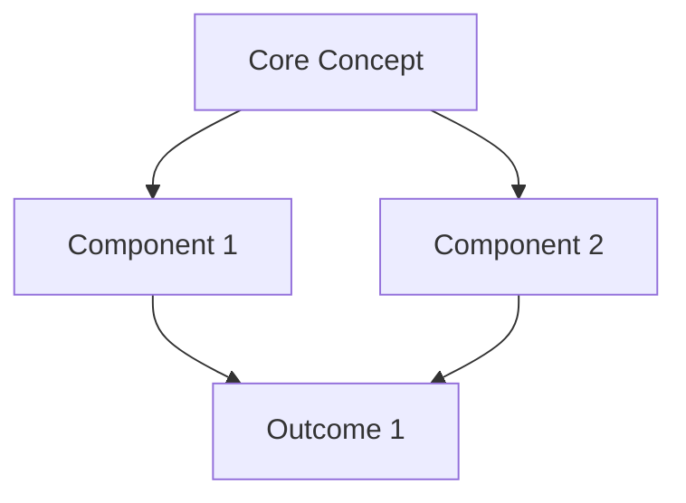
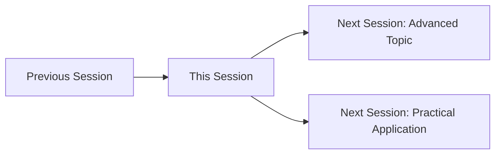

---

aliases: [Templater Syntax Reference, Templater Code Library, Templater Automation Patterns, Obsidian Template Examples]
---


---

aliases: [Daily Planning Templates, Daily Note Automation, Day Planning Templater, Daily Workflow Templates]
---

# Daily Planning & Daily Notes Templates

> [!abstract] Purpose
> Comprehensive Templater templates for daily planning, execution tracking, and reflection. Integrates task management, time blocking, habit tracking, and learning capture into cohesive daily workflow systems optimized for the [[obsidian]] ecosystem.

---

## 📚 Part I: Reusable Syntax Sequences

### Intelligent Time Block Generator with Energy Mapping

```javascript
<%*
// Generates personalized time blocks based on day type, energy patterns, and commitments
// Integrates with calendar events and adapts to user's chronotype
// Determine day type
const dayOfWeek = tp.date.now("dddd");
const isWeekend = dayOfWeek === "Saturday" || dayOfWeek === "Sunday";
const dayType = await tp.system.suggester(
    [
        "🏢 Standard Workday",
        "🎯 Deep Work Day (minimal meetings)",
        "🤝 Collaborative Day (many meetings)",
        "🏠 Flex/Hybrid Day",
        "🌴 Weekend/Off Day",
        "✈️ Travel Day",
        "🏥 Reduced Capacity Day"
    ],
    [
        "standard-work",
        "deep-work",
        "collaborative",
        "flex",
        "weekend",
        "travel",
        "reduced"
    ],
    false,
    `What type of day is ${dayOfWeek}?`
);
// If cancelled, provide minimal structure
if (!dayType) {
    tR = "## ⏰ Time Blocks\n\n**Morning**:\n\n**Afternoon**:\n\n**Evening**:\n\n";
    return;
}
// Get user's chronotype preference
const chronotype = await tp.system.suggester(
    [
        "🌅 Morning Person (peak: 8am-12pm)",
        "🌞 Midday Person (peak: 10am-3pm)",
        "🌆 Evening Person (peak: 3pm-8pm)",
        "🦉 Night Owl (peak: 8pm-2am)"
    ],
    ["morning", "midday", "evening", "night"],
    false,
    "What's your energy pattern today?"
);
// Define time block templates based on day type
const blockTemplates = {
    "standard-work": {
        blocks: [
            { time: "06:00-07:00", label: "🌅 Morning Routine", energy: "🟢", type: "personal" },
            { time: "07:00-08:00", label: "📧 Email & Planning", energy: "🟢", type: "admin" },
            { time: "08:00-10:00", label: "🎯 Deep Work Block 1", energy: "🟢🟢", type: "focus" },
            { time: "10:00-10:15", label: "☕ Break", energy: "⚪", type: "break" },
            { time: "10:15-12:00", label: "🎯 Deep Work Block 2", energy: "🟢", type: "focus" },
            { time: "12:00-13:00", label: "🍽️ Lunch & Walk", energy: "⚪", type: "break" },
            { time: "13:00-15:00", label: "🤝 Meetings / Collaborative Work", energy: "🟡", type: "collaborative" },
            { time: "15:00-15:15", label: "☕ Break", energy: "⚪", type: "break" },
            { time: "15:00-17:00", label: "📋 Tasks & Project Work", energy: "🟡", type: "work" },
            { time: "17:00-18:00", label: "📊 Review & Planning", energy: "🟡", type: "admin" },
            { time: "18:00-19:00", label: "🏃 Exercise / Personal Time", energy: "🟡", type: "personal" },
            { time: "19:00-21:00", label: "🏠 Evening Routine", energy: "🔴", type: "personal" },
            { time: "21:00-22:00", label: "📚 Learning / Reading", energy: "🔴", type: "learning" },
            { time: "22:00+", label: "😴 Wind Down & Sleep", energy: "🔴", type: "rest" }
        ]
    },
    "deep-work": {
        blocks: [
            { time: "06:00-07:00", label: "🌅 Morning Routine", energy: "🟢", type: "personal" },
            { time: "07:00-08:00", label: "📧 Quick Email Check", energy: "🟢", type: "admin" },
            { time: "08:00-11:00", label: "🎯 DEEP WORK SESSION 1 (no interruptions)", energy: "🟢🟢🟢", type: "focus" },
            { time: "11:00-11:30", label: "☕ Break & Movement", energy: "⚪", type: "break" },
            { time: "11:30-13:00", label: "🎯 Deep Work Session 2", energy: "🟢🟢", type: "focus" },
            { time: "13:00-14:00", label: "🍽️ Lunch & Recharge", energy: "⚪", type: "break" },
            { time: "14:00-16:30", label: "🎯 Deep Work Session 3", energy: "🟡🟡", type: "focus" },
            { time: "16:30-17:00", label: "📊 Capture & Process", energy: "🟡", type: "admin" },
            { time: "17:00+", label: "🏠 Personal Time", energy: "🔴", type: "personal" }
        ]
    },
    "collaborative": {
        blocks: [
            { time: "06:00-07:00", label: "🌅 Morning Routine", energy: "🟢", type: "personal" },
            { time: "07:00-08:30", label: "📧 Email & Prep for Meetings", energy: "🟢", type: "admin" },
            { time: "08:30-09:30", label: "🤝 Meeting 1", energy: "🟢", type: "meeting" },
            { time: "09:30-10:00", label: "☕ Break & Notes Processing", energy: "⚪", type: "break" },
            { time: "10:00-11:30", label: "🤝 Meeting 2 & 3", energy: "🟢", type: "meeting" },
            { time: "11:30-12:00", label: "📝 Action Items Capture", energy: "🟡", type: "admin" },
            { time: "12:00-13:00", label: "🍽️ Lunch", energy: "⚪", type: "break" },
            { time: "13:00-14:00", label: "🤝 Meeting 4", energy: "🟡", type: "meeting" },
            { time: "14:00-15:30", label: "📋 Follow-ups & Email", energy: "🟡", type: "work" },
            { time: "15:30-16:00", label: "☕ Break", energy: "⚪", type: "break" },
            { time: "16:00-17:00", label: "🤝 Meeting 5 / Wrap-up", energy: "🟡", type: "meeting" },
            { time: "17:00+", label: "🏠 Personal Time", energy: "🔴", type: "personal" }
        ]
    },
    "weekend": {
        blocks: [
            { time: "07:00-09:00", label: "🌅 Slow Morning Routine", energy: "🟢", type: "personal" },
            { time: "09:00-11:00", label: "🏃 Exercise / Outdoor Activity", energy: "🟢", type: "personal" },
            { time: "11:00-13:00", label: "🎨 Creative Project / Hobby", energy: "🟢", type: "creative" },
            { time: "13:00-14:00", label: "🍽️ Lunch", energy: "⚪", type: "break" },
            { time: "14:00-16:00", label: "🏠 Personal Projects / Errands", energy: "🟡", type: "personal" },
            { time: "16:00-18:00", label: "🤝 Social Time", energy: "🟡", type: "social" },
            { time: "18:00+", label: "🏠 Evening Routine", energy: "🔴", type: "personal" }
        ]
    },
    "flex": {
        blocks: [
            { time: "06:00-08:00", label: "🌅 Morning Routine", energy: "🟢", type: "personal" },
            { time: "08:00-10:00", label: "🎯 Focus Block 1", energy: "🟢🟢", type: "focus" },
            { time: "10:00-12:00", label: "📋 Flexible Work Block", energy: "🟢", type: "work" },
            { time: "12:00-13:00", label: "🍽️ Lunch", energy: "⚪", type: "break" },
            { time: "13:00-15:00", label: "🤝 Meetings / Admin", energy: "🟡", type: "collaborative" },
            { time: "15:00-17:00", label: "📋 Flexible Block 2", energy: "🟡", type: "work" },
            { time: "17:00+", label: "🏠 Personal Time", energy: "🔴", type: "personal" }
        ]
    },
    "travel": {
        blocks: [
            { time: "06:00-07:00", label: "🌅 Morning Routine", energy: "🟢", type: "personal" },
            { time: "07:00-09:00", label: "✈️ Travel Prep / Transit", energy: "🟡", type: "travel" },
            { time: "09:00-12:00", label: "✈️ Travel Time", energy: "🟡", type: "travel" },
            { time: "12:00-13:00", label: "🍽️ Lunch (in transit)", energy: "⚪", type: "break" },
            { time: "13:00-15:00", label: "✈️ Arrival & Setup", energy: "🟡", type: "travel" },
            { time: "15:00-17:00", label: "📧 Check-in & Light Work", energy: "🟡", type: "work" },
            { time: "17:00+", label: "🏨 Hotel / Rest", energy: "🔴", type: "rest" }
        ]
    },
    "reduced": {
        blocks: [
            { time: "07:00-09:00", label: "🌅 Gentle Morning", energy: "🟡", type: "personal" },
            { time: "09:00-11:00", label: "📧 Essential Tasks Only", energy: "🟡", type: "work" },
            { time: "11:00-12:00", label: "☕ Rest Break", energy: "⚪", type: "break" },
            { time: "12:00-13:00", label: "🍽️ Lunch", energy: "⚪", type: "break" },
            { time: "13:00-15:00", label: "📋 Light Work (optional)", energy: "🟡", type: "work" },
            { time: "15:00+", label: "🏠 Rest & Recovery", energy: "🔴", type: "rest" }
        ]
    }
};
// Get blocks for selected day type
const blocks = blockTemplates[dayType]?.blocks || blockTemplates["standard-work"].blocks;
// Build time block output
let output = "## ⏰ Time Blocks\n\n";
output += `> [!abstract] Day Structure: ${dayType.replace(/-/g, ' ').toUpperCase()}\n`;
output += `> Energy Pattern: ${chronotype}\n`;
output += `> 🟢 = High Energy | 🟡 = Medium Energy | 🔴 = Low Energy\n\n`;
// Ask if user wants to customize blocks
const customize = await tp.system.suggester(
    ["✅ Use template as-is", "✏️ I'll customize after generation"],
    [false, true],
    false,
    "Use standard template or customize?"
);
// Generate time blocks with checkboxes for tracking
blocks.forEach(block => {
    output += `### ${block.time} ${block.energy} ${block.label}\n\n`;
    
    if (block.type === "focus" || block.type === "work") {
        output += `**Planned:**\n- [ ] \n\n`;
        output += `**Actual:**\n\n`;
    } else if (block.type === "meeting") {
        output += `**Meeting:**\n**Attendees:**\n**Agenda:**\n**Notes:**\n\n`;
    } else if (block.type === "break" || block.type === "rest") {
        output += `*[Rest & recharge]*\n\n`;
    } else {
        output += `\n`;
    }
});
output += "\n---\n\n";
output += "## 🎯 Time Block Summary\n\n";
output += "| Time | Activity | Energy | Status |\n";
output += "|------|----------|--------|--------|\n";
blocks.forEach(block => {
    output += `| ${block.time} | ${block.label} | ${block.energy} | ⚪ |\n`;
});
tR = output;
-%>
```

**Use Cases:**
- Personalized daily schedules adapted to energy patterns and day types
- Energy-aware task allocation for optimal productivity
- Consistent time blocking across different day contexts
- Integration with chronotype research for performance optimization

**Integration Notes:**
- Combine with [[Day Planner]] plugin for visual timeline view
- Sync with calendar API to auto-populate meeting blocks
- Use energy indicators for task priority decisions
- Extend with automatic task suggestions based on block type

---

### Priority Task Selector with Eisenhower Matrix

```javascript
<%*
// Intelligently selects daily priorities using Eisenhower Matrix
// Pulls from task backlog and guides prioritization decisions
// Ask how many priority tasks for today
const taskCount = parseInt(await tp.system.prompt(
    "How many priority tasks for today? (Recommended: 3-5)",
    "3"
));
if (isNaN(taskCount) || taskCount < 1 || taskCount > 10) {
    tR = "## 🎯 Today's Priorities\n\n1. \n2. \n3. \n\n";
    return;
}
// Collect task information with Eisenhower Matrix classification
let tasks = [];
for (let i = 1; i <= taskCount; i++) {
    const taskName = await tp.system.prompt(`Priority ${i} - Task name`);
    
    if (!taskName) break; // Allow early exit
    
    // Eisenhower Matrix classification
    const isUrgent = await tp.system.suggester(
        ["⏰ YES - Time-sensitive / deadline", "📅 NO - Can wait"],
        [true, false],
        false,
        `Is "${taskName}" URGENT?`
    );
    
    const isImportant = await tp.system.suggester(
        ["⭐ YES - High-impact / strategic", "📋 NO - Low-impact"],
        [true, false],
        false,
        `Is "${taskName}" IMPORTANT?`
    );
    
    // Determine quadrant
    let quadrant, emoji, priority;
    if (isUrgent && isImportant) {
        quadrant = "Q1: Do First (Urgent & Important)";
        emoji = "🔴";
        priority = 1;
    } else if (!isUrgent && isImportant) {
        quadrant = "Q2: Schedule (Not Urgent but Important)";
        emoji = "🟢";
        priority = 2;
    } else if (isUrgent && !isImportant) {
        quadrant = "Q3: Delegate (Urgent but Not Important)";
        emoji = "🟡";
        priority = 3;
    } else {
        quadrant = "Q4: Eliminate (Neither Urgent nor Important)";
        emoji = "⚪";
        priority = 4;
    }
    
    // Estimate time required
    const estimatedTime = await tp.system.suggester(
        ["⚡ 15-30 min", "⏱️ 30-60 min", "🕐 1-2 hours", "🕒 2-4 hours", "📅 4+ hours / multi-day"],
        ["15-30min", "30-60min", "1-2hrs", "2-4hrs", "4+hrs"],
        false,
        `Time estimate for "${taskName}"?`
    );
    
    // Energy requirement
    const energyLevel = await tp.system.suggester(
        ["🟢 High Energy (deep focus)", "🟡 Medium Energy", "🔵 Low Energy (routine)"],
        ["high", "medium", "low"],
        false,
        `Energy required for "${taskName}"?`
    );
    
    tasks.push({
        name: taskName,
        quadrant: quadrant,
        emoji: emoji,
        priority: priority,
        urgent: isUrgent,
        important: isImportant,
        time: estimatedTime,
        energy: energyLevel
    });
}
// Sort by priority quadrant
tasks.sort((a, b) => a.priority - b.priority);
// Build priority output
let output = "## 🎯 Today's Priorities (Eisenhower Matrix)\n\n";
output += "> [!important] Priority Focus\n";
output += "> Total tasks: " + tasks.length + "\n";
output += "> Estimated time: " + tasks.map(t => t.time).join(', ') + "\n\n";
// Group by quadrant
const quadrants = {
    1: { name: "Q1: 🔴 DO FIRST", tasks: [] },
    2: { name: "Q2: 🟢 SCHEDULE", tasks: [] },
    3: { name: "Q3: 🟡 DELEGATE", tasks: [] },
    4: { name: "Q4: ⚪ ELIMINATE", tasks: [] }
};
tasks.forEach(task => {
    quadrants[task.priority].tasks.push(task);
});
// Output by quadrant
Object.values(quadrants).forEach(q => {
    if (q.tasks.length > 0) {
        output += `### ${q.name}\n\n`;
        q.tasks.forEach((task, idx) => {
            output += `- [ ] **${task.name}**\n`;
            output += `  - ⏱️ Time: ${task.time}\n`;
            output += `  - ⚡ Energy: ${task.energy}\n`;
            output += `  - 📝 Notes: \n\n`;
        });
    }
});
output += "\n---\n\n";
// Add Eisenhower Matrix visualization
output += "## 📊 Eisenhower Matrix Visualization\n\n";
output += "```\n";
output += "                URGENT              |           NOT URGENT\n";
output += "    --------------------------------|--------------------------------\n";
output += " I  |  Q1: DO FIRST 🔴            |  Q2: SCHEDULE 🟢             \n";
output += " M  |  Crisis, Deadlines           |  Planning, Development        \n";
output += " P  |  " + quadrants[1].tasks.map(t => t.name.substring(0,25)).join(', ') + "\n";
output += " O  |                              |  " + quadrants[2].tasks.map(t => t.name.substring(0,25)).join(', ') + "\n";
output += " R  |------------------------------|------------------------------\n";
output += " T  |  Q3: DELEGATE 🟡            |  Q4: ELIMINATE ⚪            \n";
output += " A  |  Interruptions, Busywork     |  Distractions, Time Wasters   \n";
output += " N  |  " + quadrants[3].tasks.map(t => t.name.substring(0,25)).join(', ') + "\n";
output += " T  |                              |  " + quadrants[4].tasks.map(t => t.name.substring(0,25)).join(', ') + "\n";
output += "```\n\n";
// Add strategic recommendations
output += "## 💡 Strategic Recommendations\n\n";
if (quadrants[1].tasks.length > 3) {
    output += "> [!warning] Too Many Q1 Tasks\n";
    output += "> You have " + quadrants[1].tasks.length + " urgent+important tasks. This indicates:\n";
    output += "> - Possible poor planning or Q2 neglect\n";
    output += "> - High stress/crisis mode\n";
    output += "> - Consider: What Q2 work would have prevented these crises?\n\n";
}
if (quadrants[2].tasks.length === 0) {
    output += "> [!attention] No Q2 Tasks Scheduled\n";
    output += "> Q2 (Important but Not Urgent) is where high-impact work happens.\n";
    output += "> Without Q2 focus, you'll stay in reactive crisis mode.\n";
    output += "> Add: Strategic planning, skill development, relationship building\n\n";
}
if (quadrants[3].tasks.length > 0) {
    output += "> [!helpful-tip] Delegation Opportunities\n";
    output += "> Q3 tasks are urgent but not important - perfect for delegation.\n";
    output += "> Can any of these be: Automated, Delegated, or Simplified?\n\n";
}
if (quadrants[4].tasks.length > 0) {
    output += "> [!warning] Q4 Tasks to Eliminate\n";
    output += "> These tasks are neither urgent nor important.\n";
    output += "> Seriously consider: Do these need to be done at all?\n\n";
}
tR = output;
-%>
```

**Use Cases:**
- Strategic daily task prioritization using proven frameworks
- Identification of crisis patterns and prevention opportunities
- Delegation and elimination decision support
- Energy-aware task scheduling for optimal performance

**Integration Notes:**
- Combine with [[Tasks Plugin]] for checkbox functionality and queries
- Link to project management notes for strategic context
- Track quadrant patterns over time to identify planning issues
- Use with time block generator to assign tasks to energy-appropriate slots

---

### Daily Habit Tracker with Streak Management

```javascript
<%*
// Generates daily habit tracking with streak calculation
// Supports habit categories and provides motivational feedback

// Define habit categories with defaults
const habitCategories = {
    "Health & Wellness": [
        "🏃 Exercise (30+ min)",
        "💧 Hydrate (8+ glasses)",
        "🥗 Healthy eating",
        "😴 Sleep 7-8 hours",
        "🧘 Meditation/mindfulness"
    ],
    "Productivity": [
        "📚 Deep work block completed",
        "📥 Inbox zero achieved",
        "📝 Daily planning done",
        "🎯 Top 3 priorities completed",
        "📊 Weekly review"
    ],
    "Learning & Growth": [
        "📖 Reading (30+ min)",
        "🎓 Course/tutorial progress",
        "✍️ Writing/journaling",
        "🧠 New concept learned",
        "🎨 Creative work"
    ],
    "Personal": [
        "👥 Meaningful social connection",
        "🏠 Home maintenance task",
        "💰 Financial review",
        "🎮 Hobby time",
        "📞 Family check-in"
    ]
};
// Ask if user wants custom habits or standard set
const useCustom = await tp.system.suggester(
    ["📋 Use my standard habit list", "✏️ Customize for today"],
    [false, true],
    false,
    "Habit tracking approach?"
);
let selectedHabits = [];
if (useCustom) {
    // Allow selection from categories
    const categories = Object.keys(habitCategories);
    const selectedCategory = await tp.system.suggester(
        categories,
        categories,
        false,
        "Select habit category (or cancel to skip)"
    );
    
    if (selectedCategory) {
        // Multi-select from category
        const categoryHabits = habitCategories[selectedCategory];
        for (let habit of categoryHabits) {
            const include = await tp.system.suggester(
                [`✅ Include: ${habit}`, "⏭️ Skip"],
                [true, false],
                false,
                "Track this habit today?"
            );
            if (include) {
                selectedHabits.push(habit);
            }
        }
    }
} else {
    // Use all habits from all categories
    for (let category in habitCategories) {
        selectedHabits = selectedHabits.concat(habitCategories[category]);
    }
}
// If no habits selected, provide basic template
if (selectedHabits.length === 0) {
    tR = "## ✅ Daily Habits\n\n- [ ] Habit 1\n- [ ] Habit 2\n- [ ] Habit 3\n\n";
    return;
}
// Build habit tracker output
let output = "## ✅ Daily Habits\n\n";
output += "> [!attention] Habit Tracking\n";
output += "> Check off completed habits. Consistency builds momentum!\n";
output += "> Track: " + selectedHabits.length + " habits today\n\n";

// Organize by category
for (let category in habitCategories) {
    const categoryHabits = selectedHabits.filter(h => 
        habitCategories[category].includes(h)
    );
    
    if (categoryHabits.length > 0) {
        output += `### ${category}\n\n`;
        categoryHabits.forEach(habit => {
            output += `- [ ] ${habit}\n`;
        });
        output += "\n";
    }
}
output += "---\n\n";
// Add reflection prompts
output += "## 💭 Habit Reflections\n\n";
output += "**What helped me succeed with habits today:**\n\n\n";
output += "**Obstacles I encountered:**\n\n\n";
output += "**Adjustments for tomorrow:**\n\n\n";
// Add streak tracking template
output += "---\n\n";
output += "## 🔥 Streak Status\n\n";
output += "*Update manually or use Dataview query to calculate*\n\n";
output += "| Habit | Current Streak | Best Streak | Notes |\n";
output += "|-------|----------------|-------------|-------|\n";
selectedHabits.forEach(habit => {
    output += `| ${habit} | 0 days | 0 days | |\n`;
});
output += "\n";
// Add habit statistics section
output += "## 📊 Habit Insights\n\n";
output += "**Completion Rate:**\n";
output += "Today: ` = (length(filter(this.file.tasks.completed, (t) => t)) / length(this.file.tasks)) * 100`%\n";
output += "This Week: *[Link to weekly stats]*\n";
output += "This Month: *[Link to monthly stats]*\n\n";
output += "**Strongest Habits:** *[Habits with longest streaks]*\n\n";
output += "**Needs Attention:** *[Habits frequently missed]*\n\n";
// Motivational element based on day of week
const dayOfWeek = moment().day(); // 0 = Sunday
const motivationalMessages = [
    "🌅 Sunday: Fresh start for the week ahead. Set intentions!",
    "💪 Monday: Build momentum early. You've got this!",
    "🎯 Tuesday: Stay consistent. Small wins compound!",
    "🔥 Wednesday: Midweek power! Keep the streak alive!",
    "⚡ Thursday: Almost there! Finish strong!",
    "🎉 Friday: Wrap up the week with pride!",
    "🌴 Saturday: Maintain habits even while recharging!"
];
output += `> [!helpful-tip] ${motivationalMessages[dayOfWeek]}\n`;
tR = output;
-%>
```

**Use Cases:**
- Systematic daily habit tracking across multiple life domains
- Streak monitoring for motivation and accountability
- Pattern identification for habit optimization
- Integration with long-term behavior change goals

**Integration Notes:**
- Use [[dataview]] queries to calculate actual streaks across daily notes
- Combine with [[Tracker Plugin]] for visual habit charts
- Link to [[Goals MOC]] for alignment with long-term objectives
- Export data for statistical analysis of habit success factors

---

### Evening Reflection & Tomorrow Preview Generator

```javascript
<%*
// Generates structured evening reflection and next-day preview
// Includes gratitude, learning capture, and planning elements
// Gratitude practice
const gratitudeCount = 3;
let gratitudes = [];
output += "## 🙏 Gratitude Practice\n\n";
output += "> [!helpful-tip] Three Good Things\n";
output += "> Reflecting on positive moments improves well-being and sleep quality.\n\n";
for (let i = 1; i <= gratitudeCount; i++) {
    const gratitude = await tp.system.prompt(`Gratitude ${i}: What are you thankful for today?`);
    if (gratitude) {
        gratitudes.push(gratitude);
        output += `${i}. ${gratitude}\n`;
    } else {
        output += `${i}. \n`;
    }
}
output += "\n---\n\n";
// Day assessment
output += "## 📊 Day Assessment\n\n";
const dayRating = await tp.system.suggester(
    [
        "⭐⭐⭐⭐⭐ Excellent - Highly productive and fulfilling",
        "⭐⭐⭐⭐ Good - Accomplished key goals",
        "⭐⭐⭐ Average - Made progress, some challenges",
        "⭐⭐ Below Average - Struggled with focus/energy",
        "⭐ Poor - Unproductive or difficult day"
    ],
    [5, 4, 3, 2, 1],
    false,
    "How would you rate today overall?"
);
output += `**Overall Rating**: ${"⭐".repeat(dayRating || 3)}\n\n`;
const energyLevel = await tp.system.suggester(
    ["🔋 High Energy", "⚡ Moderate Energy", "🪫 Low Energy", "😴 Depleted"],
    ["high", "moderate", "low", "depleted"],
    false,
    "How was your energy today?"
);
output += `**Energy Level**: ${energyLevel}\n\n`;
output += "**What went well:**\n";
output += "- \n- \n- \n\n";
output += "**What was challenging:**\n";
output += "- \n- \n\n";
output += "**What I learned about myself:**\n\n\n";
output += "---\n\n";
// Learning capture
output += "## 💡 Today's Learning\n\n";
output += "> [!example] Knowledge Capture\n";
output += "> Document insights, concepts, or skills from today.\n\n";
output += "**New concepts encountered:**\n";
output += "- [[Concept 1]]: \n";
output += "- [[Concept 2]]: \n\n";
output += "**Skills practiced:**\n";
output += "- \n\n";
output += "**Insights or \"aha!\" moments:**\n";
output += "- \n\n";
output += "**Questions raised:**\n";
output += "- [ ] Question 1\n";
output += "- [ ] Question 2\n\n";
output += "---\n\n";
// Task completion review
output += "## ✅ Task Completion Review\n\n";
const completedTasks = await tp.system.prompt(
    "How many priority tasks did you complete? (number)",
    "0"
);
const totalTasks = await tp.system.prompt(
    "How many priority tasks did you have? (number)",
    "3"
);
const completionRate = totalTasks > 0 
    ? Math.round((completedTasks / totalTasks) * 100) 
    : 0;
output += `**Completion Rate**: ${completedTasks}/${totalTasks} (${completionRate}%)\n\n`;
if (completionRate >= 80) {
    output += "> [!important] Excellent Progress! 🎉\n\n";
} else if (completionRate >= 50) {
    output += "> [!attention] Good effort. What blocked the rest?\n\n";
} else {
    output += "> [!warning] Low completion. What happened?\n\n";
}
output += "**Completed:**\n";
output += "- \n\n";
output += "**Incomplete (and why):**\n";
output += "- \n\n";
output += "**Rollover to tomorrow:**\n";
output += "- [ ] \n\n";
output += "---\n\n";
// Tomorrow preview
output += "## 🔮 Tomorrow Preview\n\n";
const tomorrowDate = moment(tp.date.now("YYYY-MM-DD")).add(1, 'days');
const tomorrowDay = tomorrowDate.format("dddd, MMMM DD, YYYY");
output += `> [!abstract] ${tomorrowDay}\n\n`;
output += "**Tomorrow's focus:**\n\n\n";
output += "**Top 3 priorities:**\n";
output += "1. [ ] \n";
output += "2. [ ] \n";
output += "3. [ ] \n\n";
output += "**Scheduled commitments:**\n";
output += "- \n\n";
output += "**Preparation needed tonight:**\n";
output += "- [ ] \n";
output += "- [ ] \n\n";
output += "**Intention for tomorrow:**\n";
output += "*What one thing would make tomorrow successful?*\n\n\n";
output += "---\n\n";
// Wind-down routine
output += "## 😴 Wind-Down Checklist\n\n";
output += "- [ ] Review and close open loops\n";
output += "- [ ] Prepare workspace for tomorrow\n";
output += "- [ ] Set out clothes/items needed\n";
output += "- [ ] Digital devices away 30min before sleep\n";
output += "- [ ] Evening routine completed\n";
output += "- [ ] Sleep environment optimized\n\n";
output += "**Target bedtime**: \n";
output += "**Actual bedtime**: \n\n";
tR = output;
-%>
```

**Use Cases:**
- Structured evening reflection for learning consolidation
- Gratitude practice for well-being and positive psychology
- Task completion analysis for productivity improvement
- Tomorrow planning for reduced morning decision fatigue

**Integration Notes:**
- Link completed tasks to project tracking notes
- Connect learning captures to [[Learning Log]] or concept notes
- Use day ratings for longitudinal mood/productivity tracking
- Integrate tomorrow preview with morning planning routine

---

## 🗂️ Part II: Complete Template Implementations

### Comprehensive Daily Note Template

```markdown
---
type: daily-note
date: <% tp.date.now("YYYY-MM-DD") %>
day_of_week: <% tp.date.now("dddd") %>
week_number: <% moment(tp.date.now("YYYY-MM-DD")).week() %>
month: <% tp.date.now("MMMM YYYY") %>
tags: #daily-note #<% tp.date.now("YYYY") %> #<% tp.date.now("YYYY-MM") %>
weather: "<% await tp.system.prompt("Weather/mood context (optional)", "") %>"
created: <% tp.date.now("YYYY-MM-DD HH:mm") %>
---

# 📅 <% tp.date.now("dddd, MMMM DD, YYYY") %>

> [!abstract] Daily Overview
> **Week** <% moment(tp.date.now("YYYY-MM-DD")).week() %> of <%= moment(tp.date.now("YYYY-MM-DD")).year() %>
> **Weather/Context**: <% tp.frontmatter.weather || "Not specified" %>
> **Focus Word**: *<% await tp.system.prompt("One word intention for today", "Focus") %>*

---

## ☀️ Morning Planning

### 🎯 Top 3 Priorities (MIT - Most Important Tasks)

<%* tR = await tp.user["Priority Task Selector with Eisenhower Matrix"]() -%>

### 💭 Morning Intention

**What I want to accomplish today:**


**How I want to feel at day's end:**


**One thing I'm looking forward to:**


---

<%* tR = await tp.user["Intelligent Time Block Generator with Energy Mapping"]() -%>

---

## 📝 Captured Notes & Ideas

### 💡 Ideas & Insights
*Quick capture throughout the day*


### 📧 Important Communications


### 🤝 Meetings & Conversations

#### Meeting: [Title]
- **Time**: 
- **Attendees**: 
- **Purpose**: 
- **Key Points**:
  - 
- **Action Items**:
  - [ ] 
- **Follow-up**: 

---

## 📚 Learning Log

**Concepts explored today:**
- [[Concept 1]]: 
- [[Concept 2]]: 

**Resources consumed:**
- 📖 Reading: 
- 🎥 Video/Course: 
- 🎙️ Podcast: 

**Questions that arose:**
- 

**Connections made:**
- This relates to [[Previous Concept]] because…

---

<%* tR = await tp.user["Daily Habit Tracker with Streak Management"]() -%>

---

## 📊 Daily Metrics

### ⏱️ Time Tracking Summary

| Category | Planned | Actual | Variance |
|----------|---------|--------|----------|
| Deep Work | | | |
| Meetings | | | |
| Admin/Email | | | |
| Learning | | | |
| Personal | | | |

**Time well spent:**

**Time wasted:**

### 💰 Financial Log *(optional)*
**Income**: 
**Expenses**: 
**Notes**: 

### 🏃 Health & Wellness
- **Exercise**: 
- **Steps/Movement**: 
- **Water intake**: 
- **Meals quality**: 
- **Sleep (previous night)**: <% await tp.system.prompt("Hours slept last night", "7") %> hours

---

## 🌟 Wins & Gratitude

### 🎉 Today's Wins
*Big or small victories*

1. 
2. 
3. 

### 🙏 Gratitude
*Three things I'm grateful for*

1. 
2. 
3. 

---

## 🔄 Evening Review

### 📈 Progress Assessment

**Priorities completed**: ` = length(filter(this.file.tasks.completed, (t) => t)) ` / ` = length(this.file.tasks) `

**What worked well:**


**What didn't work:**


**What I learned:**


### 💭 Reflection Questions

**Did I work on what matters most?**


**Was I present and focused?**


**What would I do differently?**


**What am I proud of today?**


---

## 🔗 Daily Connections

**Yesterday**: [[<% tp.date.now("YYYY-MM-DD", -1, tp.file.title, "YYYY-MM-DD") %>]]
**Tomorrow**: [[<% tp.date.now("YYYY-MM-DD", 1, tp.file.title, "YYYY-MM-DD") %>]]

**Weekly Note**: [[<% tp.date.now("YYYY-[W]ww") %>]]
**Monthly Note**: [[<% tp.date.now("YYYY-MM") %> Monthly Review]]

**Related Projects**:
- 

**Related Areas**:
- 

---

## 📎 References & Links

**Files created today:**
- 

**Important notes referenced:**
- 

**External resources:**
- 

---

*Daily note created: <% tp.date.now("YYYY-MM-DD HH:mm") %>*
*Last updated: <% tp.date.now("YYYY-MM-DD HH:mm") %>*
```

**Template Purpose:** Comprehensive daily note combining planning, execution tracking, learning capture, habit monitoring, and reflection into a unified daily operating system. Designed as the central hub for [[03-notes/01_permanent-notes/02_personal-knowledge-base/Personal Knowledge Management]] and [[productivity]] workflows.

**Key Features:**
- Integration of all four reusable syntax sequences (time blocks, priority tasks, habits, reflection)
- Multi-dimensional tracking (time, tasks, habits, health, learning, gratitude)
- Structured sections for different parts of the day (morning, during, evening)
- Automatic date navigation and hierarchical note linking
- Dataview-compatible metadata and task tracking
- Flexible sections that can be filled as needed throughout the day

**Customization Points:**
- Remove sections that don't fit your workflow (financial log, health metrics, etc.)
- Adjust time block generation parameters for your schedule
- Modify habit categories to match your goals
- Add domain-specific sections (creative work, research progress, client work)
- Integrate with calendar APIs for automatic meeting population
- Connect to external tracking apps (fitness, time tracking, etc.)

---

### Focus-Mode Daily Note (Minimal Distraction)

```markdown
---
type: daily-note-minimal
date: <% tp.date.now("YYYY-MM-DD") %>
tags: #daily-note #focus-mode
mode: "🎯 Deep Work Day"
---

# <% tp.date.now("dddd, MMMM DD") %>

> [!important] Today's Mission
> *One primary objective for today:*
> 
> **<% await tp.system.prompt("What is THE most important thing to accomplish today?") %>**

---

## 🎯 The Big Three

1. [ ] **<% await tp.system.prompt("Priority 1") %>**
   - Why it matters: 
   - Success looks like: 
   
2. [ ] **<% await tp.system.prompt("Priority 2") %>**
   - Why it matters: 
   - Success looks like: 

3. [ ] **<% await tp.system.prompt("Priority 3") %>**
   - Why it matters: 
   - Success looks like: 

---

## ⏰ Focus Blocks

**Morning Block** (08:00-12:00)
- Working on: [Priority #]
- Distractions to avoid: 
- Environment setup: 

**Afternoon Block** (13:00-17:00)
- Working on: [Priority #]
- Energy management: 
- Break schedule: 

---

## 📝 Capture Zone

*Quick notes, ideas, or interruptions - process later*

- 

---

## ✅ Day Complete

**Completed**: 

**Proud of**: 

**Tomorrow's focus**: [[<% tp.date.now("YYYY-MM-DD", 1) %>]]

---

[[<% tp.date.now("YYYY-MM-DD", -1) %>]] ← | → [[<% tp.date.now("YYYY-MM-DD", 1) %>]]
```

**Template Purpose:** Minimalist daily note for deep work days when extensive tracking would be counterproductive. Emphasizes singular focus, minimal sections, and distraction reduction for [[deep work]] and [[Flow State]] optimization.

**Key Features:**
- Single mission statement for day-level focus
- "Big Three" priorities only (no overwhelming task lists)
- Two-block time structure for sustained focus sessions
- Minimal capture zone to park interruptions without disrupting flow
- Stripped-down design reduces cognitive load and decision fatigue
- Fast end-of-day review without extensive reflection prompts

**Customization Points:**
- Adjust focus block times to match your peak productivity windows
- Add/remove based on personal focus needs
- Pair with [[03-notes/01_permanent-notes/01_cognitive-development/Pomodoro Technique]] or other time management methods
- Create different versions for different work contexts (writing days, coding days, etc.)

---

### Weekly Planning & Review Daily Trigger Template

`````markdown
---
type: daily-note-weekly-review
date: <% tp.date.now("YYYY-MM-DD") %>
day_of_week: <% tp.date.now("dddd") %>
tags: #daily-note #weekly-review-day
weekly_review: true
---

# 📅 <% tp.date.now("dddd, MMMM DD, YYYY") %>

> [!attention] Weekly Review Day
> Today is your designated weekly review day. Plan to spend 30-60 minutes reviewing the past week and planning the next.

---

## 📊 This Week in Review

**Week**: <% moment(tp.date.now("YYYY-MM-DD")).week() %> of <% moment(tp.date.now("YYYY-MM-DD")).year() %>
**Date Range**: <% moment(tp.date.now("YYYY-MM-DD")).startOf('week').format("MMM DD") %> - <% moment(tp.date.now("YYYY-MM-DD")).endOf('week').format("MMM DD") %>

### 🎯 Goal Progress

**Weekly goals set:**
1. 
2. 
3. 

**Achievement status:**
- ✅ Completed: 
- 🔄 In Progress: 
- ❌ Not Started: 

### 📈 Weekly Statistics

**Dataview Query Area** *(requires Dataview plugin)*

```dataview
TABLE
  length(filter(file.tasks, (t) => t.completed)) as "Completed",
  length(file.tasks) as "Total",
  round((length(filter(file.tasks, (t) => t.completed)) / length(file.tasks)) * 100, 1) + "%" as "Completion"
FROM "Daily Notes"
WHERE date >= date(<% moment(tp.date.now("YYYY-MM-DD")).startOf('week').format("YYYY-MM-DD") %>)
  AND date <= date(<% moment(tp.date.now("YYYY-MM-DD")).endOf('week').format("YYYY-MM-DD") %>)
  AND file.day
```

### 💡 Key Learnings

**What worked well this week:**


**What didn't work:**


**Patterns noticed:**


**Insights gained:**


---

## 🔮 Next Week Planning

**Week** <% moment(tp.date.now("YYYY-MM-DD")).add(1, 'week').week() %> Goals

### 🎯 Primary Objectives

1. **<% await tp.system.prompt("Next week - Primary Goal 1") %>**
   - Success metric: 
   - Key actions: 
   
2. **<% await tp.system.prompt("Next week - Primary Goal 2") %>**
   - Success metric: 
   - Key actions: 

3. **<% await tp.system.prompt("Next week - Primary Goal 3") %>**
   - Success metric: 
   - Key actions: 

### 📅 Weekly Schedule Preview

**Monday** (<% moment(tp.date.now("YYYY-MM-DD")).add(1, 'week').startOf('week').add(1, 'day').format("MMM DD") %>):
- Focus: 
- Key task: 

**Tuesday**:
- Focus: 
- Key task: 

**Wednesday**:
- Focus: 
- Key task: 

**Thursday**:
- Focus: 
- Key task: 

**Friday**:
- Focus: 
- Key task: 

**Weekend**:
- Personal priorities: 
- Rest & recovery: 

### 🔧 Systems & Habits

**Habits to strengthen:**
- 

**Systems to implement:**
- 

**Adjustments to make:**
- 

---

## 📝 Today's Tasks

*After weekly planning, focus on today's immediate actions*

### 🎯 Priorities

1. [ ] **Complete weekly review**
   - Time estimate: 45 minutes
   
2. [ ] **<% await tp.system.prompt("Today's Priority 2") %>**

3. [ ] **<% await tp.system.prompt("Today's Priority 3") %>**

### 📋 Weekly Review Checklist

- [ ] Review previous week's daily notes
- [ ] Check project progress updates
- [ ] Process inbox to zero (email, messages, notes)
- [ ] Review calendar for next week
- [ ] Update project statuses
- [ ] Archive completed items
- [ ] Set goals for next week
- [ ] Identify lessons learned
- [ ] Schedule important tasks on calendar
- [ ] Prepare workspace for the week ahead

---

## 🔗 Weekly Links

**This Week**: [[<% tp.date.now("YYYY-[W]ww") %>]]
**Next Week**: [[<% moment(tp.date.now("YYYY-MM-DD")).add(1, 'week').format("YYYY-[W]ww") %>]]
**Monthly Review**: [[<% tp.date.now("YYYY-MM") %> Monthly Review]]

**Daily Notes This Week**:
- [[<% moment(tp.date.now("YYYY-MM-DD")).startOf('week').add(1, 'day').format("YYYY-MM-DD") %>]] (Monday)
- [[<% moment(tp.date.now("YYYY-MM-DD")).startOf('week').add(2, 'days').format("YYYY-MM-DD") %>]] (Tuesday)
- [[<% moment(tp.date.now("YYYY-MM-DD")).startOf('week').add(3, 'days').format("YYYY-MM-DD") %>]] (Wednesday)
- [[<% moment(tp.date.now("YYYY-MM-DD")).startOf('week').add(4, 'days').format("YYYY-MM-DD") %>]] (Thursday)
- [[<% moment(tp.date.now("YYYY-MM-DD")).startOf('week').add(5, 'days').format("YYYY-MM-DD") %>]] (Friday)

---

*Created: <% tp.date.now("YYYY-MM-DD HH:mm") %>*
*Weekly review completed: [ ]*
`````

**Template Purpose:** Specialized daily note for weekly review and planning days (typically Sunday evening or Monday morning). Combines [[GTD Weekly Review]] methodology with forward planning and maintains daily note structure for consistency. Designed for [[Strategic Planning]] at the weekly cadence.

**Key Features:**
- Automatic weekly review triggers and checklists
- Dataview integration for automated weekly statistics
- Past week analysis with goal tracking and pattern recognition
- Future week planning with daily intention setting
- Links to all daily notes from the past and upcoming week
- Balance between reflection and forward-looking action planning
- Weekly review checklist based on [[Getting Things Done]] methodology

**Customization Points:**
- Adjust review checklist items to match your GTD system
- Modify goal categories for your life domains
- Add domain-specific review sections (finances, health metrics, learning progress)
- Integrate with project management system for status updates
- Connect to habit tracking for weekly pattern analysis
- Customize for different weekly review cadences (Sunday night vs Monday morning)

---

### Weekend Daily Note Template

```markdown
---
type: daily-note-weekend
date: <% tp.date.now("YYYY-MM-DD") %>
day_of_week: <% tp.date.now("dddd") %>
tags: #daily-note #weekend
mode: "🌴 Rest & Recharge"
---

# 🌴 <% tp.date.now("dddd, MMMM DD, YYYY") %>

> [!abstract] Weekend Intentions
> **Mode**: <% tp.frontmatter.mode %>
> **Focus**: *<% await tp.system.suggester(["Rest & Recovery", "Personal Projects", "Social & Family", "Adventure & Exploration", "Learning & Growth", "Mixed"], ["rest", "projects", "social", "adventure", "learning", "mixed"]) %>*

---

## 🎨 Weekend Priorities

### ⚖️ Rest vs. Activity Balance

**Energy level today**: <% await tp.system.suggester(["🔋 High - Ready for activities", "⚡ Medium - Balanced day", "🪫 Low - Need rest focus"], ["high", "medium", "low"]) %>

**Desired balance**:
- 🏠 Rest & relaxation: ____%
- 🎯 Personal projects: ____%
- 👥 Social time: ____%

### ✅ Weekend To-Do's

**Must-Do** (Essential tasks):
- [ ] 
- [ ] 

**Nice-to-Do** (If time/energy permits):
- [ ] 
- [ ] 

**Absolutely Not** (Protecting boundaries):
- ❌ No work email checking
- ❌ 

---

## 🏠 Home & Personal

### 🧹 Home Maintenance

- [ ] 
- [ ] 

### 💰 Personal Admin

- [ ] 
- [ ] 

### 🎯 Personal Projects

**Project**: 
**Time allocated**: 
**Goal for today**: 

---

## 🤝 Social & Relationships

**Connections planned:**
- 

**Quality time with:**
- 

**Reach out to:**
- 

---

## 🎨 Creative & Learning

**Creative activities:**
- 

**Learning/Reading:**
- 

**Skills to practice:**
- 

---

## 🏃 Wellness & Self-Care

### Physical

- [ ] Movement/Exercise: 
- [ ] Healthy meals prepared: 
- [ ] Sleep quality focus

### Mental

- [ ] Meditation/Mindfulness: 
- [ ] Journaling: 
- [ ] Digital detox time: 

### Emotional

**Mood check-in**: 

**What I need today**: 

---

## 🌟 Weekend Wins

**Accomplished:**


**Moments I enjoyed:**


**What recharged me:**


---

## 🔄 Week Transition

### 📊 Last Week Closure

**Incomplete work items** (let them go for now):
- 

**Wins to celebrate**:
- 

### 🔮 Next Week Prep

**Quick preview** (don't deep plan - save for weekly review):

**Monday's focus will be**: 

**One thing to prep today**:
- [ ] 

---

## 💭 Weekend Reflection

**Did I rest enough?**

**Did I do things I enjoy?**

**Do I feel recharged for the week ahead?**

**What made this weekend good:**


---

## 🔗 Navigation

**Yesterday**: [[<% tp.date.now("YYYY-MM-DD", -1) %>]]
**Tomorrow**: [[<% tp.date.now("YYYY-MM-DD", 1) %>]]
**This Week**: [[<% tp.date.now("YYYY-[W]ww") %>]]

---

*Created: <% tp.date.now("YYYY-MM-DD HH:mm") %>*
```

**Template Purpose:** Weekend-specific daily note emphasizing rest, recharge, and non-work priorities while maintaining daily note continuity. Designed to prevent [[Burnout]], support [[work-life balance]], and intentionally structure recovery time for sustainable productivity.

**Key Features:**
- Rest vs. activity balance assessment and planning
- Boundary protection (explicit "Absolutely Not" section)
- Multiple life domain coverage (home, social, creative, wellness)
- Lighter task structure compared to weekday templates
- Weekend-specific win categories (enjoyment, recharge)
- Minimal work-week transition section (saves deep planning for designated review time)
- Mood and energy tracking for recovery effectiveness

**Customization Points:**
- Adjust sections based on your weekend priorities and lifestyle
- Add family-specific activities if applicable
- Include hobby or sport-specific tracking sections
- Modify rest categories for your self-care practices
- Create separate templates for Saturday vs. Sunday with different emphases
- Integrate with meal planning, fitness routines, or other weekend rituals

---

# 🔗 Related Topics for PKB Expansion

1. **[[Time Blocking Methodology]]**
   - *Connection*: Deep dive into energy management, calendar blocking techniques, and attention architecture beyond basic daily scheduling
   - *Depth Potential*: Explore Cal Newport's [[deep work]] principles, circadian rhythm optimization, protection strategies against context switching, and ideal-week design
   - *Knowledge Graph Role*: Productivity methodology hub connecting cognitive science, workflow design, and personal effectiveness principles

2. **[[Habit Formation Science]]**
   - *Connection*: Neurological and behavioral foundations of habit development, including cue-routine-reward loops, habit stacking, and identity-based change
   - *Depth Potential*: Synthesis of [[Atomic Habits]] (Clear), [[The Power of Habit]] (Duhigg), [[Tiny Habits]] (Fogg), implementation intention research, and environmental design
   - *Knowledge Graph Role*: Behavioral psychology cluster linking neuroscience, personal development, and systems thinking

3. **[[Daily Review Frameworks]]**
   - *Connection*: Structured reflection methodologies beyond basic gratitude journaling, including [[Stoic Evening Meditation]], [[AAR (After Action Review)]], and evidence-based reflection practices
   - *Depth Potential*: Comparative analysis of reflection frameworks, metacognitive skill development, emotional regulation through structured processing, and learning consolidation research
   - *Knowledge Graph Role*: Self-improvement practices domain connecting psychology, learning theory, and wisdom traditions

4. **[[Dataview Queries for Daily Notes]]**
   - *Connection*: Advanced Dataview query patterns for aggregating daily note data into actionable insights, habit statistics, productivity metrics, and longitudinal pattern analysis
   - *Depth Potential*: Technical implementation of automated daily note analysis, habit streak calculations, energy pattern visualization, goal progress tracking, and custom dashboard creation
   - *Knowledge Graph Role*: Technical skills cluster connecting Obsidian ecosystem, data analysis, and personal analytics capabilities

# Templater Syntax Reference & Template Library

> [!abstract] Purpose
> Comprehensive collection of reusable Templater syntax sequences and complete template implementations for rapid PKB automation development. Each component is production-ready, extensively documented, and designed for modular reuse across diverse workflows.

---

## 📚 Part I: Reusable Syntax Sequences

### Intelligent Tag Generator with Semantic Analysis

`````javascript
<%*
// Generates hierarchical tags by analyzing note title and user keywords
// Automatically creates domain tags, subtopic tags, and metadata tags
// Get note title and clean it for analysis
const noteTitle = tp.file.title.toLowerCase();
// Prompt user for primary domain
const domains = ["pkm", "development", "research", "project", "concept", "resource"];
const selectedDomain = await tp.system.suggester(
    domains.map(d => `#${d}`),
    domains,
    false,
    "Select primary knowledge domain"
);
// Exit gracefully if user cancels
if (!selectedDomain) {
    tR = "tags: #untagged";
    return;
}
// Prompt for descriptive keywords to analyze
const keywords = await tp.system.prompt("Enter keywords (comma-separated, e.g., 'machine learning, python, tutorial')");
// Handle empty keyword input
const keywordArray = keywords ? keywords.split(',').map(k => k.trim().toLowerCase()) : [];
// Build tag hierarchy
let tagSet = new Set([`#${selectedDomain}`]);
// Add content-type tag based on title analysis
if (noteTitle.includes("guide") || noteTitle.includes("tutorial")) {
    tagSet.add("#guide");
} else if (noteTitle.includes("reference") || noteTitle.includes("documentation")) {
    tagSet.add("#reference-note");
} else if (noteTitle.includes("moc") || noteTitle.includes("index")) {
    tagSet.add("#moc");
} else {
    tagSet.add("#atomic-concept");
}
// Generate subtopic tags from keywords (sanitize for tag format)
keywordArray.forEach(keyword => {
    const sanitized = keyword.replace(/[^a-z0-9-]/g, '-').replace(/-+/g, '-');
    if (sanitized.length > 2) {
        tagSet.add(`#${sanitized}`);
    }
});
// Add temporal tag for tracking
const currentYear = tp.date.now("YYYY");
tagSet.add(`#created-${currentYear}`);
// Convert to sorted array and join
const finalTags = Array.from(tagSet).sort().join(' ');
tR = `tags: ${finalTags}`;
-%>
```

**Use Cases:**
- Consistent tagging across new notes without manual taxonomy lookup
- Automated tag generation for rapid capture workflows
- Semantic organization based on content analysis
- Maintaining hierarchical tag structures in large vaults

**Integration Notes:**
- Combine with [[QuickAdd]] macros for one-click note creation
- Pairs with [[Dataview]] queries that filter by generated tag patterns
- Extend keyword analysis by integrating with external NLP APIs
- Compatible with tag-based MOC generation workflows

---

### Validated Multi-Field User Input Collector

```javascript
<%*
// Collects multiple user inputs with validation and type checking
// Builds structured data object for complex metadata requirements
// Initialize data collection object
const userData = {};
// Collect and validate email address
let emailValid = false;
while (!emailValid) {
    const email = await tp.system.prompt("Enter contact email (or leave blank to skip)");
    if (!email) {
        userData.email = "N/A";
        emailValid = true;
    } else if (/^[^\s@]+@[^\s@]+\.[^\s@]+$/.test(email)) {
        userData.email = email;
        emailValid = true;
    } else {
        await tp.system.prompt("Invalid email format. Press OK to try again.");
    }
}
// Collect date with format validation
let dateValid = false;
while (!dateValid) {
    const dateInput = await tp.system.prompt("Enter due date (YYYY-MM-DD format)");
    if (!dateInput) {
        userData.dueDate = "No deadline";
        dateValid = true;
    } else if (/^\d{4}-\d{2}-\d{2}$/.test(dateInput)) {
        userData.dueDate = dateInput;
        dateValid = true;
    } else {
        await tp.system.prompt("Invalid date format. Use YYYY-MM-DD (e.g., 2025-12-31)");
    }
}
// Priority selection with suggester
const priorityLevels = ["Critical", "High", "Medium", "Low"];
const priorityIcons = ["🔴", "🟠", "🟡", "🟢"];
const selectedPriority = await tp.system.suggester(
    priorityLevels.map((p, i) => `${priorityIcons[i]} ${p}`),
    priorityLevels,
    false,
    "Select priority level"
);
userData.priority = selectedPriority || "Medium"; // Default fallback
// Status selection with custom options
const statusOptions = ["Not Started", "In Progress", "Blocked", "Completed", "Archived"];
const selectedStatus = await tp.system.suggester(
    statusOptions,
    statusOptions,
    false,
    "Select current status"
);
userData.status = selectedStatus || "Not Started";
// Numeric estimation with validation
let estimateValid = false;
while (!estimateValid) {
    const estimate = await tp.system.prompt("Estimated effort (hours, enter number only)");
    if (!estimate) {
        userData.estimatedHours = 0;
        estimateValid = true;
    } else if (!isNaN(estimate) && parseFloat(estimate) >= 0) {
        userData.estimatedHours = parseFloat(estimate);
        estimateValid = true;
    } else {
        await tp.system.prompt("Please enter a valid positive number");
    }
}
// Generate formatted output for frontmatter
tR = `email: ${userData.email}
due_date: ${userData.dueDate}
priority: ${userData.priority}
status: ${userData.status}
estimated_hours: ${userData.estimatedHours}`;
-%>
```

**Use Cases:**
- Project tracking templates requiring validated structured data
- Client/stakeholder information collection with format enforcement
- Task templates with priority and scheduling constraints
- Any workflow requiring type-safe user input collection
**Integration Notes:**
- Output formats directly to YAML frontmatter fields
- Validation logic can be extracted for reuse in other templates
- Extend with custom regex patterns for domain-specific validation (phone numbers, URLs, IDs)
- Compatible with [[Tasks]] plugin metadata for task management

---
### Adaptive Content Scaffold Builder

```javascript
<%*
// Dynamically generates note sections based on selected note type
// Creates appropriate headers, callouts, and placeholder content
// Define scaffold configurations for different note types
const scaffoldConfigs = {
    "Literature Note": {
        sections: [
            "## 📖 Source Information",
            "## 🎯 Key Arguments",
            "## 💡 Personal Insights",
            "## 🔗 Connections to Existing Knowledge",
            "## ❓ Open Questions"
        ],
        callouts: [
            "> [!quote] Central Thesis\n> ",
            "> [!important] Critical Evaluation\n> ",
            "> [!example] Application Scenarios\n> "
        ]
    },
    "Meeting Notes": {
        sections: [
            "## 👥 Attendees",
            "## 📋 Agenda Items",
            "## 💬 Discussion Summary",
            "## ✅ Action Items",
            "## 📅 Follow-up Schedule"
        ],
        callouts: [
            "> [!attention] Key Decisions\n> ",
            "> [!warning] Blockers & Risks\n> "
        ]
    },
    "Technical Documentation": {
        sections: [
            "## ⚙️ Overview",
            "## 🛠️ Implementation Details",
            "## 📊 Architecture Diagrams",
            "## 🧪 Testing & Validation",
            "## 📝 Usage Examples",
            "## 🔧 Troubleshooting"
        ],
        callouts: [
            "> [!methodology-and-sources] Setup Instructions\n> ",
            "> [!helpful-tip] Best Practices\n> ",
            "> [!warning] Common Pitfalls\n> "
        ]
    },
    "Concept Definition": {
        sections: [
            "## 📐 Formal Definition",
            "## 🧩 Component Breakdown",
            "## 🌍 Context & Origins",
            "## 🔄 Related Concepts",
            "## 💼 Practical Applications"
        ],
        callouts: [
            "> [!definition] Core Meaning\n> ",
            "> [!analogy] Metaphorical Understanding\n> ",
            "> [!example] Concrete Illustrations\n> "
        ]
    }
};
// Let user select note type
const noteTypes = Object.keys(scaffoldConfigs);
const selectedType = await tp.system.suggester(
    noteTypes,
    noteTypes,
    false,
    "Select note type for auto-scaffolding"
);
// Handle cancellation gracefully
if (!selectedType) {
    tR = "## Content\n\n";
    return;
}
// Retrieve configuration
const config = scaffoldConfigs[selectedType];
// Build scaffold output
let scaffold = "";
// Add sections
config.sections.forEach(section => {
    scaffold += `${section}\n\n`;
});
scaffold += "\n---\n\n";
// Add callouts
config.callouts.forEach(callout => {
    scaffold += `${callout}\n\n`;
});
// Add automatic wiki-link suggestions based on note type
scaffold += "\n## 🔗 Related Concepts\n\n";
if (selectedType === "Literature Note") {
    scaffold += "- [[Author Name]]\n- [[Key Concepts]]\n- [[Theoretical Framework]]\n\n";
} else if (selectedType === "Technical Documentation") {
    scaffold += "- [[Architecture Patterns]]\n- [[Technology Stack]]\n- [[Dependencies]]\n\n";
} else {
    scaffold += "- [[Concept 1]]\n- [[Concept 2]]\n- [[Concept 3]]\n\n";
}
tR = scaffold;
-%>
```

**Use Cases:**
- Rapid note creation with context-appropriate structure
- Enforcing consistent documentation patterns across teams
- Reducing cognitive load when starting new notes
- Educational templates that guide information capture
**Integration Notes:**
- Expand scaffoldConfigs object with custom note types for your domain
- Combine with [[QuickAdd]] for template selection shortcuts
- Callout types reference your active Obsidian callout CSS customizations
- Section headers can trigger [[Day Planner]] or [[Tasks]] plugin integrations

---
### Advanced Date Range Calculator with Business Logic

```javascript
<%*
// Calculates date ranges, milestones, and deadlines with flexible business rules
// Handles relative dates, workday calculations, and formatted output generation
// Get start date (default to today)
const startDateInput = await tp.system.prompt(
    "Enter start date (YYYY-MM-DD) or leave blank for today",
    ""
);
const startDate = startDateInput 
    ? moment(startDateInput) 
    : moment(tp.date.now("YYYY-MM-DD"));
// Validate date
if (!startDate.isValid()) {
    tR = "Invalid start date provided";
    return;
}
// Get duration in business days
const durationInput = await tp.system.prompt(
    "Enter duration in business days (number only)",
    "10"
);
const duration = parseInt(durationInput) || 10;
// Ask if weekends should be excluded
const excludeWeekends = await tp.system.suggester(
    ["Yes - Skip weekends", "No - Include all days"],
    [true, false],
    false,
    "Exclude weekends from calculation?"
);
// Calculate end date
let calculatedEndDate = moment(startDate);
let daysAdded = 0;
if (excludeWeekends) {
    // Add only business days
    while (daysAdded < duration) {
        calculatedEndDate.add(1, 'days');
        // Skip Saturdays (6) and Sundays (0)
        if (calculatedEndDate.day() !== 0 && calculatedEndDate.day() !== 6) {
            daysAdded++;
        }
    }
} else {
    // Add calendar days
    calculatedEndDate.add(duration, 'days');
}
// Calculate milestone dates (25%, 50%, 75%, 100%)
const milestones = [0.25, 0.5, 0.75, 1.0];
const milestoneData = milestones.map(percentage => {
    let milestoneDate = moment(startDate);
    let targetDays = Math.floor(duration * percentage);
    let daysCounted = 0;
    
    if (excludeWeekends) {
        while (daysCounted < targetDays) {
            milestoneDate.add(1, 'days');
            if (milestoneDate.day() !== 0 && milestoneDate.day() !== 6) {
                daysCounted++;
            }
        }
    } else {
        milestoneDate.add(targetDays, 'days');
    }
    
    return {
        percentage: `${percentage * 100}%`,
        date: milestoneDate.format("YYYY-MM-DD"),
        dayName: milestoneDate.format("dddd")
    };
});
// Calculate days until deadline from today
const today = moment();
const daysUntilEnd = calculatedEndDate.diff(today, 'days');
const urgencyIndicator = daysUntilEnd < 0 
    ? "⚠️ OVERDUE" 
    : daysUntilEnd < 7 
        ? "🔴 URGENT" 
        : daysUntilEnd < 14 
            ? "🟠 APPROACHING" 
            : "🟢 ON TRACK";
// Generate formatted output
const output = `start_date: ${startDate.format("YYYY-MM-DD")} (${startDate.format("dddd")})
end_date: ${calculatedEndDate.format("YYYY-MM-DD")} (${calculatedEndDate.format("dddd")})
duration_days: ${duration} ${excludeWeekends ? 'business days' : 'calendar days'}
days_remaining: ${daysUntilEnd}
status: ${urgencyIndicator}
## 📅 Milestone Schedule
| Completion | Date | Day |
|------------|------|-----|
${milestoneData.map(m => `| ${m.percentage} | ${m.date} | ${m.dayName} |`).join('\n')}`;
tR = output;
-%>
```

**Use Cases:**
- Project timeline generation with automatic milestone calculation
- Sprint planning with business day accuracy
- Deadline tracking with urgency indicators
- Academic semester planning with assignment scheduling
**Integration Notes:**
- Requires moment.js (built into Templater)
- Output format compatible with [[Dataview]] table queries
- Extend with holiday calendar integration for more accurate business day calculation
- Milestone data can feed [[Tasks]] plugin due dates with recurrence rules

---

## 🗂️ Part II: Complete Template Implementations

### Learning Concept Card Template

```markdown
---
type: concept-card
tags: #learning #concept #active-study
created: <% tp.date.now("YYYY-MM-DD") %>
modified: <% tp.date.now("YYYY-MM-DD") %>
status: "📚 Learning"
confidence_level: <% await tp.system.suggester(["🌱 Novice", "🌿 Developing", "🌳 Proficient", "🎓 Expert"], [1, 2, 3, 4], false, "Rate your confidence level") %>
source_type: <% await tp.system.suggester(["Book", "Article", "Video", "Course", "Podcast", "Discussion"], ["book", "article", "video", "course", "podcast", "discussion"]) %>
source_title: "<% await tp.system.prompt("Source title (book/article/course name)") %>"
source_author: "<% await tp.system.prompt("Author/Creator name") %>"
related_domains: [<% (await tp.system.prompt("Related domains (comma-separated, e.g., psychology, neuroscience)")).split(',').map(d => `"${d.trim()}"`).join(', ') %>]
---

# <% tp.file.title %>

> [!definition] Core Definition
> *Brief definition in your own words - aim for 1-2 sentences that capture the essence*

## 📖 Detailed Explanation

*Expand on the concept with comprehensive explanation:*
- What is it fundamentally?
- Why does it matter?
- What problem does it solve or what question does it answer?

## 🧩 Key Components

*Break down the concept into constituent parts:*

1. **Component 1**: Description
2. **Component 2**: Description
3. **Component 3**: Description

## 🔄 Mental Model

> [!analogy] Understanding Through Comparison
> *Explain this concept using an analogy, metaphor, or comparison to something familiar*

## 💡 Personal Insight

*What clicked for you? What was the "aha!" moment?*

**Connection to Prior Knowledge:**
- How does this relate to [[Concept X]] that you already understand?
- How does this contrast with [[Concept Y]]?

## 🎯 Practical Applications

> [!example] Real-World Examples
> 1. **Example 1**: Concrete scenario
> 2. **Example 2**: Different context application
> 3. **Example 3**: Edge case or unusual application

## ❓ Open Questions & Areas for Deeper Study

- [ ] Question 1 that emerged from learning this
- [ ] Aspect that needs clarification
- [ ] Related concept to explore: [[Topic to investigate]]

## 🧪 Self-Testing

> [!attention] Comprehension Check
> Without looking at notes above, can you:
> - [ ] Define the concept in one sentence
> - [ ] Explain it to someone unfamiliar with the topic
> - [ ] Identify when you'd apply this concept
> - [ ] Connect it to 3 other concepts in your knowledge base

**Review Schedule:**
- First Review: <% moment(tp.date.now("YYYY-MM-DD")).add(1, 'days').format("YYYY-MM-DD") %>
- Second Review: <% moment(tp.date.now("YYYY-MM-DD")).add(7, 'days').format("YYYY-MM-DD") %>
- Third Review: <% moment(tp.date.now("YYYY-MM-DD")).add(30, 'days').format("YYYY-MM-DD") %>

## 🔗 Knowledge Graph Connections

**Upstream Dependencies** (what you need to know first):
- [[Prerequisite Concept 1]]
- [[Prerequisite Concept 2]]

**Downstream Applications** (what this enables):
- [[Advanced Topic 1]]
- [[Advanced Topic 2]]

**Lateral Connections** (related concepts at same level):
- [[Related Concept 1]]
- [[Related Concept 2]]

---
*Last Updated: <% tp.date.now("YYYY-MM-DD HH:mm") %>*
```

**Template Purpose:** Structured learning documentation following [[Spaced Repetition]] and [[Elaborative Interrogation]] principles. Designed for deep concept mastery in academic or professional development contexts.

**Key Features:** 
- Confidence tracking for metacognitive awareness
- Multiple representation layers (definition, analogy, examples)
- Self-testing prompts integrated into structure
- Automatic review scheduling using spaced repetition intervals
- Knowledge graph positioning (upstream/downstream/lateral)

**Customization Points:**
- Adjust review intervals based on your retention patterns
- Modify confidence_level scale to match your assessment preferences
- Add domain-specific sections (e.g., "Mathematical Formulation" for STEM topics)
- Integrate with [[Anki]] export workflows for flashcard generation

---

### Agile Sprint Planning Board Template

```markdown
---
type: sprint-board
tags: #project #agile #sprint-planning #task-management
sprint_number: <% await tp.system.prompt("Sprint number (e.g., Sprint 12)") %>
sprint_start: <% tp.date.now("YYYY-MM-DD") %>
sprint_end: <% moment(tp.date.now("YYYY-MM-DD")).add(14, 'days').format("YYYY-MM-DD") %>
team: "<% await tp.system.prompt("Team name") %>"
sprint_goal: "<% await tp.system.prompt("Primary sprint goal/objective") %>"
velocity_target: <% await tp.system.prompt("Target story points for this sprint", "40") %>
status: "⏳ In Progress"
project_link: [[<% await tp.system.prompt("Link to main project note name") %>]]
---

# <% tp.file.title %>

> [!abstract] Sprint Overview
> **Goal**: <% tp.frontmatter.sprint_goal %>
> **Timeline**: <% tp.frontmatter.sprint_start %> → <% tp.frontmatter.sprint_end %>
> **Team**: <% tp.frontmatter.team %>
> **Velocity Target**: <% tp.frontmatter.velocity_target %> points

## 📊 Sprint Metrics

| Metric | Target | Actual | Status |
|--------|--------|--------|--------|
| Story Points Committed | <% tp.frontmatter.velocity_target %> | `= sum(filter(this.tasks, (t) => t.points).points)` | `= choice(sum(filter(this.tasks, (t) => t.points).points) >= <% tp.frontmatter.velocity_target %>, "✅", "⚠️")` |
| Tasks Completed | - | `= length(filter(this.tasks, (t) => t.status = "Done"))` | - |
| Completion Rate | 100% | `= round((length(filter(this.tasks, (t) => t.status = "Done")) / length(this.tasks)) * 100, 1)` % | - |
| Blockers | 0 | `= length(filter(this.tasks, (t) => t.status = "Blocked"))` | `= choice(length(filter(this.tasks, (t) => t.status = "Blocked")) = 0, "✅", "🔴")` |

## 🎯 Sprint Backlog

### 🔴 High Priority

- [ ] **[Task Title 1]** #task/high
  - Points:: 8
  - Assignee:: @TeamMember
  - Status:: Not Started
  - Description:: 

- [ ] **[Task Title 2]** #task/high
  - Points:: 5
  - Assignee:: @TeamMember  
  - Status:: Not Started
  - Description:: 

### 🟠 Medium Priority

- [ ] **[Task Title 3]** #task/medium
  - Points:: 3
  - Assignee:: @TeamMember
  - Status:: Not Started
  - Description:: 

### 🟢 Low Priority

- [ ] **[Task Title 4]** #task/low
  - Points:: 2
  - Assignee:: @TeamMember
  - Status:: Not Started
  - Description:: 

## 📅 Daily Standup Log

### <% tp.date.now("YYYY-MM-DD") %> - Day 1

**Completed Yesterday:**
- 

**Planned for Today:**
- 

**Blockers:**
- None

---

## 🚧 Impediments & Risks

> [!warning] Active Blockers
> *Track anything preventing progress*

| Issue | Impact | Owner | Resolution Plan | Status |
|-------|--------|-------|-----------------|--------|
|       |        |       |                 |        |

## 🎉 Sprint Deliverables

> [!important] Definition of Done Checklist
> - [ ] All acceptance criteria met for committed stories
> - [ ] Code reviewed and merged to main branch
> - [ ] Unit tests written and passing (>80% coverage)
> - [ ] Documentation updated
> - [ ] Demo prepared for sprint review
> - [ ] Deployed to staging environment

## 📈 Burndown Tracking

*Manual daily updates or integrate with project management tool*

| Day | Date | Points Remaining | Notes |
|-----|------|------------------|-------|
| 1 | <% tp.date.now("YYYY-MM-DD") %> | <% tp.frontmatter.velocity_target %> | Sprint kickoff |
| 2 |  |  |  |
| 3 |  |  |  |

## 🔄 Sprint Retrospective (End of Sprint)

**What Went Well:**
- 

**What Didn't Go Well:**
- 

**Action Items for Next Sprint:**
- [ ] 
- [ ] 

**Team Velocity:**
- Planned: <% tp.frontmatter.velocity_target %>
- Completed: [Fill at sprint end]
- Variance: [Calculate]

## 🔗 Related Sprints

- Previous: [[Sprint <% parseInt((await tp.system.prompt("Sprint number (e.g., Sprint 12)")).replace(/\D/g, '')) - 1 %>]]
- Next: [[Sprint <% parseInt((await tp.system.prompt("Sprint number (e.g., Sprint 12)")).replace(/\D/g, '')) + 1 %>]]
- Project Board: <% tp.frontmatter.project_link %>

---
*Created: <% tp.date.now("YYYY-MM-DD HH:mm") %>*
```

**Template Purpose:** Comprehensive agile sprint tracking combining planning, daily execution, and retrospective analysis. Integrates [[Tasks Plugin]] metadata and [[Dataview]] calculations for real-time progress visualization.

**Key Features:**
- Automatic sprint duration calculation (default 2-week sprints)
- Dataview-powered metrics dashboard (story points, completion rate, blockers)
- Inline task metadata compatible with Tasks plugin filtering
- Daily standup logging structure
- Built-in retrospective framework

**Customization Points:**
- Adjust sprint duration in sprint_end calculation (currently 14 days)
- Modify priority levels and color coding to match team conventions
- Add custom task metadata fields (labels, components, epic links)
- Integrate with external tools via API (Jira, Linear, GitHub Projects)

---

### Weekly Review & Planning Journal Template

```markdown
---
type: weekly-review
tags: #journal #weekly-review #productivity #reflection
week_number: <% moment(tp.date.now("YYYY-MM-DD")).week() %>
year: <% tp.date.now("YYYY") %>
week_start: <% moment(tp.date.now("YYYY-MM-DD")).startOf('week').format("YYYY-MM-DD") %>
week_end: <% moment(tp.date.now("YYYY-MM-DD")).endOf('week').format("YYYY-MM-DD") %>
energy_level: <% await tp.system.suggester(["🔋 High Energy", "⚡ Moderate Energy", "🪫 Low Energy", "😴 Depleted"], ["high", "moderate", "low", "depleted"], false, "Overall energy this week?") %>
satisfaction_rating: <% await tp.system.suggester(["⭐⭐⭐⭐⭐ Excellent", "⭐⭐⭐⭐ Good", "⭐⭐⭐ Average", "⭐⭐ Below Average", "⭐ Poor"], [5, 4, 3, 2, 1], false, "Week satisfaction rating?") %>
---

# Week <% tp.frontmatter.week_number %> Review - <% moment(tp.date.now("YYYY-MM-DD")).format("MMMM YYYY") %>

> [!abstract] Week at a Glance
> **Period**: <% moment(tp.frontmatter.week_start).format("MMM DD") %> - <% moment(tp.frontmatter.week_end).format("MMM DD, YYYY") %>
> **Energy Level**: <% tp.frontmatter.energy_level %>
> **Satisfaction**: <% "⭐".repeat(tp.frontmatter.satisfaction_rating) %>

---

## 🎯 Goal Progress Review

### Professional Goals

> [!key-claim] Primary Objective
> *What was the main professional goal for this week?*

**Progress Status:**
- [ ] Goal achieved completely
- [ ] Made significant progress
- [ ] Some progress, but behind schedule
- [ ] Minimal or no progress

**Key Accomplishments:**
1. 
2. 
3. 

**Challenges Encountered:**
- 

**Lessons Learned:**
- 

### Personal Goals

**Focus Area**: *Health / Learning / Relationships / Hobbies*

**This Week's Wins:**
- 

**Areas for Improvement:**
- 

---

## 📊 Time & Energy Analysis

### Time Allocation Breakdown

*Estimate percentage of time spent in each category*

| Category | % Time | Quality Rating (1-5) | Notes |
|----------|--------|----------------------|-------|
| Deep Work | | | |
| Meetings | | | |
| Admin/Email | | | |
| Learning | | | |
| Personal | | | |

> [!thought-experiment] Reflection Prompt
> If you could redistribute your time this week, what would you change?

### Energy Patterns

**Peak Productivity Times:**
- 

**Energy Drains Identified:**
- 

**Strategies for Next Week:**
- 

---

## 📚 Learning & Growth

### New Knowledge Acquired

> [!example] Key Concepts Learned
> - **[[Concept 1]]**: Brief description and why it matters
> - **[[Concept 2]]**: Brief description and source
> - **[[Concept 3]]**: Application or next step

### Skills Practiced

- **Skill**: [Context where practiced]
- **Skill**: [Context where practiced]

### Content Consumed

**Books/Articles Read:**
- [[Source 1]] - Key takeaway::
- [[Source 2]] - Key takeaway::

**Courses/Videos Completed:**
- 

---

## 🙏 Gratitude & Positive Moments

> [!helpful-tip] Gratitude Practice
> Research shows regular gratitude reflection improves well-being and life satisfaction.

**Three Things I'm Grateful For:**
1. 
2. 
3. 

**Meaningful Interactions:**
- 

**Small Wins to Celebrate:**
- 
- 
- 

---

## 🔄 Habit Tracking

| Habit | Mon | Tue | Wed | Thu | Fri | Sat | Sun | Weekly Total |
|-------|-----|-----|-----|-----|-----|-----|-----|--------------|
| Morning routine | ✓ | | | | | | | /7 |
| Exercise | ✓ | | | | | | | /7 |
| Reading (30min) | ✓ | | | | | | | /7 |
| Meditation | ✓ | | | | | | | /7 |
| Deep work block | ✓ | | | | | | | /7 |

**Habit Insights:**
- 

---

## 📅 Week Ahead Planning

### Next Week's Focus

> [!important] Primary Intention
> *What is the ONE thing that would make next week successful?*

**Top 3 Priorities:**
1. 
2. 
3. 

### Scheduled Commitments

| Day | Commitment | Time | Prep Needed |
|-----|------------|------|-------------|
| Monday | | | |
| Tuesday | | | |
| Wednesday | | | |
| Thursday | | | |
| Friday | | | |

### Buffer & Recovery

**Planned Rest Time:**
- 

**Contingency Plans:**
- If energy is low: 
- If unexpected urgent work arrives: 

---

## 💭 Free Reflection Space

*Unstructured thoughts, feelings, or observations about the week*


---

## 🔗 Connected Reviews

- Previous Week: [[Week <% tp.frontmatter.week_number - 1 %> Review - <% tp.frontmatter.year %>]]
- Next Week: [[Week <% tp.frontmatter.week_number + 1 %> Review - <% tp.frontmatter.year %>]]
- Monthly Summary: [[<% moment(tp.date.now("YYYY-MM-DD")).format("YYYY-MM") %> Monthly Review]]
- Annual Review: [[<% tp.frontmatter.year %> Year in Review]]

---
*Review Completed: <% tp.date.now("YYYY-MM-DD HH:mm") %>*
```

**Template Purpose:** Comprehensive weekly reflection combining [[GTD (Getting Things Done)]] principles, [[Bullet Journaling]] techniques, and [[Positive Psychology]] practices. Designed for holistic life review covering professional productivity, personal growth, and well-being.

**Key Features:**
- Automatic week number calculation and date range generation
- Multi-dimensional tracking (goals, time, energy, habits, gratitude)
- Structured reflection prompts based on coaching methodologies
- Built-in linking to previous/next weeks for longitudinal review
- Habit tracker with visual checkmarks for pattern identification

**Customization Points:**
- Modify habit tracking categories to match your personal goals
- Adjust time allocation categories for your work context
- Add domain-specific goal sections (creative projects, health metrics, financial)
- Integrate with [[Day Planner]] for detailed daily time blocking
- Connect to [[Dataview]] queries for automated habit statistics across multiple weeks

---

### Research Synthesis Workspace Template

`````markdown
---
type: research-synthesis
tags: #research #synthesis #academic #analysis
research_topic: "<% await tp.system.prompt("Primary research topic/question") %>"
research_phase: <% await tp.system.suggester(["📚 Literature Review", "🔬 Data Collection", "📊 Analysis", "✍️ Writing", "🔄 Revision"], ["literature-review", "data-collection", "analysis", "writing", "revision"]) %>
discipline: <% await tp.system.suggester(["Social Sciences", "Natural Sciences", "Humanities", "Technology/Engineering", "Interdisciplinary"], ["social-sciences", "natural-sciences", "humanities", "technology", "interdisciplinary"]) %>
start_date: <% tp.date.now("YYYY-MM-DD") %>
target_completion: <% moment(tp.date.now("YYYY-MM-DD")).add(90, 'days').format("YYYY-MM-DD") %>
status: "🔬 Active Research"
methodology: "<% await tp.system.prompt("Primary research methodology (e.g., systematic review, qualitative analysis, experimental)") %>"
---

# <% tp.file.title %>

> [!definition] Research Question
> **Primary Question**: <% tp.frontmatter.research_topic %>
> 
> **Sub-Questions:**
> 1. 
> 2. 
> 3. 

## 🎯 Research Objectives

**Primary Aim:**


**Specific Objectives:**
1. 
2. 
3. 

**Hypothesis** *(if applicable)*:


---

## 📚 Literature Map

> [!methodology-and-sources] Search Strategy
> **Databases**: [Specify: PubMed, Google Scholar, JSTOR, etc.]
> **Search Terms**: 
> **Inclusion Criteria**: 
> **Exclusion Criteria**: 
> **Date Range**: 

### Key Sources by Theme

#### Theme 1: [Conceptual Framework]

| Source | Author(s) | Year | Key Argument | Relevance | Link |
|--------|-----------|------|--------------|-----------|------|
| | | | | 🔴 High | [[]] |
| | | | | 🟠 Medium | [[]] |

#### Theme 2: [Methodological Approaches]

| Source | Author(s) | Year | Key Argument | Relevance | Link |
|--------|-----------|------|--------------|-----------|------|
| | | | | 🔴 High | [[]] |
| | | | | 🟠 Medium | [[]] |

#### Theme 3: [Empirical Findings]

| Source | Author(s) | Year | Key Argument | Relevance | Link |
|--------|-----------|------|--------------|-----------|------|
| | | | | 🔴 High | [[]] |
| | | | | 🟠 Medium | [[]] |

---

## 🧩 Theoretical Framework

> [!principle-point] Foundational Theories
> *Identify 2-3 core theoretical perspectives informing your research*

### Theory 1: [[Theory Name]]

**Core Principles:**
- 

**Application to Research:**
- 

**Key Proponents:**
- 

### Theory 2: [[Theory Name]]

**Core Principles:**
- 

**Application to Research:**
- 

**Key Proponents:**
- 

---

## 📊 Emerging Patterns & Themes

### Convergent Findings

> [!evidence] Areas of Consensus
> *What do multiple sources agree on?*

1. **Finding**: 
   - **Supporting Sources**: [[@Source1]], [[@Source2]], [[@Source3]]
   - **Strength of Evidence**: 

2. **Finding**: 
   - **Supporting Sources**: 
   - **Strength of Evidence**: 

### Divergent Perspectives

> [!counter-argument] Contradictions & Debates
> *Where do sources disagree or present competing views?*

**Debate 1:**
- **Position A**: [Summary] - [[@Source]]
- **Position B**: [Summary] - [[@Source]]
- **Your Synthesis**: 

**Debate 2:**
- **Position A**: 
- **Position B**: 
- **Your Synthesis**: 

### Research Gaps Identified

> [!attention] Opportunities for Contribution
> *What hasn't been adequately addressed?*

1. **Gap**: 
   - **Why It Matters**: 
   - **Potential Approach**: 

2. **Gap**: 
   - **Why It Matters**: 
   - **Potential Approach**: 

---

## 💡 Synthesis & Original Insights

### Conceptual Model

> [!thought-experiment] Integrated Framework
> *How do the pieces fit together? What new understanding emerges?*



*Narrative explanation of the model:*


### Novel Contributions

**Contribution 1:**


**Contribution 2:**


---

## 🔬 Methodology Design

### Research Design

**Approach**: <% tp.frontmatter.methodology %>

**Rationale**:


### Data Sources

| Source Type | Description | Access Method | Status |
|-------------|-------------|---------------|--------|
| | | | |

### Analysis Plan

**Phase 1**: 
- 

**Phase 2**: 
- 

**Phase 3**: 
- 

---

## ✍️ Argument Structure Outline

> [!key-claim] Central Thesis
> *Your main argumentative claim*

### Supporting Arguments

**Argument 1:**
- **Claim**: 
- **Evidence**: 
- **Reasoning**: 

**Argument 2:**
- **Claim**: 
- **Evidence**: 
- **Reasoning**: 

**Argument 3:**
- **Claim**: 
- **Evidence**: 
- **Reasoning**: 

### Counterarguments & Rebuttals

**Potential Objection 1:**
- **Objection**: 
- **Rebuttal**: 

---

## 📅 Research Timeline & Milestones

| Phase | Tasks | Deadline | Status |
|-------|-------|----------|--------|
| Literature Review | Identify 50 key sources | <% moment(tp.date.now("YYYY-MM-DD")).add(30, 'days').format("YYYY-MM-DD") %> | 🟡 |
| Framework Development | Complete theoretical synthesis | <% moment(tp.date.now("YYYY-MM-DD")).add(45, 'days').format("YYYY-MM-DD") %> | ⚪ |
| Data Collection | | <% moment(tp.date.now("YYYY-MM-DD")).add(60, 'days').format("YYYY-MM-DD") %> | ⚪ |
| Analysis | | <% moment(tp.date.now("YYYY-MM-DD")).add(75, 'days').format("YYYY-MM-DD") %> | ⚪ |
| First Draft | | <% moment(tp.date.now("YYYY-MM-DD")).add(90, 'days').format("YYYY-MM-DD") %> | ⚪ |

---

## 🔗 Connected Research

**Related Projects:**
- [[Project Name 1]]
- [[Project Name 2]]

**Key Concept Notes:**
- [[Core Concept 1]]
- [[Core Concept 2]]

**Methodological References:**
- [[Research Method 1]]
- [[Statistical Technique]]

---

## 📝 Writing Workspace

### Introduction Draft


### Methods Draft


### Results Draft


### Discussion Draft


---

*Research Log Updated: <% tp.date.now("YYYY-MM-DD HH:mm") %>*
`````

**Template Purpose:** Comprehensive research synthesis environment combining [[Literature Review]] methodology, [[Argument Mapping]], and [[Academic Writing]] scaffolds. Designed for graduate-level research, systematic reviews, meta-analyses, or extended analytical projects.

**Key Features:**
- Multi-phase research tracking (literature → analysis → writing)
- Structured literature organization with thematic categorization
- Theoretical framework development section
- Synthesis tools for convergent/divergent findings
- Integrated argument construction with claim-evidence-reasoning structure
- Automatic milestone generation based on 90-day timeline
- Mermaid diagram support for conceptual model visualization

**Customization Points:**
- Adjust timeline duration for project scope (default 90 days)
- Modify discipline-specific sections (add hypothesis testing for quantitative work)
- Expand methodology section with domain-specific protocols
- Integrate with [[Zotero]] or [[Mendeley]] citation managers
- Add ethics/IRB approval tracking for human subjects research
- Connect to [[Literature Notes]] template for detailed source analysis

---

# 🔗 Related Topics for PKB Expansion

1. **[[Advanced Templater Functions]]**
   - *Connection*: Deep dive into tp.system, tp.file, tp.date advanced usage patterns not covered in basic syntax sequences
   - *Depth Potential*: Explore complex logic, nested conditions, async operations, and custom user functions for enterprise-level automation
   - *Knowledge Graph Role*: Technical documentation cluster providing comprehensive API reference for Templater ecosystem

2. **[[Obsidian Plugin Integration Patterns]]**
   - *Connection*: How Templater coordinates with Dataview, Tasks, QuickAdd, Day Planner, and other plugins for cohesive workflow automation
   - *Depth Potential*: Cross-plugin workflows, data handoffs, metadata standards, and creating unified automation pipelines
   - *Knowledge Graph Role*: Integration architecture hub connecting individual plugin documentation to system-level design patterns

3. **[[PKB Automation Design Principles]]**
   - *Connection*: Strategic frameworks for deciding when to automate vs. manual processes in knowledge work, balancing flexibility with standardization
   - *Depth Potential*: Cognitive science of knowledge work, workflow optimization theory, automation ethics, and human-computer interaction principles
   - *Knowledge Graph Role*: Methodology and best practices domain linking theoretical foundations to practical implementation

4. **[[JavaScript in Obsidian Templates]]**
   - *Connection*: Advanced programming techniques for template logic, including algorithms, data structures, and performance optimization in the Templater execution context
   - *Depth Potential*: ES6+ features, async/await patterns, error handling, external API integration, and creating reusable utility libraries
   - *Knowledge Graph Role*: Technical skills development path connecting basic Templater syntax to full-stack programming capabilities within Obsidian ecosystem

```
I'll generate a comprehensive Templater syntax reference with 8 distinct, production-ready components. Let me analyze the requirements and create genuinely diverse automation patterns.
```

```
<thinking>
This is a comprehensive request for Templater documentation. Let me break down what I need to create:

**Category A: 4 Reusable Syntax Sequences**
1. Metadata generation (tags, aliases, categories)
2. User interaction (prompts, suggesters, confirmations)
3. Content scaffolding (note structure, templates, sections)
4. Data transformation (date manipulation, string processing, calculations)

**Category B: 4 Complete Templates**
1. Knowledge capture (reference notes, concept definitions, learning)
2. Project management (tasks, milestones, tracking)
3. Time-based entries (daily notes, meeting logs, journals)
4. Creative/analysis work (writing projects, research, synthesis)

I need to ensure:
- All code is valid Templater syntax
- No placeholders or TODOs
- Each example is genuinely different
- Production-ready with edge case handling
- Inline documentation
- 15-50 lines for sequences, 30-80 for templates

Let me design each component:

**Syntax Sequence 1: Smart Tag Generator Based on Content Analysis**
- Analyzes note title and user-provided keywords
- Generates hierarchical tags automatically
- Handles pluralization and synonyms
- Creates both primary and secondary tags

**Syntax Sequence 2: Multi-Choice Input Collector with Validation**
- Advanced user interaction pattern
- Validates email, dates, priority levels
- Loops until valid input received
- Builds structured data object

**Syntax Sequence 3: Dynamic Section Generator with Conditional Blocks**
- Creates note sections based on note type selection
- Conditional scaffolding
- Inserts relevant callouts and headers
- Adapts structure to context

**Syntax Sequence 4: Date Range Calculator with Business Logic**
- Calculates date ranges, deadlines, milestones
- Excludes weekends option
- Generates formatted date strings
- Handles relative date expressions

**Template 1: Learning Concept Card**
- For capturing new concepts during study
- Includes comprehension checkpoints
- Links to sources and related concepts
- Progress tracking fields

**Template 2: Sprint Planning Board**
- Agile project management structure
- Task breakdown with estimates
- Status tracking and burndown data
- Team member assignments

**Template 3: Weekly Review Journal**
- Structured reflection template
- Goal tracking and habit monitoring
- Gratitude and learning sections
- Forward planning integration

**Template 4: Research Synthesis Workspace**
- Academic/analytical work template
- Literature review structure
- Argument mapping sections
- Citation tracking and synthesis areas

All of these are genuinely different and serve distinct purposes. Let me implement them with proper Templater syntax.
</thinking>
```

```
<thinking>
The user wants Templater templates for importing LLM-generated content into their PKB. This is a specific workflow need - taking output from Claude or other LLMs and systematically integrating it into Obsidian with proper structure, metadata, and PKB integration.

I should create:
1. Reusable syntax sequences for processing LLM content
2. Complete templates for different types of LLM outputs (reports, analyses, research summaries, etc.)

This needs to be practical for their actual workflow - they're clearly working with LLM outputs regularly and need efficient ways to capture, structure, and integrate that content.

Let me design sequences that handle:
- Metadata extraction and tagging for LLM content
- Source attribution and versioning
- Content cleanup and formatting
- Integration with existing PKB structure
- Quality assessment and review tracking

And templates for:
- General LLM report import
- Research synthesis from LLM
- Code/technical documentation from LLM
- Learning content from LLM sessions

This is a note-type response, so I need the metadata header with tags and aliases.
</thinking>
```

---
tags: #obsidian #pkb/plugin/templater #llm #prompt-engineering #workflow
aliases: [LLM Content Import Templates, AI Output Processing, Claude Integration Templates, LLM Report Templates]
---

# LLM Content Import & Integration Templates

> [!abstract] Purpose
> Specialized Templater templates for systematically importing, structuring, and integrating LLM-generated content (reports, analyses, summaries) into your Personal Knowledge Base with proper attribution, metadata, and PKB architecture alignment.

---

## 📚 Part I: Reusable Syntax Sequences

### LLM Source Attribution & Metadata Generator

```javascript
<%*
// Generates comprehensive metadata for LLM-generated content
// Tracks model, prompt context, generation date, and quality assessment
// Prompt for LLM provider and model
const llmProviders = [
    "Claude (Anthropic) - Sonnet 4.5",
    "Claude (Anthropic) - Opus 4",
    "Claude (Anthropic) - Sonnet 4",
    "ChatGPT (OpenAI) - GPT-4",
    "ChatGPT (OpenAI) - o1",
    "Gemini (Google) - 2.0",
    "Other LLM"
];
const selectedModel = await tp.system.suggester(
    llmProviders,
    llmProviders,
    false,
    "Select LLM model used"
);
// If user cancels, provide defaults
if (!selectedModel) {
    tR = `llm_source: "Unknown"
generation_date: ${tp.date.now("YYYY-MM-DD")}
quality_reviewed: false`;
    return;
}
// Extract provider and model for structured data
const [provider, model] = selectedModel.includes("Claude") 
    ? ["Anthropic Claude", selectedModel.split(" - ")[1]]
    : selectedModel.includes("ChatGPT")
    ? ["OpenAI", selectedModel.split(" - ")[1]]
    : selectedModel.includes("Gemini")
    ? ["Google Gemini", selectedModel.split(" - ")[1]]
    : ["Other", selectedModel];
// Capture conversation context
const conversationContext = await tp.system.prompt(
    "Brief description of the conversation context (optional)",
    ""
);
// Prompt engineering details
const promptApproach = await tp.system.suggester(
    [
        "Direct Question/Answer",
        "Multi-turn Dialogue",
        "Structured Prompt with Examples",
        "Chain-of-Thought Reasoning",
        "Role-Based Instruction",
        "Research/Analysis Task"
    ],
    [
        "direct-qa",
        "multi-turn",
        "structured-prompt",
        "chain-of-thought",
        "role-based",
        "research-task"
    ],
    false,
    "What prompt approach was used?"
);
// Content quality self-assessment
const qualityRating = await tp.system.suggester(
    [
        "⭐⭐⭐⭐⭐ Excellent - Production Ready",
        "⭐⭐⭐⭐ Good - Minor Edits Needed",
        "⭐⭐⭐ Acceptable - Requires Review",
        "⭐⭐ Rough - Significant Editing Required",
        "⭐ Poor - Reference Only"
    ],
    [5, 4, 3, 2, 1],
    false,
    "Rate the quality of LLM output"
);
// Determine if this needs human review/validation
const requiresValidation = await tp.system.suggester(
    ["✅ Ready to integrate as-is", "🔍 Needs fact-checking/validation", "✏️ Needs significant editing"],
    ["ready", "validate", "edit"],
    false,
    "What's the next action needed?"
);
// Generate tags based on content type
const contentType = await tp.system.suggester(
    [
        "Research Summary/Report",
        "Technical Documentation",
        "Conceptual Explanation",
        "Code/Implementation",
        "Creative Writing",
        "Data Analysis",
        "Strategic Planning"
    ],
    [
        "research-summary",
        "technical-docs",
        "conceptual",
        "code",
        "creative",
        "data-analysis",
        "strategy"
    ],
    false,
    "What type of content is this?"
);
// Build structured output
const output = `llm_source: "${provider}"
llm_model: "${model}"
generation_date: ${tp.date.now("YYYY-MM-DD HH:mm")}
prompt_approach: "${promptApproach}"
conversation_context: "${conversationContext}"
content_type: "${contentType}"
quality_rating: ${qualityRating}
review_status: "${requiresValidation}"
human_verified: false
tags: #llm-generated #${contentType} #${provider.toLowerCase().replace(/\s+/g, '-')}`;
tR = output;
-%>
```

**Use Cases:**
- Systematic attribution for all LLM-generated content in PKB
- Quality tracking and review workflow management
- Provenance documentation for knowledge sources
- Filtering and querying LLM content via Dataview

**Integration Notes:**
- Combine with [[Citation Management]] workflows for research integrity
- Use `human_verified` field for post-review status updates
- Query with Dataview: `WHERE llm_source AND !human_verified` to find content needing validation
- Extend with custom content_type categories for your domain

---

### LLM Content Cleanup & Formatting Processor

```javascript
<%*
// Processes raw LLM output for PKB integration
// Handles wiki-link conversion, callout formatting, and structure optimization
// Get clipboard content (assumes user copied LLM output)
const rawContent = await tp.system.clipboard();
if (!rawContent || rawContent.trim().length === 0) {
    tR = "> [!warning] No Content Detected\n> Clipboard is empty. Copy the LLM output before running this template.";
    return;
}
// Analyze content structure
const lines = rawContent.split('\n');
let processedContent = [];
// Configuration options
const autoWikiLink = await tp.system.suggester(
    ["✅ Yes - Auto-detect concepts for [[wiki-links]]", "❌ No - Keep plain text"],
    [true, false],
    false,
    "Automatically create wiki-links for key concepts?"
);
const preserveFormatting = await tp.system.suggester(
    ["✅ Yes - Keep LLM's markdown formatting", "🔄 No - Restructure for PKB standards"],
    [true, false],
    false,
    "Preserve original formatting?"
);
// Process line by line
for (let i = 0; i < lines.length; i++) {
    let line = lines[i];
    
    // Convert numbered lists to checkbox tasks if it looks like action items
    if (line.match(/^\d+\.\s*(Implement|Create|Review|Analyze|Research|Document|Test)/i)) {
        line = line.replace(/^\d+\.\s*/, '- [ ] ');
    }
    
    // Auto-detect wiki-link opportunities if enabled
    if (autoWikiLink && !preserveFormatting) {
        // Common patterns for concepts worth linking
        // Capitalized phrases (2-4 words)
        line = line.replace(/\b([A-Z][a-z]+(?:\s+[A-Z][a-z]+){1,3})\b/g, (match) => {
            // Avoid linking common words
            const skipWords = ['The', 'This', 'That', 'These', 'Those', 'However', 'Therefore', 'Moreover'];
            if (skipWords.includes(match)) return match;
            // Avoid if already in a link or code
            if (line.includes(`[[${match}]]`) || line.includes(`\`${match}\``)) return match;
            return `[[${match}]]`;
        });
        
        // Technical terms (CamelCase or hyphenated)
        line = line.replace(/\b([A-Z][a-z]+[A-Z][a-zA-Z]+)\b/g, (match) => {
            if (line.includes(`[[${match}]]`)) return match;
            return `[[${match}]]`;
        });
    }
    
    // Convert LLM's generic callouts to semantic PKB callouts
    if (!preserveFormatting) {
        line = line.replace(/^>\s*\*\*Note:\*\*/i, '> [!helpful-tip]');
        line = line.replace(/^>\s*\*\*Important:\*\*/i, '> [!important]');
        line = line.replace(/^>\s*\*\*Warning:\*\*/i, '> [!warning]');
        line = line.replace(/^>\s*\*\*Example:\*\*/i, '> [!example]');
        line = line.replace(/^>\s*\*\*Key Point:\*\*/i, '> [!key-claim]');
    }
    
    processedContent.push(line);
}
// Add content sections
let finalOutput = "## 📄 LLM-Generated Content\n\n";
finalOutput += "> [!abstract] Import Notice\n";
finalOutput += "> This content was generated by an LLM and imported on " + tp.date.now("YYYY-MM-DD HH:mm") + ".\n";
finalOutput += "> Review status tracked in frontmatter.\n\n";
finalOutput += "---\n\n";
finalOutput += processedContent.join('\n');
finalOutput += "\n\n---\n\n";
// Add review section
finalOutput += "## 🔍 Human Review & Validation\n\n";
finalOutput += "> [!attention] Review Checklist\n";
finalOutput += "> - [ ] Factual accuracy verified\n";
finalOutput += "> - [ ] Claims cross-referenced with sources\n";
finalOutput += "> - [ ] Technical details validated\n";
finalOutput += "> - [ ] Integrated with existing PKB notes\n";
finalOutput += "> - [ ] Wiki-links reviewed and corrected\n";
finalOutput += "> - [ ] Ready for long-term reference\n\n";
finalOutput += "**Validation Notes:**\n\n\n";
finalOutput += "**Corrections Made:**\n\n\n";
finalOutput += "**Integration Points:**\n";
finalOutput += "Related to: \n";
finalOutput += "Contradicts: \n";
finalOutput += "Extends: \n\n";
tR = finalOutput;
-%>
```

**Use Cases:**
- Rapid import of LLM conversations into structured notes
- Automated wiki-link generation for knowledge graph building
- Standardizing LLM output formatting to PKB conventions
- Creating review workflows for AI-assisted content

**Integration Notes:**
- Run immediately after copying LLM output to clipboard
- Adjust wiki-link detection patterns for your domain terminology
- Combine with [[Content Verification]] workflows for fact-checking
- Use review checklist to track validation progress over time

---

### Multi-Source LLM Conversation Merger

```javascript
<%*
// Combines multiple LLM responses into a synthesized note
// Handles comparison, contradiction resolution, and source tracking
// Prompt for number of sources to merge
const numSources = parseInt(await tp.system.prompt(
    "How many LLM responses do you want to merge?",
    "2"
));
if (isNaN(numSources) || numSources < 2 || numSources > 5) {
    tR = "Invalid number of sources (must be 2-5)";
    return;
}
// Collect metadata for each source
let sources = [];
for (let i = 1; i <= numSources; i++) {
    const modelName = await tp.system.prompt(`Source ${i} - Model name (e.g., Claude Sonnet 4.5)`);
    const responseDate = await tp.system.prompt(`Source ${i} - Response date (YYYY-MM-DD)`, tp.date.now("YYYY-MM-DD"));
    const promptUsed = await tp.system.prompt(`Source ${i} - Prompt used (brief description)`);
    
    sources.push({
        id: i,
        model: modelName,
        date: responseDate,
        prompt: promptUsed
    });
}
// Build comparison framework
let output = "## 🤖 Multi-Source LLM Synthesis\n\n";
output += "> [!methodology-and-sources] Source Tracking\n";
output += "> This note synthesizes insights from multiple LLM conversations:\n\n";
sources.forEach(source => {
    output += `> **Source ${source.id}**: ${source.model} (${source.date})\n`;
    output += `> - Prompt: ${source.prompt}\n`;
});
output += "\n---\n\n";
// Create structured comparison sections
output += "## 📊 Response Comparison\n\n";
output += "### Convergent Insights\n\n";
output += "> [!key-claim] Where Models Agree\n";
output += "> *Document points where multiple sources provided consistent information*\n\n";
for (let i = 1; i <= 3; i++) {
    output += `**Shared Insight ${i}:**\n`;
    output += `- **Claim**: \n`;
    output += `- **Supporting Sources**: [`;
    output += sources.map(s => `Source ${s.id}`).join(', ');
    output += `]\n`;
    output += `- **Confidence**: ⭐⭐⭐⭐⭐ (Multiple models agree)\n\n`;
}
output += "### Divergent Perspectives\n\n";
output += "> [!counter-argument] Where Models Differ\n";
output += "> *Identify contradictions or alternative viewpoints across sources*\n\n";
for (let i = 1; i <= 2; i++) {
    output += `**Divergence Point ${i}:**\n`;
    sources.forEach(source => {
        output += `- **Source ${source.id} (${source.model})**: \n`;
    });
    output += `- **Resolution**: [Your synthesis or fact-check result]\n\n`;
}
output += "### Unique Contributions\n\n";
output += "> [!example] Source-Specific Insights\n";
output += "> *Valuable information provided by only one model*\n\n";
sources.forEach(source => {
    output += `**Source ${source.id} Only:**\n`;
    output += `- \n\n`;
});
output += "---\n\n";
output += "## 💡 Synthesized Understanding\n\n";
output += "> [!principle-point] Integrated Conclusion\n";
output += "> *Your final synthesized perspective combining all sources*\n\n";
output += "**Core Insights:**\n\n\n";
output += "**Confidence Assessment:**\n";
output += "- **High Confidence** (multiple sources + verifiable): \n";
output += "- **Medium Confidence** (single source or unverified): \n";
output += "- **Low Confidence** (contradictory or speculative): \n\n";
output += "## 🔍 Validation Requirements\n\n";
output += "- [ ] Cross-reference with authoritative sources\n";
output += "- [ ] Verify technical claims with documentation\n";
output += "- [ ] Check publication dates for recency\n";
output += "- [ ] Identify potential hallucinations or errors\n";
output += "- [ ] Document any corrections made\n\n";
tR = output;
-%>
```

**Use Cases:**
- Comparing responses from different LLMs (Claude vs ChatGPT vs Gemini)
- Testing prompt variations to identify robust insights vs. artifacts
- Building higher-confidence knowledge from multi-source validation
- Research workflows requiring triangulation of AI-assisted analysis

**Integration Notes:**
- Particularly valuable for complex or controversial topics
- Use with [[Comparative Analysis Framework]] for systematic evaluation
- Extend to track model performance patterns over time
- Integrate with [[Source Reliability Scoring]] for weighted synthesis

---

### LLM Conversation Archive Indexer

```javascript
<%*
// Creates an index entry for long-form LLM conversations
// Generates conversation summary, key topics, and retrieval metadata
// Conversation metadata collection
const conversationTitle = await tp.system.prompt(
    "Conversation title/topic",
    tp.file.title
);
const conversationDate = await tp.system.prompt(
    "Conversation date (YYYY-MM-DD)",
    tp.date.now("YYYY-MM-DD")
);
const turnCount = await tp.system.prompt(
    "Approximate number of exchanges (messages)",
    "10"
);
// Topic extraction
const topicsInput = await tp.system.prompt(
    "Main topics discussed (comma-separated)",
    ""
);
const topics = topicsInput.split(',').map(t => t.trim()).filter(t => t.length > 0);
// Generate topic tags
const topicTags = topics.map(topic => {
    const sanitized = topic.toLowerCase().replace(/[^a-z0-9-]/g, '-').replace(/-+/g, '-');
    return `#${sanitized}`;
}).join(' ');
// Conversation quality assessment
const conversationQuality = await tp.system.suggester(
    [
        "💎 High Value - Extensive insights worth revisiting",
        "⭐ Good - Useful information extracted",
        "📝 Reference - Basic information captured",
        "🗂️ Archive - Historical record only"
    ],
    ["high-value", "good", "reference", "archive"],
    false,
    "Assess conversation quality"
);
// Key insights extraction prompt
const keyInsights = await tp.system.prompt(
    "List 3-5 key insights (semicolon-separated)",
    ""
);
const insightsList = keyInsights.split(';').map(i => i.trim()).filter(i => i.length > 0);
// Build archive index entry
let archiveEntry = `## 🗂️ Conversation Archive Entry\n\n`;
archiveEntry += `**Title**: ${conversationTitle}\n`;
archiveEntry += `**Date**: ${conversationDate}\n`;
archiveEntry += `**Length**: ~${turnCount} exchanges\n`;
archiveEntry += `**Quality**: ${conversationQuality}\n`;
archiveEntry += `**Topics**: ${topicTags}\n\n`;
archiveEntry += `### 💡 Key Insights\n\n`;
if (insightsList.length > 0) {
    insightsList.forEach((insight, idx) => {
        archiveEntry += `${idx + 1}. ${insight}\n`;
    });
} else {
    archiveEntry += "*No key insights documented*\n";
}
archiveEntry += `\n### 🏷️ Topical Breakdown\n\n`;
topics.forEach(topic => {
    archiveEntry += `- [[${topic}]]: *[Brief note on what was discussed]*\n`;
});
archiveEntry += `\n### 🔗 Related Conversations\n\n`;
archiveEntry += `*Link to related LLM conversation archives:*\n`;
archiveEntry += `- [[Conversation Topic 1]]\n`;
archiveEntry += `- [[Conversation Topic 2]]\n\n`;
archiveEntry += `### 📎 Original Source\n\n`;
archiveEntry += `> [!methodology-and-sources] Access Information\n`;
archiveEntry += `> **Platform**: [Claude.ai / ChatGPT / etc.]\n`;
archiveEntry += `> **Conversation Link**: [If available]\n`;
archiveEntry += `> **Export Method**: [Copy-paste / API / Screenshot]\n`;
archiveEntry += `> **Full Transcript**: [Link to complete conversation if stored separately]\n\n`;
archiveEntry += `### 📊 Extraction Status\n\n`;
archiveEntry += `- [ ] Key concepts extracted to separate notes\n`;
archiveEntry += `- [ ] Code examples saved to technical library\n`;
archiveEntry += `- [ ] References verified and cited properly\n`;
archiveEntry += `- [ ] Insights integrated with existing PKB\n`;
archiveEntry += `- [ ] Follow-up questions identified\n\n`;
tR = archiveEntry;
-%>
```

**Use Cases:**
- Cataloging important LLM conversations for future reference
- Building a searchable index of AI-assisted research sessions
- Tracking conversation quality and extraction status
- Creating a personal archive of learning dialogues

**Integration Notes:**
- Combine with [[Conversation Management MOC]] for centralized tracking
- Use Dataview to query by quality rating, topics, or extraction status
- Link to full conversation transcripts stored in separate archive folder
- Extend with conversation embedding/search for semantic retrieval

---

## 🗂️ Part II: Complete Template Implementations

### General LLM Report Import Template

```markdown
---
type: llm-report
<%* tR = await tp.user["LLM Source Attribution & Metadata Generator"]() -%>
original_prompt: "<% await tp.system.prompt("What was your original prompt/question?") %>"
report_purpose: <% await tp.system.suggester(["Research/Analysis", "Problem Solving", "Learning/Explanation", "Planning/Strategy", "Creative Brainstorming", "Technical Documentation"], ["research", "problem-solving", "learning", "planning", "creative", "technical"]) %>
integration_status: "🟡 Pending Review"
created: <% tp.date.now("YYYY-MM-DD") %>
modified: <% tp.date.now("YYYY-MM-DD") %>
---

# <% tp.file.title %>

> [!abstract] Report Overview
> **Generated By**: <% tp.frontmatter.llm_model %>
> **Purpose**: <% tp.frontmatter.report_purpose %>
> **Original Prompt**: <% tp.frontmatter.original_prompt %>
> **Quality Rating**: <% "⭐".repeat(tp.frontmatter.quality_rating) %>

---

## 📋 Context & Background

> [!methodology-and-sources] Generation Context
> **Conversation Context**: <% tp.frontmatter.conversation_context %>
> **Prompt Approach**: <% tp.frontmatter.prompt_approach %>
> **Date Generated**: <% tp.frontmatter.generation_date %>

**Why I requested this:**


**What I was trying to accomplish:**


**Prior knowledge I had:**


---

## 🤖 LLM-Generated Content

> [!attention] AI-Generated Content
> The following content was produced by an LLM. Review for accuracy before integrating into PKB.

<!-- PASTE YOUR LLM OUTPUT BELOW THIS LINE -->


<!-- PASTE YOUR LLM OUTPUT ABOVE THIS LINE -->

---

## 🔍 Critical Review & Validation

### Accuracy Assessment

> [!evidence] Fact-Checking Results

**Claims Verified:**
- [ ] Claim 1: 
  - **Status**: ✅ Accurate / ⚠️ Partially accurate / ❌ Inaccurate
  - **Source**: 
  
- [ ] Claim 2:
  - **Status**: 
  - **Source**: 

**Potential Issues Identified:**
- 


### Completeness Analysis

**What the LLM covered well:**
- 

**What was missing or superficial:**
- 

**Areas requiring deeper exploration:**
- [[Topic to research further 1]]
- [[Topic to research further 2]]

---

## 💡 Personal Synthesis & Insights

> [!thought-experiment] My Understanding
> *Process the LLM's output into your own words and mental models*

**Key takeaways in my own words:**


**How this changes my understanding:**


**Questions this raises:**
1. 
2. 
3. 

**Connections to existing knowledge:**
- This relates to [[Existing Concept 1]] because…
- This contradicts [[Previous Understanding]] which means…
- This extends [[Framework X]] by adding…

---

## 📊 Information Quality Scoring

| Dimension | Rating (1-5) | Notes |
|-----------|--------------|-------|
| **Accuracy** | <% await tp.system.suggester(["1 - Many errors", "2 - Some errors", "3 - Mostly accurate", "4 - Very accurate", "5 - Perfectly accurate"], [1,2,3,4,5]) %> | |
| **Depth** | <% await tp.system.suggester(["1 - Superficial", "2 - Basic", "3 - Adequate", "4 - Detailed", "5 - Comprehensive"], [1,2,3,4,5]) %> | |
| **Relevance** | <% await tp.system.suggester(["1 - Off-topic", "2 - Tangential", "3 - Relevant", "4 - Highly relevant", "5 - Perfect match"], [1,2,3,4,5]) %> | |
| **Novelty** | <% await tp.system.suggester(["1 - Nothing new", "2 - Mostly known", "3 - Some new info", "4 - Many new insights", "5 - Transformative"], [1,2,3,4,5]) %> | |
| **Actionability** | <% await tp.system.suggester(["1 - Pure theory", "2 - Few applications", "3 - Some practical use", "4 - Highly actionable", "5 - Immediately applicable"], [1,2,3,4,5]) %> | |

**Overall Assessment:**


---

## ✅ Integration Checklist

### Content Processing
- [ ] Key concepts extracted and linked: [[Concept 1]], [[Concept 2]], [[Concept 3]]
- [ ] Examples documented in separate notes if substantial
- [ ] Code snippets saved to technical library
- [ ] Diagrams/visualizations recreated or saved
- [ ] References/sources verified and cited

### PKB Integration
- [ ] Added to relevant MOC: [[MOC Name]]
- [ ] Cross-referenced with related notes
- [ ] Updated relevant concept definitions
- [ ] Contradictions with existing notes resolved
- [ ] Added to daily note for today's learning log

### Knowledge Gaps Identified
- [ ] Follow-up research needed: [[Research Topic 1]]
- [ ] Unclear concepts to clarify: [[Concept to investigate]]
- [ ] Verification needed: [[Claim to fact-check]]

---

## 📅 Follow-Up Actions

**Immediate Next Steps:**
- [ ] 
- [ ] 

**Future Exploration:**
- [ ] 
- [ ] 

**Conversations to Continue:**
- [ ] Ask LLM to elaborate on [specific aspect]
- [ ] Request comparison with [alternative approach]
- [ ] Generate examples for [use case]

---

## 🔗 Related Notes

**Upstream Context:**
- [[What led to this question]]
- [[Prior conversation about this topic]]

**Related Reports/Analyses:**
- [[Related LLM Report 1]]
- [[Related LLM Report 2]]

**Downstream Applications:**
- [[Project where this applies]]
- [[Problem this helps solve]]

---

## 📝 Revision History

| Date | Change | Reason |
|------|--------|--------|
| <% tp.date.now("YYYY-MM-DD") %> | Initial import | LLM response captured |
|  |  |  |

---

*Last reviewed: <% tp.date.now("YYYY-MM-DD HH:mm") %>*
*Integration status: <% tp.frontmatter.integration_status %>*
```

**Template Purpose:** Comprehensive framework for importing any LLM-generated report with complete provenance tracking, critical review scaffolding, and PKB integration workflow. Designed for thoughtful processing of AI-assisted research rather than uncritical acceptance.

**Key Features:**
- Full metadata capture for LLM source, prompt, and generation context
- Structured critical review framework with fact-checking prompts
- Personal synthesis section to process information actively
- Multi-dimensional quality scoring for content assessment
- Integration checklist ensuring proper PKB incorporation
- Revision tracking for iterative refinement

**Customization Points:**
- Adjust quality scoring dimensions for your evaluation criteria
- Modify integration checklist for your specific PKB workflows
- Add domain-specific review sections (code testing, experimental validation, etc.)
- Connect to external verification tools or databases
- Integrate with spaced repetition for important concepts

---

### Research Synthesis LLM Import Template

```markdown
---
type: llm-research-synthesis
<%* tR = await tp.user["LLM Source Attribution & Metadata Generator"]() -%>
research_question: "<% await tp.system.prompt("What research question were you exploring?") %>"
research_phase: <% await tp.system.suggester(["Initial Exploration", "Literature Review", "Hypothesis Formation", "Methodology Design", "Analysis Support", "Writing Assistance"], ["exploration", "literature-review", "hypothesis", "methodology", "analysis", "writing"]) %>
academic_discipline: <% await tp.system.suggester(["STEM", "Social Sciences", "Humanities", "Interdisciplinary"], ["stem", "social-sciences", "humanities", "interdisciplinary"]) %>
validation_priority: "🔴 High - Requires thorough verification"
created: <% tp.date.now("YYYY-MM-DD") %>
---

# <% tp.file.title %>

> [!definition] Research Context
> **Primary Question**: <% tp.frontmatter.research_question %>
> **Research Phase**: <% tp.frontmatter.research_phase %>
> **Discipline**: <% tp.frontmatter.academic_discipline %>
> **LLM Used**: <% tp.frontmatter.llm_model %> (<% tp.frontmatter.generation_date %>)

---

## 🎯 Research Objective & LLM Role

**What I asked the LLM to do:**


**Why I needed LLM assistance:**
- [ ] Literature discovery and summarization
- [ ] Theoretical framework exploration
- [ ] Methodology suggestions
- [ ] Data analysis approach
- [ ] Argument structure and clarity
- [ ] Citation organization
- [ ] Concept explanation

**Specific constraints/instructions given:**


---

## 📚 LLM-Generated Research Content

> [!methodology-and-sources] Generation Parameters
> **Prompt Approach**: <% tp.frontmatter.prompt_approach %>
> **Context Provided**: <% tp.frontmatter.conversation_context %>

<!-- BEGIN LLM OUTPUT -->


<!-- END LLM OUTPUT -->

---

## 🔬 Academic Rigor Assessment

### Source Quality Evaluation

> [!evidence] Reference Verification

**LLM-Provided Sources:**

| Source | Type | Verification Status | Notes |
|--------|------|---------------------|-------|
|  | Journal/Book/Web | ✅ Verified / 🔍 Checking / ❌ Invalid | |
|  | | | |

**Sources I need to find independently:**
- 

**Red flags in source handling:**
- [ ] No sources provided (LLM generated claims without citation)
- [ ] Sources are outdated for fast-moving field
- [ ] Sources are not peer-reviewed
- [ ] Potential hallucinated references
- [ ] Misrepresentation of source claims

### Theoretical Framework Validation

**Theories/models cited by LLM:**
- [[Theory 1]]: 
  - **LLM's description**: 
  - **Verified description**: 
  - **Accuracy**: ✅ / ⚠️ / ❌

- [[Theory 2]]:
  - **LLM's description**: 
  - **Verified description**: 
  - **Accuracy**: 

**Theoretical gaps or misunderstandings:**


---

## 💡 Critical Analysis & Synthesis

### Strengths of LLM Output

**What the LLM did exceptionally well:**
1. 
2. 
3. 

**Useful insights I wouldn't have found easily:**
- 

### Limitations & Corrections

**Factual errors identified:**
1. **Error**: 
   - **Correction**: 
   - **Source**: 

**Logical inconsistencies:**


**Oversimplifications:**


**Important nuances missed:**


---

## 🧩 Integration with Research Project

### How This Advances My Research

**New directions opened:**
- 

**Hypotheses suggested:**
1. 
2. 

**Methodological approaches to consider:**
- 

### Placement in Research Architecture

**Connects to existing notes:**
- [[Literature Note 1]] - 
- [[Methodological Framework]] - 
- [[Theoretical Concept]] - 

**Contradicts/challenges:**
- [[Previous Understanding]] - 

**Gaps this fills:**
- 

---

## 📊 Research Contribution Assessment

| Dimension | Rating | Justification |
|-----------|--------|---------------|
| **Literature Coverage** | <% await tp.system.suggester(["Comprehensive", "Good", "Adequate", "Limited", "Insufficient"], ["comprehensive", "good", "adequate", "limited", "insufficient"]) %> | |
| **Theoretical Depth** | <% await tp.system.suggester(["Expert-level", "Advanced", "Intermediate", "Basic", "Superficial"], ["expert", "advanced", "intermediate", "basic", "superficial"]) %> | |
| **Methodological Rigor** | <% await tp.system.suggester(["High", "Medium-High", "Medium", "Medium-Low", "Low"], ["high", "medium-high", "medium", "medium-low", "low"]) %> | |
| **Originality of Insights** | <% await tp.system.suggester(["Novel perspective", "Some new angles", "Mostly standard", "Entirely conventional", "Derivative"], ["novel", "some-new", "standard", "conventional", "derivative"]) %> | |
| **Usability for Writing** | <% await tp.system.suggester(["Ready to cite", "Needs verification", "Reference only", "Discard"], ["ready", "verify", "reference", "discard"]) %> | |

---

## ✅ Verification Workflow

### Immediate Actions
- [ ] Verify all cited sources exist and are accurately represented
- [ ] Cross-reference claims with authoritative textbooks/review articles
- [ ] Check for recent literature the LLM may have missed (post-training)
- [ ] Consult domain experts if claims seem dubious
- [ ] Test suggested methodologies against known standards

### Follow-Up Research
- [ ] Deep dive into: [[Topic flagged for further research]]
- [ ] Find primary sources for: [Claim that needs original source]
- [ ] Replicate analysis suggested by LLM to verify validity
- [ ] Search for contradictory evidence or alternative perspectives

### Documentation Standards
- [ ] All retained claims have verified sources
- [ ] LLM-suggested ideas clearly marked as "to investigate"
- [ ] Theoretical frameworks linked to canonical references
- [ ] Methodology sections reference peer-reviewed protocols
- [ ] Uncertainties and limitations explicitly noted

---

## 📝 Research Writing Integration

### Usable Content

**Sections that can inform writing (after verification):**
- 

**Phrasing/structure ideas:**
- 

**Argument frameworks:**
- 

### Content to Discard

**What won't be used and why:**
- 

---

## 🔗 Research Network Connections

**Literature Notes Created:**
- [[Author Year - Title]]
- [[Author Year - Title]]

**Concept Notes Expanded:**
- [[Core Concept 1]] - Added LLM insight about…
- [[Core Concept 2]] - Clarified relationship to…

**Methodology Notes Referenced:**
- [[Research Method]] - LLM suggested application to…

**Project Integration:**
- [[Main Research Project]] - This contributes to [section/chapter]

---

## 🎓 Learning Outcomes

**What I learned from this LLM interaction:**


**What I learned from the verification process:**


**How this changes my research approach:**


---

*Academic integrity note: This research note incorporates LLM-generated suggestions that have been independently verified against peer-reviewed sources. All claims retained in final research output will be properly attributed to original sources, not to the LLM.*

*Last verified: <% tp.date.now("YYYY-MM-DD HH:mm") %>*
```

**Template Purpose:** Specialized template for academic/research contexts where LLM output requires rigorous verification against scholarly standards. Emphasizes source validation, theoretical accuracy, and integration with formal research workflows while maintaining academic integrity.

**Key Features:**
- Research-specific metadata (discipline, research phase, validation priority)
- Comprehensive source verification framework
- Theoretical framework validation section
- Multi-dimensional academic quality assessment
- Structured verification workflow with academic integrity safeguards
- Integration pathways into literature notes and research project architecture

**Customization Points:**
- Adjust verification workflow for your field's standards (experimental replication, archival verification, etc.)
- Modify theoretical framework section for discipline-specific paradigms
- Add statistical validation section for quantitative research
- Integrate with [[Citation Management]] tools (Zotero, Mendeley)
- Connect to institutional research integrity policies

---

### Technical Documentation LLM Import Template

`````markdown
---
type: llm-technical-docs
<%* tR = await tp.user["LLM Source Attribution & Metadata Generator"]() -%>
technology_stack: "<% await tp.system.prompt("Technology/language/framework documented (e.g., Python, React, AWS)") %>"
doc_type: <% await tp.system.suggester(["Code Implementation", "Architecture Design", "API Documentation", "Troubleshooting Guide", "Configuration Reference", "Tutorial/How-To"], ["implementation", "architecture", "api-docs", "troubleshooting", "configuration", "tutorial"]) %>
code_tested: false
production_ready: false
created: <% tp.date.now("YYYY-MM-DD") %>
---

# <% tp.file.title %>

> [!abstract] Technical Overview
> **Technology**: <% tp.frontmatter.technology_stack %>
> **Documentation Type**: <% tp.frontmatter.doc_type %>
> **LLM Source**: <% tp.frontmatter.llm_model %>
> **Generated**: <% tp.frontmatter.generation_date %>

---

## 🎯 Technical Context

**Problem I was solving:**


**What I asked the LLM:**
```
<% await tp.system.prompt("Paste your original technical prompt") %>
```

**Environment/constraints:**
- Version: 
- Platform: 
- Dependencies: 

---

## 💻 LLM-Generated Technical Content

> [!warning] AI-Generated Code
> Code below was generated by an LLM and has NOT been tested yet.
> **Testing Status**: <% tp.frontmatter.code_tested ? "✅ Tested" : "⚠️ NOT TESTED" %>
> **Production Status**: <% tp.frontmatter.production_ready ? "✅ Production Ready" : "🚫 NOT Production Ready" %>

<!-- BEGIN LLM TECHNICAL CONTENT -->


<!-- END LLM TECHNICAL CONTENT -->

---

## 🧪 Testing & Validation

### Code Testing Log

**Test Environment:**
- Date: 
- Platform: 
- Version: 
- Test dataset/scenario: 

**Test Results:**

| Test Case | Expected | Actual | Status | Notes |
|-----------|----------|--------|--------|-------|
|  |  |  | ✅/❌ | |
|  |  |  | ✅/❌ | |

**Issues Discovered:**
1. **Issue**: 
   - **Root Cause**: 
   - **Fix Applied**: 

### Code Review Findings

**Correctness:**
- [ ] Syntax is valid
- [ ] Logic implements intended functionality
- [ ] Edge cases are handled
- [ ] Error handling is present

**Code Quality:**
- [ ] Follows language idioms and best practices
- [ ] Variable/function names are clear
- [ ] Code is well-commented
- [ ] No security vulnerabilities (SQL injection, XSS, etc.)
- [ ] No performance anti-patterns

**Maintainability:**
- [ ] Code is modular and reusable
- [ ] Dependencies are reasonable
- [ ] Version compatibility checked
- [ ] Documentation is adequate

**LLM-Specific Issues to Watch:**
- [ ] Hallucinated APIs or methods (check official docs)
- [ ] Deprecated patterns or outdated syntax
- [ ] Over-engineered solutions
- [ ] Missing error handling
- [ ] Security vulnerabilities

---

## 🔧 Corrections & Improvements

### Modified Code (After Testing)

> [!what-this-does] Production-Ready Version
> This is the tested, corrected version ready for actual use.

```<% tp.frontmatter.technology_stack.toLowerCase() %>
# Paste corrected code here after testing
```

**Changes Made:**
1. **Change**: 
   - **Reason**: 
   - **Impact**: 

### Performance Optimization

**LLM's approach:**


**Optimizations applied:**
- 

**Benchmarks:**
- LLM version: 
- Optimized version: 
- Improvement: 

---

## 📚 Technical Documentation

### How It Works

> [!methodology-and-sources] Implementation Details

**High-Level Overview:**


**Step-by-Step Breakdown:**
1. 
2. 
3. 

**Key Components:**
- **Component**: Purpose and function

### API Reference (if applicable)

**Function/Method Signatures:**

```<% tp.frontmatter.technology_stack.toLowerCase() %>
# Document key functions
```

**Parameters:**
| Parameter | Type | Required | Description |
|-----------|------|----------|-------------|
|  |  |  |  |

**Returns:**
- Type: 
- Description: 

**Exceptions/Errors:**
- `ErrorType`: When this occurs

---

## 🛠️ Usage Examples

### Basic Usage

```<% tp.frontmatter.technology_stack.toLowerCase() %>
# Minimal example
```

### Advanced Usage

```<% tp.frontmatter.technology_stack.toLowerCase() %>
# Complex scenario
```

### Common Patterns

**Pattern 1:**
```<% tp.frontmatter.technology_stack.toLowerCase() %>
# Code example
```
*Use when:* 

---

## ⚠️ Gotchas & Troubleshooting

### Common Errors

**Error**: `Error message`
- **Cause**: 
- **Solution**: 

### Best Practices

> [!helpful-tip] Recommendations

**Do:**
- 

**Don't:**
- 

### Limitations

**What this implementation doesn't handle:**
- 

**When to use alternative approaches:**
- 

---

## 🔗 Technical Context & References

**Official Documentation:**
- 

**Related Technical Notes:**
- [[Technology Concept]] - 
- [[Architecture Pattern]] - 
- [[Related Implementation]] - 

**Learning Resources:**
- Tutorial that helped: 
- Stack Overflow references: 

**Version History:**
| Date | Version | Changes | Compatibility |
|------|---------|---------|---------------|
| <% tp.date.now("YYYY-MM-DD") %> | 1.0 | Initial LLM-generated version | |
|  |  |  | |

---

## ✅ Production Readiness Checklist

**Code Quality:**
- [ ] Tested in development environment
- [ ] Tested in staging environment (if applicable)
- [ ] Code reviewed by peer
- [ ] Security scan passed
- [ ] Performance benchmarks acceptable

**Documentation:**
- [ ] Usage examples provided
- [ ] Error handling documented
- [ ] Dependencies listed with versions
- [ ] Deployment notes added

**Integration:**
- [ ] Integrated with existing codebase
- [ ] CI/CD pipeline updated
- [ ] Monitoring/logging added
- [ ] Rollback plan documented

**Sign-Off:**
- Tested by: [Name] on [Date]
- Approved by: [Name] on [Date]
- Production deployment: [Date] or [Not yet approved]

---

*⚠️ CRITICAL REMINDER: Never deploy LLM-generated code without thorough testing and security review.*

*Last updated: <% tp.date.now("YYYY-MM-DD HH:mm") %>*
`````

**Template Purpose:** Rigorous framework for importing technical code and documentation from LLMs with comprehensive testing, validation, and production readiness tracking. Emphasizes the critical need to verify AI-generated code before deployment.

**Key Features:**
- Technology-specific metadata and documentation type classification
- Prominent testing status warnings to prevent untested code usage
- Structured testing log with test case tracking
- Code review checklist covering correctness, quality, and security
- Section for documenting corrections and improvements
- Production readiness checklist with sign-off tracking
- Version history for iterative refinement

**Customization Points:**
- Adapt testing framework for your technology stack's conventions
- Add language-specific linting rules and quality metrics
- Integrate with CI/CD pipeline documentation
- Connect to version control system (Git commits, PRs)
- Add security scanning tool integration (Snyk, SonarQube, etc.)
- Customize for domain-specific requirements (embedded systems, web, data science)

---

### Learning Conversation Archive Template

`````markdown
---
type: llm-learning-conversation
<%* tR = await tp.user["LLM Conversation Archive Indexer"]() -%>
learning_objective: "<% await tp.system.prompt("What were you trying to learn/understand?") %>"
learning_stage: <% await tp.system.suggester(["🌱 First Exposure", "🌿 Building Understanding", "🌳 Deepening Knowledge", "🎓 Mastery/Teaching"], ["exposure", "building", "deepening", "mastery"]) %>
comprehension_level: <% await tp.system.suggester(["⭐ Basic grasp", "⭐⭐ Good understanding", "⭐⭐⭐ Deep comprehension", "⭐⭐⭐⭐ Near-expert", "⭐⭐⭐⭐⭐ Expert-level"], [1, 2, 3, 4, 5]) %>
follow_up_needed: true
created: <% tp.date.now("YYYY-MM-DD") %>
---

# <% tp.file.title %>

> [!definition] Learning Session Overview
> **Topic**: <% tp.frontmatter.learning_objective %>
> **Learning Stage**: <% tp.frontmatter.learning_stage %>
> **Comprehension Level**: <% "⭐".repeat(tp.frontmatter.comprehension_level) %>
> **Quality**: <% tp.frontmatter.conversation_quality %>

---

## 🎯 Learning Context

**What prompted this learning session:**


**Prior knowledge I had:**
- 

**Specific questions I wanted answered:**
1. 
2. 
3. 

**Learning resources consulted before LLM:**
- 

---

## 💬 Conversation Flow & Key Exchanges

> [!methodology-and-sources] Conversation Metadata
> **Duration**: ~<% tp.frontmatter.turn_count %> exchanges
> **LLM Model**: <% tp.frontmatter.llm_model %>
> **Date**: <% tp.frontmatter.generation_date %>
> **Topics Covered**: <% tp.frontmatter.topics %>

### Initial Question

**My first prompt:**
```
<% await tp.system.prompt("What was your opening question?") %>
```

**LLM's initial response (summary):**


### Key Exchanges

**Exchange 1: [Topic/Question]**
- **My question**: 
- **LLM's key insight**: 
- **My understanding**: ✅ Clear / 🤔 Unclear / 📚 Need more

**Exchange 2: [Topic/Question]**
- **My question**: 
- **LLM's key insight**: 
- **My understanding**: 

**Exchange 3: [Topic/Question]**
- **My question**: 
- **LLM's key insight**: 
- **My understanding**: 

---

## 💡 Key Learnings & Insights

### Core Concepts Grasped

> [!key-claim] Primary Takeaways

1. **[[Concept 1]]**: 
   - **Definition**: 
   - **Why it matters**: 
   - **How LLM explained it**: 
   - **My mental model**: 

2. **[[Concept 2]]**: 
   - **Definition**: 
   - **Why it matters**: 
   - **How LLM explained it**: 
   - **My mental model**: 

3. **[[Concept 3]]**: 
   - **Definition**: 
   - **Why it matters**: 
   - **How LLM explained it**: 
   - **My mental model**: 

### Analogies & Mental Models

> [!analogy] Understanding Tools

**Helpful analogies from conversation:**
1. **Analogy**: 
   - **Maps concept**: [[Concept Name]]
   - **Why it works**: 

**Mental models developed:**
- 

---

## 🎓 Learning Assessment

### Comprehension Check

> [!attention] Self-Evaluation

**Can I explain this to someone else?**
- [ ] Yes, clearly and confidently
- [ ] Yes, with some gaps
- [ ] Partially, but need more understanding
- [ ] No, still confused

**What I understand well:**
- 

**What remains unclear:**
- 

**Misconceptions corrected:**
- **Old understanding**: 
- **Corrected understanding**: 
- **Why I was wrong**: 

### Quality of LLM's Teaching

**Teaching effectiveness:**
| Dimension | Rating (1-5) | Notes |
|-----------|--------------|-------|
| **Clarity of Explanations** | <% await tp.system.suggester(["1", "2", "3", "4", "5"], [1,2,3,4,5]) %> | |
| **Use of Examples** | <% await tp.system.suggester(["1", "2", "3", "4", "5"], [1,2,3,4,5]) %> | |
| **Patience with Follow-Ups** | <% await tp.system.suggester(["1", "2", "3", "4", "5"], [1,2,3,4,5]) %> | |
| **Adaptation to My Level** | <% await tp.system.suggester(["1", "2", "3", "4", "5"], [1,2,3,4,5]) %> | |
| **Accuracy of Information** | <% await tp.system.suggester(["1", "2", "3", "4", "5"], [1,2,3,4,5]) %> | |

**What the LLM did particularly well:**
- 

**Where the LLM struggled or was inadequate:**
- 

---

## 📚 Integration with Learning Path

### Placement in Knowledge Structure

**Prerequisite knowledge:**
- [[Topic A]] - Needed to understand…
- [[Topic B]] - Foundation for…

**This conversation fills gap:**
- Between [[Concept X]] and [[Concept Y]]
- Missing piece in understanding [[Framework Z]]

**Enables next learning:**
- Now I can tackle [[Advanced Topic 1]]
- Ready to understand [[Advanced Topic 2]]

### Extracted to Permanent Notes

> [!what-this-does] Content Migration

**Concept notes created from this conversation:**
- [[Concept Card 1]] - Core definition and examples
- [[Concept Card 2]] - Mental model and applications

**Reference notes expanded:**
- [[Existing Topic Note]] - Added section on…

**MOC updated:**
- [[Domain MOC]] - Added links to new concepts

---

## 🔄 Active Recall & Spaced Repetition

### Self-Testing Questions

> [!thought-experiment] Comprehension Tests

1. **Without looking at notes, explain [[Core Concept 1]] in your own words:**
   - Answer: 
   - Check: ✅ / ⚠️ / ❌

2. **What is the relationship between [[Concept A]] and [[Concept B]]?**
   - Answer: 
   - Check: ✅ / ⚠️ / ❌

3. **Give an example of [[Concept X]] in a real-world context:**
   - Answer: 
   - Check: ✅ / ⚠️ / ❌

### Review Schedule

**First review** (1 day): <% moment(tp.date.now("YYYY-MM-DD")).add(1, 'days').format("YYYY-MM-DD") %>
- [ ] Review key concepts
- [ ] Test recall without notes
- [ ] Identify remaining confusion

**Second review** (1 week): <% moment(tp.date.now("YYYY-MM-DD")).add(7, 'days').format("YYYY-MM-DD") %>
- [ ] Explain concepts to someone else (or rubber duck)
- [ ] Connect to new information learned since
- [ ] Assess retention strength

**Third review** (1 month): <% moment(tp.date.now("YYYY-MM-DD")).add(30, 'days').format("YYYY-MM-DD") %>
- [ ] Apply concepts in practical context
- [ ] Write summary from memory
- [ ] Move to long-term retention

---

## 🔍 Follow-Up Learning Actions

### Immediate Next Steps

**Concepts to research further:**
- [ ] [[Topic 1]] - LLM gave overview, need deeper dive
- [ ] [[Topic 2]] - Verify with authoritative source

**Exercises to complete:**
- [ ] 
- [ ] 

**Questions for next LLM conversation:**
1. 
2. 
3. 

### Long-Term Learning Plan

**Related courses/books identified:**
- 

**Practical projects to apply this:**
- 

**Discussion opportunities:**
- 

---

## 🔗 Learning Network

**Previous learning sessions:**
- [[Earlier LLM Conversation]] - Built foundation for this
- [[Course Notes]] - Formal instruction on this topic

**Related learning conversations:**
- [[Similar Topic Conversation]]
- [[Complementary Concept Conversation]]

**Learning trajectory:**


---

## 💭 Meta-Learning Reflections

**What worked well in this learning approach:**
- 

**What I'd do differently next time:**
- 

**How LLM compares to other learning methods for this topic:**
- **vs. Textbook**: 
- **vs. Video Tutorial**: 
- **vs. Human Tutor**: 

**Optimal use case for LLM in learning:**
- 

---

*Learning session archived: <% tp.date.now("YYYY-MM-DD HH:mm") %>*
*Follow-up status: <% tp.frontmatter.follow_up_needed ? "🔴 Follow-up needed" : "✅ Complete" %>*
`````

**Template Purpose:** Comprehensive framework for archiving educational LLM conversations with structured learning assessment, comprehension tracking, and integration into spaced repetition workflows. Designed for [[Self-Directed Learning]] and [[Metacognitive Development]].

**Key Features:**
- Learning stage and comprehension level tracking for metacognitive awareness
- Conversation flow documentation with understanding checkpoints
- Concept extraction with mental model articulation
- Quality assessment of LLM's teaching effectiveness
- Integration with knowledge structure (prerequisites, enables, fills gaps)
- Self-testing questions with spaced repetition schedule
- Meta-learning reflection for continuous improvement

**Customization Points:**
- Adjust comprehension rating scale to match your assessment preferences
- Modify review schedule based on your retention patterns
- Add domain-specific testing approaches (problem sets for math, code challenges for programming)
- Integrate with [[Anki]] or other SRS tools for automated review prompts
- Connect to learning goal tracking systems
- Expand meta-learning section for specific learning modalities

---

# 🔗 Related Topics for PKB Expansion

1. **[[LLM Prompt Engineering for PKB]]**
   - *Connection*: Strategic prompt design techniques to elicit high-quality, PKB-ready content from LLMs
   - *Depth Potential*: Explore prompt patterns, chain-of-thought techniques, role-based prompting, and meta-prompting for knowledge work
   - *Knowledge Graph Role*: Methodology hub connecting AI interaction skills to PKB content creation workflows

2. **[[AI-Assisted Research Verification Protocols]]**
   - *Connection*: Systematic approaches to fact-checking, source validation, and claim verification for LLM-generated content
   - *Depth Potential*: Framework development for different domains (academic, technical, creative), verification tools integration, and epistemic standards
   - *Knowledge Graph Role*: Quality assurance cluster in PKB methodology connecting to academic integrity and information literacy

3. **[[Hybrid Human-AI Knowledge Creation Workflows]]**
   - *Connection*: Optimized workflows that combine human expertise with LLM capabilities for enhanced knowledge production
   - *Depth Potential*: Cognitive division of labor, iterative refinement patterns, multi-LLM synthesis approaches, and workflow automation
   - *Knowledge Graph Role*: Integration architecture domain linking AI tools, PKM systems, and creative/analytical processes

4. **[[Meta-Learning from LLM Interactions]]**
   - *Connection*: Extracting insights about your own learning patterns, knowledge gaps, and reasoning from conversations with LLMs
   - *Depth Potential*: Self-knowledge development, identifying cognitive biases, improving questioning techniques, and metacognitive skill building
   - *Knowledge Graph Role*: Personal development cluster connecting [[Metacognition]], [[Learning Theory]], and [[AI-Augmented Thinking]] concepts