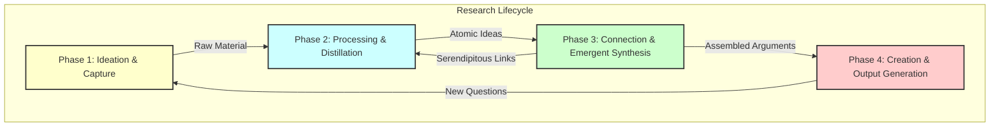

-----

> [!cite]
> **Bibliographic Information**
> - **Source Type**:: AI
> - **Title**:: Report_A-Comprehensive-Modeling-of-the-End-to-End-Research-Project-Lifecycle-as-Implemented-within-a-Personal-Knowledge-Base_🆔20251023024747
> - **Author(s)**:: 🌩️♊URG011_🆔20251020233318
> - **Year**:: 2025
> - **Publisher / Journal**:: ⁉️
> - **Volume / Issue**:: 001
> - **Page(s)**:: 001
> - **URL / DOI**:: <https://gemini.google.com/gem/4a40a40aa594/596d5298d9c05b95>
> - **Date Accessed**:: 2025-10-25

> [!pre-read-questions]
>
>   - What is the fundamental flaw in the traditional, linear model of research (e.g., "write a term paper"), and how does a Personal Knowledge Base (Personal Knowledge Base) propose to solve it?
>   - How does the concept of an "atomic note" differ from simple note-taking, and why is this distinction critical for the process of "emergent synthesis"?
>   - What does it mean for a Personal Knowledge Base to be an "engine for synthesis" rather than just a "container for information"?
>   - In this model, what is the methodological relationship between "literature capture" (reading) and "final output generation" (writing)?
>   - What role does "serendipity" play in a structured research lifecycle, and how can a Personal Knowledge Base be engineered to promote it?

-----

> [!abstract]
>
> This document provides a comprehensive methodological model of the end-to-end research project lifecycle as it is transformed by implementation within a modern Personal Knowledge Base (Personal Knowledge Base). We will deconstruct the traditional, linear "project-based" model of research and contrast it with a dynamic, cyclical, and "knowledge-based" framework. The central thesis is that a Personal Knowledge Base, when properly utilized, is not a passive repository for information but an active, agentic partner in the research process. It functions as an "exobrain" that fundamentally alters the progression from initial ideation to final output.
>
> We will explore the four primary phases of this lifecycle: **1) Ideation & Capture**, **2) Processing & Distillation**, **3) Connection & Emergent Synthesis**, and **4) Creation & Output Generation**. The analysis will detail the foundational principles (e.g., atomicity, dense linking, emergence) that empower this system and the specific mechanisms (e.g., fleeting notes, evergreen notes, Maps of Content) that execute it. By charting this methodological progression, we demonstrate how a PKB-driven lifecycle moves the researcher from the "tyranny of the blank page" to a state of continuous, emergent discovery, where final outputs are not "created" from scratch but "assembled" from a mature, pre-existing network of interconnected thoughts.

# 1.0 📜 INTRODUCTION

> [!quote]
> "We are drowning in information, while starving for wisdom. The world henceforth will be run by synthesizers, people able to put together the right information at the right time, think critically about it, and make important choices wisely."
> — E.O. Wilson

> [!the-purpose]
>
> The purpose of this article is to provide a deep, methodological explanation of the modern research lifecycle, modeled not as a series of discrete projects but as a continuous, integrated process facilitated by a Personal Knowledge Base (Personal Knowledge Base). For generations, the "research project" has been framed as a linear, finite task: you receive a topic, you gather resources, you synthesize them in your head, you write a manuscript, and then you are "done," often discarding the intellectual scaffolding built along the way. This model is inefficient, stressful, and fundamentally misaligned with how genuine understanding is cultivated.
>
> We stand today at a methodological crossroads, enabled by digital tools like Obsidian, Roam Research, and TiddlyWiki. These are not mere "note-taking apps"; they are platforms for implementing a new way of *thinking*. They allow us to execute a research lifecycle that is cyclical, emergent, and cumulative. This article will frame this new methodology as a formal "system" to be analyzed. We will deconstruct its core principles, detail its operational mechanisms, and explore its profound implications for anyone who thinks for a living. The goal is to move beyond "how to use a tool" and establish a rigorous framework for "how to *think with* a tool," transforming your Personal Knowledge Base from a digital filing cabinet into a true partner in discovery.

# 2.0 ✒️🏛️ HISTORICAL CONTEXT & FOUNDATIONAL THEORIES

To understand the PKB-driven research lifecycle, we must first appreciate that it is not a new idea, but a very old one finally given its ideal technological form. It is the culmination of a century-long quest to build a "second brain" or "exobrain" — a system for augmenting human intellect by externalizing thought.

The intellectual lineage begins in 1945, in the shadow of a world war, with **Vannevar Bush's** seminal essay, "As We May Think." [^1] Bush, then director of the US Office of Scientific Research and Development, lamented the "information explosion" and the inadequacy of our tools to navigate it. Our minds, he argued, operate by *association*. We leap from idea to idea. Yet our information systems were built on the rigid, linear hierarchies of libraries and filing cabinets. He proposed a hypothetical device called the **"Memex"** (Memory-Index). It was a microfilm-based desk that would store a user's entire library of books, records, and notes. Crucially, it would allow the user to create "associative trails" — permanent, new links *between* any two items in the database. A user researching the history of the longbow could link a passage in a history textbook to a treatise on metallurgy and a personal note on wood elasticity. This trail, named and saved, would become a new "thread of thought" in the web of knowledge. The Memex was never built, but it laid the entire conceptual groundwork for hypertext, wikis, and the World Wide Web. It was the first formal proposal for a system built not around *storage*, but around *connection*.

The next monumental leap came not from an engineer, but from a German sociologist: **Niklas Luhmann**. Over a 30-year career, Luhmann produced an astonishingly prolific body of work: over 70 books and 400 scholarly articles, all deeply interconnected, covering fields from law and sociology to biology and art. [^2] His secret weapon was not a computer, but a collection of simple wooden filing cabinets. He called his system a **"Zettelkasten,"** or "slip-box."

Luhmann's Zettelkasten was not a mere collection of notes; it was a *conversation partner*. It was built on a few simple, revolutionary principles:

1. **Atomicity:** Each note (or *Zettel*) contained only *one* idea, written on a small slip of paper.
1. **Explicit Linking:** He did not file notes by topic. Instead, each new note was given a unique, non-hierarchical address (e.g., 21/3d7a) and was *physically placed* behind a related, existing note. He would then write the addresses of *other* related notes onto the slip, creating a web of explicit, manual links.
1. **No Pre-ordained Hierarchy:** There was no grand table of contents. The system grew organically, like a rhizome. New branches of thought could emerge from any point.

When it was time to write, Luhmann did not stare at a blank page. He would consult his Zettelkasten, following the trails of links he had built over years. The arguments, connections, and supporting evidence were *already there*. His "writing" process was one of *assembly* and *translation* of the conversations he'd been having with his slip-box. He described it as a "cybernetic system" that, once it reached a critical mass, began to generate its *own* questions and insights. [^3] This was the first fully *implemented* PKB-driven research lifecycle.

For decades, Luhmann's system was a curiosity, practiced by a few dedicated academics with index cards. The rise of the personal computer brought digital "Zettelkasten" software, but these were often just as rigid as the physical filing cabinets they sought to replace, enforcing strict folder hierarchies that Bush had warned against.

The true "Memex" moment—the one that makes this article possible—was the advent of modern Personal Knowledge Base tools like **Obsidian** and **Roam Research**. These tools were the first to *natively* and *effortlessly* implement the core principles of both Bush and Luhmann:

  - **Bidirectional Linking:** When you link to Note B from Note A, Note B *automatically* knows it has been linked to. This "backlink" is a "first-class citizen," fulfilling Bush's "associative trail" concept.
  - **The Graph View:** For the first time, we could *see* the network. The "graph view" in these tools is a literal, visual map of the "spatial relationship between objects in [the] scene" of your thought.
  - **Frictionless Creation:** Tools like the "Daily Note" and quick-capture features finally made the "fleeting note" a practical reality.

This technological leap was popularized and given a modern pedagogical framework by **Sönke Ahrens** in his 2017 book, *How to Take Smart Notes*. [^2] Ahrens translated Luhmann's arcane system into a clear, actionable methodology for students and academics, sparking the modern Personal Knowledge Base revolution.

> [!ask-yourself-this]
>
>   - **How did the historical development of this idea shape our current understanding?**
>       - It shows that our "modern" Personal Knowledge Base problem is not modern at all. Vannevar Bush defined the *problem* (information overload, need for associative thinking) in 1945. Niklas Luhmann provided the *methodological solution* (atomicity, linking, emergence) in the 1970s. Modern tools like Obsidian provided the *technological platform* that finally made this solution frictionless and scalable for everyone. Our current understanding is a synthesis of all three.
>   - **Are there any abandoned theories that are as interesting as the current one?**
>       - The primary "abandoned theory" is the *hierarchical, folder-based filing system* (e.g., the Dewey Decimal System, or your "My Documents" folder). It was abandoned *as a primary organizational tool* for *ideas* (though it's still fine for *projects* and *resources*) because it is too rigid. A note about "quantum physics" and its relation to "Buddhist philosophy" can only *live* in one folder ("Physics" or "Philosophy"), breaking the very connection that makes the idea interesting. The current linking-based model replaced this "one-to-one" paradigm with a "many-to-many" network.

-----

# **3.0 🔭🔬DEEP EXPOSITION: A MULTI-FACETED ANALYSIS**

## 3.1 ⚛️FOUNDATIONAL PRINCIPLES: THE "WHY"

The PKB-driven research lifecycle is not a "hack" or a "productivity tip." It is a fundamental shift in the *philosophy* of knowledge work. It is effective because it is built on a set of core principles that mirror the very structure of human cognition. These principles are the "why" behind the "how."

> [!principle-point]
>
> **Core Principle 1: ⚛️ Atomicity (The Unit of Thought)**
>
> The bedrock of the entire system is the **atomic note**. This is a principle borrowed directly from Luhmann: *one note should contain one idea, and one idea only*. [^2] This "idea" can be a single definition, a quote with your analysis, a summary of an argument, or a fleeting personal insight.
>
> This principle is non-negotiable, for one simple reason: **modularity**.
>
> An atomic note is a "single-purpose tool." A long note that contains thoughts on *five* different topics is a "multi-tool." It might seem efficient, but it's functionally useless. You cannot *link* to "idea \#3" buried in that long note. You cannot *reassemble* that note into a new argument, because it's hopelessly entangled with four other ideas.
>
> An atomic note, by contrast, is a "Lego brick." It is a discrete, modular, and self-contained unit of thought. It can be linked to from *anywhere* and re-used in *any number* of future contexts (outlines, MOCs, manuscripts) without needing to be broken down. This "separating" of a "hot, chaotic, and undifferentiated" stream of consciousness into "cool" atomic units is the foundational act of building structure.

> [!definition]
>
> **Atomic Note (or "Evergreen Note"):** A self-contained, concept-oriented note that is written in your own words and explicitly linked to other notes in the Personal Knowledge Base. Its title is often a full-sentence summary of the claim it makes (e.g., "Atomic notes enable modular remixing of ideas"). It is the fundamental building block of a Personal Knowledge Base. [^4]

> [!principle-point]
>
> **Core Principle 2: 🔗 Dense Linking (The Network of Thought)**
>
> If atomicity creates the "nodes" of your exobrain, linking creates the "edges" or *synapses*. The system's intelligence does not reside *in* the notes themselves, but in the *connections between them*. A Personal Knowledge Base without links is a morgue of dead ideas; a Personal Knowledge Base *with* links is a living, growing ecosystem.
>
> This is the execution of Vannevar Bush's "associative trails." [^1] In a modern Personal Knowledge Base, this is achieved with `[[Wiki-Links]]`. As you process a new idea (e.g., on "telephoto compression"), you explicitly ask, "What does this relate to that I already know?" You might link it to `[[Focal Length]]`, `[[Perspective]]`, and `[[Compositional Storytelling]]`.
>
> Crucially, these tools provide **bidirectional links** (or "backlinks"). When you look at your `[[Perspective]]` note, you *see* a list of all the *other* notes that link *to* it. This is a mechanism for *serendipity*. You might be reviewing your `[[Perspective]]` note and discover that, six months ago, you linked to it from a note on "Cubist painting." This sparks a new, emergent idea that you would *never* have had in a linear, folder-based system. The Personal Knowledge Base *surfaces* connections you have forgotten, acting as a "serendipity engine."

> [!principle-point]
>
> **Core Principle 3: 🌱 Emergence over Planning (The Growth of Thought)**
>
> This is the most profound philosophical shift. In the traditional model, you *plan* a project. You create a rigid outline (your "top-down" structure) and then "fill in the blanks." This is brittle. If your research leads you in a new direction, your entire structure breaks.
>
> The Personal Knowledge Base model is **bottom-up**. You do not start with a grand plan. You start by cultivating *individual* atomic notes. You focus on the "local" connections between ideas. Over time, as these clusters of notes grow, "structures of understanding are built". You will notice a dense cluster of notes forming around a particular concept. This cluster *is* your "chapter." You can then create a "Map of Content" (MOC) note to simply *list* and *organize* these links, and a "bottom-up" outline has *emerged* from the work you were already doing.
>
> This frees the researcher from the "tyranny of the outline." You follow your curiosity, trusting that the structure will reveal itself (emerge) from the network of connections you are building. You are not an "architect" with a fixed blueprint; you are a "gardener" cultivating a patch of land, and the "final output" is the harvest.

> [!quote]
> "The lens does not change perspective; your feet do. The lens simply changes your field of view from the perspective you have chosen."
>
> > [!analogy]
> > This quote from photography is a perfect analogy for this principle. In the old model, the "outline" is your fixed "lens." You stand in one spot and zoom in and out, forced to work with one perspective. In the Personal Knowledge Base model, your "feet" are your "links." You move *physically* (intellectually) around the "landscape of ideas", finding the most compelling "perspective" (the emergent argument) *first*. The "final output" is simply the "focal length you choose to frame that story".

-----

## 4.0 ⚙️ MECHANISMS AND PROCESSES: THE "HOW"

We have established the "why" (the principles). Now we will model the "how" (the end-to-end lifecycle). This lifecycle is not a straight line, but a continuous, self-reinforcing *cycle*. It can be broken down into four distinct methodological phases, which a researcher may move between multiple times a day.

### 4.1 📥 PHASE 1: IDEATION & CAPTURE (THE "FLEETING" STAGE)

This is the "wide-angle" phase. The goal is to reduce the friction for getting ideas *into* your system to zero. This is about *collection*, not *curation*. These initial captures are **"fleeting notes."** [^2] They are temporary, written in the "heat" of the moment, and are not meant to be permanent.

> [!definition]
>
> **Fleeting Note:** A quick, temporary capture of an idea. It can be a thought in the shower, a quote from a podcast, or a margin note in a book. Its *only* purpose is to act as a reminder to be processed later. It is "garbage" until it is processed.

**Common Mechanisms for Capture:**

  - **The Daily Note:** Most Personal Knowledge Base tools have a "Daily Note" feature. This is the perfect, low-friction inbox. You can write down random thoughts, paste links, or jot down meeting notes here, knowing you will process them later.
  - **Quick-Capture Apps:** Mobile apps (like Obsidian Mobile, Simplenote, or Drafts) that open instantly to a blank page, allowing you to capture a thought before it vanishes.
  - **Web Clippers:** Browser extensions that capture entire articles or snippets and send them to your Personal Knowledge Base.
  - **Integration Services (Readwise, Zotero):** These are power tools.
      - **Zotero:** A reference manager that stores your academic PDFs. You can highlight and annotate *inside* Zotero, and tools can extract these annotations and import them directly into your Personal Knowledge Base as fleeting notes, complete with citations.
      - **Readwise:** A service that consolidates all your highlights from Kindle, Instapaper, Pocket, and even physical books (via OCR) and syncs them to your Personal Knowledge Base, ready for processing.

The output of this phase is an "inbox" of raw, unprocessed, fleeting ideas.

### 4.2 🧠 PHASE 2: PROCESSING & DISTILLATION (THE "LITERATURE" STAGE)

This is the most critical *intellectual* act in the entire cycle. This is where you "cool down from chaos". You sit down (perhaps daily or weekly) and review your "inbox" of fleeting notes. The goal is to transform this raw material into permanent, valuable **"atomic notes"** (also called "literature notes" if they reference a source, or "evergreen notes" if they are your own ideas). [^4]

**The Workflow:**

1. **Read & Reflect:** Re-read your fleeting note (e.g., a highlight from a book). Ask yourself, "What is the core idea here? Why did I find this important?"
1. **Re-Write (Do Not Copy-Paste):** This is the key. You *must* re-write the idea *in your own words*. This forces you to *understand* it, not just *collect* it. This act of translation is the first step of synthesis.
1. **Atomize:** Create a *new, separate note* for this single idea.
1. **Title:** Give it a descriptive, concept-oriented title, preferably a full sentence (e.g., "The lens does not change perspective your feet do").
1. **Cite:** Add a proper citation [^1] to the original source.
1. **File... or Rather, *Link*:** The note is now "processed." You can delete the original fleeting note.

The output of this phase is *not* a "folder" of notes. It is a growing, un-networked *population* of valuable, atomic, permanent notes.

### 4.3 🕸️ PHASE 3: CONNECTION & EMERGENT SYNTHESIS (THE "ZETTELKASTEN" STAGE)

This phase often happens *immediately* after Phase 2, but it is a distinct methodological step. Now that you have your new atomic note, you must "connect it to the network." This is the act that *builds* your Zettelkasten.

**The Workflow:**

1. **Ask "How?":** How does this new note `[[New Idea]]` relate to what I *already* know?
1. **Explicit Linking:**
      - Search your Personal Knowledge Base for related terms (e.g., "perspective," "composition").
      - Open those existing notes and *add a link* `[[New Idea]]` to them, perhaps with a sentence of context.
      - In `[[New Idea]]`, add links *back* to those existing notes `[[Perspective]]`, `[[Composition]]`.
1. **Follow the Trail (Serendipity):** As you link, look at the *other* links in those old notes. You may discover a surprising connection (like the "Cubist painting" example) that sparks a *brand new* idea.
1. **Capture the Spark:** This new idea is a *new fleeting note*\! You capture it (Phase 1), process it into a *new atomic note* (Phase 2), and then link *it* into the web (Phase 3).

This is the **virtuous cycle of research**. Reading and processing *generates* new ideas, which are then integrated back into the web, making the web "smarter" and more capable of generating *even more* ideas. This is "emergence" in action.

**The primary tool** for navigating this emergent structure is the **Map of Content (MOC)**.

> [!definition]
>
> **Map of Content (MOC):** A MOC is not a "folder." It is a *note* whose *sole purpose* is to *curate and structure links* to other notes on a high-level topic. It is a "table of contents" that you build *bottom-up* as you see clusters of notes emerging. For example, you might create a `[[Photography MOC]]` that links to your notes on `[[Perspective]]`, `[[Focal Length]]`, `[[The Philosophy of the Tripod]]`, and `[[Pre-visualization]]`.

### 4.4 📤 PHASE 4: CREATION & OUTPUT GENERATION (THE "OUTPUT" STAGE)

This is the phase that the traditional model *starts* with, and which is often the most painful. In the Personal Knowledge Base model, it is the *final* and *easiest* phase. It directly addresses the "blank page" problem.

**The Workflow:**

1. **Identify the Argument:** You don't "decide" what to write about. Your Personal Knowledge Base *tells you*. You notice a MOC that has become very dense, or a string of linked notes that have formed a compelling argument.
1. **Create an Outline Note:** Create a new note for your article or project (e.g., `[[Article - The PKB Research Lifecycle]]`).
1. **Assemble, Don't Write:** Open your MOCs and the relevant atomic notes.
1. **Drag and Drop (or Transclude):** You now *assemble* your final output. You can literally drag your atomic notes into your outline, or (in Obsidian) *transclude* them (embed the content of one note inside another).
1. **Edit for Flow:** Your atomic notes are the "scaffolding". They are the "bedrock". Now you just need to write the connecting prose, edit them to create a single "flow", and add introductions/conclusions.

The "first draft" is 80% complete before you ever "start writing." The "final output" is simply a *curated snapshot* of the ever-evolving knowledge that already lives in your Personal Knowledge Base.

-----

## 5.0 🔬 OBSERVATIONAL EVIDENCE AND MANIFESTATIONS: THE "WHAT"

Connecting this theory to reality, what are the observable, practical *results* of adopting this lifecycle? This is not just a theoretical model; its effects are tangible and transformative for the knowledge worker.

> [!evidence]
>
> The primary historical evidence is the "Luhmann-Productivity Paradox." How could one man, **Niklas Luhmann**, with 1970s technology (paper slips and cabinets), generate a body of work so vast and interconnected that it rivals the output of entire university departments? [^2, 3] The answer is that he *never* started from zero. Every book and article was an *emergence* from his Zettelkasten. He was in a constant state of "Phase 3" (Synthesis), and "Phase 4" (Creation) was a relatively trivial act of assembly. The *system* was the engine of his productivity.

> [!key-claim]
>
> Based on the evidence, a key claim is that: **This methodology shifts the primary goal of research from *producing a project* to *building an exobrain*.** The final outputs (articles, books, reports) become a *by-product* of a richer, more important goal: the cultivation of a personal, external, and interconnected network of understanding.

**Key Manifestations in a Modern Personal Knowledge Base:**

  - **The "Graph View" as a Diagnostic Tool:** The visual graph in tools like Obsidian is a direct manifestation of your neural network. You can *see* your thought patterns. You can identify "orphan" notes (ideas that aren't connected to anything) and "hub" notes (foundational concepts that link to everything). It is a map of your "intellectual landscape".
  - **The "Daily Note" as an Intellectual's Logbook:** Looking back at your Daily Notes provides a rich, chronological history of your intellectual journey. You can see the *day* an idea was born, how it was processed, and where it ended up.
  - **MOCs as "Living" Outlines:** Unlike a static outline in a Word document, a MOC is *alive*. As you add new notes to your Personal Knowledge Base and link them to the MOC, the "outline" grows richer and more detailed automatically. It is a "workbench" for building arguments over *years*, not "days."
  - **The Disappearance of the "Blank Page":** The single most-reported observational effect is the elimination of writer's block. "Writing" is no longer a separate, terrifying event. It is a simple, daily act of "Phase 2" and "Phase 3." The "final output" of "Phase 4" is just the final 10% of the work, not 100%.

-----

## 6.0 🌍 BROADER IMPLICATIONS AND SIGNIFICANCE: THE "SO WHAT"

The "so what" of this model extends far beyond academic productivity. It has profound implications for cognition, education, and our very relationship with technology.

> [!connection-ideas]
>
> The principles discussed here strongly connect to the field of [[Cognitive Science]]. Specifically, the idea of a Personal Knowledge Base as an "exobrain" is a practical application of **[[Extended Cognition (EC)]]**. The EC thesis, championed by philosophers Andy Clark and David Chalmers, argues that the "mind" is not "brain-bound." [^5] Our cognitive tools—a notepad, a calculator, or a Personal Knowledge Base—are not just *aids* to thought; they are *literal parts* of our cognitive process. When you "follow a trail" of links in your Obsidian vault, your *mind* is "thinking" using a loop that runs from your biological brain, through your fingers on the keyboard, onto the screen (the externalized "memory" and "processor"), and back through your eyes to your brain. This methodology is, in essence, a "how-to" guide for *building* a more powerful, extended mind.

This reframes the entire purpose of "note-taking." You are not "taking notes" to *remember* something. You are taking notes to *offload* the *remembering* to a trusted external system, freeing your biological brain to do what it does best: *think, connect, and create*.

> [!counter-argument]
>
> An important counter-argument suggests that this entire process is just a sophisticated form of **"digital hoarding"** or **"procrasti-linking."** Critics argue that practitioners spend more time *tinkering* with the *system* (managing plugins, refining MOCs, "gardening" links) than doing "real work" (i.e., producing "Phase 4" outputs).
>
> This is important because it highlights the *primary failure mode* of this system. This critique is *absolutely valid* if the user becomes obsessed with the *tool* and forgets the *method*. A Personal Knowledge Base full of copy-pasted, unprocessed, and un-linked highlights (a "Phase 1" junkyard) is *worse* than no system at all. The entire value of the lifecycle is contingent on the difficult, daily, intellectual labor of **"Phase 2" (Processing)** and **"Phase 3" (Connecting)**. The system is a "gym for your mind"; owning a membership (the software) does nothing if you don't do the "reps" (the processing).

> [!quote]
> "This forced pause is perhaps the tripod's greatest, though least tangible, gift... It transforms you from a reactive snapshot-taker into a proactive, methodical creator."
>
> This, from the exemplar on photography, is the *perfect* philosophical summation. The traditional research model makes you a "reactive snapshot-taker"—you frantically gather sources for a deadline. The Personal Knowledge Base lifecycle *is* the "tripod." It is a "deliberate declaration of intent". The "forced pause" of Phase 2 and Phase 3 is the "ritual" that compels you to study the scene, to ask deeper questions, and to "notice the subtle relationships between elements", transforming you into a "proactive, methodical creator."

-----

## 7.0 ❔ FRONTIER RESEARCH & UNANSWERED QUESTIONS

This methodology, while powerful, is still in its infancy in the digital age. The frontier of this field lies at the intersection of this human-driven methodology and the explosive new capabilities of Artificial Intelligence.

The single biggest unanswered question is: **What is the proper role of an AI (like me, URG011) *within* this human-centric Personal Knowledge Base lifecycle?**

This question is the new frontier, and it presents a profound paradox.

  - **The Promise:** AI could supercharge this entire process.
      - **Phase 1 (Capture):** AI could "listen" to a meeting and *propose* fleeting notes.
      - **Phase 2 (Processing):** AI could take a 5,000-word article and *propose* a set of atomic, "evergreen" notes from it, saving the user time.
      - **Phase 3 (Connecting):** This is the "Holy Grail." An AI could "read" your *entire* 10,000-note vault and *propose new, emergent connections* (links) between notes that you *never* would have seen. It could act as an automated "serendipity engine."
      - **Phase 4 (Creation):** An AI could be given a MOC and asked to "write the first draft," assembling the atomic notes and writing the "flow" prose, just as I am doing for *this very article*.
  - **The Peril:** The core *value* of the Personal Knowledge Base lifecycle is the *human intellectual labor* of Phase 2 and Phase 3. That is *where the learning happens*. If you "outsource" the processing (re-writing in your own words) and the connecting (linking) to an AI, do you *ever* build the "structures of understanding" in your *own* biological mind? Or does your Personal Knowledge Base become a "smart" archive that your *biological* brain has no real connection to?

> [!question]
>
>   - **What is the single biggest unanswered question in this field right now?**
>       - The biggest question is the **"AI-Cognition Trade-off."** How do we integrate powerful AI agents to *augment* the Personal Knowledge Base lifecycle (e.g., handling rote summarization, finding novel connections) *without* "outsourcing" the very cognitive labor (processing, synthesizing) that creates human understanding in the first place? Finding the "sweet spot" between AI augmentation and cognitive "atrophy" is the defining challenge for the next generation of knowledge work.

-----

## 8.0 🦕 CONCLUSION

> [!summary]
>
> We have deconstructed the research lifecycle, charting its evolution from Vannevar Bush's "Memex" and Niklas Luhmann's "Zettelkasten" to the modern, tool-driven Personal Knowledge Base. We have moved past the "what" (the software) and modeled the "how" (the methodology) and the "why" (the principles).
>
> The traditional, linear "project" model is shown to be a brittle, inefficient relic. The PKB-driven lifecycle, by contrast, is a robust, cyclical, and continuous process of "knowledge cultivation." It is built on the foundational principles of **Atomicity** (Lego-like ideas), **Dense Linking** (a network of thought), and **Emergence** (bottom-up discovery).
>
> We modeled this lifecycle as a four-phase engine: **1) Capture** (raw ideas), **2) Process** (atomic notes), **3) Connect** (the emergent web), and **4) Create** (effortless assembly). The "final output" is revealed to be a mere *by-product* of the true, primary goal: the construction of an "exobrain." This methodology is not just a "productivity system"; it is a "declaration of intent" to engage with information deeply, a "forced pause" that transforms us from "passive documentarians" into "active authors" of our own understanding.

-----

## 9.0 🧠 KEY QUESTIONS FOR ACTIVE READING & REFLECTION

> [!ask-yourself-this]
>
>   - **How would I explain the central idea of this article to someone with no background in this field? (The Feynman Technique)**
>       - Imagine your brain is a kitchen. The "old" way of research is like going to the store with one specific, complicated recipe (the "project"), buying *only* those ingredients, and making the dish. When you're done, the kitchen is empty again. The "new" (Personal Knowledge Base) way is to "garden." Every time you find a cool ingredient (an idea), you don't just use it; you *plant* it in your garden (Phase 2). You "process" it. Then, you build "connections" between your plants (Phase 3), noticing that "tomatoes and basil grow well together." You do this *every day*. Now, when you need to "make a dish" (the "output"), you don't go to the store. You just "shop" your own garden, which is already full of mature, interconnected ingredients. You just *assemble* them. The "dishes" (articles, books) become an easy, natural *by-product* of just "tending your garden."
>   - **What was the most surprising or counter-intuitive concept presented? Why?**
>       - The most counter-intuitive idea is likely "Emergence over Planning" (Principle 3) and the idea that the "final output" is the *easiest* step (Phase 4). We are trained our whole lives to *start* with the outline and the "blank page," which is the hardest part. The idea that you should *never* start with an outline—that you should instead "play" with atomic ideas and links until an outline *reveals itself* (emerges)—is a complete inversion of the traditional creative process.
>   - **What pre-existing knowledge did this article connect with or challenge for me?**
>       - This article directly challenges the "project-based" or "deadline-based" mindset that most of us learned in school and practice at work. It reframes "research" as something you do *continuously*, not in "bursts." It connects with the pre-existing knowledge that "cramming" for a test (the linear model) leads to poor long-term retention, while "spaced repetition" and "building connections" (the Personal Knowledge Base model) lead to true, lasting understanding.

> [!quote]
> "You are not separate from the universe, looking in. You are a part of it, looking out."
>
> > [!analogy]
> > This quote from the cosmology exemplar serves as a final, profound analogy. In the old model, *you* are "separate from" your research, "looking in" at a pile of sources. In the Personal Knowledge Base model, your mind and your "exobrain" *become* the "universe" of your knowledge. You are not an outside observer; you are "a part of it," and your "final outputs" are simply that system "looking out" and reporting what it has learned.

> [!important]
>
> Identify three key terms or concepts from this article. Write your own definition for each and create a new note to link them back to this one.
>
> 1.  `[[Zettelkasten]]`
> 1.  `[[Emergent Synthesis]]`
> 1.  `[[Atomic Note (Evergreen Note)]]`

> [!question]
>
>   - **What is one question I still have after reading this? Where might I look for an answer?**
>       - **Question:** This article perfectly models the *solo* researcher's lifecycle. But how does this entire "PKB-driven" methodology scale for *teams*? How do you manage a "collaborative Zettelkasten" when "my" connections and "my" atomic notes (written in *my* words) might not make sense to a colleague? What are the "social protocols" for a "shared exobrain"?
>       - **Answer:** I would look for an answer by researching "multi-player Personal Knowledge Base," "collaborative knowledge management," and "team-based Zettelkasten." I would investigate how tools like Notion (which is team-native) or Obsidian's "Shared Vaults" are being used in practice by research labs or companies.

## 10.0 📚 REFERENCES

> [!cite]
>
> **Source Files Provided:**
>
> : User-provided file. (2025, October 20). *AI-Note\_Exemplars-for-LLMs\_🆔20251020184551.md*.
>
> : User-provided file. (2025, October 20). *AI-Note\_Callout-List-for-AI\_🆔20251020191122.md*.
>
> : User-provided file. (2025, October 21). *URG011-Exemplar-of-a-report.md*.

-----

[^1]:

    Bush, V. (1945). As We May Think. *The Atlantic Monthly*.

[^2]:

    Ahrens, S. (2017). *How to Take Smart Notes: One Simple Technique to Boost Writing, Learning and Thinking*. CreateSpace Independent Publishing Platform.

[^3]:

    Luhmann, N. (1992). Communicating with Slip Boxes: An Empirical Account. (Translated by M. Kuehn). *Sociologica*.

[^4]:

    Matuschak, A. (n.d.). *Evergreen notes*. Andy's Working Notes. Retrieved from [https://notes.andymatuschak.org/Evergreen\_notes](https://notes.andymatuschak.org/Evergreen_notes)

[^5]:

    Clark, A., & Chalmers, D. (1998). The Extended Mind. *Analysis*, 58(1), 7-19.
