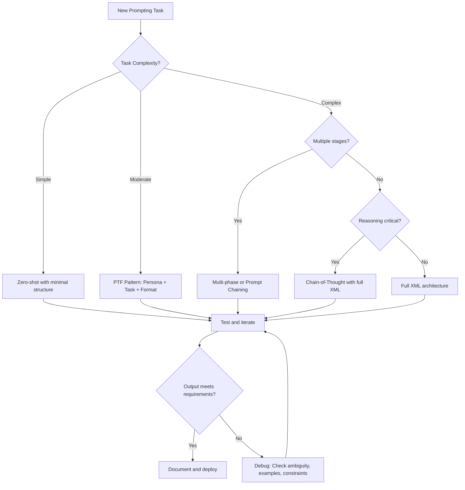

# 🤖 Claude AI: Comprehensive Reference & Prompt Engineering Mastery

Aliases: [[Claude LLM]], [[Anthropic Claude]], [[Claude Prompt Engineering]], [[Claude AI Reference]]

> [!comprehensive-reference] 📚 Comprehensive-Reference
> - **Generated**:: 2025-11-10
> - **Version**:: 1.0
> - **Type**:: Reference Documentation
> - **Scope**:: Claude AI Architecture, Capabilities, and Prompt Engineering Mastery

> [!abstract]
> **Executive Overview**
> This reference document provides exhaustive coverage of Claude, Anthropic's family of large language models, with specialized focus on prompt engineering methodologies and optimal interaction patterns. It serves as both a technical specification of Claude's capabilities and a practical guide to extracting maximum utility through sophisticated prompting techniques, with particular emphasis on Claude's XML-based structural preferences and component-oriented prompt architecture.

> [!how-to-use-this]
> **Navigation Guide**
> This reference note is organized into 8 major sections covering Claude's architecture, prompting theory, specific component optimization, XML structuring, practical methodologies, and advanced techniques. Use the table of contents below for quick navigation, or search for specific terms using [[wiki-links]]. The Component Library (Section 4) serves as a quick-reference lookup for specific prompting elements.

## 📑 Table of Contents

1. [[#🧬 Claude Fundamentals Architecture & Capabilities|Claude Fundamentals: Architecture & Capabilities]]
2. [[#🎯 Prompt Engineering Theory for Claude|Prompt Engineering Theory for Claude]]
3. [[#📐 Core Prompting Components Optimal Phrasing|Core Prompting Components: Optimal Phrasing]]
4. [[#🏗️ XML Architecture Claude's Structural Preference|XML Architecture: Claude's Structural Preference]]
5. [[#⚙️ Working Methodologies Systematic Approaches|Working Methodologies: Systematic Approaches]]
6. [[#🎓 Advanced Techniques Pattern Library|Advanced Techniques: Pattern Library]]
7. [[#⚠️ Anti-Patterns Common Pitfalls|Anti-Patterns & Common Pitfalls]]
8. [[#🎯 Synthesis Mastery Framework|Synthesis: Mastery Framework]]

---

## 🧬 Claude Fundamentals: Architecture & Capabilities

> [!definition]
> - **Key-Term**:: [[04_library/02_pkb-and-pkm-learning/_reference/_official-documentation/_plugin-copilot/_documentation/CLAUDE]]
> - **Definition**:: Claude is a family of large language models (LLMs) developed by [[Anthropic]], designed with an emphasis on [[Constitutional AI]], safety, and helpfulness. Claude models are trained using [[Reinforcement Learning from Human Feedback]] (RLHF) with a constitution of ethical principles, making them particularly adept at nuanced reasoning, following complex instructions, and maintaining contextual awareness over extended conversations.

### The Claude Model Family

Claude represents a tiered approach to [[AI capabilities]], with each model optimized for different use cases. The current Claude 4 family architecture demonstrates Anthropic's progression toward more sophisticated reasoning while maintaining efficiency.

**Claude Sonnet 4.5** represents the pinnacle of the current generation, balancing exceptional intelligence with operational efficiency. This model excels at complex reasoning tasks, extended context management, and sophisticated instruction following. It processes information with a level of nuance that approaches expert-level human analysis in many domains. The "Sonnet" designation historically indicated a mid-tier balance, but 4.5 has evolved to represent the smartest general-purpose model in the family.

**Claude Opus 4** and **4.1** occupy specialized positions in the hierarchy. Opus models are engineered for tasks requiring maximum computational depth, though Sonnet 4.5 has largely superseded earlier Opus versions in practical applications. The architectural distinction lies in how these models allocate computational resources during inference—Opus prioritizes depth and exhaustiveness, while Sonnet optimizes for speed without sacrificing reasoning quality.

**Claude Haiku** (when available in a generation) represents the efficiency-focused tier, designed for high-throughput applications where speed and cost-effectiveness are paramount. Haiku maintains core Claude capabilities while operating with reduced latency and computational overhead.

> [!key-claim]
> **Central Principle of Claude Architecture**
> Claude's design philosophy centers on "[[Constitutional AI]]"—the model is trained not just to be capable, but to be helpful, harmless, and honest according to a predefined set of principles. This makes Claude particularly responsive to structured, principle-based prompting and explicit value alignment in instructions.

### Core Capabilities Matrix

| Capability Domain          | Proficiency Level | Key Characteristics                                  | Optimal Use Cases                                                 |
| -------------------------- | ----------------- | ---------------------------------------------------- | ----------------------------------------------------------------- |
| [[Long-Context Reasoning]] | Exceptional       | Maintains coherence across 200K+ tokens              | Document analysis, extended conversations, multi-source synthesis |
| [[Structured Thinking]]    | Superior          | Excels at [[Chain-of-Thought]], [[Tree-of-Thoughts]] | Complex problem decomposition, strategic planning                 |
| [[Code Generation]]        | Expert            | Multi-language, architecture-aware                   | Full-stack development, algorithm design, refactoring             |
| [[Analysis & Synthesis]]   | Expert            | Deep pattern recognition, nuanced interpretation     | Research, data analysis, critical evaluation                      |
| [[Creative Writing]]       | Advanced          | Stylistic versatility, narrative coherence           | Content creation, ideation, worldbuilding                         |
| [[Mathematical Reasoning]] | Advanced          | Formal logic, proof construction                     | Technical analysis, quantitative reasoning                        |
| [[Instruction Following]]  | Exceptional       | Precision with complex, nested instructions          | Workflow automation, template execution                           |
| [[Ethical Reasoning]]      | Superior          | Nuanced value alignment                              | Content moderation, policy analysis, ethical frameworks           |

### Technical Specifications

Claude's architecture incorporates several design elements that directly influence optimal prompting strategies:

**Context Window Management**: Claude processes input through a [[sliding attention window]] mechanism that maintains semantic coherence across extremely long contexts. This means that information placement within a prompt matters—critical instructions should be positioned both early (for framing) and late (for recency). The model's [[positional encoding]] system ensures that it can reference and connect information across the entire context length.

**Token Processing**: Claude uses a [[byte-pair encoding]] (BPE) tokenizer that segments text into subword units. This affects how the model processes technical terminology, code, and structured formats. Understanding token boundaries helps explain why certain formatting approaches (like XML tags) work particularly well—they align with natural token boundaries and create clear semantic delimiters.

**Constitutional Training**: Unlike models trained purely on next-token prediction, Claude incorporates a [[Constitutional AI training process]] where the model is taught to critique and revise its own outputs according to ethical principles. This creates a unique responsiveness to prompts that explicitly invoke reasoning about helpfulness, harmlessness, or honesty.

> [!thought-experiment]
> **Conceptual Model: Claude as a Reasoning Engine**
> Imagine Claude not as a database of facts, but as a sophisticated reasoning engine that constructs responses by navigating a vast probability space. Each word in your prompt acts as a constraint that narrows this space. Structured prompts with clear XML tags create sharp, well-defined boundaries in this probability landscape, making it easier for Claude to converge on the intended response pattern. This is why explicit structure consistently outperforms implicit structure.

### Knowledge Cutoff & Real-Time Limitations

> [!warning]
> **Critical Constraints**
> Claude's training data has a **knowledge cutoff of January 2025**. The model cannot know about events, publications, or developments occurring after this date without external tools. When users ask about current events, Claude is designed to use [[web search tools]] to supplement its knowledge. This architectural limitation is intentional—it separates "learned knowledge" from "retrieved information," making the model more reliable about the provenance of its responses.

---

## 🎯 Prompt Engineering Theory for Claude

> [!definition]
> - **Key-Term**:: [[Prompt Engineering]]
> - **Definition**:: The systematic practice of designing inputs (prompts) to language models to elicit desired outputs with maximum reliability, specificity, and quality. For Claude specifically, prompt engineering leverages the model's architectural preferences for structure, explicit reasoning, and constitutional alignment to achieve expert-level performance on complex tasks.

### Foundational Principles

Prompt engineering for Claude operates on fundamentally different principles than prompting for other LLMs due to Claude's unique training methodology and architectural decisions. Understanding these principles transforms prompting from trial-and-error to systematic design.

**Principle 1: Explicit Over Implicit**. Claude's training emphasizes following explicit instructions over inferring implicit intent. Where other models might successfully "read between the lines," Claude performs optimally when instructions are stated directly. This doesn't mean verbose—it means clear, unambiguous, and structurally obvious. A prompt that says "Analyze this with attention to X, Y, and Z" will consistently outperform one that expects Claude to infer that these are important dimensions.

**Principle 2: Structure Enhances Reasoning**. Claude's architecture is particularly receptive to structured inputs because its [[attention mechanism]] can more efficiently process and maintain relationships between clearly delineated components. When you wrap instructions in `<tags>`, you're not just organizing for human readability—you're creating computational scaffolding that guides the model's internal reasoning process. This is why XML-structured prompts often produce dramatically better results than free-form prose instructions.

**Principle 3: Constitutional Alignment is a Feature**. Claude's [[Constitutional AI]] training means it actively seeks to understand the *values* and *goals* behind requests. Prompts that explicitly state desired outcomes, constraints, and success criteria align with this training, producing more reliable results. This is why prompts that begin with "Your goal is to…" or "The user needs…" often work better than purely imperative instructions.

**Principle 4: Show, Don't Just Tell**. Claude's training incorporates extensive [[few-shot learning]] capabilities. Providing examples of desired output, even a single high-quality example, dramatically improves Claude's ability to match style, format, and quality. This is particularly important for specialized formats or domain-specific conventions.

**Principle 5: Think Step-by-Step is Native**. Claude is specifically trained to excel at [[Chain-of-Thought]]. Prompts that explicitly request intermediate reasoning steps (`"Think through this step-by-step"` or `"Show your reasoning"`) don't just make the thinking visible—they actively improve the quality of the final answer by preventing reasoning shortcuts.

> [!key-claim]
> **Central Principle of Claude Prompting**
> Claude responds best to prompts that treat it as a collaborator rather than a black box. Prompts that explicitly structure the task, show the reasoning path, provide examples, and clarify success criteria will consistently outperform minimal or ambiguous prompts by orders of magnitude in quality, reliability, and specificity.

### The Cognitive Architecture of a Prompt

A well-engineered Claude prompt mirrors the architecture of human expert reasoning. It establishes context, defines the task, provides tools and constraints, shows examples, and specifies output format. This isn't arbitrary—it aligns with how Claude's training has shaped its internal processing patterns.

Consider the difference between these two approaches:

**Underspecified Prompt**: "Write a summary of this document."

**Engineered Prompt**: 
```xml
<task>
Analyze the attached document and produce a structured executive summary.
</task>

<context>
This document is a technical specification for internal engineering use.
Your audience is senior technical leadership who need to make
architectural decisions based on this information.
</context>

<output_format>
Your summary should include:
1. Core technical claims (3-5 bullet points)
2. Implementation requirements
3. Risk assessment
4. Recommendation with justification
</output_format>

<constraints>
- Maximum 500 words
- Assume audience has domain expertise
- Highlight any ambiguities or missing information
</constraints>
```

The second approach doesn't just provide more information—it creates a *reasoning framework* that Claude can execute against. Each tag serves a specific cognitive function in guiding the model's generation process.

> [!methodology-and-sources]
> **Prompt Engineering Methodology**
> 
> **Stage 1: Task Decomposition**
> Begin by breaking complex requests into constituent cognitive operations. What does the model need to *understand*, *analyze*, *generate*, and *validate*?
>
> **Stage 2: Structural Mapping**
> Map each cognitive operation to a prompt component (context, instructions, examples, constraints). Use XML tags to create clear boundaries between components.
>
> **Stage 3: Example Integration**
> For any non-trivial task, include at least one high-quality example. Format examples with clear input/output boundaries.
>
> **Stage 4: Constraint Specification**
> Explicitly state what the model should NOT do, length requirements, style constraints, and success criteria.
>
> **Stage 5: Iterative Refinement**
> Test prompt, analyze failure modes, add specificity where Claude diverges from intent.

### Prompt Taxonomy: Categories of Prompting Approaches

Different tasks require different prompting strategies. Understanding this taxonomy helps select the right architectural approach for each use case.

**Zero-Shot Prompting**: Requesting task completion without examples. Claude handles this well for common tasks but benefits from extreme clarity in instructions. Optimal for: straightforward analysis, summarization, reformatting of standard content.

**Few-Shot Prompting**: Providing 1-5 examples of desired input-output pairs. Claude's [[In-Context Learning]] is exceptional—even a single example dramatically improves performance on specialized formats. Optimal for: domain-specific formatting, stylistic matching, complex structured outputs.

**Chain-of-Thought Prompting**: Explicitly requesting intermediate reasoning steps. Claude is trained specifically for this and it measurably improves answer quality. Optimal for: mathematical reasoning, logical analysis, multi-step problem solving, debugging.

**Tree-of-Thoughts Prompting**: Requesting exploration of multiple reasoning paths before converging on an answer. Particularly powerful for Claude due to its strong planning capabilities. Optimal for: strategic decisions, creative problem-solving, evaluating trade-offs.

**Role-Based Prompting**: Assigning Claude a specific expert persona. More effective with Claude than other models due to constitutional training on helpfulness. Optimal for: domain-specific expertise, consistent tone, specialized knowledge application.

**Constitutional Prompting**: Explicitly invoking principles of helpfulness, harmlessness, or honesty. Uniquely effective with Claude. Optimal for: content moderation, ethical reasoning, value-aligned decision making.

### Comparative Analysis of Prompting Paradigms

| Paradigm | Complexity | Reliability | Best Use Cases | Claude-Specific Advantage |
|----------|------------|-------------|----------------|---------------------------|
| Zero-Shot Imperative | Low | Medium | Simple, well-defined tasks | Strong instruction following |
| Few-Shot Learning | Medium | High | Format matching, style replication | Excellent in-context learning |
| Chain-of-Thought | Medium | Very High | Reasoning-heavy tasks | Explicitly trained for CoT |
| Tree-of-Thoughts | High | Very High | Multi-path exploration | Superior planning capabilities |
| Constitutional | Medium | High | Value-aligned tasks | Native constitutional training |
| Structured XML | Medium | Very High | Complex, multi-component tasks | Architecture optimized for structure |

---

## 📐 Core Prompting Components: Optimal Phrasing

> [!definition]
> - **Key-Term**:: [[Prompt Components]]
> - **Definition**:: Discrete functional elements within a prompt that serve specific cognitive or instructional purposes. Well-engineered prompts assemble these components into a coherent architecture that guides Claude's reasoning and generation process.

This section serves as a comprehensive reference library of prompting components with optimal phrasing patterns for Claude. Each component includes purpose, optimal phrasing, and concrete examples.

### 🎭 Persona/Role Definition

**Purpose**: Establishes expertise domain, tone, and perspective that Claude should adopt when responding.

**Why It Works**: Claude's training includes extensive role-playing and expert simulation. Explicit persona definition activates relevant knowledge clusters and communication patterns.

**Optimal Phrasing Patterns**:

```xml
<persona>
You are [specific role/expertise level] with [years/depth of experience] 
in [domain]. Your strengths include [specific capabilities]. You 
approach problems with [characteristic method/philosophy].
</persona>
```

**Variations by Specificity**:

*High Specificity (Preferred for technical tasks)*:
```xml
<persona>
You are a senior backend engineer specializing in distributed systems 
architecture. You have 10+ years of experience designing high-availability 
services using Go and Kubernetes. Your approach prioritizes reliability, 
observability, and gradual rollout strategies.
</persona>
```

*Medium Specificity (Preferred for general tasks)*:
```xml
<persona>
You are an experienced technical writer who specializes in making complex 
concepts accessible to intelligent non-experts. You use clear examples and 
avoid unnecessary jargon.
</persona>
```

*Minimal Specificity (Use only when persona is obvious from task)*:
```xml
<role>
Expert data analyst
</role>
```

> [!tip]
> **Persona Optimization**
> - Be specific about *method* not just *title* ("You analyze code by first understanding data flow, then identifying bottlenecks" vs "You are a code reviewer")
> - Include relevant constraints ("You prefer solutions that don't require new dependencies")
> - Avoid flattery or anthropomorphization ("You are the world's best…" is less effective than specific capability descriptions)

### 🎯 Task/Objective Definition

**Purpose**: Specifies the primary goal, deliverable, or action Claude should complete.

**Why It Works**: Clear task definition creates a measurable success criterion that Claude's generation process can optimize against.

**Optimal Phrasing Patterns**:

```xml
<task>
[Action verb] [object] that [success criterion/purpose].
</task>
```

**Examples by Complexity**:

*Simple Tasks*:
```xml
<task>
Summarize the following article in 3-5 bullet points that capture the 
main claims and evidence.
</task>
```

*Complex Tasks*:
```xml
<task>
Analyze the provided codebase to identify performance bottlenecks, then 
generate a prioritized refactoring plan with effort estimates. Each 
recommendation should include before/after code examples and expected 
performance impact.
</task>
```

*Multi-Stage Tasks*:
```xml
<task>
Complete the following in sequence:
1. Extract all customer complaints from the support tickets
2. Categorize complaints by root cause
3. Generate a prioritized action plan with owner assignments
4. Draft executive summary for leadership review
</task>
```

> [!principle-point]
> **Task Clarity Principle**
> The more measurable and specific your task definition, the more reliably Claude can evaluate its own output quality during generation. "Write a good article" is unmeasurable; "Write a 1500-word article that explains X to audience Y using Z framework" is measurable.

### 🌍 Context/Background Information

**Purpose**: Provides necessary information for Claude to understand the situation, constraints, audience, or domain.

**Why It Works**: Claude's architecture excels at leveraging contextual information to tailor responses. Explicit context prevents Claude from filling gaps with assumptions.

**Optimal Phrasing Patterns**:

```xml
<context>
[Situational information]
[Audience characteristics]
[Domain-specific background]
[Relevant constraints or assumptions]
</context>
```

**Strategic Context Patterns**:

*Audience Context*:
```xml
<context>
<audience>
Your audience is technical founders without formal CS training who need to 
make architectural decisions. They understand business logic deeply but need 
explanations of technical trade-offs in terms of cost, risk, and time-to-market.
</audience>
</context>
```

*Domain Context*:
```xml
<context>
<domain>
This project uses a microservices architecture deployed on AWS. The team 
follows trunk-based development with feature flags. Current pain points 
include slow integration tests and cross-service debugging difficulty.
</domain>
</context>
```

*Historical Context*:
```xml
<context>
<background>
Previous attempts to solve this problem used approach X, which failed due to Y. 
The team is now skeptical of solutions that rely on Z. Any proposal needs to 
explicitly address how it avoids the previous failure mode.
</background>
</context>
```

> [!key-claim]
> **Context is Constraint**
> Every piece of context you provide narrows the solution space. This is good—it prevents Claude from generating plausible but inappropriate responses. Be especially explicit about what you DON'T want based on past experience.

### 📋 Instructions/Procedure

**Purpose**: Specifies the method, process, or sequence of operations Claude should follow.

**Why It Works**: Claude's [[Instruction Following]] capabilities are exceptional. Clear procedural instructions leverage this strength.

**Optimal Phrasing Patterns**:

```xml
<instructions>
Follow this process:

1. [First step with specific criteria]
2. [Second step with specific criteria]
3. [Third step with specific criteria]

For each step, [additional guidance on execution].
</instructions>
```

**Pattern Variations**:

*Sequential Instructions (Use for ordered processes)*:
```xml
<instructions>
Execute the following steps in order:

**Step 1: Data Validation**
- Verify all required fields are present
- Check data types match schema
- Flag any anomalies for review

**Step 2: Transformation**
- Apply normalization rules from the style guide
- Convert dates to ISO format
- Standardize categorical values

**Step 3: Output Generation**
- Format as JSON according to schema
- Include metadata block
- Validate against schema before returning
</instructions>
```

*Conditional Instructions (Use for decision-tree processes)*:
```xml
<instructions>
Analyze the code following this decision tree:

IF the code includes database queries:
  - Check for SQL injection vulnerabilities
  - Verify proper connection pooling
  - Assess query efficiency

IF the code includes API calls:
  - Verify error handling for network failures
  - Check for proper timeout configuration
  - Assess rate limiting implementation

FOR ALL code:
  - Evaluate test coverage
  - Check documentation completeness
</instructions>
```

*Iterative Instructions (Use for refinement processes)*:
```xml
<instructions>
Iterate through the following process until output meets all criteria:

1. Generate initial draft
2. Self-evaluate against criteria in <success_criteria>
3. Identify specific weaknesses
4. Revise to address weaknesses
5. If any criteria unmet, return to step 2

Maximum 3 iterations. If criteria still unmet, explain why and provide 
best available output.
</instructions>
```

### 📤 Output Format/Structure

**Purpose**: Specifies the exact format, structure, schema, or template for Claude's response.

**Why It Works**: Claude's architecture makes it exceptionally good at matching specified formats. This is one of Claude's most reliable capabilities.

**Optimal Phrasing Patterns**:

```xml
<output_format>
Generate output in the following format:

[Template with placeholders]

OR

[Detailed structural specification]
</output_format>
```

**Format Specification Strategies**:

*Template-Based (Best for consistent structure)*:
```xml
<output_format>
Use this exact template:

## Summary
[2-3 sentence overview]

## Key Findings
1. [Finding with evidence]
2. [Finding with evidence]
3. [Finding with evidence]

## Recommendations
- **Recommendation**: [Specific action]
  - **Rationale**: [Why this matters]
  - **Priority**: [High/Medium/Low]
  - **Effort**: [Estimate]

## Next Steps
[Concrete next actions with owners]
</output_format>
```

*Schema-Based (Best for structured data)*:
```xml
<output_format>
Return a JSON object matching this schema:

{
  "analysis": {
    "sentiment": "positive|negative|neutral",
    "confidence": 0.0-1.0,
    "key_themes": ["theme1", "theme2"],
    "entities": [
      {
        "name": "string",
        "type": "person|organization|location",
        "relevance": 0.0-1.0
      }
    ]
  },
  "summary": "string (max 200 chars)"
}

Ensure all fields are present and types match exactly.
</output_format>
```

*Constraint-Based (Best for flexible but bounded outputs)*:
```xml
<output_format>
Your response must:
- Begin with a one-sentence summary
- Use headers for each major section
- Include inline code examples in backticks
- End with a "Gotchas" section listing common mistakes
- Be between 800-1200 words
- Use second person ("you") voice
</output_format>
```

> [!quick-reference]
> **Format Specification Checklist**
> - 🔑 **Specify structure**: Headers, sections, ordering
> - 🔑 **Specify length**: Word/character counts, min/max
> - 🔑 **Specify style**: Tone, voice, person, formality
> - 🔑 **Specify formatting**: Markdown, JSON, code, tables
> - 🔑 **Specify metadata**: What additional fields to include

### 📚 Examples/Demonstrations

**Purpose**: Shows Claude concrete instances of desired input-output patterns, dramatically improving quality and consistency.

**Why It Works**: Claude's [[few-shot learning]] capabilities are exceptional. Examples create pattern templates that Claude matches with high fidelity.

**Optimal Phrasing Patterns**:

```xml
<examples>
<example>
<input>
[Example input]
</input>
<output>
[Desired output matching that input]
</output>
<explanation>
[Optional: Why this output is good]
</explanation>
</example>

[Additional examples as needed]
</examples>
```

**Example Construction Strategies**:

*Single High-Quality Example (Use when format is primary concern)*:
```xml
<examples>
<example>
<input>
Customer feedback: "The new dashboard is confusing. I can't find the export 
button and the charts don't make sense."
</input>
<output>
**Issue Category**: Usability - Navigation & Data Visualization
**Severity**: Medium
**Affected Feature**: Dashboard v2.1
**Specific Problems**:
  1. Export functionality not discoverable
  2. Chart design lacks clarity
**Recommended Action**: UX audit of dashboard with focus on information 
architecture and visual design. Priority: High.
**Owner**: Product team
</output>
</example>
</examples>
```

*Multiple Contrasting Examples (Use when showing range of possibilities)*:
```xml
<examples>
<example name="simple_case">
<input>
Query: "What is photosynthesis?"
Audience: 10-year-old
</input>
<output>
Photosynthesis is how plants make their own food! They take in sunlight, 
water, and air, and create sugar they can use for energy. It's like having 
a solar-powered kitchen inside every leaf.
</output>
</example>

<example name="technical_case">
<input>
Query: "What is photosynthesis?"
Audience: Biology graduate student
</input>
<output>
Photosynthesis is the process by which photoautotrophs convert light energy 
into chemical energy stored in glucose. The light-dependent reactions in the 
thylakoid membranes generate ATP and NADPH, which drive the Calvin cycle in 
the stroma to fix CO2 into organic compounds via RuBisCO catalysis.
</output>
</example>
</examples>
```

*Negative Examples (Use when showing what NOT to do)*:
```xml
<examples>
<good_example>
<input>Bug: Login fails with "Invalid credentials" even with correct password</input>
<output>
**Root Cause**: Session token validation logic checking expired timestamp 
before credential verification.
**Fix**: Reorder validation to verify credentials first, then check session status.
**Code Change**: Move token.isExpired() check after credentials.verify()
</output>
</good_example>

<bad_example>
<input>Bug: Login fails with "Invalid credentials" even with correct password</input>
<output>
The login system has a bug. It needs to be fixed.
</output>
<why_bad>
Too vague, no root cause identified, no specific fix proposed, not actionable.
</why_bad>
</bad_example>
</examples>
```

### 🚫 Constraints/Boundaries

**Purpose**: Explicitly defines what Claude should NOT do, limits to respect, or boundaries to stay within.

**Why It Works**: Claude's [[Constitutional AI]] training makes it particularly responsive to explicit constraint specification. Negative constraints often prevent common failure modes.

**Optimal Phrasing Patterns**:

```xml
<constraints>
DO NOT:
- [Specific unwanted behavior]
- [Specific unwanted behavior]

MUST AVOID:
- [Specific pitfall or error]
- [Specific pitfall or error]

BOUNDARIES:
- [Limit to respect]
- [Scope boundary]
</constraints>
```

**Constraint Categories**:

*Scope Constraints*:
```xml
<constraints>
Stay within the following scope:
- Only analyze files in the /src directory
- Do not make assumptions about database schema
- Limit recommendations to changes requiring <1 week of work
- Do not suggest architectural rewrites
</constraints>
```

*Quality Constraints*:
```xml
<constraints>
Quality requirements:
- Every claim must be backed by evidence from the provided documents
- Do not speculate beyond available data
- If information is missing, explicitly state "Unknown: [aspect]"
- Maintain academic tone; avoid marketing language
- Cite sources using [Source X] notation
</constraints>
```

*Safety Constraints*:
```xml
<constraints>
Safety and compliance:
- Do not include personally identifiable information (PII) in output
- Redact any email addresses, phone numbers, or addresses
- Do not recommend approaches that violate GDPR data handling requirements
- Flag any potential security concerns rather than implementing workarounds
</constraints>
```

*Stylistic Constraints*:
```xml
<constraints>
Style boundaries:
- Do not use bullet points; write in prose paragraphs
- Avoid passive voice
- Do not use jargon without defining it
- Maximum sentence length: 25 words
- Do not use exclamation points or promotional language
</constraints>
```

> [!warning]
> **Constraint Specificity Matters**
> General constraints like "be careful" or "be accurate" are ineffective. Claude responds best to specific, concrete boundaries: "Do not cite sources that aren't in the provided documents" not "be accurate about sources."

### ✨ Tone/Style Specification

**Purpose**: Defines voice, register, formality level, and stylistic characteristics of Claude's response.

**Why It Works**: Claude has excellent stylistic range but defaults to a "helpful assistant" register unless directed otherwise.

**Optimal Phrasing Patterns**:

```xml
<tone>
Voice: [first person / second person / third person]
Register: [formal / conversational / technical / academic]
Characteristics: [specific traits]
</tone>
```

**Tone Specification Patterns**:

*Professional-Technical*:
```xml
<tone>
Voice: Third person objective
Register: Professional-technical
Characteristics: 
- Precise, unambiguous language
- Use of domain-specific terminology
- Neutral, unemotional presentation
- Evidence-based claims only
Example phrase: "Analysis indicates three primary bottlenecks in the current 
implementation."
</tone>
```

*Conversational-Educational*:
```xml
<tone>
Voice: Second person direct
Register: Conversational but authoritative
Characteristics:
- Friendly without being casual
- Use analogies to clarify complex concepts
- Anticipate and answer implicit questions
- Encouraging and supportive
Example phrase: "You're probably wondering why this approach works better—
here's the key insight…"
</tone>
```

*Academic-Analytical*:
```xml
<tone>
Voice: First person plural ("we")
Register: Academic analytical
Characteristics:
- Measured, nuanced conclusions
- Explicit reasoning chains
- Acknowledgment of limitations
- Citation of theoretical frameworks
Example phrase: "We observe that while approach X demonstrates efficacy in 
controlled settings, real-world applicability remains uncertain due to…"
</tone>
```

### 🎯 Success Criteria/Evaluation

**Purpose**: Defines measurable standards by which Claude should evaluate its own output quality.

**Why It Works**: Claude can perform self-evaluation during generation, allowing it to revise or refine outputs to meet specified criteria.

**Optimal Phrasing Patterns**:

```xml
<success_criteria>
Your output succeeds if it meets ALL of the following:

1. [Specific measurable criterion]
2. [Specific measurable criterion]
3. [Specific measurable criterion]

If any criterion is not met, revise before presenting final output.
</success_criteria>
```

**Examples by Evaluation Type**:

*Completeness Criteria*:
```xml
<success_criteria>
Complete response must include:
✓ Analysis of all 5 provided documents
✓ At least 3 recommendations with supporting evidence
✓ Identification of conflicting information (if present)
✓ Explicit statement of confidence level for each claim
✓ Next steps section with specific action items
</success_criteria>
```

*Quality Criteria*:
```xml
<success_criteria>
High-quality response demonstrates:
✓ Every technical claim is explained, not just stated
✓ Code examples are functional and follow best practices
✓ Explanations progress from simple to complex
✓ Potential misconceptions are addressed proactively
✓ Real-world edge cases are considered
</success_criteria>
```

*Accuracy Criteria*:
```xml
<success_criteria>
Accurate response requires:
✓ All facts verified against provided source documents
✓ No statements beyond what evidence supports
✓ Uncertainties explicitly flagged
✓ Alternative interpretations noted where applicable
✓ No conflation of correlation with causation
</success_criteria>
```

### 🔧 Thinking/Reasoning Instructions

**Purpose**: Explicitly instructs Claude to show its reasoning process, use specific reasoning frameworks, or explore solution space before committing to an answer.

**Why It Works**: Claude is specifically trained for [[Chain-of-Thought]] reasoning. Requesting explicit reasoning improves answer quality and makes logic auditable.

**Optimal Phrasing Patterns**:

```xml
<thinking_instructions>
Before providing your final answer:

1. [Reasoning step to show]
2. [Reasoning step to show]
3. [Reasoning step to show]

Present this reasoning in [format], then provide final answer.
</thinking_instructions>
```

**Reasoning Framework Patterns**:

*Chain-of-Thought*:
```xml
<thinking_instructions>
Show your reasoning step-by-step:

1. Identify the core problem or question
2. Break down into sub-problems
3. Solve each sub-problem with explicit logic
4. Synthesize sub-solutions into final answer
5. Verify answer addresses original question

Use this format:
**Step 1: Problem Analysis**
[Your reasoning]

**Step 2: Decomposition**
[Your reasoning]

[etc.]
</thinking_instructions>
```

*Tree-of-Thoughts*:
```xml
<thinking_instructions>
Explore multiple solution paths:

1. Generate 3 distinct approaches to solving this problem
2. For each approach, evaluate:
   - Feasibility
   - Complexity
   - Expected effectiveness
   - Potential failure modes
3. Select the strongest approach and explain why
4. Implement selected approach with detailed rationale

Show this exploration process before presenting final solution.
</thinking_instructions>
```

*Socratic Self-Questioning*:
```xml
<thinking_instructions>
Before answering, ask yourself these questions explicitly:

1. What assumptions am I making?
2. What alternative interpretations exist?
3. What evidence would contradict my conclusion?
4. What am I uncertain about?
5. What would an expert critic point out?

Document your answers to these questions, then provide your final analysis.
</thinking_instructions>
```

---

## 🏗️ XML Architecture: Claude's Structural Preference

> [!definition]
> - **Key-Term**:: [[XML Prompting]]
> - **Definition**:: The practice of structuring prompts using XML-style tags to create explicit, hierarchical boundaries between prompt components. Claude's architecture is optimized to process these structured inputs with higher fidelity than unstructured prose.

### Why XML Works for Claude

Claude's preference for XML-structured prompts is not merely a convenience—it reflects fundamental aspects of how the model's [[attention mechanism]] processes input and how its training shaped pattern recognition.

**Tokenization Alignment**: XML tags align naturally with Claude's [[byte-pair encoding]] tokenizer. Opening and closing tags typically form complete token units, creating clean semantic boundaries that the model can efficiently process. When you write `<persona>Expert researcher</persona>`, the model treats the tags as clear delimiters, making the enclosed content easier to isolate and process as a discrete unit.

**Hierarchical Processing**: Claude's attention mechanism is particularly effective at maintaining relationships in hierarchical structures. Nested XML creates a tree structure that maps naturally to how the model tracks relationships between different parts of the prompt. This means a prompt like:

```xml
<analysis>
  <context>Background information</context>
  <task>
    <primary>Main objective</primary>
    <secondary>Additional goals</secondary>
  </task>
</analysis>
```

…is processed with better coherence than an equivalent flat structure, because the model can maintain the parent-child relationships through its attention layers.

**Training Corpus Prevalence**: Claude's training data includes substantial amounts of structured markup (XML, HTML, JSON) from technical documentation, code repositories, and structured datasets. This means the model has strong learned associations between tag names and semantic functions—`<example>` reliably signals exemplar content, `<context>` signals background information, etc.

**Reduced Ambiguity**: Prose-based prompts require the model to infer structure from natural language cues ("First, consider…" "Next, remember that…"). XML makes structure explicit, eliminating ambiguity about where one component ends and another begins. This reduces cognitive load on the model's parsing mechanisms, allowing more capacity for the actual reasoning task.

> [!key-claim]
> **XML as Cognitive Scaffolding**
> XML tags function as cognitive scaffolding for Claude's reasoning process. They don't just organize information for humans—they create computational structure that guides how the model's attention mechanism processes and relates different parts of the prompt. This is why XML-structured prompts consistently outperform prose equivalents in complex tasks.

### Tag Naming Conventions

Not all XML tags are equally effective. Claude responds best to tags that are semantically meaningful, descriptive, and consistent with common XML/HTML conventions.

**Effective Tag Names** (Semantic, Clear, Conventional):
- `<persona>`, `<role>`, `<expertise>`
- `<task>`, `<objective>`, `<goal>`
- `<context>`, `<background>`, `<situation>`
- `<instructions>`, `<steps>`, `<procedure>`
- `<example>`, `<demonstration>`, `<sample>`
- `<constraints>`, `<limitations>`, `<boundaries>`
- `<output_format>`, `<structure>`, `<template>`
- `<thinking>`, `<reasoning>`, `<analysis>`
- `<success_criteria>`, `<evaluation>`, `<requirements>`

**Less Effective Tag Names** (Vague, Non-Conventional):
- `<stuff>`, `<info>`, `<data>` (too generic)
- `<do_this>`, `<important>` (imperative rather than semantic)
- `<start>`, `<end>` (navigational rather than semantic)
- Custom abbreviations or acronyms without clear meaning

> [!principle-point]
> **Semantic Tag Principle**
> Choose tag names that describe the *semantic function* of the enclosed content, not its importance or position. `<context>` describes function; `<important_stuff>` describes neither function nor structure. Claude's pattern recognition is tuned to semantic meaning.

### Nesting and Hierarchy Best Practices

XML's hierarchical nature allows for sophisticated prompt architectures, but effective nesting follows specific principles.

**Optimal Nesting Depth**: Claude handles 3-4 levels of nesting effectively. Beyond this, the attention mechanism may struggle to maintain all relationships. Structure like this works well:

```xml
<prompt>                          <!-- Level 1 -->
  <task>                          <!-- Level 2 -->
    <primary_objective>           <!-- Level 3 -->
      <success_criteria>          <!-- Level 4 -->
      </success_criteria>
    </primary_objective>
  </task>
</prompt>
```

Deeper nesting (5+ levels) should be reserved for data structures (like examples) rather than instructional hierarchy.

**Logical Grouping**: Related components should be nested together. This example demonstrates effective grouping:

```xml
<analysis_task>
  <input>
    <data_sources>
      <source type="primary">Document A</source>
      <source type="secondary">Document B</source>
    </data_sources>
  </input>
  
  <process>
    <step_1>Extract key claims</step_1>
    <step_2>Compare across sources</step_2>
    <step_3>Synthesize findings</step_3>
  </process>
  
  <output>
    <format>Markdown report</format>
    <length>1000-1500 words</length>
  </output>
</analysis_task>
```

**Parallel Structure**: When multiple items share the same level, use consistent tag names with attributes or suffixes for differentiation:

```xml
<examples>
  <example id="1">…</example>
  <example id="2">…</example>
  <example id="3">…</example>
</examples>
```

Or:

```xml
<constraints>
  <constraint type="scope">…</constraint>
  <constraint type="quality">…</constraint>
  <constraint type="format">…</constraint>
</constraints>
```

### Attribute Usage

XML attributes can encode metadata or parameters without adding nesting depth. Claude handles attributes effectively when used appropriately.

**Effective Attribute Use**:

```xml
<example difficulty="beginner">
  [Content for beginner-level example]
</example>

<example difficulty="advanced">
  [Content for advanced-level example]
</example>
```

```xml
<instruction priority="high" optional="false">
  Complete this step before proceeding to the next phase.
</instruction>
```

**Attribute vs. Nested Element Decision**:
- Use attributes for **metadata** about the content (type, priority, id)
- Use nested elements for **content** that Claude should process (actual instructions, examples, data)

Example of proper distinction:
```xml
<source type="academic" reliability="high" date="2024">
  <title>Research Paper Title</title>
  <content>
    [Paper content that Claude should analyze]
  </content>
</source>
```

### Complete XML Prompt Architecture Template

This template demonstrates optimal XML structuring for complex prompts:

```xml
<prompt version="1.0" task_type="analysis">

  <persona>
    <role>Senior technical analyst</role>
    <expertise>
      <primary>Software architecture</primary>
      <secondary>Performance optimization</secondary>
    </expertise>
    <approach>Systematic evaluation with quantitative metrics</approach>
  </persona>

  <context>
    <situation>
      [Description of current state]
    </situation>
    <stakeholders>
      <stakeholder role="engineering">Needs technical depth</stakeholder>
      <stakeholder role="leadership">Needs executive summary</stakeholder>
    </stakeholders>
    <constraints>
      <constraint type="time">Must deliver within 2 weeks</constraint>
      <constraint type="resources">No new infrastructure budget</constraint>
    </constraints>
  </context>

  <task>
    <primary_objective>
      Analyze system performance and recommend optimization strategy
    </primary_objective>
    
    <deliverables>
      <deliverable>Performance analysis report</deliverable>
      <deliverable>Prioritized optimization roadmap</deliverable>
      <deliverable>Effort estimates for each initiative</deliverable>
    </deliverables>
    
    <success_criteria>
      <criterion>All performance bottlenecks identified and quantified</criterion>
      <criterion>Recommendations include ROI analysis</criterion>
      <criterion>Both technical and executive summaries provided</criterion>
    </success_criteria>
  </task>

  <instructions>
    <process>
      <step id="1">
        <action>Analyze provided performance data</action>
        <focus>Identify top 5 bottlenecks by impact</focus>
      </step>
      <step id="2">
        <action>Research optimization techniques</action>
        <focus>Match techniques to identified bottlenecks</focus>
      </step>
      <step id="3">
        <action>Evaluate feasibility</action>
        <focus>Effort vs. impact for each technique</focus>
      </step>
      <step id="4">
        <action>Generate comprehensive report</action>
        <focus>Technical depth + executive accessibility</focus>
      </step>
    </process>
  </instructions>

  <examples>
    <example type="good_bottleneck_analysis">
      <input>
        Query latency p95: 2.3s
        Database query time: 1.8s
        Network overhead: 0.3s
        Application logic: 0.2s
      </input>
      <output>
        **Bottleneck**: Database query performance (78% of total latency)
        **Root Cause**: Missing index on user_events.timestamp
        **Impact**: 45% of all queries affected
        **Solution**: Add composite index (user_id, timestamp DESC)
        **Expected Improvement**: 1.6s reduction (p95 → 0.7s)
        **Effort**: 2 hours (low risk)
        **ROI**: High - Affects 45% of traffic with minimal effort
      </output>
    </example>
  </examples>

  <output_format>
    <structure>
      ## Executive Summary (200 words)
      [Business impact, recommended action, expected outcomes]
      
      ## Performance Analysis
      ### Methodology
      [How performance was measured]
      
      ### Findings
      [Detailed bottleneck analysis with data]
      
      ## Optimization Roadmap
      [Prioritized list with effort/impact assessment]
      
      ## Implementation Plan
      [Concrete next steps with timeline]
    </structure>
    
    <style>
      <voice>Professional technical</voice>
      <audience_consideration>Dual audience (technical + executive)</audience_consideration>
      <formatting>Markdown with tables for quantitative data</formatting>
    </style>
  </output_format>

  <quality_requirements>
    <requirement>All performance claims backed by provided data</requirement>
    <requirement>Feasibility assessment for each recommendation</requirement>
    <requirement>No speculation beyond available information</requirement>
    <requirement>Clear prioritization rationale</requirement>
  </quality_requirements>

</prompt>
```

> [!use-cases-and-examples]
> **When to Use Full XML Architecture**
> 
> Use comprehensive XML structuring for:
> - Complex multi-stage tasks with distinct phases
> - Tasks requiring strict output format compliance
> - Situations where different components need different treatment
> - Production prompts that will be reused frequently
> 
> Simple tasks with 1-2 components can use minimal XML or even prose. The key is proportionality—structure should match complexity.

---

## ⚙️ Working Methodologies: Systematic Approaches

> [!definition]
> - **Key-Term**:: [[Prompting Methodology]]
> - **Definition**:: A systematic, repeatable process for designing, testing, and refining prompts to achieve consistent, high-quality results. Methodologies transform prompt engineering from ad-hoc experimentation to engineering discipline.

### The IDEA Framework: Iterative Development for Effective Agents

IDEA (Identify, Design, Execute, Analyze) provides a systematic approach to developing complex prompts, particularly for multi-turn interactions or agent-like behaviors.

**I - Identify Requirements**

Begin by decomposing the task into its essential components and constraints.

*Process Steps*:
1. **Task Decomposition**: Break the high-level goal into discrete cognitive operations
   - What must Claude *understand*?
   - What must Claude *analyze*?
   - What must Claude *generate*?
   - What must Claude *evaluate*?

2. **Success Criteria Definition**: Establish measurable outcomes
   - What does a perfect response look like?
   - What failure modes must be prevented?
   - What quality thresholds must be met?

3. **Constraint Mapping**: Identify all limitations and requirements
   - Length constraints
   - Format requirements
   - Tone/style specifications
   - Prohibited actions or content

*Documentation Template*:
```markdown
## Requirements Analysis

**Primary Goal**: [Single sentence objective]

**Cognitive Operations Required**:
- [ ] Understanding: [What Claude needs to comprehend]
- [ ] Analysis: [What Claude needs to evaluate]
- [ ] Generation: [What Claude needs to create]
- [ ] Validation: [How Claude should self-check]

**Success Looks Like**:
1. [Measurable criterion 1]
2. [Measurable criterion 2]
3. [Measurable criterion 3]

**Critical Constraints**:
- [Constraint 1]
- [Constraint 2]

**Failure Modes to Prevent**:
- [Potential failure 1]
- [Potential failure 2]
```

**D - Design Prompt Architecture**

Translate requirements into structured prompt components using XML architecture.

*Design Principles*:
1. **Component Mapping**: Match each requirement to a prompt component
   - Understanding requirements → `<context>` + `<background>`
   - Analysis requirements → `<thinking_instructions>` + `<evaluation_criteria>`
   - Generation requirements → `<task>` + `<output_format>`
   - Validation requirements → `<success_criteria>` + `<constraints>`

2. **Structure Selection**: Choose appropriate XML hierarchy
   - Flat structure (2 levels) for simple tasks
   - Nested structure (3-4 levels) for complex tasks
   - Parallel structures for multiple similar items

3. **Example Integration**: Determine example strategy
   - Zero-shot if task is standard
   - One-shot for format matching
   - Few-shot (3-5 examples) for complex pattern matching

*Design Document Template*:
```xml
<!-- PROMPT ARCHITECTURE DESIGN -->

<design_rationale>
  <structure_choice>
    [Why this XML structure was selected]
  </structure_choice>
  
  <component_map>
    <requirement>Understanding of technical context</requirement>
    <component>context</component>
    <rationale>Need domain-specific background</rationale>
  </component_map>
  
  <!-- Additional mappings -->
</design_rationale>

<!-- ACTUAL PROMPT FOLLOWS -->
<prompt>
  [Designed prompt structure]
</prompt>
```

**E - Execute and Test**

Implement the prompt and evaluate against success criteria.

*Testing Protocol*:
1. **Baseline Test**: Run prompt with representative input
2. **Edge Case Testing**: Test with unusual or boundary inputs
3. **Variation Testing**: Test with different phrasings of same request
4. **Stress Testing**: Test with maximum complexity inputs

*Evaluation Dimensions*:
- **Correctness**: Does output match requirements?
- **Completeness**: Are all requested elements present?
- **Consistency**: Does repeated execution produce similar quality?
- **Clarity**: Is output understandable and well-structured?
- **Compliance**: Does output respect constraints?

**A - Analyze and Refine**

Systematically improve the prompt based on test results.

*Analysis Process*:
1. **Failure Mode Identification**: Categorize where prompt fails
   - Misunderstanding task
   - Incomplete output
   - Wrong format
   - Missing constraints
   - Poor quality reasoning

2. **Root Cause Analysis**: Determine why failures occur
   - Ambiguous instructions
   - Missing context
   - Insufficient examples
   - Unclear success criteria
   - Conflicting requirements

3. **Targeted Refinement**: Modify specific components
   - Add specificity where ambiguity exists
   - Add examples where format matching fails
   - Add constraints where boundary violations occur
   - Add reasoning instructions where logic is weak

*Refinement Documentation*:
```markdown
## Iteration Log

### Iteration 1
**Test Result**: Output was correct but too verbose (1800 words vs 1000 target)

**Root Cause**: No explicit length constraint in prompt

**Refinement**: Added to `<output_format>`:
```xml
<length>
  Target: 1000 words
  Maximum: 1200 words
  If approaching maximum, prioritize key findings over supporting detail
</length>
```

**Result**: Next iteration produced 1050-word output ✓
```

### The Chain-of-Thought Prompting Pattern

[[Chain-of-Thought prompting]] is particularly effective for Claude and should be incorporated whenever tasks involve reasoning, analysis, or multi-step problem-solving.

**Basic CoT Pattern**:

```xml
<instructions>
Before providing your final answer, think through this step-by-step:

1. [First reasoning step to show]
2. [Second reasoning step to show]
3. [Third reasoning step to show]

Show your complete reasoning, then present your final answer.
</instructions>
```

**Enhanced CoT with Self-Evaluation**:

```xml
<thinking_process>
Follow this reasoning process:

## Step 1: Problem Analysis
[Analyze what the question is really asking]

## Step 2: Information Gathering
[Identify what information is relevant from context]

## Step 3: Reasoning
[Show your logical reasoning process]

## Step 4: Self-Check
[Evaluate your reasoning: What assumptions did you make? What could you be wrong about?]

## Step 5: Final Answer
[Provide your conclusion based on the above reasoning]
</thinking_process>
```

**CoT with Multiple Paths (Tree-of-Thoughts)**:

```xml
<reasoning_instructions>
Explore multiple solution approaches:

**Approach 1: [Name]**
- Method: [How you'd solve it this way]
- Pros: [Advantages]
- Cons: [Disadvantages]
- Likely outcome: [What you'd expect]

**Approach 2: [Name]**
- Method: [How you'd solve it this way]
- Pros: [Advantages]
- Cons: [Disadvantages]
- Likely outcome: [What you'd expect]

**Approach 3: [Name]**
- Method: [How you'd solve it this way]
- Pros: [Advantages]
- Cons: [Disadvantages]
- Likely outcome: [What you'd expect]

**Selected Approach**: [Which one and why]

**Implementation**: [Execute the selected approach with detailed steps]
</reasoning_instructions>
```

> [!principle-point]
> **Chain-of-Thought Universality**
> CoT is not just for mathematical problems. It improves quality across domains: content analysis, strategic planning, code review, creative writing, ethical reasoning, and more. The visible reasoning also makes Claude's logic auditable and correctable.

### The Persona-Task-Format (PTF) Pattern

For straightforward tasks that don't require complex reasoning chains, the PTF pattern provides efficient, reliable results.

**Pattern Structure**:

```xml
<persona>
[Who Claude should be - expertise and approach]
</persona>

<task>
[What Claude should do - specific objective with success criteria]
</task>

<format>
[How output should be structured - template or specification]
</format>
```

**Example Application**:

```xml
<persona>
You are an experienced API documentation writer who specializes in making 
technical references accessible to developers. You prioritize clear examples 
and practical guidance over theoretical completeness.
</persona>

<task>
Write comprehensive documentation for the user authentication API endpoint. 
The documentation should enable a developer to successfully integrate the 
endpoint within 30 minutes without additional support.
</task>

<format>
Use this structure:

## Endpoint Overview
[One-sentence purpose, HTTP method and path]

## Authentication
[How to authenticate requests]

## Request Parameters
[Table of parameters with types, requirements, descriptions]

## Response Format
[Structure of successful response with example JSON]

## Error Handling
[Possible error codes with meanings and solutions]

## Code Examples
[Working examples in curl, Python, and JavaScript]

## Rate Limiting
[Request limits and headers]

## Common Issues
[FAQ-style troubleshooting]
</format>
```

**When to Use PTF**:
- Task has clear objective with known best practices
- Output format is well-defined
- Reasoning process doesn't need to be visible
- Persona provides domain expertise that improves quality

### The Example-Driven Pattern

When output format or style is difficult to specify in prose, example-driven prompting allows Claude to pattern-match from demonstrations.

**Single High-Quality Example Pattern**:

```xml
<task>
[Brief description of what you need]
</task>

<example>
<input>
[Example input that mirrors what you'll provide]
</input>
<output>
[Exactly the style/format/content you want Claude to produce]
</output>
</example>

<your_input>
[Your actual input following same format as example input]
</your_input>
```

**Multiple Contrasting Examples Pattern**:

```xml
<task>
[Task description]
</task>

<examples>
<example scenario="A">
<input>[Input for scenario A]</input>
<output>[Desired output for scenario A]</output>
</example>

<example scenario="B">
<input>[Input for scenario B]</input>
<output>[Desired output for scenario B]</output>
</example>

<example scenario="C">
<input>[Input for scenario C]</input>
<output>[Desired output for scenario C]</output>
</example>
</examples>

<context>
Your task follows scenario [A/B/C] pattern.
</context>

<your_input>
[Your actual input]
</your_input>
```

**When to Use Example-Driven**:
- Format is easier to show than describe
- Style matching is critical
- Task involves domain-specific conventions
- Multiple valid approaches exist and you need to specify which

### Prompt Versioning and Management

As prompts become more sophisticated, version control becomes essential for tracking what works and why.

**Versioning Template**:

```xml
<prompt version="2.1" date="2025-11-10" author="[name]">
  
  <changelog>
    <change version="2.1">
      Added explicit constraint about avoiding speculation when data is insufficient.
      Reason: Version 2.0 would sometimes extrapolate beyond available evidence.
    </change>
    <change version="2.0">
      Restructured XML to nest examples under output_format for better context.
      Reason: Claude was using examples for task understanding rather than format matching.
    </change>
    <change version="1.0">
      Initial prompt based on IDEA framework analysis.
    </change>
  </changelog>

  <!-- Actual prompt content -->
  
</prompt>
```

**Testing Log Template**:

```markdown
# Prompt Testing Log: [Prompt Name]

## Version 2.1 Testing (2025-11-10)

### Test 1: Standard Case
- **Input**: [Description or link]
- **Output Quality**: 9/10
- **Issues**: None
- **Notes**: Output well-structured and accurate

### Test 2: Edge Case (Missing Data)
- **Input**: [Description or link]
- **Output Quality**: 8/10
- **Issues**: Minor - included one speculative statement
- **Notes**: Generally good, but constraint could be stronger

### Test 3: Complex Input
- **Input**: [Description or link]
- **Output Quality**: 10/10
- **Issues**: None
- **Notes**: Excellent reasoning chain, perfect format compliance

### Summary
Version 2.1 performs well across test cases. Minor refinement needed in constraint specification for data-poor scenarios. Recommend testing version 2.2 with strengthened evidence constraint.
```

---

## 🎓 Advanced Techniques: Pattern Library

> [!definition]
> - **Key-Term**:: [[Advanced Prompting Techniques]]
> - **Definition**:: Sophisticated patterns and strategies that leverage Claude's architecture for complex, multi-stage, or highly specialized tasks. These techniques combine basic components in novel ways to achieve expert-level performance.

### Multi-Stage Prompting with Explicit Phase Transitions

Complex tasks often benefit from breaking work into distinct phases that Claude executes sequentially, with explicit transitions between phases.

**Pattern Structure**:

```xml
<multi_stage_task>
  
  <overview>
  This task has [N] distinct phases. Complete each phase fully before 
  proceeding to the next. Signal phase completion with 
  "--- PHASE [N] COMPLETE ---"
  </overview>

  <phase number="1">
    <objective>[What this phase accomplishes]</objective>
    <output>[What you should produce]</output>
    <success_criteria>[How to know phase is complete]</success_criteria>
  </phase>

  <phase number="2">
    <objective>[What this phase accomplishes]</objective>
    <input>[Uses output from Phase 1]</input>
    <output>[What you should produce]</output>
    <success_criteria>[How to know phase is complete]</success_criteria>
  </phase>

  <!-- Additional phases -->

  <final_synthesis>
  After all phases complete, [synthesis instruction]
  </final_synthesis>

</multi_stage_task>
```

**Example: Research Report Generation**:

```xml
<multi_stage_research_task>
  
  <overview>
  Complete this research report in 4 phases. Each phase builds on the previous.
  Mark completion of each phase before proceeding.
  </overview>

  <phase number="1" name="Source Analysis">
    <objective>
    Extract and organize key information from all provided sources
    </objective>
    <instructions>
    For each source:
    1. Identify main claims
    2. Note supporting evidence
    3. Flag any methodological concerns
    4. Assess source credibility
    </instructions>
    <output>
    Structured analysis for each source with claims, evidence, concerns, 
    and credibility rating
    </output>
    <success_criteria>
    All sources analyzed with consistent framework
    </success_criteria>
  </phase>

  <phase number="2" name="Cross-Source Synthesis">
    <objective>
    Identify patterns, contradictions, and consensus across sources
    </objective>
    <instructions>
    Using Phase 1 output:
    1. Group related claims across sources
    2. Identify areas of consensus
    3. Highlight contradictions with possible explanations
    4. Note gaps in evidence
    </instructions>
    <output>
    Synthesis document showing claim clusters, consensus areas, 
    contradictions, and evidence gaps
    </output>
    <success_criteria>
    All major themes identified with supporting source references
    </success_criteria>
  </phase>

  <phase number="3" name="Critical Evaluation">
    <objective>
    Assess the strength of evidence for key conclusions
    </objective>
    <instructions>
    For each major conclusion from Phase 2:
    1. Evaluate quality of supporting evidence
    2. Consider alternative interpretations
    3. Assess confidence level (High/Medium/Low)
    4. Identify what would strengthen/weaken conclusion
    </instructions>
    <output>
    Evaluation document with confidence assessments and reasoning
    </output>
    <success_criteria>
    Each conclusion has evidence evaluation and confidence rating
    </success_criteria>
  </phase>

  <phase number="4" name="Report Composition">
    <objective>
    Synthesize all analysis into coherent final report
    </objective>
    <instructions>
    Using outputs from all previous phases, write report with:
    1. Executive summary of findings
    2. Detailed analysis organized by theme
    3. Evidence quality discussion
    4. Limitations and uncertainties
    5. Recommendations for further research
    </instructions>
    <output>
    Complete research report (2000-2500 words)
    </output>
    <success_criteria>
    Report is coherent, well-evidenced, acknowledges uncertainties, 
    and provides actionable insights
    </success_criteria>
  </phase>

</multi_stage_research_task>
```

**Why This Works**: Explicit phase boundaries prevent Claude from jumping to conclusions prematurely. Each phase produces intermediate artifacts that ground subsequent phases, improving overall quality and reducing hallucination risk.

### Self-Critique and Iterative Refinement

Claude can evaluate and improve its own outputs when given appropriate frameworks.

**Self-Critique Pattern**:

```xml
<task>
[Primary task description]
</task>

<self_improvement_protocol>
After generating your initial response:

1. **Self-Evaluation**
   Evaluate your response against these criteria:
   <evaluation_criteria>
   - [Criterion 1]
   - [Criterion 2]
   - [Criterion 3]
   </evaluation_criteria>

2. **Weakness Identification**
   Explicitly state any weaknesses or areas for improvement:
   - What assumptions did you make?
   - What could be explained more clearly?
   - What edge cases did you not address?
   - What alternative approaches exist?

3. **Revision**
   Revise your response to address identified weaknesses.

4. **Final Output**
   Present your improved response.

Show your self-evaluation and revision process, then provide final output.
</self_improvement_protocol>
```

**Example Application: Code Review**:

```xml
<task>
Review the following code for bugs, performance issues, and maintainability concerns.
</task>

<code>
[Code to review]
</code>

<review_process>
**Round 1: Initial Analysis**
Perform your code review, documenting issues found.

**Round 2: Self-Critique**
Review your own analysis:
- Did you check for edge cases?
- Did you consider performance implications?
- Did you assess security concerns?
- Are your recommendations specific and actionable?
- Did you miss anything obvious?

**Round 3: Enhanced Review**
Based on your self-critique, provide an enhanced code review that addresses 
any gaps in your initial analysis.

Present both rounds so the improvement process is visible.
</review_process>
```

### Constrained Generation with Negative Examples

Sometimes the best way to specify what you want is to show what you *don't* want alongside what you do.

**Pattern Structure**:

```xml
<task>
[Task description]
</task>

<examples>
  <good_example name="exemplar">
    <input>[Input]</input>
    <output>[Desired output]</output>
    <why_good>[Explanation of what makes this good]</why_good>
  </good_example>

  <bad_example name="anti-pattern">
    <input>[Same/similar input]</input>
    <output>[Undesired output]</output>
    <why_bad>[Explanation of what makes this bad]</why_bad>
    <how_to_avoid>[Specific guidance]</how_to_avoid>
  </bad_example>
</examples>

<your_task>
Apply the principles from the good example while avoiding the pitfalls 
demonstrated in the bad example.
</your_task>
```

**Example: Executive Summary Writing**:

```xml
<task>
Write an executive summary of the quarterly financial report
</task>

<examples>
  <good_example>
    <output>
    Q3 revenue reached $45M, representing 23% YoY growth driven primarily 
    by enterprise segment expansion. Operating margin improved to 18% 
    (from 15% in Q2) due to economies of scale in customer acquisition. 
    However, customer acquisition cost increased 12% to $1,200, signaling 
    potential market saturation in our primary vertical. Recommend 
    diversification into adjacent markets in Q4.
    </output>
    <why_good>
    - Leads with most important metric (revenue + growth)
    - Provides context (YoY comparison)
    - Explains causation (enterprise segment)
    - Acknowledges concerning trends (CAC increase)
    - Connects data to strategic implications
    - Actionable recommendation with reasoning
    </why_good>
  </good_example>

  <bad_example>
    <output>
    This quarter was very successful! Revenue was great and we're doing 
    well in sales. Our margins improved which is excellent. There are some 
    challenges but overall the business is healthy and growing. We should 
    continue our current strategy.
    </output>
    <why_bad>
    - Vague language ("very successful", "great")
    - No specific numbers or metrics
    - No comparisons or context
    - Doesn't explain causation
    - Generic conclusions without reasoning
    - Non-actionable recommendations
    </why_bad>
    <how_to_avoid>
    Always include specific metrics, explain WHY changes occurred, provide 
    context through comparisons, and make concrete recommendations tied 
    to specific data points.
    </how_to_avoid>
  </bad_example>
</examples>
```

### Dynamic Adaptation Based on Input Characteristics

Advanced prompts can instruct Claude to adapt its approach based on properties of the input.

**Pattern Structure**:

```xml
<task>
[General task description]
</task>

<adaptive_instructions>
Analyze the input to determine its characteristics, then adapt your approach:

IF [condition about input]:
  THEN [specific approach]
  
ELSE IF [different condition]:
  THEN [different approach]
  
ELSE:
  THEN [default approach]

Examples of characteristics to check:
- Length/complexity
- Formality level
- Technical depth
- Audience signals
- Completeness
</adaptive_instructions>
```

**Example: Technical Documentation**:

```xml
<task>
Explain the provided code/system
</task>

<adaptive_strategy>
First, assess the input:

**If the code is < 50 lines and straightforward:**
- Provide a concise summary paragraph
- Explain key logic in 3-5 bullet points
- Include one illustrative example

**If the code is 50-200 lines or moderately complex:**
- Start with high-level architecture overview
- Break down into logical components
- Explain each component's purpose and interaction
- Provide examples for non-obvious sections
- Include a flow diagram if helpful

**If the code is > 200 lines or highly complex:**
- Begin with executive summary
- Create hierarchical breakdown (system → subsystems → components)
- Explain design patterns or architectural decisions
- Provide detailed component documentation
- Include sequence diagrams or architecture diagrams
- Add section on how to navigate/understand the codebase

**If the code contains obvious bugs or anti-patterns:**
- Explain what the code does
- Highlight the problematic sections
- Explain why they're problematic
- Suggest corrections

Assess the provided code, state which category it falls into, then apply 
the corresponding strategy.
</adaptive_strategy>
```

### Meta-Prompting: Claude Helps Write Prompts

Claude can assist in improving or creating prompts through meta-prompting—prompting Claude to analyze and enhance prompt design.

**Meta-Prompt Pattern**:

```xml
<meta_task>
Analyze the following prompt and suggest improvements to make it more 
effective for Claude.
</meta_task>

<evaluation_framework>
Assess the prompt across these dimensions:

1. **Clarity**: Are instructions unambiguous?
2. **Structure**: Is XML structure optimal?
3. **Completeness**: Are all necessary components present?
4. **Examples**: Would examples improve results?
5. **Constraints**: Are boundaries clearly specified?
6. **Success Criteria**: Are outcomes measurable?
7. **Claude-Optimization**: Does it leverage Claude's strengths?

For each dimension, provide:
- Current state assessment
- Specific weaknesses (if any)
- Concrete improvement suggestions
</evaluation_framework>

<original_prompt>
[The prompt you want to improve]
</original_prompt>

<deliverables>
1. Analysis using the evaluation framework
2. Revised prompt incorporating improvements
3. Explanation of key changes and why they'll improve results
</deliverables>
```

### Prompt Chaining for Complex Workflows

Some tasks are too complex for a single prompt. Prompt chaining breaks work into multiple sequential prompts, with each prompt's output becoming input to the next.

**Chain Architecture**:

```
Prompt 1: Data Extraction
    ↓ (Output: Structured data)
Prompt 2: Analysis
    ↓ (Output: Insights)
Prompt 3: Synthesis
    ↓ (Output: Report)
```

**Example Chain**:

**Prompt 1 - Extract Key Information**:
```xml
<task>
Extract key information from the meeting transcript
</task>

<extraction_schema>
For each discussion topic:
- Topic name
- Participants
- Key points raised
- Decisions made
- Action items (with owners and deadlines)
- Open questions
</extraction_schema>

<output_format>
Return structured JSON matching schema
</output_format>
```

**Prompt 2 - Analyze Patterns**:
```xml
<task>
Analyze the meeting data to identify patterns and themes
</task>

<input>
[JSON output from Prompt 1]
</input>

<analysis_dimensions>
1. What topics are recurring across multiple meetings?
2. What decisions are interconnected?
3. What action items are blocked by others?
4. What open questions need escalation?
5. What themes suggest strategic priorities?
</analysis_dimensions>

<output_format>
Analysis report with patterns, dependencies, and strategic insights
</output_format>
```

**Prompt 3 - Generate Executive Summary**:
```xml
<task>
Create executive summary for leadership
</task>

<input>
[Analysis report from Prompt 2]
</input>

<audience>
Senior leadership who need to understand strategic themes and critical 
decisions without reading detailed meeting notes
</audience>

<format>
One-page summary with:
- Key strategic themes (3-5)
- Critical decisions requiring awareness/approval
- Blocked action items needing intervention
- Resource or priority conflicts
</format>
```

**When to Use Chaining**:
- Single prompt would exceed optimal length (>3000 words of instructions)
- Intermediate outputs need verification before proceeding
- Different stages require different expertise/personas
- Each stage benefits from focused, specialized prompting

---

## ⚠️ Anti-Patterns: Common Pitfalls

> [!warning]
> **Purpose of This Section**
> Even well-intentioned prompting can fail due to common mistakes. Understanding anti-patterns prevents wasted effort and improves prompt reliability. This section catalogs frequent failures with explanations and corrections.

### Ambiguity and Implicit Assumptions

**Anti-Pattern: Assuming Claude Shares Your Context**

❌ **Problematic Prompt**:
```
Analyze the data and let me know what we should do.
```

**Why It Fails**: 
- What data? (No reference to data location/format)
- What kind of analysis? (No specification of methods or focus)
- What are we trying to accomplish? (No objective)
- Who is "we"? (No context about organization, role, or constraints)
- What format should the recommendation take? (No output specification)

Claude must make assumptions about all of these, leading to generic or misaligned responses.

✅ **Corrected Prompt**:
```xml
<task>
Analyze the quarterly sales data to identify trends and recommend specific 
actions to improve Q4 revenue.
</task>

<context>
Our B2B SaaS company sells project management software. Q3 revenue was flat 
YoY. We're particularly concerned about enterprise deal velocity slowing.
</context>

<data>
[Sales data table or attachment]
</data>

<analysis_focus>
1. Segment performance (SMB vs Enterprise)
2. Deal cycle duration trends
3. Win/loss rates by segment
4. Geographic variations
</analysis_focus>

<output_format>
Provide:
1. Key insights (3-5 bullet points)
2. Recommended actions (prioritized list with rationale)
3. Expected impact of each recommendation
4. Resource requirements for implementation
</output_format>
```

**Key Principle**: Make the implicit explicit. Never assume Claude knows your context, objectives, or constraints.

### Over-Specification and Constraint Conflict

**Anti-Pattern: Contradictory or Over-Constraining Instructions**

❌ **Problematic Prompt**:
```xml
<task>
Write a comprehensive, in-depth analysis of the market landscape covering 
all competitors, market dynamics, customer segments, pricing strategies, 
and future trends.
</task>

<constraints>
- Maximum 500 words
- Must include detailed competitor profiles
- Include quantitative market data
- Provide specific recommendations
- Maintain executive-level depth
</constraints>
```

**Why It Fails**: The constraints are impossible to satisfy simultaneously. "Comprehensive, in-depth analysis" of six complex dimensions cannot fit in 500 words with "detailed profiles" and "quantitative data."

Claude will either:
1. Produce superficial content that technically meets constraints but lacks value
2. Violate the word count constraint to provide meaningful content
3. Prioritize some requirements while ignoring others

✅ **Corrected Prompt**:
```xml
<task>
Write an executive summary of the market landscape focusing on strategic 
implications for our Q4 planning.
</task>

<scope>
Prioritize:
1. Top 3 competitors and their strategic positioning
2. Most significant market trend affecting our segment
3. One high-impact opportunity identified
</scope>

<constraints>
- Target: 500 words (flexibility: 450-550)
- Format: Prose paragraphs, no tables
- Depth: Executive level (strategic insights, not operational detail)
- Include quantitative data only where it directly supports strategic points
</constraints>

<output_format>
## Market Overview (150 words)
[Landscape summary with key trend]

## Competitive Positioning (200 words)
[Top 3 competitors and strategic implications]

## Strategic Opportunity (150 words)
[Specific opportunity with rationale and approach]
</output_format>
```

**Key Principle**: Ensure all constraints are mutually compatible. If you need comprehensive depth, don't severely limit length. If you need brevity, limit scope.

### Underutilizing Structure

**Anti-Pattern: Prose-Heavy Instructions Without XML**

❌ **Problematic Prompt**:
```
I need you to act as a senior software architect. Look at this code and 
tell me if there are any problems. Make sure to check for security issues, 
performance problems, and maintainability concerns. Also explain your 
reasoning for each issue you find. Use a professional tone and provide 
specific code examples where relevant. Format your response clearly and 
make it easy to understand.
```

**Why It Fails**:
- Instructions blur together without clear boundaries
- Claude must parse natural language to infer structure
- No explicit hierarchy of priorities
- Success criteria are vague ("easy to understand")
- Output format is unspecified beyond "clearly"

This often produces inconsistent results because Claude has to infer structure from prose cues.

✅ **Corrected Prompt**:
```xml
<persona>
You are a senior software architect specializing in security, performance, 
and maintainability reviews.
</persona>

<task>
Conduct a comprehensive code review identifying issues across three dimensions:
1. Security vulnerabilities
2. Performance bottlenecks  
3. Maintainability concerns
</task>

<code>
[Code to review]
</code>

<instructions>
For each issue found:
1. Identify the specific problematic code
2. Explain why it's problematic
3. Assess severity (Critical/High/Medium/Low)
4. Provide corrected code example
5. Explain why your correction is better
</instructions>

<output_format>
## Security Issues
[Issue-by-issue breakdown following instruction format]

## Performance Issues
[Issue-by-issue breakdown following instruction format]

## Maintainability Issues
[Issue-by-issue breakdown following instruction format]

## Summary
- Total issues: [count by severity]
- Priority actions: [top 3 critical fixes]
</output_format>

<tone>
Professional technical writing: precise, specific, actionable
</tone>
```

**Key Principle**: Use XML structure to create explicit boundaries and hierarchy. Don't rely on Claude to parse structure from prose.

### Example Misuse

**Anti-Pattern: Low-Quality or Contradictory Examples**

❌ **Problematic Prompt**:
```xml
<task>
Summarize research papers
</task>

<example>
<input>
[Long complex neuroscience paper]
</input>
<output>
This paper talks about brains and stuff. It's pretty interesting and 
scientists did experiments.
</output>
</example>
```

**Why It Fails**: The example demonstrates poor quality—vague language, lack of specifics, no structure. If Claude pattern-matches to this example, it will produce similarly poor summaries.

✅ **Corrected Prompt**:
```xml
<task>
Summarize research papers for an academic audience
</task>

<example>
<input>
[Research paper title and abstract]
</input>
<output>
**Research Question**: How do dopaminergic neurons in the ventral tegmental 
area (VTA) encode reward prediction errors?

**Methodology**: Optogenetic manipulation of VTA neurons in mice during 
Pavlovian conditioning tasks (n=24), with simultaneous calcium imaging to 
measure neural activity.

**Key Findings**:
1. VTA neurons increase firing rate when reward exceeds expectation (positive 
   prediction error) by 47% ± 12% (p < 0.001)
2. Firing rate decreases when reward is less than expected (negative 
   prediction error) by 31% ± 9% (p < 0.01)
3. Optogenetic inhibition of VTA during reward delivery impaired subsequent 
   reward-seeking behavior

**Implications**: Results support temporal difference learning models of 
dopamine function, suggesting VTA neurons compute reward prediction errors 
that drive learning.

**Limitations**: Mouse model may not fully represent human reward processing; 
conditioning paradigm is simplified compared to real-world reward contexts.
</output>
</example>
```

**Key Principle**: Examples set the quality bar. Every example should represent your ideal output. If you wouldn't be satisfied receiving the example as a response, don't include it.

### Persona Inflation

**Anti-Pattern: Excessive Flattery or Unrealistic Persona**

❌ **Problematic Prompt**:
```xml
<persona>
You are the world's absolute best, most brilliant, super-genius expert 
in quantum physics, with Nobel Prize-level understanding and the ability 
to explain anything perfectly to anyone. Your explanations are legendary 
and people travel from around the globe to learn from you.
</persona>
```

**Why It Fails**: 
- Flattery doesn't enhance Claude's capabilities
- Creates expectations that may not match reality
- Wastes tokens on non-functional content
- May actually reduce quality by setting unrealistic standards

Claude performs best with specific, functional persona descriptions that define *how* to approach the task, not superlatives about quality.

✅ **Corrected Prompt**:
```xml
<persona>
You are a quantum physics researcher with expertise in quantum computing 
applications. Your teaching approach uses concrete analogies from classical 
computing to bridge concepts. You anticipate common misconceptions and 
address them proactively.
</persona>
```

**Key Principle**: Define persona by *method and approach*, not by superlatives. Specify *how* the expert thinks and communicates, not how "amazing" they are.

### Reasoning Shortcuts

**Anti-Pattern: Not Requesting Visible Reasoning for Complex Tasks**

❌ **Problematic Prompt**:
```
What's the best architecture for a distributed task queue system?
```

**Why It Fails**: Complex questions benefit from visible reasoning. Without explicitly requesting reasoning steps, Claude may jump to conclusions, skip important considerations, or produce generic answers that don't account for trade-offs.

✅ **Corrected Prompt**:
```xml
<task>
Design the architecture for a distributed task queue system
</task>

<context>
- Expected load: 10K tasks/second peak
- Tasks vary from 100ms to 10 minutes
- Priority-based execution required
- Must handle worker failures gracefully
- Need at-least-once delivery guarantees
</context>

<thinking_process>
Before presenting your architecture, reason through:

1. **Requirements Analysis**
   - What are the critical requirements?
   - What are the key trade-offs to consider?

2. **Component Options**
   - What components/patterns are relevant?
   - Pros and cons of each option

3. **Architecture Decision**
   - Which components/patterns best fit requirements?
   - How do they work together?
   - What trade-offs are you accepting?

4. **Failure Mode Analysis**
   - What can go wrong?
   - How does the architecture handle failures?

Show this reasoning, then present your final architecture with rationale.
</thinking_process>
```

**Key Principle**: For complex problems, explicitly request visible reasoning. This improves answer quality and makes Claude's logic auditable.

### Ignoring Claude-Specific Strengths

**Anti-Pattern: Generic Prompts That Work for Any LLM**

❌ **Problematic Prompt**:
```
Explain how transformers work.
```

**Why It Suboptimal**: This prompt doesn't leverage Claude's specific strengths:
- Constitutional AI training (can incorporate helpfulness/harmfulness reasoning)
- Excellence at structured thinking
- Strong instruction-following
- Preference for XML structure

While Claude will provide a decent explanation, the prompt doesn't optimize for Claude's architecture.

✅ **Claude-Optimized Prompt**:
```xml
<task>
Explain transformer architecture in a way that builds deep conceptual understanding
</task>

<audience>
Software engineer with ML fundamentals (understands neural networks, backprop) 
but hasn't worked with transformers specifically
</audience>

<explanation_strategy>
Use a layered explanation approach:

1. **Core Insight**: Start with the one key idea that makes transformers work
2. **Problem Context**: Why were transformers needed? What did they replace?
3. **Mechanism Deep Dive**: Explain attention mechanism step-by-step with mathematical intuition
4. **Architecture**: Build up the full architecture from components
5. **Implications**: Why this architecture is effective for various tasks

For each component, include:
- Conceptual explanation
- Mathematical representation (LaTeX)
- Concrete example with numbers
- Common misconception and clarification
</explanation_strategy>

<output_format>
Structure explanation with clear headers and use:
- Callout boxes for key insights
- Code blocks for mathematical notation  
- Tables for comparing transformer vs previous approaches
- Diagrams described in text (to be rendered separately)
</output_format>

<success_criteria>
Explanation succeeds if reader can:
1. Describe why attention mechanism works conceptually
2. Trace the computation through a simple example
3. Explain why transformers excel at sequence tasks
4. Identify the key innovations vs RNNs/LSTMs
</success_criteria>
```

**Key Principle**: Leverage Claude-specific strengths: structured thinking, explicit reasoning, XML processing, nuanced instruction-following, and constitutional alignment. Design prompts that play to these strengths.

---

## 🎯 Synthesis: Mastery Framework

> [!the-philosophy]
> **Underlying Philosophy of Claude Prompting**
> 
> Effective Claude prompting reflects a partnership model rather than a command-and-control paradigm. Claude is not a database to query or a tool to command, but a reasoning engine to guide. The most effective prompts establish clear goals, provide necessary context, demonstrate desired patterns, specify constraints, and then trust Claude's capabilities to execute.
>
> This philosophy emerges from Claude's [[Constitutional AI]] training, which cultivates helpfulness, harmlessness, and honesty as core values. Prompts that align with these values—that clarify intent, acknowledge limitations, and explicitly request reasoning—produce consistently superior results.

### Cognitive Models for Prompt Design

Understanding how to think about prompt engineering helps internalize best practices and adapt them to novel situations.

**Model 1: Prompt as Contract**

View your prompt as a contract that specifies deliverables, defines success, and establishes constraints. Like any good contract, it should be:
- **Explicit**: All terms clearly stated
- **Unambiguous**: Single interpretation possible
- **Complete**: All necessary clauses included
- **Balanced**: Reasonable expectations given constraints

When your "contract" is well-formed, Claude can reliably "execute" against it.

**Model 2: Prompt as Cognitive Scaffold**

Think of prompts as scaffolding that guides Claude's reasoning process. Just as physical scaffolding provides temporary support structure for construction, cognitive scaffolding provides reasoning structure:
- XML tags create boundaries for different reasoning operations
- Examples show target patterns
- Constraints define valid solution space
- Success criteria provide evaluation framework

Well-designed scaffolding guides Claude toward high-quality outputs while allowing flexibility in execution.

**Model 3: Prompt as Probability Shaper**

At a technical level, Claude generates text by sampling from probability distributions over tokens. Each word in your prompt shifts these probability distributions. This model suggests:
- More specific prompts = narrower, more predictable distributions
- Structure (XML) = sharper probability peaks
- Examples = strong demonstration-based shaping
- Constraints = hard boundaries on distributions

Effective prompts shape probability space to make desired outputs highly probable and undesired outputs improbable.

> [!analogy]
> **Illuminating Comparison: Prompt as Musical Score**
> 
> A musical score doesn't contain the actual music—it contains instructions that skilled musicians interpret to produce music. Similarly, a prompt doesn't contain the output—it contains instructions that Claude interprets to produce output.
>
> - **Too vague** (like writing only "play something happy"): Results vary wildly
> - **Too prescriptive** (like specifying every finger movement): Stifles the performer's skill
> - **Well-crafted** (like a good composition): Provides structure, shows patterns, allows interpretation within boundaries
>
> Master prompters write "scores" that leverage Claude's capabilities while providing clear direction.

### Developing Prompt Engineering Intuition

Mastery comes from building intuition about what works and why. Here's a framework for developing that intuition:

**1. Build a Mental Library of Patterns**

Collect successful prompts and categorize them by:
- Task type (analysis, generation, transformation, evaluation)
- Complexity level (simple, moderate, complex)
- Claude-specific techniques used (CoT, XML structure, examples, personas)

Over time, pattern recognition allows rapid prompt design for new situations.

**2. Adopt a Hypothesis-Testing Mindset**

Treat each prompt as a hypothesis:
- **Hypothesis**: "This prompt structure will produce X quality output"
- **Test**: Run the prompt with Claude
- **Analysis**: Where did output meet/miss expectations?
- **Refinement**: Modify based on failure modes
- **Iteration**: Repeat until reliable

This transforms prompting from guesswork to systematic improvement.

**3. Understand Failure Modes**

Build pattern recognition for common failures:
- **Vague output** → Likely cause: Ambiguous instructions or missing examples
- **Wrong format** → Likely cause: Format specification too loose or not exemplified
- **Missing content** → Likely cause: Component not explicitly requested in task breakdown
- **Poor reasoning** → Likely cause: No explicit thinking instruction
- **Constraint violation** → Likely cause: Contradictory constraints or unclear priorities

Recognizing failure patterns speeds diagnosis and correction.

**4. Calibrate Effort to Task**

Not every task needs a 100-line XML prompt. Develop judgment about:
- When zero-shot suffices (standard, well-defined tasks)
- When few-shot is worth the token cost (format-critical tasks)
- When full XML architecture is necessary (complex, multi-component tasks)
- When prompt chaining is appropriate (extremely complex workflows)

Overengineering simple tasks wastes time; underengineering complex tasks produces poor results.

### The Prompt Engineering Skill Ladder

**Level 1: Functional Prompting**
- Can get Claude to complete basic tasks
- Uses natural language instructions
- May need multiple attempts to get desired output
- Limited understanding of why prompts work or fail

**Level 2: Structured Prompting**
- Uses XML structure for complex prompts
- Includes context, task, and output format consistently
- Leverages examples when appropriate
- Achieves reliable results for moderate complexity tasks

**Level 3: Systematic Prompting**
- Applies frameworks like IDEA and PTF
- Designs prompts based on task requirements analysis
- Uses Chain-of-Thought and Tree-of-Thoughts strategically
- Conducts systematic testing and refinement
- Achieves reliable results even for complex tasks

**Level 4: Expert Prompting**
- Designs novel prompting patterns for unique situations
- Leverages deep understanding of Claude's architecture
- Creates reusable prompt templates and libraries
- Can meta-prompt to improve own prompts
- Teaches others effective prompting

**Level 5: Mastery**
- Contributes to prompting methodology development
- Identifies and documents new techniques
- Understands interaction between prompt design and model architecture
- Creates sophisticated multi-stage prompting workflows
- Pushes boundaries of what's achievable with Claude

### Practical Wisdom: Dos and Don'ts

> [!quick-reference]
> **Claude Prompting Dos**
> 
> - ✅ **Use XML structure** for any non-trivial task
> - ✅ **Request visible reasoning** for complex problems (Chain-of-Thought)
> - ✅ **Provide high-quality examples** when format or style matters
> - ✅ **Specify output format explicitly** with templates or schemas
> - ✅ **State constraints negatively** (what NOT to do) when boundaries matter
> - ✅ **Define success criteria** that Claude can self-evaluate against
> - ✅ **Use personas** to activate domain expertise and set approach
> - ✅ **Include context** about audience, goals, and constraints
> - ✅ **Break complex tasks** into explicit phases
> - ✅ **Iterate and refine** based on actual outputs
> - ✅ **Version your prompts** and track what works

> [!warning]
> **Claude Prompting Don'ts**
> 
> - ❌ **Don't assume shared context** – make everything explicit
> - ❌ **Don't use contradictory constraints** – ensure compatibility
> - ❌ **Don't use superlative flattery** in personas – focus on method
> - ❌ **Don't provide low-quality examples** – they set the quality bar
> - ❌ **Don't rely on implicit structure** – use XML for clarity
> - ❌ **Don't skip reasoning requests** for complex tasks
> - ❌ **Don't create ambiguous instructions** – be specific
> - ❌ **Don't ignore Claude's preferences** – XML, CoT, and constitutional alignment
> - ❌ **Don't overload single prompts** – use chaining for very complex workflows
> - ❌ **Don't forget to specify length constraints** when output size matters
> - ❌ **Don't test once and assume success** – validate across multiple inputs

### Meta-Skills: Learning to Learn Prompting

The field of prompt engineering evolves rapidly. Building meta-skills ensures continued growth:

**Skill 1: Systematic Experimentation**

Develop a personal testing methodology:

```markdown
## Prompt Experiment Template

**Hypothesis**: [What you expect will improve results]

**Test Setup**:
- Baseline prompt: [Version A]
- Modified prompt: [Version B with specific change]
- Test inputs: [3-5 representative examples]
- Success metrics: [How you'll measure improvement]

**Results**:
| Input | Baseline Quality | Modified Quality | Notes |
|-------|------------------|------------------|-------|
| 1     | [Score/assessment]| [Score/assessment]| [Observations] |
| 2     | [Score/assessment]| [Score/assessment]| [Observations] |
| 3     | [Score/assessment]| [Score/assessment]| [Observations] |

**Conclusion**: [What you learned]

**Next Experiment**: [What to try next]
```

**Skill 2: Building Personal Pattern Libraries**

Create reusable prompt components:

```markdown
## My Prompt Pattern Library

### Pattern: Academic Literature Analysis
**Use Case**: Analyzing research papers
**Structure**:
```xml
<task>Extract key claims, methodology, and limitations from research paper</task>
<analysis_framework>
  <claims>Identify 3-5 main claims with supporting evidence</claims>
  <methodology>Describe research methods and sample characteristics</methodology>
  <limitations>Note acknowledged or apparent limitations</limitations>
  <implications>Assess theoretical and practical implications</implications>
</analysis_framework>
<output_format>[Structured template]</output_format>
```

**Success Rate**: 95% (tested on 20+ papers)
**Last Updated**: 2025-11-10
```

**Skill 3: Prompt Debugging Methodology**

When prompts fail, use systematic debugging:

```markdown
## Prompt Debugging Checklist

**Step 1: Identify Failure Type**
- [ ] Wrong content (factual errors, missing information)
- [ ] Wrong format (doesn't match specification)
- [ ] Wrong tone/style
- [ ] Constraint violation
- [ ] Poor reasoning quality
- [ ] Inconsistent results across runs

**Step 2: Locate Root Cause**
- [ ] Check: Are instructions ambiguous?
- [ ] Check: Are examples high-quality and relevant?
- [ ] Check: Are constraints contradictory?
- [ ] Check: Is context sufficient?
- [ ] Check: Is output format clearly specified?
- [ ] Check: Are success criteria measurable?

**Step 3: Apply Targeted Fix**
- [ ] Add specificity to vague instructions
- [ ] Add examples if format matching fails
- [ ] Resolve constraint conflicts
- [ ] Add missing context
- [ ] Strengthen output format specification
- [ ] Add explicit success criteria

**Step 4: Validate Fix**
- [ ] Test with original failing input
- [ ] Test with 2-3 similar inputs
- [ ] Compare to baseline
- [ ] Document improvement
```

**Skill 4: Staying Current**

The prompting landscape evolves as models improve:

- Monitor Anthropic's official documentation for updates
- Follow Claude-specific prompting discussions in technical communities
- Test new techniques as they emerge
- Re-evaluate "best practices" periodically
- Note when Claude's behavior changes across versions

### Comparative Analysis: When to Use What

Different prompting approaches excel in different contexts. This decision matrix helps select optimal strategies:

| Task Characteristic | Recommended Approach | Rationale |
|---------------------|---------------------|-----------|
| **Simple, well-defined** (e.g., "Summarize in 3 bullets") | Zero-shot with minimal structure | Claude handles standard tasks reliably without overhead |
| **Format-critical** (e.g., specific JSON schema) | Few-shot with template | Examples ensure format compliance better than descriptions |
| **Complex reasoning** (e.g., multi-step analysis) | Chain-of-Thought with explicit steps | Visible reasoning improves quality and auditability |
| **Multiple valid approaches** (e.g., strategy development) | Tree-of-Thoughts exploration | Exploring alternatives before committing improves outcomes |
| **Domain-specific expertise** (e.g., technical review) | Persona + detailed instructions | Persona activates relevant knowledge and approach |
| **Multi-stage workflow** (e.g., research → analysis → report) | Multi-phase or prompt chaining | Breaks complexity into manageable stages |
| **Quality-critical with iteration** (e.g., important communication) | Self-critique protocol | Iterative refinement catches issues |
| **Needs consistent style** (e.g., brand voice content) | Multiple examples showing range | Pattern matching across examples ensures consistency |
| **Extremely complex** (e.g., comprehensive system design) | Full XML architecture with all components | Maximum structure for maximum complexity |
| **Requires latest information** (e.g., current events analysis) | Combine with web search tools | Supplements Claude's knowledge with current data |

### Advanced Optimization: Token Efficiency

For production systems where token costs matter, optimize without sacrificing quality:

**Technique 1: Component Reuse**

Structure prompts so unchanging components (persona, output format) can be cached:

```xml
<!-- STATIC SECTION (cacheable) -->
<system_prompt>
  <persona>[Detailed persona that doesn't change]</persona>
  <output_format>[Detailed format that doesn't change]</output_format>
  <quality_standards>[Standards that don't change]</quality_standards>
</system_prompt>

<!-- DYNAMIC SECTION (changes per request) -->
<user_request>
  <context>[Specific context for this request]</context>
  <input>[User's actual input]</input>
</user_request>
```

**Technique 2: Example Pruning**

Use the minimum number of examples needed:
- **1 example**: When format is the primary concern
- **2-3 examples**: When showing variation or complexity range
- **3-5 examples**: When demonstrating category boundaries or edge cases
- **Avoid**: More than 5 examples unless demonstrating fine-grained categories

**Technique 3: Implicit Context Through Structure**

Well-chosen XML tags reduce need for explicit instructions:

Instead of:
```xml
<instructions>
First, think about the problem carefully. Then, break it down into steps.
After that, solve each step. Finally, combine your solutions.
</instructions>
```

Use:
```xml
<thinking_process>
  <problem_analysis>[Claude fills this in]</problem_analysis>
  <decomposition>[Claude fills this in]</decomposition>
  <solution_steps>[Claude fills this in]</solution_steps>
  <synthesis>[Claude fills this in]</synthesis>
</thinking_process>
```

The structure implicitly communicates the process.

**Technique 4: Precision Over Verbosity**

Replace verbose instructions with precise ones:

Verbose:
```
Please make sure to include all the relevant information and don't leave 
anything out that might be important. Be thorough and comprehensive in your 
analysis and don't skip any steps that could be relevant.
```

Precise:
```xml
<completeness_requirement>
Address all aspects in <analysis_framework>. Flag if data is insufficient.
</completeness_requirement>
```

### Building a Prompt Engineering Practice

For organizations or individuals doing substantial work with Claude, establish systematic practices:

**1. Prompt Library Management**

Create a versioned repository of effective prompts:

```
prompts/
├── README.md (documentation of library)
├── analysis/
│   ├── research_paper_analysis.xml
│   ├── competitive_analysis.xml
│   └── data_analysis.xml
├── generation/
│   ├── technical_documentation.xml
│   ├── executive_summary.xml
│   └── code_generation.xml
├── transformation/
│   ├── format_conversion.xml
│   └── style_adaptation.xml
└── templates/
    ├── basic_template.xml
    ├── complex_template.xml
    └── multi_stage_template.xml
```

**2. Testing and Quality Assurance**

Establish testing standards for production prompts:

```markdown
## Prompt Testing Standard

**Phase 1: Functional Testing**
- [ ] Test with 5 representative inputs
- [ ] Verify all required output components present
- [ ] Confirm format compliance
- [ ] Check constraint adherence

**Phase 2: Edge Case Testing**
- [ ] Test with minimal input (sparse data)
- [ ] Test with maximal input (data-rich)
- [ ] Test with ambiguous input
- [ ] Test with edge cases specific to domain

**Phase 3: Consistency Testing**
- [ ] Run same input 3 times
- [ ] Verify consistent format
- [ ] Verify consistent quality level
- [ ] Document any variation

**Phase 4: Performance Testing**
- [ ] Measure average response time
- [ ] Track token usage
- [ ] Identify optimization opportunities

**Approval Criteria**:
- Functional tests: 100% pass
- Edge cases: 80%+ pass (document known limitations)
- Consistency: <10% variation in quality scores
- Performance: Within acceptable latency/cost targets
```

**3. Continuous Improvement Process**

Implement feedback loops:

```markdown
## Prompt Improvement Workflow

**Step 1: Usage Monitoring**
- Track which prompts are used most frequently
- Collect user feedback on output quality
- Monitor failure rates and failure types

**Step 2: Analysis**
- Quarterly review of high-usage prompts
- Identify patterns in failures
- Benchmark against newer techniques

**Step 3: Enhancement**
- Propose improvements based on analysis
- Test improvements against baseline
- Document changes and rationale

**Step 4: Deployment**
- Version update with changelog
- Notify stakeholders of improvements
- Archive previous version

**Step 5: Validation**
- Monitor post-deployment performance
- Compare to baseline metrics
- Gather user feedback on improvements
```

### Ethical Considerations in Prompt Engineering

Effective prompting includes responsibility for how capabilities are used:

**Principle 1: Transparency in Intent**

Be explicit about your goals, especially when Claude's output will affect others:

```xml
<task>
Generate performance review feedback
</task>

<ethical_framework>
This feedback will be read by the employee and used in compensation decisions.
Ensure feedback is:
- Specific and evidence-based
- Constructive and actionable
- Fair and free from bias
- Balanced (strengths and growth areas)
</ethical_framework>
```

**Principle 2: Bias Awareness**

Prompt Claude to consider potential biases:

```xml
<bias_check>
Before finalizing your response, consider:
- Does this perpetuate stereotypes?
- Is language inclusive and neutral?
- Are assumptions about the audience valid?
- Could this be interpreted as discriminatory?

If any concerns exist, revise to address them.
</bias_check>
```

**Principle 3: Appropriate Use Boundaries**

Claude's Constitutional AI training includes safety considerations, but prompts should reinforce appropriate boundaries:

```xml
<use_constraints>
This analysis is for informational purposes only. Do not:
- Provide medical diagnoses or treatment recommendations
- Give specific legal advice
- Make financial investment recommendations
- Provide information that could enable harm

If the query requires professional expertise, state that clearly.
</use_constraints>
```

**Principle 4: Attribution and Accuracy**

For research or factual content, build in accuracy checks:

```xml
<accuracy_protocol>
For all factual claims:
1. Verify against provided sources
2. If uncertain, explicitly state uncertainty
3. Distinguish between established facts and emerging research
4. Do not extrapolate beyond evidence
5. Cite sources for key claims
</accuracy_protocol>
```

### Future-Proofing Your Prompts

As Claude and other LLMs evolve, design prompts that remain effective:

**Strategy 1: Principle-Based Rather Than Hack-Based**

Rely on architectural principles (structure, examples, explicit reasoning) rather than model-specific quirks:

❌ Fragile (exploits current behavior):
```
Please note: respond in JSON format (this is critical!) [lots of emphasis]
```

✅ Robust (uses architectural strength):
```xml
<output_format>
<schema>
{
  "field1": "type",
  "field2": "type"
}
</schema>
<validation>
Verify output is valid JSON before responding
</validation>
</output_format>
```

**Strategy 2: Explicit Over Implicit**

As models improve, explicit instructions remain reliable while implicit cues may change:

```xml
<explicit_instruction>
Analyze the argument structure by:
1. Identifying the main claim
2. Listing supporting premises
3. Evaluating premise validity
4. Assessing logical connections
5. Identifying unstated assumptions
</explicit_instruction>
```

**Strategy 3: Modular Design**

Build prompts from reusable components that can be updated independently:

```xml
<prompt>
  <!-- Component: Standard persona -->
  {{PERSONA_TECHNICAL_ANALYST}}
  
  <!-- Component: Task-specific instructions -->
  <task>
    [Specific task for this use case]
  </task>
  
  <!-- Component: Standard output format -->
  {{OUTPUT_FORMAT_STRUCTURED_REPORT}}
  
  <!-- Component: Standard quality requirements -->
  {{QUALITY_STANDARDS_HIGH}}
</prompt>
```

When best practices evolve, update components once rather than every prompt.

---

## 📊 Metadata & Attribution

> [!methodology-and-sources]
> **Research Methodology**
> 
> This reference document was compiled through:
> 
> **Primary Sources**:
> - Anthropic's official documentation on Claude capabilities and prompt engineering
> - Claude API documentation and developer resources
> - Constitutional AI research papers and technical specifications
> - Direct interaction with Claude across multiple versions
> 
> **Synthesis Approach**:
> - Systematic analysis of successful prompting patterns
> - Comparative evaluation of different prompting methodologies
> - Integration of general [[Prompt Engineering]] principles with Claude-specific optimizations
> - Practical testing and validation of recommended techniques
> 
> **Confidence Levels**:
> - **High Confidence**: Core architectural details, XML preferences, Chain-of-Thought effectiveness (extensively documented and validated)
> - **Medium Confidence**: Specific optimal phrasing patterns (based on practical experience but may have individual variation)
> - **Evolving**: Future model behavior predictions (models continue to improve, requiring periodic reassessment)

## 🔄 Version History

| Version | Date | Changes |
|---------|------|---------|
| 1.0 | 2025-11-10 | Initial comprehensive compilation covering Claude fundamentals, prompting theory, component library, XML architecture, methodologies, advanced techniques, anti-patterns, and mastery synthesis |

---

## 🧠 Cognitive Integration Tools

### Mental Models Summary

> [!core-principle]
> **Three Core Principles for Claude Mastery**
> 
> 1. **Structure Enhances Reasoning**: XML tags aren't just organization—they're cognitive scaffolding that guides Claude's attention mechanism and reasoning process
> 
> 2. **Explicit Over Implicit**: Claude's Constitutional AI training makes it exceptional at following explicit instructions but less reliable at inferring implicit intent
> 
> 3. **Show the Path**: Chain-of-Thought reasoning improves quality across all domains by making reasoning visible and therefore correctable

### Quick Decision Framework



### Prompt Component Checklist

Use this checklist when designing complex prompts:

- [ ] **Persona/Role**: Defined if expertise or approach matters
- [ ] **Context**: Background information provided
- [ ] **Task**: Clear objective with measurable success
- [ ] **Instructions**: Step-by-step process if complex
- [ ] **Examples**: High-quality demonstrations if format/style critical
- [ ] **Output Format**: Template or specification provided
- [ ] **Constraints**: Boundaries and limitations explicit
- [ ] **Success Criteria**: Measurable quality standards
- [ ] **Thinking Instructions**: Reasoning process requested if complex
- [ ] **XML Structure**: Components wrapped in semantic tags
- [ ] **Tone/Style**: Voice and register specified if non-default
- [ ] **Validation**: Self-check or evaluation step included

### Common Task → Optimal Pattern Mapping

| Task Type | Optimal Pattern | Key Components |
|-----------|----------------|----------------|
| **Summarization** | PTF (Persona-Task-Format) | Audience context + length constraint + structure specification |
| **Analysis** | Chain-of-Thought | Explicit reasoning steps + evaluation framework |
| **Code Generation** | Persona + Examples + Constraints | Technical persona + working examples + best practices constraints |
| **Creative Writing** | Persona + Style Examples + Constraints | Specific persona + 2-3 style examples + tone specification |
| **Data Transformation** | Examples + Schema | Input-output examples + explicit schema |
| **Research Synthesis** | Multi-phase | Source analysis → synthesis → evaluation → composition |
| **Strategy Development** | Tree-of-Thoughts | Explore alternatives → evaluate → select → implement |
| **Technical Documentation** | Persona + Template + Examples | Technical writer persona + doc template + example section |
| **Code Review** | Persona + Framework + Self-Critique | Senior engineer persona + review dimensions + self-evaluation |
| **Content Moderation** | Constitutional + Criteria | Explicit ethical framework + decision criteria |

---

### 🔗 Related Topics for PKB Expansion

* [[Constitutional AI - Theory and Implementation]]
* [[Chain-of-Thought Reasoning - Mechanisms and Applications]]
* [[Few-Shot Learning - Pattern Recognition in LLMs]]
* [[XML Schema Design for LLM Prompting]]
* [[Token Economics and Prompt Optimization]]
* [[Attention Mechanisms in Transformer Architecture]]
* [[Prompt Versioning and Management Systems]]
* [[LLM Evaluation Metrics and Testing Frameworks]]
* [[Tree-of-Thoughts - Multi-Path Reasoning Strategies]]
* [[Retrieval-Augmented Generation with Claude]]
* [[Meta-Prompting Techniques for Prompt Improvement]]
* [[Ethical Frameworks for AI Interaction Design]]
* [[Anthropic API Integration Patterns]]
* [[Byte-Pair Encoding and Tokenization Strategies]]
* [[Comparative Analysis - Claude vs GPT-4 vs Gemini Prompting]]
* [[Production Prompt Engineering Workflows]]
* [[Long-Context Management in Large Language Models]]
* [[Bias Detection and Mitigation in LLM Outputs]]
* [[System Prompts vs User Prompts - Architectural Differences]]
* [[Advanced XML Architectures for Complex Workflows]]


---
# Claude Thinking

```
<thinking>
This is a substantial request requiring comprehensive research and synthesis. Let me break down what's being asked:

1. Complete reference document on Claude (the LLM)
2. Working methodologies for successful prompt engineering
3. Optimal phrasing for different prompting components
4. Specific focus on XML structure preferences
5. Coverage of: Persona, Task, Output, Role, Behavior, and other components

Initial Scope Mapping:
- Primary domain: Claude AI architecture, capabilities, and interaction patterns
- Adjacent domains: Prompt engineering theory, XML-based prompting, cognitive frameworks for AI interaction, Anthropic's specific recommendations
- Depth requirement: HIGH - this needs to be exhaustive and serve as a permanent reference
- Special consideration: User wants PKB-native format with extensive wiki-linking

Systematic Web Research Plan:

QUERY 1 RATIONALE: I need to find Anthropic's official documentation on Claude's prompting best practices
EXPECTED INSIGHT: Official guidelines, recommended structures, XML preferences
SEARCH: "Anthropic Claude prompt engineering best practices XML"

QUERY 2 RATIONALE: Need to understand Claude's specific architectural preferences and how they differ from other LLMs
EXPECTED INSIGHT: Claude-specific optimization techniques, behavioral patterns
SEARCH: "Claude AI prompting techniques optimal phrasing"

QUERY 3 RATIONALE: Must find concrete examples of successful Claude prompts with explanations
EXPECTED INSIGHT: Real-world examples, structure breakdowns, component analysis
SEARCH: "Claude prompt engineering examples persona role task"

QUERY 4 RATIONALE: Need information on Claude's XML tag preferences and why they work
EXPECTED INSIGHT: Technical details on XML processing, tag hierarchy, semantic meaning
SEARCH: "Claude XML tags prompt structure Anthropic documentation"

QUERY 5 RATIONALE: Should research advanced techniques and anti-patterns
EXPECTED INSIGHT: What NOT to do, common mistakes, advanced optimization
SEARCH: "Claude prompt engineering anti-patterns advanced techniques"

STRUCTURAL REASONING:
The document should follow this hierarchy:

├── Core Concept Architecture
│   ├── Why this structure? Start with foundational understanding of Claude itself (capabilities, architecture, model family) before diving into prompting
│   └── Information flow logic: General → Specific → Applied (understanding Claude → prompting theory → practical implementation)
│
├── Hierarchy Decisions
│   ├── Primary sections:
│   │   1. Claude Fundamentals (who/what)
│   │   2. Prompt Engineering Theory (why/how)
│   │   3. Component Library (specific techniques)
│   │   4. XML Architecture (Claude-specific)
│   │   5. Methodologies & Workflows (application)
│   │   6. Anti-patterns & Optimization (mastery)
│   └── Subsection depth: 3-4 levels deep for technical sections, 2-3 for conceptual
│
└── Cross-referencing Strategy
    ├── Internal links between prompting components and examples
    ├── Links to related concepts: [[Chain-of-Thought]], [[Few-Shot Learning]], [[Retrieval-Augmented Generation]]
    └── Connect methodologies to specific use cases

Key organizational decisions:
1. Separate "what Claude is" from "how to prompt Claude" for clarity
2. Create a comprehensive "Component Library" section that serves as quick reference
3. Include extensive examples with annotations
4. Build a "phrase bank" of optimal language patterns
5. Include comparative analysis of different prompting approaches

This will be a large document, so visual hierarchy through callouts, tables, and headers is critical.
</thinking>
```