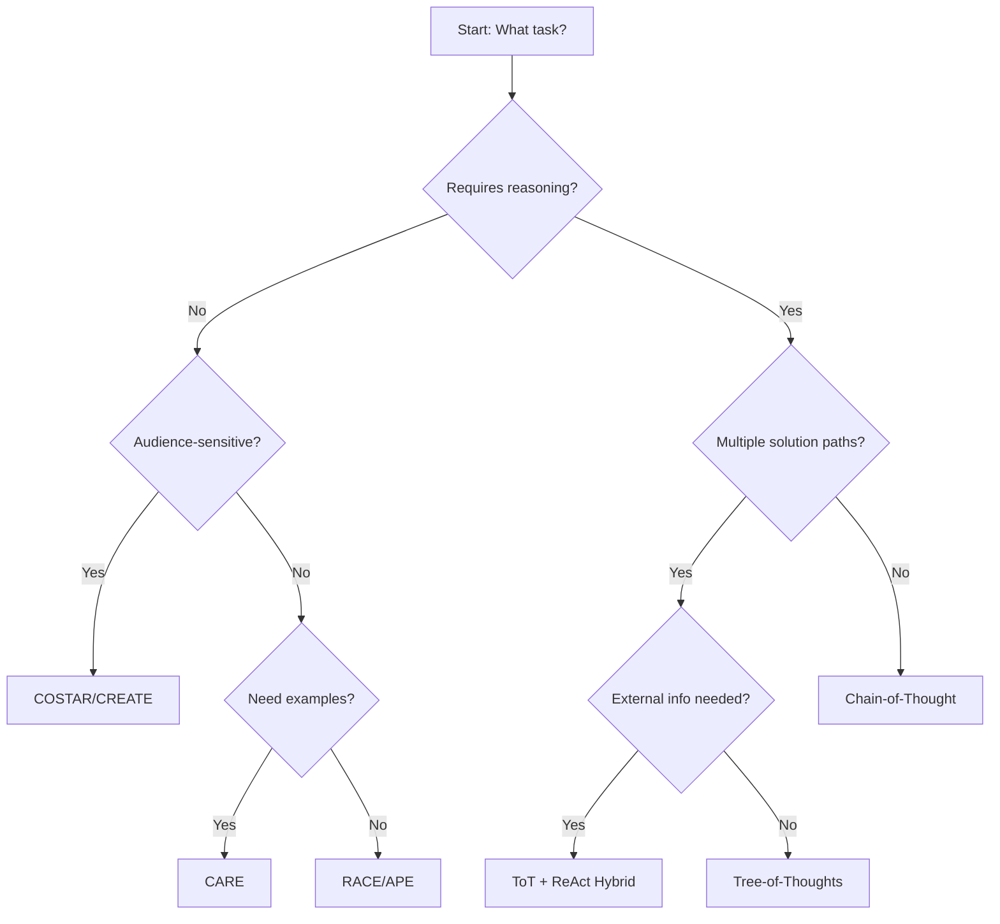

---

# 📚 Prompt Engineering Frameworks & Methodologies: Comprehensive Reference

`**Tags:** #prompt-engineering #llm #llm #topic/psychology #topic/psychology/methodology #instructional-design #topic/psychology #conversational-ai #pkb`

**Aliases:** [[PE Frameworks]], [[Prompt Design Systems]], [[LLM Interaction Methodologies]], [[Structured Prompting]], [[AI Communication Architecture]]

> [!comprehensive-reference] 📚Comprehensive-Reference
> - **Generated**:: 2025-11-10
> - **Version**:: 1.0
> - **Type**:: Reference Documentation

> [!abstract]
> **Executive Overview**
> [[Prompt Engineering]] frameworks represent systematic methodologies for structuring interactions with [[Large Language Models]] ([[LLM]]s) to elicit optimal, consistent, and predictable responses. These frameworks evolved from craft-based experimentation to structured, production-grade systems that bridge [[human intent]] with [[machine interpretation]], encompassing everything from simple template-based approaches to sophisticated multi-step reasoning architectures.

> [!how-to-use-this]
> **Navigation Guide**
> This reference note is organized into seven major sections covering all aspects of prompt engineering frameworks. Use the table of contents below for quick navigation, or search for specific terms using [[wiki-links]]. The document progresses from foundational concepts through advanced techniques, evaluation methodologies, and practical implementation strategies.

## 📑 Table of Contents

1. [[#⚙️ Foundational Concepts Theoretical Underpinnings|Foundational Concepts & Theoretical Underpinnings]]
2. [[#🏗️ Structural Framework Taxonomies|Structural Framework Taxonomies]]
3. [[#🧠 Cognitive Reasoning Frameworks|Cognitive Reasoning Frameworks]]
4. [[#🎭 Template-Based Structural Frameworks|Template-Based Structural Frameworks]]
5. [[#📊 Evaluation Measurement Systems|Evaluation & Measurement Systems]]
6. [[#🔬 Advanced Hybrid Approaches|Advanced & Hybrid Approaches]]
7. [[#🎯 Implementation Production Considerations|Implementation & Production Considerations]]

---

> [!left-off-reading-at]
> - Last-Read-POS:: 

## 1️⃣ ⚙️ Foundational Concepts & Theoretical Underpinnings

> [!definition]
> - **Key-Term**:: [[Prompt Engineering]]
> - **Definition**:: The systematic practice of designing, structuring, and optimizing input queries (prompts) to [[Large Language Models]] to achieve specific, desired outputs with maximum accuracy, relevance, and consistency.

### The Genesis of Structured Prompting

[[Prompt Engineering]] emerged as a discipline in response to the fundamental challenge of [[Human-Machine Communication]] in the era of [[Generative Ai]]. Early interactions with [[language models]] revealed a critical insight: the quality, structure, and specificity of input directly influenced the utility of output in ways that were both predictable and systematic. What began as ad-hoc experimentation evolved into a structured discipline as practitioners recognized patterns in what constituted effective communication with [[AI systems]].

The theoretical foundation of prompt engineering rests on several key principles from [[Cognitive Science]], [[Linguistics]], and [[Information Theory]]. First, the principle of **[[Semantic Precision]]**: LLMs operate on statistical patterns in language, requiring unambiguous communication to activate the correct probability distributions. Second, the concept of **[[Context Windowing]]**: models maintain working memory that must be efficiently utilized. Third, **[[Instruction Following]]** as an emergent capability that manifests at sufficient scale but requires proper activation through structural cues.

Modern prompt engineering frameworks evolved from the recognition that LLMs benefit from clear roles, constraints, tone specifications, and expected structure, transforming prompting from craft into a structured discipline. This evolution parallels developments in [[user interface design]] and [[human-computer interaction]], where structured approaches replaced intuition-based design.

> [!key-claim]
> **Central Principle**
> Effective prompt engineering is not about "tricking" the model, but rather about providing optimal conditions for the model to leverage its training through clear communication structures that mirror how [[Neural Networks]] process and retrieve information.

### The Role of Frameworks in Systematization

Without frameworks, every prompt becomes bespoke; with them, prompt engineering transforms into a structured discipline that enables consistency, safety, and cross-team scalability. Frameworks serve multiple critical functions:

**Cognitive Load Reduction**: By providing reusable templates and proven patterns, frameworks reduce the mental overhead required to construct effective prompts. Practitioners can focus on content rather than structure.

**Quality Assurance**: Frameworks establish baseline quality standards, ensuring that prompts include necessary components (context, constraints, format specifications) rather than relying on implicit assumptions.

**Knowledge Transfer**: Structured frameworks facilitate team collaboration and knowledge sharing, allowing organizations to codify institutional knowledge about what works with specific models or use cases.

**Iteration Efficiency**: When prompts follow framework patterns, systematic testing and refinement become possible. A/B testing and performance measurement require consistent structural baselines.

### Theoretical Models of Interaction

The development of prompt engineering frameworks draws on several theoretical models:

**[[Dual-Process Theory]]**: Tree of Thoughts prompting builds on Daniel Kahneman's concept from "Thinking, Fast and Slow" of [[]] (fast, automatic, unconscious) versus System 2 (slow, deliberate, conscious) thinking. Different frameworks engage different cognitive processes in the model's response generation.

**[[Information Architecture]]**: The organization of information within a prompt follows principles from [[Library Science]] and [[03_notes/01_permanent-notes/01_cognitive-development/Knowledge Management]], where hierarchical organization, cross-referencing, and metadata enhance retrievability and utility.

**[[Instructional Design]]**: Frameworks treat prompt writing as a full-stack design challenge, considering what the model should know, say, and sound like, with space for business goals, tone guidelines, and context variation. This parallels pedagogical frameworks for teaching complex concepts.

> [!core-principle]
> **Fundamental Axiom**
> The effectiveness of any prompt engineering framework is determined by its alignment with the model's [[attention mechanisms]], [[Tokenization]] strategies, and [[training objectives]]. Frameworks that work with the model's architecture rather than against it yield superior results.

### Domain-Specific vs. Universal Frameworks

Frameworks can be domain-specific (customer service, legal) or use-case-specific (summarization, classification), ranging from simple few-shot templates to complex, multi-layered systems. This distinction is crucial:

**Universal Frameworks** (e.g., [[create]], [[COSTAR]], [[5C Framework]]) provide general-purpose scaffolding applicable across diverse tasks. They emphasize fundamental communication principles like clarity, context, and expected output format.

**Domain-Specific Frameworks** optimize for particular verticals. Examples include the MED-Prompt framework for medicine prediction on clinical notes, and specialized frameworks for legal, financial, or technical domains. These frameworks incorporate domain terminology, regulatory constraints, and field-specific reasoning patterns.

**Task-Specific Frameworks** target particular use cases like [[code generation]], [[summarization]], [[Translation]], or [[question answering]]. They encode best practices for these tasks, including appropriate reasoning patterns and output structures.

> [!connections-and-links]
> **Related Concepts Within This Note**
> - For reasoning-specific frameworks, see [[#🧠 Cognitive Reasoning Frameworks]]
> - For template structures, see [[#🎭 Template-Based Structural Frameworks]]
> - For evaluation approaches, see [[#📊 Evaluation Measurement Systems]]

---

## 2️⃣ 🏗️ Structural Framework Taxonomies

> [!definition]
> - **Key-Term**:: [[Framework Taxonomy]]
> - **Definition**:: A hierarchical classification system for organizing prompt engineering frameworks based on their structural characteristics, intended use cases, and operational complexity.

### Classification by Complexity Level

Prompt engineering frameworks exist along a spectrum of complexity, from simple acronym-based templates to sophisticated multi-agent systems.

**Tier 1: Simple Acronym Frameworks** (3-5 components)
These represent entry-level structures suitable for straightforward tasks. Examples include:
- [[RACE]] (Role, Action, Context, Explanation)
- [[APE]] (Action, Purpose, Execution)
- [[CARE]] (Context, Action, Result, Example)

These frameworks provide basic scaffolding through acronym-based structures that guide users through essential prompt components. They work well for tasks with clear inputs and outputs, minimal context requirements, and straightforward execution paths.

**Tier 2: Comprehensive Template Frameworks** (5-8 components)
Mid-level frameworks that balance structure with flexibility. COSTAR (Context, Objective, Style, Tone, Audience, Response) stands out as one of the most structured and adaptable frameworks, treating prompt writing as a full-stack design challenge. Originally developed by data scientist Sheila Teo, it gained recognition after winning Singapore's first GPT-4 Prompt Engineering competition.

CRISPE (Capacity/Role, Insight, Statement, Personality, Experiment) was initially developed as an internal framework by OpenAI, balancing structured analytical thinking with exploratory experimentation. The framework enables both rigorous specification and iterative refinement.

The 5C Framework (Clarity, Contextualization, Command, Chaining, Continuous Refinement) provides a systematic approach focusing on precision, context provision, explicit directives, sequential reasoning, and iterative improvement.

**Tier 3: Advanced Multi-Step Frameworks** (Dynamic complexity)
These frameworks implement sophisticated reasoning patterns:
- [[Chain-of-Thought]] ([[CoT]])
- [[Tree-of-Thoughts]] ([[ToT]])
- [[ReAct]] (Reasoning + Acting)
- [[Self-Consistency]]

These will be explored in depth in the [[#🧠 Cognitive Reasoning Frameworks|Cognitive Reasoning Frameworks]] section.

### Classification by Interaction Pattern

**Static Frameworks**: Single-turn interactions where the prompt contains all necessary information and expects a complete response. Most acronym-based frameworks (RACE, APE, CARE, COSTAR) fall into this category.

**Iterative Frameworks**: Multi-turn patterns where prompts build on previous responses. The structured approach developed by Lance Cummings involves starting with role and goal, defining the task explicitly, and providing reference content the AI needs. This enables progressive refinement through conversation.

**Tool-Augmented Frameworks**: The ReAct framework allows LLMs to interact with external tools to retrieve additional information, leading to more reliable and factual responses. These frameworks integrate with search engines, calculators, databases, and APIs.

### Classification by Reasoning Depth

**Surface-Level Frameworks**: Optimize for quick, straightforward responses without explicit reasoning chains. Suitable for factual queries, simple translations, or format conversions.

**Shallow Reasoning Frameworks**: Incorporate basic explanatory steps. Zero-shot prompting relies on models' training to generate responses without additional examples or domain knowledge.

**Deep Reasoning Frameworks**: Chain-of-Thought prompting, introduced by Jason Wei and colleagues at Google in 2022, generates intermediate reasoning steps that significantly improve performance on complex reasoning tasks. Prompting a 540B-parameter model with just eight chain-of-thought exemplars achieved state-of-the-art accuracy on the GSM8K benchmark of math word problems.

> [!use-cases-and-examples]
> **Real-World Applications**
> 1. **Context**: Customer service automation
> 2. **Application**: COSTAR framework structures responses based on customer history (context), agent goals (objective), and brand voice (style + tone)
> 3. **Outcome**: Consistent, brand-aligned, context-aware support responses
>
> ---
>
> 4. **Context**: Technical documentation generation
> 5. **Application**: CRISPE framework balances analytical precision (Capacity, Insight, Statement) with appropriate tone (Personality) and allows iterative refinement (Experiment)
> 6. **Outcome**: Accurate, appropriately-toned technical content refined through testing

### Comparative Framework Analysis

| Framework | Complexity | Components | Best For | Limitations |
|-----------|------------|------------|----------|-------------|
| [[RACE]] | Simple | 4 | Quick tasks, clear objectives | Limited context handling |
| [[APE]] | Simple | 3 | Goal-oriented tasks | Minimal guidance on execution details |
| [[CARE]] | Simple | 4 | Example-driven learning | Requires good examples |
| [[create]] | Medium | 6 | Character-driven interactions | More setup overhead |
| [[COSTAR]] | Medium | 6 | Professional communications | Requires detailed audience analysis |
| [[CRISPE]] | Medium | 5 | Analytical + creative tasks | Experiment component needs definition |
| [[5C Framework]] | Medium | 5 | Systematic optimization | Requires iterative application |
| [[Chain-of-Thought]] | Advanced | Dynamic | Complex reasoning | Token-intensive |
| [[Tree-of-Thoughts]] | Advanced | Dynamic | Multi-path problems | Computationally expensive |
| [[ReAct]] | Advanced | Dynamic | Tool-augmented tasks | Requires tool integration |

> [!quick-reference]
> **Framework Selection Decision Tree**
> - 🔑 **Simple task, clear goal** → Use [[RACE]] or [[APE]]
> - 🔑 **Need examples to guide** → Use [[CARE]]
> - 🔑 **Audience-aware communication** → Use [[COSTAR]]
> - 🔑 **Analytical + exploratory** → Use [[CRISPE]]
> - 🔑 **Complex reasoning required** → Use [[CoT]], [[ToT]], or [[ReAct]]
> - 🔑 **Need systematic refinement** → Use [[5C Framework]]

---

## 3️⃣ 🧠 Cognitive Reasoning Frameworks

> [!definition]
> - **Key-Term**:: [[Cognitive Reasoning Frameworks]]
> - **Definition**:: Advanced prompt engineering methodologies that explicitly guide [[Large Language Models]] through multi-step reasoning processes, mimicking human problem-solving strategies through structured thought progression.

### Chain-of-Thought (CoT) Prompting

#### Theoretical Foundation

Chain-of-Thought prompting explores how generating a series of intermediate reasoning steps significantly improves the ability of large language models to perform complex reasoning. The method involves providing few-shot exemplars where prompts consist of triples: ⟨input, chain of thought, output⟩, with the chain of thought being intermediate natural language reasoning steps leading to the final output.

CoT is effective because it helps focus the attention mechanism of the LLM by decomposing the reasoning process, making the model focus on one part of the problem at a time, minimizing errors from handling too much information simultaneously.

The goal is to endow language models with the ability to generate a coherent series of intermediate reasoning steps that lead to the final answer, similar to how a human would reason through "After Jane gives 2 flowers to her mom she has 10… then after she gives 3 to her dad she will have 7… so the answer is 7".

#### Implementation Variants

**Few-Shot CoT**: Few-shot prompting involves providing multiple examples (typically around a hundred) demonstrating the breakdown approach, with performance increasing linearly with the number of examples.

**Zero-Shot CoT**: One recent advancement is zero-shot CoT, which essentially involves adding "Let's think step by step" to the original prompt, introduced by Kojima et al. in 2022. This simple sentence prompts the model to reason out loud and go through all required steps, with researchers from the University of Tokyo and Google Research proposing this method.

**Auto-CoT**: Zhang et al. (2022) proposed Auto-CoT to eliminate manual efforts by leveraging LLMs with "Let's think step by step" prompts to automatically generate reasoning chains for demonstrations. Auto-CoT samples questions with diversity and generates reasoning chains to construct demonstrations, mitigating the effects of mistakes in generated chains.

#### Empirical Performance

For instance, prompting a 540B-parameter language model with just eight chain-of-thought exemplars achieves state-of-the-art accuracy on the GSM8K benchmark of math word problems, surpassing even finetuned GPT-3 with a verifier.

Chain-of-thought reasoning emerges as a result of model scale, with many reasoning tasks showing flat scaling curves under standard prompting but dramatically increasing scaling curves with CoT prompting.

> [!equation]
> **Performance Scaling Relationship**
> $$\text{Performance}_{\text{CoT}} = f(\text{Model Scale}) \times \text{Reasoning Complexity}$$
> Where performance improvements scale non-linearly with both model parameters and task complexity, with emergent capabilities appearing at sufficient scale.

#### Critical Analysis

Research by Wang et al. (2023) shows that CoT reasoning is possible even with invalid demonstrations, with invalid reasoning steps achieving 80-90% of the performance obtained using valid CoT under various metrics while still generating coherent reasoning during inference. This suggests that aspects like being relevant to the query and correctly ordering reasoning steps are more important for effective CoT than the validity of individual steps.

Recent research reveals that the effectiveness of Chain-of-Thought prompting varies greatly depending on task type and model, with non-reasoning models showing small average improvements but increased variability in answers. For dedicated reasoning models, the added benefits of explicit CoT prompting appear negligible and may not justify the substantial increase in processing time.

> [!warning]
> **Critical Constraints**
> - CoT prompting significantly increases token usage and response latency
> - CoT can introduce more variability, sometimes triggering occasional errors in questions the model would otherwise answer correctly
> - Effectiveness diminishes with newer "reasoning models" that internally implement CoT-like processes
> - Invalid intermediate steps can propagate errors despite generating coherent-seeming reasoning

### Tree-of-Thoughts (ToT) Prompting

#### Conceptual Framework

For complex tasks requiring exploration or strategic lookahead, Tree of Thoughts (ToT) is a framework proposed by Yao et al. (2023) and Long (2023) that generalizes over chain-of-thought prompting and encourages exploration over thoughts that serve as intermediate steps for general problem solving.

ToT maintains a tree of thoughts, where thoughts represent coherent language sequences that serve as intermediate steps toward solving a problem, enabling an LM to self-evaluate progress through intermediate thoughts via deliberate reasoning. The LM's ability to generate and evaluate thoughts is combined with search algorithms (breadth-first search, depth-first search) to enable systematic exploration with lookahead and backtracking.

Tree of Thoughts prompting replicates human problem-solving processes through iterative exploration, evaluation, and refinement, pushing the boundaries of what AI models can achieve.

#### Operational Mechanics

ToT prompting leverages Kahneman's System 2 thinking—slow, deliberate, conscious reasoning—much like how humans tackle complex puzzles by exploring routes, realizing when a path won't work, and backtracking to explore different branches.

The framework operates on the model's ability to generate text hierarchically, with a central topic leading to branching subtopics and details, allowing for lookahead and tree search strategies where the model explores multiple branches before committing to a path.

The ToT process involves:
1. **Thought Generation**: At each step, generate k potential next thoughts
2. **Thought Evaluation**: Assess each candidate thought (e.g., "sure/maybe/impossible")
3. **Search Strategy**: Apply BFS or DFS to explore the thought tree
4. **Pruning**: Eliminate unpromising branches based on evaluation
5. **Backtracking**: Return to earlier decision points when paths fail

For the Game of 24 task, the LM is prompted to evaluate each thought candidate as "sure/maybe/impossible" with regard to reaching 24, aiming to promote correct partial solutions, eliminate impossible solutions based on "too big/small" commonsense, and keep the rest as "maybe".

#### Performance Characteristics

In experiments with GPT-4 on Game of 24 using Input-Output, Chain of Thought, and Tree of Thought methods, ToT with breadth b=1 achieved 45% success rate, while b=5 achieved 74%. ToT substantially outperforms other prompting methods on tasks requiring exploration and strategic planning.

On Game of 24, Input-Output, CoT, and CoT with Self-Consistency (CoT-SC) achieved only 7.3%, 4.0%, and 9.0% success rates respectively, demonstrating ToT's significant advantage.

#### Advanced Developments

Recent advancements include the Tree of Uncertain Thoughts (TouT), which enhances ToT by integrating uncertainty quantification mechanisms that assess the reliability of each decision path. This development is crucial for applications where decisions must be made under uncertainty and where the cost of mistakes is high.

> [!thought-experiment]
> **Conceptual Model: The Maze Explorer**
> Imagine navigating a complex maze where you can see three steps ahead. Chain-of-Thought is like always walking forward, describing each turn. Tree-of-Thoughts is like mentally exploring multiple paths simultaneously, marking dead ends, and only physically walking the most promising route. When you hit a wall, you backtrack to your last decision point and try a different branch.

> [!use-cases-and-examples]
> **Real-World Applications**
> 1. **Context**: Game of 24 mathematical puzzle
> 2. **Application**: ToT generates multiple solution paths, evaluates feasibility of partial solutions, prunes impossible branches, backtracks when needed
> 3. **Outcome**: 74% success rate (b=5) versus 4-9% with standard methods
>
> ---
>
> 4. **Context**: Strategic planning with multiple viable approaches
> 5. **Application**: Explore different strategic options simultaneously, evaluate consequences of each path, compare outcomes before committing
> 6. **Outcome**: More robust solutions that consider diverse approaches and avoid local optima

### ReAct (Reasoning + Acting) Framework

#### Foundational Concept

ReAct is inspired by the synergies between "acting" and "reasoning" which allow humans to learn new tasks and make decisions through reasoning. The framework allows LLMs to interact with external tools to retrieve additional information, leading to more reliable and factual responses.

ReAct prompts LLMs to generate verbal reasoning traces and actions for a task, allowing the system to perform dynamic reasoning to create, maintain, and adjust plans while enabling interaction with external environments (e.g., Wikipedia) to incorporate additional information.

#### Thought-Action-Observation Cycle

ReAct makes the LLM perform three tasks for every subtask: Reason (reasoning current states and what needs to be done), Act (taking action), and Observe (noting what results are achieved after taking action).

The trajectories consist of multiple thought-action-observation steps, where free-form thoughts achieve different tasks such as decomposing questions, extracting information, performing commonsense/arithmetic reasoning, guiding search formulation, and synthesizing final answers.

Action types typically include:
- **Search[item]**: Query knowledge bases or search engines
- **Lookup[keyword]**: Find specific information within retrieved context
- **Finish[answer]**: Provide the final answer

> [!methodology-and-sources]
> **Practical Framework: ReAct Prompt Structure**
> 
> **Step 1**: Define the task and available tools
> ```
> Task: [Description]
> Available Actions: Search, Lookup, Finish
> ```
> 
> **Step 2**: Provide few-shot exemplars showing Thought-Action-Observation patterns
> ```
> Question: [Example question]
> Thought 1: [Reasoning about what's needed]
> Action 1: [Tool invocation]
> Observation 1: [Tool output]
> Thought 2: [Reasoning about next steps based on observation]
> Action 2: [Next action]
> Observation 2: [Next output]
> …
> Thought N: [Final reasoning]
> Action N: Finish[answer]
> ```
> 
> **Step 3**: Present the actual task following the same pattern

#### Performance and Applications

On HotPotQA and Fever, ReAct overcame prevalent issues of hallucination and error propagation in chain-of-thought reasoning, outperforming imitation and reinforcement learning methods with 34% and 10% improvements on ALFWorld and WebShop.

Results show that the best approach combines ReAct with chain-of-thought, allowing use of both internal knowledge and external information obtained during reasoning.

ReAct's interleaving of reasoning and acting aims to reduce fact hallucination and error propagation, leading to more reliable outcomes with improved interpretability since the combination of reasoning and action steps makes the model's responses more comprehensible and trustworthy.

> [!warning]
> **Critical Constraints**
> - Requires integration with external tools and APIs
> - Increased latency from multi-turn tool interactions
> - Tool outputs must be properly formatted for model consumption
> - ReAct follows a single reasoning chain, making it less robust than ToT in exploring multiple possibilities simultaneously
> - Depends on the quality and reliability of external information sources

### Self-Consistency Decoding

Self-consistency is an advanced prompt engineering technique designed to improve accuracy, particularly for tasks involving arithmetic and commonsense reasoning, by generating multiple diverse reasoning paths instead of relying on a single chain-of-thought response.

The process involves:
1. Generate multiple independent CoT reasoning paths (typically 5-40)
2. Extract the final answer from each path
3. Aggregate answers using majority voting
4. Select the most consistent answer as the final output

This technique improves robustness by averaging over multiple reasoning trajectories, reducing the impact of individual errors or faulty reasoning chains.

### Comparative Analysis of Reasoning Frameworks

| Framework | Reasoning Pattern | External Tools | Computational Cost | Best Use Case |
|-----------|------------------|----------------|-------------------|---------------|
| [[CoT]] | Linear, sequential | No | Low | Step-by-step logical problems |
| [[ToT]] | Branching, tree-based | No | High | Multi-path exploration problems |
| [[ReAct]] | Cyclic, tool-augmented | Yes | Medium-High | Factual tasks needing verification |
| [[Self-Consistency]] | Parallel sampling | No | Very High | Critical accuracy requirements |

> [!the-philosophy]
> **Underlying Philosophy**
> The evolution from Chain-of-Thought to Tree-of-Thoughts to ReAct represents a progression in how we conceptualize machine reasoning: from linear narrative (human-like explanation) to multi-path exploration (systematic search) to grounded interaction (empirical verification). Each framework embodies different epistemological assumptions about the nature of knowledge and reasoning.

---

## 4️⃣ 🎭 Template-Based Structural Frameworks

> [!definition]
> - **Key-Term**:: [[Template Framework]]
> - **Definition**:: A structured, reusable prompt pattern that organizes information into predefined categories or components, optimized for specific communication goals or task types.

### COSTAR Framework

COSTAR (Context, Objective, Style, Tone, Audience, Response) is one of the most structured and adaptable prompt engineering frameworks in use today, originally developed by data scientist Sheila Teo and gaining recognition after winning Singapore's first GPT-4 Prompt Engineering competition.

#### Component Breakdown

**Context (C)**: Background information relevant to the task
- User history and previous interactions
- Domain-specific knowledge or constraints
- Environmental factors affecting the response
- Relevant facts, data, or reference materials

**Objective (O)**: The specific goal or desired outcome
- What the prompt aims to accomplish
- Success criteria for the response
- Measurable outcomes or deliverables
- Primary and secondary objectives if applicable

**Style (S)**: The manner of expression and presentation
- Formal vs. casual language register
- Verbose vs. concise expression
- Technical vs. accessible terminology
- Narrative vs. instructional format

**Tone (T)**: The emotional quality and attitude
- Professional, friendly, authoritative, empathetic, etc.
- Alignment with brand voice or organizational culture
- Appropriate emotional resonance for the context
- Balance between warmth and professionalism

**Audience (A)**: The intended recipients and their characteristics
- Level of expertise (novice, intermediate, expert)
- Demographics and psychographics
- Cultural considerations and sensitivities
- Accessibility requirements

**Response (R)**: The expected output format and structure
- Format specification (paragraph, list, table, code, etc.)
- Length requirements or constraints
- Required sections or components
- Examples of desired outputs

In customer service, COSTAR helps tailor responses based on the customer's history (context), the agent's goal (objective), and the brand's communication style (style + tone), with widespread adoption making it a foundational framework for professional-grade prompt engineering.

### CRISPE Framework

CRISPE (Capacity/Role, Insight, Statement, Personality, Experiment) was initially developed as an internal framework by OpenAI, balancing structured analytical thinking with exploratory experimentation.

#### Component Analysis

**Capacity/Role**: Establishes the model's operational persona
- Sets the model's capability level (expert analyst, creative writer, technical advisor)
- Defines the professional or functional role
- Establishes authority and perspective
- Provides implicit context for response style

**Insight**: Core analytical or conceptual contribution
- The key idea or perspective to surface
- Central analytical finding or observation
- Novel connection or understanding
- Primary value proposition of the response

**Statement**: The core output or deliverable
- Main content or assertion
- Central claim or conclusion
- Primary answer or recommendation
- Actionable takeaway

**Personality**: Tone and voice control
- Emotional coloring of the response
- Relationship dynamic with the user
- Formality level and engagement style
- Human qualities to embody

**Experiment**: Iterative refinement pathway
- Space for testing variants
- Framework for improvement
- Exploration of alternatives
- Learning from iteration

In customer service, CRISPE goes beyond reactive replies, exploring multiple paths to resolution, testing variants, and refining based on what actually works.

### 5C Framework

The 5C Framework (Clarity, Contextualization, Command, Chaining, Continuous Refinement) provides a structured approach to prompt engineering, helping users design prompts that elicit more accurate, relevant, and useful responses.

#### Framework Components

**Clarity**: Ensure the prompt is clear, concise, and unambiguous, using simple language, being specific, and avoiding complex vocabulary or jargon unless necessary. Clarity reduces misinterpretation and leads to more precise responses.

**Contextualization**: Provide relevant background information
- Historical context for the task
- Domain-specific knowledge needed
- Constraints or parameters
- Relationship to broader goals

**Command**: Give explicit, actionable directives
- Use imperative verbs ("Analyze," "Create," "Explain")
- Specify the exact task to perform
- Define the scope and boundaries
- Clarify what should and shouldn't be included

**Chaining**: Break complex tasks into smaller, sequential steps, with each step building on the previous one, particularly valuable for multi-step reasoning or complex workflows.

**Continuous Refinement**: Iterative improvement process
- Test and evaluate outputs
- Adjust based on results
- Refine wording and structure
- Optimize for consistency and quality

### CREATE Framework

In the CREATE approach developed by AI consultant Dave Birss, prompts are framed by addressing the AI as "you," with the acronym standing for Character, Request, Examples, Additions, Type of Output, and Extras.

#### Component Specifications

**Character**: Describe the role the AI is to assume, with the ability to add aspirational elements like "You are an experienced writer who crafts concise text without filler words or jargon".

**Request**: Clearly and specifically define the request using phrases like "I want you to…"

**Examples**: Provide illustrative instances of desired outputs

**Additions**: Refine the task by describing a point of view to consider or a style to use

**Type of Output**: Specify format such as a 100-word summary or chronologically organized bio

**Extras**: Any further information you wish to provide, including reference text

### Rhetorical Approach Framework

The rhetorical approach to prompt engineering was developed by Sébastien Bauer at Universitat Autònoma de Barcelona, involving describing the main claim and the rhetorical situation.

Components include:
- **Audience**: Who will read this?
- **Context**: Where will the audience encounter this?
- **Author and Ethos**: Role or credentials
- **Pathos**: What should the audience feel or believe?
- **Logos**: What logical points to emphasize?
- **Arrangement**: Organizational structure (chronological, alphabetical, etc.)
- **Style and Delivery**: Length, person, tone constraints

This method is particularly effective when the task involves persuasion, argumentation, or communication where the audience's perception matters significantly.

### Structured Approach (Cummings Method)

The structured approach developed by Lance Cummings, an AI content specialist and associate professor at University of North Carolina Wilmington, follows a clear formula:

1. **Start with role and goal**: Broadly describe the overarching aim and purpose
2. **Clearly define the task**: Make expectations explicit and detailed
3. **Provide reference content**: Supply any materials the AI needs to complete the task
4. **Specify constraints**: Define limitations, scope, and boundaries

### Simple Acronym Frameworks (Rapid Reference)

**RACE**:
- **R**ole: Specify the role
- **A**ction: Mention action needed
- **C**ontext: Provide background information
- **E**xplanation: Describe your outcome

**CARE**:
- **C**ontext: Give background information
- **A**ction: Mention action needed
- **R**esult: Mention your goal
- **E**xample: Give example outputs

**APE**:
- **A**ction: Define job to be done
- **P**urpose: Mention your goal
- **E**xecution: Describe the outcome you want

**RISE**:
- **R**ole: Establish perspective
- **I**nput: Provide necessary information
- **S**teps: Outline process
- **E**xpectation: Define desired output

**TRACE**:
- **T**ask: Define the assignment
- **R**equest: Specify what you want
- **A**ction: Clarify the action
- **C**ontext: Provide background
- **E**xample: Show desired format

> [!quick-reference]
> **Template Framework Selection Matrix**
> - 📋 **Audience-sensitive communication** → [[COSTAR]]
> - 🔬 **Analytical + experimental balance** → [[CRISPE]]
> - 🎯 **Systematic quality optimization** → [[5C Framework]]
> - 📝 **Character-driven interactions** → [[create]]
> - 🎭 **Persuasive/rhetorical content** → [[Rhetorical Approach]]
> - ⚡ **Quick, simple tasks** → [[RACE]], [[CARE]], [[APE]]

### Template Framework Comparative Analysis

| Framework | Setup Time | Flexibility | Learning Curve | Best For | Weaknesses |
|-----------|------------|-------------|----------------|----------|------------|
| [[COSTAR]] | High | High | Medium | Professional communications | Requires detailed audience analysis |
| [[CRISPE]] | Medium | Very High | Medium | R&D and innovation | Experiment component needs clear definition |
| [[5C Framework]] | Low | Medium | Low | Quality-focused iteration | Requires multiple passes |
| [[create]] | Medium | High | Low | Instructive scenarios | More verbose setup |
| [[Rhetorical]] | High | Medium | High | Persuasive content | Requires rhetorical expertise |
| [[RACE]]/[[CARE]] | Very Low | Low | Very Low | Quick tasks | Limited sophistication |

> [!analogy]
> **Illuminating Comparison**
> Think of template frameworks as different types of scaffolding for construction:
> 
> **Simple acronyms (RACE, CARE)** = Ladders: Quick to set up, limited functionality, suitable for small jobs.
> 
> **Comprehensive frameworks (COSTAR, CRISPE)** = Modular scaffolding: Takes time to assemble, highly configurable, supports complex projects.
> 
> **Reasoning frameworks (CoT, ToT)** = Cranes: Expensive to operate, essential for heavy lifting, required for tasks beyond scaffolding's capability.

---

## 5️⃣ 📊 Evaluation & Measurement Systems

> [!definition]
> - **Key-Term**:: [[Prompt Evaluation Metrics]]
> - **Definition**:: Quantitative and qualitative measures used to assess the effectiveness, efficiency, and quality of prompts in eliciting desired responses from [[Large Language Models]].

### Core Evaluation Metrics

#### Relevance

Relevance measures how closely the model's output aligns with the user's original intent in the query, particularly important for complex or nuanced prompts where slight deviations can lead to misunderstood outputs. Relevance can be measured by comparing output with predefined desired outcomes using similarity scores (e.g., cosine similarity for embeddings) or manual evaluations.

Relevance is one of the most subjective metrics for prompt evaluation, typically requiring human reviewers or comprehensive semantic similarity scores to assess how relevant the response is with regard to the prompt. Relevance is critical for targeted responses in applications like customer service chatbot queries.

#### Accuracy

Accuracy is the degree to which output is factually correct or aligns with known information, especially critical in domains requiring precision such as medical information, legal guidance, or technical support. Accuracy can be evaluated by comparing output against trusted reference data or external knowledge bases, using metrics like BLEU, ROUGE, or F1 scores for automated scoring.

For generating factual text like reports, summaries, or technical answers, accuracy indicates the degree to which the output is factually correct and/or aligned with the intended goal. For output containing N facts, accuracy could be calculated as the number of correct facts divided by N.

#### Consistency

Consistency assesses whether the model provides reproducible and similar responses when the same prompt is input multiple times or across different instances. Consistency can be measured by running the same prompt multiple times and comparing results for similarity—high similarity indicates consistency, whereas large variations suggest issues with the prompt or model tuning.

A prompt is consistent when it yields identical responses when repeatedly used across multiple instances, objectively measured as the quotient of identical responses to identical prompts divided by total trials. Consistency is key in automated chatbots requiring reliable responses without room for serendipity or unpredictability.

#### Completeness

Completeness is a less objective measure used to quantify whether a generated response is comprehensive enough to contain all required elements, typically given by the ratio of covered components over total required components.

Completeness evaluation requires:
- Defining all necessary components for the task
- Identifying which components are present in the output
- Calculating the coverage ratio
- Assessing whether missing components are critical or optional

#### Specificity

A prompt's specificity is the level of fine-grained detail provided in the response, a necessary aspect in tasks like elaborating detailed project plans or answering questions requiring precision.

High specificity indicates:
- Detailed, granular information rather than general statements
- Precise terminology and technical accuracy
- Concrete examples and specific instances
- Actionable details rather than abstract descriptions

#### Efficiency

Efficiency evaluates the speed and resource usage of the model when generating outputs, increasingly important in real-time applications where latency and computational load are factors. Efficiency can be tracked using response time (latency) and by monitoring computational metrics like CPU/GPU usage and memory load during prompt processing.

Latency is critical—prompts need to be precise and specific to the task, as elaborate prompts can lead to good results but may result in unacceptable latency issues that might lead to customer dissatisfaction.

### Automated Evaluation Frameworks

#### BLEU Score

The BLEU (Bilingual Evaluation Understudy) score is a widely used metric for evaluating machine-generated text against reference texts, offering a measure of how similar the AI's output is to human language.

BLEU measures:
- N-gram precision (typically 1-4 grams)
- Brevity penalty for overly short outputs
- Geometric mean of precision scores

Limitations:
- Doesn't account for semantic similarity
- Can miss valid paraphrases
- Sensitive to exact word matching

#### ROUGE Score

The ROUGE (Recall-Oriented Understudy for Gisting Evaluation) framework measures the overlap of n-grams, word sequences, and word pairs between the AI's output and reference texts, particularly beneficial in summarization tasks where capturing the core essence of information is crucial.

ROUGE variants:
- **ROUGE-N**: N-gram overlap (precision, recall, F1)
- **ROUGE-L**: Longest common subsequence
- **ROUGE-W**: Weighted longest common subsequence
- **ROUGE-S**: Skip-bigram overlap

#### METEOR Score

METEOR (Metric for Evaluation of Translation with Explicit ORdering) considers synonyms, stemming, and word order, providing a more nuanced evaluation than BLEU or ROUGE. By implementing METEOR, prompt engineers can push AI systems to generate responses that are not only accurate but also varied and rich in language.

METEOR advantages:
- Handles synonyms and paraphrases
- Considers stemmed forms
- Evaluates word order
- Better correlation with human judgment

### Qualitative Evaluation Approaches

#### Human Evaluation

While automated metrics provide a useful baseline, they may not fully capture the nuance of human communication, thus combining metrics with human judgment is essential for holistic evaluation.

Human evaluation dimensions:
- **Fluency**: Is the text grammatically correct and natural?
- **Coherence**: Does the response flow logically?
- **Relevance**: Does it address the prompt?
- **Factuality**: Is the information accurate?
- **Helpfulness**: Does it satisfy the user's need?
- **Safety**: Does it avoid harmful content?

#### A/B Testing

A/B testing is a powerful method for evaluating prompt performance by comparing different versions of a prompt to see which yields better results, allowing prompt engineers to experiment with variations in wording, structure, and tone.

A/B testing process:
1. Create prompt variants (A and B)
2. Define success metrics
3. Deploy both variants to similar users/contexts
4. Collect performance data
5. Statistical significance testing
6. Select winning variant or iterate further

LangSmith facilitates use of test datasets for evaluating prompts, allowing batch testing of prompts against large datasets and providing insights into overall model performance and identifying edge cases.

#### User Feedback Loops

Incorporating user feedback loops into the prompt evaluation process allows prompt engineers to gain valuable insights into user preferences and pain points, with feedback informing prompt adjustments to ensure the AI system remains responsive to user needs.

Leveraging sentiment analysis tools can provide an additional layer of understanding regarding user emotions and attitudes towards AI-generated responses, enabling prompt engineers to fine-tune prompts for optimal user experience.

### Performance Monitoring

#### Key Performance Indicators (KPIs)

Continuous monitoring and analysis of prompt performance data are essential for maintaining high standards in AI communication, with dashboards visualizing key performance indicators such as response time, accuracy, and user engagement aiding in identifying trends and anomalies.

Essential KPIs:
- **Response Time**: Average latency from prompt to output
- **Token Usage**: Input and output token consumption
- **Success Rate**: Percentage of responses meeting quality criteria
- **User Satisfaction**: Ratings, thumbs up/down, feedback scores
- **Error Rate**: Frequency of failures or inappropriate responses
- **Retry Rate**: How often users rephrase or retry prompts

#### Evaluation Cycles

Setting up regular evaluation cycles allows prompt engineers to track prompt performance over time, measuring the impact of prompt changes and assessing the effectiveness of prompt engineering efforts.

Task relevance—ensuring that evaluation metrics align with the specific task and goals of the prompt engineering project—is crucial for effective prompt evaluation.

### Cost-Benefit Analysis

Elaborate and inefficiently designed prompt structures might lead to unnecessary token usage, and in repetitive situations can lead to exorbitant costs, requiring effective structuring to account for unnecessary and redundant use of input/output tokens.

Cost evaluation includes:
- **Token costs**: API charges for input and output tokens
- **Latency costs**: Business impact of response delays
- **Maintenance costs**: Engineering time for prompt optimization
- **Error costs**: Impact of incorrect or inappropriate responses
- **Opportunity costs**: Trade-offs between different approaches

### Evaluation Best Practices

Using a balanced approach that combines automated metrics, human evaluation, and user feedback provides comprehensive insights into prompt effectiveness.

Effective prompt engineering starts with constructing good evals, with measurable evaluation requiring good prompt engineered templates and accounting for edge cases in production environments where there are innumerable possibilities of different user inputs owing to the subjective and fuzzy nature of LLM applications.

Establishing clear and measurable criteria for assessing prompt performance is essential, including accuracy, latency, cost, and adherence to desired format or style, allowing objective comparison of different prompts and identification of areas for improvement.

Setting a performance baseline is crucial for tracking progress, with Time to First Token (TTFT) measuring how long it takes for the LLM to generate the initial response after receiving a prompt—shorter TTFT often indicates a more efficient prompt, while longer TTFT might suggest the prompt is overly complex or ambiguous.

> [!methodology-and-sources]
> **Comprehensive Evaluation Protocol**
> 
> **Phase 1: Define Success Criteria**
> - Task-specific metrics (accuracy, completeness, relevance)
> - Performance requirements (latency, cost)
> - Quality standards (fluency, coherence, safety)
> 
> **Phase 2: Establish Baselines**
> - Benchmark performance on validation set
> - Measure TTFT and total latency
> - Calculate token usage and costs
> - Document error patterns
> 
> **Phase 3: Implement Monitoring**
> - Deploy KPI dashboards
> - Set up automated metric collection
> - Establish alert thresholds
> - Create feedback mechanisms
> 
> **Phase 4: Iterative Refinement**
> - Run A/B tests on variants
> - Analyze performance data
> - Identify optimization opportunities
> - Deploy improvements and measure impact
> 
> **Phase 5: Continuous Improvement**
> - Regular evaluation cycles (weekly/monthly)
> - Long-term performance tracking
> - Adaptation to model updates
> - Documentation of learnings

### Evaluation Tools and Platforms

Various prompt engineering tools offer evaluation capabilities, with platforms like PromptHub, PromptLayer, LangSmith, Azure AI Studio, and OpenAI Playground providing features for testing, monitoring, and optimizing prompts.

Key platform capabilities:
- **Visual prompt management**: User-friendly interfaces for writing and organizing prompts
- **Version control**: Tracking and managing different prompt versions
- **Testing and evaluation**: Running A/B tests, comparing models, evaluating performance
- **Usage monitoring**: Tracking usage statistics, latency trends, execution logs
- **Team collaboration**: Multi-user collaboration for prompt management
- **Analytics**: Detailed analytics and visualization options
- **Custom dashboards**: Personalized dashboards with project-specific metrics

> [!quick-reference]
> **Evaluation Metric Selection Guide**
> - 🎯 **Factual accuracy critical** → [[Accuracy]], [[BLEU]], fact-checking against references
> - 💬 **User satisfaction paramount** → [[Relevance]], human evaluation, feedback scores
> - ⚡ **Performance-sensitive application** → [[Latency]], [[Token usage]], [[Cost]]
> - 🔁 **Reliability requirement** → [[Consistency]], multi-run testing, variance analysis
> - 📝 **Comprehensive coverage needed** → [[Completeness]], component checklist, coverage ratio
> - 💰 **Cost optimization focus** → [[Token efficiency]], prompt length, output verbosity

---

## 6️⃣ 🔬 Advanced & Hybrid Approaches

> [!definition]
> - **Key-Term**:: [[Hybrid Prompting]]
> - **Definition**:: The strategic combination of multiple prompt engineering frameworks or techniques to leverage synergistic benefits and address complex use cases that single-framework approaches cannot optimally solve.

### Multi-Framework Integration

Sometimes multiple frameworks can be combined—such as ToT and ReAct, or using CoT for substeps within a ReAct workflow—with this hybrid prompting being especially useful in complex planning, research, and decision-making tasks.

Results show that the best approach combines ReAct with chain-of-thought, allowing use of both internal knowledge and external information obtained during reasoning.

#### CoT + ReAct Synthesis

This powerful combination enables:
1. **Internal reasoning** (CoT) for conceptual understanding and problem decomposition
2. **External verification** (ReAct) for fact-checking and information retrieval
3. **Iterative refinement** where reasoning informs searches and search results refine reasoning

Example application:
```
Task: Analyze the economic impact of a recent policy change

Thought 1 (CoT): To evaluate economic impact, I need to consider 
GDP effects, employment changes, and sector-specific impacts…

Action 1 (ReAct): Search["recent policy change economic data"]

Observation 1: [Retrieved economic indicators and analysis]

Thought 2 (CoT): Based on the data, employment increased by X% 
in sector Y, suggesting positive impact. However, I should verify 
if this is correlation or causation…

Action 2 (ReAct): Search["sector Y employment trends historical"]

…continuing the cycle…
```

#### ToT + Self-Consistency

Tree-of-Thoughts explores multiple reasoning paths while Self-Consistency samples diverse reasoning and selects the most consistent answer through majority voting.

Combining these approaches:
1. Use ToT to generate diverse reasoning paths
2. For each major branch in the tree, generate multiple completions
3. Apply self-consistency voting within each branch
4. Select the branch with highest internal consistency
5. Combine results for robust final answer

Benefits:
- Reduces impact of single faulty reasoning chains
- Validates paths through multiple independent samples
- Balances exploration (ToT) with verification (self-consistency)

### Domain-Adapted Frameworks

Domain-specific frameworks inject specialized knowledge, such as the MED-Prompt framework for medicine prediction on free-text clinical notes.

Domain adaptation strategies:
1. **Vocabulary specialization**: Incorporate domain-specific terminology and jargon
2. **Constraint encoding**: Embed regulatory, legal, or ethical constraints
3. **Workflow alignment**: Match prompt structure to domain-standard processes
4. **Knowledge integration**: Include domain-specific background information
5. **Output formatting**: Align with field-standard documentation formats

Examples:
- **Legal domain**: Incorporate citation standards, precedent references, jurisdictional constraints
- **Medical domain**: Include differential diagnosis frameworks, evidence-based medicine hierarchies
- **Financial domain**: Embed regulatory compliance checks, risk assessment frameworks
- **Scientific research**: Integrate methodology standards, statistical rigor requirements

### Reflexion and Self-Improvement

Reflexion is a framework that uses linguistic feedback to reinforce language agents, enabling models to learn from their mistakes and improve over time.

The Reflexion process:
1. **Initial attempt**: Model generates a response to the task
2. **Evaluation**: Assess the quality of the response
3. **Reflection generation**: Model analyzes what went wrong and why
4. **Memory storage**: Store reflection for future reference
5. **Retry**: Generate improved response using reflection insights
6. **Iteration**: Continue until satisfactory result achieved

This meta-cognitive approach enables:
- Learning from failures without retraining
- Accumulation of task-specific insights
- Transfer of problem-solving strategies across similar tasks
- Reduced error rates through explicit error analysis

### Automatic Reasoning and Tool-use (ART)

ART selects demonstrations of multistep reasoning and tool use from a task library, selecting and using tools alongside LLM generation to complete intermediate reasoning steps. At test time, ART seamlessly pauses generation whenever external tools are called, and integrates their output before resuming generation.

ART has been shown to be effective on natural language inference, question answering, and code generation, outperforming previous approaches to few-shot reasoning and tool-use.

ART architecture:
- **Task library**: Curated collection of task decompositions
- **Tool library**: Available external tools (APIs, databases, calculators)
- **Decomposition selection**: Choose appropriate decomposition for the task
- **Interleaved execution**: Alternate between LLM generation and tool invocation
- **Result integration**: Synthesize tool outputs into coherent response

### Prompt Templates and Dynamic Prompting

Prompt templates provide reusable structures that can be filled with task-specific information, while dynamic prompting adapts prompts based on context, user input, or previous interactions.

Template strategies:
- **Parameterized slots**: Define variables that get filled programmatically
- **Conditional sections**: Include/exclude content based on context
- **Recursive templates**: Templates that reference other templates
- **Context injection**: Dynamically insert relevant background information

Dynamic prompting approaches:
- **Contextual calibration**: Examples are carefully selected to match the difficulty or style of the target task, ensuring the model's output is both relevant and accurate
- **Adaptive few-shot**: Dynamic few-shot prompting adapts the set of examples in real time based on the model's previous outputs, allowing for more responsive and tailored interaction
- **User modeling**: Adjust prompts based on inferred user expertise, preferences, or goals
- **Conversation history**: Incorporate relevant context from previous turns

### Principled Instructions Research

Research on "Principled Instructions Are All You Need for Questioning LLaMA-1/2, GPT-3.5/4" identified 26 principles that improve prompt effectiveness, evaluated on metrics of "boosting" and "correctness".

The researchers found that specific word choice plays a huge role in prompt engineering, with emotional stimuli like "This is very important to my career" or reasoning language like "take a deep breath and work on this problem step-by-step" shown to increase performance.

The principles are broken down into 5 categories: Prompt Structure and Clarity, Specificity and Information, User Interaction and Engagement, Content and Language Style, Complex Tasks and Coding Prompts.

Key findings:
- Principle 4 emphasizes employing affirmative directives such as 'do' while steering clear of negative language like 'don't'
- Chain of Thought reasoning (Principle 12) helps with logical reasoning or complex tasks, with instructions to think step by step or use thought tags that can later be stripped out
- The larger the model, the bigger the improvement the principles have on average, with GPT-4 making the most of the principles, improving significantly with just a bit of prompt engineering

### Limitations and Challenges

One key limitation is the lack of generalizability—prompts that perform well in one context may fail in another, especially when transferred across models or domains, with this brittleness compounded by the sensitivity of LLMs to minor changes in phrasing, formatting, or context.

The ToT framework involves complex operations such as maintaining multiple decision paths, backtracking, and exploring alternative solutions, requiring significant processing power and memory, which can limit scalability especially in resource-constrained or real-time applications.

Setting up a tree of thoughts system involves integrating various components such as the prompter agent, checker module, memory module, and tree of thoughts controller, with each component needing fine tuning to work in harmony, which can be a complex and time-consuming process.

> [!warning]
> **Critical Constraints for Advanced Approaches**
> - **Computational overhead**: Multi-framework approaches multiply token usage and latency
> - **Implementation complexity**: Hybrid systems require careful orchestration and error handling
> - **Brittleness**: Advanced techniques may be more sensitive to prompt variations
> - **Model dependency**: What works on one model may fail on another
> - **Maintenance burden**: Complex prompts are harder to debug and optimize
> - **Cost scaling**: Token-intensive approaches become expensive at scale

> [!use-cases-and-examples]
> **Real-World Applications of Hybrid Approaches**
> 
> 1. **Context**: Medical diagnosis support system
> 2. **Application**: Combines domain-adapted MED-Prompt framework with CoT reasoning for differential diagnosis, ReAct for literature verification, and Reflexion for learning from misdiagnoses
> 3. **Outcome**: More accurate diagnostic suggestions with evidence-based support and continuous improvement from feedback
>
> ---
>
> 4. **Context**: Legal research and case analysis
> 5. **Application**: ToT explores multiple legal arguments, CoT structures detailed reasoning for each argument, ReAct retrieves relevant precedents and statutes, self-consistency validates conclusions across multiple reasoning paths
> 6. **Outcome**: Comprehensive legal analysis considering multiple perspectives with verified citations and internally consistent conclusions
>
> ---
>
> 7. **Context**: Complex financial modeling and forecasting
> 8. **Application**: Domain-adapted framework with financial terminology and regulations, ART for tool use (calculators, data APIs), CoT for multi-step financial reasoning, self-consistency for critical predictions
> 9. **Outcome**: Accurate financial models with transparent reasoning, verified calculations, and robust predictions validated through multiple approaches

---

## 7️⃣ 🎯 Implementation & Production Considerations

> [!definition]
> - **Key-Term**:: [[Production-Grade Prompting]]
> - **Definition**:: The practice of deploying prompt engineering solutions in real-world applications with considerations for reliability, scalability, maintainability, cost-effectiveness, and safety.

### From Prototype to Production

The transition from experimental prompting to production deployment requires systematic consideration of numerous factors beyond prompt effectiveness.

**Development Lifecycle**:
1. **Research & Experimentation**: Explore frameworks, test approaches, identify promising patterns
2. **Prototype Development**: Create initial implementations with selected frameworks
3. **Evaluation & Validation**: Rigorous testing against benchmarks and real-world scenarios
4. **Optimization**: Refine for performance, cost, and reliability
5. **Production Deployment**: Launch with monitoring and safeguards
6. **Continuous Improvement**: Iterate based on real-world performance data

### Safety and Alignment Considerations

**Prompt Injection Defense**: Production prompts must be hardened against adversarial inputs that attempt to override instructions or elicit undesired behaviors.

Defensive strategies:
- **Input sanitization**: Validate and clean user inputs
- **Instruction delimiters**: Use clear separators between instructions and user content
- **Role separation**: Distinguish system instructions from user content
- **Output validation**: Check responses for policy violations
- **Sandboxing**: Isolate user content in clearly marked sections

**Bias and Fairness**: Frameworks must enable AI models to work within business workflows, regulatory environments, and multilingual scenarios while maintaining fairness and avoiding discrimination.

Considerations:
- Test prompts across diverse demographic groups
- Monitor for disparate impact in outcomes
- Include fairness constraints in prompt design
- Regular auditing for emergent biases
- Diverse evaluation panels for human assessment

**Content Safety**: Prompts must discourage generation of harmful, offensive, or inappropriate content.

Safety mechanisms:
- Explicit content policy statements in prompts
- Output filtering and classification
- Multi-layer safety checks (prompt-level, model-level, post-processing)
- Escalation procedures for policy violations
- User feedback mechanisms for safety concerns

### Scalability and Performance

**Token Optimization**: Elaborate and inefficiently designed prompt structures might lead to unnecessary token usage, and in repetitive situations can lead to exorbitant costs.

Optimization techniques:
- **Prompt compression**: Remove redundant information without losing effectiveness
- **Dynamic context**: Include only relevant context for each request
- **Template efficiency**: Design reusable templates that minimize repetition
- **Response length control**: Specify appropriate output lengths
- **Caching strategies**: Reuse prompt components where possible

**Latency Management**: Prompts need to be precise and specific to the task, as elaborate prompts can lead to good results but may result in unacceptable latency issues.

Strategies:
- **Prompt length reduction**: Balance detail with response time
- **Model selection**: Choose appropriate model size for task complexity
- **Parallel processing**: Batch similar requests where possible
- **Streaming responses**: Enable incremental output delivery
- **Caching**: Store and reuse common prompt-response pairs

**Load Distribution**: Production systems must handle varying request volumes.

Architecture considerations:
- **Rate limiting**: Manage API call frequency
- **Queue management**: Buffer and prioritize requests
- **Failover mechanisms**: Handle API unavailability gracefully
- **Autoscaling**: Dynamically adjust capacity
- **Multi-model deployment**: Distribute load across model providers

### Version Control and Prompt Management

**Versioning Strategy**:
- Track all prompt modifications with version numbers
- Maintain changelog documenting changes and rationale
- Enable rollback to previous versions
- Tag stable versions for production use
- Document performance metrics per version

Visual prompt management with version control allows editing and deploying prompt versions visually without requiring coding, with tracking and management of different prompt versions.

**A/B Testing Infrastructure**: A/B testing allows experimentation with variations in wording, structure, and tone, optimizing prompts for different user groups or contexts.

Implementation:
- **Traffic splitting**: Randomly assign users to prompt variants
- **Statistical rigor**: Ensure sufficient sample sizes for significance
- **Metric collection**: Automatically track performance across variants
- **Automated selection**: Deploy winning variant when significance reached
- **Gradual rollout**: Incrementally increase traffic to new versions

### Cost Management

**Token Economics**: Understanding and optimizing token costs is crucial for sustainable production deployment.

Cost factors:
- **Input tokens**: Length of prompts and context
- **Output tokens**: Generated response length
- **API pricing tiers**: Different models have different costs
- **Request frequency**: Total volume of API calls
- **Peak vs. off-peak**: Time-based pricing considerations

Effective structuring of prompts should account for unnecessary and redundant use of input/output tokens to avoid exorbitant costs in repetitive situations.

Cost optimization strategies:
- **Prompt efficiency audits**: Regularly review and trim prompts
- **Output length constraints**: Specify maximum response lengths
- **Request batching**: Combine multiple queries where appropriate
- **Model tiering**: Use smaller models for simpler tasks
- **Usage monitoring**: Track costs per feature/user/task
- **Budget alerts**: Set thresholds for cost overruns

### Monitoring and Observability

**Key Monitoring Dimensions**:
Continuous monitoring and analysis of prompt performance data are essential for maintaining high standards, with dashboards visualizing key performance indicators aiding in identifying trends and anomalies.

Essential metrics:
- **Performance metrics**: Latency, throughput, error rates
- **Quality metrics**: Accuracy, relevance, consistency
- **Cost metrics**: Token usage, API costs per request
- **User metrics**: Satisfaction scores, retry rates
- **System health**: API availability, rate limit status

**Logging and Debugging**:
- **Comprehensive logging**: Capture full request-response pairs
- **Error classification**: Categorize and track failure modes
- **Trace analysis**: Follow request flow through system
- **Anomaly detection**: Alert on unusual patterns
- **Privacy compliance**: Log appropriately while respecting data regulations

**Performance Dashboards**: Platforms provide custom dashboards with KPIs and project-specific metrics for monitoring usage statistics, understanding latency trends, and managing execution logs.

### Team Collaboration and Knowledge Management

**Organizational Structure**:
- **Prompt libraries**: Centralized repositories of tested prompts
- **Documentation standards**: Consistent prompt documentation format
- **Review processes**: Peer review before production deployment
- **Knowledge sharing**: Regular team discussions of learnings
- **Training programs**: Onboarding for prompt engineering practices

Team collaboration features allow non-technical team members to easily work with engineering, with visual interfaces enabling broader participation in prompt development.

**Best Practices Documentation**:
- Framework selection guidelines
- Domain-specific prompt patterns
- Common pitfall avoidance strategies
- Debugging and troubleshooting guides
- Performance optimization techniques

### Ethical and Legal Considerations

**Compliance Requirements**:
- **Data privacy**: GDPR, CCPA, and other regulations
- **Content licensing**: Respect copyright and intellectual property
- **Industry regulations**: Domain-specific requirements (HIPAA, SOX, etc.)
- **Accessibility**: WCAG compliance for user-facing applications
- **Transparency**: Disclosure of AI involvement where required

**Responsible AI Practices**:
- Regular bias audits and fairness assessments
- Human oversight for high-stakes decisions
- Clear user communication about AI capabilities and limitations
- Mechanisms for user consent and control
- Documentation of ethical considerations in prompt design

### Future-Proofing

**Model Agnosticism**: Design prompts that can adapt across different models and versions.

Strategies:
- **Framework-based approach**: Use proven patterns over model-specific tricks
- **Abstraction layers**: Separate core logic from model-specific formatting
- **Regular testing**: Validate prompts as models update
- **Fallback mechanisms**: Handle model deprecation gracefully
- **Multi-model evaluation**: Test across different providers

**Adaptation to Model Evolution**:
- Monitor model update announcements
- Test prompts with new model versions before migration
- Maintain compatibility layers for transitions
- Plan for capability improvements (more context, better reasoning)
- Prepare for capability regressions (safety trade-offs)

```
> [!methodology-and-sources]
> **Production Deployment Checklist**
> 
> **Pre-Deployment**
> - [ ] Comprehensive evaluation on diverse test sets
> - [ ] A/B testing completed with statistical significance
> - [ ] Safety and alignment testing passed
> - [ ] Cost projections validated at scale
> - [ ] Monitoring infrastructure in place
> - [ ] Rollback procedures documented
> - [ ] Team training completed
> 
> **Deployment**
> - [ ] Gradual rollout with traffic splitting
> - [ ] Real-time monitoring of key metrics
> - [ ] Alert thresholds configured
> - [ ] Support team briefed on new prompts
> - [ ] User communication prepared
> - [ ] Escalation procedures activated
> 
> **Post-Deployment**
> - [ ] Performance data collection and analysis
> - [ ] User feedback gathering and review
> - [ ] Cost tracking and optimization
> - [ ] Incident documentation and learning
> - [ ] Continuous improvement planning
> - [ ] Regular audit scheduling
```

> [!the-philosophy]
> **Underlying Philosophy of Production Prompting**
> The transition from experimentation to production represents a shift from optimizing for peak performance to optimizing for consistent, sustainable, and responsible performance at scale. Production prompting is less about finding the "perfect" prompt and more about building robust systems that perform reliably across diverse conditions, degrade gracefully under stress, and evolve responsibly as models and requirements change.

---

## 🎯 Synthesis & Mastery

> [!the-philosophy]
> **Underlying Philosophy**
> [[Prompt Engineering]] frameworks represent the codification of effective [[human-AI communication]] patterns discovered through systematic experimentation. At their core, these frameworks embody a fundamental insight: [[Large Language Models]] are neither wholly intelligent agents nor simple pattern matchers, but rather sophisticated statistical systems that benefit from structured, intentional communication. The evolution from simple templates to complex reasoning frameworks mirrors humanity's growing understanding of how to collaborate with AI systems—not by anthropomorphizing them, but by understanding their actual mechanisms and designing communication protocols that work with their architecture rather than against it.

### Cognitive Models for Framework Selection

The selection of appropriate frameworks should be guided by understanding the cognitive demands of the task:

**System 1 Tasks** (Fast, intuitive, pattern-based):
- Simple classification or categorization
- Straightforward transformations
- Format conversions
- Basic Q&A on common topics
→ Use simple acronym frameworks ([[RACE]], [[CARE]], [[APE]])

**System 2 Tasks** (Slow, deliberate, reasoning-required):
- Multi-step problem solving
- Complex analysis requiring evidence
- Strategic planning with trade-offs
- Creative generation with constraints
→ Use reasoning frameworks ([[CoT]], [[ToT]], [[ReAct]])

**Hybrid Tasks** (Alternating between intuition and deliberation):
- Interactive problem-solving
- Research and synthesis
- Decision-making with uncertain information
→ Use hybrid approaches (CoT + ReAct, ToT + Self-Consistency)

### Mental Model: The Communication Stack

Think of prompt engineering as a communication stack with layers:

**Layer 1: Semantic Foundation** (What to communicate)
- Core information and facts
- Domain knowledge and context
- Goals and objectives

**Layer 2: Structural Organization** (How to organize)
- Information architecture
- Logical flow and sequence
- Hierarchical relationships

**Layer 3: Framework Application** (How to present)
- Template selection
- Component ordering
- Formatting conventions

**Layer 4: Optimization** (How to refine)
- Token efficiency
- Latency optimization
- Cost management

**Layer 5: Production Hardening** (How to scale)
- Safety mechanisms
- Monitoring and observability
- Version control

Each layer builds on the previous, and effectiveness at higher layers depends on solid foundations.

> [!analogy]
> **Illuminating Comparison: The Architecture Metaphor**
> 
> Prompt engineering frameworks are like architectural blueprints for buildings:
> 
> **Simple acronym frameworks** = Basic floor plans: Quick to sketch, suitable for simple structures like sheds or garages. They provide essential structure but limited sophistication.
> 
> **Comprehensive template frameworks** = Detailed architectural drawings: Include elevations, cross-sections, material specifications. Suitable for houses and small commercial buildings. They require more upfront work but result in well-designed structures.
> 
> **Reasoning frameworks** = Engineering specifications: Include structural calculations, load-bearing analyses, dynamic modeling. Essential for skyscrapers, bridges, and complex structures. They're expensive and time-consuming but necessary for projects that can't afford failure.
> 
> Just as you wouldn't use skyscraper engineering for a garden shed (wasteful) or use basic floor plans for a hospital (dangerous), choosing the right prompt framework means matching complexity to need.

### Comparative Framework Philosophy

| Framework Type | Philosophy | When It Fails | Adaptation Strategy |
|----------------|------------|---------------|---------------------|
| **Simple Templates** | "Clear structure enables basic communication" | Complex reasoning required | Add CoT elements or upgrade to comprehensive framework |
| **Comprehensive Templates** | "Detailed specification reduces ambiguity" | Reasoning depth needed | Hybrid with CoT or ToT |
| **CoT** | "Explicit reasoning improves accuracy" | Multiple solution paths viable | Upgrade to ToT |
| **ToT** | "Exploration finds better solutions" | External information needed | Hybrid with ReAct |
| **ReAct** | "Grounding in reality improves reliability" | Pure reasoning without facts | Use standalone for fact-based tasks |

### The Framework Selection Decision Tree



### Practical Integration Wisdom

**Start Simple, Evolve Complexity**: Begin with the simplest framework that might work. Add complexity only when simpler approaches demonstrably fail. This principle of [[progressive enhancement]] reduces unnecessary overhead.

**Framework Composability**: Most real-world applications benefit from composing multiple frameworks. The art lies in knowing which combinations are synergistic versus merely additive.

**Context Dependency**: No framework is universally superior. Context—including model capabilities, task complexity, cost constraints, and latency requirements—determines optimal selection.

**Measurement Discipline**: Quantitative metrics have limitations and don't capture the whole picture, but tracking metrics ensures reproducible experiments and validates results. Devoting time to reassessing which metrics are most relevant for your specific needs will save time in later stages.

**Iterative Improvement**: Creating effective prompts is an iterative process—first attempts may not be perfect, and failing to prove or reject your point is as valid as any other result. Being prepared to refine and adjust prompts based on feedback and evaluation results, continually experimenting and learning from each iteration, is the best way to go.

### Common Antipatterns to Avoid

**The "Swiss Army Knife" Antipattern**: Trying to create one universal prompt that handles all scenarios. This results in bloated, inefficient prompts that perform suboptimally across the board.

**The "Over-Engineering" Antipattern**: Applying complex frameworks (ToT, extensive ReAct) to simple tasks. This wastes resources and increases failure points.

**The "Under-Specification" Antipattern**: Assuming the model will "figure out" implicit requirements. Explicit is better than implicit in prompt engineering.

**The "Optimization Obsession" Antipattern**: Spending excessive time optimizing prompts beyond practical benefit. Follow the 80/20 rule: achieve 80% of possible improvement with 20% of optimization effort.

**The "Framework Rigidity" Antipattern**: Treating frameworks as inviolable rules rather than flexible guidelines. Adapt frameworks to your needs, not the reverse.

### Future Trajectories

The field of prompt engineering continues to evolve rapidly:

**Model Internalization**: As models increasingly internalize prompting best practices (e.g., built-in reasoning modes), the role of explicit prompting will shift from teaching models how to reason to specifying what to reason about.

**Automatic Prompt Optimization**: Tools for automatically discovering and optimizing prompts will reduce manual engineering but won't eliminate the need for human expertise in defining objectives and evaluating results.

**Multimodal Frameworks**: As models handle text, images, audio, and video, frameworks will need to address cross-modal reasoning and communication.

**Personalization**: Frameworks will increasingly adapt to individual user preferences, communication styles, and domain expertise.

**Regulatory Frameworks**: As AI deployment scales, formalized standards and best practices will emerge, potentially codifying certain framework patterns as industry standards.

---

## 📊 Metadata & Attribution

> [!methodology-and-sources]
> **Research Methodology**
> - **Primary Sources**: Academic papers on CoT prompting (Wei et al., 2022), ToT (Yao et al., 2023), ReAct (Yao et al., 2022), and empirical studies on prompt engineering effectiveness
> - **Research Queries**: 
>   - "prompt engineering frameworks overview 2024"
>   - "chain-of-thought prompting research paper techniques"
>   - "tree-of-thoughts ReAct prompting framework advanced techniques"
>   - "prompt engineering evaluation metrics best practices 2024"
> - **Synthesis Approach**: Integrated findings from academic research, practitioner guides, industry implementations, and evaluation studies to create comprehensive reference covering theory, practice, and production considerations
> - **Confidence Level**: 
>   - **High**: Core framework definitions, CoT/ToT/ReAct mechanisms, established evaluation metrics
>   - **Medium**: Comparative framework performance, cost-benefit analyses, emerging hybrid approaches
>   - **Evolving**: Production best practices, future trajectories, model-specific optimizations

### Sources Consulted

This reference synthesizes information from:
- Parloa Knowledge Hub on prompt engineering frameworks (2025)
- UC Davis research guide on generative AI prompting (2024)
- KDnuggets guide to mastering prompt engineering (2024)
- PromptHub analysis of 26 principled instructions for 2024
- Prompt Engineering Institute's 5C Framework documentation (2024)
- Georgia Tech analysis of prompt engineering approaches
- Original Chain-of-Thought research by Wei et al. and subsequent analyses
- Recent research on decreasing value of CoT in reasoning models (2025)
- Tree-of-Thoughts framework documentation and research
- ReAct framework research and implementations
- Evaluation metrics and best practices from multiple sources
- Practical implementation guides and platform comparisons

## 🔄 Version History

| Version | Date | Changes |
|---------|------|---------|
| 1.0 | 2025-11-10 | Initial comprehensive compilation covering all major framework categories, reasoning approaches, evaluation systems, and production considerations |

---

### 🔗 Related Topics for PKB Expansion

* [[Advanced CoT Variations and Research]]
* [[Multimodal Prompt Engineering Frameworks]]
* [[Domain-Specific Framework Design Patterns]]
* [[Prompt Injection Defense Mechanisms]]
* [[Cost Optimization Strategies for Production LLMs]]
* [[Prompt Engineering for Code Generation]]
* [[Few-Shot Learning Best Practices]]
* [[Semantic Similarity Metrics for Prompt Evaluation]]
* [[LLM Architecture and Its Impact on Prompting]]
* [[Agentic AI and Multi-Step Reasoning Systems]]
* [[Prompt Chaining and Workflow Orchestration]]
* [[Constitutional AI and Value Alignment in Prompts]]
* [[Retrieval-Augmented Generation (RAG) Integration with Prompting]]
* [[Hallucination Mitigation Strategies]]
* [[Cross-Lingual Prompt Engineering]]

```
<thinking>
This is a comprehensive request for a reference document on Prompt Engineering Frameworks. Let me work through this systematically.

## Phase 1: Research & Knowledge Extraction

### Initial Scope Mapping
THINKING: "The topic 'Prompt Engineering Frameworks' encompasses several major domains…"
* Primary domain: AI/ML interaction methodologies, specifically techniques for optimizing communication with Large Language Models
* Adjacent domains: Cognitive science (how humans structure requests), computational linguistics, software development patterns, instructional design
* Depth requirement: HIGH - This is a rapidly evolving field with both theoretical foundations and practical applications. Need to cover historical development, current state-of-the-art, and emerging practices.

### Knowledge Gap Analysis Before Research
Key areas to investigate:
1. Historical evolution of prompt engineering practices
2. Established frameworks (Chain-of-Thought, Tree-of-Thoughts, ReAct, etc.)
3. Systematic approaches to prompt construction
4. Evaluation methodologies
5. Domain-specific applications
6. Emerging trends and future directions

Let me conduct systematic web research to build a comprehensive knowledge base.

### Systematic Web Research

**Search 1: Foundational Understanding**
QUERY RATIONALE: "I'm searching for 'prompt engineering frameworks overview' to establish the landscape of existing frameworks and their relationships"
EXPECTED INSIGHT: "This should reveal the major categories of frameworks, their historical development, and how they relate to each other"

**Search 2: Technical Specifications**
QUERY RATIONALE: "I need to search for 'chain-of-thought prompting techniques' to understand one of the most foundational frameworks in detail"
EXPECTED INSIGHT: "This should provide technical details about implementation, variations, and empirical results"

**Search 3: Advanced Methodologies**
QUERY RATIONALE: "Searching for 'tree-of-thoughts ReAct prompting' to understand more sophisticated, multi-step frameworks"
EXPECTED INSIGHT: "This should reveal how advanced frameworks build upon simpler ones and handle complex reasoning tasks"

**Search 4: Practical Implementation**
QUERY RATIONALE: "Need to search 'prompt engineering best practices 2024' for current state-of-the-art techniques"
EXPECTED INSIGHT: "This should provide contemporary wisdom about what works in production environments"

**Search 5: Evaluation & Measurement**
QUERY RATIONALE: "Searching for 'prompt engineering evaluation metrics' to understand how framework effectiveness is measured"
EXPECTED INSIGHT: "This should reveal systematic approaches to testing and optimizing prompts"

Let me execute these searches now.
</thinking>
```

```
I'll create a comprehensive reference document on Prompt Engineering Frameworks. Let me conduct the necessary research first.Now I have sufficient research material. Let me create the comprehensive reference document as specified in the instructions.
```