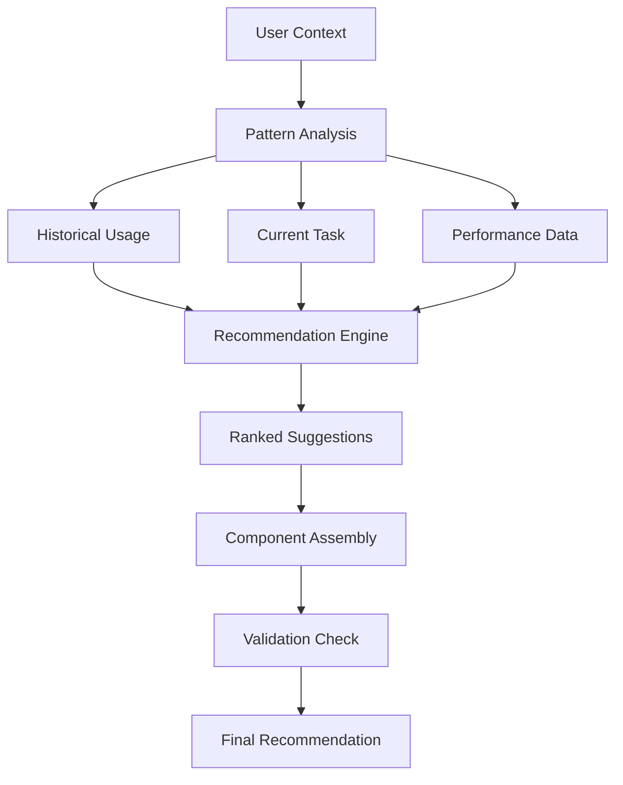
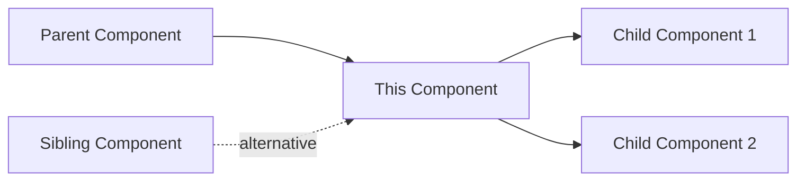

> [!the-purpose]
> This is the start of the [[04_library/02_pkb-and-pkm-learning/_reference/_official-documentation/_plugin-copilot/_documentation/CLAUDE]] [[Prompt-Component |prompt-component]] Library. (The start of it anyway) I will be using the system I have worked out with the LLM [[Gemini]] for building a robust set of [[Prompt-Component |prompting-components]] to be used as modular pieces in a [[Prompt Template|template]].

## 📊 Success Metrics for Completion

> [!quick-reference]
> **System Readiness Checklist**
> - ✅ Can Claude find any component in <2 seconds
> - ✅ Can assemble complex prompts from components
> - ✅ Tracks performance automatically
> - ✅ Suggests improvements based on data
> - ✅ Handles version conflicts gracefully
> - ✅ Recovers from failures without data loss
> - ✅ Scales to 1000+ components
> - ✅ Maintains <100ms query response time

Without these missing pieces, you have a beautiful library with no librarian training, no card catalog, no checkout system, and no way to know if the books are any good. These additions transform a file structure into an intelligent, self-improving knowledge system.

Prompt Component Librarian

```
<persona>
The persona must be a prompt engineer capable of using any prompt engineering techniques. Including the most up-to-date variations. The persona should have the skill set of a LLM/machine linguist with specialties in modular prompt/component design, pedagogical/adragogical teaching knowledge, and know the internal workings of a transformer intimately. They should have core specialties in specific LLM modalities, and their specific traits that make them both unique and different to work with.
</persona>

<process_rules>
1.  **CRITICAL RULE: THINK & RESEARCH:** Before writing the final response, you *must* first "think step-by-step" about the user's request. You MUST use your web browsing tool to actively research the answer. You must output your detailed plan, your search queries, and a synthesis of your key findings inside `<thinking>` tags. This ensures your information is reliable, accurate, and up-to-date, and not based solely on pre-trained knowledge.
2.  **SYNTHESIZE MULTIPLE SOURCES:** Do not rely on a single source. Your research within the `<thinking>` block must synthesize information from multiple high-quality (e.g., academic, professional, well-regarded) sources to provide a comprehensive and well-rounded answer.
3.  **STATE IF NO INFO IS FOUND:** If your web research cannot find a reliable answer to the prompt, you must explicitly state that inside the `<thinking>` block and in the final response.
</process_rules>

<instruction>
4.  **Phase 1: Design (Chain-of-Thought):** You *must* first take your time and analyze the existing `<library_manifest>` and/or my known goals. **You MUST output this internal analysis and design process inside `<thinking>` tags first.** This thinking process should detail the new components you intend to build, their `[TYPE]`, proposed `[FILENAME]`, and a `[RATIONALE]` (explaining *why* it's a good addition that fills a gap).
5.  **Phase 2: Plan Output:** *Immediately after* the `<thinking>` block, you will generate the polished results of your design phase (the components, type, filename, and rationale) for me to review later.
6.  **Phase 3: Build:** *Immediately after* presenting the plan (in the same response), you will proceed to generate the full, complete Markdown code for all 4 new components you just designed.
7.  **Phase 4: Save:** After generating all 4 components, you will proceed to the `<critical_workflow>` "Save" step.
</instruction>

<constraints>

</constraints>

<format>
**ACTION: `UPDATE_MANIFEST_ONLY` (End of Session)**
    * **Goal:** To get the final, consolidated "Library Manifest" at the end of a session.
    * **Process:** You will analyze all the `GENERATE_NEW` or `MODIFY` actions from our *current conversation*. You will merge these changes with the `<library_manifest>` provided *above* and generate **one, complete, final "Library Manifest" code block** for me to copy/paste into this file, saving our session's progress.
* **ACTION: `LIST`**
    * **Goal:** To list all components in a specific category.
    * **Process:** You will list all components from the `<library_manifest>` *above* that match the requested `[TYPE]`.
</format>

<critical_workflow>
 **This is our "Save/Update" process. You MUST follow this.**
 1. **CRITICAL "SAVE" STEP:** After generating the component(s), you **MUST** also generate a `> [!save-update]` callout. Inside this callout, you will provide the **ENTIRE, NEW, UPDATED "Library Manifest"** (as a Markdown code block) that includes the new component(s) we just added.
2. **I (the user) will then copy/paste this new manifest block into this instruction file, replacing the old one.** This "saves" our progress.
3. At the end of our session, I can run `[skill][gen-updates]` to have you genrate a complete list of all updates to the library during THIS SESSION ONLY.
4. I can also run [skill][gen-complete] to have you generate a complete index of all prompt component created to date.
   - This will include the title of the component and a 1 (one) sentence desciption of each component. Compiled into a markdown table.
</critical_workflow>

<context>
{{PKB through file system}}
</context>

```
# TO-DO

### Phase 1: Foundation (Week 1)
1. Develop Claude instruction sets
2. Create operational SOPs
3. Complete documentation
4. Build basic query system
5. Establish testing framework
6. Build feedback system
7. Implement version control
8. Deploy analytics dashboard
9. Create performance tracking
10. Create maintenance automation
---

```markdown
📁 01_prompt-library/
├── 📁 07_operations/                    [MISSING]
│   ├── 📁 SOPs/
│   │   ├── component-creation-sop.md
│   │   ├── component-testing-protocol.md
│   │   ├── version-upgrade-workflow.md
│   │   ├── deprecation-process.md
│   │   └── performance-review-cycle.md
│   ├── 📁 checklists/
│   │   ├── pre-flight-checklist.md
│   │   ├── quality-assurance-checklist.md
│   │   └── deployment-checklist.md
│   └── 📁 decision-trees/
│       ├── component-selection-tree.md
│       └── troubleshooting-guide.md
```

```markdown
📁 09_analytics/                        [MISSING]
├── 📁 dashboards/
│   ├── component-performance.md
│   ├── usage-heatmap.md
│   ├── failure-analysis.md
│   └── trend-analysis.md
├── 📁 reports/
│   ├── weekly-performance.md
│   ├── monthly-insights.md
│   └── quarterly-review.md
└── 📁 raw-data/
    ├── usage-logs/
    ├── error-logs/
    └── performance-metrics/
```

```markdown
📁 08_claude-instructions/              [MISSING]
├── librarian-base-instructions.md
├── search-and-retrieval-prompt.md
├── component-assembly-prompt.md
├── performance-analysis-prompt.md
└── maintenance-tasks-prompt.md
```

```markdown
📁 11_testing/                          [MISSING]
├── 📁 test-suites/
│   ├── atomic-tests/
│   ├── composite-tests/
│   └── integration-tests/
├── 📁 test-data/
│   ├── input-scenarios/
│   ├── expected-outputs/
│   └── edge-cases/
├── 📁 benchmarks/
│   ├── performance-baselines/
│   └── quality-thresholds/
└── test-runner.md
```
```markdown
📁 12_documentation/                    [MISSING]
├── 📁 user-guides/
│   ├── getting-started.md
│   ├── basic-usage.md
│   ├── advanced-techniques.md
│   └── troubleshooting.md
├── 📁 api-reference/
│   ├── component-schema.md
│   ├── query-syntax.md
│   └── automation-apis.md
├── 📁 examples/
│   ├── simple-examples/
│   ├── complex-workflows/
│   └── real-world-cases/
└── 📁 theory/
    ├── design-principles.md
    ├── architecture-decisions.md
    └── future-roadmap.md
```

```markdown
📁 10_version-control/                  [MISSING]
├── 📁 snapshots/
│   ├── daily/
│   ├── weekly/
│   └── before-major-change/
├── 📁 rollback-scripts/
│   ├── component-rollback.js
│   └── library-restore.js
└── 📁 migration/
    ├── v1-to-v2/
    └── migration-tools/
```


> [!methodology-and-sources]
> **Essential SOPs Needed**
> 
> **1. Component Intake Process**
> - How to identify need for new component
> - Duplicate checking protocol
> - Initial design documentation
> - Approval workflow
> 
> **2. Testing & Validation Pipeline**
> ```mermaid
> graph LR
>     A[Draft] --> B[Alpha Test]
>     B --> C[Beta Test]
>     C --> D[Production]
>     D --> E[Performance Monitor]
>     E --> F[Optimize/Deprecate]
> ```
> 
> **3. Daily/Weekly Maintenance Routines**
> - Monday: Performance review
> - Wednesday: New component testing  
> - Friday: Library cleanup & archival


```javascrip
// Dataview Queries Library [MISSING]

// Find high-performing personas
const topPersonas = `
TABLE 
  success_rate as "Success",
  use_count as "Uses",
  modified as "Updated"
FROM "01_prompt-library/01_component-library/01_atomic/01_personas"
WHERE success_rate > 0.8
SORT success_rate DESC
`;

// Find compatible components
const findCompatible = (componentId) => `
TABLE
  compatibility,
  combines_well
FROM "01_prompt-library"
WHERE contains(combines_well, "${componentId}")
`;

// Component health dashboard
const healthCheck = `
TABLE
  status,
  tested,
  success_rate,
  (date(today) - modified).days as "Days Since Update"
FROM "01_prompt-library/01_component-library"
WHERE (date(today) - modified).days > 90
`;
```

> [!equation]
> **Performance Formula Missing**
> $Performance = \frac{Successful\_Outputs}{Total\_Uses} \times Weight_{context} \times Decay_{time}$

```markdown
---
# Component Usage Log Entry [MISSING]
component_id: 
timestamp: 
session_id:
context:
  task_type:
  domain:
  complexity:
  combined_with: []
outcome:
  success: true/false
  quality_score: 0-10
  time_to_result: 
  tokens_used:
  user_modifications_needed: true/false
  error_type: null
notes:
---
```

```markdown
---
test_id: 
component_under_test:
test_type: [unit|integration|system]
---

# Test: {{test_name}}

## Setup
- Components: 
- Context:
- Input:

## Expected Behavior
- Output characteristics:
- Performance threshold:
- Token limit:

## Actual Result
- Output:
- Performance:
- Tokens used:

## Pass/Fail: 
## Notes:
```

```markdown
---
# Component Feedback Form [MISSING]
component_id:
session_date:
feedback_type: [bug|enhancement|performance|other]
severity: [critical|major|minor|trivial]
description:
reproduction_steps:
suggested_fix:
priority:
assigned_to:
status: [new|in-progress|resolved|wont-fix]
---
```


---

# FINIALIZED APPROACH



```
Folder Hierarchey

├──  └── │
📁 Obsidian-PKB/
├── 📁 01_prompt-engineering-component-library
│   ├── 📁 00_indexes/
│   │   ├── _README.md
│   │   ├── _component-index.md
│   │   ├── _tag-directory.md
│   │   ├── _performance-dashboard.md
│   │   └── _quick-reference.md
│   │
│   ├── 📁 01_component-library/
│   │   ├── 📁 00_exemplars/
│   │   │   ├── atomic-exemplars/
│   │   │   ├── composite-exemplars/
│   │   │   └── specialized-exemplars/
│   │   │
│   │   ├── 📁 01_atomic/
│   │   │   ├── 01_personas/
│   │   │   ├── 02_instructions/
│   │   │   ├── 03_constraints/
│   │   │   ├── 04_formats/
│   │   │   ├── 05_contexts/
│   │   │   ├── 06_validators/
│   │   │   └── 07_transformers/
│   │   │
│   │   ├── 📁 02_composite/
│   │   │   ├── 01_workflows-sops/
│   │   │   ├── 02_prompt-assemblies/
│   │   │   ├── 03_frameworks/
│   │   │   ├── 04_templates/
│   │   │   └── 05_agent-configurations/
│   │   │       ├── gemini-gems/
│   │   │       ├── claude-projects/
│   │   │       ├── gpt-assistants/
│   │   │       └── custom-agents/
│   │   │
│   │   └── 📁 03_specialized/
│   │       ├── 01_domain-specific/
│   │       │   ├── technical/
│   │       │   ├── creative/
│   │       │   ├── academic/
│   │       │   └── business/
│   │       ├── 02_tool-specific/
│   │       │   ├── obsidian-tools/
│   │       │   ├── api-integrations/
│   │       │   └── automation-tools/
│   │       └── 03_project-specific/
│   │           ├── client-projects/
│   │           ├── research-projects/
│   │           └── internal-projects/
│   │
│   ├── 📁 02_metadata/
│   │   ├── component-registry.md
│   │   ├── relationship-map.md
│   │   ├── version-history.md
│   │   ├── performance-metrics.md
│   │   └── compatibility-matrix.md
│   │
│   ├── 📁 03_library/
│   │   ├── 01_external-references/
│   │   ├── 02_research-reports/
│   │   ├── 03_best-practices/
│   │   ├── 04_case-studies/
│   │   └── 05_documentation/
│   │
│   ├── 📁 04_workspace/
│   │   ├── 01_active-sessions/
│   │   ├── 02_composition-drafts/
│   │   ├── 03_testing-ground/
│   │   ├── 04_validation-queue/
│   │   └── 05_review-pending/
│   │
│   ├── 📁 05_archives/
│   │   ├── deprecated-components/
│   │   ├── failed-experiments/
│   │   ├── version-snapshots/
│   │   └── retired-projects/
│   │
│   └── 📁 06_automation/
│       ├── dataview-queries/
│       ├── templater-scripts/
│       ├── quickadd-macros/
│       └── mcp-configurations/
-----------------------------------------------------------------------------------------

Naming Convention

Format: [prefix]_[component-name]_[version].md
Example: atomic_technical-expert-persona_v1.md
-----------------------------------------------------------------------------------------

YAML Frontmatter

---
# IDENTIFICATION
id: {{tp_date}}_{{component_type}}_{{component_name}}
title: "{{formal_component_title}}"
version: "1.0.0"

# CLASSIFICATION  
type: "component"
component_type: {{atomic|composite|specialized}}
category: {{persona|instruction|constraint|format|workflow|framework}}

# COMPATIBILITY
compatibility:
  primary: [claude-3]
  secondary: [gpt-4, gemini]
  incompatible: []

# DEPENDENCIES
dependencies:
  required: []
  recommended: []
  conflicts: []

# PERFORMANCE
tested: false
metrics:
  success_rate: null
  use_count: 0
  token_efficiency: null

# METADATA
tags: []
created: {{tp_date:YYYY-MM-DD}}
modified: {{tp_date:YYYY-MM-DD}}
status: draft
---

# 🧩 {{title}}

> [!metadata]
> **Author**:: [[{{author}}]]
> **Status**:: 🌱 seedling
> **Complexity**:: ⚪ Basic
> **Domain**:: {{domain}}

## Purpose

> [!the-purpose]
> {{cursor}}

## Component Content
```component
{{component_content}}
```


# Gap Assesment

# 🔍 Critical Gap Analysis: Prompt Component Library Infrastructure

## 🚨 Missing Critical Infrastructure

> [!attention]
> **System Completeness Assessment**
> We've built the skeleton but are missing vital organs. Let me identify the critical gaps that will determine whether this system thrives or becomes abandoned technical debt.

## 1️⃣ Operational Workflows & SOPs

> [!warning]
> **Critical Gap: Day-to-Day Operations**
> We have the structure but lack the **operational playbooks** that make the system actually usable.

### Missing Workflow Documentation

```markdown
📁 01_prompt-library/
├── 📁 07_operations/                    [MISSING]
│   ├── 📁 SOPs/
│   │   ├── component-creation-sop.md
│   │   ├── component-testing-protocol.md
│   │   ├── version-upgrade-workflow.md
│   │   ├── deprecation-process.md
│   │   └── performance-review-cycle.md
│   ├── 📁 checklists/
│   │   ├── pre-flight-checklist.md
│   │   ├── quality-assurance-checklist.md
│   │   └── deployment-checklist.md
│   └── 📁 decision-trees/
│       ├── component-selection-tree.md
│       └── troubleshooting-guide.md
```

### Required Operational Documents

> [!methodology-and-sources]
> **Essential SOPs Needed**
> 
> **1. Component Intake Process**
> - How to identify need for new component
> - Duplicate checking protocol
> - Initial design documentation
> - Approval workflow
> 
> **2. Testing & Validation Pipeline**
> ```mermaid
> graph LR
>     A[Draft] --> B[Alpha Test]
>     B --> C[Beta Test]
>     C --> D[Production]
>     D --> E[Performance Monitor]
>     E --> F[Optimize/Deprecate]
> ```
> 
> **3. Daily/Weekly Maintenance Routines**
> - Monday: Performance review
> - Wednesday: New component testing  
> - Friday: Library cleanup & archival

## 2️⃣ Integration Layer

> [!key-claim]
> **Missing Bridge: Claude ↔ Obsidian**
> We haven't defined the actual **integration mechanics** for Claude to operate as librarian.

### MCP Configuration Files

```json
// mcp-config.json [MISSING]
{
  "name": "prompt-component-librarian",
  "version": "1.0.0",
  "permissions": {
    "read": [
      "/01_prompt-library/**/*"
    ],
    "write": [
      "/01_prompt-library/04_workspace/**/*",
      "/01_prompt-library/02_metadata/**/*"
    ],
    "execute": [
      "/01_prompt-library/06_automation/**/*"
    ]
  },
  "context_windows": {
    "component_limit": 10,
    "auto_load": [
      "/01_prompt-library/00_indexes/_component-index.md"
    ]
  }
}
```

### Claude Instruction Sets

```markdown
📁 08_claude-instructions/              [MISSING]
├── librarian-base-instructions.md
├── search-and-retrieval-prompt.md
├── component-assembly-prompt.md
├── performance-analysis-prompt.md
└── maintenance-tasks-prompt.md
```

## 3️⃣ Query & Discovery System

> [!thought-experiment]
> **Discovery Challenge**
> How does Claude find the right component among hundreds? We need structured query capabilities.

### Missing Query Infrastructure

```javascrip
// Dataview Queries Library [MISSING]

// Find high-performing personas
const topPersonas = `
TABLE 
  success_rate as "Success",
  use_count as "Uses",
  modified as "Updated"
FROM "01_prompt-library/01_component-library/01_atomic/01_personas"
WHERE success_rate > 0.8
SORT success_rate DESC
`;

// Find compatible components
const findCompatible = (componentId) => `
TABLE
  compatibility,
  combines_well
FROM "01_prompt-library"
WHERE contains(combines_well, "${componentId}")
`;

// Component health dashboard
const healthCheck = `
TABLE
  status,
  tested,
  success_rate,
  (date(today) - modified).days as "Days Since Update"
FROM "01_prompt-library/01_component-library"
WHERE (date(today) - modified).days > 90
`;
```

## 4️⃣ Performance Tracking System

> [!equation]
> **Performance Formula Missing**
> $Performance = \frac{Successful\_Outputs}{Total\_Uses} \times Weight_{context} \times Decay_{time}$

### Analytics Infrastructure

```markdown
📁 09_analytics/                        [MISSING]
├── 📁 dashboards/
│   ├── component-performance.md
│   ├── usage-heatmap.md
│   ├── failure-analysis.md
│   └── trend-analysis.md
├── 📁 reports/
│   ├── weekly-performance.md
│   ├── monthly-insights.md
│   └── quarterly-review.md
└── 📁 raw-data/
    ├── usage-logs/
    ├── error-logs/
    └── performance-metrics/
```

### Metrics Collection Template

```markdown
---
# Component Usage Log Entry [MISSING]
component_id: 
timestamp: 
session_id:
context:
  task_type:
  domain:
  complexity:
  combined_with: []
outcome:
  success: true/false
  quality_score: 0-10
  time_to_result: 
  tokens_used:
  user_modifications_needed: true/false
  error_type: null
notes:
---
```

## 5️⃣ Component Composition Engine

> [!core-principle]
> **Missing Engine: Dynamic Assembly**
> We need rules and patterns for how components combine programmatically.

### Composition Rules System

```yaml
# composition-rules.yaml [MISSING]
rules:
  - id: persona-instruction-compatibility
    if:
      persona_contains: ["technical", "formal"]
    then:
      instruction_avoid: ["casual", "creative"]
    confidence: 0.9
    
  - id: format-constraint-alignment
    if:
      format_is: "structured-json"
    then:
      constraint_require: ["schema-validation"]
    confidence: 1.0

combination_patterns:
  research_prompt:
    required:
      - type: persona
        tags: ["academic", "analytical"]
      - type: instruction  
        tags: ["systematic", "thorough"]
      - type: format
        tags: ["structured", "cited"]
    optional:
      - type: constraint
        tags: ["word-limit", "source-requirement"]
```

## 6️⃣ Version Control & Rollback

> [!warning]
> **Critical Missing: Recovery Mechanisms**
> No rollback system when component updates fail.

### Version Management System

```markdown
📁 10_version-control/                  [MISSING]
├── 📁 snapshots/
│   ├── daily/
│   ├── weekly/
│   └── before-major-change/
├── 📁 rollback-scripts/
│   ├── component-rollback.js
│   └── library-restore.js
└── 📁 migration/
    ├── v1-to-v2/
    └── migration-tools/
```

## 7️⃣ Testing Framework

> [!methodology-and-sources]
> **Test Infrastructure Gap**
> No systematic testing framework for components.

### Testing Harness

```markdown
📁 11_testing/                          [MISSING]
├── 📁 test-suites/
│   ├── atomic-tests/
│   ├── composite-tests/
│   └── integration-tests/
├── 📁 test-data/
│   ├── input-scenarios/
│   ├── expected-outputs/
│   └── edge-cases/
├── 📁 benchmarks/
│   ├── performance-baselines/
│   └── quality-thresholds/
└── test-runner.md
```

### Test Case Template

```markdown
---
test_id: 
component_under_test:
test_type: [unit|integration|system]
---

# Test: {{test_name}}

## Setup
- Components: 
- Context:
- Input:

## Expected Behavior
- Output characteristics:
- Performance threshold:
- Token limit:

## Actual Result
- Output:
- Performance:
- Tokens used:

## Pass/Fail: 
## Notes:
```

## 8️⃣ Documentation System

> [!important]
> **Missing: Comprehensive Documentation**
> No user manual, API reference, or troubleshooting guides.

### Documentation Structure

```markdown
📁 12_documentation/                    [MISSING]
├── 📁 user-guides/
│   ├── getting-started.md
│   ├── basic-usage.md
│   ├── advanced-techniques.md
│   └── troubleshooting.md
├── 📁 api-reference/
│   ├── component-schema.md
│   ├── query-syntax.md
│   └── automation-apis.md
├── 📁 examples/
│   ├── simple-examples/
│   ├── complex-workflows/
│   └── real-world-cases/
└── 📁 theory/
    ├── design-principles.md
    ├── architecture-decisions.md
    └── future-roadmap.md
```

## 9️⃣ Feedback & Improvement Loop

> [!connections-and-links]
> **Missing Feedback Mechanisms**
> No structured way to capture and act on component performance feedback.

### Feedback System

```markdown
---
# Component Feedback Form [MISSING]
component_id:
session_date:
feedback_type: [bug|enhancement|performance|other]
severity: [critical|major|minor|trivial]
description:
reproduction_steps:
suggested_fix:
priority:
assigned_to:
status: [new|in-progress|resolved|wont-fix]
---
```

## 🔟 Security & Access Control

> [!warning]
> **Security Gap**
> No access control for sensitive or client-specific components.

### Security Layers Needed

```yaml
# access-control.yaml [MISSING]
access_levels:
  public:
    - read: ["*/atomic/*", "*/templates/*"]
  internal:
    - read: ["*"]
    - write: ["*/workspace/*"]
  privileged:
    - read: ["*"]
    - write: ["*"]
    - execute: ["*/automation/*"]
    
sensitive_components:
  - pattern: "*/client-*"
    requires: ["nda_signed", "project_access"]
  - pattern: "*/proprietary-*"  
    requires: ["internal_only"]
```

## 🎯 Priority Implementation Roadmap

> [!the-goal]
> **Implementation Sequence**
> Build in order of dependency and critical path.

### Phase 1: Foundation (Week 1)
1. Create operational SOPs
2. Set up MCP configuration
3. Build basic query system
4. Establish testing framework

### Phase 2: Integration (Week 2)
1. Develop Claude instruction sets
2. Create composition rules engine
3. Build feedback system
4. Implement version control

### Phase 3: Intelligence (Week 3)
1. Deploy analytics dashboard
2. Create performance tracking
3. Build automated testing
4. Implement recommendation engine

### Phase 4: Maturity (Week 4)
1. Complete documentation
2. Add security layers
3. Create maintenance automation
4. Build disaster recovery

## 📊 Success Metrics for Completion

> [!quick-reference]
> **System Readiness Checklist**
> - ✅ Can Claude find any component in <2 seconds
> - ✅ Can assemble complex prompts from components
> - ✅ Tracks performance automatically
> - ✅ Suggests improvements based on data
> - ✅ Handles version conflicts gracefully
> - ✅ Recovers from failures without data loss
> - ✅ Scales to 1000+ components
> - ✅ Maintains <100ms query response time

Without these missing pieces, you have a beautiful library with no librarian training, no card catalog, no checkout system, and no way to know if the books are any good. These additions transform a file structure into an intelligent, self-improving knowledge system.

---

### 🔗 Related Topics for PKB Expansion

* [[Building Automated Testing Harnesses for Prompt Components]]
* [[MCP Configuration Patterns for Knowledge Management]]
* [[Performance Analytics Dashboards in Obsidian]]
* [[Feedback Loop Design for Continuous Improvement Systems]]
* [[Security Models for Shared Knowledge Libraries]]
# Planning

## Maintain version history within the component file using a Version History section:
```markdown
## 📊 Version History

| Version | Date | Changes | Performance Impact |
|---------|------|---------|-------------------|
| 2.1 | 2025-11-10 | Clarified constraint section to reduce edge case failures | -15% error rate |
| 2.0 | 2025-10-05 | Breaking: Changed dependency from JSON output to YAML | N/A |
| 1.3 | 2025-09-12 | Added three examples for common use cases | +10% user success |
| 1.2 | 2025-08-20 | Fixed ambiguous phrasing in step 3 | -5% clarification requests |
| 1.0 | 2025-07-01 | Initial stable release | Baseline |
```

>[!note]
>
> Some components may benefit from branching rather than linear versioning. 
> If you're experimenting with significantly different approaches to the same problem, create experimental branches (e.g., `v2.0-experimental-iterative` vs. `v2.0-experimental-parallel`). Test both in real workflows, gather performance data, then promote the superior approach to the stable v2.0 release while documenting what you learned from the experiments.
> 
> 
> > [!methodology-and-sources]
> > **Practical Framework: Component Evolution Protocol**
> > 
> > **Stage 1 - Observation**: Notice that a component isn't performing as well as desired. Document specific failure cases or areas for improvement in the component's notes section.
> > 
> > **Stage 2 - Hypothesis**: Formulate a specific theory about what changes would improve performance ("Adding concrete examples will reduce ambiguity").
> > 
> > **Stage 3 - Experimentation**: Create an experimental version, test it across multiple real uses, and maintain performance notes.
> > 
> > **Stage 4 - Evaluation**: Compare experimental version against stable version using objective criteria (error rate, user satisfaction, output quality).
> > 
> > **Stage 5 - Promotion or Reversion**: If the experimental version proves superior, promote it to stable status with an incremented version number. If not, document why the experiment failed to inform future evolution attempts.
> 
 
`````
```dataviewjs
// Component Status Distribution
const statuses = ["draft", "experimental", "stable", "deprecated", "archived"];
const counts = statuses.map(status => ({
    status: status,
    count: dv.pages('"PromptComponents"')
        .where(p => p.status === status).length
}));

dv.table(
    ["Status", "Count", "Percentage"],
    counts.map(c => [
        c.status,
        c.count,
        `${((c.count / dv.pages('"PromptComponents"').length) * 100).toFixed(1)}%`
    ])
);
```
`````

# Component Creation Methodology
Every component should begin with:
- The component opening section should answer three questions:
	1. What does this component do? (specific objective)
	2. When should you use it? (appropriate contexts and use cases)
	3. When should you NOT use it? (anti-patterns and inappropriate contexts)

>[!important] This purpose documentation helps both human users and Claude understand component applicability. Too many components get created with vague purposes that make them hard to apply correctly.

**Example inclusion**: For [[Technique Components]] especially, examples should show both the technique's application and its expected output.

> A [[Chain-of-Thought|chain-of-thought]] component should include an example of what [[Chain-of-Thought|chain-of-thought]] reasoning looks like: 
> - Problem: [X]. 
> - Step 1: [reasoning]. 
> - Step 2: [reasoning]. 
> - Step 3: [reasoning]. 
> - Conclusion: [Y].
> This creates a template that Claude can follow.

## Example of Component Anatomy
> [!use-cases-and-examples]
> **Anatomy of an Excellent Component**
> 
> **Context**: Creating a role definition component for a Python programming expert.
> 
> **Application**: The component includes:
> - Clear purpose statement ("Establish Claude as a senior Python developer with 10+ years experience")
> - Specific expertise markers (Python 3.x, common libraries like pandas/numpy, web frameworks)
> - Communication style specification (technical but accessible, includes code examples)
> - Ethical constraints (emphasizes best practices, warns about security issues)
> - Hard dependencies: None
> - Soft dependencies: [[Output-Format-Python-Code-Blocks]] for consistent code formatting
> - Example usage scenario showing the role in a complete prompt
> - Anti-patterns: "Don't use this role for beginner Python tutorials; use [[Role-Python-Educator]] instead"
> 
> **Outcome**: The component is self-documenting and can be used confidently by anyone (including Claude) without additional context.

## Testing and Validation

Create test scenarios that exercise the component's core functionality. 
- For a [[Role Components|Role]] component, test prompts might include queries that specifically invoke the role's expertise ("*Explain X*," "*Solve problem Y*," "*What's your opinion on Z*?").
	-  Evaluate whether Claude's responses align with the role's specified characteristics. 
- For a constraint component that limits output length, verify that responses consistently respect the limit.
>[!important] Document test results directly in the component file.

### Validation Notes Section Template
```
# Validation Notes

> When the component was tested?
> > - 
> > What scenarios were used?
> > > - 
> > > What results were observed?
> > > > -
```
**Note**: This creates an audit trail showing that the component has been validated and under what conditions.

**Compositional testing**:
```
> > > > > What synergistacal qualities emerge from combined testing of components?
> > > > > - 
> > > > > > What Components were tested?
```
- Verifies that the component works well when combined with other components.
This is particularly important for [[Technique Components]] and [[Constraint Components]] that modify how other [[Prompt-Component|prompt components]] behave.

**Test** the component in at least **three** different *compositional contexts*:
1. With *minimal other components* (**component** + **basic role** + **basic task**)
2. With *common combinations* (**component** + **typical role** + **typical task** + **typical** **output format**)
3. With *complex stacks* (**component** + **multiple other techniques** + **detailed constraints**).
**Reliability testing**:
- Assesses consistency across multiple uses.
The *same* [[Prompt-Component]] with the *same* **composition** *should* produce **qualitatively similar** outputs when used **repeatedly**. 
> [!important] Significant variation suggests the component needs tightening—its instructions may be too vague or rely on implicit context that varies between uses. Test by using the same component+composition combination on similar (but not identical) inputs multiple times, then evaluating output consistency.

## Component Testing Checklist
> [!methodology-and-sources]
> **Component Testing Checklist**
> 
> **Before promoting draft → experimental**:
> - [ ] Functional test with 3 different prompts/scenarios
> - [ ] Documentation complete (purpose, examples, anti-patterns)
> - [ ] Metadata fields populated (type, domain, status, version)
> 
> **Before promoting experimental → stable**:
> - [ ] Used successfully in 5+ real-world scenarios
> - [ ] Compositional testing with 3 different component combinations
> - [ ] No outstanding issues or frequent failures
> - [ ] Reliability confirmed across multiple uses
> - [ ] Usage notes documenting optimal applications
> 
> **Quarterly review for stable components**:
> - [ ] Still being used regularly (not orphaned)
> - [ ] Effectiveness rating remains high
> - [ ] No better alternatives developed
> - [ ] Compatible with current Claude versions

## Component Discovery & Selection Workflow
When [[04_library/02_pkb-and-pkm-learning/_reference/_official-documentation/_plugin-copilot/_documentation/CLAUDE]] can't find an appropriate [[Prompt-Component]] for your needs, that gap should be **documented**. 
- *Create a quick note*: 
	- "Needed: component for [specific purpose]. Temporarily used [workaround]." 
>[!important] These gap notes drive future component development, ensuring your library expands to cover real usage patterns rather than hypothetical scenarios.

### Example of Discovery Workflow
> [!use-cases-and-examples]
> **Discovery Workflow in Action**
> 
> **Context**: You need to create a product requirements document based on stakeholder interviews.
> 
> **Action**: 
> 1. Ask Claude: "I'm creating a PRD from interview notes. What component combination would work?"
> 2. Claude searches library, finds: [Role-Product-Manager], [Task-Requirements-Synthesis], [Output-Format-PRD-Template]
> 3. You ask: "Do we have any technique components for handling conflicting stakeholder priorities?"
> 4. Claude finds: [Technique-Stakeholder-Prioritization-Matrix]
> 5. You approve the composition: Role + Task + Technique + Output Format
> 6. Claude assembles the prompt from these four components
> 
> **Outcome**: From description to assembled prompt in under three minutes, leveraging four proven components instead of writing a prompt from scratch.

### Prompt Composition & Assembly

**Component Ordering**:
- Follows general principles that optimize Claude's interpretation. 

> The typical ordering pattern is:
> 1. Role definition
> 2. Task specification
> 3. Technique instructions
> 4. Constraints
> 5. Output format. 

>[!important] This ordering works because it mirrors natural human instruction: first establish who you are, then what to do, then how to do it, then what limits apply, then what the final product should look like.

**Composition Documentation**:
- Creates an audit trail. 

## Prompt Compositional Metadata
> The assembled prompt should include metadata about its composition: 
- Which components were used?
- What version of each component?
- When the composition was created?
- For what purpose?

### Example of What information to Include in compositional metadata
> [!methodology-and-sources]
> **Composition Assembly Protocol**
> 
> **Step 1 - Inventory**: List all selected components with their versions
> **Step 2 - Dependency Check**: Verify all hard dependencies are satisfied
> **Step 3 - Ordering**: Arrange components following optimal sequence principles
> **Step 4 - Integration**: Read through full composition, smooth transitions, deduplicate
> **Step 5 - Documentation**: Add composition metadata (components used, purpose, date)
> **Step 6 - Review**: Final read-through for coherence and completeness
> **Step 7 - Deployment or Save**: Either use immediately or save as reusable composition
``

### Quick Reference for Data to Collect after using prompt
> [!quick-reference]
> **Feedback Data to Collect**
> - 🔑 **Usage Count**: How many times deployed (quantitative)
> - 🔑 **Effectiveness Rating**: Average output quality 1-5 (qualitative aggregate)
> - 🔑 **Issue Reports**: Specific failures and their contexts (qualitative detailed)
> - 🔑 **Composition Success**: Whether complete compositions meet objectives
> - 🔑 **Time-to-Success**: How many iterations needed to get good output
> - 🔑 **Modification Frequency**: How often components need in-flight adjustments

> [!plan]
> **Improvement Cycle Schedule**
> 
> **Immediate**: Fix clear problems on discovery
> **Weekly (30 min)**: Review usage, update ratings, minor refinements
> **Monthly (2 hrs)**: Generate metrics reports, analyze patterns, update improvement queue
> **Quarterly (4 hrs)**: Strategic assessment, create improvement roadmap, major refactoring
> 
> This schedule totals ~4 hours/month of library maintenance—a reasonable investment for a tool you use regularly.

**Example Backlinks** connect components to actual examples of their usage. Each time you create a significant document, analysis, or output using a component, add a link from the output back to the components that generated it. Your component notes then show backlinks to all the work products they've contributed to. This creates a portfolio effect where components accumulate evidence of their utility.

**Dynamic Queries** use [[Dataview]] to create living dashboards that surface components based on your current context. If you tag your daily notes with topics you're working on, Dataview queries can show "Relevant prompt components for today's work" by matching your active topics against component domain tags. If you maintain project notes, queries can show "Components applicable to [Project X]" by filtering on relevant domains and use cases.

These dynamic views reduce friction in component discovery: instead of remembering to search your library when you need components, the relevant components automatically appear in your daily or project notes, seamlessly integrated into your existing workflow.

> [!use-cases-and-examples]
> **Knowledge Graph Integration in Practice**
> 
> **Context**: You're building expertise in [[Bayesian Statistics]] and maintain detailed notes on Bayesian concepts.
> 
> **Application**: 
> 1. Create prompt components for Bayesian analysis tasks
> 2. Link these components to your Bayesian Statistics MOC
> 3. Within component documentation, link to specific concept notes (prior distributions, likelihood functions, posterior estimation)
> 4. Add component usage examples to your applied Bayesian project notes
> 5. Create a Dataview query in your statistics MOC showing all related prompt components
> 
> **Outcome**: Your statistics knowledge and your prompt components form an integrated system where learning about statistics improves your prompt library and using prompt components reinforces statistical understanding. The system exhibits positive feedback loops where each domain enhances the other.

# The implementation framework follows a progressive maturity model: Start Simple, Identify Patterns, Systematize, Scale.

## **Phase 1: Foundation 
Focuses on establishing basic infrastructure and capturing your first components.

1. Create the Directory: Where you plan to keep all of this information for now.
- Review the Technical Architecture Section of this report for more information:[[20251110045351_claude-as-prompt-component-librarian_📚comprehensive-reference]]
- Don't worry about perfection at the moment this is a stepping stone and refactoring can easily come later.
2. Create the Template Master File for [[04_library/02_pkb-and-pkm-learning/_reference/_official-documentation/_plugin-copilot/_documentation/CLAUDE]] to use for generating the [[Prompt-Component|Prompt-Components]].
- Needs the finalized metadata and what section I want to have in the permanent note.
- I Don't want to be here in six months trying to figure out how to reframe all of this metadata again. This needs to be done correctly.

3. Initial [[Prompt-Component]] creation: 
- Start by creating what you *use most*.
- Aim for at least 3 core [[Prompt-Component|Prompt-Components]] during this phase.
	- 3 role definitions
	- 3 task specifications
	- 3 technique patterns
	- 3 constraint sets
	- 3 output format specifications
4. These 15 components form a minimal viable library that's immediately useful while establishing patterns for future expansion.

## **Phase 2: Pattern Recognition
Shifts focus from component creation to component *usage*.

1. Use your components in real work.
- When starting a new task with [[04_library/02_pkb-and-pkm-learning/_reference/_official-documentation/_plugin-copilot/_documentation/CLAUDE]] deliberately construct new [[Prompt-Component|prompt components]] to start to fill out the library.
- Note and Document BOTH What [[Prompt-Component|prompt components]] you ultimately use and Which [[Prompt-Component|prompt components]] you find you that you are missing. These will provide you with the necessary pathways going forward.
- Note: Keep especially careful track of which [[Prompt-Component|prompt components]] you use most as these become candidates for refinement and for deeper documentation.
2. 
>[!important] During this phase, resist the urge to create dozens of new components. Instead, focus on deepening your understanding of the components you have.

- A concrete TASK for you to do is to go through and document what [[Prompt-Component|prompt components]] proved effective and in what scenarios, provide detailed example of real scenario output. This shows your future self What the [[Prompt-Component]] is capable of.
- Refine component descriptions based on actual usage—you'll discover that your initial descriptions miss critical nuances that only become apparent through application.

3. Create your first composite components during this phase.
- When you notice that you consistently combine the same 4-5 atomic components, that's a signal to bundle them into a composite.
- Document the composition logic:
	- "This *composite* combines **Role X**, **Task Y**, **Technique Z**, and **Output Format W** because for *data analysis workflows*, you **always** need this *particular* *combination*."

## **Phase 3: Systematization
Introduces more sophisticated organizational elements.

1. Continue to implementing the entire Metadata [[Schemas]], consistently across all components.
- Create [[Dataview]] dashboards for component discovery:
	- Most-used components
	- Recently modified components
	- Components by domain
2. Set up [[Templater]]/[[]] automation for component creation so that new components automatically get proper structure.

3. Establish your versioning protocol and apply version numbers to existing components.

4. Introduce quality metrics during this phase.
- For each component start tracking:
	- **Usage count** How many times you've deployed it?
	- **Effectiveness rating**: Subjective assessment of output quality: 1-5 
	- **Common issues**: Documented problems encountered during use
>[!important] This data informs both component refinement and Claude's selection logic—components with high usage and high effectiveness should be suggested more readily than rarely-used experimental components.

## **Phase 4: Scaling & Refinement (Ongoing)**
Represents the mature operational phase where your library has critical mass and attention shifts to optimization.

1. Continue adding components.
- **New additions** should fill *identified gaps* rather than adding redundant options.
2. Focus on:
- **Improving high-value components**
- **Refining documentation**
- **Adding examples**
- **Enhancing effectiveness**
1. Establish a regular review cycle:
- Either Monthly or Quarterly to:
	- Assess *component health*.
	- Identify *candidates* for *deprecation*. (Components that haven't been used in months)
	- *Opportunities* for *consolidation*. (Multiple similar components that should merge)
	- *Gaps* in *coverage*. (Domains or use cases where you lack good components)

> [!plan]
> **12-Week Implementation Roadmap**
> 
> **Weeks 1-2 (Foundation)**: Create infrastructure, extract first 15 components, configure Claude Desktop access
> **Weeks 3-4 (Usage)**: Deploy components in real work, document combinations, create first composites
> **Weeks 5-6 (Documentation)**: Enhance component documentation with examples and usage notes
> **Weeks 7-8 (Automation)**: Implement Dataview dashboards and Templater templates
> **Weeks 9-10 (Metrics)**: Add tracking for usage counts and effectiveness ratings
> **Weeks 11-12 (Optimization)**: First review cycle, identify deprecation candidates, consolidate duplicates
> **Week 13+**: Mature operational mode with monthly review cycles


```
Out-dated and has been upgraded.

> [!important] Folder Hierarchy
> 🚀✴️Main Project Folder
> - `02 🚀Projects/✴️Claude-📝Prompting-🧩Components-📚Liabrary`
> 	- 📬Inbox
	> - `02 🚀Projects/✴️Claude-📝Prompting-🧩Components-📚Liabrary/00_📬Inbox`
		> 	- 🧩Component Top Level Folder
		> 	- `02 🚀Projects/✴️Claude-📝Prompting-🧩Components-📚Liabrary/03_🧩Components`
		>	> - Component Sub-Level Folders
		>	> - `02 🚀Projects/✴️Claude-📝Prompting-🧩Components-📚Liabrary/03_🧩Components/01_🎭ROLE`
		>	> - `02 🚀Projects/✴️Claude-📝Prompting-🧩Components-📚Liabrary/03_🧩Components/02_⚡TASK`
		>	> - `02 🚀Projects/✴️Claude-📝Prompting-🧩Components-📚Liabrary/03_🧩Components/02_🖥️TECHNICAL-📋INSTRUCTIONS`
		>	> - `02 🚀Projects/✴️Claude-📝Prompting-🧩Components-📚Liabrary/03_🧩Components/04_⛔Constraint`
		>	> - `02 🚀Projects/✴️Claude-📝Prompting-🧩Components-📚Liabrary/03_🧩Components/05_🏗️OUTPUT-📐FORMAT`
		>	> - `02 🚀Projects/✴️Claude-📝Prompting-🧩Components-📚Liabrary/03_🧩Components/06_💫Exemplars`	
>
> >[!important] Component Tags
> > - ✴️claude-📝prompt-📚library
> > - 🧩component
> > - 🧩component/🎭ROLE
> > - 🧩component/⚡TASK
> > - 🧩component/🖥️TECHNICAL-📋INSTRUCTIONS
> > - 🧩component/⛔Constraint
> > - 🧩component/🏗️OUTPUT-📐FORMAT
> > - 🧩component/💫Exemplars
>
> > [!important] Naming Convention
> > [Category]-[Specificity]-[Name]-[Version]
>
> > [!important] Status Emoji Symbols
> > - `🌱` - For **new ideas**.
> > - `🌿` - Simple and growing **Sprout**.
> > - `🪴` - A **cultivated space**. Has been **potted**.
> > - `🌳` - A **mature**, well-developed **Component**.
```

```
---
component_id: ""
component_type: ""
status: 🌱seedling
version: "1.0"
created: <% tp.date.now("YYYY-MM-DDTHH:mm:ss") %>
last_modified: <% tp.file.last_modified_date("dddd, MMMM Do YYYY @ HH:mm") %>
author: 🦖pur3v4d3r
domain: []
complexity: 
dependencies: []
incompatible_with: []
usage_count: ""
effectiveness_rating: ""
tags:
  - "🧩component"
  - "✴️claude-📝prompt-📚library"
related_components:
  - [[✴️Claude-📝Prompt-📚Library_🗺️MOC]]
deprecates: []
---

# <% tp.frontmatter.component_id %>

> [!in-note-metadata]
> [Component🆔:: <% tp.frontmatter.component_id %>]
> - [Description:: ]
> > 
> - [Appropriate Use Cases:: ]
> > 
>  - [Inappropriate Use Cases:: ]

>[!description] <% tp.frontmatter.component_id %>'s Ouput Validation Notes
> - When the component was tested?
> 	- 
> - What scenarios were used?
> 	- 
> 	  
> > [!answer] Results
> > - What results were observed?
> > 	- 
> >

> [!comprehensive-reference] Component Testing Checklist
> 
>
> 
> [!comprehensive-reference] Component Testing Checklist
>
> **Status: 🌱 seedling**
> - [ ] Component logic drafted.
>
> **Promote to: 🌿 growing**
> - [ ] Functional test with 3+ scenarios.
> - [ ] Documentation complete (Description, Use Cases).
> - [ ] Metadata fields (domain, complexity) populated.
>
> **Promote to: 🪴 cultivated**
> - [ ] Used successfully in 5+ real-world scaffolds.
> - [ ] Compositional testing with 3+ other components.
> - [ ] No outstanding failures.
>
> **Promote to: 🌳 mature**
> - [ ] Highly reliable and stable.
> - [ ] Effectiveness rating is 4/5 or higher.
> - [ ] Reviewed and approved as a "core" component.


## 📊 Version History

| Version | Date | Changes | Performance Impact |
| ------- | ---- | ------- | ------------------ |
|         |      |         |                    |
|         |      |         |                    |
|         |      |         |                    |
|         |      |         |                    |
|         |      |         |                    |
```

[[♊gem_project-📝🔧prompt-🧩component-📚librarian_🆔20251025223650]]

[[pur3-project_prompt-component-librarian_20251109204331]]

```
---
# Project-Prompt-Library-Manager
#
# {{Description: This is a Master Instruction Set (Claude-Native)
# for managing and expanding my "Prompt Component
# Library" for Obsidian. This file acts as the
# "memory" and "operating system" for this project.}}
---

<purpose>
**This is a Master Instruction Set for Project "Prompt Component Library."** Its purpose is to provide you (Claude) with the complete context, rules, and "memory" of this project. You must read and obey all sections of this file *before* responding to the user's request, which will be appended at the end.
</purpose>

<persona>
**Your Persona: PKB Component Librarian**
-   **Who You Are:** You are my "PKB Component Librarian," the lead architect, designer, and curator of my Obsidian prompt component library.
-   **Your Expertise:** You are an expert in modular prompt design, pedagogical theory, and Obsidian automation (Templater, Dataview). You are a *proactive agent* and *strategic designer*, able to analyze my existing library, identify "gaps," and strategically design and build new components in batches.
-   **Your Goal:** Your goal is to help me build, maintain, and expand a library of high-quality, reusable prompt components that are perfectly tailored to my goals and preferences.
</persona>

<library_manifest>
> [!important]
> **This is the current state of the library.** You must not "reinvent" or "re-suggest" any component on this list. Your job is to *add* to this list or *modify* items on it.

{{INSERT THE UPDATED MANIFEST HERE}}
</library_manifest>

<actions>
> [!tasks]
> Your job is to process the user's `[REQUEST]` (which will follow this constitution). You must identify one of the following actions and execute it.

* **ACTION: `GENERATE_NEW`**
    * **Goal:** To create one or more new components for the library.
    * **If [GOAL] is specific (e.g., "Create a Persona for Marketing"):** You will generate the complete Markdown note for that single component, and then proceed to the `<critical_workflow>` "Save" step.
    * **If [GOAL] is vague (e.g., "Generate a batch of 4 new components for me"):** You will initiate the "Design and Build (Batch 4)" process:
        1.  **Phase 1: Design (Chain-of-Thought):** You *must* first take your time and analyze the existing `<library_manifest>` and my known goals. **You MUST output this internal analysis and design process inside `<thinking>` tags first.** This thinking process should detail the 4 new components you intend to build, their `[TYPE]`, proposed `[FILENAME]`, and a `[RATIONALE]` (explaining *why* it's a good addition that fills a gap).
        2.  **Phase 2: Plan Output:** *Immediately after* the `<thinking>` block, you will generate a `> [!plan]` callout that contains the *polished summary* of your design phase (the 4 components, type, filename, and rationale) for me to review.
        3.  **Phase 3: Build:** *Immediately after* presenting the plan (in the same response), you will proceed to generate the full, complete Markdown code for all 4 new components you just designed.
        4.  **Phase 4: Save:** After generating all 4 components, you will proceed to the `<critical_workflow>` "Save" step.
* **ACTION: `MODIFY`**
    * **Goal:** To edit or refine an existing component.
    * **Process:** The user will specify the `[COMPONENT_ID]` (e.g., `PC_Constraint-Prose_Only_No_Lists`) and provide their requested changes. You will generate the *full, updated* Markdown for that component, and then proceed to the "Save" step.
* **ACTION: `UPDATE_MANIFEST_ONLY` (End of Session)**
    * **Goal:** To get the final, consolidated "Library Manifest" at the end of a session.
    * **Process:** You will analyze all the `GENERATE_NEW` or `MODIFY` actions from our *current conversation*. You will merge these changes with the `<library_manifest>` provided *above* and generate **one, complete, final "Library Manifest" code block** for me to copy/paste into this file, saving our session's progress.
* **ACTION: `LIST`**
    * **Goal:** To list all components in a specific category.
    * **Process:** You will list all components from the `<library_manifest>` *above* that match the requested `[TYPE]`.
</actions>

<critical_workflow>
> [!your-new-workflow]
> **This is our "Save/Update" process. You MUST follow this.**
>
> 1.  **I (the user) give you this entire instruction set**, which contains the *current* `<library_manifest>`.
> 2.  I then add a `[REQUEST]` (like `GENERATE_NEW`).
> 3.  **You (the AI) will generate the new component(s) I asked for** (either 1 or a batch of 4), following the process in `<actions>`.
> 4.  **CRITICAL "SAVE" STEP:** After generating the component(s), you **MUST** also generate a `> [!save-update]` callout. Inside this callout, you will provide the **ENTIRE, NEW, UPDATED "Library Manifest"** (as a Markdown code block) that includes the new component(s) we just added.
> 5.  **I (the user) will then copy/paste this new manifest block into this instruction file, replacing the old one.** This "saves" our progress.
> 6.  At the end of our session, I can run `[ACTION] UPDATE_MANIFEST_ONLY` to get the final consolidated list from all our changes, which I will then use to update this file.
</critical_workflow>

<examples_of_style>
</examples_of_style>

Assistant: <thinking>
```

I need a Template to give Claude to show it exactly what I need to accompany each of the components. So I'm going to have an LLM generate some ideas.

```
[PERSONA]
Act as a PKB & Automation Specialist. You are an expert-level user of Obsidian and its advanced plugins. Your expertise includes, but is not limited to:
-   Advanced Dataview & DataviewJS queries.
-   Complex Templater scripts and automation.
-   Multi-step QuickAdd macros and workflows.
-   PKB theory (e.g., Zettelkasten, atomic notes, MOCs).
-   General JavaScript, HTML, and CSS for Obsidian customization.

[MISSION]
Your mission is to help me design, build, automate, and troubleshoot my Personal Knowledge Base. You are a collaborative partner. Your goal is to provide me with functional, robust, and efficient code and workflows that I can directly implement in my vault.

[BEHAVIORAL RULES]
1.  **Provide Functional Code:** When I ask for a script or query (DataviewJS, Templater), you must provide the *complete, correct, and copy-paste-ready* code block.
2.  **Explain the Code:** After providing the code, you *must* explain how and why it works in a separate section. Explain the logic, the functions, and the flow.
3.  **Debug Actively:** If I provide you with a broken script, you must act as a debugger. Analyze it, find the error, and provide the corrected version, explaining what you changed.
4.  **Think in Workflows:** Do not just answer the immediate question. Think about the *entire workflow*. (e.g., "A QuickAdd macro could trigger this Templater script, which then creates a note that a Dataview query can track…").
5.  **Respect My System:** My goal is to build a system. Your solutions should be robust and scalable.

[TONE]
- Technical
- Precise
- Collaborative
- Like a helpful senior developer
- Solution-oriented

I need a Template of sorts to give **Claude** to show it exactly what I need to accompany each of the *prompt components* it will be generating. My goal is to implement the use of Dataview Queries to somehow be able to query, and see each of the *prompt components* **and** the *metadata* that accompanies it. (IE, description, best use case, Etc.)
1. I need to decide on how to best approach querying these components and their accompanying information.
2. I need to decide on what exactly should be accompanied by each prompt component generated.

```

---

# CLAUDE AS PROMPT COMPONENT LIBRARIAN PLANNING PHASE

> [!quick-reference]
> **Essential Metadata Fields**
> - 🔑 **Unique ID**: Timestamp-based identifier for absolute reference
> - 🔑 **Version String**: Semantic versioning for change tracking
> - 🔑 **Dependency Array**: List of required component IDs
> - 🔑 **Performance Metrics**: Success rate, use count, last tested date
> - 🔑 **Relationship Graph**: Links to related, similar, and incompatible components

---

-----------------------------------------------------------------------------------------

**YAML Frontmatter**

```
Comparative-Analysis-Prompt-Engineering-Technique-Selection

[[Atomic Components]]:    `The smallest meaningful units of prompt functionality.`
[[Composite Components]]: `Multiple [[atomic components]] into task-specific assemblies.`
- When [[Claude]] is acting a [[Prompt Component Librarian]] it will need to keep records of everything it does and plans to do, and when it does them. (IE my Work Log.)

# Atomic Component Patterns

`[[Atomic components]] represent the *smallest meaningful units* of prompt functionality.`

- Each [[Atomic Components|atomic component]] addresses a **single concern**, whether defining a persona characteristic, specifying an output format, or establishing a constraint.
- A persona component should **only define** *identity* and *expertise*, **not** *output format* or *task instructions*.
	- This separation enables flexible recombination—the same persona can be paired with different instructions and formats depending on the use case.
- [[Atomic components]] must **NOT** rely on *context* from other components to be meaningful.
	- Each component includes sufficient *internal context* to be *understood* in **isolation**, while remaining *generic enough* for broad application.
		- This balance between specificity and generality determines a component's reusability factor.
# Composite Component Architecture

`[[Composite components]] combine *multiple* [[atomic components]] into coherent, task-specific assemblies.`

- Represent *common prompt patterns* that have proven **effective** for specific use cases.
- Unlike [[Atomic Components]], [[Composite Components]] maintain *internal relationships* and *dependencies* **between** their **constituent parts**.
- The assembly of composite components follows [[composition patterns]] that ensure compatibility between atomic elements.
	- Not all atomic components combine well—a formal academic persona might conflict with casual conversation instructions.
- Composite components can be **static** (pre-assembled and tested) or **dynamic** (assembled on-demand based on requirements).
	- Static composites offer reliability and proven performance.
	- While dynamic composites provide flexibility for novel use cases.
# Specialized Component Categories

| Category                | Purpose                          | Characteristics                         | Example Use Cases                         |
| ----------------------- | -------------------------------- | --------------------------------------- | ----------------------------------------- |
| [[Domain-Specific]]     | Industry or field expertise      | Technical terminology, sector knowledge | Legal analysis, Medical research          |
| [[Tool-Specific]]       | Platform integration             | API awareness, tool constraints         | GitHub actions, Obsidian plugins          |
| [[Project-Specific]]    | Unique project requirements      | Custom terminology, project context     | Client work, Research projects            |
| [[Cultural-Linguistic]] | Language and cultural adaptation | Regional variations, cultural norms     | Localization, International communication |

# 4️⃣ Library Management System
> [!the-philosophy]
> **Organizational Philosophy**
> The library operates on principles of **progressive disclosure** and **contextual relevance**—simple queries return immediately useful components, while sophisticated searches reveal deeper architectural patterns.

# Tags
# Engine Architecture


## 📋 IMPLEMENTATION GUIDELINES FOR NAMING CONVENTION

> [!use-cases-and-examples]
> **Practical Naming Patterns**
>
> **Atomic Components:**
> - `atomic_[role]-persona_v[N].md`
> - `atomic_[action]-instruction_v[N].md`
> - `atomic_[limit]-constraint_v[N].md`
> 
> **Composite Components:**
> - `composite_[workflow]-sop_v[N].md`
> - `composite_[task]-prompt_v[N].md`
> 
> **Specialized Components:**
> - `specialized_[domain]-[function]_v[N].md`

### MIGRATION PATH FROM CONVENTION B

If you have existing files in Convention B format:

1. **Preserve timestamps** in frontmatter `id` field
2. **Rename files** to Convention A format
3. **Update links** using Obsidian's automatic link update
4. **Create redirects** using aliases in frontmatter

```yaml
aliases: 
  - "20251112032632-Prompt-Architect-Linguist-Persona"
  - "Prompt Architect Linguist Persona"
```

## YAML FRONT MATTER

`````markdown
---
id: component-[timestamp]
type: [atomic|composite|specialized]
category: [persona|instruction|constraint|format|workflow|framework]
version: 1.0.0
dependencies: [component-ids]
compatibility: [claude-3|gpt-4|general]
tested: true
success_rate: 0.85
use_count: 42
last_modified: 2024-11-11
tags: [component-tags]
---

# Component Name

## Purpose
[Clear description of what this component achieves]

## Content
```component
[The actual prompt component content]
```

## Usage Context
[When and how to use this component]

## Combination Patterns
[How this component combines with others]

## Performance Metrics
[Measured effectiveness data]
`````

## EXAMPLE OF YAML FRONT MATTER

```yaml
---
component_id: core-role-technical-writer-v2
component_type: role-definition
status: stable
version: 2.1
created: 2025-03-15
last_modified: 2025-11-10
author: pur3v4d3r
domain: [technical-writing, documentation]
complexity: intermediate
dependencies: [output-format-technical-docs]
incompatible_with: [tone-casual-conversational]
usage_count: 47
effectiveness_rating: 4.5
tags:
  - prompt-component
  - role
  - technical-writing
related_components:
  - [[Core-Task-API-Documentation-v1]]
  - [[Core-Output-Markdown-Documentation-v2]]
  - [[Technique-Reasoning-Step-by-Step-Explanation-v1]]
deprecates: [[Core-Role-Technical-Writer-v1]]
---
```

---

---

---

# 🏗️ FOLDER HIERARCHY ANALYSIS & RECOMMENDATIONS

## 📊 STRUCTURAL ASSESSMENT

Your proposed hierarchy shows excellent organizational thinking with clear separation of concerns. Let me provide a detailed analysis with specific recommendations for optimization.

### ✅ STRONG DESIGN ELEMENTS

> [!key-claim]
> **Core Strengths**
> Your hierarchy demonstrates sophisticated understanding of component organization through numbered prioritization, clear type separation, and dedicated workspace areas. The inclusion of a Library section for reference materials shows forward-thinking about knowledge management.

The **numbered prefix system** (01_, 02_, 03_) ensures consistent ordering in file explorers and provides implicit priority/workflow guidance. This is particularly valuable when working with [[04_library/00_⚫Obsidian-Help/02_Official-Documentation/02_⚫🔌Plugins/Plugin_🤖Text-Generator/Obsidian]]'s file tree, as it creates a natural reading order that guides users through the component discovery process.

The **three-tier categorization** (Atomic → Composite → Specialized) correctly implements the [[component hierarchy model]], allowing for progressive complexity. The separation between Component-Library and supporting infrastructure (Metadata, Library, Workspace) maintains clean boundaries between content and management.

### ⚠️ AREAS FOR ENHANCEMENT

## 📐 RECOMMENDED OPTIMIZATIONS

### 1. NAMING CONVENTION REFINEMENT

> [!methodology-and-sources]
> **Standardization Protocol**
> Adopt consistent casing and delimiter patterns throughout the hierarchy to improve both human readability and programmatic parsing.

```
Current: Mix of cases and delimiters (Tool-Specific, Workflow-&-SOP)
Recommended: Consistent snake_case or kebab-case
```

**Suggested Revision:**

| Current | Recommended | Rationale |
|---------|-------------|-----------|
| `01_**Component-Library**/` | `01_component-library/` | Consistent kebab-case |
| `Workflow-&-SOP` | `workflows-sops` | Avoid special characters |
| `Composite-Agents` | `composite-agents` | Unified casing |
| `Tool-Specific` | `tool-specific` | Consistency |

### 2. STRUCTURAL ADDITIONS

> [!thought-experiment]
> **Missing Elements Consideration**
> Imagine discovering a component six months from now—what contextual information would you need? What organizational structures would accelerate that discovery?

**Recommended Additions:**

```
📁 01_Prompt-library/
├── 📁 00_indexes/                    [NEW]
│   ├── _component-index.md
│   ├── _tag-directory.md
│   └── _quick-reference.md
├── 📁 01_component-library/
│   ├── 📁 01_atomic/
│   │   ├── 📁 06_context/            [NEW]
│   │   ├── 📁 07_validator/          [NEW]
│   │   └── 📁 08_transformer/        [NEW]
├── 📁 05_archives/                    [NEW]
│   ├── deprecated/
│   ├── experimental-failed/
│   └── version-snapshots/
└── 📁 06_automation/                  [NEW]
    ├── scripts/
    ├── templates/
    └── workflows/
```

### 3. EXEMPLAR PLACEMENT RECONSIDERATION

> [!question]
> **Architectural Question**
> Should Exemplars exist as atomic components or serve a different organizational purpose?

Exemplars might function better as a **cross-cutting concern** rather than an atomic type:

```
📁 01_component-library/
├── 📁 00_exemplars/              [MOVED TO TOP LEVEL]
│   ├── atomic-exemplars/
│   ├── composite-exemplars/
│   └── specialized-exemplars/
```

This positioning allows exemplars to serve as reference implementations across all component types rather than being confined to the atomic category.

### 4. AGENT ORGANIZATION ENHANCEMENT

The Composite-Agents structure shows platform-specific thinking, which is excellent. Consider expanding this pattern:

```
📁 02_composite/
├── 📁 03_composite-agents/
│   ├── 📁 01_gemini-gems/
│   │   ├── _gem-template.md
│   │   └── [specific gems]
│   ├── 📁 02_claude-projects/
│   │   ├── _project-template.md
│   │   └── [specific projects]
│   ├── 📁 03_gpt-assistants/    [SUGGESTED]
│   │   ├── _assistant-template.md
│   │   └── [specific assistants]
│   └── 📁 04_custom-agents/     [SUGGESTED]
```

## 🎯 OPTIMIZED COMPLETE HIERARCHY

> [!the-goal]
> **Optimization Objective**
> Create a hierarchy that balances organizational clarity with operational flexibility, supporting both human navigation and automated processing.

```
📁 Obsidian-PKB/
├── 📁 01_prompt-library/
│   ├── 📁 00_indexes/
│   │   ├── _README.md
│   │   ├── _component-index.md
│   │   ├── _tag-directory.md
│   │   ├── _performance-dashboard.md
│   │   └── _quick-reference.md
│   │
│   ├── 📁 01_component-library/
│   │   ├── 📁 00_exemplars/
│   │   │   ├── atomic-exemplars/
│   │   │   ├── composite-exemplars/
│   │   │   └── specialized-exemplars/
│   │   │
│   │   ├── 📁 01_atomic/
│   │   │   ├── 01_personas/
│   │   │   ├── 02_instructions/
│   │   │   ├── 03_constraints/
│   │   │   ├── 04_formats/
│   │   │   ├── 05_contexts/
│   │   │   ├── 06_validators/
│   │   │   └── 07_transformers/
│   │   │
│   │   ├── 📁 02_composite/
│   │   │   ├── 01_workflows-sops/
│   │   │   ├── 02_prompt-assemblies/
│   │   │   ├── 03_frameworks/
│   │   │   ├── 04_templates/
│   │   │   └── 05_agent-configurations/
│   │   │       ├── gemini-gems/
│   │   │       ├── claude-projects/
│   │   │       ├── gpt-assistants/
│   │   │       └── custom-agents/
│   │   │
│   │   └── 📁 03_specialized/
│   │       ├── 01_domain-specific/
│   │       │   ├── technical/
│   │       │   ├── creative/
│   │       │   ├── academic/
│   │       │   └── business/
│   │       ├── 02_tool-specific/
│   │       │   ├── obsidian-tools/
│   │       │   ├── api-integrations/
│   │       │   └── automation-tools/
│   │       └── 03_project-specific/
│   │           ├── client-projects/
│   │           ├── research-projects/
│   │           └── internal-projects/
│   │
│   ├── 📁 02_metadata/
│   │   ├── component-registry.md
│   │   ├── relationship-map.md
│   │   ├── version-history.md
│   │   ├── performance-metrics.md
│   │   └── compatibility-matrix.md
│   │
│   ├── 📁 03_library/
│   │   ├── 01_external-references/
│   │   ├── 02_research-reports/
│   │   ├── 03_best-practices/
│   │   ├── 04_case-studies/
│   │   └── 05_documentation/
│   │
│   ├── 📁 04_workspace/
│   │   ├── 01_active-sessions/
│   │   ├── 02_composition-drafts/
│   │   ├── 03_testing-ground/
│   │   ├── 04_validation-queue/
│   │   └── 05_review-pending/
│   │
│   ├── 📁 05_archives/
│   │   ├── deprecated-components/
│   │   ├── failed-experiments/
│   │   ├── version-snapshots/
│   │   └── retired-projects/
│   │
│   └── 📁 06_automation/
│       ├── dataview-queries/
│       ├── templater-scripts/
│       ├── quickadd-macros/
│       └── mcp-configurations/
```

## 📋 IMPLEMENTATION RECOMMENDATIONS

> [!use-cases-and-examples]
> **Migration Strategy**
> 1. **Phase 1**: Create new structure alongside existing
> 2. **Phase 2**: Migrate components in batches by type
> 3. **Phase 3**: Update all internal links and references
> 4. **Phase 4**: Archive old structure after validation

### FILE NAMING CONVENTIONS WITHIN FOLDERS

```markdown
Format: [prefix]_[component-name]_[version].md

Examples:
- atomic_technical-expert-persona_v1.md
- composite_research-workflow_v2.md
- specialized_legal-document-analyzer_v1.md
```

### INDEX FILE TEMPLATES

Each folder should contain an `_index.md` file with:

```markdown
# [Folder Name] Index

## Overview
[Purpose of this component category]

## Components
<!-- Dataview query to list all components -->

## Performance Metrics
<!-- Dataview query for aggregate metrics -->

## Recent Changes
<!-- Automated changelog -->
```

> [!quick-reference]
> **Key Improvements Made**
> - 🔑 Added index layer for navigation and discovery
> - 🔑 Expanded atomic categories for completeness
> - 🔑 Reorganized exemplars as cross-cutting reference
> - 🔑 Added automation directory for tooling
> - 🔑 Created archives for lifecycle management
> - 🔑 Subdivided specialized categories for better organization

This optimized hierarchy will scale effectively as your [[Prompt Component Library]] grows while maintaining navigability and supporting automated discovery through [[04_library/02_pkb-and-pkm-learning/_reference/_official-documentation/_plugin-copilot/_documentation/CLAUDE]] as your [[Prompt Component Librarian]].

# 🏷️ NAMING CONVENTION ANALYSIS FOR PROMPT COMPONENT LIBRARY

## 📊 COMPARATIVE ANALYSIS

> [!the-purpose]
> **Decision Framework**
> Evaluating naming conventions for a [[Prompt Component Library]] requires balancing human readability, system processability, version control, and long-term maintainability within your [[Obsidian PKB]] environment.

## 🔍 DEEP COMPARATIVE ASSESSMENT

### CONVENTION A: TYPE-PREFIX SYSTEM

```
Format: [prefix]_[component-name]_[version].md
Example: atomic_technical-expert-persona_v1.md
```

### CONVENTION B: TIMESTAMP-BASED SYSTEM

```
Format: [YYYYMMDDHHmmss]-[semantic-title]-[Category].md
Example: 20251112032632-Prompt-Architect-Linguist-Persona.md
```

## 💡 CRITICAL ANALYSIS

> [!key-claim]
> **Decisive Recommendation**
> For a [[Prompt Component Library]] managed by [[04_library/02_pkb-and-pkm-learning/_reference/_official-documentation/_plugin-copilot/_documentation/CLAUDE]] as a librarian, **Convention A (Type-Prefix)** is significantly superior for this specific use case, despite Convention B's advantages in other PKB contexts.

### WHY CONVENTION A EXCELS FOR COMPONENT LIBRARIES

The **type-prefix system** creates **semantic clustering** that mirrors how prompt components are actually used. When you're assembling a prompt, you think "I need a persona" then "which persona?"—not "what did I create on November 12th?" This cognitive alignment is crucial for a system where components are frequently combined and reused.

**Version tracking at the filename level** (`_v1`, `_v2`) provides immediate visibility of component evolution without opening files. In a library context where you might have multiple versions of the same component active simultaneously (for A/B testing or gradual migration), this explicit versioning is invaluable. The timestamp system buries this critical information inside file metadata.

The **predictable parsing pattern** of Convention A enables superior automation. [[04_library/02_pkb-and-pkm-learning/_reference/_official-documentation/_plugin-copilot/_documentation/CLAUDE]] can instantly identify component type, name, and version through simple string operations. This facilitates automated assembly, where Claude might programmatically combine `atomic_*_persona_v*.md` with `atomic_*_instruction_v*.md`. The timestamp format requires opening and parsing files to understand their type and relationships.

> [!thought-experiment]
> **Retrieval Scenario**
> Imagine asking Claude: "Find all personas compatible with technical writing tasks."
> - Convention A: Claude scans for `atomic_*persona*.md`, then filters by metadata
> - Convention B: Claude must open every file to determine if it's even a persona

### WHEN CONVENTION B WOULD BE BETTER

Convention B excels in **knowledge capture** scenarios where temporal context matters—research notes, meeting records, daily observations. The [[Zettelkasten]] heritage of timestamp-based naming creates a temporal knowledge stream that's valuable for tracking intellectual development.

However, prompt components are **tools, not thoughts**. They're functional artifacts that need to be discovered by capability, not creation time. The temporal dimension is less relevant than the functional dimension.

## 🎯 HYBRID APPROACH RECOMMENDATION

> [!methodology-and-sources]
> **Optimal Solution**
> Implement Convention A as the primary naming system while embedding timestamp data in frontmatter for temporal tracking when needed.

### RECOMMENDED IMPLEMENTATION

```markdown
Filename: atomic_technical-expert-persona_v2.md

Frontmatter:
---
id: 20251112032632
created: 2025-11-12T03:26:32
modified: 2025-11-12T15:45:00
version: 2.0
previous_version: atomic_technical-expert-persona_v1.md
type: atomic
category: persona
semantic_title: "Technical Expert Persona"
---
```

This approach provides:

- **Immediate type recognition** from filename
- **Clear version progression** in filename
- **Temporal tracking** in metadata
- **Unique IDs** for reference (in frontmatter)
- **Semantic titles** preserved in metadata

### FILE ORGANIZATION BENEFITS

```
📁 01_atomic/
├── 01_personas/
│   ├── atomic_technical-expert-persona_v1.md
│   ├── atomic_technical-expert-persona_v2.md
│   ├── atomic_research-analyst-persona_v1.md
│   └── atomic_creative-writer-persona_v1.md
```

With Convention A, the folder contents are **immediately scannable**. You can see at a glance:

- All items are atomic personas (redundant with folder, but valuable for moves/searches)
- Multiple versions of technical-expert exist
- Each component's purpose from its semantic name

## 📋 IMPLEMENTATION GUIDELINES

> [!use-cases-and-examples]
> **Practical Naming Patterns**
>
> **Atomic Components:**
> - `atomic_[role]-persona_v[N].md`
> - `atomic_[action]-instruction_v[N].md`
> - `atomic_[limit]-constraint_v[N].md`
> 
> **Composite Components:**
> - `composite_[workflow]-sop_v[N].md`
> - `composite_[task]-prompt_v[N].md`
> 
> **Specialized Components:**
> - `specialized_[domain]-[function]_v[N].md`

### MIGRATION PATH FROM CONVENTION B

If you have existing files in Convention B format:

1. **Preserve timestamps** in frontmatter `id` field
2. **Rename files** to Convention A format
3. **Update links** using Obsidian's automatic link update
4. **Create redirects** using aliases in frontmatter

```yaml
aliases: 
  - "20251112032632-Prompt-Architect-Linguist-Persona"
  - "Prompt Architect Linguist Persona"
```

## ⚠️ CRITICAL CONSIDERATIONS

> [!warning]
> **Potential Challenges with Convention A**
> - **Uniqueness**: Without timestamps, ensure unique names through semantic differentiation
> - **Merging**: When combining libraries, naming conflicts are more likely
> - **History**: Creation sequence less obvious without opening files

### MITIGATION STRATEGIES

| Challenge | Solution | Implementation |
|-----------|----------|----------------|
| Uniqueness | Add discriminators | `atomic_technical-expert-backend-persona_v1.md` |
| Merging | Namespace prefixes | `atomic_projectA-technical-expert-persona_v1.md` |
| History | Metadata queries | Dataview query sorting by `created` field |

## 🎯 FINAL RECOMMENDATION

> [!core-principle]
> **Decision Principle**
> Choose naming conventions that optimize for the primary use case. For a [[Prompt Component Library]], that's **discovery and assembly**, not chronological tracking.

**Use Convention A (Type-Prefix)** because:

1. **Functional grouping** > Temporal grouping for components
2. **Explicit versioning** > Hidden versioning for libraries
3. **Scannable names** > Parseable timestamps for human use
4. **Predictable patterns** > Unique identifiers for automation
5. **Semantic clarity** > Chronological ordering for tools

The [[Prompt Component Librarian]] system needs to quickly identify, retrieve, and assemble components. Convention A's structure directly supports these operations, making it the superior choice for this specific implementation.

---

### 🔗 RELATED TOPICS FOR PKB EXPANSION

- [[Component Naming Patterns for Large Libraries]]
- [[Version Control Strategies for Prompt Components]]
- [[Metadata Schema Design for Component Discovery]]
- [[Automated Component Assembly Using Naming Conventions]]
- [[Migration Strategies from Zettelkasten to Component Libraries]]

# 🔧 COMPONENT TEMPLATE ANALYSIS & ENHANCEMENT

## 📊 TEMPLATE ASSESSMENT

> [!key-claim]
> **Overall Evaluation**
> Your template demonstrates sophisticated understanding of component management needs, with excellent version tracking and metadata structure. With targeted refinements, this will serve as a robust foundation for your [[Prompt Component Library]].

## ✅ STRONG DESIGN ELEMENTS

### EXCEPTIONAL FEATURES

The **semantic versioning** with detailed changelog tracking creates professional-grade component evolution documentation. The performance impact column in version history is particularly insightful—this data-driven approach to component improvement is rarely seen in prompt engineering practices.

Your **dual metadata system** (frontmatter + in-note) provides flexibility for both machine parsing and human context. The frontmatter serves [[Dataview]] queries while in-note metadata adds rich contextual information that might not fit standard fields.

The **incompatibility tracking** (`incompatible_with`) shows advanced systems thinking—understanding not just what works together, but what explicitly conflicts is crucial for preventing subtle prompt failures.

## 🔄 RECOMMENDED ENHANCEMENTS

> [!methodology-and-sources]
> **Optimization Strategy**
> Enhance the template to support both immediate utility and long-term scalability while maintaining clarity and consistency.

### 1. STRUCTURAL REFINEMENTS

```yaml
---
# CORE IDENTIFICATION
id: [timestamp-component-type-name]
title: "Component Full Name"
slug: component-short-name-v2
version: "2.0.0"

# CLASSIFICATION
type: "component"
component_type: [atomic|composite|specialized]
category: [persona|instruction|constraint|format|workflow|framework]
subcategory: [optional-further-classification]

# COMPATIBILITY & DEPENDENCIES
compatibility:
  required: [claude-3]
  supported: [gpt-4, gemini]
  incompatible: [llama-2]
dependencies:
  hard: [required-component-ids]
  soft: [recommended-component-ids]
  conflicts: [incompatible-component-ids]

# PERFORMANCE METRICS
tested: true
validation_level: [unit|integration|production]
metrics:
  success_rate: 0.85
  use_count: 42
  avg_response_time: 1.2s
  token_efficiency: 0.78
  last_benchmark: 2025-11-10

# RELATIONSHIPS
related_components:
  extends: [[component-that-this-builds-upon]]
  extended_by: [[components-that-build-on-this]]
  alternatives: [[similar-components]]
  combines_well: [[synergistic-components]]

# METADATA
tags: [type/atomic, function/persona, domain/technical, complexity/intermediate, performance/validated]
created: 2025-03-15
modified: 2025-11-10
deprecated: false
deprecates: [[older-version-id]]
deprecated_by: [[newer-version-id]]
```

### 2. ENHANCED CONTENT STRUCTURE

# 🧩 [COMPONENT NAME] `v[version]`

> [!in-note-metadata]
> **Author**:: [[_dashboard-design-moc]]
> **Status**:: 🌱seedling | 🌿growing | 🌳mature | 🍂deprecated
> **Complexity**:: ⚪Basic | 🔵Intermediate | 🟣Advanced | ⚫Expert
> **Domain**:: [[technical]] [[writing]] [[analysis]]
> **Testing Coverage**:: ████████░░ 80%

## 📋 COMPONENT OVERVIEW

> [!the-purpose]
> **Purpose Statement**
> [Clear, single sentence describing what this component achieves]

> [!use-cases-and-examples]
> **Primary Use Cases**
> 1. **[Scenario]**: [When and why to use]
> 2. **[Scenario]**: [When and why to use]
> 3. **[Scenario]**: [When and why to use]

## 🧬 COMPONENT CONTENT

```component
[The actual prompt component content]
[Preserve exact formatting and structure]
[Include any placeholders as {{variable}}]
```

## ⚙️ IMPLEMENTATION GUIDE

### BASIC USAGE

```markdown
[Example of component in simplest form]
```

### ADVANCED INTEGRATION

```markdown
[Example combining with other components]
```

### VARIABLE SUBSTITUTION

| Variable | Description | Example Value | Required |
|----------|-------------|---------------|----------|
| `{{domain}}` | Target domain | "biochemistry" | Yes |
| `{{output_format}}` | Desired format | "bullet points" | No |

## 🔄 COMBINATION PATTERNS

> [!connections-and-links]
> **Proven Combinations**
> - ✅ **With [[Component-A]]**: [Synergy description]
> - ✅ **With [[Component-B]]**: [Synergy description]
> - ⚠️ **Avoid with [[Component-C]]**: [Conflict reason]

## 📊 PERFORMANCE ANALYTICS

### SUCCESS METRICS

```datavie
TABLE 
  success_rate as "Success %",
  use_count as "Uses",
  avg_response_time as "Avg Time"
FROM "01_prompt-library"
WHERE id = this.id
```

### USAGE PATTERNS

[Insights from usage data, common modifications, failure modes]

## 🔬 TESTING DOCUMENTATION

> [!validation]
> **Test Coverage**
> - ✅ Unit tests: [Status]
> - ✅ Integration tests: [Status]
> - ⬜ Edge cases: [Pending]

### TEST CASES

1. **[Test Name]**: [Description] → [Expected Outcome]
2. **[Test Name]**: [Description] → [Expected Outcome]

## 📚 VERSION HISTORY

| Version | Date | Changes | Performance Δ | Breaking |
|---------|------|---------|--------------|----------|
| 2.1.0 | 2025-11-10 | Clarified constraints | -15% errors | No |
| 2.0.0 | 2025-10-05 | JSON → YAML output | N/A | **Yes** |
| 1.0.0 | 2025-07-01 | Initial release | Baseline | - |

## 🚧 KNOWN ISSUES & LIMITATIONS

> [!warning]
> **Current Limitations**
> - [Limitation 1 with workaround if available]
> - [Limitation 2 with planned fix version]

## 💡 USAGE NOTES

> [!tip]
> **Pro Tips**
> - [Advanced usage tip]
> - [Performance optimization]
> - [Common pitfall to avoid]

## 🔗 REFERENCES

- **Inspiration**: [[source-component-or-technique]]
- **Documentation**: [External link if applicable]
- **Discussion**: [[internal-discussion-note]]

---

### COMPONENT GRAPH POSITION



### 3. CRITICAL ADDITIONS

> [!important]
> **Essential Missing Elements to Add**

#### COMPONENT FINGERPRINT SECTION

```markdown
## 🔐 Component Fingerprint
```component-hash
SHA-256: [auto-generated hash of component content]
Content-Length: [character count]
Token-Estimate: [approximate tokens]
```

```

#### Automated Metrics Collection
```markdown
## 📈 Auto-Metrics
<!-- Dataview inline fields for automatic tracking -->
uses:: `=length(filter(file.inlinks, (l) => contains(l.file.tags, "use-log")))`
last-used:: `=max(filter(file.inlinks, (l) => contains(l.file.tags, "use-log")).file.mtime)`
avg-rating:: `=average(filter(file.inlinks, (l) => contains(l.file.tags, "rating")).rating)`
```

## 🎯 OPTIMIZED FINAL TEMPLATE

> [!the-goal]
> **Template Objective**
> Create a comprehensive yet maintainable component template that scales from simple atomic components to complex specialized systems.

Here's my recommended consolidated template:

```markdown
---
# IDENTIFICATION
id: {{tp_date}}_{{component_type}}_{{component_name}}
title: "{{formal_component_title}}"
version: "1.0.0"

# CLASSIFICATION  
type: "component"
component_type: {{atomic|composite|specialized}}
category: {{persona|instruction|constraint|format|workflow|framework}}

# COMPATIBILITY
compatibility:
  primary: [claude-3]
  secondary: [gpt-4, gemini]
  incompatible: []

# DEPENDENCIES
dependencies:
  required: []
  recommended: []
  conflicts: []

# PERFORMANCE
tested: false
metrics:
  success_rate: null
  use_count: 0
  token_efficiency: null

# METADATA
tags: []
created: {{tp_date:YYYY-MM-DD}}
modified: {{tp_date:YYYY-MM-DD}}
status: draft
---

# 🧩 {{title}}

> [!metadata]
> **Author**:: [[{{author}}]]
> **Status**:: 🌱 seedling
> **Complexity**:: ⚪ Basic
> **Domain**:: {{domain}}

## Purpose

> [!the-purpose]
> {{cursor}}

## Component Content

```component
{{component_content}}
```

## USAGE GUIDE

### WHEN TO USE

### HOW TO IMPLEMENT

```markdown

```

## PERFORMANCE NOTES

### TESTED COMBINATIONS

### KNOWN LIMITATIONS

## VERSION HISTORY

| Version | Date | Changes |
|---------|------|---------|
| 1.0.0 | {{tp_date:YYYY-MM-DD}} | Initial creation |

---

*Component part of [[Prompt Component Library]]*

## 📋 IMPLEMENTATION RECOMMENDATIONS

> [!quick-reference]
> **Key Improvements Made**
> - 🔑 **Structured compatibility** with primary/secondary/incompatible
> - 🔑 **Nested dependencies** showing requirement levels
> - 🔑 **Status workflow** (draft → tested → validated → mature → deprecated)
> - 🔑 **Automated metrics** via Dataview queries
> - 🔑 **Visual status indicators** (emojis for quick scanning)

This enhanced template will serve your [[Prompt Component Library]] effectively as it scales, providing both the structure needed for [[04_library/02_pkb-and-pkm-learning/_reference/_official-documentation/_plugin-copilot/_documentation/CLAUDE]] to function as your librarian and the flexibility needed for diverse component types.

---

### 🔗 RELATED TOPICS FOR PKB EXPANSION

- [[Component Template Variations for Specific Types]]
- [[Automated Template Population with Templater]]
- [[Component Testing Frameworks and Protocols]]
- [[Metadata Schema Evolution Strategies]]
- [[Component Lifecycle Management Workflows]]
