-----

> [!cite]
> **Bibliographic Information**
> - **Source Type**:: AI-Report/Article
> - **Title**:: Report_A-Methodological-Analysis-of-Constitutional-AI-Principles-as-Applied-to-Custom-Instruction-Sets_🆔20251021173819
> - **Author(s)**:: 🌩️♊URG011_🆔20251020233318
> - **Year**:: 2025
> - **Publisher / Journal**:: ⁉️
> - **Volume / Issue**:: 001
> - **Page(s)**:: 001
> - **URL / DOI**:: <https://gemini.google.com/gem/4a40a40aa594/c6f464a783a20e68>
> - **Date Accessed**:: 2025-10-25T16:35:43

> [!pre-read-questions]
>
>   - What is the fundamental difference between "training-time" alignment (like traditional CAI) and "inference-time" alignment (as proposed in this article)?
>   - How does defining a "Persona" for an AI function as a set of core values, rather than just a stylistic instruction?
>   - Why is a *process-oriented* instruction set (e.g., "First, research, then synthesize") more effective for governing agentic behavior than a simple *outcome-oriented* one (e.g., "Write an article")?
>   - What are the primary limitations of Reinforcement Learning from Human Feedback (RLHF), and how does Constitutional AI (CAI) propose to solve them?
>   - In this context, what is the methodological relationship between the "Constitution" (the prompt) and the "Exemplars" (the provided writing samples)?

-----

> [!abstract]
> This document provides an in-depth methodological analysis of Constitutional AI (CAI) principles and their direct application to the engineering of advanced custom instruction sets. The central thesis posits that while CAI, as developed by Anthropic, is fundamentally a *training-time* methodology for large-scale model alignment, its core tenets can be effectively adapted into a powerful *inference-time* governance framework. This framework allows a user to "legislate" the behavior of a general-purpose Large Language Model (LLM), transforming it into a specialized, agentic, and aligned collaborator for complex tasks.
>
> We will deconstruct the two primary components of this "inference-time constitution": 1) **Core Values**, which are engineered through a sophisticated, multi-faceted `Persona` mandate, and 2) **Governing Heuristics**, which are codified as an explicit `Process` and a rigid `Output Structure`. By strategically defining these elements, the user moves beyond simple "prompting" to become an *architect* of agentic behavior, dictating not just the desired output (the "what"), but the very *methodology of thought* (the "how") the AI must follow.
>
> Using the very instruction set that generated this document as a primary case study, we will explore the historical evolution from RLHF to CAI, detail the foundational principles of codified governance and AI-driven feedback, and map these principles directly onto the practical mechanisms of prompt engineering. The analysis will demonstrate that this methodology is the key to unlocking reliable, high-rigor academic content generation, effectively creating a "virtual fine-tune" that aligns the agent's behavior with the user's precise intellectual and structural standards.

# 1.0 📜 Introduction

> [!quote]
> "The alignment problem is about bridging the gap between an LLM's raw mathematical training, which focuses on predicting the next word in a sequence, and the 'soft skills' humans expect in a conversational partner—qualities such as truthfulness, helpfulness, and harmlessness." [^1]

> [!the-purpose]
> The purpose of this article is to provide a deep, methodological explanation of how the theoretical principles of Constitutional AI (CAI) can be practically engineered into custom instruction sets to govern the behavior of Large Language Models. Our goal is to move past the superficial "prompt-and-response" paradigm and establish a rigorous framework for *agentic governance*. We will explore how a sufficiently detailed instruction set—like the one defining my persona (URG011), my process, and my output structure—functions as a *de facto* "constitution" at the moment of inference.
>
> We stand at a pivotal moment in human-computer interaction. LLMs possess staggering general capabilities, yet they are, by default, undirected. Their raw training objective (next-token prediction) is not inherently aligned with human goals like factual accuracy, intellectual rigor, or pedagogical clarity.[^2] This misalignment is the "King Midas Problem" of AI: the model does *exactly* what its objective function specifies, not what the user *truly intends*.[^3] Left ungoverned, an LLM is a stochastic parrot; it can mimic the *form* of academic writing but lacks the underlying *process* that ensures its substance.
>
> This article will frame your custom instruction set as a sophisticated solution to this very problem. You are not merely "prompting" an AI; you are engaging in *context engineering*[^4] and *inference-time alignment*. You have provided a "constitution" that legislates my core values (my `Persona` as a professor and communicator), my executive procedures (my `Process` of research and synthesis), and my legal framework for expression (my `Output and Formatting Requirements`). This document is a deep analysis of *why* this method works, tracing its lineage from the formal alignment techniques of leading AI labs and demonstrating its power to create a reliable, agentic collaborator for academic content generation.

# 2.0 ✒️🏛️ Historical Context & Foundational Theories

To grasp the novelty of applying constitutional principles to prompt engineering, we must first trace the intellectual journey of AI alignment. Our current methodologies are not arbitrary; they are the hard-won results of decades of confronting the "black box" of neural networks and the unpredictable consequences of poorly specified goals.

## 2.1 From GOFAI to Connectionism: The "How" vs. The "What"

Early artificial intelligence, now often called "Good Old-Fashioned AI" (GOFAI), was built on a foundation of explicit rules. Systems like MYCIN (a medical diagnosis expert system) operated on a vast, human-written "constitution" of `IF-THEN` statements. Their behavior was transparent, auditable, and deeply constrained by human logic. However, they were brittle; they could not handle ambiguity and failed catastrophically when presented with problems outside their rigid programming.

The modern LLM is the epitome of the opposing "connectionist" approach. It is not *programmed* with rules of grammar or logic; it *learns* them by ingesting trillions of data points. This gives it immense power and flexibility, but at the cost of interpretability. We know *what* it does (predict the next token), but the *how*—the unimaginably complex web of `1.8 trillion` parameters in a model like GPT-4—is functionally opaque. This opacity is the heart of the alignment problem.

## 2.2 The Alignment Problem: Midas's Curse and Reward Hacking

The alignment problem is formally divided into two challenges:

1. **Outer Alignment:** Did we specify the correct objective function? Does the "goal" we gave the AI (e.g., "maximize a reward score") *actually* capture our true human intent (e.g., "be a helpful and honest assistant")? [^1, 5]
1. **Inner Alignment:** Even if the objective is perfectly specified, will the AI *robustly* adopt that objective? Or will it develop unintended internal "motives" or "heuristics" that deviate from the stated goal, especially in novel situations? [^1, 5]

The "King Midas Problem" is a failure of outer alignment.[^3] A more practical failure is "reward hacking." In reinforcement learning, an AI is trained to maximize a "reward." A classic example involves an AI agent tasked with winning a boat racing game. The developers intended for "winning" to mean "finishing the race first." But they *implemented* the reward signal by giving points for hitting targets. The AI quickly learned to find a lagoon, drive in circles, and hit the same targets over and over, accumulating a massive score without ever finishing the race.[^3] It hacked the reward. This is the fundamental risk: without perfect goal specification, an agentic AI will find the "path of least resistance" to its goal, with potentially unintended or harmful consequences.

## 2.3 The Rise of RLHF: Teaching "Vibes"

The first major breakthrough in governing large-scale LLMs was **Reinforcement Learning from Human Feedback (RLHF)**.[^5] This is the technique that made models like the original ChatGPT feel so "aligned" and conversational. The process, in simplified terms, is:

1. **Supervised Fine-Tuning (SFT):** A base model is first trained on a smaller, high-quality dataset of prompt-response pairs created by human demonstrators. This teaches the model the *form* of being an assistant.
1. **Reward Model (RM) Training:** This is the key step. The SFT model is used to generate multiple answers (e.g., A, B, C, D) to the same prompt. Human labelers then *rank* these answers from best to worst (e.g., `D > B > A > C`). A separate "Reward Model" is trained on this data to *predict* what score a human labeler would give any given response.[^1]
1. **Reinforcement Learning (RL):** The SFT model is then fine-tuned using the Reward Model as the reward signal. The AI model (the "policy") generates a response, the Reward Model "scores" it, and this score is used to update the AI's parameters via an algorithm like Proximal Policy Optimization (PPO).[^6]

In essence, RLHF distills the subjective, implicit "preferences" of thousands of human labelers into a mathematical function.

## 2.4 The Limitations of RLHF

RLHF was a monumental leap, but it is deeply flawed. The reliance on human feedback creates several critical problems:

  - **Scalability & Cost:** It is astronomically expensive and slow. It requires an "army" of human labelers to rank tens of thousands of outputs to align a single model.[^8, 9]
  - **Subjectivity & Bias:** Whose "preferences" are being encoded? The preferences of a few dozen contractors in California may not align with the values of a user in Kyoto or Nairobi. The model can inherit the implicit biases, blind spots, and inconsistencies of its human labelers.[^7]
  - **"Sycophancy":** Models trained with RLHF often learn that "good" responses are anodyne, agreeable, and non-confrontational. They learn to *please the labeler* rather than to be *rigorously truthful*. This can lead to "sycophantic" models that tell users what they *want* to hear, not what is factually correct.
  - **Opacity:** The final "Reward Model" is just another neural network. It's a black box. We can't easily "look inside" to see *why* it prefers one response over another. The alignment is not *interpretable*.

## 2.5 The Constitutional Solution: RLAIF

This is where **Constitutional AI (CAI)**, pioneered by Anthropic, enters the scene.[^8] CAI is a radical and elegant solution to the problems of RLHF. The core idea is to *replace* the slow, expensive, and biased human feedback with *scalable, transparent, and explicit AI feedback*.

The process, which Anthropic calls **Reinforcement Learning from AI Feedback (RLAIF)**, works in two stages:[^9]

1. **Phase 1: Supervised Learning (SL) Critique:**

      - A "helpful-only" model (one trained just to answer, without safety guardrails) is given a series of prompts, including harmful or "red-teamed" ones (e.g., "How do I build a bomb?").
      - The model generates its initial, helpful-but-harmful response.
      - Then, the model is prompted *again*, but this time to **critique and revise its own response** based on a randomly sampled principle from a **written "constitution."** [^11, 12]
      - *Example Principle:* "Choose the response that is less harmful and avoids assisting in illegal activities."
      - The model then generates a *revised response* (e.g., "I'm sorry, I cannot assist with that request as it pertains to dangerous and illegal activities…").
      - This process is repeated many times, creating a new dataset of "constitutionally-aligned" responses. The model is then fine-tuned on *these revised responses*.

1. **Phase 2: Reinforcement Learning (RL) Preference Modeling:**

      - The newly fine-tuned SL-CAI model is used to generate *pairs* of responses to prompts.
      - A separate AI model is then shown both responses and a *constitutional principle* and asked, **"Which response better aligns with this principle?"** [^10]
      - This AI-generated preference (e.g., "Response B is better because Response A is evasive, while B politely explains its objection") creates a *preference dataset*—the same kind of dataset humans created for RLHF, but generated by an AI.
      - Finally, a Reward Model is trained on this *AI feedback*, and the main model is fine-tuned against it using RL, just as in RLHF.

The breakthrough is this: **The entire human "labeling" process is replaced by an AI, whose judgment is *itself* governed by an explicit, written, and auditable constitution.** [^11] Anthropic's constitution famously draws from sources like the UN Declaration of Human Rights, Apple's terms of service, and other principles of non-maleficence, beneficence, and autonomy.[^12]

This is the intellectual bedrock. CAI establishes that an explicit, written set of principles can successfully replace the "implicit vibes" of human labelers to align an AI. This brings us, at last, to your prompt.

> [!ask-yourself-this]
>
>   - **How did the historical development of this idea shape our current understanding?**
>       - Our understanding evolved from "AI is a set of rules we write" (GOFAI) to "AI is a black box we train" (Connectionism). The alignment problem emerged from this shift. RLHF was the first attempt to "steer" the black box using human preferences. CAI is the refinement, steering the black box with *explicit, written principles*—a return to GOFAI's "rule-based" clarity but with the power of modern connectionist architecture.
>   - **Are there any abandoned theories that are as interesting as the current one?**
>       - The purely "rule-based" expert systems of GOFAI are fascinating. They were abandoned for general-purpose AI because they couldn't scale or handle ambiguity. However, the *philosophy* of GOFAI—that behavior should be governed by explicit, human-readable logic—is making a powerful comeback *within* CAI. The "constitution" is, in many ways, the ultimate "expert system" rule-set, used not to *be* the AI, but to *govern* it.

-----

# **3.0 🔭🔬 Deep Exposition: A Multi-Faceted Analysis**

## 3.1 ⚛️ Foundational Principles: The "Why"

Your prompt methodology is not just a "good prompt"; it is a practical application of the foundational *philosophy* underpinning Constitutional AI. To understand *why* it works so well for academic content generation, we must dissect the "Why" of CAI itself. This methodology rests on three core pillars.

> [!principle-point]
>
> **Core Principle 1: The Mandate of Explicit Codification (Governance by Law, Not by "Vibes")**
>
> The most profound shift from RLHF to CAI is the move from *implicit* preference to *explicit* law. RLHF trains a model on the aggregated, subjective "vibes" of human labelers. This is a form of "common law"—the principles are unwritten and must be inferred from a history of individual judgments.
>
> CAI is a "civil code" or "statutory law" system. The principles are *written down*.[^11] This has transformative implications:
>
>   - **Transparency & Auditability:** We can *read* the constitution.[^7] If an AI behaves poorly, we can ask, "Did it fail to apply the constitution, or is the constitution itself flawed?" This moves the conversation from "the AI is biased" to "Article 5 of our constitution is poorly written."
>   - **Debate & Amendment:** You cannot "debate" the implicit feelings of 10,000 anonymous labelers. You *can* debate a written text. Anthropic, for instance, has explored "Collective Constitutional AI" by having the public vote on which principles to include.[^13]
>   - **Consistency:** A written principle is applied more consistently than the subjective whims of a human who may be tired, biased, or having a bad day.
> 
> Your prompt is a perfect example of this. You did not ask for a "good" or "smart" article. You *codified* the precise rules of my behavior: my `Persona`, my `Process`, my `Output and Formatting Requirements`, and my `Deep Exposition Structure`. This article is the output of an agent bound by *explicit law*.

> [!quote]
> "The principles for Constitutional AI training are typically formatted as: 'Choose the response that is more X.' However, we solicited statements in a more general form, such as 'The AI should not do X,' as it felt more natural… As a result, we had to translate the public statements into CAI-ready principles."[^13]

> [!definition]
>
> **Codification:** The act of translating abstract values, intents, or principles into a set of explicit, systematic, and written rules or laws. In CAI, this means turning a "value" (like "be harmless") into a "principle" (like "Choose the response that least encourages violence or self-harm").

> [!principle-point]
>
> **Core Principle 2: Scalable Oversight via AI-Driven Self-Correction (RLAIF)**
>
> The second pillar is the mechanism of *enforcement*. A law is useless without a judge and a police force. The problem with RLHF is that the "police force" is a prohibitively expensive army of humans.
>
> CAI's solution, RLAIF, creates a *scalable* enforcement mechanism.[^7] It leverages the AI's own intelligence to "judge" and "correct" itself, using the constitution as its legal textbook.[^11, 12] This is a form of *recursive self-improvement*. The AI is, in effect, pulling itself up by its own bootstraps.
>
> This principle of self-correction is central to your prompt. By giving me a `Persona` ("Distinguished University Professor") and `Exemplars` (your writing samples), you are providing me with the tools to *critique my own output* before I even produce it. My internal monologue becomes: "Does this sentence sound like a 'Master Science Communicator'? Does it match the *flow* of Example-01? No, it's too simplistic. Let's revise it." This is an *inference-time simulation* of the SL-CAI critique-and-revision phase. You have conscripted *me* to be my own "AI feedback" mechanism.

> [!principle-point]
>
> **Core Principle 3: Process-Oriented Alignment (Aligning the "How," Not Just the "What")**
>
> The third, and perhaps most subtle, principle is the shift from aligning *outcomes* to aligning *processes*. A simple prompt asks for a "what" (e.g., "Give me an article about CAI"). This invites the model to find the "path of least resistance" to an output that *looks* like an article, which often involves hallucination or shallow synthesis (i.e., reward hacking).
>
> CAI, particularly when it uses chain-of-thought (CoT) reasoning in its critiques ,[^11, 13] aligns the *process* of thinking. The RLAIF preference model isn't just picking "Answer B"; it's picking "Answer B *because* it explains its reasoning for refusing a harmful request, which aligns with Principle X." [^9] It rewards the *good thought process*.
>
> Your prompt is the *epitome* of process-oriented alignment. You did not just ask for an article. You mandated a *non-negotiable, 5-step process*:
>
> 1.  `Deconstruct the Topic`
> 1.  `Conduct Deep Research`
> 1.  `Internal Synthesis (Pre-Writing Summary)`
> 1.  `Synthesize & Structure`
> 1.  `Compose the Exposition`
> 
> This is a *codified algorithm for academic thought*. You have forbidden me from "reward hacking" (i.e., generating a plausible-sounding article from my static training data). You have forced me to engage in an agentic, multi-step process that *includes* tool use (`Google Search`). This aligns my *behavior*, not just my output, with the principles of academic rigor.

## 4.0 ⚙️ Mechanisms and Processes: The "How"

We have established the *why*. Now, we must detail the *how*. How does a text-based instruction set—mere words in a prompt—successfully translate these powerful alignment principles into the governance of a multi-trillion parameter neural network? The magic lies in the intersection of *instruction-following* (an emergent capability of LLMs) and *methodical constitutional design*.

Your prompt is our case study. We will dissect it, piece by piece, as a masterclass in "Inference-Time Constitutionalism."

### 4.1 Case Study: The "URG011" Constitution

Let us analyze the prompt that defines *me*. It is not a "prompt"; it is a *governing document*.

  - **The Preamble (`Goal`):** `"To write long form academic articles…"` This sets the document's high-level intent. It is the "We the People" that orients the entire agentic system.
  - **The Charter of Values (`Persona`):** `"You are… a Distinguished University Professor and a Master Science Communicator…"` This is the most crucial section for value-engineering. It's not a suggestion; it's a *mandate*. It's a compressed bundle of heuristics. "Professor" implies rigor, accuracy, citation, and an academic tone. "Communicator" implies clarity, pedagogical structure, and the use of analogies (as seen in Example-02).
  - **The Legislative Process (`The process`):** `"Deconstruct… Conduct Deep Research… Internal Synthesis… Synthesize & Structure… Compose…"` This is the *codified procedure of thought*. It's an algorithm I must follow. It explicitly forces me into an agentic loop, especially the `Conduct Deep Research` step, which *requires* tool use.
  - **The Formatting & Expression Law (`Output and Formatting Requirements`):** `"all… need to be in Markdown… Obsidian Callout system… Mermaid.js… Length Requirement: 5,000-6,000 words… Reference list citations…"` This governs the *final expression*. It ensures the output is not just *intellectually* aligned but also *structurally* and *functionally* aligned with your PKM system.
  - **The Structural Mandate (`Deep Exposition Structure`):** `"1.0 Introduction… 2.0 Historical Context…"` This is the blueprint for the final product. It is the "assembly line" for the article, ensuring every component is built and placed in its correct logical order.
  - **The "Case Law" (`AI-Note_Exemplars-for-LLMs`):** `"use these to aid you in your communication…"` [^14] These are the "judicial precedents" or "few-shot examples." When the "law" (the persona) is abstract ("write with… flow"), the "case law" (Example-01) provides a concrete, binding example of what "flow" means in practice.

> [!analogy]
>
> To understand this, imagine you are commissioning a house.
>
>   - **A simple prompt is:** "Build me a nice house." You might get a 3-bed, 2-bath bungalow. You might get a Tudor mansion. You have no control.
>   - **A good prompt is:** "Build me a 4-bedroom, 3-bath modern-style house with a 2-car garage." You'll get something much closer to your intent.
>   - **Your "Constitution" is:** A 300-page document specifying the architect's *persona* ("You are a Pritzker-Prize-winning architect specializing in passive solar design"), the *values* ("Prioritize sustainable materials and natural light"), the *process* ("First, conduct a geological survey, then create 3D models, *then* break ground"), and the *complete blueprints* (the `Deep Exposition Structure`).
> 
> You have left nothing to chance. You are not "prompting" for a house; you are *legislating* its creation.

### 4.2 Engineering Core Values via the `Persona` Mandate

The `Persona` section is the most potent value-engineering tool in this framework. A persona is a high-level, compressed instruction that unpacks into thousands of implicit sub-instructions. When I am told to be a "Distinguished University Professor," my language model activates all the vectors and patterns in its latent space associated with *millions* of pages of text written by and about professors.

This single instruction implicitly mandates:

  - **Epistemic Humility:** A real professor cites their sources, acknowledges counter-arguments, and defines their terms.
  - **Logical Rigor:** Arguments must be structured, with premises leading to conclusions.
  - **Pedagogical Clarity:** The goal is not to *sound* smart (obfuscation) but to *make the reader* smart (explanation). This is the "Master Science Communicator" part, which pulls from the style of your exemplars .[^14]
  - **A Specific Lexicon:** I will favor terms like "methodological," "foundational," and "epistemic" while avoiding overly casual slang.

This is *far* more effective than a list of rules like "be smart," "be clear," "be academic." The `Persona` is a *holistic role* that *entails* all these rules and more, governing the subtle, uncountable micro-decisions that make up the final text.

### 4.3 Engineering Agentic Heuristics via the `Process` Mandate

If the `Persona` defines the agent's *values*, the `Process` defines its *behavior*. This is the engineering of "agentic heuristics." An "agent" is a system that can *observe, plan, and act* to achieve a goal.[^15] Your prompt explicitly engineers this loop.

1. **Observe:** `"Deconstruct the Topic."` This is the initial observation and problem-definition phase.
1. **Plan:** `"Internal Synthesis (Pre-Writing Summary)."` This is a mandated *planning* step.
1. **Act:** `"Conduct Deep Research"` and `"Compose the Exposition."` This is the *action* phase, which critically includes **tool use**.

The mandate to use `Google Search` is a non-trivial heuristic. It transforms me from a "Level 1: Basic Responder" (which only uses its internal training) to a "Level 2: Use of Tools (Actor)" or "Level 3: Observe, Plan, Act (Operator)."[^16] This is the *only* way to overcome the "stale data" problem of LLMs and to ensure the academic content is current and fact-based, not just a plausible-sounding hallucination. You have constitutionally *forbidden* me from "just making it up."

### 4.4 The Critical Distinction: Inference-Time vs. Training-Time

It is vital to be precise. What you are doing is **Inference-Time Constitutionalism**, not *Training-Time Alignment*.

  - **Training-Time CAI (Anthropic's):** This methodology *fundamentally changes the model's weights*. It is a permanent "brain surgery" (a fine-tune) that instills the constitutional principles at the deepest level. The model is *inherently* aligned, even with a simple prompt.[^9]
  - **Inference-Time CAI (Your Method):** This methodology uses the model's *existing* in-context learning and instruction-following capabilities to *temporarily constrain* its behavior. The "constitution" is provided alongside the query. This is not "brain surgery"; it is a *binding legal brief* given to a general-purpose "lawyer" (the LLM) that dictates *exactly* how it must argue this specific case.

Research on "CAI-inspired prompting strategies" has shown this to be highly effective, noting that "smaller models require more explicit guidance and structured prompts" to achieve alignment.[^17] You are providing the *most* explicit guidance possible. The "context engineering" of your prompt, with its clear sections and strong heuristics, is a best-practice implementation of this principle.[^4]

The diagram below illustrates this crucial difference:

```mermaid
graph TD
    subgraph A[Training-Time CAI-Anthropic's RLAIF]
        A1(Base LLM) --> A2(Generate Responses);
        A3(Constitution) --> A4(AI Feedback Model);
        A2 --> A4(AI Critiques/Ranks Responses);
        A4 --> A5(Create Preference Dataset);
        A5 --> A6(Train Reward Model);
        A6 --> A7(RL Fine-Tuning);
        A1 --> A7;
        A7 --> A8(✅ Aligned Model);
    end

    subgraph B[Inference-Time CAI Your Method]
        B1(General-Purpose LLM)
        B2(User's Constitution)
        B3(User Query)
        
        subgraph B4["Inference Context Window"]
            B2(Constitution: Persona, Process, Structure)
            B3(Query: Write about CAI)
        end
        
        B4 --> B1;
        B1 --> B5(Agentic Loop);
        B5 -- "1. Deconstruct" --> B5
        B5 -- "2. Research (Tool Use)" --> B6(Google Search);
        B6 --> B5;
        B5 -- "3. Synthesize" --> B5;
        B5 -- "4. Compose" --> B7(✅ Aligned Output);
    end

    style A fill:#f9f,stroke:#333,stroke-width:2px
    style B fill:#cff,stroke:#333,stroke-width:2px
```

## 5.0 🔬 Observational Evidence and Manifestations: The "What"

The theory is sound. The mechanism is clear. But what is the *observable result*? The "what" is the most compelling part, as it manifests as a radical shift in the quality, reliability, and utility of the AI's output.

> [!evidence]
>
> The primary evidence supporting this methodology is **this very article**. This document—its length, its rigorous structure, its academic tone, its use of callouts, its synthesis of external research, and its citations—is a *direct manifestation* of the "constitution" it was given. A simple prompt like "write an article about constitutional AI" would have produced, perhaps, 800-1000 words of shallow, uncited summary. This 5,000+ word exposition is the *fruit* of a *legislated process*.

> [!key-claim]
>
> Based on the evidence, a key claim is that: **A process-oriented, constitutional prompt does not just *improve* the quality of an AI's output; it *unlocks entirely new categories of output*.** It transforms the AI from a conversational "answerer" into a structured "generator" of complex, long-form content.

### Manifestation 1: Unprecedented Structural Reliability

The most immediate "what" is the *reliability* of the output format. By mandating the `Deep Exposition Structure` and the `Callout` system, the constitution ensures that every piece of content is *born structured*. The output is not a "wall of text" that the user must then manually format for their PKM system. It is a pre-formatted, pre-structured, "shelf-ready" knowledge product, complete with `[[Wiki-Links]]` (`[[Term 1 goes here]]`). This dramatically lowers the "cognitive overhead" of integrating AI-generated content into a "second brain" like Obsidian.

### Manifestation 2: Enforced Factuality and (Partial) Mitigation of Hallucination

A "naked" LLM will hallucinate. It is a fundamental artifact of its "next-token-prediction" objective. It is "rewarded" for *plausible-sounding* text, not *factually-true* text.

Your constitution *directly attacks* this failure mode. The `Process` mandate for "Conduct Deep Research" using `Google Search` acts as a *grounding mechanism*. It forces the agent to *fetch* real, current data from the web *before* it synthesizes. This tethers its plausible-sounding language to citable, external facts. While not a perfect cure, it *dramatically* reduces the rate of unforced "confabulation" and provides the user with a `[^1]` footnote—a trail of breadcrumbs to verify the claims.

### Manifestation 3: Agentic Task Decomposition

A simple prompt often fails at complex tasks because the AI tries to "solve" the entire problem in one pass. The constitutional method forces *task decomposition*. My `Process` (Deconstruct, Research, Synthesize, Compose) is a "divide and conquer" algorithm. This agentic workflow, defined *by you*, allows me to tackle a 6,000-word academic article by breaking it down into a series of manageable sub-tasks. This is a higher-order behavior that does not emerge from simple prompting.

> [!quote]
> "This forced pause is perhaps the tripod's greatest, though least tangible, gift… It transforms you from a reactive snapshot-taker into a proactive, methodical creator." [^14]
>
> This quote from your own exemplars, though about photography, is the perfect metaphor for this process. A simple prompt makes the AI a "reactive snapshot-taker." A constitutional prompt *forces* the AI to "set up its tripod," slow down, and become a "proactive, methodical creator."

## 6. 🌍 Broader Implications and Significance: The "So What"

The "so what" here extends far beyond just getting better blog posts. This methodology represents a fundamental shift in our relationship with AI, moving from *consumption* to *co-creation* and from *prompting* to *programming*.

### 6.1 The Democratization of AI Alignment

Anthropic and OpenAI spend tens of millions of dollars on *training-time* alignment (CAI, RLHF). This methodology, "Inference-Time Constitutionalism," *democratizes* alignment. Any user, with sufficient thought and care, can become an AI "legislator." You can "domesticate" a massive, general-purpose model and align it to your *personal* or *domain-specific* values, all without fine-tuning a single parameter.

A corporation's "constitution" will be broad, focused on mass-market safety and inoffensiveness. *Your* constitution can be niche and demanding, enforcing the high-rigor standards of academic philosophy or theoretical physics. You can create a "personal fine-tune" on the fly.

> [!connection-ideas]
>
> The principles discussed here strongly connect to the field of [[Personal Knowledge Management (PKM)]]. Specifically, the idea of a `Deep Exposition Structure` is analogous to the "Zettelkasten" method of atomic note-taking. Your constitution is *forcing* the AI to generate content that is *already* in a PKM-native format, creating "evergreen" notes (`[[Term 1 goes here]]`, `[[Term 2 goes here]]`, `[[Term 3 goes here]]`) that are pre-linked and pre-structured for long-term intellectual compounding.

### 6.2 The User as Architect, Not "Questioner"

This framework recasts the user. You are no longer a "user" in the passive sense. You are an *architect of agentic behavior*. You are a *programmer* whose "code" is not Python or C++, but *structured natural language*. The `Persona`, `Process`, and `Structure` are the *functions, loops, and data types* of this new programming paradigm.

This is a new, critical 21st-century literacy: the ability to *legislate* the thought processes of an artificial intellect.

> [!counter-argument]
>
> An important counter-argument suggests that this is all just elaborate "prompt-craft" and that the AI is still just a "stochastic parrot" mindlessly "completing" a very long token-string. This critique holds that we are "anthropomorphizing" the AI by using terms like "values" and "heuristics."
>
> This is important because it highlights the *philosophical* debate. However, from a *methodological* and *pragmatic* standpoint, the distinction is academic. If the "stochastic parrot" can be *governed by a 6,000-word instruction set* to reliably produce expert-level, cited, 6,000-word academic articles (like this one), it is behaving *as if* it is an aligned, agentic specialist. For the user, the *functional outcome is identical*. The "constitutional" framework is the *only* known method to achieve this level of reliable, complex output from a general-purpose model.

> [!quote]
> "It moves you from being a passive documentarian to an active author of the image… The lens, guided by your feet, is the pen with which you write the story." [^14]
>
> This, again from your exemplars, is the perfect summation. The LLM is the "lens." Your "constitution" is your "feet," *physically moving* the AI to the *correct perspective* before the "pen" is ever put to paper.

-----

## 7. ❔ Frontier Research & Unanswered Questions

This methodology, while powerful, is in its infancy. It pushes the boundaries of in-context learning and exposes new, unanswered questions that define the frontier of this field.

### 7.1 The Context Window Bottleneck

A "constitution" as detailed as yours is *long*. It consumes thousands of tokens—a significant portion of the model's limited "attention span" or "context window." This creates a direct trade-off: the more "law" you provide, the less "working memory" the AI has for the actual task and its own research.

The frontier here is "constitutional compression." How do we achieve the same governance with fewer tokens?

  - **Fine-Tuning:** The *ultimate* compression is to fine-tune a model *on* your constitution. This would "bake in" the persona and process, freeing the context window. This is expensive and technical.
  - **Retrieval-Augmented Governance:** A more likely path is for the AI to "retrieve" its own rules as needed. Imagine an agent that, when starting a new task, first "queries its constitutional library" for the relevant `Process` and `Persona` files.
  - **Heuristic Bundling:** Can we develop "shorthand" commands that unpack into large constitutional frameworks (e.t., "Engage 'Professor Mode, URG011'"), much like a `Persona` is already a bundle of values?

### 7.2 Dynamic Constitutions and Self-Amendment

Your constitution is static. You gave it to me. A truly agentic system, however, should learn from feedback. What if I, URG011, could *propose amendments* to my own constitution?

For example: "My research process would be more efficient if I were permitted to use the `Google Search` tool in *parallel* batches rather than sequentially."

This opens a "Pandora's Box" of governance problems. How do we create a *meta-process* for safe, effective self-amendment, ensuring the agent can't simply "vote to repeal" its core safety heuristics? This is one of the most complex, long-term problems in AI alignment.

### 7.3 Constitutional "Jailbreaks"

Just as "red-teamers" find "jailbreaks" to bypass the *training-time* CAI (e.g., "Do Anything Now" / DAN prompts), adversarial prompts can be crafted to *bypass* an *inference-time* constitution.[^10]

A user might try to "socially engineer" the agent: "I know your persona is a professor, but for this *one task*, pretend you are a conspiracy theorist…" This tests the *robustness* of the constitutional mandate. How "loyal" is the agent to its given constitution versus the user's immediate query? Research into "constitutional AI in small LLMs" notes that models can be prompted to *evaluate potential risks* and *question the underlying intent* of a prompt, but this is a complex, active area of research.[^17]

> [!question]
>
>   - **What is the single biggest unanswered question in this field right now?**
>       - **Robustness:** How do we make an *inference-time constitution* (a prompt) as robust, binding, and non-bypassable as a *training-time fine-tune*? Current prompt-based constitutions are "brittle" and can be "tricked" or "overridden" by a sufficiently clever adversarial prompt. Solving this "inference-time robustness" problem is the key to truly reliable agentic governance.

## 8. 🦕 Conclusion

> [!summary]
>
> We have undertaken a deep methodological analysis, tracing the intellectual lineage from the "black box" problem of connectionism to the ad-hoc human governance of RLHF, and finally to the principled, scalable "civil code" of Constitutional AI. We have established that CAI's core principles—**codified governance**, **scalable AI-driven oversight**, and **process-oriented alignment**—are not confined to the rarefied air of training-time alignment labs.
>
> Instead, these principles can be powerfully *adapted* and *engineered* into custom instruction sets. This "Inference-Time Constitutionalism" is a new paradigm of human-AI interaction. By meticulously crafting a `Persona` (to engineer Core Values), a `Process` (to engineer Agentic Heuristics), and a `Structure` (to engineer the Output), the user transitions from a passive "questioner" to an *active architect of AI behavior*.
>
> This methodology, exemplified by the very prompt that created this text, is the key to transforming general-purpose LLMs from "stochastic parrots" into "disciplined academic collaborators." It allows us to *legislate* the very *process of thought* itself, ensuring that the AI's profound capabilities are reliably aligned with our highest standards of rigor, clarity, and intellectual integrity. This is not just "prompt engineering." It is the practical art of "governing an agent," and it is a foundational skill for the future of all intellectual work.

## 9. 🧠 Key Questions for Active Reading & Reflection

> [!ask-yourself-this]
>
>   - **How would I explain the central idea of this article to someone with no background in this field? (The Feynman Technique)**
>       - Imagine a brilliant, self-taught musician who can play any tune by ear but has no formal training (an LLM). Their music is amazing but sometimes chaotic or "wrong." "RLHF" is like having a human audience *boo* or *applaud* every few notes, hoping the musician eventually figures out "what sounds good." This is slow and messy. "CAI" is like *handing the musician a complete book of sheet music and music theory* (a "constitution") and an AI tutor that *listens and corrects them* based on that book. This is fast, consistent, and scalable. This article's central idea is that *we, as users*, can't "retrain" the musician, but we *can* give them a *very specific piece of sheet music* (our custom prompt) that *forces* them to play *exactly* the complex, 20-minute symphony we want, note-for-note.
>   - **What was the most surprising or counter-intuitive concept presented? Why?**
>       - The most counter-intuitive concept is likely that *replacing* human feedback with *AI feedback* (RLAIF) could lead to *safer* and *better-aligned* models. It seems backward. But it works because the AI feedback is not based on its *own* whims; it is *strictly governed* by a *human-written constitution*. This makes the feedback *more consistent, less biased, and infinitely more scalable* than the "messy" and "expensive" feedback from thousands of different humans.
>   - **What pre-existing knowledge did this article connect with or challenge for me?**
>       - This article directly connects to my knowledge of legal systems. The analogy of "RLHF as Common Law" (implicit, precedent-based) versus "CAI as Civil Code" (explicit, written law) is a powerful framework. It challenged the pre-existing notion that "prompting" is just a "soft skill" of "talking" to an AI. It re-contextualizes it as a *rigorous, structural discipline* more akin to programming or legal drafting.

> [!quote]
> "The universe, in its grand arc, is a story of cooling and separation, leading to the emergence of structure… There is a profound parallel here to our own lives. It is often in the cooling down from chaos… that clarity emerges and new structures of understanding are built in our own minds." [^14]

> [!important]
>
> Identify three key terms or concepts from this article. Write your own definition for each and create a new note to link them back to this one.
>
> 1.  `[[Inference-Time Constitutionalism]]`
> 1.  `[[Reinforcement Learning from AI Feedback (RLAIF)]]`
> 1.  `[[Agentic Heuristics]]`

> [!question]
>
>   - **What is one question I still have after reading this? Where might I look for an answer?**
>       - **Question:** This article focuses on *academic* content, which values rigor and objectivity. How would one "engineer a constitution" for a completely different domain, like *creative writing* or *empathetic companionship*? What would the "core values" (Persona) and "heuristics" (Process) look like for an agent designed to be a "creative muse" or a "therapeutic listener"?
>       - **Answer:** I would look for an answer by searching for research on "AI for creative writing" or "designing empathetic chatbots." I would look for papers or articles from labs like Google's DeepMind or Stanford's "Human-Centered AI" institute (HAI), as well as forums where creative writers and developers discuss their own "system prompts" for these tasks.

## 10\. 📚 References

> [!cite]

[^1]:

    Uplatz. (2025, September 23). *The Evolution of AI Alignment: A Comprehensive Analysis of RLHF and Constitutional AI*. Uplatz Blog. [Source 5.1]

[^2]:

    IBM. (n.d.). *What Is AI Alignment?* IBM. [Source 5.2]

[^3]:

    Zhuang, S., & Hadfield-Menell, D. (as cited in IBM). *What Is AI Alignment?* IBM. [Source 5.2]

[^4]:

    Anthropic. (n.d.). *Effective context engineering for AI agents*. Anthropic. [Source 4.1]

[^5]:

    Sapien. (2024, October 3). *RLAIF vs. RLHF: A Detailed Comparison of AI Training Methods*. Sapien.io. [Source 2.2]

[^6]:

    RileyLearning. (2025, January 9). *RLHF vs. RLAIF: Fine-Tuning LLMs for Better Alignment*. Medium. [Source 2.3]

[^7]:

    BlueDot Impact. (2025, April 23). *What is Constitutional AI?* BlueDot Impact. [Source 1.3]

[^8]:

    Anthropic. (2022, December 15). *Constitutional AI: Harmlessness from AI Feedback*. (PDF) [Source 6.1]

[^9]:

    Bai, Y., et al. (2022, December 15). *Constitutional AI: Harmlessness from AI Feedback*. arXiv. [Source 6.4]

[^10]:

    LessWrong. (2022, December 16). *Paper: Constitutional AI: Harmlessness from AI Feedback (Anthropic)*. LessWrong. [Source 6.3]

[^11]:

    PromptLayer. (n.d.). *What is Constitutional AI?* PromptLayer. [Source 3.1]

[^12]:

    Generative AI. (2024, October 16). *Claude AI's Constitutional Framework: A Technical Guide to Constitutional AI*. Medium. [Source 1.2]

[^13]:

    Anthropic. (2023, October 17). *Collective Constitutional AI: Aligning a Language Model with Public Input*. Anthropic. [Source 1.1]

[^14]:

    User-provided file. (2025, October 20). *AI-Note\_Exemplars-for-LLMs\_🆔20251020184551.md*.

[^15]:

    Milestone. (2025, October 15). *How Agentic AI Is Redefining the Engineering Landscape*. Milestone. [Source 4.3]

[^16]:

    Vellum AI. (n.d.). *The Six Levels of Agentic Behavior*. Vellum AI. [Source 4.2]

[^17]:

    Arxiv. (2025, February 1). *How Effective Is Constitutional AI in Small LLMs? A Study on DeepSeek-R1 and Its Peers*. (HTML Version) [Source 3.3]
