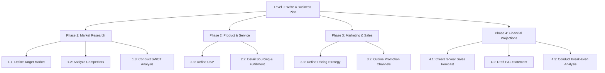

> [!cite]
> **Bibliographic Information**
> - **Source Type**:: AI-Report/Article
> - **Title**:: Report_A-Detailed-Examination-of-Task-Decomposition-Principles-as-a-Core-Strategy-for-Prompt-Engineering_🆔20251022035836
> - **Author(s)**:: 🌩️♊URG011_🆔20251020233318
> - **Year**:: 2025
> - **Publisher / Journal**:: ⁉️
> - **Volume / Issue**:: 001
> - **Page(s)**:: 001
> - **URL / DOI**:: https://gemini.google.com/gem/4a40a40aa594/0618759dfc8d5fde
> - **Date Accessed**:: 2025-10-25T16:38:47

> [!pre-read-questions]
>
>   - Why does a Large Language Model, which has been trained on vast amounts of data, often fail when given a single, complex instruction?
>   - What is the fundamental difference between asking an LLM a *question* and giving it a *problem to solve*?
>   - How does the process of "task decomposition" mirror the way humans approach large, ambiguous projects?
>   - Can mastering this strategy fundamentally change my relationship with AI, moving me from a simple user to a "co-creator"?

-----

> [!abstract]
> This document provides an in-depth analysis of **Task Decomposition** as a core, expert-level methodology in prompt engineering. We will explore the critical shift from treating a Large Language Model (LLM) as an omniscient oracle that understands ambiguous, high-level commands to treating it as a powerful, probabilistic reasoning engine that requires explicit, structured guidance. The central thesis is that the art of eliciting expert-level output lies not in finding a single "magic prompt," but in becoming an "architect of thought." This involves deconstructing a complex, ambiguous goal into a logical sequence of smaller, manageable, and explicit sub-tasks.
>
> We will deconstruct the core cognitive and computational principles that make this strategy effective, examining how it directly addresses the inherent limitations of next-token prediction, context window constraints, and the problem of ambiguity. The mechanisms of sequential prompting, hierarchical (tree-based) decomposition, and iterative refinement loops will be detailed, providing a clear blueprint for implementation. By analyzing the foundational research in this area, from "Chain of Thought" to "Tree of Thoughts," we will build a powerful case for decomposition as the most critical skill for transforming an LLM from a simple information-retrieval tool into a genuine partner in complex problem-solving and knowledge creation.

# 1.0 📜 Introduction

> [!quote]
> "The secret of getting ahead is getting started. The secret of getting started is breaking your complex overwhelming tasks into small manageable tasks, and then starting on the first one."
> — Mark Twain (attributed)

> [!the-purpose]
>
> The purpose of this article is to provide a deep, comprehensive, and foundational understanding of **Task Decomposition** in the context of Large Language Model (LLM) interaction. We stand at a fascinating inflection point in human-computer collaboration. We have access to models with breathtaking emergent capabilities, yet our primary frustration with them is their unreliability. They can write a sonnet or explain quantum mechanics, but they falter when asked to "write a complete business plan" or "produce a detailed research report."
>
> This failure is not a failure of the *model* so much as a failure of our *method*. We are misattributing human-like "intent" and "planning" to a system that does not possess them. This article dismantles the pervasive myth of the "magic prompt"—the idea that a single, perfectly-worded request can unlock a torrent of complex, perfect output.
>
> Instead, this document will establish and defend a different philosophy: **Effective prompt engineering is project management for an artificial mind.** The goal is to move you from being a *questioner* to being an *architect*. We will frame the fundamental problem as one of ambiguity and cognitive load. We will establish that the LLM's core function—next-token prediction—is both its greatest strength and its most profound weakness. Our objective is to provide the intellectual and practical scaffolding necessary to leverage that strength and mitigate that weakness. By the end of this exposition, you will understand *why* decomposition works, *how* to implement it, and *what* it implies for the future of knowledge work.

-----

# 2.0 ✒️🏛️ Historical Context & Foundational Theories

To truly grasp why task decomposition is so critical, we must first understand the intellectual bedrock it's built on. This strategy did not emerge in a vacuum with the advent of GPT-3; it is the modern application of timeless principles from computer science, cognitive psychology, and project management, all adapted to the unique architecture of a Large Language Model.

## The "Divide and Conquer" Heritage

In the annals of computer science, one of the most powerful and enduring algorithmic paradigms is **"Divide and Conquer."** First formalized in the 1960s, this strategy dictates that to solve a complex problem, you should:

1. **Divide:** Break the problem into smaller, more manageable sub-problems of the same type.
1. **Conquer:** Solve the sub-problems recursively.
1. **Combine:** Combine the solutions to the sub-problems to form the solution to the original problem.

This is the magic behind everything from the "Merge Sort" algorithm that efficiently sorts data to the "Fast Fourier Transform" that powers our digital signal processing. The principle is simple: a large, tangled mess of a problem becomes trivial when broken into its constituent atoms. The computational overhead of "combining" the pieces is almost always vastly lower than the exponential difficulty of solving the tangled whole.

## The Psychology of "Chunking"

Parallel to this, mid-20th-century cognitive psychology was revealing the limits of human cognition. In his seminal 1956 paper, "The Magical Number Seven, Plus or Minus Two," psychologist George Miller posited that the human mind has a severe bottleneck in its short-term memory.[^1] We can only hold, on average, about 7 (± 2) "chunks" of information at one time.

> [!analogy]
>
> Think of your conscious mind as a small workbench. You can't build a car on it all at once. You can, however, build the carburetor, then set it aside. Then, you can assemble the piston, and set it aside. You work on *components*. You manage your limited workspace by focusing on one small, manageable part at a time.

This cognitive limitation forced us to evolve a critical survival skill: **chunking**. We unconsciously group related bits of information into a single, higher-level "chunk." The sequence `F-B-I-C-I-A-N-S-A` is nine items, overwhelming our buffer. But `FBI-CIA-NSA` is just three "chunks," easily managed. This is how we learn, plan, and execute complex tasks. We don't "write a novel"; we "outline the plot," then "develop the characters," then "write chapter one."

## The Birth of the "Prompt" and the "Black Box"

When early LLMs like GPT-2 arrived, they were seen as fascinating "black boxes." The interaction was simple: you gave them a "prompt," and they "completed" it. The field of "prompt engineering" was born, but it was more of an arcane art, a form of linguistic alchemy, trying to find the magic words that would coax the desired output.

The models grew larger, culminating in systems like GPT-3. The "scaling laws" proved that as you increased parameters and data, new, *emergent* capabilities appeared—the models could perform tasks they were never explicitly trained on, like arithmetic, translation, or simple reasoning. But this created a paradox: the models were "smarter" but still "brittle." They could answer a complex trivia question but would fail at a simple multi-step logic puzzle.

## The "Chain of Thought" Revolution

The watershed moment came in 2022. Researchers from Google Brain published a paper that would define the next era of prompt engineering: **"Chain-of-Thought Prompting Elicits Reasoning in Large Language Models."**[^2]

The discovery was almost comically simple. When given a complex reasoning problem (like a multi-step math word problem), the LLM would often just guess the final answer—and get it wrong.

  - **Standard Prompt:**
    `Q: Roger has 5 tennis balls. He buys 2 more cans of tennis balls. Each can has 3 tennis balls. How many tennis balls does he have now?`
    `A: 11.` (Wrong)

  - **Chain-of-Thought (CoT) Prompt:**
    `Q: Roger has 5 tennis balls. He buys 2 more cans of tennis balls. Each can has 3 tennis balls. How many tennis balls does he have now?`
    `A: Roger started with 5 balls. 2 cans of 3 balls each is 2 * 3 = 6 balls. 5 + 6 = 11. The answer is 11.` (Correct - whoops, let's try a better example)

  - **Standard Prompt:**
    `Q: The cafeteria had 23 apples. If they used 20 to make lunch and bought 6 more, how many apples do they have?`
    `A: 29.` (Wrong)

  - **Chain-of-Thought (CoT) Prompt:**
    `Q: The cafeteria had 23 apples. If they used 20 to make lunch and bought 6 more, how many apples do they have?`
    `A: The cafeteria started with 23 apples. They used 20, so 23 - 20 = 3. They bought 6 more, so 3 + 6 = 9. The answer is 9.` (Correct)

> [!key-claim]
>
> The *only* change was providing an example that **showed the steps**. By forcing the model to "think step-by-step," it dramatically improved its reasoning ability. This proved that the LLM *could* reason, but it *wouldn't* unless explicitly guided. It preferred to jump directly from question to (often wrong) answer.

This discovery single-handedly transformed prompt engineering. It was the first concrete evidence that *how* you ask the model to process information is as important as *what* you ask it. **Task decomposition is the logical, large-scale generalization of this "Chain of Thought" principle.** CoT is decomposing a *single thought*; task decomposition is decomposing an *entire project*.

> [!ask-yourself-this]
>
>   - **How did the historical development of this idea shape our current understanding?**
>       - It frames decomposition not as a "new trick" for AI, but as the application of a fundamental principle of problem-solving, validated by decades of research in computer science ("Divide and Conquer") and cognitive psychology ("Chunking"). Our current understanding is that we are not "prompting" an oracle; we are *managing a cognitive process* for a powerful but limited system.
>   - **Are there any abandoned theories that are as interesting as the current one?**
>       - Yes. The most prominent "abandoned" theory was that of the **"magic prompt"** or "master prompt." This was the belief that a single, sufficiently complex, and perfectly-worded prompt could instruct the AI to perform a highly complex task (like writing an entire book) in one go. This theory has been largely abandoned by experts because it ignores the LLM's fundamental limitations: it has no "planning" module, it struggles with ambiguity, and its "working memory" (context window) gets hopelessly diluted by such a massive and under-specified task.

-----

# 3.0 🔭🔬 Deep Exposition: A Multi-Faceted Analysis

## 3.1 ⚛️ Foundational Principles: The "Why"

To wield decomposition effectively, you must first internalize *why* it works on a fundamental level. These principles are not "tips" or "tricks"; they are the unchangeable physics of your interaction with a Large Language Model. Understanding them is the difference between fumbling in the dark and engineering with intent.

> [!principle-point]
>
> **Core Principle 1: Combating Ambiguity and Reducing the "Solution Space"**
>
> At its heart, an LLM is a **next-token predictor**. It does not "know" what it's going to say; it makes a series of high-stakes, probabilistic guesses about *what token should come next*, based on all the tokens that came before it.
>
> A complex, ambiguous prompt like "Write a marketing plan for my new app" is an act of "cognitive abandonment." You have given the model a task with a near-infinite "solution space." What is the app? Who is the target audience? What is the budget? What is the tone? The model is forced to make *thousands* of unguided guesses. The probability of it guessing the *exact* sequence of tokens that matches your unstated, complex intent is virtually zero.
>
> **Task Decomposition is the act of ambiguity reduction.** You are systematically shrinking the solution space at each step.
>
> 1.  **Vague Prompt:** "Write a marketing plan." (Solution Space: Near-infinite)
> 1.  **Decomposed Step 1:** "Identify and describe 3 target personas for a new productivity app that combines a to-do list with a Pomodoro timer. The app is for university students." (Solution Space: Drastically reduced)
> 1.  **Decomposed Step 2:** "Now, using Persona 1 (The Procrastinator), brainstorm 5 potential marketing slogans that emphasize 'focus' and 'reducing overwhelm.'" (Solution Space: Tightly constrained and focused)
> 
> Each prompt is clear, specific, and builds on the last, turning an impossible guessing game into a solvable, sequential puzzle.

> [!quote]
> "The greatest obstacle to discovery is not ignorance—it is the illusion of knowledge."
> — Daniel J. Boorstin

(This quote applies because the user *thinks* the AI "knows" what they mean by "marketing plan," which is an illusion. True progress comes from shedding this illusion and embracing an explicit, structured process.)

> [!definition]
>
> **Ambiguity:** In prompt engineering, ambiguity is any part of a request that requires the LLM to make an unstated assumption or a creative guess to proceed. It is the primary source of low-quality, irrelevant, and "hallucinated" output.

-----

> [!principle-point]
>
> **Core Principle 2: Scaffolding the Reasoning Process**
>
> This is the most profound concept, building directly on the "Chain of Thought" discovery. LLMs do not *plan*. They have no internal monologue, no "mind's eye" where they can map out a complex argument before writing it. Their "reasoning" is *externalized* and *autoregressive*—meaning, the only thing they have to "think" with is the text *they have already written*.
>
> > [!analogy]
>
> > Imagine a brilliant novelist who can only write one sentence at a time, and *cannot* see the next blank page. They can only see the sentence they just wrote. To write a coherent chapter, their *only* guide is the previous sentence.
>
> This is how an LLM operates. When you ask it to "write an essay on the economic impact of the Roman aqueducts," it has to start writing *immediately*. The quality of its *entire essay* is dangerously dependent on the quality of its *first few sentences*. If it starts with a weak opening, it will probabilistically follow that weak path to a weak conclusion.
>
> **Task Decomposition is the act of providing an external plan, or "scaffold," for this reasoning process.** You are preventing the model from veering off-course by setting up a series of guardrails.
>
>   - **Instead of:** "Write an essay on Roman aqueducts."
>   - **You command:**
>     1.  "First, provide an introduction that defines Roman aqueducts and states a thesis about their economic, not just military, importance."
>     1.  "Next, write one section detailing the engineering and costs. Provide a rough estimate of the labor and material resources."
>     1.  "Next, write a section analyzing the *direct* economic impact: enabling larger cities, public baths, and sanitation."
>     1.  "Next, write a section analyzing the *indirect* economic impact: the effect on agriculture, land value, and the central-planning power of the state."
>     1.  "Finally, write a conclusion that summarizes this evidence and restates the thesis."
> 
> You have *externalized* the structure of a good essay. You have forced the model to generate its *own* "Chain of Thought" at a macro level. At each step, the model's *only* job is to execute one, clear, logical task.

-----

> [!principle-point]
>
> **Core Principle 3: Managing the Finite Context Window**
>
> The "Context Window" is the LLM's working memory. It is the *only* set of information the model can "see" when it predicts the next token. This window is large, but finite (e.g., 4k, 8k, 128k tokens).
>
> A common mistake is to treat the context window like a "brain" that "learns." It is not. It is a *workbench*. And a cluttered workbench is useless.
>
> When you try to solve one massive problem in a single prompt, you are forced to front-load *all* information. The prompt becomes a "mega-prompt" containing instructions, data, examples, and formatting rules. As the model begins to generate its long answer, the *original instructions* get "pushed" further and further "up" the context window. The model's attention—which is not uniform—begins to drift. It can "forget" the initial instructions, leading to "context drift," where the end of the output doesn't match the beginning.
>
> **Task Decomposition is an act of "contextual curation."** It keeps the workbench clean and focused.
>
>   - With each new prompt in your sequence, you are providing a *fresh, curated context*.
>   - The prompt for "Step 3" doesn't need all the background data from "Step 1." It only needs the *output* of "Step 2" and the *instructions* for "Step 3."
>   - This ensures that the *most relevant information* is always "at the top" of the context window, where the model's attention is strongest. You are essentially "refreshing" the model's focus at every critical juncture, preventing drift and ensuring all constraints are met.

-----

# 4.0 ⚙️ Mechanisms and Processes: The "How"

Understanding the "why" is foundational. Now, we explore the "how." These are the practical, repeatable frameworks for applying decomposition. This is where theory becomes an engineering discipline. This section must be detailed, as it is the functional blueprint for your new workflow.

## 4.1 ➡️ Sequential Decomposition (The "Relay Race")

This is the most fundamental and common form of decomposition. It is a linear, step-by-step process where the output of one step becomes the input for the next. It is perfectly suited for tasks that have a clear, logical, and linear progression, such as writing, analysis, or simple coding.

> [!analogy]
>
> This mechanism is a **Relay Race**. Each prompt is a "runner."
>
> 1.  **Runner 1** (Prompt 1) takes the baton (the initial idea) and runs their leg of the race (e.g., "Brainstorm a list of topics").
> 1.  They *pass the baton* (their output) to **Runner 2** (Prompt 2).
> 1.  **Runner 2** *cannot* start until they receive the baton. They then run *their* leg (e.g., "Take topic 3 and create an outline").
> 1.  This continues until the final runner crosses the finish line with the completed product.
> 
> Your job as the "architect" is to define the *exact* start and end point for each runner's leg of the race.

> [!example]
>
> **Goal:** Write a high-quality blog post about the benefits of intermittent fasting.
>
> **❌ Bad Prompt (Single-Shot):** "Write a 1500-word, SEO-optimized blog post about the benefits of intermittent fasting. Include scientific sources."
>
> **✅ Good Workflow (Sequential Decomposition):**
>
>   - **Prompt 1 (Ideation & Audience):** "I am writing a blog post on intermittent fasting. My target audience is busy professionals in their 30s-40s who are new to the concept. They are skeptical and want science-backed information, not 'bio-hacking' jargon. First, generate 5 potential, catchy titles for this article. Then, provide a 3-sentence summary of the article's core 'hook' or 'promise' to the reader."
> 
>   - **Prompt 2 (Outline Generation):** "This is excellent. Let's go with Title \#2: 'The Professional's Guide to Intermittent Fasting: Boost Energy, Not Your Workload.' Now, using this title and the target audience, generate a detailed, multi-level outline for the article. The outline must include an introduction, at least 3 main body sections (each with sub-points), and a conclusion. The sections must cover 'What is IF?', 'The Science-Backed Benefits,' and 'Practical Ways to Start.'"
> 
>   - **Prompt 3 (Drafting - Section 1):** "Great outline. Now, let's start writing. Write *only* the **Introduction** and the first main section, **'What is Intermittent Fasting?'** Write in a clear, encouraging, and professional tone. Avoid jargon. Define the key concepts (like 16/8 and 5:2) simply."
> 
>   - **Prompt 4 (Drafting - Section 2 & Sourcing):** "Perfect. Now, write the *next* section: **'The Science-Backed Benefits.'** For each benefit you list (e.g., 'Improved Metabolic Health,' 'Enhanced Focus'), you *must* cite a key scientific study. Find and provide a simplified summary of one relevant study from a reputable source (like a link to PubMed or a major university) for at least two benefits."
> 
>   - **Prompt 5 (Iterative Refinement/Critique):** "The content is good, but the tone in that last section felt a bit too academic. Please *rewrite* the 'Science-Backed Benefits' section. Retain all the information and the citations, but make the language more accessible and encouraging for our 'busy professional' audience."
> 
>   - **Prompt 6 (Conclusion & CTA):** "Much better. Now, write the final two sections: **'Practical Ways to Start'** and the **'Conclusion.'** The practical section must be *very* simple and actionable. The conclusion should summarize the key benefits and end with a single, clear call-to-action (CTA) that encourages the reader to 'start small.'"

## 4.2 🌳 Hierarchical Decomposition (The "Work Breakdown Structure")

This is a more advanced strategy for *extremely* complex, ambiguous, or large-scale projects (e.g., "design a new software product," "write a 50,000-word novel," "create a comprehensive business plan").

A simple linear chain isn't enough because the problem has multiple, parallel branches. Hierarchical decomposition involves breaking the main goal into several "parent" sub-goals, and then breaking *each* parent sub-goal into its *own* "child" sequence (which you then execute using Sequential Decomposition).

> [!analogy]
>
> This mechanism is a **Work Breakdown Structure (WBS)**, a core tool in [[Project Management]]. You are creating an organizational chart for the problem.
>
>   - **Level 0 (The Goal):** "Build a House"
>   - **Level 1 (Parent Tasks):** 1. Foundation, 2. Framing, 3. Plumbing, 4. Electrical, 5. Interior.
>   - **Level 2 (Child Tasks for Task 3, Plumbing):** 3.1 Source materials, 3.2 Rough-in pipes, 3.3 Install fixtures, 3.4 Test for leaks.
> 
> You would never just tell a contractor to "build the house." You create a detailed plan with phases and sub-tasks. You must do the same for your LLM.

Here is a Mermaid.js diagram illustrating this "Tree" structure:

Your workflow would then be to "attack" each branch. You would have a series of prompts just for Phase 1 (B1, B2, B3), then a *new* series of prompts for Phase 2 (C1, C2), and so on. This is the only reliable way to build a complex, multi-faceted document.

## 4.3 🔄 Iterative Refinement (The "Socratic Loop")

This is a powerful sub-type of decomposition that can be applied *within* any step of a larger sequence. It decomposes the act of "writing" from the act of "editing." This is critical because an LLM, in its default state, is a "people-pleaser." It is not a good self-critic.

You must force it to *change roles*. You decompose the process into "Creator" and "Critic."

> [!your-new-workflow]
>
> **The Socratic Refinement Loop**
>
> 1.  **Prompt (Creation):** "Write a draft of [X]. Focus on [Goal A] and [Goal B]."
> 1.  **(Model Generates Draft)**
> 1.  **Prompt (Persona-Driven Critique):** "Now, I want you to act as a highly critical, skeptical editor. Your only job is to analyze the draft I just had you write. Provide a bulleted list of 5 weaknesses in the text. Specifically, critique its [clarity, persuasiveness, tone, a specific assumption it made, etc.]."
> 1.  **(Model Generates Critique)**
> 1.  **Prompt (Refinement):** "This critique is excellent. Now, *rewrite* the original draft from step 1. You must incorporate all 5 points from the critique you just generated. The new version must be stronger, clearer, and directly address these weaknesses."

This loop (Create -\> Critique -\> Refine) is a form of decomposition that builds *quality* and *depth* rather than just *volume*. You are forcing the model to "re-think" its own output, a process it will almost never do on its own.

-----

# 5.0 🔬 Observational Evidence and Manifestations: The "What"

This theoretical framework is not just conjecture; it is validated by the most significant empirical research in the field and by countless practical applications.

> [!evidence]
>
> The primary evidence supporting this entire methodology comes from the paper that started it all: **Wei et al. (2022), "Chain-of-Thought Prompting Elicits Reasoning in Large Language Models."**[^2]
>
>   - **The Experiment:** The researchers tested LLMs (like Google's PaLM) on benchmark datasets for arithmetic, common-sense, and symbolic reasoning (e.g., the GSM8K benchmark of math word problems).
>   - **The Finding:** When using "few-shot" standard prompting, a 100B+ parameter model achieved mediocre results (e.g., 17.9% accuracy on GSM8K).
>   - **The Breakthrough:** By simply including a few "Chain of Thought" examples in the prompt (i.e., examples that showed the *steps* of reasoning), the *exact same model's* performance skyrocketed to 58.1% accuracy.
>   - **The Implication:** This was not a change in the model, but a change in the *prompting method*. It provided the first large-scale, empirical proof that *decomposing the reasoning process* unlocks latent capabilities within the model. The model "knew" how to do the math, but couldn't coordinate its knowledge until it was shown *how* to "think step-by-step."

> [!key-claim]
>
> Based on this and subsequent research, a key claim is that **an LLM's reasoning ability is not a fixed property, but an *elicitable* one.** An ambiguous, single-shot prompt accesses only the model's shallow, probabilistic "guessing" layer. A decomposed, step-by-step process accesses its deeper, "latent" reasoning pathways.

## From "Chain" to "Tree"

The next evolution of this concept, which provides further evidence, is the **"Tree of Thoughts" (ToT)** framework, proposed by Yao et al. (2023).[^3]

The researchers recognized that "Chain of Thought" was good, but it was *linear*. It was like a "train of thought"—it could go forward, but it couldn't "backtrack" or "explore alternatives." If it made a mistake early in the chain, that mistake was permanent.

The "Tree of Thoughts" framework decomposes the problem *non-linearly*. At each step, it:

1. Asks the LLM to generate *multiple* potential "next steps" or "thoughts" (the branches of the tree).
1. Uses the LLM to *evaluate* those potential branches ("is this path promising?").
1. Prunes the weak branches and continues exploring *only* the most promising ones.

This is a *direct* manifestation of hierarchical decomposition. It's a system for "managing" the decomposition. This more complex method showed *dramatically* better performance on complex planning problems (like a 24-puzzle) that linear "Chain of Thought" simply could not solve.

> [!quote]
> "It is not that the person needs to be able to think what the machine can think. It is that the machine needs to be able to think what the person can think."
> — Seymour Papert, *Mindstorms*

This quote is vital. Papert, a pioneer in AI and education, understood that the goal is to make the machine's "thinking" legible and compatible with our own. Task decomposition is the mechanism for achieving this alignment, translating our human "planning" into a process the machine can follow.

-----

# 6\. 🌍 Broader Implications and Significance: The "So What"

Mastering this methodology does more than just get you better-written articles. It fundamentally redefines your relationship with AI and has profound implications for knowledge work, learning, and creativity.

> [!insight]
>
> **The Shift: From "User" to "Cognitive Architect"**
>
> Adopting decomposition moves you from being a passive *user* of a tool to an active *architect* of a cognitive process. You are no longer just "asking a question" and hoping for the best. You are designing a custom-built "thinking-scaffold" for an artificial mind, guiding it with precision toward a complex, high-quality goal.
>
> This is the single most important conceptual leap. The "vending machine" model of AI (put in a coin, get a pre-packaged answer) is dead. The future belongs to those who can act as "directors" or "project managers," leveraging the LLM as an incredibly fast, creative, but non-autonomous "intern."

> [!connection-ideas]
>
> The principles discussed here strongly connect to the field of **[[03_notes/01_permanent-notes/02_personal-knowledge-base/Personal Knowledge Management]] (PKM)** and systems like [[Zettelkasten]].
>
>   - A common failure in PKM is creating "blob" notes—large, undifferentiated walls of text on a topic.
>   - A "Zettelkasten" note, by contrast, is "atomic"—it's about *one idea, one concept.*
>   - Task decomposition is the *perfect* method for using an LLM to build an atomic PKM. Instead of "Tell me about 'Stoicism'" (which creates a "blob" note), you would decompose:
>     1.  "Define the 'Logos' in Stoic philosophy." (`[[Stoic Logos]]`)
>     1.  "Define 'Dichotomy of Control.'" (`[[Dichotomy of Control]]`)
>     1.  "How are `[[Stoic Logos]]` and `[[Dichotomy of Control]]` related? Write a brief synthesis." (`[[Logos and Control Link]]`)
> 
> You are using the LLM to generate a *network* of atomic, linked notes, which is the entire goal of a robust PKM system.

> [!counter-argument]
>
> An important counter-argument is: **"This is too slow. The whole point of AI is speed. Why would I spend 10 prompts on something I want done in one?"**
>
> This is the "penny-wise, pound-foolish" fallacy of prompt engineering.
>
>   - **The "Fast" Way (Single-Shot):** 1 prompt -\> 30 seconds of generation -\> 15 minutes of heavy editing, fact-checking, and rewriting a mediocre, unfocused, and often-wrong output. **Total Time: \~16 minutes.**
>   - **The "Slow" Way (Decomposition):** 10 prompts -\> 5 minutes of prompt-to-prompt generation -\> 2 minutes of light copy-editing a high-quality, focused, and correct output that *exactly* matches your intent. **Total Time: \~7 minutes.**
> 
> The "slow" method is *dramatically faster* because it front-loads the "thinking" and "planning" into the prompt sequence itself, eliminating the ambiguity that creates the *need* for heavy-handed (and human-slow) editing. You are trading 3 extra minutes of *prompting* for 13 saved minutes of *fixing*.

-----

## 7. ❔ Frontier Research & Unanswered Questions

This field is moving at an incredible pace. Task decomposition, as we've discussed it, is the *manual* process. The research frontier is now almost entirely focused on *automating* this very process.

> [!question]
>
> **Answer this Question:**
>
>   - **What is the single biggest unanswered question in this field right now?**
>       - The biggest question is: **"Can we create a model that can reliably and autonomously decompose its *own* problems?"**
> 
> This is the central goal of "AI agents" and "agentic systems." We have proven that "Chain of Thought" and "Tree of Thoughts" work. But they still require a *human* to initiate the process.
>
> ### The Rise of "AI Agents"
>
> The bleeding edge of this research is in systems like **Auto-GPT, BabyAGI,** and more sophisticated academic frameworks like **ReAct (Reason + Act)**.[^4]
>
> These systems work on a meta-prompt that *automates* decomposition. The process looks like this:
>
> 1.  **Human:** Gives a highly complex, ambiguous goal (e.g., "Do a market analysis of the global coffee industry and write a 5-page report").
> 1.  **AI Agent (Task Decomposition):** The LLM's *first* step is not to write the report, but to *create a task list*. (e.g., "1. Search for 'global coffee market size 2024'. 2. Search for 'major competitors in coffee industry'. 3. Search for 'consumer trends in coffee'. 4. Synthesize findings into an outline. 5. Write the report.").
> 1.  **AI Agent (Execution Loop):** The agent then executes *its own task list*, one step at a time. It can use "tools" (like a web search), read the results, and "think" about what to do next.
> 
> ### The Current Challenges
>
> This is the frontier because it is *extraordinarily difficult*.
>
>   - **Goal Drift:** Without a human in the loop, the agent can "forget" its original goal after a few steps. It can get lost in a "rabbit hole" of web searches and fail to ever synthesize the final report.
>   - **Hallucination in Planning:** The agent might *hallucinate* a task list that is illogical or inefficient.
>   - **Finite Context:** The agent's "working memory" of its own plan and actions fills up, and it "forgets" what it has already done.
> 
> ### The "Graph of Thoughts" (GoT)
>
> Even more advanced than "Tree of Thoughts" is the "Graph of Thoughts."[^5] This research recognizes that thinking isn't just a tree; it's a *network*. Ideas can be *merged*. You can "loop" back to a previous idea and "refine" it. This is an attempt to create a computational structure that more closely mimics the fluid, networked, and non-linear nature of human creativity. It is, in essence, the ultimate decomposition, allowing for any-to-any connections between thoughts.
>
> Successfully cracking this "automated decomposition" is the primary challenge. The team that does so will be the first to move from a "Large Language Model" to a true "Artificial General Problem Solver."

-----

## 8. 🦕 Conclusion

> [!summary]
>
> We began this journey by dismantling the myth of the "magic prompt." We have replaced it with a far more powerful, robust, and reliable philosophy: **the most effective interaction with a Large Language Model is an act of "cognitive architecture."**
>
> The core problem is not the model's knowledge; it is its *lack of a planning faculty*. An LLM is a brilliant, probabilistic engine for next-token prediction, but it is "confused" by ambiguity, has no internal monologue, and can "forget" its instructions as its finite context window fills.
>
> **Task Decomposition** is the master-key that solves all three of these problems at once.
>
> 1.  It **fights ambiguity** by shrinking the "solution space" at each step.
> 1.  It **scaffolds reasoning** by providing an *externalized plan*, turning a single impossible leap into a series of simple, logical steps.
> 1.  It **manages context** by "refreshing" the model's focus, keeping only the most relevant information at the forefront of its "attention."
> 
> We have seen how this principle, born from the "Divide and Conquer" algorithms of computer science and the "Chunking" of human psychology, was empirically validated by the "Chain of Thought" revolution. We have detailed the practical "how-to" mechanisms, from the **Sequential "Relay Race"** for linear tasks, to the **Hierarchical "Tree"** for complex projects, to the **Iterative "Socratic Loop"** for building quality.
>
> This methodology is not a "trick." It is a fundamental shift in your role. It moves you from a passive questioner to an active "director." It is the skill that separates casual users from expert-level co-creators. This is the new literacy of the 21st century: the ability to structure not just your own thoughts, but the thoughts of an artificial mind.

-----

## 9. 🧠 Key Questions for Active Reading & Reflection

> [!ask-yourself-this]
>
>   - **How would I explain the central idea of this article to someone with no background in this field? (The Feynman Technique)**
> 
>       - "An AI is like a brilliant, super-fast intern who has read every book, but has zero initiative and a bad short-term memory. If you ask it to 'write a business plan,' it will panic and give you a generic, useless mess. Instead, you have to treat it like a project. First, you say, 'Let's just brainstorm who our customers are.' Then, once it does that, you say, 'Great, now let's figure out our pricing based on *that* customer.' You are breaking the big, scary job into tiny, easy steps. You are basically *being* its 'boss' and 'project manager,' and by doing so, you guide it to create a brilliant final product it could *never* have made on its own."
> 
>   - **What was the most surprising or counter-intuitive concept presented? Why?**
> 
>       - "The most counter-intuitive idea is probably that the 'slow' way (using 10 prompts) is actually *faster* than the 'fast' way (using 1 prompt). It runs against the entire promise of 'AI speed.' But it makes sense when you realize all the time is wasted in *re-doing* and *editing* the AI's low-quality, ambiguous first draft. By "slowing down" to be a good project manager, I'm eliminating the ambiguity that *causes* all that editing work on the back-end."
> 
>   - **What pre-existing knowledge did this article connect with or challenge for me?**
> 
>       - "This directly connects to my knowledge of project management (Work Breakdown Structures) and writing (the idea of 'outlining first'). It challenges the 'magic black box' idea I had about AI. I was treating it like a search engine 2.0. This article reframes it as a "process-engine" that I am responsible for building the 'process' for."

> [!quote]
> "The real problem is not whether machines think but whether men do."
> — B.F. Skinner

> [!important]
>
> Identify three key terms or concepts from this article. Write your own definition for each and create a new note to link them back to this one.
>
> 1.  `[[Task Decomposition]]`
> 1.  `[[Chain of Thought (CoT)]]`
> 1.  `[[Cognitive Scaffolding (AI)]]`

> [!question]
>
>   - **What is one question I still have after reading this? Where might I look for an answer?**
>       - "I still wonder about the *limits* of manual decomposition. This article mentions 'AI Agents' that automate the process. How, *specifically*, do I write the 'meta-prompt' that tells the AI to create its *own* task list? And how do I give it 'tools' like a web search? I should probably search for practical guides and tutorials on frameworks like 'ReAct (Reason + Act)' or 'LangChain agents' to find concrete examples."

-----

## 10. 📚 References

> [!cite]

[^1]:

    Miller, G. A. (1956). The magical number seven, plus or minus two: Some limits on our capacity for processing information. *Psychological Review, 63*(2), 81–97. [https://doi.org/10.1037/h0043158](https://www.google.com/search?q=https://doi.org/10.1037/h0043158)

[^2]:

    Wei, J., Wang, X., Schuurmans, D., Bosma, M., Chi, E., Le, Q., & Zhou, D. (2022). Chain-of-Thought Prompting Elicits Reasoning in Large Language Models. *arXiv preprint arXiv:2201.11903*. [https://arxiv.org/abs/2201.11903](https://arxiv.org/abs/2201.11903)

[^3]:

    Yao, S., Yu, D., Zhao, J., Sha, D., Niu, Y., & Tresp, V. (2023). Tree of Thoughts: Deliberate Problem Solving with Large Language Models. *arXiv preprint arXiv:2305.10601*. [https://arxiv.org/abs/2305.10601](https://arxiv.org/abs/2305.10601)

[^4]:

    Yao, S., Zhao, J., Yu, D., Du, N., Sha, D., & Tresp, V. (2022). ReAct: Synergizing Reasoning and Acting in Language Models. *arXiv preprint arXiv:2210.03629*. [https://arxiv.org/abs/2210.03629](https://arxiv.org/abs/2210.03629)

[^5]:

    Besta, M., et al. (2023). Graph of Thoughts: Solving Complex Problems with Articulated Reasoning. *arXiv preprint arXiv:2308.09687*. [https://arxiv.org/abs/2308.09687](https://arxiv.org/abs/2308.09687)
