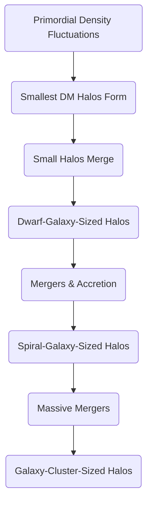

> [!left-off-reading-at]
> - When I last left this report I was reading: Section 5.3

-----

> [!pre-read-questions]
>
>   * What is the fundamental difference between "Hot," "Warm," and "Cold" Dark Matter, and why did "Cold" become the accepted standard?
>   * How can we be sure that 85% of the universe's matter is invisible? What is the "smoking gun" evidence that separates dark matter from normal matter?
>   * What does it mean for the universe to be "hierarchical"? What is the alternative, and why did it fail?
>   * How can an invisible, underlying *scaffolding* dictate the *shape* (morphology) of a galaxy? What are the specific mechanisms at play?
>   * What are the biggest "cracks" or "tensions" in the standard Cold Dark Matter model that keep cosmologists awake at night?

-----

> [!abstract]
> This document provides a comprehensive analysis of the [[Cold Dark Matter (CDM)]] paradigm, the foundational pillar of the standard model of cosmology (ΛCDM). We explore the central thesis that this invisible, non-baryonic, and non-relativistic substance is the primary architect of all large-scale structure in the cosmos. Through the relentless and simple force of gravity, Cold Dark Matter is posited to be the *scaffolding* upon which the entire [[Cosmic Web]]—the vast, filamentary network of galaxy clusters, groups, and voids—was built.
>
> We will trace the historical and theoretical journey from the first hints of "missing mass" to the establishment of CDM as the consensus. The analysis will deconstruct the core principles of CDM (its "cold" and "dark" nature) to explain *why* it uniquely predicts a "bottom-up" or [[Hierarchical Formation]] of the universe, where small structures (dwarf galaxies) form first and subsequently merge to build larger ones (like our Milky Way) and eventually massive galaxy clusters. We will then detail the mechanisms of this gravitational collapse, from the initial quantum "seeds" to the full-blown simulation of the cosmic web. Finally, we will explore the profound consequences of this dark scaffolding, demonstrating how it directly *constrains* and *governs* the distribution, evolution, and ultimate morphology of the visible galaxies we observe today.

# 1.0 📜Introduction

> [!the-purpose]
> Look up at a clear night sky, and you are seeing a lie. Or rather, a beautiful, glittering omission. The stars, nebulae, and galaxies—the sum total of everything our eyes and telescopes can perceive—are but a fleeting shimmer on the surface of a vast, dark ocean. All the matter that we can see, the "baryonic" matter that makes up you, me, our planet, and every star, accounts for only **15%** of the total matter in the universe. The other **85%** is missing. It is dark. It does not shine, reflect, or interact with light in any way. Yet, it is there. We know it is there because we can feel its presence, just as you can feel the wind: not by seeing it, but by observing its effect on everything it touches.
>
> This invisible substance, known as **Cold Dark Matter (CDM)**, is the silent protagonist of our cosmic story. It is the invisible architect, the unseen scaffolding upon which the entire grand, intricate structure of the cosmos is built. The purpose of this article is to provide a deep, multi-faceted explanation of this profound idea. We will explore how this one, simple *concept*—that the universe is dominated by a slow-moving, invisible form of matter—unlocks *everything* else. It explains the "why" behind the largest structures we see: the great "cosmic web" of filaments and voids. It tells us *why* galaxies are not scattered randomly but are organized like pearls on an invisible thread. And it provides the key to understanding *why* some galaxies are brilliant, star-forming spirals like our own, while others are ancient, "red and dead" elliptical giants.
>
> This is not a story of astrophysics alone; it is a story of philosophy. It challenges our perception, forcing us to accept that the visible universe is merely the "foam on the waves," a secondary construction built within a pre-existing, and profoundly more massive, invisible world.

> [!quote]
> "What we see is not all there is. In fact, what we see is a very small part of what there is… The universe is dominated by a dark side, a dark matter, and a dark energy. And this dark side is the driver of our cosmic destiny."
> — Michael S. Turner

> [!the-purpose]
> Turner's quote encapsulates the Copernican-level shift in perspective that dark matter represents. It's not just an "extra ingredient"; it is the *dominant* ingredient. This realization moves us from a "what-you-see-is-what-you-get" cosmos to one where the ultimate fate and structure of the universe are governed by forces we can, as of now, only infer.

# 2.0 🧭Historical Context & Foundational Theories

Our current understanding of Cold Dark Matter is not a "eureka" moment but a slow, begrudging acceptance of overwhelming evidence. It is a theoretical construct born of necessity, a "ghost" that astronomers were forced to invoke to save the laws of physics themselves.

### 2.1 The First "Ghost": Fritz Zwicky and the Coma Cluster

The story begins in the 1930s with the brilliant and irascible Swiss-American astronomer [[Fritz Zwicky]]. While observing the Coma Cluster, a massive collection of over a thousand galaxies, Zwicky noticed something deeply disturbing.[^1] He measured the velocities of individual galaxies orbiting the cluster's center. They were moving astonishingly fast—so fast, in fact, that the gravity from all the *visible* matter (the stars in those galaxies) was nowhere near strong enough to hold the cluster together.

By his calculations, the cluster should have flown apart millions of years ago. To reconcile this, Zwicky posited the existence of an enormous amount of unseen "missing mass," which he called *dunkle Materie*, or **dark matter**. Based on his figures, there had to be *hundreds* of times more dark matter than visible matter to provide the gravitational glue. Zwicky's observations were largely dismissed for decades, deemed too fantastical.

### 2.2 The "Smoking Gun": Vera Rubin and Galactic Rotation Curves

The ghost returned in the 1970s, this time in a form that could not be ignored. Astronomer [[Vera Rubin]], along with her colleague Kent Ford, was meticulously measuring the rotation of spiral galaxies, starting with our neighbor, Andromeda.[^2]

Basic Newtonian physics predicts that stars far from the bright galactic center should orbit *slower* than stars near the center, just as distant Pluto orbits the Sun far more slowly than nearby Mercury. This is the "Keplerian decline." What Rubin found, however, was revolutionary. The stars in the outer arms of the galaxy were moving *just as fast* as the stars near the center. This "flat rotation curve" was inexplicable… unless the galaxy was embedded in a vast, invisible "halo" of matter that extended far beyond the visible stars, providing the extra gravity needed to speed up the outer stars.

Unlike Zwicky's, Rubin's data was too precise to dismiss. This was the moment the "dark matter problem" moved from a fringe curiosity to the single most pressing crisis in modern cosmology.

### 2.3 The "Hot" vs. "Cold" Debate: A Battle for the Universe's Structure

Once astronomers accepted the *existence* of dark matter, the race was on to define its *nature*. This led to a crucial fork in the road: was the dark matter "Hot" or "Cold"?

  * **Hot Dark Matter (HDM):** This theory proposed that dark matter was made of very light, *fast-moving* (relativistic) particles. The leading candidate was the [[Neutrino]], which we knew existed and had a tiny (but non-zero) mass.
  * **Cold Dark Matter (CDM):** This theory proposed the opposite: that dark matter was made of heavier, *slow-moving* (non-relativistic) particles. Candidates were hypothetical, with names like WIMPs (Weakly Interacting Massive Particles) or Axions.

This was not just particle physics; it had profound implications for how the universe *formed*.

  * An **HDM universe** would be "top-down." Because the fast-moving neutrinos would stream across the cosmos, their speed would *erase* small-scale density fluctuations. Gravity could only pull things together on the *largest* scales. This model predicts that giant "pancakes" of matter (superclusters) would form *first*, and then fragment "down" into individual galaxies.
  * A **CDM universe** would be "bottom-up." The slow-moving particles would start clumping together on *small* scales *very early* in the universe's history. This model predicts that small "halos" would form *first* (hosting dwarf galaxies), and these halos would then merge over billions of years to form larger and larger structures, like spiral galaxies and, eventually, massive clusters. This is **Hierarchical Formation**.

### 2.4 The Verdict: Observations and the Rise of ΛCDM

The debate was settled by observation. When astronomers pointed their telescopes at the deep cosmos (like the Hubble Deep Field), they saw a universe teeming with small, irregular, and young-looking dwarf galaxies in the distant past. Furthermore, our own Milky Way is surrounded by satellite dwarf galaxies and shows clear evidence of having "eaten" or merged with smaller galaxies over its lifetime.

Most damningly, the "top-down" HDM model simply *could not* reproduce the universe we see. Its simulations failed to create the fine, filamentary structure of the cosmic web. The "bottom-up" CDM model, however, was astonishingly successful. When plugged into supercomputers, it *naturally* produced a universe that looked identical to ours, complete with a cosmic web, galaxy distributions, and halo properties that matched observations perfectly.

This, combined with data from the [[Cosmic Microwave Background (CMB)]] (which showed the precise "seeds" for bottom-up formation) and observations of distant supernovae (which added "Dark Energy," the "Lambda" [Λ] in the name), solidified the **Lambda-Cold Dark Matter (ΛCDM)** model as the Standard Model of Cosmology. It is our current, best, and most complete description of the universe.

> [!ask-yourself-this]
>
>   * **How did the historical development of this idea shape our current understanding?**
>       * The development was a story of *resistance and necessity*. Zwicky's "missing mass" in clusters (1930s) and Rubin's "flat rotation curves" in galaxies (1970s) were *problems* that needed a solution. They forced us to accept an invisible component. The subsequent "Hot vs. Cold" debate was a *refinement* of that idea, where we used the *observed large-scale structure* (bottom-up, not top-down) to determine the *properties* of that invisible component (it must be slow-moving, i.e., "cold").
>   * **Are there any abandoned theories that are as interesting as the current one?**
>       * Yes, the **Hot Dark Matter (HDM)** model is fascinating. The idea that the universe was built "top-down" (giant structures forming first, then fragmenting) is an elegant and powerful counter-narrative. It failed because it didn't match observation, but it serves as a crucial intellectual foil. Its failure is what gives us such strong confidence in the "bottom-up" hierarchical model of CDM.

# **3.0 🔭🔬Deep Exposition: A Multi-Faceted Analysis**

## 3.1 ⚛️Foundational Principles

To understand how CDM built the entire universe, we must first understand its "personality." Its character is defined by three simple, foundational principles. These principles are the "rules" of the simulation, and from them, the entire complexity of the cosmos emerges.

> [!principle-point]
>
>   * **Core Principle 1: "Darkness" (The Collisionless, Non-Interactive Nature)**
>       * This is the most defining trait. "Dark" does not just mean "doesn't shine"; it means it **does not interact with the electromagnetic force**. A particle of dark matter feels no friction, cannot be stopped by your hand, and passes through light (photons) as if it were not there. This also means it cannot *lose energy* by radiating it away as light, which is the primary way normal (baryonic) matter cools and clumps together to form dense objects like stars.
>       * **Why this matters:** Because dark matter is "collisionless," it can form vast, diffuse, spherical "halos" that are much larger than the visible galaxies within them. Normal matter, by contrast, *can* radiate energy away. This allows it to cool, collapse, and flatten into the dense, spinning *disks* that form spiral galaxies. This principle explains the fundamental *separation* of dark and normal matter: the dark matter forms the huge, spherical "gravitational well," and the normal matter sinks to the center of it to build the visible galaxy.
>

>[!quote]
> "Matter tells space how to curve. Space tells matter how to move."
>  — John Archibald Wheeler

> [!the-purpose]
> Wheeler's famous summary of General Relativity is the engine of our story. Dark matter, possessing 85% of the mass, does the vast majority of the "telling." It curves spacetime on a grand scale, and the visible matter (and light itself) has no choice but to follow the paths it dictates.

> [!principle-point]
>
>   * **Core Principle 2: "Coldness" (The Non-Relativistic, Slow-Moving Nature)**
>       * This is the principle that defines the *scale* of structure. "Cold" simply means that at the time the universe became transparent (the era of "decoupling"), the dark matter particles were already moving sluggishly, far slower than the speed of light.
>       * **Why this matters:** Because it's slow, dark matter's gravity can conquer its kinetic energy *even on very small scales*. This allows it to start clumping together *immediately* and *everywhere*, forming tiny, "Earth-mass" micro-halos (in theory) that then merge into globular-cluster-sized halos, then dwarf-galaxy-sized halos, and so on. This is the **engine of hierarchical, bottom-up formation**. If dark matter were "Hot" (fast-moving), its particles would have zipped out of these small clumps, "wiping clean" any small-scale structure before it could form.

> [!definition]
>
>   * **Hierarchical (Bottom-Up) Formation:**
>       * A model of cosmic structure formation in which small, gravitationally-bound objects (like dwarf galaxy halos) form first. These objects then merge over billions of years, driven by gravity, to create progressively larger and more massive objects (like spiral galaxies, and eventually, massive galaxy clusters).

> [!principle-point]
>
>   * **Core Principle 3: "Gravitational" (The All-Powerful, Sole Interaction)**
>       * This is the *action* principle. Cold Dark Matter does not interact via the strong, weak, or electromagnetic forces. It only interacts with one force: **gravity**. It feels gravity, and (because it has mass) it *exerts* gravity.
>       * **Why this matters:** This makes its behavior incredibly simple and predictable. Its story is not one of chemistry, biology, or electromagnetism. It is a pure, simple, and relentless story of gravitational collapse. This simplicity is what allows us to model it so effectively in N-body simulations. We just need to plug in a vast number of "point masses" that only obey gravity, add the expansion of the universe (driven by Λ, Dark Energy), and let the simulation run. The result, astonishingly, is our universe.

## 4.0 ⚙️Mechanisms and Processes

How do these three simple principles—dark, cold, and gravitational—combine to build the glorious, web-like structure of the cosmos? The process is a multi-billion-year ballet of gravitational instability, collapse, and merging.

### 4.1 The "Seeds": The Primordial Density Fluctuations

The universe did not start perfectly smooth. The [[Cosmic Microwave Background (CMB)]]—the "afterglow" of the Big Bang—shows us a snapshot of the infant universe, and it is mottled with tiny "hot" and "cold" spots. These are minuscule variations in temperature and density (about 1 part in 100,000), believed to originate from quantum fluctuations in the first fraction of a second of time, which were then stretched to cosmic size by [[Inflation]].

These tiny density variations are the **"seeds" of all structure**. The slightly denser-than-average spots are the "gravitational wells" where the story of collapse will begin.

### 4.2 The "Dark Ages" and Gravitational Instability

For hundreds of millions of years after the CMB was released, the universe was dark. The first stars had not yet ignited. But in this darkness, CDM was hard at work.

This is the principle of **gravitational instability**, or "the rich get richer."

1.  A region that starts with *slightly more* dark matter than its neighbors has *slightly more* gravity.
2.  This "extra" gravity pulls in *more* dark matter from its surroundings.
3.  This makes the region *even denser*, giving it *even more* gravity.
4.  This positive feedback loop continues, relentlessly.

Because dark matter is "cold," this process began happening on *all scales* at once. Small clumps (halos) began to form. Because dark matter is "dark," it couldn't radiate energy away, so it couldn't collapse into a single point. It formed a "virialized," stable, spherical halo where particles orbit the common center of gravity.

### 4.3 Hierarchical Formation: The Cosmic "Assembly Line"

This leads directly to the "bottom-up" assembly process. The process is not one of simple collapse, but of constant *merging*.

This is the core mechanism of the ΛCDM model. Our own Milky Way galaxy is a product of this. We can see the "debris" of this process in the stellar streams crisscrossing our halo—the digested remains of smaller dwarf galaxies our galaxy has consumed over its 13-billion-year life. The ongoing collision with the Andromeda galaxy, destined to happen in \~4.5 billion years, is just the next step in this unstoppable hierarchical process.

### 4.4 The "Gas" Follows the "Dark": Baryon Collapse

Where does *normal* matter (baryons) fit in? For the first few hundred million years, normal matter was too hot and pushed around by radiation pressure to do much. But as the universe expanded and cooled, it too began to feel the pull of gravity.

Crucially, it found that the dark matter had *already done the heavy lifting*. The dark matter had already formed the massive gravitational "wells" (the halos). The gas, being the "15%," simply fell into these "pre-dug" holes.

> [!analogy]
>
>   * **To understand** [[Baryonic Collapse]], **imagine** building a massive tent. The **Cold Dark Matter** is the **poles and frame** of the tent. It's invisible, but it's the *scaffolding* that gives the tent its shape and structure. The **normal matter** (gas) is the **canvas**. It has no structure on its own, but when you drape it over the frame, it settles into the shape dictated by the poles, making the invisible structure visible. The stars that ignite from this gas are the "Christmas lights" we hang on the canvas, illuminating the grand structure.

### 4.5 Emergence of the Cosmic Web

When we "zoom out" and run this simulation on a cosmic scale, these individual halo-merging events don't just happen in isolation. The initial "seeds" (the density fluctuations) were not just random points; they formed an intricate, web-like pattern. Gravitational instability amplified this pattern.

  * **Voids:** Regions that started with *less* density ("under-dense") had less gravity. They lost their matter to their denser neighbors, becoming vast, empty "deserts" known as Voids.
  * **Filaments:** Matter didn't just collapse into points; it was pulled *towards* the densest regions. This created vast, intergalactic "highways" or "rivers" of dark matter, known as Filaments.
  * **Nodes:** Where these filaments intersect, you get a "cosmic traffic jam." These intersections are the deepest gravitational wells, and they attract enormous amounts of matter, becoming the "cosmic cities"—the massive Galaxy Clusters.

This grand structure—the Voids, Filaments, and Nodes—is what we call the **Cosmic Web**. It is the largest-scale structure in the entire universe, and it is a direct, inevitable consequence of Cold Dark Matter and gravity.

## 5.0 🔬 Observational Evidence

This entire grand theory—this story of an invisible architect building a cosmic web from the bottom up—would be pure fantasy without hard, observational evidence. Fortunately, the evidence is now overwhelming and comes from three primary domains.

### 5.1 Evidence 1: The "Smoking Gun" (The Bullet Cluster)

For decades, the primary evidence for dark matter was *indirect* (rotation curves, cluster dynamics). But in 2006, astronomers observed **1E 0657-56**, nicknamed the **Bullet Cluster**. This is actually *two* galaxy clusters that have smashed through each other at high speed.[^3]

This collision provided the "smoking gun" that separated dark matter from normal matter.

  * The **normal matter** in the clusters was in the form of hot gas (the pink "clouds" in the image, visible in X-rays). When the clusters collided, this gas *crashed* into itself, like a fluid, and slowed down near the center of the collision.
  * The **dark matter**, being "collisionless" (Principle 1), felt *no friction*. The individual dark matter halos passed *right through each other* and continued on, ending up on the far sides of the collision (the blue "lumps" in the image).
  * How do we *know* the blue lumps are there? **Gravitational Lensing**. The immense gravity of the dark matter (where most of the mass is) bends the light from background galaxies, allowing us to map its location.

> [!evidence]
> *The* **primary evidence** *supporting this comes from:*
>
>   - The [[Bullet Cluster]]
>       * **This showed:** That the majority of the mass in the cluster (mapped by lensing, in blue) is *physically separate* from the majority of the *visible* matter (the hot gas, in pink). This is incontrovertible proof of a collisionless, non-baryonic form of matter. It is not just "dim gas" or a "tweak to gravity"; it is a *substance*.

### 5.2 Evidence 2: The "Blueprint" (The Cosmic Microwave Background)

The CMB, as mapped by satellites like Planck, provides the "baby picture" of the universe. The precise pattern of "blotches" (the acoustic peaks in the CMB power spectrum) is a "cosmic fingerprint" that tells us the exact ingredients of the infant universe.

> [!key-claim]
>
>   * *Based on the evidence, a* **key claim** *is that:*
>       * The CMB data *demands* the existence of Cold Dark Matter. To form the structures we see today from the tiny seeds *seen* in the CMB, you *need* a non-baryonic matter component (dark matter) to start the clumping process *early*. Normal matter was "stuck" to radiation and couldn't collapse. Dark matter, being immune to radiation, could. Without it, there simply was not enough time in 13.8 billion years to form the galaxies and clusters we see.

### 5.3 Evidence 3: The "Final Product" (Large-Scale Structure Surveys)

If the CDM model is correct, its simulations (like the **Millennium Simulation** or **IllustrisTNG**) are predictions.[^4] They predict *exactly* what the cosmic web should look like—the average length of filaments, the number of clusters, the emptiness of voids.

> [!evidence]
> *The* **primary evidence** *supporting this comes from:*
>
>   - [[Large-Scale Structure Surveys]] (e.g., the Sloan Digital Sky Survey (SDSS), 2dF Galaxy Redshift Survey)
>       * **This showed:** These surveys have meticulously mapped the 3D positions of millions of galaxies. The result is a stunning, undeniable confirmation: the real, observed universe *is* a cosmic web, and its statistical properties (how "clumpy" it is, the "void-filament-node" structure) match the predictions of the ΛCDM simulations *perfectly*.

> [!quote]
> "It's a wonderful time to be a cosmologist. We're in a position to empirically test our theories of the origin and evolution of the universe."
> — Carlos Frenk (a key architect of the Millennium Simulation)

> [!the-purpose]
> Frenk's point is that cosmology is no longer a purely theoretical or philosophical pursuit. The N-body simulations *are* the theory (ΛCDM) made manifest, and the large-scale surveys *are* the experiment. The fact that the simulation and the observation match is the single most powerful validation of the entire Cold Dark Matter paradigm.

## 6.0 🌍 Broader Implications: The "Nurture" of the Cosmic Web

This is where the story becomes truly profound. The dark matter scaffolding is not just a passive backdrop; it is an *active environment*. The cosmic web is the "ecosystem" that dictates the life, death, and *evolution* of every galaxy that lives within it. This is the **"nurture"** aspect of galaxy formation, and it directly explains the
**morphological evolution** of galaxies.

### 6.1 The "Morphology-Density" Relation

Astronomers have long observed a clear pattern:

  * In **low-density** environments (like Voids, or the "field"), galaxies are typically **spirals** (like our Milky Way). They are blue (full of young, hot stars) and actively star-forming.
  * In **high-density** environments (like the center of Nodes/Clusters), galaxies are typically **ellipticals**. They are "red and dead" (full of old, cool stars) and have little to no new star formation.

The CDM-driven cosmic web provides the "why."

### 6.2 The Mechanisms of Environmental Influence

The *location* on the web dictates the *processes* a galaxy will experience:

  * **Life in the Voids (The Field):** A galaxy forming in a void is isolated. It grows slowly, accreting cold gas from its surroundings, and evolves peacefully. It is undisturbed, allowing it to maintain its delicate spiral disk. It is the "countryside" of the cosmos.
  * **Life on the Filaments (The Suburbs):** Filaments are the "highways." Galaxies and gas are funneled along them towards the nodes. Life here is more crowded. Galaxies might experience "fly-by" interactions, but they can still accrete gas and form stars.
  * **Life in the Nodes (The Galactic Metropolis):** The clusters are the violent, chaotic cities. When a galaxy "falls" into a cluster, its fate is sealed. It is subjected to a barrage of transformative, and often fatal, processes:
    1.  **[[Galactic Mergers]]:** Clusters are so crowded that galaxies collide frequently. When two spiral galaxies merge, their delicate disks are destroyed by the chaotic gravitational forces. The stars are scattered into a new, randomized, "puffy" elliptical orbit. This process also tends to trigger a final, massive *burst* of star formation, which uses up all the remaining gas.
    2.  **[[Ram-Pressure Stripping]]:** The cluster itself is not empty; it's filled with a superheated, thin "intracluster medium" (ICM) of gas. As a spiral galaxy plunges into this medium at high speed, the ICM acts like a 1,000,000 mph wind, *stripping* the galaxy's own cold gas reserves right out of it. This "ram pressure" removes the fuel for star formation, killing the galaxy.
    3.  **[[Strangulation]] (or Starvation):** Even if a galaxy survives ram pressure, it is now cut off from the cosmic filaments that once "fed" it a steady supply of new, cold gas. It is "strangled," unable to replenish its fuel. It slowly uses up what gas it has left and fades into a "red and dead" object.

> [!connection-ideas]
>
>   * *The principles discussed here* **strongly connect to the field of:**
>       * [[Stellar Evolution]]
>       * **The reason:**
>           * The "color" of a galaxy ("blue" vs. "red") is a direct proxy for its star-formation history. The environmental mechanisms of the cosmic web (mergers, stripping) are the *direct cause* of [[Star Formation Cessation]] ("quenching"). Therefore, to understand why some galaxies are "dead" and others are "alive," you *must* understand their position in the dark matter-dominated cosmic web.

> [!counter-argument]
>
>   * **An important counter-argument or alternative perspective suggests that:**
>       * This entire "dark matter" paradigm is wrong, and is just a "fix" for our misunderstanding of gravity. This alternative is known as **MOND (Modified Newtonian Dynamics)**.[^5] MOND posits that gravity *itself* behaves differently on galactic scales (where it is very weak), eliminating the need for dark matter to explain rotation curves.
>   * **This is important because:**
>       * MOND is very successful at explaining *individual galaxy rotation curves*, sometimes even *better* than CDM. However, it *catastrophically fails* to explain the "macro" picture. It cannot explain the Bullet Cluster (where mass and light are separate), the acoustic peaks of the CMB, or the large-scale structure of the cosmic web. The ΛCDM model is the *only* theory that can successfully explain *all* of these observations, from the infant universe to the present-day web.

> [!quote]
> "The history of the cosmos is a history of the triumph of gravity over all other forces."
> — James Peebles (Nobel Laureate for his foundational work in cosmology)

> [!the-purpose]
> Peebles' insight is the key. And since Cold Dark Matter is 85% of the "stuff" that gravity has to work with, the history of the cosmos is, more specifically, the history of *dark matter's gravity* triumphant. This triumph is what sculpted the web and, in turn, sculpted every galaxy within it.

-----

## 7.0 ❔ Frontier Research

While the ΛCDM model is the "standard model," it is not complete. It is a "phenomenological" model—it describes the *effects* of CDM (and Dark Energy) perfectly, but it doesn't tell us what the *particles themselves* actually *are*. This "identity crisis" defines the frontier of the field.

### 7.1 The Hunt: What *is* Cold Dark Matter?

This is the biggest unanswered question. The leading candidates are:

  * **[[WIMPs]] (Weakly Interacting Massive Particles):** These are heavy, slow-moving particles (the "M" and "C" in CDM) that interact via the weak nuclear force (the "WI"). This is theoretically appealing, as it suggests a "new physics" connected to the Standard Model. Decades of "direct detection" experiments (like **XENON1T** and **LUX-ZEPLIN**), which look for the "recoil" of a WIMP bouncing off a nucleus in a deep underground vat of liquid xenon, have so far found… nothing.
  * **[[Axions]]:** These are a completely different kind of particle—they are *extremely* light, but were born in the Big Bang with almost zero kinetic energy, so they are "cold." They are a well-motivated solution to a *different* problem in particle physics (the "Strong CP problem"). Experiments are now being built to "listen" for axions converting into photons in strong magnetic fields.
  * **Primordial Black Holes (PBHs):** Could dark matter just be… black holes? Not black holes from dead stars, but tiny ones formed in the first femtosecond of the Big Bang. This is a "dark horse" candidate, but it's hard to make it work with all observations.

### 7.2 The "Cracks": Tensions in the ΛCDM Model

In recent years, our measurements have become so precise that small discrepancies—"tensions"—have appeared between different observational methods. These could be the first "cracks" in the ΛCDM model.

  * **The [[Hubble Tension]]:** This is the biggest one. When we measure the expansion rate of the universe (the Hubble Constant, $H_0$) using *early* universe data (the CMB), we get one value. When we measure it using *late* universe data (supernovae, Cepheid stars), we get a *different, faster* value. The error bars no longer overlap. This is a 5-sigma discrepancy, and it may be pointing to new physics.
  * **The "Small-Scale Crisis" (or "Dwarf Galaxy Crisis"):** The pure CDM model has a few problems on *small* (galactic) scales.
      * **The Missing Satellites Problem:** Simulations predict that a halo the size of the Milky Way's should have *thousands* of satellite dwarf galaxies. We've only found a few dozen. (This is now *partially* solved, as we've found more, and our theories of star formation suggest most of these tiny halos never "lit up" with stars).
      * **The "Too Big to Fail" Problem:** The *densest* sub-halos predicted by simulations seem to be *denser* than what we observe in our brightest satellite galaxies.

> [!question]
>
>   * *What is the* **single biggest unanswered question** *in this field right now?*
>       * There are two, and they are linked: **1) The Identity Problem:** What *is* the dark matter particle? (A WIMP? An Axion? Something else?). **2) The Tension Problem:** Is the Hubble Tension a sign that our ΛCDM model is *wrong*, or is it just a systematic error in our measurements? If it's the former, it could mean Dark Energy is not constant, or that Dark Matter has some *slight* interaction we haven't accounted for (e.g., "Warm" or "Self-Interacting" Dark Matter), which would rewrite parts of this very article.

> [!quote]
> "We are in the midst of a technological revolution, in which we are building instruments that are allowing us to test this paradigm to a level of precision that we've never been able to before… And the paradigm is holding up remarkably well, but there are these developing tensions."
> — Priyamvada Natarajan

> [!the-purpose]
> Natarajan's quote perfectly captures the current moment. We are in the "stress-testing" phase. The ΛCDM model, built on Cold Dark Matter, has been phenomenally successful, but it is now being pushed to its limits. Its future—and our entire understanding of the cosmos—hinges on whether it "bends" or "breaks."

## 8.0 🦕 Conclusion

> [!summary]
> We have traveled from the first, fleeting hints of "missing mass" in the 1930s to a complete, robust, and tested Standard Model of Cosmology. The journey has forced us to accept a profound, almost philosophical, truth: the universe we see is not the "real" universe. The *real* universe is a vast, dark, and invisible scaffolding of **Cold Dark Matter**.
>
> We have established that the simple, core principles of this substance—that it is **"dark"** (collisionless), **"cold"** (slow-moving), and interacts only via **gravity**—are not just descriptors. They are the *generative rules* for the entire cosmos. From these rules, the principle of **gravitational instability** inevitably gives rise to a **"bottom-up" hierarchical formation** of structure. This process, unfolding over 13.8 billion years, built the magnificent, web-like superstructure of the cosmos—the Voids, Filaments, and Nodes of the **Cosmic Web**.
>
> We have seen that this web is not a passive backdrop. It is the *environment* that dictates the fate of all visible matter. By creating the gravitational "wells" (halos), it determines *where* galaxies are born. By controlling their "ecosystem," it determines *how* they evolve, transforming pristine, gas-rich spirals into ancient, "red and dead" ellipticals through the violent mechanisms of mergers and stripping. The invisible, in a very real sense, dictates the *form* and *destiny* of the visible.
>
> While the precise *identity* of the dark matter particle remains one of the greatest unsolved mysteries in all of science, its *role* as the cosmic architect is now established beyond a reasonable doubt. The evidence from galaxy rotation, the Bullet Cluster, the Cosmic Microwave Background, and the perfect match between N-body simulations and large-scale surveys tells one consistent story. We are not just observers of the universe; we are inhabitants of a vast, dark structure, living inside a "city" of normal matter that was built upon a foundation we may never, ever see.

## 9.0 🧠 Key Questions

> [!ask-yourself-this]
>
>   * **How would I explain the central idea of this article to someone with no background in this field? (The Feynman Technique)**
>       * Imagine you're flying over a landscape at night. You see cities, towns, and the highways connecting them, all picked out in lights. But you *don't* see the land itself—the mountains, valleys, and rivers. The central idea is that the universe is the same way. The "lights" are the galaxies we see, but they're just "built on" an invisible landscape that's *five times* more massive.
>       * This invisible landscape is "Cold Dark Matter." Because it's "cold" (slow-moving), it clumped together *first*, forming a "scaffolding" that looks like a giant, 3D spider's web. The gravity from this web then pulled all the *normal* matter (the "gas" that makes stars and galaxies) into it. The galaxies are the "lights" that turned on along this invisible "cosmic web." This web isn't just a location; it's an *environment*. A galaxy in an "empty" part of the web (a "void") evolves peacefully. A galaxy in a "crowded" part (a "node," or cluster) gets smashed, stripped, and "killed." The invisible, therefore, determines the life of the visible.
>   * **What was the most surprising or counter-intuitive concept presented? Why?**
>       * The most counter-intuitive idea is "Hot" vs. "Cold" Dark Matter. It's not about temperature, but *speed*, and this one property *completely changes* how a universe is built. The idea that fast-moving (Hot) particles would *erase* small structures and build a "top-down" (big-things-first) universe is a wild concept. It's surprising that our universe's entire "bottom-up" (small-things-first) history is a direct consequence of its dark matter being "cold," or slow-moving.
>   * **What pre-existing knowledge did this article connect with or challenge?**
>       * This article connects deeply with [[Newtonian Gravity]] and [[Einstein's General Relativity]]. It shows how these familiar laws, when applied to a new, dominant *ingredient* (CDM), produce a result (the cosmic web) that is completely non-intuitive. It also challenged the pre-existing notion of "empty space." The "voids" in space are not truly empty; they are just *under-dense*. And the "empty" space *within* a galaxy halo is actually teeming with invisible dark matter, which is what's holding the galaxy together.

> [!quote]
> "The Universe is under no obligation to make sense to you."
> — Neil deGrasse Tyson

> [!the-purpose]
> This quote is the perfect summary for the study of dark matter. The idea of an invisible 85% is absurd from a human perspective. It makes no "common sense." But the universe doesn't care about our common sense. The data—from Zwicky, to Rubin, to the Bullet Cluster, to Planck—all points to this one, strange, and unavoidable conclusion.

> [!links-to-related-notes]
>
>   * Identify **three key terms** or **concepts** from this article.
>   * *Write your* **own definition** *for each and create a new note to link them back to this one*.
>
> <!-- end list -->

> 1.  [[Cold Dark Matter (CDM)]]
>       * A hypothetical, non-baryonic form of matter that does not interact with light (is "dark") and was moving non-relativistically ("cold") at the time of structure formation. It is the dominant matter component of the universe (85%) and the key ingredient in the ΛCDM model, acting as the gravitational scaffolding for all large-scale structure.
> 2.  [[Hierarchical Formation]]
>       * The "bottom-up" model of cosmic structure formation, predicted by CDM. In this model, gravity first forms small-scale "halos" of dark matter. These small halos then merge over cosmic time to form progressively larger structures, from dwarf galaxies, to spiral galaxies (like the Milky Way), to massive galaxy clusters.
> 3.  [[Cosmic Web]]
>       * The largest-scale structure of the universe, consisting of a vast, 3D network of "Filaments" (highways of matter), "Nodes" (dense galaxy clusters where filaments meet), and "Voids" (vast, under-dense regions). This structure is a natural and predicted outcome of gravitational collapse in a Cold Dark Matter-dominated universe.

> [!thoughts]
>
>   * *What is your* **analysis** *of this information?*
>       * My analysis is that the Cold Dark Matter paradigm is one of the most successful and potent theories in modern science. It's a prime example of a simple, elegant concept (a single, new particle) providing the key to unlock a dozen different, seemingly unrelated problems. It simultaneously explains galactic rotation curves, the dynamics of galaxy clusters, the "smoking gun" of the Bullet Cluster, the statistical pattern of the CMB, and the very *existence* of the cosmic web.
>       * The "nurture" aspect—the environmental influence on galaxy morphology—is particularly powerful. It elevates the cosmic web from a static "picture" to a dynamic, evolving *ecosystem*. However, the "tensions" (Hubble, Small-Scale) are critically important. They are the "grit" in the oyster. They may be the first signs that ΛCDM is a brilliant *approximation* of a deeper, more complex reality that has yet to be discovered. The entire field is poised, waiting to see if these cracks will be sealed or if they will break the whole paradigm open.

## 10.0 📚 Reference/Appendix

> [!cite]

-----

[^1]:
    Zwicky, F. (1933). *Die Rotverschiebung von Extragalaktischen Nebeln*. Helvetica Physica Acta, Vol. 6, p. 110-127. (The original paper, in German, where Zwicky first coined "dunkle Materie".)

[^2]:
    Rubin, V. C., & Ford, W. K., Jr. (1970). *Rotation of the Andromeda Nebula from a Spectroscopic Survey of Emission Regions*. The Astrophysical Journal, 159, 379. (The groundbreaking paper on Andromeda's flat rotation curve.)

[^3]:
    Clowe, D., et al. (2006). *A Direct Empirical Proof of the Existence of Dark Matter*. The Astrophysical Journal Letters, 648(2), L109–L113. (The primary paper on the Bullet Cluster.)

[^4]:
    Springel, V., et al. (2005). *Simulations of the formation, evolution, and clustering of galaxies and quasars*. Nature, 435(7042), 629–636. (The paper detailing the Millennium Simulation.)

[^5]:
    Milgrom, M. (1983). *A modification of the Newtonian dynamics as a possible alternative to the hidden mass hypothesis*. The Astrophysical Journal, 270, 365–370. (The original paper proposing MOND.)