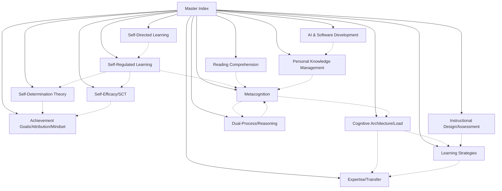

# 🗺️ Master Index — Top-Level Knowledge Atlas

> [!abstract] Purpose of This MOC
> This is the **top-level navigation hub** for the entire vault. It organizes 896 permanent notes into 14 thematic domains, each governed by its own dedicated Map of Content. Every substantive concept in this knowledge base should be reachable from here within two hops.

[**Vault-Structure-Principle**:: Knowledge graphs function best when traversable through hierarchical MOCs at multiple abstraction layers — Master → Domain → Specialized — preventing navigational collapse while preserving graph density.]

---

## 🧭 How to Use This Index

> [!helpful-tip] Navigation Pattern
> **Start here → Pick a Domain MOC → Follow to specialized notes.** Each Domain MOC below contains a comprehensive inventory of its topic area with wiki-linked access to all relevant atomic and reference notes. Think of this as a table of contents for the entire knowledge base.

**Three navigation strategies:**

1. [**Top-Down-Traversal**:: Start from this Master Index → select a domain → drill into specialized notes within that domain's MOC.]
2. [**Lateral-Exploration**:: Jump directly to a Domain MOC when you know the topic area, then explore related domains via cross-MOC links.]
3. [**Graph-View-Discovery**:: Open Obsidian's graph view filtered to `tag:#moc` to see the Domain MOCs as hubs and explore structural connections visually.]

---

## 🎓 Learning Science & Educational Psychology

> [!structure] The Educational Psychology Stack
> These six MOCs cover the interlocking frameworks that explain how humans learn, regulate their learning, and develop expertise. They form a tightly integrated theoretical system.

### Core Regulatory Frameworks

- **[[MOC-Self-Regulated-Learning]]** — [[Self-Regulated-Learning-—-SRL]] as a unified framework integrating cognition, metacognition, motivation, and behavior. Covers [[Zimmerman's-Cyclical-Model-of-Self-Regulated-Learning|Zimmerman]], [[Winne's-information-processing-model|Winne]], [[Pintrich's-Integrative-SRL-Framework|Pintrich]], and [[Boekaerts]] models.

- **[[MOC-Metacognition]]** — The [[meta-level-object-level-architecture]] of knowing-about-knowing. Covers [[Flavell's-Metacognitive-Framework|Flavell]], [[Nelson-and-Narens]], [[metacognitive-monitoring-and-control]], calibration, [[Judgment-of-Learning-—-JOL|JOL]], [[Feeling-of-Knowing-—-FOK|FOK]], and clinical/legal metacognitive applications.

### Motivation & Identity Frameworks

- **[[MOC-Self-Determination-Theory-and-Motivation]]** — [[Self-Determination-Theory-—-Foundational-Overview|SDT]] as the master motivational architecture. Covers [[Basic-Psychological-Needs-Theory-BPNT|BPNT]], [[autonomy-support]], [[internalization]], [[need-satisfaction]]/frustration, and broader motivation frameworks including [[flow-theory|flow]], [[goal-setting-theory]], and the [[Rubicon-Model-of-Action-Phases]].

- **[[MOC-Achievement-Goals-Attribution-Mindset]]** — How learners interpret success, failure, and ability. Integrates [[achievement-goal-theory|AGT]], [[2×2-Achievement-Goal-Framework]], [[bernard-weiner|Weiner's]] attribution theory, and [[carol-dweck|Dweck's]] [[Mindset-Theory]] — three frameworks with shared ancestry in causal reasoning about outcomes.

- **[[MOC-Self-Efficacy-Social-Cognitive-Theory]]** — [[albert-bandura|Bandura's]] [[Social-Cognitive-Theory-—-Bandura|SCT]] as the foundation of agency-based learning. Covers [[self-efficacy-belief|self-efficacy sources]], [[self-efficacy-calibration]], [[mastery-experience-vocabulary]], and [[Collective-Efficacy-and-Social-Capital-The-Sociological-Bridge|collective efficacy]].

---

## 🧠 Cognitive Science Foundations

> [!structure] The Cognitive Substrate
> These MOCs cover the information-processing architecture underlying all learning — how memory, attention, and reasoning operate.

- **[[MOC-Cognitive-Architecture-and-Load]]** — The machinery: [[Baddeley's-Working-Memory-Model|working memory]], [[long-term-memory]], [[Cognitive-Architecture-Working-Memory-&-Long-Term-Memory|cognitive architecture]], and [[john-sweller|Sweller's]] [[cognitive-load-theory-element-interactivity-deep-dive-2026-04-20|cognitive load theory]] including [[worked-examples-effect|worked examples]], [[split-attention-effect|split-attention]], and [[redundancy-effect]].

- **[[MOC-Dual-Process-Reasoning-Heuristics]]** — [[dual-process-theory|Type 1 / Type 2]] reasoning systems. Covers [[daniel-kahneman|Kahneman]], [[amos-tversky|Tversky]], [[heuristics-and-biases]], [[Ecological-Rationality|ecological rationality]], clinical reasoning applications, [[keith-stanovich|Stanovich's]] [[mindware]], and the [[Cognitive-Reflection-Test-and-Rationality-Quotient|CRT]].

---

## 📚 Learning Science in Practice

> [!structure] From Theory to Application
> These MOCs bridge theoretical frameworks to empirically validated practice.

- **[[MOC-Learning-Strategies-Evidence-Based]]** — Strategies with research backing: [[Retrieval-Practice-and-the-Testing-Effect|retrieval practice]], [[spacing-effect|spaced repetition]], [[Interleaving-Practice|interleaving]], [[Desirable-Difficulties-—-Bjork|desirable difficulties]], [[generation-effect]], [[dual-coding-theory]], and [[elaborative-encoding]].

- **[[MOC-Expertise-and-Transfer]]** — [[anders-ericsson|Ericsson's]] [[Deliberate-Practice-—-Ericsson|deliberate practice]], [[expertise-development]], [[chunking-as-the-unit-currency-of-deliberate-practice|chunking]], [[long-term-working-memory]], [[adaptive-expertise]] vs routine expertise, and [[Barnett-and-Ceci|Barnett & Ceci's]] [[transfer-of-learning|transfer taxonomy]].

- **[[MOC-Reading-Comprehension]]** — Reading as a cognitive process: [[walter-kintsch|Kintsch's]] [[construction-integration-model]], [[situation-model]], [[Baker-1985-Standards-of-Coherence|standards of coherence]], [[comprehension-monitoring]], [[strategic-reading]], and [[domain-expertise-and-reading-speed-a-transfer-investigation|domain expertise effects]].

- **[[MOC-Self-Directed-Learning]]** — [[malcolm-knowles|Knowles']] [[andragogy]], [[stewart-hase|Hase's]] [[heutagogy]], [[allen-tough|Tough's]] [[learning-projects]], [[lucy-guglielmino|Guglielmino's]] [[self-directed-learning-readiness-scale|SDLRS]], and [[lifelong-learning-system-design]].

---

## 🏗️ Instructional Design & Tools

- **[[MOC-Instructional-Design-and-Assessment]]** — [[Instructional-Design-Models-—-Overview|ID frameworks]], [[Scaffolding-in-Education|scaffolding]], [[Vygotsky's-Zone-of-Proximal-Development|ZPD]], [[reciprocal-teaching]], [[Intelligent-Tutoring-Systems]], [[formative-assessment]], [[Hattie-&-Timperley-Feedback-Model|Hattie & Timperley feedback]], and [[Assessment-Design-&-Goal-Orientation|assessment design]].

---

## 💻 Knowledge Systems & Technology

> [!structure] The Technology Stack
> These MOCs cover the tools and architectures that externalize, augment, and automate cognition.

- **[[MOC-Personal-Knowledge-Management]]** — [[Personal-Knowledge-Management-—-PKM|PKM]] theory and practice: [[Zettelkasten-Method|Zettelkasten]], [[atomic-note|atomic notes]], [[Evergreen-Notes|evergreen notes]], [[Map-of-Content|MOCs]], [[obsidian|Obsidian]], [[Building-a-Second-Brain]], and [[personal-workflow-architecture]].

- **[[MOC-AI-Prompt-Engineering-and-Software-Development]]** — [[Large-Language-Model|LLMs]], [[AI-Agents]], [[Claude-API]], [[Chain-of-Thought-Prompting]], [[Custom-MCP-Server-Development|MCP servers]], [[Retrieval-Augmented-Generation-RAG|RAG]], [[Python]], [[Git]], [[Software-Architecture]], and modern development workflows.

---

## 📊 Vault Health Dashboard

### Connected Notes by Domain

```dataview
TABLE
  length(file.inlinks) as "Backlinks",
  length(file.outlinks) as "Outlinks",
  status as "Status"
FROM "MOCs"
WHERE type = "moc"
SORT length(file.inlinks) DESC
```

### Orphaned Notes (No Backlinks)

```dataview
LIST
FROM ""
WHERE length(file.inlinks) = 0 AND type != "moc"
SORT file.name ASC
LIMIT 30
```

### Recently Modified

```dataview
TABLE
  dateformat(file.mtime, "yyyy-MM-dd") as "Modified",
  type as "Type"
FROM ""
SORT file.mtime DESC
LIMIT 20
```

---

## 🧩 Cross-Domain Integration Notes

> [!key-claim] These Notes Synthesize Multiple Frameworks
> The following notes explicitly integrate content across multiple domain MOCs and serve as **bridge concepts** in the knowledge graph.

### Original Syntheses (High-Value Integrations)

[**Integration-Node**:: Notes that synthesize material from 3+ source reports, marked with "original-synthesis" in their titles.]

- [[original-synthesis-the-pkm-expertise-design-alignment-model]] — Bridges [[expertise-development|expertise]], [[MOC-Personal-Knowledge-Management|PKM]], and [[instructional-design]]
- [[original-synthesis-the-metacognitive-monitoring-paradox]] — Bridges [[MOC-Metacognition|metacognition]] and [[MOC-Learning-Strategies-Evidence-Based|learning strategies]]
- [[original-synthesis-the-element-interactivity-paradox]] — Bridges [[cognitive-load-theory-element-interactivity-deep-dive-2026-04-20|CLT]] and [[MOC-Expertise-and-Transfer|expertise]]
- [[The-SRL-SDT-Interface-Motivational-Quality-as-the-Meta-Regulator-of-Regulation-Q]] — Bridges [[MOC-Self-Regulated-Learning|SRL]] and [[MOC-Self-Determination-Theory-and-Motivation|SDT]]
- [[The-Integration-Paradox-Why-Internalization-Requires-What-It-Produces]] — Deep [[MOC-Self-Determination-Theory-and-Motivation|SDT]] analysis
- [[The-Intellectual-Lineage-of-Self-Regulation-Research]] — Historical integration across [[MOC-Self-Regulated-Learning|SRL]] and [[MOC-Metacognition|metacognition]]
- [[Self-Efficacy-and-Mindset-A-Comparative-Architecture]] — Bridges [[self-efficacy-belief]] and [[Mindset-Theory]]
- [[Algorithmic-Metacognition-—-When-Spaced-Repetition-Systems-Do-Metacognitive-Work]] — Bridges [[MOC-Metacognition|metacognition]] and [[spaced-repetition-systems]]
- [[Designing-AI-Tutors-for-Calibrated-Efficacy-Cultivation]] — Bridges [[MOC-AI-Prompt-Engineering-and-Software-Development|AI]] and [[self-efficacy-calibration]]
- [[Autonomy-Support-in-Digital-and-AI-Mediated-Learning-Environments]] — Bridges [[autonomy-support]] and [[MOC-AI-Prompt-Engineering-and-Software-Development|AI]]

---

## 🔗 Meta-MOC Relationships

[**MOC-Network-Structure**:: Domain MOCs interconnect laterally — following these cross-links reveals how frameworks inform each other across traditional disciplinary boundaries.]



---

## 🔗 Related Topics for PKB Expansion

### 🎯 Core Extensions

1. **[[obsidian-pkb-architecture]]**
   - **Connection**: The structural foundation that enables this MOC system to function
   - **Depth Potential**: Vault organization principles, folder taxonomy, plugin architecture
   - **Knowledge Graph Role**: Architectural hub for the entire system
   - **Priority**: High — enables all other structure

2. **[[Map-of-Content]]**
   - **Connection**: The methodological basis for all MOCs in this vault
   - **Depth Potential**: MOC design patterns, hub vs index distinctions, hierarchical scaling
   - **Knowledge Graph Role**: Meta-node about the MOC pattern itself
   - **Priority**: High — theoretical grounding

### 🌐 Cross-Domain Connections

3. **[[knowledge-management]]**
   - **Connection**: The broader discipline this PKB implements
   - **Depth Potential**: Organizational knowledge management, tacit/explicit knowledge
   - **Knowledge Graph Role**: Bridge to institutional knowledge literature
   - **Priority**: Medium

4. **[[Information-Architecture]]**
   - **Connection**: The structural design discipline applicable to knowledge graphs
   - **Depth Potential**: Taxonomies, ontologies, faceted classification
   - **Knowledge Graph Role**: Methodological bridge
   - **Priority**: Medium

### 📚 Foundational Prerequisites

- **[[Zettelkasten-Method]]** — The atomic-note methodology underlying this PKB
- **[[atomic-note]]** — The unit of knowledge this system organizes
- **[[wiki-links]]** — The connective tissue enabling the graph

### 🛠️ Practical Applications

- **[[Obsidian-Automation]]** — Automating MOC maintenance
- **[[PKB-Automation]]** — Vault-level automation patterns
- **[[personal-workflow-architecture]]** — Integrating MOCs into daily practice
