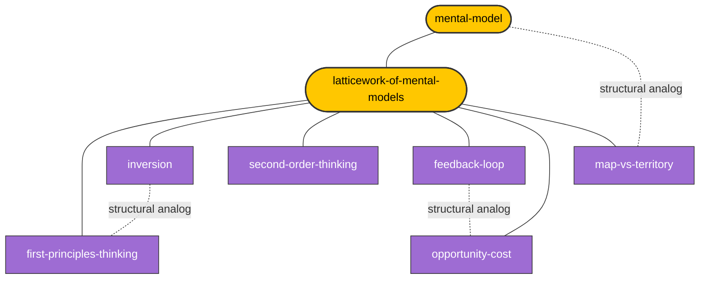

# 🧩 MOC — Mental Models Latticework

> [!abstract] Purpose
> Navigation hub for the **Mental Models Latticework** section of the vault. Mental models are simplified internal representations of external systems used to explain, predict, and act. A *latticework* (per [[charlie-munger]]) is a deliberately curated, cross-domain collection in which the structural correspondences between models — not the models themselves — generate reasoning power.
>
> This MOC organizes 35+ models across 6 disciplines and surfaces the **cross-domain structural correspondences** that make the lattice greater than the sum of its parts.

> [!principle-point] The Density Heuristic
> *Connection-density beats model-count.* A small lattice of richly cross-linked models outperforms a vast catalog of isolated entries. Per the [[mental-models-foundational-report-2026-05-10]], every note in this section must satisfy `latticework.cross-domain-links ≥ 3`.

> [!boundary] Scope of This MOC
> **Includes**: explanatory models with cross-domain structural reach used in reasoning, decision-making, and learning.
> **Excludes**: domain-specific theories with no demonstrated cross-domain transfer; pure techniques without underlying structural claims; biases-as-such (these appear only when paired with their corrective model).

---

## 🗺️ The Latticework (Visual)

*Status: scaffold. Edges accumulate as Sessions 3+ populate notes and declare `structural-analogs`.*

---

## 📍 Section Map

| # | Section | Purpose |
|---|---------|---------|
| 1 | [Hub Concepts](#1-hub-concepts) | Meta-models defining the framework itself |
| 2 | [Core Latticework Connectors](#2-core-latticework-connectors) | Cross-domain "load-bearing" models |
| 3 | [Cognitive Science](#3-cognitive-science) | Memory, representation, reasoning |
| 4 | [Decision & Behavior](#4-decision--behavior) | Heuristics, biases, decision frameworks |
| 5 | [Systems & Physics](#5-systems--physics) | Feedback, equilibrium, scaling |
| 6 | [Economics & Biology](#6-economics--biology) | Selection, exchange, competition |
| 7 | [Mathematics & Philosophy](#7-mathematics--philosophy) | Inference, parsimony, demarcation |
| 8 | [Latticework Bridges](#8-latticework-bridges) | The cross-domain edges themselves |
| 9 | [Source Material](#9-source-material) | Foundational reports |
| 10 | [Project Status](#10-project-status) | Build progress |

---

## 1. Hub Concepts

*The meta-models that define the framework. Read these first.*

- [[mental-model]] — *the meta-concept hub*
- [[latticework-of-mental-models]] — *the compositional principle (Munger)*

## 2. Core Latticework Connectors

*Cross-domain primitives referenced by many other models. Built first so subsequent notes wiki-link to live targets.*

- [[first-principles-thinking]] — *deconstruction to irreducible truths*
- [[inversion]] — *"invert, always invert" (Jacobi → Munger)*
- [[second-order-thinking]] — *consequences of consequences*
- [[feedback-loop]] — *reinforcing & balancing causal architecture*
- [[opportunity-cost]] — *the foregone alternative*
- [[map-vs-territory]] — *the model-reality distinction (Korzybski)*

## 3. Cognitive Science

*Models concerning the mental machinery itself.*

- [[schema-theory]] — *patterned expectations (Bartlett, Piaget)*
- [[chunking]] — *expertise as compression (Miller, Chase-Simon)*
- [[working-memory]] — *capacity-bound assembly workspace*
- [[mental-simulation]] — *running-the-model operation (Johnson-Laird)*
- [[dual-process-theory]] — *System 1 / System 2 (Stanovich, Kahneman)*
- [[predictive-coding]] — *hierarchical generative inference (Friston)*

## 4. Decision & Behavior

*Models of how minds choose under uncertainty — and how they fail.*

- [[confirmation-bias]] — *the self-sealing failure mode*
- [[availability-heuristic]] — *recall-as-frequency (Tversky-Kahneman)*
- [[anchoring-and-adjustment]] — *reference-point dependence*
- [[loss-aversion]] — *asymmetric utility (prospect theory)*
- [[expected-value]] — *probability-weighted outcomes*
- [[prospect-theory]] — *reference-dependent utility (Kahneman-Tversky)*

## 5. Systems & Physics

*Models of dynamic structure and quantitative scaling.*

- [[homeostasis-and-equilibrium]] — *self-regulating dynamics*
- [[compounding]] — *exponential accumulation*
- [[critical-mass]] — *threshold dynamics & phase transitions*
- [[entropy]] — *information loss & disorder*
- [[leverage-and-fulcrum]] — *mechanical advantage as decision metaphor*

## 6. Economics & Biology

*Models of selection, exchange, and competitive dynamics.*

- [[natural-selection]] — *variation-selection-retention algorithm*
- [[comparative-advantage]] — *Ricardian specialization*
- [[supply-and-demand]] — *equilibrium price discovery*
- [[red-queen-dynamics]] — *co-evolutionary running-to-stand-still*
- [[niche-construction]] — *organism-environment co-modification*

## 7. Mathematics & Philosophy

*Models of inference, parsimony, and the demarcation of knowledge.*

- [[bayesian-updating]] — *posterior = likelihood × prior*
- [[base-rate-neglect]] — *the Bayesian failure mode*
- [[regression-to-the-mean]] — *statistical reversion*
- [[falsifiability]] — *Popperian demarcation*
- [[occams-razor]] — *parsimony principle*

## 8. Latticework Bridges

*Cross-domain structural correspondences — the edges that make the lattice. Populated by Session 12 densification audit.*

> [!key-claim] What Counts as a Bridge
> A **structural correspondence**, not a surface similarity. Two models bridge when the *same formal structure* (e.g. negative feedback, variation-selection, reference-dependent valuation) appears in distinct domains and *transferring inference between them yields predictive leverage*.

| Bridge | From | To | Shared Structure |
|--------|------|-----|------------------|
| Part-whole composition | [[mental-model]] | [[latticework-of-mental-models]] | Atoms → assemblage; the lattice is the compositional structure built from individual model atoms |
| Method constructs object | [[first-principles-thinking]] | [[mental-model]] | First-principles is the *constructive procedure* that builds a fresh mental model when inherited ones fail |
| Decomposition operator | [[first-principles-thinking]] | [[reductionism]] | Strip-to-primitives applied methodologically (FP) vs. metaphysically (reductionism) |
| Axiomatic rebuild | [[first-principles-thinking]] | [[axiomatization]] | Reasoning forward from independently-justified primitives — engineering version of the mathematical move |
| Directional reversal | [[inversion]] | [[contrapositive]] | Logical equivalence of *P→Q* and *¬Q→¬P*; inversion exploits the psychological asymmetry between them |
| Primal-dual heuristic | [[inversion]] | [[dual-problem]] | Mathematical optimization's dual-problem maneuver as informal decision heuristic |
| Adversarial reframing | [[inversion]] | [[adversarial-thinking]] | Security/threat-modeling as institutionalized inversion |
| Meta-operator over models | [[inversion]] | [[mental-model]] | Inversion is a *deployment pattern* applicable to any mental model — run it backward to surface failure modes |
| Representation discipline | [[map-vs-territory]] | [[mental-model]] | The epistemic attitude one must hold toward mental models themselves — they are maps, not territory |
| Formal representation | [[map-vs-territory]] | [[representation-theory]] | Mathematical version: representations preserve *some* structural relations partially; faithfulness is structural, not literal |
| Sign vs referent | [[map-vs-territory]] | [[iconography-vs-referent]] | Semiotic version: conflating sign with referent is the master category error |
| Spec vs implementation | [[map-vs-territory]] | [[model-vs-implementation]] | Software version: proven correctness of the model does not entail correct behavior of the implementation |
| Failure-mode framing (cross-bridge) | [[inversion]] | [[first-principles-thinking]] | Inversion run on a first-principles derivation — *what would have to be true about my primitives for the rebuild to fail?* |
| Map awareness for any model | [[map-vs-territory]] | [[latticework-of-mental-models]] | The latticework is a map *of maps*; map-territory discipline must apply *recursively* to the lattice itself |
| Recursive deployment of models | [[second-order-thinking]] | [[mental-model]] | Iteration *depth* is a separable cognitive variable from the substrate model — second-order thinking is a depth-operator over any mental model |
| Loop closure underwrites depth | [[second-order-thinking]] | [[feedback-loop]] | Why second-order effects diverge from first-order ones in closed-loop systems — feedback supplies the formal structure that makes 'and then what?' non-trivial |
| Game-tree search analog | [[second-order-thinking]] | [[chess-lookahead]] | Ply-depth in chess is the formalized version of the practitioner-level discipline — same operator, different domain |
| Failure-mode complement | [[second-order-thinking]] | [[unintended-consequences]] | Operator and its negation: practice the operator (depth iteration), reduce the residual (unintended consequences) |
| Topology shared with cognition | [[feedback-loop]] | [[mental-model]] | Many specific mental models (Craik perception–action loop; predictive coding) instantiate the same closed-loop architecture — feedback is the structural primitive beneath them |
| Biological negative feedback | [[feedback-loop]] | [[homeostasis-and-equilibrium]] | Receptor → comparator → effector → sensed-state — Cannon's biological articulation of the same architecture as engineering control |
| Neural balancing loop | [[feedback-loop]] | [[predictive-coding]] | Top-down predictions vs. bottom-up sensory input vs. prediction-error: a balancing loop in representational state space |
| Formal mathematical theory | [[feedback-loop]] | [[control-theory]] | Engineering's rigorous formalization (gain, phase margin, stability, PID) of the architecture systems-dynamics treats informally |
| Cost-side of comparison | [[opportunity-cost]] | [[expected-value]] | EV of a single option is meaningless without an alternative; opportunity cost supplies the comparison baseline that makes EV decision-relevant |
| Pricing the trade-off | [[opportunity-cost]] | [[trade-off]] | Trade-off is the structural impossibility (you cannot have both); opportunity cost is the *quantification* of what is given up |
| Counterfactual valuation | [[opportunity-cost]] | [[counterfactual-reasoning]] | Counterfactual constructs the alternative path; opportunity cost values the difference — sequential operations |
| Anti-pattern explicit | [[opportunity-cost]] | [[sunk-cost-fallacy]] | Forward-looking foregone alternative vs. backward-looking already-paid expense — categorically distinct, frequently conflated |
| Capital allocation cross-bridge | [[opportunity-cost]] | [[first-principles-thinking]] | Buffett's discipline: rebuild the investment case from primitives (intrinsic value) and compare against the next-best alternative (opportunity cost) — the two models are paired in elite capital allocation practice |
| Empirical specialization of category | [[schema-theory]] | [[mental-model]] | Schemata are the *empirically-studied memory-organizational structures* beneath the philosophical category 'mental model' — same architecture, different epistemic posture (psychology lab vs. theory of cognition) |
| Process and product | [[schema-theory]] | [[chunking]] | Chunking is the dynamic operation that consolidates recurring patterns; mature chunks become schemata — process and its consolidated product |
| Generative model in inference loop | [[schema-theory]] | [[predictive-coding]] | A schema acts as the generative model whose top-down predictions are matched against bottom-up sensory data — schema theory's mechanism rendered in Bayesian-brain vocabulary |
| Founding empirical anchor | [[schema-theory]] | [[Bartlett-1932]] | *War of the Ghosts* recall studies established schema-mediated reconstruction as an empirical fact — the founding result the entire schema literature builds on |
| Capacity-extension operation | [[chunking]] | [[working-memory]] | Chunking and WM form an inseparable mechanism-pair: chunking is the *only* general operation that extends apparent WM capacity, by changing what counts as one item |
| Operational definition of expertise | [[chunking]] | [[expertise]] | Chase & Simon: experts have larger chunk libraries, not larger WM; expertise *is* chunk-rich domain perception — chunking provides the operational reduction |
| Building-blocks of cognitive models | [[chunking]] | [[mental-model]] | Chunks are the cognitive primitives mental models are assembled from; one cannot run a model whose components do not fit in WM — chunking sets what models are runnable |
| Substrate for simulation | [[working-memory]] | [[mental-simulation]] | WM is the workspace in which mental simulations are executed; capacity bounds limit simulation depth and breadth — Johnson-Laird's running-the-model operation is WM-bound |
| Operational definition of System 2 | [[working-memory]] | [[dual-process-theory]] | The deliberative 'System 2' process is operationally defined by its dependence on WM; System 1 runs without WM load — WM theory grounds the dual-process distinction |
| Load construct grounded in WM | [[working-memory]] | [[cognitive-load]] | Sweller's cognitive-load theory is *applied* WM theory — load is defined as WM demand; instructional design ignoring WM constraints reliably fails |
| Engineering import of WM theory | [[working-memory]] | [[human-factors-design]] | Three Mile Island and modern cockpit/control-room design treat WM capacity as the binding constraint to be designed-around (externalize state, group information, suppress noise) — WM theory directly imported into safety engineering |
| Substrate vs. execution | [[mental-simulation]] | [[mental-model]] | Mental simulation is the *act of running* a mental model; the model is the data structure, simulation is the procedure — inseparable but distinct |
| Simulation is WM-bound | [[mental-simulation]] | [[working-memory]] | Each simulation step consumes WM slots; truncation when WM overflows is silent (truncated simulations feel complete) — primary failure mode of forecasting |
| Iterated simulation = ply-extension | [[mental-simulation]] | [[second-order-thinking]] | Second-order thinking *is* iterated mental simulation — each ply is one simulation step composed with the previous; depth-extension is recursive simulation |
| Counterfactual reasoning is altered-antecedent simulation | [[mental-simulation]] | [[counterfactual-reasoning]] | Counterfactual reasoning is mental simulation initialized with an altered antecedent; same machinery, different starting state |
| WM operationally defines System 2 | [[dual-process-theory]] | [[working-memory]] | Type 2 processing is operationally defined by WM-dependence; Type 1 runs without WM load — WM theory grounds the dual-process distinction empirically (cross-bridge with row above on dual-process) |
| Type 2 reasoning operates on explicit models | [[dual-process-theory]] | [[mental-model]] | Type 2 reasoning operates on explicit mental models manipulated in WM; Type 1 produces output by pattern-match against implicit/associative representations |
| Heuristics are Type 1 output | [[dual-process-theory]] | [[heuristic]] | Heuristics are the characteristic output of Type 1: fast, frugal, automatic shortcuts that bypass deliberation — the heuristics-and-biases program is empirically a Type-1 catalog |
| Cognitive-architecture grounding for deliberation | [[dual-process-theory]] | [[deliberation]] | Deliberation is Type 2's prototypical activity — explicit, rule-based, sequential reasoning; the framework supplies the cognitive-architecture grounding for the philosophical distinction |
| Predictive coding is balancing feedback in representational state-space | [[predictive-coding]] | [[feedback-loop]] | Predictive coding *is* a balancing-loop architecture: top-down prediction vs. bottom-up sensory data vs. residual prediction-error; cybernetic feedback imported into perception itself |
| Schema as generative model | [[predictive-coding]] | [[schema-theory]] | A schema *is* the generative model whose top-down predictions are matched against bottom-up sensory data; schema-mediated reconstruction (Bartlett) is predictive coding in cognitive vocabulary (cross-bridge with Session-5 schema-theory edge) |
| Mental model in computational-neural vocabulary | [[predictive-coding]] | [[mental-model]] | The brain's generative model *is* a mental model in computational-neural vocabulary — same explanatory function (predict the world; compress experience), different epistemic posture (implementation vs. abstraction) |
| Approximate hierarchical Bayesian inference | [[predictive-coding]] | [[Bayesian-inference]] | Predictive coding is approximate hierarchical Bayesian inference implemented in cortical microcircuits; precision-weighting on prediction-error is the (approximate) variance-weighting in Bayesian update |

## 9. Source Material

- **Primary**: [[mental-models-foundational-report-2026-05-10]] (Pur3v4d3r house-voice synthesis; ~22k words)
- **Specialized — Johnson-Laird tradition**: [[mental-models-johnson-laird-foundational-report-2026-03-11]], [[mental-models-johnson-laird-first-principles-report-2026-03-11]]
- **Build plan**: [[00-master-plan]] at `02-projects/mental-models-latticework-section/`
- **Note template**: [[_master-mental-model-note-template-v1.0.0]]

## 10. Project Status

> [!helpful-tip] Build Phase Tracking
> | Phase | Sessions | Status | Notes Created |
> |-------|----------|--------|---------------|
> | 1 — Foundation | 1–2 | 🟢 complete | template + MOC scaffold + hub note `[[mental-model]]` |
> | 2 — Core Latticework | 3–4 | � complete | 8 / 8 (`[[mental-model]]` ✅, `[[latticework-of-mental-models]]` ✅, `[[first-principles-thinking]]` ✅, `[[inversion]]` ✅, `[[map-vs-territory]]` ✅, `[[second-order-thinking]]` ✅, `[[feedback-loop]]` ✅, `[[opportunity-cost]]` ✅) |
> | 3 — Cognitive Science | 5–6 | � complete | 6 / 6 (`[[schema-theory]]` ✅, `[[chunking]]` ✅, `[[working-memory]]` ✅, `[[mental-simulation]]` ✅, `[[dual-process-theory]]` ✅, `[[predictive-coding]]` ✅) |
> | 4 — Decision & Behavior | 7–8 | ⚪ pending | 0 / 6 |
> | 5 — Systems & Physics | 9 | ⚪ pending | 0 / 5 |
> | 6 — Economics & Biology | 10 | ⚪ pending | 0 / 5 |
> | 7 — Math & Philosophy | 11 | ⚪ pending | 0 / 5 |
> | 8 — Densification | 12 | ⚪ pending | cross-link audit |
> | 9 — Visual Enrichment | 13 | ⚪ pending | diagram pass |
> | 10 — Validation | 14 | ⚪ pending | quality report |

**Total target (Phase 1)**: 35 mental-model notes + 1 MOC + 1 template + per-session hand-offs.

---

## 🔗 Related MOCs

- [[moc-cognitive-architecture-learning-science]] — for cognitive-science models' theoretical home
- [[moc-reasoning-critical-thinking-epistemology]] — for [[first-principles-thinking]], [[falsifiability]], [[bayesian-updating]]
- [[moc-motivation-agency-self-regulation]] — for behavioral applications of these models
