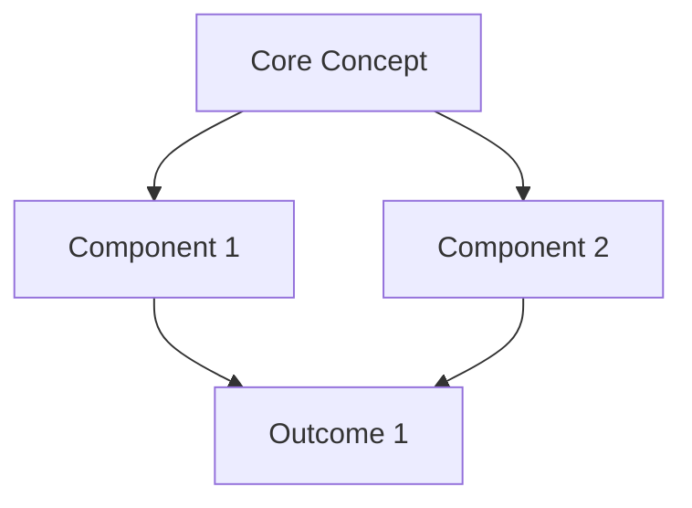

---
aliases:
  - Template Back-up
  - Template Back up
  - Backup for Templates
  - Backup of Templates
---


### Learning Concept Card Template

```markdown
---
type: concept-card
tags: #learning #concept #active-study
created: <% tp.date.now("YYYY-MM-DD") %>
modified: <% tp.date.now("YYYY-MM-DD") %>
status: "📚 Learning"
confidence_level: <% await tp.system.suggester(["🌱 Novice", "🌿 Developing", "🌳 Proficient", "🎓 Expert"], [1, 2, 3, 4], false, "Rate your confidence level") %>
source_type: <% await tp.system.suggester(["Book", "Article", "Video", "Course", "Podcast", "Discussion"], ["book", "article", "video", "course", "podcast", "discussion"]) %>
source_title: "<% await tp.system.prompt("Source title (book/article/course name)") %>"
source_author: "<% await tp.system.prompt("Author/Creator name") %>"
related_domains: [<% (await tp.system.prompt("Related domains (comma-separated, e.g., psychology, neuroscience)")).split(',').map(d => `"${d.trim()}"`).join(', ') %>]
---

# <% tp.file.title %>

> [!definition] Core Definition
> *Brief definition in your own words - aim for 1-2 sentences that capture the essence*

## 📖 Detailed Explanation

*Expand on the concept with comprehensive explanation:*
- What is it fundamentally?
- Why does it matter?
- What problem does it solve or what question does it answer?

## 🧩 Key Components

*Break down the concept into constituent parts:*

1. **Component 1**: Description
2. **Component 2**: Description
3. **Component 3**: Description

## 🔄 Mental Model

> [!analogy] Understanding Through Comparison
> *Explain this concept using an analogy, metaphor, or comparison to something familiar*

## 💡 Personal Insight

*What clicked for you? What was the "aha!" moment?*

**Connection to Prior Knowledge:**
- How does this relate to [[Concept X]] that you already understand?
- How does this contrast with [[Concept Y]]?

## 🎯 Practical Applications

> [!example] Real-World Examples
> 1. **Example 1**: Concrete scenario
> 2. **Example 2**: Different context application
> 3. **Example 3**: Edge case or unusual application

## ❓ Open Questions & Areas for Deeper Study

- [ ] Question 1 that emerged from learning this
- [ ] Aspect that needs clarification
- [ ] Related concept to explore: [[Topic to investigate]]

## 🧪 Self-Testing

> [!attention] Comprehension Check
> Without looking at notes above, can you:
> - [ ] Define the concept in one sentence
> - [ ] Explain it to someone unfamiliar with the topic
> - [ ] Identify when you'd apply this concept
> - [ ] Connect it to 3 other concepts in your knowledge base

**Review Schedule:**
- First Review: <% moment(tp.date.now("YYYY-MM-DD")).add(1, 'days').format("YYYY-MM-DD") %>
- Second Review: <% moment(tp.date.now("YYYY-MM-DD")).add(7, 'days').format("YYYY-MM-DD") %>
- Third Review: <% moment(tp.date.now("YYYY-MM-DD")).add(30, 'days').format("YYYY-MM-DD") %>

## 🔗 Knowledge Graph Connections

**Upstream Dependencies** (what you need to know first):
- [[Prerequisite Concept 1]]
- [[Prerequisite Concept 2]]

**Downstream Applications** (what this enables):
- [[Advanced Topic 1]]
- [[Advanced Topic 2]]

**Lateral Connections** (related concepts at same level):
- [[Related Concept 1]]
- [[Related Concept 2]]

---
*Last Updated: <% tp.date.now("YYYY-MM-DD HH:mm") %>*
```

**Template Purpose:** Structured learning documentation following [[03-notes/01_permanent-notes/01_cognitive-development/Spaced Repetition]] and [[Elaborative Interrogation]] principles. Designed for deep concept mastery in academic or professional development contexts.

**Key Features:** 
- Confidence tracking for metacognitive awareness
- Multiple representation layers (definition, analogy, examples)
- Self-testing prompts integrated into structure
- Automatic review scheduling using spaced repetition intervals
- Knowledge graph positioning (upstream/downstream/lateral)

**Customization Points:**
- Adjust review intervals based on your retention patterns
- Modify confidence_level scale to match your assessment preferences
- Add domain-specific sections (e.g., "Mathematical Formulation" for STEM topics)
- Integrate with [[Anki]] export workflows for flashcard generation

---

### Agile Sprint Planning Board Template
```markdown
---
type: sprint-board
tags: #project #agile #sprint-planning #task-management
sprint_number: <% await tp.system.prompt("Sprint number (e.g., Sprint 12)") %>
sprint_start: <% tp.date.now("YYYY-MM-DD") %>
sprint_end: <% moment(tp.date.now("YYYY-MM-DD")).add(14, 'days').format("YYYY-MM-DD") %>
team: "<% await tp.system.prompt("Team name") %>"
sprint_goal: "<% await tp.system.prompt("Primary sprint goal/objective") %>"
velocity_target: <% await tp.system.prompt("Target story points for this sprint", "40") %>
status: "⏳ In Progress"
project_link: [[<% await tp.system.prompt("Link to main project note name") %>]]
---

# <% tp.file.title %>

> [!abstract] Sprint Overview
> **Goal**: <% tp.frontmatter.sprint_goal %>
> **Timeline**: <% tp.frontmatter.sprint_start %> → <% tp.frontmatter.sprint_end %>
> **Team**: <% tp.frontmatter.team %>
> **Velocity Target**: <% tp.frontmatter.velocity_target %> points

## 📊 Sprint Metrics

| Metric | Target | Actual | Status |
|--------|--------|--------|--------|
| Story Points Committed | <% tp.frontmatter.velocity_target %> | `= sum(filter(this.tasks, (t) => t.points).points)` | `= choice(sum(filter(this.tasks, (t) => t.points).points) >= <% tp.frontmatter.velocity_target %>, "✅", "⚠️")` |
| Tasks Completed | - | `= length(filter(this.tasks, (t) => t.status = "Done"))` | - |
| Completion Rate | 100% | `= round((length(filter(this.tasks, (t) => t.status = "Done")) / length(this.tasks)) * 100, 1)` % | - |
| Blockers | 0 | `= length(filter(this.tasks, (t) => t.status = "Blocked"))` | `= choice(length(filter(this.tasks, (t) => t.status = "Blocked")) = 0, "✅", "🔴")` |

## 🎯 Sprint Backlog

### 🔴 High Priority

- [ ] **[Task Title 1]** #task/high
  - Points:: 8
  - Assignee:: @TeamMember
  - Status:: Not Started
  - Description:: 

- [ ] **[Task Title 2]** #task/high
  - Points:: 5
  - Assignee:: @TeamMember  
  - Status:: Not Started
  - Description:: 

### 🟠 Medium Priority

- [ ] **[Task Title 3]** #task/medium
  - Points:: 3
  - Assignee:: @TeamMember
  - Status:: Not Started
  - Description:: 

### 🟢 Low Priority

- [ ] **[Task Title 4]** #task/low
  - Points:: 2
  - Assignee:: @TeamMember
  - Status:: Not Started
  - Description:: 

## 📅 Daily Standup Log

### <% tp.date.now("YYYY-MM-DD") %> - Day 1

**Completed Yesterday:**
- 

**Planned for Today:**
- 

**Blockers:**
- None

---

## 🚧 Impediments & Risks

> [!warning] Active Blockers
> *Track anything preventing progress*

| Issue | Impact | Owner | Resolution Plan | Status |
|-------|--------|-------|-----------------|--------|
|       |        |       |                 |        |

## 🎉 Sprint Deliverables

> [!important] Definition of Done Checklist
> - [ ] All acceptance criteria met for committed stories
> - [ ] Code reviewed and merged to main branch
> - [ ] Unit tests written and passing (>80% coverage)
> - [ ] Documentation updated
> - [ ] Demo prepared for sprint review
> - [ ] Deployed to staging environment

## 📈 Burndown Tracking

*Manual daily updates or integrate with project management tool*

| Day | Date | Points Remaining | Notes |
|-----|------|------------------|-------|
| 1 | <% tp.date.now("YYYY-MM-DD") %> | <% tp.frontmatter.velocity_target %> | Sprint kickoff |
| 2 |  |  |  |
| 3 |  |  |  |

## 🔄 Sprint Retrospective (End of Sprint)

**What Went Well:**
- 

**What Didn't Go Well:**
- 

**Action Items for Next Sprint:**
- [ ] 
- [ ] 

**Team Velocity:**
- Planned: <% tp.frontmatter.velocity_target %>
- Completed: [Fill at sprint end]
- Variance: [Calculate]

## 🔗 Related Sprints

- Previous: [[Sprint <% parseInt((await tp.system.prompt("Sprint number (e.g., Sprint 12)")).replace(/\D/g, '')) - 1 %>]]
- Next: [[Sprint <% parseInt((await tp.system.prompt("Sprint number (e.g., Sprint 12)")).replace(/\D/g, '')) + 1 %>]]
- Project Board: <% tp.frontmatter.project_link %>

---
*Created: <% tp.date.now("YYYY-MM-DD HH:mm") %>*
```

**Template Purpose:** Comprehensive agile sprint tracking combining planning, daily execution, and retrospective analysis. Integrates [[Tasks Plugin]] metadata and [[dataview]] calculations for real-time progress visualization.

**Key Features:**
- Automatic sprint duration calculation (default 2-week sprints)
- Dataview-powered metrics dashboard (story points, completion rate, blockers)
- Inline task metadata compatible with Tasks plugin filtering
- Daily standup logging structure
- Built-in retrospective framework

**Customization Points:**
- Adjust sprint duration in sprint_end calculation (currently 14 days)
- Modify priority levels and color coding to match team conventions
- Add custom task metadata fields (labels, components, epic links)
- Integrate with external tools via API (Jira, Linear, GitHub Projects)

---

### Weekly Review & Planning Journal Template

### Weekley Review
```markdown
---
type: weekly-review
tags: #journal #weekly-review #productivity #reflection
week_number: <% moment(tp.date.now("YYYY-MM-DD")).week() %>
year: <% tp.date.now("YYYY") %>
week_start: <% moment(tp.date.now("YYYY-MM-DD")).startOf('week').format("YYYY-MM-DD") %>
week_end: <% moment(tp.date.now("YYYY-MM-DD")).endOf('week').format("YYYY-MM-DD") %>
energy_level: <% await tp.system.suggester(["🔋 High Energy", "⚡ Moderate Energy", "🪫 Low Energy", "😴 Depleted"], ["high", "moderate", "low", "depleted"], false, "Overall energy this week?") %>
satisfaction_rating: <% await tp.system.suggester(["⭐⭐⭐⭐⭐ Excellent", "⭐⭐⭐⭐ Good", "⭐⭐⭐ Average", "⭐⭐ Below Average", "⭐ Poor"], [5, 4, 3, 2, 1], false, "Week satisfaction rating?") %>
---

# Week <% tp.frontmatter.week_number %> Review - <% moment(tp.date.now("YYYY-MM-DD")).format("MMMM YYYY") %>

> [!abstract] Week at a Glance
> **Period**: <% moment(tp.frontmatter.week_start).format("MMM DD") %> - <% moment(tp.frontmatter.week_end).format("MMM DD, YYYY") %>
> **Energy Level**: <% tp.frontmatter.energy_level %>
> **Satisfaction**: <% "⭐".repeat(tp.frontmatter.satisfaction_rating) %>

---

## 🎯 Goal Progress Review

### Professional Goals

> [!key-claim] Primary Objective
> *What was the main professional goal for this week?*

**Progress Status:**
- [ ] Goal achieved completely
- [ ] Made significant progress
- [ ] Some progress, but behind schedule
- [ ] Minimal or no progress

**Key Accomplishments:**
1. 
2. 
3. 

**Challenges Encountered:**
- 

**Lessons Learned:**
- 

### Personal Goals

**Focus Area**: *Health / Learning / Relationships / Hobbies*

**This Week's Wins:**
- 

**Areas for Improvement:**
- 

---

## 📊 Time & Energy Analysis

### Time Allocation Breakdown

*Estimate percentage of time spent in each category*

| Category | % Time | Quality Rating (1-5) | Notes |
|----------|--------|----------------------|-------|
| Deep Work | | | |
| Meetings | | | |
| Admin/Email | | | |
| Learning | | | |
| Personal | | | |

> [!thought-experiment] Reflection Prompt
> If you could redistribute your time this week, what would you change?

### Energy Patterns

**Peak Productivity Times:**
- 

**Energy Drains Identified:**
- 

**Strategies for Next Week:**
- 

---

## 📚 Learning & Growth

### New Knowledge Acquired

> [!example] Key Concepts Learned
> - **[[Concept 1]]**: Brief description and why it matters
> - **[[Concept 2]]**: Brief description and source
> - **[[Concept 3]]**: Application or next step

### Skills Practiced

- **Skill**: [Context where practiced]
- **Skill**: [Context where practiced]

### Content Consumed

**Books/Articles Read:**
- [[Source 1]] - Key takeaway::
- [[Source 2]] - Key takeaway::

**Courses/Videos Completed:**
- 

---

## 🙏 Gratitude & Positive Moments

> [!helpful-tip] Gratitude Practice
> Research shows regular gratitude reflection improves well-being and life satisfaction.

**Three Things I'm Grateful For:**
1. 
2. 
3. 

**Meaningful Interactions:**
- 

**Small Wins to Celebrate:**
- 
- 
- 

---

## 🔄 Habit Tracking

| Habit | Mon | Tue | Wed | Thu | Fri | Sat | Sun | Weekly Total |
|-------|-----|-----|-----|-----|-----|-----|-----|--------------|
| Morning routine | ✓ | | | | | | | /7 |
| Exercise | ✓ | | | | | | | /7 |
| Reading (30min) | ✓ | | | | | | | /7 |
| Meditation | ✓ | | | | | | | /7 |
| Deep work block | ✓ | | | | | | | /7 |

**Habit Insights:**
- 

---

## 📅 Week Ahead Planning

### Next Week's Focus

> [!important] Primary Intention
> *What is the ONE thing that would make next week successful?*

**Top 3 Priorities:**
1. 
2. 
3. 

### Scheduled Commitments

| Day | Commitment | Time | Prep Needed |
|-----|------------|------|-------------|
| Monday | | | |
| Tuesday | | | |
| Wednesday | | | |
| Thursday | | | |
| Friday | | | |

### Buffer & Recovery

**Planned Rest Time:**
- 

**Contingency Plans:**
- If energy is low: 
- If unexpected urgent work arrives: 

---

## 💭 Free Reflection Space

*Unstructured thoughts, feelings, or observations about the week*

---

## 🔗 Connected Reviews

- Previous Week: [[Week <% tp.frontmatter.week_number - 1 %> Review - <% tp.frontmatter.year %>]]
- Next Week: [[Week <% tp.frontmatter.week_number + 1 %> Review - <% tp.frontmatter.year %>]]
- Monthly Summary: [[<% moment(tp.date.now("YYYY-MM-DD")).format("YYYY-MM") %> Monthly Review]]
- Annual Review: [[<% tp.frontmatter.year %> Year in Review]]

---
*Review Completed: <% tp.date.now("YYYY-MM-DD HH:mm") %>*
```

**Template Purpose:** Comprehensive weekly reflection combining [[GTD (Getting Things Done)]] principles, [[bullet journaling]] techniques, and [[Positive Psychology]] practices. Designed for holistic life review covering professional productivity, personal growth, and well-being.

**Key Features:**
- Automatic week number calculation and date range generation
- Multi-dimensional tracking (goals, time, energy, habits, gratitude)
- Structured reflection prompts based on coaching methodologies
- Built-in linking to previous/next weeks for longitudinal review
- Habit tracker with visual checkmarks for pattern identification

**Customization Points:**
- Modify habit tracking categories to match your personal goals
- Adjust time allocation categories for your work context
- Add domain-specific goal sections (creative projects, health metrics, financial)
- Integrate with [[Day Planner]] for detailed daily time blocking
- Connect to [[dataview]] queries for automated habit statistics across multiple weeks

---

### Research Synthesis Workspace Template

`````markdown
---
type: research-synthesis
tags: #research #synthesis #academic #analysis
research_topic: "<% await tp.system.prompt("Primary research topic/question") %>"
research_phase: <% await tp.system.suggester(["📚 Literature Review", "🔬 Data Collection", "📊 Analysis", "✍️ Writing", "🔄 Revision"], ["literature-review", "data-collection", "analysis", "writing", "revision"]) %>
discipline: <% await tp.system.suggester(["Social Sciences", "Natural Sciences", "Humanities", "Technology/Engineering", "Interdisciplinary"], ["social-sciences", "natural-sciences", "humanities", "technology", "interdisciplinary"]) %>
start_date: <% tp.date.now("YYYY-MM-DD") %>
target_completion: <% moment(tp.date.now("YYYY-MM-DD")).add(90, 'days').format("YYYY-MM-DD") %>
status: "🔬 Active Research"
methodology: "<% await tp.system.prompt("Primary research methodology (e.g., systematic review, qualitative analysis, experimental)") %>"
---

# <% tp.file.title %>

> [!definition] Research Question
> **Primary Question**: <% tp.frontmatter.research_topic %>
> 
> **Sub-Questions:**
> 1. 
> 2. 
> 3. 

## 🎯 Research Objectives

**Primary Aim:**

**Specific Objectives:**
1. 
2. 
3. 

**Hypothesis** *(if applicable)*:

---

## 📚 Literature Map

> [!methodology-and-sources] Search Strategy
> **Databases**: [Specify: PubMed, Google Scholar, JSTOR, etc.]
> **Search Terms**: 
> **Inclusion Criteria**: 
> **Exclusion Criteria**: 
> **Date Range**: 

### Key Sources by Theme

#### Theme 1: [Conceptual Framework]

| Source | Author(s) | Year | Key Argument | Relevance | Link |
|--------|-----------|------|--------------|-----------|------|
| | | | | 🔴 High | [[]] |
| | | | | 🟠 Medium | [[]] |

#### Theme 2: [Methodological Approaches]

| Source | Author(s) | Year | Key Argument | Relevance | Link |
|--------|-----------|------|--------------|-----------|------|
| | | | | 🔴 High | [[]] |
| | | | | 🟠 Medium | [[]] |

#### Theme 3: [Empirical Findings]

| Source | Author(s) | Year | Key Argument | Relevance | Link |
|--------|-----------|------|--------------|-----------|------|
| | | | | 🔴 High | [[]] |
| | | | | 🟠 Medium | [[]] |

---

## 🧩 Theoretical Framework

> [!principle-point] Foundational Theories
> *Identify 2-3 core theoretical perspectives informing your research*

### Theory 1: [[Theory Name]]

**Core Principles:**
- 

**Application to Research:**
- 

**Key Proponents:**
- 

### Theory 2: [[Theory Name]]

**Core Principles:**
- 

**Application to Research:**
- 

**Key Proponents:**
- 

---

## 📊 Emerging Patterns & Themes

### Convergent Findings

> [!evidence] Areas of Consensus
> *What do multiple sources agree on?*

1. **Finding**: 
   - **Supporting Sources**: [[@Source1]], [[@Source2]], [[@Source3]]
   - **Strength of Evidence**: 

2. **Finding**: 
   - **Supporting Sources**: 
   - **Strength of Evidence**: 

### Divergent Perspectives

> [!counter-argument] Contradictions & Debates
> *Where do sources disagree or present competing views?*

**Debate 1:**
- **Position A**: [Summary] - [[@Source]]
- **Position B**: [Summary] - [[@Source]]
- **Your Synthesis**: 

**Debate 2:**
- **Position A**: 
- **Position B**: 
- **Your Synthesis**: 

### Research Gaps Identified

> [!attention] Opportunities for Contribution
> *What hasn't been adequately addressed?*

1. **Gap**: 
   - **Why It Matters**: 
   - **Potential Approach**: 

2. **Gap**: 
   - **Why It Matters**: 
   - **Potential Approach**: 

---

## 💡 Synthesis & Original Insights

### Conceptual Model

> [!thought-experiment] Integrated Framework
> *How do the pieces fit together? What new understanding emerges?*



*Narrative explanation of the model:*

### Novel Contributions

**Contribution 1:**

**Contribution 2:**

---

## 🔬 Methodology Design

### Research Design

**Approach**: <% tp.frontmatter.methodology %>

**Rationale**:

### Data Sources

| Source Type | Description | Access Method | Status |
|-------------|-------------|---------------|--------|
| | | | |

### Analysis Plan

**Phase 1**: 
- 

**Phase 2**: 
- 

**Phase 3**: 
- 

---

## ✍️ Argument Structure Outline

> [!key-claim] Central Thesis
> *Your main argumentative claim*

### Supporting Arguments

**Argument 1:**
- **Claim**: 
- **Evidence**: 
- **Reasoning**: 

**Argument 2:**
- **Claim**: 
- **Evidence**: 
- **Reasoning**: 

**Argument 3:**
- **Claim**: 
- **Evidence**: 
- **Reasoning**: 

### Counterarguments & Rebuttals

**Potential Objection 1:**
- **Objection**: 
- **Rebuttal**: 

---

## 📅 Research Timeline & Milestones

| Phase | Tasks | Deadline | Status |
|-------|-------|----------|--------|
| Literature Review | Identify 50 key sources | <% moment(tp.date.now("YYYY-MM-DD")).add(30, 'days').format("YYYY-MM-DD") %> | 🟡 |
| Framework Development | Complete theoretical synthesis | <% moment(tp.date.now("YYYY-MM-DD")).add(45, 'days').format("YYYY-MM-DD") %> | ⚪ |
| Data Collection | | <% moment(tp.date.now("YYYY-MM-DD")).add(60, 'days').format("YYYY-MM-DD") %> | ⚪ |
| Analysis | | <% moment(tp.date.now("YYYY-MM-DD")).add(75, 'days').format("YYYY-MM-DD") %> | ⚪ |
| First Draft | | <% moment(tp.date.now("YYYY-MM-DD")).add(90, 'days').format("YYYY-MM-DD") %> | ⚪ |

---

## 🔗 Connected Research

**Related Projects:**
- [[Project Name 1]]
- [[Project Name 2]]

**Key Concept Notes:**
- [[Core Concept 1]]
- [[Core Concept 2]]

**Methodological References:**
- [[Research Method 1]]
- [[Statistical Technique]]

---

## 📝 Writing Workspace

### Introduction Draft

### Methods Draft

### Results Draft

### Discussion Draft

---

*Research Log Updated: <% tp.date.now("YYYY-MM-DD HH:mm") %>*
`````

**Template Purpose:** Comprehensive research synthesis environment combining [[Literature Review]] methodology, [[Argument Mapping]], and [[Academic Writing]] scaffolds. Designed for graduate-level research, systematic reviews, meta-analyses, or extended analytical projects.

**Key Features:**
- Multi-phase research tracking (literature → analysis → writing)
- Structured literature organization with thematic categorization
- Theoretical framework development section
- Synthesis tools for convergent/divergent findings
- Integrated argument construction with claim-evidence-reasoning structure
- Automatic milestone generation based on 90-day timeline
- Mermaid diagram support for conceptual model visualization

**Customization Points:**
- Adjust timeline duration for project scope (default 90 days)
- Modify discipline-specific sections (add hypothesis testing for quantitative work)
- Expand methodology section with domain-specific protocols
- Integrate with [[Zotero]] or [[Mendeley]] citation managers
- Add ethics/IRB approval tracking for human subjects research
- Connect to [[Literature Notes]] template for detailed source analysis
### Scratchpad
`````
---
<%*
const files = this.app.vault.getMarkdownFiles();
const scratchpadRegex = /^Scratchpad-(\d+)/;
let maxNumber = 0;
for (const file of files) {
  const match = file.basename.match(scratchpadRegex);
  if (match) {
    const currentNumber = parseInt(match[1], 10);
    if (currentNumber > maxNumber) {
      maxNumber = currentNumber;
    }
  }
}
const nextNumber = (maxNumber + 1).toString().padStart(2, '0');
const newTitle = `Scratchpad-${nextNumber}`;
await tp.file.rename(newTitle);
const noteContent = `---
title: ${newTitle}
id: ${tp.date.now("YYYYMMDDHHmmss")}
type: scratchpad
status: draft
source: pur3v4d3r
url: ""
tags:
  - daily-scratchpad
  - scratchpad
aliases:
  - daily-scratchpad
  - scratchpad
link-up: ""
link-related:
  - 
---
# ${newTitle}
`;
tR += noteContent;

%>
### Today's Active TO-DO** LIST
```dataview
TASK 
WHERE created = date(today)
LIMIT 10
SORT created DESC
```
### Yesterday's Completed Tasks

```dataview
TASK
WHERE completed
WHERE file.cday = (date(yesterday) - dur(1 day))
LIMIT 10
GROUP BY file.link
```
# 📥Intake

> STOICISM: DICHOTOMY OF CONTROL
> > - Does this impression correctly identify what is good, evil, or indifferent? 
> > > - More specifically, does it attribute value to something within my control or beyond it?

---
# 💡Initial Processing

>[!question]
> - *What* is the **core idea** here?
> - *What* does this **connect to**?
> - *What* **assumptions** am **I making**?
> - *What* is the **immediate next action**?

---

>[!disposition]
> 🗃️ Disposition
> *Once processed, check one and delete the note or move to archive.*
>
> - [ ] **Processed:** Ideas moved to permanent notes.
> - [ ] **Archived:** Moved to reference folder.
> - [ ] **Actioned:** Tasks moved to task manager.
> - [ ] **Deleted:** No longer needed.

---

>[!problem-clarity-solution]
> ⚡ **Problem-Clarity-Solution**
>
> - **Problem**: Define the actual problem in one clear sentence.
>
> - **Clarity (Knowns/Unknowns)**: What do I know about this? What do I not know and need to find out?
>
> - **Solution (Hypothesis)**: What is a potential path forward? What is the first step?

---

>[!zettelkasten-incubator]
📚 **Zettelkasten Incubator**
>
> - **Source (Bibliographic)**: [Paste citation or link]
>
> - **Verbatim Quote**: "…"
>
> - **My Thought (Paraphrased)**: [Re-write the idea entirely in your own words. How do you understand it?]
>
> - **Connections**: [[Related Idea 1]], [[Future Question]]

---

>[!project-kickstarter]
> 🚀 **Project Kickstarter**
>
> - **Objective**: What is the desired final outcome?
>
> - **Why**: What is the core motivation or purpose?
>
> - **Key Components**: What are the 3-5 major "chunks" of this project?
>
> - **First Actions**: What are the very first physical steps to get moving?

---

## Recommended Topics to Process
`````


### Daily Note Template (Re-tired)
```
Daily Note Template

---
type: daily
date created: "{{date}}"
tags:
  - daily
---
	
	
# {{date}} 
	
# 🔸Daily Overview
	
- **Weather/Location:**  
- **Mood/Intention:**  
- **Primary Focus:** What is the most important thing you want to accomplish today?  
	
## 🌟Feeling levels
	
- **Motivation:**  
- **Stress:**  
- **Physical Energy:**  
- **Mental Energy:**  
	
## 🐈Morning Reflection
	
> [!document]
> How is this morning?
- What are you grateful for this morning?  
- What challenges do you anticipate?  How can you approach them with patience and creativity?  
	
# 🎣Tasks for Today
	
> [!tasks]
> List 3 Task's to accomplish today, from most important to least.
* [ ] **High Priority:**  
- [ ] **Secondary:**  
- [ ] **Tertiary:**  
	
## 💯 Tasks of Yesterday	
	
> [!tasks]
> This task query lists all tasks you completed on the previous day. Completed tasks will appear here automatically.

### Completed Tasks from Yesterday


TASK
WHERE completed
WHERE completion = (date(today) - dur(1 day))
GROUP BY file.link


### *Uncompleted Tasks from Yesterday


TASK
WHERE !completed
WHERE file.cday = (date(yesterday) - dur(1 day))
GROUP BY file.link


## ✒️ Journal Entries
 

## 🚀Evening Reflection
	
> [!tasks]
> List 2-3 Tasks you want to accomplish for tomorrow. Order them from most actionable to least.
1. 
2. 
3. 
	
> [!document]
> How your day went or is going.
- What went well today?  Celebrate small victories.
	- 
- What challenges did you face?  How did you respond?  What would you do differently?
	- 
- What did you learn about yourself or the world today?
	- 
- How can you refine your system to better support tomorrow?
	
___
```
### Comprehensive Daily Template
```

---
tags: [daily-note]
---

# <% tp.date.now("dddd, MMMM Do, YYYY", 0, tp.file.title, "YYYY-MM-DD") %>

## 📅 Temporal Context
- **Week**: [[<% tp.date.now("gggg-[W]WW", 0, tp.file.title, "YYYY-MM-DD") %>]]
- **This Week's Theme**: `= this.week.theme`
- **Monthly Goal**: `= this.month.primary_goal`

## 🎯 Today's Plan

### Big Rock 🎯
- [ ] [Primary outcome for today]

### Supporting Tasks 📝
- [ ] [Supporting task 1]
- [ ] [Supporting task 2]

### Routine Items 🔄
- [ ] Morning review
- [ ] Spaced repetition (20 min)
- [ ] Evening reflection

## ⏰ Time Blocks

| Time | Block | Type | Task |
|------|-------|------|------|
| 9:00-11:00 | Deep Work | 🧠 | [Big Rock work] |
| 11:00-12:00 | Buffer | ☕ | Break / Overflow |
| 12:00-1:00 | Lunch | 🍽️ | Meal + walk |
| 1:00-2:00 | Admin | 📧 | Email / Communications |
| 2:00-4:00 | Learning | 📚 | [Course/Reading] |
| 4:00-5:00 | Integration | 🔗 | Note-making / Linking |
| 5:00-5:30 | Review | 🔍 | Reflection + tomorrow's setup |

## 📊 Tasks Overview

### Due Today

````
```dataview
TASK
FROM "Projects" OR "Areas"
WHERE !completed AND due = this.file.day
```
````

### Can Do Today  

````
```
TASK
FROM "Projects" OR "Areas"
WHERE !completed AND (due = null OR due > this.file.day)
SORT file.name DESC
LIMIT 10
```
````

### Completed Today

````
```
TASK
FROM "Projects" OR "Areas" OR ""
WHERE completed AND completion = this.file.day
```
````

## 📝 Notes & Captures

### Quick Captures
- 

### Ideas
- 

### Observations
- 

## 🔗 Notes Created/Modified Today

````
```
LIST
FROM ""
WHERE file.cday = this.file.day OR file.mday = this.file.day
SORT file.mtime DESC
```
````

## 🌙 Evening Reflection

### Wins 🎉
- 
- 

### Learned 💡
- 
- 

### Challenges ⚠️
- 
- 

### Tomorrow's Priority
- 

### Energy Patterns
**Morning**: 
**Afternoon**: 
**Evening**: 

---
**Previous Day**: [[<% tp.date.now("YYYY-MM-DD", -1, tp.file.title, "YYYY-MM-DD") %>]]
**Next Day**: [[<% tp.date.now("YYYY-MM-DD", 1, tp.file.title, "YYYY-MM-DD") %>]]
````


### Atomic Note
```
1.0.0_Template _Zettel-or-Atomic_Note

---
note_type: general
title: <% tp.file.title %>
id: <% tp.date.now('YYYYMMDD-HHmm') %>
created: <% tp.file.creation_date('YYYY-MM-DD HH:mm') %>
updated: <% tp.file.last_modified_date('YYYY-MM-DD HH:mm') %>
date: <% tp.date.now('YYYY-MM-DD (dddd)') %>
tags:
  - zettel
  - atomic
  - note
  - inbox
aliases: []
refs: []
week: <% tp.date.now('GGGG-[W]WW') %>
location:
weather:
links:
  daily: <% tp.date.now('[[YYYY-MM-DD]]') %>
status:
progress:
---

---
type: evergreen
topic: 
status: draft
keywords: []
source: 
rating: 
---

# {{title}}

## Summary
Provide a brief overview of the idea or concept in a few sentences.  Explain the essence of the note for someone encountering it for the first time.

## Detailed Explanation
Expand on the concept in your own words.  Include context, definitions, formulas, diagrams, or anecdotes.  Link to related notes when relevant.

## Examples and Applications
- Provide examples or case studies that illustrate the concept in real life.
- Mention how it applies to your photography or cosmology pursuits.

## Related Notes
- [[Related Note 1]]
- [[Related Note 2]]

At the bottom of the note, list links to related notes, MOCs, or references.  This section helps you navigate to connected ideas.
---
title: 
tags: [note, 2025/09]
status: draft
---

# 

**What is this about and why does it matter?**
- 

**Next action:**
- [ ]

# Goal
- *Why am I writing this note? What outcome would make this valuable?*

# Notes
- 

## Decisions
- 

## Tasks
- [ ] Next action
- [ ] Waiting on

## Summary — Why it matters
Briefly explain the core idea in your own words. Harvest the signal and toss the noise.

## References
- 

> TIP: This template auto-fills date, week number, location, and weather (default lat/long = Jacksonville, FL). To change, edit the parameters in the `weather()` call above.
# Claim (one idea, one note)
State the idea in one clear sentence.

## Explanation
- 

## Evidence / Examples
- 

## Implications
- 

## Links out
- [[Related note]]
-
```

### Atomic_Note_Microsoft-Co-Pilot
```
1.0.1_Template_Atomic_Note_Microsoft-Co-Pilot

---
title: "{{title}}"  
type: atomic  
project: Project-Cosmo  
topic: [cosmology]  
status: evergreen  
created: {{date}}  
last-updated: {{date}}  
tags: [atomic, cosmology]  
---

# {{title}}

## Core Idea
- **Insight::** One clear, self-contained idea written in your own words.  
- Keep it short—1–3 sentences max.  

## Context
- Where did this idea come from? (e.g., source note, paper, Gemini article)  
- Why does it matter in the bigger picture of cosmology?  

## Connections
- **Supports::** [[Related Note A]]  
- **Contradicts::** [[Related Note B]]  
- **Extends::** [[Related Note C]]  

## Questions
- What’s still unclear about this idea?  
- What could be tested, challenged, or expanded?  

## References
- [[Source Note]] or citation details
```

### Scratchpad_Note_Pur3v4d3r
```
2.0.0_Template_Scratchpad_Note_Pur3v4d3r

# Random Thoughts:

# List of Things I want to Do:

1. 
2. 
3. 
4. 
5. 
6. 

## Words I Need to Look up Definitions for:

- 
- 
- 
- 
- 
- 

## Subjects or Topics to Research:

- 
- 
- 
- 
- 
- 

## Things to Create a AI Quick Education Guide With:

- 
- 
- 
- 
- 
- 

# For creating a prompt to have refined by Gemini:

## GOAL

- 

## YOUR GOAL

-
```

### Literature-Note
```
2.0.0_Template_Literature-Note

---
title: 2.0.0_Template_Scratchpad-Literature_Note
aliases:
  - Literature Note Template
  - Active Reading Scratchpad
  - LN
  - LNT
tags:
  - pkm/workflow/literature-note
  - process/active-reading
status: seedling
created:
updated:
source: "[Pur3v4d3r]"
related:
---

> [!the-purpose]
> **Literature Note** - This is a Literature Note create by me Pur3v4d3r, I created this note during Active Reading. The point is to compose a note that entails all my thoughts during the reading of any type of reading material. I will then take this not and begin to [[Progressive Summarization]] on this note until I reach a point I feel its ready to be turned into either a #Permanent-Note(s) or an #Atomic-Note(s).
	
# Random Thoughts:
	
- 
- 
- 
- 
- 
- 
	
# Questions to Answer While I read:

## Words I Need to Look up Definitions for:

	
- 
- 
- 
- 
- 
- 
	
## Subjects or Topics to Research:

	
- 
- 
- 
- 
- 
- 
	
## Things to Create a AI Quick Education Guide With:

	
- 
- 
- 
	
# For creating a prompt:
	
## GOAL
	
- 
	
## YOUR GOAL
	
- 
	
> [!important-links]
> - 
> - 
> - 
> -  
> -  
> - 
	
	
---
```

### Goals_Note_Pur3v4d3r
```
2.0.0_Template-Goals_Note_Pur3v4d3r

---
note_type: "general"
title: "<% tp.file.title %>"
id: "<% tp.date.now('YYYYMMDD-HHmm') %>"
created: "<% tp.file.creation_date('YYYY-MM-DD HH:mm') %>"
updated: "<% tp.file.last_modified_date('YYYY-MM-DD HH:mm') %>"
date: "<% tp.date.now('YYYY-MM-DD (dddd)') %>"
week: "<% tp.date.now('GGGG-[W]WW') %>"
tags: [note, inbox]
aliases: []
links:
  daily: "<% tp.date.now('[[YYYY-MM-DD]]') %>"
---

# Goal
- *Why am I writing this note?*

# Notes
- 

## Decisions
- 

## Tasks
- [ ] Next action
- [ ] Waiting on

## Summary — Why it matters
- 

## References
-
```

### Reading-B Note
```
2.0.6_Template_Reading-B_Note

---
type: reference
source-type: article
author: 
year: 
topic: 
---

# {{title}} – Reading Notes

## Summary
Summarize the key points of the book, article, or paper in your own words.  Aim for clarity and conciseness.

## Key Insights
- Point 1
- Point 2
- Point 3

List the most important ideas or insights you gained from this material.  Feel free to quote passages, but always add your own interpretation and commentary.

## Quotes
> “Notable quote from the source.”

Include memorable quotes along with why they resonate with you.

## Reflection
- How does this material relate to your existing knowledge?
- What new questions does it raise?
- How can you apply these insights to your photography or cosmology studies?

## Related Notes
Link to notes or concepts that connect to this material.  For example: [[Cosmic Microwave Background]], [[Exposure Triangle]].
```

### Research-Note
```
2.0.7_Template_Research_Note

---
note_type: research
title: <% tp.file.title %>
id: <% tp.date.now('YYYYMMDD-HHmm') %>
created: <% tp.file.creation_date('YYYY-MM-DD HH:mm') %>
updated: <% tp.file.last_modified_date('YYYY-MM-DD HH:mm') %>
date: <% tp.date.now('YYYY-MM-DD (dddd)') %>
status: seed
topic: ""
location:
lat: "30.3322"
lon: "-81.6557"
units: us
weather:
tags:
  - research
  - note
aliases: []
---

# Research Question
What exactly am I trying to understand or prove? State it like a testable question.

# Hypothesis (working theory)
Write your current best explanation. Expect it to change.

# Evidence & Sources
- 

# Notes & Excerpts
- 

# Analysis — Why it matters
How does this connect to prior knowledge? What would change if this were false?

# Conclusions (for now)
- 

# Next Steps
- [ ] 

## Bibliography
-
```

### Project-Planning Note
```
2.0.8_Template_Project-Planning_Note

---
type: project
status: active
priority: medium
deadline: 
tags: []
related: []
---

# {{title}} – Project Plan

## Goals
- Define the overarching goals of this project.  Be specific and measurable.  For example, “Curate a portfolio of 20 astrophotography images and submit them to three galleries.”

## Research and Resources
- List resources (books, articles, videos) that will inform your project.  Link to notes in `04 Notes` or references in `05 References` as you gather information.

## Tasks
- [ ] Task description 🔁 every week
- [ ] Another task 📅 {{date:YYYY-MM-DD}}

Use the Tasks plugin syntax to set due dates, recurrences, and priorities.  You can categorize tasks by prefixing them with a context (e.g., `[Research]`, `[Shoot]`).

### Project Tasks Overview

    ```tasks
    not done
    description includes "["  
    path includes "03 Projects/{{title}}"
    sort by due
    ```

This query lists all incomplete tasks in this project folder.  Adjust the filters as needed.

## Milestones/Deadlines
- **Milestone 1:** Description – Due Date
- **Milestone 2:** Description – Due Date

## Reflection and Notes
Use this section to capture insights, challenges, and decisions as the project progresses.  Reflect on what is working and what needs adjustment.
```

---

---
---

# AI and Community Templates

### Weekly-Review Note
```
2.0.0_Template_Weekly-Review_Note

---
type: weekly-review
date-range: 
tags: [weekly-review]
---

# Weekly Review – Week of {{date:YYYY-[W]WW}}

## Summary of the Week
- Describe the general mood and events of the week.
- Highlight significant achievements or milestones reached.

## Review of Projects
- Active Project 1: Status update, tasks completed, next steps.
- Active Project 2: Status update, tasks completed, next steps.

Consider using a Dataview query to list tasks completed or pending in each project.

## Metrics
You can insert Dataview queries to track your productivity or habits.  For example:

    ```dataview
    TABLE date, meditated
    FROM "01 Daily Notes"
    WHERE meditated = true
    SORT date
    ```

This query lists days when you meditated during the week.  Replace the field with any habit you track in your daily notes.

## Next Week’s Goals
- Goal 1: Description and why it matters.
- Goal 2: Description and why it matters.

## Reflection
- What did you learn about yourself this week?
- What patterns or themes emerged in your tasks, learning, or mood?
- What adjustments will you make next week to align with your values and goals?

Weekly reviews help you step back from day‑to‑day tasks and see the bigger picture.  Use this template to guide your reflection and planning.
```

### Smart_Note_Gemini-2.5-Pro
```
2.0.1_Template_Smart_Note_Gemini-2.5-Pro

---
title: "[Descriptive Title Here]"
aliases: ["[Alternate Title 1]", "[Alternate Title 2]"]
tags: ["#tag1", "#tag2"]
source: "[URL, Book Title, Person's Name]"
created: "{{date}} {{time}}"
---

> [!summary]
> **One-Sentence Summary:** [Write a 1-2 sentence summary of the core idea in your own words here.]

## [Heading 1: Main Point or Question]

[Elaborate on the main point here. Use **bold** for key terms and *italics* for emphasis.]

- [Bulleted list item for non-sequential points.]
- [Another bulleted list item.]

1. [Numbered list item for sequential steps or ordered points.]
2. [Another numbered list item.]

### [Subheading for a Deeper Dive]

[This concept is built upon the foundational principle of [[Name of Related Note]], which explains…]

---

## Related Notes

- [[Name of Another Related Note]]
- [[Name of a Third Related Note]]
```

### Smart_Note_Claude
```
2.0.2_Template-Smart_Note_Claude

---
title: "{{title}}"
created: {{date:YYYY-MM-DD HH:mm}}
modified: {{date:YYYY-MM-DD HH:mm}}
tags: [primary-tag, secondary-tag, context-tag]
type: [note, concept, meeting, person, book, project]
status: [seedbox, seedling, sapling, evergreen] 
priority: [low, medium, high]
project: "{{project-name}}"
source: "{{source-citation}}"
author: "{{author-name}}"
summary: "{{one-sentence-summary}}"
---

# {{Descriptive, Searchable Title}}

**Summary**: {{One-sentence summary of core insight or main argument}}

## Core Concept

{{Main idea explained in your own words - the atomic unit of knowledge}}

### Key Supporting Points
- **Critical insight**: {{specific finding or data point}}  
- **Supporting evidence**: {{research, examples, or observations}}
- **Implications**: {{why this matters and how it connects to broader understanding}}

### Examples and Applications
{{Concrete examples that illustrate the concept in action}}

### Counterarguments and Limitations  
{{Alternative perspectives or boundary conditions}}

## Connections and Context

### Related Concepts
- **Builds on**: [[Foundational Concept]] - {{why this connection matters}}
- **Challenges**: [[Contrasting View]] - {{nature of the disagreement}}  
- **Applied in**: [[Practical Example]] - {{how the concept manifests}}

### Questions and Extensions
- {{Open questions this concept raises}}
- {{Potential applications to explore}}
- {{Research directions or investigations needed}}

## Sources and Evidence
- {{Primary source citation}}
- {{Supporting references}}
- {{Personal observations or experiences}}

---
**Related Notes**: [[Concept A]] | [[Concept B]] | [[Concept C]]  
**Project Context**: [[Project Name]]  
**Review Status**: Next review {{date}}
```

### Smart_Note_ChatGPT

```
2.0.3_Template_Smart_Note_ChatGPT

---
title: "[Descriptive Title Here]"
aliases:
  - "[Common Alternate Name 1]"
  - "[Common Alternate Name 2]"
tags:
  - "[#primary-domain]"   # e.g., #composition or #learning
  - "[#secondary]"
type: "[concept | technique | reference | literature-note]"
status: "[draft | evergreen | needs-review]"
source: "[URL, book/article citation, or 'personal synthesis']"
created: "[YYYY-MM-DD]"
updated: "[YYYY-MM-DD]"
summary: "[1–2 sentence summary in your own words.]"
related:
  - "[Related Note Title A]"
  - "[Related Note Title B]"
---

# [Descriptive Title Here]

> **In short:** [1–2 sentence summary in your own words. Why this matters.]

## What is the idea?
[Define the idea in clear terms. One paragraph that stands on its own.]

## Why does it matter?
[Explain the consequence, leverage, or problem it solves. Where is the edge?]

## How do I use it?
- [Bullet 1: actionable application or rule of thumb]
- [Bullet 2: concrete example or scenario]
- [Bullet 3: limits, caveats, or failure modes]

## Supporting Details / Evidence
- [Key point or quote] — *[source, page, timestamp]*  
- [Short paraphrase of evidence and how it supports the claim.]

## Contextual Links
- Because [reason], see [[Related Note A]].
- This contrasts with [[Related Note B]] because [reason].
- To apply operationally, use [[Procedure/SOP Note]].

## Related Notes (curated)
- [[Note A]] — because [7–15 word justification].
- [[Note B]] — because [7–15 word justification].
- [[Note C]] — because [7–15 word justification].

## Open Questions / Next Steps (optional)
- [What I’d test, explore, or watch for next.]

## Changelog
- [YYYY-MM-DD] Created as [draft/evergreen].  
- [YYYY-MM-DD] Updated: [what changed].
```

### Minimal Note
```
2.0.4_Template_Minimal_Note

---
note_type: "general"
title: "<% tp.file.title %>"
id: "<% tp.date.now('YYYYMMDD-HHmm') %>"
created: "<% tp.file.creation_date('YYYY-MM-DD HH:mm') %>"
updated: "<% tp.file.last_modified_date('YYYY-MM-DD HH:mm') %>"
date: "<% tp.date.now('YYYY-MM-DD (dddd)') %>"
week: "<% tp.date.now('GGGG-[W]WW') %>"
location: 
weather: 
tags: [note, inbox]
aliases: []
links:
  daily: "<% tp.date.now('[[YYYY-MM-DD]]') %>"
---

# Goal
- *Why am I writing this note? What outcome would make this valuable?*

# Notes
- 

## Decisions
- 

## Tasks
- [ ] Next action
- [ ] Waiting on

## Summary — Why it matters
Briefly explain the core idea in your own words. Harvest the signal and toss the noise.

## References
- 

> TIP: This template auto-fills date, week number, location, and weather (default lat/long = Jacksonville, FL). To change, edit the parameters in the `weather()` call above.
```

### Idea-Incubator Note
```
2.0.9_Template_Idea-Incubator_Note

---
note_type: idea-incubator
title: <% tp.file.title %>
id: <% tp.date.now('YYYYMMDD-HHmm') %>
created: <% tp.file.creation_date('YYYY-MM-DD HH:mm') %>
updated: <% tp.file.last_modified_date('YYYY-MM-DD HH:mm') %>
date: <% tp.date.now('YYYY-MM-DD (dddd)') %>
week: <% tp.date.now('GGGG-[W]WW') %>
location:
weather:
status: seed
area: ""
project: ""
tags:
  - idea
  - incubator
  - note
aliases: []
---

# Problem / Opportunity
- 

# Working Theory (Hypothesis)
- 

# Constraints & Anti-Goals
- Constraints:
- Anti-goals:

# Sketch / System Shape
- 

# Experiments
- [ ] Small test to falsify or de-risk
- [ ] 

# Risks (Dark Side / Failure modes)
- 

# Success Criteria (How we'll judge)
- 

# Decision & Next Step
- Decision:
- Next step:
```

### Meeting-or-Appointment Note
```
2.0.10_Template_Meeting-or-Appointment_Note

---
note_type: meeting-note
title: <% tp.file.title %>
id: <% tp.date.now('YYYYMMDD-HHmm') %>
created: <% tp.file.creation_date('YYYY-MM-DD HH:mm') %>
updated: <% tp.file.last_modified_date('YYYY-MM-DD HH:mm') %>
date: <% tp.date.now('YYYY-MM-DD (dddd)') %>
week: <% tp.date.now('GGGG-[W]WW') %>
location:
weather:
meeting_date: <% tp.date.now('YYYY-MM-DD') %>
start_time: <% tp.date.now('HH:mm') %>
end_time: ""
org: ""
project: ""
attendees:
  - Name 1
  - Name 2
tags:
  - meeting
  - note
aliases: []
links:
  daily: <% tp.date.now('[[YYYY-MM-DD]]') %>
---

# Purpose / Agenda
- 

# Notes (by topic)
## Topic 1
- 

## Topic 2
- 

# Decisions
- 

# Action Items
- [ ] **Owner** — task (due: YYYY-MM-DD)
- [ ] 

# Parking Lot
- 

# Summary (for Future Me)
What changed because of this meeting?
```

### Web-Article_Reference-Note
```
3.0.2_Template_Web-Article_Reference-Note

---
note_type: reference-web
title: <%* await tp.user.urlMeta(tp.frontmatter.url, 'title', tp.file.title) %>
id: <% tp.date.now('YYYYMMDD-HHmm') %>
created: <% tp.file.creation_date('YYYY-MM-DD HH:mm') %>
updated: <% tp.file.last_modified_date('YYYY-MM-DD HH:mm') %>
date: <% tp.date.now('YYYY-MM-DD (dddd)') %>
week: <% tp.date.now('GGGG-[W]WW') %>
location:
weather:
tags:
  - reference
  - web
aliases: []
url: ""
site_name:
author:
publish_date:
description:
retrieved:
pdf_path: ""
---

# One-Sentence Take
- 

# Summary (Bullets)
- 

# Highlights & Quotes (with anchor)
> "" — (link/section)

# Connections / Implications
- 

# Critique
- 

# Actions
- [ ] 

## References
-
```

### Photography_Deliberate-Practice_Note
```
4.0.0_Template_Photography_Deliberate-Practice_Note

---
note_type: practice-log
title: <% tp.file.title %>
id: <% tp.date.now('YYYYMMDD-HHmm') %>
created: <% tp.file.creation_date('YYYY-MM-DD HH:mm') %>
updated: <% tp.file.last_modified_date('YYYY-MM-DD HH:mm') %>
date: <% tp.date.now('YYYY-MM-DD (dddd)') %>
week: <% tp.date.now('GGGG-[W]WW') %>
location:
weather:
technique: ""
goal: ""
metric: ""
session: 1
tags:
  - practice
  - deliberate
  - note
aliases: []
---

# Why this session matters
- 

# Plan (reps & variations)
- Reps: 
- Variables: aperture series / shutter steps / focal lengths / distances

# Execution Log
| Rep | Settings (ISO f/ SS) | Lens | Notes | Outcome |
|-----|-----------------------|------|-------|---------|
| 1   |                       |      |       |         |
| 2   |                       |      |       |         |

# Review (signal, not noise)
- What improved?
- What failed and why?
- What to change next session?

# Next Session Setup
- [ ]
```

### Photography_Shoot-Planning_Note
```
4.0.1_Template_Photography_Shoot-Planning_Note

---
note_type: photo-shoot-plan
title: <% tp.file.title %>
id: <% tp.date.now('YYYYMMDD-HHmm') %>
created: <% tp.file.creation_date('YYYY-MM-DD HH:mm') %>
updated: <% tp.file.last_modified_date('YYYY-MM-DD HH:mm') %>
date: <% tp.date.now('YYYY-MM-DD (dddd)') %>
week: <% tp.date.now('GGGG-[W]WW') %>
location:
lat: "30.3322"
lon: "-81.6557"
units: us
weather:
sun:
project: ""
client: ""
crew: []
permits: ""
tags:
  - photography
  - planning
  - shoot
aliases: []
---

# Creative Intent (Why this shoot?)
- Story, mood, constraints, success criteria

# Locations
- **Primary:** 
- **Alternates:** 
- **Scouting notes:** leading lines, foregrounds, safety, parking, restrooms

# Time & Light
- **Call time:** 
- **Golden hour window:** (see `sun` field above)
- **Tide (if relevant):** 
- **Weather risks:** wind, rain, cloud cover

# Shot List
1. Subject / mood / lens / vantage / notes
2. 

# Technical Plan
- **Camera:** Nikon D300S
- **Lens:** 17–55/2.8 | 35/1.8 | 18–200
- **Filters:** CPL | ND1000 | GND
- **Tripod:** Manfrotto + RRS L-Bracket
- **Bracketing/Stacking:** HDR (±2EV @ 3/5/7) | Focus stack (n shots) | Pano (rows × frames)
- **Safety margins:** shutter floor, DoF targets, histogram strategy

# Gear Checklist
## Core
- [ ] Body: Nikon D300S (batteries x2, cards x2)
- [ ] Lenses: 17–55/2.8, 35/1.8, 18–200
- [ ] Filters: CPL, ND1000, GND set, cleaning kit
- [ ] Tripod + RRS L-bracket
- [ ] Remote/intervalometer
- [ ] Microfiber, gaffer tape, rain cover

## Lighting / Misc
- [ ] NEEWER RGB lights
- [ ] Spare AA/AAA
- [ ] Headlamp

# Risks & Mitigations
- Risk → plan B

# On-Site Notes
- 

# Post-Processing Plan
- Stacking/HDR steps, color goals, output sizes

# Deliverables & Deadlines
- [ ]
```

### Template_Photography-Field-Checklist_Note
```
4.0.2_Template_Photography-Field-Checklist_Note

---
note_type: checklist
title: <% tp.file.title %>
id: <% tp.date.now('YYYYMMDD-HHmm') %>
created: <% tp.file.creation_date('YYYY-MM-DD HH:mm') %>
updated: <% tp.file.last_modified_date('YYYY-MM-DD HH:mm') %>
date: <% tp.date.now('YYYY-MM-DD (dddd)') %>
checklist_type: field-preflight
shoot_type: ""
location:
weather:
tags:
  - checklist
  - field
aliases: []
---

# Camera & Power
- [ ] Batteries charged (x2+)
- [ ] Spare batteries packed
- [ ] Body clean, sensor check

# Storage & Data
- [ ] Cards formatted (primary + backup)
- [ ] File naming plan confirmed

# Lenses & Optics
- [ ] Lenses selected (intent-aligned)
- [ ] Front/rear elements cleaned
- [ ] Caps and hoods packed

# Filters
- [ ] CPL (cleaned) + angle practice
- [ ] ND (strengths labeled) + holders
- [ ] Wipes, blower

# Support
- [ ] Tripod + plate/L-bracket
- [ ] Remote release / intervalometer

# Light & Weather
- [ ] Check conditions snapshot (see frontmatter)
- [ ] Forecast / wind / cloud cover
- [ ] Golden hour window noted

# Misc
- [ ] Microfiber / gaffer tape
- [ ] Headlamp
- [ ] Water/snacks
```

