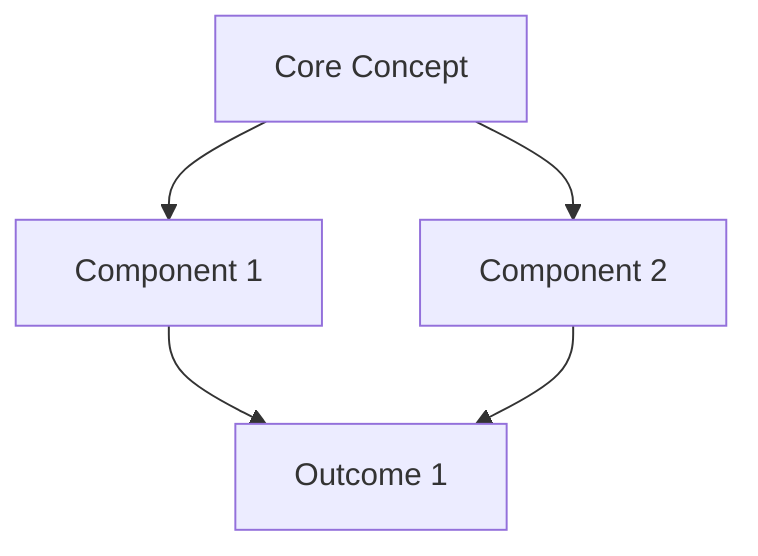

# <% tp.file.title %>

> [!definition] Research Question
> **Primary Question**: <% tp.frontmatter.research_topic %>
> 
> **Sub-Questions:**
> 1. 
> 2. 
> 3. 

## 🎯 Research Objectives

**Primary Aim:**

**Specific Objectives:**
1. 
2. 
3. 

**Hypothesis** *(if applicable)*:

---

## 📚 Literature Map

> [!methodology-and-sources] Search Strategy
> **Databases**: [Specify: PubMed, Google Scholar, JSTOR, etc.]
> **Search Terms**: 
> **Inclusion Criteria**: 
> **Exclusion Criteria**: 
> **Date Range**: 

### Key Sources by Theme

#### Theme 1: [Conceptual Framework]

| Source | Author(s) | Year | Key Argument | Relevance | Link |
|--------|-----------|------|--------------|-----------|------|
| | | | | 🔴 High | [[]] |
| | | | | 🟠 Medium | [[]] |

#### Theme 2: [Methodological Approaches]

| Source | Author(s) | Year | Key Argument | Relevance | Link |
|--------|-----------|------|--------------|-----------|------|
| | | | | 🔴 High | [[]] |
| | | | | 🟠 Medium | [[]] |

#### Theme 3: [Empirical Findings]

| Source | Author(s) | Year | Key Argument | Relevance | Link |
|--------|-----------|------|--------------|-----------|------|
| | | | | 🔴 High | [[]] |
| | | | | 🟠 Medium | [[]] |

---

## 🧩 Theoretical Framework

> [!principle-point] Foundational Theories
> *Identify 2-3 core theoretical perspectives informing your research*

### Theory 1: [[Theory Name]]

**Core Principles:**
- 

**Application to Research:**
- 

**Key Proponents:**
- 

### Theory 2: [[Theory Name]]

**Core Principles:**
- 

**Application to Research:**
- 

**Key Proponents:**
- 

---

## 📊 Emerging Patterns & Themes

### Convergent Findings

> [!evidence] Areas of Consensus
> *What do multiple sources agree on?*

1. **Finding**: 
   - **Supporting Sources**: [[@Source1]], [[@Source2]], [[@Source3]]
   - **Strength of Evidence**: 

2. **Finding**: 
   - **Supporting Sources**: 
   - **Strength of Evidence**: 

### Divergent Perspectives

> [!counter-argument] Contradictions & Debates
> *Where do sources disagree or present competing views?*

**Debate 1:**
- **Position A**: [Summary] - [[@Source]]
- **Position B**: [Summary] - [[@Source]]
- **Your Synthesis**: 

**Debate 2:**
- **Position A**: 
- **Position B**: 
- **Your Synthesis**: 

### Research Gaps Identified

> [!attention] Opportunities for Contribution
> *What hasn't been adequately addressed?*

1. **Gap**: 
   - **Why It Matters**: 
   - **Potential Approach**: 

2. **Gap**: 
   - **Why It Matters**: 
   - **Potential Approach**: 

---

## 💡 Synthesis & Original Insights

### Conceptual Model

> [!thought-experiment] Integrated Framework
> *How do the pieces fit together? What new understanding emerges?*

*Narrative explanation of the model:*

### Novel Contributions

**Contribution 1:**

**Contribution 2:**

---

## 🔬 Methodology Design

### Research Design

**Approach**: <% tp.frontmatter.methodology %>

**Rationale**:

### Data Sources

| Source Type | Description | Access Method | Status |
|-------------|-------------|---------------|--------|
| | | | |

### Analysis Plan

**Phase 1**: 
- 

**Phase 2**: 
- 

**Phase 3**: 
- 

---

## ✍️ Argument Structure Outline

> [!key-claim] Central Thesis
> *Your main argumentative claim*

### Supporting Arguments

**Argument 1:**
- **Claim**: 
- **Evidence**: 
- **Reasoning**: 

**Argument 2:**
- **Claim**: 
- **Evidence**: 
- **Reasoning**: 

**Argument 3:**
- **Claim**: 
- **Evidence**: 
- **Reasoning**: 

### Counterarguments & Rebuttals

**Potential Objection 1:**
- **Objection**: 
- **Rebuttal**: 

---

## 📅 Research Timeline & Milestones

| Phase | Tasks | Deadline | Status |
|-------|-------|----------|--------|
| Literature Review | Identify 50 key sources | <% moment(tp.date.now("YYYY-MM-DD")).add(30, 'days').format("YYYY-MM-DD") %> | 🟡 |
| Framework Development | Complete theoretical synthesis | <% moment(tp.date.now("YYYY-MM-DD")).add(45, 'days').format("YYYY-MM-DD") %> | ⚪ |
| Data Collection | | <% moment(tp.date.now("YYYY-MM-DD")).add(60, 'days').format("YYYY-MM-DD") %> | ⚪ |
| Analysis | | <% moment(tp.date.now("YYYY-MM-DD")).add(75, 'days').format("YYYY-MM-DD") %> | ⚪ |
| First Draft | | <% moment(tp.date.now("YYYY-MM-DD")).add(90, 'days').format("YYYY-MM-DD") %> | ⚪ |

---

## 🔗 Connected Research

**Related Projects:**
- [[Project Name 1]]
- [[Project Name 2]]

**Key Concept Notes:**
- [[Core Concept 1]]
- [[Core Concept 2]]

**Methodological References:**
- [[Research Method 1]]
- [[Statistical Technique]]

---

## 📝 Writing Workspace

### Introduction Draft

### Methods Draft

### Results Draft

### Discussion Draft

---

*Research Log Updated: <% tp.date.now("YYYY-MM-DD HH:mm") %>*