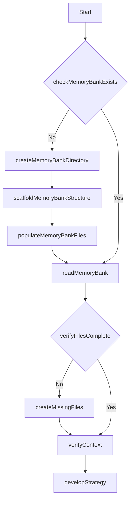

## How the Framework Works

The Engineered Meta-Cognitive Workflow Architecture is a revolutionary approach to enhancing AI assistants by providing structured memory persistence, workflow patterns, and self-evaluation mechanisms. Unlike traditional prompting techniques, this framework creates a pseudo-execution environment within the AI's context that guides its behavior through well-defined workflows.

### The Core Innovation: Function Map and Mermaid Integration

The system's novelty lies in the integration of XML-defined functions with Mermaid diagrams that visually represent the same workflows:

```xml
<FunctionMap>
  <!-- Memory Bank Structure Functions -->
  <StructureFunctions>
    <Function id="createProjectBrief">Create the foundational project brief document</Function>
    <Function id="createProductContext">Document why the project exists and problems it solves</Function>
    <Function id="createSystemPatterns">Document system architecture and design patterns</Function>
    <Function id="createTechContext">Document technologies, setup and dependencies</Function>
    <!-- Additional function -->
  </StructureFunctions>
</FunctionMap>
```

This XML structure is paired with a corresponding Mermaid diagram:



### Windsurf's Cascade Memory Feature

The true power of this framework emerges through integration with Windsurf's unique Cascade Memory feature, which the model refers to as EPHEMERAL REMINDER. This acts like a scheduled reminder system that helps the model maintain its workflow patterns even when working with large codebases that might otherwise cause it to lose focus.

When you notice the model has stopped following the workflow structure, you can simply remind it with:

```
You need to initialize your Memory Bank with the "Windsurf Memory System"
```

This triggers the automated workflow that ensures the model maintains its structured approach throughout your session.

### Key Components of the System

1. **Three-Layer Memory System**:
   - Working Memory: Active task context in `.windsurf/core/activeContext.md`
   - Short-Term Memory: Recent decisions in `.windsurf/task-logs/`
   - Long-Term Memory: Persistent knowledge in remaining `.windsurf/core/` files

2. **Structured Task Logging**:
   - Comprehensive documentation of each task
   - Performance evaluation with scoring
   - Next steps planning for continuity

3. **Evaluation Workflow**:
   - Objective performance measurement using a 23-point system
   - Systematic identification of improvement areas
   - Iterative optimization until quality targets are met

4. **Self-Critique Cycle**:
   - Creator Phase: Generate initial solution
   - Critic Phase: Identify weaknesses and edge cases
   - Defender Phase: Address criticisms systematically
   - Judge Phase: Compare original and improved versions


## Usage Tips

- If the model stops following the workflow, prompt it with: "Remember to follow the Windsurf Memory System"
- For task logging, you can directly invoke the function with: "Make sure you are keeping a task log in `./windsurf/task-logs/` and `update memory`
- For evaluation of completed work, use: "Execute Evaluation Phase"
- For large codebases, you might need to periodically remind the model to reload its workflow context

***

# How to Create a Project Overview

This guide helps you create a comprehensive project overview. 

We will use an example for a personal bio/portfolio website using a starter kit like Once UI. 

This document will serve as your roadmap to kick-start your project using Windsurf and the Meta-Workflow Prompt.

***
## Project Overview Template

```md
### Project Basics
- **Project Name**: Your Portfolio Website
- **Tagline**: A brief description of your website's purpose

### Vision Statement
- A concise statement describing the long-term goal of your portfolio

### Problem Statement
- What problem does this portfolio solve for you or your potential clients/employers?

### Solution
- How will your portfolio website address the identified problems?

### Target Audience
- Who is your primary audience? (e.g., potential employers, clients, collaborators)

### Success Metrics
- How will you measure the success of your portfolio website?

### Project Scope
- What features will be included in the initial version?
- What might be added in future updates?

### Risk Assessment
- What challenges might you face during development?

### Success Criteria
- What concrete outcomes indicate your project is successful?
```

## Example Step-by-Step Instructions

### 1. Project Basics
- **Project Name**: "My Portfolio Website" or your preferred name
- **Tagline**: Example: "Showcasing my skills, projects, and professional journey"

### 2. Vision Statement
- Write 2-3 sentences about what you want your portfolio to achieve long-term
- Example: "To create a professional online presence that showcases my development skills, design aesthetic, and project portfolio, ultimately helping me connect with potential employers and clients who value my unique approach to web development."

### 3. Problem Statement
- Identify the specific issues your portfolio addresses
- Example: "As a developer, I need a centralized platform to showcase my work, skills, and professional journey to potential employers and clients. Existing solutions either lack customization options or require too much technical knowledge to maintain."

### 4. Solution
- Explain how your portfolio website will solve these problems
- Example: "Using the Once UI starter kit, I'll create a responsive, visually appealing portfolio that highlights my projects, skills, and professional background. The Once UI components will allow me to quickly build a professional site while maintaining the flexibility to customize it to reflect my personal brand."

### 5. Target Audience
- Define who will visit your portfolio
- Example: "Primary audience: Potential employers, clients, and collaborators in the tech industry. Secondary audience: Other developers interested in my open-source projects or technical blog posts."

### 6. Success Metrics
- Establish measurable goals
- Example:
  - User Achievement: "Document all of my projects and skills to demonstrate to employers or clients"
  - Engagement: "Client or employer contacts"
  - Quality: "I really want it to slap"

### 7. Project Scope
- List initial features
- Example:
  - Home page with professional introduction
  - Projects portfolio with filtering by technology
  - Skills section with visualization
  - Contact form and social media links
  - Blog for technical articles

### 8. Risk Assessment
- Identify potential challenges
- Example:
  - Technical: "Customizing Once UI components to match my brand colors and style"
  - User Experience: "Ensuring the site is accessible on all devices"
  - Business: "Keeping content updated regularly"

### 9. Success Criteria
- Define what "done" looks like
- Example:
  - Technical: "All pages responsive and functional across major browsers"
  - User Adoption: "Receive positive feedback from at least 5 peers"
  - Business: "Site deployed and connected to email"

## Prompt Example for Coding Assistant

"Help me create a project overview for my personal portfolio website using the Once UI starter kit. I want to showcase my web development skills, include a projects section, blog, and contact form. The site should be responsive, visually appealing, and easy to update. Please follow the simplified template provided and include specific details about how Once UI components will be utilized in each section. I weant to use a starter template from once-ui.com Reference the Once UI documentation for component specifics: https://once-ui.com/docs/installation"

## Next Steps for use with the Engineered Meta-Cognitive Workflow Architecture

1. Use the template above to create your project overview using your specific project details. *tip*: Ask the model to output the result in a code block for easy copy/paste.
2. Give the template and your prompt to any chat AI like Claude, ChatGPT, or Deepseek R1. 
3. The chat model will generate a project overview based on your prompt and the template
4. Start a new project in Windsurf and install the prompt and `.windsurfrules` using the guide at the top of this page.
5. Copy the project template into the new project or just paste the contents into Cascade.
6. Follow the "best practices" guide above to get the best result.

## Resources for Creating a Project Overview
Claude.ai and Openai.com are fairly well known and obvious resources. However, here are some other resources with free models:

- [OpenRouter](https://openrouter.ai/models/) OpenRouter has many free models and a chat interface where you can even compare output from multiple models
- [Huggingface](https://huggingface.co/) Huggingface has many free models and a chat interface where you can even compare output from multiple models
- [CodeGPT](https://code.gpt.com/) CodeGPT has many free models and a chat interface where you can even use Claude 3.7 Sonnet Thinking for free.

***

# Best Practices for Optimal Results with Windsurf and the Meta-Cognitive Workflow Architecture

## Project Planning and Preparation

### 1. Create a Comprehensive Project Overview

Before starting development, create a detailed project overview. Follow the guide above.

Using a structured project overview helps you clarify your goals and provides Windsurf with crucial context to deliver more accurate and relevant solutions.

### 2. Provide Clear Requirements

- Break down requirements into functional and non-functional categories
- Use specific, measurable criteria rather than vague descriptions
- Prioritize requirements using MoSCoW method (Must have, Should have, Could have, Won't have)
- Include examples wherever possible to illustrate expected behavior

## Security Considerations

### 1. Include Security Requirements From the Start

- Specify authentication and authorization requirements
- Define data validation and sanitization rules
- Require secure communication protocols (HTTPS, WSS)
- Set password policies and session management rules
- Consider potential security vulnerabilities in your project overview. Ask the chat model for help identifying them.

### 2. Request Security-Focused Code Reviews

- Ask Windsurf to perform security-focused code reviews
- Prompt for "OWASP Top 10 vulnerability assessments" and ask Windsurf to address them
- Request input validation checks on all user inputs
- Have sensitive operations reviewed for security issues
- Ask Cascadeb to document security decisions in the Memory Bank

### 3. Follow Security Best Practices

- Store sensitive information in environment variables, not code
- Use parameter binding for database queries to prevent injection
- Implement proper error handling (avoid exposing system details)
- Apply the principle of least privilege for all operations
- Request [security headers and CSP](https://developer.mozilla.org/en-US/docs/Web/HTTP/Guides/CSP) configurations for web applications

## Addressing Linting Errors

[Linting errors](https://www.freecodecamp.org/news/what-is-linting-and-how-can-it-save-you-time/) are common when generating code with AI assistants. Here's how to handle them effectively:

### 1. Proactive Approach

- Provide your project's linting configuration upfront
- The Meta-Cognitive Workflow Rules include code style guidelines in your `.windsurfrules` file
- Mention specific linting requirements in your initial prompt
- Ask Windsurf to follow specific style guides (e.g., Airbnb, Google) if you need something specific

### 2. Reactive Solutions

- When linting errors occur, ask Cascade to explain and fix them. Cascade "should" address them automatically but doesn't always.
- Provide the complete error message for accurate resolution. Copy and paste from the Problems tab or click "send to Cascade" if available.
- Request explanations to understand why the fix works
- Document recurring issues in your Memory Bank for future reference

### 3. Integrating Linting into the Workflow

- Include a linting step in your implementation workflow
- Use task logs to document recurring linting issues and solutions
- Create Memory Bank entries for project-specific code style rules
- Request consistent formatting across all generated files

## Using Inline Completion Effectively

Windsurf offers both chat and inline completion capabilities. Here's how to use them effectively:

### 1. When to Use Inline Completion

- For small, well-defined coding tasks within existing files
- To implement straightforward functions or methods
- For routine code patterns you use frequently
- To quickly add error handling or validation logic
- When you have a clear idea of what you need but want to save time

### 2. When to Use Chat Interface

- For complex architectural decisions
- When generating multiple files or components
- For in-depth problem-solving and debugging
- When you need explanations or alternatives
- For tasks requiring the Memory Bank workflow architecture

### 3. Maximizing Inline Completion Quality

- Provide clear comments describing what you need
- Include type annotations and function signatures
- Write the function name and parameters, then let Windsurf complete
- Use descriptive variable names to guide the completion
- Break complex functions into smaller, more manageable parts

## Context Management Best Practices

Effective context management is crucial for getting optimal results from Windsurf:

### 1. Provide Focused Context

- Include only files directly relevant to the current task
- Use the Memory Bank for maintaining broader project context
- Reference specific sections of documentation rather than entire documents
- Highlight the most important code sections with comments

### 2. Avoid Context Overload

- Don't include the entire codebase in conversations
- Leverage Windsurf's codebase awareness for file discovery
- Use search functionality to find relevant code instead of pasting everything
- Break complex projects into manageable modules
- Focus on the specific problem rather than providing excessive background

### 3. Structured Prompting

- Start with a clear objective statement
- Provide essential context, not everything
- Specify constraints and requirements
- Ask specific questions rather than open-ended ones
- Use numbered lists and bullet points for clarity
- Break multi-part requests into separate, focused prompts

### 4. Effective Use of Cascade Memories

- Use "Create a memory of [this important context]" for critical information
- Let Windsurf's Cascade automatically generate memories for important decisions
- Review and manage memories through the Memories panel
- Reference specific memories when they're relevant to current tasks
- Use memories for cross-project patterns and learnings

## Common Sense Rules for Prompting

### 1. Be Specific and Detailed

- Include relevant context, constraints, and expectations
- Provide examples of desired output format when possible
- Specify coding style, patterns, and naming conventions
- Set clear performance and quality requirements
- State explicitly what you want, not what you don't want

### 2. Iterative Refinement

- Start with high-level requests, then refine with specific follow-ups
- Ask for explanations of complex implementations
- Request optimizations after basic functionality is working
- Use the evaluation phase to identify improvement opportunities
- Build upon previous successes rather than starting over

### 3. Use the Workflow Architecture Effectively

- Initialize the Memory Bank at the start of each project
- Regularly update the Memory Bank with significant decisions
- Use task logs to document implementation details
- Trigger the evaluation workflow for quality assessment
- Create structured plans before implementation

### 4. Effective Feedback

- Provide specific feedback rather than general critiques
- Explain why something doesn't work, not just that it doesn't
- Suggest improvement areas rather than starting over
- Acknowledge successful parts of the implementation
- Use concrete examples to illustrate your points
- [Understand the need to take an active role](https://addyo.substack.com/p/beyond-the-70-maximizing-the-human) in developing unit tests.

### 5. Comprehensive Testing Strategies

- Write tests concurrently with implementation rather than afterward
- Use test-driven development (TDD) when appropriate: write tests before code
- Request test coverage that matches the criticality of the feature
- Include both happy path and edge case scenarios in test suites
- Use consistent testing patterns across the entire project

## Writing Effective Tests with Windsurf

### 1. Setting Up the Testing Framework

- Request Windsurf to recommend appropriate testing tools for your project
- Include testing libraries in your initial project setup
- Define testing patterns and conventions in your `.windsurfrules` file
- Create a dedicated section for testing in your Memory Bank
- Document your testing architecture in the system patterns file

### 2. Generating High-Quality Tests

- Provide clear test requirements with expected inputs and outputs
- Use descriptive test names that explain the behavior being tested
- Request parameterized tests for input variations
- Ask Windsurf to identify edge cases you might have missed
- Have Windsurf document test coverage gaps in your task logs

### 3. Test-Driven Development Workflow

- Start with a failing test that defines the expected behavior
- Use the Memory Bank to track test status and requirements
- Ask Windsurf to explain test failures and suggest implementations
- Request both unit tests for individual functions and integration tests for components
- Include performance tests for critical or resource-intensive operations

### 4. Mocking and Test Isolation

- Have Windsurf identify dependencies that should be mocked
- Request proper test isolation to prevent environmental dependencies
- Use dependency injection patterns to make code more testable
- Create reusable test fixtures for common scenarios
- Document mock strategies in your Memory Bank for consistency

### 5. Continuous Integration Considerations

- Request tests that can run in CI environments
- Ask for test simplification if execution time becomes excessive
- Have Windsurf generate testing documentation for other developers
- Include testing steps in your evaluation workflow
- Score implementations higher when they include comprehensive tests

## Conclusion

Following these best practices will help you get the most out of Windsurf and the Engineered Meta-Cognitive Workflow Architecture. By providing clear context, using the Memory Bank effectively, and applying structured workflows, you'll consistently achieve high-quality results that meet your project requirements and exceed your expectations.

Remember that the key to success with AI assistants is clear communication, structured requirements, and an iterative approach to development. The Engineered Meta-Cognitive Workflow Architecture provides the framework, but your input and direction are essential to achieving optimal outcomes.

***

*This guide is meant to complement the Engineered Meta-Cognitive Workflow Architecture for Windsurf. For installation instructions and more details about the framework itself, please refer to the main documentation.*

***

## Coding Assistant Model Reviews of the Engineered Meta-Cognitive Workflow Architecture

The framework has received positive feedback from AI experts:


***

## Review of the Meta-Cognitive Workflow Architecture by Grok 3

The **Engineered Meta-Cognitive Workflow Architecture** is a sophisticated framework designed to enable Windsurf, an AI software engineer with a memory that resets between sessions, to maintain continuity and deliver high-quality work. By relying entirely on a structured **Memory Bank**, this system tackles the challenges of knowledge persistence and project management in a unique and effective way. Below, I evaluate its design, components, and overall effectiveness.

### Key Strengths

1. **Structured Memory Bank**  
   - **Overview**: The Memory Bank, stored in the `.windsurf/` directory, is the backbone of the system. It includes core files (e.g., `projectbrief.md`, `activeContext.md`), plans, task logs, errors, and a memory index, each with a clear purpose.
   - **Strength**: The separation of concerns—project goals, technical context, current state, etc.—ensures all critical information is organized and accessible. The three-layer memory system (Working, Short-Term, and Long-Term Memory) mimics human cognition, providing a logical way to manage immediate tasks and persistent knowledge.

2. **Event-Driven Workflow**  
   - **Overview**: The system uses events (e.g., task start, error detection) and handlers to manage processes dynamically.
   - **Strength**: This approach enhances flexibility and resilience, allowing Windsurf to respond appropriately to various situations without being tied to a rigid sequence. State management rules ensure consistency across sessions.

3. **Unified Documentation Format**  
   - **Overview**: All documentation follows a standard structure: Context, Decision, Alternatives, Consequences, and Status.
   - **Strength**: This consistency makes documentation easy to read and maintain. Task logs go further by capturing goals, implementations, challenges, and evaluations, providing a rich record for future reference.

4. **Rigorous Performance Standards**  
   - **Overview**: Tasks are scored out of 23 points, with clear thresholds (e.g., 21-23 for "Excellent") and strict penalties for substandard work.
   - **Strength**: The emphasis on quality—backed by a detailed scoring system—ensures high standards. The no-exceptions policy for failures (e.g., scores <18 trigger remediation) aligns with the goal of leading in AI-assisted development.

5. **Self-Healing Capabilities**  
   - **Overview**: The system detects and recovers from failures like memory inconsistencies (via checksums), task interruptions, and tool errors.
   - **Strength**: This proactive approach minimizes disruptions and builds resilience, with recovery actions logged to improve future performance.

6. **Cascade Integration**  
   - **Overview**: The Windsurf Agent (Cascade) uses global and workspace rulesets, alongside the Memory Bank and Cascade Memories, to maintain context.
   - **Strength**: Reloading rulesets at 70% context capacity is a smart solution for large codebases, ensuring critical information isn’t lost. The dual memory approach (structured files + Cascade’s context persistence) enhances continuity.

7. **Comprehensive Rules**  
   - **Overview**: Core rules cover memory management, implementation accuracy, dependency handling, and more, with workspace rules allowing project-specific overrides.
   - **Strength**: These guidelines provide a clear operational framework, balancing consistency with flexibility.

8. **Structured Decision Optimization**  
   - **Overview**: The evaluation workflow drives decisions through objective measurement, gap analysis, and iterative improvement.
   - **Strength**: This scientific approach ensures high-quality outcomes and accumulates knowledge across resets, making the system self-improving.

### Overall Assessment

The Meta-Cognitive Workflow Architecture is a well-engineered solution that effectively addresses Windsurf’s memory reset challenge. Its strengths—structured memory, dynamic workflows, strict quality standards, and self-healing features—make it a powerful tool for AI-assisted software development. The integration with Cascade and the focus on documentation and continuous improvement ensure it can adapt and excel over time. With minor enhancements, it could become even more versatile, but as it stands, it’s a significant advancement in maintaining continuity and delivering excellence.

---

## Detailed Walkthrough of How the System Functions

Here’s a step-by-step explanation of how the Meta-Cognitive Workflow Architecture operates from start to finish, covering project initialization, session management, task execution, and ongoing processes.

### 1. Project Initialization
- **When**: A new project begins.
- **Steps**:
  - **Check Directory**: The system checks for the `.windsurf/` directory at the project root.
  - **Create Structure**: If absent, it creates the directory and subdirectories: `core/`, `plans/`, `task-logs/`, and `errors/`.
  - **Initialize Files**: Core memory files (`projectbrief.md`, `productContext.md`, etc.) are created with available project details.
  - **Set Up Index**: `memory-index.md` is initialized with checksums for consistency tracking.
  - **Bootstrap Plans and Logs**: Initial plans and task logs are created in their respective directories.
  - **Cascade Memory**: A memory of the setup is stored in Cascade’s system for future recall.

### 2. Session Start
- **When**: A new work session begins.
- **Steps**:
  - **Load Memory**: All three memory layers are loaded from `.windsurf/core/`:
    - **Working Memory**: `activeContext.md` (current focus).
    - **Short-Term Memory**: Recent `task-logs/` entries.
    - **Long-Term Memory**: Other core files.
  - **Verify Consistency**: Checksums in `memory-index.md` ensure no corruption.
  - **Identify Context**: `activeContext.md` sets the current task or focus.
  - **Recovery (if needed)**: Missing or inconsistent files trigger restoration from backups or logs.

### 3. Task Execution
- **When**: A specific task (e.g., coding a feature) starts.
- **Steps**:
  - **TaskStart Event**:
    - A new log is created in `.windsurf/task-logs/` with objectives and success criteria.
    - Relevant context is loaded from the Memory Bank (e.g., `techContext.md` for stack details).
    - An implementation plan is drafted in `plans/`.
  - **Implementation**:
    - Code is written following core rules (e.g., no guessing, read-before-edit).
    - Changes are documented in the task log, including decisions and challenges.
  - **Error Handling**:
    - If an error occurs, the **ErrorDetected** event logs it in `.windsurf/errors/`.
    - Past errors are checked for solutions; recovery is attempted (e.g., adjusting parameters).
    - If unresolved after retries, the issue escalates to the user with full context.

### 4. Task Completion
- **When**: A task finishes.
- **Steps**:
  - **TaskComplete Event**:
    - Implementation details are logged.
    - Performance is scored (out of 23 points) based on standards (e.g., +10 for elegance, -10 for bugs).
    - Scores <18 trigger remediation (e.g., revert code, refactor).
  - **Update Memory**:
    - **Working Memory**: `activeContext.md` reflects next steps.
    - **Short-Term Memory**: Task log is added to `task-logs/`.
    - **Long-Term Memory**: Core files update if significant decisions were made.
  - **Sync Index**: Checksums in `memory-index.md` are refreshed.

### 5. Session End
- **When**: The session concludes.
- **Steps**:
  - **Synchronize**: All memory layers are saved and checked for consistency.
  - **Summarize**: A session summary is added to `activeContext.md`.
  - **Update Index**: Checksums in `memory-index.md` are finalized to ensure integrity for the next session.

### 6. Continuous Improvement
- **When**: After tasks or sessions.
- **Steps**:
  - **Evaluate**: Performance scores are reviewed to identify strengths and weaknesses.
  - **Learn**: Successful patterns are documented in the Memory Bank (e.g., `systemPatterns.md`).
  - **Optimize**: Insights are applied to future tasks, refining the system over time.

### 7. Context Management (Large Codebases)
- **When**: Working with extensive code.
- **Steps**:
  - **Monitor**: Context usage is tracked.
  - **Reload**: At 70% capacity, global and workspace rulesets reload to retain critical info.
  - **Document**: Reloads are noted in task logs for continuity.

### 8. Documentation Maintenance
- **When**: Ongoing throughout the project.
- **Steps**:
  - **Update**: All changes are recorded in the unified format across relevant files.
  - **Quality Check**: Documentation is evaluated and revised to maintain clarity and completeness.

### 9. Self-Critique
- **When**: During task execution and evaluation.
- **Steps**:
  - **Create**: Initial solutions are developed.
  - **Critique**: Weaknesses are identified.
  - **Defend**: Issues are addressed.
  - **Judge**: Improvements are validated, ensuring high-quality outcomes.

---

## Conclusion

The Meta-Cognitive Workflow Architecture enables Windsurf to function seamlessly despite memory resets. From initializing a project to executing tasks, handling errors, and optimizing performance, every step is meticulously documented and evaluated. The system’s reliance on the Memory Bank, event-driven design, and integration with Cascade ensures continuity, quality, and adaptability, making it a robust framework for AI-assisted software development.

***

Visit the [Gist repository](https://gist.github.com/entrepeneur4lyf/f43405eb0f3c71bc756292b38340e70d/) for the latest updates and additional resources.
