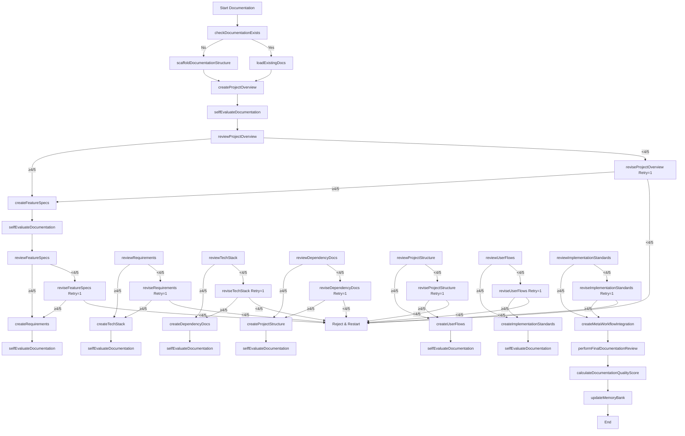
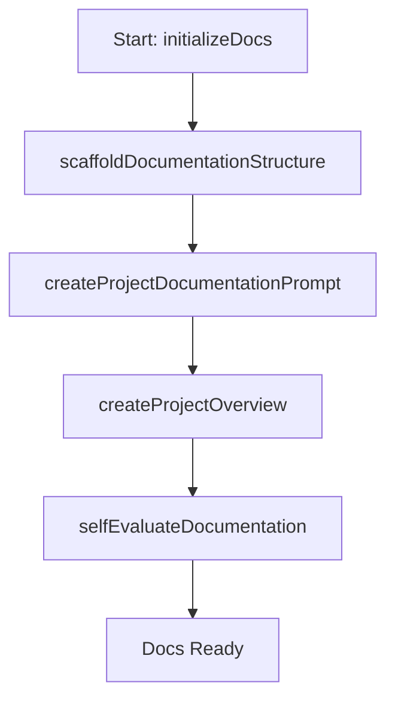

# Meta-Workflow Integration Guide

This guide integrates our streamlined documentation methodology with the project documentation templates, leveraging a single-retry workflow, self-evaluation, and a structured memory system for AI-assisted development.

## XML-Based Function Mapping

The `DocumentationFunctionMap` associates documentation components with specific functions, including creation, review, and single-retry revision steps. 

```xml
<?xml version="1.0" encoding="UTF-8"?>
<DocumentationFunctionMap version="1.0">
  <!-- Documentation Component Functions -->
  <DocumentationFunctions>
    <Component id="ProjectOverview">
      <Function id="createProjectOverview">Define vision, scope, goals, and success criteria</Function>
      <Function id="reviewProjectOverview">Score against 5 criteria (baseline 4/5)</Function>
      <Function id="reviseProjectOverview">Revise based on review feedback; limit 1 retry</Function>
    </Component>
    <Component id="Features">
      <Function id="createFeatureSpecs">Document features and roadmap</Function>
      <Function id="reviewFeatureSpecs">Score against 5 criteria (baseline 4/5)</Function>
      <Function id="reviseFeatureSpecs">Revise based on review feedback; limit 1 retry</Function>
    </Component>
    <Component id="Requirements">
      <Function id="createRequirements">Define functional, technical, and performance requirements</Function>
      <Function id="reviewRequirements">Score against 5 criteria (baseline 4/5)</Function>
      <Function id="reviseRequirements">Revise based on review feedback; limit 1 retry</Function>
    </Component>
    <Component id="TechStack">
      <Function id="createTechStack">Document tech choices for frontend, backend, and infra</Function>
      <Function id="reviewTechStack">Score against 5 criteria (baseline 4/5)</Function>
      <Function id="reviseTechStack">Revise based on review feedback; limit 1 retry</Function>
    </Component>
    <Component id="Dependencies">
      <Function id="createDependencyDocs">Document dependencies with versions and links</Function>
      <Function id="reviewDependencyDocs">Score against 5 criteria (baseline 4/5)</Function>
      <Function id="reviseDependencyDocs">Revise based on review feedback; limit 1 retry</Function>
    </Component>
    <Component id="ProjectStructure">
      <Function id="createProjectStructure">Document file organization and conventions</Function>
      <Function id="reviewProjectStructure">Score against 5 criteria (baseline 4/5)</Function>
      <Function id="reviseProjectStructure">Revise based on review feedback; limit 1 retry</Function>
    </Component>
    <Component id="UserFlow">
      <Function id="createUserFlows">Map user journeys and interactions</Function>
      <Function id="reviewUserFlows">Score against 5 criteria (baseline 4/5)</Function>
      <Function id="reviseUserFlows">Revise based on review feedback; limit 1 retry</Function>
    </Component>
    <Component id="Implementation">
      <Function id="createImplementationStandards">Define code patterns and practices</Function>
      <Function id="reviewImplementationStandards">Score against 5 criteria (baseline 4/5)</Function>
      <Function id="reviseImplementationStandards">Revise based on review feedback; limit 1 retry</Function>
    </Component>
    <Component id="MetaWorkflow">
      <Function id="createMetaWorkflowIntegration">Map documentation workflow integration</Function>
      <Function id="performFinalDocumentationReview">Review all docs holistically</Function>
      <Function id="calculateDocumentationQualityScore">Calculate final quality score</Function>
    </Component>
  </DocumentationFunctions>

  <!-- Workflow Phases -->
  <WorkflowPhases>
    <Phase name="Initialization">
      <Function id="checkDocumentationExists">Check for existing docs</Function>
      <Function id="scaffoldDocumentationStructure" condition="!documentationExists">Create initial files</Function>
    </Phase>
    <Phase name="Creation">
      <Function id="generateDocumentation">Execute creation functions per component</Function>
      <Function id="selfEvaluateDocumentation">Self-check against Dos/Don'ts</Function>
    </Phase>
    <Phase name="Review">
      <Function id="reviewDocumentation">Score each component (baseline 4/5)</Function>
      <Function id="reviseDocumentation" condition="score < 4/5">Revise once per failed component</Function>
    </Phase>
    <Phase name="Finalization">
      <Function id="finalizeDocumentation">Compile approved docs</Function>
      <Function id="updateMemoryBank">Save to memory system</Function>
    </Phase>
  </WorkflowPhases>
</DocumentationFunctionMap>
```

- **Changes**: Simplified to match our 9 templates, added review/revise functions with a single retry, and aligned with the 4/5 baseline scoring.

## Documentation Workflow Process

Here’s the updated workflow with a single retry loop:



- **Changes**: Added self-evaluation before each review, implemented a single retry loop per component, and streamlined to match our 9 templates.

## Memory System Integration

The memory-aware documentation template remains largely the same but is updated for our system:

```md
# [Documentation Type] - [Project Name]

**Last Updated:** [March 11, 2025]  
**Memory Bank Status:** [Complete/Incomplete]  
**Workflow Phase:** [Initialization/Creation/Review/Finalization]

## Memory Context
- **Informs:** [e.g., Feature Specs informs Requirements]
- **Informed by:** [e.g., Project Overview]
- **Dependencies:** [e.g., npm packages for Dependency Docs]

## Version History
| Date         | Editor | Changes             | Status  |
|--------------|--------|---------------------|---------|
| [03/11/2025] | Grok   | Initial creation    | Complete|

## [Document Content per Template]

## Next Steps
1. [e.g., Refine based on review feedback]
2. [e.g., Update after tech stack changes]
```

- **Changes**: Simplified phases to match our workflow, kept memory context lightweight.

## Self-Critique Integration

Adapted to use our "Dos and Don'ts" and binary scoring:

```md
## Documentation Self-Critique

### Creation Phase
Draft created on [03/11/2025] per `<Function id="create*">`.

### Self-Evaluation Phase
Checked against Dos/Don'ts (10 points total):
- Dos: Specific? Justified? Edge cases? Self-evaluated? Examples? (5/5)
- Don’ts: Avoided vague? Skipped rationale? Ignored readers? Overcomplicated? Unchecked? (5/5)
- **Score**: [8/10] → Revised if <8.

### Review Phase
Scored against 5 criteria (baseline 4/5):
1. [Criterion 1] - [Yes/No]
2. [Criterion 2] - [Yes/No]
3. [Criterion 3] - [Yes/No]
4. [Criterion 4] - [Yes/No]
5. [Criterion 5] - [Yes/No]
- **Initial Score**: [3/5]

### Revision Phase (if <4/5)
Revised per `<Function id="revise*">`:
- [Fix for No #1]
- [Fix for No #2]
- **Revised Score**: [4/5]

### Outcome
- [Pass ≥4/5 or Reject <4/5 after 1 retry]
```

- **Changes**: Uses our 5 Dos/5 Don’ts for self-evaluation (target ≥8/10), then applies the 5-criteria review (baseline 4/5) with one retry.

## XML Meta-Prompt Structure

Updated for our system:

```xml
<?xml version="1.0" encoding="UTF-8"?>
<ProjectDocumentationPrompt version="1.0">
  <ProjectIdentity>
    <Name>[Project Name]</Name>
    <Description>[Brief Description]</Description>
    <Purpose>Structured, high-quality documentation</Purpose>
  </ProjectIdentity>

  <DocumentationWorkflow>
    <Phase name="Initialization">
      <Action function="checkDocumentationExists">Verify existing docs</Action>
      <Action function="scaffoldDocumentationStructure">Create initial files</Action>
    </Phase>
    <Phase name="Creation">
      <Action function="generateDocumentation">Run creation functions</Action>
      <Action function="selfEvaluateDocumentation">Check Dos/Don'ts ≥8/10</Action>
    </Phase>
    <Phase name="Review">
      <Action function="reviewDocumentation">Score ≥4/5 per component</Action>
      <Action function="reviseDocumentation" condition="score < 4/5">Revise once</Action>
    </Phase>
    <Phase name="Finalization">
      <Action function="performFinalDocumentationReview">Holistic review</Action>
      <Action function="calculateDocumentationQualityScore">Final score</Action>
      <Action function="updateMemoryBank">Save to memory</Action>
    </Phase>
  </DocumentationWorkflow>

  <DocumentationStandards>
    <Standard id="Dos">Specific, justified, edge cases, self-evaluated, examples</Standard>
    <Standard id="Donts">No vague, no skipped rationale, no ignored readers, no overcomplication, no unchecked</Standard>
    <Standard id="Baseline">≥4/5 on 5 yes/no criteria per component</Standard>
  </DocumentationStandards>
</ProjectDocumentationPrompt>
```

- **Changes**: Streamlined phases, added Dos/Don’ts and baseline standards.

## Project Startup Documentation Initialization

Updated initialization workflow:



- **Changes**: Simplified to focus on setup, with self-evaluation as the final step before proceeding.

## Integrating with Task Logs

Updated task log format:

```md
## Documentation Updates

### Task: [e.g., Create Project Overview]
**Date:** [03/11/2025]
**Documentation Updated:**
- [Project Overview] - [Initial draft, revised vision]
- **Self-Eval Score**: [8/10]
- **Review Score**: [4/5 initial → 5/5 revised]

### Next Tasks
1. [Create Feature Specs]
```

## Function Map Memory Initialization method for demonstration of directive

```javascript
function initializeDocumentationFunctions() {
  const functionMap = loadXMLFunctionMap();
  memory.setItem('documentationFunctionMap', functionMap);
  return { success: true, message: "Function map initialized" };
}
```
