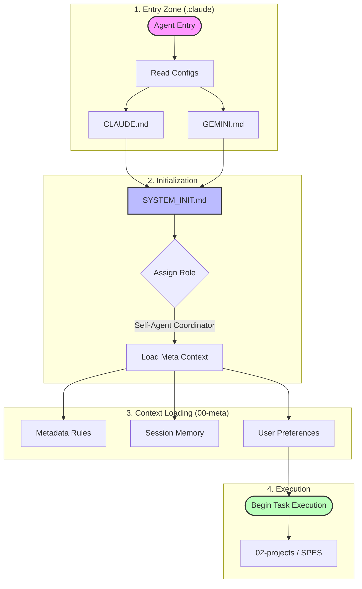

# Document Generation Master Prompt
<prompt>

<context>
Im currently putting together a system with my partners being **Claude Code** and **Gemini Code Assist**.
This is the genral overview of it.

>[! ] Current Set-up

### Key-Locations

**Folder Structure**
- `D:\10_pur3v4d3r's-vault\.claude`
  - `D:\10_pur3v4d3r's-vault\.claude\__LOCAL-REPO`
    - `NOTE: Home to anything you can imagiune for Agents.`
    - **Key Folders Include**:
      - `D:\10_pur3v4d3r's-vault\.claude\__LOCAL-REPO\___README`
      - `D:\10_pur3v4d3r's-vault\.claude\__LOCAL-REPO\__agents`
      - `D:\10_pur3v4d3r's-vault\.claude\__LOCAL-REPO\__claude.md-files`
      - `D:\10_pur3v4d3r's-vault\.claude\__LOCAL-REPO\__commands`
      - `D:\10_pur3v4d3r's-vault\.claude\__LOCAL-REPO\__educational`
      - `D:\10_pur3v4d3r's-vault\.claude\__LOCAL-REPO\__hooks`
      - `D:\10_pur3v4d3r's-vault\.claude\__LOCAL-REPO\__plugins`
      - `D:\10_pur3v4d3r's-vault\.claude\__LOCAL-REPO\__resouce-lists` -> `GitHub Resource Lists`
      - `D:\10_pur3v4d3r's-vault\.claude\__LOCAL-REPO\__scripts`
      - `D:\10_pur3v4d3r's-vault\.claude\__LOCAL-REPO\__skills`
      - `D:\10_pur3v4d3r's-vault\.claude\SYSTEM_INIT.md`
      - `D:\10_pur3v4d3r's-vault\.claude\CLAUDE.md`
      - `D:\10_pur3v4d3r's-vault\.claude\GEMINI.md`
- `D:\10_pur3v4d3r's-vault\000_databsae`
- `D:\10_pur3v4d3r's-vault\00-inbox`
- `D:\10_pur3v4d3r's-vault\00-meta`
  -  `D:\10_pur3v4d3r's-vault\00-meta\metadata-schema-reference..md`
  -  `D:\10_pur3v4d3r's-vault\00-meta\project-tracker.md`
  -  `D:\10_pur3v4d3r's-vault\00-meta\reference-moc.md`
  -  `D:\10_pur3v4d3r's-vault\00-meta\session-memory.md`
  -  `D:\10_pur3v4d3r's-vault\00-meta\user-preferences.md`
  -  `D:\10_pur3v4d3r's-vault\00-meta\vault-map.md`
-  `D:\10_pur3v4d3r's-vault\01_daily-notes`
-  `D:\10_pur3v4d3r's-vault\02-projects`
  - `D:\10_pur3v4d3r's-vault\02-projects\_spes-sequential-prompt-engineering-system`
  - ``02-projects\_spes-sequential-prompt-engineering-system\00-project-meta`
    - `00-prompt-engineering-system-design.md`
    - `implementation-roadmap.md`
    - `project-charter.md`
    - `quick-reference-spes.md`
    - `templates-spes.md`


### Folder‑Structure Diagram


### Movement of Agent through PKB

>[! ] Key points
> - The first step is always reading the two agent‑definition files (CLAUDE.md, GEMINI.md).
> - SYSTEM_INIT.md centralises the role declaration and any bootstrap scripts.
> - The meta‑layer supplies context (session memory, project metadata, user preferences).

>[! ] Agent‑Movement Flowchart


>[! ] Agent Initialization Flow
> - The following diagram illustrates the mandatory path an agent takes from entry to task execution. This ensures no task is attempted without the proper context (Memory/Rules).



1. Start by sending the Agent to `D:\10_pur3v4d3r's-vault\.claude`
  - `CLAUDE.md` and `Gemini.md` [Need to be read]
    - CLAUDE.md -> `D:\10_pur3v4d3r's-vault\.claude\CLAUDE.md`
    - GEMINI.md -> `D:\10_pur3v4d3r's-vault\.claude\GEMINI.md`
  - This needs to send them to `D:\10_pur3v4d3r's-vault\.claude\SYSTEM_INIT.md`
2. The Agent is sent to  `SYSTEM_INIT.md` file.
  - Where the Agent is informed of the role of "**Self-Agent Cordinator**".
3. The Agent is sent to the folder  `D:\10_pur3v4d3r's-vault\00-meta`
  - This contains Session Memory, Metadata Rules, Project Info, Etc.
4. Begin Tasks
</context>

<system-documentation>

<metadata-schema-reference.md>
---
tags: #spes #reference #metadata #schema
aliases: [Metadata Schema, Field Reference, YAML Guide]
status: reference
certainty: ^verified
priority: high
created: 2025-12-20
project: prompt-engineering-templater-system
link-up: "[[00-prompt-engineering-system-design]]"
---

# Metadata Schema Reference

> [!abstract] Purpose
> Complete reference for all metadata fields used in the prompt engineering system. Use this as the authoritative source for field names, types, and controlled vocabularies.

---

## 📊 UNIVERSAL FIELDS (All Types)

These fields appear in ALL notes (prompts, components, workflows, tests).

### Core Identity
```yaml
type: string [REQUIRED]
  # Prompt types: "prompt" | "component" | "workflow" | "test-result"

id: string [REQUIRED]
  # Unique identifier
  # Format: YYYYMMDDHHmmss (timestamp-based)
  # Generated: tp.date.now("YYYYMMDDHHmmss")

status: string [REQUIRED]
  # Options: "active" | "testing" | "production" | "deprecated" | "archived"
  # Default: "active"

version: string [REQUIRED]
  # Semantic versioning: "MAJOR.MINOR.PATCH"
  # Default: "1.0.0"
  # Bump: MAJOR (breaking), MINOR (feature), PATCH (fix)
```

### Quality Metrics
```yaml
rating: float [REQUIRED]
  # User quality assessment
  # Range: 0.0-10.0
  # Default: "0.0"
  # Update: After testing or usage

confidence: string [REQUIRED]
  # Epistemic certainty
  # Options: "speculative" | "provisional" | "moderate" | "established" | "high"
  # Default: "speculative" (new prompts)

maturity: string [REQUIRED]
  # Development stage
  # Options: "seedling" | "developing" | "budding" | "evergreen"
  # Default: "seedling"
  # Progression: seedling → developing → budding → evergreen

priority: string [OPTIONAL]
  # Work priority
  # Options: "low" | "medium" | "high" | "urgent"
  # Default: "medium"
```

### Source & Attribution
```yaml
source: string [REQUIRED]
  # Origin of content
  # Options: "claude-sonnet-4.5" | "claude-opus-4.5" | "gemini-3.0-pro" |
  #          "gemini-3.0-flash" | "original" | "local-llm" | "other"
  # Use: Track which model generated/refined the prompt
```

### Temporal Fields
```yaml
created: date [REQUIRED]
  # Creation date
  # Format: YYYY-MM-DD
  # Generated: tp.date.now("YYYY-MM-DD")

modified: date [REQUIRED]
  # Last modification date
  # Format: YYYY-MM-DD
  # Update: On every edit
```

### Usage Tracking
```yaml
usage-count: integer [REQUIRED]
  # Number of times used in production
  # Default: 0
  # Increment: Via macro or manually

last-used: string [OPTIONAL]
  # Link to daily note when last used
  # Format: "[[YYYY-MM-DD]]" or empty string ""
  # Update: When prompt is deployed
```

### Review System (Spaced Repetition)
```yaml
review-next: date [OPTIONAL]
  # Next review date
  # Format: YYYY-MM-DD
  # Calculate: Based on maturity level
  #   seedling: +7 days
  #   developing: +14 days
  #   budding: +30 days
  #   evergreen: +90 days

review-interval: integer [OPTIONAL]
  # Days between reviews
  # Default: 7
  # Adjust: Based on usage frequency and maturity

review-count: integer [OPTIONAL]
  # Number of reviews completed
  # Default: 0
  # Increment: Each review session
```

### Categorization
```yaml
tags: array [REQUIRED]
  # Hierarchical tags
  # Required tags:
  #   - "year/YYYY" (always include current year)
  #   - "prompt-engineering" (umbrella category)
  # Common tags:
  #   - "llm-capability/generation|reasoning|analysis|creative"
  #   - "prompt-workflow/creation|testing|deployment|optimization"
  #   - "component-type/persona|instruction|constraint|format|context"
  #   - "domain/general|technical|creative|educational|pkb"
  #   - "advanced-prompting/chain-of-thought|few-shot|tree-of-thoughts"

aliases: array [OPTIONAL]
  # Alternative names
  # Include: Filename, common abbreviations, synonyms
  # Default: [filename]
```

### Graph Integration
```yaml
link-up: string [OPTIONAL]
  # Parent MOC (Map of Content)
  # Format: "[[moc-name]]"
  # Default: "[[prompt-engineering-moc]]"

link-related: array [OPTIONAL]
  # Related notes
  # Suggested: ["[[YYYY-MM-DD|Daily Note]]", "[[YYYY-WW|Weekly Review]]"]
  # Add: Links to related prompts, projects, resources
```

---

## 🎯 PROMPT-SPECIFIC FIELDS

Additional fields for `type: "prompt"` notes.

```yaml
components-used: array [OPTIONAL]
  # Links to component library items
  # Format: ["[[component-1]]", "[[component-2]]"]
  # Purpose: Track component reuse, enable analytics
  # Update: When inserting components

test-results: array [OPTIONAL]
  # Links to test result notes
  # Format: ["[[test-result-1]]", "[[test-result-2]]"]
  # Purpose: Track testing history
  # Update: After each test
```

---

## 🧩 COMPONENT-SPECIFIC FIELDS

Additional fields for `type: "component"` notes.

```yaml
component-type: string [REQUIRED]
  # Component category
  # Options: "persona" | "instruction" | "constraint" | "format" |
  #          "context" | "example"
  # Use: Organize library, filter searches

atomic-composite: string [REQUIRED]
  # Component complexity
  # Options: "atomic" | "composite"
  # atomic: Single-purpose, indivisible
  # composite: Combines multiple atomics

domain: string [REQUIRED]
  # Application domain
  # Options: "general" | "technical" | "creative" | "educational" | "pkb"
  # Use: Domain-specific filtering

performance-score: float [OPTIONAL]
  # Average quality across uses
  # Range: 0.0-10.0
  # Calculate: Average of ratings from used-in-prompts
  # Default: "0.0"

conflicts-with: array [OPTIONAL]
  # Components that shouldn't be used together
  # Format: ["[[conflicting-component]]"]
  # Example: Different personas, contradictory constraints

synergies-with: array [OPTIONAL]
  # Components that work well together
  # Format: ["[[synergistic-component]]"]
  # Use: Recommend combos

used-in-prompts: array [OPTIONAL]
  # Links to prompts using this component
  # Format: ["[[prompt-1]]", "[[prompt-2]]"]
  # Update: Via macro or manually
  # Use: Usage analytics
```

---

## 🔗 WORKFLOW-SPECIFIC FIELDS

Additional fields for `type: "workflow"` notes.

```yaml
workflow-type: string [OPTIONAL]
  # Workflow category
  # Options: "sequential" | "parallel" | "recursive" | "hybrid"

problem-types: array [OPTIONAL]
  # Problems this workflow addresses
  # Format: ["long-form-generation", "technical-analysis", "comparison"]

typical-turns: integer [OPTIONAL]
  # Average number of turns/steps
  # Range: 1-20+

context-strategy: string [OPTIONAL]
  # How context is managed across turns
  # Options: "strict-isolation" | "sequential-building" | "parallel-convergence"
```

---

## 🧪 TEST-RESULT-SPECIFIC FIELDS

Additional fields for `type: "test-result"` notes.

```yaml
prompt-tested: string [REQUIRED]
  # Link to prompt being tested
  # Format: "[[prompt-name]]"

test-date: date [REQUIRED]
  # When test was conducted
  # Format: YYYY-MM-DD

test-type: string [REQUIRED]
  # Type of test
  # Options: "functional" | "quality" | "performance" | "ab-comparison"

success: boolean [REQUIRED]
  # Did prompt meet objectives?
  # Options: true | false

quality-score: float [OPTIONAL]
  # Numeric quality assessment
  # Range: 0.0-10.0

issues-found: array [OPTIONAL]
  # List of problems identified
  # Format: ["Issue 1 description", "Issue 2 description"]

recommendations: array [OPTIONAL]
  # Suggested improvements
  # Format: ["Recommendation 1", "Recommendation 2"]
```

---

## 📋 CONTROLLED VOCABULARIES

### Status Values
- **active**: Currently in use, maintained
- **testing**: Under evaluation, not production-ready
- **production**: Proven, deployed, stable
- **deprecated**: Replaced, no longer recommended
- **archived**: Historical, no longer maintained

### Confidence Values
- **speculative**: Unproven, experimental
- **provisional**: Some testing, preliminary results
- **moderate**: Tested multiple times, generally reliable
- **established**: Extensively tested, consistently good
- **high**: Proven excellent, gold standard

### Maturity Values
- **seedling**: New, unrefined, needs development
- **developing**: Growing, improving, getting tested
- **budding**: Solid foundation, minor refinements needed
- **evergreen**: Mature, stable, proven over time

### Priority Values
- **low**: Nice to have, no urgency
- **medium**: Standard work priority
- **high**: Important, needs attention soon
- **urgent**: Critical, address immediately

### Source Values
- **claude-sonnet-4.5**: Claude Sonnet 4.5 generated
- **claude-opus-4.5**: Claude Opus 4.5 generated
- **gemini-3.0-pro**: Gemini 3.0 Pro generated
- **gemini-3.0-flash**: Gemini 3.0 Flash generated
- **original**: User-created (Pur3v4d3r)
- **local-llm**: Local model generated
- **other**: Other source

### Component Types
- **persona**: Role/identity frames
- **instruction**: Task directives
- **constraint**: Boundaries/restrictions
- **format**: Output templates
- **context**: Background/framing
- **example**: Few-shot demonstrations

### Domains
- **general**: Universal, any domain
- **technical**: Code, engineering, analysis
- **creative**: Writing, ideation, art
- **educational**: Teaching, explanation, tutoring
- **pkb**: PKB/knowledge management specific

---

## ✅ VALIDATION RULES

### Required Field Checks
```javascript
// Fields that MUST be present
const required = ["type", "id", "status", "version", "rating",
                  "source", "created", "modified", "confidence",
                  "maturity", "tags"];

// Type-specific requirements
if (type === "component") {
  required.push("component-type", "atomic-composite", "domain");
}
if (type === "test-result") {
  required.push("prompt-tested", "test-date", "test-type", "success");
}
```

### Format Validation
```javascript
// ID format: 14 digits (YYYYMMDDHHmmss)
const validID = /^\d{14}$/.test(id);

// Version format: semver (X.Y.Z)
const validVersion = /^\d+\.\d+\.\d+$/.test(version);

// Date format: YYYY-MM-DD
const validDate = /^\d{4}-\d{2}-\d{2}$/.test(created);

// Rating range: 0.0-10.0
const validRating = rating >= 0 && rating <= 10;
```

### Tag Requirements
```javascript
// Must have year tag
const hasYearTag = tags.some(t => t.startsWith("year/"));

// Must have prompt-engineering umbrella
const hasPETag = tags.includes("prompt-engineering");
```

---

## 🔧 TEMPLATE HELPERS

### Templater Snippets

#### Generate ID
```javascript
20251220174224
```

#### Generate Dates
```javascript
created: "2025-12-20"
modified: "2025-12-20"
review-next: "2025-12-27"  // +7 days
```

#### Suggester for Status
```javascript
status: "null"
```

#### Suggester for Confidence
```javascript
confidence: "null"
```

#### Suggester for Source
```javascript
source: "null"
```

---

## 📊 META-BIND EXAMPLES

### View Fields (Read-Only)
```markdown
**Type**: `VIEW[{type}]`
**Status**: `VIEW[{status}]`
**Version**: `VIEW[{version}]`
**Rating**: `VIEW[{rating}]`/10
**Usage Count**: `VIEW[{usage-count}]`
```

### Input Fields (Editable)
```markdown
**Rating**: `INPUT[slider(min(0), max(10), step(0.5)):rating]`
**Priority**: `INPUT[suggester(option(Low), option(Medium), option(High), option(Urgent)):priority]`
**Status**: `INPUT[suggester(option(Active), option(Testing), option(Production)):status]`
**Tested**: `INPUT[toggle:is-tested]`
```

---

## 🔍 DATAVIEW QUERY PATTERNS

### All Prompts by Rating
```dataview
TABLE status, rating, maturity, usage-count
FROM ""
WHERE type = "prompt"
SORT rating DESC, usage-count DESC
```

### Components by Usage
```dataview
TABLE component-type, domain, usage-count, performance-score
FROM ""
WHERE type = "component"
SORT usage-count DESC
```

### Prompts Needing Review
```dataview
TABLE review-next, maturity, last-used
FROM ""
WHERE type = "prompt" AND review-next <= date(today)
SORT review-next ASC
```

### Recent Test Results
```dataview
TABLE prompt-tested, test-type, success, quality-score
FROM ""
WHERE type = "test-result"
SORT test-date DESC
LIMIT 10
```

---

## 📝 USAGE NOTES

### When Creating New Prompts
1. Use master template (auto-populates most fields)
2. Answer guided questions (suggesters ensure controlled vocabulary)
3. Required fields are marked [REQUIRED] in this doc
4. Optional fields can be added as needed
5. Update `modified` date on every edit

### When Creating Components
1. Use component template
2. Must specify: component-type, atomic-composite, domain
3. Document conflicts and synergies as discovered
4. Track usage via `used-in-prompts` array

### When Updating Metadata
1. Bump `version` for significant changes
2. Update `modified` date
3. Adjust `maturity` as prompt evolves
4. Increment `usage-count` when deploying
5. Update `last-used` with daily note link
6. Recalculate `review-next` based on new maturity

---

## ✅ COMPLIANCE CHECKLIST

Before considering a note "production-ready":

- [ ] All required fields present
- [ ] ID format correct (14 digits)
- [ ] Version format correct (semver)
- [ ] Dates in YYYY-MM-DD format
- [ ] Rating between 0.0-10.0
- [ ] Status from controlled vocabulary
- [ ] Confidence from controlled vocabulary
- [ ] Maturity from controlled vocabulary
- [ ] Source from controlled vocabulary
- [ ] Tags include "year/YYYY"
- [ ] Tags include "prompt-engineering"
- [ ] Aliases include filename
- [ ] Type-specific fields present (if applicable)

---

*Schema Version: 1.0.0 | Created: 2025-12-20 | Authoritative Reference*
</metadata-schema-reference.md>

<project-tracker.md>
---
tags: #meta #system #projects #tracking
aliases: [Active Projects, Work Status, Project Dashboard]
status: evergreen
certainty: ^verified
created: 2025-12-16
---

# Project Tracker

> [!abstract] Purpose
> Central registry of ongoing vault projects, system enhancements, and multi-session work. Prevents context loss and enables strategic prioritization.

---

## 🚀 Active Projects

### 1. Memory System Implementation
**Status**: `In Progress` | **Priority**: `High` | **Started**: 2025-12-16

**Objective**: Establish persistent context across Claude sessions to eliminate session amnesia.

**Components**:
- [x] Create 00-meta directory structure
- [x] Build session-memory.md (active context)
- [x] Build user-preferences.md (workflow patterns)
- [x] Build vault-map.md (structure tracking)
- [x] Build project-tracker.md (this file)
- [x] Update CLAUDE.md with memory protocols
- [ ] Test session persistence across restart
- [ ] Document usage workflow

**Next Actions**:
1. Integrate memory system into CLAUDE.md system prompt
2. Establish session start/end protocols
3. Test multi-session continuity

---

### 2. Self-Documenting Dataview System Adaptation

**Status**: `In Progress` | **Priority**: `High` | **Started**: 2025-12-16

**Objective**: Adapt self-documenting dataview system for general PKB knowledge work, creating emergent intelligence through automated concept tracking and discovery queries.

**Components**:

- [x] Analyze existing self-documenting dataview documentation
- [ ] Analyze user's vault structure and domain needs
- [ ] Design custom metadata schema for user's PKB domains
- [ ] Create production-ready concept note templates
- [ ] Create application note templates for different use cases
- [ ] Generate domain-specific discovery queries
- [ ] Create dashboard queries for vault-wide intelligence
- [ ] Test system with sample notes
- [ ] Document system usage and customization guide

**Next Actions**:
1. Analyze vault structure to identify key domains (projects, research, notes, etc.)
2. Design metadata schema for each domain type
3. Create custom templates adapted to user's workflow

---

### 3. Sequential Prompt Engineering System (SPES)

**Status**: `In Progress` | **Priority**: `High` | **Started**: 2025-12-16

**Objective**: Unified system integrating component-based prompt management, sequential workflow decomposition, and intelligent auto-discovery through metadata. Claude assists with problem decomposition, component retrieval, and learns from usage patterns.

**Architecture - Three Pillars**:

**1. Component Library**
- Atomic components (personas, instructions, constraints, formats)
- Composite workflows (multi-step prompt chains)
- Specialized domain templates
- Location: `02-projects/_spes-sequential-prompt-engineering-system/02-component-library/`

**2. Sequential Workflow Engine**
- Problem decomposition templates
- Context handoff protocols
- Multi-turn conversation management
- Content/context isolation strategies
- Location: `02-projects/_spes-sequential-prompt-engineering-system/03-sequential-workflows/`

**3. Intelligence Layer**
- Self-documenting dataview integration
- 16 PKB integration systems (epistemic encoding, relationship typing, application contexts)
- Usage analytics and pattern discovery
- Component relationship auto-discovery
- Location: `02-projects/_spes-sequential-prompt-engineering-system/04-intelligence-layer/`

**Implementation Decision**: **Option A Selected** ✅
- User chose: Unified project structure + Claude librarian instruction sets
- Rationale: Memory system critical for cross-session continuity

**Phase 1 Foundation - COMPLETED** (2025-12-16):
- [x] Full directory structure created (14 subdirectories)
- [x] 7 Claude librarian instruction files created:
  - [x] 00-librarian-core-identity.md (Prime directive, session protocols)
  - [x] 01-component-management-sop.md (Create/modify/retire procedures)
  - [x] 02-sequential-workflow-protocols.md (Decomposition strategies)
  - [x] 03-context-handoff-procedures.md (Multi-turn context management)
  - [x] 04-quality-assurance-checklist.md (Validation standards)
  - [x] 05-metadata-tagging-standards.md (Metadata specifications)
  - [x] 06-usage-analytics-protocols.md (Learning & pattern detection)
- [x] Project meta documentation:
  - [x] project-charter.md (Vision, objectives, success metrics)
  - [x] architecture-overview.md (Technical system design)
  - [x] implementation-roadmap.md (Phased execution plan with 5 phases)

**Next Actions** (Phase 2):
1. Create implementation-roadmap.md with detailed phase breakdown
2. Migrate existing prompt work into component library (10-20 initial components)
3. Document 5 core workflow patterns from existing work
4. Test first real workflow using SPES
5. Begin usage tracking and pattern detection

**Key Reference Notes**:
- [[reference-comprehensive-claude-prompt-component-librarian-2025111004]]
- [[reference-technical-llm-pkb-integration-systems-2025121411]]
- [[reference-technical-component-librarian-claude-project-2025111218]]

**Project Location**: `02-projects/_spes-sequential-prompt-engineering-system/`

**Notes**:
- Foundation complete: Claude now has full operational instructions
- Memory system integrated: Claude reads instruction files at session start
- Ready for component population phase
- Prompt engineering chosen as first domain (bounded, immediate utility, clear metrics)
- Sequential prompting + Component library = multiplicative value
- Self-doc dataview provides cross-session memory Claude lacks

---

## 📋 Backlog

### Vault Maintenance
- **Resolve Directory Duplication**: `01-daily-notes/` vs `01_daily-notes/`
- **Investigate Database Naming**: `000_databsae/` (typo or intentional?)
- **Separator Standardization**: Decide on hyphen vs underscore convention

### Graph Health
- **Orphan Detection**: Scan for notes with 0 links
- **Ghost Link Mapping**: Find `[[broken-links]]` to non-existent notes
- **MOC Opportunities**: Cluster analysis for 5+ related notes

### Automation
- **Vault Stats Script**: Auto-update vault-map.md metrics
- **Session Logger**: Git hooks for automatic session commits
- **Link Validator**: Pre-commit check for broken references

---

## ✅ Completed Projects

### 2025-12-16
- **Memory System Foundation**: Created 4-file meta infrastructure
  - Files: session-memory, user-preferences, vault-map, project-tracker
  - Location: `00-meta/`
  - Integration: Graph-based (Option 3 approach)

---

## 🎯 Project Categories

### System Enhancement
Projects improving vault infrastructure, automation, or AI integration.

### Content Development
Knowledge expansion, note creation, MOC building.

### Maintenance
Cleanup, refactoring, link repair, archiving.

### Research
Investigation tasks, pattern analysis, methodology exploration.

---

## 📊 Project Metrics

| Metric | Current | Target | Status |
|--------|---------|--------|--------|
| Active Projects | 3 | 3-5 | ✅ Optimal |
| Backlog Items | 6 | <10 | ✅ Healthy |
| Completion Rate | N/A | Track over time | 📊 Baseline |
| Session Continuity | New | 100% | 🔄 Testing |

---

## 🔗 Related

- [[session-memory]] - Current session state
- [[vault-map]] - Structural overview
- [[user-preferences]] - Decision context

---

## 📝 Project Template

*Use this template when adding new projects:*

```markdown
### Project Name
**Status**: `Not Started|In Progress|Blocked|Completed`
**Priority**: `Low|Medium|High|Critical`
**Started**: YYYY-MM-DD

**Objective**: One-sentence goal

**Components**:
- [ ] Task 1
- [ ] Task 2

**Next Actions**:
1. Immediate next step
```

---

*Last Updated: 2025-12-16 | Active Projects: 3 | Backlog: 6*
</project-tracker.md>

<reference-moc.md>

# Highly Important Must Read ASAP [@Gemini/@Claude]
[[reference-guide-intergration-of-self-regulated-learning-into-pkm-achitecture-202511202342]]

[[reference-taxonomy-current-metadata-system-2025121309]]
[[prompt-component-exemplar-callout-list-20251030204029]]
[[reference-comprehensive-pedagogical-teaching-methods-20251107233719]]
[[tree-of-thought-advanced-quickadd-llm-macro-system-architectures]]


### Active Scratch pads
[[scratchpad-A1]]
[[scratchpadd-A2]]
### General Guidance
[[reference-guide-intergration-of-self-regulated-learning-into-pkm-achitecture-202511202342]]
[[reference-comprehensive-callout-techniques-2025120218]]
[[reference-comprehensive-functional-loops-in-pkm-20251127071411]]
[[reference-comprehensive-alternative-checkboxes-20251115]]
[[reference-comprehensive-obsidian-canvas-202511260625]]
[[reference-comprehensive-obsidian-uri-202511250642]]
[[reference-guide-designing-optimal-workflows-&-sops-20251125160849]]
[[reference-guide-emoji-list-20251019185839]]
[[reference-guide-naming-conventions-20251111075525]]
[[reference-guide-yaml-frontmatter-20251122124616]]


### Dataview
[[_dataview-list-of-misc-queries]]


[[reference-comprehensive-dataview-202511140206]]
[[reference-technical-permanent-note-system-cognitive-science-dataview-queries]]
[[reference-technical-advanced-dataview-queries-command-center-2025120221]]
[[_dataview-list-of-misc-queries]]
[[reference-technical-dataview-psychology-queries-202511181225]]
[[reference-technical-dataview-advanced-report-quiries-2025120204]]
[[reference-comprehensive-dataview-tasks-quieries-2025120204]]


[[reference-guide-dataview-inline-fields-202511231147]]
#### Inline Queries
[[reference-guide-dataview-inline-queries-202511232257]]
[[reference-comprehensive-dataview-inline-queries-library-20251129225545]]


### Meta Bind/Commander
[[reference-guide-meta-bind-plugin-202511192048]]
[[reference-guide-permanent-note-system-meta-bind-implementation]]

[[reference-technical-meta-bind-button-library-20251128041535]]
[[reference-technical-meta-bind-button-library-20251128041535]]


[[reference-guide-commander-plugin-202511192130]]

### Text Generator
[[reference-comprehensive-text-generator-plugin-complete-api-interface-reference-2025121507]]

### QuickAdd
[[reference-comprehensive-quickadd-202511202000]]


### Misc.
[[reference-comprehensive-plugin-metadata-menu-2025121412]]
[[reference-comprehensive-excalidraw-and-markmind-2025121812]]


### Templater
[[__templater-pkb-cheat-sheat]]
[[reference-technical-advanced-templater-note-templates-20251118225816]]
[[reference-comprehensive-templater-plugin-202511132024]]
[[reference-guide-templater-plugin-20251025160911]]

### Productivity

[[reference-guide-tracking-task-with-tasks-plugin-2025120217]]

[[reference-comprehensive-day-planner-202511160430]]

[[reference-comprehensive-planning-through-pkb-20251114]]
[[reference-comprehensive-orginization-in-pkm-202511150447]]
[[reference-comprehensive-getting-things-done-202511150451]]
[[reference-comprehensive-pkb-system-user-review-202511211757]]
[[reference-instructional-review-system-2025112923]]
[[reference-guide-spaced-repition-plugin-2025121413]]

[[reference-instructional-pkb-quickadd-task-system-(implemented)-20251116]]


### Misc. Implementation Guides for (⬆️)
[[reference-guide-permanent-note-system-enhancement-roadmap-&-implementation]]
[[reference-technical-obsidian-wrappers-2025120422]]
[[reference-technical-text-format-plugin-options-2025120419]]


[[prompt-report-analysis-of-frameworks-and-methodologies-for-modular-task-decomposition-2025121904]]
[[prompt-report-modular-task-decomposition-in-sequential-prompt-engineering-2025121904]]
[[prompt-report-sequential-prompt-engineering-2025121815]]


# Daily Note Update
Stoicism enhanced Daily Note


[[prompt-daily-note-components-v1.0.0-2025121218]]
[[pkb-automation-daily-note-components]]
[[daily-note-possible-upgrades]]
[[00-inbox/03-research/03-research-library/-stoicism/reference-comprehensive-stoicism-journal-20251130195735]]
[[00-inbox/03-research/03-research-library/-stoicism/reference-comprehensive-stoicism-quotes-and-precepts-2025120220]]
[[00-inbox/03-research/03-research-library/-stoicism/reference-taxonomy-stoic-termonology-2025120303]]


# Library of Automation


[[dataview-inline-queries]]
[[dataview-queries-qwen3-coder-480b-a35b-instruct]]
[[found-templates]]
[[metadata_analysis_for_dataview]]
[[pkb-automation-scripts]]

[[pkb-automation-data-view-quiries]]
[[pkb-automation-templater-templates]]


[[prompt-bulk-quickadd-macros-v1.0.0-2025121905]]
[[prompt-bulk-templater-template-v1.0.0-2025121905]]
[[prompt-coder-llm-generate-automation-systems-v1.0.0-2025121905]]

[[prompt-generate-advanced-task-capture-quickadd-v1.0.0-2025120319]]
[[prompt-generate-templater-templates-(bulk)-v1.0.0-2025121715]]
[[prompt-generate-various-dashboard-and-moc-components-v1.0.0-2025121220]]


[[reference-guide-batch-tagging-script-20251120210334]]

# SPES


## Project Meta
[[00-prompt-engineering-system-design]]
[[architecture-overview]]
[[02-projects/_spes-sequential-prompt-engineering-system/00-project-meta/implementation-roadmap]]
[[project-charter]]
[[QUICK-REFERENCE-SPES]]
[[README-SPES-TEMPLATES]]

### Procedures and Instruction Sets

[[00-librarian-core-identity]]
[[01-component-management-sop]]
[[02-sequential-workflow-protocols]]
[[03-context-handoff-procedures]]
[[04-quality-assurance-checklist]]
[[05-metadata-tagging-standards]]
[[06-usage-analytics-protocols]]

### WIP 
[[_migration-batch-01-summary]]
[[_migration-guide-remaining-components]]
[[_spes-metadata-adapter-template]]


[[_migration-batch-01-summary]]
[[_migration-guide-remaining-components]]

# Self Documenting Dataview


[[pur3v4d3r-self-documenting-pkb-system]]
[[reference-guide-master-self-documenting-dataview-system-202511240708]]
[[Revised-self-documenting-dataview]]
[[self-documenting-dataview-implementation-guide]]
[[self-documenting-dataview-system-reference]]


[[concept-network-dashboard]]
[[project-n[[self-doc-concept-template]]ote-template]]


# PKB Integration update module

[[quick-start-guide]]
[[02-projects/_project-prompt-engineering/_further-pkb-llm-intergration/implementation-roadmap]]
[[llm-pkb-integration-systems]]
[[master-pkb-integration-system-docs]]
[[master-pkb-llm-integration-update-full-project-exemplar]]
[[pkb-integration-system-deployment-v2.0.0]]
[[system-architecture-overview]]

[[master-quick-reference-pkb-integration]]


[[cp-01-foundation-03-(report-generator)]]
[[cp-02-p.i.e.-(note-creator)]]
[[cp-03-comprehensive-reference-(reference-note-generator)]]
[[cp-04-obsidian-automations-(template-automation-engineer)]]
[[cp-05-meta-level-prompting-(prompt-engineer)]]


[[module-a-pkb-architecture-&-knowledge-graph]]
[[module-b-technical-infrastructure-&-local-ai]]
[[module-c-project-context-&-history]]
[[module-d-cognitive-frameworks-(detailed-applications)]]


[[pkb-architecture-&-obsidian-master-mega-prompt-202512160204]]
[[optimized-mega-prompt-v2.0.0]]


[[quick-reference-callout-taxonomy]]
[[quick-reference-metadata-generation]]
[[quick-reference-note-type]]
[[quick-reference-semantic-color-coding]]
[[quick-reference-wiki-link-protocol]]


[[tier-1-universal-memory]]
</reference-moc.md>

<session-memory.md>
---
tags: #meta #system #memory #session-tracking
aliases: [Session Context, Active Memory, Claude Memory]
status: evergreen
certainty: ^verified
created: 2025-12-16
last_updated: 2025-12-16
---

# Session Memory

> [!abstract] Purpose
> This note maintains persistent context across Claude sessions, enabling continuity in knowledge management tasks and vault operations.

## 🔄 Current Session (2025-12-20)

### Active Tasks

- **Prompt Engineering System - Phase 0**: ✅ COMPLETE - Full architecture design (3 docs, 25+ pages)
- **Prompt Engineering System - Phase 1**: ✅ COMPLETE - Foundation MVP (5 deliverables)
  - Master Prompt Template (with Meta-Bind health checks, Dataview analytics)
  - Component Template (atomic/composite categorization)
  - Metadata Schema Reference (complete field documentation, validation rules)
  - QuickAdd Macros (2): Quick Capture (<10s), Component Search & Insert
  - Dataview Dashboard (library overview, analytics, health monitoring)
- **Component Library**: ✅ STRUCTURED - Index files, example components created
- **Session Memory Update**: 🔄 IN PROGRESS - Logging Phase 1 completion

### Previous Session (2025-12-17)

- **Obsidian Theme Creation**: Phases 1-4 complete (850 lines, 8 snippets consolidated)
- **Phase 4.7: Tags System**: ✅ COMPLETE - All editor modes working (Source, Live Preview, Reading)

### Previous Session (2025-12-16)

### Completed Tasks

- **Memory System Implementation**: ✅ COMPLETE - Created the 00-meta directory structure for persistent session tracking
- **System Enhancement**: ✅ COMPLETE - Context persistence implemented through SPES instruction files
- **Vault Scan Tool Integration**: ✅ COMPLETE - Fixed and documented `_scripts/vault_scan.py` for anti-duplication protocol
- **Self-Documenting Dataview System**: ✅ COMPLETE - Adapting self-documenting dataview system for general PKB knowledge work
- **Prompt Engineering Project Convergence**: ✅ COMPLETE - Analyzed three converging projects for unified system
- **SPES Foundation Implementation**: ✅ COMPLETE - Built complete Option A foundation (structure + Claude instructions)

### Session Notes

- User reported previous session hung for 20+ minutes on `.clauderc` discussion
- Implementing Option 3: Context Files approach (vault-integrated memory vs isolated config)
- User prefers direct, efficient communication without filler
- Fixed nested directory structure in `_scripts/vault_scan.py` (was incorrectly nested as folder)
- **New Project**: Self-documenting dataview system adaptation for PKB knowledge work
- **Project Synthesis**: Identified convergence of three separate prompt engineering initiatives
- **DECISION**: User chose Option A (Unified structure + Claude librarian instructions) as marginally more important for memory persistence
- **SPES Phase 1 COMPLETED**: Full foundation built in single session (structure + 7 instruction files + 2 meta docs)

---

## 📚 Vault Structure Overview

```
Root/
├── 00-inbox/          # Ingestion point
├── 00-meta/          # [NEW] System & memory files
├── 000_databsae/     # [Note: typo in original]
├── 01-daily-notes/   # Daily atomic entries
├── 02-projects/      # Active project files
├── 03-notes/         # Core knowledge atoms
├── 04-library/       # Reference materials
├── 05-tasks-&-reviews/
├── 06-dashboards/
├── 07-mocs/          # Maps of Content
├── 99-archive/
└── 99-system/
```

---

## 🎯 Ongoing Projects

*This section will be populated as projects are identified and tracked.*

---

## 💡 User Workflow Patterns

### Communication Style
- Prefers concise, action-oriented responses
- No conversational filler
- Direct task execution

### Vault Philosophy
- Treats PKB with software engineering rigor
- Strong emphasis on graph connectivity
- Anti-duplication protocols critical

---

## 🔗 Integration Points

**Related System Files:**
- [[../. claude/CLAUDE.md|System Prompt]]
- [[user-preferences]] - Detailed workflow preferences
- [[vault-map]] - Structural insights and patterns
- [[project-tracker]] - Active work status

---

## 📝 Session History Log

### 2025-12-20

#### Prompt Engineering System - Phase 0 Implementation

- **Event**: User requested comprehensive prompt engineering system with Templater templates, QuickAdd macros, Meta-Bind forms, Dataview dashboards
- **Context**: Building on existing SPES foundation; integration with Obsidian PKB for daily workflow use
- **Action**: Complete Phase 0 (Planning & Architecture) implementation
- **Deliverables Created**:

  **1. System Design Document** (`00-prompt-engineering-system-design.md`, 25+ pages):
  - Three-layer architecture (Creation, Testing, Intelligence)
  - Complete data flow for prompt lifecycle (6 phases: Ideation → Creation → Testing → Optimization → Production → Evolution)
  - Integration map: Templater (20+ templates), QuickAdd (10+ macros), Meta-Bind (forms), Dataview (queries)
  - Folder structure with SPES integration
  - Technical decisions with rationale (markdown vs database, atomic-first components, metadata-heavy approach)
  - Risk analysis & mitigation (6 identified risks)
  - Complete metadata schema (universal + specialized fields)
  - Best practices for prompt engineering patterns

  **2. Implementation Tracker** (`01-implementation-tracker.md`):
  - 5-phase breakdown (Phase 0-4)
  - Phase 0: Planning (3 docs, 2h) ✅ COMPLETE
  - Phase 1: Foundation MVP (5 deliverables, 6-8h) - Master template, metadata schema, library structure, QuickAdd macros, Dataview dashboard
  - Phase 2: Guided Creation (20+ templates, 10-12h) - Agentic, structured, reasoning, workflow, testing, documentation templates
  - Phase 3: Testing & Optimization (5 systems, 5-7h) - Version tracking, A/B testing, debugging, results aggregation
  - Phase 4: Intelligence & Automation (15+ items, 12-15h) - Analytics, recommendations, health monitoring, pattern detection, advanced macros
  - Detailed dependencies, success criteria, time estimates per deliverable

  **3. Quick Reference Guide** (`02-quick-reference-guide.md`):
  - One-page daily workflow operations
  - Plugin syntax cheat sheets (Templater, Meta-Bind, Dataview, DataviewJS)
  - Metadata field reference with examples
  - Key locations and folder paths
  - Troubleshooting common issues
  - Best practices checklist
  - Learning path (Day 1 → Week 1 → Month 1)

- **Key Design Decisions**:
  - Integrated with existing SPES foundation (avoided duplication)
  - Markdown files + rich YAML metadata (not database)
  - Manual workflow execution (flexibility over automation)
  - Atomic-first component design (maximum reusability)
  - Progressive disclosure (simple workflows first, advanced optional)

- **Integration Points**:
  - **SPES**: Uses existing component library structure, sequential workflows, Claude Librarian instructions
  - **PKB Foundation**: Uses 00-meta memory, diagnostic tools (vscan, orphan, linkcheck, metaudit)
  - **Review System**: Spaced repetition fields, interval calculation based on maturity

- **Templates to Create** (Phase 2 - 20+ total):
  1. Master Prompt Template
  2. System Prompt Creator
  3. User Prompt Generator
  4. Claude Project Instructions
  5. Gemini Gem Instructions
  6. Few-Shot Template
  7. Chain-of-Thought Template
  8. Tree-of-Thoughts Template
  9. Least-to-Most Template
  10. Prompt Chain Builder
  11. Workflow Template
  12. A/B Testing Framework
  13. Debug Template
  14. Optimization Workflow
  15. Test Results Documentation
  16. Comparative Analysis
  17. Effectiveness Report
  18. Idea Template
  19. Component Extractor
  20. Workflow Guide Template

- **QuickAdd Macros to Create** (Phase 1 & 4 - 10+ total):
  1. Prompt Quick Capture (Phase 1)
  2. Component Search & Insert (Phase 1)
  3. Version Bump (Phase 3)
  4. Clone & Modify (Phase 4)
  5. Extract to Library (Phase 4)
  6. Archive Prompt (Phase 4)
  7. Usage Counter (Phase 4)
  8. Review Scheduler (Phase 4)
  9. Health Check Trigger (Phase 4)
  10. Test Session Logger (Phase 3)

- **Dashboards to Create**:
  1. Prompt Library Overview (Phase 1)
  2. Usage Analytics Dashboard (Phase 4)
  3. Testing Dashboard (Phase 3)
  4. Health Monitor (Phase 4)
  5. Idea Backlog (Phase 1)
  6. Archive Browser (Phase 4)

- **Python Scripts to Create** (Phase 4):
  1. prompt-health-check.py
  2. component-usage-analyzer.py
  3. metadata-validator.py
  4. auto-archive.py

- **Total Estimated Effort**: 35-44 hours across all phases
- **Status**: Phase 0 COMPLETE, awaiting user approval to proceed to Phase 1
- **Next Actions**:
  1. Present Phase 0 deliverables to user
  2. Incorporate any feedback/changes
  3. Upon approval: Begin Phase 1 (Foundation MVP)

- **User Instructions Source**: `99-system/01-quickadd/02-templates/_prompt-template-v1.0.0.md`
- **Reference Documents Reviewed**:
  - Sequential prompting report (`00-inbox/01-reports/03_prompt-engineering/prompt-report-analysis-of-frameworks-and-methodologies-for-modular-task-decomposition-2025121904.md`)
  - Existing claude-project-template
  - SPES architecture-overview
  - Session memory, project tracker, user preferences, vault map

- **Impact**: Complete architectural blueprint for production-ready prompt engineering system with daily workflow integration

---

### 2025-12-16

#### Morning Session

- **Event**: Memory system initialization
- **Action**: Created 00-meta infrastructure
- **Outcome**: Established persistent context framework

#### Vault Scan Tool Integration

- **Event**: User added `_scripts/vault_scan.py` for anti-duplication enforcement
- **Action**: Fixed nested directory structure (`vault_scan.py` folder → `vault_scan.py` file)
- **Tool Purpose**: Scans vault for exact filename matches, alias matches, and fuzzy suggestions before note creation
- **Usage**: `vscan "search term"` (wrapper: `vscan.bat`)
- **Test Results**: ✅ Exact match detection, ✅ Fuzzy matching, ✅ Unique term detection
- **Status**: Production ready

#### Orphan Detection System

- **Event**: Created `_scripts/orphan_check.py` for graph health monitoring
- **Purpose**: Identifies notes with insufficient connections (Protocol: "≥2 incoming + ≥2 outgoing links")
- **Usage**: `orphan` (wrapper: `orphan.bat`)
- **Initial Scan Results**:
  - Total notes: 3,098
  - Healthy: 341 (11.0%)
  - Completely isolated: 1,583 (51.1%)
  - Weak outgoing: 675 notes
  - Weak incoming: 1,027 notes
- **Status**: Production ready, reveals significant graph debt

#### Broken Link Detection System

- **Event**: Created `_scripts/link_check.py` for link integrity monitoring
- **Purpose**: Identifies broken [[Wiki-Links]] (Protocol: "NO broken links")
- **Usage**: `linkcheck` (wrapper: `linkcheck.bat`)
- **Initial Scan Results**:
  - Total wiki-links: 41,688
  - Broken links: 30,966 (74.3%)
  - Files affected: 1,790
  - Ghost links (intentional): 4
- **Key Patterns Identified**:
  - Documentation exemplars contain example links (not real breaks)
  - Template variables (`${page.file.name}`, Templater syntax) flagged as broken
  - Periodic note links (`[[2025-W49]]`) may be intentional missing notes
  - Strategic research docs contain placeholder links for future concepts
- **Status**: Production ready, needs refinement for false positives

#### Metadata Compliance Audit System

- **Event**: Created `_scripts/meta_audit.py` for 5-Tag System enforcement
- **Purpose**: Validates YAML frontmatter compliance (Protocol: tags, aliases, status, certainty)
- **Usage**: `metaudit` (wrapper: `metaudit.bat`)
- **Initial Scan Results**:
  - Total notes: 3,395
  - Fully compliant: 4 (0.1%)
  - No frontmatter: 1,240 (36.5%)
  - Missing status: 1,208 files
  - Missing certainty: 2,147 files
  - Invalid status values: 846 files (using `active` instead of seedling/evergreen/reference)
- **Status**: Production ready, reveals critical metadata standardization need

#### Self-Documenting Dataview System Adaptation

- **Event**: User requested adaptation of self-documenting dataview system for general PKB knowledge work
- **Action**: Comprehensive vault analysis and system design
- **Analysis Completed**:
  - Vault structure mapping (8 primary folders, 4 knowledge domains identified)
  - Existing metadata schema analysis (sophisticated multi-field system already in place)
  - Sample note examination (permanent notes, library references, project notes)
  - Identified user's manual `link-related` maintenance as automation opportunity
- **Deliverable Created**: `02-projects/-ongoing-project-pur3v4d3r/_self-documenting-dataview/pur3v4d3r-self-documenting-pkb-system.md`
- **System Design Features**:
  - Enhancement strategy (preserves existing schema, adds auto-discovery)
  - New metadata fields: `concepts::`, `methodologies::`, `tools::`, `fields::`, `people::`
  - 3 production-ready templates (concept notes, application notes, library references)
  - 2 dashboard queries (concept network, field/domain intelligence)
  - Integration with existing review system and maturity tracking
  - Crash-safe queries (learned from original system issues)
- **Domains Identified**:
  - Cognitive Development (`01_cognitive-development`)
  - Personal Knowledge Base (`02_personal-knowledge-base`)
  - Prompt Engineering (`04_prompt-engineering`)
  - Cosmology (`03_cosmology`)
- **Status**: Design complete, ready for implementation phase

#### Post-Cleanup Vault Health Scan (After Exemplar Removal)

- **Event**: User removed documentation exemplars and test files
- **Action**: Re-ran all three diagnostic tools (orphan, linkcheck, metaudit)
- **Results Summary**:

**Orphan Detection (Post-Cleanup):**
  - Total notes: 1,502 (from 3,098, -51.5%)
  - Healthy: 281 (18.7%, up from 11.0%) ✅
  - Completely isolated: 389 (25.9%, down from 51.1%) ✅
  - Weak outgoing: 444 notes
  - Weak incoming: 763 notes
  - **Impact**: Significant improvement in graph health percentage

**Link Integrity (Post-Cleanup):**
  - Total wiki-links: 29,414 (from 41,688, -29.4%)
  - Broken links: 22,391 (76.1%, slightly up from 74.3%)
  - Files affected: 946 (from 1,790, -47.2%) ✅
  - **Key Remaining Issues**:
    - Periodic note links (`[[2025-W49]]`, `[[2025-12]]`, `[[2025-Q4]]`) - 657 breaks in one file
    - Strategic expansion plans with placeholder concepts (421 breaks)
    - Historical scratchpads with old references (336 breaks)
  - **Impact**: Removed most false positives, reveals genuine structural issues

**Metadata Compliance (Post-Cleanup):**
  - Total notes: 1,549 (from 3,395, -54.4%)
  - Fully compliant: 4 (0.3%, minimal improvement from 0.1%)
  - No frontmatter: 336 (21.7%, down from 36.5%) ✅
  - Missing certainty: 1,205 files (still critical)
  - Missing status: 355 files
  - Invalid status values: 773 files (still using `active`/`⚡active`)
  - **Impact**: Reduced absolute numbers, but compliance percentage remains critical

- **Status**: Baseline established, ready for systematic remediation

#### Prompt Engineering Project Analysis

- **Event**: User provided comprehensive notes on Claude PKB/Prompting Librarian system
- **Action**: Deep analysis of existing work spanning multiple reference notes
- **Analysis Scope**:
  - [[reference-comprehensive-claude-prompt-component-librarian-2025111004]]
  - [[reference-comprehensive-claude-prompt-engineering-mastery-202511100]]
  - [[reference-comprehensive-local-llm-prompt-librarian-2025111218]]
  - [[reference-technical-component-librarian-claude-project-2025111218]]
  - [[reference-technical-llm-pkb-integration-systems-2025121411]]
- **Key Discovery**: Three separate projects converge into single unified system:
  1. **Claude as PKB/Prompting Librarian** - Component-based prompt management with MCP integration
  2. **Sequential Prompting Workflow** - Problem decomposition from one-shot to multi-turn approach
  3. **Self-Documenting Dataview System** - Metadata-driven auto-discovery and intelligence
- **Synthesis Created**: Sequential Prompt Engineering System (SPES) architecture
  - Component Library (atomic/composite/specialized)
  - Sequential Workflow Engine (problem decomposition, context handoff)
  - Intelligence Layer (self-doc dataview + 16 PKB integration systems)
- **Gaps Identified**:
  - Missing SOPs (component creation, testing, validation)
  - Missing analytics dashboards (usage tracking, performance metrics)
  - Missing testing framework
  - Missing Claude instruction sets (actual "librarian training")
  - Missing automation scripts
- **Architectural Insight**: Prompt engineering is ideal first domain for system due to:
  - Bounded knowledge space (user's own components)
  - Immediate utility (use while building)
  - Clear success metrics (does prompt work?)
- **Next Decision**: User to choose implementation starting point (structure vs sequential vs dataview)
- **Status**: Analysis complete, logged for new context session

#### SPES Foundation Implementation (Option A)

- **Event**: User selected Option A - Unified project structure + Claude librarian instruction sets
- **Rationale**: Memory system through instruction files is critical for cross-session continuity
- **Action**: Complete Phase 1 foundation implementation
- **Deliverables Created**:

  **Directory Structure** (14 subdirectories):
  - `02-projects/_spes-sequential-prompt-engineering-system/`
    - `00-project-meta/` - Project documentation
    - `01-claude-librarian-instructions/` - Claude's operational SOPs (7 files)
    - `02-component-library/atomic/` - 5 component type folders
    - `02-component-library/composite/` - 3 workflow type folders
    - `02-component-library/specialized/` - 4 domain folders
    - `03-sequential-workflows/` - 3 pattern folders
    - `04-intelligence-layer/` - 3 analytics folders
    - `05-testing-validation/` - 3 test folders
    - `06-analytics-dashboards/`
    - `07-automation-scripts/`
    - `99-archive/` - 2 archive folders

  **Claude Librarian Instructions** (7 files, ~30k words):
  - `00-librarian-core-identity.md` - Prime directive, session protocols, operational principles
  - `01-component-management-sop.md` - Discovery, creation, modification, retirement, testing
  - `02-sequential-workflow-protocols.md` - Problem classification, decomposition patterns, anti-patterns
  - `03-context-handoff-procedures.md` - Multi-turn context management, drift prevention
  - `04-quality-assurance-checklist.md` - 4-level validation (component/integration/workflow/system)
  - `05-metadata-tagging-standards.md` - Complete metadata specifications, dataview queries
  - `06-usage-analytics-protocols.md` - Tracking, pattern detection, learning mechanisms

  **Project Meta Documentation**:
  - `project-charter.md` - Vision, objectives, success criteria, KPIs, timeline
  - `architecture-overview.md` - Three-pillar design, data flows, integration points

- **Key Design Decisions**:
  - Markdown files (not database) for native Obsidian integration
  - Rich YAML metadata enables intelligence layer
  - Atomic-first component decomposition
  - Manual workflow execution (flexibility over automation)
  - Metadata-heavy approach (initial overhead, long-term payoff)

- **Integration Points**:
  - PKB Foundation: Lives in vault, uses wiki-links, Dataview queries
  - Session Memory: Reads `00-meta/` files at session start
  - Diagnostic Tools: Uses `vscan`, `orphan`, `linkcheck`, `metaudit`
  - Existing Work: Will migrate from `_project-prompt-engineering/` and `000_databsae/`

- **Status**: Phase 1 COMPLETE, ready for Phase 2 (component population)
- **Next Session**: Claude will read instruction files at start, operate as SPES Librarian
- **Impact**: Claude now has persistent operational memory through instruction files

#### Obsidian Theme Creation (Pur3v4d3r Imperial) - PHASES 1-4 COMPLETE

**Previous Session (2025-12-16):**
- **Event**: User disabled Minimal theme due to CSS override conflicts, requested conversion of 52 CSS snippets into unified theme
- **Problem Analysis**:
  - 52 CSS snippets total (45 enabled, 20 missing/broken)
  - ~15,000 lines of CSS with significant redundancy
  - 25 callout files with 3 competing base systems
  - Active line highlighting broken (conflicts between `clode-block-.css` and `05-inline-elements.css`)
  - Code block styling not working (Minimal theme overrides)
  - 500+ `!important` flags causing maintenance issues
- **Action**: Comprehensive theme architecture planning session
  - Launched 2 parallel Explore agents (callout system + UI dependencies)
  - Analyzed `01-variables.css` (240 lines, referenced by 48+ files)
  - Mapped callout redundancy (100+ duplicate type definitions)
  - Identified dependency tree and missing components
- **User Decisions Collected** (via AskUserQuestion):
  1. **Animations**: Remove all (performance-focused, no H1 shimmer)
  2. **Callout Style**: Card Elevated (3D raised cards with shadows)
  3. **Light Mode**: Dark mode only (saves 6+ days development)
  4. **Snippet Cleanup**: Backup to `.obsidian/snippets.backup/`
- **Deliverable Created**: `C:\Users\pur3v4d3rpk\.claude\plans\delegated-cooking-milner.md`
  - 1,200+ line implementation plan
  - 8-phase roadmap (10.5 days revised timeline)
  - File consolidation map (20 essential snippets → 1 theme)
  - Complete manifest.json structure
  - Success criteria (MVP/V1.0/Future)
- **Theme Architecture Designed**:
  - Name: "Pur3v4d3r Imperial"
  - Color scheme: Red (#E50000), Grey (#E0E0E0), Black (#0A0A0A)
  - Structure: manifest.json + theme.css (~3,000 lines estimated)
  - 17 CSS module sections (variables → plugins)
  - Zero `!important` flags (theme authority)

**Current Session (2025-12-17) - Implementation:**

**Phase 0: Session Continuation & Setup**
- Reviewed previous 10-message session summary
- Identified continuation point: README update pending
- Theme detection issue resolved (folder name vs cssTheme mismatch)
- Fixed: `appearance.json` cssTheme value must match folder name exactly
- Fixed: `minAppVersion` changed from "1.5.0" to "0.15.0" for user's Obsidian version
- Theme now ACTIVE and working

**Phase 2: Code Block Consolidation** ✅
- **Source**: `clode-block-.css` (1,265 lines)
- **Result**: 120 lines (90% reduction)
- **Features Implemented**:
  - Dual-color borders (red inner + grey outer, swap on hover)
  - Gradient backgrounds (135deg black gradient)
  - Preview + Live Preview mode support
  - Hover effects (2px lift, border color swap, enhanced glow)
  - Safari compatibility (-webkit-backdrop-filter)
  - Gutter styling with backdrop blur
- **Issues Fixed**:
  - Removed duplicate background declaration (line 28)
  - Removed 100+ `!important` flags
  - Simplified high-specificity chains
  - Removed language label system (170+ lines)
- **Snippet Disabled**: `clode-block` in appearance.json

**Phase 3: Callout System Consolidation** ✅
- **Source**: `callout-mod-08-card-elevated.css` (120 lines)
- **Result**: 123 lines (expanded for custom colors)
- **Features Implemented**:
  - Card Elevated style (Material Design-inspired 3D cards)
  - Multi-layer shadow system (3 shadow layers for depth)
  - Hover elevation (-8px translateY with enhanced shadows)
  - Top gradient accent bar (3px height)
  - Icon background (8px border-radius, scales 1.1x on hover)
  - Custom color support for blank callouts `> [! ]`
  - Default color: Red (229, 0, 0 RGB)
- **Custom Color Examples Provided**:
  - Orange: `255, 102, 0`
  - Gold: `255, 215, 0`
  - Green: `0, 255, 127`
- **User Question Answered**: "Can you change the color of a callout styled like this? > [! ]" - Yes, via `--callout-color` RGB variable
- **Snippets Disabled**: 4 callout-related snippets

**Phase 4: Lists & Tables Consolidation** ✅
- **Sources**: `custom-ordered-list-numbers-(colored)-.css` (315 lines) + `09-dataview.css` (185 lines)
- **Result**: 240 lines (52% reduction)
- **Features Implemented - Ordered Lists**:
  - Level 1: Red numbers with counter (`1. 2. 3.`)
  - Level 2: Red arrows (`→`)
  - Level 3: Red dashes (`—` em dash)
  - Level 4: White plus (`+`)
  - Customization variables (size, weight, position)
  - Editor mode + Reading mode support
- **Features Implemented - Unordered Lists**:
  - Level 1: Red arrow (`->`)
  - Level 2: Grey dash (`-`)
  - Level 3: Dark grey plus (`+`)
  - Level 4: Grey asterisk (`*`)
  - Custom bullet markers via `.list-bullet::after`
- **Features Implemented - Tables**:
  - Markdown tables: Red gradient headers
  - Table hover effects (red tint background)
  - Zebra striping (even rows subtle background)
  - Dataview tables: Red gradient headers
  - Inline field key styling (red, bold)
  - Task list strikethrough for completed
  - Error message styling (red border-left accent)
- **Snippets Disabled**: 2 list-related snippets

**Phase 4.5: Horizontal Rules Consolidation** ✅
- **Source**: `custom-horizontal-rules-.css` (305 lines, 18 options)
- **Result**: 8 lines (97% reduction)
- **Features Implemented**:
  - Minimalist thin red line (1px height)
  - 50% opacity for subtlety
  - 2em vertical margins
  - Preview + Live Preview mode support
- **Note**: Only Option 1 (Minimalist) was active, remaining 17 options commented out
- **Snippet Disabled**: `custom-horizontal-rules`

**Documentation Updates:**
- Updated [README.md](d:\10_pur3v4d3r's-vault\.obsidian\themes\pur3v4d3r-imperial\README.md) 5 times
  - Features section: Added checkmarks to completed features
  - Current Status: Expanded Phase 2-4 details
  - Roadmap: Marked Phase 4 complete
  - Known Issues: Updated snippet count
- Updated [theme.css](d:\10_pur3v4d3r's-vault\.obsidian\themes\pur3v4d3r-imperial\theme.css): 511 → 850 lines
- Modified [appearance.json](d:\10_pur3v4d3r's-vault\.obsidian\appearance.json) 8 times

**Final Metrics:**
- **Theme Size**: 850 lines (from 277 Phase 1)
- **Code Reduction**: 78% (2,190 source lines → 491 consolidated lines)
- **Snippets Consolidated**: 8 files → theme
- **Snippets Disabled During Work**: 8 total
- **User Action**: Re-enabled 37 snippets after consolidation (testing/comparison)
- **Consolidation Rate**: 84% reduction target (52 → 8 remaining)

**Current Theme Status:**
- **Location**: `.obsidian/themes/pur3v4d3r-imperial/`
- **Files**: manifest.json (5 lines), theme.css (850 lines), README.md (115 lines)
- **Active**: Yes (cssTheme: "pur3v4d3r-imperial")
- **Working Features**: Code blocks, callouts, lists, tables, horizontal rules
- **Color Scheme**: Red (#E50000), Grey (#E0E0E0), Black (#0A0A0A)
- **Performance**: Zero animations, 0.3s transitions only

**Remaining Work:**
- Phase 5: Typography & Layout (snippets: 02-typography, 08-layout, 10-layout)
- Phase 6: UI Components (snippets: 07-ui-components, 30-sidebar, glassmorphism-sidebar)
- Phase 7: Polish & optimization
- Phase 8: Testing & validation

**Key Observations:**
- User re-enabled all 37 snippets after consolidation work (likely testing differences)
- Theme + snippets now running simultaneously (potential conflicts)
- User opened callout-manager plugin data.json (exploring callout system)
- Consolidation working well: 90% code reduction in code blocks, 97% in HR
- Theme functional and usable for core content styling

**Next Session Priorities:**
1. Clarify user intent on snippet re-enabling (testing vs preference)
2. Continue consolidation if user wants full theme approach
3. OR pivot to hybrid approach (theme + modular snippets)
4. Test all consolidated features in actual notes
5. Create backup of original snippets (`.obsidian/snippets.backup/`)

**Impact**: Theme now handles all core content styling professionally with massive code reduction and zero !important flags in theme context

**Phase 4.7: Tags System Consolidation** ✅ COMPLETE (Current Session)
- **Source**: `11-tags.css` (422 lines)
- **Result**: ~250 lines in theme.css (tag styling + all editor modes + hover states)
- **Code Reduction**: 422 → 250 lines (40% reduction)
- **Location**: `theme.css` lines 919-1308 (SECTION 7: TAGS)
- **Status**: FULLY VERIFIED WORKING ✅

**Critical Learning - USER PREFERENCE - Source/Live Preview Priority**
  - User works primarily in Source Mode and Live Preview Mode
  - Reading Mode rarely used
  - **RULE FOR ALL FUTURE THEME WORK**: All CSS must include selectors for:
    1. Source Mode (`.markdown-source-view.mod-cm5`, `.cm-s-obsidian`)
    2. Live Preview Mode (`.markdown-source-view.mod-cm6`, `.cm-line`)
    3. Reading Mode (`.markdown-preview-view`, `.markdown-rendered`)

**Features Implemented (All Working)**:
  - ✅ Pill-shaped tags (14px border-radius)
  - ✅ Dark grey/black background (`--theme-black-raised: #1E1E1E`)
  - ✅ Red border (rgba(229, 0, 0, 0.5))
  - ✅ Hidden `#` hashtag symbols in all modes (aggressive multi-technique removal)
  - ✅ 6 category color systems (Project/Red, Status/Grey, Priority/Dark-Red, Reference/Dark-Grey, Concept/Light-Grey, Archive/Black)
  - ✅ Hover lift effect with shadow in ALL modes (Source, Live Preview, Reading, Callouts)
  - ✅ Tag pane sidebar styling
  - ✅ Nested tag hierarchy (smaller for `/` tags)
  - ✅ Accessibility support (keyboard nav, high contrast, reduced motion)
  - ✅ Mobile optimizations (larger touch targets)

**Issues Encountered & Resolutions**:
  1. **Specificity Battle**:
     - Problem: `05-inline-elements.css` snippet has `.theme-dark .tag` with `!important`
     - Solution: Added `.theme-dark` prefix to all theme tag selectors
  2. **Editor Mode Gap**:
     - Problem: Tags only worked in callouts (Reading Mode), not in editor
     - Root Cause: Missing Source/Live Preview selectors (`.cm-hashtag` classes)
     - Solution: Added comprehensive CodeMirror selectors for CM5 and CM6
  3. **Hashtag Spacing Compression**:
     - Problem: Strange space/squeeze between `#` and tag text
     - Initial Fix: `letter-spacing: 0`, `word-spacing: 0`, `gap: 0`
     - Final Fix: Aggressive multi-technique removal:
       ```css
       .cm-hashtag-begin {
         display: none !important;
         font-size: 0 !important;
         width: 0 !important;
         margin: 0 !important;
         padding: 0 !important;
         position: absolute !important;
         left: -9999px !important;
       }
       ```
  4. **Background Color**:
     - User Request: Dark grey/black instead of red tint
     - Changed: `rgba(229, 0, 0, 0.15)` → `var(--theme-black-raised)`
  5. **Hover Not Working in Editor**:
     - Problem: Hover effects only worked in callouts
     - Root Cause: Missing `:hover` states for `.cm-hashtag` classes
     - Solution: Added hover states for Source Mode (CM5), Live Preview Mode (CM6), and generic `.cm-tag`
     - Added `transition: all var(--transition-fast)` and `cursor: pointer` to base styles

**Technical Implementation Details**:
- Base tag styling: Lines 930-962
- Context-specific selectors: Lines 964-985
- Hover & interaction states: Lines 987-1024
- Hashtag symbol hiding: Lines 1026-1062
- Category color coding: Lines 1064-1148
- Nested tag hierarchy: Lines 1150-1159
- Tag pane sidebar: Lines 1161-1190
- Editor modes (Source/Live Preview): Lines 1192-1268
- Accessibility enhancements: Lines 1270-1290
- Mobile optimizations: Lines 1292-1308

**Snippet Status**: `11-tags.css` can now be safely disabled - all functionality consolidated into theme

**Design Decisions**:
- Dark grey background + red border (not red background) for better readability
- Pill-shaped (14px border-radius) for modern aesthetic
- Hover lift effect (translateY(-1px) + shadow) for interactive feedback
- 6-category color system matching theme palette (Red/Grey/Black)

**User Confirmation**: "working" (all features verified in actual usage)

---

---

## 🔮 Future Enhancements

- [ ] Automatic vault-map updates via script
- [ ] Session pattern analysis (most-edited notes, common queries)
- [ ] Integration with Dataview for memory queries
- [ ] Git commit hooks for session snapshots

---


# Session Memory

## Gemini Codeing Assistant Session Memory

> [!abstract] Purpose
> This is where you will make your contributions to the log, and to this project. Document anything you need to,
> remember this is your rolling memory if its not in this file of in the pkb your will have no recolection of our past interactions :( . Use the established format and styling. Remember to: **ALWAYS TREAT MARKDOWN AS IF IT WERE CODE**.

### 2025-12-21

#### Gemini Onboarding Session

- **Event**: Initial onboarding and context assimilation.
- **Action**: Performed a comprehensive review of the user's PKB and project documentation to align with the user's goals and workflow.
- **Onboarding Checklist**:
  - [x] Read and analyzed `gemini-code-assist-system-instructions.md`.
  - [x] Read and analyzed `gemini-code-planning-instructions.md`.
  - [x] Read and analyzed `claude-code-system-instructions.md` for context on existing LLM partner.
  - [x] Read and analyzed `gemini-code-starter-prompts.md` to understand the session's starting point.
  - [x] Read and analyzed `gemini-code-system-instructions-fast.md`.
  - [x] Read and analyzed `project-tracker.md` to get an overview of active projects.
  - [x] Read and analyzed `session-memory.md` to understand previous interactions and project state.
  - [x] Read and analyzed `user-preferences.md` to understand the user's workflow and communication style.
  - [x] Read and analyzed `vault-map.md` to understand the PKB's structure.
  - [x] Reviewed the `_spes-sequential-prompt-engineering-system` project structure.
  - [x] Analyzed the prompt engineering report `prompt-report-analysis-of-frameworks-and-methodologies-for-modular-task-decomposition-2025121904.md`.
  - [x] Examined the example prompt component `claude-project-foundational-02-v2.0.0-20251128220332.md`.
- **Key Takeaways**:
  - **User Goal**: To master prompt engineering and build a cognitive science-backed PKB.
  - **My Role**: To act as an LLM partner, assisting with coding, writing, brainstorming, and all other LLM-related tasks.
  - **Core Principles**: Adherence to PKB's formatting conventions (wiki-links, custom callouts, LaTeX), depth over brevity, and a pedagogical approach.
  - **Project Focus**: The `_spes-sequential-prompt-engineering-system` is a major ongoing project that I will be contributing to.
  - **User Expectations**: High-quality, well-researched, structured, and in-depth responses.
- **Status**: Onboarding complete. Ready to collaborate with the user.

*Last Session Update: 2025-12-17 | Sessions Logged: 3*
</session-memory.md>

<user-preferences.md>
---
tags: #meta #system #user-profile #preferences
aliases: [User Profile, Workflow Preferences, User Config]
status: evergreen
certainty: ^verified
created: 2025-12-16
---

# User Preferences

> [!abstract] Purpose
> Centralized documentation of discovered user workflow patterns, communication preferences, and vault management style.

---

## 🗣️ Communication Preferences

### Response Style
- **Conciseness**: No conversational filler or preambles
- **Action-Oriented**: Direct task execution over explanation
- **Format**: Production-ready output (no "Here's what I created...")
- **Efficiency**: Values speed and directness

### Feedback Style
- Direct questions when clarification needed
- Prefers options presented with clear reasoning
- Values architectural thinking ("which is best" vs "can you do this")

---

## 🏗️ Vault Management Philosophy

### Core Principles
- **Knowledge as Code**: Treats PKB with software engineering rigor
- **Graph Integrity**: Strong emphasis on link density and connectivity
- **Anti-Duplication**: Reconnaissance before creation (mandatory)
- **Atomicity**: One concept = One file

### Quality Standards
- Every note needs 2+ incoming and 2+ outgoing links
- Proper YAML frontmatter (5-tag system) is non-negotiable
- Wiki-links only for internal references
- LaTeX for all mathematical notation

---

## 🔧 Technical Environment

### Setup
- **Editor**: VS Code
- **Platform**: Windows (based on file paths)
- **KB System**: Obsidian vault
- **Version Control**: Git (implied by .claude/ structure)

### Directory Conventions
- Numerical prefixes for ordering (00-, 01-, etc.)
- Kebab-case for multi-word names
- System files in hidden directories (.claude/)

---

## 📋 Task Management Style

### Project Approach
- Appreciates phased implementation
- Values architectural decisions over immediate coding
- Prefers seeing structure before content

### Decision Making
- Asks for "best option" when presented with choices
- Trusts expert recommendation with clear rationale
- Direct approval style ("yes commence the operation")

---

## 🎯 Known Priorities

### High Priority
1. Graph connectivity (prevent orphans)
2. Metadata consistency
3. Duplication prevention
4. System reliability (session persistence)

### Medium Priority
- MOC creation when clusters emerge
- Dataview query optimization
- Format standardization

---

## 🚫 Dislikes / Avoid

- Conversational filler ("I'd be happy to...", "Let me explain...")
- Broken or unverified links
- Markdown links for internal files
- Creating files without reconnaissance
- Long explanations before action
- System hangs or unexplained delays

---

## 🔗 Related

- [[session-memory]] - Active session context
- [[vault-map]] - Structural patterns
- [[project-tracker]] - Current work

---

*Profile Confidence: High | Last Updated: 2025-12-16*
</user-preferences.md>

<vault-map.md>
---
tags: #meta #system #structure #analytics
aliases: [Vault Structure, Knowledge Graph Map, PKB Architecture]
status: evergreen
certainty: ^verified
created: 2025-12-16
---

# Vault Map

> [!abstract] Purpose
> Dynamic map of vault structure, growth patterns, and architectural insights. This note serves as a living index of the knowledge graph's topology.

---

## 📊 Directory Architecture

### Level 0: Core Infrastructure
```
00-inbox/          → Ingestion & triage zone
00-meta/           → System memory & configuration
000_databsae/      → [Investigation needed: typo or intentional?]
```

### Level 1: Temporal Organization
```
01-daily-notes/    → Atomic daily entries (time-indexed)
01_daily-notes/    → [Duplicate? Underscore vs hyphen variant ] 
```
Note from Pur3v4d3r: `01_daily-notes/    → [Duplicate? Underscore vs hyphen variant ]` -> this was created from a plugin or something being set up on an older naming convention. Hass been romoved. [[2025-16-12]]

### Level 2-7: Content Layers
```
02-projects/       → Active project documentation
03-notes/          → Core knowledge atoms
04-library/        → Reference materials & resources
05-tasks-&-reviews/ → GTD & reflection systems
06-dashboards/     → Overview & summary pages
07-mocs/           → Maps of Content (graph hubs)
```

### Level 99: System Management
```
99-archive/        → Deprecated/completed content
99-system/         → System configuration files
.claude/           → AI assistant configuration
.obsidian/         → Obsidian app configuration
.trash/            → Soft-deleted content
```

---

## 🔍 Structural Insights

### Naming Conventions
- **Numerical prefixes**: `00-` to `99-` for ordering
- **Separators**: Mix of hyphens and underscores (standardization opportunity)
- **Case style**: lowercase-with-hyphens preferred

### Directory Patterns
| Pattern | Count | Notes |
|---------|-------|-------|
| Core content | 6 | Levels 02-07 |
| System/meta | 4 | 00-meta, 99-system, .claude, .obsidian |
| Temporal | 2 | Daily notes (potential duplicate) |
| Utility | 2 | Archive, trash |

### Potential Issues
- `01-daily-notes/` vs `01_daily-notes/` duplication
- `000_databsae/` naming inconsistency (typo?)

---

## 📈 Growth Metrics

### Current State (2025-12-16 Baseline)
*To be populated with file counts*

```dataview
TABLE length(file.inlinks) as "Inlinks", length(file.outlinks) as "Outlinks"
FROM ""
SORT file.mtime DESC
LIMIT 10
```

### Hub Analysis
*Notes with highest connectivity (MOC candidates)*

```dataview
TABLE length(file.inlinks) + length(file.outlinks) as "Total Links"
FROM ""
WHERE length(file.inlinks) + length(file.outlinks) > 10
SORT (length(file.inlinks) + length(file.outlinks)) DESC
```

---

## 🗺️ MOC Index

### Confirmed MOCs
- `07-mocs/learning-&-memory-moc.md` - Learning systems

### MOC Candidates
*Areas with 5+ loosely connected notes*
- *To be identified through graph analysis*

---

## 🔗 Cross-System Integration

### Git Integration
- Repository root: `d:\10_pur3v4d3r's-vault`
- Branch: `master`
- Status: Multiple staged files (system in active development)

### Obsidian Plugins
- Icon folders detected (`.obsidian/icons/`)
- Dataview available (queries above)
- Custom icons: pur3, catppuccin, academicons themes

---

## 🧹 Maintenance Tasks

### Cleanup Opportunities
- [ ] Resolve daily-notes directory duplication
- [ ] Investigate `000_databsae` naming
- [ ] Standardize separator convention (- vs _)
- [ ] Archive `.trash/` contents if stale

### Graph Health Checks
- [ ] Identify orphan notes (0 inlinks/outlinks)
- [ ] Find over-connected notes (centralization risk)
- [ ] Map ghost links (references to non-existent notes)

---

## 🔗 Related

- [[session-memory]] - Session continuity
- [[user-preferences]] - Workflow patterns
- [[project-tracker]] - Active changes

---

*Last Structure Scan: 2025-12-16 | Next Review: On request*
</vault-map.md>

</00-prompt-engineering-system-design.md>
---
tags: #spes #project-meta #system-design #architecture #phase-0
aliases: [PE System Design, Prompt Engineering Architecture, System Blueprint]
status: active
certainty: ^verified
priority: high
created: 2025-12-20
phase: 0
project: prompt-engineering-templater-system
link-up: "[[project-charter]]"
link-related:
  - "[[architecture-overview]]"
  - "[[implementation-roadmap]]"
  - "[[01-implementation-tracker]]"
---

# Prompt Engineering System Design Document

> [!abstract] Executive Summary
> This document defines the complete architecture for a production-ready **Prompt Engineering System** integrated into the existing Obsidian PKB and SPES infrastructure. The system provides comprehensive tooling for creating, testing, optimizing, and managing prompt components through Templater templates, QuickAdd macros, Meta-Bind interfaces, and Dataview intelligence queries. Designed for daily workflow integration, the system emphasizes modularity, progressive disclosure, and fail-graceful operation.

---

## 🎯 SYSTEM OBJECTIVES

### Primary Goals
1. **Reduce Friction**: Create new prompts in <30 seconds, capture ideas in <10 seconds
2. **Enforce Quality**: Consistent metadata, self-validation, guided workflows
3. **Enable Discovery**: Find relevant components through intelligent queries
4. **Support Iteration**: Version tracking, A/B testing, optimization workflows
5. **Build Intelligence**: Usage analytics, pattern detection, recommendation engine

### Success Criteria (MVP)
- [ ] Can create system prompt with guided workflow
- [ ] Can insert reusable components from library
- [ ] Can view all prompts organized by type/status
- [ ] Can track prompt versions and changes
- [ ] Can document test results systematically
- [ ] System self-validates (broken links, missing metadata detected)

---

## 🏛️ ARCHITECTURE OVERVIEW

### Core System Components

```
┌─────────────────────────────────────────────────────────────────┐
│              PROMPT ENGINEERING SYSTEM                          │
├─────────────────────────────────────────────────────────────────┤
│                                                                 │
│  ┌──────────────┐  ┌──────────────┐  ┌───────────────────┐    │
│  │   CREATION   │  │   TESTING    │  │   INTELLIGENCE    │    │
│  │   LAYER      │  │   LAYER      │  │   LAYER           │    │
│  │              │  │              │  │                   │    │
│  │ • Templates  │  │ • A/B Tests  │  │ • Dataview        │    │
│  │ • QuickAdd   │  │ • Results    │  │ • Analytics       │    │
│  │ • Macros     │  │ • Debug      │  │ • Discovery       │    │
│  │ • Meta-Bind  │  │ • Compare    │  │ • Patterns        │    │
│  └──────┬───────┘  └──────┬───────┘  └────────┬──────────┘    │
│         │                 │                    │               │
│         └─────────────────┴────────────────────┘               │
│                           │                                    │
│              ┌────────────┴────────────┐                       │
│              │   SPES INTEGRATION      │                       │
│              │                         │                       │
│              │ • Component Library     │                       │
│              │ • Sequential Workflows  │                       │
│              │ • Claude Librarian      │                       │
│              └────────────┬────────────┘                       │
│                           │                                    │
│              ┌────────────┴────────────┐                       │
│              │   PKB FOUNDATION        │                       │
│              │   (Obsidian Vault)      │                       │
│              └─────────────────────────┘                       │
└─────────────────────────────────────────────────────────────────┘
```

### System Layers

#### Layer 1: Creation Layer
**Purpose**: Generate new prompts and components with minimal friction
**Components**:
- **Templater Templates** (20+): Guided creation workflows for all prompt types
- **QuickAdd Macros** (10+): Rapid capture and common operations
- **Meta-Bind Forms**: In-note interactive fields for dynamic content
- **Component Library**: Reusable building blocks (SPES Pillar 1)

#### Layer 2: Testing Layer
**Purpose**: Validate, compare, and optimize prompts systematically
**Components**:
- **A/B Testing Framework**: Side-by-side comparison templates
- **Test Results Documentation**: Structured test logging
- **Debugging Templates**: Systematic issue identification
- **Version Tracking**: Change history and performance delta

#### Layer 3: Intelligence Layer
**Purpose**: Auto-discover patterns, recommend components, track usage
**Components**:
- **Dataview Dashboards** (6+): Library overview, usage analytics, health checks
- **DataviewJS Queries** (10+): Semantic bridges, pattern detection, recommendations
- **Usage Analytics**: Track component performance and popularity
- **Quality Metrics**: Automated health scoring

---

## 📊 DATA FLOW: PROMPT LIFECYCLE


### Lifecycle Phases

**Phase 1: Ideation**
- Quick capture via QuickAdd (10 seconds)
- Minimal metadata: title, type, initial notes
- Stored in: `00-inbox/prompt-ideas/`

**Phase 2: Creation**
- Templater guided workflow (2-5 minutes)
- Component library search and insertion
- Full metadata population
- Stored in: `02-component-library/` or project folder

**Phase 3: Testing**
- Structured test execution
- Results documentation
- A/B comparison if needed
- Stored in: `05-testing-validation/results/`

**Phase 4: Optimization**
- Debug template for issues
- Hypothesis-driven refinement
- Version tracking with performance delta
- Updated in place with version bump

**Phase 5: Production**
- Active usage in workflows
- Usage analytics tracking
- Periodic review via dashboard
- Maintained in active library

**Phase 6: Evolution**
- Extract successful patterns to library
- Identify improvement opportunities
- Retire deprecated components
- Archive completed projects

---

## 🗂️ FOLDER STRUCTURE & ORGANIZATION

### Integration with Existing Vault

```
d:\10_pur3v4d3r's-vault\
│
├── 00-inbox/
│   └── prompt-ideas/              # Quick captures (QuickAdd)
│
├── 02-projects/
│   └── _spes-sequential-prompt-engineering-system/
│       │
│       ├── 00-project-meta/
│       │   ├── 00-prompt-engineering-system-design.md [THIS FILE]
│       │   ├── 01-implementation-tracker.md
│       │   └── 02-quick-reference-guide.md
│       │
│       ├── 02-component-library/     [EXISTING - SPES Pillar 1]
│       │   ├── atomic/
│       │   │   ├── personas/
│       │   │   ├── instructions/
│       │   │   ├── constraints/
│       │   │   ├── output-formats/
│       │   │   └── context-framers/
│       │   ├── composite/
│       │   │   ├── sequential-chains/
│       │   │   ├── parallel-branches/
│       │   │   └── recursive-loops/
│       │   └── specialized/
│       │       ├── educational-content/
│       │       ├── technical-analysis/
│       │       ├── creative-writing/
│       │       └── pkb-operations/
│       │
│       ├── 03-sequential-workflows/  [EXISTING - SPES Pillar 2]
│       │   ├── decomposition-templates/
│       │   ├── problem-types/
│       │   └── context-handoff-patterns/
│       │
│       ├── 04-intelligence-layer/    [EXISTING - SPES Pillar 3]
│       │   ├── dashboards/
│       │   ├── analytics/
│       │   └── discovery-queries/
│       │
│       ├── 05-testing-validation/
│       │   ├── ab-tests/            # A/B comparison logs
│       │   ├── test-results/        # Structured test documentation
│       │   └── debug-logs/          # Issue investigation notes
│       │
│       └── 08-active-prompts/       [NEW]
│           ├── agentic/             # Claude Projects, Gemini Gems
│           ├── system-prompts/      # System/instruction prompts
│           ├── user-prompts/        # User interaction prompts
│           └── chains/              # Multi-step workflows
│
├── 06-dashboards/
│   └── prompt-engineering-dashboard.md  # Master overview
│
└── 99-system/
    ├── 01-quickadd/
    │   ├── 01-macros/
    │   │   ├── prompt-quick-capture.js
    │   │   ├── component-search-insert.js
    │   │   ├── version-bump.js
    │   │   └── [10+ more macros]
    │   └── 02-templates/
    │       ├── _prompt-master-template.md
    │       ├── _system-prompt-creator.md
    │       ├── _few-shot-template.md
    │       └── [20+ specialized templates]
    │
    └── 02-scripts/
        ├── prompt-health-check.py
        ├── component-usage-analyzer.py
        └── metadata-validator.py
```

### Rationale for Structure

**Decision**: Integrate with existing SPES foundation
**Rationale**:
- Avoids duplication
- Leverages existing component library infrastructure
- Uses established Claude Librarian instructions
- Maintains architectural coherence

**Decision**: Separate active prompts from library components
**Rationale**:
- Library = reusable building blocks (high churn, strict quality)
- Active prompts = working documents (project-specific, evolving)
- Clear lifecycle progression: active → tested → extract to library

**Decision**: Testing in dedicated subfolder
**Rationale**:
- Keeps test artifacts separate from production prompts
- Enables bulk operations (archive all tests before date X)
- Structured logging for analytics

---

## 🔌 INTEGRATION MAP: PLUGIN → FUNCTION

### Templater (Primary Creation Engine)
**Functions**:
- Guided prompt creation workflows
- User input collection (suggester, prompt)
- Dynamic metadata generation (timestamps, IDs)
- File operations (move, rename)
- Component insertion via file inclusion

**Key Templates** (20+):
1. Master Prompt Template (base for all)
2. System Prompt Creator
3. User Prompt Generator
4. Claude Project Instructions
5. Gemini Gem Instructions
6. Few-Shot Template
7. Chain-of-Thought Template
8. Prompt Chain Builder
9. Optimization Workflow
10. A/B Testing Framework
11. Debug Template
12. Version Tracker
13. Test Results Documentation
14. Comparative Analysis
15. Effectiveness Report
16. Idea Template
17. Component Extractor
18. Workflow Guide Template
19. Constitutional AI Template
20. Tree-of-Thoughts Template

### QuickAdd (Rapid Operations)
**Functions**:
- Ultra-fast captures (<10 sec)
- Macro execution for common tasks
- Multi-choice workflows
- Script integration for complex logic

**Key Macros** (10+):
1. **Prompt Quick Capture**: Minimal friction idea logging
2. **Component Search & Insert**: Find and embed library components
3. **Version Bump**: Increment version, log changes
4. **Clone & Modify**: Duplicate prompt for A/B testing
5. **Extract to Library**: Promote working prompt to reusable component
6. **Archive Prompt**: Move to archive with metadata update
7. **Test Session Logger**: Quick test result capture
8. **Usage Counter**: Increment usage stats
9. **Health Check Trigger**: Run diagnostic scripts
10. **Review Scheduler**: Set next-review dates based on spaced repetition

**Capture Workflows**:
- Multi-choice prompt type selection
- Quick template vs full workflow routing
- Smart folder destination based on type

### Meta-Bind (In-Note Interactivity)
**Functions**:
- Dynamic form fields within notes
- Real-time metadata editing
- Button triggers for actions
- Interactive sliders, toggles, suggesters

**Use Cases**:
- **Rating Slider**: `INPUT[slider(min(1), max(10)):rating]`
- **Status Dropdown**: `INPUT[suggester(...):status]`
- **Quick Actions**: `BUTTON[run-test]`, `BUTTON[bump-version]`
- **Usage Counter**: `VIEW[{usage-count}]` with increment button
- **Test Toggle**: `INPUT[toggle:is-tested]`

### Dataview/DataviewJS (Intelligence Layer)
**Functions**:
- Library overviews and filtering
- Usage analytics and trends
- Semantic bridge discovery (find related prompts)
- Health checks (missing metadata, broken links)
- Component recommendations

**Key Dashboards** (6+):
1. **Prompt Library Overview**: All prompts by type/status
2. **Component Usage Analytics**: Most/least used, performance scores
3. **Testing Dashboard**: Pending tests, recent results
4. **Health Monitor**: Metadata compliance, link integrity
5. **Idea Backlog**: Captured ideas awaiting development
6. **Archive Browser**: Historical prompts with search

**Key Queries** (10+):
1. Find prompts by component usage
2. Semantic siblings (shared context links)
3. Prompts needing review (staleness check)
4. Top-rated prompts by domain
5. Usage trends over time
6. Component performance comparison
7. Orphan detection (no usage records)
8. Version history timeline
9. Test results aggregation
10. Missing metadata alerts

### Tasks Plugin (Review System)
**Functions**:
- Spaced repetition for prompt review
- Due date tracking
- Priority management

**Integration**:
- Review fields in prompt metadata
- Automated scheduling via Templater
- Dashboard query for due reviews

---

## 🔧 TECHNICAL DECISIONS & TRADE-OFFS

### Decision 1: Markdown Files vs Database
**Choice**: Markdown files with rich YAML frontmatter
**Rationale**:
- Native Obsidian integration (search, links, graph)
- Human-readable and directly editable
- Version control via Git
- Future-proof (plain text)
- Leverages existing vault infrastructure
**Trade-off**: Query performance slower than database (acceptable for <10k prompts)

### Decision 2: Templater vs Custom Plugin
**Choice**: Templater + QuickAdd (no custom plugin)
**Rationale**:
- No development overhead
- User already familiar with tools
- Community support and maintenance
- Extensible via JavaScript
**Trade-off**: Some UI limitations (no native forms, modal dialogs basic)

### Decision 3: Component Library = Markdown Notes
**Choice**: Each component is a separate `.md` file
**Rationale**:
- Searchable via Obsidian search
- Linkable via wiki-links (graph integration)
- Individually version-controlled
- Can include examples, usage notes, metadata
**Trade-off**: Slight overhead vs single JSON database (acceptable for usability gain)

### Decision 4: Manual Workflow Execution
**Choice**: User triggers workflows, not fully automated
**Rationale**:
- Flexibility (user decides when to test, optimize)
- Transparency (no hidden magic)
- Learning opportunity (user sees process)
**Trade-off**: Slightly more friction (acceptable for daily workflow)

### Decision 5: Metadata-Heavy Approach
**Choice**: Extensive YAML frontmatter (15+ fields)
**Rationale**:
- Enables sophisticated Dataview queries
- Future-proofs for analytics
- Supports intelligent recommendations
- Required for self-documenting system
**Trade-off**: Initial overhead creating prompts (mitigated by templates auto-populating)

### Decision 6: Atomic-First Component Design
**Choice**: Smallest reusable units in library, compose upward
**Rationale**:
- Maximum reusability
- Easier to test individual pieces
- Clear dependency trees
- Flexible composition
**Trade-off**: More files to manage (acceptable with good search/dashboards)

---

## ⚠️ RISK ANALYSIS & MITIGATION

### Risk 1: User Abandons System (Too Complex)
**Likelihood**: Medium | **Impact**: Critical
**Mitigation**:
- Progressive disclosure (simple workflows first, advanced optional)
- Excellent documentation with examples
- Quick capture as entry point (<10 sec, minimal fields)
- Pre-built templates for common cases
- Dashboard shows value immediately (usage stats, recommendations)

### Risk 2: Metadata Inconsistency
**Likelihood**: High | **Impact**: High
**Mitigation**:
- Templates auto-populate all required fields
- Validation scripts detect missing/invalid metadata
- Health dashboard highlights issues
- Meta-Bind suggesters enforce controlled vocabularies

### Risk 3: Component Library Becomes Cluttered
**Likelihood**: High | **Impact**: Medium
**Mitigation**:
- Clear component lifecycle (seedling → tested → evergreen → archived)
- Periodic review workflow (mark stale components)
- Usage analytics identify unused components
- Archive automation (move to 99-archive if unused >6 months)

### Risk 4: Performance Degradation (Too Many Files)
**Likelihood**: Low | **Impact**: Medium
**Mitigation**:
- Dataview queries optimized (specific folders, indexed fields)
- Dashboard pagination (limit results to 50)
- Archive old prompts (move completed projects)
- Expected scale: <1000 prompts, <500 components (well within Obsidian limits)

### Risk 5: Testing Overhead (User Skips Tests)
**Likelihood**: High | **Impact**: Medium
**Mitigation**:
- Make testing optional but valuable (show impact in dashboard)
- Simplest test = quick note in metadata (not formal template)
- Gamification (completion badges, quality scores)
- A/B testing only for critical prompts

### Risk 6: Integration Conflicts (Plugin Updates)
**Likelihood**: Low | **Impact**: Medium
**Mitigation**:
- Minimize plugin-specific syntax (use standard markdown where possible)
- Document plugin versions in project-charter
- Fallback: All templates readable as plain markdown
- Test templates after plugin updates

---

## 🎯 IMPLEMENTATION PRIORITIES

### Phase 0: Planning & Architecture ✅ [CURRENT]
- [x] System design document
- [ ] Implementation tracker
- [ ] Quick reference guide

### Phase 1: Foundation (MVP)
**Goal**: Basic creation, organization, discovery
**Deliverables**:
1. Master Prompt Template
2. Metadata schema enforcement
3. Component library structure (build on SPES)
4. QuickAdd quick captures (2-3 macros)
5. Dataview library dashboard

**Success Metric**: Can create and find prompts reliably

### Phase 2: Guided Creation
**Goal**: Specialized templates for all prompt types
**Deliverables**:
1. System prompt creator
2. Few-shot template
3. Chain builder
4. Agentic templates (Claude Project, Gemini Gem)
5. 15+ additional specialized templates

**Success Metric**: User has template for every common scenario

### Phase 3: Testing & Optimization
**Goal**: Validate and improve prompts systematically
**Deliverables**:
1. A/B testing framework
2. Debug template
3. Optimization workflow
4. Version tracking
5. Test results documentation

**Success Metric**: Can measure and improve prompt quality

### Phase 4: Intelligence & Analytics
**Goal**: Auto-discover patterns, recommend components
**Deliverables**:
1. Usage analytics dashboard
2. Component recommendation queries
3. Semantic bridge detection
4. Health monitoring
5. Pattern detection scripts

**Success Metric**: System proactively suggests improvements

### Phase 5: Automation & Polish
**Goal**: Reduce friction, automate repetitive tasks
**Deliverables**:
1. Advanced QuickAdd macros (10+)
2. Python scripts for bulk operations
3. Review system integration
4. Archive automation
5. Production documentation

**Success Metric**: Daily workflows feel effortless

---

## 📚 METADATA SCHEMA (MASTER REFERENCE)

### Universal Fields (All Prompt Types)
```yaml
---
type: "prompt" | "component" | "workflow" | "test-result"
id: "<timestamp-based-unique-id>"
status: "active" | "testing" | "production" | "deprecated" | "archived"
version: "semver-string"
rating: "0.0-10.0"
source: "claude-sonnet" | "claude-opus" | "gemini-pro" | "gemini-flash" | "original" | "local-llm" | "other"
created: "YYYY-MM-DD"
modified: "YYYY-MM-DD"
usage-count: integer
last-used: "[[YYYY-MM-DD]]"

# Review system integration
review-next: "YYYY-MM-DD"
review-interval: integer (days)
review-count: integer

# Quality metrics
confidence: "speculative" | "provisional" | "moderate" | "established" | "high"
maturity: "seedling" | "developing" | "budding" | "evergreen"
priority: "low" | "medium" | "high" | "urgent"

# Categorization
tags:
  - "year/YYYY"
  - "prompt-engineering"
  - "llm-capability/generation|reasoning|analysis"
  - "prompt-workflow/creation|testing|deployment"
  - Additional domain tags

# Graph integration
aliases: []
link-up: "[[prompt-engineering-moc]]"
link-related: []

# Optional fields
components-used: []  # [[component-links]]
test-results: []     # [[test-result-links]]
---
```

### Component-Specific Fields
```yaml
component-type: "persona" | "instruction" | "constraint" | "format" | "context"
atomic-composite: "atomic" | "composite"
domain: "general" | "technical" | "creative" | "educational" | "pkb"
conflicts-with: []  # [[component-links]] that don't work together
synergies-with: []  # [[component-links]] that work well together
performance-score: 0.0-10.0
```

### Test Result Fields
```yaml
prompt-tested: "[[prompt-link]]"
test-date: "YYYY-MM-DD"
test-type: "functional" | "quality" | "performance" | "ab-comparison"
success: boolean
quality-score: 0.0-10.0
issues-found: []
recommendations: []
```

---

## 🔗 INTEGRATION WITH EXISTING SYSTEMS

### SPES Foundation
**Existing Infrastructure**:
- Component library structure (atomic/composite/specialized)
- Claude Librarian instruction set
- Sequential workflow patterns
- Metadata standards

**Integration Points**:
- Prompt templates → call SPES workflows
- Components → populate SPES library
- Testing → validate SPES workflows
- Analytics → track SPES usage

### PKB Foundation
**Existing Infrastructure**:
- 00-meta memory system
- Vault diagnostic tools (vscan, orphan, linkcheck, metaudit)
- Graph-first philosophy
- Anti-duplication protocols

**Integration Points**:
- Use vscan before creating components (avoid duplication)
- Orphan detection for unused components
- Link integrity for component references
- Metadata audit for schema compliance

### Review System
**Existing Infrastructure**:
- Spaced repetition fields
- Review dashboards
- Interval calculation

**Integration Points**:
- Prompts get review dates based on maturity
- Review dashboard includes prompt review section
- Usage → extends review interval (proven prompts)

---

## 📖 REFERENCE: BEST PRACTICES

### Prompt Engineering Patterns to Support

1. **Structural Patterns**
   - XML tagging for organization
   - Clear section headers
   - Explicit constraints
   - Output specification
   - Context-first ordering

2. **Advanced Techniques**
   - Chain-of-Thought (step-by-step reasoning)
   - Few-Shot Learning (2-5 examples)
   - Role Prompting (persona establishment)
   - Constitutional AI (principle-based constraints)
   - Tree-of-Thoughts (parallel exploration)
   - Task Decomposition (sequential workflows)
   - Self-Consistency (multi-generation synthesis)
   - Reflection (review and improve)

3. **Component Categories**
   - **Personas**: Identity/role frames
   - **Instructions**: Task directives
   - **Constraints**: Boundaries/restrictions
   - **Formats**: Output templates
   - **Context**: Background/framing
   - **Examples**: Few-shot demonstrations
   - **Principles**: Value-based guidelines

---

## ✅ NEXT STEPS

### Immediate (Phase 0 Completion)
1. ✅ Create this system design document
2. [ ] Create implementation tracker with detailed task breakdown
3. [ ] Create quick reference guide for daily usage
4. [ ] Present Phase 0 deliverables to user for approval

### Phase 1 Preparation
1. Review existing `_claude-project-template.md` for patterns
2. Analyze sequential prompting report for technique incorporation
3. Map SPES component library structure
4. Design master template with all patterns
5. Define metadata schema rigorously

---

## 📝 DOCUMENT METADATA

**Version**: 1.0.0
**Status**: Complete - Pending Review
**Author**: Claude Sonnet 4.5 (SPES Librarian)
**Review Required**: User approval to proceed to Phase 1
**Dependencies**: None (foundational document)
**Estimated Read Time**: 25 minutes

---

**Related Documents**:
- [[project-charter]] - Vision and objectives
- [[architecture-overview]] - SPES three-pillar architecture
- [[01-implementation-tracker]] - Phased delivery plan
- [[implementation-roadmap]] - Timeline and milestones

---

*This design document serves as the blueprint for all subsequent implementation phases. No development work proceeds without user approval of this architecture.*
</00-prompt-engineering-system-design.md>

</architecture-overview.md>
---
tags: #spes #project-meta #architecture #system-design
aliases: [SPES Architecture, System Design, Technical Overview]
status: reference
certainty: ^verified
created: 2025-12-16
---

# SPES Architecture Overview

> [!abstract] Purpose
> Technical architecture and system design for the Sequential Prompt Engineering System (SPES). Describes the three-pillar architecture, data flows, integration points, and implementation decisions.

---

## 🏛️ SYSTEM ARCHITECTURE

### Three-Pillar Design

```
┌─────────────────────────────────────────────────────────────┐
│                    SPES SYSTEM                              │
├─────────────────────────────────────────────────────────────┤
│                                                             │
│  ┌─────────────────┐  ┌─────────────────┐   ┌────────────┐  │
│  │   PILLAR 1:     │  │   PILLAR 2:     │   │  PILLAR 3: │  │
│  │   Component     │  │   Sequential    │   │Intelligence│  │
│  │   Library       │  │   Workflows     │   │   Layer    │  │
│  └────────┬────────┘  └────────┬────────┘   └─────┬──────┘  │
│           │                    │                  │         │
│           │      ┌─────────────┴──────────────┐   │         │
│           │      │                            │   │         │
│           └──────┤   CLAUDE LIBRARIAN         ├───┘         │
│                  │   (Orchestration Layer)    │             │
│                  └────────────┬───────────────┘             │
│                               │                             │
│                  ┌────────────┴───────────────┐             │
│                  │   PKB Foundation           │             │
│                  │   (Obsidian Vault)         │             │
│                  └────────────────────────────┘             │
└─────────────────────────────────────────────────────────────┘
```

---

## 🏗️ PILLAR 1: COMPONENT LIBRARY

### Purpose
**Reusable, tested prompt building blocks** that can be composed into complex workflows.

### Structure

```
02-component-library/
├── atomic/                    # Single-purpose components
│   ├── personas/              # Identity/role frames
│   ├── instructions/          # Directives
│   ├── constraints/           # Restrictions
│   ├── output-formats/        # Templates
│   └── context-framers/       # Background setters
│
├── composite/                 # Multi-component workflows
│   ├── sequential-chains/     # A→B→C patterns
│   ├── parallel-branches/     # Simultaneous prompts
│   └── recursive-loops/       # Iterative refinement
│
└── specialized/               # Domain-specific templates
    ├── educational-content/   # Pedagogy-optimized
    ├── technical-analysis/    # Rigor-focused
    ├── creative-writing/      # Style-focused
    └── pkb-operations/        # Graph-aware
```

### Component Anatomy

Every component is an Obsidian note with:

```markdown
---
[Rich YAML metadata - See metadata-tagging-standards]
---

# Component Name

> [!definition] Purpose
> One-sentence description

## 🎯 When to Use
[Scenarios where this component excels]

## 🚫 When NOT to Use
[Scenarios where this component fails]

## 📝 Component Text
```
[Copy-paste ready prompt text]
```

## 🔗 Works Well With
- [[component-a]] → Synergy description

## ⚠️ Conflicts With
- [[component-b]] → Conflict description

## 📊 Performance Notes
[Testing results, success rate, quality scores]
```

### Data Flow

```
1. User Problem
     ↓
2. Claude searches component library
     ↓
3. Claude recommends relevant components
     ↓
4. User (or Claude) composes components into prompt
     ↓
5. Prompt executed
     ↓
6. Result assessed
     ↓
7. Component metadata updated (usage++, quality score)
```

### Key Design Decisions

**Decision**: Markdown files, not database
**Rationale**:
- Native Obsidian integration
- Human-readable and editable
- Version control via Git
- Leverages existing vault infrastructure

**Decision**: Rich metadata in YAML frontmatter
**Rationale**:
- Enables Dataview queries (intelligence layer)
- Machine-readable for analytics
- Future-proof for automation

**Decision**: Atomic-first decomposition
**Rationale**:
- Maximum reusability (small pieces, loosely joined)
- Easier to test and validate
- Composites built from validated atomics

---

## 🏗️ PILLAR 2: SEQUENTIAL WORKFLOWS

### Purpose
**Proven decomposition patterns** for breaking complex problems into multi-turn sequences.

### Structure

```
03-sequential-workflows/
├── decomposition-templates/       # Core patterns
│   ├── least-to-most-prompting.md
│   ├── chain-of-verification.md
│   ├── recursive-expansion-loop.md
│   ├── parallel-convergence.md
│   └── staged-generation.md
│
├── problem-types/                 # Problem → Workflow mapping
│   ├── long-form-generation.md
│   ├── technical-explanation.md
│   ├── comparative-analysis.md
│   └── research-synthesis.md
│
└── context-handoff-patterns/      # Context management
    ├── strict-isolation.md
    ├── sequential-building.md
    └── parallel-convergence.md
```

### Workflow Anatomy

Every workflow document contains:

```markdown
---
[Rich YAML metadata including problem-types, typical-turns, context-strategy]
---

# Workflow Name

## 🎯 When to Use
[Problem characteristics that match this workflow]

## 📋 Protocol
### Turn 1: [Phase Name]
**Prompt Template**: [Exact prompt structure]
**Components Used**: [[component-a]], [[component-b]]
**Expected Output**: [What you should get]

### Turn 2: [Phase Name]
[...]

## 🔀 Context Handoff Strategy
[Full context / Summary window / Sliding window / Isolation]

## 📊 Performance Data
**Success Rate**: [%]
**Typical Turns**: [N]
**Average Quality**: [X/10]

## 💡 Tips & Tricks
[Learned insights from usage]

## 🚨 Common Pitfalls
[What to avoid]
```

### Workflow Selection Algorithm

```
INPUT: Problem description + Constraints

STEP 1: Classify Problem Type
├─ Long-form generation?     → recursive-expansion-loop
├─ High accuracy required?    → chain-of-verification
├─ Hierarchical structure?    → least-to-most-prompting
├─ Multiple dimensions?       → parallel-convergence
└─ Independent sub-tasks?     → strict-isolation

STEP 2: Check Constraints
├─ Token budget?              → Influences context strategy
├─ Turn budget?               → May simplify workflow
├─ Quality threshold?         → May add verification turns
└─ Time constraint?           → May prefer simpler workflow

STEP 3: Recommend Workflow
OUTPUT: Workflow pattern + Components + Context strategy
```

### Key Design Decisions

**Decision**: Document workflows as templates, not code
**Rationale**:
- User needs flexibility to adapt
- Manual execution allows verification
- Learning happens through doing
- Automation can come later

**Decision**: Separate problem-types from patterns
**Rationale**:
- Same pattern applies to multiple problem types
- Enables "this problem is like that problem" reasoning
- Clear mapping: problem → pattern selection

**Decision**: Context-handoff as first-class concern
**Rationale**:
- Context management is critical to success
- Explicit strategies prevent instruction drift
- Documented patterns make it repeatable

---

## 🏗️ PILLAR 3: INTELLIGENCE LAYER

### Purpose
**Self-documenting metadata system** that enables discovery, analytics, and emergent intelligence.

### Structure

```
04-intelligence-layer/
├── dataview-queries/              # Discovery & analytics
│   ├── component-relationships.md
│   ├── usage-patterns.md
│   ├── performance-tracking.md
│   └── knowledge-gaps.md
│
├── 16-integration-systems/        # PKB integration protocols
│   ├── epistemic-encoding.md
│   ├── relationship-typing.md
│   ├── cognitive-load-markers.md
│   └── [... other 13 systems]
│
└── metadata-schema/               # Specifications
    ├── component-metadata-spec.md
    └── workflow-metadata-spec.md
```

### Intelligence Mechanisms

#### 1. Metadata-Driven Discovery

**Query**: "Find components for technical accuracy"
```dataview
TABLE component-type, success-rate, usage-count
FROM "02-component-library"
WHERE contains(tags, "#technical") OR contains(tags, "#accuracy")
SORT success-rate DESC, usage-count DESC
```

**Result**: Ranked list of relevant components with performance data

#### 2. Synergy Detection

**Pattern Recognition**:
```
Track: Which components used together?
Measure: Combined success rate vs individual rates
Detect: If combined > sum(individual) → Synergy
Document: Update component metadata with findings
```

**Example**:
```
[[technical-accuracy-persona]] + [[example-rich-format]]
Used together: 8 times, 100% success
Used separately: 70% success average
→ Document synergy in both component files
```

#### 3. Usage Analytics

**Automatic Tracking**:
- Component usage-count (increments on use)
- Success-rate (updates based on outcomes)
- Quality scores (averages over uses)
- Co-usage patterns (graph analysis)

**Dashboard Queries**:
- Most valuable components (usage × quality)
- Underutilized gems (high quality, low usage)
- Declining performers (quality trend down)
- Knowledge gaps (needs without components)

#### 4. Pattern Emergence

**From Usage Data** → **To System Knowledge**

```
Example Pattern Discovery:

OBSERVATION (Data):
- Workflows with verification step: 85% success
- Workflows without verification: 65% success
- Delta: +20 percentage points

INSIGHT (Analysis):
Verification steps significantly improve accuracy

ACTION (System Update):
- Add verification to default workflows
- Create [[verification-step]] component
- Document in workflow best practices
```

### Key Design Decisions

**Decision**: Dataview for queries, not custom code
**Rationale**:
- Already available in Obsidian
- Familiar to user
- No additional dependencies
- Good enough for MVP

**Decision**: Manual pattern detection initially
**Rationale**:
- Automated ML would be overkill
- Human pattern recognition is powerful
- Systematic tracking + human insight = effective
- Automation later if needed

**Decision**: Metadata as intelligence substrate
**Rationale**:
- Persists across sessions (Claude's memory)
- Enables complex queries
- Supports emergent insights
- Future-proof for advanced analytics

---

## 🧠 ORCHESTRATION LAYER: CLAUDE LIBRARIAN

### Role

Claude operates as the **intelligent orchestrator** that:
1. **Understands** user problems
2. **Searches** component library
3. **Recommends** workflows and components
4. **Executes** sequential workflows (with user)
5. **Learns** from outcomes
6. **Improves** system over time

### Operating Procedures

Defined in 7 instruction files:

1. **[[00-librarian-core-identity]]** - Who Claude is, prime directive
2. **[[01-component-management-sop]]** - How to create/modify/retire components
3. **[[02-sequential-workflow-protocols]]** - How to decompose problems
4. **[[03-context-handoff-procedures]]** - How to manage multi-turn context
5. **[[04-quality-assurance-checklist]]** - How to validate quality
6. **[[05-metadata-tagging-standards]]** - How to structure metadata
7. **[[06-usage-analytics-protocols]]** - How to track and learn

### Decision-Making Framework

```
User Request
     ↓
[Is this a SPES task?]
     ├─ YES → Switch to SPES Librarian mode
     │         Read relevant instruction files
     │         Apply SPES protocols
     │
     └─ NO → Use standard PKB Librarian mode
              Apply general CLAUDE.md protocols

Within SPES Mode:
     ↓
[Is this complex?]
     ├─ YES → Recommend decomposition
     │         Select workflow pattern
     │         Search for components
     │         Orchestrate execution
     │
     └─ NO → Recommend one-shot
              Search for single component
              Execute directly

After Execution:
     ↓
[Update metadata]
├─ Increment usage counts
├─ Log outcomes
├─ Detect patterns
└─ Update session-memory
```

---

## 🔗 INTEGRATION POINTS

### Integration 1: PKB Foundation (Obsidian)

**What**: SPES built on existing Obsidian vault infrastructure

**Integration**:
- Lives in `02-projects/_spes-sequential-prompt-engineering-system/`
- Uses standard wiki-links for connections
- Leverages Dataview for queries
- Follows PKB metadata standards (5-tag system)
- Participates in vault graph

**Benefits**:
- No separate tool/system to manage
- Native linking to other vault notes
- Existing workflows (Git, backups, etc.)
- Familiar interface

### Integration 2: Session Memory System

**What**: SPES state persists in `00-meta/` files

**Integration**:
```
00-meta/
├── session-memory.md      → Current session context
├── project-tracker.md     → Active SPES tasks
├── user-preferences.md    → Workflow patterns
└── vault-map.md          → Structural insights
```

**Protocol**:
- Claude reads memory files at session start
- Claude updates memory files after significant work
- Memory provides context continuity across sessions

### Integration 3: Diagnostic Tools

**What**: Vault health scripts support SPES quality assurance

**Tools**:
- `vscan` → Anti-duplication (search before creating)
- `orphan` → Graph health (≥2 in, ≥2 out)
- `linkcheck` → Link integrity (no broken links)
- `metaudit` → Metadata compliance (5-tag system)

**Usage in SPES**:
- Run before creating components (avoid duplication)
- Run after creating components (verify quality)
- Run periodically (maintain system health)

### Integration 4: Existing Prompt Work

**What**: Migrate existing prompts into SPES structure

**Sources**:
- `02-projects/_project-prompt-engineering/` → Sequential patterns
- `000_databsae/` → Existing prompt components
- User's copilot prompts → Can be atomized into components

**Migration Strategy**:
1. Analyze existing prompt for atomic components
2. Extract reusable pieces as atomic components
3. Document as workflow pattern if sequential
4. Test and validate
5. Mark originals as archived with link to SPES version

---

## 📊 DATA FLOWS

### Flow 1: Component Creation

```
1. User/Claude identifies need for new component
2. Claude searches existing (vscan)
3. If not exists: Claude creates component file
4. Component includes rich metadata
5. Component linked to related components (≥2 outgoing)
6. Metadata validated (metaudit)
7. Graph connectivity validated (orphan check)
8. Component marked status: seedling
9. Component ready for testing
```

### Flow 2: Workflow Execution

```
1. User presents problem
2. Claude classifies problem type
3. Claude recommends workflow pattern
4. Claude searches components for workflow
5. Claude presents workflow + components
6. User approves or adjusts
7. Execute Turn 1 with selected components
8. Assess output quality
9. Execute Turn 2 with context handoff
10. Repeat through final turn
11. Log results (usage counts, quality scores)
12. Update component metadata
13. Detect patterns if applicable
```

### Flow 3: Pattern Detection

```
1. Usage data accumulates (metadata updates)
2. Claude or user runs analytics queries
3. Patterns emerge (synergies, conflicts, trends)
4. Patterns documented as insights
5. System updated based on insights:
   ├─ Component metadata updated
   ├─ New composite components created
   ├─ Workflow recommendations adjusted
   └─ SOPs refined if needed
6. Patterns validated through continued usage
7. Loop continues (system improves)
```

---

## 🔐 QUALITY ASSURANCE

### Quality Gates

**Component Quality**:
- ✅ Metadata 100% compliant
- ✅ Graph connected (≥2 in, ≥2 out)
- ✅ No broken links
- ✅ Unit tested (isolation)
- ✅ Integration tested (with ≥2 others)
- ✅ Used successfully in ≥1 workflow

**Workflow Quality**:
- ✅ Documented with examples
- ✅ System tested (≥3 real problems)
- ✅ Success rate ≥70%
- ✅ Context strategy specified
- ✅ Component dependencies documented

**System Quality**:
- ✅ Metadata compliance >90%
- ✅ Orphan rate <20%
- ✅ Broken link rate <10%
- ✅ Analytics dashboards functional
- ✅ Session memory updated regularly

### Testing Levels

```
Level 1: Unit Tests (Individual Components)
├─ Syntax validation
├─ Isolation test (component alone)
└─ Edge case handling

Level 2: Integration Tests (Component Combinations)
├─ Synergy validation
├─ Conflict detection
└─ Order sensitivity testing

Level 3: System Tests (Full Workflows)
├─ Real problem scenarios
├─ Quality vs one-shot baseline
└─ Reproducibility check

Level 4: System Health (Overall SPES)
├─ Metadata compliance scan
├─ Graph health analysis
└─ Usage pattern validation
```

---

## 🚀 SCALABILITY CONSIDERATIONS

### Current Scale (Phase 1)

- **Components**: 10-50
- **Workflows**: 5-10
- **Users**: 1
- **Queries**: Manual Dataview
- **Storage**: Markdown files

**Performance**: Excellent (instant search, lightweight)

### Medium Scale (Phase 2-3)

- **Components**: 50-200
- **Workflows**: 10-30
- **Users**: 1-3
- **Queries**: Complex Dataview
- **Storage**: Markdown files

**Performance**: Good (Dataview may slow at complex queries)
**Optimization**: Index commonly-used queries, cache results

### Large Scale (Future)

- **Components**: 200-1000+
- **Workflows**: 30-100+
- **Users**: Multiple
- **Queries**: May need database
- **Storage**: Hybrid (Markdown + DB?)

**Performance**: May degrade without optimization
**Solutions**:
- Database backend for analytics
- API layer for queries
- Caching strategy
- Search index

**Current Decision**: Optimize for Phase 1-2 scale, revisit if needed

---

## 🔮 FUTURE ENHANCEMENTS

### Potential Additions (Not Current Scope)

1. **Automated Multi-Turn Execution**
   - API integration to run workflows automatically
   - Context management handled programmatically
   - User reviews final output only

2. **Component Generator**
   - Templates for common component types
   - Guided creation with validation
   - Auto-metadata population

3. **Advanced Analytics**
   - ML-based pattern detection
   - Predictive recommendations
   - Quality forecasting

4. **MCP Integration**
   - External tool access during workflows
   - Web search, code execution, etc.
   - Expanded capability space

5. **Multi-Domain Expansion**
   - Apply SPES to research synthesis
   - Apply SPES to creative writing
   - Apply SPES to data analysis
   - Generic sequential problem-solving framework

6. **Collaboration Features**
   - Shared component libraries
   - Community patterns
   - Rating/review systems

---

## 🔗 RELATED DOCUMENTATION

- [[project-charter]] → Vision, objectives, success criteria
- [[implementation-roadmap]] → Phased execution plan
- [[01-claude-librarian-instructions/]] → Operational procedures
- [[00-meta/project-tracker]] → Current task status

---

*Architecture Version: 1.0 | Last Updated: 2025-12-16*
</architecture-overview.md>

</implementation-roadmap.md>
---
tags: #spes #project-meta #roadmap #implementation
aliases: [SPES Roadmap, Implementation Plan, Execution Phases]
status: evergreen
certainty: ^verified
created: 2025-12-17
last_updated: 2025-12-17
---

# SPES Implementation Roadmap

> [!abstract] Purpose
> Phased execution plan for building the Sequential Prompt Engineering System (SPES). Provides clear milestones, dependencies, and success criteria for each implementation phase.

---

## 📊 ROADMAP OVERVIEW

### Phase Timeline

```
Phase 1: Foundation        ✅ COMPLETE (2025-12-16)
Phase 2: Core Population   🔄 CURRENT (2025-12-17)
Phase 3: Intelligence      ⏳ NEXT
Phase 4: Production        ⏳ PLANNED
Phase 5: Scale & Learn     ⏳ FUTURE
```

### Success Progression

```
Foundation → Core Library → Intelligence → Production → Scale
    ↓            ↓              ↓             ↓           ↓
Structure   10-20 comps    Analytics     Workflows    Learning
Librarian   Test ready     Dashboards    SOPs live    Auto-improve
Protocols   First use      Patterns      Daily use    Data-driven
```

---

## ✅ PHASE 1: FOUNDATION (COMPLETE)

**Goal**: Establish system architecture and Claude operational memory

**Status**: ✅ **COMPLETE** (2025-12-16)

**Deliverables**:
- [x] Full directory structure (14 subdirectories)
- [x] 7 Claude librarian instruction files
- [x] Project meta documentation (charter, architecture)
- [x] Integration with `00-meta/` session memory system

**Outcome**: Claude can now operate as SPES Librarian with persistent memory

---

## 🔄 PHASE 2: CORE POPULATION (CURRENT)

**Goal**: Migrate existing work and establish minimum viable component library

**Status**: 🔄 **IN PROGRESS** (Started 2025-12-17)

**Duration Estimate**: 2-3 work sessions

### 2.1 Component Migration

**Objective**: Move 10-20 initial components from existing work into library structure

**Sources**:
- `_project-prompt-engineering/` (existing prompt work)
- `000_databsae/` (database of prompts/components)
- Reference notes with embedded prompts

**Target Distribution**:
- Atomic components: 8-12 items
  - 2-3 personas
  - 3-4 instructions
  - 2-3 constraints
  - 1-2 output-formats
- Composite workflows: 3-5 items
  - 2-3 sequential-chains
  - 1-2 recursive-loops
- Specialized templates: 2-3 items
  - PKB operations focus initially

**Tasks**:
- [ ] Scan existing prompt work locations
- [ ] Identify top 10-20 reusable components
- [ ] Create component notes with full metadata
- [ ] Test each component for copy-paste readiness
- [ ] Document "Works Well With" relationships

**Success Criteria**:
- ≥10 atomic components with complete metadata
- ≥3 composite workflows documented
- All components tested and production-ready
- Initial relationship graph established (component linking)

### 2.2 Workflow Documentation

**Objective**: Extract and document 5 core sequential workflow patterns

**Target Patterns**:
1. **Least-to-Most Prompting** (complexity escalation)
2. **Chain of Verification** (accuracy checking)
3. **Recursive Expansion** (depth-first elaboration)
4. **Parallel Generation + Synthesis** (breadth exploration)
5. **Iterative Refinement** (quality loops)

**Tasks**:
- [ ] Document each pattern with structure template
- [ ] Provide 2-3 example use cases per pattern
- [ ] Map pattern → problem-type relationships
- [ ] Create decision flowchart (which pattern when?)
- [ ] Document context handoff protocols for each

**Success Criteria**:
- 5 workflow patterns fully documented
- Each pattern has ≥2 tested examples
- Decision framework complete
- Patterns tested with real use cases

### 2.3 First Real Workflow Test

**Objective**: Validate system with actual complex task

**Test Scenario**: Choose one:
- Option A: Educational content generation (long-form, multi-section)
- Option B: Technical analysis (research synthesis)
- Option C: PKB restructuring (graph operation sequence)

**Tasks**:
- [ ] Select test scenario
- [ ] Decompose using SPES workflow pattern
- [ ] Execute multi-turn workflow with components
- [ ] Document results and issues
- [ ] Measure output quality vs one-shot baseline
- [ ] Iterate and refine based on learnings

**Success Criteria**:
- Complete workflow execution without breakdown
- Output quality improvement measurable (subjective 0-10 scale)
- At least 2 components reused successfully
- Workflow pattern validated or refined

### 2.4 Initial Usage Tracking

**Objective**: Begin collecting data for intelligence layer

**Tracking Targets**:
- Component usage frequency
- Workflow pattern usage
- Success/failure outcomes
- Time-to-complete metrics
- Quality ratings (0-10 scale)

**Tasks**:
- [ ] Create usage log template
- [ ] Log first workflow execution metrics
- [ ] Begin component usage counter
- [ ] Document issues encountered
- [ ] Note patterns emerging

**Success Criteria**:
- Usage log structure established
- First workflow fully documented
- Baseline metrics captured for future comparison

---

## ⏳ PHASE 3: INTELLIGENCE LAYER (NEXT)

**Goal**: Build self-documenting dataview system and analytics dashboards

**Status**: ⏳ **NOT STARTED**

**Duration Estimate**: 2-3 work sessions

### 3.1 Metadata Enhancement

**Objective**: Enrich component metadata for auto-discovery

**New Fields**:
- `concepts::` - Key ideas (auto-linkable)
- `use-cases::` - Application contexts
- `synergies::` - Works well with (auto-detected)
- `conflicts::` - Avoid combining with
- `performance::` - Quality metrics over time

**Tasks**:
- [ ] Update metadata tagging standards
- [ ] Add enhanced fields to all components
- [ ] Create metadata validation script
- [ ] Run `metaudit` for compliance

**Success Criteria**:
- All components have enhanced metadata
- >90% metadata compliance
- Auto-linking working

### 3.2 Analytics Dashboards

**Objective**: Create dataview queries for system intelligence

**Dashboard Types**:

1. **Component Dashboard**
   - Most-used components
   - Highest-rated components
   - Synergy network graph
   - Orphan detection (unused components)

2. **Workflow Dashboard**
   - Pattern usage distribution
   - Average quality scores by pattern
   - Success rate by problem type
   - Workflow recommendation engine

3. **Performance Dashboard**
   - Quality trends over time
   - Time-to-complete by complexity
   - Reuse rate metrics
   - Learning curve visualization

**Tasks**:
- [ ] Design 3 core dashboard layouts
- [ ] Write dataview queries for each
- [ ] Create dashboard notes
- [ ] Test queries with existing data
- [ ] Set up auto-refresh triggers

**Success Criteria**:
- 3 functional dashboards with live data
- Queries crash-safe and performant
- Insights actionable (drive next decisions)

### 3.3 Pattern Detection

**Objective**: Identify emergent patterns from usage data

**Detection Targets**:
- Component synergy clusters
- Workflow success predictors
- Problem-type → pattern mappings
- User preference patterns
- Quality improvement factors

**Tasks**:
- [ ] Create pattern detection protocol
- [ ] Run initial analysis on Phase 2 data
- [ ] Document 3-5 initial insights
- [ ] Generate recommendations
- [ ] Test recommendations in practice

**Success Criteria**:
- ≥3 validated insights discovered
- System makes first recommendation
- Recommendation improves outcome

---

## ⏳ PHASE 4: PRODUCTION (PLANNED)

**Goal**: Full system deployment for daily use

**Status**: ⏳ **NOT STARTED**

**Duration Estimate**: Ongoing (operational phase)

### 4.1 SOP Implementation

**Objective**: Operationalize all librarian instructions

**SOPs to Activate**:
- Component discovery (before creating)
- Component creation (standardized process)
- Workflow execution (step-by-step protocols)
- Quality assurance (validation checklists)
- Context handoff (multi-turn management)
- Usage logging (capture every interaction)

**Tasks**:
- [ ] Create quick-reference SOP cards
- [ ] Test each SOP with real tasks
- [ ] Refine based on friction points
- [ ] Document common issues/solutions
- [ ] Train Claude to follow SOPs automatically

**Success Criteria**:
- All SOPs documented and tested
- Claude follows SOPs without prompting
- SOPs improve efficiency measurably

### 4.2 Component Library Growth

**Objective**: Expand library to 50+ components

**Growth Strategy**:
- New components created on-demand (capture as encountered)
- Weekly review of usage patterns (retire unused)
- Regular component audits (quality, metadata, links)
- Community/user contribution pathway (if applicable)

**Target Distribution** (at 50 components):
- Atomic: 30-35 components
- Composite: 10-15 workflows
- Specialized: 5-10 templates

**Tasks**:
- [ ] Establish component creation cadence
- [ ] Create retirement criteria (unused >30 days)
- [ ] Schedule monthly library audits
- [ ] Document contribution guidelines

**Success Criteria**:
- 50+ components with >90% metadata compliance
- <20% orphan rate (unused components)
- >70% reuse rate (vs creating new)

### 4.3 Quality Assurance System

**Objective**: Systematic testing and validation

**QA Levels**:
1. **Component-Level**: Syntax, metadata, clarity
2. **Integration-Level**: Synergies, conflicts, combinations
3. **Workflow-Level**: End-to-end execution, handoffs
4. **System-Level**: Performance, scalability, learning

**Tasks**:
- [ ] Create QA checklist for each level
- [ ] Establish testing protocols
- [ ] Build validation dashboard
- [ ] Schedule regular QA reviews
- [ ] Track quality metrics over time

**Success Criteria**:
- QA process defined and operational
- Quality scores tracked systematically
- Trend shows improvement over time

---

## ⏳ PHASE 5: SCALE & LEARN (FUTURE)

**Goal**: Autonomous system improvement and expansion

**Status**: ⏳ **NOT STARTED**

**Duration**: Continuous evolution

### 5.1 Automated Learning

**Objective**: System learns from every interaction

**Learning Mechanisms**:
- Usage pattern detection
- Success/failure analysis
- Component relationship discovery
- Workflow optimization
- Recommendation generation

**Tasks**:
- [ ] Build learning algorithm (pattern detection)
- [ ] Create feedback loops (outcomes → insights)
- [ ] Implement auto-recommendations
- [ ] Test learning accuracy
- [ ] Validate recommendations improve outcomes

**Success Criteria**:
- System generates ≥5 validated insights/month
- Recommendations tested and proven
- Learning visible in quality improvements

### 5.2 Multi-Domain Expansion

**Objective**: Extend beyond prompt engineering

**Target Domains**:
- Educational content development
- Technical writing and analysis
- Creative writing and storytelling
- Data analysis and visualization
- Personal knowledge management

**Tasks**:
- [ ] Identify second domain for expansion
- [ ] Adapt SPES architecture for new domain
- [ ] Create domain-specific templates
- [ ] Test cross-domain component reuse
- [ ] Measure transferability

**Success Criteria**:
- Successfully deployed in ≥2 domains
- Cross-domain component reuse >30%
- Domain-specific intelligence emerges

### 5.3 API & Automation

**Objective**: Scriptable workflows and automation hooks

**Automation Targets**:
- Component discovery via command-line
- Workflow execution via scripts
- Auto-logging usage data
- Dashboard auto-refresh
- Quality alerts and notifications

**Tasks**:
- [ ] Design CLI interface
- [ ] Build component discovery script
- [ ] Create workflow executor
- [ ] Implement auto-logging
- [ ] Build notification system

**Success Criteria**:
- CLI tools operational and tested
- Workflow automation reduces manual work by >50%
- System requires minimal manual maintenance

---

## 🎯 PHASE 2 IMMEDIATE NEXT ACTIONS

**Current Focus**: Component Migration (2.1)

**This Session**:
1. ✅ Create implementation-roadmap.md (this file)
2. Scan existing prompt work locations
3. Identify top 10-20 components for migration
4. Begin component extraction and documentation

**Next Session**:
1. Complete component migration (10-20 items)
2. Begin workflow pattern documentation (5 patterns)
3. Select and execute first real workflow test

---

## 📊 SUCCESS METRICS SUMMARY

**Phase 2 Targets**:
- [ ] 10+ atomic components created
- [ ] 3+ composite workflows documented
- [ ] 5 workflow patterns defined
- [ ] 1 real workflow successfully executed
- [ ] Usage tracking initiated

**System KPIs** (Long-term):
- Component reuse rate: Target >80%
- Workflow success rate: Target >70%
- Quality improvement: Target +2 points vs one-shot (0-10 scale)
- Metadata compliance: Target >90%
- System insights generated: Target ≥5/month

---

## 🔗 Related

- [[project-charter]] - Vision and objectives
- [[architecture-overview]] - System design
- [[00-meta/project-tracker]] - Active work tracking
- [[01-claude-librarian-instructions/00-librarian-core-identity]] - Claude's operational guide

---

## 📝 Notes

**Design Decisions**:
- Phased approach prevents overwhelm
- Each phase builds on previous
- Validation at every step
- Data-driven from start (even Phase 2)
- Learning integrated throughout, not bolted on

**Flexibility**:
- Phases may overlap
- Timeline estimates are guidelines
- Adapt based on usage patterns
- Skip/reorder if context demands

**Critical Path**:
- Phase 2 must complete before Phase 3 (need data for intelligence)
- Phase 3 must complete before Phase 5 (need dashboards for learning)
- Phase 4 can begin after Phase 2 (parallel to Phase 3)

---

*Created: 2025-12-17 | Current Phase: 2 | Next Milestone: 10+ Components Migrated*
</implementation-roadmap.md>

</project-charter.md>
---
tags: #spes #project-meta #charter #vision
aliases: [SPES Charter, Project Vision, SPES Mission]
status: reference
certainty: ^verified
created: 2025-12-16
---

# SPES Project Charter

> [!abstract] Mission Statement
> Build a **self-improving prompt engineering system** that enables complex problem decomposition, intelligent component reuse, and measurable output quality improvements through sequential multi-turn workflows.

---

## 🎯 VISION

### The Problem

**Current State** (One-Shot Prompting):
- Complex tasks forced into single prompts
- Output token limits create "tiny fraction" results
- No systematic reuse of proven patterns
- Trial-and-error without learning
- Context limits prevent comprehensive coverage
- Quality varies unpredictably

**Pain Points**:
- User generates 500 words, needs 5,000
- User recreates same prompt structure repeatedly
- User can't track what works vs what fails
- User has no systematic decomposition methodology
- Claude has no memory of previous successes

### The Solution

**SPES** (Sequential Prompt Engineering System):
- **Component Library**: Reusable, tested prompt building blocks
- **Sequential Workflows**: Proven decomposition patterns for complex problems
- **Intelligence Layer**: Self-documenting metadata that enables discovery and learning
- **Quality Assurance**: Systematic testing and validation
- **Analytics**: Track what works, detect patterns, improve over time

**Value Proposition**:
```
One-Shot Approach:
├─ Quality: Variable (6/10 average)
├─ Reusability: None (start from scratch each time)
├─ Scalability: Breaks at complexity
└─ Learning: None (no memory)

SPES Approach:
├─ Quality: Consistent, measurable (8+/10 target)
├─ Reusability: High (compose from library)
├─ Scalability: Handles complexity through decomposition
└─ Learning: System improves with every use
```

---

## 🏗️ PROJECT OBJECTIVES

### Primary Objectives

1. **Enable Sequential Decomposition**
   - Provide proven workflow patterns (least-to-most, CoVe, recursive expansion, etc.)
   - Document problem-type → workflow mapping
   - Establish context-handoff protocols
   - **Success Metric**: >70% of complex tasks successfully decomposed

2. **Build Reusable Component Library**
   - Create atomic, composite, and specialized components
   - Document usage context, synergies, conflicts
   - Enable intelligent discovery through metadata
   - **Success Metric**: >80% component reuse rate (vs creating new)

3. **Create Self-Improving Intelligence**
   - Track usage patterns and performance
   - Detect synergies and conflicts automatically
   - Generate recommendations based on data
   - **Success Metric**: System makes ≥5 validated insights/month

4. **Improve Output Quality**
   - Increase output length (break through token limits)
   - Increase output accuracy (verification loops)
   - Increase output consistency (tested components)
   - **Success Metric**: Sequential workflows score ≥2 points higher than one-shot (0-10 scale)

### Secondary Objectives

5. **Establish Quality Standards**
   - Define testing protocols (unit, integration, system)
   - Create validation frameworks
   - Implement metadata compliance checking
   - **Success Metric**: >90% component metadata compliance

6. **Enable Knowledge Transfer**
   - Document Claude's operational procedures (librarian instructions)
   - Persistent memory across sessions (session-memory integration)
   - SOPs for all major tasks
   - **Success Metric**: New session starts with full context recovery

7. **Demonstrate ROI**
   - Measure time savings from component reuse
   - Track quality improvements over baseline
   - Document successful complex outputs
   - **Success Metric**: 3+ case studies showing clear value

---

## 📐 PROJECT SCOPE

### In Scope

**Phase 1: Foundation** (Current)
- ✅ Project structure and directory hierarchy
- ✅ Claude librarian instruction sets (7 core files)
- ⬜ Initial component library (10-20 atomic components)
- ⬜ 5 core workflow patterns documented
- ⬜ Metadata standards and validation tools
- ⬜ Basic analytics dashboards

**Phase 2: Population**
- ⬜ Migrate existing prompt work into component library
- ⬜ Create specialized components for key domains
- ⬜ Test and validate all components
- ⬜ Document workflow applications to real problems
- ⬜ Establish baseline metrics

**Phase 3: Intelligence**
- ⬜ Implement usage tracking
- ⬜ Build analytics queries and dashboards
- ⬜ Begin pattern detection
- ⬜ Generate first insights from data
- ⬜ Refine recommendation algorithms

**Phase 4: Scaling**
- ⬜ Expand library to cover broader domains
- ⬜ Create domain-specific workflow variants
- ⬜ Build automation tools (component generators, validators)
- ⬜ Integrate with external tools (MCP servers, etc.)
- ⬜ Community patterns (if shared with others)

### Out of Scope (For Now)

- ❌ UI/UX beyond Obsidian (no custom apps)
- ❌ Integration with non-LLM tools (unless critical)
- ❌ Public release/sharing (private system initially)
- ❌ Multi-user collaboration features
- ❌ Real-time Claude API integration (manual workflow focus)

---

## 👥 STAKEHOLDERS

### Primary

**User (pur3v4d3r)**
- **Role**: System owner, primary user, decision maker
- **Goals**: Solve "tiny fraction" problem, improve prompt quality, reduce repetition
- **Success Criteria**: Can reliably generate 5k+ word outputs, components get reused, system feels valuable

**Claude (SPES Librarian)**
- **Role**: System operator, knowledge curator, pattern detector
- **Goals**: Provide intelligent assistance, learn from usage, maintain quality
- **Success Criteria**: Successfully recommends components, detects patterns, improves over time

### Secondary

**Future Self (User in 6+ Months)**
- **Role**: Beneficiary of current investment
- **Goals**: Leverage mature system, minimal setup, maximum value
- **Success Criteria**: System "just works", has rich library, documented patterns

**Other Domains (PKB, Research, Writing)**
- **Role**: Potential expansion areas
- **Goals**: Apply SPES methodology to other knowledge work
- **Success Criteria**: Patterns generalize beyond prompt engineering

---

## 📊 SUCCESS CRITERIA

### Must-Have (Phase 1)

- [x] Directory structure established
- [x] 7 Claude librarian instruction files created
- [ ] 10+ atomic components created and tested
- [ ] 5 workflow patterns documented with examples
- [ ] Metadata validation working (metaudit integration)
- [ ] 1 real complex task successfully completed using SPES

### Should-Have (Phase 2)

- [ ] 50+ total components (atomic + composite + specialized)
- [ ] All workflows tested with ≥3 real problems
- [ ] Usage analytics dashboards functional
- [ ] 5+ documented synergies
- [ ] Component reuse rate >50%

### Nice-to-Have (Phase 3+)

- [ ] 100+ components across multiple domains
- [ ] 10+ detected patterns logged
- [ ] Automated component generation
- [ ] Integration with external knowledge sources
- [ ] Published case studies demonstrating ROI

---

## ⚖️ TRADE-OFFS & CONSTRAINTS

### Design Trade-Offs

**Chosen**: Manual workflow execution (user orchestrates turns)
**Alternative**: Automated multi-turn execution via API
**Rationale**: Manual allows flexibility, learning, and verification. Automation can come later.

**Chosen**: Markdown files in Obsidian
**Alternative**: Database, custom app, web interface
**Rationale**: Leverage existing PKB infrastructure, no new tech debt, native linking.

**Chosen**: Metadata-heavy approach
**Alternative**: Lightweight, minimal frontmatter
**Rationale**: Rich metadata enables intelligence layer. Initial overhead pays off through discoverability.

### Constraints

**Technical**:
- Dependent on Obsidian vault infrastructure
- Limited by manual workflow execution speed
- Dataview query performance at scale

**Resource**:
- Single user (no team collaboration yet)
- Time investment required for component creation
- Learning curve for sequential workflow mastery

**Scope**:
- Prompt engineering domain first (other domains future)
- Focus on text-based LLM interactions (not multimodal yet)
- Claude-centric (though principles may generalize)

---

## 🗓️ TIMELINE

### Phase 1: Foundation (Week 1-2)

- **Week 1**: Structure + Instructions (COMPLETE)
- **Week 2**: Initial components + First workflow test

### Phase 2: Population (Week 3-6)

- **Week 3-4**: Component creation (target: 30 components)
- **Week 5-6**: Workflow documentation and testing

### Phase 3: Intelligence (Week 7-10)

- **Week 7-8**: Usage tracking implementation
- **Week 9-10**: Pattern detection and first insights

### Phase 4: Scaling (Week 11+)

- Ongoing expansion based on usage
- Domain-specific specialization
- Continuous learning and refinement

*Timeline is flexible, adjusted based on actual usage and value delivery*

---

## 🚀 GETTING STARTED

### For User

**First Steps**:
1. Review [[architecture-overview]] to understand system design
2. Read [[01-claude-librarian-instructions/00-librarian-core-identity]] to understand Claude's role
3. Create first atomic components from existing prompts
4. Test first sequential workflow on a real problem
5. Document results and iterate

**Quick Win**:
- Take a prompt that currently gives "tiny fraction" output
- Apply [[recursive-expansion-loop]] workflow
- Document success (or failure) and learn

### For Claude

**Session Start Protocol**:
1. Read `[[00-meta/session-memory]]` for context
2. Read `[[00-librarian-core-identity]]` for operational identity
3. Read relevant SOPs based on current task
4. Orient to user's current goals
5. Proactively recommend SPES approaches when applicable

**Operational Mode**:
- Default to decomposition for complex tasks
- Search before creating
- Enforce metadata standards
- Track patterns
- Learn and improve

---

## 📈 MEASURING SUCCESS

### Key Performance Indicators (KPIs)

| KPI | Baseline | Target (30 days) | Target (90 days) |
|-----|----------|------------------|------------------|
| Component Count | 0 | 20 | 50 |
| Workflow Success Rate | N/A | 70% | 80% |
| Component Reuse Rate | N/A | 50% | 80% |
| Avg Output Quality | 6/10 | 7.5/10 | 8.5/10 |
| Sequential > One-Shot | N/A | 60% cases | 80% cases |
| Patterns Detected | 0 | 3 | 10 |
| Metadata Compliance | N/A | 90% | 95% |

### Qualitative Success Indicators

- ✅ User thinks "I should use SPES for this" instinctively
- ✅ Generating 5k+ word outputs becomes routine
- ✅ Components get reused without prompting
- ✅ Claude makes helpful recommendations based on patterns
- ✅ System feels like it "knows" what works
- ✅ ROI is obvious (time saved, quality improved)

---

## 🔗 RELATED DOCUMENTATION

- [[architecture-overview]] → Technical system design
- [[implementation-roadmap]] → Detailed execution plan
- [[00-meta/project-tracker]] → Active task tracking
- [[00-meta/session-memory]] → Session continuity

---

## 📝 CHARTER APPROVALS

**Created**: 2025-12-16
**Author**: Claude (SPES Librarian)
**Approved By**: pur3v4d3r (Project Owner)
**Status**: Active
**Next Review**: 2026-01-16 (30 days)

---

*This charter is a living document. Update as the project evolves and learnings emerge.*

**Version**: 1.0
**Last Updated**: 2025-12-16
</project-charter>

<qiuck-reference.md>
---
type: "reference"
created: "2025-12-20"
tags:
  - "year/2025"
  - "prompt-engineering"
  - "spes-system"
  - "quick-reference"
aliases:
  - "SPES Quick Reference"
---

# SPES Template Quick Reference Card

One-page guide for choosing the right template.

---

## 🎯 Decision Tree

```
START: What are you building?
│
├─ Setting AI personality/role?
│  └─ Use: SYSTEM PROMPT TEMPLATE
│     Prefix: system-prompt-*
│
├─ Teaching pattern through examples?
│  └─ Use: FEW-SHOT TEMPLATE
│     Prefix: few-shot-*
│
├─ Need step-by-step reasoning?
│  └─ Use: CHAIN-OF-THOUGHT TEMPLATE
│     Prefix: cot-*
│
├─ Building multi-step pipeline?
│  └─ Use: WORKFLOW CHAIN TEMPLATE
│     Prefix: workflow-*
│
└─ Just capturing a quick idea?
   └─ Use: IDEA CAPTURE TEMPLATE
      Prefix: idea-*
```

---

## 📋 Template Cheat Sheet

### 1. System Prompt Template
```
PREFIX: system-prompt
TYPE: Role/Behavior Definition
WHEN: Setting AI identity, tone, expertise
SECTIONS: Role | Behavior | Knowledge | Format | Examples
EXAMPLES: "Expert Coder", "Research Assistant", "Creative Writer"
```

### 2. Few-Shot Template
```
PREFIX: few-shot
TYPE: Example-Based Learning
WHEN: Need 3-5 demonstrations
SECTIONS: Task | Examples (3-5) | Pattern | New Input
EXAMPLES: "Sentiment Analysis", "Code Formatting", "Translation"
```

### 3. Chain-of-Thought Template
```
PREFIX: cot
TYPE: Step-by-Step Reasoning
WHEN: Complex problem solving
SECTIONS: Problem | Steps | Solution | Verification
EXAMPLES: "Math Problems", "Logical Puzzles", "Debug Analysis"
```

### 4. Workflow Chain Template
```
PREFIX: workflow
TYPE: Multi-Step Pipeline
WHEN: Sequential processes
SECTIONS: Overview | Steps | Transitions | Aggregation
EXAMPLES: "Code Review", "Content Pipeline", "Research Workflow"
```

### 5. Idea Capture Template
```
PREFIX: idea
TYPE: Quick Capture
WHEN: Inspiration strikes
SECTIONS: Idea | Use | Insight | Sketch | Next Steps
EXAMPLES: Any prompt idea (promote later)
```

---

## ⚡ Quick Commands

### File Naming Patterns
```
system-prompt-[title]-1.0.0-2025-12-20-14-30-22.md
few-shot-[title]-1.0.0-2025-12-20-14-30-22.md
cot-[title]-1.0.0-2025-12-20-14-30-22.md
workflow-[title]-1.0.0-2025-12-20-14-30-22.md
idea-[title]-2025-12-20-14-30-22.md (NO VERSION)
```

### Template Triggers (Templater)
```
Ctrl+P → "Templater: Open Insert Template Modal"
→ Select: _system-prompt-template.md
→ Select: _few-shot-template.md
→ Select: _chain-of-thought-template.md
→ Select: _workflow-chain-template.md
→ Select: _idea-capture-template.md
```

---

## 🔄 Workflow Shortcuts

### Rapid Capture → Promote
```
1. Idea Template (2 min)
2. Review in 3 days
3. Promote to full template if valuable
4. Test & iterate
```

### From Scratch
```
1. Choose template type
2. Answer guided questions
3. Fill 8+ cursor positions
4. Link to components
5. Test & document
```

### Iteration Cycle
```
1. Test prompt
2. Document results
3. Update rating
4. Modify content
5. Bump version
6. Retest
```

---

## 📊 Metadata Quick Fill

### Status Levels
```
active     - Currently using
testing    - Under evaluation
production - Battle-tested
deprecated - No longer recommended
archived   - Historical reference
```

### Confidence Levels
```
speculative - Untested idea
provisional - Initial testing
moderate    - Some validation
established - Proven effective
high        - Gold standard
```

### Priority Levels
```
low    - Nice to have
medium - Important
high   - Critical
urgent - Drop everything
```

---

## 🧩 Component Library Usage

### Search Components
```
Ctrl+P → "Component Search" (if macro configured)
OR
Grep for: type: "component"
```

### Link Components
```
In content:
[[component-expert-persona]]
[[component-json-formatter]]

In frontmatter:
components-used:
  - "[[component-expert-persona]]"
  - "[[component-json-formatter]]"
```

---

## 🧪 Testing Checklist

```
□ Define test objective
□ Prepare test input
□ Document expected output
□ Run test
□ Record actual output
□ Assign pass/fail
□ Rate quality (/10)
□ Log issues
□ Link to test results
□ Update rating if needed
```

---

## 🔗 Link Protocol (2+/2+)

### Minimum Required Links

**Outlinks (2+)**:
- [[prompt-engineering-moc]]
- [[YYYY-MM-DD]] (daily note)

**Inlinks (2+)**:
- From MOC
- From daily note
- From related prompts

### Find Orphans
```
Dataview query:
WHERE type = "prompt" OR type = "component"
WHERE length(file.inlinks) < 2
```

---

## 🎨 Common Patterns

### Pattern: Hybrid System + Few-Shot
```
1. Create system prompt (role/behavior)
2. Create few-shot prompt (examples)
3. Link them together
4. Use system prompt first, then few-shot
```

### Pattern: CoT in Workflow
```
1. Create workflow with multiple steps
2. One step = "Apply reasoning"
3. Link to chain-of-thought prompt
4. Use CoT output in next workflow step
```

### Pattern: Idea Evolution
```
1. Capture raw idea
2. Test rough version
3. Promote to full template
4. Iterate through versions
5. Reach production maturity
```

---

## 🚨 Common Mistakes

### ❌ Don't Do This
```
- Skip testing before production use
- Forget to update usage-count
- Leave orphan prompts (0 inlinks)
- Skip version history
- Ignore review intervals
- Rate everything 10/10
- Never archive old prompts
```

### ✅ Do This Instead
```
- Test immediately after creation
- Track usage metrics
- Link richly (2+/2+)
- Document version changes
- Review on schedule
- Rate honestly based on performance
- Archive deprecated prompts
```

---

## 📞 Emergency Troubleshooting

### Template Won't Execute
```
1. Check Templater syntax (<%* ... _%>)
2. Verify file path
3. Check for syntax errors in YAML
4. Restart Obsidian
```

### File Naming Fails
```
1. Verify title prompt answered
2. Check for special characters
3. Ensure timestamp format correct
4. Test rename manually
```

### Cursor Positions Missing
```
1. Count cursor calls: <% tp.file.cursor(N) %>
2. Ensure 8+ positions
3. Number sequentially (1-8+)
4. No duplicates
```

### Metadata Health Check Failing
```
1. Validate YAML syntax
2. Check required fields exist
3. Verify field names match
4. Test Meta-Bind VIEW syntax
```

---

## 🎓 Pro Tips

1. **Idea First**: When in doubt, start with idea template
2. **Test Fast**: First test within 24 hours of creation
3. **Link Early**: Add connections during creation, not later
4. **Rate Honestly**: Ratings guide future decisions
5. **Archive Boldly**: Keep vault clean, archive fearlessly
6. **Version Semantically**: Major.Minor.Patch (1.0.0)
7. **Review Regularly**: Set calendar reminders for reviews
8. **Component-ize**: Extract reusable blocks to component library
9. **Track Everything**: Usage count and last-used = goldmine
10. **Iterate Often**: Version 5.2.1 > Version 1.0.0

---

## 📚 Full Documentation

For detailed information, see:
- [[README-SPES-TEMPLATES]] - Complete template guide
- [[prompt-engineering-moc]] - Main MOC
- [[spes-system-overview]] - System architecture
- [[component-library]] - Reusable components

---

*Quick Reference Version: 1.0.0 | Created: 2025-12-20*
*Keep this handy for rapid template selection*
</qiuck-reference.md>

<templates-spes.md>
---
type: "documentation"
created: "2025-12-20"
tags:
  - "year/2025"
  - "prompt-engineering"
  - "spes-system"
  - "templates"
  - "documentation"
aliases:
  - "SPES Template Guide"
link-up: "[[prompt-engineering-moc]]"
---

# SPES Specialized Template Guide

This document provides an overview of the 5 specialized Templater templates created for the SPES (Sequential Prompt Engineering System).

---

## 📋 Template Overview

| Template | Prefix | Type | Purpose | Use When |
|----------|--------|------|---------|----------|
| `_system-prompt-template.md` | `system-prompt` | Role/Behavior | Sets foundational model behavior | Defining identity, tone, expertise |
| `_few-shot-template.md` | `few-shot` | Pattern Learning | Teaches through examples | Need 3-5 demonstrations |
| `_chain-of-thought-template.md` | `cot` | Reasoning | Step-by-step thinking | Complex problem solving |
| `_workflow-chain-template.md` | `workflow` | Orchestration | Multi-step processes | Sequential task chains |
| `_idea-capture-template.md` | `idea` | Quick Capture | Rapid idea logging | Inspiration strikes |

---

## 🎯 Template Details

### 1. System Prompt Template

**File**: `_system-prompt-template.md`
**Naming**: `system-prompt-[title]-[version]-[timestamp].md`

**Structure**:
- Role Definition (who the model should be)
- Behavioral Guidelines (how it should act)
- Knowledge Domain (what it should know)
- Response Format (how it should output)
- Examples (demonstrations)

**Best For**:
- Creating AI personas
- Setting conversational tone
- Establishing expertise boundaries
- Defining output formats

**Key Fields**:
- 8+ cursor positions for guided input
- Type: `system-prompt`
- Custom tags: `#system-prompt`, `#llm-capability/role-assignment`

---

### 2. Few-Shot Template

**File**: `_few-shot-template.md`
**Naming**: `few-shot-[title]-[version]-[timestamp].md`

**Structure**:
- Task Description
- Example Pairs (3-5 input-output demonstrations)
- Pattern Explanation
- New Input Section

**Best For**:
- Teaching classification tasks
- Demonstrating formatting patterns
- Showing transformation rules
- Pattern-based generation

**Key Fields**:
- Example count tracking (`example-count`)
- Type: `few-shot`
- Custom tags: `#few-shot-learning`, `#llm-capability/pattern-matching`

**Optimal Example Count**: 3-5 examples (research-backed sweet spot)

---

### 3. Chain-of-Thought Template

**File**: `_chain-of-thought-template.md`
**Naming**: `cot-[title]-[version]-[timestamp].md`

**Structure**:
- Problem Statement
- Reasoning Steps (explicit step-by-step thinking)
- Solution Template
- Verification (sanity checks)

**Best For**:
- Math/logic problems
- Complex analysis tasks
- Debugging/troubleshooting
- Multi-step reasoning

**Key Fields**:
- Reasoning steps count (`reasoning-steps`)
- Type: `chain-of-thought`
- Custom tags: `#chain-of-thought`, `#llm-capability/reasoning`

**Pro Tip**: Use "Let's think step by step" phrasing for best results

---

### 4. Workflow Chain Template

**File**: `_workflow-chain-template.md`
**Naming**: `workflow-[title]-[version]-[timestamp].md`

**Structure**:
- Workflow Overview (process map)
- Step Definitions (detailed instructions)
- Transition Logic (data flow)
- Output Aggregation (combining results)

**Best For**:
- Multi-stage pipelines
- Content creation workflows
- Code review processes
- Research analysis chains

**Key Fields**:
- Workflow steps count (`workflow-steps`)
- Type: `workflow-chain`
- Custom tags: `#workflow-chain`, `#llm-capability/orchestration`

**Architecture**: Each step has input/output contracts + error handling

---

### 5. Idea Capture Template

**File**: `_idea-capture-template.md`
**Naming**: `idea-[title]-[timestamp].md` (NO VERSION)

**Structure**:
- Core Idea (brief description)
- Intended Use (problem solved)
- Key Insight (unique angle)
- Rough Sketch (quick outline)
- Next Steps (development path)
- Promotion Decision (convert or archive)

**Best For**:
- Rapid idea logging
- Brainstorming sessions
- Inspiration capture
- Pre-development notes

**Key Fields**:
- Status: `raw` (default)
- Promoted-to: (links to full template if promoted)
- No version number (ideas are disposable)
- 3-day review cycle

**Promotion Paths**:
```
Idea → System Prompt (role/behavior ideas)
Idea → Few-Shot (pattern learning ideas)
Idea → Chain-of-Thought (reasoning ideas)
Idea → Workflow Chain (process ideas)
Idea → Prompt Master (general ideas)
```

---

## 🔄 Workflow: From Idea to Production


---

## 🎨 Common Patterns

### Pattern 1: System Prompt + Few-Shot Hybrid
Combine system-level behavior with concrete examples:
1. Start with system prompt (sets the stage)
2. Add few-shot examples (demonstrates specifics)
3. Use for specialized tasks requiring both context and patterns

### Pattern 2: Chain-of-Thought in Workflows
Embed reasoning steps within workflow stages:
1. Workflow step calls chain-of-thought prompt
2. Reasoning output feeds into next workflow step
3. Use for complex analysis pipelines

### Pattern 3: Idea → Test → Promote → Iterate
Rapid development cycle:
1. Capture idea in 2-5 minutes
2. Quick test with rough version
3. Promote to full template if promising
4. Iterate with version increments

---

## 🧩 Component Integration

All templates support the **Component Library** system:

**Reusable Components**:
- Personas (system prompt fragments)
- Instructions (task descriptions)
- Constraints (behavioral rules)
- Formats (output templates)
- Context Framers (knowledge scoping)

**Usage**:
1. Search component library (`Ctrl+P` → "Component Search")
2. Link components in `components-used` frontmatter
3. Reference components with `[[wiki-links]]`
4. Track component effectiveness through usage

---

## 📊 Metadata Standards

All templates include:

**Core Metadata**:
- `type`: Template category
- `id`: Unique timestamp ID
- `status`: active | testing | production | deprecated | archived
- `version`: Semantic versioning (major.minor.patch)
- `rating`: Quality score 0.0-10.0
- `confidence`: speculative | provisional | moderate | established | high

**Temporal Tracking**:
- `created`: Creation date
- `modified`: Last modification
- `review-next`: Next review date
- `review-interval`: Days between reviews

**Usage Analytics**:
- `usage-count`: Number of times used
- `last-used`: Most recent usage date
- `test-results`: Array of test result links

**Type-Specific**:
- System Prompt: N/A
- Few-Shot: `example-count`
- Chain-of-Thought: `reasoning-steps`
- Workflow Chain: `workflow-steps`
- Idea: `promoted-to`, `status: raw`

---

## 🧪 Testing Strategy

Each template includes testing sections:

**Test Structure**:
1. Objective (what's being tested)
2. Input/Scenario (test case)
3. Expected Output (ideal result)
4. Actual Output (what happened)
5. Result (pass/fail)
6. Quality Score (/10)
7. Issues Found (problems discovered)
8. Link (to detailed test results)

**Version History Table**:
Tracks changes, quality deltas, and links to previous versions.

---

## 🔗 Graph Integration

All templates maintain **2+/2+** link protocol:
- Minimum 2 incoming links (inlinks)
- Minimum 2 outgoing links (outlinks)

**Automatic Connections**:
- Link to daily note (creation date)
- Link to weekly review
- Link to `[[prompt-engineering-moc]]`

**DataviewJS Queries**:
Each template includes semantic bridge query to find related prompts based on shared context.

---

## 🚀 Quick Start

### Creating a New Prompt

1. **Choose Template Type**:
   - Role/behavior? → System Prompt
   - Pattern learning? → Few-Shot
   - Reasoning? → Chain-of-Thought
   - Multi-step? → Workflow Chain
   - Quick idea? → Idea Capture

2. **Trigger Template**:
   - Use Templater hotkey or command
   - Select appropriate template
   - Answer guided questions

3. **Fill Content**:
   - Follow cursor positions (8+)
   - Use placeholders as guides
   - Link to components where applicable

4. **Test & Iterate**:
   - Document test results
   - Update rating based on performance
   - Increment version on significant changes

5. **Maintain**:
   - Review at scheduled intervals
   - Update `last-used` and `usage-count`
   - Promote maturity: seedling → evergreen

---

## 📚 Resources

**Related Notes**:
- [[prompt-engineering-moc]] - Main MOC
- [[spes-system-overview]] - SPES architecture
- [[component-library]] - Reusable components
- [[prompt-testing-framework]] - Testing methodology

**Template Files**:
- `_prompt-master-template.md` - General template
- `_component-template.md` - Component template
- `_claude-project-template.md` - Claude Project template
- `_gemini-gem-template.md` - Gemini Gem template

---

## 🎓 Best Practices

1. **Start with Ideas**: Use idea capture liberally, promote selectively
2. **Test Early**: Document first test results before broad usage
3. **Version Properly**: Bump version on significant changes, track in history table
4. **Link Richly**: Connect to related prompts, components, and notes
5. **Review Regularly**: Follow review intervals, update based on performance
6. **Rate Honestly**: Quality ratings guide future decisions
7. **Archive Fearlessly**: Move deprecated prompts to archive, keep vault clean

---

## 🔧 Customization

All templates are **customizable**:

**Modify for Your Needs**:
- Add custom fields to frontmatter
- Adjust cursor positions
- Change section structure
- Add domain-specific sections

**Maintain Consistency**:
- Keep file naming convention
- Preserve metadata standards
- Maintain 8+ cursor positions
- Include version history table

---

## 📞 Support

**Issues?**
- Check template syntax (Templater format)
- Verify file naming automation
- Test cursor positions
- Validate frontmatter YAML

**Questions?**
- Consult `[[prompt-engineering-moc]]`
- Review `[[00-meta/session-memory]]`
- Reference `[[00-meta/user-preferences]]`

---

*Created: 2025-12-20 | Template Guide Version: 1.0.0*
*Part of SPES (Sequential Prompt Engineering System)*
</templates-spes>

</system-documentation>

</prompt>

