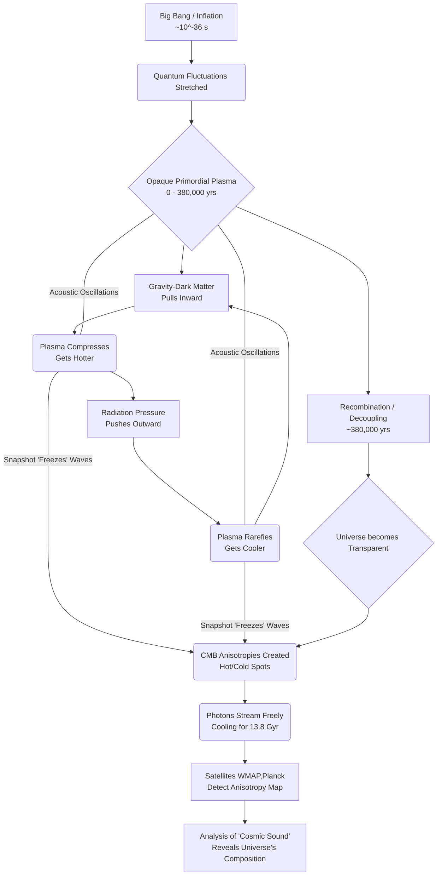

> [!pre-read-questions]
>
>   - What exactly *is* the Cosmic Microwave Background, and why is it described as a "background"?
>   - How was this radiation discovered, and why was the discovery so important?
>   - What are the "anisotropies," or tiny variations, in this background, and what do they tell us about the universe's past, present, and future?
>   - How does a "baby picture" of the universe, taken 380,000 years after the Big Bang, help us understand the age and composition of the cosmos *today*?
>   - What are the biggest unsolved mysteries or tensions that the CMB has revealed to modern cosmology?

-----

> [!abstract]
> This article provides a foundational, in-depth study of the [[Cosmic Microwave Background]] (CMB) radiation, the most significant and information-rich artifact of our universe's origin. We will explore the CMB as the "afterglow" of the Big Bang, a faint light released when the cosmos was a mere 380,000 years old, which now permeates all of space. This radiation is a near-perfect thermal "blackbody" at a temperature of just 2.725 Kelvin, a profound confirmation of the hot, dense state of the early universe.
>
> We will trace the intellectual and experimental journey of its prediction and eventual, serendipitous discovery, a moment that transformed cosmology from a speculative philosophy into a precision, observational science. The central thesis is that the CMB is not just a uniform, static "hiss." Its true power lies in its incredibly small temperature variations—or **anisotropies**—which are the fossilized "seeds" of all modern structure.
>
> By deconstructing the physics of the primordial plasma, the process of [[Recombination]], and the mechanisms that imprinted these anisotropies, we will demonstrate how the CMB acts as a "Rosetta Stone." We will examine the revolutionary data from the COBE, WMAP, and Planck satellites, which have used these anisotropies to precisely measure the universe's age (13.787 billion years), its geometry (perfectly flat), and its bizarre composition: a cosmos dominated by mysterious [[Dark Matter]] and [[Dark Energy]]. Finally, we will explore the frontier of modern cosmology, where the CMB is being interrogated for the "smoking gun" of [[Cosmic Inflation]] and has revealed a profound theoretical puzzle known as the [[Hubble Tension]].

# 1.0 📜Introduction

> [!quote]
> "Somewhere, something incredible is waiting to be known."
> — Carl Sagan

> [!the-purpose]
> This article's purpose is to build a deep, intuitive understanding of the Cosmic Microwave Background radiation. We are about to embark on a journey of cosmic time travel. Our vehicle is a faint, cold glow of microwave light that fills every corner of the sky, a signal that has traveled for over 13.7 billion years to reach us. This signal is the CMB.
>
> Think of the early universe as an unimaginably hot, dense, and opaque furnace. For hundreds of thousands of years, this furnace was filled with a "fog" of plasma—a chaotic soup of free-flying protons, electrons, and high-energy photons (light). This light was trapped, constantly scattering off the free electrons, like car headlights in a dense fog. You couldn't "see" anything.
>
> This article will explain the precise physical event—the [[Epoch of Recombination]]—that caused this cosmic "fog" to suddenly clear. We will explore how the light that was present at that exact moment was "released" and sent streaming unimpeded across the cosmos, carrying a perfect snapshot of the infant universe. This is the light we detect today. We will trace its remarkable discovery, deconstruct its physical properties, and, most importantly, explain how humanity learned to "read" the minute imperfections in this ancient light to write the definitive history of our universe and discover its ultimate fate.

# 2.0 ✒️🏛️Historical Context & Foundational Theories

The story of the CMB is a fantastic lesson in how science truly works. It's a tale of brilliant predictions, of being ignored, of independent re-invention, and of a world-changing discovery made by accident.

It begins, as all modern cosmology does, with [[Albert Einstein]]. In 1915, his theory of [[General Relativity]] provided the mathematical language to describe the universe as a whole. But Einstein's equations suggested the universe should be dynamic—either expanding or contracting. Disliking this, he added a "cosmological constant" to force his model to be static. This, he would later call his "biggest blunder."

The first heroes of an expanding universe were the Russian mathematician **Alexander Friedmann** (1922) and the Belgian priest and physicist **Georges Lemaître** (1927). They took Einstein's equations at face value and independently created the first mathematical models of an expanding cosmos. Lemaître went further, proposing that if the universe is expanding, it must have been smaller in the past. He traced this idea back to its logical origin: a "day without yesterday," a moment of creation from a "primeval atom." [^1] This was the first conceptual seed of the Big Bang.

In 1929, the American astronomer **Edwin Hubble** provided the shocking observational proof. By measuring the redshift of distant galaxies, he demonstrated that they were indeed flying away from us, and the farther they were, the faster they receded. The [[Hubble's Law|Hubble-Lemaître Law]] was born. The universe was undeniably expanding.

This discovery created a deep rift in 20th-century cosmology. Two rival camps emerged:

1. **The [[Steady State Theory]]:** Championed by Fred Hoyle, Thomas Gold, and Hermann Bondi, this model accepted expansion but rejected a beginning. It proposed that as galaxies move apart, new matter is continuously created in the empty space between them. In this model, the universe is eternal, infinite, and, on average, looks the same at all times.
1. **The [[Big Bang Theory]]:** This model, built on Lemaître's idea, argued for an origin. If the universe is expanding and cooling, it must have been hotter and denser in the past.

The key predictor of the CMB was **George Gamow**, a brilliant and playful physicist who, along with his students **Ralph Alpher** and **Robert Herman**, took the "hot Big Bang" idea seriously. In 1948, they reasoned that if the universe began in an incredibly hot, dense state, it would have been a perfect environment for nuclear fusion. They set out to see if the Big Bang could explain the observed abundances of chemical elements.

In this work, they had a stunning insight. For the first few minutes, the universe was a nuclear furnace, forging hydrogen, helium, and a bit of lithium. But to do this, the universe had to be *dominated* by intense radiation (photons). After this "nucleosynthesis," the universe would still be a hot, opaque plasma. Gamow, Alpher, and Herman realized that as the universe expanded and cooled, this radiation would cool with it. They predicted that this "relic radiation" from the universe's fiery birth should still be detectable today, as a faint, thermal glow of microwaves, with a temperature of about 5 to 10 Kelvin. [^2]

This was the prediction of the Cosmic Microwave Background. And it was almost completely ignored. It was a theoretical prediction in a field dominated by observational astronomy. The technology to detect it was in its infancy, and the worlds of theoretical physics and observational radio astronomy had little overlap.

The idea was re-invented in the early 1960s at Princeton University. Physicist **Robert Dicke**, working with his young colleagues **Jim Peebles**, P. G. Roll, and David Wilkinson, independently reasoned that the universe must have passed through a hot, dense phase. Dicke, an experimental genius, believed this "cosmic fireball" remnant could be found. He tasked Roll and Wilkinson with building a small, modern radio telescope (a "Dicke radiometer") to hunt for it.

Just 30 miles away, at the Bell Telephone Laboratories in Holmdel, New Jersey, two radio astronomers, **Arno Penzias** and **Robert Wilson**, were having a problem. They were using a large, highly sensitive horn antenna (a leftover from an early satellite communication project) to map faint radio signals from the Milky Way. But they were plagued by a persistent, low-level, background "hiss" that they simply could not eliminate.

> [!helpful-tip]
> This noise was uniform, day and night, and pointed in any direction. It wasn't the military, it wasn't urban interference, and it wasn't the antenna itself. They even, famously, climbed into the antenna and removed "a white dielectric material"—polite scientific language for pigeon droppings—thinking the bird waste might be the source of the thermal noise. [^3] The noise remained.

In 1965, Penzias mentioned his "noise" problem to a friend, who put him in touch with Robert Dicke's group at Princeton. The phone call that followed is legendary. The Princeton team immediately realized what Penzias and Wilson had found. The "hiss" was the 3-Kelvin afterglow of the Big Bang. The Princeton team knew they had been "scooped."

To avoid conflict, they published their findings simultaneously in the *Astrophysical Journal*.

  - Penzias and Wilson published their paper, "A Measurement of Excess Antenna Temperature at 4080 Mc/s," a dry, observational report of the signal. [^3]
  - Dicke, Peebles, Roll, and Wilkinson published their paper, "Cosmic Black-Body Radiation," providing the profound cosmological interpretation. [^4]

This discovery was the death knell for the [[Steady State Theory]]. It was the first solid, observational pillar of the Big Bang, turning it from an elegant theory into a testable, physical reality. Penzias and Wilson would receive the 1978 Nobel Prize in Physics for their discovery.

> [!ask-yourself-this]
> Provide an answer to:
>
>   - **How did the historical development of this idea shape our current understanding?**
>       - The 17-year gap between Gamow's prediction and Penzias/Wilson's discovery shows the crucial need for *both* testable theories and the experimental capability to test them. The discovery itself was accidental, but its *interpretation* was immediate because Dicke's group was actively looking for it. This event unified theoretical and observational cosmology, kicking off a "golden age" where the universe's fundamental properties became, for the first time, measurable.
>   - **Are there any abandoned theories that are as interesting as the current one?**
>       - The [[Steady State Theory]] is fascinating. Its core idea of a universe that is *eternal* and unchanging on average (a "perfect cosmological principle") has a deep philosophical elegance. It was a serious, mathematically rigorous rival to the Big Bang. However, it made a clear prediction: the universe should look the same everywhere and *at all times*. The CMB, an "artifact" from a hotter, denser *past*, violates this principle. The discovery of quasars, which exist only at great distances (and thus, in the distant past), was another stake in its heart. It died because it made predictions that were decisively proven false by observation.

-----

# 3.0 🔭🔬Deep Exposition: A Multi-Faceted Analysis

## 3.1 ⚛️Foundational Principles: The "Why"

Why *must* the CMB exist in a Big Bang universe? Its existence is an unavoidable consequence of two fundamental principles: the expansion and cooling of the cosmos, and the basic physics of plasma and atoms.

> [!principle-point]
> **Core Principle 1: The Expanding, Cooling Universe & [[Cosmological Redshift]]**
>
> The universe's expansion is not an explosion *into* a pre-existing void. It is the expansion of [[spacetime]] itself. Every point in space is moving away from every other point.
>
> A photon (a particle of light) travels with a specific wavelength. As it traverses the cosmos for billions of years, the very fabric of space *it is traveling through* expands, stretching the photon's wavelength along with it. This stretching is called **cosmological redshift**.
>
> A photon's energy is inversely proportional to its wavelength.
>
>   - Short wavelength (like blue light) = High energy.
>   - Long wavelength (like red light) = Low energy.
> 
> As the photon's wavelength is stretched, its energy decreases. For a vast collection of photons, like the radiation in the early universe, this "loss of energy" manifests as a *drop in temperature*. The fiery, white-hot glow of the early universe has been redshifted all the way down to the cool, invisible microwave spectrum. The CMB is the "ember" of a fire that has been cooling for 13.8 billion years.

> [!quote]
> "We are part of the universe that has developed a ability to reflect on itself."
> — Robert Dicke

> [!definition]
> **Redshift ($z$):** A dimensionless quantity that astronomers use to measure cosmic distance and time. It's the fractional change in a photon's wavelength. A redshift of $z=0$ is today. A redshift of $z=1$ means the universe was half its current size, and the light from that object has traveled for about 7.7 billion years. The CMB comes from a redshift of $z \approx 1100$, when the universe was 1,100 times smaller (and hotter) than it is today.

-----

> [!principle-point]
> **Core Principle 2: The Primordial Plasma & The Epoch of Recombination**
>
> For the first 380,000 years after the Big Bang, the universe was unfathomably hot (billions, then millions, then thousands of degrees). This temperature was so high that atoms could not exist. The cosmos was a seething, opaque soup called a **plasma**, made of:
>
> 1.  **Protons** (hydrogen nuclei)
> 1.  **Helium nuclei**
> 1.  **Free-flying electrons**
> 1.  **Photons** (light)
> 
> In this plasma, photons were not free. They were trapped in a cosmic "pinball machine," constantly slamming into the free-flying electrons via a process called **[[Thomson Scattering]]**. A photon would travel a tiny distance, hit an electron, and scatter in a random direction. The universe was, therefore, completely *opaque*. It was like being inside a star, or a very dense fog.
>
> > [!analogy]
> > Imagine you are in the middle of a dense, thick cloud. You can't see the *edge* of the cloud, or anything outside of it. All you see is a uniform, bright white "fog" in every direction, because the light from the sun is scattering off of countless water droplets all around you. This was the state of the early universe.
>
> As the universe expanded, it cooled. For 380,000 years, the temperature dropped. It finally reached a magic number: **approximately 3,000 Kelvin**.
>
> At this temperature, the photons in the "cosmic soup" no longer had enough energy to knock electrons away from protons. For the first time, stable, neutral hydrogen atoms could form. The free-flying electrons were "captured" by the protons. This event is called **[[Recombination]]**.
>
> With the free electrons suddenly gone (locked up inside atoms), the "fog" instantly cleared. The photons that were bouncing around found no more electrons to scatter off of. At that *exact* moment, every photon in the universe was "decoupled" from matter and began to travel in a straight line, unimpeded.
>
> This "snapshot" of light from 380,000 years post-Big Bang has been traveling ever since. It has been redshifted by the universe's expansion from 3,000 K (a dull, orange-red glow) all the way down to **2.725 K** (invisible microwaves). When you look at the CMB, you are looking at the "surface" of that ancient cosmic fog. You are seeing the "last scattering surface," the very moment the universe became transparent.

-----

## 4.0 ⚙️Mechanisms And Processes: The "How"

The discovery of the CMB was monumental. But the discovery of its *properties* is what built modern cosmology. How do we study it, and what do its features mean?

### 4.1 The Blackbody Spectrum: A Perfect Thermal Echo

In the 1970s, scientists began launching rockets and balloons to measure the CMB at different frequencies, trying to prove it had the specific "blackbody" spectrum predicted by theory.

> [!definition]
> **Blackbody Spectrum:** The specific, continuous spectrum of light emitted by an object in perfect thermal equilibrium (an object that absorbs all radiation that\_ falls on it). The shape of this curve depends *only* on its temperature. Your body, a hot piece of iron, and a star all have blackbody-like spectra.

The early plasma, with photons and matter constantly interacting, was the most perfect thermal-equilibrium system imaginable. It *must* have emitted a perfect blackbody spectrum.

The definitive proof came in 1990 from NASA's **[[COBE (Cosmic Background Explorer)]]** satellite. Its FIRAS (Far-Infrared Absolute Spectrophotometer) instrument measured the CMB spectrum with breathtaking precision. When the scientists presented the data, the plot of theoretical temperature (2.73 K) versus the observed data was a *perfect* match. The error bars on the data points were so small they were *inside the width of the theoretical line*. [^5] It was a perfect standing ovation for the Big Bang model.

### 4.2 Isotropy vs. Anisotropy: The Smooth and the Lumpy

When Penzias and Wilson first measured the CMB, it seemed perfectly **isotropic**—the same temperature in every direction. This smoothness is, itself, profound. It supports the **[[Cosmological Principle]]**, the assumption that the universe is, on large scales, homogeneous and isotropic (the same everywhere and in all directions).

But this smoothness also presented a massive puzzle: the **Horizon Problem**. How could two regions of the sky, on opposite horizons, "know" to be at the *exact* same temperature? According to standard Big Bang theory, they were never in causal contact—they were too far apart for light (or any information) to have traveled between them in the age of the universe.

> [!insight]
> The leading solution to this (and other) problems is **[[Cosmic Inflation]]**. Proposed by Alan Guth in 1980, this theory suggests that in the first *fraction of a second* ($10^{-36}$ s) after the Big Bang, the universe underwent a period of *exponential* expansion, stretching from smaller than an atom to larger than a grapefruit almost instantly. This "inflation" would have taken a single, tiny, causally-connected patch (where everything *was* at the same temperature) and stretched it to become the entire observable universe. This elegantly explains the large-scale smoothness.

But inflation also made *another* prediction. According to quantum mechanics, that tiny initial patch would not have been *perfectly* smooth. It would have been simmering with tiny, random **quantum fluctuations**. Inflation would have "frozen" these subatomic fluctuations and stretched them to macroscopic, astrophysical scales.

These stretched-out fluctuations would have created regions of *slightly* higher density and *slightly* lower density in the primordial plasma. These are the **anisotropies**. And they are the single most important feature of the CMB.

### 4.3 Anisotropies: The Seeds of All Structure

In 1992, the COBE team, led by George Smooth, announced their second monumental discovery: they had found the anisotropies. The "lumpiness." The variations were minuscule, just **1 part in 100,000**, but they were there. [^6]

> [!quote]
> "If you're religious, it's like looking at God."
> — George Smooth, on the discovery of the anisotropies

These anisotropies are the "DNA" of the cosmos. The slightly denser, *colder* spots (colder because photons had to use energy to climb out of their gravity well) are the "seeds" that gravity would pull on for the next 13.8 billion years. These are the seeds that grew into every galaxy, every star cluster, and every galaxy supercluster we see today. You are, in a very real sense, the product of a 1-in-100,000 quantum fluctuation.

### 4.4 Acoustic Oscillations: The "Sound" of the Cosmos

Later, high-resolution missions like **[[WMAP (Wilkinson Microwave Anisotropy Probe)]]** and **[[Planck (satellite)|Planck]]** would map these anisotropies in exquisite detail. The map of hot and cold spots wasn't just random static. It had a *structure*. The most prominent feature was a characteristic *size* of the spots, about 1 degree across the sky.

This structure is the fossilized evidence of **acoustic oscillations**—sound waves—rippling through the primordial plasma.

> [!analogy]
> **The Cosmic Drum:**
> Imagine the primordial plasma as the surface of a drum. The quantum fluctuations (from inflation) "struck" this drum everywhere at once. This created pressure waves—sound waves—that rippled through the plasma.
>
> Two forces were in a cosmic tug-of-war:
>
> 1.  **Gravity (from Dark Matter):** The invisible dark matter, which doesn't interact with light, began clumping in the slightly denser regions, pulling the plasma *in*.
> 1.  **Radiation Pressure:** The photons (light) were "hot" and coupled to the electrons, creating a powerful outward pressure that pushed the plasma *out*.
> 
> For 380,000 years, this battle raged. Gravity would pull a "clump" of plasma in, it would compress, heat up, and the radiation pressure would blast it back out. It would rarefy, cool, and gravity would pull it back in.
>
> Then, at 380,000 years, **Recombination happened.** The "fog" cleared. The electrons and photons decoupled. The radiation pressure *vanished*, and the photons streamed away. We took a "snapshot" of the drum's surface at that exact moment.
>
>   - The "cold spots" (denser) in the CMB are regions that were at maximum *compression* when the snapshot was taken.
>   - The "hot spots" (less dense) are regions that were at maximum *rarefaction*.

The "sound" of these waves (their "fundamental frequency") is set by the distance a wave could travel in 380,000 years. This "sound horizon" is the 1-degree scale we see.



```mermaid
graph TD
    A[Big Bang / Inflation<br>~10^-36 s] --> B(Quantum Fluctuations Stretched);
    B --> C{Opaque Primordial Plasma<br>0 - 380,000 yrs};
    D[Gravity (Dark Matter)<br>Pulls Inward] --> E(Plasma Compresses<br>Gets Hotter);
    F[Radiation Pressure<br>Pushes Outward] --> G(Plasma Rarefies<br>Gets Cooler);
    C --> D;
    E --> F;
    G --> D;
    C -- "Acoustic Oscillations" --- E & G;
    C --> H[Recombination / Decoupling<br>~380,000 yrs];
    H --> I{Universe becomes Transparent};
    E & G -- "Snapshot 'Freezes' Waves" --> J(CMB Anisotropies Created<br>Hot/Cold Spots);
    I --> J;
    J --> K(Photons Stream Freely<br>Cooling for 13.8 Gyr);
    K --> L[Satellites (WMAP, Planck)<br>Detect Anisotropy Map];
    L --> M[Analysis of 'Cosmic Sound'<br>Reveals Universe's Composition];
```

-----

## 5.0 🔬Observational Evidence and Manifestations: The "What"

The analysis of *how* these acoustic waves behaved—the precise "harmonics" of this cosmic sound—is how we have measured the universe. By analyzing the "power spectrum" (a graph of the size of the spots vs. their intensity), we can determine the *exact ingredients* of the plasma they were moving through.

> [!evidence]
> The primary evidence comes from the **[[WMAP]]** (2001-2010) and **[[Planck (satellite)|Planck]]** (2009-2013) satellites. They provided high-fidelity, all-sky maps of the CMB anisotropies. The "power spectrum" derived from these maps is one of the most important plots in all of science. [^7]

By fitting a theoretical model to this data, we can precisely measure the universe's vital statistics. This is the **[[Lambda-CDM Model]] ($\Lambda$CDM)**, our Standard Model of Cosmology.

  - **The First Peak (Geometry):** The *position* of the main 1-degree peak tells us the geometry of the universe. If the universe were positively curved (like a sphere), the spots would look magnified (larger than 1 degree). If it were negatively curved (like a saddle), they would look minified (smaller).

    > [!key-claim]
    > Based on the evidence, a key claim is that the universe is **perfectly geometrically flat**. [^7] The angles of a triangle drawn across the cosmos would add up to 180 degrees. This is a major prediction of cosmic inflation.

  - **The Second Peak (Baryonic Matter):** The *height* of the second peak (a harmonic of the first) relative to the first tells us the density of normal, **baryonic matter** (the stuff you and I are made of). This is because baryonic matter adds to the *gravity* (pulling in) but also gets *pushed* by the radiation pressure (pushing out), changing the "sound" of the waves.

  > [!key-claim]
   > Baryonic matter makes up only **\~4.9%** of the total energy-density of the universe. [^7]

  - **The Third Peak (Dark Matter):** The *height* of the third peak tells us the density of **Dark Matter**. Dark matter *only* interacts with gravity. It falls into the "wells" but doesn't get pushed out by light. This changes the balance of the tug-of-war, suppressing the "rebound" of the wave and affecting the third peak.

 > [!key-claim]
 > Dark Matter, the invisible "scaffolding" of the cosmos, makes up **\~26.8%** of the universe. [^7]

  - **The Overall "Tilt" and Damping (Dark Energy):** The overall properties of the map, including how the peaks are "damped" at small scales and how they relate to the expansion history, tell us the final, most mysterious component.

  > [!key-key-claim]
 > The remaining **\~68.3%** of the universe is **[[Dark Energy]]**, a mysterious pressure inherent in spacetime itself that is causing the universe's expansion to *accelerate*. [^7]

> [!quote]
> "The Universe is under no obligation to make sense to you."
> — Neil deGrasse Tyson

-----

## 6. 🌍Broader Implications and Significance: The "So What"

The CMB, more than any other observation, transformed cosmology. It took us from a "Standard Model" with huge error bars to a **"Precision Cosmology"** with parameters measured to percent-level accuracy.

  - **The Inventory of the Cosmos:** We now have a "cosmic inventory" of the universe. We know its age (13.787 ± 0.020 billion years), its expansion rate (the Hubble constant, $H_0$), and its precise, bizarre ingredients. This is a staggering human achievement.
  - **The Origin of Structure:** The CMB map is *not* a picture of galaxies. It's the *blueprint*. Cosmologists use the Planck anisotropy map as the *initial condition* ($z=1100$) for massive computer simulations. They let gravity and dark energy act on this initial map, and 13.8 billion years of simulated time later, the computer-generated "cosmic web" of galaxies and voids looks *exactly* like the large-scale structure of the universe we observe today.

> [!connection-ideas]
> The principles of the CMB strongly connect to the field of [[Particle Physics]]. The CMB is a "poor man's particle accelerator." The conditions in the early universe (especially during inflation) involved energies that are *trillions* of times higher than anything we can create at the Large Hadron Collider (LHC). The anisotropies, therefore, are a direct observational window into the physics of *grand unification* and *quantum gravity*, providing data that particle physicists could never get on Earth.

> [!counter-argument]
> An important counter-argument, or rather, a profound *tension*, has emerged from the CMB's precision. This is the **[[Hubble Tension]]**.
>
>   - **Planck's data (the CMB)** gives us a "snapshot" of the early universe. Using the $\Lambda$CDM model, we can *predict* what the expansion rate should be *today*. This prediction gives a Hubble constant ($H_0$) of **\~67.4 km/s/Mpc**.
>   - **Local Measurements** of the *modern* universe, using "standard candles" like Type Ia supernovae and Cepheid variable stars, *directly measure* the expansion rate. These measurements consistently give a value of **\~73-74 km/s/Mpc**. [^8]
> 
> These two numbers, derived from the early universe and the late universe, *should* match. They do not. The discrepancy is statistically "5-sigma," meaning it's highly unlikely to be a fluke. This is the biggest crack in our Standard Model of Cosmology. It suggests that either (a) one of the measurements has a deep, unknown error, or (b) our $\Lambda$CDM model is *incomplete*, and some new physics (like "Early Dark Energy") is needed to connect the early universe to the present.

-----

## 7. ❔Frontier Research & Unanswered Questions

The CMB is far from a closed book. It remains the most fertile ground for answering the *next* set of questions in cosmology.

### 1. The Hunt for Primordial B-Modes

The anisotropies we've discussed (the hot and cold spots) create a specific polarization pattern in the CMB light, known as **"E-modes."** These have been thoroughly mapped.

But the theory of inflation predicts a *second* type of polarization: a faint, swirling pattern called **"B-modes."** These B-modes can *only* be generated by one thing: **primordial gravitational waves**—ripples in spacetime itself—churned up by the violent process of inflation. [^9]

Finding these B-modes would be the "smoking gun" of inflation. It would be direct, observational proof of this exponential expansion and a window into the quantum-gravity era of the universe's first second.

> [!important]
> This search is incredibly difficult. Galactic dust also emits polarized light that mimics B-modes, as does the gravitational lensing of the E-modes. In 2014, the BICEP2 team famously announced they had found B-modes, only to retract the claim after it was shown to be contamination from dust. The hunt is now on with next-generation experiments like the **Simons Observatory** and **CMB-S4**, which are designed to finally separate the signal from the noise.

### 2. Solving the Hubble Tension

This is arguably the most active area of theoretical cosmology. What new physics could resolve the $H_0$ discrepancy?

  - **Early Dark Energy:** Perhaps there was a short-lived burst of dark energy *before* recombination, which would change the "ruler" (the sound horizon) we use to measure the CMB, bringing its prediction in line with local measurements.
  - **Modified Gravity:** Perhaps General Relativity itself works differently on cosmic scales.
  - **Exotic Dark Matter:** Perhaps dark matter has interactions we don't know about.

### 3. The CMB "Anomalies"

When Planck produced its near-perfect map, it confirmed the $\Lambda$CDM model with stunning precision… *almost*. A few lingering, low-probability "anomalies" remain that just don't fit the model.

  - **The Cold Spot:** A large, unusually cold region of the sky. Is it just a 1-in-1000 statistical fluke? Or is it something real, like the "bruise" from a collision with another "bubble universe"?
  - **Hemispherical Asymmetry:** The CMB is slightly "lopsided," with the fluctuations on one side of the sky being slightly stronger than on the other. This violates the Cosmological Principle.
  - **The "Axis of Evil":** The largest-scale fluctuations (the "quadrupole" and "octupole") seem to be bizarrely aligned with the plane of our own solar system. This makes *no* sense, as our tiny solar system should have no influence on the entire cosmos.

Are these statistical flukes that will go away with more data? Or are they the first hints of a "crack" in our most fundamental assumptions about the universe?

> [!question]
> Answer this Question:
>
>   - **What is the single biggest unanswered question in this field right now?**
>       - There are two, tied for first place:
> <!-- end list -->
>     1.  **What is the physical mechanism of Inflation?** (And can we prove it by detecting primordial B-modes?)
>     1.  **What is the cause of the Hubble Tension?** (Is it a measurement error or the first sign of new physics beyond our Standard Model?)

-----

## 8. 🦕Conclusion

> [!summary]
> The Cosmic Microwave Background is more than just an old, cold light. It is a time machine, a blueprint, and a cosmic Rosetta Stone. It began as a "hiss" in a New Jersey antenna, a nuisance signal that turned out to be the echo of creation. This discovery single-handedly validated the [[Big Bang Theory]] and transformed cosmology into a precision science.
>
> In its near-perfect thermal spectrum, we found definitive proof of a hot, dense past. In its large-scale smoothness, we found the first compelling evidence for a period of [[Cosmic Inflation]]. And in its tiny, 1-in-100,000 anisotropies, we found the very "seeds" of all existence. These "lumps," born as quantum fluctuations, were sculpted by gravity and pressure into "sound waves" that rippled through the primordial plasma.
>
> By learning to "listen" to this 380,000-year-old "sound," we have reverse-engineered the cosmos. The CMB has told us the universe's age, its flat geometry, and its shocking inventory: a universe made of almost 95% "dark" components that we do not understand. And it continues to guide us, pointing to new mysteries like the [[Hubble Tension]] and the hunt for B-modes. The CMB is the ultimate expression of the "cosmic perspective"—a picture of our infant universe that shows us both our humble origins and the vast, unknown territory that still lies ahead.

-----

## 9. 🧠Key Questions for Active Reading & Reflection

> [!ask-yourself-this]
>
>   - **How would I explain the central idea of this article to someone with no background in this field? (The Feynman Technique)**
>       - The universe started as a super-hot, dense "fog." As it expanded, it cooled. After 380,000 years, this "fog" suddenly cleared, releasing all the light that was trapped inside it. The Cosmic Microwave Background is that ancient light, which has been traveling through space for 13.8 billion years. It's like a "baby picture" of the universe. This "picture" isn't perfectly smooth; it has tiny "blotches." These blotches are the seeds that gravity used to build all the galaxies, stars, and planets we see today. By studying the size and pattern of these blotches, we can figure out the universe's age, what it's made of (mostly weird dark stuff), and how it's expanding.
>   - **What was the most surprising or counter-intuitive concept presented? Why?**
>       - For many, it's the [[Hubble Tension]]. The fact that our "Standard Model of Cosmology" is so stunningly successful and precise, yet it features a fundamental, 5-sigma disagreement between its *predictions* for today (based on the *early* universe) and our *measurements* of today (from the *late* universe). This suggests that the "greatest theory ever" might be wrong, or at least incomplete, in a profound way.
>   - **What pre-existing knowledge did this article connect with or challenge for me?**
>       - This article connects directly to fundamental concepts in thermodynamics (blackbody radiation), atomic physics (ionization and recombination), quantum mechanics (fluctuations), and Einstein's General Relativity (expansion of spacetime, geometry). It challenges the "common sense" notion that the universe is just empty space with "stuff" in it, replacing it with a dynamic, evolving entity whose properties are measurable.

> [!quote]
> "The effort to understand the universe is one of the very few things that lifts human life a little above the level of farce, and gives it some of the grace of tragedy."
> — Steven Weinberg

> [!important]
> Identify three key terms or concepts from this article. Write your own definition for each and create a new note to link them back to this one.
>
> 1.  `[[Epoch of Recombination]]`
> 1.  `[[Cosmic Anisotropies]]`
> 1.  `[[Lambda-CDM Model]]`

> [!question]
>
>   - **What is one question I still have after reading this? Where might I look for an answer?**
>       - A key question might be: "If the 'Axis of Evil' and the 'Cold Spot' are *not* statistical flukes, what are the leading *physical* theories that could explain them?" To find an answer, one would have to look beyond standard cosmology articles and into more speculative papers and reviews, perhaps searching for terms like "CMB anomalies," "cosmic topology," or "multiverse collision models" on physics preprint servers (like arXiv.org) or in advanced cosmology review journals.

-----

## 10. 📚 References

> [!cite]

[^1]:

    Lemaître, G. (1927). "Un Univers homogène de masse constante et de rayon croissant, rendant compte de la vitesse radiale des nébuleuses extra-galactiques." *Annales de la Société Scientifique de Bruxelles*, A47, pp. 49–59.

[^2]:

    Alpher, R. A., & Herman, R. (1948). "Evolution of the Universe." *Nature*, 162(4124), pp. 774–775.

[^3]:

    Penzias, A. A., & Wilson, R. W. (1965). "A Measurement of Excess Antenna Temperature at 4080 Mc/s." *The Astrophysical Journal*, 142, pp. 419–421.

[^4]:

    Dicke, R. H., Peebles, P. J. E., Roll, P. G., & Wilkinson, D. T. (1965). "Cosmic Black-Body Radiation." *The Astrophysical Journal*, 142, pp. 414–419.

[^5]:

    Mather, J. C., et al. (1994). "Measurement of the cosmic microwave background spectrum by the COBE FIRAS instrument." *The Astrophysical Journal*, 420, pp. 439–444.

[^6]:

    Smooth, G. F., et al. (1992). "Structure in the COBE differential microwave radiometer first-year maps." *The Astrophysical Journal*, 396, pp. L1–L5.

[^7]:

    Planck Collaboration (2020). "Planck 2018 results. VI. Cosmological parameters." *Astronomy & Astrophysics*, 641, A6. (This is the definitive paper on $\Lambda$CDM parameters).

[^8]:

    Riess, A. G., et al. (2022). "A Comprehensive Measurement of the Local Value of the Hubble Constant with 1 km/s/Mpc Uncertainty from the Hubble Space Telescope and the SH0ES Team." *The Astrophysical Journal Letters*, 934(1), L7.

[^9]:

    Kamionkowski, M., & Kovetz, E. D. (2016). "The Quest for B: A Review of B-Mode Polarization in the Cosmic Microwave Background." *Annual Review of Astronomy and Astrophysics*, 54, pp. 227-269.
