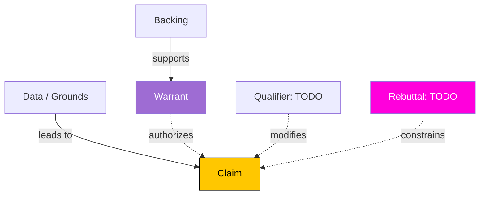

<%*
/* TOULMIN ARGUMENT MAPPING TEMPLATE  v1.0.0
   Use when you need to surgically decompose an argument's structure. */
const subject = await tp.system.prompt("Argument being mapped (one line)?");
if (!subject) return;
const source = await tp.system.prompt("Source", "self");
const slug   = subject.toLowerCase().replace(/[^a-z0-9\s-]/g,"").replace(/\s+/g,"-").slice(0,50);
const fname  = `${tp.date.now("YYYY-MM-DD")}_toulmin_${slug}`;
await tp.file.rename(fname);
await tp.file.move(`/03-notes/critical-thinking-practice/${fname}`);
tR += "";
%>---
title: "Toulmin Map: <% subject %>"
aliases: []
tags:
  - critical-thinking
  - toulmin
  - argument-mapping
  - argument-analysis
  - deliberate-practice
created: <% tp.date.now("YYYY-MM-DD") %>
modified: <% tp.date.now("YYYY-MM-DD") %>
type: critical-thinking-session
framework: toulmin
source: "<% source %>"
status: in-progress
argument-strength: 
related: []
---

# Toulmin Map: <% subject %>

> [!abstract] [[Toulmin Argument Model]]
> Six-part argument decomposition. The diagnostic value is in surfacing the **Warrant** (the usually-implicit principle that licenses moving from Data to Claim) and the **Rebuttal** (the conditions under which the argument fails).

**Source:** <% source %>

---

## 🎯 CLAIM

> *What conclusion is being asserted?*

[**Claim**:: ]

> 

---

## 📊 DATA / GROUNDS

> *What evidence is offered in support?*

[**Data**:: ]

- 
- 
- 

---

## 🔗 WARRANT

> *What general principle, rule, or assumption authorizes the move from Data to Claim?*
> This is usually **implicit** — surfacing it is the highest-leverage move.

[**Warrant**:: ]

> 

---

## 🏛 BACKING

> *What supports the warrant itself? (research, law, common knowledge, expert consensus)*

[**Backing**:: ]

> 

---

## 🎚 QUALIFIER

> *How strong is the claim? (necessarily / probably / usually / sometimes / possibly)*

**Qualifier strength:** `INPUT[inlineSelect(option(necessarily), option(probably), option(usually), option(sometimes), option(possibly)):qualifier]`

[**Qualifier-Wording**:: ]

> 

---

## ⚠ REBUTTAL

> *Under what conditions would the claim fail? What are the exceptions?*

[**Rebuttal-Conditions**:: ]

- 
- 

---

## 🗺 Visual Argument Map (Mermaid)

---

## 🔍 Diagnostic Questions

1. **Is the Warrant defensible?** *(If not, the argument collapses regardless of Data quality.)*
   > 
2. **Is the Backing adequate for the Warrant?**
   > 
3. **Is the Qualifier appropriately calibrated to the evidence?**
   > 
4. **Does the Rebuttal apply to the present case?**
   > 

---

## 📈 Overall Argument Strength

**Rating:** `INPUT[slider(minValue(1), maxValue(5), addLabels):argument-strength]`

**Where is the weakest link?** *(Claim / Data / Warrant / Backing / Qualifier / Rebuttal)*
> 

---

## ⚙ Metacognitive Check

- What did surfacing the **implicit warrant** reveal that wasn't obvious initially?
  > 
- Was this argument stronger or weaker than my pre-analysis impression?
  > 

---

# 🔗 Related

- [[Toulmin Argument Model]]
- [[Argument Mapping]]
- [[Warrant Identification]]
- [[Critical Thinking Practice MOC]]
