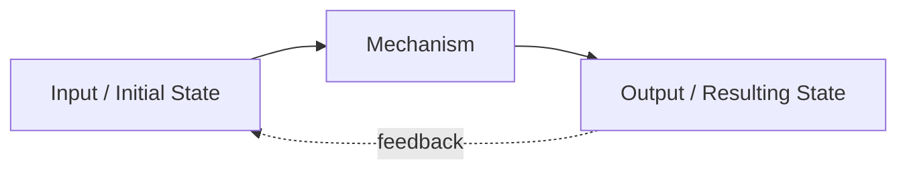

---
# ═══════════════════════════════════════════════════════════════
# CORE IDENTITY
# ═══════════════════════════════════════════════════════════════
title: "{{Human-Readable Name}}"
aliases:
  - "{{Alias 1}}"
  - "{{Abbreviation if any}}"
  - "{{Common alternative phrasing}}"
type: permanent-note
note-subtype: mental-model
status: budding              # seedling | budding | evergreen | wilting
confidence: high             # low | medium | high

# ═══════════════════════════════════════════════════════════════
# CLASSIFICATION
# ═══════════════════════════════════════════════════════════════
tags:
  - permanent-note
  - mental-model
  - latticework
  - "domain/{{primary-discipline}}"     # e.g. domain/cognitive-science
  - "subdomain/{{subdomain}}"           # e.g. subdomain/reasoning
  - "model-type/{{type}}"               # process | structural | dynamic | normative | descriptive

# ═══════════════════════════════════════════════════════════════
# TEMPORAL
# ═══════════════════════════════════════════════════════════════
created: "{{YYYY-MM-DD}}"
updated: "{{YYYY-MM-DD}}"

# ═══════════════════════════════════════════════════════════════
# CLASSIFICATION & DISCOVERY (Pipeline-Compatible)
# ═══════════════════════════════════════════════════════════════
domain: "{{primary-discipline}}"
subdomains: ["{{sub-1}}", "{{sub-2}}"]
primary_domain: "{{Capitalized Discipline Name}}"
secondary_domains: ["{{Related-1}}", "{{Related-2}}"]
knowledge_level: "intermediate"     # introductory | intermediate | advanced

# ═══════════════════════════════════════════════════════════════
# THREE-LAYER QUALITY FRAMEWORK
# (per [[mental-models-foundational-report-2026-05-10]])
# ═══════════════════════════════════════════════════════════════
quality:
  fidelity: 0           # 1-5 — structural correspondence to modeled domain
  tractability: 0       # 1-5 — cost to assemble + run vs. urgency
  transferability: 0    # 1-5 — cross-domain structural reach
  composite: 0.0        # average of the three
  weakest-dimension: "{{which of the three}}"
  cultivation-target: "{{which dimension to invest in next}}"

# ═══════════════════════════════════════════════════════════════
# LATTICEWORK INTEGRATION
# (per the foundational report's density heuristic)
# REQUIREMENT: cross-domain-links MUST be ≥ 3
# ═══════════════════════════════════════════════════════════════
latticework:
  cross-domain-links: 3
  structural-analogs:
    - model: "[[other-model-1]]"
      structural-correspondence: "{{what structure is shared}}"
      cross-domain-problem-illuminated: "{{concrete example}}"
    - model: "[[other-model-2]]"
      structural-correspondence: "{{what structure is shared}}"
      cross-domain-problem-illuminated: "{{concrete example}}"
    - model: "[[other-model-3]]"
      structural-correspondence: "{{what structure is shared}}"
      cross-domain-problem-illuminated: "{{concrete example}}"

# ═══════════════════════════════════════════════════════════════
# RELATIONSHIPS (vault graph integration)
# ═══════════════════════════════════════════════════════════════
related: []
prerequisites: []
specializes: []              # this is a more specific case of...
broader: []                  # this is a special case within...
contrasts-with: []
complements: []
enables: []
builds-on: []

# ═══════════════════════════════════════════════════════════════
# EPISTEMIC & VALIDATION
# ═══════════════════════════════════════════════════════════════
key-researchers: []
foundational-citation: "{{Author, Year, Work}}"
epistemic_status: "well-established"   # well-established | well-motivated | speculative | contested
hallucination_check: false              # set true after manual verification

# ═══════════════════════════════════════════════════════════════
# PERSONAL KNOWLEDGE MANAGEMENT
# ═══════════════════════════════════════════════════════════════
review-frequency: monthly             # weekly | monthly | quarterly
mastery-stage: budding                # seedling | budding | evergreen | wilting
importance: high                      # low | medium | high | critical
foundational-for-future-learning: true
source-reports:
  - "[[mental-models-foundational-report-2026-05-10]]"
---

# {{Model Name}}

> [!definition] {{Model Name}}
> {{1-3 sentence definition that captures structure + dynamics + boundary in a single statement.}}
>
> **Defining property**: {{what makes this distinctively this model and not something else}}
>
> **See also**: [[link-1]], [[link-2]], [[link-3]]

## In-Depth Definition

{{2–4 paragraphs that elaborate the model: its origin, its claim about how some part of the world works, and the operations it supports. Wiki-link aggressively per vault convention. Cite key researchers inline.}}

> [!boundary] Scope of Valid Application
> **Applies when**: {{conditions under which this model's predictions track observation}}
>
> **Does NOT apply when**: {{conditions under which this model's predictions degrade or invert}}
>
> **Domain of original development**: {{the discipline where this model was formalized}}
>
> **Far-transfer caveats**: {{what breaks when transporting to other domains}}

## Mechanism / How It Works

{{Step-by-step explanation of the dynamic the model captures. Use numbered steps if the mechanism is sequential; use a Mermaid diagram if the mechanism is branching or networked.}}

## Visual Representation



```text
{{ASCII complement to the Mermaid diagram. Some PKB views render only one format.}}
```

## Related Mental Models (Latticework Position)

> [!key-claim] Latticework Density
> This model connects to **{{N}}** other models in the vault across **{{M}}** disciplines. The most consequential structural correspondences:

- **[[other-model-1]]** — *{{structural correspondence}}*. Cross-domain problem illuminated: {{one concrete example}}.
- **[[other-model-2]]** — *{{structural correspondence}}*. Cross-domain problem illuminated: {{one concrete example}}.
- **[[other-model-3]]** — *{{structural correspondence}}*. Cross-domain problem illuminated: {{one concrete example}}.
- {{additional links as warranted}}

> [!warning] When NOT to Reach for This Model
> {{The over-modeling pathology applied to this specific model — when does deploying this model produce worse outcomes than simply engaging directly with the situation? This callout is MANDATORY.}}

## Real-World Examples

> [!example] Canonical Example ({{domain of origin}})
> {{The textbook case that illustrates the model in its native domain.}}

> [!example] Far-Transfer Example ({{non-obvious domain}})
> {{An application of the model in a domain *other* than its native one. The structural correspondence with the canonical case must be explicit. This callout is MANDATORY and exercises the transferability dimension.}}

> [!example] Personal Application
> *Placeholder — record an instance from your own work or life where this model proved (or failed to prove) useful. Note what cued you to reach for it and what you observed.*

## Research & Empirical Foundation

{{2-3 paragraphs summarizing the empirical or theoretical basis. Cite primary sources. Distinguish what is established from what is contested.}}

> [!cite] {{Author, Year}}
> {{Brief description of the work and its specific contribution to this model's foundation.}}

> [!cite] {{Author, Year}}
> {{...}}

## Pitfalls & Limitations

> [!warning] Failure Mode 1 — {{name}}
> {{Specific way this model fails, plus the diagnostic signal that the failure is occurring.}}

> [!warning] Failure Mode 2 — {{name}}
> {{...}}

> [!warning] Self-Sealing Risk
> {{Does this model resist falsification? If so, how, and what counter-discipline keeps it honest?}}

## Practical Exercises

1. **Identification exercise**: {{Identify this model operating in a domain you work in. What were the cues?}}
2. **Inversion exercise**: Apply [[inversion]] — find a case where the *opposite* of this model's prediction holds, and diagnose why.
3. **Latticework exercise**: Articulate the structural correspondence between this model and one of its cross-domain analogs from the YAML `latticework.structural-analogs` field.

## Case Studies

> [!case-study] {{Title — include for high-importance models only}}
> {{Extended worked example showing the model deployed end-to-end in a real situation.}}

## Personal Notes

> [!reflection]
> *Placeholder — record your own experience, doubts, modifications, or refinements of the model. What does it look like when you actually deploy it? Where has it surprised you?*

## Three-Layer Quality Self-Assessment

> [!methodology-and-sources]
> - **Fidelity** ({{score}}/5): {{one-sentence justification}}
> - **Tractability** ({{score}}/5): {{one-sentence justification}}
> - **Transferability** ({{score}}/5): {{one-sentence justification}}
> - **Weakest dimension**: {{which}} → **Cultivation target**: {{what investment would strengthen it}}

## Source Material

- Primary: [[mental-models-foundational-report-2026-05-10]] (sections {{X}}, {{Y}})
- Secondary: [[other-source-1]], [[other-source-2]]

## Connections (Reciprocal Links Audit)

*Auto-populated section — to be filled by `linkcheck` script output during Phase 8 (densification). Lists every note that links **to** this note, used to verify reciprocity.*
