# Quick Reference Card

## 🗂️ Array Organization Overview

```
MASTER TAXONOMY (577 Total Tags)
│
├─ GROUP A: META-DIMENSIONS (92 tags)
│  ├─ A1: Type (23) ……………………… 📑 Document classification
│  ├─ A2: Status (14) ……………………. 🚦 Workflow states
│  ├─ A3: Context & Source (25) …………… 🌐 Contextual attributes
│  └─ A4: Mode/Nature/Model/Validation (30) … ⚙️ Technical attributes
│
├─ GROUP B: TOP-LEVEL (67 tags)
│  ├─ B1: Domains L1/L2 (39) ……………… 🧠 Primary knowledge areas
│  └─ B2: Systems & Methodologies (28) …….. 🔄 High-level frameworks
│
├─ GROUP C: SUB-DOMAINS (127 tags)
│  ├─ C1: PKM/PKB Parent Paths (45) ……….. 💎 PKM hierarchies
│  ├─ C2: Cognitive Parent Paths (27) ……… 🧩 Cognitive hierarchies
│  └─ C3: Prompt Engineering Parent Paths (55) . 💬 PE hierarchies
│
└─ GROUP D-J: GRANULAR CONCEPTS (291 tags)
   ├─ D: Memory & Attention (22) ………….. 💾 Cognitive mechanisms
   ├─ E: Executive Function & Reasoning (20) .. 💡 Executive processes
   ├─ F: Learning & Metacognition (36) …….. 🎓 Learning mechanisms
   ├─ G: Theories & Models (21) …………… 🔬 Theoretical frameworks
   ├─ H: PKM/Obsidian Technical (58) ………. 💎 Technical implementation
   ├─ I: Prompt Engineering Detailed (52) ….. 🤖 PE techniques
   └─ J: Cross-Cutting & Research (82) …….. 🌐 Integration & research
```

---

## 🎯 Tag Selection Workflow (8-Tag System)

```mermaid
graph TD
    A[Start Note Creation] --> B[Enter Title & Aliases]
    B --> C[Select Type & Source]
    C --> D[Select Status Levels]
    D --> E{Begin Tag Selection}
    
    E --> E1[TAG 1: Type Meta<br/>Group A1 - 23 options]
    E1 --> E2[TAG 2: Status Meta<br/>Group A2 - 14 options]
    
    E2 --> F1[TAG 3: Domain<br/>Group B1 - 39 options]
    F1 --> F2[TAG 4: System<br/>Group B2 - 28 options]
    
    F2 --> G1[TAG 5: PKM Sub-Domain<br/>Group C1 - 45 options]
    G1 --> G2[TAG 6: Cognitive Sub-Domain<br/>Group C2 - 27 options]
    
    G2 --> H1[TAG 7: Memory/Attention<br/>Group D - 22 options]
    H1 --> H2[TAG 8: Executive/Reasoning<br/>Group E - 20 options]
    
    H2 --> I[Generate Frontmatter]
    I --> J[Insert Template Body]
    J --> K[Note Created ✓]
    
    style E fill:#e1f5ff
    style E1 fill:#fff4e1
    style E2 fill:#fff4e1
    style F1 fill:#e8f5e9
    style F2 fill:#e8f5e9
    style G1 fill:#f3e5f5
    style G2 fill:#f3e5f5
    style H1 fill:#ffe0e0
    style H2 fill:#ffe0e0
    style K fill:#c8e6c9
```



---

## 📊 Tag Group Selection Matrix

| Tag # | Group | Size | Focus Area | Example Selections |
|-------|-------|------|------------|-------------------|
| **TAG 1** | A1 | 23 | Document Type | `type/reference`, `type/permanent`, `type/moc` |
| **TAG 2** | A2 | 14 | Workflow Status | `status/evergreen`, `status/seedling`, `status/review` |
| **TAG 3** | B1 | 39 | Primary Domain | `cognitive-science`, `prompt-engineering`, `pkm` |
| **TAG 4** | B2 | 28 | Methodology | `zettelkasten`, `progressive-summarization`, `gtd` |
| **TAG 5** | C1 | 45 | PKM Sub-Path | `pkb/architecture`, `obsidian/plugins`, `knowledge-workflow/synthesis` |
| **TAG 6** | C2 | 27 | Cognitive Sub-Path | `cognitive-science/memory`, `learning-theory/andragogy`, `self-regulation/goal-setting` |
| **TAG 7** | D | 22 | Memory/Attention | `working-memory`, `selective-attention`, `episodic-memory` |
| **TAG 8** | E | 20 | Executive/Reasoning | `cognitive-flexibility`, `deductive-reasoning`, `inhibitory-control` |

> **📝 NOTE:** Tags 7-8 can be customized to use ANY of Groups D-J based on your note's focus

---

## 🎨 Suggester Display Icons

### Meta-Dimension Icons
- 📑 **Type Tags** → `type/*`
- 🚦 **Status Tags** → `status/*`
- 🌐 **Context Tags** → `context/*`
- 📚 **Source Tags** → `source/*`
- 🍷 **Maturity Tags** → `maturity/*`
- ⚙️ **Mode Tags** → `mode/*`
- 🌿 **Nature Tags** → `nature/*`
- 📏 **Validation/Complexity** → `validation/*`, `complexity/*`
- 🤖 **Model Tags** → `model/*`

### Domain Icons
- 💎 **Obsidian/Plugins** → Contains "obsidian", "dataview", "plugin"
- 🧠 **PKM/PKB** → Contains "pkm", "pkb", "zettelkasten", "para"
- 🔄 **Workflows/Systems** → Contains "workflow", "system", "architecture"
- 🗂️ **Information Architecture** → Contains "information-architecture", "taxonomy"

### Cognitive Science Icons
- 🧬 **Neuroscience** → Contains "neuro", "brain"
- 💾 **Memory** → Contains "memory", "encoding", "recall"
- 🎓 **Learning** → Contains "learning", "education", "student", "andragogy"
- 🎯 **Attention** → Contains "attention", "focus"
- 💡 **Reasoning** → Contains "reasoning", "logic", "thinking", "decision"
- 🧩 **Cognitive** → Contains "cognitive", "psychology", "behavior"
- 💪 **Self-Regulation** → Contains "regulation", "motivation", "self"

### Prompt Engineering Icons
- 💬 **Prompting** → Contains "prompt", "chain-of-thought"
- 🤖 **AI/LLM** → Contains "llm", "gpt", "claude", "gemini", "artificial"
- 🕵️ **Agents/RAG** → Contains "agent", "rag"
- 🛡️ **Safety** → Contains "safety", "bias"

### Other Icons
- 🌌 **Cosmology** → Contains "cosmology", "universe"
- 🔬 **Research** → Contains "research", "analysis", "study"
- 💡 **Concepts** → Starts with "concept/"
- 🔹 **Default** → All other tags

---

## 🔧 Quick Customization Cheatsheet

### Change Review Interval
```javascript
// Line ~548 - Change the number:
const nextReview = tp.date.now("YYYY-MM-DD", 7); // 7 = days

// Common values:
3   = 3 days (short review cycle)
7   = 1 week (default)
14  = 2 weeks
30  = 1 month
90  = 1 quarter
```

### Change Default Type Tag
```yaml
# Line ~608 in frontmatter:
tags:
  - "type/permanent"  # Change to your preference
```

### Swap Tag 7-8 Group Selections
```javascript
// Lines ~563-565 - Replace group references:

// FOR PKM FOCUS:
const tag7 = await tp.system.suggester(groupH_Display, groupH_Tags.sort(), …);
const tag8 = await tp.system.suggester(groupI_Display, groupI_Tags.sort(), …);

// FOR PROMPT ENGINEERING FOCUS:
const tag7 = await tp.system.suggester(groupI_Display, groupI_Tags.sort(), …);
const tag8 = await tp.system.suggester(groupC3_Display, groupC3_Tags.sort(), …);

// FOR RESEARCH FOCUS:
const tag7 = await tp.system.suggester(groupJ_Display, groupJ_Tags.sort(), …);
const tag8 = await tp.system.suggester(groupG_Display, groupG_Tags.sort(), …);
```

### Add 9th Tag Selection
```javascript
// After line ~565:
const tag9 = await tp.system.suggester(groupF_Display, groupF_Tags.sort(), false, "TAG 9 - Your Label");

// In frontmatter after line ~619:
  - "<% tag9 %>"
```

---

## 📈 Tag Hierarchy Examples

### Example 1: PKM System Design Note
```yaml
tags:
  - "type/reference"           # TAG 1 (A1)
  - "status/evergreen"         # TAG 2 (A2)
  - "pkm"                      # TAG 3 (B1)
  - "zettelkasten"             # TAG 4 (B2)
  - "pkb/architecture"         # TAG 5 (C1)
  - "cognitive-science/memory" # TAG 6 (C2)
  - "linking-strategy"         # TAG 7 (H - customized)
  - "bidirectional-links"      # TAG 8 (H - customized)
```

### Example 2: Cognitive Science Concept
```yaml
tags:
  - "type/permanent"                  # TAG 1 (A1)
  - "status/seedling"                 # TAG 2 (A2)
  - "cognitive-science"               # TAG 3 (B1)
  - "atomic-notes"                    # TAG 4 (B2)
  - "cognitive-science/memory"        # TAG 5 (C2 - customized)
  - "learning-theory/constructivism"  # TAG 6 (C2)
  - "working-memory"                  # TAG 7 (D)
  - "cognitive-flexibility"           # TAG 8 (E)
```

### Example 3: Prompt Engineering Technique
```yaml
tags:
  - "type/technique"                        # TAG 1 (A1)
  - "status/proven"                         # TAG 2 (A2)
  - "prompt-engineering"                    # TAG 3 (B1)
  - "progressive-summarization"             # TAG 4 (B2)
  - "prompt-engineering/principles"         # TAG 5 (C3 - customized)
  - "cognitive-science/metacognition"       # TAG 6 (C2)
  - "prompting-technique/chain-of-thought"  # TAG 7 (I - customized)
  - "concept/task-decomposition"            # TAG 8 (J - customized)
```

---

## 🎯 Group Selection Decision Tree

```
What is your note primarily about?
│
├─ PKM/Obsidian Implementation?
│  │
│  ├─ YES → Use Groups C1 (Tag 5), H (Tag 7-8)
│  │         Focus: Technical implementation details
│  │
│  └─ Also involves learning theory?
│            └─ YES → Use Groups C2 (Tag 6), F (Tag 7-8)
│
├─ Cognitive Science Concept?
│  │
│  ├─ YES → Use Groups C2 (Tag 5-6), D-G (Tag 7-8)
│  │         Focus: Mechanisms and theories
│  │
│  └─ Applied to PKM?
│            └─ YES → Mix C1 (Tag 5), C2 (Tag 6)
│
├─ Prompt Engineering Technique?
│  │
│  ├─ YES → Use Groups C3 (Tag 5-6), I (Tag 7-8)
│  │         Focus: Technical prompting details
│  │
│  └─ Involves cognitive principles?
│            └─ YES → Use C2 (Tag 6), mix I and F (Tag 7-8)
│
└─ Research/Cross-Cutting Topic?
   │
   └─ YES → Use Groups C1-C3 (Tag 5-6), J (Tag 7-8)
             Focus: Integration and research methods
```

---

## ⚡ Common Workflows

### Workflow 1: Daily Fleeting Note Capture
```
1. Title: Quick observation/idea
2. Aliases: Skip (Enter through both)
3. Type: "fleeting"
4. Source: "experience" or "conversation"
5. Maturity: "seedling"
6. Confidence: "speculative"
7. Tags:
   - TAG 1: type/fleeting (A1)
   - TAG 2: status/seedling (A2)
   - TAG 3-8: Quick relevant tags (1-2 from each level)
```

### Workflow 2: Literature Note from Article
```
1. Title: [Article Title] - [Key Concept]
2. Aliases: [Author Last Name], [Abbreviated Title]
3. Type: "literature"
4. Source: "article" or "paper"
5. Maturity: "budding"
6. Confidence: "established"
7. Tags:
   - TAG 1: type/literature (A1)
   - TAG 2: status/read (A2)
   - TAG 3-4: Primary domain + methodology
   - TAG 5-6: Specific sub-domains
   - TAG 7-8: Key concepts from article
```

### Workflow 3: Permanent Note (Atomic Concept)
```
1. Title: Clear conceptual label
2. Aliases: 2-3 alternative names
3. Type: "permanent-note" or "concept"
4. Source: "original-synthesis"
5. Maturity: "evergreen"
6. Confidence: "high"
7. Tags:
   - TAG 1: type/permanent (A1)
   - TAG 2: status/evergreen (A2)
   - TAG 3-8: Precise hierarchical classification
```

### Workflow 4: MOC (Hub Note)
```
1. Title: [Domain] MOC
2. Aliases: [Domain] Map, [Domain] Hub
3. Type: "moc"
4. Source: "original-synthesis"
5. Maturity: "developing" → "evergreen" over time
6. Confidence: "moderate" → "high" over time
7. Tags:
   - TAG 1: type/moc (A1)
   - TAG 2: status/in-progress (A2)
   - TAG 3-4: Domain + parent methodology
   - TAG 5-8: Skip or use broad categorization
```

---

## 🔍 Troubleshooting Quick Fixes

| Problem | Solution |
|---------|----------|
| **Suggester shows partial list** | Array too large - split into 2 sub-arrays (max 40-50 tags) |
| **Tags out of order** | Add `.sort()` after array definition: `const group_Tags = […].sort();` |
| **Icon not showing** | Add rule to `formatTagsForDisplay()` or accept default 🔹 |
| **Empty tags in frontmatter** | User cancelled selection - add validation: `if (tag == null) return;` |
| **Wrong group displayed** | Check tag selection lines (~560-565) - ensure correct `group*_Display` used |

---

## 📝 Cheat sheet: All Available Groups

```
A1: 23  type/*           A2: 14  status/*        A3: 25  context/*, source/*
A4: 30  mode/*, nature/* B1: 39  domains         B2: 28  systems
C1: 45  pkm/*, pkb/*     C2: 27  cognitive/*     C3: 55  prompt-engineering/*
D:  22  memory/attention E:  20  executive       F:  36  learning/meta
G:  21  theories         H:  58  obsidian tech   I:  52  prompting details
J:  82  cross-cutting    
```

**TOTAL: 577 tags organized across 16 focused arrays**

---

**Quick Start:** 
1. Install template → 2. Run once → 3. Customize Tags 7-8 groups → 4. Done!

**Need Help?** See full Implementation Guide for detailed instructions.

### Templater Logic Array
```
<%*
/* ═══════════════════════════════════════════════════════════════════════
   _master-templater-tag-taxonomy-array-v1.0.0
   COMPLETE TAXONOMY INTEGRATION (OPTIMIZED FOR SUGGESTER DISPLAY)
   ═══════════════════════════════════════════════════════════════════════
*/
/* ───────────────────────────────────────────────────────────────────────
   CONFIGURATION: PRE-DEFINED METADATA LISTS
   ─────────────────────────────────────────────────────────────────────── */
// 1. NOTE TYPES (For 'type' property - matches "type/" tags)
const typeList = [
    "analysis",
    "case-study",
    "claude-project",
    "cog-sci-report",
    "comparison",
    "concept",
    "cosmo-report",
    "dashboard",
    "definition",
    "edu-report",
    "experiment",
    "fleeting",
    "framework",
    "gemini-gem",
    "guide",
    "insight",
    "literature",
    "mental-model",
    "moc",
    "pattern",
    "permanent-note",
    "pkb-report",
    "practice-log",
    "principle",
    "prompt",
    "prompt-report",
    "reference",
    "reflection",
    "report",
    "review",
    "strategy",
    "technique",
    "theory",
    "tutorial"
];
// 2. SOURCE ORIGINS
const sourceList = [
    "article",
    "book",
    "claude-opus-4.1",
    "claude-sonnet-4.5",
    "community",
    "conversation",
    "course",
    "documentation",
    "experience",
    "gemini-flash-2.5",
    "gemini-flash-3.0",
    "gemini-pro-2.5",
    "gemini-pro-3.0",
    "literature-synthesis",
    "local-llm",
    "original-synthesis",
    "paper",
    "report",
    "video",
];
// 3. LINK-UP MOCs (Your Primary Domain Hubs)
const linkUpList = [
    "[[artificial-intelligence-moc]]",
    "[[cognitive-science-moc]]",
    "[[cosmology-moc]]",
    "[[educational-psychology-moc]]",
    "[[learning-theory-moc]]",
    "[[neuroscience-moc]]",
    "[[pkb-&-pkm-moc]]",
    "[[prompt-engineering-moc]]"
];
// 4. STATUS & MATURITY LEVELS
const maturityLevels = [
    "needs-review",
    "seedling",
    "developing",
    "budding",
    "evergreen"
];
const confidenceLevels = [
    "speculative",
    "provisional",
    "moderate",
    "established",
    "high"
];
/* ═══════════════════════════════════════════════════════════════════════
   MASTER TAXONOMY: TAG ARRAYS
   ORGANIZATION STRATEGY:
   - GROUP A: Meta-Dimensions (Type, Status, Context, Mode, Nature)
   - GROUP B: Top-Level Domains & High-Level Systems (L1/L2)
   - GROUP C: Sub-Domains & Methodologies (L3 Parent Paths)
   - GROUP D-J: Granular Concepts & Mechanisms (L4 Leaves)
   Each group is split into sub-arrays of 25-40 tags for optimal display
   All arrays are ALPHABETICALLY SORTED
   ═══════════════════════════════════════════════════════════════════════ */
/* ───────────────────────────────────────────────────────────────────────
   GROUP A: META-DIMENSIONS (Type, Status, Context, Mode, Nature, Model)
   Split into: A1 (Type), A2 (Status), A3 (Context/Source), A4 (Mode/Nature/Model/Validation)
   ─────────────────────────────────────────────────────────────────────── */
// GROUP A1: Meta - Type Tags
const groupA1_Tags = [
    "type/analysis",
    "type/case-study",
    "type/claude-project",
    "type/comparison",
    "type/dashboard",
    "type/experiment",
    "type/fleeting",
    "type/framework",
    "type/gemini-gem",
    "type/guide",
    "type/literature",
    "type/moc",
    "type/pattern",
    "type/permanent",
    "type/practice-log",
    "type/prompt-library",
    "type/reference",
    "type/reflection",
    "type/report",
    "type/review",
    "type/synthesis",
    "type/technique",
    "type/template",
    "type/tutorial"
];
// GROUP A2: Meta - Status Tags
const groupA2_Tags = [
    "status/archived",
    "status/budding",
    "status/complete",
    "status/deprecated",
    "status/evergreen",
    "status/experimental",
    "status/in-progress",
    "status/not-read",
    "status/production",
    "status/proven",
    "status/read",
    "status/review",
    "status/seedling",
    "status/under-revision"
];
// GROUP A3: Meta - Context & Source Tags
const groupA3_Tags = [
    "context/applied",
    "context/experimental",
    "context/meta",
    "context/personal",
    "context/practical",
    "context/professional",
    "context/reference",
    "context/research",
    "context/teaching",
    "context/theoretical",
    "context/tutorial",
    "source/article",
    "source/blog",
    "source/book",
    "source/community",
    "source/conference",
    "source/conversation",
    "source/course",
    "source/documentation",
    "source/experience",
    "source/original",
    "source/paper",
    "source/podcast",
    "source/video",
    "source/workshop"
];
// GROUP A4: Meta - Mode, Nature, Model, Complexity, Validation, Maturity
const groupA4_Tags = [
    "complexity/advanced",
    "complexity/basic",
    "complexity/expert",
    "complexity/intermediate",
    "maturity/advanced",
    "maturity/beginner",
    "maturity/deprecated",
    "maturity/emerging",
    "maturity/established",
    "maturity/expert",
    "maturity/intermediate",
    "maturity/standard",
    "mode/analytical",
    "mode/practical",
    "mode/reflective",
    "mode/synthetic",
    "model/agnostic",
    "model/claude",
    "model/gemini",
    "model/gpt",
    "model/local",
    "model/open-source",
    "nature/conceptual",
    "nature/declarative",
    "nature/procedural",
    "nature/reflective",
    "validation/failed",
    "validation/reported",
    "validation/tested",
    "validation/theoretical"
];
/* ───────────────────────────────────────────────────────────────────────
   GROUP B: TOP-LEVEL DOMAINS & HIGH-LEVEL SYSTEMS (L1/L2)
   Split into: B1 (Domains), B2 (Systems)
   ─────────────────────────────────────────────────────────────────────── */
// GROUP B1: Top-Level Domains (L1/L2)
const groupB1_Tags = [
    "artificial-intelligence",
    "behavioral-science",
    "cognitive-anthropology",
    "cognitive-development",
    "cognitive-ergonomics",
    "cognitive-linguistics",
    "cognitive-neuroscience",
    "cognitive-psychology",
    "cognitive-science",
    "computational-modeling",
    "cosmology",
    "critical-thinking",
    "decision-science",
    "digital-garden",
    "educational-psychology",
    "experimental-psychology",
    "human-factors",
    "information-architecture",
    "instructional-design",
    "knowledge-graph",
    "knowledge-work",
    "learning-science",
    "learning-theory",
    "neuroscience",
    "neuroimaging",
    "note-taking",
    "obsidian",
    "pkb",
    "pkm",
    "productivity",
    "productivity-systems",
    "prompt-engineering",
    "psychometrics",
    "psychology",
    "second-brain",
    "self-improvement",
    "self-regulation",
    "vault-architecture",
    "knowledge-workflow"
];
// GROUP B2: Systems & Methodologies (High-Level)
const groupB2_Tags = [
    "atomic-notes",
    "building-second-brain",
    "capture-system",
    "concept-mapping",
    "cornell-method",
    "dashboard-design",
    "evergreen-notes",
    "gtd",
    "hub-notes",
    "index-notes",
    "index-systems",
    "linking-strategy",
    "metadata-systems",
    "mind-mapping",
    "moc-system",
    "note-organization",
    "note-types",
    "organization-system",
    "outline-method",
    "para",
    "processing-workflow",
    "progressive-summarization",
    "retrieval-system",
    "review-system",
    "structure-notes",
    "synthesis-workflow",
    "tag-taxonomy",
    "zettelkasten"
];
/* ───────────────────────────────────────────────────────────────────────
   GROUP C: SUB-DOMAINS & PARENT PATHS (L3)
   Split into: C1 (PKM/PKB), C2 (Cognitive), C3 (Prompt Engineering)
   ─────────────────────────────────────────────────────────────────────── */
// GROUP C1: PKM/PKB/Obsidian Parent Paths
const groupC1_Tags = [
    "digital-garden/maintenance",
    "digital-garden/philosophy",
    "digital-garden/publishing",
    "digital-garden/structure",
    "information-architecture/navigation",
    "information-architecture/organization",
    "information-architecture/retrieval",
    "information-architecture/taxonomy",
    "knowledge-graph/linking",
    "knowledge-graph/structure",
    "knowledge-graph/theory",
    "knowledge-graph/visualization",
    "knowledge-work/learning",
    "knowledge-work/reading",
    "knowledge-work/research",
    "knowledge-work/thinking",
    "knowledge-work/writing",
    "knowledge-workflow/capture",
    "knowledge-workflow/output",
    "knowledge-workflow/processing",
    "knowledge-workflow/review",
    "knowledge-workflow/synthesis",
    "note-taking/formats",
    "note-taking/practices",
    "note-taking/types",
    "note-taking/zettelkasten",
    "obsidian/advanced",
    "obsidian/configuration",
    "obsidian/core-features",
    "obsidian/customization",
    "obsidian/plugins",
    "pkb/architecture",
    "pkb/components",
    "pkb/design",
    "pkb/maintenance",
    "pkb/metadata",
    "pkb/optimization",
    "pkm/methodology",
    "pkm/principles",
    "pkm/research",
    "pkm/theory",
    "pkm/workflow",
    "productivity/gtd",
    "productivity/para",
    "productivity/task-management",
    "productivity/time-management"
];
// GROUP C2: Cognitive Science Parent Paths
const groupC2_Tags = [
    "cognitive-science/attention",
    "cognitive-science/cognitive-load",
    "cognitive-science/executive-function",
    "cognitive-science/memory",
    "cognitive-science/metacognition",
    "cognitive-science/reasoning",
    "critical-thinking/analysis",
    "critical-thinking/evaluation",
    "critical-thinking/logic",
    "critical-thinking/problem-solving",
    "critical-thinking/synthesis",
    "learning-theory/andragogy",
    "learning-theory/cognitive-apprenticeship",
    "learning-theory/constructivism",
    "learning-theory/heutagogy",
    "learning-theory/pedagogy",
    "self-improvement/growth-mindset",
    "self-improvement/mental-models",
    "self-improvement/productivity",
    "self-improvement/reflective-practice",
    "self-improvement/skill-development",
    "self-regulation/behavioral",
    "self-regulation/emotional",
    "self-regulation/goal-setting",
    "self-regulation/motivation",
    "self-regulation/self-control",
    "self-regulation/theory"
];
// GROUP C3: Prompt Engineering Parent Paths
const groupC3_Tags = [
    "advanced-prompting/agents",
    "advanced-prompting/chain-systems",
    "advanced-prompting/function-calling",
    "advanced-prompting/multi-modal",
    "advanced-prompting/programming",
    "advanced-prompting/rag",
    "context-management/compression",
    "context-management/injection",
    "context-management/memory",
    "context-management/window",
    "llm-architecture/context-window",
    "llm-architecture/model-family",
    "llm-architecture/model-size",
    "llm-architecture/training",
    "llm-architecture/transformer",
    "llm-capability/generation",
    "llm-capability/knowledge",
    "llm-capability/reasoning",
    "llm-capability/understanding",
    "llm-limitation",
    "prompt-application/analysis",
    "prompt-application/coding",
    "prompt-application/creative",
    "prompt-application/education",
    "prompt-application/productivity",
    "prompt-application/writing",
    "prompt-engineering/anatomy",
    "prompt-engineering/evaluation",
    "prompt-engineering/optimization",
    "prompt-engineering/principles",
    "prompt-engineering/theory",
    "prompt-pattern/context-control",
    "prompt-pattern/error-handling",
    "prompt-pattern/multi-turn",
    "prompt-pattern/output-format",
    "prompt-pattern/persona",
    "prompt-pattern/template",
    "prompt-safety/adversarial",
    "prompt-safety/alignment",
    "prompt-safety/bias",
    "prompt-safety/content-policy",
    "prompt-safety/information-security",
    "prompt-workflow/deployment",
    "prompt-workflow/evaluation",
    "prompt-workflow/ideation",
    "prompt-workflow/prototyping",
    "prompt-workflow/version-control",
    "prompting-technique/chain-of-thought",
    "prompting-technique/few-shot",
    "prompting-technique/meta-prompting",
    "prompting-technique/react",
    "prompting-technique/reasoning",
    "prompting-technique/reflection",
    "prompting-technique/zero-shot"
];
/* ───────────────────────────────────────────────────────────────────────
   GROUPS D-J: GRANULAR CONCEPTS & MECHANISMS (L4 Leaves)
   Split by domain for manageable selection
   ─────────────────────────────────────────────────────────────────────── */
// GROUP D: Cognitive Science - Memory & Attention (Granular)
const groupD_Tags = [
    "attention",
    "auditory-perception",
    "autobiographical-memory",
    "consolidation",
    "divided-attention",
    "encoding",
    "episodic-memory",
    "interference",
    "long-term-memory",
    "multimodal-integration",
    "perception",
    "phonological-loop",
    "procedural-memory",
    "prospective-memory",
    "reconsolidation",
    "retrieval",
    "selective-attention",
    "semantic-memory",
    "sustained-attention",
    "visual-perception",
    "visuospatial-sketchpad",
    "working-memory"
];
// GROUP E: Cognitive Science - Executive Function & Reasoning (Granular)
const groupE_Tags = [
    "abductive-reasoning",
    "analogical-reasoning",
    "central-executive",
    "cognitive-control",
    "cognitive-flexibility",
    "conflict-monitoring",
    "creative-thinking",
    "critical-thinking",
    "deductive-reasoning",
    "error-monitoring",
    "executive-function",
    "inductive-reasoning",
    "inhibitory-control",
    "performance-monitoring",
    "planning",
    "problem-solving",
    "reasoning",
    "response-inhibition",
    "self-regulation",
    "task-switching"
];
// GROUP F: Cognitive Science - Learning & Metacognition (Granular)
const groupF_Tags = [
    "active-recall",
    "andragogy-pkm",
    "attention-management",
    "calibration",
    "calibration-practices",
    "cognitive-load-management",
    "cognitive-load-theory",
    "conceptual-learning",
    "control-processes",
    "desirable-difficulties",
    "elaborative-encoding",
    "elaborative-interrogation",
    "explicit-learning",
    "expertise-development",
    "generation-effect",
    "germane-load",
    "germane-load-optimization",
    "implicit-learning",
    "instructional-design-pkm",
    "interleaving",
    "intrinsic-load",
    "learning-processes",
    "metacognitive-monitoring",
    "metacognitive-pkm",
    "metacomprehension",
    "metamemory",
    "monitoring",
    "self-directed-learning",
    "self-explanation",
    "self-regulated-learning",
    "skill-acquisition",
    "spacing-effect",
    "testing-effect",
    "transfer-of-learning",
    "working-memory-capacity",
    "working-memory-support"
];
// GROUP G: Cognitive Science - Theories & Models (Granular)
const groupG_Tags = [
    "ACT-R",
    "cognitive-resources",
    "distributed-cognition",
    "dual-process-theory",
    "embodied-cognition",
    "enactive-cognition",
    "extraneous-load",
    "extraneous-load-reduction",
    "extended-cognition",
    "global-workspace-theory",
    "grounded-cognition",
    "information-processing-theory",
    "levels-of-processing",
    "memory-systems",
    "mental-effort",
    "multiple-drafts-model",
    "parallel-distributed-processing",
    "situated-cognition",
    "SOAR",
    "spreading-activation",
    "symbolic-architecture"
];
// GROUP H: PKM/Obsidian - Technical & Plugin Details (Granular)
const groupH_Tags = [
    "api-integration",
    "automation",
    "backlinks",
    "backup-systems",
    "bidirectional-links",
    "breadcrumbs",
    "daily-notes",
    "dataview",
    "dataview-queries",
    "dataviewjs",
    "excalidraw",
    "export-import",
    "file-naming",
    "filter-strategies",
    "folder-hierarchy",
    "folder-strategy",
    "frontmatter-design",
    "graph-analysis",
    "javascript",
    "language-processing",
    "link-density",
    "link-maintenance",
    "linking-strategy",
    "meeting-notes",
    "meta-bind",
    "metadata-schema",
    "metadata-systems",
    "naming-conventions",
    "note-templates",
    "obsidian-plugins",
    "orphan-notes",
    "progressive-review",
    "quick-capture",
    "quickadd",
    "quickadd-macros",
    "search-operators",
    "semantic-search",
    "smart-connections",
    "spaced-repetition",
    "status-tracking",
    "sync-systems",
    "tag-cleanup",
    "tag-strategy",
    "tag-taxonomy",
    "tasks-plugin",
    "template-automation",
    "templater",
    "templater-scripts",
    "transclusion",
    "unlinked-mentions",
    "version-control",
    "wiki-links"
];
// GROUP I: Prompt Engineering - Detailed Techniques (Granular)
const groupI_Tags = [
    "advanced-prompting/agents/autonomous",
    "advanced-prompting/agents/multi-agent",
    "advanced-prompting/agents/planning",
    "advanced-prompting/agents/tool-use",
    "advanced-prompting/rag/context-injection",
    "advanced-prompting/rag/hybrid-search",
    "advanced-prompting/rag/retrieval",
    "llm-limitation/bias",
    "llm-limitation/hallucination",
    "llm-limitation/reasoning-failures",
    "prompt-pattern/context-control/constraints",
    "prompt-pattern/context-control/framing",
    "prompt-pattern/context-control/perspective",
    "prompt-pattern/error-handling/clarification",
    "prompt-pattern/error-handling/fallback",
    "prompt-pattern/error-handling/validation",
    "prompt-pattern/multi-turn/context-threading",
    "prompt-pattern/multi-turn/conversation",
    "prompt-pattern/multi-turn/state-management",
    "prompt-pattern/output-format/code",
    "prompt-pattern/output-format/creative",
    "prompt-pattern/output-format/markdown",
    "prompt-pattern/output-format/structured-data",
    "prompt-pattern/persona/expertise",
    "prompt-pattern/persona/role-assignment",
    "prompt-pattern/persona/style",
    "prompt-pattern/template/fill-in-blank",
    "prompt-pattern/template/formulaic",
    "prompt-pattern/template/structured",
    "prompt-safety/adversarial/defense",
    "prompt-safety/adversarial/jailbreaking",
    "prompt-safety/adversarial/prompt-injection",
    "prompting-technique/chain-of-thought/basic",
    "prompting-technique/chain-of-thought/self-consistency",
    "prompting-technique/chain-of-thought/zero-shot",
    "prompting-technique/few-shot/diversity",
    "prompting-technique/few-shot/example-ordering",
    "prompting-technique/few-shot/example-selection",
    "prompting-technique/meta-prompting/optimization",
    "prompting-technique/meta-prompting/prompt-generation",
    "prompting-technique/meta-prompting/self-improvement",
    "prompting-technique/react/iteration",
    "prompting-technique/react/reasoning-acting",
    "prompting-technique/react/tool-use",
    "prompting-technique/reasoning/decomposition",
    "prompting-technique/reasoning/graph-of-thoughts",
    "prompting-technique/reasoning/step-by-step",
    "prompting-technique/reasoning/tree-of-thoughts",
    "prompting-technique/reflection/refinement",
    "prompting-technique/reflection/self-critique",
    "prompting-technique/reflection/verification",
    "prompting-technique/zero-shot/instruction",
    "prompting-technique/zero-shot/task-specification"
];
// GROUP J: Cross-Cutting Concepts & Research (Granular)
const groupJ_Tags = [
    "aging-cognition",
    "applied-cognition",
    "attention-architecture",
    "behavioral-experiments",
    "clinical-cognition",
    "cognitive-decline",
    "cognitive-disorders",
    "cognitive-enhancement",
    "cognitive-modeling",
    "cognitive-pkm",
    "cognitive-rehabilitation",
    "cognitive-training",
    "concept/attention-mechanism",
    "concept/atomic-notes",
    "concept/automaticity",
    "concept/bidirectional-linking",
    "concept/chunking",
    "concept/cognitive-bias",
    "concept/cognitive-overhead",
    "concept/context-switching",
    "concept/discoverability",
    "concept/distributed-practice",
    "concept/dual-coding",
    "concept/elaboration",
    "concept/emergence",
    "concept/error-correction",
    "concept/evergreen-notes",
    "concept/external-cognition",
    "concept/few-shot-exemplars",
    "concept/flow-state",
    "concept/generation-effect",
    "concept/in-context-learning",
    "concept/information-overload",
    "concept/instruction-following",
    "concept/interleaving",
    "concept/knowledge-synthesis",
    "concept/knowledge-transfer",
    "concept/linking-thinking",
    "concept/mental-representation",
    "concept/networked-thought",
    "concept/output-validation",
    "concept/progressive-summarization",
    "concept/prompt-chaining",
    "concept/prompt-template",
    "concept/retrieval-practice",
    "concept/second-brain",
    "concept/semantic-similarity",
    "concept/serendipity",
    "concept/spacing-effect",
    "concept/system-message",
    "concept/task-decomposition",
    "concept/temperature-control",
    "concept/testing-effect",
    "concept/token-probability",
    "concept/top-p-sampling",
    "concept/transfer",
    "concept/transformer-architecture",
    "concept/wayfinding",
    "consolidation-workflow",
    "cross-cultural-cognition",
    "cross-sectional-research",
    "developmental-cognition",
    "educational-applications",
    "empirical-research",
    "encoding-strategies",
    "evidence-based-pkm",
    "experimental-design",
    "learning-analytics",
    "learning-optimization",
    "longitudinal-research",
    "memory-systems-design",
    "meta-analysis",
    "neurodevelopmental",
    "neuroimaging-studies",
    "reflection-systems",
    "retrieval-practice-pkm",
    "spaced-review-system",
    "technology-cognition",
    "workplace-cognition"
];
/* ═══════════════════════════════════════════════════════════════════════
   HELPER FUNCTION: PRETTY PRINT TAGS WITH ICONS
   ═══════════════════════════════════════════════════════════════════════ */
function formatTagsForDisplay(tags) {
    return tags.map(tag => {
        let icon = "🔹"; // Default bullet
        // Assign Icons based on Domain Keywords (Prioritize Specificity)
        // --- META / STRUCTURE ---
        if (tag.startsWith("type/")) icon = "📑";
        else if (tag.startsWith("status/")) icon = "🚦";
        else if (tag.startsWith("context/")) icon = "🌐";
        else if (tag.startsWith("source/")) icon = "📚";
        else if (tag.startsWith("maturity/")) icon = "🍷";
        else if (tag.startsWith("mode/")) icon = "⚙️";
        else if (tag.startsWith("validation/") || tag.startsWith("complexity/")) icon = "📏";
        else if (tag.startsWith("nature/")) icon = "🌿";
        else if (tag.startsWith("model/")) icon = "🤖";
        // --- PKM & OBSIDIAN ---
        else if (tag.includes("obsidian") || tag.includes("dataview") || tag.includes("plugin")) icon = "💎";
        else if (tag.includes("pkm") || tag.includes("pkb") || tag.includes("zettelkasten") || tag.includes("para")) icon = "🧠";
        else if (tag.includes("workflow") || tag.includes("system") || tag.includes("architecture")) icon = "🔄";
        else if (tag.includes("information-architecture") || tag.includes("taxonomy")) icon = "🗂️";
        // --- COGNITIVE SCIENCE ---
        else if (tag.includes("neuro") || tag.includes("brain")) icon = "🧬";
        else if (tag.includes("memory") || tag.includes("encoding") || tag.includes("recall")) icon = "💾";
        else if (tag.includes("learning") || tag.includes("education") || tag.includes("student") || tag.includes("andragogy")) icon = "🎓";
        else if (tag.includes("attention") || tag.includes("focus")) icon = "🎯";
        else if (tag.includes("reasoning") || tag.includes("logic") || tag.includes("thinking") || tag.includes("decision")) icon = "💡";
        else if (tag.includes("cognitive") || tag.includes("psychology") || tag.includes("behavior")) icon = "🧩";
        else if (tag.includes("regulation") || tag.includes("motivation") || tag.includes("self")) icon = "💪";
        // --- PROMPT ENGINEERING / AI ---
        else if (tag.includes("prompt") || tag.includes("chain-of-thought")) icon = "💬";
        else if (tag.includes("llm") || tag.includes("gpt") || tag.includes("claude") || tag.includes("gemini") || tag.includes("artificial")) icon = "🤖";
        else if (tag.includes("agent") || tag.includes("rag")) icon = "🕵️";
        else if (tag.includes("safety") || tag.includes("bias")) icon = "🛡️";
        // --- COSMOLOGY ---
        else if (tag.includes("cosmology") || tag.includes("universe")) icon = "🌌";
        // --- CROSS-CUTTING / RESEARCH ---
        else if (tag.includes("concept/")) icon = "💡";
        else if (tag.includes("research") || tag.includes("analysis") || tag.includes("study")) icon = "🔬";
        // Format: Replace slashes with visual arrows for cleaner reading
        let cleanText = tag.split("/").join("  ›  ");
        return `${icon} ${cleanText}`;
    });
}
/* ═══════════════════════════════════════════════════════════════════════
   INPUT SYSTEM: USER PROMPTS & SUGGESTERS
   ═══════════════════════════════════════════════════════════════════════ */
// ─────────────────────────────────────────────────────────────────────────
// STEP 1: BASIC METADATA COLLECTION
// ─────────────────────────────────────────────────────────────────────────
const title = await tp.system.prompt("Enter Note Title (Concept Name):");
// Exit early if title is cancelled to prevent creating empty files
if (title == null) { return; } 
const alias1 = await tp.system.prompt("Enter Alias 1 (Press Enter to skip):");
const alias2 = await tp.system.prompt("Enter Alias 2 (Press Enter to skip):");
// ─────────────────────────────────────────────────────────────────────────
// STEP 2: METADATA SUGGESTERS (Type, Source, Link-Up)
// ─────────────────────────────────────────────────────────────────────────
const type = await tp.system.suggester(typeList, typeList, false, "Select Note TYPE:");
const source = await tp.system.suggester(sourceList, sourceList, false, "Select SOURCE / ORIGIN:");
const linkUp = await tp.system.suggester(linkUpList, linkUpList, false, "Select LINK-UP MOC:");
// ─────────────────────────────────────────────────────────────────────────
// STEP 3: STATUS TRACKING FIELDS
// ─────────────────────────────────────────────────────────────────────────
const maturity = await tp.system.suggester(maturityLevels, maturityLevels, false, "Select Maturity Level:");
const confidence = await tp.system.suggester(confidenceLevels, confidenceLevels, false, "Select Confidence Level:");
// ─────────────────────────────────────────────────────────────────────────
// STEP 4: TAG SELECTION (8 TAGS ACROSS HIERARCHICAL GROUPS)
// ─────────────────────────────────────────────────────────────────────────
/* TAG SELECTION STRATEGY:
   - Tags 1-2: Meta-dimensions (Type, Status, Context, Mode, etc.)
   - Tags 3-4: Top-level domains & systems
   - Tags 5-6: Sub-domains & methodologies
   - Tags 7-8: Granular concepts & mechanisms
*/
// Prepare Display Arrays (Alphabetically Sorted with Icons)
const groupA1_Display = formatTagsForDisplay(groupA1_Tags.sort());
const groupA2_Display = formatTagsForDisplay(groupA2_Tags.sort());
const groupA3_Display = formatTagsForDisplay(groupA3_Tags.sort());
const groupA4_Display = formatTagsForDisplay(groupA4_Tags.sort());
const groupB1_Display = formatTagsForDisplay(groupB1_Tags.sort());
const groupB2_Display = formatTagsForDisplay(groupB2_Tags.sort());
const groupC1_Display = formatTagsForDisplay(groupC1_Tags.sort());
const groupC2_Display = formatTagsForDisplay(groupC2_Tags.sort());
const groupC3_Display = formatTagsForDisplay(groupC3_Tags.sort());
const groupD_Display = formatTagsForDisplay(groupD_Tags.sort());
const groupE_Display = formatTagsForDisplay(groupE_Tags.sort());
const groupF_Display = formatTagsForDisplay(groupF_Tags.sort());
const groupG_Display = formatTagsForDisplay(groupG_Tags.sort());
const groupH_Display = formatTagsForDisplay(groupH_Tags.sort());
const groupI_Display = formatTagsForDisplay(groupI_Tags.sort());
const groupJ_Display = formatTagsForDisplay(groupJ_Tags.sort());
// Meta-Dimension Tags (Select from Group A sub-arrays)
const tag1 = await tp.system.suggester(groupA1_Display, groupA1_Tags.sort(), false, "TAG 1 - Meta: Type");
const tag2 = await tp.system.suggester(groupA2_Display, groupA2_Tags.sort(), false, "TAG 2 - Meta: Status");
// Top-Level Domain & System Tags (Select from Group B)
const tag3 = await tp.system.suggester(groupB1_Display, groupB1_Tags.sort(), false, "TAG 3 - Domain (L1/L2)");
const tag4 = await tp.system.suggester(groupB2_Display, groupB2_Tags.sort(), false, "TAG 4 - System/Methodology");
// Sub-Domain & Parent Path Tags (Select from Group C - Choose relevant sub-group)
const tag5 = await tp.system.suggester(groupC1_Display, groupC1_Tags.sort(), false, "TAG 5 - Sub-Domain: PKM/PKB");
const tag6 = await tp.system.suggester(groupC2_Display, groupC2_Tags.sort(), false, "TAG 6 - Sub-Domain: Cognitive");
// Granular Concept Tags (Select from Groups D-J - Choose relevant sub-groups)
const tag7 = await tp.system.suggester(groupD_Display, groupD_Tags.sort(), false, "TAG 7 - Concept: Memory/Attention");
const tag8 = await tp.system.suggester(groupE_Display, groupE_Tags.sort(), false, "TAG 8 - Concept: Executive/Reasoning");
// ─────────────────────────────────────────────────────────────────────────
// STEP 5: DATE CALCULATIONS
// ─────────────────────────────────────────────────────────────────────────
const dateNow = tp.date.now("YYYY-MM-DD");
const timeNow = tp.date.now("HH:mm:ss");
const year = tp.date.now("YYYY");
const id = tp.date.now("YYYYMMDDHHmmss");
// Calculate Next Review Date (Spaced Repetition - 7 days from now)
const nextReview = tp.date.now("YYYY-MM-DD", 7);
_%>
---
aliases:
  - "<% alias1 %>"
  - "<% alias2 %>"
tags:
  - "type/permanent"
  - "year/<% year %>"
  - "<% tag1 %>"
  - "<% tag2 %>"
  - "<% tag3 %>"
  - "<% tag4 %>"
  - "<% tag5 %>"
  - "<% tag6 %>"
  - "<% tag7 %>"
  - "<% tag8 %>"
source: "<% source %>"
id: "<% id %>"
created: "<% dateNow %>T<% timeNow %>"
modified: "<% dateNow %>T<% timeNow %>"
week: "[[<% tp.date.now("gggg-[W]WW") %>]]"
month: "[[<% tp.date.now("YYYY-MM") %>]]"
quarter: "[[<% tp.date.now("YYYY-[Q]Q") %>]]"
year: "[[<% year %>]]"
type: "<% type %>"
maturity: "<% maturity %>"
confidence: "<% confidence %>"
next-review: "<% nextReview %>"
review-count: 0
link-count: 0
backlink-count: 0
link-up:
  - "<% linkUp %>"
link-related:
  - "[[<% dateNow %>|Daily-Note]]"
---

```

### Note Body
````
# <% title %>

> [!definition]
> - **Key-Term**:: [[<% title %>]]
> - **Definition**:: <% tp.file.cursor(1) %>
> - **Status**:: 🌱 `= this.maturity` | Confidence: `= this.confidence`

## 📊 Note Metadata Dashboard

**Development Status**: `= this.maturity`  
**Epistemic Confidence**: `= this.confidence`  
**Next Review**: `= this.next-review`  
**Review Count**: `= this.review-count`  
**Created**: `= this.created`  
**Last Modified**: `= this.modified`

---

## Foundational Understanding

<% tp.file.cursor(2) %>

## Key Principles

1. 
2. 
3. 

## Related Concepts

```dataview
TABLE type, maturity, confidence
FROM [[]]
WHERE type = "concept" OR type = "principle"
SORT maturity DESC
LIMIT 10
```

### Direct Connections
- [[Concept 1]]
- [[Concept 2]]
- [[Concept 3]]

## Practical Applications

> [!example] Application 1
> Description: <% tp.file.cursor(3) %>

> [!example] Application 2
> Description: 

## Questions & Tensions

> [!question] Open Question 1
> 

> [!question] Open Question 2
> 

## Evolution Log

> [!timeline] Development History
> `= this.review-count` total reviews

### <% dateNow %> - Initial Creation
**Context**: <% tp.file.cursor(4) %>  
**Maturity**: `= this.maturity`  
**Confidence**: `= this.confidence`

---

## 📚 Sources & References

```dataview
TABLE 
    source AS "Source Type",
    created AS "Date Added"
FROM [[]]
WHERE source
SORT created DESC
```

### Primary Sources
- 

### Supporting Material
- 

### To Explore
- [ ] 

---

## 🔗 Backlinks & Connections

```dataview
TABLE 
    type AS "Type",
    maturity AS "Maturity",
    created AS "Created"
FROM [[#]]
SORT created DESC
LIMIT 15
```

---

## 📈 Review System

> [!important] Review Schedule
> - **Next Review**: `= this.next-review`
> - **Review Frequency**: Based on maturity level
>   - Seedling: Weekly
>   - Budding: Bi-weekly
>   - Developing: Monthly
>   - Evergreen: Quarterly

**Review Checklist**:
- [ ] Definition still accurate?
- [ ] New connections identified?
- [ ] Applications validated?
- [ ] Sources still relevant?
- [ ] Maturity level appropriate?

---

## 🏷️ Tags & Classification

Primary Tags: `= this.tags`  
Type: `= this.type`  
Source: `= this.source`

---
````