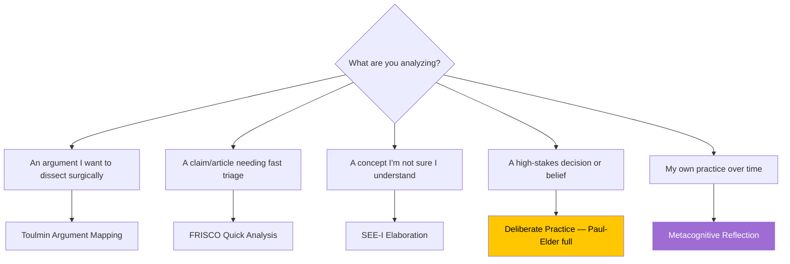
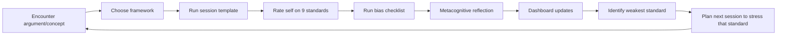

# Critical Thinking Template Suite — Integration Guide  `v1.0.0`

> [!abstract] What this suite provides
> A **five-template + one-dashboard** system for [[Deliberate Practice|deliberate]] critical-thinking practice in Obsidian. Every session is structured, queryable, and rolled-up into a live dashboard — converting reading and reasoning into measurable [[Self-Regulated Learning]].

---

## 🧱 Components

| # | File | Path | Purpose |
|---|---|---|---|
| 1 | `_master-critical-thinking-deliberate-practice-v1.0.0.md` | `99-system/03-templater/02-templater-master-skeleton-templates/critical-thinking/` | **Main template.** Framework selector → full Paul-Elder, FRISCO, Delphi, Toulmin, SEE-I, or free-form. Includes metacognition + bias check + standards self-rating. |
| 2 | `_master-frisco-quick-analysis-v1.0.0.md` | (same folder) | Rapid 5-10 min argument evaluation. |
| 3 | `_master-toulmin-argument-mapping-v1.0.0.md` | (same folder) | Surgical argument decomposition with Mermaid map. |
| 4 | `_master-see-i-elaboration-v1.0.0.md` | (same folder) | Concept-mastery elaboration (State / Elaborate / Exemplify / Illustrate). |
| 5 | `_master-metacognitive-reflection-v1.0.0.md` | (same folder) | Periodic reflection ON practice (daily/weekly/monthly). |
| 6 | `critical-thinking-practice-dashboard.md` | `06-dashboards/` | Live Dataview/DataviewJS rollup of all sessions. |

---

## 🔌 Dependencies

> [!important] Required plugins
> - **Templater** (mandatory) — all templates use `` script blocks and `tp.system` prompts.
> - **Dataview** (mandatory for dashboard) — rollup queries and computed rigor scores.
> - **Meta Bind** (strongly recommended) — `INPUT[]` widgets for slider ratings and buttons.
> - **QuickAdd** (recommended) — single-keystroke launcher for templates.

---

## 🗂 Folder Structure Created on First Use

```
03-notes/
└── critical-thinking-practice/        ← all session notes land here
    ├── 2026-05-13_ct_paul-elder_climate-policy-argument.md
    ├── 2026-05-13_frisco_op-ed-on-ai-safety.md
    ├── 2026-05-14_toulmin_workplace-policy-claim.md
    ├── 2026-05-14_see-i_epistemic-humility.md
    └── _reflections/                  ← metacognitive reflection notes
        └── 2026-05-15_metacog-reflection_weekly.md
```

Create these folders **before** first use:

```text
03-notes/critical-thinking-practice/
03-notes/critical-thinking-practice/_reflections/
```

---

## ⚙ Templater Settings

> [!helpful-tip] One-time configuration
> 1. **Settings → Templater → Template Folder Location** = `99-system/03-templater/02-templater-master-skeleton-templates`
> 2. **Trigger Templater on new file creation** = enabled (lets folder templates auto-run)
> 3. *(Optional)* **Folder Templates** → map `03-notes/critical-thinking-practice/` to the main deliberate-practice template if you want every new file there to auto-prompt.

---

## 🚀 QuickAdd Launcher Configuration

Add four QuickAdd choices for friction-free launching:

| Choice Name | Type | Template | Hotkey suggestion |
|---|---|---|---|
| `CT — Deliberate Practice` | Template | `_master-critical-thinking-deliberate-practice-v1.0.0.md` | `Ctrl+Alt+C` |
| `CT — FRISCO Quick` | Template | `_master-frisco-quick-analysis-v1.0.0.md` | `Ctrl+Alt+F` |
| `CT — Toulmin Map` | Template | `_master-toulmin-argument-mapping-v1.0.0.md` | `Ctrl+Alt+T` |
| `CT — SEE-I` | Template | `_master-see-i-elaboration-v1.0.0.md` | `Ctrl+Alt+S` |
| `CT — Metacog Reflection` | Template | `_master-metacognitive-reflection-v1.0.0.md` | `Ctrl+Alt+M` |

For each choice: enable **Create in folder** = `03-notes/critical-thinking-practice/`, **Open the created file**, **Increment filename if exists**.

---

## 🧭 When to Use Which Template

> [!definition] Selection heuristic
> Match the **stakes and depth required** to the framework.



| Situation | Template | Approx. time |
|---|---|---|
| **High-stakes decision, belief, or argument** | Deliberate Practice (Paul-Elder mode) | 30-60 min |
| **Op-ed, article, blog post evaluation** | FRISCO Quick | 5-10 min |
| **Need to dissect *what the argument really claims*** | Toulmin Mapping | 10-20 min |
| **Concept I'm encountering or teaching** | SEE-I | 10-15 min |
| **End of week / month review** | Metacognitive Reflection | 15-30 min |
| **Casual / exploratory** | Deliberate Practice (Custom mode) | flexible |

---

## 🔁 The Deliberate-Practice Loop

> [!key-claim] This system is designed around a **feedback loop**, not isolated note-taking.



---

## 📊 Reading the Dashboard

The dashboard at `06-dashboards/critical-thinking-practice-dashboard.md` shows ten panels:

1. **Headline metrics** — volume by recency, status counts
2. **Recent rigor scores** — last 10 sessions with computed averages
3. **Standards weaknesses** — your growth edges, weakest-first
4. **Framework distribution** — which tools you actually reach for
5. **Object-type distribution** — what kinds of things you analyze
6. **Recent sessions** — chronological feed
7. **Flagged for re-review** — sessions you marked as needing return
8. **Reflections rollup** — your metacognitive history
9. **Calibration analysis** — does structured analysis actually move your confidence?
10. **Bias self-reports** — which biases you flag most often

> [!warning] The most diagnostic panel is **#9 Calibration**.
> If your confidence rarely shifts after analysis, the framework may be operating as [[Motivated Reasoning|post-hoc rationalization]] rather than genuine reasoning. That is itself useful data.

---

## 🧠 Metacognitive Integration — The Theoretical Core

> [!definition] Why metacognition is built into every template
> [[Anders Ericsson|Ericsson]]'s [[Deliberate Practice]] research is unambiguous: practice without **feedback and conscious monitoring** produces stagnation, not skill. Without [[Metacognitive Monitoring]], thousands of hours of "thinking" can yield zero improvement.

Every template enforces three metacognitive moves:

| Move | Where it appears | Why |
|---|---|---|
| **Pre-snapshot** (initial position + confidence) | Section 0 of main template | Establishes baseline to detect motion |
| **In-session bias check** | Section 4 of main template | [[Metacognitive Monitoring]] in real time |
| **Post-reflection** (what was hard? where did I rush?) | Section 5 of main template + standalone Reflection template | Converts experience into [[Metacognitive Knowledge]] |

---

## 🏗 Customization Points

> [!note] Adapt to your workflow.

- **Add a framework:** Extend the `tp.system.suggester` choices array at top of `_master-critical-thinking-deliberate-practice-v1.0.0.md` and add a matching `else if` branch.
- **Change output folder:** Edit the `tp.file.move("/03-notes/critical-thinking-practice/...")` line in each template.
- **Add a custom standard:** Add a new `rating-<name>` to frontmatter, a new row to Section 2, and an entry to the `stds` array in the dashboard's DataviewJS blocks.
- **Hook into Spaced Repetition:** Add a `next-review` frontmatter field and use a Templater script to populate based on session difficulty.

---

## ✅ First-Use Checklist

- [ ] Templater installed and template folder configured
- [ ] Dataview installed with **Enable JavaScript Queries** = ON
- [ ] Meta Bind installed (for sliders/inputs)
- [ ] Created `03-notes/critical-thinking-practice/`
- [ ] Created `03-notes/critical-thinking-practice/_reflections/`
- [ ] QuickAdd choices configured with hotkeys (optional but recommended)
- [ ] Dashboard `06-dashboards/critical-thinking-practice-dashboard.md` opened and verified queries render
- [ ] First session run end-to-end (start → ratings → metacognition → close)
- [ ] First weekly metacognitive reflection scheduled

---

## 🐛 Troubleshooting

| Symptom | Likely cause | Fix |
|---|---|---|
| Template fails on creation | Templater not set as trigger | Settings → Templater → enable "Trigger Templater on new file creation" |
| Sliders show as text | Meta Bind not installed/enabled | Install Meta Bind plugin |
| Dashboard shows empty | No sessions yet, OR Dataview JS disabled | Run a session; enable JS queries in Dataview settings |
| Calibration panel empty | `confidence-pre`/`confidence-post` not filled | These are manual fields at top and bottom of session |
| Rigor score not computing | < 1 standard rated, OR ratings stored as strings | Re-enter via the Meta Bind sliders rather than typing |

---

# 🔗 Related Topics for PKB Expansion

## 🎯 Core Extensions
1. **[[Paul-Elder Framework]]** — full reference for elements/standards/virtues driving the main template.
2. **[[Deliberate Practice]]** — Ericsson's framework explaining why structured friction works.

## 🌐 Cross-Domain Connections
3. **[[Self-Regulated Learning]]** — Zimmerman's three-phase loop maps onto this suite's pre/in/post structure.
4. **[[Cognitive Biases]]** — catalog backing the bias-checklist section.

## 📚 Foundational Prerequisites
- **[[Metacognition]]** — without monitoring, this is just journaling.
- **[[Intellectual Virtues]]** — the dispositional layer the template tracks.

## 🔄 Related MOCs
- **[[Critical Thinking Practice MOC]]**
- **[[Templater Templates MOC]]**
- **[[Obsidian Dashboards MOC]]**
