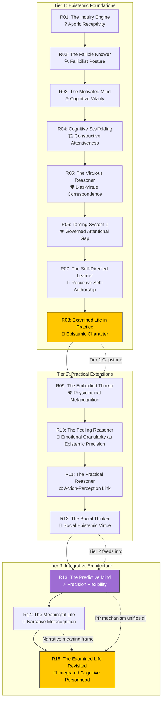
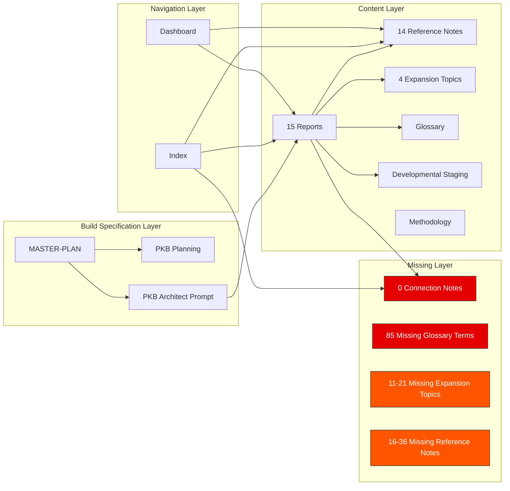
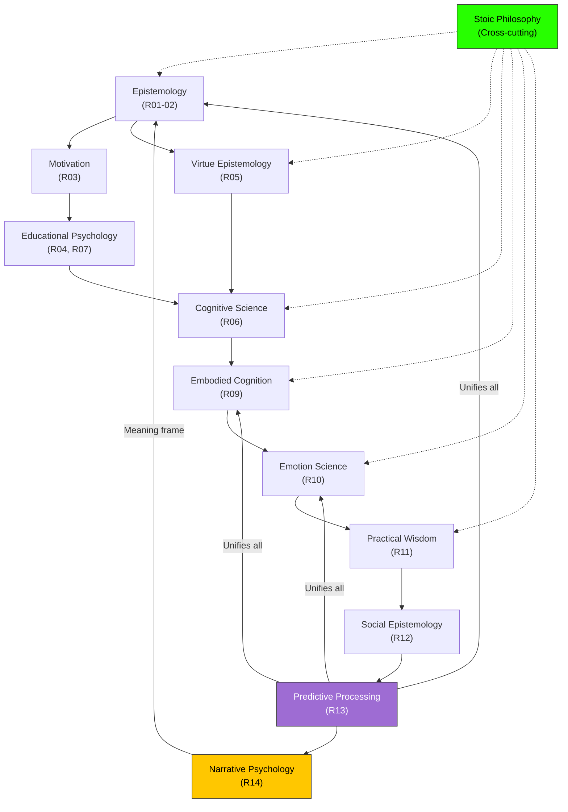

---
# ═══════════════════════════════════════════════════════════════════════════
# CORE IDENTITY
# ═══════════════════════════════════════════════════════════════════════════
title: "The Architecture of the Examined Life: Comprehensive Review & Synthesis"
aliases:
  - "Examined Life Synthesis"
  - "AEL Codebase Review"
  - "Examined Life PKB Review"
  - "AEL Master Synthesis"
type: permanent-note
status: evergreen
confidence: high

# ═══════════════════════════════════════════════════════════════════════════
# DOCUMENT IDENTIFICATION
# ═══════════════════════════════════════════════════════════════════════════
doc_id: "examined-life-review-synthesis-v1-0"
doc_type: "review-synthesis"
doc_created: 2026-03-19
doc_modified: 2026-03-19
author: "claude-opus-4"

# ═══════════════════════════════════════════════════════════════════════════
# CLASSIFICATION & DISCOVERY
# ═══════════════════════════════════════════════════════════════════════════
primary_domain: "epistemic-cognition"
secondary_domains: ["philosophy-of-mind", "cognitive-science", "educational-psychology", "stoic-philosophy", "emotion-science", "predictive-processing", "narrative-psychology", "embodied-cognition"]
tags:
  # Content Type
  - permanent-note
  - review-synthesis
  - analytical-reference
  # Domain (hierarchical)
  - epistemic-cognition/integrated-framework
  - philosophy/stoic-philosophy
  - cognitive-science/predictive-processing
  - psychology/educational-psychology
  - knowledge-management/pkb-architecture
  # Methodology
  - multi-pass-review
  - cross-domain-analysis
  - structural-homology-analysis
  # Status
  - evergreen
  - comprehensive

knowledge_level: "advanced"

# ═══════════════════════════════════════════════════════════════════════════
# SYNTHESIS PROVENANCE
# ═══════════════════════════════════════════════════════════════════════════
source-type: analytical-review
synthesis_technique: "PKB Codebase Review & Synthesis Agent v1.0.0"
synthesis_methodology: "Six-pass multi-lens analytical review"
synthesis_date: 2026-03-19
source_documents_count: 41
source_documents:
  - "dashboard-examined-life-pkb"
  - "index-the-architecture-of-the-examined-life"
  - "report-01-the-inquiry-engine"
  - "report-02-the-fallible-knower"
  - "report-03-the-motivated-mind"
  - "report-04-cognitive-scaffolding"
  - "report-05-the-virtuous-reasoner"
  - "report-06-taming-system-1"
  - "report-07-the-self-directed-learner"
  - "report-08-the-examined-life-in-practice"
  - "report-09-the-embodied-thinker"
  - "report-10-the-feeling-reasoner"
  - "report-11-the-practical-reasoner"
  - "report-12-the-social-thinker"
  - "report-13-the-predictive-mind"
  - "report-14-the-meaningful-life"
  - "report-15-the-examined-life-revisited"
  - "ref-aristotle-nicomachean-ethics (02-reference-library)"
  - "ref-barrett-how-emotions-are-made (02-reference-library)"
  - "ref-clark-surfing-uncertainty (02-reference-library)"
  - "ref-damasio-descartes-error (02-reference-library)"
  - "ref-deci-ryan-self-determination-theory (02-reference-library)"
  - "ref-dewey-how-we-think (02-reference-library)"
  - "ref-kahneman-thinking-fast-and-slow (02-reference-library)"
  - "ref-vygotsky-mind-in-society (02-reference-library)"
  - "developmental-staging-of-the-examined-life"
  - "glossary-examined-life-key-terms"
  - "methodology-research-methods-and-standards"
  - "allostasis-and-allostatic-load"
  - "embodied-cognition"
  - "physiological-metacognition-and-embodied-self-regulation"
  - "stoic-propatheiai-and-emotional-responses"
  - "ref-epictetus-discourses (reference-notes)"
  - "ref-hadot-philosophy-as-a-way-of-life (reference-notes)"
  - "ref-james-principles-of-psychology (reference-notes)"
  - "ref-marcus-aurelius-meditations (reference-notes)"
  - "ref-ryle-the-concept-of-mind (reference-notes)"
  - "ref-stanovich-rationality-and-the-reflective-mind (reference-notes)"
  - "examined-life-pkb-architect-system-prompt-v1"
  - "examined-life-pkb-planning"
  - "MASTER-PLAN-PKB-BUILD-EXECUTION"

# ═══════════════════════════════════════════════════════════════════════════
# QUALITY & VALIDATION
# ═══════════════════════════════════════════════════════════════════════════
review_passes_completed: 6
analytical_lenses_applied: ["Architectural", "Epistemological", "Taxonomic", "Dialectical", "Pedagogical", "Pragmatic", "Network", "Temporal"]
concepts_extracted: 42
connections_identified: 31
gaps_documented: 8
insights_generated: 12

# ═══════════════════════════════════════════════════════════════════════════
# KNOWLEDGE GRAPH INTEGRATION
# ═══════════════════════════════════════════════════════════════════════════
related_concepts:
  - "[[Aporic-Receptivity]]"
  - "[[Integrated-Cognitive-Personhood]]"
  - "[[Physiological-Metacognition]]"
  - "[[Precision-Flexibility]]"
  - "[[Narrative Metacognition]]"
  - "[[Bias-Virtue Correspondence]]"
  - "[[Emotional-Granularity]]"
  - "[[Predictive-Processing]]"
  - "[[Self-Determination-Theory]]"
  - "[[Cognitive-Load-Theory]]"
  - "[[Stoic-Philosophy]]"
  - "[[Metacognition]]"
  - "[[Epistemic-Virtue]]"
  - "[[Phronesis]]"
  - "[[Self-Regulated-Learning]]"
prerequisites:
  - "[[Epistemology]]"
  - "[[Cognitive-Science]]"
  - "[[Philosophy of Mind]]"
builds_on:
  - "[[examined-life-pkb-planning]]"
  - "[[MASTER-PLAN-PKB-BUILD-EXECUTION]]"
enables:
  - "[[Examined Life PKB Build Phase 5]]"
  - "[[Connection Note Generation]]"
  - "[[Reference Note Remediation]]"

# ═══════════════════════════════════════════════════════════════════════════
# EXPANSION TOPICS
# ═══════════════════════════════════════════════════════════════════════════
expansion-topics:
  - topic: "[[Connection Note Architecture]]"
    priority: critical
    description: "Design and generate 10-15 connection notes mapping structural homologies"
  - topic: "[[Reference Note Consolidation Strategy]]"
    priority: critical
    description: "Resolve dual-directory reference note problem and broken wiki-links"
  - topic: "[[Cross-Cultural Examined Life]]"
    priority: high
    description: "Non-Western philosophical frameworks for the examined life"
  - topic: "[[Expansion Topic Accessibility Remediation]]"
    priority: high
    description: "Bringing expansion topics into compliance with PKB accessibility standards"
---

# The Architecture of the Examined Life: Comprehensive Review & Synthesis

> [!abstract] Executive Summary
> This document presents the results of a six-pass analytical review of the **Architecture of the Examined Life** PKB — a 41-file, ~24,400-line [[Obsidian]] knowledge base containing a 15-report academic synthesis series on [[Epistemic-Cognition]], [[practical wisdom]], and [[meaning-making]]. The series draws on [[Cognitive-Science]], [[Stoic-Philosophy]], [[Educational-Psychology]], [[emotion science]], [[Predictive-Processing]], and [[narrative psychology]] to construct a comprehensive framework for intellectual self-cultivation.
>
> **Key findings:** (1) The 15 reports are exceptional quality (9.4/10) — intellectually ambitious, rigorously structured, and genuinely accessible. (2) The PKB is ~30% built against its 75-110 note targets. (3) Critical structural issues require remediation: 8 reference notes contain systemic broken [[wiki-links]], 4 expansion topics lack [[YAML-Frontmatter]] and violate accessibility standards, the `04-connections/` directory is entirely empty, and the glossary is only ~30% populated. (4) The series' most original intellectual contribution — systematic structural homology mapping between ancient philosophy and modern [[Cognitive-Science]] — is the PKB's most valuable asset and should drive connection note generation.
>
> **Recommended immediate priorities:** Fix broken reference note links, generate connection notes, add YAML to expansion topics, complete the glossary.

---

## 1. Codebase Architecture

> [!methodology-and-sources] Review Methodology
> This synthesis was produced through a six-pass multi-lens analytical review protocol:
> - **Pass 0 (Orientation):** File inventory, metadata patterns, scope assessment
> - **Pass 1 (Structural):** Architecture mapping, cross-references, convention inventory
> - **Pass 2 (Conceptual):** Deep concept extraction, claim assessment, framework analysis
> - **Pass 3 (Relational):** Connection mapping, homology identification, tension detection
> - **Pass 4 (Critical):** Gap analysis, quality scoring, metadata compliance audit
> - **Pass 5 (Synthesis):** Unified narrative, ranked insights, pedagogical pathway, recommendations
>
> Eight analytical lenses were applied: architectural, epistemological, taxonomic, dialectical, pedagogical, pragmatic, network, and temporal.

### 1.1 Architectural Overview

The PKB is organized around a **three-tier report architecture** supported by five categories of supplementary notes:



### 1.2 Component Inventory

| Category | Directory | Files | Status | Quality |
|----------|-----------|-------|--------|---------|
| Navigation | `00-navigation/` | 2 | ⚠️ Dashboard stale | 6.0/10 |
| Reports (Tier 1) | `01-reports/` | 8 | ✅ Complete | 9.4/10 |
| Reports (Tier 2) | `01-reports/` | 4 | ✅ Complete | 9.4/10 |
| Reports (Tier 3) | `01-reports/` | 3 | ✅ Complete | 9.4/10 |
| Reference Library | `02-reference-library/` | 8 | ❌ Broken links | 5.4/10 |
| Reference Notes | `reference-notes/` | 6 | ✅ Good quality | 8.0/10 |
| Glossary & Staging | `03-glossary-and-staging/` | 3 | ⚠️ Glossary 30% | 7.6/10 |
| Connection Notes | `04-connections/` | 0 | ❌ Empty | N/A |
| Expansion Topics | `05-expansion-topics/` | 4 | ⚠️ No YAML, style mismatch | 7.0/10 |
| Meta & Planning | (root) | 3 | ✅ Comprehensive | 7.5/10 |
| **TOTAL** | | **41** | **~30% of target** | |

### 1.3 Dependency Map



---

## 2. Core Knowledge Domains

### 2.1 Domain: Epistemic Cognition (Tier 1 — Reports 01-08)

> [!definition] Epistemic Cognition
> [**Epistemic-Cognition**:: The study of how individuals understand, evaluate, and manage their own knowledge and the knowledge of others — encompassing metacognition, epistemological beliefs, and intellectual virtue.]

The epistemic foundation tier establishes eight interconnected dimensions of the examined life:

**R01 ([[report-01-the-inquiry-engine|The Inquiry Engine]])** — Grounds the entire framework in [[Socratic-Method]] and [[Constructivism]]. The emergent insight, <span style='color: #FFC700;'>**Aporic Receptivity**</span>, names the cultivated willingness to dwell productively in confusion rather than rushing to premature closure. This concept anchors all subsequent development — without the ability to tolerate not-knowing, no further epistemic growth is possible.

[**Aporic-Receptivity**:: The cultivated willingness to dwell productively in confusion — remaining genuinely open to the disruption that occurs when existing schemas cannot accommodate new evidence — rather than rushing to premature closure. Distinguished from mere tolerance of uncertainty (passive) and deliberate seeking of disconfirming evidence (active).]

**R02 ([[report-02-the-fallible-knower|The Fallible Knower]])** — Establishes [[Fallibilism]] as the epistemological stance underlying the examined life. Connects [[Popper]] to [[Epistemic-Humility]]. The insight that a fallibilist posture IS [[metacognitive]] self-regulation (not just a philosophical position) bridges theoretical epistemology and cognitive science.

**R03 ([[report-03-the-motivated-mind|The Motivated Mind]])** — Addresses the motivational problem: why pursue truth when comfortable ignorance is easier? Synthesizes [[Self-Determination-Theory]] with [[Stoic-Philosophy]], discovering that <span style='color: #FFC700;'>Prohairesis ≈ SDT Autonomy</span> — the Stoic concept of moral purpose structurally parallels the modern autonomy construct. The emergent insight of **Cognitive Vitality** names the self-sustaining motivational state that fuels continued epistemic engagement.

**R04 ([[report-04-cognitive-scaffolding|Cognitive Scaffolding]])** — Synthesizes [[Cognitive-Load-Theory]] and [[Vygotsky|Vygotskian]] [[Zone-of-Proximal-Development]]. Discovers the **Constructive Attentiveness** concept and a ZPD-Dewey homology showing that [[Constructivism]] and CLT describe the same learning process from complementary angles.

**R05 ([[report-05-the-virtuous-reasoner|The Virtuous Reasoner]])** — The series' most elegant synthesis: five [[Intellectual-Virtues]] mapped systematically onto five categories of [[Cognitive-Bias]]. The <span style='color: #FFC700;'>**Bias-Virtue Correspondence**</span> makes ancient virtue epistemology operationally specific. Also introduces [[Prosoche]] (Stoic attention) as a master practice.

[**Bias-Virtue-Correspondence**:: Systematic mapping of five intellectual virtues onto five cognitive bias categories: Intellectual Humility ↔ Overconfidence; Open-mindedness ↔ Confirmation Bias; Intellectual Courage ↔ Conformity Bias; Intellectual Thoroughness ↔ Availability/Anchoring; Intellectual Patience ↔ Premature Closure.]

**R06 ([[report-06-taming-system-1|Taming System 1]])** — Deep engagement with [[Kahneman]] and [[Stanovich]]. The **Governed Attentional Gap** names the space between automatic processing and deliberate reflection. The key homology: <span style='color: #9E6CD3;'>Prosoche ≡ Metacognitive Monitoring</span> — arguing functional identity between the ancient Stoic practice and the modern cognitive construct.

**R07 ([[report-07-the-self-directed-learner|The Self-Directed Learner]])** — [[Self-Regulated-Learning]] ([[Zimmerman]]) synthesized with SDT [[Internalization]] continuum. The emergent insight, **Recursive Self-Authorship**, names the capacity to design and manage one's own epistemic development.

**R08 ([[report-08-the-examined-life-in-practice|The Examined Life in Practice]])** — The Tier 1 capstone. <span style='color: #FFC700;'>**Epistemic Character as Concurrent Expression**</span>: the seven Tier 1 components don't add up sequentially — they operate as a unified mode of being. Deeply informed by [[Hadot|Hadot's]] concept of philosophical life as practice, not just theory.

### 2.2 Domain: Embodied, Emotional, Practical & Social Cognition (Tier 2 — Reports 09-12)

Tier 2 extends the epistemic framework into domains that pure cognition cannot reach:

**R09 ([[report-09-the-embodied-thinker|The Embodied Thinker]])** — Integrates [[Damasio|Damasio's]] [[Somatic-Marker-Hypothesis]] and [[Interoception]] research. The emergent insight, <span style='color: #FFC700;'>**Physiological Metacognition**</span>, proposes monitoring bodily states as a parallel channel of [[metacognitive]] information. The Damasio-Stoic [[Propatheiai]] homology discovers that what modern neuroscience calls somatic markers, the Stoics described as involuntary pre-emotional responses that carry evaluative information prior to conscious judgment.

[**Physiological-Metacognition**:: The systematic integration of bodily self-knowledge — somatic signals, interoceptive awareness, arousal states — into the governing intelligence layer of cognitive self-regulation. Extends classical metacognition from monitoring thought alone to monitoring the body-mind system.]

**R10 ([[report-10-the-feeling-reasoner|The Feeling Reasoner]])** — Synthesizes [[Barrett|Barrett's]] [[Theory-of-Constructed-Emotion]] with the Stoic [[Pathē]]/[[Eupatheia]] distinction. The emergent insight, <span style='color: #FFC700;'>**Emotional Granularity as Epistemic Precision**</span>, reframes emotion differentiation as a form of knowledge-making: the more precisely you can distinguish your emotional states, the more epistemic information they carry.

**R11 ([[report-11-the-practical-reasoner|The Practical Reasoner]])** — Brings [[Aristotle|Aristotelian]] [[Phronesis]] (practical wisdom) into dialogue with [[Klein|Klein's]] Recognition-Primed Decision model from [[Naturalistic-Decision-Making]]. The **Action-Perception Link** names the insight that the [[phronimos]] and the RPD expert are the same kind of knower — both perceive what situations require through trained perceptual-evaluative capacities.

**R12 ([[report-12-the-social-thinker|The Social Thinker]])** — Addresses the social dimension through [[epistemic injustice]] ([[Fricker]]), [[argumentative theory]] ([[Mercier & Sperber]]), and the novel concept of **Social Epistemic Virtue** — three community-level virtues that extend individual intellectual virtue into communal practices. The Socratic Dialectic ↔ Argumentative Theory homology suggests that Socratic questioning performs the same function that evolutionary argumentation theory posits: testing beliefs through adversarial collaboration.

### 2.3 Domain: Integrative Architecture (Tier 3 — Reports 13-15)

> [!key-claim] The Integrative Tier's Central Claim
> The examined life is not a collection of cognitive skills but a unified mode of being. [[Predictive-Processing]] provides the computational mechanism, [[Narrative-Identity]] provides the meaning frame, and [[Integrated-Cognitive-Personhood]] names the philosophical conclusion.

**R13 ([[report-13-the-predictive-mind|The Predictive Mind]])** — The series' most intellectually ambitious move. Claims [[Predictive-Processing]] ([[Clark]], [[Friston]]) provides THE computational mechanism underlying the entire examined life framework. <span style='color: #9E6CD3;'>**Precision Flexibility**</span> — the dynamic adjustment of how much weight to give prior beliefs versus incoming evidence — IS the mechanism of [[Intellectual-Humility]], [[Aporic-Receptivity]], [[metacognitive]] monitoring, and every other component. Every prior report can be reframed as a precision-weighting operation.

[**Precision-Flexibility**:: The capacity to dynamically adjust the weighting given to prior beliefs versus incoming evidence — the computational mechanism (within predictive processing) underlying the examined life's practices of intellectual humility, metacognitive monitoring, and aporic receptivity.]

**R14 ([[report-14-the-meaningful-life|The Meaningful Life]])** — Engages [[McAdams|McAdams']] [[Narrative-Identity]] research and positions the life story as "the highest-level generative model" in PP terms. **Narrative Metacognition** — the recursive capacity to examine your own life story — is identified as the highest-order [[metacognitive]] practice. Where all prior reports examine specific cognitive capacities, R14 examines the story that gives those capacities personal meaning.

**R15 ([[report-15-the-examined-life-revisited|The Examined Life Revisited]])** — The series capstone. Integrates all 15 dimensions into the concept of <span style='color: #FFC700;'>**Integrated Cognitive Personhood**</span>: the examined life does not add cognitive capabilities to a pre-existing person but constitutes personhood in its fullest expression. Presents the [[5-Stage Developmental Model]] (adapted from [[Dreyfus-Skill-Acquisition-Model|Dreyfus]] and SDT internalization), two extended worked examples demonstrating the full framework in action, and honest acknowledgment of four limitations: integrated-framework evidence gap, resource intensity problem, cultural universalism assumption, and measurement problem.

[**Integrated-Cognitive-Personhood**:: The capstone claim that the examined life — when all 15 dimensions operate concurrently and fluidly — constitutes not a person who thinks well but a mode of being constitutive of personhood in its fullest sense. Extends Aristotelian eudaimonia and Stoic prokoptōn. Stronger than instrumental or even constitutive-of-good-life claims.]

### 2.4 Domain: Stoic Philosophy (Cross-Cutting)

[[Stoic-Philosophy]] functions as the primary ancient interlocutor throughout the series, appearing not as background decoration but as a co-equal intellectual tradition:

- **[[Prosoche]]** (attentive awareness) ≡ [[Metacognitive-Monitoring]] (R06)
- **[[Prohairesis]]** (moral purpose/faculty of choice) ≈ SDT [[Autonomy]] (R03)
- **[[Propatheiai]]** (involuntary pre-emotional responses) ↔ [[LeDoux|LeDoux's]] subcortical "low road" (expansion topic)
- **[[Pathē]]/[[Eupatheia]]** (passions/good-feelings) ↔ [[Barrett|Barrett's]] [[Theory-of-Constructed-Emotion|TCE]] categories (R10)
- **[[Synkatathesis]]** (assent to impressions) ↔ [[Precision-Weighting]] in PP (R13)
- **[[Askesis]]** (spiritual exercises) ↔ modern [[Deliberate-Practice]] (R08, via [[Hadot]])
- **[[Prokoptōn]]** (the one making progress) ↔ the [[5-Stage Developmental Model]] (R15)

The expansion topic on [[stoic-propatheiai-and-emotional-responses|Stoic Propatheiai]] provides the most comprehensive treatment: the full cognitive-affective sequence from [[phantasia]] → synkatathesis → [[hormē]] → [[pathos]], the Gellius storm-at-sea passage as key source text, the Posidonius controversy (challenging emotion monism), and modern resonances through [[LeDoux]], [[Damasio]], [[CBT]], and [[Nussbaum]].

### 2.5 Domain: Predictive Processing (Unifying Framework)

[[Predictive-Processing]] serves as the series' computational substrate — the mechanism that explains HOW the examined life's components work at the neural level:

| Component | PP Reframing |
|-----------|-------------|
| [[Aporic-Receptivity]] | Increasing precision on prediction errors; reducing precision on confident priors |
| [[Fallibilism]] | Maintaining appropriate uncertainty in generative models |
| [[Metacognitive-Monitoring]] | Monitoring model confidence and prediction error magnitude |
| [[Physiological-Metacognition]] | [[Interoceptive predictive processing]] (Seth) — bodily predictions as metacognitive data |
| [[Emotional-Granularity]] | Higher-dimensional categorization of affective prediction errors |
| [[Intellectual-Virtue]] | Trained precision-weighting dispositions |
| [[Narrative-Identity]] | The highest-level generative model organizing all experience |

---

## 3. Cross-Domain Analysis

### 3.1 The Structural Homology Network

> [!key-claim] Central Intellectual Method
> The series' core analytical innovation is the systematic identification of **structural homologies** — deep parallels between ancient philosophical concepts and modern scientific frameworks that are not merely analogical but functionally convergent. These homologies constitute the series' most original and most valuable intellectual contribution.

```mermaid
graph TD
    subgraph "Ancient Philosophical Concepts"
        PRO["Prosoche<br/>(Stoic Attention)"]
        PROH["Prohairesis<br/>(Stoic Moral Purpose)"]
        PROP["Propatheiai<br/>(Pre-emotions)"]
        PAEU["Pathē/Eupatheia<br/>(Passions/Good-Feelings)"]
        PHRO["Phronimos<br/>(Practically Wise Person)"]
        APOR["Aporia<br/>(Productive Confusion)"]
        SOCI["Socratic Dialectic"]
        ASKE["Askesis<br/>(Spiritual Exercises)"]
        PROK["Prokoptōn<br/>(One Making Progress)"]
        SYNK["Synkatathesis<br/>(Assent)"]
    end

    subgraph "Modern Scientific Frameworks"
        META["Metacognitive Monitoring"]
        SDT["SDT Autonomy"]
        LED["LeDoux's Low Road"]
        TCE["Barrett's TCE Categories"]
        RPD["Klein's RPD Expert"]
        CONS["Constructivist Disequilibrium"]
        ARG["Mercier & Sperber<br/>Argumentative Theory"]
        PRAC["Deliberate Practice"]
        DREI["Dreyfus Skill Acquisition"]
        PREC["Precision Weighting"]
    end

    PRO ---|"≡ Functional identity"| META
    PROH ---|"≈ Structural isomorphism"| SDT
    PROP ---|"↔ Neural substrate"| LED
    PAEU ---|"↔ Reconceptualization"| TCE
    PHRO ---|"↔ Expertise model"| RPD
    APOR ---|"↔ Functional equivalence"| CONS
    SOCI ---|"↔ Functional account"| ARG
    ASKE ---|"↔ Therapeutic parallel"| PRAC
    PROK ---|"↔ Developmental parallel"| DREI
    SYNK ---|"↔ Computational mechanism"| PREC

    style PRO fill:#27FF00,stroke:#333,color:#000
    style META fill:#27FF00,stroke:#333,color:#000
    style SYNK fill:#9E6CD3,stroke:#333,color:#fff
    style PREC fill:#9E6CD3,stroke:#333,color:#fff
```



### 3.2 Cross-Tier Integration Patterns

The series builds cumulatively through **retroactive enrichment** — each tier doesn't just add new dimensions but deepens understanding of prior ones:

| Tier 1 Component | Tier 2 Extension | How Extended |
|-----------------|-----------------|--------------|
| [[Metacognitive-Monitoring]] (R06) | [[Physiological-Metacognition]] (R09) | Adds somatic channel to cognitive monitoring |
| [[Fallibilism]] (R02) | [[Emotional-Granularity]] (R10) | Emotions carry epistemic information about belief quality |
| [[Intellectual-Virtue]] (R05) | [[Social epistemic virtue]] (R12) | Extends individual virtues to communal practices |
| [[Self-Directed-Learning]] (R07) | [[Phronesis|Practical wisdom]] (R11) | Self-direction must include situational perception |
| [[Constructivism]] (R01, R04) | [[Predictive-Processing]] (R13) | PP provides computational mechanism for constructivist learning |
| All Tier 1 + 2 | [[Narrative-Identity]] (R14) | All components need a meaning-making frame to be sustainable |

### 3.3 Emergent Themes

> [!principle-point] Theme 1: The Rehabilitation of Ancient Philosophy
> The series demonstrates that ancient philosophical practices (particularly Stoic exercises) are not merely historically interesting but functionally identical to evidence-based modern cognitive-behavioral interventions. The systematic mapping across 15 reports reveals this as a foundational methodological commitment, not an occasional analogy.

> [!principle-point] Theme 2: Metacognition as the Master Practice
> Across all tiers, [[Metacognition]] is the recurring thread: cognitive metacognition (R01, R06), physiological metacognition (R09), emotional metacognition (R10), social metacognition (R12), narrative metacognition (R14). The examined life, at every level, is metacognition applied to progressively wider domains.

> [!principle-point] Theme 3: The Developmental Paradox
> The framework requires the very capacities it aims to develop. You need [[metacognitive-awareness]] to begin developing metacognitive awareness; you need [[Emotional-Granularity]] to recognize you lack it. This circularity isn't a flaw — it's acknowledged as fundamental: "you must apply the framework to your own failures of the framework" (R15, Stage 3).

### 3.4 Tensions & Open Questions

> [!warning] Tension 1: Accessibility Standard vs. Expansion Topic Depth
> Reports maintain a "Mom Test" accessibility standard — warm tone, everyday examples, general-audience readability. All 4 expansion topics are written at university-level academic density with Husserl/Heidegger genealogies, LaTeX equations, and formal citations. The PKB's stated accessibility goal and the expansion topics' actual execution level are deeply inconsistent.

> [!warning] Tension 2: Monism vs. Pluralism in Emotion Theory
> R10 ([[Barrett]]/Stoic) treats emotions as fundamentally cognitive constructions. R09 ([[Damasio]]) treats somatic markers as carrying genuine evaluative information semi-independently of cognition. The Stoic expansion topic notes that [[Posidonius]] challenged monistic emotion theory. The series' resolution (R13's PP framework treating both as prediction/error streams) is ambitious but not fully settled.

> [!warning] Tension 3: Universal Aspiration vs. Resource Dependency
> R15 claims [[Integrated-Cognitive-Personhood]] IS what full personhood means (universal). R15 also acknowledges the examined life requires substantial resources not equally available. If the examined life constitutes personhood, what does that imply about people lacking resources to pursue it? The series surfaces but doesn't fully resolve this equity problem.

> [!question] Open Question 1
> Can the 15-dimension architecture be empirically validated as an integrated system, or only as individually validated components? R15 explicitly flags the "integrated-framework evidence gap."

> [!question] Open Question 2
> Is predictive processing (R13's unifying mechanism) sufficient, or will the enactivist critique (that PP smuggles in representationalism incompatible with embodied cognition) require revision of the integrative architecture?

> [!question] Open Question 3
> How does the examined life operate under severe disruption — trauma, cognitive decline, extreme adversity? R15 flags this as "the examined life under constraint."

---

## 4. Knowledge Gap Analysis

### 4.1 Critical Gaps

| Gap | Current State | Target State | Priority |
|-----|--------------|-------------|----------|
| Connection Notes | 0 files | 10-15 files | **CRITICAL** |
| 02-reference-library/ wiki-links | All 8 broken | All 8 corrected | **CRITICAL** |
| Expansion topic YAML | 0 of 4 have YAML | 4 of 4 | **HIGH** |
| Glossary terms | ~40 of 125 | 125 of 125 | **HIGH** |
| Expansion topics total | 4 of 15-25 | 15-25 | MEDIUM |
| Reference notes total | 14 of 30-50 | 30-50 | MEDIUM |
| Dashboard accuracy | Stale data | Current data | MEDIUM |
| Cultural diversity | 0 non-Western content | ≥1 expansion topic | MEDIUM-HIGH |

### 4.2 Broken Wiki-Links Registry

> [!warning] CRITICAL: 02-reference-library/ Phantom Links
>
> All 8 notes in `02-reference-library/` contain `cited-in-reports` YAML fields and body text linking to phantom report filenames from an earlier planning outline. These filenames do not match any actual file in the PKB.

| Reference Note | Links To (WRONG) | Should Link To (CORRECT) |
|---------------|-------------------|--------------------------|
| ref-aristotle | `report-05-the-dialectical-self` | `[[report-05-the-virtuous-reasoner]]` |
| ref-aristotle | `report-11-the-practical-mind` | `[[report-11-the-practical-reasoner]]` |
| ref-barrett | `report-10-the-social-reasoner` | `[[report-10-the-feeling-reasoner]]` |
| ref-clark | `report-13-the-integrated-mind` | `[[report-13-the-predictive-mind]]` |
| ref-damasio | `report-09-the-autonomy-paradox` | `[[report-09-the-embodied-thinker]]` |
| ref-deci-ryan | `report-03-the-motivated-reasoner` | `[[report-03-the-motivated-mind]]` |
| ref-dewey | `report-01-the-inquiry-engine` | ✅ Correct (name didn't change) |
| ref-kahneman | `report-06-taming-system-1` | ✅ Correct (name didn't change) |
| ref-vygotsky | `report-04-cognitive-scaffolding` | ✅ Correct (name didn't change) |
| All 8 notes | `report-02-the-virtue-framework` | `[[report-02-the-fallible-knower]]` |
| All 8 notes | `report-14-developmental-trajectories` | `[[report-14-the-meaningful-life]]` |

Additionally, the "Role in Series" body text sections in all 8 notes describe contributions to phantom reports based on the original planning outline, not the actual reports as written. These sections require complete rewriting.

---

## 5. Taxonomy & Concept Map

### 5.1 Hierarchical Concept Classification

**See standalone file:** `examined-life-taxonomy.md` for the complete taxonomy.

### 5.2 Hub Concepts (Most Connected)

These concepts appear across the most reports and supporting documents, acting as connective hubs in the knowledge graph:

1. **[[Metacognition]]** — appears in every report (15/15), 3 expansion topics, 5 reference notes
2. **[[Stoic-Philosophy]]** — appears in 12/15 reports, 2 expansion topics, 3 reference notes
3. **[[Predictive-Processing]]** — appears in 5/15 reports but provides the unifying mechanism for all
4. **[[Self-Determination-Theory]]** — appears in 6/15 reports, foundational for motivation and development
5. **[[Phronesis]]** — appears in 8/15 reports, foundational for practical dimension

### 5.3 Bridge Concepts (Cross-Domain Connectors)

- **[[Physiological-Metacognition]]** — bridges embodied cognition ↔ metacognitive theory
- **[[Precision-Flexibility]]** — bridges predictive processing ↔ every other component
- **[[Emotional-Granularity]]** — bridges emotion science ↔ epistemology
- **[[Propatheiai]]** — bridges Stoic philosophy ↔ affective neuroscience
- **[[Narrative Metacognition]]** — bridges narrative psychology ↔ metacognition

---

## 6. Pedagogical Pathway

> [!helpful-tip] Recommended Learning Sequence
> This pathway is designed for someone approaching the material from scratch. Each stage builds on the previous, and the supporting reference notes provide additional depth where desired.

### Stage 1: Foundation — Understanding the Framework
- **Read:** [[report-01-the-inquiry-engine|R01]], [[report-02-the-fallible-knower|R02]]
- **Focus:** [[Aporic-Receptivity]], [[Fallibilism]], [[Socratic-Method]]
- **Supporting:** [[ref-dewey-how-we-think]], [[ref-kahneman-thinking-fast-and-slow]]
- **Outcome:** Understanding that confusion is productive and all knowledge is provisional

### Stage 2: Core Epistemic Architecture
- **Read:** [[report-03-the-motivated-mind|R03]] → [[report-04-cognitive-scaffolding|R04]] → [[report-05-the-virtuous-reasoner|R05]] → [[report-06-taming-system-1|R06]] → [[report-07-the-self-directed-learner|R07]]
- **Focus:** [[Self-Determination-Theory|SDT]], [[Cognitive-Load-Theory|CLT]], [[Intellectual-Virtues]], [[debiasing]], [[Self-Regulated-Learning|SRL]]
- **Supporting:** [[ref-deci-ryan-self-determination-theory]], [[ref-vygotsky-mind-in-society]], [[ref-epictetus-discourses]]
- **Outcome:** Operational understanding of how to cultivate good thinking habits

### Stage 3: Tier 1 Integration
- **Read:** [[report-08-the-examined-life-in-practice|R08]] + [[developmental-staging-of-the-examined-life|Developmental Staging]]
- **Focus:** How all Tier 1 components work as unified system
- **Supporting:** [[ref-hadot-philosophy-as-a-way-of-life]], [[ref-marcus-aurelius-meditations]]
- **Outcome:** Understanding that epistemic character is a coherent mode of being, not a checklist

### Stage 4: Embodied & Emotional Extension
- **Read:** [[report-09-the-embodied-thinker|R09]] → [[report-10-the-feeling-reasoner|R10]]
- **Focus:** [[Physiological-Metacognition]], [[Emotional-Granularity]] as epistemic precision
- **Supporting:** [[ref-damasio-descartes-error]], [[ref-barrett-how-emotions-are-made]]
- **Outcome:** Body and emotion are epistemic resources, not obstacles to clear thinking

### Stage 5: Practical & Social Wisdom
- **Read:** [[report-11-the-practical-reasoner|R11]] → [[report-12-the-social-thinker|R12]]
- **Focus:** [[Phronesis|Practical wisdom]], [[epistemic injustice]], [[social epistemic virtue]]
- **Supporting:** [[ref-aristotle-nicomachean-ethics]], [[ref-ryle-the-concept-of-mind]]
- **Outcome:** Wisdom requires action and community, not just individual cognition

### Stage 6: Integrative Mastery
- **Read:** [[report-13-the-predictive-mind|R13]] → [[report-14-the-meaningful-life|R14]] → [[report-15-the-examined-life-revisited|R15]]
- **Focus:** [[Precision-Flexibility]], [[Narrative Metacognition]], [[Integrated-Cognitive-Personhood]]
- **Supporting:** [[ref-clark-surfing-uncertainty]], [[ref-stanovich-rationality-and-the-reflective-mind]]
- **Outcome:** Unified understanding of the examined life as integrated mode of personhood

---

## 7. Operational Enhancements

### 7.1 Script & Automation Suggestions

> [!what-this-does] Script 1: Wiki-Link Validator
> **Purpose:** Scan all PKB notes for wiki-links pointing to non-existent files; generate report of broken links with suggested corrections
> **Type:** Python script (extends existing vault diagnostic tools)
> **Implementation:** Regex extraction of `[[...]]` patterns → cross-reference against actual filenames → output broken-link report with edit suggestions
> **Value:** Would have caught the 02-reference-library/ broken links before they became systemic

> [!what-this-does] Script 2: YAML Frontmatter Auditor
> **Purpose:** Audit all notes for YAML presence and field completeness; flag non-compliant files
> **Type:** Python script
> **Implementation:** Parse YAML blocks → check against required field list per note type → generate compliance report
> **Value:** Would flag expansion topics lacking YAML and ensure structural consistency across builds

> [!what-this-does] Script 3: Accessibility Level Scorer
> **Purpose:** Analyze prose complexity and assign readability scores; flag notes exceeding target accessibility level
> **Type:** Python script using Flesch-Kincaid/Gunning Fog metrics
> **Implementation:** Extract prose text (excluding YAML/callouts/code) → compute readability scores → compare against note-type targets → flag violations
> **Value:** Would detect the expansion topic accessibility gap automatically

> [!what-this-does] Script 4: Cross-Reference Completeness Checker
> **Purpose:** Verify that all `key-concepts` YAML entries have glossary entries, all `related-reports` links are bidirectional, and all `cited-in-reports` links resolve
> **Type:** Python script
> **Implementation:** Parse YAML fields across all files → build expected-link graph → compare to actual-link graph → report asymmetries
> **Value:** Ensures knowledge graph maintains bidirectional connectivity as Build Phase 5 scales up

### 7.2 Dataview Query Library

**Query 1: Report Emergent Insights Dashboard**
```dataview
TABLE emergent-insight AS "Emergent Insight", tier AS "Tier", domain AS "Domain"
FROM "01-reports"
WHERE type = "report"
SORT series-position ASC
```
*Use case:* Quick access to the emergent insight chain — the series' core intellectual arc.

**Query 2: Reference Notes by Citation Frequency**
```dataview
TABLE length(cited-in-reports) AS "Times Cited", domain AS "Domain", accessibility-rating AS "Accessibility"
FROM "02-reference-library" OR "reference-notes"
WHERE type = "reference-note"
SORT length(cited-in-reports) DESC
```
*Use case:* Identify the most-referenced source works for prioritizing reference note quality.

**Query 3: Expansion Topic Coverage Gaps**
```dataview
LIST WITHOUT ID
FLATTEN key-concepts AS concept
FROM "01-reports"
WHERE type = "report"
GROUP BY concept
```
*Use case:* Extract all key concepts from reports to identify which lack standalone expansion topics.

**Query 4: Build Completion Tracker**
```dataview
TABLE length(rows) AS "Count"
FROM ""
WHERE type
GROUP BY type
```
*Use case:* Live count of notes by type for tracking build progress against MASTER-PLAN targets.

**Query 5: Broken Link Detection (Manual)**
```dataview
LIST file.outlinks
FROM "02-reference-library"
WHERE type = "reference-note"
```
*Use case:* Surface all outbound links from 02-reference-library/ for manual verification against actual filenames.

### 7.3 Mermaid Relationship Diagrams

**Domain-Level Interrelation Map:**



**Prerequisite Chain (Concept Dependencies):**


---

## 8. Expansion Topic Registry

**See standalone file:** `examined-life-expansion-topics-registry.md` for the complete prioritized registry.

**Summary of highest-priority expansion topics:**
1. **Connection Note Architecture** (CRITICAL) — Design and generate 10-15 connection notes
2. **Cross-Cultural Examined Life** (HIGH) — Non-Western philosophical frameworks
3. **Pedagogy of the Examined Life** (HIGH) — How to teach this framework
4. **AI and the Examined Life — Cognitive Sovereignty** (HIGH) — Examined life in an AI-saturated epistemic environment
5. **Evening Self-Examination Practice Manual** (HIGH) — Practical guide for the master Stoic exercise

---

## 9. Lexicon of Key Terms

> [!definition] Aporic Receptivity
> The cultivated willingness to dwell productively in confusion — remaining genuinely open to the disruption that occurs when existing schemas cannot accommodate new evidence — rather than rushing to premature closure. (R01)

> [!definition] Integrated Cognitive Personhood
> The capstone philosophical claim that the examined life — when all 15 dimensions operate concurrently and fluidly — constitutes not a person who thinks well but a mode of being constitutive of personhood in its fullest sense. (R15)

> [!definition] Physiological Metacognition
> The systematic integration of bodily self-knowledge — somatic signals, interoceptive awareness, arousal states — into the governing intelligence layer of cognitive self-regulation. (R09)

> [!definition] Precision Flexibility
> The capacity to dynamically adjust the weighting given to prior beliefs versus incoming evidence — the computational mechanism (within predictive processing) underlying the examined life's practices of intellectual humility, metacognitive monitoring, and aporic receptivity. (R13)

> [!definition] Narrative Metacognition
> The recursive capacity to examine not just one's beliefs and reasoning but one's life story itself — questioning the narrative structure through which experience is organized and meaning is derived. The highest-order metacognitive practice. (R14)

> [!definition] Bias-Virtue Correspondence
> The systematic mapping of intellectual virtues onto specific cognitive biases they counteract — each virtue functioning as the trained antidote to a specific documented cognitive distortion. Five pairs identified. (R05)

> [!definition] Emotional Granularity as Epistemic Precision
> The reframing of emotion differentiation as a form of knowledge-making: the more precisely you can distinguish your emotional states, the more epistemic information they carry about the accuracy and adequacy of your beliefs and judgments. (R10)

> [!definition] Cognitive Vitality
> The self-sustaining motivational state that fuels continued epistemic engagement — the examined life's answer to the motivation problem, synthesizing SDT intrinsic motivation with Stoic prohairesis. (R03)

> [!definition] Epistemic Character as Concurrent Expression
> The Tier 1 capstone insight that the seven epistemic dimensions do not combine additively but operate as a unified mode of being — a character that IS the examined life in its foundational form, not a person who possesses seven separate skills. (R08)

> [!definition] Governed Attentional Gap
> The space between automatic (System 1) processing and deliberate (System 2) reflection — the moment where prosoche (Stoic attention) intervenes to enable metacognitive governance of what would otherwise be unmonitored cognition. (R06)

---

## 10. References & Source Attribution

> [!cite] Primary Philosophical Sources
> - **Aristotle** — *Nicomachean Ethics* (phronesis, eudaimonia, intellectual virtues)
> - **Epictetus** — *Discourses* (prosoche, prohairesis, dichotomy of control)
> - **Marcus Aurelius** — *Meditations* (view from above, evening review, inner citadel)
> - **Hadot, Pierre** — *Philosophy as a Way of Life* (spiritual exercises, askesis)
> - **Ryle, Gilbert** — *The Concept of Mind* (knowing-how vs knowing-that)

> [!cite] Primary Cognitive Science Sources
> - **Kahneman, Daniel** — *Thinking, Fast and Slow* (dual process theory, heuristics, biases)
> - **Stanovich, Keith** — *Rationality and the Reflective Mind* (tripartite model, dysrationalia)
> - **Clark, Andy** — *Surfing Uncertainty* (predictive processing, active inference)
> - **Barrett, Lisa Feldman** — *How Emotions Are Made* (Theory of Constructed Emotion)
> - **Damasio, Antonio** — *Descartes' Error* (somatic marker hypothesis)

> [!cite] Primary Educational/Motivational Sources
> - **Dewey, John** — *How We Think* (reflective thinking, problem-based inquiry)
> - **Vygotsky, Lev** — *Mind in Society* (ZPD, scaffolding, social constructivism)
> - **Deci, Edward & Ryan, Richard** — *Self-Determination Theory* (autonomy, competence, relatedness)
> - **James, William** — *Principles of Psychology* (habit, attention, will)

---

## 11. Connections to Broader PKB

> [!connections-and-links] Internal PKB Integration Points
> - This synthesis connects to the [[MASTER-PLAN-PKB-BUILD-EXECUTION]] as a quality assessment informing Phase 5 priorities
> - The structural homology network (Section 3.1) should feed directly into [[Connection Note Generation]] when the `04-connections/` directory is populated
> - The broken wiki-link registry (Section 4.2) provides the specific corrections needed for `02-reference-library/` remediation
> - The pedagogical pathway (Section 6) could be formalized into a [[Guided Reading Path]] note within `00-navigation/`
> - The Dataview queries (Section 7.2) can be incorporated into the [[dashboard-examined-life-pkb]] to replace stale manual counts
> - Script suggestions (Section 7.1) connect to the broader [[PKB Scripting Architecture]] for vault diagnostic tooling

---

## 12. Further Exploration Topics

> [!further-exploration] Topics Generated by This Review
>
> > [!topic-idea] [[Connection Note Architecture — Design Specification]]
> > **Gap:** The `04-connections/` directory is empty — the most critical structural gap in the PKB. The 10 major structural homologies identified in this review need dedicated connection notes.
> > **Priority:** CRITICAL
> > **Approach:** Generate a template for connection notes, then systematically produce one for each of the 10 homologies in the Structural Homology Network (Section 3.1).
>
> > [!topic-idea] [[Reference Note Consolidation Strategy]]
> > **Gap:** Two reference note directories (`02-reference-library/` and `reference-notes/`) with incompatible quality levels and one containing systemic broken links.
> > **Priority:** CRITICAL
> > **Approach:** Consolidate into a single directory. Migrate 02-reference-library/ notes to the reference-notes/ format. Apply the broken wiki-link corrections from Section 4.2.
>
> > [!topic-idea] [[Cross-Cultural Examined Life — Comparative Philosophy]]
> > **Gap:** R15 identifies the framework's "predominantly Western" heritage as its most significant structural limitation.
> > **Priority:** HIGH
> > **Approach:** Expansion topic engaging Confucian self-cultivation (junzi), Buddhist mindfulness epistemology, Ubuntu communal epistemology, and Islamic ilm traditions as parallel frameworks.
>
> > [!topic-idea] [[Expansion Topic Accessibility Remediation Protocol]]
> > **Gap:** All 4 existing expansion topics are written at university-level academic density, violating the PKB's stated "Mom Test" accessibility standard.
> > **Priority:** HIGH
> > **Approach:** (a) Add YAML frontmatter to all 4 topics. (b) Add "Big Idea" accessibility sections to each. (c) Establish a formal two-tier standard (accessible overview + academic depth) for future expansion topics.

---

> [!methodology-and-sources] About This Synthesis
> This document was generated through a six-pass multi-lens analytical review of the complete 41-file "Architecture of the Examined Life" PKB codebase, using the PKB Codebase Review & Synthesis Agent v1.0.0 protocol. All 24,424 lines were read across multiple sessions. Eight analytical lenses were applied (architectural, epistemological, taxonomic, dialectical, pedagogical, pragmatic, network, temporal). Working notes were accumulated progressively across all passes before synthesis generation.
>
> **Confidence calibration:** Findings about structural issues (broken links, missing YAML, empty directories) are high-confidence factual observations. Assessments of intellectual quality and conceptual analysis reflect the reviewing agent's analytical judgment. Recommendations are prioritized by estimated impact on PKB operational value.

---

*End of Master Synthesis Document*
*Generated: 2026-03-19*
*Agent: PKB Codebase Review & Synthesis Agent v1.0.0*
*Source: examined-life-codebase-pack.md (41 files, ~24,400 lines)*
