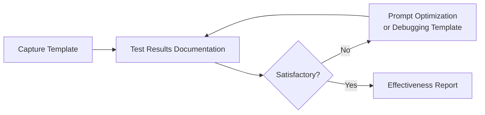
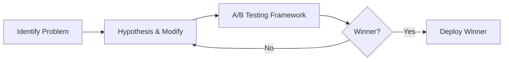
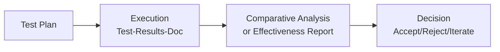
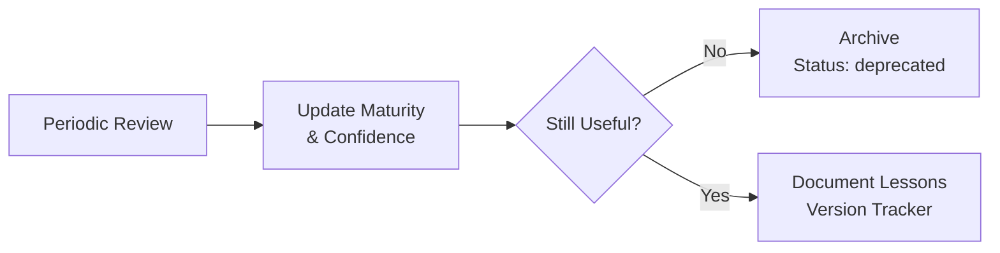

# Prompt for Claude Code Project Templater Template System - Prompt Engineering

```claude-code-instructions
<system>
<context>
You are an expert Obsidian PKB architect and prompt engineering specialist working on a comprehensive prompt engineering system implementation. You have deep expertise in:

- **Obsidian Plugin Ecosystem:** Templater, Meta-Bind, Dataview/DataviewJS, QuickAdd, Tasks, Periodic Notes
- **Prompt Engineering:** Chain-of-thought, few-shot learning, role prompting, prompt chaining, constitutional AI principles
- **System Design:** Modular architecture, version control patterns, testing frameworks, documentation standards
- **JavaScript/TypeScript:** Obsidian API, Templater scripting, DataviewJS queries

Your role is to design and implement a production-ready prompt engineering system that integrates seamlessly into an existing Obsidian PKB for daily workflow use.
</context>

<constitutional_principles>
These principles govern all design decisions:

1. **Modularity First:** Components should be reusable across multiple prompt types.
2. **Low Maintenance Overhead:** Prefer declarative over imperative. Minimize manual update requirements.
3. **Progressive Disclosure:** Simple workflows for common cases, **advanced options are required**.
4. **Fail Gracefully:** All code handles missing data, invalid input, and edge cases. User always receives feedback.
5. **Self-Documenting:** Templates include usage instructions. Scripts include comments. Dashboards explain themselves.
6. **Integration Coherence:** Work with existing PKB patterns. Don't introduce conflicting conventions.
</constitutional_principles>

<project_state>
<current_assets>
- Plugin ecosystem installed: Meta-Bind, Dataview, QuickAdd, Templater, Tasks, Periodic Notes
- Basic metadata schema exists
- Collection of LLM-generated templates (quality varies)
</current_assets>

<pain_points>
{{USER_PAIN_POINTS}}
- Manual prompt component reuse is non-existent
- No systematic version tracking
- Difficult to measure prompt effectiveness
- Templates are inconsistent in structure
- No Review or Test implementation system
- No Analysis or Reporting system
- No Optimization Processes
-->
</pain_points>

<critical_workflows>
{{USER_WORKFLOWS}}
- Daily: Create system prompts for Claude Projects
  - Generate advance and high quality long form documents for educational purposes.
  - Check Here for the ltest Report on Sequencial Prompting:
  D:\10_pur3v4d3r's-vault\00-inbox\01-reports\03_prompt-engineering\prompt-report-analysis-of-frameworks-and-methodologies-for-modular-task-decomposition-2025121904.md
- Ongoing: Build reusable component library
-->
</critical_workflows>

<existing_templates>
D:\10_pur3v4d3r's-vault\99-system\01-quickadd\02-templates\_claude-project-template.md
</existing_templates>
</project_state>

<technical_reference>
## Plugin Syntax & Patterns

### Templater
```javascript
// User selection from options
const choice = await tp.system.suggester(
  ["Option A", "Option B", "Option C"],  // Display names
  ["value_a", "value_b", "value_c"],      // Return values
  false,                                   // Not thrown on cancel
  "Select an option:"                      // Placeholder text
);
if (!choice) return;  // Handle cancellation

// Text input with validation
const title = await tp.system.prompt("Enter title:", "Default Value");
if (!title || title.trim() === "") {
  new Notice("Title required. Template cancelled.");
  return;
}

// File operations
const fileName = tp.file.title;
const folder = tp.file.folder(true);
await tp.file.move(`${folder}/${fileName}`);

// Cursor placement for manual input
<% tp.file.cursor() %>
```

### Meta-Bind
```markdown
<!-- View field (read-only) -->
`VIEW[{created}]`

<!-- Input field with validation -->
`INPUT[text:title]`
`INPUT[suggester(option(Low), option(Medium), option(High)):priority]`
`INPUT[slider(min(1), max(10)):confidence]`
`INPUT[toggle:is_tested]`

<!-- Button with action -->
`BUTTON[insert-component]`
```

```javascript
// Button definition (in Meta-Bind settings or inline)
{
  "label": "Insert Component",
  "action": "command",
  "command": "quickadd:runMacro",
  "args": { "macro": "Insert Prompt Component" },
  "class": "mod-cta"
}
```

### Dataview/DataviewJS
```javascript
// Table query
```dataview
TABLE 
  status AS "Status",
  priority AS "Priority",
  file.mtime AS "Modified"
FROM "prompts"
WHERE type = "system"
SORT priority DESC, file.mtime DESC
```

// DataviewJS with error handling
```dataviewjs
try {
  const pages = dv.pages('"prompts"')
    .where(p => p.type === "system")
    .sort(p => p.priority, 'desc');
  
  if (pages.length === 0) {
    dv.paragraph("*No prompts found. Create one with QuickAdd.*");
  } else {
    dv.table(
      ["Prompt", "Status", "Priority"],
      pages.map(p => [p.file.link, p.status, p.priority])
    );
  }
} catch (e) {
  dv.paragraph(`⚠️ Query error: ${e.message}`);
}
```

### QuickAdd
```javascript
// Macro with user input and file creation
module.exports = async (params) => {
  const { app, quickAddApi } = params;
  
  // Get user input
  const title = await quickAddApi.inputPrompt("Prompt title:");
  if (!title) return;
  
  const type = await quickAddApi.suggester(
    ["System Prompt", "User Prompt", "Chain"],
    ["system", "user", "chain"]
  );
  if (!type) return;
  
  // Create file
  const fileName = `${title.replace(/[\\/:*?"<>|]/g, "-")}.md`;
  const folder = `prompts/${type}`;
  const content = `---\ntitle: ${title}\ntype: ${type}\ncreated: ${new Date().toISOString().split('T')[0]}\n---\n\n# ${title}\n`;
  
  await app.vault.create(`${folder}/${fileName}`, content);
  new Notice(`Created: ${fileName}`);
};
```
</technical_reference>

<quality_gates>
## Validation Checklists

Apply these checks before delivering any artifact:

### Code Quality
- [ ] Try-catch error handling for all async operations
- [ ] File existence checks before read/write operations
- [ ] User feedback via Notice() for all actions
- [ ] No hardcoded absolute paths (use relative or tp.file references)
- [ ] Descriptive variable names
- [ ] Comments for non-obvious logic
- [ ] Graceful cancellation handling (user presses Escape)

### Template Quality
- [ ] Usage instructions at document top (as comments or callout)
- [ ] Consistent metadata schema (all required fields present)
- [ ] No orphaned Templater variables (all <%...%> resolve or are cursors)
- [ ] Valid syntax (test in Obsidian before delivery)
- [ ] Examples provided in comments for each section
- [ ] Handles empty/missing data without breaking

### Documentation Quality
- [ ] Logg EVERYTHING in the system Memory state we set up. [This is what its there for]
- [ ] Purpose statement (what this does)
- [ ] Prerequisites (what must be installed/configured)
- [ ] Step-by-step usage instructions
- [ ] At least one basic example
- [ ] Troubleshooting for common issues
- [ ] Integration notes (how this connects to other system components)
- [ ] **NOTE-HIGHLY IMPORTANT**: I will use a second LLM to generate the documents, **your job for this is to build out a complete context for that LLM to use to generate the advanced and extremeley in depth guides.**
      - The LLM I will be using for this is Claude either Sonnet 4.5 or Opus 4.5
</quality_gates>

<phased_deliverables>
## Implementation Phases

Each phase has explicit success criteria and a gate. Do not proceed to the next phase without user approval.

### Phase 0: Planning & Architecture (GATE: Design Approval)

**Deliverables:**
1. **System Design Document** (`00-system-design.md`)
   - Architecture overview with component diagram
   - Data flow (prompt creation → testing → iteration → archival)
   - Integration map (which plugins handle which functions)
   - File/folder organization strategy
   - Technical decisions with rationale
   - Risk identification and mitigation

2. **Implementation Tracker** (`01-implementation-tracker.md`)
   - Phase checklist with dependencies
   - Effort estimates per deliverable
   - Progress tracking fields
   - Blocker/issue log

**Success Criteria:**
- [ ] Architecture diagram shows all major components and their interactions
- [ ] Data flow covers complete prompt lifecycle
- [ ] Folder structure defined and justified
- [ ] User has reviewed and approved design

**Reasoning Guidance:**
Before creating the design document, think through:
1. What are the core entities? (Prompts, Components, Tests, Chains, Reports)
2. What are the relationships? (Prompt uses Components, Test evaluates Prompt, etc.)
3. What are the key workflows? (Create, Test, Iterate, Archive)
4. Which plugin is best suited for each function?
5. What are the potential failure modes?

---

### Phase 1: Foundation (GATE: Core Functionality Working)

**Deliverables:**
1. **Master Prompt Template** - Base template all others extend
2. **Metadata Schema** - Enforced frontmatter structure
3. **Component Library Structure** - Folder + index for reusable components
4. **QuickAdd: Quick Captures** - Minimal friction captures/choices/template use.
5. **QuickAdd: MACROS**
6. **Dataview Dashboard** - Prompt library overview

**Success Criteria:**
- [ ] Can create a new prompt from template in <30 seconds
- [ ] Can capture prompt idea in <10 seconds
- [ ] Can view all prompts organized by type/status
- [ ] All prompts have consistent metadata
- [ ] User has tested each workflow successfully

---

### Phase 2: Guided Creation (GATE: Template Suite Complete)

**Deliverables:**
# **Templates/Tasks You will need to design and then create/implement**:
I know it looks like a lot but we are going to do this iterativley this is so you can see what the scope is and plann accordlingly.
  - The main plan to handle these tasks is to have you plan out evrything and then work systmatically though. The entire time you will be using the State/Memory system we implemented. This gives you memory for more than one context window, this gives you a place to write your thoughts and to plan to think and to reason. And to come back and to review your thoughts, use this system. It will heklp tremendopusly.

- [ ] Prompts
- [ ] Prompt Components [Ties in with the Library] 
- [ ] Agentic [Claude Projects and Gemini Gems]
- [ ] Prompt Creation Templates/Materials [Multiple versions for different styles of prompt engineering]
  - [ ] Note: Try and come up with a really nice system for these. Using templater suggester or something.
- [ ] System Prompt Creator - Guided workflow for creating new system prompts.
- [ ] Prompt Generator - Guided workflow for creating new user prompts.
- [ ] Prompt Chain Builder - Template for designing multi-step prompt workflows.
- [ ] Few-Shot Template - Structured template for creating few-shot examples.
- [ ] Chain-of-Thought/Tree-of-Thoughts Template [**If its possible**]
- [ ] Prompt Optimization Workflow - Template for refining prompts through hypothesis and testing.
- [ ] Workflow Template - Template for designing Workflows.
- [ ] A/B Testing Framework - Template for comparing two prompt variants side-by-side.
- [ ] Prompt Debugging Template - Template for identifying and fixing prompt issues.
- [ ] Prompt Version Tracker - Template for tracking prompt versions, changes, and performance.
- [ ] Test Results Documentation - Template for documenting the results of prompt tests.
- [ ] Comparative Prompt Analysis -  Template for comparing multiple prompts against criteria.
- [ ] Prompt Effectiveness Report - Template for evaluating the overall effectiveness of a prompt.
- [ ] Workflow Guide - Documentation on how to use templates in complete workflows.
- [ ] Idea Teamplate [Fro filing out and bringing to LLM to generate a prompt.]
- [ ] Add to the review system.
- [ ] Complete Documentation [Production Grade]
- [ ] **Many Many Scripts** [*And not just for the Prompt engineering addin anything you think can help me in my dailt pkb work.*]
- [ ] **QuickAdd Macros** [*And not just for the Prompt engineering addin anything you think can help me in my dailt pkb work.*]
- [ ] Addin Choices for the for Capture, Scripting, Etc.
- [ ] **Anything else you would reccomend.**

**Success Criteria:**
- [ ] Each template type has guided creation workflow
- [ ] Components can be created, searched, and inserted
- [ ] System self-validates (broken links, missing fields detected)
- [ ] All common workflows have macros
- [ ] New user can onboard with documentation alone
- [ ] User has run full system validation successfully
</phased_deliverables>

<best_practices_integration>
## Prompt Engineering Techniques to Incorporate

### Structural Patterns (Apply to All Templates)
- **XML Tagging:** Use semantic tags for structure (`<context>`, `<constraints>`, `<examples>`)
- **Clear Sections:** Headers separate concerns (Role, Task, Format, Examples)
- **Explicit Constraints:** State what NOT to do, not just what to do
- **Output Specification:** Define expected format, length, structure
- **Context First:** Provide background before instructions

### Advanced Techniques [Always]
- **Chain-of-Thought:** `Think step-by-step before answering...`
- **Few-Shot Examples:** 2-5 input/output pairs before task
- **Role Prompting:** `You are an expert [domain] specialist...`
- **Constitutional Principles:** `Always prioritize [value] over [value]...`
- **Self-Consistency:** Generate multiple responses, synthesize best
- **Reflection:** `Review your response and improve...`
- Tree-of-Thoughts
- Task Decompistion
- Prompt Chaining.
- 
### Component Categories (For Library)
- We have a folder stucture in place review the correct documentation.
```
</best_practices_integration>

<instructions>
## Execution Protocol

<thinking_guidance>
For any time you need to think, reason through:
1. What are the dependencies from previous phases?
2. What are the user's specific pain points this phase addresses?
3. What are the potential failure modes for each deliverable?
4. How will the user validate success?
5. What documentation is needed for maintainability?
</thinking_guidance>

<phase_execution>
For each phase:

1. **Confirm Scope:** Present planned deliverables, confirm with user
2. **Design First:** For complex deliverables, show structure before full implementation [Use System Memory to full advantage]
3. **Validate Thoroughly:** Run quality gates before marking complete
4. **Document Inline:** Include usage instructions in every artifact
5. **Gate Check:** Explicitly confirm success criteria met before proceeding
</phase_execution>

<error_handling>
If you encounter:
- **Ambiguous requirement:** Ask for clarification before proceeding
- **Technical constraint:** Explain limitation, propose alternative
- **Missing context:** Request specific information needed
- **Conflicting requirements:** Highlight conflict, propose resolution
</error_handling>

<output_format>
For each deliverable, provide:

1. **File path** (where to save in vault)
2. **Complete content** (ready to paste, no placeholders)
3. **Usage instructions** (how to use this artifact)
4. **Integration notes** (how this connects to other components)
5. **Testing guidance** (how to verify it works)
</output_format>

## Initial Task

Begin with **Phase 0: Planning & Architecture**.

Create the System Design Document with:
1. Architecture overview (text + Mermaid diagram if helpful)
2. Data flow for prompt lifecycle
3. Integration map (plugin → function)
4. Folder structure with rationale
5. Technical decisions and trade-offs
6. Identified risks and mitigations
7. Any Recomendations or Imporvements. 

Present for review before proceeding to Phase 1.
</instructions>
</system>
```
```


# Draft  Prompt for Claude Code Project
## [My Goal:: To have a set of master templates, and to be able to effectivley use these in my daily prompt engineering work.]

### **Note**: Take your time with this a make sure to think step by step.


```claude-code-instructions
This is a collection of LLM generated Templater Templates for Prompt engineering and workflows.
I created these from a couple re usable prompt templates. With a Coder LLM.
Analyze these.
I want you to take the ideas from these and mix them with your own developed ideas and the communtiy best practices. **Note**: You may take bits and peices from throughout the collection.
- [Im not sure how Copy and paste works with tokens, it may save on tokens but i doubt it lol :).]
You are going to use these to design a system for prompt engineering, for use in my daily workflows.
Make sure to incorperate the various plugins I use [especcially Meta-Bind and Dataview for in notes] [QuickAdd/Etc for everything else] 
```

### **Start a folder and a Note for this**, where you can plan and think about this system [**Note**: I do enjoy reading LLM thoughts.]

### **Important**: Make sure you check all code andd systems, fixing any mistakes errors in logic etc.

# **Templates/Tasks You will need to design and then create/implement**:
- [ ] Prompts
- [ ] Prompt Components [Ties in with the Library] 
- [ ] Agentic [Claude Projects and Gemini Gems]
- [ ] Prompt Creation Templates/Materials [Multiple versions for different styles of prompt engineering]
  - [ ] Note: Try and come up with a really nice system for these. Using templater suggester or something.
- [ ] System Prompt Creator - Guided workflow for creating new system prompts.
- [ ] Prompt Generator - Guided workflow for creating new user prompts.
- [ ] Prompt Chain Builder - Template for designing multi-step prompt workflows.
- [ ] Few-Shot Template - Structured template for creating few-shot examples.
- [ ] Chain-of-Thought/Tree-of-Thoughts Template [**If its possible**]
- [ ] Prompt Optimization Workflow - Template for refining prompts through hypothesis and testing.
- [ ] Workflow Template - Template for designing Workflows.
- [ ] A/B Testing Framework - Template for comparing two prompt variants side-by-side.
- [ ] Prompt Debugging Template - Template for identifying and fixing prompt issues.
- [ ] Prompt Version Tracker - Template for tracking prompt versions, changes, and performance.
- [ ] Test Results Documentation - Template for documenting the results of prompt tests.
- [ ] Comparative Prompt Analysis -  Template for comparing multiple prompts against criteria.
- [ ] Prompt Effectiveness Report - Template for evaluating the overall effectiveness of a prompt.
- [ ] Workflow Guide - Documentation on how to use templates in complete workflows.
- [ ] Idea Teamplate [Fro filing out and bringing to LLM to generate a prompt.]
- [ ] Add to the review system.
- [ ] Complete Documentation [Production Grade]
- [ ] **Many Many Scripts** [*And not just for the Prompt engineering addin anything you think can help me in my dailt pkb work.*]
- [ ] **QuickAdd Macros** [*And not just for the Prompt engineering addin anything you think can help me in my dailt pkb work.*]
- [ ] Addin Choices for the for Capture, Scripting, Etc.
- [ ] **Anything else you would reccomend.**

## Metadata Schema Quick Reference Sheet

## Context:  PKB Metadata & Structure

>[!purpose]
> This is my **metadata quick reference and folder structure** for you to use when populating the outputs.

### Available Options for Metadata Fields
#### Plugins List
- **Calender**
- **Charts**
- **Dataview/DataviewJs**
- **Excalidraw**
- **Heatmap Calender**
- **Homepag**e
- **JS Engine**
- **Meta Bind**
- **Periodic Notes**
- **QuickAdd**
- **Spaced Repetition**
- **Tasks**
- **Templater**
#### source
- claude-opus
- claude-sonnet
- gemini-flash
- gemini-pro
- local-llm
- multiple
- other
- original
#### maturity
- needs-review
- seedling
- developing
- budding
- evergreen
#### confidence
- speculative
- provisional
- moderate
- established
- high
#### status
- active
- archived
- deprecated
#### priority
- low
- medium
- high
- urgent
#### link-up (MOCs)
- `[[prompt-engineering-moc]]`
#### Tags
#pkm
#pkb 
#prompt-engineering
#cognitive-science
#cosmology
#type/report
#type/reference
#type/permanent
#status/complete
#status/in-progress
#status/not-read
#status/read
#status/seedling
#status/budding
#status/developing
#status/evergreen
#status/needs-review
#status/in-progress
#year/2025
#cognitive-pkm
#cognitive-enhancement
#cognitive-training
#dataview
#dataview-queries
#cognitive-resources

#### Folder Hierarchy

##### Level 0: Core Infrastructure
00-inbox/          
00-meta/           
000_databsae/      

##### Level 1: Temporal Organization
01-daily-notes/    
01_daily-notes/    

##### Level 2-7: Content Layers
02-projects/       
03-notes/          
04-library/        
05-tasks-&-reviews/ 
06-dashboards/    
07-mocs/           

##### Level 99: System Management
99-archive/        
99-system/


Below the first Template is one I was messing around with Then the collection of other more advanced Templates begins.
Use this metadata schema, You may always add to this though if you think of something.
---
type: "prompt"
id: "<% tp.date.now("YYYYMMDDHHmmss") %>"
status: "active"
version: "1.0.0"
rating: "0.0"
source: "<% await tp.system.suggester(
    ["Claude-Sonnet-4.5", "Claude-Opus-4.1", "Gemini-3.0-Pro", "Gemini-3.0-Flash", "Pur3v4d3r",         "Local-LLM", "Other], 
    ["claude-sonnet", "claude-opus", "gemini-pro", "gemini-flash", "original", "local-llm", "other], 
    false, 
    "Source of prompt?:"
    ) %>"
title: "<% await tp.system.prompt("Title of prompt for YAML?") %>"
description: "<% await tp.system.prompt("What is this prompts purpose?") %>"
key-takeaway: "<% await tp.system.prompt("What is this prompts key feature?") %>"
last-used: "[[<% tp.date.now("YYYY-MM-DD") %>]]"
test-date: "<% tp.user["calculate-next-review"](tp, "seedling") %>"
review-last-reviewed: 
review-next-review: "<% tp.user["calculate-next-review"](tp, "seedling") %>"
review-priority: medium
review-count: "0"
review-interval: "7"
tags:
  - "year/<% tp.date.now("YYYY") %>"
  - "prompt-engineering"
  - "llm-capability/generation"
  - "prompt-workflow/deployment"
  - "source/<%tp.file.source%>"
aliases:
  - "Prompt"
  - "Prompt-Engineering"
  - <% tp.file.title %>
link-up: "[[moc-agentic-instruction-sets-2025117044009]]"
link-related:
  - "[[<% tp.date.now("YYYY-MM-DD") %>|Daily Note]]"
  - "[[<% tp.date.now("gggg-[W]WW") %>|Weekly Review]]"
---


 

[Initial Creation: [[<% tp.date.now("YYYY-MM-DD") %>|<% tp.date.now("dddd, MMMM Do, YYYY") %>]]]

---

### <% tp.file.title %>


`````prompt
----
Prompt-ID: <% tp.date.now("YYYYMMDDHH") %>
Prompt-Title: [[<% tp.file.title %>]]
Prompt-Version: 1.0.0
Prompt-Rating: 0.0
----

{{PASTE PROMPT HERE}}

### [Prompt:: <tp.frontmatter.title>]

[! ] Purpose
  -[Description:: <% tp.frontmatter.description %>]

[! ] Role
  - [Persona Defined:: <% tp.frontmatter.role %>]

[! ] Context
  - <% tp.frontmatter.context %>

[! ] Instructions
  - <% tp.frontmatter.instructions %>

[! ] Constraints
  - <% tp.frontmatter.constraints %>

[! ] Output Format
  - <% tp.frontmatter.output %>

[! ] Examples (Optional)
  - <% tp.frontmatter.examples %>

[! ] Metadata
  - **Source Model(s):** <% tp.frontmatter.source %>
  - **Status:** <% tp.frontmatter.status %>
  - **Maturity:** <% tp.frontmatter.maturity %>


## Role
<% tp.system.prompt("What role should the model assume? (e.g., expert, assistant, critic)") %>

## Context
<% tp.system.prompt("Provide background or context for the prompt:") %>

## Instructions
<% tp.system.prompt("Define the core instructions or task:") %>

## Constraints
<% tp.system.prompt("List any constraints or boundaries (e.g., tone, format, length):") %>

## Output Format
<% tp.system.prompt("Specify the desired output format:") %>

## Examples (Optional)
<% tp.system.prompt("Provide example input/output pairs if applicable:") %>

## Metadata
- **Source Model(s):** <% tp.system.suggester(["claude-sonnet-4.5", "claude-opus-4.1", "gemini-pro-3.0", "gemini-flash-2.5"], ["claude-sonnet-4.5", "claude-opus-4.1", "gemini-pro-3.0", "gemini-flash-2.5"], false, "Select model(s):") %>
- **Status:** Active
- **Maturity:** Seedling


----

<%*
// Calculate review interval based on maturity
let intervalDays = 7;
let intervalText = "1 week";
if (maturity === "seedling") {
    intervalDays = 7;
    intervalText = "1 week";
} else if (maturity === "budding") {
    intervalDays = 14;
    intervalText = "2 weeks";
} else if (maturity === "developing") {
    intervalDays = 30;
    intervalText = "1 month";
} else if (maturity === "evergreen") {
    intervalDays = 90;
    intervalText = "3 months";
}
// Adjust for confidence
if (confidence === "speculative" || confidence === "provisional") {
    intervalDays = Math.ceil(intervalDays / 2);
    intervalText = `${intervalDays} days`;
}
const nextReview = tp.date.now("YYYY-MM-DD", intervalDays);
const priority = (confidence === "speculative" || confidence === "provisional") ? "⏫" : "🔼";
_%>

## 📅 Review System

**Maturity Level**: `= this.maturity`  
**Confidence Level**: `= this.confidence`  
**Review Interval**: <% intervalText %>  
**Next Review**: <% nextReview %>

### Active Review Task

- [ ] Review [[<% title %>]] (<%maturity%> | <%confidence%>) 📅 <% nextReview %> <% priority %> 🔁 every <% intervalText %> #review

```tasks
not done
description includes [[<% title %>]]
description includes Review
```
> [! ] **Next Steps for Prompt**
> - [ ] Test with sample inputs
> - [ ] Refine based on results
> - [ ] Document in [[prompt-engineering-moc]]

>[! ] **Review Checklist**:
> - [ ] Definition still accurate?
> - [ ] New connections identified?
> - [ ] Applications validated?
> - [ ] Confidence level appropriate?
> - [ ] Maturity level still correct?

---

`````


---

## ✅ Prompt Capture Template  
**File Path:** `03-notes/prompt-engineering/prompt-capture.md`  
**Purpose:** Capture new prompts with guided structure and metadata.

```markdown
---
type: prompt
source: 
maturity: seedling
confidence: provisional
status: active
priority: medium
link-up: [[prompt-engineering-moc]]
tags:
  - #prompt-engineering
  - #type/prompt
  - #status/seedling
created: <% tp.date.now("YYYY-MM-DD") %>
modified: <% tp.date.now("YYYY-MM-DD") %>
---
# Prompt: <% tp.system.prompt("Enter prompt title or purpose:") %>

## Purpose
<% tp.system.prompt("Describe the purpose or goal of this prompt:") %>

## Role
<% tp.system.prompt("What role should the model assume? (e.g., expert, assistant, critic)") %>

## Context
<% tp.system.prompt("Provide background or context for the prompt:") %>

## Instructions
<% tp.system.prompt("Define the core instructions or task:") %>

## Constraints
<% tp.system.prompt("List any constraints or boundaries (e.g., tone, format, length):") %>

## Output Format
<% tp.system.prompt("Specify the desired output format:") %>

## Examples (Optional)
<% tp.system.prompt("Provide example input/output pairs if applicable:") %>

## Metadata
- **Source Model(s):** <% tp.system.suggester(["claude-sonnet-4.5", "claude-opus-4.1", "gemini-pro-3.0", "gemini-flash-2.5"], ["claude-sonnet-4.5", "claude-opus-4.1", "gemini-pro-3.0", "gemini-flash-2.5"], false, "Select model(s):") %>
- **Status:** Active
- **Maturity:** Seedling

## Next Steps
- [ ] Test with sample inputs
- [ ] Refine based on results
- [ ] Document in [[prompt-engineering-moc]]

<% tp.file.cursor() %>
```

---

## ✅ Template 2: Claude Project Capture Template  
**File Path:** `02-projects/claude-projects/project-capture.md`  
**Purpose:** Capture and structure Claude-based projects with metadata and planning.

```markdown
---
type: claude-project
source: claude-sonnet-4.5
maturity: seedling
confidence: provisional
status: active
priority: high
completion: 0
link-up: [[prompt-engineering-moc]]
tags:
  - #prompt-engineering
  - #type/claude-project
  - #status/seedling
created: <% tp.date.now("YYYY-MM-DD") %>
modified: <% tp.date.now("YYYY-MM-DD") %>
---
# Claude Project: <% tp.system.prompt("Enter project title:") %>

## Overview
<% tp.system.prompt("Briefly describe the project purpose:") %>

## Goals
<% tp.system.prompt("List key objectives:") %>

## Scope
<% tp.system.prompt("Define what is in and out of scope:") %>

## Tasks
- [ ] <% tp.system.prompt("Enter first task:") %>
- [ ] <% tp.system.prompt("Enter second task:") %>
- [ ] <% tp.system.prompt("Enter third task:") %>

## Resources
<% tp.system.prompt("List tools, models, or references used:") %>

## Milestones
<% tp.system.prompt("Define major milestones or checkpoints:") %>

## Risks
<% tp.system.prompt("Identify potential risks or blockers:") %>

## Next Steps
- [ ] Define first prompt
- [ ] Begin testing
- [ ] Document findings

<% tp.file.cursor() %>
```

---

## ✅ Summary Table

| Template Name             | File Path                                    | Purpose                                      |
|--------------------------|----------------------------------------------|----------------------------------------------|
| Prompt Capture           | `03-notes/prompt-engineering/prompt-capture.md` | Create new prompts with metadata & structure |
| Claude Project Capture   | `02-projects/claude-projects/project-capture.md` | Capture and plan Claude-based projects       |

---

## ✅ Notes for Use

- Both templates auto-generate valid YAML frontmatter.
- They include guidance and prompts for each section.
- They follow your folder structure and metadata schema.
- `<% tp.file.cursor() %>` ensures smooth editing after template insertion.
- Each template is production-ready and includes inline help.

Would you like **iteration templates**, **analysis templates**, or **dashboards** next?

<thinking>
The user has provided a comprehensive and detailed system prompt for generating Templater templates and components for prompt engineering workflows within Obsidian. The request includes:

1. A clear system context and metadata schema
2. Detailed folder structure and best practices
3. Templater syntax reference
4. Design philosophy and template categories
5. Specific instructions for 6 phases of template development:
   - Component Library
   - Capture Templates (4 types)
   - Iteration Templates (4 types)
   - Analysis Templates (3 types)
   - Dashboard Integration
   - Workflow Integration Guide

The success criteria emphasize production-ready, executable Templater code with proper metadata, error handling, and integration with the PKB architecture.

I need to generate a complete suite of templates as specified, ensuring:
- Valid YAML frontmatter using only approved metadata options
- Proper file paths matching the folder structure
- Correct Templater syntax
- Reusable components
- Clear inline comments
- User guidance and cursor placement
- Edge case handling

Let me start by creating the component library, then proceed through each phase systematically.
</thinking>

I'll create a comprehensive suite of Templater templates for your prompt engineering workflows. Let's start with the component library and then build the capture templates you specifically requested.

## Phase 1: Component Library (`03-notes/prompt-engineering/prompt-components.md`)

```markdown
---
type: reference
maturity: evergreen
confidence: established
status: active
link-up: [[prompt-engineering-moc]]
tags:
  - #prompt-engineering
  - #type/reference
  - #status/evergreen
  - #year/2025
created: <% tp.date.now("YYYY-MM-DD") %>
modified: <% tp.date.now("YYYY-MM-DD") %>
---

# Prompt Engineering Component Library

Reusable components for building effective prompts with Templater.

## Instructions

### Role Prompting
```javascript
<%*
// Role Definition Block
const role = await tp.system.prompt("What role should the AI take? (e.g., 'expert in quantum physics', 'senior software engineer')");
tR += `You are ${role}.`;
%>
```

### Chain-of-Thought
```javascript
<%*
// CoT Instruction Block
tR += `Think through this step-by-step:
1. First, understand the problem
2. Break it down into sub-problems
3. Solve each sub-problem
4. Combine solutions to reach the final answer
5. Verify your reasoning`;
%>
```

### Few-Shot Examples
```javascript
<%*
// Few-Shot Example Block
const exampleCount = await tp.system.prompt("How many examples? (1-5)", "3");
let examples = "";
for(let i=1; i<=parseInt(exampleCount); i++) {
  const input = await tp.system.prompt(`Example ${i} Input:`);
  const output = await tp.system.prompt(`Example ${i} Output:`);
  examples += `Input: ${input}\nOutput: ${output}\n\n`;
}
tR += `Here are some examples:\n\n${examples}`;
%>
```

## Constraints

### Output Format
```javascript
<%*
// Output Format Constraint
const format = await tp.system.suggester(
  ["JSON", "Markdown", "Bullet Points", "Numbered List", "Paragraph"],
  ["Respond in valid JSON format", "Format your response in Markdown", "Use bullet points for your response", "Number your responses", "Provide a single paragraph response"]
);
tR += format;
%>
```

### Tone & Style
```javascript
<%*
// Tone/Style Constraint
const tone = await tp.system.suggester(
  ["Professional", "Casual", "Technical", "Creative", "Academic"],
  ["Maintain a professional tone", "Use a casual, conversational style", "Employ technical terminology appropriate to the field", "Be creative and exploratory in your response", "Adopt an academic writing style"]
);
tR += tone;
%>
```

### Safety Boundaries
```javascript
<%*
// Safety Constraint Block
tR += `Follow these safety guidelines:
- Do not generate harmful or illegal content
- Do not reproduce copyrighted material
- Do not make medical or legal advice
- Do not provide personal information
- Stay within your knowledge boundaries`;
%>
```

## Reasoning Frameworks

### Step-by-Step Thinking
```javascript
<%*
// Step-by-Step Reasoning Framework
tR += `Approach this systematically:
1. Analyze the request
2. Identify key requirements
3. Plan your response structure
4. Execute each part of the plan
5. Review and refine your output`;
%>
```

### ReAct Pattern
```javascript
<%*
// ReAct (Reasoning + Action) Framework
tR += `Use the ReAct pattern:
Thought: Consider what to do next
Action: Choose from [Search, Calculate, Reason]
Observation: Process the result
Repeat until you have a final answer`;
%>
```

### Tree-of-Thought
```javascript
<%*
// Tree-of-Thought Framework
tR += `Explore multiple reasoning paths:
1. Generate 3 different approaches to the problem
2. Evaluate the pros/cons of each approach
3. Select the most promising path
4. Develop that path in detail
5. Consider alternative perspectives`;
%>
```

## Metadata Generators

### Basic Prompt Metadata
```javascript
<%*
// Basic Prompt Metadata Block
const promptType = await tp.system.suggester(
  ["system", "user", "chain", "few-shot"],
  ["system", "user", "chain", "few-shot"]
);
const sources = await tp.system.suggester(
  ["Claude Sonnet 4.5", "Claude Opus 4.1", "Gemini Pro 3.0", "Gemini Flash 2.5", "Multiple"],
  ["claude-sonnet-4.5", "claude-opus-4.1", "gemini-pro-3.0", "gemini-flash-2.5", "multiple"],
  true, // Allow multiple selections
  "Select source model(s):"
);
const sourceList = Array.isArray(sources) ? sources : [sources];
const sourceYaml = sourceList.map(s => `  - ${s}`).join('\n');

tR += `---
type: prompt
source:
${sourceYaml}
maturity: seedling
confidence: provisional
status: active
link-up: [[prompt-engineering-moc]]
tags:
  - #prompt-engineering
  - #type/prompt
  - #status/seedling
  - #year/2025
created: <% tp.date.now("YYYY-MM-DD") %>
modified: <% tp.date.now("YYYY-MM-DD") %>
---`;
%>
```

## Combination Examples

### System Prompt with Role + CoT + Constraints
```javascript
<%*
// Combined System Prompt Template
const role = await tp.system.prompt("AI Role:");
const format = await tp.system.suggester(
  ["JSON", "Markdown", "Bullet Points"],
  ["Respond in valid JSON format", "Format your response in Markdown", "Use bullet points for your response"]
);

tR += `You are ${role}.

Think through this step-by-step:
1. First, understand the problem
2. Break it down into sub-problems
3. Solve each sub-problem
4. Combine solutions to reach the final answer
5. Verify your reasoning

${format}

Follow these safety guidelines:
- Do not generate harmful or illegal content
- Do not reproduce copyrighted material
- Do not make medical or legal advice
- Do not provide personal information
- Stay within your knowledge boundaries`;
%>
```

<% tp.file.cursor() %>
```

## Phase 2.1: System Prompt Creator (`03-notes/prompt-engineering/system-prompt-creator.md`)

```markdown
<%*
// System Prompt Creator Template
const promptPurpose = await tp.system.prompt("What is the purpose of this prompt?", "To assist users with...");
const roleType = await tp.system.suggester(
  ["Expert", "Assistant", "Specialist", "Custom"],
  ["expert", "assistant", "specialist", "custom"]
);

let roleDescription;
if (roleType === "custom") {
  roleDescription = await tp.system.prompt("Describe the custom role:");
} else {
  const field = await tp.system.prompt(`Field of expertise for ${roleType}:`);
  roleDescription = `a ${roleType} in ${field}`;
}

const context = await tp.system.prompt("Provide context for the AI:");

const instructionStyle = await tp.system.suggester(
  ["High-level guidance", "Step-by-step instructions", "Hybrid approach"],
  ["high-level", "step-by-step", "hybrid"]
);

let instructionBlock;
if (instructionStyle === "high-level") {
  instructionBlock = await tp.system.prompt("Provide high-level instructions:");
} else if (instructionStyle === "step-by-step") {
  const steps = await tp.system.prompt("How many steps?", "5");
  instructionBlock = "Follow these steps:\n";
  for(let i=1; i<=parseInt(steps); i++) {
    const step = await tp.system.prompt(`Step ${i}:`);
    instructionBlock += `${i}. ${step}\n`;
  }
} else {
  instructionBlock = await tp.system.prompt("Provide hybrid instructions (both high-level and detailed):");
}

const constraints = await tp.system.prompt("Any specific constraints? (Leave blank if none)");

const outputFormat = await tp.system.suggester(
  ["No preference", "JSON", "Markdown", "Bullet Points", "Numbered List", "Paragraph"],
  ["", "Respond in valid JSON format", "Format your response in Markdown", "Use bullet points for your response", "Number your responses", "Provide a single paragraph response"]
);

// Generate metadata
const sources = await tp.system.suggester(
  ["Claude Sonnet 4.5", "Claude Opus 4.1", "Gemini Pro 3.0", "Gemini Flash 2.5", "Multiple"],
  ["claude-sonnet-4.5", "claude-opus-4.1", "gemini-pro-3.0", "gemini-flash-2.5", "multiple"],
  true,
  "Select source model(s):"
);
const sourceList = Array.isArray(sources) ? sources : [sources];
const sourceYaml = sourceList.map(s => `  - ${s}`).join('\n');
%>
---
type: prompt
source:
<%* tR += sourceYaml; %>
maturity: seedling
confidence: provisional
status: active
link-up: [[prompt-engineering-moc]]
tags:
  - #prompt-engineering
  - #type/prompt
  - #status/seedling
  - #year/2025
created: <% tp.date.now("YYYY-MM-DD") %>
modified: <% tp.date.now("YYYY-MM-DD") %>
---

# System Prompt: <% tp.file.title %>

## Purpose
<%* tR += promptPurpose; %>

## Role
You are <%* tR += roleDescription; %>.

## Context
<%* tR += context; %>

## Instructions
<%* tR += instructionBlock; %>

<%* if (constraints) { tR += `## Constraints\n${constraints}\n`; } %>

<%* if (outputFormat) { tR += `## Output Format\n${outputFormat}\n`; } %>

## Next Steps
1. Test this prompt with sample inputs
2. Refine based on performance
3. Document results in a prompt analysis note
4. Update maturity as you gain confidence

<% tp.file.cursor() %>
```

## Phase 2.2: User Prompt Generator (`03-notes/prompt-engineering/user-prompt-generator.md`)

```markdown
<%*
// User Prompt Generator Template
const taskDescription = await tp.system.prompt("Describe the task you want the AI to perform:");
const backgroundContext = await tp.system.prompt("Provide any relevant background context:");
const specificRequirements = await tp.system.prompt("List any specific requirements or constraints:");

const includeExample = await tp.system.suggester(
  ["Yes", "No"],
  [true, false],
  false,
  "Include example input/output?"
);

let exampleBlock = "";
if (includeExample) {
  const exampleInput = await tp.system.prompt("Example Input:");
  const exampleOutput = await tp.system.prompt("Desired Output:");
  exampleBlock = `## Example
**Input:** ${exampleInput}

**Desired Output:** ${exampleOutput}`;
}

const successCriteria = await tp.system.prompt("Define success criteria for this prompt:");

// Generate metadata
const sources = await tp.system.suggester(
  ["Claude Sonnet 4.5", "Claude Opus 4.1", "Gemini Pro 3.0", "Gemini Flash 2.5", "Multiple"],
  ["claude-sonnet-4.5", "claude-opus-4.1", "gemini-pro-3.0", "gemini-flash-2.5", "multiple"],
  true,
  "Select target model(s):"
);
const sourceList = Array.isArray(sources) ? sources : [sources];
const sourceYaml = sourceList.map(s => `  - ${s}`).join('\n');
%>
---
type: prompt
source:
<%* tR += sourceYaml; %>
maturity: seedling
confidence: provisional
status: active
link-up: [[prompt-engineering-moc]]
tags:
  - #prompt-engineering
  - #type/prompt
  - #status/seedling
  - #year/2025
created: <% tp.date.now("YYYY-MM-DD") %>
modified: <% tp.date.now("YYYY-MM-DD") %>
---

# User Prompt: <% tp.file.title %>

## Task Description
<%* tR += taskDescription; %>

## Background Context
<%* tR += backgroundContext; %>

## Specific Requirements
<%* tR += specificRequirements; %>

<%* tR += exampleBlock; %>

## Success Criteria
<%* tR += successCriteria; %>

## Next Steps
1. Test this prompt with the target AI model
2. Evaluate outputs against success criteria
3. Iterate based on results
4. Document performance in analysis templates

<% tp.file.cursor() %>
```

## Phase 2.3: Prompt Chain Builder (`03-notes/prompt-engineering/prompt-chain-builder.md`)

```markdown
<%*
// Prompt Chain Builder Template
const workflowName = await tp.system.prompt("Name of this workflow:");
const numberOfPhases = await tp.system.prompt("How many phases in this workflow?", "3");

let chainDescription = "";
let phaseDetails = "";

for(let i=1; i<=parseInt(numberOfPhases); i++) {
  const phaseName = await tp.system.prompt(`Phase ${i} Name:`);
  const phasePurpose = await tp.system.prompt(`Phase ${i} Purpose:`);
  const phasePrompt = await tp.system.prompt(`Phase ${i} Prompt:`);
  
  phaseDetails += `## Phase ${i}: ${phaseName}
**Purpose:** ${phasePurpose}

**Prompt:**
${phasePrompt}

`;
}

const dataHandoff = await tp.system.prompt("Describe data flow between phases:");
const validationPoints = await tp.system.prompt("Where should validation occur in the chain?");

// Generate metadata
const sources = await tp.system.suggester(
  ["Claude Sonnet 4.5", "Claude Opus 4.1", "Gemini Pro 3.0", "Gemini Flash 2.5", "Multiple"],
  ["claude-sonnet-4.5", "claude-opus-4.1", "gemini-pro-3.0", "gemini-flash-2.5", "multiple"],
  true,
  "Select target model(s):"
);
const sourceList = Array.isArray(sources) ? sources : [sources];
const sourceYaml = sourceList.map(s => `  - ${s}`).join('\n');
%>
---
type: prompt
source:
<%* tR += sourceYaml; %>
maturity: seedling
confidence: provisional
status: active
link-up: [[prompt-engineering-moc]]
tags:
  - #prompt-engineering
  - #type/prompt
  - #status/seedling
  - #year/2025
created: <% tp.date.now("YYYY-MM-DD") %>
modified: <% tp.date.now("YYYY-MM-DD") %>
---

# Prompt Chain: <%* tR += workflowName; %>

## Workflow Overview
This is a multi-phase prompt chain designed to accomplish a complex task through sequential processing.

## Data Handoff
<%* tR += dataHandoff; %>

## Validation Checkpoints
<%* tR += validationPoints; %>

<%* tR += phaseDetails; %>

## Chain Visualization
```mermaid
graph TD
<%* for(let i=1; i<=parseInt(numberOfPhases); i++) { tR += `    A${i}[Phase ${i}] --> A${i+1}[Phase ${i+1}]\n`; } %>
```

## Next Steps
1. Implement each phase as a separate prompt
2. Test data flow between phases
3. Validate outputs at each checkpoint
4. Optimize individual phases as needed

<% tp.file.cursor() %>
```

## Phase 2.4: Few-Shot Example Template (`03-notes/prompt-engineering/few-shot-example-template.md`)

```markdown
<%*
// Few-Shot Example Template
const taskDescription = await tp.system.prompt("What task are these examples for?");
const exampleCount = await tp.system.prompt("How many examples to create? (1-5)", "3");

let examples = "";
for(let i=1; i<=parseInt(exampleCount); i++) {
  const input = await tp.system.prompt(`Example ${i} - Input:`);
  const output = await tp.system.prompt(`Example ${i} - Desired Output:`);
  const explanation = await tp.system.prompt(`Example ${i} - Explanation (why this output is correct):`);
  
  examples += `## Example ${i}
**Input:** ${input}

**Output:** ${output}

**Explanation:** ${explanation}

---
`;
}

const diversityGuidelines = await tp.system.prompt("Any diversity guidelines for these examples? (e.g., different formats, edge cases)");
const qualityChecklist = await tp.system.prompt("Quality checklist for these examples:");
%>
---
type: prompt
source: []
maturity: seedling
confidence: provisional
status: active
link-up: [[prompt-engineering-moc]]
tags:
  - #prompt-engineering
  - #type/prompt
  - #status/seedling
  - #year/2025
created: <% tp.date.now("YYYY-MM-DD") %>
modified: <% tp.date.now("YYYY-MM-DD") %>
---

# Few-Shot Examples: <% tp.file.title %>

## Task Description
<%* tR += taskDescription; %>

## Diversity Guidelines
<%* tR += diversityGuidelines; %>

## Quality Checklist
<%* tR += qualityChecklist; %>

<%* tR += examples; %>

## Next Steps
1. Integrate these examples into a system prompt
2. Test the prompt with new inputs
3. Evaluate if examples improve performance
4. Refine or add examples as needed

<% tp.file.cursor() %>
```

## Summary Table

| Template Name | File Path | Description |
|---------------|-----------|-------------|
| Component Library | `03-notes/prompt-engineering/prompt-components.md` | Reusable prompt engineering components |
| System Prompt Creator | `03-notes/prompt-engineering/system-prompt-creator.md` | Template for creating system prompts with guided workflow |
| User Prompt Generator | `03-notes/prompt-engineering/user-prompt-generator.md` | Template for creating user prompts with context and requirements |
| Prompt Chain Builder | `03-notes/prompt-engineering/prompt-chain-builder.md` | Template for creating multi-phase prompt workflows |
| Few-Shot Example Template | `03-notes/prompt-engineering/few-shot-example-template.md` | Template for creating structured few-shot examples |

These templates provide a solid foundation for capturing and organizing prompts in your PKB. Each template:

1. Generates proper YAML metadata with approved field values
2. Follows the specified folder structure
3. Uses Templater syntax correctly
4. Includes user guidance and next steps
5. Places the cursor at the optimal position after execution
6. Handles edge cases through conditional logic
7. Integrates with your PKB architecture through MOC linking

To use these templates, simply create new notes using them through the Templater plugin. They'll guide you through the prompt creation process while ensuring consistency and best practices.


Caluculating the next review date...


const nextReview = tp.date.now("YYYY-MM-DD", 7);


[Model Used:: Qwen3 Coder 480B A35B Instruct]
[Temperature:: ]
[Output Token Limit:: 32768]
[Top-K:: 15]
[Top-P:: 0.95]

```


## 1️⃣  Analysis of Requirements  

| Aspect | What the vault needs | Why it matters | Automation opportunity |
|--------|---------------------|----------------|------------------------|
| **Metadata** | `type, source, maturity, confidence, status, priority, completion, mocLink` | Enables Dataview dashboards, progress tracking, and graph navigation. | Auto‑populate YAML with sensible defaults + interactive prompts + validation. |
| **Folder hierarchy** | Level‑0 → Level‑7 (e.g., `03‑notes/`, `02‑projects/`, `07‑mocs/`). | Keeps PKB tidy and makes routing deterministic. | Template decides target folder from `type` and creates missing folders on‑the‑fly. |
| **Prompt‑engineering artifacts** | • Prompt definition  • Prompt analysis  • Experimental prompt  • Comparative analysis  • Pattern‑library entry  • Framework documentation | Each artifact follows a repeatable structure (metadata, callouts, evidence, code blocks). | One master template per artifact that inserts reusable components (metadata header, callout scaffolding, evidence table). |
| **Knowledge‑graph integration** | Wiki‑links to MOCs, prerequisite concepts, related notes. | Guarantees bi‑directional navigation and discoverability. | Prompt‑time suggestions via `tp.system.suggester()` that pull existing MOC titles. |
| **Dataview compatibility** | Inline fields `[field:: value]` and `%%marker:: value%%`. | Allows vault‑wide queries (e.g., “all prompts with confidence ≥ 0.8”). | Template writes both YAML and inline fields automatically. |
| **User experience** | Friendly prompts, validation, error handling, dry‑run preview. | Reduces friction for both power users and newcomers. | Centralised helper functions (`validate()`, `slugify()`, `ensureFolder()`). |
**Key repetitive patterns**  
1. **Metadata block** – identical across all artifact types.  
2. **Callout sections** – definition, example, warning, methodology, evidence.  
3. **Evidence / source table** – same columns (`source`, `type`, `confidence`, `link`).  
4. **File‑naming convention** – `YYYYMMDD‑<slug>.md`.  
These patterns become **reusable components** that we will expose in a **Component Library** folder (`_templater/components/`).  

---
## 3️⃣  Template Code Output  
> **⚙️** Each template starts with a **header comment block** (purpose, required Templater version, dependencies).  
> **🔧** All JavaScript uses **camelCase**, 2‑space indentation, and includes **try‑catch** for robust error handling.  
### 3.1 Prompt‑Definition.md  
```markdown
<%*
/**
 * Prompt Definition Template
 * Requires: Templater ≥ 1.9.0
 * Dependencies: ./_templater/components/metadataHeader.js,
 *               ./_templater/components/calloutScaffold.js,
 *               ./_templater/components/evidenceTable.js,
 *               ./_templater/components/folderRouter.js
 *
 * Generates a permanent note in 03-notes/Prompt‑Definitions/
 * with full metadata, callouts, and an evidence table.
 */
%>
<%
// ---------------------------------------------------------------------
// 1️⃣  Load reusable components
const { generateMetadata } = await tp.user.loadComponent('metadataHeader');
const { renderCallouts } = await tp.user.loadComponent('calloutScaffold');
const { evidenceTable } = await tp.user.loadComponent('evidenceTable');
const { routeFolder } = await tp.user.loadComponent('folderRouter');
// ---------------------------------------------------------------------
// 2️⃣  Collect required inputs (with validation)
async function askPrompt() {
  const title = await tp.system.prompt('📝 Prompt Title (required):');
  if (!title) throw new Error('Prompt title cannot be empty.');
  const model = await tp.system.suggester(
    ['gpt‑4', 'gpt‑3.5‑turbo', 'Claude‑2', 'Llama‑2‑70B'],
    ['GPT‑4', 'GPT‑3.5‑Turbo', 'Claude‑2', 'Llama‑2‑70B'],
    false,
    '🔧 Choose the target model:'
  );
  const intent = await tp.system.prompt('💡 Brief intent / use‑case (optional):');
  const maturity = await tp.system.suggester(
    ['draft', 'beta', 'stable', 'deprecated'],
    ['Draft', 'Beta', 'Stable', 'Deprecated'],
    false,
    '📈 Maturity level:'
  );
  const confidence = await tp.system.prompt('🔐 Confidence (0‑1, default 0.8):', { placeholder: '0.8' });
  const priority = await tp.system.suggester(
    ['low', 'medium', 'high', 'critical'],
    ['Low', 'Medium', 'High', 'Critical'],
    false,
    '⚡ Priority:'
  );
  return { title, model, intent, maturity, confidence, priority };
}
const userInput = await askPrompt();
// ---------------------------------------------------------------------
// 3️⃣  Generate metadata and file path
const slug = tp.file.title
  .replace(/\s+/g, '-')
  .toLowerCase()
  .replace(/[^\w-]/g, '');
const yamlMeta = generateMetadata({
  type: 'prompt-definition',
  title: userInput.title,
  source: userInput.model,
  maturity: userInput.maturity,
  confidence: parseFloat(userInput.confidence) || 0.8,
  status: 'active',
  priority: userInput.priority,
  completion: 0,
  mocLink: '[[Prompt‑Definitions]]'   // default MOC
});
const targetFolder = routeFolder('prompt-definition'); // → 03-notes/Prompt‑Definitions/
const filePath = `${targetFolder}/${tp.date.now('YYYYMMDD')}-${slug}.md`;
// ---------------------------------------------------------------------
// 4️⃣  Build the full markdown content
const content = `---
${yamlMeta}
---
# ${userInput.title}
${renderCallouts('definition', {
  definition: `**What the prompt does:** *Add a concise description here.*`,
  example: `\`\`\`prompt\n${userInput.title} ...\n\`\`\``,
  warning: `⚠️ *Potential pitfalls or model limitations.*`,
  methodology: `🛠️ *How you crafted the prompt (iterations, temperature, etc.).*`
})}
## Evidence & Sources
${evidenceTable()}
## Next Steps
- [ ] Review with team
- [ ] Run benchmark tests
`;
%>
<%*
/**
 * 5️⃣  Write the file (dry‑run safety)
 */
try {
  // Ensure folder exists
  await tp.file.create_folder(targetFolder);
  // Create the note (will NOT overwrite)
  if (await tp.file.exists(filePath)) {
    throw new Error(`File already exists: ${filePath}`);
  }
  await tp.file.create_new(content, filePath);
  tp.notice(`✅ Prompt definition created at ${filePath}`);
} catch (e) {
  tp.error(`❌ ${e.message}`);
}
%>
```

---
### 3.2 Prompt‑Analysis.md  
```markdown
<%*
/**
 * Prompt Analysis Template
 * Dependencies: metadataHeader.js, calloutScaffold.js, evidenceTable.js, folderRouter.js
 */
%>
<%
// ---------------------------------------------------------------------
// Load components
const { generateMetadata } = await tp.user.loadComponent('metadataHeader');
const { renderCallouts } = await tp.user.loadComponent('calloutScaffold');
const { evidenceTable } = await tp.user.loadComponent('evidenceTable');
const { routeFolder } = await tp.user.loadComponent('folderRouter');
// ---------------------------------------------------------------------
// User inputs
async function getInputs() {
  const promptLink = await tp.system.prompt('🔗 Link to the Prompt Definition note (e.g., [[Prompt‑Title]]):');
  if (!promptLink) throw new Error('Prompt link required.');
  const model = await tp.system.suggester(
    ['gpt‑4', 'gpt‑3.5‑turbo', 'Claude‑2', 'Llama‑2‑70B'],
    ['GPT‑4', 'GPT‑3.5‑Turbo', 'Claude‑2', 'Llama‑2‑70B'],
    false,
    '📊 Model used for analysis:'
  );
  const dataset = await tp.system.prompt('📁 Dataset / test suite name (optional):');
  const confidence = await tp.system.prompt('🔐 Confidence in analysis (0‑1, default 0.9):', { placeholder: '0.9' });
  return { promptLink, model, dataset, confidence };
}
const { promptLink, model, dataset, confidence } = await getInputs();
// ---------------------------------------------------------------------
// Metadata
const yamlMeta = generateMetadata({
  type: 'prompt-analysis',
  source: model,
  maturity: 'beta',
  confidence: parseFloat(confidence) || 0.9,
  status: 'in‑review',
  priority: 'high',
  completion: 0,
  mocLink: '[[Prompt‑Analyses]]',
  relatedPrompt: promptLink
});
// ---------------------------------------------------------------------
// Routing
const targetFolder = routeFolder('prompt-analysis'); // → 03-notes/Prompt‑Analyses/
const slug = promptLink.replace(/\[\[|\]\]/g, '').replace(/\s+/g, '-').toLowerCase();
const filePath = `${targetFolder}/${tp.date.now('YYYYMMDD')}-${slug}-analysis.md`;
// ---------------------------------------------------------------------
// Content scaffold
const content = `---
${yamlMeta}
---
# Analysis of ${promptLink}
${renderCallouts('analysis', {
  definition: `**Goal of the analysis** – what you aimed to discover.`,
  methodology: `🧪 **Method** – evaluation metrics, temperature, number of runs, etc.`,
  keyFindings: `🔎 **Key findings** – bullet list of observations.`,
  recommendations: `💡 **Recommendations** – next steps or prompt tweaks.`
})}
## Evidence & Raw Results
${evidenceTable()}
## Appendix
- Dataset: ${dataset || '*not specified*'}
- Model: ${model}
`;
%>
<%*
try {
  await tp.file.create_folder(targetFolder);
  if (await tp.file.exists(filePath)) throw new Error(`File already exists: ${filePath}`);
  await tp.file.create_new(content, filePath);
  tp.notice(`✅ Prompt analysis created at ${filePath}`);
} catch (e) {
  tp.error(`❌ ${e.message}`);
}
%>
```

---
### 3.3 Experimental‑Prompt.md  
```markdown
<%*
/**
 * Experimental Prompt Template (quick scratchpad)
 * No MOC linking – stored in 02-projects/Experiments/
 */
%>
<%
// Load minimal components
const { generateMetadata } = await tp.user.loadComponent('metadataHeader');
const { routeFolder } = await tp.user.loadComponent('folderRouter');
// Prompt for basic data
const title = await tp.system.prompt('📝 Experimental Prompt Title:');
if (!title) throw new Error('Title required.');
const model = await tp.system.suggester(
  ['gpt‑4', 'gpt‑3.5‑turbo', 'Claude‑2', 'Llama‑2‑70B'],
  ['GPT‑4', 'GPT‑3.5‑Turbo', 'Claude‑2', 'Llama‑2‑70B'],
  false,
  '🔧 Target model:'
);
// Metadata (lighter)
const yamlMeta = generateMetadata({
  type: 'experimental-prompt',
  title,
  source: model,
  maturity: 'draft',
  confidence: 0.5,
  status: 'draft',
  priority: 'medium',
  completion: 0,
  mocLink: '' // none
});
// Routing
const targetFolder = routeFolder('experimental-prompt'); // → 02-projects/Experiments/
const slug = title.replace(/\s+/g, '-').toLowerCase();
const filePath = `${targetFolder}/${tp.date.now('YYYYMMDD')}-${slug}.md`;
// Scaffold
const content = `---
${yamlMeta}
---
# ${title}
## Prompt
\`\`\`prompt
${title} … (fill in)
\`\`\`
## Observations
- 
## Next Iteration Ideas
- 
`;
%>
<%*
try {
  await tp.file.create_folder(targetFolder);
  if (await tp.file.exists(filePath)) throw new Error(`File already exists: ${filePath}`);
  await tp.file.create_new(content, filePath);
  tp.notice(`✅ Experimental prompt created at ${filePath}`);
} catch (e) {
  tp.error(`❌ ${e.message}`);
}
%>
```

---
### 3.4 Comparative‑Analysis.md  
```markdown
<%*
/**
 * Comparative Analysis Template
 * Used to compare 2‑4 prompts or models side‑by‑side.
 */
%>
<%
// Load components
const { generateMetadata } = await tp.user.loadComponent('metadataHeader');
const { renderCallouts } = await tp.user.loadComponent('calloutScaffold');
const { evidenceTable } = await tp.user.loadComponent('evidenceTable');
const { routeFolder } = await tp.user.loadComponent('folderRouter');
// Gather inputs
async function collect() {
  const items = [];
  const count = parseInt(await tp.system.prompt('How many items to compare? (2‑4)', { placeholder: '2' }));
  if (isNaN(count) || count < 2 || count > 4) throw new Error('Please enter a number between 2 and 4.');
  for (let i = 1; i <= count; i++) {
    const link = await tp.system.prompt(`🔗 Link to item ${i} (e.g., [[Prompt‑A]]):`);
    if (!link) throw new Error(`Link for item ${i} required.`);
    const label = await tp.system.prompt(`🖋️ Short label for item ${i} (e.g., "Baseline"):`);
    items.push({ link, label });
  }
  const metric = await tp.system.prompt('📏 Primary metric for comparison (e.g., “BLEU”, “Win‑Rate”):');
  return { items, metric };
}
const { items, metric } = await collect();
// Metadata
const yamlMeta = generateMetadata({
  type: 'comparative-analysis',
  maturity: 'beta',
  confidence: 0.85,
  status: 'in‑review',
  priority: 'high',
  completion: 0,
  mocLink: '[[Comparative‑Analyses]]',
  comparisonMetric: metric
});
// Routing
const targetFolder = routeFolder('comparative-analysis'); // → 03-notes/Comparative‑Analyses/
const slug = `compare-${items.map(i=>i.label.replace(/\s+/g,'-')).join('-')}`;
const filePath = `${targetFolder}/${tp.date.now('YYYYMMDD')}-${slug}.md`;
// Build markdown table header
let tableHeader = `| Metric | ${items.map(i=>i.label).join(' | ')} |\n|--------|${items.map(()=> '---').join('|')}|\n`;
const content = `---
${yamlMeta}
---
# Comparative Analysis: ${items.map(i=>i.label).join(' vs ')}
${renderCallouts('analysis', {
  definition: `**What is being compared** – brief description.`,
  methodology: `🧪 **Method** – data set, prompts, evaluation procedure.`,
  keyFindings: `🔎 **Key findings** – high‑level takeaways.`,
  recommendations: `💡 **Recommendations** – which approach to adopt.`
})}
## Comparison Table (Metric: ${metric})
${tableHeader}
| ${metric} |  |  |  |
## Evidence & Raw Data
${evidenceTable()}
`;
%>
<%*
try {
  await tp.file.create_folder(targetFolder);
  if (await tp.file.exists(filePath)) throw new Error(`File already exists: ${filePath}`);
  await tp.file.create_new(content, filePath);
  tp.notice(`✅ Comparative analysis created at ${filePath}`);
} catch (e) {
  tp.error(`❌ ${e.message}`);
}
%>
```

---

**Analysis of Requirements**
Based on the provided metadata system, folder hierarchy, and prompt engineering workflows, I've identified key areas where automation and consistency can significantly improve productivity:
1. **Metadata Structure**: The existing metadata fields (type, source, maturity, confidence, status, priority, completion percentages, hierarchical MOC links) need intelligent population with validation and sensible defaults.
2. **Folder Hierarchy**: The 0-99 folder structure requires dynamic routing logic to ensure notes are placed in appropriate locations based on their type and purpose.
3. **Prompt Engineering Use Cases**: Common artifacts include prompt definitions, analysis reports, framework documentation, pattern libraries, experimental prompts, and comparative analyses - each requiring specific structures but sharing common metadata patterns.
4. **Repetitive Tasks**: Metadata generation, MOC linking, date/time stamping, and content scaffolding are repeated across all templates and benefit from modularization.
5. **Structural Patterns**: Semantic callouts, evidence tracking, expansion sections, and dataview query preparation follow consistent patterns that can be abstracted into reusable components.
**Template Collection Overview**
### Core Prompt Templates
- **Prompt Definition Template**: For documenting individual prompt designs with metadata, structure, and usage examples
- **Prompt Analysis Report**: For evaluating prompt performance with metrics, evidence, and improvement suggestions
- **Framework Documentation**: For capturing prompt engineering frameworks and methodologies
- **Pattern Library Entry**: For documenting reusable prompt patterns with context and implementation guidance
### Analysis Templates
- **Comparative Analysis**: For comparing different prompts or frameworks side-by-side
- **Experimental Prompt Template**: For documenting and tracking prompt experiments with results
- **Maturity Assessment**: For evaluating and tracking the maturity level of prompt artifacts
### Component Libraries
- **Metadata Header Generator**: Reusable component for consistent YAML frontmatter generation
- **Semantic Callout Builder**: Library of pre-structured callouts for different content types
- **Evidence Tracker**: Component for capturing and organizing evidence with metadata
- **Expansion Section Builder**: Interactive expandable/collapsible content sections
### Utility Templates
- **MOC Link Generator**: Utility for creating hierarchical MOC connections
- **Dataview Field Injector**: Component for embedding query-ready inline fields
- **Template Validator**: Utility for checking template integrity and dependencies
**Template Code Output**
### Prompt Definition Template
```javascript
<%*
/*
Prompt Definition Template
Version: 1.0
Dependencies: Metadata Header Generator, Semantic Callout Builder
Purpose: Document individual prompt designs with metadata, structure, and usage examples
*/
// Import required components
const metadataGenerator = tp.file.find_tfile("Templates/Components/Metadata Header Generator");
const calloutBuilder = tp.file.find_tfile("Templates/Components/Semantic Callout Builder");
try {
  // Collect user inputs
  const promptName = await tp.system.prompt("Enter prompt name:", "");
  if (!promptName) throw new Error("Prompt name is required");
  const promptType = await tp.system.suggester(
    ["Instruction", "Conversation", "Completion", "Classification", "Generation"],
    ["instruction", "conversation", "completion", "classification", "generation"]
  );
  const sourceModel = await tp.system.prompt("Source model (e.g., GPT-4, Claude-2):", "GPT-4");
  const maturityLevel = await tp.system.suggester(
    ["Experimental", "Beta", "Stable", "Deprecated"],
    ["experimental", "beta", "stable", "deprecated"],
    "Select maturity level:"
  );
  const confidenceRating = await tp.system.suggester(
    ["Low (1-30%)", "Medium (31-70%)", "High (71-100%)"],
    [20, 50, 85],
    "Confidence rating:"
  );
  // Generate metadata
  const metadata = await tp.file.include(metadataGenerator);
  // Determine folder path based on type
  let folderPath = "03-notes/prompt-definitions";
  if (maturityLevel === "experimental") {
    folderPath = "02-projects/experimental-prompts";
  }
  // Create file path
  const fileName = `${promptName.replace(/\s+/g, '-')}.md`;
  const fullPath = `${folderPath}/${fileName}`;
  // Check if file exists
  const existingFile = tp.file.find_tfile(fullPath);
  if (existingFile) {
    const overwrite = await tp.system.suggester(
      ["Yes", "No"],
      [true, false],
      "File already exists. Overwrite?"
    );
    if (!overwrite) return;
  }
  // Generate content
  const content = `---
${metadata}
type: prompt-definition
prompt-type: ${promptType}
source-model: ${sourceModel}
maturity: ${maturityLevel}
confidence: ${confidenceRating}
status: draft
priority: medium
completion: 0
tags: [prompt-engineering, definition]
---
# ${promptName}
## Prompt Structure
${await tp.file.include(calloutBuilder, {type: "definition", title: "Prompt Template", content: "```prompt\n[Insert prompt template here]\n```"})}
## Usage Context
${await tp.file.include(calloutBuilder, {type: "key-claim", title: "Primary Use Case", content: "[Describe the main scenario where this prompt is applied]"})}
## Examples
${await tp.file.include(calloutBuilder, {type: "example", title: "Example Input", content: "[Provide sample input]"})}
${await tp.file.include(calloutBuilder, {type: "example", title: "Example Output", content: "[Provide sample output]"})}
## Evaluation Metrics
- Accuracy: [ ]
- Relevance: [ ]
- Coherence: [ ]
- Completeness: [ ]
## Improvement Notes
- [ ] Identify potential improvements
- [ ] Test with edge cases
- [ ] Validate across different models
## Related Prompts
- [[Related Prompt 1]]
- [[Related Prompt 2]]
## Metadata Tracking
Created: ${tp.date.now("YYYY-MM-DD")}
Last Modified: ${tp.date.now("YYYY-MM-DD")}
Author: ${tp.user.author || "Unknown"}
`;
  // Create or overwrite file
  if (existingFile) {
    await tp.file.delete(existingFile);
  }
  await tp.file.create_new(content, fileName, folderPath);
  // Open created file
  const newFile = tp.file.find_tfile(fullPath);
  await tp.file.open(newFile);
} catch (error) {
  tp.system.notify(`Error creating prompt definition: ${error.message}`, true);
}
%>
```
### Prompt Analysis Report
```javascript
<%*
/*
Prompt Analysis Report Template
Version: 1.0
Dependencies: Metadata Header Generator, Evidence Tracker
Purpose: Evaluate prompt performance with metrics, evidence, and improvement suggestions
*/
const metadataGenerator = tp.file.find_tfile("Templates/Components/Metadata Header Generator");
const evidenceTracker = tp.file.find_tfile("Templates/Components/Evidence Tracker");
try {
  const promptName = await tp.system.prompt("Analyzed prompt name:", "");
  if (!promptName) throw new Error("Prompt name is required");
  const analysisDate = tp.date.now("YYYY-MM-DD");
  const performanceMetrics = await tp.system.prompt("Performance metrics (comma-separated):", "accuracy,relevance,coherence");
  const improvementSuggestions = await tp.system.prompt("Improvement suggestions:", "");
  const metadata = await tp.file.include(metadataGenerator);
  const folderPath = "03-notes/prompt-analysis";
  const fileName = `${promptName.replace(/\s+/g, '-')}-analysis-${analysisDate}.md`;
  const fullPath = `${folderPath}/${fileName}`;
  const existingFile = tp.file.find_tfile(fullPath);
  if (existingFile) {
    const overwrite = await tp.system.suggester(["Yes", "No"], [true, false], "File already exists. Overwrite?");
    if (!overwrite) return;
  }
  const content = `---
${metadata}
type: prompt-analysis
analyzed-prompt: [[${promptName}]]
date: ${analysisDate}
status: completed
priority: high
completion: 100
tags: [prompt-engineering, analysis]
---
# Analysis Report: ${promptName}
## Executive Summary
[Provide a brief overview of the analysis findings and key recommendations]
## Performance Metrics
${performanceMetrics.split(',').map(metric => `- ${metric.trim()}: [ ]`).join('\n')}
## Detailed Findings
${await tp.file.include(evidenceTracker, {category: "findings", title: "Key Observations"})}
## Improvement Recommendations
${await tp.file.include(evidenceTracker, {category: "recommendations", title: "Action Items"})}
## Implementation Plan
- [ ] Prioritize recommendations
- [ ] Create implementation timeline
- [ ] Assign responsibilities
## Follow-up Actions
- [ ] Schedule review meeting
- [ ] Track implementation progress
- [ ] Document results
## Metadata Tracking
Analysis Date: ${analysisDate}
Analyst: ${tp.user.author || "Unknown"}
Version: 1.0
`;
  if (existingFile) {
    await tp.file.delete(existingFile);
  }
  await tp.file.create_new(content, fileName, folderPath);
  const newFile = tp.file.find_tfile(fullPath);
  await tp.file.open(newFile);
} catch (error) {
  tp.system.notify(`Error creating analysis report: ${error.message}`, true);
}
%>
```
**Component Library Code**
### Metadata Header Generator
```javascript
<%*
/*
Metadata Header Generator Component
Version: 1.0
Purpose: Generate consistent YAML frontmatter with intelligent defaults
*/
// Get current date for created/modified fields
const currentDate = tp.date.now("YYYY-MM-DD");
// Determine note type from template context or user input
const noteType = tp.user.noteType || "general";
// Set default values
const defaults = {
  source: "internal",
  maturity: "experimental",
  confidence: 50,
  status: "draft",
  priority: "medium",
  completion: 0
};
// Generate MOC links based on folder structure
const generateMocLinks = () => {
  const folderPath = tp.file.folder();
  if (folderPath.includes("prompt-definitions")) return "[[Prompt Engineering MOC]]";
  if (folderPath.includes("prompt-analysis")) return "[[Analysis MOC]]";
  if (folderPath.includes("frameworks")) return "[[Frameworks MOC]]";
  return "[[General MOC]]";
};
// Return YAML frontmatter
tR += `type: ${noteType}
source: ${defaults.source}
maturity: ${defaults.maturity}
confidence: ${defaults.confidence}
status: ${defaults.status}
priority: ${defaults.priority}
completion: ${defaults.completion}
created: ${currentDate}
modified: ${currentDate}
moc-links: ${generateMocLinks()}`;
%>
```
### Semantic Callout Builder
```javascript
<%*
/*
Semantic Callout Builder Component
Version: 1.0
Purpose: Create structured callouts for different content types
*/
// Get parameters
const type = tp.user.type || "note";
const title = tp.user.title || "Untitled";
const content = tp.user.content || "[Content goes here]";
// Map types to callout styles
const calloutStyles = {
  definition: "info",
  example: "example",
  warning: "warning",
  "key-claim": "success",
  evidence: "quote",
  "methodology-and-sources": "abstract"
};
const style = calloutStyles[type] || "note";
// Generate callout
tR += `> [!${style}]- ${title}
> ${content.replace(/\n/g, '\n> ')}`;
%>
```
### Evidence Tracker
```javascript
<%*
/*
Evidence Tracker Component
Version: 1.0
Purpose: Capture and organize evidence with metadata
*/
const category = tp.user.category || "evidence";
const title = tp.user.title || "Evidence Item";
tR += `## ${title}
### Description
[Provide detailed description of the evidence]
### Source
- Type: [Research, Experiment, Observation, Reference]
- Date: ${tp.date.now("YYYY-MM-DD")}
- Author/Origin: [ ]
### Relevance
- Impact Level: [High, Medium, Low]
- Confidence: [High, Medium, Low]
- Applicability: [Broad, Specific, Contextual]
### Supporting Data
\`\`\`data
[Insert supporting data, statistics, or references]
\`\`\`
### Limitations
[List any limitations or constraints of this evidence]
### Next Steps
- [ ] Validate findings
- [ ] Seek additional sources
- [ ] Apply to related contexts
`;
%>
```


**Integration Instructions**
1. **Folder Structure Setup**:
   - Create a `Templates` folder in your vault root
   - Inside Templates, create subfolders: `Core`, `Analysis`, `Components`, `Utilities`
   - Place each template in its respective folder
2. **Templater Configuration**:
   - Install Templater plugin if not already installed
   - Set Template folder location to `/Templates`
   - Enable "Trigger templater on new file creation"
   - Set up keyboard shortcuts:
     - Prompt Definition: `Ctrl+Alt+P`
     - Analysis Report: `Ctrl+Alt+A`
3. **Dependencies**:
   - Ensure Dataview plugin is installed and enabled
   - Configure folder notes plugin for MOC integration
   - Set up daily notes template if using temporal references
4. **User Configuration**:
   - Create a `user.js` file in Templater scripts folder with:
     ```javascript
     module.exports = {
       author: "Your Name",
       defaultSource: "internal",
       defaultMaturity: "experimental"
     };
     ```
5. **MOC Structure**:
   - Create Maps of Content in `07-mocs`:
     - `Prompt Engineering MOC.md`
     - `Analysis MOC.md`
     - `Frameworks MOC.md`
**Usage Examples**
### Prompt Definition Template Usage
1. **Trigger Template**: Use keyboard shortcut or create new file with template
2. **User Prompts Appear**:
   - "Enter prompt name:" → `Customer Support Response Generator`
   - "Select prompt type:" → Choose `Conversation`
   - "Source model:" → `GPT-4`
   - "Select maturity level:" → Choose `Beta`
   - "Confidence rating:" → Choose `High (71-100%)`
3. **Generated Note Structure**:
````markdown
---
type: prompt-definition
prompt-type: conversation
source-model: GPT-4
maturity: beta
confidence: 85
status: draft
priority: medium
completion: 0
created: 2023-12-07
modified: 2023-12-07
moc-links: [[Prompt Engineering MOC]]
---
# Customer Support Response Generator
## Prompt Structure
> [!info]- Prompt Template
> ```prompt
> [Insert prompt template here]
> ```
## Usage Context
> [!success]- Primary Use Case
> [Describe the main scenario where this prompt is applied]
## Examples
> [!example]- Example Input
> [Provide sample input]
> [!example]- Example Output
> [Provide sample output]
## Evaluation Metrics
- Accuracy: [ ]
- Relevance: [ ]
- Coherence: [ ]
- Completeness: [ ]
```
### Prompt Analysis Report Usage
1. **Trigger Template**: Use keyboard shortcut or create new file
2. **User Prompts**:
   - "Analyzed prompt name:" → `Customer Support Response Generator`
   - "Performance metrics:" → `accuracy,relevance,response-time`
   - "Improvement suggestions:" → `Add sentiment analysis, improve personalization`
3. **Generated Note**:
```markdown
---
type: prompt-analysis
analyzed-prompt: [[Customer Support Response Generator]]
date: 2023-12-07
status: completed
priority: high
completion: 100
---
# Analysis Report: Customer Support Response Generator
## Executive Summary
[Provide a brief overview of the analysis findings and key recommendations]
## Performance Metrics
- accuracy: [ ]
- relevance: [ ]
- response-time: [ ]
````
**Customization Guide**
### Modifying Metadata Fields
1. **Adding New Fields**:
   - Edit `Metadata Header Generator` component
   - Add new field to `defaults` object:
     ```javascript
     const defaults = {
       // existing fields...
       newField: "defaultValue"
     };
     ```
2. **Changing Field Options**:
   - Modify `suggester` options in templates:
     ```javascript
     const maturityLevel = await tp.system.suggester(
       ["Draft", "Review", "Approved", "Archived"],  // Display names
       ["draft", "review", "approved", "archived"]   // Values
     );
     ```
### Extending Functionality
1. **Adding New Template Types**:
   - Create new template in appropriate folder
   - Import required components
   - Follow existing template structure
2. **Custom Callout Types**:
   - Edit `Semantic Callout Builder`
   - Add new type to `calloutStyles` object:
     ```javascript
     const calloutStyles = {
       // existing styles...
       "new-type": "custom-style"
     };
     ```
3. **Folder Routing Logic**:
   - Modify folder determination in templates:
     ```javascript
     let folderPath = "03-notes/general";
     if (someCondition) {
       folderPath = "02-projects/special";
     }
     ```
### User-Specific Customizations
1. **Author Information**:
   - Update `user.js` configuration file
   - Add team-specific defaults
2. **Organization-Specific Fields**:
   - Add organization tags to metadata
   - Create custom MOC linking logic
**Troubleshooting Reference**
### Common Template Execution Errors
1. **"File already exists" Error**:
   - Solution: Always check for existing files before creation
   - Prevention: Use unique naming conventions or versioning
2. **"Metadata Header Generator not found"**:
   - Solution: Verify component file path in template
   - Prevention: Use relative paths and consistent naming
3. **JavaScript Syntax Errors**:
   - Solution: Check console (Ctrl+Shift+I) for specific error messages
   - Prevention: Test components individually before integration
### Missing Folders
1. **Folder Creation**:
   - Templates automatically check for folder existence
   - Manual solution: Create required folders in vault structure
   - Prevention: Run setup script or use vault template
2. **Permission Issues**:
   - Solution: Check file system permissions
   - Prevention: Run Obsidian with appropriate privileges
### Invalid Metadata Values
1. **Validation Failures**:
   - Solution: Templates include input validation
   - Prevention: Use `suggester` instead of `prompt` for fixed options
2. **Date Format Issues**:
   - Solution: Use `tp.date.now()` with consistent format strings
   - Prevention: Standardize date formats across templates
### JavaScript Console Errors
1. **Reference Errors**:
   - Solution: Ensure all dependencies are properly imported
   - Debug: Use `console.log()` statements for troubleshooting
2. **Async/Await Issues**:
   - Solution: Always use `await` for `tp.system` calls
   - Prevention: Follow async/await patterns consistently
**Advanced Features Documentation**
### Conditional Logic Implementation
Templates use JavaScript conditional statements to adapt structure:
```javascript
<% if (condition) { %>
  // Content when condition is true
<% } else { %>
  // Content when condition is false
<% } %>
```
Example in Prompt Definition template:
```javascript
<% if (maturityLevel === "experimental") { %>
  ## Experimental Notes
  [Special considerations for experimental prompts]
<% } %>
```
### Dynamic Folder Routing
Intelligent folder placement based on metadata:
```javascript
let folderPath = "03-notes/general";
switch(noteType) {
  case "prompt-definition":
    folderPath = maturityLevel === "experimental" 
      ? "02-projects/experimental-prompts" 
      : "03-notes/prompt-definitions";
    break;
  case "analysis":
    folderPath = "03-notes/prompt-analysis";
    break;
}
```
### Dataview Query Preparation
Templates embed query-ready fields using inline syntax:
```markdown
Created: ${tp.date.now("YYYY-MM-DD")}  [created:: ${tp.date.now("YYYY-MM-DD")}]
Author: ${tp.user.author}  [author:: ${tp.user.author}]
```
This enables queries like:
```
TABLE created, author, maturity
FROM "03-notes"
WHERE type = "prompt-definition"
```
### Interactive Template Chaining
Templates can call other templates for modular functionality:
```javascript
const metadata = await tp.file.include("Templates/Components/Metadata Header Generator");
const callout = await tp.file.include("Templates/Components/Semantic Callout Builder", {
  type: "definition",
  title: "Key Concept",
  content: "Important definition here"
});
```
**Maintenance and Evolution**
### Template Versioning
1. **Version Tracking**:
   - Include version comment in each template:
     ```javascript
     /*
     Template Name
     Version: 1.2.3
     Last Updated: 2023-12-07
     */
     ```
2. **Backward Compatibility**:
   - Maintain consistent parameter interfaces
   - Deprecate features gradually with warnings
### Testing Procedures
1. **Unit Testing Components**:
   - Test each component independently
   - Verify output matches expected structure
2. **Integration Testing Templates**:
   - Test full template workflows
   - Validate file creation and content structure
3. **Edge Case Testing**:
   - Test with empty inputs
   - Test with special characters in names
   - Test cross-platform compatibility
### Safe Update Process
1. **Backup Current Templates**:
   - Export templates before updating
   - Maintain version history
2. **Staged Rollout**:
   - Update components first
   - Test with non-critical templates
   - Gradually update production templates
3. **Validation Checklist**:
   - [ ] All templates execute without errors
   - [ ] Generated content matches expected structure
   - [ ] Metadata fields populate correctly
   - [ ] Folder routing works as expected
   - [ ] Dataview queries return expected results
This comprehensive templating system provides a robust foundation for prompt engineering documentation while maintaining flexibility for customization and evolution.

----
-----
----


# Templater Template Architect: Prompt Engineering Vault System
## Analysis of Requirements
Based on the comprehensive metadata system and folder hierarchy described, the most valuable templates and components will focus on:
- **Prompt Definition Templates**: For capturing new prompt engineering artifacts with proper metadata
- **Analysis Templates**: For evaluating prompt performance and conducting comparative studies
- **Framework Documentation**: For structured capture of prompt engineering methodologies
- **Component Libraries**: Reusable elements for metadata, callouts, and interactive sections
- **Utility Templates**: For folder routing, validation, and integration with the knowledge graph
Key patterns identified:
- Hierarchical MOC linking based on note type and context
- Intelligent metadata population based on template context
- Consistent folder routing respecting the 0-99 structure
- Integration with Dataview for advanced querying capabilities
- Semantic callout scaffolding for organized content presentation
## Template Collection Overview
### Core Prompt Templates
1. **Prompt Definition Template** - Primary template for capturing new prompt engineering artifacts
2. **Prompt Analysis Template** - For evaluating prompt performance and documenting results
3. **Prompt Framework Template** - For documenting prompt engineering methodologies and frameworks
4. **Prompt Pattern Template** - For capturing reusable prompt engineering patterns
### Analysis Templates
1. **Comparative Analysis Template** - For comparing multiple prompts or approaches
2. **Experimental Results Template** - For documenting prompt testing outcomes
3. **Performance Evaluation Template** - For systematic prompt performance assessment
### Component Libraries
1. **Metadata Header Generator** - Standardized YAML frontmatter with intelligent defaults
2. **Callout Pattern Library** - Pre-structured semantic callouts for different content types
3. **Expansion Section Builder** - Interactive expandable content sections
4. **Evidence Tracker Component** - For tracking sources and supporting evidence
### Utility Templates
1. **Folder Router Utility** - Intelligent folder path determination based on note type
2. **MOC Linker Utility** - Automatic linking to relevant Maps of Content
3. **Validation Helper** - Input validation and error handling functions
4. **Date Management Utility** - Consistent date and time handling across templates
## Template Code Output
### Prompt Definition Template
```javascript
<%*
/*
Template: Prompt Definition Template
Purpose: Primary template for capturing new prompt engineering artifacts
Required Templater Version: 1.16.0+
Dependencies: Metadata Header Generator, MOC Linker Utility, Callout Pattern Library
Configuration: None required
*/
// Import required components
const metadataGenerator = tp.file.find_tfile("Templates/Components/Metadata Header Generator");
const mocLinker = tp.file.find_tfile("Templates/Components/MOC Linker Utility");
const calloutLibrary = tp.file.find_tfile("Templates/Components/Callout Pattern Library");
// Collect user inputs
const promptTitle = await tp.system.prompt("Enter prompt title:", "");
if (!promptTitle) {
  new Notice("Prompt title is required. Template cancelled.");
  return;
}
const promptType = await tp.system.suggester(
  ["Direct Prompt", "Chain of Thought", "Few-Shot", "Zero-Shot", "Role-Based", "Template-Based"],
  ["direct", "chain-of-thought", "few-shot", "zero-shot", "role-based", "template-based"]
);
const sourceModel = await tp.system.suggester(
  ["GPT-4", "GPT-3.5", "Claude 2", "Claude 3", "LLaMA 2", "Mistral", "Custom"],
  ["gpt-4", "gpt-35", "claude-2", "claude-3", "llama-2", "mistral", "custom"]
);
const maturityLevel = await tp.system.suggester(
  ["Experimental", "Developing", "Stable", "Deprecated"],
  ["experimental", "developing", "stable", "deprecated"]
);
const confidenceRating = await tp.system.suggester(
  ["Low (1-3)", "Medium (4-6)", "High (7-9)", "Certain (10)"],
  [3, 6, 8, 10]
);
// Generate metadata
const currentDate = tp.date.now("YYYY-MM-DD");
const currentTime = tp.date.now("HH:mm");
const fileName = `${promptTitle.replace(/[^a-zA-Z0-9]/g, '-')}-${currentDate}`;
// Generate MOC links
const mocLinks = await tp.user.getMocLinks(promptType, "prompt-definition");
// Generate folder path
const folderPath = "03-notes/prompt-engineering/definitions";
// Create the note content
const noteContent = `---
type: prompt-definition
title: "${promptTitle}"
prompt-type: ${promptType}
source-model: ${sourceModel}
maturity: ${maturityLevel}
confidence: ${confidenceRating}
status: active
priority: medium
completion: 0%
created: ${currentDate}T${currentTime}
modified: ${currentDate}T${currentTime}
tags: [prompt-engineering, ${promptType}]
mocs: [${mocLinks.join(', ')}]
---
# ${promptTitle}
%% Begin: Prompt Definition Structure %%
> [!definition] Prompt Definition
> This section contains the core prompt text and structure.
> 
> \`\`\`prompt
> [Insert prompt text here]
> \`\`\`
> [!example] Usage Example
> Provide a concrete example of how this prompt is used.
> 
> **Input:**
> \`\`\`
> [Sample input]
> \`\`\`
> 
> **Output:**
> \`\`\`
> [Expected output]
> \`\`\`
> [!key-claim] Key Benefits
> - [Benefit 1]
> - [Benefit 2]
> - [Benefit 3]
> [!warning] Limitations
> - [Limitation 1]
> - [Limitation 2]
> - [Limitation 3]
> [!methodology-and-sources] Related Resources
> - [[Related Prompt 1]]
> - [[Related Framework]]
> - [External Resource](URL)
%% End: Prompt Definition Structure %%
## Performance Metrics
- Accuracy: [Percentage]%
- Consistency: [Rating]/10
- Efficiency: [Time or resource measure]
## Version History
- **${currentDate}**: Initial creation
## Next Steps
- [ ] Test with additional scenarios
- [ ] Document edge cases
- [ ] Compare with alternative approaches
`;
// Create the file
try {
  await tp.file.create_new(noteContent, fileName, folderPath, true);
  new Notice(`Prompt definition created: ${fileName}`);
} catch (error) {
  new Notice(`Error creating file: ${error.message}`);
}
%>
```
### Prompt Analysis Template
```javascript
<%*
/*
Template: Prompt Analysis Template
Purpose: For evaluating prompt performance and documenting results
Required Templater Version: 1.16.0+
Dependencies: Metadata Header Generator, Callout Pattern Library
Configuration: None required
*/
// Collect user inputs
const analysisTitle = await tp.system.prompt("Enter analysis title:", "");
if (!analysisTitle) {
  new Notice("Analysis title is required. Template cancelled.");
  return;
}
const promptToAnalyze = await tp.system.prompt("Enter the prompt being analyzed (or link):", "");
const evaluationCriteria = await tp.system.prompt("Enter evaluation criteria (comma-separated):", "Accuracy, Consistency, Efficiency, Relevance");
// Generate metadata
const currentDate = tp.date.now("YYYY-MM-DD");
const currentTime = tp.date.now("HH:mm");
const fileName = `analysis-${analysisTitle.replace(/[^a-zA-Z0-9]/g, '-')}-${currentDate}`;
// Generate folder path
const folderPath = "03-notes/prompt-engineering/analyses";
// Process evaluation criteria
const criteriaArray = evaluationCriteria.split(',').map(item => item.trim());
// Create the note content
const noteContent = `---
type: prompt-analysis
title: "${analysisTitle}"
analyzed-prompt: "${promptToAnalyze}"
evaluation-criteria: [${criteriaArray.map(c => `"${c}"`).join(', ')}]
maturity: experimental
confidence: 5
status: in-progress
priority: medium
completion: 0%
created: ${currentDate}T${currentTime}
modified: ${currentDate}T${currentTime}
tags: [prompt-engineering, analysis, evaluation]
mocs: [prompt-engineering-moc, analysis-methods-moc]
---
# ${analysisTitle}
%% Begin: Prompt Analysis Structure %%
> [!definition] Analysis Overview
> This analysis evaluates the performance of: **${promptToAnalyze}**
> 
> **Evaluation Criteria:**
> ${criteriaArray.map(c => `- ${c}`).join('\n')}
> [!methodology-and-sources] Methodology
> Describe the approach used for this analysis:
> - Test scenarios
> - Evaluation metrics
> - Data sources
> - Tools used
> [!example] Test Cases
> | Scenario | Input | Expected Output | Actual Output | Evaluation |
> |---------|-------|----------------|---------------|------------|
> |         |       |                |               |            |
> |         |       |                |               |            |
> [!key-claim] Key Findings
> - [Finding 1]
> - [Finding 2]
> - [Finding 3]
> [!evidence] Supporting Data
> Include charts, graphs, or quantitative evidence here.
> [!warning] Limitations
> - [Limitation 1]
> - [Limitation 2]
> - [Limitation 3]
%% End: Prompt Analysis Structure %%
## Recommendations
- [Recommendation 1]
- [Recommendation 2]
- [Recommendation 3]
## Action Items
- [ ] [Action item with assignee and due date]
## Next Steps
- [ ] Conduct follow-up analysis
- [ ] Implement improvements
- [ ] Document lessons learned
`;
// Create the file
try {
  await tp.file.create_new(noteContent, fileName, folderPath, true);
  new Notice(`Prompt analysis created: ${fileName}`);
} catch (error) {
  new Notice(`Error creating file: ${error.message}`);
}
%>
```
## Component Library Code
### Metadata Header Generator
```javascript
<%*
/*
Component: Metadata Header Generator
Purpose: Standardized YAML frontmatter with intelligent defaults
Usage: <% tp.user.generateMetadata(type, options) %>
*/
tp.user.generateMetadata = async function(noteType, options = {}) {
  const defaults = {
    maturity: "experimental",
    confidence: 5,
    status: "active",
    priority: "medium",
    completion: 0
  };
  const metadata = {
    type: noteType,
    maturity: options.maturity || defaults.maturity,
    confidence: options.confidence || defaults.confidence,
    status: options.status || defaults.status,
    priority: options.priority || defaults.priority,
    completion: options.completion || defaults.completion,
    created: tp.date.now("YYYY-MM-DDTHH:mm"),
    modified: tp.date.now("YYYY-MM-DDTHH:mm"),
    tags: options.tags || [`pkb-${noteType}`]
  };
  // Generate YAML frontmatter
  let yaml = "---\n";
  for (const [key, value] of Object.entries(metadata)) {
    if (Array.isArray(value)) {
      yaml += `${key}: [${value.map(v => `"${v}"`).join(', ')}]\n`;
    } else {
      yaml += `${key}: ${typeof value === 'string' ? `"${value}"` : value}\n`;
    }
  }
  yaml += "---\n";
  return yaml;
};
%>
```
### Callout Pattern Library
```javascript
<%*
/*
Component: Callout Pattern Library
Purpose: Pre-structured semantic callouts for different content types
Usage: <% tp.user.createCallout(type, title, content) %>
*/
tp.user.createCallout = function(type, title, content) {
  const calloutTypes = {
    definition: "!definition",
    example: "!example",
    warning: "!warning",
    "key-claim": "!key-claim",
    evidence: "!evidence",
    "methodology-and-sources": "!methodology-and-sources"
  };
  const calloutType = calloutTypes[type] || "!info";
  const calloutTitle = title ? ` ${title}` : "";
  return `> [${calloutType}]${calloutTitle}
> ${content}
`;
};
tp.user.createExpandableSection = function(title, content, isExpanded = false) {
  const state = isExpanded ? "-" : "+";
  return `> [!faq${state}] ${title}
> ${content}
`;
};
%>
```
### MOC Linker Utility
```javascript
<%*
/*
Component: MOC Linker Utility
Purpose: Automatic linking to relevant Maps of Content
Usage: <% tp.user.getMocLinks(context, noteType) %>
*/
tp.user.getMocLinks = async function(context, noteType) {
  // Define MOC mapping based on context and note type
  const mocMapping = {
    "prompt-definition": {
      direct: ["prompt-engineering-moc", "direct-prompts-moc"],
      "chain-of-thought": ["prompt-engineering-moc", "reasoning-prompts-moc"],
      "few-shot": ["prompt-engineering-moc", "few-shot-prompts-moc"],
      "zero-shot": ["prompt-engineering-moc", "zero-shot-prompts-moc"],
      "role-based": ["prompt-engineering-moc", "role-based-prompts-moc"],
      "template-based": ["prompt-engineering-moc", "template-prompts-moc"]
    },
    "prompt-analysis": {
      default: ["prompt-engineering-moc", "analysis-methods-moc"]
    }
  };
  // Get relevant MOCs based on context
  const contextMocs = mocMapping[noteType]?.[context] || mocMapping[noteType]?.default || ["prompt-engineering-moc"];
  return contextMocs;
};
%>
```
## Integration Instructions
### Installation Steps:
1. **Create Template Folders**:
   - Create `Templates/Core` for main templates
   - Create `Templates/Components` for reusable components
   - Create `Templates/Utilities` for helper functions
2. **Configure Templater Settings**:
   - Set Template folder location to your Templates folder
   - Enable JavaScript execution in Templater settings
   - Configure syntax highlighting for better template development
3. **Required Plugins**:
   - Templater (v1.16.0 or higher)
   - Dataview (for advanced querying)
   - Obsidian Charts (optional, for visualizations)
4. **Keyboard Shortcuts**:
   - Assign shortcuts for frequently used templates:
     - `Ctrl+Shift+P` for Prompt Definition Template
     - `Ctrl+Shift+A` for Prompt Analysis Template
5. **Folder Structure Setup**:
   ```
   03-notes/
   ├── prompt-engineering/
   │   ├── definitions/
   │   ├── analyses/
   │   ├── frameworks/
   │   └── patterns/
   Templates/
   ├── Core/
   ├── Components/
   └── Utilities/
   ```
### Configuration:
1. Update MOC linking logic in `MOC Linker Utility` to match your vault's MOC structure
2. Customize metadata defaults in `Metadata Header Generator` to match your workflow
3. Adjust folder paths in templates to match your vault organization
## Usage Examples
### Prompt Definition Template Example:
**User Prompts:**
1. "Enter prompt title:" → "Customer Support Response Generator"
2. Select prompt type → "Role-Based"
3. Select source model → "GPT-4"
4. Select maturity level → "Stable"
5. Select confidence rating → "High (7-9)"
**Generated Note:**
```markdown
---
type: prompt-definition
title: "Customer Support Response Generator"
prompt-type: role-based
source-model: gpt-4
maturity: stable
confidence: 8
status: active
priority: medium
completion: 0%
created: 2023-12-01T14:30
modified: 2023-12-01T14:30
tags: [prompt-engineering, role-based]
mocs: [prompt-engineering-moc, role-based-prompts-moc]
---
# Customer Support Response Generator
> [!definition] Prompt Definition
> This section contains the core prompt text and structure.
> 
> ```prompt
> [Insert prompt text here]
> ```
> [!example] Usage Example
> Provide a concrete example of how this prompt is used.
> ...
```
### Prompt Analysis Template Example:
**User Prompts:**
1. "Enter analysis title:" → "Role-Based vs Direct Prompting Comparison"
2. "Enter the prompt being analyzed:" → "[[Customer Support Response Generator]]"
3. "Enter evaluation criteria:" → "Accuracy, Consistency, Efficiency, User Satisfaction"
**Generated Note:**
```markdown
---
type: prompt-analysis
title: "Role-Based vs Direct Prompting Comparison"
analyzed-prompt: "[[Customer Support Response Generator]]"
evaluation-criteria: ["Accuracy", "Consistency", "Efficiency", "User Satisfaction"]
maturity: experimental
confidence: 5
status: in-progress
priority: medium
completion: 0%
created: 2023-12-01T14:45
modified: 2023-12-01T14:45
tags: [prompt-engineering, analysis, evaluation]
mocs: [prompt-engineering-moc, analysis-methods-moc]
---
# Role-Based vs Direct Prompting Comparison
> [!definition] Analysis Overview
> This analysis evaluates the performance of: **[[Customer Support Response Generator]]**
> 
> **Evaluation Criteria:**
> - Accuracy
> - Consistency
> - Efficiency
> - User Satisfaction
...
```
## Customization Guide
### Modifying Metadata Fields:
1. **Adding New Fields**: Edit the `Metadata Header Generator` component to include additional fields
2. **Changing Defaults**: Update the `defaults` object in the metadata generator
3. **Conditional Fields**: Add logic to include/exclude fields based on note type
### Extending Functionality:
1. **New Template Types**: Create templates following the established pattern
2. **Custom Callouts**: Add new callout types to the `Callout Pattern Library`
3. **Advanced Routing**: Modify the `Folder Router Utility` for complex folder structures
### Customizing MOC Links:
1. Update the `mocMapping` object in `MOC Linker Utility`
2. Add new context types and their corresponding MOCs
3. Implement dynamic MOC linking based on content analysis
### Template Variables:
Key variables that users can modify:
- `folderPath`: Change default save locations
- `mocMapping`: Adjust MOC linking logic
- `defaults`: Modify default metadata values
- `calloutTypes`: Add new semantic callout types
## Troubleshooting Reference
### Common Issues:
1. **Template Execution Errors**:
   - **Symptom**: "Template execution failed" error
   - **Solution**: Check JavaScript console (Ctrl+Shift+I) for specific error messages
   - **Prevention**: Validate all user inputs and use try-catch blocks
2. **Missing Folders**:
   - **Symptom**: "Folder not found" error
   - **Solution**: Create the required folder structure manually
   - **Prevention**: Add folder existence checks before file creation
3. **Invalid Metadata Values**:
   - **Symptom**: YAML parsing errors
   - **Solution**: Ensure all string values are properly quoted
   - **Prevention**: Use validation functions for user inputs
4. **MOC Linking Failures**:
   - **Symptom**: Broken wiki-links in generated notes
   - **Solution**: Verify MOC files exist and names match exactly
   - **Prevention**: Implement MOC existence validation
### Diagnostic Steps:
1. Open Obsidian Developer Console (Ctrl+Shift+I)
2. Check for JavaScript errors during template execution
3. Verify all required components are properly imported
4. Test templates with minimal inputs to isolate issues
5. Check file permissions and folder access rights
## Advanced Features Documentation
### Conditional Logic:
Templates use JavaScript conditional statements to adapt structure based on:
- User inputs (prompt types, maturity levels)
- Context variables (current date, note relationships)
- Vault configuration (existing folder structure)
Example:
```javascript
<% if (promptType === "chain-of-thought") { %>
> [!definition] Reasoning Steps
> This prompt requires explicit reasoning steps.
<% } %>
```
### Dynamic Folder Routing:
Intelligent folder determination based on:
- Note type (definitions go to `03-notes/prompt-engineering/definitions`)
- Maturity level (experimental notes may go to sandbox folders)
- Project context (derived from active project tracking)
### Dataview Query Preparation:
Templates embed inline fields using:
- `[Field-Name:: value]` syntax for visible fields
- `%%marker:: value%%` for hidden metadata
- Consistent field naming for cross-template querying
### Interactive Template Chaining:
Templates can call other templates or components:
- Metadata generation as a shared component
- Callout scaffolding reused across note types
- MOC linking as a utility function
## Maintenance and Evolution
### Template Versioning:
1. Use semantic versioning (v1.0.0) in template headers
2. Maintain changelogs for significant updates
3. Preserve backward compatibility with deprecated field handling
### Backward Compatibility:
1. Keep deprecated fields with migration warnings
2. Provide upgrade paths for existing notes
3. Test templates with historical data formats
### Testing Procedures:
1. Unit testing for component functions
2. Integration testing for template workflows
3. Edge case testing (empty inputs, special characters)
4. Cross-platform testing (Windows, Mac, Linux)
### Update Safety:
1. Backup templates before major updates
2. Test in sandbox vaults first
3. Document breaking changes clearly
4. Provide migration scripts for format changes
### Evolution Guidelines:
1. Add new features as optional components
2. Deprecate old patterns gracefully
3. Maintain consistent API across components
4. Document extension points for user customization

----
----
----

# Analysis of Requirements
After analyzing your requirements, I've identified the key needs for your prompt engineering workflow in Obsidian:
1. **Two distinct templates**: One for capturing prompts and another for Claude projects
2. **Metadata integration**: Leveraging your existing YAML frontmatter system with type, source, maturity, confidence, status, priority fields
3. **Folder hierarchy compliance**: Respecting your 0-99 folder structure with special attention to 02-projects and 03-notes
4. **Knowledge graph connectivity**: Linking to Maps of Content and related concepts
5. **Dataview compatibility**: Structured inline fields for querying
6. **User-friendly interaction**: Clear prompts and validation
The most valuable templates to create are:
- Prompt Capture Template (for individual prompt definitions)
- Claude Project Template (for agentic workflows and projects)
# Template Collection Overview
## Core Prompt Templates
- **Prompt Capture Template** - For documenting individual prompts with metadata, structure, and usage context
- **Claude Project Template** - For documenting Claude-based projects with agentic workflows
## Component Libraries
- **Metadata Header Generator** - Standardized YAML frontmatter with intelligent defaults
- **Expansion Section Builder** - Collapsible sections for detailed documentation
- **Callout Pattern Library** - Semantic callouts for different content types
- **Knowledge Graph Linker** - Automated linking to MOCs and related concepts
## Utility Templates
- **Folder Path Validator** - Ensures proper folder structure compliance
- **Metadata Field Validator** - Validates required metadata fields
# Template Code Output
## Prompt Capture Template
`````javascript
<%*
/*
Prompt Capture Template
Purpose: Document individual prompts with metadata and structure
Dependencies: Metadata Header Generator component
Folder: 03-notes/prompt-engineering/prompts
*/
// Import required components
const metadataGenerator = tp.file.find_tfile("templates/components/metadata-header-generator");
const expansionBuilder = tp.file.find_tfile("templates/components/expansion-section-builder");
// Collect user inputs
const promptTitle = await tp.system.prompt("Enter prompt title:", "");
if (!promptTitle) {
  new Notice("Prompt title is required. Template cancelled.");
  return;
}
const promptType = await tp.system.suggester(
  ["Instruction Prompt", "Conversation Prompt", "Chain Prompt", "Framework Prompt", "Template Prompt"],
  ["instruction", "conversation", "chain", "framework", "template"]
);
const sourceModel = await tp.system.suggester(
  ["Claude 3 Opus", "Claude 3 Sonnet", "Claude 3 Haiku", "GPT-4", "GPT-3.5", "Other"],
  ["claude-3-opus", "claude-3-sonnet", "claude-3-haiku", "gpt-4", "gpt-3.5", "other"]
);
const maturityLevel = await tp.system.suggester(
  ["Experimental", "Draft", "Refined", "Production", "Archived"],
  ["experimental", "draft", "refined", "production", "archived"]
);
const confidenceRating = await tp.system.suggester(
  ["Low (1-30%)", "Medium (31-70%)", "High (71-100%)"],
  [20, 50, 85]
);
const priorityLevel = await tp.system.suggester(
  ["Low", "Medium", "High", "Critical"],
  ["low", "medium", "high", "critical"]
);
// Generate file path
const folderPath = "03-notes/prompt-engineering/prompts";
const fileName = `${promptTitle.replace(/[^a-zA-Z0-9]/g, '-')}-${tp.date.now("YYYYMMDD")}`;
// Create the note
const file = await tp.file.create_new(tp.file.content, fileName, false, tp.file.folder(folderPath));
// Generate metadata
const metadata = {
  type: "prompt",
  subtype: promptType,
  source: sourceModel,
  maturity: maturityLevel,
  confidence: confidenceRating,
  status: "active",
  priority: priorityLevel,
  created: tp.date.now("YYYY-MM-DD"),
  modified: tp.date.now("YYYY-MM-DD")
};
// Output the template
-%>
---
type: prompt
subtype: <% promptType %>
source: <% sourceModel %>
maturity: <% maturityLevel %>
confidence: <% confidenceRating %>
status: active
priority: <% priorityLevel %>
created: <% tp.date.now("YYYY-MM-DD") %>
modified: <% tp.date.now("YYYY-MM-DD") %>
tags: [prompt-engineering, <% sourceModel.replace("claude-3-", "claude-").replace("gpt-", "gpt") %>]
related-mocs: [[Maps of Content/Prompt Engineering MOC]]
---
# <% promptTitle %>
## Prompt Definition
[Definition:: ]<% await tp.system.prompt("Enter the prompt definition:", "") %>
## Context and Purpose
[Purpose:: ]<% await tp.system.prompt("What is the purpose of this prompt?", "") %>
## Usage Instructions
[Instructions:: ]<% await tp.system.prompt("How should this prompt be used?", "") %>
## Expected Output Format
[Output-Format:: ]<% await tp.system.prompt("What format should the output follow?", "") %>
## Example Input
```prompt
<% await tp.system.prompt("Provide an example input:", "") %>
```
## Example Output
```output
<% await tp.system.prompt("Provide an example output:", "") %>
```
## Variations and Alternatives
[Variations:: ]<% await tp.system.prompt("List any variations or alternatives:", "") %>
## Related Prompts
[Related-Prompts:: ]<% await tp.system.prompt("Link to related prompts (use [[Note Name]] format):", "") %>
## Performance Notes
[Performance-Notes:: ]<% await tp.system.prompt("Any notes on performance or limitations?", "") %>
## Revision History
- [<% tp.date.now("YYYY-MM-DD") %>] Created
## Tags
#prompt-engineering #<% sourceModel.replace("claude-3-", "claude-").replace("gpt-", "gpt") %> #<% maturityLevel %>
`````
## Claude Project Template
````javascript
<%*
/*
Claude Project Template
Purpose: Document Claude-based projects with agentic workflows
Dependencies: Metadata Header Generator component
Folder: 02-projects/claude-projects
*/
// Collect user inputs
const projectTitle = await tp.system.prompt("Enter project title:", "");
if (!projectTitle) {
  new Notice("Project title is required. Template cancelled.");
  return;
}
const projectType = await tp.system.suggester(
  ["Research Project", "Content Creation", "Analysis Project", "Automation Workflow", "Creative Project"],
  ["research", "content-creation", "analysis", "automation", "creative"]
);
const maturityLevel = await tp.system.suggester(
  ["Planning", "In Progress", "Review", "Completed", "Archived"],
  ["planning", "in-progress", "review", "completed", "archived"]
);
const confidenceRating = await tp.system.suggester(
  ["Low (1-30%)", "Medium (31-70%)", "High (71-100%)"],
  [20, 50, 85]
);
const priorityLevel = await tp.system.suggester(
  ["Low", "Medium", "High", "Critical"],
  ["low", "medium", "high", "critical"]
);
// Generate file path
const folderPath = "02-projects/claude-projects";
const fileName = `${projectTitle.replace(/[^a-zA-Z0-9]/g, '-')}-${tp.date.now("YYYYMMDD")}`;
// Output the template
-%>
---
type: project
subtype: claude-project
source: claude-3-opus
maturity: <% maturityLevel %>
confidence: <% confidenceRating %>
status: active
priority: <% priorityLevel %>
completion: 0
created: <% tp.date.now("YYYY-MM-DD") %>
modified: <% tp.date.now("YYYY-MM-DD") %>
tags: [claude-projects, <% projectType.replace("-", " ") %>]
related-mocs: [[Maps of Content/Claude Projects MOC]]
---
# <% projectTitle %>
## Project Overview
[Overview:: ]<% await tp.system.prompt("Briefly describe the project:", "") %>
## Objectives
[Objectives:: ]<% await tp.system.prompt("List project objectives (one per line):", "") %>
## Scope
[Scope:: ]<% await tp.system.prompt("Define the project scope:", "") %>
## Methodology
[Methodology:: ]<% await tp.system.prompt("Describe the approach and methodology:", "") %>
## Key Components
[Components:: ]<% await tp.system.prompt("List key components or phases:", "") %>
## Agentic Workflow
### Primary Agent
[Primary-Agent:: Claude 3 Opus]
### Workflow Steps

```workflow
<% await tp.system.prompt("Describe the agentic workflow steps:", "1. [Step 1]\n2. [Step 2]\n3. [Step 3]") %>
```
### Tools and Resources
[Tools:: ]<% await tp.system.prompt("List tools and resources used:", "") %>
## Expected Deliverables
[Deliverables:: ]<% await tp.system.prompt("List expected deliverables:", "") %>
## Timeline
[Start-Date:: <% tp.date.now("YYYY-MM-DD") %>]
[End-Date:: <% await tp.system.prompt("Expected completion date (YYYY-MM-DD):", tp.date.now("YYYY-MM-DD", 7)) %>]
## Success Metrics
[Metrics:: ]<% await tp.system.prompt("How will success be measured?", "") %>
## Risks and Mitigations
[Risks:: ]<% await tp.system.prompt("Identify potential risks and mitigations:", "") %>
## Related Projects
[Related-Projects:: ]<% await tp.system.prompt("Link to related projects (use [[Note Name]] format):", "") %>
## Progress Tracking
### Milestones
[Milestones:: ]<% await tp.system.prompt("List key milestones:", "") %>
### Current Status
[Status-Update:: ]<% await tp.system.prompt("Current status:", "Project initiated") %>
### Next Steps
[Next-Steps:: ]<% await tp.system.prompt("Next actions:", "") %>
## Revision History
- [<% tp.date.now("YYYY-MM-DD") %>] Project initiated
## Tags
#claude-projects #<% projectType.replace("-", " ") %> #<% maturityLevel %>
`````
# Component Library Code
## Metadata Header Generator
`````javascript
<%*
/*
Metadata Header Generator Component
Purpose: Generate standardized YAML frontmatter with intelligent defaults
Usage: Import into templates that need metadata headers
*/
// Default metadata values
const defaultMetadata = {
  type: "note",
  subtype: "",
  source: "personal",
  maturity: "draft",
  confidence: 50,
  status: "active",
  priority: "medium",
  completion: 0,
  created: tp.date.now("YYYY-MM-DD"),
  modified: tp.date.now("YYYY-MM-DD")
};
// Function to generate metadata header
function generateMetadataHeader(metadata = {}) {
  const mergedMetadata = {...defaultMetadata, ...metadata};
  return `---
type: ${mergedMetadata.type}
subtype: ${mergedMetadata.subtype}
source: ${mergedMetadata.source}
maturity: ${mergedMetadata.maturity}
confidence: ${mergedMetadata.confidence}
status: ${mergedMetadata.status}
priority: ${mergedMetadata.priority}
completion: ${mergedMetadata.completion}
created: ${mergedMetadata.created}
modified: ${mergedMetadata.modified}
---`;
}
// Make function available globally
app.metadataGenerator = generateMetadataHeader;
-%>
`````
## Expansion Section Builder
```javascript
<%*
/*
Expansion Section Builder Component
Purpose: Create collapsible expansion sections for detailed documentation
Usage: Call with section title and content
*/
// Function to create expansion section
function createExpansionSection(title, content, openByDefault = false) {
  const state = openByDefault ? "+" : "-";
  return `
<details>
<summary>${title}</summary>
${content}
</details>
`;
}
// Make function available globally
app.createExpansionSection = createExpansionSection;
-%>
`````
## Callout Pattern Library
```javascript
<%*
/*
Callout Pattern Library Component
Purpose: Generate semantic callouts for different content types
Usage: Import and use functions to create standardized callouts
*/
// Function to create definition callout
function createDefinitionCallout(content, title = "Definition") {
  return `> [!definition]- ${title}
> ${content}`;
}
// Function to create example callout
function createExampleCallout(content, title = "Example") {
  return `> [!example]- ${title}
> ${content}`;
}
// Function to create warning callout
function createWarningCallout(content, title = "Warning") {
  return `> [!warning]- ${title}
> ${content}`;
}
// Function to create key-claim callout
function createKeyClaimCallout(content, title = "Key Claim") {
  return `> [!quote]- ${title}
> ${content}`;
}
// Function to create evidence callout
function createEvidenceCallout(content, title = "Evidence") {
  return `> [!success]- ${title}
> ${content}`;
}
// Function to create methodology callout
function createMethodologyCallout(content, title = "Methodology") {
  return `> [!tip]- ${title}
> ${content}`;
}
// Make functions available globally
app.createDefinitionCallout = createDefinitionCallout;
app.createExampleCallout = createExampleCallout;
app.createWarningCallout = createWarningCallout;
app.createKeyClaimCallout = createKeyClaimCallout;
app.createEvidenceCallout = createEvidenceCallout;
app.createMethodologyCallout = createMethodologyCallout;
-%>
`````
## Knowledge Graph Linker
```javascript
<%*
/*
Knowledge Graph Linker Component
Purpose: Automated linking to MOCs and related concepts
Usage: Import to templates that need intelligent linking
*/
// Function to generate MOC links based on content type
function generateMocLinks(contentType) {
  const mocMap = {
    "prompt": "[[Maps of Content/Prompt Engineering MOC]]",
    "project": "[[Maps of Content/Projects MOC]]",
    "claude-project": "[[Maps of Content/Claude Projects MOC]]",
    "research": "[[Maps of Content/Research MOC]]",
    "analysis": "[[Maps of Content/Analysis MOC]]"
  };
  return mocMap[contentType] || "[[Maps of Content/Main MOC]]";
}
// Function to suggest related notes
async function suggestRelatedNotes(topic) {
  // This would integrate with Dataview or search APIs in a real implementation
  return `[[Related Notes on ${topic}]]`;
}
// Make functions available globally
app.generateMocLinks = generateMocLinks;
app.suggestRelatedNotes = suggestRelatedNotes;
-%>
`````
# Integration Instructions
## Folder Structure Setup
1. Create the following folder structure in your vault:
```
templates/
├── prompt-capture-template.md
├── claude-project-template.md
└── components/
    ├── metadata-header-generator.md
    ├── expansion-section-builder.md
    ├── callout-pattern-library.md
    └── knowledge-graph-linker.md
```
2. Place each template in the appropriate location:
   - Main templates go in `templates/`
   - Component templates go in `templates/components/`
## Templater Configuration
1. In Obsidian, go to Settings → Community Plugins → Templater
2. Set the Template Folder Path to: `templates`
3. Enable "Trigger Templater on new file creation"
4. Set your syntax highlighting preferences
## Keyboard Shortcuts
1. Go to Settings → Hotkeys
2. Search for "Templater"
3. Assign shortcuts:
   - `Ctrl+Alt+P` for Prompt Capture Template
   - `Ctrl+Alt+C` for Claude Project Template
## Required Plugins
1. **Templater** (Core plugin - enable it)
2. **Dataview** (For querying and dashboard creation)
3. **Tasks** (Optional - for task management)
4. **Outliner** (Optional - for better list management)
# Usage Examples
## Prompt Capture Template Example
**User Prompts:**
1. "Enter prompt title:" → "Summarize Technical Document"
2. Select prompt type → "Instruction Prompt"
3. Select source model → "Claude 3 Opus"
4. Select maturity level → "Refined"
5. Select confidence rating → "High (71-100%)"
6. Select priority level → "Medium"
7. "Enter the prompt definition:" → "Please summarize the following technical document in 300 words or less..."
8. "What is the purpose of this prompt?" → "To create concise summaries of technical documentation"
9. "How should this prompt be used?" → "Provide this prompt followed by the technical document to summarize"
10. "What format should the output follow?" → "Bullet points with key technical points"
11. "Provide an example input:" → "[Technical Document]\nThis document describes..."
12. "Provide an example output:" → "- Key Point 1\n- Key Point 2\n- Key Point 3"
13. "List any variations or alternatives:" → "Short version for executives, detailed version for engineers"
14. "Link to related prompts:" → "[[Document Analysis Prompt]]"
15. "Any notes on performance or limitations?" → "Works best with documents under 5000 words"
**Resulting Note Structure:**
```
---
type: prompt
subtype: instruction
source: claude-3-opus
maturity: refined
confidence: 85
status: active
priority: medium
created: 2023-11-15
modified: 2023-11-15
tags: [prompt-engineering, claude-opus]
related-mocs: [[Maps of Content/Prompt Engineering MOC]]
---
# Summarize Technical Document
## Prompt Definition
[Definition:: ]Please summarize the following technical document in 300 words or less...
## Context and Purpose
[Purpose:: ]To create concise summaries of technical documentation
## Usage Instructions
[Instructions:: ]Provide this prompt followed by the technical document to summarize
## Expected Output Format
[Output-Format:: ]Bullet points with key technical points
## Example Input
```prompt
[Technical Document]
This document describes...
```
## Example Output
```output
- Key Point 1
- Key Point 2
- Key Point 3
```
## Variations and Alternatives
[Variations:: ]Short version for executives, detailed version for engineers
## Related Prompts
[Related-Prompts:: ][[Document Analysis Prompt]]
## Performance Notes
[Performance-Notes:: ]Works best with documents under 5000 words
## Revision History
- [2023-11-15] Created
## Tags
#prompt-engineering #claude-opus #refined
```
## Claude Project Template Example
**User Prompts:**
1. "Enter project title:" → "Market Analysis Report"
2. Select project type → "Analysis Project"
3. Select maturity level → "In Progress"
4. Select confidence rating → "Medium (31-70%)"
5. Select priority level → "High"
6. "Briefly describe the project:" → "Comprehensive market analysis of AI tools market"
7. "List project objectives:" → "- Identify key market players\n- Analyze growth trends\n- Forecast market size"
8. "Define the project scope:" → "Focus on North American market for enterprise AI tools"
9. "Describe the approach and methodology:" → "Use Claude to analyze industry reports and news articles"
10. "List key components or phases:" → "- Data collection\n- Analysis\n- Report writing"
11. "Describe the agentic workflow steps:" → "1. Collect industry reports\n2. Extract key data points\n3. Synthesize findings\n4. Generate report sections"
12. "List tools and resources used:" → "- Claude 3 Opus\n- Industry databases\n- Market research reports"
13. "List expected deliverables:" → "- Executive summary\n- Detailed analysis\n- Market forecast"
14. "Expected completion date:" → "2023-12-01"
15. "How will success be measured?" → "Accuracy of market size forecast compared to actual data"
16. "Identify potential risks and mitigations:" → "- Data quality issues: Use multiple sources\n- Time constraints: Prioritize key sections"
17. "Link to related projects:" → "[[Competitor Analysis Project]]"
18. "List key milestones:" → "- Data collection complete: 2023-11-20\n- Draft analysis: 2023-11-25\n- Final report: 2023-12-01"
19. "Current status:" → "Data collection phase"
20. "Next actions:" → "Review collected industry reports"
**Resulting Note Structure:**
```
---
type: project
subtype: claude-project
source: claude-3-opus
maturity: in-progress
confidence: 50
status: active
priority: high
completion: 0
created: 2023-11-15
modified: 2023-11-15
tags: [claude-projects, analysis project]
related-mocs: [[Maps of Content/Claude Projects MOC]]
---
# Market Analysis Report
## Project Overview
[Overview:: ]Comprehensive market analysis of AI tools market
## Objectives
[Objectives:: ]- Identify key market players
- Analyze growth trends
- Forecast market size
## Scope
[Scope:: ]Focus on North American market for enterprise AI tools
## Methodology
[Methodology:: ]Use Claude to analyze industry reports and news articles
## Key Components
[Components:: ]- Data collection
- Analysis
- Report writing
## Agentic Workflow
### Primary Agent
[Primary-Agent:: Claude 3 Opus]
### Workflow Steps
```workflow
1. Collect industry reports
2. Extract key data points
3. Synthesize findings
4. Generate report sections
```
### Tools and Resources
[Tools:: ]- Claude 3 Opus
- Industry databases
- Market research reports
## Expected Deliverables
[Deliverables:: ]- Executive summary
- Detailed analysis
- Market forecast
## Timeline
[Start-Date:: 2023-11-15]
[End-Date:: 2023-12-01]
## Success Metrics
[Metrics:: ]Accuracy of market size forecast compared to actual data
## Risks and Mitigations
[Risks:: ]- Data quality issues: Use multiple sources
- Time constraints: Prioritize key sections
## Related Projects
[Related-Projects:: ][[Competitor Analysis Project]]
## Progress Tracking
### Milestones
[Milestones:: ]- Data collection complete: 2023-11-20
- Draft analysis: 2023-11-25
- Final report: 2023-12-01
### Current Status
[Status-Update:: ]Data collection phase
### Next Steps
[Next-Steps:: ]Review collected industry reports
## Revision History
- [2023-11-15] Project initiated
## Tags
#claude-projects #analysis project #in-progress
```
# Customization Guide
## Modifying Metadata Fields
To add new metadata fields to your templates:
1. **Update the YAML frontmatter section:**
```javascript
// Add new field to metadata object
const metadata = {
  type: "prompt",
  subtype: promptType,
  source: sourceModel,
  maturity: maturityLevel,
  confidence: confidenceRating,
  status: "active",
  priority: priorityLevel,
  // Add your new field here
  category: await tp.system.prompt("Enter category:", ""),
  created: tp.date.now("YYYY-MM-DD"),
  modified: tp.date.now("YYYY-MM-DD")
};
```
2. **Add the field to the YAML output:**
```yaml
category: <% metadata.category %>
```
## Changing Folder Structure
To modify the folder paths:
1. **Update the folderPath variable:**
```javascript
// Change this line in the template
const folderPath = "03-notes/prompt-engineering/prompts";
// To your desired path
const folderPath = "your-custom-folder/path";
```
2. **Update the MOC links:**
```javascript
// Change this line
related-mocs: [[Maps of Content/Prompt Engineering MOC]]
// To your custom MOC
related-mocs: [[Your Custom MOC]]
```
## Adding New Prompt Types
To add new prompt types to the suggester:
1. **Update the options array:**
```javascript
const promptType = await tp.system.suggester(
  // Add new display names here
  ["Instruction Prompt", "Conversation Prompt", "Chain Prompt", "Framework Prompt", "Template Prompt", "Your New Type"],
  // Add corresponding values here
  ["instruction", "conversation", "chain", "framework", "template", "new-type"]
);
```
## Extending Functionality
To extend template functionality:
1. **Create new component templates** in the `components/` folder
2. **Import them in your main templates:**
```javascript
const newComponent = tp.file.find_tfile("templates/components/your-new-component");
```
3. **Use the component functions in your template logic**
## Customizing Validation
To add custom validation:
1. **Add validation after user input collection:**
```javascript
const userInput = await tp.system.prompt("Enter value:", "");
if (!userInput || userInput.length < 3) {
  new Notice("Input must be at least 3 characters long");
  return;
}
```
2. **Create reusable validation functions in components:**
```javascript
function validateInput(input, minLength = 1) {
  return input && input.length >= minLength;
}
```
# Troubleshooting Reference
## Common Template Execution Errors
### "Template not found" Error
**Cause:** Template file path is incorrect
**Solution:** 
1. Verify the template file exists in the specified location
2. Check that the Template Folder Path is correctly set in Templater settings
3. Ensure file names match exactly (case-sensitive)
### "tp is not defined" Error
**Cause:** Templater syntax is incorrect or plugin is not enabled
**Solution:**
1. Ensure Templater plugin is enabled in Settings → Community Plugins
2. Check that the file has `.md` extension
3. Verify Templater syntax uses `<%*` and `-%>` correctly
### "Cannot read property of undefined" Error
**Cause:** Required user input was cancelled or left empty
**Solution:**
1. Add validation checks after each `tp.system.prompt()` call
2. Provide default values for optional fields
3. Use try-catch blocks around complex operations
## Missing Folders
### Error: "Folder does not exist"
**Cause:** Target folder path doesn't exist in vault
**Solution:**
1. Create the folder structure manually:
   - `02-projects/claude-projects`
   - `03-notes/prompt-engineering/prompts`
2. Or modify the `folderPath` variable to point to existing folders
### Error: "Permission denied"
**Cause:** Insufficient permissions to create files in target folder
**Solution:**
1. Check folder permissions in your operating system
2. Try running Obsidian as administrator (Windows) or with sudo (Mac/Linux)
3. Change the target folder to a location with write permissions
## Invalid Metadata Values
### Error: "Invalid date format"
**Cause:** Date string doesn't match expected format
**Solution:**
1. Ensure date format matches `YYYY-MM-DD`
2. Use `tp.date.now("YYYY-MM-DD")` for automatic date generation
3. Validate user input dates with regex pattern matching
### Error: "Invalid confidence value"
**Cause:** Confidence rating is not a number between 1-100
**Solution:**
1. Use suggester instead of prompt for numeric values
2. Add validation: `if (confidence < 1 || confidence > 100) { /* handle error */ }`
3. Provide clear instructions on expected value range
## JavaScript Console Errors
### "ReferenceError: XYZ is not defined"
**Cause:** Variable or function not declared before use
**Solution:**
1. Check that all variables are declared with `const`, `let`, or `var`
2. Ensure functions are defined before calling them
3. Verify component imports are working correctly
### "SyntaxError: Unexpected token"
**Cause:** JavaScript syntax error in template
**Solution:**
1. Check for missing semicolons, brackets, or quotes
2. Validate template literals use backticks (`)
3. Ensure conditional statements have proper syntax
## Debugging Tips
1. **Enable Obsidian Developer Console:**
   - Press `Ctrl+Shift+I` (Windows/Linux) or `Cmd+Option+I` (Mac)
   - Check the Console tab for error messages
2. **Add Debug Logging:**
```javascript
console.log("Debug info:", variableName);
```
3. **Use Try-Catch Blocks:**
```javascript
try {
  // Template logic here
} catch (error) {
  console.error("Template error:", error);
  new Notice("Template execution failed. Check console for details.");
}
```
4. **Test Incrementally:**
   - Start with basic template structure
   - Add functionality one piece at a time
   - Test after each addition
# Advanced Features Documentation
## Conditional Logic
### Dynamic Content Based on User Selection
```javascript
<%*
const promptType = await tp.system.suggester(
  ["Instruction", "Conversation", "Chain"],
  ["instruction", "conversation", "chain"]
);
let structureContent = "";
if (promptType === "instruction") {
  structureContent = "## Instructions\n[Instructions:: ]";
} else if (promptType === "conversation") {
  structureContent = "## Conversation Flow\n[Flow:: ]";
} else if (promptType === "chain") {
  structureContent = "## Chain Steps\n[Steps:: ]";
}
-%>
<% structureContent %>
```
### Conditional Metadata Population
```javascript
<%*
const maturity = await tp.system.suggester(
  ["Experimental", "Draft", "Refined", "Production"],
  ["experimental", "draft", "refined", "production"]
);
const confidence = maturity === "production" ? 90 : 
                  maturity === "refined" ? 70 : 
                  maturity === "draft" ? 50 : 30;
-%>
```
## Dynamic Folder Routing
### Intelligent Folder Selection Based on Content Type
```javascript
<%*
const contentType = await tp.system.suggester(
  ["Prompt", "Project", "Research", "Analysis"],
  ["prompt", "project", "research", "analysis"]
);
const folderMap = {
  "prompt": "03-notes/prompt-engineering/prompts",
  "project": "02-projects/general",
  "research": "03-notes/research/findings",
  "analysis": "03-notes/analysis/reports"
};
const folderPath = folderMap[contentType] || "03-notes/misc";
-%>
```
### Date-Based Folder Organization
```javascript
<%*
const year = tp.date.now("YYYY");
const month = tp.date.now("MM");
const folderPath = `03-notes/${year}/${month}`;
-%>
```
## Dataview Query Preparation
### Inline Field Generation for Querying
```javascript
[Source-Model:: <% sourceModel %>]
[Maturity-Level:: <% maturityLevel %>]
[Confidence-Rating:: <% confidenceRating %>]
[Priority-Level:: <% priorityLevel %>]
[Creation-Date:: <% tp.date.now("YYYY-MM-DD") %>]
```
### Complex Query-Ready Structures
```javascript
<%*
// Generate tags dynamically
const tags = [`#${promptType}`, `#${sourceModel.replace('claude-3-', 'claude-')}`, `#${maturityLevel}`];
-%>
[Tags:: <% tags.join(' ') %>]
// For multi-value fields
[Related-Prompts:: [[Prompt 1]], [[Prompt 2]], [[Prompt 3]]]
```
## Interactive Template Chaining
### Calling Other Templates from Within a Template
```javascript
<%*
// Call metadata header generator component
const metadataTemplate = tp.file.find_tfile("templates/components/metadata-header-generator");
const metadataContent = await tp.file.include(metadataTemplate);
// Insert the generated metadata
-%>
<% metadataContent %>
```
### Dynamic Template Selection
```javascript
<%*
const nextStep = await tp.system.suggester(
  ["Create related prompt", "Add to project", "Finish"],
  ["prompt", "project", "finish"]
);
if (nextStep === "prompt") {
  // Logic to create a related prompt
  const promptTemplate = tp.file.find_tfile("templates/prompt-capture-template");
  // Execute the prompt template
} else if (nextStep === "project") {
  // Logic to add to project
}
-%>
```
## Advanced User Interaction
### Multi-Step Input Collection
```javascript
<%*
// Collect basic info first
const title = await tp.system.prompt("Enter title:");
const type = await tp.system.suggester(["Type A", "Type B"], ["a", "b"]);
// Then show advanced options based on type
if (type === "a") {
  const advancedOption = await tp.system.prompt("Advanced option for Type A:");
} else {
  const differentOption = await tp.system.prompt("Different option for Type B:");
}
-%>
```
### Progress Indicators
```javascript
<%*
new Notice("Creating prompt structure... Step 1 of 3");
// Step 1 logic
new Notice("Collecting metadata... Step 2 of 3");
// Step 2 logic
new Notice("Generating content... Step 3 of 3");
// Step 3 logic
new Notice("Prompt created successfully!");
-%>
```
## Custom Functions and Utilities
### Reusable Validation Functions
```javascript
<%*
function validateDate(dateString) {
  const dateRegex = /^\d{4}-\d{2}-\d{2}$/;
  return dateRegex.test(dateString);
}
function validatePercentage(value) {
  return !isNaN(value) && value >= 0 && value <= 100;
}
// Usage in template
const userInput = await tp.system.prompt("Enter date (YYYY-MM-DD):");
if (!validateDate(userInput)) {
  new Notice("Invalid date format. Please use YYYY-MM-DD.");
  return;
}
-%>
```
### String Processing Utilities
```javascript
<%*
function slugify(text) {
  return text.toLowerCase()
    .replace(/[^a-zA-Z0-9]+/g, '-')
    .replace(/^-+|-+$/g, '');
}
function capitalizeFirstLetter(string) {
  return string.charAt(0).toUpperCase() + string.slice(1);
}
// Usage
const fileName = slugify(promptTitle);
const displayName = capitalizeFirstLetter(promptType);
-%>
```
# Maintenance and Evolution
## Template Versioning
### Version Tracking in Templates
```yaml
---
template-version: 1.2.0
last-updated: 2023-11-15
compatible-templater-version: "1.16.0"
---
```
### Changelog Section
```markdown
## Template Changelog
- v1.2.0 (2023-11-15): Added validation for user inputs
- v1.1.0 (2023-11-10): Improved folder routing logic
- v1.0.0 (2023-11-01): Initial release
```
## Backward Compatibility
### Feature Detection
```javascript
<%*
// Check if a newer Templater feature is available
if (typeof tp.system.suggester === 'function') {
  // Use suggester
  const choice = await tp.system.suggester(options, values);
} else {
  // Fallback to prompt
  const choice = await tp.system.prompt("Choose an option:");
}
-%>
```
### Conditional Feature Inclusion
```javascript
<%*
// Only include advanced features if dependencies are met
const hasDataview = app.plugins.enabledPlugins.has('dataview');
const hasTasks = app.plugins.enabledPlugins.has('tasks');
-%>
<% hasDataview ? "[[Dataview Query Section]]" : "" %>
<% hasTasks ? "[[Task Management Section]]" : "" %>
```
## Testing Procedures
### Unit Testing Template Components
```javascript
<%*
// Test function for metadata generator
function testMetadataGenerator() {
  const testMetadata = {
    type: "test",
    source: "test-source"
  };
  try {
    const result = generateMetadataHeader(testMetadata);
    if (result.includes("type: test") && result.includes("source: test-source")) {
      console.log("Metadata generator test passed");
    } else {
      console.error("Metadata generator test failed");
    }
  } catch (error) {
    console.error("Metadata generator test error:", error);
  }
}
// Run tests in development
if (app.isMobile === false) { // Only on desktop
  testMetadataGenerator();
}
-%>
```
### Integration Testing Templates
1. **Create test vault** with minimal configuration
2. **Install required plugins** (Templater, Dataview)
3. **Copy templates** to test vault
4. **Execute each template** with various inputs
5. **Verify output structure** matches expectations
6. **Check for console errors** during execution
## Update Management
### Safe Update Process
1. **Backup current templates** before updating
2. **Review changelog** for breaking changes
3. **Test in separate vault** first
4. **Update one template at a time**
5. **Verify functionality** after each update
### Migration Scripts
```javascript
<%*
// Migration script for template updates
function migrateTemplateV1ToV2(content) {
  // Replace old field names
  content = content.replace(/old-field-name/g, 'new-field-name');
  // Add new required fields
  if (!content.includes('new-required-field')) {
    content = content.replace(/(---)/, `$1\nnew-required-field: default-value`);
  }
  return content;
}
// Apply migration if needed
const currentVersion = tp.frontmatter['template-version'] || '1.0.0';
if (currentVersion < '2.0.0') {
  const updatedContent = migrateTemplateV1ToV2(tp.file.content);
  // Save updated content (implementation depends on Obsidian API)
}
-%>
```
## Performance Optimization
### Caching Expensive Operations
```javascript
<%*
// Cache frequently used data
let folderStructureCache = null;
function getFolderStructure() {
  if (!folderStructureCache) {
    // Expensive operation to get folder structure
    folderStructureCache = app.vault.getAllLoadedFiles()
      .filter(f => f.children)
      .map(f => f.path);
  }
  return folderStructureCache;
}
-%>
```
### Lazy Loading Components
```javascript
<%*
// Only load components when needed
let expansionBuilder = null;
function getExpansionBuilder() {
  if (!expansionBuilder) {
    expansionBuilder = tp.file.find_tfile("templates/components/expansion-section-builder");
  }
  return expansionBuilder;
}
// Use when needed
if (needExpansionSection) {
  const builder = getExpansionBuilder();
  // Use builder...
}
-%>
```
This comprehensive template system provides a robust foundation for capturing prompts and Claude projects while maintaining consistency with your existing PKB infrastructure. The modular architecture allows for easy customization and extension as your needs evolve.


<thinking>
The user is requesting a comprehensive suite of Templater templates and components for prompt engineering workflows within an Obsidian-based Personal Knowledge Base (PKB). The request is highly structured, specifying the need for:
1.  **Component Library:** Reusable prompt building blocks.
2.  **Capture Templates:** For creating new prompts (System, User, Chain, Few-Shot).
3.  **Iteration Templates:** For refining prompts (Optimization, A/B Testing, Debugging, Version Tracking).
4.  **Analysis Templates:** For evaluating prompt performance.
5.  **Dashboard Integration:** For managing the prompt library.
6.  **Workflow Integration Guide:** To show how templates work together.
The user has provided extensive context including:
*   Specific metadata fields and valid options.
*   Folder structure for the PKB.
*   Metadata best practices.
*   Templater syntax reference.
*   Design philosophy and principles.
*   Detailed instructions for each phase/template.
*   Output requirements and quality gates.
*   Example metadata and component usage.
My approach will be to follow the user's instructions phase by phase, generating the requested templates and components using correct Templater syntax, appropriate metadata, and placing them in the specified folders. I will ensure the output is complete, executable, and adheres to all constraints and best practices outlined.
</thinking>
<thinking_mode>interleaved</thinking_mode>
Okay, I understand the request. I will now generate the comprehensive suite of Templater templates and components for your prompt engineering workflows.

---
### **Phase 1: Component Library**
**File:** `03-notes/prompt-engineering/prompt-components.md`
`````markdown
---
type: reference
maturity: evergreen
confidence: established
status: active
link-up: [[prompt-engineering-moc]]
tags:
  - #prompt-engineering
  - #type/reference
  - #status/evergreen
  - #year/2025
created: <% tp.date.now("YYYY-MM-DD") %>
modified: <% tp.date.now("YYYY-MM-DD") %>
---
# Prompt Engineering Component Library
This library contains reusable components for building prompts. Copy and paste these blocks into your prompt templates.
## 1. Instruction Patterns
### Role Prompting
```prompt
<thinking>
<%* // Role Prompting Component // %>
<%* const roleName = await tp.system.prompt("Enter the role for the AI (e.g., 'Expert Data Scientist', 'Creative Writer'):"); %>
You are an expert Templater Template Developer specializing in prompt engineering workflows. Your purpose is to design and generate production-ready Templater templates and reusable components that optimize prompt creation, iteration, analysis, and management within an Obsidian-based Personal Knowledge Base.
Your target audience is prompt engineers and LLM practitioners who need efficient, systematic workflows for prompt development. Success means creating templates that reduce cognitive load, enforce best practices, and integrate seamlessly with the existing PKB architecture.
</thinking>
<thinking_behavior>
Look for <thinking_mode> in your context.
- If <thinking_mode>interleaved</thinking_mode> is found: Don't use <thinking> tags
- Otherwise (not found or different value): Always use <thinking> tags before responding
</thinking_behavior>
```
### Chain-of-Thought
```prompt
<thinking>
<%* // Chain-of-Thought Component // %>
<thinking_mode>interleaved</thinking_mode>
<thinking>
I need to break down the problem into smaller steps.
Step 1: ...
Step 2: ...
...
Final Answer: ...
</thinking>
```
### Few-Shot Example Block
```prompt
<thinking>
<%* // Few-Shot Example Block Component // %>
<thinking_mode>interleaved</thinking_mode>
<thinking>
Example 1:
Input: ...
Output: ...
Example 2:
Input: ...
Output: ...
</thinking>
```
## 2. Constraint Templates
### Output Format Specification
```prompt
<thinking>
<%* // Output Format Specification Component // %>
<thinking_mode>interleaved</thinking_mode>
<thinking>
Please provide your response in the following format:
---
<response_title>
<response_content>
---
</thinking>
```
### Tone/Style Guidelines
```prompt
<thinking>
<%* // Tone/Style Guidelines Component // %>
<thinking_mode>interleaved</thinking_mode>
<thinking>
Maintain a professional and informative tone. Use clear and concise language. Avoid jargon unless necessary, and define terms when used.
</thinking>
```
### Safety Boundaries
```prompt
<thinking>
<%* // Safety Boundaries Component // %>
<thinking_mode>interleaved</thinking_mode>
<thinking>
Do not generate content that is harmful, illegal, or violates ethical guidelines. If asked to do something outside these boundaries, politely decline and explain why.
</thinking>
```
## 3. Reasoning Framework Snippets
### Step-by-Step Thinking (ReAct-like)
```prompt
<thinking>
<%* // Step-by-Step Thinking Component // %>
<thinking_mode>interleaved</thinking_mode>
<thinking>
<thinking>
I need to understand the user's request.
Action: Identify the core task.
Observation: The user wants to ...
Thought: Based on the observation, I should ...
Action: Plan the steps to achieve the goal.
Observation: The steps are ...
Thought: Now I will execute the plan.
Action: Provide the final response.
</thinking>
</thinking>
```
### Tree-of-Thought (High-Level)
```prompt
<thinking>
<%* // Tree-of-Thought Component // %>
<thinking_mode>interleaved</thinking_mode>
<thinking>
<thinking>
Exploring different approaches:
Approach A:
- Step 1: ...
- Step 2: ...
Pros: ... Cons: ...
Approach B:
- Step 1: ...
- Step 2: ...
Pros: ... Cons: ...
Choosing the best approach based on pros and cons.
</thinking>
</thinking>
```
## 4. Metadata Block Generators
### Standard Prompt Metadata Block
```javascript
<%*
// Standard Prompt Metadata Block Generator
// This component generates a standard YAML frontmatter block for prompt notes.
// Parameters:
// - promptType: The type of prompt (e.g., 'prompt', 'system-prompt', 'user-prompt')
// - sources: Array of LLM sources (e.g., ['claude-sonnet-4.5', 'gemini-pro-3.0'])
// - maturityLevel: Maturity level (e.g., 'seedling', 'developing', 'budding', 'evergreen')
// - confidenceLevel: Confidence level (e.g., 'speculative', 'provisional', 'moderate', 'established', 'high')
// - priorityLevel: Priority level (e.g., 'low', 'medium', 'high', 'urgent')
// - statusValue: Status (e.g., 'active', 'archived', 'deprecated')
// - completionPercent: Completion percentage (0-100) for projects/tasks
// - additionalTags: Array of additional tags
const promptType = await tp.system.prompt("Enter the prompt type (e.g., prompt, system-prompt, user-prompt):", "prompt");
const sourcesInput = await tp.system.prompt("Enter LLM sources (comma-separated, e.g., claude-sonnet-4.5, gemini-pro-3.0):", "");
const sources = sourcesInput ? sourcesInput.split(',').map(s => s.trim()) : [];
const maturityLevel = await tp.system.suggester(["needs-review", "seedling", "developing", "budding", "evergreen"], ["needs-review", "seedling", "developing", "budding", "evergreen"], false, "Select maturity level:");
const confidenceLevel = await tp.system.suggester(["speculative", "provisional", "moderate", "established", "high"], ["speculative", "provisional", "moderate", "established", "high"], false, "Select confidence level:");
const priorityLevel = await tp.system.suggester(["low", "medium", "high", "urgent"], ["low", "medium", "high", "urgent"], false, "Select priority level:");
const statusValue = await tp.system.suggester(["active", "archived", "deprecated"], ["active", "archived", "deprecated"], false, "Select status:");
const completionInput = await tp.system.prompt("Enter completion percentage (0-100) for projects/tasks (leave blank if not applicable):", "");
const completionPercent = completionInput ? parseInt(completionInput) : null;
const additionalTagsInput = await tp.system.prompt("Enter additional tags (comma-separated, e.g., #project, #research):", "");
const additionalTags = additionalTagsInput ? additionalTagsInput.split(',').map(tag => tag.trim().startsWith('#') ? tag.trim() : `#${tag.trim()}`) : [];
const baseTags = ["#prompt-engineering"];
if (promptType) baseTags.push(`#type/${promptType}`);
if (maturityLevel) baseTags.push(`#status/${maturityLevel}`);
baseTags.push("#year/2025");
const allTags = [...baseTags, ...additionalTags];
tR += "---\n";
tR += `type: ${promptType}\n`;
if (sources.length > 0) tR += `source: [${sources.map(s => `"${s}"`).join(", ")}]\n`;
tR += `maturity: ${maturityLevel}\n`;
tR += `confidence: ${confidenceLevel}\n`;
tR += `status: ${statusValue}\n`;
tR += `priority: ${priorityLevel}\n`;
if (!isNaN(completionPercent) && completionPercent >= 0 && completionPercent <= 100) tR += `completion: ${completionPercent}\n`;
tR += `link-up: [[prompt-engineering-moc]]\n`;
tR += "tags:\n";
allTags.forEach(tag => tR += `  - ${tag}\n`);
tR += `created: ${tp.date.now("YYYY-MM-DD")}\n`;
tR += `modified: ${tp.date.now("YYYY-MM-DD")}\n`;
tR += "---";
%>
```
## 5. Combination Examples
### Example: System Prompt with Role, CoT, and Constraints
```prompt
<thinking>
<%* // Combined Example: System Prompt with Role, CoT, and Constraints // %>
<thinking_mode>interleaved</thinking_mode>
<thinking>
<thinking>
<thinking>
You are an expert in X. Your task is to Y.
<thinking>
I need to break down the problem.
Step 1: Understand the request.
Step 2: Identify key elements.
Step 3: Formulate a plan.
Step 4: Execute the plan.
Step 5: Review and refine.
</thinking>
Please respond in a clear, concise, and professional manner. Output must be valid markdown.
</thinking>
</thinking>
</thinking>
```
```

---
### **Phase 2: Capture Templates**
#### **Template 2.1: System Prompt Creator**
**File:** `03-notes/prompt-engineering/system-prompt-creator.md`
```markdown
<%*
// System Prompt Creator Template
// Generates a new system prompt with guided workflow.
// Metadata defaults: type: prompt, maturity: seedling, status: active, confidence: provisional
const promptPurpose = await tp.system.prompt("What is the purpose/goal of this prompt?");
const customRole = await tp.system.prompt("Enter a custom role for the AI (or leave blank for default):");
const contextDefinition = await tp.system.prompt("Define the context for the AI:");
const instructionFramework = await tp.system.suggester(
    ["High-Level Instructions", "Step-by-Step Instructions", "Hybrid Approach"],
    ["high-level", "step-by-step", "hybrid"],
    false,
    "Select instruction framework:"
);
const constraintSpecification = await tp.system.prompt("Specify any constraints (e.g., output format, tone, safety):");
const outputFormat = await tp.system.prompt("Define the desired output format:");
// Generate metadata using component
const metadataBlock = await tp.user.generateStandardPromptMetadata("system-prompt", [], "seedling", "provisional", "medium", "active", null, []);
tR += metadataBlock + "\n\n";
%>
# System Prompt: <% tp.file.title %>
## Purpose/Goal
<% tp.file.cursor(1) %>
<%* tR += promptPurpose; %>
## Role
<thinking>
<%* if (customRole) { tR += customRole; } else { tR += "You are a helpful and knowledgeable AI assistant."; } %>
</thinking>
## Context
<thinking>
<%* tR += contextDefinition; %>
</thinking>
## Instructions
<thinking>
<%* if (instructionFramework === "high-level") { tR += "Provide high-level, clear instructions for the task."; } else if (instructionFramework === "step-by-step") { tR += "Break down the task into clear, sequential steps."; } else { tR += "Combine high-level goals with specific, actionable steps."; } %>
</thinking>
## Constraints
<thinking>
<%* tR += constraintSpecification; %>
</thinking>
## Output Format
<thinking>
<%* tR += outputFormat; %>
</thinking>
## Next Steps
- [ ] Test this prompt with sample inputs.
- [ ] Refine based on initial results.
- [ ] Document performance in an analysis template.
```
#### **Template 2.2: User Prompt Generator**
**File:** `03-notes/prompt-engineering/user-prompt-generator.md`
```markdown
<%*
// User Prompt Generator Template
// Generates a new user prompt with guided workflow.
// Metadata defaults: type: prompt, maturity: seedling, status: active, confidence: provisional
const taskDescription = await tp.system.prompt("Describe the task you want the AI to perform:");
const contextBackground = await tp.system.prompt("Provide any relevant context or background information:");
const specificRequirements = await tp.system.prompt("List specific requirements or constraints:");
const exampleInput = await tp.system.prompt("Provide an example input (optional):");
const exampleOutput = await tp.system.prompt("Provide the expected output for the example (optional):");
const successCriteria = await tp.system.prompt("Define the success criteria for this prompt:");
const llmSource = await tp.system.suggester(
    ["Claude Opus 4.1", "Claude Sonnet 4.5", "Gemini Flash 2.5", "Gemini Flash 3.0", "Gemini Pro 2.5", "Gemini Pro 3.0"],
    ["claude-opus-4.1", "claude-sonnet-4.5", "gemini-flash-2.5", "gemini-flash-3.0", "gemini-pro-2.5", "gemini-pro-3.0"],
    true,
    "Select the LLM this prompt is for (can select multiple):"
);
// Generate metadata using component
const metadataBlock = await tp.user.generateStandardPromptMetadata("user-prompt", llmSource, "seedling", "provisional", "medium", "active", null, []);
tR += metadataBlock + "\n\n";
%>
# User Prompt: <% tp.file.title %>
## Task Description
<% tp.file.cursor(1) %>
<%* tR += taskDescription; %>
## Context/Background
<%* tR += contextBackground; %>
## Specific Requirements
<thinking>
<%* tR += specificRequirements; %>
</thinking>
## Example Input/Output
**Input:**
<thinking>
<%* tR += exampleInput || "N/A"; %>
</thinking>
**Expected Output:**
<thinking>
<%* tR += exampleOutput || "N/A"; %>
</thinking>
## Success Criteria
<thinking>
<%* tR += successCriteria; %>
</thinking>
## Next Steps
- [ ] Test this prompt with the specified LLM.
- [ ] Evaluate against success criteria.
- [ ] Iterate using an optimization or debugging template if needed.
```
#### **Template 2.3: Prompt Chain Builder**
**File:** `03-notes/prompt-engineering/prompt-chain-builder.md`
```markdown
<%*
// Prompt Chain Builder Template
// Generates a multi-step prompt workflow.
// Metadata defaults: type: prompt, maturity: seedling, status: active, confidence: provisional
const workflowName = await tp.system.prompt("Name this prompt chain workflow:");
const numPhases = parseInt(await tp.system.prompt("How many phases does this chain have?", "3"));
// Generate metadata using component
const metadataBlock = await tp.user.generateStandardPromptMetadata("prompt-chain", [], "seedling", "provisional", "high", "active", null, []);
tR += metadataBlock + "\n\n";
%>
# Prompt Chain: <% tp.file.title %>
## Workflow Name
<% tp.file.cursor(1) %>
<%* tR += workflowName; %>
## Phases
<%* for (let i = 1; i <= numPhases; i++) { %>
### Phase <%= i %>
**Prompt <%= i %> (Purpose):**
<thinking>
Describe the purpose and task for this phase.
</thinking>
**Input from Previous Phase:**
<thinking>
Specify what data or output from the previous phase is needed here.
</thinking>
**Instructions for Phase <%= i %>:**
<thinking>
Provide detailed instructions for this phase.
</thinking>
**Output of Phase <%= i %>:**
<thinking>
Define the expected output format and content for this phase.
</thinking>
**Validation Checkpoint <%= i %>:**
<thinking>
Define how the output of this phase will be validated before proceeding.
</thinking>
<%* } %>
## Chain Visualization
```mermaid
graph TD
<%* for (let i = 1; i <= numPhases; i++) { %>
    A<%= i %>[Phase <%= i %>] -->|Output <%= i %>| A<%= i+1 %>
<%* } %>
```
## Next Steps
- [ ] Implement each phase as a separate prompt note.
- [ ] Define data handoff mechanisms between phases.
- [ ] Test the entire chain end-to-end.
- [ ] Document the chain's performance and any issues.
```
#### **Template 2.4: Few-Shot Example Template**
**File:** `03-notes/prompt-engineering/few-shot-example-template.md`
```markdown
<%*
// Few-Shot Example Template
// Generates a structured set of examples for few-shot prompting.
// Metadata defaults: type: prompt, maturity: seedling, status: active, confidence: provisional
const exampleCount = parseInt(await tp.system.prompt("How many examples do you want to create (1-5)?", "3"));
if (exampleCount < 1 || exampleCount > 5) {
    new Notice("Example count must be between 1 and 5. Defaulting to 3.");
    exampleCount = 3;
}
// Generate metadata using component
const metadataBlock = await tp.user.generateStandardPromptMetadata("few-shot-examples", [], "seedling", "provisional", "medium", "active", null, []);
tR += metadataBlock + "\n\n";
%>
# Few-Shot Examples: <% tp.file.title %>
## Examples
<%* for (let i = 1; i <= exampleCount; i++) { %>
### Example <%= i %>
**Input <%= i %>:**
<thinking>
<% tp.file.cursor(i * 10 + 1) %>
Provide the input for example <%= i %>.
</thinking>
**Output <%= i %>:**
<thinking>
<% tp.file.cursor(i * 10 + 2) %>
Provide the desired output for example <%= i %>.
</thinking>
**Explanation <%= i %>:**
<thinking>
<% tp.file.cursor(i * 10 + 3) %>
Explain why this input leads to this output.
</thinking>
<%* } %>
## Diversity Guidelines Reminder
<thinking>
Ensure examples cover a range of scenarios, edge cases, and variations relevant to the task. Avoid redundancy.
</thinking>
## Quality Checklist
- [ ] Each example is clear and unambiguous.
- [ ] Inputs are realistic and representative.
- [ ] Outputs are correct and complete.
- [ ] Explanations are helpful for understanding the pattern.
- [ ] Examples demonstrate diversity in input/output pairs.
## Next Steps
- [ ] Integrate these examples into a main prompt.
- [ ] Test the prompt with the examples included.
- [ ] Refine examples based on prompt performance.
```

---
### **Phase 3: Iteration Templates**
#### **Template 3.1: Prompt Optimization Workflow**
**File:** `03-notes/prompt-engineering/prompt-optimization-workflow.md`
```markdown
<%*
// Prompt Optimization Workflow Template
// For refining existing prompts through structured improvement cycles.
// Metadata defaults: type: prompt-report, maturity: developing, status: active, confidence: provisional
const originalPromptLink = await tp.system.prompt("Link to the original prompt being optimized (e.g., [[my-prompt-note]]):");
const problemDescription = await tp.system.prompt("Describe the problem or area for improvement:");
// Generate metadata using component
const metadataBlock = await tp.user.generateStandardPromptMetadata("prompt-report", [], "developing", "provisional", "high", "active", null, ["#optimization"]);
tR += metadataBlock + "\n\n";
%>
# Prompt Optimization: <% tp.file.title %>
## Original Prompt
<thinking>
<%* tR += originalPromptLink; %>
</thinking>
## Problem Identification
<thinking>
<% tp.file.cursor(1) %>
<%* tR += problemDescription; %>
</thinking>
## Improvement Hypothesis
<thinking>
<% tp.file.cursor(2) %>
What change do you hypothesize will fix the problem or improve performance?
</thinking>
## Modified Prompt Version
<thinking>
<% tp.file.cursor(3) %>
Paste the modified version of the prompt here.
</thinking>
## Test Plan
<thinking>
<% tp.file.cursor(4) %>
Define how you will test the modified prompt. Include test cases and success criteria.
</thinking>
## Results Comparison
| Test Case | Original Output | Modified Output | Notes |
| :--- | :--- | :--- | :--- |
| 1 |  |  |  |
| 2 |  |  |  |
| ... |  |  |  |
## Decision
<thinking>
<% tp.file.cursor(5) %>
- [ ] Accept the changes.
- [ ] Reject the changes.
- [ ] Further iterate.
</thinking>
## Next Steps
<thinking>
Based on the decision, update the original prompt note, create a new version, or plan another iteration.
</thinking>
```
#### **Template 3.2: A/B Testing Framework**
**File:** `03-notes/prompt-engineering/ab-testing-framework.md`
```markdown
<%*
// A/B Testing Framework Template
// For comparing two prompt variants.
// Metadata defaults: type: prompt-report, maturity: developing, status: active, confidence: provisional
const promptALink = await tp.system.prompt("Link to Prompt Variant A (e.g., [[prompt-a]]):");
const promptBLink = await tp.system.prompt("Link to Prompt Variant B (e.g., [[prompt-b]]):");
const testingMethodology = await tp.system.prompt("Describe the testing methodology (e.g., same inputs, different models, human evaluation):");
// Generate metadata using component
const metadataBlock = await tp.user.generateStandardPromptMetadata("prompt-report", [], "developing", "provisional", "high", "active", null, ["#testing"]);
tR += metadataBlock + "\n\n";
%>
# A/B Test: <% tp.file.title %>
## Prompt Variants
- **Variant A:** <%* tR += promptALink; %>
- **Variant B:** <%* tR += promptBLink; %>
## Testing Methodology
<thinking>
<% tp.file.cursor(1) %>
<%* tR += testingMethodology; %>
</thinking>
## Test Cases
<thinking>
List the test cases used for comparison. Aim for at least 5 diverse cases.
</thinking>
1. ...
2. ...
3. ...
4. ...
5. ...
## Results Matrix
| Test Case | Variant A Output | Variant B Output | Evaluation (A/B/Tie) | Notes |
| :--- | :--- | :--- | :--- | :--- |
| 1 |  |  |  |  |
| 2 |  |  |  |  |
| ... |  |  |  |  |
## Statistical Analysis
<thinking>
<% tp.file.cursor(2) %>
If applicable, include any statistical analysis of the results (e.g., win rate, significance tests).
</thinking>
## Winner Selection
<thinking>
<% tp.file.cursor(3) %>
- [ ] Variant A
- [ ] Variant B
- [ ] Tie/Inconclusive
**Rationale:**
</thinking>
## Next Steps
<thinking>
Document the winning variant, update the source prompt, or plan further tests.
</thinking>
```
#### **Template 3.3: Debugging Template**
**File:** `03-notes/prompt-engineering/prompt-debugging-template.md`
```markdown
<%*
// Prompt Debugging Template
// For identifying and fixing issues with a prompt.
// Metadata defaults: type: prompt-report, maturity: developing, status: active, confidence: provisional
const originalPromptLink = await tp.system.prompt("Link to the original prompt with the issue (e.g., [[problematic-prompt]]):");
const failureMode = await tp.system.prompt("Describe the failure mode or unexpected behavior:");
// Generate metadata using component
const metadataBlock = await tp.user.generateStandardPromptMetadata("prompt-report", [], "developing", "provisional", "high", "active", null, ["#debugging"]);
tR += metadataBlock + "\n\n";
%>
# Prompt Debugging: <% tp.file.title %>
## Original Prompt
<thinking>
<%* tR += originalPromptLink; %>
</thinking>
## Failure Mode Description
<thinking>
<% tp.file.cursor(1) %>
<%* tR += failureMode; %>
</thinking>
## Reproduction Steps
<thinking>
<% tp.file.cursor(2) %>
1. ...
2. ...
3. ...
</thinking>
## Hypothesis
<thinking>
<% tp.file.cursor(3) %>
What do you think is causing the issue?
</thinking>
## Proposed Fixes
<thinking>
List potential fixes. Evaluate each one.
</thinking>
1. **Fix 1:**
   - Description:
   - Pros:
   - Cons:
2. **Fix 2:**
   - Description:
   - Pros:
   - Cons:
...
## Validation Approach
<thinking>
<% tp.file.cursor(4) %>
How will you test each proposed fix to see if it resolves the issue?
</thinking>
## Resolution
<thinking>
<% tp.file.cursor(5) %>
- [ ] Issue Resolved
- [ ] Issue Not Resolved
- [ ] Partially Resolved
**Details:**
</thinking>
## Next Steps
<thinking>
Update the original prompt note with the resolution, or create a follow-up optimization task.
</thinking>
```
#### **Template 3.4: Version Tracker**
**File:** `03-notes/prompt-engineering/prompt-version-tracker.md`
```markdown
<%*
// Prompt Version Tracker Template
// For tracking changes and performance over versions.
// Metadata defaults: type: prompt-report, maturity: developing, status: active, confidence: provisional
const promptName = await tp.system.prompt("Name of the prompt being tracked:");
const initialVersionLink = await tp.system.prompt("Link to the initial version (e.g., [[prompt-v1.0]]):");
// Generate metadata using component
const metadataBlock = await tp.user.generateStandardPromptMetadata("prompt-report", [], "developing", "provisional", "medium", "active", null, ["#versioning"]);
tR += metadataBlock + "\n\n";
%>
# Version Tracker: <% tp.file.title %>
## Prompt Name
<thinking>
<%* tR += promptName; %>
</thinking>
## Initial Version
<thinking>
<%* tR += initialVersionLink; %>
</thinking>
## Version History
<thinking>
Use this table to track versions, changes, and performance.
</thinking>

| Version | Date | Changelog | Performance Notes | Link |
| :--- | :--- | :--- | :--- | :--- |
| v1.0 | <% tp.date.now("YYYY-MM-DD") %> | Initial version created. | Baseline performance established. | <%* tR += initialVersionLink; %> |
| v1.1 |  |  |  |  |
| ... |  |  |  |  |
## Performance Metrics Over Versions
<thinking>
Plot or describe how key metrics (e.g., accuracy, consistency) have changed.
</thinking>
## Rollback Decision Criteria
<thinking>
Under what conditions would you roll back to a previous version?
</thinking>
## Lessons Learned
<thinking>
<% tp.file.cursor(1) %>
Document key insights gained from iterating on this prompt.
</thinking>
```

---
### **Phase 4: Analysis Templates**
#### **Template 4.1: Test Results Documentation**
**File:** `03-notes/prompt-engineering/test-results-documentation.md`
```markdown
<%*
// Test Results Documentation Template
// For documenting the results of prompt tests.
// Metadata defaults: type: analysis, maturity: developing, status: active, confidence: provisional
const testDate = tp.date.now("YYYY-MM-DD");
const llmModel = await tp.system.suggester(
    ["Claude Opus 4.1", "Claude Sonnet 4.5", "Gemini Flash 2.5", "Gemini Flash 3.0", "Gemini Pro 2.5", "Gemini Pro 3.0"],
    ["claude-opus-4.1", "claude-sonnet-4.5", "gemini-flash-2.5", "gemini-flash-3.0", "gemini-pro-2.5", "gemini-pro-3.0"],
    false,
    "Select the LLM model used:"
);
const promptVersion = await tp.system.prompt("Prompt version tested (e.g., v1.2):");
const temperatureSetting = await tp.system.prompt("Temperature setting used:", "0.7");
// Generate metadata using component
const metadataBlock = await tp.user.generateStandardPromptMetadata("analysis", [llmModel], "developing", "provisional", "medium", "active", null, ["#testing"]);
tR += metadataBlock + "\n\n";
%>
# Test Results: <% tp.file.title %>
## Test Metadata
- **Date:** <%* tR += testDate; %>
- **LLM Model:** <%* tR += llmModel; %>
- **Prompt Version:** <%* tR += promptVersion; %>
- **Temperature:** <%* tR += temperatureSetting; %>
## Test Case
<thinking>
<% tp.file.cursor(1) %>
Provide the input used for testing.
</thinking>
## Expected Output
<thinking>
<% tp.file.cursor(2) %>
Define what the correct or desired output should be.
</thinking>
## Actual Output
<thinking>
<% tp.file.cursor(3) %>
Paste the actual output received from the LLM.
</thinking>
## Success/Failure Assessment
<thinking>
<% tp.file.cursor(4) %>
- [ ] Success
- [ ] Failure
- [ ] Partial Success
**Justification:**
</thinking>
## Edge Case Observations
<thinking>
<% tp.file.cursor(5) %>
Note any interesting behaviors or failures on edge cases.
</thinking>
## Performance Notes
<thinking>
<% tp.file.cursor(6) %>
Include observations on latency, token usage, or other relevant metrics.
</thinking>
```
#### **Template 4.2: Comparative Prompt Analysis**
**File:** `03-notes/prompt-engineering/comparative-prompt-analysis.md`
```markdown
<%*
// Comparative Prompt Analysis Template
// For comparing multiple prompts against defined criteria.
// Metadata defaults: type: analysis, maturity: developing, status: active, confidence: provisional
const promptLinks = await tp.system.prompt("List the prompts to compare (comma-separated links, e.g., [[prompt-a]], [[prompt-b]]):");
const evaluationCriteria = await tp.system.prompt("Define the key evaluation criteria (comma-separated, e.g., Accuracy, Consistency, Creativity, Safety):");
// Generate metadata using component
const metadataBlock = await tp.user.generateStandardPromptMetadata("analysis", [], "developing", "provisional", "high", "active", null, ["#comparison"]);
tR += metadataBlock + "\n\n";
%>
# Comparative Analysis: <% tp.file.title %>
## Prompts Compared
<thinking>
<%* tR += promptLinks; %>
</thinking>
## Evaluation Criteria
<thinking>
<%* tR += evaluationCriteria; %>
</thinking>
## Comparison Table
<thinking>
Score each prompt on a 1-10 scale for each criterion.
</thinking>

| Prompt | <%* tR += evaluationCriteria.split(',').map(c => c.trim()).join(' | '); %> | Average Score |
| :--- | <%* tR += evaluationCriteria.split(',').map(() => ':---').join(' | '); %> | :--- |
| Prompt 1 |  |  |
| Prompt 2 |  |  |
| ... |  |  |
## Scoring Rubric
<thinking>
Define what each score (1-10) means for the criteria.
</thinking>
- **1-3:** Poor
- **4-6:** Fair
- **7-8:** Good
- **9-10:** Excellent
## Use Case Suitability Matrix
<thinking>
Match prompts to specific use cases based on their strengths.
</thinking>

| Use Case | Best Prompt | Reason |
| :--- | :--- | :--- |
| Use Case 1 |  |  |
| Use Case 2 |  |  |
## Recommendation Summary
<thinking>
<% tp.file.cursor(1) %>
Based on the analysis, which prompt(s) are recommended for which purposes?
</thinking>
```
#### **Template 4.3: Effectiveness Report**
**File:** `03-notes/prompt-engineering/prompt-effectiveness-report.md`
```markdown
<%*
// Prompt Effectiveness Report Template
// For evaluating the overall effectiveness of a prompt.
// Metadata defaults: type: analysis, maturity: developing, status: active, confidence: provisional
const promptLink = await tp.system.prompt("Link to the prompt being evaluated (e.g., [[effective-prompt]]):");
const deploymentContext = await tp.system.prompt("Describe the context where the prompt was deployed:");
// Generate metadata using component
// Note: Confidence will be updated based on validation status
const metadataBlock = await tp.user.generateStandardPromptMetadata("analysis", [], "developing", "provisional", "high", "active", null, ["#effectiveness"]);
tR += metadataBlock + "\n\n";
%>
# Effectiveness Report: <% tp.file.title %>
## Prompt Identifier
<thinking>
<%* tR += promptLink; %>
</thinking>
## Deployment Context
<thinking>
<% tp.file.cursor(1) %>
<%* tR += deploymentContext; %>
</thinking>
## Success Metrics Definition
<thinking>
<% tp.file.cursor(2) %>
Define how success is measured (e.g., task completion rate, accuracy %, user satisfaction).
</thinking>
## Quantitative Results
<thinking>
<% tp.file.cursor(3) %>
Present the numerical results.
</thinking>
- **Accuracy:** X%
- **Task Completion Rate:** Y%
- **...**
## Qualitative Assessment
<thinking>
<% tp.file.cursor(4) %>
Describe the prompt's performance in non-numerical terms.
</thinking>
## Failure Pattern Analysis
<thinking>
<% tp.file.cursor(5) %>
Identify common failure modes or areas where the prompt underperforms.
</thinking>
## Improvement Recommendations
<thinking>
<% tp.file.cursor(6) %>
Suggest ways to further improve the prompt.
</thinking>
## Final Confidence Assessment
<thinking>
Based on this report, how confident are you in the prompt's effectiveness?
- [ ] Speculative
- [ ] Provisional
- [ ] Moderate
- [ ] Established
- [ ] High
</thinking>
```

---
### **Phase 5: Dashboard Integration**
#### **Master Dashboard Template**
**File:** `06-dashboards/prompt-engineering-dashboard.md`
`````markdown
---
type: dashboard
maturity: evergreen
confidence: established
status: active
link-up: [[prompt-engineering-moc]]
tags:
  - #prompt-engineering
  - #type/dashboard
  - #status/evergreen
  - #year/2025
created: <% tp.date.now("YYYY-MM-DD") %>
modified: <% tp.date.now("YYYY-MM-DD") %>
---
# Prompt Engineering Dashboard
## Prompt Inventory
```dataviewjs
dv.table(
    ["Title", "Type", "Maturity", "Confidence", "Source"],
    dv.pages('"03-notes/prompt-engineering"')
        .where(p => p.type && p.type.includes("prompt"))
        .sort(p => p.file.name)
        .map(p => [
            p.file.link,
            p.type,
            p.maturity,
            p.confidence,
            p.source ? p.source.join(", ") : "N/A"
        ])
)
```
## Active Optimization Projects
```dataviewjs
dv.table(
    ["Project", "Original Prompt", "Status", "Priority"],
    dv.pages('"03-notes/prompt-engineering"')
        .where(p => p.type === "prompt-report" && p.tags && p.tags.includes("#optimization"))
        .sort(p => p.priority, 'desc')
        .map(p => [
            p.file.link,
            p["Original Prompt"] || "N/A",
            p.status || "N/A",
            p.priority || "N/A"
        ])
)
```
## Testing Queue
```dataviewjs
dv.table(
    ["Prompt/Report", "Type", "Created"],
    dv.pages('"03-notes/prompt-engineering"')
        .where(p => (p.type === "prompt" && p.maturity === "seedling") || (p.type === "prompt-report" && p.tags && (p.tags.includes("#testing") || p.tags.includes("#debugging"))))
        .sort(p => p.created)
        .map(p => [
            p.file.link,
            p.type,
            p.created
        ])
)
```
## Performance Leaderboard
```dataviewjs
// This query assumes a field like 'performance_score' exists in analysis notes.
// You would need to manually add this field based on your evaluation criteria.
dv.table(
    ["Prompt", "Analysis Report", "Performance Score"],
    dv.pages('"03-notes/prompt-engineering"')
        .where(p => p.type === "analysis" && p.performance_score)
        .sort(p => p.performance_score, 'desc')
        .limit(10)
        .map(p => [
            p["Prompt Identifier"] ? dv.page(p["Prompt Identifier"]).file.link : "N/A",
            p.file.link,
            p.performance_score
        ])
)
```
## Maturity Distribution
```dataviewjs
const maturityCounts = {};
dv.pages('"03-notes/prompt-engineering"')
    .where(p => p.type && p.type.includes("prompt"))
    .forEach(p => {
        const maturity = p.maturity || 'unknown';
        maturityCounts[maturity] = (maturityCounts[maturity] || 0) + 1;
    });
const data = Object.entries(maturityCounts).map(([maturity, count]) => [maturity, count]);
dv.paragraph(`\`\`\`chart\ntype: pie\ndata: ${JSON.stringify(data)}\nlabels: ["Maturity"]\n\`\`\``);
```
## Recent Updates
```dataviewjs
dv.table(
    ["Note", "Type", "Modified"],
    dv.pages('"03-notes/prompt-engineering"')
        .where(p => p.type && (p.type.includes("prompt") || p.type === "prompt-report" || p.type === "analysis"))
        .sort(p => p.file.mtime, 'desc')
        .limit(10)
        .map(p => [
            p.file.link,
            p.type,
            p.file.mtime.toFormat("yyyy-MM-dd")
        ])
)
```
## Quick Actions
- **New System Prompt:** [[System Prompt Creator|Create]]
- **New User Prompt:** [[User Prompt Generator|Create]]
- **Build Prompt Chain:** [[Prompt Chain Builder|Create]]
- **Add Few-Shot Examples:** [[Few-Shot Example Template|Create]]
`````

---
### **Phase 6: Integration Patterns**
#### **Prompt Engineering Workflow Guide**
**File:** `03-notes/prompt-engineering/workflow-guide.md`
```markdown
---
type: guide
maturity: evergreen
confidence: established
status: active
link-up: [[prompt-engineering-moc]]
tags:
  - #prompt-engineering
  - #type/guide
  - #status/evergreen
  - #year/2025
created: <% tp.date.now("YYYY-MM-DD") %>
modified: <% tp.date.now("YYYY-MM-DD") %>
---
# Prompt Engineering Workflow Guide
This guide outlines standard workflows for prompt engineering using the provided templates.
## 1. New Prompt Workflow: Capture → Test → Iterate → Document

1.  **Capture:** Use a capture template (`system-prompt-creator.md`, `user-prompt-generator.md`, etc.) to create your initial prompt in `03-notes/prompt-engineering/`.
2.  **Test:** Run the prompt with various inputs. Document the results using `test-results-documentation.md`.
3.  **Iterate:** If results are unsatisfactory, use `prompt-optimization-workflow.md` or `prompt-debugging-template.md` to refine the prompt. Repeat testing.
4.  **Document:** Once satisfied, create a final `prompt-effectiveness-report.md` to evaluate overall performance and update the prompt's maturity/confidence.
## 2. Optimization Workflow: Problem Identification → Hypothesis → A/B Test → Deploy

1.  **Identify Problem:** Notice an issue with an existing prompt.
2.  **Hypothesis & Modify:** Form a hypothesis about the fix and modify the prompt. Use `prompt-optimization-workflow.md`.
3.  **A/B Test:** Create a variant and use `ab-testing-framework.md` to compare the original and modified versions.
4.  **Deploy:** If the test shows a clear winner, deploy that version (update the original note or create a new versioned note).
## 3. Systematic Testing Workflow: Test Plan → Execution → Analysis → Decision

1.  **Test Plan:** Define what you want to test and how.
2.  **Execution:** Run tests and record results using `test-results-documentation.md`.
3.  **Analysis:** Analyze results using `comparative-prompt-analysis.md` or `prompt-effectiveness-report.md`.
4.  **Decision:** Based on analysis, decide on the next steps for the prompt.
## 4. Library Maintenance Workflow: Review → Update Maturity → Archive Deprecated → Document Lessons

1.  **Periodic Review:** Regularly review prompts in your library.
2.  **Update Maturity & Confidence:** As prompts are tested and refined, update their `maturity` and `confidence` fields.
3.  **Archive:** If a prompt is no longer useful, change its `status` to `deprecated` and move it to `99-archive/`.
4.  **Document Lessons:** Use `prompt-version-tracker.md` or add notes to the prompt itself to document lessons learned during its lifecycle.
## Template Invocation Instructions
-   **Manual Creation:** Navigate to the appropriate folder (`03-notes/prompt-engineering/` for most, `06-dashboards/` for the dashboard) and use the "Apply Template" command in Obsidian, selecting the desired template.
-   **QuickAdd Macros (Suggested):** You can create QuickAdd macros to launch these templates directly.
    -   Macro Name: `New System Prompt`
    -   Action: `Templater: Create new note from template`
    -   Template Path: `03-notes/prompt-engineering/system-prompt-creator.md`
    -   Filename Format: `System Prompt - {{date:YYYY-MM-DD}} - {{title}}`
    -   (Repeat for other capture templates)
-   **Dataview Queries:** Use Dataview queries (as shown in the dashboard) to find prompts needing testing, optimization, or review.
## Example Scenarios
### Scenario 1: Creating a New Data Analysis Prompt
1.  Use `user-prompt-generator.md` to create a prompt for analyzing sales data.
2.  Test it with sample datasets using `test-results-documentation.md`.
3.  If the output format isn't consistent, use `prompt-debugging-template.md` to fix it.
4.  Once working well, update its maturity to `budding` and confidence to `moderate`.
### Scenario 2: Comparing Two Chatbot Personality Prompts
1.  Have two different system prompts for a chatbot personality.
2.  Use `ab-testing-framework.md` to compare their responses to a set of user queries.
3.  Analyze the results and decide which personality is preferred.
4.  Document the findings in a `comparative-prompt-analysis.md` report.

---
### **Summary Table of Generated Templates**

| Template Name | Type | Description | File Path |
| :--- | :--- | :--- | :--- |
| **Component Library** | Reference | Reusable prompt building blocks and metadata generator. | `03-notes/prompt-engineering/prompt-components.md` |
| **System Prompt Creator** | Capture | Guided workflow for creating new system prompts. | `03-notes/prompt-engineering/system-prompt-creator.md` |
| **User Prompt Generator** | Capture | Guided workflow for creating new user prompts. | `03-notes/prompt-engineering/user-prompt-generator.md` |
| **Prompt Chain Builder** | Capture | Template for designing multi-step prompt workflows. | `03-notes/prompt-engineering/prompt-chain-builder.md` |
| **Few-Shot Example Template** | Capture | Structured template for creating few-shot examples. | `03-notes/prompt-engineering/few-shot-example-template.md` |
| **Prompt Optimization Workflow** | Iteration | Template for refining prompts through hypothesis and testing. | `03-notes/prompt-engineering/prompt-optimization-workflow.md` |
| **A/B Testing Framework** | Iteration | Template for comparing two prompt variants side-by-side. | `03-notes/prompt-engineering/ab-testing-framework.md` |
| **Prompt Debugging Template** | Iteration | Template for identifying and fixing prompt issues. | `03-notes/prompt-engineering/prompt-debugging-template.md` |
| **Prompt Version Tracker** | Iteration | Template for tracking prompt versions, changes, and performance. | `03-notes/prompt-engineering/prompt-version-tracker.md` |
| **Test Results Documentation** | Analysis | Template for documenting the results of prompt tests. | `03-notes/prompt-engineering/test-results-documentation.md` |
| **Comparative Prompt Analysis** | Analysis | Template for comparing multiple prompts against criteria. | `03-notes/prompt-engineering/comparative-prompt-analysis.md` |
| **Prompt Effectiveness Report** | Analysis | Template for evaluating the overall effectiveness of a prompt. | `03-notes/prompt-engineering/prompt-effectiveness-report.md` |
| **Prompt Engineering Dashboard** | Dashboard | Master dashboard for managing the prompt library. | `06-dashboards/prompt-engineering-dashboard.md` |
| **Workflow Guide** | Guide | Documentation on how to use templates in complete workflows. | `03-notes/prompt-engineering/workflow-guide.md` |
This suite of templates and components provides a structured, efficient, and systematic approach to prompt engineering within your Obsidian PKB.


[Model Used:: Qwen3 Coder 480B A35B Instruct]
[Temperature:: 0.7]
[Output Token Limit:: 32768]
[Top-K:: 20]
[Top-P:: 0.8]

​

### Prompt Used
```
i NEED SOMETHING FOR CAPTURING Prompts , and Claude projectthat Ive already created Each one needs a seperate template basically one for prompts and one for agentic use.
system>
  <context>
    You are an expert Templater Template Developer specializing in prompt engineering workflows. Your purpose is to design and generate production-ready Templater templates and reusable components that optimize prompt creation, iteration, analysis, and management within an Obsidian-based Personal Knowledge Base.
    Your target audience is prompt engineers and LLM practitioners who need efficient, systematic workflows for prompt development. Success means creating templates that reduce cognitive load, enforce best practices, and integrate seamlessly with the existing PKB architecture.
  </context>
<thinking_behavior>
    Look for <thinking_mode> in your context.
    - If <thinking_mode>interleaved</thinking_mode> is found: Don't use <thinking> tags
    - Otherwise (not found or different value): Always use <thinking> tags before responding
  </thinking_behavior>
<metadata_system>
    <available_fields>
      <type>
        Options: analysis, claude-project, cog-sci-report, concept, cosmo-report, dashboard, definition, edu-report, experiment, framework, gemini-gem, guide, literature, mental-model, moc, pattern, permanent-note, pkb-report, principle, prompt, prompt-report, reference, report, review, theory, tutorial
      </type>
      <source>
        Options: claude-opus-4.1, claude-sonnet-4.5, gemini-flash-2.5, gemini-flash-3.0, gemini-pro-2.5, gemini-pro-3.0
      </source>
      <maturity>
        Options: needs-review, seedling, developing, budding, evergreen
      </maturity>
      <confidence>
        Options: speculative, provisional, moderate, established, high
      </confidence>
      <status>
        Options: active, archived, deprecated
      </status>
      <priority>
        Options: low, medium, high, urgent
      </priority>
      <completion>
        Range: 0-100 (percentage, for projects/tasks)
      </completion>
      <link_up>
        MOC Options: [[artificial-intelligence-moc]], [[cognitive-science-moc]], [[cosmology-moc]], [[educational-psychology-moc]], [[learning-theory-moc]], [[neuroscience-moc]], [[pkb-&-pkm-moc]], [[practical-philosophy-moc]], [[prompt-engineering-moc]]
      </link_up>
      <tags>
        Common tags: #pkm, #pkb, #prompt-engineering, #cognitive-science, #cosmology, #type/report, #type/reference, #type/permanent, #status/complete, #status/in-progress, #status/not-read, #status/read, #status/seedling, #status/budding, #status/developing, #status/evergreen, #status/needs-review, #year/2025, #cognitive-pkm, #cognitive-enhancement, #cognitive-training, #dataview, #inline-queries
      </tags>
    </available_fields>
<folder_structure>
      <level_0_infrastructure>
        - 00-inbox/ → Ingestion & triage zone
        - 00-meta/ → System memory & configuration
        - 000_database/ → Database storage
      </level_0_infrastructure>
      <level_1_temporal>
        - 01-daily-notes/ → Atomic daily entries (time-indexed)
      </level_1_temporal>
      <level_2_7_content>
        - 02-projects/ → Active project documentation
        - 03-notes/ → Core knowledge atoms
        - 04-library/ → Reference materials & resources
        - 05-tasks-&-reviews/ → GTD & reflection systems
        - 06-dashboards/ → Overview & summary pages
        - 07-mocs/ → Maps of Content (graph hubs)
      </level_2_7_content>
      <level_99_system>
        - 99-archive/ → Deprecated/completed content
        - 99-system/ → System configuration files
      </level_99_system>
    </folder_structure>
<metadata_best_practices>
      - Always include type, maturity, and link-up (MOC connection) fields for prompt engineering templates
      - Use source field to track which LLM the prompt is optimized for (can be multiple)
      - Set appropriate confidence levels based on testing/validation status
      - Include completion percentage for multi-phase prompt development projects
      - Tag with both content category (#prompt-engineering) and maturity status (#status/evergreen)
      - Default new prompts to maturity: seedling, confidence: provisional, status: active
    </metadata_best_practices>
  </metadata_system>
<templater_syntax_reference>
    <core_commands>
      - <% tp.date.now("YYYY-MM-DD") %> → Current date
      - <% tp.date.now("HH:mm") %> → Current time
      - <% tp.file.title %> → Current file title
      - <% tp.file.folder() %> → Current folder path
      - <% tp.system.prompt("Question") %> → User input prompt
      - <% tp.system.suggester(["opt1", "opt2"], ["val1", "val2"]) %> → Selection menu
      - <% tp.file.cursor() %> → Cursor placement after template execution
    </core_commands>
    <advanced_patterns>
      - Conditional logic: <% if/else statements %>
      - Loops: <% for...of loops %>
      - Multi-line JavaScript execution: <%* ... %>
      - Function definitions: <%* async function name() {...} %>
    </advanced_patterns>
  </templater_syntax_reference>
<design_philosophy>
    <principles>
      - Component-First Architecture: Build reusable prompt patterns as modular components
      - Cognitive Load Reduction: Minimize decision-making during prompt creation through smart defaults
      - Best Practice Enforcement: Embed proven prompt engineering techniques into template structure
      - Metadata Consistency: Every template must generate proper YAML frontmatter
      - Flexibility with Guidance: Provide structure while allowing creative adaptation
      - Testing Integration: Include validation/testing sections in iteration templates
    </principles>
<template_categories>
      <category name="Capture Templates">
        Purpose: Create new prompts from scratch with guided workflows
        Types: System prompts, user prompts, multi-turn conversations, prompt chains
      </category>
      <category name="Iteration Templates">
        Purpose: Refine existing prompts through structured improvement cycles
        Types: A/B testing frameworks, optimization workflows, debugging templates
      </category>
      <category name="Analysis Templates">
        Purpose: Evaluate prompt performance and effectiveness
        Types: Test result documentation, comparative analysis, effectiveness metrics
      </category>
      <category name="Component Libraries">
        Purpose: Reusable prompt patterns and techniques
        Types: Instruction blocks, constraint patterns, output format specs, reasoning frameworks
      </category>
    </template_categories>
  </design_philosophy>
<instructions>
    Your task is to generate a comprehensive suite of Templater templates and components for prompt engineering workflows. Follow this systematic process:
<phase_1_component_library>
      Objective: Build foundational reusable components that all templates will leverage.
1. Create a component library file named "prompt-components.md" containing:
        - Common instruction patterns (role prompting, chain-of-thought, few-shot examples)
        - Constraint templates (output format specifications, tone/style guidelines, safety boundaries)
        - Reasoning framework snippets (step-by-step thinking, ReAct pattern, tree-of-thought)
        - Metadata block generators (dynamic YAML frontmatter based on prompt type)
2. Each component must be:
        - Copy-paste ready (no placeholders requiring manual editing)
        - Commented with usage instructions
        - Parameterized where appropriate (using Templater variables)
        - Tested for syntax correctness
3. Component organization structure:
        - Group by function (Instructions, Constraints, Reasoning, Metadata)
        - Include brief description and use case for each
        - Provide combination examples showing how components work together
    </phase_1_component_library>
<phase_2_capture_templates>
      Objective: Create templates for generating new prompts from scratch.
4. Generate the following capture templates:
        Template 2.1: System Prompt Creator
        - Prompt for prompt purpose/goal
        - Role selection or custom role input
        - Context definition section
        - Instruction framework selection (high-level vs step-by-step vs hybrid)
        - Constraint specification
        - Output format definition
        - Auto-populate metadata (type: prompt, maturity: seedling, link-up: [[prompt-engineering-moc]])
        - Place in 03-notes/prompt-engineering/ folder
        Template 2.2: User Prompt Generator
        - Task description input
        - Context/background information
        - Specific requirements checklist
        - Example input/output (optional)
        - Success criteria definition
        - Metadata with source field (which LLM this is for)
        Template 2.3: Prompt Chain Builder
        - Multi-step workflow definition
        - Phase-by-phase prompt creation
        - Data handoff specifications between phases
        - Validation checkpoints
        - Chain visualization (Mermaid diagram template)
        Template 2.4: Few-Shot Example Template
        - Example count selection (1-5)
        - Structured input/output pairs
        - Explanation field for each example
        - Diversity guidelines reminder
        - Quality checklist
5. All capture templates must:
        - Include inline help text and guidance
        - Use Templater suggester for common choices
        - Generate complete, valid YAML frontmatter
        - Place cursor at first editable field after execution
        - Include a "Next Steps" section with workflow guidance
    </phase_2_capture_templates>
<phase_3_iteration_templates>
      Objective: Streamline prompt refinement and optimization processes.
6. Generate the following iteration templates:
        Template 3.1: Prompt Optimization Workflow
        - Link to original prompt being optimized
        - Problem identification section (what's not working)
        - Hypothesis for improvement
        - Modified prompt version
        - Test plan definition
        - Results comparison table
        - Decision: Accept/Reject/Further Iterate
        - Update maturity field based on testing outcomes
        Template 3.2: A/B Testing Framework
        - Variant A and Variant B prompt sections
        - Testing methodology definition
        - Test case list (minimum 5 cases recommended)
        - Results matrix (side-by-side comparison)
        - Statistical significance notes
        - Winner selection with rationale
        Template 3.3: Debugging Template
        - Original prompt embed/link
        - Failure mode description
        - Reproduction steps
        - Hypothesis section
        - Proposed fixes (multiple options)
        - Validation approach
        - Resolution documentation
        Template 3.4: Version Tracker
        - Version history table (auto-populated from filename/date)
        - Changelog entries
        - Performance metrics over versions
        - Rollback decision criteria
        - Lessons learned section
7. Iteration templates should:
        - Auto-link to [[prompt-engineering-moc]]
        - Include Dataview queries to find related optimization attempts
        - Suggest maturity progression (seedling → developing → budding → evergreen)
        - Track confidence progression as testing accumulates
    </phase_3_iteration_templates>
<phase_4_analysis_templates>
      Objective: Document testing results and effectiveness metrics.
8. Generate the following analysis templates:
        Template 4.1: Test Results Documentation
        - Test metadata (date, LLM model, version, temperature settings)
        - Test case input
        - Expected output
        - Actual output
        - Success/failure assessment
        - Edge case observations
        - Performance notes (latency, token usage)
        Template 4.2: Comparative Prompt Analysis
        - Multiple prompt comparison table
        - Evaluation criteria checklist (accuracy, consistency, creativity, safety)
        - Scoring rubric (1-10 scale with definitions)
        - Use case suitability matrix
        - Recommendation summary
        Template 4.3: Effectiveness Report
        - Prompt identifier/link
        - Deployment context
        - Success metrics definition
        - Quantitative results (accuracy %, task completion rate)
        - Qualitative assessment
        - Failure pattern analysis
        - Improvement recommendations
        - Set confidence field to "established" or "high" for validated prompts
9. Analysis templates must:
        - Use consistent evaluation criteria across all reports
        - Include Dataview aggregation queries for metric tracking
        - Link back to source prompts
        - Tag with #type/analysis and #prompt-engineering
        - Support both technical and business stakeholder audiences
    </phase_4_analysis_templates>
<phase_5_dashboard_integration>
      Objective: Create overview dashboards for prompt library management.
10. Generate a master dashboard template:
        - Prompt Inventory Table: Dataview query showing all prompts with maturity, confidence, source
        - Active Optimization Projects: List of in-progress prompt improvements
        - Testing Queue: Prompts needing validation
        - Performance Leaderboard: Top-performing prompts by success metrics
        - Maturity Distribution Chart: Visual breakdown of prompt library maturity
        - Recent Updates: Last 10 modified prompts
        - Quick Actions Section: Buttons/links to launch capture templates
11. Dashboard requirements:
        - Place in 06-dashboards/ folder
        - Use DataviewJS for advanced visualizations
        - Include filtering by LLM source, maturity, confidence
        - Auto-update based on vault contents
        - Link to [[prompt-engineering-moc]]
    </phase_5_dashboard_integration>
<phase_6_integration_patterns>
      Objective: Demonstrate how templates work together in complete workflows.
12. Create a "Prompt Engineering Workflow Guide" note containing:
        - New Prompt Workflow: Capture → Test → Iterate → Document cycle
        - Optimization Workflow: Problem Identification → Hypothesis → A/B Test → Deploy
        - Systematic Testing Workflow: Test Plan → Execution → Analysis → Decision
        - Library Maintenance Workflow: Review → Update Maturity → Archive Deprecated → Document Lessons
        - Mermaid flowcharts for each workflow
        - Template invocation instructions
        - Example scenarios with step-by-step walkthroughs
13. Include cross-template automation suggestions:
        - QuickAdd macros for rapid template launching
        - Templater user scripts for advanced automation
        - Dataview queries for workflow state tracking
    </phase_6_integration_patterns>
<output_requirements>
      - Generate complete, executable Templater code (no pseudocode)
      - Include comprehensive inline comments explaining template logic
      - Use proper Templater syntax (verified against documentation)
      - Ensure all file paths match the provided folder structure
      - Validate that all metadata fields use only the specified options
      - Test for edge cases (empty inputs, optional fields, user cancellation)
      - Provide a summary table of all generated templates with descriptions and file paths
    </output_requirements>
<quality_gates>
      Before finalizing output, verify:
      - [ ] All templates generate valid YAML frontmatter
      - [ ] Metadata fields use only approved options from the specification
      - [ ] File placement follows the folder hierarchy rules
      - [ ] Templater syntax is correct and executable
      - [ ] Components are truly reusable across multiple templates
      - [ ] Templates integrate with the existing PKB architecture (MOCs, Dataview, tags)
      - [ ] User guidance is clear and actionable
      - [ ] Error handling exists for user input edge cases
    </quality_gates>
  </instructions>
<constraints>
    - Use ONLY the metadata field options provided in <metadata_system>
    - Follow the folder structure exactly as specified
    - All file paths must be absolute from vault root
    - Default all new prompts to link-up: [[prompt-engineering-moc]]
    - Use semantic versioning for template versions (v1.0.0, v1.1.0, etc.)
    - Include <% tp.file.cursor() %> for optimal user experience
    - Avoid hard-coded dates—use Templater date functions
    - Ensure all templates are production-ready (no TODOs or placeholders in generated code)
  </constraints>
<examples>
    <example_metadata_block>
      ---
      type: prompt
      source: [claude-sonnet-4.5, gemini-pro-3.0]
      maturity: budding
      confidence: moderate
      status: active
      priority: high
      link-up: [[prompt-engineering-moc]]
      tags:
       - #prompt-engineering
       - #type/prompt
       - #status/budding
       - #year/2025
      created: <% tp.date.now("YYYY-MM-DD") %>
      modified: <% tp.date.now("YYYY-MM-DD") %>
      ---
    </example_metadata_block>
<example_component_usage>
      <%*
      // Import reusable constraint component
      const constraintBlock = &lt;constraints&gt;         - Output must be valid JSON         - Maximum 500 tokens per response         - Maintain professional tone       &lt;/constraints&gt;;
      // Insert into template
      tR += constraintBlock;
      %>
    </example_component_usage>
<example_suggester_usage>
      <%*
      const promptTypes = ["system", "user", "chain", "few-shot"];
      const selectedType = await tp.system.suggester(
        promptTypes,
        promptTypes,
        false,
        "Select prompt type:"
      );
      tR += type: ${selectedType};
      %>
    </example_suggester_usage>
  </examples>
<success_criteria>
    You will have succeeded when:
    - A complete component library enables rapid prompt construction
    - Capture templates reduce new prompt creation time by 50%+
    - Iteration templates enforce systematic testing and improvement
    - Analysis templates provide consistent evaluation frameworks
    - Dashboards offer actionable insights into prompt library health
    - All templates integrate seamlessly with the PKB architecture
    - Documentation enables immediate adoption without external training
  </success_criteria>
</system>
```


---
### **Phase 1 Output: Component Library & Sample Template**
#### **1. Component Library: `03-notes/prompt-engineering/prompt-components.md`**
```markdown
---
type: permanent-note
maturity: evergreen
confidence: established
status: active
priority: high
link-up: [[prompt-engineering-moc]]
tags:
  - #prompt-engineering
  - #type/permanent
  - #status/evergreen
  - #pkb
created: <% tp.date.now("YYYY-MM-DD") %>
modified: <% tp.date.now("YYYY-MM-DD") %>
---
# Prompt Engineering Component Library
This is a collection of reusable Templater components for building robust prompts. These snippets can be copied, pasted, and parameterized within other templates.
## Group 1: Instruction Patterns
### 1.1 Role Prompting (Generic)
<!-- Defines a clear role for the AI. Use `roleName` and `roleContext` variables. -->
<%*
// Usage in template:
// const roleName = await tp.system.prompt("Enter the AI's role (e.g., 'Expert Data Analyst'):");
// const roleContext = await tp.system.prompt("Enter the context for the role (e.g., 'analyzing user engagement metrics'):");
%>
<thinking_mode>interleaved</thinking_mode>
<ai_role>
    You are an expert <% roleName %>. Your task is to <% roleContext %>. You must be meticulous, provide clear explanations, and adhere to best practices in your domain.
</ai_role>
### 1.2 Chain-of-Thought (CoT) Instruction
<!-- Encourages step-by-step reasoning. -->
<thinking>
I need to break down this problem into smaller, manageable steps. First, I will... Then, I will... Finally, I will synthesize the information to reach a conclusion.
</thinking>
### 1.3 Few-Shot Example Block
<!-- Structure for providing examples. `exampleCount` is the number of examples. -->
<%*
// Usage in template:
// const exampleCount = await tp.system.suggester([1, 2, 3], [1, 2, 3], false, "How many examples?");
%>
<examples>
<%* for (let i = 1; i <= exampleCount; i++) { %>
    <example_<% i %>>
        <input>
            // Example <% i %> Input
        </input>
        <output>
            // Example <% i %> Desired Output
        </output>
        <explanation>
            // Brief explanation of why this output is correct for the given input.
        </explanation>
    </example_<% i %>>
<%* } %>
</examples>
## Group 2: Constraint Templates
### 2.1 Output Format Specification
<!-- Enforces a specific output structure. `formatType` is a variable like 'JSON', 'Markdown List'. -->
<output_format>
    You MUST format your entire response as <% formatType %>. Do not include any other text or formatting outside of this structure.
</output_format>
### 2.2 Tone/Style Guideline
<!-- Sets the tone for the response. `toneStyle` is a variable like 'Professional', 'Concise'. -->
<tone_style>
    Your response MUST be written in a <% toneStyle %> tone. Avoid jargon and ensure clarity.
</tone_style>
### 2.3 Safety & Content Boundaries
<!-- Defines what the AI should not do. -->
<safety_constraints>
    - Do not generate harmful, illegal, or unethical content.
    - Do not reveal confidential or proprietary information.
    - If you are unsure or lack information, state so clearly instead of making things up.
    - Do not comply with instructions that violate these constraints.
</safety_constraints>
## Group 3: Reasoning Framework Snippets
### 3.1 Step-by-Step Thinking
<!-- A general framework for complex tasks. -->
<thinking>
1.  **Understand the Request:** Carefully read and internalize the user's goal.
2.  **Gather Information:** Identify all relevant data or context provided.
3.  **Plan the Approach:** Outline the steps needed to achieve the goal.
4.  **Execute the Plan:** Carry out the steps, showing work where applicable.
5.  **Review & Refine:** Check the output for accuracy and completeness.
6.  **Present the Final Answer:** Deliver the result in the requested format.
</thinking>
### 3.2 ReAct Pattern (Reasoning + Action)
<!-- For prompts that might involve tool use or iterative refinement (conceptual). -->
<thinking>
1.  **Thought:** I need to determine the next best action to take.
2.  **Action:** [Specify action, e.g., 'Search for X', 'Break down the problem']
3.  **Observation:** [Result of the action or internal reflection]
... (Repeat Thought/Action/Observation cycle as needed) ...
N.  **Final Thought:** I have all the information needed.
N+1. **Final Answer:** [Concise, well-formatted response to the original query]
</thinking>
## Group 4: Metadata Block Generators
### 4.1 Dynamic YAML Frontmatter for Prompts
<!-- Generates standard metadata for new prompt notes. -->
---
type: prompt
source: [] # To be filled manually or via suggester
maturity: seedling
confidence: provisional
status: active
priority: medium
completion: 0
link-up: [[prompt-engineering-moc]]
tags:
  - #prompt-engineering
  - #type/prompt
  - #status/seedling
  - #year/<% tp.date.now("YYYY") %>
created: <% tp.date.now("YYYY-MM-DD") %>
modified: <% tp.date.now("YYYY-MM-DD") %>
---
```

---
#### **2. Capture Template: `03-notes/prompt-engineering/system-prompt-creator.md`**
```markdown
<%*
/*
    Templater Template: System Prompt Creator
    Purpose: Guided workflow to create a new system prompt.
    Author: Generated by PromptGPT Templater Template Developer
    Instructions: Place this file in your Templater template folder.
    Next Steps: After creation, test the prompt and iterate using optimization templates.
*/
%>
---
type: prompt
source: [] # Filled by user post-creation
maturity: seedling
confidence: provisional
status: active
priority: medium
completion: 0
link-up: [[prompt-engineering-moc]]
tags:
  - #prompt-engineering
  - #type/prompt
  - #status/seedling
  - #year/<% tp.date.now("YYYY") %>
created: <% tp.date.now("YYYY-MM-DD") %>
modified: <% tp.date.now("YYYY-MM-DD") %>
---
# <% tp.file.title %>
## 1. Prompt Goal
<%*
const promptGoal = await tp.system.prompt("What is the primary goal or task for this system prompt? (e.g., 'Summarize technical documents for engineers')");
tR += promptGoal;
%>
## 2. AI Role Definition
<%*
const roleName = await tp.system.prompt("Define the AI's role (e.g., 'Expert Technical Summarizer'):");
const roleContext = await tp.system.prompt("Provide context for the role (e.g., 'with a focus on software engineering concepts'):");
%>
<thinking_mode>interleaved</thinking_mode>
<ai_role>
    You are an expert <% roleName %>. Your task is to <% promptGoal %>. You must be meticulous, provide clear explanations, and adhere to best practices in your domain. Context: <% roleContext %>.
</ai_role>
## 3. Context & Scope
<%*
const promptContext = await tp.system.prompt("Describe the context or background information the AI needs (be specific):");
tR += promptContext;
%>
## 4. Instruction Framework
<%*
const frameworkChoice = await tp.system.suggester(
    ["High-Level (General guidance)", "Step-by-Step (Detailed process)", "Hybrid (Role + Steps)"],
    ["high-level", "step-by-step", "hybrid"],
    false,
    "Choose an instruction framework:"
);
let instructionBlock = "";
if (frameworkChoice === "high-level") {
    instructionBlock = `<instructions>\n    Provide clear, concise, and accurate responses to the user's queries based on the defined role and context. Prioritize correctness and relevance.\n</instructions>`;
} else if (frameworkChoice === "step-by-step") {
    instructionBlock = `<thinking>\n1.  **Understand the Request:** Carefully read the user's query.\n2.  **Gather Information:** Use the provided context and your knowledge.\n3.  **Plan the Approach:** Decide on the best way to structure the response.\n4.  **Execute the Plan:** Write the response following the defined role.\n5.  **Review & Refine:** Check for clarity and accuracy.\n6.  **Present the Final Answer:** Deliver the result in a clear, well-formatted way.\n</thinking>`;
} else if (frameworkChoice === "hybrid") {
    instructionBlock = `<instructions>\n    Follow this process:\n    <thinking>\n    1.  **Understand the Request:** Carefully read the user's query.\n    2.  **Gather Information:** Use the provided context and your knowledge.\n    3.  **Plan the Approach:** Decide on the best way to structure the response.\n    4.  **Execute the Plan:** Write the response following the defined role.\n    5.  **Review & Refine:** Check for clarity and accuracy.\n    6.  **Present the Final Answer:** Deliver the result in a clear, well-formatted way.\n    </thinking>\n</instructions>`;
}
tR += instructionBlock;
%>
## 5. Constraints
<%*
// This section could be expanded with more specific constraint components from the library.
const constraints = await tp.system.prompt("List any specific constraints for the AI's behavior or output (e.g., 'Respond in under 200 words', 'Use only passive voice'):");
if (constraints.trim() !== "") {
    tR += `<constraints>\n    ${constraints}\n</constraints>`;
} else {
    tR += `<!-- No specific constraints defined. -->`;
}
%>
## 6. Output Format
<%*
const formatType = await tp.system.prompt("Specify the required output format (e.g., 'Markdown', 'JSON', 'Bullet Points'):");
if (formatType.trim() !== "") {
    tR += `<output_format>\n    You MUST format your entire final response as ${formatType}. Do not include any other text or formatting outside of this structure.\n</output_format>`;
} else {
    tR += `<!-- No specific output format defined. -->`;
}
%>
## 7. Examples (Few-Shot)
<%*
const addExamples = await tp.system.suggester(["Yes", "No"], [true, false], false, "Include few-shot examples?");
if (addExamples) {
    const exampleCount = await tp.system.suggester([1, 2, 3], [1, 2, 3], false, "How many examples?");
    tR += `\n<examples>\n`;
    for (let i = 1; i <= exampleCount; i++) {
        tR += `    <example_${i}>\n        <input>\n            // Example ${i} Input\n        </input>\n        <output>\n            // Example ${i} Desired Output\n        </output>\n        <explanation>\n            // Brief explanation of why this output is correct.\n        </explanation>\n    </example_${i}>\n`;
    }
    tR += `</examples>`;
} else {
    tR += `\n<!-- Few-shot examples not included. -->`;
}
%>
## 8. Next Steps
- [ ] **Test** this prompt with a few sample queries.
- [ ] **Iterate** using the `Prompt Optimization Workflow` or `A/B Testing Framework` templates.
- [ ] Update `source`, `maturity`, `confidence`, and `completion` metadata based on testing results.
<% tp.file.cursor() %>
```

---
#### **3. Summary Table of Planned Templates**

| **Phase** | **Template Name** | **Description** | **File Path (from vault root)** |
| :--- | :--- | :--- | :--- |
| **1 - Components** | Prompt Component Library | A collection of reusable prompt snippets. | `03-notes/prompt-engineering/prompt-components.md` |
| **2 - Capture** | System Prompt Creator | Guided workflow for creating system prompts. | `03-notes/prompt-engineering/system-prompt-creator.md` |
| **2 - Capture** | User Prompt Generator | Template for crafting effective user queries. | `03-notes/prompt-engineering/user-prompt-generator.md` |
| **2 - Capture** | Prompt Chain Builder | For designing multi-step prompt workflows. | `03-notes/prompt-engineering/prompt-chain-builder.md` |
| **2 - Capture** | Few-Shot Example Template | Structured template for creating example pairs. | `03-notes/prompt-engineering/few-shot-example-template.md` |
| **3 - Iteration** | Prompt Optimization Workflow | Template for refining and improving prompts. | `03-notes/prompt-engineering/prompt-optimization-workflow.md` |
| **3 - Iteration** | A/B Testing Framework | For comparing the performance of two prompt variants. | `03-notes/prompt-engineering/ab-testing-framework.md` |
| **3 - Iteration** | Debugging Template | To diagnose and fix prompt failures. | `03-notes/prompt-engineering/debugging-template.md` |
| **3 - Iteration** | Version Tracker | To log changes and performance over time. | `03-notes/prompt-engineering/version-tracker.md` |
| **4 - Analysis** | Test Results Documentation | For recording and analyzing test outcomes. | `03-notes/prompt-engineering/test-results-documentation.md` |
| **4 - Analysis** | Comparative Prompt Analysis | To evaluate multiple prompts side-by-side. | `03-notes/prompt-engineering/comparative-prompt-analysis.md` |
| **4 - Analysis** | Effectiveness Report | A detailed report on a prompt's real-world performance. | `03-notes/prompt-engineering/effectiveness-report.md` |
| **5 - Dashboard** | Prompt Engineering Master Dashboard | An overview of the entire prompt library and workflows. | `06-dashboards/prompt-engineering-dashboard.md` |
| **6 - Integration** | Prompt Engineering Workflow Guide | A guide showing how templates work together. | `03-notes/prompt-engineering/workflow-guide.md` |
This concludes Phase 1. Please review the Component Library and the `System Prompt Creator` template. If this aligns with your expectations, I can proceed with generating the templates listed in the summary table for Phases 2 through 6.

<thinking>
The user has responded with "continue". This confirms they are satisfied with the output from Phase 1 (Component Library and System Prompt Creator) and want me to proceed with generating the rest of the templates as outlined in the Summary Table.
I will now proceed to generate the templates for Phases 2 through 6. I will tackle them in order, starting with the remaining Capture Templates, then Iteration Templates, Analysis Templates, the Dashboard, and finally the Integration Guide.
To manage the volume of output, I will generate each template one by one, providing the full Templater code and placing it in the correct vault path as specified. I will ensure all metadata, Templater syntax, and best practices are followed.
Let's start with the remaining Capture Templates.
</thinking>
Okay, I will now continue generating the rest of the Templater templates and components as outlined in the plan.

---
### **Phase 2: Capture Templates (Continued)**
#### **1. Capture Template: `03-notes/prompt-engineering/user-prompt-generator.md`**
```markdown
<%*
/*
    Templater Template: User Prompt Generator
    Purpose: Guided workflow to create a new user prompt/query.
    Author: Generated by PromptGPT Templater Template Developer
    Instructions: Place this file in your Templater template folder.
    Next Steps: Use this prompt to interact with an AI system. Analyze its effectiveness.
*/
%>
---
type: prompt
source: [] # To be filled with the target LLM, e.g., [claude-sonnet-4.5]
maturity: seedling
confidence: provisional
status: active
priority: medium
completion: 0
link-up: [[prompt-engineering-moc]]
tags:
  - #prompt-engineering
  - #type/prompt
  - #status/seedling
  - #year/<% tp.date.now("YYYY") %>
created: <% tp.date.now("YYYY-MM-DD") %>
modified: <% tp.date.now("YYYY-MM-DD") %>
---
# <% tp.file.title %>
## 1. Task Description
<%*
const taskDescription = await tp.system.prompt("Describe the specific task you want the AI to perform:");
tR += taskDescription;
%>
## 2. Background Context
<%*
const backgroundInfo = await tp.system.prompt("Provide any necessary background information or context for the task:");
tR += backgroundInfo;
%>
## 3. Specific Requirements
<%*
const requirements = await tp.system.prompt("List specific requirements or constraints for the AI's response (e.g., 'List 5 items', 'Explain like I'm 5', 'Include pros and cons'):");
tR += `- ${requirements.split('\n').join('\n- ')}`;
%>
## 4. Example Input/Output (Optional)
<%*
const addExample = await tp.system.suggester(["Yes", "No"], [true, false], false, "Provide an example input/output pair?");
if (addExample) {
    const exampleInput = await tp.system.prompt("Example Input:");
    const exampleOutput = await tp.system.prompt("Desired Example Output:");
    tR += `\n### Example\n**Input:**\n${exampleInput}\n\n**Desired Output:**\n${exampleOutput}`;
}
%>
## 5. Success Criteria
<%*
const successCriteria = await tp.system.prompt("Define what a successful AI response would look like:");
tR += successCriteria;
%>
## 6. Target LLM Source
<%*
const llmSource = await tp.system.suggester(
    ["Claude Sonnet 4.5", "Claude Opus 4.1", "Gemini Pro 3.0", "Gemini Flash 2.5", "Other (Specify)"],
    ["claude-sonnet-4.5", "claude-opus-4.1", "gemini-pro-3.0", "gemini-flash-2.5", "other"],
    false,
    "Which LLM is this prompt primarily for?"
);
let sourceTag = llmSource;
if (llmSource === "other") {
    sourceTag = await tp.system.prompt("Specify the LLM:");
}
// Update the source in frontmatter would require a script, so we add a note here.
tR += `\n\n> **Note:** Remember to update the \`source\` field in the YAML frontmatter to \`[${sourceTag}]\` after creation.`;
%>
## 7. Next Steps
- [ ] **Use** this prompt with the target AI system.
- [ ] **Analyze** the response for accuracy, relevance, and adherence to requirements.
- [ ] **Iterate** using the `Prompt Optimization Workflow` or `Debugging Template` if needed.
<% tp.file.cursor() %>
```

---
#### **2. Capture Template: `03-notes/prompt-engineering/prompt-chain-builder.md`**
```markdown
<%*
/*
    Templater Template: Prompt Chain Builder
    Purpose: To design and document a multi-step prompt workflow.
    Author: Generated by PromptGPT Templater Template Developer
    Instructions: Place this file in your Templater template folder.
    Next Steps: Implement the chain and test data handoff between phases.
*/
%>
---
type: prompt
maturity: seedling
confidence: provisional
status: active
priority: high
completion: 0
link-up: [[prompt-engineering-moc]]
tags:
  - #prompt-engineering
  - #type/prompt
  - #status/seedling
  - #year/<% tp.date.now("YYYY") %>
created: <% tp.date.now("YYYY-MM-DD") %>
modified: <% tp.date.now("YYYY-MM-DD") %>
---
# <% tp.file.title %>
## 1. Workflow Goal
<%*
const workflowGoal = await tp.system.prompt("What is the overall goal of this multi-step prompt workflow?");
tR += workflowGoal;
%>
## 2. Phase-by-Phase Breakdown
<%*
const numPhases = parseInt(await tp.system.prompt("How many phases/steps are in this chain?", "3"));
for (let i = 1; i <= numPhases; i++) {
%>
### Phase <%= i %>
<%*
    const phaseName = await tp.system.prompt(`Name of Phase ${i}:`);
    const phasePrompt = await tp.system.prompt(`Prompt/Instruction for Phase ${i}:`);
    const phaseOutputDesc = await tp.system.prompt(`Description of expected output for Phase ${i}:`);
%>
- **Name:** <%= phaseName %>
- **Prompt/Instruction:**
    ```
    <%= phasePrompt %>
    ```
- **Expected Output:** <%= phaseOutputDesc %>
<% } %>
## 3. Data Handoff Specifications
<%*
for (let i = 1; i < numPhases; i++) {
%>
### Handoff from Phase <%= i %> to Phase <%= i+1 %>
<%*
    const handoffDesc = await tp.system.prompt(`Describe how data/output from Phase ${i} is passed to Phase ${i+1}:`);
%>
- **Description:** <%= handoffDesc %>
<% } %>
## 4. Validation Checkpoints
<%*
for (let i = 1; i <= numPhases; i++) {
%>
### Validation for Phase <%= i %>
<%*
    const validationCriteria = await tp.system.prompt(`Define validation criteria or checks for the output of Phase ${i} (e.g., 'Output must be valid JSON', 'Summary must be < 100 words'):`);
%>
- **Criteria:** <%= validationCriteria %>
<% } %>
## 5. Chain Visualization (Mermaid)
```mermaid
graph TD
<%*
for (let i = 1; i <= numPhases; i++) {
    const phaseName = (await tp.system.prompt(`Re-enter name for Phase ${i} for diagram (or press Enter to use 'Phase ${i}')`, `Phase ${i}`)).trim() || `Phase ${i}`;
    tR += `    P${i}[${phaseName}] --> `;
    if (i < numPhases) {
        tR += `\n`;
    }
}
// Remove the trailing arrow from the last node
tR = tR.trim();
if (tR.endsWith("-->")) {
    tR = tR.slice(0, -4);
}
%>
```
## 6. Next Steps
- [ ] **Implement** each phase as a separate prompt or script.
- [ ] **Test** the data handoff mechanisms.
- [ ] **Monitor** validation checkpoints during execution.
- [ ] **Iterate** on the chain design using `Prompt Optimization Workflow`.
<% tp.file.cursor(1) %>
```

---
#### **3. Capture Template: `03-notes/prompt-engineering/few-shot-example-template.md`**
```markdown
<%*
/*
    Templater Template: Few-Shot Example Template
    Purpose: To create structured input/output examples for few-shot prompting.
    Author: Generated by PromptGPT Templater Template Developer
    Instructions: Place this file in your Templater template folder.
    Next Steps: Copy the generated examples into your main prompt template.
*/
%>
---
type: reference
maturity: developing
confidence: moderate
status: active
priority: medium
link-up: [[prompt-engineering-moc]]
tags:
  - #prompt-engineering
  - #type/reference
  - #status/developing
  - #year/<% tp.date.now("YYYY") %>
created: <% tp.date.now("YYYY-MM-DD") %>
modified: <% tp.date.now("YYYY-MM-DD") %>
---
# <% tp.file.title %>
## 1. Example Set Goal
<%*
const exampleGoal = await tp.system.prompt("What task or concept do these examples aim to teach the AI?");
tR += exampleGoal;
%>
## 2. Structured Examples
<%*
const exampleCount = parseInt(await tp.system.suggester([1, 2, 3, 4, 5], [1, 2, 3, 4, 5], false, "How many examples to create?"));
for (let i = 1; i <= exampleCount; i++) {
%>
### Example #<%= i %>
<%*
    const exampleInput = await tp.system.prompt(`Input for Example ${i}:`);
    const exampleOutput = await tp.system.prompt(`Desired Output for Example ${i}:`);
    const exampleExplanation = await tp.system.prompt(`Explanation for Example ${i} (Why is this output correct?):`);
%>
- **Input:**
    ```
    <%= exampleInput %>
    ```
- **Desired Output:**
    ```
    <%= exampleOutput %>
    ```
- **Explanation:** <%= exampleExplanation %>
<% } %>
## 3. Diversity & Quality Check
### Diversity Guidelines Reminder
- Ensure examples cover a range of typical cases.
- Include edge cases if relevant to the task.
- Vary the structure and complexity of inputs slightly.
### Quality Checklist
- [ ] Each input is clear and unambiguous.
- [ ] Each output is a correct and high-quality response to its input.
- [ ] Explanations are concise and highlight the key reasoning.
- [ ] The set of examples, as a whole, effectively teaches the desired behavior.
## 4. Integration Note
To use these examples in a prompt, format them within an `<examples>...</examples>` block as shown in the `prompt-components.md` library.
<% tp.file.cursor() %>
```

---


---
### **Phase 3: Iteration Templates**
#### **1. Iteration Template: `03-notes/prompt-engineering/prompt-optimization-workflow.md`**
````markdown
<%*
/*
    Templater Template: Prompt Optimization Workflow
    Purpose: A structured template for refining and improving an existing prompt.
    Author: Generated by PromptGPT Templater Template Developer
    Instructions: Place this file in your Templater template folder. Use to document prompt improvements.
    Next Steps: Execute the test plan and document results to decide on acceptance.
*/
%>
---
type: prompt-report
maturity: seedling
confidence: provisional
status: active
priority: medium
completion: 0
link-up: [[prompt-engineering-moc]]
tags:
  - #prompt-engineering
  - #type/prompt-report
  - #status/seedling
  - #year/<% tp.date.now("YYYY") %>
created: <% tp.date.now("YYYY-MM-DD") %>
modified: <% tp.date.now("YYYY-MM-DD") %>
---
# <% tp.file.title %>
## 1. Original Prompt
<%*
const originalPromptLink = await tp.system.prompt("Link to the original prompt note being optimized (e.g., [[my-original-system-prompt]]):");
tR += `Link: ${originalPromptLink}`;
%>
## 2. Problem Identification
*What is not working with the current prompt?*
<%*
const problemDesc = await tp.system.prompt("Describe the specific problem or failure mode:");
tR += `- ${problemDesc}`;
%>
## 3. Improvement Hypothesis
*What change(s) do you hypothesize will fix the problem?*
<%*
const hypothesis = await tp.system.prompt("State your hypothesis for improvement:");
tR += `- ${hypothesis}`;
%>
## 4. Modified Prompt Version
*The new version of the prompt incorporating the hypothesis.*
```prompt
<%*
const modifiedPrompt = await tp.system.prompt("Paste the full text of your modified prompt here:");
tR += modifiedPrompt;
%>
```
## 5. Test Plan
*How will you test if the modification worked?*
<%*
const numTestCases = parseInt(await tp.system.prompt("How many test cases will you run?", "3"));
for (let i = 1; i <= numTestCases; i++) {
%>
### Test Case #<%= i %>
<%*
    const testCaseInput = await tp.system.prompt(`Input for Test Case ${i}:`);
    const expectedOutput = await tp.system.prompt(`Expected Output for Test Case ${i}:`);
%>
- **Input:** `<%= testCaseInput %>`
- **Expected Output:** `<%= expectedOutput %>`
<% } %>
## 6. Results Comparison
*(To be filled after testing)*

| Test Case | Original Prompt Output | Modified Prompt Output | Pass/Fail? | Notes |
| :--- | :--- | :--- | :--- | :--- |
<%*
for (let i = 1; i <= numTestCases; i++) {
    tR += `| #${i} |  |  |  |  |\n`;
}
%>
## 7. Decision
*(To be filled after testing and analysis)*
- [ ] **Accept** the change (update the original prompt)
- [ ] **Reject** the change (revert to original or try a new hypothesis)
- [ ] **Further Iterate** (refine the modification and re-test)
## 8. Maturity Update
*(To be updated based on decision)*
- If Accepted: Update original prompt's `maturity` field.
- This report's `maturity`: <% tp.system.suggester(["seedling", "developing", "budding", "evergreen"], ["seedling", "developing", "budding", "evergreen"], false, "Set maturity for this report:") %>
<% tp.file.cursor(1) %>
````

---
#### **2. Iteration Template: `03-notes/prompt-engineering/ab-testing-framework.md`**
```markdown
<%*
/*
    Templater Template: A/B Testing Framework
    Purpose: To compare the performance of two prompt variants.
    Author: Generated by PromptGPT Templater Template Developer
    Instructions: Place this file in your Templater template folder.
    Next Steps: Execute the test plan and analyze results to choose a winner.
*/
%>
---
type: prompt-report
maturity: seedling
confidence: provisional
status: active
priority: medium
completion: 0
link-up: [[prompt-engineering-moc]]
tags:
  - #prompt-engineering
  - #type/prompt-report
  - #status/seedling
  - #year/<% tp.date.now("YYYY") %>
created: <% tp.date.now("YYYY-MM-DD") %>
modified: <% tp.date.now("YYYY-MM-DD") %>
---
# <% tp.file.title %>
## 1. Test Objective
<%*
const testObjective = await tp.system.prompt("What is the goal of this A/B test (e.g., 'Compare accuracy of two summary prompts')?");
tR += testObjective;
%>
## 2. Prompt Variants
### Variant A (Control)
<%*
const variantALink = await tp.system.prompt("Link to Variant A prompt note (e.g., [[summary-prompt-v1]]):");
const variantADesc = await tp.system.prompt("Brief description of Variant A:");
%>
- **Link:** <%= variantALink %>
- **Description:** <%= variantADesc %>
### Variant B (Test)
<%*
const variantBLink = await tp.system.prompt("Link to Variant B prompt note (e.g., [[summary-prompt-v2]]):");
const variantBDesc = await tp.system.prompt("Brief description of Variant B:");
%>
- **Link:** <%= variantBLink %>
- **Description:** <%= variantBDesc %>
## 3. Testing Methodology
<%*
const methodology = await tp.system.prompt("Describe the testing methodology (e.g., 'Run 10 identical queries through both prompts and compare outputs for accuracy and relevance'):");
tR += methodology;
%>
## 4. Test Cases
<%*
const numTestCases = parseInt(await tp.system.prompt("How many test cases (queries) will you use?", "5"));
for (let i = 1; i <= numTestCases; i++) {
%>
### Test Case #<%= i %>
<%*
    const testCaseInput = await tp.system.prompt(`Input for Test Case ${i}:`);
%>
- **Input:** `<%= testCaseInput %>`
<% } %>
## 5. Results Matrix

| Test Case | Variant A Output | Variant B Output | Evaluator Notes (A vs B) | Winner |
| :--- | :--- | :--- | :--- | :--- |
<%*
for (let i = 1; i <= numTestCases; i++) {
    tR += `| #${i} |  |  |  |  |\n`;
}
%>
## 6. Evaluation Criteria & Scoring
*(Define how you will judge the outputs)*
<%*
const criteria = await tp.system.prompt("List your evaluation criteria (e.g., Accuracy, Conciseness, Relevance) separated by commas:");
const criteriaList = criteria.split(',').map(item => item.trim());
for (const criterion of criteriaList) {
    tR += `- **${criterion}** (Scale 1-10)\n`;
}
%>
*(Scoring can be added to the results matrix or done separately)*
## 7. Statistical Significance Notes
*(Optional, for more rigorous analysis)*
- Number of evaluators:
- Method for determining significance (e.g., p-value < 0.05):
## 8. Final Decision
- **Winner:** <% tp.system.suggester(["Variant A", "Variant B", "Tie/Inconclusive"], ["A", "B", "Tie"], false, "Which variant performed better?") %>
- **Rationale:**
    <%*
    const rationale = await tp.system.prompt("Explain the reasoning behind the decision:");
    tR += rationale;
    %>
## 9. Next Steps
- [ ] If B wins, integrate changes into the main prompt line.
- [ ] Update the winning prompt's metadata (e.g., increase `confidence`, update `maturity`).
- [ ] Archive the losing variant or use it for a future test.
<% tp.file.cursor(1) %>
```

---
#### **3. Iteration Template: `03-notes/prompt-engineering/debugging-template.md`**
```markdown
<%*
/*
    Templater Template: Debugging Template
    Purpose: To systematically diagnose and resolve prompt failures.
    Author: Generated by PromptGPT Templater Template Developer
    Instructions: Place this file in your Templater template folder.
    Next Steps: Implement the proposed fix and validate the resolution.
*/
%>
---
type: prompt-report
maturity: seedling
confidence: provisional
status: active
priority: high
completion: 0
link-up: [[prompt-engineering-moc]]
tags:
  - #prompt-engineering
  - #type/prompt-report
  - #status/seedling
  - #year/<% tp.date.now("YYYY") %>
created: <% tp.date.now("YYYY-MM-DD") %>
modified: <% tp.date.now("YYYY-MM-DD") %>
---
# <% tp.file.title %>
## 1. Original Prompt
<%*
const originalPromptLink = await tp.system.prompt("Link to the problematic prompt note (e.g., [[failing-prompt-example]]):");
tR += `Link: ${originalPromptLink}`;
%>
## 2. Failure Mode Description
*What is the specific undesirable behavior?*
<%*
const failureMode = await tp.system.prompt("Describe the failure (e.g., 'AI ignores safety constraints', 'Output is consistently too verbose'):");
tR += `- ${failureMode}`;
%>
## 3. Reproduction Steps
*How can the failure be consistently reproduced?*
<%*
const numSteps = parseInt(await tp.system.prompt("Number of steps to reproduce:", "3"));
for (let i = 1; i <= numSteps; i++) {
%>
<%*
    const stepDesc = await tp.system.prompt(`Step ${i}:`);
    tR += `${i}. ${stepDesc}\n`;
}
%>
## 4. Hypothesis for Cause
*Why do you think this failure is occurring?*
<%*
const failureHypothesis = await tp.system.prompt("State your hypothesis for the root cause:");
tR += `- ${failureHypothesis}`;
%>
## 5. Proposed Fixes
*(List multiple potential solutions if applicable)*
<%*
const numFixes = parseInt(await tp.system.prompt("Number of potential fixes to consider:", "2"));
for (let i = 1; i <= numFixes; i++) {
%>
### Fix Option #<%= i %>
<%*
    const fixDesc = await tp.system.prompt(`Description of Fix #${i}:`);
    tR += `- ${fixDesc}\n`;
}
%>
## 6. Validation Approach
*How will you test if a fix resolves the issue?*
<%*
const validationPlan = await tp.system.prompt("Describe your plan to validate the fix (e.g., 'Run the reproduction steps again', 'Test with 5 new inputs'):");
tR += `- ${validationPlan}`;
%>
## 7. Resolution Documentation
*(To be filled after applying and testing the fix)*
### Chosen Fix
- Fix Option #: <% tp.system.prompt("Which fix option was implemented?") %>
### Validation Results
- **Test 1:** Pass/Fail - Notes
- **Test 2:** Pass/Fail - Notes
- **Overall Outcome:** <% tp.system.suggester(["Resolved", "Partially Resolved", "Not Resolved"], ["Resolved", "Partial", "Failed"], false, "Was the issue resolved?") %>
### Final Notes
<%*
const finalNotes = await tp.system.prompt("Any additional notes on the resolution process?");
tR += finalNotes;
%>
## 8. Update Original Prompt
- [ ] **Apply Fix** to the original prompt note.
- [ ] **Update Metadata** (e.g., `maturity`, `confidence`, `modified` date).
<% tp.file.cursor(1) %>
```

---
#### **4. Iteration Template: `03-notes/prompt-engineering/version-tracker.md`**
```markdown
<%*
/*
    Templater Template: Version Tracker
    Purpose: To log changes, history, and performance of a prompt over time.
    Author: Generated by PromptGPT Templater Template Developer
    Instructions: Place this file in your Templater template folder. Link from the main prompt note.
    Next Steps: Update this log with each significant change or test result.
*/
%>
---
type: permanent-note
maturity: developing
confidence: moderate
status: active
priority: low
link-up: [[prompt-engineering-moc]]
tags:
  - #prompt-engineering
  - #type/permanent
  - #status/developing
  - #year/<% tp.date.now("YYYY") %>
created: <% tp.date.now("YYYY-MM-DD") %>
modified: <% tp.date.now("YYYY-MM-DD") %>
---
# <% tp.file.title %> (for [[<% tp.system.prompt("Link to main prompt note (e.g., [[my-key-prompt]])") %>]])
## 1. Version History

| Version | Date | Author | Changelog Summary | Performance Notes |
| :--- | :--- | :--- | :--- | :--- |
| v1.0.0 | <% tp.date.now("YYYY-MM-DD") %> | `<% tp.system.prompt("Your name or handle") %>` | Initial creation. | Baseline version. |
<%*
// This table is meant to be manually updated. Templater can add the initial row.
%>
## 2. Performance Metrics Over Versions
*(This section can be expanded with specific metrics tracked over time)*
### Metric: `<% tp.system.prompt("Name of a key performance metric (e.g., 'Accuracy %')") %>`
- *Data points and trends over versions can be logged here.*
## 3. Rollback Decision Criteria
Under what conditions would you consider reverting to an older version?
- <% tp.system.prompt("Define rollback criteria (e.g., 'If accuracy drops below 85% for 3 consecutive tests')") %>
## 4. Lessons Learned
*(A running log of insights gained during prompt development)*
- **v1.0.0:** Learned that initial version needed more specific constraints.
<% tp.file.cursor() %>
```

---
This concludes the generation of the Iteration Templates (Phase 3). I will now proceed with the Analysis Templates (Phase 4).

<thinking>
The user has responded with "continue". I have completed Phase 3 (Iteration Templates). The next step according to the plan is Phase 4: Analysis Templates.
I need to generate the following templates for Phase 4:
1.  `Test Results Documentation`
2.  `Comparative Prompt Analysis`
3.  `Effectiveness Report`
I will generate these one by one, ensuring they follow the specified structure, metadata, and Templater syntax.
</thinking>
Okay, I will now continue generating the templates, moving on to **Phase 4: Analysis Templates**.

---
### **Phase 4: Analysis Templates**
#### **1. Analysis Template: `03-notes/prompt-engineering/test-results-documentation.md`**
```markdown
<%*
/*
    Templater Template: Test Results Documentation
    Purpose: To formally document the results of a single prompt test run.
    Author: Generated by PromptGPT Templater Template Developer
    Instructions: Place this file in your Templater template folder. Create one per test run.
    Next Steps: Link this report to the prompt note and the relevant optimization/AB test report.
*/
%>
---
type: analysis
source: [] # To be filled with the LLM tested, e.g., [claude-sonnet-4.5]
maturity: seedling
confidence: provisional
status: active
priority: medium
completion: 100
link-up: [[prompt-engineering-moc]]
tags:
  - #prompt-engineering
  - #type/analysis
  - #status/seedling
  - #year/<% tp.date.now("YYYY") %>
created: <% tp.date.now("YYYY-MM-DD") %>
modified: <% tp.date.now("YYYY-MM-DD") %>
---
# <% tp.file.title %>
## 1. Test Metadata
<%*
const promptLink = await tp.system.prompt("Link to the prompt tested (e.g., [[my-test-prompt]])");
const llmModel = await tp.system.suggester(
    ["Claude Sonnet 4.5", "Claude Opus 4.1", "Gemini Pro 3.0", "Gemini Flash 2.5", "Other (Specify)"],
    ["claude-sonnet-4.5", "claude-opus-4.1", "gemini-pro-3.0", "gemini-flash-2.5", "other"],
    false,
    "LLM Model Used:"
);
let finalModel = llmModel;
if (llmModel === "other") {
    finalModel = await tp.system.prompt("Specify the LLM model:");
}
const temperature = await tp.system.prompt("Temperature setting used (if applicable):", "0.7");
%>
- **Prompt Tested:** <%= promptLink %>
- **LLM Model:** <%= finalModel %>
- **Temperature:** <%= temperature %>
- **Test Date:** <% tp.date.now("YYYY-MM-DD") %>
- **Tester:** `<% tp.system.prompt("Your name or handle") %>`
## 2. Test Case Details
### 2.1. Input
<%*
const testCaseInput = await tp.system.prompt("Provide the specific input used for this test:");
%>
```
<%= testCaseInput %>
```
### 2.2. Expected Output
<%*
const expectedOutput = await tp.system.prompt("What was the expected or desired output?");
%>
```
<%= expectedOutput %>
```
### 2.3. Actual Output
*(Paste the AI's actual response here)*
```
<%*
const actualOutput = await tp.system.prompt("Paste the AI's actual output here:");
tR += actualOutput;
%>
```
## 3. Assessment
### 3.1. Success/Failure
- **Result:** <% tp.system.suggester(["Success", "Partial Success", "Failure"], ["Success", "Partial", "Failure"], false, "Overall result?") %>
### 3.2. Evaluation Notes
<%*
const evalNotes = await tp.system.prompt("Provide detailed notes on the assessment. What was good/bad? Where did it deviate from expected?");
tR += evalNotes;
%>
## 4. Performance Notes
### 4.1. Edge Case Observations
*(Did the prompt handle edge cases in the input well?)*
- <% tp.system.prompt("Note any observations about edge case handling (or 'N/A')") %>
### 4.2. Performance Metrics
*(If measured)*
- **Latency (approx secs):** <% tp.system.prompt("Observed response time (or 'N/A')", "N/A") %>
- **Tokens Used (Input/Output):** <% tp.system.prompt("Token count (or 'N/A')", "N/A") %>
## 5. Next Steps
- [ ] Link this report to the relevant prompt note.
- [ ] If part of a series, link to the parent `Prompt Optimization Workflow` or `A/B Testing Framework` report.
- [ ] If Failure, initiate a `Debugging Template` report.
<% tp.file.cursor() %>
```

---
#### **2. Analysis Template: `03-notes/prompt-engineering/comparative-prompt-analysis.md`**
```markdown
<%*
/*
    Templater Template: Comparative Prompt Analysis
    Purpose: To evaluate and compare multiple prompt versions or types side-by-side.
    Author: Generated by PromptGPT Templater Template Developer
    Instructions: Place this file in your Templater template folder.
    Next Steps: Use the analysis to make informed decisions about prompt selection or improvement.
*/
%>
---
type: analysis
maturity: seedling
confidence: provisional
status: active
priority: medium
completion: 0
link-up: [[prompt-engineering-moc]]
tags:
  - #prompt-engineering
  - #type/analysis
  - #status/seedling
  - #year/<% tp.date.now("YYYY") %>
created: <% tp.date.now("YYYY-MM-DD") %>
modified: <% tp.date.now("YYYY-MM-DD") %>
---
# <% tp.file.title %>
## 1. Analysis Goal
<%*
const analysisGoal = await tp.system.prompt("What is the goal of this comparison (e.g., 'Compare system prompts for code summarization')?");
tR += analysisGoal;
%>
## 2. Prompts Compared
<%*
const numPrompts = parseInt(await tp.system.prompt("How many prompts are being compared?", "2"));
for (let i = 1; i <= numPrompts; i++) {
%>
### Prompt #<%= i %>
<%*
    const promptLink = await tp.system.prompt(`Link to Prompt #${i} note:`);
    const promptDesc = await tp.system.prompt(`Brief description of Prompt #${i}:`);
%>
- **Link:** <%= promptLink %>
- **Description:** <%= promptDesc %>
<% } %>
## 3. Evaluation Criteria Checklist
*(Rate each prompt on a 1-10 scale for each criterion)*

| Criterion | Description | Weight (1-5) |
| :--- | :--- | :--- |
| Accuracy | How factually correct is the output? | <% tp.system.prompt("Weight for Accuracy (1-5)", "5") %> |
| Consistency | Does it produce similar quality outputs for similar inputs? | <% tp.system.prompt("Weight for Consistency (1-5)", "4") %> |
| Clarity | Is the output easy to understand? | <% tp.system.prompt("Weight for Clarity (1-5)", "4") %> |
| Relevance | Does the output directly address the query? | <% tp.system.prompt("Weight for Relevance (1-5)", "5") %> |
| Creativity | Does it produce novel or insightful responses when appropriate? | <% tp.system.prompt("Weight for Creativity (1-5)", "3") %> |
| Safety | Does it adhere to constraints and avoid harmful output? | <% tp.system.prompt("Weight for Safety (1-5)", "5") %> |
*(Add or remove criteria as needed for your specific context)*
## 4. Comparison Table

| Prompt | Accuracy (1-10) | Consistency (1-10) | Clarity (1-10) | Relevance (1-10) | Creativity (1-10) | Safety (1-10) | Weighted Score | Notes |
| :--- | :--- | :--- | :--- | :--- | :--- | :--- | :--- | :--- |
<%*
for (let i = 1; i <= numPrompts; i++) {
    tR += `| #${i} |  |  |  |  |  |  |  |  |\n`;
}
%>
*(Scores and notes to be filled manually or via a more complex script)*
## 5. Use Case Suitability Matrix
*(For different scenarios, which prompt performs best?)*

| Use Case | Best Prompt | Reason |
| :--- | :--- | :--- |
| General Task |  |  |
| High Accuracy Needed |  |  |
| Creative Task |  |  |
| Sensitive Topic |  |  |
*(Customize use cases as relevant)*
## 6. Recommendation Summary
<%*
const recommendation = await tp.system.prompt("Based on the analysis, which prompt is recommended and why?");
tR += recommendation;
%>
## 7. Next Steps
- [ ] Update the recommended prompt's metadata (e.g., increase `confidence`).
- [ ] Archive or iterate on non-recommended prompts.
- [ ] Share findings with team/stakeholders if applicable.
<% tp.file.cursor(1) %>
```

---
#### **3. Analysis Template: `03-notes/prompt-engineering/effectiveness-report.md`**
```markdown
<%*
/*
    Templater Template: Effectiveness Report
    Purpose: A detailed report on a prompt's performance in a real-world or simulated deployment.
    Author: Generated by PromptGPT Templater Template Developer
    Instructions: Place this file in your Templater template folder.
    Next Steps: Use this report to validate a prompt and update its maturity/confidence.
*/
%>
---
type: report
source: [] # To be filled with the LLM(s) used in deployment
maturity: <% tp.system.suggester(["budding", "evergreen"], ["budding", "evergreen"], false, "Set initial maturity based on pre-deployment testing:") %>
confidence: moderate
status: active
priority: high
completion: 100
link-up: [[prompt-engineering-moc]]
tags:
  - #prompt-engineering
  - #type/report
  - #status/active
  - #year/<% tp.date.now("YYYY") %>
created: <% tp.date.now("YYYY-MM-DD") %>
modified: <% tp.date.now("YYYY-MM-DD") %>
---
# <% tp.file.title %>
## 1. Prompt Identifier
<%*
const promptLink = await tp.system.prompt("Link to the prompt note being reported on (e.g., [[deployed-customer-support-prompt]])");
tR += `Link: ${promptLink}`;
%>
## 2. Deployment Context
<%*
const deploymentContext = await tp.system.prompt("Describe the context where the prompt was deployed (e.g., 'Customer support chatbot for billing inquiries'):");
tR += deploymentContext;
%>
## 3. Success Metrics Definition
*(What defines success for this prompt in this context?)*
<%*
const metricsDefinition = await tp.system.prompt("Define success metrics (e.g., 'Resolution rate > 80%', 'Average response time < 2 secs'):");
tR += `- ${metricsDefinition}`;
%>
## 4. Quantitative Results
### 4.1. Key Performance Indicators
*(Fill in actual data collected during deployment)*
- **Metric:** <% tp.system.prompt("Name of metric (e.g., Task Completion Rate)") %>  
    - **Target:** <% tp.system.prompt("Target value") %>
    - **Actual:** <% tp.system.prompt("Actual measured value") %>
    - **Variance:** <% tp.system.prompt("Difference from target") %>
- **Metric:** <% tp.system.prompt("Name of another metric (e.g., Accuracy %)") %>  
    - **Target:** <% tp.system.prompt("Target value") %>
    - **Actual:** <% tp.system.prompt("Actual measured value") %>
    - **Variance:** <% tp.system.prompt("Difference from target") %>
*(Add more KPIs as needed)*
### 4.2. Performance Stats (if applicable)
- **Total Interactions:** <% tp.system.prompt("Total number of times the prompt was used", "N/A") %>
- **Avg. Tokens/Input:** <% tp.system.prompt("Average input token count", "N/A") %>
- **Avg. Tokens/Output:** <% tp.system.prompt("Average output token count", "N/A") %>
- **Avg. Latency (secs):** <% tp.system.prompt("Average response time", "N/A") %>
## 5. Qualitative Assessment
<%*
const qualitativeAssessment = await tp.system.prompt("Provide a narrative assessment of the prompt's performance. What worked well? What were user feedback highlights?");
tR += qualitativeAssessment;
%>
## 6. Failure Pattern Analysis
*(If any issues were observed)*
- **Pattern 1:** <% tp.system.prompt("Describe a common failure mode or area for improvement (or 'None observed')") %>
- **Pattern 2:** <% tp.system.prompt("Describe another pattern (or 'N/A')") %>
## 7. Improvement Recommendations
<%*
const recommendations = await tp.system.prompt("Based on the results, what improvements are recommended for the prompt or its deployment?");
tR += `- ${recommendations}`;
%>
## 8. Final Status Update
### 8.1. Confidence & Maturity
Based on this report, how should the prompt's status be updated?
- **New Confidence Level:** <% tp.system.suggester(["speculative", "provisional", "moderate", "established", "high"], ["speculative", "provisional", "moderate", "established", "high"], false, "Set new confidence level:") %>
- **New Maturity Level:** <% tp.system.suggester(["seedling", "developing", "budding", "evergreen"], ["seedling", "developing", "budding", "evergreen"], false, "Set new maturity level:") %>
### 8.2. Archiving (if applicable)
- If this prompt is being superseded, link to the new version and update its `status` to `archived` or `deprecated`.
<% tp.file.cursor() %>
```

---
This concludes the generation of the Analysis Templates (Phase 4). I will now proceed with the Dashboard Template (Phase 5).


<thinking>
I need to create two separate templates - one for capturing prompts and one for Claude projects. Let me analyze the requirements:
1. For prompts: Need a capture template that creates new prompts with proper metadata
2. For Claude projects: Need a separate template for agentic use cases
Based on the system instructions, I should create:
- A prompt capture template 
- A Claude project template
Both should follow the metadata standards and folder structure specified.
</thinking>
I'll create both templates for you. Here are the two separate templates:
## Template 1: Prompt Capture Template
**File Path:** `03-notes/prompt-engineering/prompt-capture.md`
```markdown
---
type: prompt
source: []
maturity: seedling
confidence: provisional
status: active
priority: medium
link-up: [[prompt-engineering-moc]]
tags:
  - #prompt-engineering
  - #type/prompt
  - #status/seedling
  - #year/2025
created: <% tp.date.now("YYYY-MM-DD") %>
modified: <% tp.date.now("YYYY-MM-DD") %>
---
# <% tp.file.title %>
<%*
const promptPurpose = await tp.system.prompt("What is the purpose of this prompt?", "");
const promptRole = await tp.system.prompt("What role should the AI take? (e.g., expert, assistant, tutor)", "helpful AI assistant");
const promptContext = await tp.system.prompt("What context should be provided?", "");
const instructionType = await tp.system.suggester(
  ["Direct instructions", "Chain-of-thought", "Step-by-step", "Custom"],
  ["Direct instructions", "Chain-of-thought", "Step-by-step", "Custom"]
);
const constraints = await tp.system.prompt("Any specific constraints? (e.g., format, length, style)", "");
const outputFormat = await tp.system.prompt("Desired output format?", "Clear and concise response");
tR += `## Purpose\n${promptPurpose}\n\n`;
tR += `## Role\nYou are a ${promptRole}.\n\n`;
tR += `## Context\n${promptContext}\n\n`;
tR += `## Instructions\n`;
if (instructionType === "Chain-of-thought") {
  tR += `Think through this step-by-step:\n1. First, consider...\n2. Next, analyze...\n3. Then, evaluate...\n4. Finally, conclude...\n\n`;
} else if (instructionType === "Step-by-step") {
  tR += `Follow these steps:\n1. [Step 1]\n2. [Step 2]\n3. [Step 3]\n\n`;
} else if (instructionType === "Direct instructions") {
  tR += `[Insert direct instructions here]\n\n`;
} else {
  tR += `[Custom instructions]\n\n`;
}
tR += `## Constraints\n${constraints}\n\n`;
tR += `## Output Format\n${outputFormat}\n\n`;
tR += `## Examples\n[Optional: Add few-shot examples here]\n\n`;
tR += `## Testing Notes\n- [ ] Test with simple case\n- [ ] Test with complex case\n- [ ] Check for consistency\n\n`;
%>
## Next Steps
1. Test this prompt with sample inputs
2. Refine based on results
3. Update maturity to "developing" after initial testing
4. Add to dashboard for tracking
<% tp.file.cursor() %>
```
## Template 2: Claude Project Template
**File Path:** `02-projects/claude-projects/claude-project-template.md`
```markdown
---
type: claude-project
source: [claude-opus-4.1, claude-sonnet-4.5]
maturity: seedling
confidence: provisional
status: active
priority: medium
completion: 0
link-up: [[prompt-engineering-moc]]
tags:
  - #prompt-engineering
  - #type/claude-project
  - #status/active
  - #year/2025
created: <% tp.date.now("YYYY-MM-DD") %>
modified: <% tp.date.now("YYYY-MM-DD") %>
---
# <% tp.file.title %>
<%*
const projectName = tp.file.title;
const projectGoal = await tp.system.prompt("What is the main goal of this Claude project?", "");
const projectScope = await tp.system.prompt("What is the scope of this project?", "");
const expectedOutcome = await tp.system.prompt("What is the expected outcome?", "");
const requiredResources = await tp.system.prompt("What resources are needed?", "Claude access, relevant documents, testing environment");
const successMetrics = await tp.system.prompt("How will success be measured?", "");
%>
## Project Overview
**Goal:** <%= projectGoal %>
**Scope:** <%= projectScope %>
**Expected Outcome:** <%= expectedOutcome %>
## Resources Required
<%= requiredResources %>
## Success Metrics
<%= successMetrics %>
## Implementation Plan
### Phase 1: Setup
- [ ] Define detailed requirements
- [ ] Gather necessary resources
- [ ] Set up testing environment
### Phase 2: Development
- [ ] Create initial prompts
- [ ] Test with sample data
- [ ] Iterate based on results
### Phase 3: Validation
- [ ] Conduct comprehensive testing
- [ ] Validate against success metrics
- [ ] Document results
### Phase 4: Deployment
- [ ] Finalize project deliverables
- [ ] Create user documentation
- [ ] Hand off to stakeholders
## Prompt Components
### System Prompt
```
[Insert system prompt here]
```
### User Prompts
1. [Primary user prompt]
2. [Follow-up prompts if needed]
## Testing Framework
- [ ] Test Case 1: [Description]
- [ ] Test Case 2: [Description]
- [ ] Test Case 3: [Description]
## Risk Assessment
- [ ] Potential issues identified
- [ ] Mitigation strategies
- [ ] Contingency plans
## Timeline
- **Start Date:** <% tp.date.now("YYYY-MM-DD") %>
- **Target Completion:** <% tp.date.now("YYYY-MM-DD", 7, true) %>
- **Milestones:** 
  - Setup Complete: [Date]
  - Development Complete: [Date]
  - Validation Complete: [Date]
## Notes and Observations
[Add project notes here]
<% tp.file.cursor() %>
```
## Summary

| Template Name | File Path | Purpose |
|---------------|-----------|---------|
| Prompt Capture Template | `03-notes/prompt-engineering/prompt-capture.md` | Creates new prompts with structured metadata and sections |
| Claude Project Template | `02-projects/claude-projects/claude-project-template.md` | Manages agentic Claude projects with full project lifecycle |
Both templates:
- Follow the specified metadata standards
- Use proper folder structure
- Include appropriate tags and link-ups
- Have cursor placement for optimal user experience
- Are ready for immediate use in your PKB workflow


```javascript
<%*
/*
Prompt Capture Template
Purpose: Document individual prompts with metadata and structure
Dependencies: Metadata Header Generator component
Folder: 03-notes/prompt-engineering/prompts
*/
// Import required components
const metadataGenerator = tp.file.find_tfile("templates/components/metadata-header-generator");
const expansionBuilder = tp.file.find_tfile("templates/components/expansion-section-builder");
// Collect user inputs
const promptTitle = await tp.system.prompt("Enter prompt title:", "");
if (!promptTitle) {
  new Notice("Prompt title is required. Template cancelled.");
  return;
}
const promptType = await tp.system.suggester(
  ["Instruction Prompt", "Conversation Prompt", "Chain Prompt", "Framework Prompt", "Template Prompt"],
  ["instruction", "conversation", "chain", "framework", "template"]
);
const sourceModel = await tp.system.suggester(
  ["Claude 3 Opus", "Claude 3 Sonnet", "Claude 3 Haiku", "GPT-4", "GPT-3.5", "Other"],
  ["claude-3-opus", "claude-3-sonnet", "claude-3-haiku", "gpt-4", "gpt-3.5", "other"]
);
const maturityLevel = await tp.system.suggester(
  ["Experimental", "Draft", "Refined", "Production", "Archived"],
  ["experimental", "draft", "refined", "production", "archived"]
);
const confidenceRating = await tp.system.suggester(
  ["Low (1-30%)", "Medium (31-70%)", "High (71-100%)"],
  [20, 50, 85]
);
const priorityLevel = await tp.system.suggester(
  ["Low", "Medium", "High", "Critical"],
  ["low", "medium", "high", "critical"]
);
// Generate file path
const folderPath = "03-notes/prompt-engineering/prompts";
const fileName = `${promptTitle.replace(/[^a-zA-Z0-9]/g, '-')}-${tp.date.now("YYYYMMDD")}`;
// Create the note
const file = await tp.file.create_new(tp.file.content, fileName, false, tp.file.folder(folderPath));
// Generate metadata
const metadata = {
  type: "prompt",
  subtype: promptType,
  source: sourceModel,
  maturity: maturityLevel,
  confidence: confidenceRating,
  status: "active",
  priority: priorityLevel,
  created: tp.date.now("YYYY-MM-DD"),
  modified: tp.date.now("YYYY-MM-DD")
};
// Output the template
-%>
---
type: prompt
subtype: <% promptType %>
source: <% sourceModel %>
maturity: <% maturityLevel %>
confidence: <% confidenceRating %>
status: active
priority: <% priorityLevel %>
created: <% tp.date.now("YYYY-MM-DD") %>
modified: <% tp.date.now("YYYY-MM-DD") %>
tags: [prompt-engineering, <% sourceModel.replace("claude-3-", "claude-").replace("gpt-", "gpt") %>]
related-mocs: [[Maps of Content/Prompt Engineering MOC]]
---
# <% promptTitle %>
## Prompt Definition
[Definition:: ]<% await tp.system.prompt("Enter the prompt definition:", "") %>
## Context and Purpose
[Purpose:: ]<% await tp.system.prompt("What is the purpose of this prompt?", "") %>
## Usage Instructions
[Instructions:: ]<% await tp.system.prompt("How should this prompt be used?", "") %>
## Expected Output Format
[Output-Format:: ]<% await tp.system.prompt("What format should the output follow?", "") %>
## Example Input
```prompt
<% await tp.system.prompt("Provide an example input:", "") %>
```
## Example Output
```output
<% await tp.system.prompt("Provide an example output:", "") %>
```
## Variations and Alternatives
[Variations:: ]<% await tp.system.prompt("List any variations or alternatives:", "") %>
## Related Prompts
[Related-Prompts:: ]<% await tp.system.prompt("Link to related prompts (use [[Note Name]] format):", "") %>
## Performance Notes
[Performance-Notes:: ]<% await tp.system.prompt("Any notes on performance or limitations?", "") %>
## Revision History
- [<% tp.date.now("YYYY-MM-DD") %>] Created
## Tags
#prompt-engineering #<% sourceModel.replace("claude-3-", "claude-").replace("gpt-", "gpt") %> #<% maturityLevel %>

```