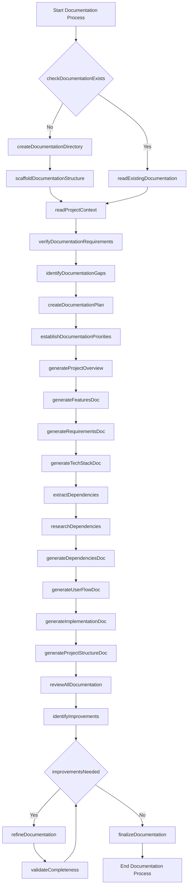
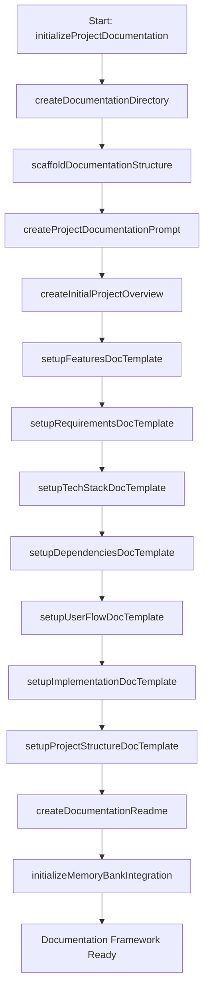

# Meta-Workflow Integration Guide

This document provides guidance on integrating the Windsurf Meta-Workflow methodology with the project documentation templates. It helps establish a structured memory system and workflow approach for AI-assisted development.

## XML-Based Function Mapping

Each documentation component should be associated with specific functions in the XML meta-prompt. Below is a template for creating this association:

```xml
<?xml version="1.0" encoding="UTF-8"?>
<DocumentationFunctionMap version="1.0">
  <!-- Documentation Component Functions -->
  <DocumentationFunctions>
    <Component id="ProjectOverview">
      <Function id="createProjectBrief">Create the foundational project brief document</Function>
      <Function id="defineVisionStatement">Define the long-term vision for the project</Function>
      <Function id="defineProblemStatement">Articulate specific problems the project solves</Function>
      <Function id="defineSolutionApproach">Document how the solution addresses problems</Function>
      <Function id="identifyTargetAudience">Define primary and secondary user groups</Function>
      <Function id="establishSuccessMetrics">Define measurable success criteria</Function>
      <Function id="defineProjectScope">Document release scope and future plans</Function>
      <Function id="assessRisks">Identify and document key project risks</Function>
      <Function id="defineSuccessCriteria">Establish project success evaluation framework</Function>
    </Component>

    <Component id="Features">
      <Function id="documentCoreFeatures">Document all primary features</Function>
      <Function id="defineFutureRoadmap">Outline future feature development plans</Function>
      <Function id="prioritizeFeatures">Establish implementation priority order</Function>
      <Function id="mapFeatureDependencies">Document inter-feature dependencies</Function>
      <Function id="defineFeatureComponents">Break down features into components</Function>
      <Function id="documentFeatureCapabilities">Document specific capabilities within features</Function>
    </Component>

    <Component id="Requirements">
      <Function id="documentFunctionalRequirements">Document what the system must do</Function>
      <Function id="documentTechnicalRequirements">Document technical constraints and needs</Function>
      <Function id="defineCategoriesByFunctionalArea">Group requirements by area</Function>
      <Function id="establishPerformanceMetrics">Define specific performance targets</Function>
      <Function id="documentSecurityRequirements">Establish security requirements</Function>
      <Function id="documentScalabilityRequirements">Define scalability needs</Function>
    </Component>

    <Component id="TechStack">
      <Function id="documentFrontendTech">Document frontend technologies</Function>
      <Function id="documentBackendTech">Document backend technologies</Function>
      <Function id="documentInfrastructure">Document deployment infrastructure</Function>
      <Function id="documentDevTools">Document development tools</Function>
      <Function id="documentSecurityMeasures">Document security implementations</Function>
      <Function id="justifyTechChoices">Explain rationale for each technology choice</Function>
    </Component>

    <Component id="Dependencies">
      <Function id="extractDependencies">Extract all project dependencies</Function>
      <Function id="researchDependencies">Research dependency documentation</Function>
      <Function id="documentVersions">Document current and required versions</Function>
      <Function id="createCompatibilityMatrix">Document version compatibility constraints</Function>
      <Function id="provideDependencyContext">Explain how each dependency is used</Function>
      <Function id="linkToDocumentation">Provide documentation links</Function>
    </Component>

    <Component id="UserFlow">
      <Function id="documentInitialUserJourney">Map initial user experience</Function>
      <Function id="documentCoreFeatureFlows">Detail flows for primary features</Function>
      <Function id="documentErrorHandling">Detail error scenario handling</Function>
      <Function id="documentSupportFlows">Detail user support processes</Function>
      <Function id="documentPlatformSpecificFlows">Detail platform adaptations</Function>
      <Function id="establishSuccessMetrics">Define flow monitoring metrics</Function>
    </Component>

    <Component id="Implementation">
      <Function id="documentDevelopmentPhilosophy">Define overall approach</Function>
      <Function id="documentCodeOrganization">Document code structure principles</Function>
      <Function id="provideCodeExamples">Create representative examples</Function>
      <Function id="documentWorkflow">Document development workflow</Function>
      <Function id="establishStandards">Define performance and quality standards</Function>
      <Function id="documentSecurityPractices">Establish security practices</Function>
    </Component>

    <Component id="ProjectStructure">
      <Function id="documentDirectoryStructure">Map the file organization</Function>
      <Function id="explainStructureDecisions">Explain organizational rationale</Function>
      <Function id="documentNamingConventions">Define naming standards</Function>
      <Function id="documentImportOrganization">Define module relationships</Function>
      <Function id="documentConfigFiles">Explain configuration approach</Function>
      <Function id="documentBuildProcess">Detail build and deployment structure</Function>
    </Component>
  </DocumentationFunctions>
  
  <!-- Documentation Phase Functions -->
  <WorkflowPhases>
    <Phase name="Initialization">
      <Function id="checkDocumentationExists">Check if documentation exists</Function>
      <Function id="createDocumentationDirectory" condition="!documentationExists">Create documentation directory</Function>
      <Function id="scaffoldDocumentationStructure" condition="!documentationExists">Create initial documentation files</Function>
      <Function id="readExistingDocumentation" condition="documentationExists">Read existing documentation</Function>
    </Phase>
    
    <Phase name="Planning">
      <Function id="verifyDocumentationRequirements">Determine documentation needs</Function>
      <Function id="identifyDocumentationGaps">Identify missing documentation</Function>
      <Function id="createDocumentationPlan">Plan documentation approach</Function>
      <Function id="establishDocumentationPriorities">Prioritize documentation areas</Function>
    </Phase>
    
    <Phase name="Implementation">
      <Function id="generateDocumentation">Create documentation content</Function>
      <Function id="includeRealExamples">Add concrete examples</Function>
      <Function id="ensureConsistency">Maintain consistent terminology</Function>
      <Function id="validateAccuracy">Ensure technical accuracy</Function>
      <Function id="optimizeReadability">Make documentation accessible</Function>
    </Phase>
    
    <Phase name="Review">
      <Function id="reviewDocumentation">Review completed documentation</Function>
      <Function id="identifyImprovements">Find areas for enhancement</Function>
      <Function id="refineDocumentation">Make improvements</Function>
      <Function id="validateCompleteness">Ensure documentation is complete</Function>
    </Phase>
    
    <Phase name="Maintenance">
      <Function id="monitorDocumentationAccuracy">Track documentation accuracy</Function>
      <Function id="scheduleRegularReviews">Plan periodic reviews</Function>
      <Function id="updateDocumentation">Keep documentation current</Function>
      <Function id="trackChanges">Document update history</Function>
    </Phase>
  </WorkflowPhases>
</DocumentationFunctionMap>
```

## Documentation Workflow Process

Based on the Windsurf methodology, documentation should follow this workflow:



## Memory System Integration

The documentation templates should integrate with the Windsurf Memory System to ensure continuity across sessions. Below is a template for memory-aware documentation:

```md
# [Documentation Type] - [Project Name]

**Last Updated:** [Current Date]  
**Memory Bank Status:** [Complete/Incomplete]  
**Documentation Phase:** [Initialization/Planning/Implementation/Review/Maintenance]

## Memory Context

This document forms part of the project's Memory Bank and should be updated whenever relevant changes occur. It maintains the following relationships with other Memory Bank components:

- **Informs:** [List of documents this document informs]
- **Informed by:** [List of documents that inform this document]
- **Dependencies:** [List of external dependencies for this document]

## Version History

| Date | Editor | Changes | Memory Update Status |
|------|--------|---------|----------------------|
| [Date] | [Editor] | [Initial creation] | [Complete] |

## [Document Content Following Template Structure]

## Next Steps

The following items should be addressed in future updates to this document:

1. [Next step 1]
2. [Next step 2]
3. [Next step 3]

## Memory System Notes

[Any special notes about how this document integrates with the Memory System]
```

## Self-Critique Integration

Following the Windsurf methodology, each documentation component should undergo the self-critique cycle:

1. **Creator Phase**: Generate initial comprehensive documentation
2. **Critic Phase**: Identify weaknesses, gaps, and assumptions
3. **Defender Phase**: Address each criticism with specific improvements
4. **Judge Phase**: Evaluate original and improved documentation

This process should be documented in a structured format:

```md
## Documentation Self-Critique

### Creator Phase
Initial documentation created on [date] covering:
- [Key area 1]
- [Key area 2]
- [Key area 3]

### Critic Phase
Documentation review identified the following issues:
1. [Issue 1] - [Severity: High/Medium/Low]
2. [Issue 2] - [Severity: High/Medium/Low]
3. [Issue 3] - [Severity: High/Medium/Low]

### Defender Phase
Issues addressed as follows:
1. [Issue 1] → [Solution implemented]
2. [Issue 2] → [Solution implemented]
3. [Issue 3] → [Solution implemented]

### Judge Phase
Documentation improvement metrics:
- Completeness: [Score] → [Improved Score]
- Clarity: [Score] → [Improved Score]
- Technical Accuracy: [Score] → [Improved Score]
- Usability: [Score] → [Improved Score]

[Further iteration needed: Yes/No]
```

## XML Meta-Prompt Structure

Each project should include a customized XML meta-prompt that defines the specific documentation workflow for that project. Below is a template:

```xml
<?xml version="1.0" encoding="UTF-8"?>
<ProjectDocumentationPrompt version="1.0">
  <ProjectIdentity>
    <Name>[Project Name]</Name>
    <Description>[Project Description]</Description>
    <DocumentationPurpose>[Purpose of Documentation]</DocumentationPurpose>
  </ProjectIdentity>

  <DocumentationWorkflow>
    <Phase name="Initialization">
      <Action function="checkDocumentationExists">Verify if documentation exists</Action>
      <Action function="createDocumentationDirectory" condition="!documentationExists">Create documentation directory</Action>
      <Action function="scaffoldDocumentationStructure" condition="!documentationExists">Create initial documentation files</Action>
      <Reminder priority="critical">Ensure documentation directory follows project conventions</Reminder>
    </Phase>

    <Phase name="ContentGeneration">
      <Action function="generateProjectOverview">Create project overview document</Action>
      <Action function="generateFeaturesDoc">Create features document</Action>
      <Action function="generateRequirementsDoc">Create requirements document</Action>
      <Action function="generateTechStackDoc">Create tech stack document</Action>
      <Action function="generateDependenciesDoc">Create dependencies document</Action>
      <Action function="generateUserFlowDoc">Create user flow document</Action>
      <Action function="generateImplementationDoc">Create implementation document</Action>
      <Action function="generateProjectStructureDoc">Create project structure document</Action>
      <Expected>Complete set of well-structured documentation files</Expected>
    </Phase>

    <Phase name="Review">
      <Action function="reviewAllDocumentation">Review all documentation for consistency</Action>
      <Action function="identifyImprovements">Identify areas for improvement</Action>
      <Action function="refineDocumentation">Refine documentation based on review</Action>
      <Action function="validateCompleteness">Ensure documentation is complete</Action>
      <Expected>High-quality documentation that meets all project requirements</Expected>
    </Phase>

    <Phase name="Maintenance">
      <Action function="monitorDocumentationAccuracy">Regular accuracy checks</Action>
      <Action function="updateDocumentation">Update as project evolves</Action>
      <Action function="trackChanges">Maintain version history</Action>
      <Expected>Documentation that remains current with project state</Expected>
      <Reminder priority="high">Update documentation after significant changes</Reminder>
    </Phase>
  </DocumentationWorkflow>

  <DocumentationTypes>
    <Type id="ProjectOverview" priority="critical">
      <Components>
        <Component>Vision Statement</Component>
        <Component>Problem Statement</Component>
        <Component>Solution Approach</Component>
        <Component>Target Audience</Component>
        <Component>Success Metrics</Component>
        <Component>Project Scope</Component>
        <Component>Risk Assessment</Component>
        <Component>Success Criteria</Component>
      </Components>
    </Type>
    
    <!-- Define other documentation types similarly -->
    
  </DocumentationTypes>

  <IntegrationPoints>
    <Point id="MemoryBank">
      <Description>How documentation connects to the Memory Bank system</Description>
      <Integration>All documentation updates must be reflected in Memory Bank</Integration>
    </Point>
    <Point id="TaskLogs">
      <Description>How documentation relates to task logging</Description>
      <Integration>Documentation updates should be recorded in task logs</Integration>
    </Point>
    <Point id="ProjectPlans">
      <Description>How documentation supports project planning</Description>
      <Integration>Documentation should inform and be informed by project plans</Integration>
    </Point>
  </IntegrationPoints>

  <DocumentationStandards>
    <Standard id="Completeness">All required sections must be filled out</Standard>
    <Standard id="Accuracy">Technical details must be verified for accuracy</Standard>
    <Standard id="Clarity">Documentation must be understandable to the target audience</Standard>
    <Standard id="Consistency">Terminology must be consistent across all documents</Standard>
    <Standard id="CurrentState">Documentation must reflect the current project state</Standard>
  </DocumentationStandards>
</ProjectDocumentationPrompt>
```

## Project Startup Documentation Initialization

When starting a new project, the following process should be used to initialize the documentation framework:



## Integrating with Task Logs

Documentation should be linked to task logs in the following format:

```md
## Documentation Updates

### Task: [Task Description]
**Task Log:** [Link to task log]
**Date:** [Date]
**Documentation Updated:**
- [Document 1] - [Changes made]
- [Document 2] - [Changes made]
- [Document 3] - [Changes made]

### Documentation Improvement Metrics
- Completeness: [Score] → [Improved Score]
- Clarity: [Score] → [Improved Score]
- Technical Accuracy: [Score] → [Improved Score]
- Usability: [Score] → [Improved Score]

### Next Documentation Tasks
1. [Next documentation task 1]
2. [Next documentation task 2]
3. [Next documentation task 3]
```

## Function Map Memory Initialization

At project startup, the DocumentationFunctionMap should be saved to memory using this process:

```javascript
function initializeDocumentationFunctions() {
  // Load the XML-based function map
  const documentationFunctionMap = loadXMLFunctionMap();
  
  // Store in memory for reference throughout the project
  memory.setItem('documentationFunctionMap', documentationFunctionMap);
  
  // Create associations between functions and documentation components
  createFunctionComponentAssociations(documentationFunctionMap);
  
  // Initialize documentation workflow phases
  initializeDocumentationWorkflow(documentationFunctionMap.WorkflowPhases);
  
  return {
    success: true,
    message: "Documentation function map initialized in memory",
    functionCount: countFunctions(documentationFunctionMap)
  };
}
```

This structured approach ensures that all documentation is created and maintained according to the Windsurf Meta-Workflow methodology, providing consistent, high-quality documentation that evolves with the project.
