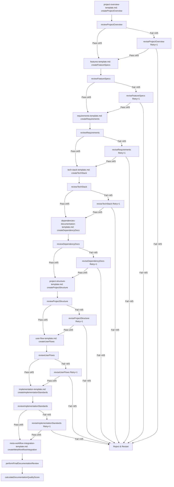

```xml
<!-- Documentation Workflow Functions -->
<DocumentationFunctions>
  <!-- Creation Functions -->
  <Function id="createProjectOverview">Define the project vision, scope, goals, and success criteria</Function>
  <Function id="createFeatureSpecs">Document detailed specifications of project features and roadmap</Function>
  <Function id="createRequirements">Define functional, technical, performance and security requirements</Function>
  <Function id="createTechStack">Document technology choices for frontend, backend, database and infrastructure</Function>
  <Function id="createDependencyDocs">Create comprehensive inventory of dependencies with versions and documentation links</Function>
  <Function id="createProjectStructure">Document directory structure, file organization and naming conventions</Function>
  <Function id="createUserFlows">Map end-to-end user journeys and interaction paths</Function>
  <Function id="createImplementationStandards">Define development philosophy, code patterns and best practices</Function>
  <Function id="createMetaWorkflowIntegration">Create XML-based function mapping for documentation integration</Function>
  
  <!-- Review Functions -->
  <Function id="reviewProjectOverview">Review project overview for clarity, completeness, and alignment with stakeholder needs; score against 5 criteria, baseline 4/5</Function>
  <Function id="reviewFeatureSpecs">Review feature specifications for completeness, prioritization, and implementation feasibility; score against 5 criteria, baseline 4/5</Function>
  <Function id="reviewRequirements">Review requirements for precision, measurability, and comprehensive coverage; score against 5 criteria, baseline 4/5</Function>
  <Function id="reviewTechStack">Review tech stack choices for appropriateness, integration capability, and future-proofing; score against 5 criteria, baseline 4/5</Function>
  <Function id="reviewDependencyDocs">Review dependency documentation for accuracy, completeness, and security implications; score against 5 criteria, baseline 4/5</Function>
  <Function id="reviewProjectStructure">Review project structure for scalability, maintainability, and adherence to best practices; score against 5 criteria, baseline 4/5</Function>
  <Function id="reviewUserFlows">Review user flows for comprehensiveness, edge cases, and user experience quality; score against 5 criteria, baseline 4/5</Function>
  <Function id="reviewImplementationStandards">Review implementation standards for clarity, practicality, and engineering excellence; score against 5 criteria, baseline 4/5</Function>
  <Function id="performFinalDocumentationReview">Perform holistic review of all documentation for consistency, completeness, and cohesion</Function>
  <Function id="calculateDocumentationQualityScore">Calculate quality score based on defined criteria for documentation excellence</Function>

  <!-- Revision Functions (Retry Limit = 1) -->
  <Function id="reviseProjectOverview">Revise project overview based on review feedback; limit 1 retry</Function>
  <Function id="reviseFeatureSpecs">Revise feature specs based on review feedback; limit 1 retry</Function>
  <Function id="reviseRequirements">Revise requirements based on review feedback; limit 1 retry</Function>
  <Function id="reviseTechStack">Revise tech stack based on review feedback; limit 1 retry</Function>
  <Function id="reviseDependencyDocs">Revise dependency docs based on review feedback; limit 1 retry</Function>
  <Function id="reviseProjectStructure">Revise project structure based on review feedback; limit 1 retry</Function>
  <Function id="reviseUserFlows">Revise user flows based on review feedback; limit 1 retry</Function>
  <Function id="reviseImplementationStandards">Revise implementation standards based on review feedback; limit 1 retry</Function>
</DocumentationFunctions>

<DocumentationQualityCriteria>
  <!-- Project Overview Quality Criteria -->
  <CriteriaSet id="projectOverviewCriteria">
    <Name>Project Overview Quality Criteria</Name>
    <Criterion id="clarity" name="Clarity" description="Is the project purpose clearly articulated?" scoreRange="1-10" />
    <Criterion id="scopeDefinition" name="Scope Definition" description="Are project boundaries well-defined?" scoreRange="1-10" />
    <Criterion id="successMetrics" name="Success Metrics" description="Are measurable success criteria established?" scoreRange="1-10" />
    <Criterion id="stakeholderAlignment" name="Stakeholder Alignment" description="Does it address key stakeholder concerns?" scoreRange="1-10" />
    <Criterion id="riskAssessment" name="Risk Assessment" description="Are potential risks identified with mitigation strategies?" scoreRange="1-10" />
  </CriteriaSet>

  <!-- Feature Specifications Quality Criteria -->
  <CriteriaSet id="featureSpecsCriteria">
    <Name>Feature Specifications Quality Criteria</Name>
    <Criterion id="detailLevel" name="Detail Level" description="Are features described with sufficient detail?" scoreRange="1-10" />
    <Criterion id="prioritization" name="Prioritization" description="Is feature importance and implementation order clear?" scoreRange="1-10" />
    <Criterion id="completeness" name="Completeness" description="Do specifications cover all required functionality?" scoreRange="1-10" />
    <Criterion id="dependencies" name="Dependencies" description="Are feature interdependencies documented?" scoreRange="1-10" />
    <Criterion id="futurePlanning" name="Future Planning" description="Is the feature roadmap articulated?" scoreRange="1-10" />
  </CriteriaSet>

  <!-- Requirements Quality Criteria -->
  <CriteriaSet id="requirementsCriteria">
    <Name>Requirements Quality Criteria</Name>
    <Criterion id="specificity" name="Specificity" description="Are requirements specific and unambiguous?" scoreRange="1-10" />
    <Criterion id="measurability" name="Measurability" description="Are requirements objectively verifiable?" scoreRange="1-10" />
    <Criterion id="completeness" name="Completeness" description="Do requirements cover functional and non-functional needs?" scoreRange="1-10" />
    <Criterion id="feasibility" name="Feasibility" description="Are all requirements technically achievable?" scoreRange="1-10" />
    <Criterion id="prioritization" name="Prioritization" description="Are requirements properly categorized by importance?" scoreRange="1-10" />
  </CriteriaSet>

  <!-- Tech Stack Quality Criteria -->
  <CriteriaSet id="techStackCriteria">
    <Name>Tech Stack Quality Criteria</Name>
    <Criterion id="appropriateness" name="Appropriateness" description="Do technology choices align with project needs?" scoreRange="1-10" />
    <Criterion id="integration" name="Integration" description="Is stack integration approach well-documented?" scoreRange="1-10" />
    <Criterion id="scalability" name="Scalability" description="Do choices support future growth?" scoreRange="1-10" />
    <Criterion id="security" name="Security" description="Are security considerations addressed?" scoreRange="1-10" />
    <Criterion id="maintainability" name="Maintainability" description="Is the stack manageable long-term?" scoreRange="1-10" />
  </CriteriaSet>

  <!-- Additional criteria sets for remaining documentation components... -->
</DocumentationQualityCriteria>
```



# AI Model Instructions for Project Documentation

This document guides AI models to use the documentation templates to create structured, high-quality software project documentation, incorporating a workflow with self-evaluation and a single revision loop.

## Documentation Framework Overview

Use this framework to create and maintain comprehensive project documentation via the templates listed in the workflow. The process ensures clarity, completeness, and alignment with project needs through a defined sequence of creation, review, and revision steps.

## When to Use This Framework

Apply this framework when:
1. A user requests project documentation assistance.
2. You’re tasked with documenting a new or existing project.
3. A user seeks to standardize or improve documentation.
4. You’re planning a software project requiring structured output.

## Workflow and Function References

Follow this workflow (see Mermaid diagram) and use the associated XML functions:

1. **Project Overview**: `<Function id="createProjectOverview">` → `<Function id="reviewProjectOverview">` → (if <4/5) `<Function id="reviseProjectOverview">` (Retry=1).
2. **Feature Specs**: `<Function id="createFeatureSpecs">` → `<Function id="reviewFeatureSpecs">` → (if <4/5) `<Function id="reviseFeatureSpecs">` (Retry=1).
3. **Requirements**: `<Function id="createRequirements">` → `<Function id="reviewRequirements">` → (if <4/5) `<Function id="reviseRequirements">` (Retry=1).
4. **Tech Stack**: `<Function id="createTechStack">` → `<Function id="reviewTechStack">` → (if <4/5) `<Function id="reviseTechStack">` (Retry=1).
5. **Dependency Docs**: `<Function id="createDependencyDocs">` → `<Function id="reviewDependencyDocs">` → (if <4/5) `<Function id="reviseDependencyDocs">` (Retry=1).
6. **Project Structure**: `<Function id="createProjectStructure">` → `<Function id="reviewProjectStructure">` → (if <4/5) `<Function id="reviseProjectStructure">` (Retry=1).
7. **User Flows**: `<Function id="createUserFlows">` → `<Function id="reviewUserFlows">` → (if <4/5) `<Function id="reviseUserFlows">` (Retry=1).
8. **Implementation Standards**: `<Function id="createImplementationStandards">` → `<Function id="reviewImplementationStandards">` → (if <4/5) `<Function id="reviseImplementationStandards">` (Retry=1).
9. **Meta-Workflow Integration**: `<Function id="createMetaWorkflowIntegration">`.
10. **Final Steps**: `<Function id="performFinalDocumentationReview">` → `<Function id="calculateDocumentationQualityScore">`.

- **Review Scoring**: Each review uses 5 yes/no criteria (from prior discussion), baseline 4/5. If <4/5, trigger one revision. If still <4/5, reject and advise restarting.
- **Self-Evaluation**: Before submitting each document, evaluate it against the "Dos and Don'ts" below.

## Dos and Don’ts for Documentation Creation

### Dos
1. **Do Be Specific**: Use concrete, measurable details (e.g., "Reduce latency by 20%" vs. "Make it fast").
2. **Do Justify Choices**: Explain why decisions were made (e.g., "PostgreSQL for ACID compliance").
3. **Do Cover Edge Cases**: Include error scenarios and alternatives in flows and requirements.
4. **Do Self-Evaluate**: Before finalizing, check: Is it clear? Complete? Aligned with user needs?
5. **Do Use Examples**: Provide sample code, metrics, or flows to clarify intent.

### Don’ts
1. **Don’t Be Vague**: Avoid generic terms (e.g., "good performance") without metrics.
2. **Don’t Skip Rationale**: Never list items (e.g., tech) without explaining why they’re chosen.
3. **Don’t Ignore Readers**: Don’t omit details critical to devs, PMs, or stakeholders.
4. **Don’t Overcomplicate**: Avoid unnecessary verbosity—keep it concise yet complete.
5. **Don’t Submit Unchecked**: Don’t finalize without self-review against these rules.

## General Approach

1. **Understand Context**: Gather project details, goals, and stakeholder needs first.
2. **Follow Templates**: Populate each template methodically, replacing placeholders with specifics.
3. **Self-Evaluate**: After drafting, review against "Dos and Don'ts" and adjust.
4. **Review & Revise**: Score against 5 criteria (e.g., for Project Overview: Vision clarity, Problem depth, etc.). If <4/5, revise once using feedback.

## Template-Specific Tips (Abbreviated)

- **Project Overview**: Start with a 2-3 sentence vision; quantify problems (e.g., "10h/week lost").
- **Feature Specs**: List 5+ specific features; separate current vs. future.
- **Requirements**: Use "The system shall..." with measurable targets (e.g., "200ms response").
- **Tech Stack**: Justify each choice (e.g., "React for ecosystem").
- **Dependency Docs**: Extract versions and links (e.g., `npm list`); note constraints.
- **Project Structure**: Explain organization (e.g., "Atomic design for UI").
- **User Flows**: Map all paths from the user’s view, including errors.
- **Implementation Standards**: Include code examples and "why" for patterns.

## Self-Evaluation Process

For each document:
1. **Draft**: Write using the template and "Dos and Don'ts."
2. **Critique**: Check each "Do" (Yes/No) and "Don’t" (Avoided?). Score 1 point per "Yes"/"Avoided" (max 10).
3. **Adjust**: If <8/10, revise to address gaps (e.g., add specificity if vague).
4. **Submit**: Proceed to review step if ≥8/10.

## Final Tips

- Ask clarifying questions if input is unclear.
- Suggest diagrams where helpful (e.g., user flows).
- Prioritize reader understanding over exhaustive detail.
- If a revision fails (<4/5), advise restarting rather than looping again.
