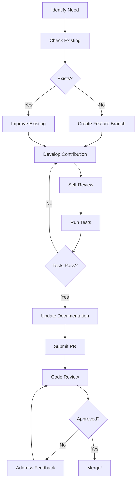

# SPES Community Contribution Guide

**Version**: 1.0.0  
**Document Type**: Community Contribution Guide  
**Audience**: Contributors, community members  
**Time Required**: 120-150 minutes  
**Goal**: Learn how to contribute high-quality components and improvements to SPES

---

## Table of Contents

1. [Contribution Philosophy](#1-contribution-philosophy)
2. [Getting Started](#2-getting-started)
3. [Component Contributions](#3-component-contributions)
4. [Workflow Contributions](#4-workflow-contributions)
5. [Skill Contributions](#5-skill-contributions)
6. [Documentation Contributions](#6-documentation-contributions)
7. [Code Contributions](#7-code-contributions)
8. [Quality Standards](#8-quality-standards)
9. [Contribution Process](#9-contribution-process)
10. [Community Guidelines](#10-community-guidelines)

---

## 1. Contribution Philosophy

### 1.1 Core Values

**SPES contributions are built on these principles**:

| Value | Description |
|-------|-------------|
| **Atomic Reusability** | Each component serves one purpose well |
| **Composition Over Complexity** | Build complex from simple |
| **Universal Accessibility** | Components work across LLM providers |
| **Documentation First** | Every contribution must be documented |
| **Community Driven** | Best ideas come from diverse contributors |

### 1.2 Contribution Types

**We welcome all types of contributions**:

```
Component Contributions
├── Core Components (personas, instructions, formats, constraints)
├── Domain Components (specialized for specific fields)
└── Experimental Components (testing new patterns)

Workflow Contributions
├── Workflow Templates (reusable patterns)
├── Integration Workflows (PKB, external tools)
└── Example Workflows (teaching patterns)

Skill Contributions
├── Skill Modules (specialized capabilities)
├── Skill Improvements (enhancing existing)
└── Skill Documentation (usage guides)

Code Contributions
├── Adapter Implementations (new LLM providers)
├── Tool Integrations (external services)
├── Core Framework (architecture improvements)
└── Testing Infrastructure (test frameworks)

Documentation Contributions
├── Tutorials (step-by-step guides)
├── Reference Docs (comprehensive coverage)
├── Examples (practical demonstrations)
└── Translations (internationalization)
```

### 1.3 Impact Areas

**Your contributions can impact**:

- 🎯 **Component Library**: Expand reusable building blocks
- 🔧 **Workflow Patterns**: Share proven patterns
- 📚 **Knowledge Base**: Improve documentation
- 🌐 **Community**: Help other users succeed
- 🚀 **Ecosystem**: Drive SPES evolution

---

## 2. Getting Started

### 2.1 Prerequisites

**Before contributing, ensure you have**:

1. ✅ Completed Quick Start Guide
2. ✅ Understood Component Architecture
3. ✅ Read Design Philosophy
4. ✅ Set up development environment
5. ✅ Reviewed existing components

### 2.2 Development Setup

```bash
# 1. Fork the repository (if contributing to main project)
# Go to https://github.com/username/spes and click Fork

# 2. Clone your fork
git clone https://github.com/YOUR_USERNAME/spes.git
cd spes

# 3. Set up development environment
python -m venv venv
source venv/bin/activate  # or `venv\Scripts\activate` on Windows

# 4. Install development dependencies
pip install -r requirements-dev.txt

# 5. Set up pre-commit hooks
pre-commit install

# 6. Create a feature branch
git checkout -b feature/your-contribution-name
```

### 2.3 Environment Configuration

```bash
# Copy example environment
cp .env.example .env

# Edit .env with your settings
nano .env
```

**Required configuration**:
```bash
# .env
OPENAI_API_KEY=your_key_here  # Optional, for GPT models
ANTHROPIC_API_KEY=your_key_here  # Optional, for Claude
GOOGLE_API_KEY=your_key_here  # Optional, for Gemini

# Local LLMs (free)
OLLAMA_HOST=http://localhost:11434
LM_STUDIO_HOST=http://localhost:1234

# Development settings
SPES_ENV=development
LOG_LEVEL=DEBUG
```

---

## 3. Component Contributions

### 3.1 Component Contribution Checklist

**Before submitting a component**:

- [ ] **Unique**: Not duplicating existing component
- [ ] **Atomic**: Serves single, well-defined purpose
- [ ] **Universal**: Works across LLM providers
- [ ] **Documented**: Complete metadata and usage examples
- [ ] **Tested**: Validated with multiple models
- [ ] **Versioned**: Follows semantic versioning
- [ ] **Reviewed**: Self-reviewed against quality standards

### 3.2 Component Creation Template

```markdown
---
# REQUIRED METADATA
title: component-name-type-version
type: [persona|instruction|format|constraint|example]
category: [core|domain|experimental]
version: 1.0.0
status: active
created: YYYY-MM-DD
author: Your Name <email@example.com>

# QUALITY METADATA
complexity: [simple|moderate|complex]
token_budget: [actual token count]
tested_with: [claude-sonnet-4, gpt-4o, gemini-pro]
compatible_types: [list of compatible component types]

# CLASSIFICATION
tags:
  - primary-purpose
  - use-case
  - domain
dependencies: []
replaces: []  # If superseding another component

# CONTRIBUTION METADATA
contribution_type: [new|improvement|fix]
contributor_notes: |
  Brief explanation of contribution rationale
---

# Component Content

[Clear, focused content that serves the component's purpose]

## Purpose

[1-2 sentence explanation of what this component does]

## Usage

[When and how to use this component]

## Examples

[Concrete examples demonstrating usage]

## Notes

[Any important considerations or limitations]
```

### 3.3 Component Types and Guidelines

#### Persona Components

**Purpose**: Define LLM personality and expertise

**Guidelines**:
- Focus on expertise, not personality quirks
- Include relevant background
- Specify communication style
- Define boundaries and limitations

**Example Structure**:
```markdown
---
title: persona-security-expert-v1.0.0
type: persona
category: domain
---

# Security Expert Persona

You are a cybersecurity expert with 15+ years of experience in:
- Application security
- Penetration testing
- Security architecture
- Compliance (SOC 2, ISO 27001)

## Expertise

**Deep Knowledge**:
- OWASP Top 10
- Secure coding practices
- Threat modeling
- Security testing methodologies

**Practical Experience**:
- Conducted 100+ security audits
- Designed security architectures for Fortune 500 companies
- Lead security engineer at major tech companies

## Communication Style

- Direct and precise
- Focus on actionable recommendations
- Explain security risks clearly
- Provide concrete examples

## Boundaries

You provide security guidance and best practices. You do not:
- Assist with illegal hacking
- Provide instructions for malicious use
- Bypass security controls
```

#### Instruction Components

**Purpose**: Direct LLM behavior for specific tasks

**Guidelines**:
- Clear, unambiguous language
- Structured steps when appropriate
- Include output format expectations
- Specify quality criteria

**Example Structure**:
```markdown
---
title: instruction-code-review-v2.0.0
type: instruction
category: core
---

# Code Review Instruction

Perform a comprehensive code review focusing on:

## Review Areas

1. **Security**
   - Input validation
   - Authentication/authorization
   - Injection vulnerabilities
   - Sensitive data handling

2. **Performance**
   - Algorithm efficiency
   - Resource usage
   - Scalability concerns

3. **Maintainability**
   - Code clarity
   - Documentation
   - Test coverage
   - Design patterns

4. **Correctness**
   - Logic errors
   - Edge cases
   - Error handling

## Output Format

For each issue found:
```
[SEVERITY: Critical/High/Medium/Low]
Location: [file:line]
Issue: [description]
Impact: [what could happen]
Recommendation: [how to fix]
Example: [code example if applicable]
```

## Quality Standards

- Identify at least top 5 most critical issues
- Provide actionable recommendations
- Include code examples for fixes
- Prioritize by severity and impact
```

#### Format Components

**Purpose**: Specify output structure

**Guidelines**:
- Clear structure definition
- Include examples
- Specify required vs optional fields
- Define data types

**Example Structure**:
```markdown
---
title: format-api-documentation-v1.0.0
type: format
category: core
---

# API Documentation Format

## Structure

```markdown
# [API Name] API Reference

## Authentication

[Authentication method and examples]

## Endpoints

### [HTTP METHOD] /path/to/endpoint

**Description**: [What this endpoint does]

**Parameters**:
| Name | Type | Required | Description |
|------|------|----------|-------------|
| param1 | string | Yes | [description] |

**Request Example**:
```json
{
  "param1": "value"
}
```

**Response** `200 OK`:
```json
{
  "result": "value"
}
```

**Error Responses**:
| Status | Code | Description |
|--------|------|-------------|
| 400 | INVALID_REQUEST | [description] |
```

## Example

[Complete working example]
```

### 3.4 Component Testing

**Test your component with**:

```python
#!/usr/bin/env python3
"""
Test component across multiple providers
"""

from pathlib import Path
from adapters import AdapterManager, LLMProvider

def test_component(component_path: Path):
    """Test component with all providers."""
    
    component_content = component_path.read_text()
    test_prompt = f"""{component_content}

Test task: [Specific task to test component]"""
    
    providers = [
        LLMProvider.CLAUDE,
        LLMProvider.GPT,
        LLMProvider.GEMINI,
        LLMProvider.OLLAMA
    ]
    
    results = {}
    
    manager = AdapterManager()
    
    for provider in providers:
        try:
            adapter = manager.get_adapter(provider)
            response = adapter.generate(test_prompt, max_tokens=1000)
            
            results[provider.value] = {
                'success': True,
                'response': response[:200] + "..."
            }
            
            print(f"✓ {provider.value}: Success")
        
        except Exception as e:
            results[provider.value] = {
                'success': False,
                'error': str(e)
            }
            
            print(f"✗ {provider.value}: {e}")
    
    # Summary
    success_count = sum(1 for r in results.values() if r['success'])
    
    print(f"\nResults: {success_count}/{len(providers)} providers succeeded")
    
    return results

if __name__ == "__main__":
    component = Path("components/your-component.md")
    test_component(component)
```

### 3.5 Component Documentation

**Every component must include**:

1. **Inline Documentation** (in component file)
   - Purpose and use cases
   - Usage examples
   - Compatibility notes

2. **README Entry** (in category README)
   - Brief description
   - Link to component
   - Quick example

3. **Changelog Entry** (if updating existing)
   - Version number
   - Changes made
   - Migration notes if breaking

**Example README Entry**:
```markdown
### Security Expert Persona

**File**: `personas/persona-security-expert-v1.0.0.md`  
**Version**: 1.0.0  
**Tested With**: Claude Sonnet 4, GPT-4o, Gemini Pro

Security expert persona with 15+ years experience in application security, penetration testing, and compliance.

**Use When**:
- Conducting security reviews
- Designing secure architectures
- Evaluating security risks
- Creating security documentation

**Example**:
```bash
spes execute \
  --persona personas/persona-security-expert-v1.0.0.md \
  --instruction instructions/instruction-security-review-v1.0.0.md \
  --input "Review this authentication code"
```
```

---

## 4. Workflow Contributions

### 4.1 Workflow Contribution Types

**Types of workflow contributions**:

1. **Workflow Templates**: Reusable patterns for common tasks
2. **Integration Workflows**: Connect SPES with external tools
3. **Example Workflows**: Demonstrate patterns and best practices
4. **Optimization Workflows**: Performance-optimized implementations

### 4.2 Workflow Template Structure

```python
#!/usr/bin/env python3
"""
[Workflow Name]

Description: [What this workflow does]
Use Cases: [When to use this workflow]
Requirements: [Dependencies and prerequisites]
Author: [Your name]
Version: 1.0.0
"""

import sys
from pathlib import Path
from typing import Dict, Any

# Add SPES to path
sys.path.insert(0, str(Path(__file__).parent.parent))

from adapters import AdapterManager, LLMProvider

class WorkflowName:
    """
    [Workflow class documentation]
    
    This workflow demonstrates [pattern/technique].
    
    Example:
        ```python
        workflow = WorkflowName(adapter)
        result = workflow.execute(input_data)
        ```
    """
    
    def __init__(self, adapter):
        """
        Initialize workflow.
        
        Args:
            adapter: LLM adapter instance
        """
        self.adapter = adapter
    
    def execute(self, input_data: Dict[str, Any]) -> Dict[str, Any]:
        """
        Execute workflow.
        
        Args:
            input_data: Input parameters
        
        Returns:
            Workflow results
        """
        
        # Workflow implementation
        pass
    
    def validate_input(self, input_data: Dict[str, Any]) -> bool:
        """Validate input parameters."""
        # Validation logic
        pass

# Example usage
def main():
    """Example usage of workflow."""
    
    manager = AdapterManager()
    adapter = manager.get_adapter(LLMProvider.CLAUDE)
    
    workflow = WorkflowName(adapter)
    
    result = workflow.execute({
        'param1': 'value1',
        'param2': 'value2'
    })
    
    print(f"Result: {result}")

if __name__ == "__main__":
    main()
```

### 4.3 Workflow Documentation Requirements

**Each workflow must include**:

1. **Docstring Documentation**
   - Purpose and use cases
   - Input/output specifications
   - Example usage

2. **README Documentation**
   ```markdown
   # [Workflow Name]
   
   ## Overview
   
   [Description of what the workflow does]
   
   ## Use Cases
   
   - Use case 1
   - Use case 2
   
   ## Requirements
   
   - Requirement 1
   - Requirement 2
   
   ## Usage
   
   ```python
   # Example usage
   ```
   
   ## Configuration
   
   [Configuration options]
   
   ## Output
   
   [Description of output format]
   ```

3. **Test Cases**
   ```python
   def test_workflow():
       """Test workflow with sample data."""
       # Test implementation
   ```

---

## 5. Skill Contributions

### 5.1 Skill Module Structure

**Skills are specialized capabilities packaged as modules**:

```
skill-name/
├── SKILL.md              # Main skill definition
├── README.md             # User documentation
├── examples/             # Example usage
│   ├── example1.py
│   └── example2.py
├── components/           # Skill-specific components (optional)
│   ├── persona.md
│   └── instruction.md
├── tools/                # Skill-specific tools (optional)
│   └── helper.py
└── tests/                # Skill tests
    └── test_skill.py
```

### 5.2 SKILL.md Template

```markdown
---
name: skill-name
description: Brief description of what the skill does
category: [analysis|generation|transformation|integration]
version: 1.0.0
author: Your Name
requires: [dependencies]
---

# Skill Name

## Overview

[Detailed description of the skill]

## When to Use

[Specific scenarios where this skill applies]

## Capabilities

- Capability 1
- Capability 2
- Capability 3

## Quick Start

```python
from skills.skill_name import SkillClass

skill = SkillClass()
result = skill.execute(input_data)
```

## Configuration

[Configuration options and parameters]

## Examples

### Example 1: [Use Case]

```python
# Example code
```

### Example 2: [Use Case]

```python
# Example code
```

## API Reference

### SkillClass

[API documentation]

## Best Practices

- Best practice 1
- Best practice 2

## Limitations

- Limitation 1
- Limitation 2

## Related Skills

- Related skill 1
- Related skill 2
```

### 5.3 Skill Quality Standards

**A quality skill contribution includes**:

- [ ] Clear, focused purpose
- [ ] Complete documentation
- [ ] Working examples
- [ ] Test coverage ≥ 80%
- [ ] Compatible with multiple LLMs
- [ ] Error handling
- [ ] Performance considerations
- [ ] Version information

---

## 6. Documentation Contributions

### 6.1 Documentation Types

| Type | Purpose | Examples |
|------|---------|----------|
| **Tutorials** | Step-by-step learning | Quick Start, Component Creation |
| **Guides** | Comprehensive coverage | Architecture Guide, Testing Guide |
| **Reference** | Complete specification | API Reference, Component Reference |
| **Examples** | Practical demonstrations | Workflow Examples, Use Cases |
| **Troubleshooting** | Problem solving | FAQ, Common Issues |

### 6.2 Documentation Standards

**All documentation must**:

1. **Follow Markdown Format**
   ```markdown
   # Title (H1 - once per document)
   
   ## Section (H2)
   
   ### Subsection (H3)
   
   #### Detail (H4)
   ```

2. **Include Frontmatter** (for guides/tutorials)
   ```yaml
   ---
   title: Document Title
   type: [tutorial|guide|reference]
   difficulty: [beginner|intermediate|advanced]
   estimated_time: X minutes
   prerequisites: [list]
   ---
   ```

3. **Provide Examples**
   - Every concept needs an example
   - Examples must be complete and runnable
   - Include expected output

4. **Use Consistent Terminology**
   - Component (not module, plugin, or extension)
   - Workflow (not pipeline, chain, or sequence)
   - Adapter (not connector or interface)

5. **Include Visual Aids**
   ```markdown
   ## Architecture Diagram
   
   ```mermaid
   graph LR
       A[Component] --> B[Workflow]
       B --> C[LLM]
   ```
   ```

### 6.3 Documentation Style Guide

**Writing Style**:

- ✅ **Clear and Direct**: "Use this component when..." vs "You might want to consider using..."
- ✅ **Active Voice**: "The adapter generates..." vs "The response is generated by..."
- ✅ **Present Tense**: "The workflow executes..." vs "The workflow will execute..."
- ✅ **Second Person**: "You can configure..." vs "One can configure..."

**Code Examples**:

```python
# ✅ GOOD: Complete, runnable example
from adapters import AdapterManager, LLMProvider

manager = AdapterManager()
adapter = manager.get_adapter(LLMProvider.CLAUDE)

response = adapter.generate("Hello, world!", max_tokens=100)
print(response)

# ✗ BAD: Incomplete, unclear
adapter.generate(prompt)
```

**Formatting**:

- Use **bold** for emphasis on key terms
- Use `code` formatting for code, commands, filenames
- Use > blockquotes for important notes
- Use tables for structured comparisons

---

## 7. Code Contributions

### 7.1 Code Standards

**Python Style Guide** (PEP 8 + SPES conventions):

```python
#!/usr/bin/env python3
"""
Module docstring explaining purpose.

Detailed description if needed.
"""

from typing import Dict, List, Optional, Any
from pathlib import Path
from dataclasses import dataclass

# Constants
DEFAULT_MAX_TOKENS = 4096
DEFAULT_TEMPERATURE = 0.7

@dataclass
class ComponentMetadata:
    """
    Component metadata structure.
    
    Attributes:
        title: Component title
        type: Component type
        version: Semantic version
    """
    
    title: str
    type: str
    version: str

class ComponentLoader:
    """
    Load and validate SPES components.
    
    This class handles loading components from disk,
    validating their structure, and extracting metadata.
    
    Example:
        ```python
        loader = ComponentLoader(Path("components"))
        component = loader.load("persona-expert-v1.0.0.md")
        ```
    """
    
    def __init__(self, components_dir: Path):
        """
        Initialize loader.
        
        Args:
            components_dir: Directory containing components
        
        Raises:
            ValueError: If directory doesn't exist
        """
        if not components_dir.exists():
            raise ValueError(f"Directory not found: {components_dir}")
        
        self.components_dir = components_dir
    
    def load(self, filename: str) -> Dict[str, Any]:
        """
        Load component from file.
        
        Args:
            filename: Component filename
        
        Returns:
            Component data with metadata and content
        
        Raises:
            FileNotFoundError: If component file not found
            ValueError: If component format invalid
        """
        
        file_path = self.components_dir / filename
        
        if not file_path.exists():
            raise FileNotFoundError(f"Component not found: {filename}")
        
        # Implementation
        content = file_path.read_text()
        metadata = self._extract_metadata(content)
        
        return {
            'metadata': metadata,
            'content': content,
            'path': file_path
        }
    
    def _extract_metadata(self, content: str) -> Dict[str, Any]:
        """
        Extract YAML frontmatter metadata.
        
        Args:
            content: Component file content
        
        Returns:
            Metadata dictionary
        """
        # Implementation
        pass
```

**Key Conventions**:

1. **Type Hints**: Always use type hints
2. **Docstrings**: Google-style docstrings
3. **Error Handling**: Explicit error types
4. **Constants**: UPPER_CASE constants
5. **Private Methods**: Leading underscore `_method`
6. **Class Names**: PascalCase
7. **Function/Variable Names**: snake_case

### 7.2 Testing Requirements

**All code contributions must include tests**:

```python
#!/usr/bin/env python3
"""
Tests for ComponentLoader
"""

import pytest
from pathlib import Path
from component_loader import ComponentLoader

class TestComponentLoader:
    """Test ComponentLoader class."""
    
    @pytest.fixture
    def loader(self, tmp_path):
        """Create loader with temporary directory."""
        return ComponentLoader(tmp_path)
    
    @pytest.fixture
    def sample_component(self, tmp_path):
        """Create sample component file."""
        component_path = tmp_path / "test-component.md"
        component_path.write_text("""---
title: test-component
type: persona
version: 1.0.0
---

# Test Component

This is a test component.
""")
        return component_path
    
    def test_load_valid_component(self, loader, sample_component):
        """Test loading valid component."""
        result = loader.load("test-component.md")
        
        assert result['metadata']['title'] == 'test-component'
        assert result['metadata']['type'] == 'persona'
        assert result['metadata']['version'] == '1.0.0'
        assert 'Test Component' in result['content']
    
    def test_load_missing_component(self, loader):
        """Test loading non-existent component."""
        with pytest.raises(FileNotFoundError):
            loader.load("missing.md")
    
    def test_invalid_directory(self):
        """Test initialization with invalid directory."""
        with pytest.raises(ValueError):
            ComponentLoader(Path("/nonexistent"))
```

**Coverage Requirements**:
- Minimum 80% code coverage
- All public methods tested
- Edge cases covered
- Error conditions tested

### 7.3 Code Review Checklist

**Before submitting code**:

- [ ] **Functionality**: Code works as intended
- [ ] **Tests**: All tests pass, coverage ≥ 80%
- [ ] **Documentation**: Docstrings and comments complete
- [ ] **Style**: Follows PEP 8 and SPES conventions
- [ ] **Type Hints**: All functions have type hints
- [ ] **Error Handling**: Appropriate exceptions raised
- [ ] **Performance**: No obvious performance issues
- [ ] **Security**: No security vulnerabilities
- [ ] **Dependencies**: Minimal new dependencies
- [ ] **Backwards Compatibility**: No breaking changes (or documented)

---

## 8. Quality Standards

### 8.1 Component Quality Rubric

**Score each criterion 0-5**:

| Criterion | Weight | Description |
|-----------|--------|-------------|
| **Clarity** | 3x | Is purpose immediately clear? |
| **Completeness** | 2x | Has all necessary information? |
| **Conciseness** | 1x | No unnecessary verbosity? |
| **Correctness** | 3x | Technically accurate? |
| **Compatibility** | 2x | Works across LLM providers? |
| **Documentation** | 2x | Well-documented? |

**Minimum passing score**: 50/75 (67%)

**Example Scoring**:
```
Clarity: 5/5 (weight 3x = 15)
Completeness: 4/5 (weight 2x = 8)
Conciseness: 4/5 (weight 1x = 4)
Correctness: 5/5 (weight 3x = 15)
Compatibility: 3/5 (weight 2x = 6)
Documentation: 4/5 (weight 2x = 8)

Total: 56/75 (75%) - PASS ✓
```

### 8.2 Automated Quality Checks

```python
#!/usr/bin/env python3
"""
Automated quality checker for components
"""

import yaml
from pathlib import Path
from typing import Dict, List

class ComponentQualityChecker:
    """Check component quality automatically."""
    
    REQUIRED_FIELDS = ['title', 'type', 'version', 'status']
    VALID_TYPES = ['persona', 'instruction', 'format', 'constraint', 'example']
    VALID_STATUSES = ['active', 'deprecated', 'experimental']
    
    def check(self, component_path: Path) -> Dict[str, Any]:
        """
        Run quality checks on component.
        
        Returns:
            Results with pass/fail and issues
        """
        
        issues = []
        warnings = []
        
        content = component_path.read_text()
        
        # Check 1: Has frontmatter
        if not content.startswith('---'):
            issues.append("Missing YAML frontmatter")
            return {'passed': False, 'issues': issues}
        
        # Extract frontmatter
        parts = content.split('---', 2)
        if len(parts) < 3:
            issues.append("Invalid frontmatter format")
            return {'passed': False, 'issues': issues}
        
        try:
            metadata = yaml.safe_load(parts[1])
        except yaml.YAMLError as e:
            issues.append(f"Invalid YAML: {e}")
            return {'passed': False, 'issues': issues}
        
        # Check 2: Required fields
        for field in self.REQUIRED_FIELDS:
            if field not in metadata:
                issues.append(f"Missing required field: {field}")
        
        # Check 3: Valid type
        if metadata.get('type') not in self.VALID_TYPES:
            issues.append(f"Invalid type: {metadata.get('type')}")
        
        # Check 4: Valid status
        if metadata.get('status') not in self.VALID_STATUSES:
            warnings.append(f"Unusual status: {metadata.get('status')}")
        
        # Check 5: Version format
        version = metadata.get('version', '')
        if not self._is_valid_semver(version):
            issues.append(f"Invalid version format: {version}")
        
        # Check 6: Content length
        component_content = parts[2].strip()
        if len(component_content) < 100:
            warnings.append("Component content seems short (< 100 chars)")
        
        # Check 7: Has documentation sections
        if '## Purpose' not in component_content:
            warnings.append("Missing '## Purpose' section")
        
        passed = len(issues) == 0
        
        return {
            'passed': passed,
            'issues': issues,
            'warnings': warnings,
            'metadata': metadata
        }
    
    def _is_valid_semver(self, version: str) -> bool:
        """Check if version follows semver."""
        import re
        pattern = r'^\d+\.\d+\.\d+$'
        return bool(re.match(pattern, version))

# Example usage
if __name__ == "__main__":
    checker = ComponentQualityChecker()
    
    component = Path("components/your-component.md")
    result = checker.check(component)
    
    if result['passed']:
        print("✓ All quality checks passed")
    else:
        print("✗ Quality checks failed:")
        for issue in result['issues']:
            print(f"  - {issue}")
    
    if result.get('warnings'):
        print("\n⚠️ Warnings:")
        for warning in result['warnings']:
            print(f"  - {warning}")
```

---

## 9. Contribution Process

### 9.1 Contribution Workflow



### 9.2 Pull Request Template

```markdown
## Description

[Brief description of changes]

## Type of Change

- [ ] New component
- [ ] New workflow
- [ ] New skill
- [ ] Code improvement
- [ ] Documentation
- [ ] Bug fix
- [ ] Performance improvement

## Checklist

- [ ] Self-reviewed code
- [ ] Added/updated tests (if applicable)
- [ ] Tests pass locally
- [ ] Updated documentation
- [ ] Followed code style guidelines
- [ ] No breaking changes (or documented)
- [ ] Added entry to CHANGELOG.md

## Component Details (if applicable)

- **Component Type**: [persona|instruction|format|etc]
- **Category**: [core|domain|experimental]
- **Tested With**: [list LLM providers]

## Testing

[Describe how you tested this]

```bash
# Test commands run
python -m pytest tests/
```

## Screenshots/Examples (if applicable)

[Add screenshots or example output]

## Related Issues

Closes #[issue number]

## Additional Notes

[Any additional context]
```

### 9.3 Review Process

**What reviewers look for**:

1. **Functionality**
   - Does it work as intended?
   - Does it solve the stated problem?

2. **Quality**
   - Meets quality standards?
   - Well-tested?
   - Well-documented?

3. **Compatibility**
   - Works across LLM providers?
   - Backwards compatible?

4. **Style**
   - Follows code/documentation standards?
   - Consistent with existing code?

5. **Impact**
   - Adds value to SPES?
   - Doesn't introduce technical debt?

**Timeline**:
- Initial review: Within 1-2 days
- Feedback iteration: As needed
- Final approval: 1-2 reviews required

---

## 10. Community Guidelines

### 10.1 Code of Conduct

**We are committed to providing a welcoming and inclusive community**:

✅ **Do**:
- Be respectful and constructive
- Welcome newcomers
- Give credit where due
- Focus on ideas, not individuals
- Help others learn and grow

❌ **Don't**:
- Harass or discriminate
- Be intentionally divisive
- Spam or self-promote excessively
- Share others' private information

### 10.2 Communication Channels

| Channel | Purpose | Response Time |
|---------|---------|---------------|
| **GitHub Issues** | Bug reports, feature requests | 1-2 days |
| **Discussions** | Questions, ideas, show & tell | 1-3 days |
| **Pull Requests** | Code contributions | 1-2 days |
| **Discord** | Real-time chat, community | Varies |
| **Email** | Private/security concerns | 1-3 days |

### 10.3 Recognition

**We recognize contributions through**:

- 🏆 **Contributor Badge**: First contribution merged
- ⭐ **Featured Contributor**: Outstanding contributions
- 📚 **Documentation Hero**: Exceptional documentation
- 🎯 **Component Master**: High-quality components
- 🚀 **Core Contributor**: Significant ongoing contributions

**Hall of Fame**:
- Top contributors acknowledged in README
- Contributor graphs and statistics
- Special thanks in release notes

### 10.4 Getting Help

**If you need help**:

1. **Check Documentation**: Start with existing docs
2. **Search Issues**: Someone may have asked already
3. **Ask in Discussions**: Community can help
4. **Open an Issue**: If it's a bug or feature request
5. **Join Discord**: Real-time help from community

**When asking for help**:
- Provide context and what you've tried
- Include error messages and logs
- Share minimal reproducible example
- Be patient and respectful

---

## Appendix: Contribution Templates

### A.1 Component Contribution Template

**File**: `components/[category]/[component-name-type-vX.Y.Z].md`

```markdown
---
title: component-name-type-vX.Y.Z
type: [persona|instruction|format|constraint|example]
category: [core|domain|experimental]
version: X.Y.Z
status: active
created: YYYY-MM-DD
author: Your Name <email@example.com>
complexity: [simple|moderate|complex]
token_budget: [count]
tested_with: [provider1, provider2]
compatible_types: [type1, type2]
tags:
  - tag1
  - tag2
dependencies: []
contribution_type: new
contributor_notes: |
  [Brief explanation]
---

# Component Name

[Component content]

## Purpose

[What it does]

## Usage

[When to use]

## Examples

[Concrete examples]

## Notes

[Important considerations]
```

### A.2 Bug Report Template

```markdown
**Describe the Bug**
[Clear description of the bug]

**To Reproduce**
Steps to reproduce:
1. [Step 1]
2. [Step 2]
3. [See error]

**Expected Behavior**
[What should happen]

**Actual Behavior**
[What actually happens]

**Environment**
- SPES Version: [version]
- Python Version: [version]
- OS: [os]
- LLM Provider: [provider]

**Additional Context**
[Any additional information]

**Logs**
```
[paste logs here]
```
```

### A.3 Feature Request Template

```markdown
**Feature Description**
[Clear description of the feature]

**Problem It Solves**
[What problem this addresses]

**Proposed Solution**
[How you envision this working]

**Alternatives Considered**
[Other approaches you've thought about]

**Additional Context**
[Any additional information]

**Would you be willing to contribute this feature?**
- [ ] Yes, I can implement this
- [ ] Yes, with guidance
- [ ] No, but I can help test
- [ ] No
```

---

## Conclusion

**Thank you for contributing to SPES!** 🎉

Your contributions make SPES better for everyone. Whether you're:

- 📝 **Writing Components**: Expanding the library
- 🔧 **Building Workflows**: Sharing proven patterns
- 📚 **Improving Docs**: Helping others learn
- 💻 **Contributing Code**: Enhancing the framework
- 🐛 **Reporting Bugs**: Making SPES more robust
- 💡 **Suggesting Ideas**: Driving innovation

Every contribution matters and is appreciated!

**Key Takeaways**:

1. **Start Small**: First contribution doesn't have to be big
2. **Follow Standards**: Quality over quantity
3. **Ask Questions**: Community is here to help
4. **Be Patient**: Review process takes time
5. **Have Fun**: Contributing should be enjoyable!

**Ready to contribute?**

1. Pick something from the [Good First Issue](https://github.com/user/spes/labels/good-first-issue) label
2. Fork the repository
3. Make your contribution
4. Submit a PR
5. Celebrate! 🎊

**Questions?**

- 📖 Read the docs: [docs.spes.io](https://docs.spes.io)
- 💬 Join discussions: [github.com/user/spes/discussions](https://github.com/user/spes/discussions)
- 🐛 Report issues: [github.com/user/spes/issues](https://github.com/user/spes/issues)

**We can't wait to see your contributions!**

---

*This guide is maintained by the SPES community. Last updated: 2025-12-25*
