---
# ═══════════════════════════════════════════════════════════════════════════
# CORE IDENTITY
# ═══════════════════════════════════════════════════════════════════════════
title: "PKM/PKB Lifelong Learning Framework: Expansion Topic Registry"
aliases:
  - "PKM Framework Expansion Topics"
  - "PKB Development Registry"
  - "Framework Gap Analysis Topics"
type: permanent-note
status: budding
confidence: moderate

# ═══════════════════════════════════════════════════════════════════════════
# DOCUMENT IDENTIFICATION
# ═══════════════════════════════════════════════════════════════════════════
doc_id: "pkm-pkb-framework-expansion-topics-v1-0"
doc_type: "expansion-registry"
doc_created: 2026-03-16
doc_modified: 2026-03-16
author: "claude-opus-4.6"

# ═══════════════════════════════════════════════════════════════════════════
# CLASSIFICATION & DISCOVERY
# ═══════════════════════════════════════════════════════════════════════════
primary_domain: "knowledge-management"
secondary_domains:
  - "project-planning"
  - "cognitive-science"
  - "educational-psychology"
tags:
  - permanent-note
  - expansion-registry
  - gap-analysis
  - knowledge-management/pkm
  - project-planning/development-backlog
  - budding

knowledge_level: "advanced"

# ═══════════════════════════════════════════════════════════════════════════
# PROVENANCE
# ═══════════════════════════════════════════════════════════════════════════
source-type: analytical-extraction
synthesis_technique: "PKB Codebase Review & Synthesis Agent v1.0.0"
synthesis_date: 2026-03-16
source_documents_count: 31

# ═══════════════════════════════════════════════════════════════════════════
# KNOWLEDGE GRAPH
# ═══════════════════════════════════════════════════════════════════════════
related_concepts:
  - "[[pkm-pkb-framework-synthesis]]"
  - "[[pkm-pkb-framework-taxonomy]]"
  - "[[pkm-pkb-framework-working-notes]]"
builds_on:
  - "[[pkm-pkb-framework-working-notes]]"
  - "[[pkm-pkb-framework-synthesis]]"
---

# PKM/PKB Lifelong Learning Framework: Expansion Topic Registry

> [!abstract] Purpose
> This registry catalogues prioritized topics for future PKB development based on gaps, opportunities, and natural extension points identified during the six-pass analytical review of the 30-report PKM/PKB Lifelong Learning Framework series. Topics are organized by priority tier, with each entry specifying the gap it fills, its connections to existing content, estimated effort, and suggested implementation approach.

---

## Critical Priority

> [!further-exploration] Critical Gaps — Must Be Addressed for Framework Operationalization
>
> > [!topic-idea] [[PKM Implementation Companion — Twelve Master Principles]]
> > **Gap Identified:** The framework provides exceptional theoretical design principles (the [[Twelve Master Principles]]) but zero implementation artifacts. No [[Templater]] templates, no [[Dataview]] queries, no [[QuickAdd]] macros, no [[Meta Bind]] configurations. This is the single largest gap in the entire series.
> > **Where It Would Connect:** [[Report 27 — The Complete PKM/PKB Design Framework]], [[Obsidian PKB Architecture]], [[pkm-pkb-framework-synthesis]]
> > **Estimated Effort:** Substantial — Each of the 12 principles requires specific tooling
> > **Value Proposition:** Transforms the framework from theoretical resource to operational blueprint
> > **Suggested Approach:**
> > 1. Create a dedicated implementation note per principle (12 notes)
> > 2. Each note contains: principle summary, concrete Obsidian implementation, template/query/script artifacts, validation criteria
> > 3. Priority sequence: FP1 (Note Architecture templates) → FP2 (Active Processing workflows) → FP3 (Review Architecture queries) → DP1-DP5 → RP1-RP3
> > **Deliverables:**
> > - 12 implementation guides with embedded code artifacts
> > - Master Templater template library aligned to principles
> > - Dataview dashboard for monitoring principle compliance
> > - QuickAdd macros for principle-aligned workflows
>
> > [!topic-idea] [[Minimum Viable PKB Practice — Staged Implementation Guide]]
> > **Gap Identified:** The framework overwhelms with comprehensiveness. 30 reports, 12 principles, 5 convergence zones, 6 design layers. No guidance exists for a solo practitioner asking "Where do I start?" and "What is the minimum effective dose?"
> > **Where It Would Connect:** [[Report 27 — The Complete PKM/PKB Design Framework]], [[Report 19 — Sustaining Lifelong Learning]], [[Report 10 — Scaffolding and Fading]]
> > **Estimated Effort:** Moderate — Distillation and prioritization exercise
> > **Value Proposition:** Addresses the [[Thoroughness vs. Sustainability Tension]] by defining achievable implementation stages
> > **Suggested Approach:**
> > 1. **Week 1-2 (Foundation):** Implement FP1 (Cognitive Isomorphism) — restructure note architecture and tagging
> > 2. **Week 3-4 (Active Processing):** Implement FP2 — add elaboration prompts to note-creation workflow
> > 3. **Month 2 (Regulation):** Implement FP3 + DP3 — add review queues and metacognitive monitoring
> > 4. **Month 3+ (Refinement):** Layer remaining principles at sustainable pace
> > **Deliverables:**
> > - "30-Day PKB Foundation" quick-start guide
> > - Tiered implementation checklist (Bronze/Silver/Gold compliance)
> > - Self-assessment rubric for readiness to advance tiers

---

## High Priority

> [!further-exploration] High-Impact Extensions — Significantly Enhance Framework Value
>
> > [!topic-idea] [[Review Architecture Implementation — DP3 Operationalization]]
> > **Gap Identified:** [[DP3: Review Architecture]] prescribes spaced, retrieval-based review but the series provides no concrete implementation for Obsidian. The [[Testing Effect]] (d = 0.50) and [[Spacing Effect]] are among the most robust findings in the series — they deserve the best tooling.
> > **Where It Would Connect:** [[Report 06 — The Science of Remembering]], [[Report 16 — Desirable Difficulties by Design]], [[Report 20 — Retrieval-Enhanced Knowledge Networks]]
> > **Estimated Effort:** Moderate
> > **Value Proposition:** Implements the single highest-evidence learning technique in the entire framework
> > **Suggested Approach:**
> > - Dataview query generating spaced review queues based on `doc_modified`, `confidence`, and `status` metadata
> > - Templater template for review sessions that require retrieval before re-exposure
> > - Dashboard tracking review compliance and cadence metrics
>
> > [!topic-idea] [[Integration Metabolism Dashboard — RP3 Operationalization]]
> > **Gap Identified:** [[RP3: Integration Metabolism]] prescribes weekly synthesis reviews, monthly conceptual audits, and annual framework reviews. No tooling exists to identify disconnected clusters, orphan notes, or measure integration health.
> > **Where It Would Connect:** [[Report 25 — The Integration Problem]], [[Report 26 — Feedback Loops in PKM]], [[Report 27 — The Complete PKM/PKB Design Framework]]
> > **Estimated Effort:** Moderate
> > **Value Proposition:** Addresses the [[Accumulation Problem]] — the number one failure mode for mature PKBs
> > **Suggested Approach:**
> > - Python diagnostic script analyzing wiki-link graph topology
> > - Dataview dashboard surfacing: orphan notes, low-connection notes, cluster isolation metrics
> > - Monthly review template with guided synthesis prompts
> > - Annual architecture review checklist
>
> > [!topic-idea] [[Calibration Tracker — DP5 Operationalization]]
> > **Gap Identified:** [[DP5: Calibration Systems]] demands embedded confidence tracking and accuracy comparison. Without tooling, practitioners have no operational way to combat the [[Fluency Illusion]] — the framework's identified universal failure mode.
> > **Where It Would Connect:** [[Report 18 — Calibration & Epistemic Humility]], [[Report 30 — Future of PKM / AI-Enhanced Knowledge Building]], [[Fluency Illusion]], [[Dunning-Kruger Effect]]
> > **Estimated Effort:** Moderate
> > **Value Proposition:** Operationalizes the anti-fluency-illusion mechanism that the framework identifies as most critical
> > **Suggested Approach:**
> > - Templater template: prediction + confidence rating before review, accuracy check during review
> > - Dataview query tracking calibration drift over time
> > - Monthly calibration report showing prediction accuracy trends
>
> > [!topic-idea] [[Active Processing Workflow Templates — DP4 Operationalization]]
> > **Gap Identified:** [[DP4: Active Processing Workflows]] requires that note creation include elaboration, generation, and synthesis prompts. Currently theoretical.
> > **Where It Would Connect:** [[Report 17 — Note-Making as Knowledge Construction]], [[Report 03 — Constructing Understanding]], [[Desirable Difficulties]]
> > **Estimated Effort:** Brief
> > **Value Proposition:** Low-effort, high-impact — modifying Templater templates is quick and immediately impacts every new note created
> > **Suggested Approach:**
> > - Add three callout sections to note creation template:
> >   - `> [!ask-yourself-this]` — Comprehension questions (What does this mean?)
> >   - `> [!reflection]` — Application questions (How does this connect to what I know?)
> >   - `> [!thought-experiment]` — Extension questions (What would change if this were wrong?)
> > - QuickAdd macro injecting elaboration prompts into existing notes during review

---

## Medium Priority

> [!further-exploration] Framework Extensions — Broaden Coverage and Depth
>
> > [!topic-idea] [[Collaborative PKM Framework — Report 31]]
> > **Gap Identified:** Report 27 explicitly acknowledges that the current model addresses only solo practice. [[Collaborative Knowledge Building]], shared [[Zettelkasten]], team knowledge graphs, and social [[SECI Model]] processes are absent.
> > **Where It Would Connect:** [[Report 05 — Motivation Architecture]] (relatedness need), [[Report 22 — Tacit Knowledge & Limits of Capture]] (SECI socialization), [[Report 27 — The Complete PKM/PKB Design Framework]]
> > **Estimated Effort:** Substantial — New research synthesis required
> > **Value Proposition:** Extends framework to the social dimension, which SDT identifies as a basic psychological need
> > **Suggested Approach:**
> > - Literature review: CSCL (Computer-Supported Collaborative Learning), Community of Practice (Wenger), Shared Cognition
> > - Analysis of how the Twelve Master Principles translate to collaborative contexts
> > - Design patterns for shared PKBs that maintain individual learning integrity
>
> > [!topic-idea] [[AI-Enhanced PKB Design Patterns]]
> > **Gap Identified:** Report 30's [[Cognitive Partnership Model]] is theoretically compelling but lacks concrete interaction patterns. No existing AI tool is designed for the Socratic interlocutor role.
> > **Where It Would Connect:** [[Report 30 — Future of PKM / AI-Enhanced Knowledge Building]], [[Cognitive Partnership Model]], [[Offloading Quality Distinction]], [[Epistemic Counterfeiting]]
> > **Estimated Effort:** Substantial — Emerging field requiring original design work
> > **Value Proposition:** Future-proofing as AI integration becomes ubiquitous
> > **Suggested Approach:**
> > - Catalog existing AI-PKB interaction patterns (auto-tagging, auto-linking, summarization, RAG)
> > - Classify each against the [[Offloading Quality Distinction]] (storage/retrieval vs. synthesis/reasoning)
> > - Design "Cognitive Partnership Protocols" — specific AI interaction patterns that generate desirable difficulties
> > - Implement as prompt templates and script suggestions
>
> > [!topic-idea] [[Cross-Report Dependency Visualization]]
> > **Gap Identified:** The `builds-on` / `feeds-into` YAML fields across all 30 reports encode a rich dependency graph, but this graph is invisible without visualization.
> > **Where It Would Connect:** All 30 reports, [[pkm-pkb-framework-synthesis]], [[Report 25 — The Integration Problem]]
> > **Estimated Effort:** Brief
> > **Value Proposition:** Makes the series' intellectual structure navigable and supports the [[Pedagogical Pathway]] recommendations
> > **Suggested Approach:**
> > - Python script: parse YAML from all 30 reports, extract dependency fields, generate Mermaid graph
> > - Embed resulting graph in [[pkm-pkb-framework-synthesis]] and/or a dedicated MOC
> > - Optionally integrate with Obsidian Graph View CSS for visual differentiation
>
> > [!topic-idea] [[YAML Confidence Calibration Audit]]
> > **Gap Identified:** All 30 reports carry `confidence: high` in their YAML frontmatter, but Reports 28-30 (philosophical, ethical, AI-speculative) operate at genuinely lower epistemic confidence than Reports 06, 16, 20 (meta-analytic evidence base). This constitutes the very [[Calibration]] failure the series warns against.
> > **Where It Would Connect:** [[Report 18 — Calibration & Epistemic Humility]], [[pkm-pkb-framework-working-notes]] (Pass 4: Critical Analysis)
> > **Estimated Effort:** Brief
> > **Value Proposition:** Practices what the framework preaches — honest epistemic calibration of the framework itself
> > **Suggested Approach:**
> > - Review each report's primary evidence base
> > - Assign calibrated confidence: `verified` (meta-analytic support), `high` (multiple convergent studies), `moderate` (theoretical synthesis), `provisional` (speculative/emerging)
> > - Batch-update YAML frontmatter via script
>
> > [!topic-idea] [[Terminology Standardization Pass]]
> > **Gap Identified:** Inconsistent terminology across reports: "testing effect" vs. "retrieval practice" vs. "practice testing," "reflective cycle" vs. "SRL cycle" vs. "learning loop," "schema modification" vs. "accommodation" vs. "conceptual change." Working Notes (Pass 4) documented 6+ instances.
> > **Where It Would Connect:** All 30 reports, [[pkm-pkb-framework-taxonomy]]
> > **Estimated Effort:** Moderate — Requires systematic review and find-replace across all 30 documents
> > **Value Proposition:** Improves navigability, search reliability, and conceptual precision
> > **Suggested Approach:**
> > - Use [[pkm-pkb-framework-taxonomy]] as authoritative term reference
> > - Create alias mapping for each variant (e.g., "testing effect" → standard: "Testing Effect")
> > - Script-assisted find-and-standardize across all 30 reports
> > - Add `aliases` to YAML frontmatter for any retired variants

---

## Exploratory (Low Priority but Intellectually Interesting)

> [!further-exploration] Future Research Directions — Defer Until Core Is Operational
>
> > [!topic-idea] [[PKB Longitudinal Validation — Case Study Research]]
> > **Gap Identified:** The framework makes claims about decades-long PKB evolution but has no longitudinal validation. What happens to PKB architecture at 20,000+ notes over 10+ years?
> > **Where It Would Connect:** [[Report 27 — The Complete PKM/PKB Design Framework]], [[Report 19 — Sustaining Lifelong Learning]]
> > **Estimated Effort:** Substantial — Real-world research, not just synthesis
> > **Value Proposition:** Empirical grounding for the framework's most ambitious claims
> > **Suggested Approach:** Seek experienced Obsidian/Zettelkasten practitioners (10+ years) for structured interviews and vault analysis
>
> > [!topic-idea] [[Quantitative PKB Health Metrics]]
> > **Gap Identified:** The framework describes qualitative design principles but no quantitative benchmarks. What is "adequate" link density? What review cadence is "sufficient"? What integration metabolism rate is "healthy"?
> > **Where It Would Connect:** [[Report 25 — The Integration Problem]], [[Report 26 — Feedback Loops in PKM]], [[RP3: Integration Metabolism]]
> > **Estimated Effort:** Moderate
> > **Value Proposition:** Transforms qualitative guidelines into measurable operational targets
> > **Suggested Approach:**
> > - Define metrics: links/note ratio, review coverage %, orphan note %, cluster count
> > - Propose threshold ranges based on framework theory
> > - Implement as Dataview dashboard with health indicators
>
> > [!topic-idea] [[Dialectical Knowledge Building Patterns for Obsidian]]
> > **Gap Identified:** Report 21's [[Dialectics]] (thesis-antithesis-synthesis) and Report 14's [[Socratic Method]] are rich theoretical traditions but lack concrete Obsidian implementation patterns.
> > **Where It Would Connect:** [[Report 14 — Inquiry-Based Knowledge Building]], [[Report 21 — Dialectical Knowledge Building]], [[RP2: Dialectical Deepening]]
> > **Estimated Effort:** Moderate
> > **Value Proposition:** Operationalizes critical thinking within the PKB workflow
> > **Suggested Approach:**
> > - Design "Dialectical Note" template with thesis/antithesis/synthesis sections
> > - Create "Devil's Advocate" QuickAdd macro that generates counter-arguments
> > - Design Dataview query surfacing notes with unresolved tensions
>
> > [!topic-idea] [[Emotional Architecture for PKM — Stoic Practice Templates]]
> > **Gap Identified:** Reports 13 and 19 bridge [[Stoic Discipline]] with [[Learning Resilience]] in theoretically rich ways, but no concrete journaling, reflection, or emotional regulation templates exist.
> > **Where It Would Connect:** [[Report 13 — Emotional Regulation & Resilient Learning]], [[Report 19 — Sustaining Lifelong Learning]], [[FP4: Motivational Alignment]]
> > **Estimated Effort:** Brief
> > **Value Proposition:** Supports the motivational sustainability imperative through practical tools
> > **Suggested Approach:**
> > - Stoic evening review template (What went well? What could improve? What's within my control?)
> > - Learning difficulty journal template (normalizing struggle as productive)
> > - Templater prompt integrating emotional check-in with note creation

---

## Summary Statistics

| Priority | Count | Estimated Total Effort |
|----------|-------|----------------------|
| Critical | 2 | Substantial |
| High | 4 | Moderate-Substantial |
| Medium | 5 | Brief-Substantial |
| Exploratory | 4 | Moderate-Substantial |
| **Total** | **15** | — |

### Recommended Development Sequence

```mermaid
graph LR
    MVP["Minimum Viable<br/>PKB Practice"] --> DP4["Active Processing<br/>Templates (DP4)"]
    DP4 --> DP3["Review Architecture<br/>(DP3)"]
    DP3 --> IMP["Full Implementation<br/>Companion"]
    IMP --> DP5["Calibration<br/>Tracker (DP5)"]
    DP5 --> RP3["Integration<br/>Dashboard (RP3)"]
    RP3 --> YAML["YAML Calibration<br/>Audit"]
    YAML --> TERM["Terminology<br/>Standardization"]
    
    style MVP fill:#FF00DC,color:#fff
    style DP4 fill:#E50000,color:#fff
    style DP3 fill:#E50000,color:#fff
    style IMP fill:#FF00DC,color:#fff
    style DP5 fill:#FFC700,color:#000
    style RP3 fill:#FFC700,color:#000
    style YAML fill:#27FF00,color:#000
    style TERM fill:#27FF00,color:#000
```

**Quick Wins First:** Start with Active Processing Templates (DP4, brief effort) and Minimum Viable PKB Practice (moderate effort) — these deliver immediate impact with reasonable effort. Then build out Review Architecture (DP3) and the full Implementation Companion systematically.

---

> [!connections-and-links] Related Documents
> - **Synthesis:** [[pkm-pkb-framework-synthesis]] — Comprehensive analytical review identifying these gaps
> - **Taxonomy:** [[pkm-pkb-framework-taxonomy]] — Concept registry informing terminology standardization
> - **Working Notes:** [[pkm-pkb-framework-working-notes]] — Progressive analytical notes with detailed gap analysis (Pass 4)
