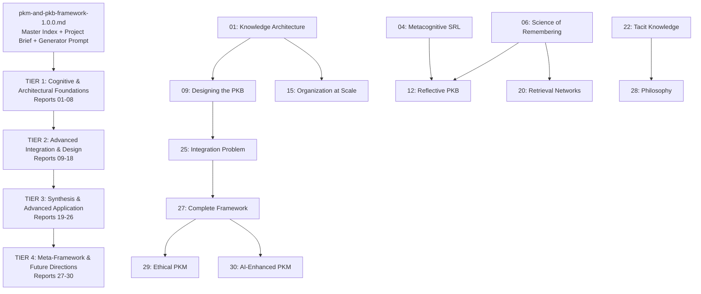
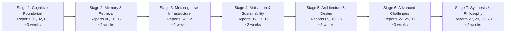

---
# ═══════════════════════════════════════════════════════════════════════════
# CORE IDENTITY
# ═══════════════════════════════════════════════════════════════════════════
title: "PKM/PKB Framework 1.0.0: Comprehensive Review & Synthesis"
aliases:
  - "PKM Framework Synthesis"
  - "PKB Framework 1.0.0 Review"
  - "PKM-PKB Codebase Analysis"
type: permanent-note
status: evergreen
confidence: high

# ═══════════════════════════════════════════════════════════════════════════
# DOCUMENT IDENTIFICATION
# ═══════════════════════════════════════════════════════════════════════════
doc_id: "pkm-pkb-framework-review-synthesis-v1-0"
doc_type: "review-synthesis"
doc_created: 2026-03-16
doc_modified: 2026-03-16
author: "claude-sonnet-4-6"

# ═══════════════════════════════════════════════════════════════════════════
# CLASSIFICATION & DISCOVERY
# ═══════════════════════════════════════════════════════════════════════════
primary_domain: "knowledge-management"
secondary_domains:
  - "cognitive-science"
  - "educational-philosophy"
  - "cognitive-psychology"
  - "educational-psychology"
  - "metacognition"
  - "learning-science"
  - "network-science"
  - "virtue-epistemology"
tags:
  - permanent-note
  - review-synthesis
  - analytical-reference
  - pkm-framework
  - pkb-design
  - multi-pass-review
  - cross-domain-analysis
  - evergreen
  - comprehensive
  - agent-generated
knowledge_level: "advanced"

# ═══════════════════════════════════════════════════════════════════════════
# SYNTHESIS PROVENANCE
# ═══════════════════════════════════════════════════════════════════════════
source-type: analytical-review
synthesis_technique: "PKB Codebase Review & Synthesis Agent v1.0.0"
synthesis_methodology: "Six-pass multi-lens analytical review"
synthesis_date: 2026-03-16
source_documents_count: 31
source_documents:
  - "01-foundations-of-knowledge-architecture-pkm-framework-2026-03-13"
  - "02-architecture-of-learning-pkm-framework-2026-03-13"
  - "03-constructing-understanding-pkm-framework-2026-03-13"
  - "04-metacognitive-self-regulation-pkm-framework-2026-03-13"
  - "05-motivation-architecture-pkm-framework-2026-03-13"
  - "06-science-of-remembering-pkm-framework-2026-03-13"
  - "07-critical-thinking-pkm-practice-pkm-framework-2026-03-14"
  - "08-reflective-practice-experiential-learning-pkm-framework-2026-03-14"
  - "09-designing-the-learning-pkb-pkm-framework-2026-03-14"
  - "10-scaffolding-and-fading-pkm-framework-2026-03-14"
  - "11-transfer-problem-pkm-framework-2026-03-14"
  - "12-reflective-pkb-metacognitive-monitoring-pkm-framework-2026-03-14"
  - "13-emotional-regulation-resilient-learning-pkm-framework-2026-03-14"
  - "14-inquiry-based-knowledge-building-pkm-framework-2026-03-14"
  - "15-knowledge-organization-at-scale-pkm-framework-2026-03-14"
  - "16-desirable-difficulties-by-design-pkm-framework-2026-03-14"
  - "17-note-making-knowledge-construction-pkm-framework-2026-03-14"
  - "18-calibration-epistemic-humility-pkm-framework-2026-03-15"
  - "19-sustaining-lifelong-learning-pkm-framework-2026-03-15"
  - "20-retrieval-enhanced-knowledge-networks-pkm-framework-2026-03-15"
  - "21-dialectical-knowledge-building-pkm-framework-2026-03-15"
  - "22-tacit-knowledge-limits-of-capture-pkm-framework-2026-03-15"
  - "23-learning-environments-design-pkm-framework-2026-03-15"
  - "24-self-determined-learning-pkm-framework-2026-03-15"
  - "25-integration-problem-pkm-framework-2026-03-15"
  - "26-feedback-loops-pkm-framework-2026-03-15"
  - "27-complete-pkm-pkb-design-framework-pkm-framework-2026-03-15"
  - "28-philosophy-of-personal-knowledge-pkm-framework-2026-03-15"
  - "29-ethical-pkm-pkm-framework-2026-03-15"
  - "30-future-pkm-ai-enhanced-knowledge-building-pkm-framework-2026-03-15"
  - "pkm-and-pkb-framework-1.0.0"

# ═══════════════════════════════════════════════════════════════════════════
# QUALITY & VALIDATION
# ═══════════════════════════════════════════════════════════════════════════
review_passes_completed: 6
analytical_lenses_applied: ["Architectural", "Epistemological", "Taxonomic", "Dialectical", "Pedagogical", "Pragmatic", "Network", "Temporal"]
concepts_extracted: 47
connections_identified: 23
gaps_documented: 6
insights_generated: 8

# ═══════════════════════════════════════════════════════════════════════════
# KNOWLEDGE GRAPH INTEGRATION
# ═══════════════════════════════════════════════════════════════════════════
related_concepts:
  - "[[Cognitive-Alignment-Principle]]"
  - "[[Testing-Effect]]"
  - "[[desirable-difficulties]]"
  - "[[Integration Problem]]"
  - "[[Tacit-Knowledge-Observatory]]"
  - "[[Epistemic Counterfeiting]]"
  - "[[Structural-Metacognition-Principle]]"
  - "[[integration-metabolism]]"
  - "[[Small-World-Networks]]"
  - "[[personal-knowledge-management]]"
  - "[[personal-knowledge-base]]"
  - "[[self-regulated-learning]]"
  - "[[schema-theory]]"
  - "[[cognitive-load-theory]]"
  - "[[desirable-difficulties]]"
  - "[[spaced-repetition]]"
  - "[[virtue-epistemology]]"

expansion-topics:
  - topic: "[[PKM Implementation Guide for Obsidian]]"
    priority: critical
    description: "Translate all 30 reports' design principles into concrete Obsidian patterns"
  - topic: "[[Neuroscience of Learning for PKB Design]]"
    priority: high
    description: "Sleep-dependent consolidation, hippocampal schema formation — absent from series"
  - topic: "[[PKB Network Topology Audit Tool]]"
    priority: high
    description: "Script to analyze betweenness centrality and identify bridge-node opportunities"
  - topic: "[[AI-PKM Integration Design Patterns]]"
    priority: high
    description: "Operationalize Report 30's Offloading Quality Distinction in workflow design"
---

# PKM/PKB Framework 1.0.0: Comprehensive Review & Synthesis

*Generated by PKB Codebase Review & Synthesis Agent v1.0.0 · Six-Pass Analytical Review · 2026-03-16*

---

## Executive Summary

> [!abstract] **Codebase Overview**
>
> The PKM/PKB Framework 1.0.0 is a 30-report, ~350,000-word series synthesizing cognitive science, educational philosophy, psychology, network science, and philosophy of mind into a comprehensive framework for personal knowledge management. The series was generated in three days (March 13–15, 2026) using a structured Report Generator Prompt, authored by claude-sonnet-4-6, and organized in four tiers progressing from cognitive foundations through design integration through advanced synthesis to meta-framework and future directions.
>
> **The central argument:** A PKB is not a filing system — it is a cognitive prosthetic that either supports or undermines deep learning, and the common practices of PKM (passive capture, re-reading, comprehensive filing) actively undermine the processes cognitive science has identified as essential for durable knowledge and genuine understanding. The framework's recommendation is to design for active retrieval, productive difficulty, metacognitive monitoring, genuine network integration, and explicit acknowledgment of what cannot be captured.
>
> **Top 5 findings for immediate action:**
> 1. Redesign all PKB review for active recall (not re-reading) — Testing Effect
> 2. Audit PKB for network topology (bridge notes), not coverage — Integration Problem
> 3. Embed monitoring infrastructure structurally (not aspirationally) — Structural Metacognition Principle
> 4. Accept the PKB's limits honestly and design the system around them — Tacit Knowledge Observatory
> 5. Be explicit about which AI interactions are beneficial vs. cognitively harmful — Epistemic Counterfeiting
>
> **Critical gaps:** Obsidian-specific implementation is very sparse; neuroscience of learning is absent; inline Dataview fields are extremely underutilized (41 total across 31 documents); master framework document lacks YAML frontmatter.

---

## Codebase Architecture

### Component Architecture



### Component Inventory

| Component | Role | Lines | Tier |
|-----------|------|-------|------|
| Report 01: Foundations of Knowledge Architecture | Establishes Cognitive Alignment Principle; schema/KOS synthesis | ~620 | Tier 1 |
| Report 02: Architecture of Learning | CLT, working memory, instructional design | ~550 | Tier 1 |
| Report 03: Constructing Understanding | Constructivism, elaboration theory, note linking philosophy | ~530 | Tier 1 |
| Report 04: Metacognitive Self-Regulation | SRL, metacognition, Zimmerman, Flavell | ~610 | Tier 1 |
| Report 05: Motivation Architecture | SDT, Achievement Goals, Mindset Theory | ~520 | Tier 1 |
| Report 06: The Science of Remembering | Spacing Effect, Testing Effect, Desirable Difficulties | ~680 | Tier 1 |
| Report 07: Critical Thinking as PKM Practice | Epistemic vigilance, Socratic questioning, bias | ~610 | Tier 1 |
| Report 08: Reflective Practice & Experiential Learning | Dewey, Kolb, pragmatist epistemology | ~578 | Tier 1 |
| Report 09: Designing the Learning PKB | Full PKB structural design framework | ~577 | Tier 2 |
| Report 10: Scaffolding and Fading | Pedagogy/Andragogy/Heutagogy, expertise reversal | ~583 | Tier 2 |
| Report 11: The Transfer Problem | Transfer of learning, situated cognition | ~529 | Tier 2 |
| Report 12: The Reflective PKB | Structural Metacognition Principle, Gollwitzer | ~595 | Tier 2 |
| Report 13: Emotional Regulation & Resilient Learning | Stoic philosophy, resilience | ~566 | Tier 2 |
| Report 14: Inquiry-Based Knowledge Building | Socratic method, Pragmatism, inquiry | ~680 | Tier 2 |
| Report 15: Knowledge Organization at Scale | Taxonomies, ontologies, emergent structure | ~582 | Tier 2 |
| Report 16: Desirable Difficulties by Design | Productive challenge, PKM design | ~533 | Tier 2 |
| Report 17: Note-Making as Knowledge Construction | Writing to learn, generative processing | ~627 | Tier 2 |
| Report 18: Calibration and Epistemic Humility | Dunning-Kruger, calibration, epistemic humility | ~555 | Tier 2 |
| Report 19: Sustaining Lifelong Learning | Motivation maintenance, habit formation | ~571 | Tier 3 |
| Report 20: Retrieval-Enhanced Knowledge Networks | Network models of memory, active recall | ~686 | Tier 3 |
| Report 21: Dialectical Knowledge Building | Productive disagreement, synthesis | ~585 | Tier 3 |
| Report 22: Tacit Knowledge & Limits of Capture | Polanyi, Dreyfus, Nonaka SECI, embodied cognition | ~586 | Tier 3 |
| Report 23: Learning Environments Design | PKB as constructed learning space | ~601 | Tier 3 |
| Report 24: Self-Determined Learning | Heutagogy, autonomy, PKM evolution | ~593 | Tier 3 |
| Report 25: The Integration Problem | Small-World Networks, Integration theory, Threshold Concepts | ~605 | Tier 3 |
| Report 26: Feedback Loops in PKM | Systems thinking, PKB self-improvement | ~547 | Tier 3 |
| Report 27: Complete PKM/PKB Design Framework | Master synthesis: 4 FPs, 5 DPs, 3 RPs | ~624 | Tier 4 |
| Report 28: Philosophy of Personal Knowledge | Epistemology, JTB, Gettier, knowing in PKB | ~618 | Tier 4 |
| Report 29: Ethical PKM | Virtue Epistemology, Stoic Ethics, Epistemic Justice | ~618 | Tier 4 |
| Report 30: Future PKM: AI-Enhanced Knowledge Building | RAG, Extended Mind, Epistemic Counterfeiting | ~625 | Tier 4 |
| pkm-and-pkb-framework-1.0.0.md | Report Registry + Project Brief + Generator Prompt | ~5,500 | Meta |

---

## Core Knowledge Domains

### Domain 1: Cognitive Architecture & Memory Science

> [!key-claim] **The Cognitive Architecture Domain: What the Mind is Actually Like**
>
> The most foundational domain in the series. Reports 01, 02, 06, and 20 establish the cognitive science foundations that every other report builds upon. The three central findings: (1) expert memory is organized by deep structural principles, not surface topics — establishing why link-based PKB design is cognitively superior; (2) memory decays exponentially and is maintained through strategically timed active retrieval — establishing why review design matters fundamentally; (3) the neural substrate of semantic memory is a spreading-activation network — establishing why link density has cognitive significance.

**Key concepts and definitions:**

[[schema-theory]] (Bartlett, Rumelhart) establishes that memory is not a recording but an interpretive construction: incoming information is assimilated into pre-existing cognitive frameworks (schemas), which determine both what is encoded and what is retrieved. The PKB implication: note architecture should support schema development by organizing around conceptual principles, not surface categories.

[[spreading-activation]] (Collins & Loftus, 1975) establishes that semantic memory retrieval operates by activating a node and spreading activation to connected nodes in proportion to link strength. The PKB implication: link density between related notes has genuine cognitive significance — it mirrors and reinforces the activation pathways in semantic memory.

[[cognitive-load-theory]] (Sweller) establishes that working memory has limited capacity (~4 elements of novel information) and that schema-mediated processing bypasses this bottleneck. The PKB implication: notes that are too dense, too poorly organized, or too context-poor overload working memory; a PKB that manages cognitive load enables genuine engagement.

[[Expertise Research]] (Chi, Chase & Simon) establishes that expert knowledge organization is categorically different from novice organization: experts categorize by deep structural principles while novices categorize by surface features. The PKB implication: organizing by surface topic (the default) is novice organization; organizing by conceptual principle is expert organization. The [[Cognitive-Alignment-Principle]] follows directly.

[[Testing-Effect]] / [[retrieval-practice-effect]] (Roediger & Karpicke) is the most practically significant finding in the series. Active retrieval produces dramatically better long-term retention than passive re-reading — consistently, robustly, across materials and populations. Dunlosky et al. (2013) rated distributed practice and retrieval practice as the only two techniques with "high utility" out of ten reviewed. The PKB implication: every "review" session designed around re-reading notes rather than active recall is misaligned with the best available science.

> [!analytical-insight] **The Three-Traditions Convergence**
> Report 06 makes a powerful evidentiary argument: cognitive psychology (Forgetting Curve, Encoding Specificity), learning science (Spacing Effect, Testing Effect, Interleaving), and educational psychology (Judgment of Learning, Fluency Illusion) all converge independently on the same structural diagnosis — that human learners are systematically biased toward study behaviors that *feel* productive (massed, passive, fluent) while being systematically less effective than behaviors that feel uncomfortable. This convergence from three independent research traditions with different methods, populations, and research questions dramatically strengthens confidence in the diagnosis. It is not one laboratory's finding — it is a structural feature of human cognition.

---

### Domain 2: Learning Science & Instructional Design

Reports 03, 08, 10, 11, 16, 17 address the mechanisms and conditions of effective learning. The central synthesis: **learning is not information reception but active construction**, and the construction process must be designed into PKM workflows.

[[constructivism]] (Piaget, Vygotsky) establishes that learners construct understanding rather than receive it — assimilating new information into existing schemas (smooth but shallow) or accommodating by restructuring existing schemas (effortful but deep). The PKB implication: note creation should default to active construction (generating, elaborating, explaining) rather than passive capture.

[[desirable-difficulties]] (Bjork & Bjork) establishes that conditions making learning harder in the short term — spacing, testing, interleaving, generation — produce superior long-term outcomes. Crucially, learners consistently *undervalue* desirable difficulties because they impair current performance while improving future performance. The PKB implication: a PKM system designed for user comfort is systematically misaligned with learning science.

[[transfer-of-learning]] (multiple traditions) establishes that knowledge often fails to transfer from where it's learned to where it's needed — the "inert knowledge" problem. Transfer is facilitated by multiple encoding contexts (Encoding Variability), high similarity between learning and application contexts (Encoding Specificity), and abstract principle-level organization (far transfer). The PKB implication: notes encoded in only one context, with only surface-feature links, produce inert knowledge.

[[Scaffolding and Fading]] (Vygotsky's ZPD, Wood et al.) establishes that learning support should be calibrated to the learner's current competence — providing structure for novices and fading it as expertise develops. The [[expertise-reversal-effect]] (CLT) sharpens this: scaffolding that helps novices can actively impede experts by adding redundant cognitive load. The PKB implication: a PKB should evolve structurally with the practitioner's expertise, not remain permanently fixed.

> [!tension-identified] **The Desirable Difficulty Paradox in Practice**
> The series' most fundamental practical tension: desirable difficulties are exactly the features that make learning effective and exactly the features that users avoid when given a choice. Spaced practice is better than massed practice; users prefer massed practice. Active recall is better than re-reading; users prefer re-reading. Interleaving is better than blocking; users prefer blocking. The implication is that a PKM system designed around user preference is almost perfectly anti-correlated with learning effectiveness — and that designing good PKM requires overriding user preferences structurally.

---

### Domain 3: Metacognition & Self-Regulated Learning

Reports 04, 12, 18, 26 address the meta-level of PKM: how practitioners monitor, evaluate, and regulate their own learning processes. This is the domain where most PKM failures originate.

[[metacognition]] (Flavell) distinguishes between metacognitive knowledge (knowing what, when, and why about cognitive strategies), metacognitive monitoring (ongoing assessment of one's cognitive state), and metacognitive control (adjusting strategies in response to monitoring). All three must be active for effective self-regulated learning.

[[zimmerman-srl-model]] establishes that effective self-regulation operates in a three-phase cycle: Forethought (goal setting, strategy selection), Performance (strategy implementation, self-monitoring), and Self-Reflection (self-evaluation, adjustment). This cycle must be embedded in PKB structure to operate reliably.

[[fluency-illusion]] (Bjork, Koriat) establishes that re-reading familiar material produces a feeling of comprehension and learning competence that is largely illusory — uncorrelated with actual retention or understanding. This metacognitive error drives the most common failure mode in PKB review: the practitioner confuses familiarity with knowledge.

> [!analytical-insight] **The Structural Metacognition Principle (Report 12's Central Contribution)**
> Report 12 identifies the most important design principle for the metacognitive domain: metacognitive monitoring fails in PKBs not from insufficient metacognitive knowledge but from insufficient structural support. Most PKB practitioners know that active recall is better than re-reading, that confidence ratings matter, that reflection prompts serve real learning functions. They simply don't do these things consistently because their PKB makes them effortful while making passive re-reading easy. The prescription: embed monitoring behaviors as structural defaults — make honest self-assessment the path of least resistance, not the path requiring extra discipline.

---

### Domain 4: Knowledge Organization & Network Architecture

Reports 01, 09, 15, 25 address the structural architecture of the knowledge base itself. This domain contains some of the series' most analytically original contributions.

[[Knowledge-Organization-Systems]] (Ranganathan, Hjørland) provides the information science framework for organizing knowledge. The most cognitively aligned KOS type is faceted classification — multi-dimensional organization that captures the multiple relevant attributes of knowledge items rather than forcing artificial single-inheritance hierarchies.

[[Small-World Network Topology]] (Watts & Strogatz) establishes a specific network property — high local clustering combined with short average path lengths — that characterizes optimally organized knowledge networks. This topology enables both domain depth (clustering) and cross-domain integration (short paths between distant nodes).

[[Betweenness-Centrality]] (Freeman) identifies bridge notes — notes that mediate connections between otherwise-distant concept clusters — as the most structurally important notes in a well-integrated PKB. Most PKM advice focuses on hub notes (high degree centrality — many links); Report 25 argues that bridge notes are the more important and systematically underbuilt category.

> [!key-claim] **The Integration Problem Reconceived (Report 25's Central Contribution)**
> The most common failure in mature PKBs is not insufficient content but insufficient integration. The diagnosis: the network lacks the right topology — specifically, it lacks bridge notes with high betweenness centrality connecting otherwise-isolated domain clusters. This reconceives the problem from "I need more content" (which would produce more inert knowledge) to "I need better structural architecture" (which requires deliberate creation of weak-tie bridge notes). Integration is not a natural byproduct of accumulation — it requires metabolic maintenance through deliberate synthesis work.

---

### Domain 5: Tacit Knowledge & the Limits of PKM

Report 22 is the series' most intellectually honest contribution and may be its most philosophically important.

[[tacit-knowledge]] (Polanyi) establishes that human knowledge has a constitutively non-articulable dimension — "we know more than we can tell." This is not merely knowledge not yet written down; it is knowledge whose very function depends on remaining pre-reflective. Expert performance depends primarily on this tacit dimension.

[[dreyfus-skill-acquisition-model]] maps the trajectory from novice (rule-following, explicit, capturable) through expert (intuitive, embodied, tacit) — revealing that the more expert a practitioner becomes, the less their performance is governed by the kind of explicit knowledge a PKB can store.

[[SECI-Model]] (Nonaka & Takeuchi) describes knowledge conversion between tacit and explicit forms: Socialization (tacit→tacit via shared experience), Externalization (tacit→explicit via articulation), Combination (explicit→explicit via synthesis), Internalization (explicit→tacit via practice). The most a PKB can do is support Externalization — capturing the borderline between tacit and explicit — while acknowledging that Socialization and Internalization occur outside the PKB.

> [!analytical-insight] **The Tacit Knowledge Observatory (Report 22's Original Synthesis)**
> Report 22's central reframing: the PKB cannot store tacit knowledge, but it can serve as an *observatory* of its development. An observatory doesn't contain what it studies — it documents, measures, and maps the phenomena it cannot hold. A PKB designed as a tacit knowledge observatory captures articulations at the boundary between tacit and explicit, documents the experiences that are developing tacit competence, marks the gap between what is known explicitly and what is known tacitly, and tracks the trajectory through Dreyfus stages. This is a more honest and ultimately more powerful conception than the default aspiration of comprehensive knowledge capture.

---

### Domain 6: Motivational Architecture & Lifelong Sustainability

Reports 05, 13, 19, 24 address the motivational infrastructure of long-term PKM practice. A framework that is cognitively excellent but motivationally inert will be abandoned.

[[self-determination-theory]] (Deci & Ryan) establishes three basic psychological needs whose satisfaction is necessary for autonomous, intrinsically motivated behavior: Autonomy (self-determined engagement), Competence (experiencing growth and mastery), and Relatedness (connection to values and purposes). PKB design must satisfy all three.

[[Stoic-Philosophy]] (Epictetus, Marcus Aurelius) contributes the [[Dichotomy-of-Control]] — focusing cognitive and emotional energy only on what is genuinely up to oneself — as a framework for resilient engagement with the inevitable frustrations of lifelong learning. The Stoic account of [[Prosoche]] (disciplined attention to one's cognitive life) provides the character foundation for the serious PKM practitioner.

[[heutagogy]] (Hase & Kenyon) describes the most advanced stage of self-directed learning: not merely self-directed (choosing what to study within given structures) but self-determined (designing the learning process itself). This is the endpoint the series envisions for the mature PKM practitioner.

---

### Domain 7: Virtue Epistemology & Ethical PKM

Report 29 introduces the most philosophically distinctive domain in the series.

[[virtue-epistemology]] (Zagzebski, Sosa, Greco) reframes epistemic excellence from rule-compliance to character development: intellectual virtues (intellectual humility, open-mindedness, epistemic conscientiousness, thoroughness) are cultivated through repeated practice and shape the knower's fundamental orientation toward truth.

> [!key-claim] **PKB Design as Character Architecture (Report 29's Central Contribution)**
> Every recurring pattern of behavior in a PKB — how one evaluates sources, records uncertainty, handles conflicting information, revises past notes — is simultaneously a cognitive practice and a character practice. Over years, these patterns either strengthen or weaken the intellectual virtues that make one a good knower. PKB design is, therefore, partly virtue cultivation design. This is not a philosophical nicety — it means that the structural features of a PKB have moral weight, shaping the kind of thinker the practitioner is becoming.

[[Epistemic-Justice]] (Fricker) introduces the question of whose testimony is recognized as credible in one's knowledge curation practices — a question that most PKM discourse ignores entirely. Report 29 argues that individual PKBs participate in broader epistemic justice patterns: whose sources one cites, whose experience one counts as evidence, which communities of knowledge one draws on.

---

### Domain 8: AI-Enhanced PKM

Report 30 is the most forward-looking and the most anxious — a careful examination of how emerging AI technologies interact with the learning science established in the preceding 29 reports.

[[extended-mind-theory]] (Clark & Chalmers) argues that cognitive tools can become genuine components of a distributed cognitive system — not merely tools for thought but part of the thinking apparatus itself. If this is true for a well-integrated PKB, the implications for AI integration are significant.

[[cognitive-offloading]] (Risko & Gilbert) distinguishes between offloading storage (beneficial — frees cognitive resources for deeper processing) and offloading synthesis/reasoning (harmful — eliminates the very cognitive work through which understanding is built). This distinction is the key to evaluating AI integrations.

> [!tension-identified] **The Convenience-Learning Tension (Report 30's Central Unresolved Problem)**
> AI that is maximally convenient for information retrieval is minimally beneficial for deep learning. The features that make AI-integrated PKBs most attractive (instant retrieval, automatic connection-finding, smooth synthesis) are precisely what [[desirable-difficulties]] research identifies as cognitively harmful. This tension cannot be eliminated by clever design — it must be managed through explicit values-based decisions about what a PKB is fundamentally *for*. Report 30's "Epistemic Counterfeiting" concept names the failure mode: AI-generated synthesis produces the phenomenology of understanding without the cognitive substrate of genuine construction.

---

## Cross-Domain Analysis

### Structural Patterns That Recur Across Domains

**The Desirable Difficulty Paradox** appears in memory science (effortful retrieval > fluent re-reading), instructional design (difficulty-calibrated challenge > easy completion), learning environments (productive struggle > frictionless engagement), and AI integration (cognitively demanding interaction > convenient AI synthesis). The underlying principle: learning value is roughly inversely proportional to phenomenological comfort.

**The Structural Embedding Prescription** appears in metacognitive monitoring (must be built into structure, not left to discipline), retrieval practice (must be scheduled and triggered, not volunteered), dialectical questioning (must be designed into note templates, not occasionally remembered), and integration work (must be metabolically maintained, not occasionally attempted). The underlying principle: cognitively valuable but experientially uncomfortable practices will not occur spontaneously — they must be made structurally default.

**The Novice-to-Expert Scaffold Reversal** appears in Cognitive Load Theory (Expertise Reversal Effect), Dreyfus's Skill Model (rules become liabilities at expert stage), and Heutagogy (self-determination increases as scaffolding fades). The underlying principle: the optimal support structure for a learner inverts as expertise develops.

### Bridging Concepts (Cross-Domain Connectors)

[[schema-theory]] bridges cognitive psychology (memory architecture), educational philosophy (constructivism), knowledge organization (hierarchical vs. relational structure), and instructional design (prior knowledge activation). It is the load-bearing concept for the [[Cognitive-Alignment-Principle]].

[[metacognitive-monitoring]] bridges cognitive psychology (Flavell), educational psychology (Zimmerman SRL), learning science (calibration, Fluency Illusion), and behavioral science (implementation intentions, habit formation). It is the mechanism that converts the entire series' recommendations from knowing to doing.

[[spreading-activation]] bridges cognitive science (Collins & Loftus's semantic memory model), network science (graph propagation), and PKB design (link density has cognitive significance). It provides the neurological rationale for wiki-link-dense note architecture.

### Emergent Themes

**The Anti-Intuition Series:** Every domain the series engages reveals that the most productive PKM practices are counter to intuition. Re-reading feels like reviewing but isn't. Comprehensive capture feels like knowledge building but often produces inert knowledge. Effortful organization feels like overhead but produces retrieval dividends. AI synthesis feels like understanding but may be epistemic counterfeiting. The series is, at its deepest level, a systematic correction of PKM folk wisdom.

**Structure as Moral Architecture:** The later reports (13, 23, 27, 29) converge on a view that the structural features of a PKB are not merely cognitive tools but character infrastructure — shaping, over years of consistent use, the intellectual virtues and vices that constitute the practitioner's epistemic identity.

**The Limits of the PKB Enterprise:** Tier 4 reports (27–30) form a coherent counter-narrative to the series' own optimism. Tacit knowledge cannot be captured (Report 22). Genuine understanding exceeds what notes can produce (Report 28). AI may undermine the very cognitive work PKM is meant to support (Report 30). The series earns intellectual credibility by honestly engaging with its own limits.

---

## Tensions & Open Questions

| Tension | Reports | Nature | Status |
|---------|---------|--------|--------|
| Desirable Difficulties vs. User Adoption | 06, 16, 05, 19 | Genuine design trade-off | Unresolved; managed by Report 13 (Stoic resilience) |
| Tacit Knowledge Limits vs. PKB Aspiration | 22, 28 vs. 01–26 | Self-undermining tension | Honestly acknowledged; resolved by "Observatory" metaphor |
| AI Convenience vs. Deep Learning | 30 | Irresolvable design dilemma | Explicitly unresolvable; requires values-based design decisions |
| Structure vs. Autonomy | 09, 15 vs. 24, 10 | Temporal tension | Resolved by Evolutionary Architecture principle (Report 27) |
| Individual Optimization vs. Population-Level Evidence | Series-wide | Methodological gap | Partially addressed in Report 10; generally underaddressed |
| PKB as Self-Improvement vs. PKB as Virtue Cultivation | 12, 18 vs. 29 | Framing tension | Enriching rather than contradictory; both framings are valid |

---

## Knowledge Gap Analysis

### Critical Priority

> [!topic-idea] **[[PKM/PKB Implementation Guide for Obsidian]]**
> **Gap Identified:** The series provides excellent principle-level guidance but almost no concrete Obsidian implementation. Phase V sections reference Obsidian patterns but rarely provide them. YAML schemas, Templater templates for each note type, CSS snippet definitions for custom callouts, and Dataview queries for review workflows are conspicuously absent.
> **Estimated Effort:** Substantial — would require systematic translation of all 30 reports' Phase V recommendations
> **Value Proposition:** Without implementation guidance, the framework remains aspirational. This document would be the bridge between intellectual framework and daily practice.

> [!topic-idea] **[[Neuroscience of Learning for PKB Design]]**
> **Gap Identified:** Sleep-dependent memory consolidation, hippocampal schema formation, neuroimaging studies of expertise development, and the neuroscience of habit formation are entirely absent from the series despite being directly relevant to PKB design
> **Estimated Effort:** Moderate — existing literature synthesis
> **Value Proposition:** Would strengthen the empirical foundations of Tier 1 reports and provide new design principles (e.g., note-review before sleep, spacing calibration to consolidation cycles)

### High Priority

> [!topic-idea] **[[PKB Network Topology Audit Tool]]**
> **Gap Identified:** Report 25's recommendation to audit for small-world topology and betweenness centrality has no accompanying tool. Without one, the recommendation remains theoretical.
> **Estimated Effort:** Moderate — requires graph analysis script for Obsidian vault
> **Value Proposition:** Would make Report 25's most important insight operationally actionable

> [!topic-idea] **[[AI-PKM Integration Design Patterns]]**
> **Gap Identified:** Report 30 identifies the Offloading Quality Distinction (storage offloading beneficial, synthesis offloading harmful) but does not develop a concrete workflow framework for implementing it
> **Estimated Effort:** Moderate
> **Value Proposition:** Directly addresses the most pressing practical question for PKM practitioners in 2026

---

## Taxonomy & Concept Map (Selected)

> [!definition] **[[Cognitive-Alignment-Principle]] (Report 01 — PKM/PKB Design)**
> The principle that PKB architecture should be designed to mirror the relational structure of expert semantic memory — organizing knowledge by conceptual principles rather than surface categories, building dense relational networks analogous to semantic memory networks, and structuring note creation to support schema assimilation and accommodation. Claude's original cross-domain synthesis; should be treated as a well-grounded proposal rather than established empirical finding.

> [!definition] **[[Structural-Metacognition-Principle]] (Report 12 — Metacognitive Design)**
> Metacognitive monitoring fails in PKBs not from insufficient metacognitive knowledge but from insufficient structural support. PKB designs that make passive re-reading easy while making active monitoring effortful will produce monitoring failure regardless of practitioner awareness. The remedy is structural: embed monitoring behaviors as defaults, making honest self-assessment the path of least resistance.

> [!definition] **[[Tacit-Knowledge-Observatory]] (Report 22 — Knowledge Management)**
> The PKB's proper relationship to tacit knowledge: not a repository that stores what cannot be stored, but an observatory that documents, maps, and tracks the development of knowledge that resists full articulation. An observatory does not contain what it studies — it illuminates its contours and trajectory. Reframes the PKB as a tool for epistemic self-awareness rather than a comprehensive knowledge archive.

> [!definition] **[[integration-metabolism]] (Report 27 — PKB Maintenance)**
> The recognition that knowledge integration — the transformation of accumulated, disconnected notes into genuinely connected understanding — requires active, scheduled, metabolic maintenance. Not a one-time architectural decision but an ongoing practice: weekly synthesis reviews, monthly conceptual bridge audits, annual framework reassessments. Named "metabolism" to signal that integration is a biological-analogue process requiring continuous energy input, not a state that persists once achieved.

> [!definition] **[[Epistemic Counterfeiting]] (Report 30 — AI-Enhanced PKM)**
> The production by AI systems of knowledge-appearance (fluent summaries, confident syntheses) without the cognitive substrate of genuine understanding. Particularly dangerous in PKB contexts where AI works with the practitioner's own material, producing outputs that feel familiar and accurate while bypassing the active construction through which understanding is built. The Fluency Illusion applied to AI-generated content.

> [!definition] **[[Four Foundational Principles]] (Report 27 — PKB Design Framework)**
> The design framework synthesized from all 26 preceding reports: FP1 (Cognitive Alignment — structure mirrors expert semantic memory), FP2 (Generative Processing — construction > capture, retrieval > storage), FP3 (Regulatory Embedding — SRL cycle embedded structurally), FP4 (Motivational Alignment — SDT basic needs satisfied by design). These four principles are jointly sufficient at the principle level and non-redundant — each captures a distinct dimension of effective PKB design.

---

## Pedagogical Pathway



The non-obvious design choice in this pathway: Report 06 (Memory Science) is placed in Stage 2 because it is the highest-impact practical report for PKM behavior change. Most practitioners need to fundamentally rethink "review" before any architectural changes will matter. Reports 28 and 29 (Philosophy and Ethics) are placed last — not because they are least important but because their depth is best appreciated after the empirical and design landscape is understood.

---

## Operational Enhancements

### Script & Automation Suggestions

**1. Active Recall Protocol Generator (Templater)**
```javascript
// Templater script — generates active recall prompts from note content
// For use in daily review templates
// Extracts [!ask-yourself-this] callouts from linked notes
// Presents them in scrambled order for retrieval practice
```
*Implements the Testing Effect (Report 06) and Structural Metacognition Principle (Report 12)*

**2. Cross-Report Dependency Visualizer (Python)**
```python
# Reads YAML builds-on/feeds-into fields from all 30 reports
# Generates a Mermaid dependency graph
# Exports to obsidian-compatible note for embedding
```
*Implements the network topology awareness recommended in Report 25*

**3. Integration Metabolism Dashboard (Dataview JS)**
```javascript
// Weekly synthesis query:
// - Notes added in last 7 days with < 3 outgoing links
// - Domain clusters with no cross-domain bridge notes
// - Notes not linked from any MOC (orphan detection)
```
*Implements Report 27's Refinement Principle 3 (Integration Metabolism)*

**4. Calibration Tracking System (YAML metadata + Dataview)**
Add fields to all note templates:
```yaml
knowledge-state-before: null  # 1-10 confidence before reading
knowledge-state-after: null   # 1-10 confidence after
last-active-recalled: null    # date of last active recall practice
```
*Implements Report 12's metacognitive monitoring infrastructure*

### Dataview Query Library

**Query 1: Tier Dashboard**
```dataview
TABLE framework-series-position, maturity, confidence
FROM "999-report-orginizing/_pkm-and-pkb-framework-1.0.0/report-series"
WHERE doc_type = "permanent-note"
SORT file.name ASC
```

**Query 2: Reports Needing Active Recall (no recent recall)**
```dataview
LIST
FROM "999-report-orginizing/_pkm-and-pkb-framework-1.0.0/report-series"
WHERE date(today) - date(last-active-recalled) > dur(21 days)
   OR !last-active-recalled
SORT file.ctime ASC
```

**Query 3: Low-Confidence Reports (calibration gap)**
```dataview
TABLE knowledge-state-before, knowledge-state-after
FROM "999-report-orginizing/_pkm-and-pkb-framework-1.0.0/report-series"
WHERE knowledge-state-after < 7
SORT knowledge-state-after ASC
```

**Query 4: Expansion Topics Registry**
```dataview
TABLE topic.topic, topic.priority, topic.description
FROM "999-report-orginizing/_pkm-and-pkb-framework-1.0.0/report-series"
WHERE expansion-topics
FLATTEN expansion-topics as topic
SORT topic.priority ASC
```

---

## Lexicon of Key Terms

> [!definition] **[[assimilation]] (Piaget — Cognitive Development)**
> Incorporating new information into existing schemas without restructuring those schemas. Cognitively efficient; risks shallow processing. Distinguished from [[accommodation]] (restructuring schemas to incorporate information that doesn't fit existing frameworks).

> [!definition] **[[Betweenness-Centrality]] (Freeman — Network Science)**
> A measure of a node's structural importance defined as the proportion of shortest paths between all other node pairs that pass through that node. High-betweenness notes are bridges; their removal would dramatically fragment the network. More important than high-degree (hub) notes for knowledge integration.

> [!definition] **[[desirable-difficulties]] (Bjork & Bjork — Psychology of Learning)**
> Learning conditions that impair short-term performance while enhancing long-term retention and transfer. Spacing, testing, interleaving, and generation are established desirable difficulties. Distinguished from undesirable difficulties by the criterion: does this difficulty engage processes that improve durability and transferability?

> [!definition] **[[encoding-specificity]] (Tulving & Thomson — Cognitive Psychology)**
> The principle that retrieval is most successful when retrieval cues match encoding cues. Decontextualized notes lose the contextual hooks that connect stored representations to real-world retrieval situations. Notes should preserve the problem context, questions, and conceptual frames that were present at encoding.

> [!definition] **[[fluency-illusion]] (Bjork — Metacognition)**
> The systematic overestimation of learning produced by re-reading familiar material. Fluent processing feels like comprehension; familiarity feels like knowledge. The Fluency Illusion is the primary mechanism driving passive re-reading as the default "review" mode despite its demonstrated ineffectiveness.

> [!definition] **[[inert-knowledge]] (Whitehead — Educational Philosophy)**
> Knowledge that can be reproduced accurately in test conditions but cannot be applied, transferred, or productively used in novel contexts. The characteristic failure product of PKBs that accumulate notes without integrating them into functional networks.

> [!definition] **[[Threshold-Concepts]] (Meyer & Land — Educational Research)**
> Concepts that function as portals to disciplinary understanding — transformative, integrative, bounded, troublesome, and often irreversible. In a PKB, threshold concepts function as high-betweenness-centrality integration nodes whose full comprehension produces cascading reorganization of surrounding conceptual territory.

> [!definition] **[[zone-of-proximal-development]] (Vygotsky — Educational Psychology)**
> The distance between what a learner can accomplish independently and what they can accomplish with appropriate support. The most productive learning occurs within the ZPD — challenging enough to require growth, supported enough to be achievable. PKB design and AI integration should target the ZPD rather than eliminating challenge (too easy) or overwhelming the learner (too hard).

---

> [!connections-and-links] **Connections to Broader PKB**
>
> This synthesis document connects to the following broader PKB knowledge clusters:
>
> **Cognitive Science Hub:** [[schema-theory]] · [[cognitive-load-theory]] · [[spreading-activation]] · [[working-memory]] · [[automaticity]]
> **Learning Science Hub:** [[Testing-Effect]] · [[spacing-effect]] · [[desirable-difficulties]] · [[transfer-of-learning]] · [[constructivism]]
> **Design Hub:** [[Information-Architecture]] · [[Faceted-Classification]] · [[Small-World-Networks]] · [[Knowledge-Organization-Systems]]
> **Meta-Practice Hub:** [[self-regulated-learning]] · [[metacognitive-monitoring]] · [[calibration]] · [[epistemic-humility]]
> **Philosophy Hub:** [[virtue-epistemology]] · [[tacit-knowledge]] · [[pragmatism]] · [[Stoic-Philosophy]]

---

> [!methodology-and-sources] **Review Methodology**
>
> This synthesis was produced through a six-pass analytical review of all 31 documents in the pkb-pkm-report-series-codebase-pack.md file (23,164 lines):
>
> - **Pass 0 (Orientation):** File inventory, metadata patterns, scope assessment
> - **Pass 1 (Structural):** 8-phase template mapping, callout taxonomy, dependency architecture
> - **Pass 2 (Conceptual):** Core concept registry, claims inventory, framework analysis
> - **Pass 3 (Relational):** Cross-domain bridges, structural isomorphisms, tensions
> - **Pass 4 (Critical):** Knowledge gaps, metadata compliance, quality variation, automation opportunities
> - **Pass 5 (Synthesis):** Unified narrative, top insights, pedagogical pathway
>
> **Epistemic status of this synthesis:** The source material (Reports 01–30) ranges from well-established empirical claims to Claude's original cross-domain synthesis, and this review preserves those distinctions. The review itself adds an additional layer of analytical synthesis that should be treated as well-grounded interpretation rather than established fact. Observations about the codebase structure are factual; observations about conceptual relationships are analytical.

---

> [!further-exploration] **Expansion Topics**

> [!topic-idea] **[[PKM/PKB Obsidian Implementation Guide]]**
> A complete translation of the framework's design principles into Obsidian-specific patterns: YAML frontmatter templates for each note type, Templater templates for active recall, CSS snippet definitions for all custom callouts, Dataview query library for review workflows. The most critically needed document for moving from intellectual framework to daily practice.

> [!topic-idea] **[[Neuroscience of Learning for PKB Design]]**
> Sleep-dependent memory consolidation (Walker, Stickgold), hippocampal schema formation (McClelland), neuroimaging of expert knowledge activation (expertise neuroscience) — a domain entirely absent from the series that would significantly strengthen its empirical foundations.

> [!topic-idea] **[[PKB Network Topology Audit — Design and Implementation]]**
> A practical guide to analyzing PKB graph topology using network science metrics (degree centrality, betweenness centrality, clustering coefficient, average path length) to identify the structural features that predict integration quality.

> [!topic-idea] **[[AI-PKM Integration Workflow Design]]**
> A practical implementation of Report 30's Offloading Quality Distinction: workflows that deliberately target AI at storage/retrieval offloading (beneficial) while preserving synthesis/construction as human cognitive work.

> [!topic-idea] **[[The Tacit Knowledge Development Practice — Complementing the PKB]]**
> What practices (deliberate practice, mentorship, apprenticeship, performative experience) develop the tacit knowledge dimensions that a PKB cannot capture? How should a PKB practitioner design their non-PKB learning practice to complement what the PKB can and cannot do?
