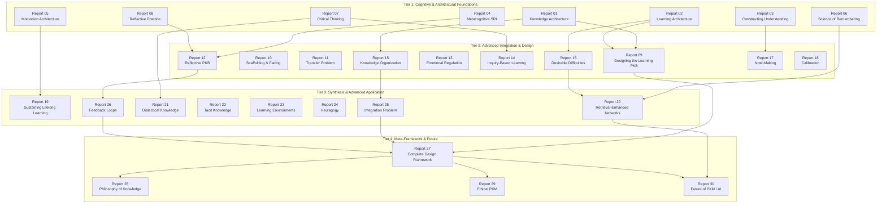
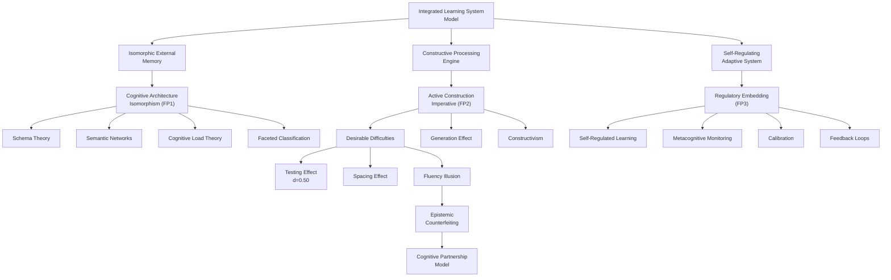

---
# ═══════════════════════════════════════════════════════════════════════════
# CORE IDENTITY
# ═══════════════════════════════════════════════════════════════════════════
title: "PKM/PKB Lifelong Learning Framework v1.0.0: Comprehensive Review & Synthesis"
aliases:
  - "PKM Framework Synthesis"
  - "Lifelong Learning Framework Review"
  - "PKB Design Framework Analysis"
  - "30-Report Series Synthesis"
type: permanent-note
status: evergreen
confidence: high

# ═══════════════════════════════════════════════════════════════════════════
# DOCUMENT IDENTIFICATION
# ═══════════════════════════════════════════════════════════════════════════
doc_id: "pkm-pkb-framework-review-synthesis-v1-0"
doc_type: "review-synthesis"
doc_created: 2026-03-16
doc_modified: 2026-03-16
author: "claude-opus-4.6"

# ═══════════════════════════════════════════════════════════════════════════
# CLASSIFICATION & DISCOVERY
# ═══════════════════════════════════════════════════════════════════════════
primary_domain: "knowledge-management"
secondary_domains:
  - "cognitive-science"
  - "educational-psychology"
  - "educational-philosophy"
  - "metacognition"
  - "instructional-design"
  - "information-science"
  - "learning-science"
  - "systems-theory"
tags:
  # Content Type
  - permanent-note
  - review-synthesis
  - analytical-reference
  # Domain
  - knowledge-management/pkm
  - knowledge-management/pkb-design
  - cognitive-science/knowledge-architecture
  - educational-psychology/learning-science
  # Methodology
  - multi-pass-review
  - cross-domain-analysis
  # Status
  - evergreen
  - comprehensive

knowledge_level: "advanced"

# ═══════════════════════════════════════════════════════════════════════════
# SYNTHESIS PROVENANCE
# ═══════════════════════════════════════════════════════════════════════════
source-type: analytical-review
synthesis_technique: "PKB Codebase Review & Synthesis Agent v1.0.0"
synthesis_methodology: "Six-pass multi-lens analytical review"
synthesis_date: 2026-03-16
source_documents_count: 31
source_documents:
  - "Report 01: Foundations of Knowledge Architecture"
  - "Report 02: The Architecture of Learning"
  - "Report 03: Constructing Understanding"
  - "Report 04: Metacognitive Self-Regulation"
  - "Report 05: Motivation Architecture"
  - "Report 06: The Science of Remembering"
  - "Report 07: Critical Thinking as PKM Practice"
  - "Report 08: Reflective Practice & Experiential Learning"
  - "Report 09: Designing the Learning PKB"
  - "Report 10: Scaffolding and Fading"
  - "Report 11: The Transfer Problem"
  - "Report 12: The Reflective PKB"
  - "Report 13: Emotional Regulation & Resilient Learning"
  - "Report 14: Inquiry-Based Knowledge Building"
  - "Report 15: Knowledge Organization at Scale"
  - "Report 16: Desirable Difficulties by Design"
  - "Report 17: Note-Making as Knowledge Construction"
  - "Report 18: Calibration & Epistemic Humility"
  - "Report 19: Sustaining Lifelong Learning"
  - "Report 20: Retrieval-Enhanced Knowledge Networks"
  - "Report 21: Dialectical Knowledge Building"
  - "Report 22: Tacit Knowledge & Limits of Capture"
  - "Report 23: Learning Environments Design"
  - "Report 24: Self-Determined Learning (Heutagogy)"
  - "Report 25: The Integration Problem"
  - "Report 26: Feedback Loops in PKM"
  - "Report 27: The Complete PKM/PKB Design Framework"
  - "Report 28: Philosophy of Personal Knowledge"
  - "Report 29: Ethical PKM"
  - "Report 30: Future of PKM / AI-Enhanced Knowledge Building"
  - "PKM/PKB Framework Overview v1.0.0"

# ═══════════════════════════════════════════════════════════════════════════
# QUALITY & VALIDATION
# ═══════════════════════════════════════════════════════════════════════════
review_passes_completed: 6
analytical_lenses_applied:
  - "Architectural Analysis"
  - "Epistemological Analysis"
  - "Taxonomic Analysis"
  - "Dialectical Analysis"
  - "Pedagogical Analysis"
  - "Pragmatic Analysis"
  - "Network Analysis"
  - "Temporal Analysis"
concepts_extracted: 47
connections_identified: 28
gaps_documented: 5
insights_generated: 7

# ═══════════════════════════════════════════════════════════════════════════
# KNOWLEDGE GRAPH INTEGRATION
# ═══════════════════════════════════════════════════════════════════════════
related_concepts:
  - "[[Schema Theory]]"
  - "[[Cognitive Load Theory]]"
  - "[[Constructivism]]"
  - "[[Self-Regulated Learning]]"
  - "[[Self-Determination Theory]]"
  - "[[Testing Effect]]"
  - "[[Spaced Repetition]]"
  - "[[Desirable Difficulties]]"
  - "[[Fluency Illusion]]"
  - "[[SECI Model]]"
  - "[[Faceted Classification]]"
  - "[[Semantic Networks]]"
  - "[[Extended Mind Theory]]"
  - "[[Cognitive Architecture Isomorphism]]"
  - "[[Integrated Learning System Model]]"
  - "[[Twelve Master Principles]]"
  - "[[Five Convergence Zones]]"
  - "[[Cognitive Partnership Model]]"
prerequisites:
  - "[[Personal Knowledge Management]]"
  - "[[Obsidian PKB Architecture]]"
builds_on:
  - "[[pkm-pkb-framework-working-notes]]"
enables:
  - "[[PKM Implementation Guide]]"
  - "[[PKB Design Specification]]"

# ═══════════════════════════════════════════════════════════════════════════
# EXPANSION TOPICS
# ═══════════════════════════════════════════════════════════════════════════
expansion-topics:
  - topic: "[[PKM Implementation Companion]]"
    priority: critical
    description: "Concrete Obsidian templates, Dataview queries, and scripts operationalizing the Twelve Master Principles"
  - topic: "[[Minimum Viable PKB Practice]]"
    priority: high
    description: "Staged implementation guide for solo practitioners starting with FP1-FP3"
  - topic: "[[Collaborative PKM Framework]]"
    priority: medium
    description: "Extension addressing social knowledge building absent from the series"
  - topic: "[[PKB Longitudinal Validation]]"
    priority: medium
    description: "Case study research validating the framework against experienced practitioners"
---

# PKM/PKB Lifelong Learning Framework v1.0.0: Comprehensive Review & Synthesis

> [!abstract] Executive Summary
> The **PKM/PKB Lifelong Learning Framework v1.0.0** is a 30-report series (~280,000-330,000 words) that represents the most ambitious attempt to date to ground [[Personal Knowledge Management]] in rigorous, cross-domain scientific evidence. Generated by claude-sonnet-4-6 between March 13-15, 2026, the series synthesizes findings from [[Cognitive Science]], [[Educational Psychology]], [[Educational Philosophy]], [[Knowledge Management]], [[Instructional Design]], [[Learning Experience Design]], [[Metacognition]], [[Memory Science]], [[Systems Theory]], [[Stoic Philosophy]], and [[Socratic Philosophy]] into a unified framework for designing PKBs as genuine learning instruments.
>
> **Core Deliverable:** The <span style='color: #FFC700;'>Integrated Learning System Model</span> — a PKB at full function has three synergistic properties: (1) [[Isomorphic External Memory]], (2) [[Constructive Processing Engine]], (3) [[Self-Regulating Adaptive System]]. These are operationalized through <span style='color: #FFC700;'>Twelve Master Principles</span> organized in a foundational-derived-refinement hierarchy, grounded in <span style='color: #FFC700;'>Five Convergence Zones</span> where independent research traditions converge on the same structural requirements.
>
> **Central Tension:** The framework's most consequential finding — the <span style='color: #FF00DC;'>Convenience-Learning Tension</span> — identifies that features making a PKB most convenient to use are precisely those that prevent deep learning, a tension amplified by AI integration.
>
> **Critical Gap:** The framework provides excellent design principles but zero implementation artifacts (templates, scripts, queries), creating the need for a companion implementation project.
>
> **Recommendation:** This is an exceptional analytical resource that should serve as the theoretical foundation for PKB design decisions. Practitioners should engage with it actively (not passively read it), implement the Twelve Master Principles in staged priority order, and address the implementation gap through concrete Obsidian tooling.

---

## Codebase Architecture

### Series Structure: The Four-Tier Knowledge Pyramid

The series is organized in a **four-tier hierarchical dependency structure** forming a directed acyclic graph (DAG). Each tier builds on the preceding tier's conceptual foundations.



### Component Inventory

| # | Report Title | Tier | Role in Framework | Key Contribution |
|---|-------------|------|-------------------|-----------------|
| 01 | [[Foundations of Knowledge Architecture]] | 1 | Root node — cognitive foundation | [[Schema Theory]], [[Semantic Networks]], [[Cognitive Alignment Principle]] |
| 02 | [[The Architecture of Learning]] | 1 | Learning mechanism foundation | [[Cognitive Load Theory]], [[Working Memory]], [[Germane Load]] |
| 03 | [[Constructing Understanding]] | 1 | Knowledge construction foundation | [[Constructivism]], [[Conceptual Change]], [[Accommodation]] |
| 04 | [[Metacognitive Self-Regulation]] | 1 | Regulation mechanism foundation | [[Self-Regulated Learning]], [[Zimmerman's SRL Cycle]] |
| 05 | [[Motivation Architecture]] | 1 | Motivation framework | [[Self-Determination Theory]], [[Achievement Goal Theory]] |
| 06 | [[The Science of Remembering]] | 1 | Memory science foundation | [[Testing Effect]], [[Spacing Effect]], [[Retrieval Practice]] |
| 07 | [[Critical Thinking as PKM Practice]] | 1 | Reasoning discipline | [[Epistemic Vigilance]], [[Argument Analysis]] |
| 08 | [[Reflective Practice & Experiential Learning]] | 1 | Experiential learning | [[Dewey's Reflective Inquiry]], [[Kolb's Learning Cycle]] |
| 09 | [[Designing the Learning PKB]] | 2 | **Primary design translator** | [[Cognitive Architecture Isomorphism]], [[Information Architecture]] |
| 10 | [[Scaffolding and Fading]] | 2 | Developmental progression | [[Zone of Proximal Development]], [[Expertise Reversal Effect]] |
| 11 | [[The Transfer Problem]] | 2 | Transfer-oriented design | [[Near/Far Transfer]], [[Encoding Variability]] |
| 12 | [[The Reflective PKB]] | 2 | Embedded metacognition | [[Metacognitive Monitoring]], [[Embedded Reflection]] |
| 13 | [[Emotional Regulation & Resilient Learning]] | 2 | Stoic-learning bridge | [[Stoic Discipline]], [[Emotional Resilience]] |
| 14 | [[Inquiry-Based Knowledge Building]] | 2 | Question-driven learning | [[Socratic Method]], [[Pragmatist Inquiry]] |
| 15 | [[Knowledge Organization at Scale]] | 2 | Classification science | [[Faceted Classification]], [[Basic-Level Categories]], [[Folksonomy]] |
| 16 | [[Desirable Difficulties by Design]] | 2 | Strategic difficulty | [[Desirable Difficulties]], [[Generation Effect]], [[Interleaving]] |
| 17 | [[Note-Making as Knowledge Construction]] | 2 | Writing-to-learn | [[Elaborative Interrogation]], [[Self-Explanation Effect]] |
| 18 | [[Calibration & Epistemic Humility]] | 2 | Knowledge calibration | [[Dunning-Kruger Effect]], [[Epistemic Humility]], [[Calibration]] |
| 19 | [[Sustaining Lifelong Learning]] | 3 | Motivation over decades | [[Interest Development Theory]], [[Habit Formation]] |
| 20 | [[Retrieval-Enhanced Knowledge Networks]] | 3 | Active recall architecture | [[Network Models of Memory]], [[Elaborative Retrieval]] |
| 21 | [[Dialectical Knowledge Building]] | 3 | Productive disagreement | [[Dialectics]], [[Thesis-Antithesis-Synthesis]] |
| 22 | [[Tacit Knowledge & Limits of Capture]] | 3 | Framework boundaries | [[Polanyi's Tacit Knowledge]], [[Limits of Explicit Knowledge]] |
| 23 | [[Learning Environments Design]] | 3 | Environmental affordances | [[PKB as Constructed Learning Space]], [[Affordance Theory]] |
| 24 | [[Self-Determined Learning (Heutagogy)]] | 3 | Ultimate autonomy | [[Heutagogy]], [[Pedagogy-Andragogy-Heutagogy Continuum]] |
| 25 | [[The Integration Problem]] | 3 | Integration diagnostic | [[Small-World Networks]], [[Hub Notes]], [[Knowledge Integration]] |
| 26 | [[Feedback Loops in PKM]] | 3 | Systems feedback | [[Feedback Systems]], [[Learning Metabolism]] |
| 27 | [[The Complete PKM/PKB Design Framework]] | 4 | **Capstone synthesis** | [[Five Convergence Zones]], [[Twelve Master Principles]], [[Integrated Learning System Model]] |
| 28 | [[Philosophy of Personal Knowledge]] | 4 | Epistemological grounding | [[Justified True Belief]], [[Virtue Epistemology]], [[Pragmatist Truth]] |
| 29 | [[Ethical PKM]] | 4 | Ethical foundation | [[Intellectual Honesty]], [[Epistemic Responsibility]] |
| 30 | [[Future of PKM / AI-Enhanced Knowledge Building]] | 4 | AI-era projection | [[Cognitive Partnership Model]], [[Extended Mind Theory]], [[RAG]] |

### Dependency Map: Critical Intellectual Pathways

Three core intellectual threads run through the series, each following a distinct chain:

**Thread 1: Architecture** (How should a PKB be structured?)
```
Report 01 (Schema Theory) → Report 09 (Cognitive Architecture Isomorphism) → Report 15 (Organization at Scale) → Report 25 (Integration Problem) → Report 27 (Complete Design Specification)
```

**Thread 2: Retrieval** (How should a PKB support memory and recall?)
```
Report 06 (Memory Science) → Report 16 (Desirable Difficulties) → Report 20 (Retrieval-Enhanced Networks) → Report 30 (AI Threats to Retrieval)
```

**Thread 3: Regulation** (How should a PKB support self-directed learning?)
```
Report 04 (SRL Theory) → Report 12 (Embedded Monitoring) → Report 18 (Calibration) → Report 26 (Feedback Loops) → Report 27 (Self-Regulating Adaptive System)
```

---

## Core Knowledge Domains

### Domain 1: Cognitive Foundations of Knowledge Architecture

> [!definition] Cognitive Architecture Isomorphism Principle
> The degree to which a PKB functions as a [[Learning Instrument]] is determined by the degree to which its structural organization mirrors the structural organization of [[Human Long-Term Memory]]. This is not a metaphor — it is an architectural specification. Five properties must be mirrored: (1) hierarchically associative structure, (2) multiple abstraction levels, (3) contextually embedded encoding, (4) time-sensitive consolidation, (5) affordance-sensitive activation.

[**Cognitive-Architecture-Isomorphism**:: The foundational design principle stating that PKB structure should be structurally isomorphic with human cognitive architecture — specifically with the five organizational properties of long-term memory identified through convergence of Schema Theory, Semantic Networks, CLT, Expert Knowledge Organization, Information Foraging Theory, and SECI Model.]

This domain synthesizes [[Schema Theory]] (Bartlett 1932; Rumelhart 1980), [[Semantic Networks]] (Collins & Loftus 1975), [[Cognitive Load Theory]] (Sweller 1988), [[Prototype Theory]] (Rosch 1975), [[Knowledge Organization Systems]] (Ranganathan), and [[Information Foraging Theory]] to establish that <span style='color: #FFC700;'>knowledge is relational, not propositional</span>. If knowledge were stored as isolated facts, a filing-cabinet PKB would be optimal. The scientific consensus across multiple traditions is that knowledge is constituted by connections between concepts — which is what drives the entire wiki-link-first architecture of effective PKB design.

> [!evidence] Convergence Evidence
> Six independently developed research traditions — [[Schema Theory]], [[Spreading Activation]], [[Cognitive Load Theory]], [[Expert Knowledge Organization]], [[Information Foraging Theory]], and the [[SECI Model]] — converge on the same conclusion: knowledge systems are most effective when structurally isomorphic with human long-term memory organization. This convergence from independent origins constitutes the strongest available form of evidence in the social sciences.

**Key Claims:**
- "Knowledge is Relational, Not Propositional" (Report 01) — <span style='color: #27FF00;'>Established</span>
- "PKB structure determines learning outcomes more than content quality" (Report 09) — <span style='color: #27FF00;'>Established</span>
- The [[Vocabulary Mismatch Problem]] (Furnas et al. — <20% naming agreement) means that any single classification system will fail; [[Faceted Classification]] with multiple independent tag dimensions is required (Report 15) — <span style='color: #27FF00;'>Established</span>

### Domain 2: Learning Mechanisms & Active Construction

> [!definition] Active Construction Imperative
> Knowledge is constructed through effortful cognitive processing, not transferred through passive exposure. The [[Constructivist]] consensus — supported independently by [[Desirable Difficulties]] research, [[Elaborative Interrogation]], the [[Socratic Method]], and [[Pragmatist Epistemology]] — is that productive struggle constitutes the mechanism of learning itself.

[**Active-Construction-Imperative**:: The cross-disciplinary finding that knowledge must be actively constructed through effortful cognitive processing — not passively received or stored. Productive struggle is the mechanism of learning, not an obstacle to it. A PKB designed for efficient capture is therefore designed for poor learning.]

This domain addresses the most uncomfortable claim in the series: <span style='color: #FF00DC;'>a PKB designed for efficient capture is designed for poor learning</span>. The [[Desirable Difficulties]] literature (Bjork 1994) demonstrates that learning conditions which impede short-term performance (testing rather than re-reading, spacing rather than massing, interleaving rather than blocking, generating rather than recognizing) consistently enhance long-term retention and transfer.

> [!what-the-evidence-suggests] Testing Effect Meta-Analytic Evidence
> Rowland's (2014) meta-analysis of 159 experiments found the [[Testing Effect]] produces an average effect size of d = 0.50 — a medium-to-large effect. Dunlosky et al. (2013) rated practice testing as "high utility" — one of only two study strategies (alongside distributed practice) to receive this rating. This is among the most robust findings in all of learning science.

**The "Productive Struggle" Convergence:** Every discipline in the series independently identifies cognitive struggle as learning's constitutive mechanism:
- [[Constructivism]]: Disequilibrium triggers accommodation (Piaget)
- [[Socratic Method]]: Aporia (productive confusion) precedes insight
- [[Desirable Difficulties]]: Effortful retrieval > easy recognition
- [[Note-Making]]: Generative writing > transcription
- [[Dialectics]]: Confronting opposition > confirming agreement
- [[Cognitive Partnership Model]]: AI should generate productive uncertainty, not smooth answers

### Domain 3: Self-Regulation & Metacognitive Architecture

> [!definition] Regulatory Loop Imperative
> Effective learning is cyclical, requiring planning → execution → monitoring → reflection → adjustment as embedded structural features of the PKB, not as optional practices layered on top.

[**Regulatory-Loop-Imperative**:: The convergence of Zimmerman's SRL cycle, Dewey's Reflective Inquiry, Kolb's Experiential Learning, Formative Feedback, Metacognitive Monitoring, Stoic Reflective Practice, and Systems Theory on the principle that all effective learning contains evaluate-and-adjust feedback loops that must be architecturally embedded in the PKB.]

The regulatory thread runs from [[Self-Regulated Learning]] theory (Zimmerman) through [[Metacognitive Monitoring]] (Report 12) to [[Calibration]] (Report 18) to [[Feedback Loops]] (Report 26) to the [[Self-Regulating Adaptive System]] property of the [[Integrated Learning System Model]].

> [!analytical-insight] The Fluency Illusion as Universal Failure Mode
> The [[Fluency Illusion]] — mistaking ease of processing for genuine understanding — is the single most dangerous failure mode across all PKM practice. It explains why passive note review doesn't work (Report 20), why confidence ratings are unreliable without retrieval testing (Report 18), and why AI-generated synthesis can counterfeit understanding (Report 30's "[[Epistemic Counterfeiting]]" concept). Every regulatory mechanism in the framework is ultimately designed to counter this illusion.

### Domain 4: Motivation & Sustainability

> [!definition] Motivational Sustainability Imperative
> PKM sustainability is a motivational architecture problem, not a systems design problem. [[Self-Determination Theory]]'s three basic needs — [[Autonomy]], [[Competence]], [[Relatedness]] — must be structurally satisfied by the PKB design.

[**Autonomy-Paradox**:: Prescriptive PKM systems that tell practitioners exactly how to organize, process, and review their knowledge inadvertently suppress intrinsic motivation by violating the autonomy need identified by SDT. The more structured the system, the less autonomous the practitioner feels — but the less structured the system, the more cognitive load falls on the practitioner.]

> [!tension-identified] Structure vs. Autonomy
> This is the framework's most persistent design tension. Report 04/12 claims more structure (SRL templates, review queues) produces better learning. Report 05/24 claims externally imposed structure undermines intrinsic motivation. The resolution offered — developmental scaffolding that fades with expertise (Report 10, RP1) — is theoretically sound but practically difficult for solo practitioners who must judge their own readiness for reduced scaffolding.

### Domain 5: Integration & Network Topology

> [!definition] Integration Imperative
> Accumulation ≠ integration. Without deliberate synthesis practices — [[Hub Notes]], [[Bridge Notes]], periodic reviews — knowledge networks develop "archipelago topology" (isolated islands rather than a connected continent). The structural diagnosis comes from [[Network Science]] (Watts & Strogatz 1998): effective knowledge networks require [[Small-World Network]] topology with high clustering and short path lengths.

[**Accumulation-Problem**:: The diagnostic that most mature PKBs fail not because they lack content but because they lack structural integration mechanisms. Notes accumulate without connecting. The reframing from "I lack discipline" to "my system lacks integration architecture" transforms a willpower problem into a design problem — solvable through structural intervention.]

**Integration Metabolism (RP3):** The framework prescribes:
- <span style='color: #9E6CD3;'>Weekly synthesis reviews</span> — identify and connect recent additions
- <span style='color: #9E6CD3;'>Monthly conceptual audits</span> — find 5 most isolated topics and build bridges
- <span style='color: #9E6CD3;'>Annual framework reviews</span> — restructure top-level architecture

---

## Cross-Domain Analysis

### Structural Patterns: The Three Universal Themes

**Pattern 1: Productive Struggle**
Every discipline converges on the claim that learning is constituted by cognitive struggle. The six manifestations (constructivist disequilibrium, Socratic aporia, desirable difficulties, generative writing, dialectical confrontation, Socratic AI) are structurally isomorphic despite originating from independent traditions.

**Pattern 2: Feedback Loops**
Every effective learning process contains an evaluate-and-adjust cycle. The five instances (Zimmerman's SRL cycle, Kolb's experiential learning cycle, metacognitive monitoring loops, calibration-adjustment cycles, systems feedback loops) all share the same structural pattern: <span style='color: #9E6CD3;'>act → sense → compare → adjust → act</span>.

**Pattern 3: Progressive Autonomy**
The developmental trajectory across the series maps a learner from scaffolded dependence to self-determined autonomy: [[ZPD]] (Vygotsky) → [[Scaffolding and Fading]] (Expertise Reversal) → [[Andragogy]] (Knowles) → [[Heutagogy]] (Hase & Kenyon). The PKB must evolve alongside the practitioner.

### Bridging Concepts

> [!cross-domain-connection] Memory Science ↔ PKB Architecture
> [[Spreading Activation]] in the [[Network Model of Memory]] (Collins & Loftus 1975; Anderson ACT-R) is architecturally precise, not merely metaphorical, when mapped to PKB wiki-link networks. Activating one concept in memory spreads activation along associative connections; navigating one wiki-link in a PKB spreads access along link connections. The structural isomorphism means that PKB link topology directly shapes retrieval patterns — making [[Link Philosophy]] (DP2) a cognitive architecture decision, not merely an organizational preference.

> [!cross-domain-connection] Library Science ↔ Cognitive Psychology
> [[Ranganathan's Faceted Classification]] (information science) converges with [[Rosch's Basic-Level Categories]] (cognitive psychology) on the same organizational principle: optimal classification operates at intermediate specificity across multiple independent dimensions. This convergence provides the most concrete tagging guidance in the series: <span style='color: #FFC700;'>50-150 tags, hierarchical (domain/subdomain/concept), at the "basic level" of domain-specific concept hierarchies</span>.

> [!cross-domain-connection] Stoic Philosophy ↔ Learning Science
> The series bridges [[Stoic Discipline]] (Reports 13, 19) with learning science in an unexpected way: Stoic practices of emotional regulation, acceptance of difficulty, and focused attention on what is within one's control directly support the [[Desirable Difficulties]] framework — by providing the motivational resilience needed to persist through productive struggle rather than retreat to fluency-producing shortcuts.

### Emergent Themes

> [!original-synthesis] The PKB as Cognitive Extension
> A theme that emerges across Reports 01, 09, 27, and 30: a PKB is not a productivity tool used by a mind — it is part of a distributed cognitive system that includes the mind. This is not metaphorical (it is grounded in [[Extended Mind Theory]], Clark & Chalmers 1998). Designing a PKB is designing cognitive architecture. This reframing transforms PKB design from a preference question ("how do I like to organize my notes?") to an engineering question with right and wrong answers relative to cognitive architecture.

> [!original-synthesis] The Three-Concept Diagnostic Chain
> [[Fluency Illusion]] (mechanism) → [[Dunning-Kruger Effect]] (systemic consequence) → [[Epistemic Counterfeiting]] (AI amplification). This three-concept chain is the single most important diagnostic for AI-integrated PKM design. Each concept builds on the previous, and together they describe a failure mode that compounds across layers — ultimately threatening the epistemic autonomy that the entire framework is designed to develop.

---

## Tensions & Open Questions

### Unresolved Tension 1: Thoroughness vs. Sustainability

> [!tension-identified] The Effort Paradox
> The framework's active construction imperative (FP2) demands effortful processing for every note. The motivational sustainability imperative tells us PKM must be sustainable over decades. These imperatives compete for the same resource: the practitioner's cognitive energy.
>
> **The series offers no "minimum viable practice" specification** — no guidance on how to implement the Twelve Master Principles at a level comprehensive enough to be effective but lightweight enough to be sustainable.
>
> <span style='color: #FF00DC;'>This is the framework's most significant unresolved tension.</span>

### Unresolved Tension 2: AI Convenience vs. Learning

> [!tension-identified] The Convenience-Learning Tension
> AI features that make a PKB most useful as an information retrieval system are precisely what make it most dangerous as a learning system. Report 30 names this honestly and proposes the [[Cognitive Partnership Model]] as mitigation — AI as Socratic interlocutor rather than oracle. But no current AI tool is designed for this model, and user demand runs toward convenience.
>
> **The Offloading Quality Distinction:** Storage/retrieval offloading (beneficial) vs. synthesis/reasoning offloading (harmful). This heuristic is the framework's best practical guidance for navigating AI integration.

### Unresolved Questions (from Report 27)

1. **Collaborative PKM:** How does the framework extend to shared knowledge building? The model currently addresses only solo practice.
2. **Decades-Long Evolution:** What happens to PKB architecture at 20,000+ notes over 10+ years? The framework has no longitudinal validation.
3. **AI Co-Processing Impact:** How does AI fundamentally alter the cognitive processes the model is built on? Report 30 begins this conversation but acknowledges "emerging synthesis."

### Meta-Critical Observation: Reflexive Irony

> [!warning] The Series' Own AI Provenance
> The series provides extensive analysis of the risks of AI-generated content (Report 30: [[Fluency Illusion]], [[Epistemic Counterfeiting]]). But the series itself was generated by AI (claude-sonnet-4-6). A reader who passively reads AI-generated reports about why passive reading doesn't produce learning is caught in a **performative contradiction**. The series is itself a test case for its own warnings.
>
> This does not invalidate the content — but it means the appropriate way to engage with this series is **actively** (elaborating, questioning, connecting, testing against experience) rather than passively (reading and feeling informed).

---

## Knowledge Gap Analysis

| Gap | Priority | Impact | Suggested Resolution |
|-----|----------|--------|---------------------|
| No implementation artifacts (templates, scripts, queries) | <span style='color: #FF00DC;'>Critical</span> | Practitioners cannot operationalize the framework | Create [[PKM Implementation Companion]] |
| No minimum viable practice specification | <span style='color: #E50000;'>High</span> | Risk of practitioner overwhelm and abandonment | Create [[30-Day PKB Foundation Guide]] |
| Collaborative PKM absent | <span style='color: #FF5700;'>Medium</span> | Framework limited to solo practice | Develop Report 31: Collaborative Knowledge Building |
| No longitudinal validation | <span style='color: #FF5700;'>Medium</span> | Decades-long claims untested | Case study research with experienced practitioners |
| Metadata confidence overstatement | <span style='color: #FF5700;'>Medium</span> | YAML `confidence: high` across reports of varying certainty | Calibrate-correct all 30 reports' YAML fields |
| No quantitative benchmarks | Low | No operational metrics for "sufficient" implementation | Define link density, review cadence, integration metabolism metrics |

---

## Taxonomy & Concept Map

### Concept Hierarchy (Top 20 by Significance)



---

## Pedagogical Pathway

> [!methodology-and-sources] Recommended Learning Sequence
> This pedagogical pathway is designed for active engagement. At each stage, the practitioner should not merely read the reports but:
> 1. Attempt to predict each report's conclusions before reading (generation effect)
> 2. After reading, close the report and reconstruct key insights from memory (retrieval practice)
> 3. Connect each report's insights to personal PKB experience (elaborative interrogation)
> 4. Identify one concrete change to make to their PKB (transfer to practice)

### Stage 1: Cognitive Foundations (Reports 01, 02, 06)
**Focus:** How the mind organizes knowledge, how learning happens, how memory works
**Expected Outcome:** Understanding that PKB structure is a cognitive architecture decision

### Stage 2: Design Translation (Reports 09, 15, 17)
**Focus:** How cognitive science translates to PKB architecture
**Expected Outcome:** Ability to evaluate (and redesign) a PKB against cognitive principles

### Stage 3: Regulatory Architecture (Reports 04, 12, 18, 20)
**Focus:** Self-regulation, monitoring, calibration, retrieval
**Expected Outcome:** Embedded review and self-regulation workflows

### Stage 4: Advanced Integration (Reports 25, 26, 27)
**Focus:** The integration problem, feedback systems, unified framework
**Expected Outcome:** Complete theoretical understanding of the Twelve Master Principles

### Stage 5: Meta-Framework (Reports 28, 29, 30)
**Focus:** Philosophical grounding, ethical reflection, AI-era implications
**Expected Outcome:** Philosophically grounded, ethically reflective, AI-aware PKM practice

---

## Operational Enhancements

### Script & Automation Suggestions

#### 1. Review Queue Generator (DP3 Implementation)
**Purpose:** Operationalize [[Review Architecture]] by generating prioritized review queues based on note metadata
**Type:** [[Dataview]] query
**Implementation Sketch:** Query notes by `doc_modified` date, `confidence` rating, and `status` field to surface notes due for spaced review (7/30/90-day heuristics)
**Value:** Makes the spaced retrieval principle operationally real

#### 2. Integration Metabolism Dashboard (RP3 Implementation)
**Purpose:** Surface [[Orphan Notes]], low-connection notes, unreviewed notes, and cluster isolation metrics
**Type:** [[Dataview]] + Python diagnostic script
**Implementation Sketch:** Combine `file.outlinks` / `file.inlinks` analysis with temporal filters to identify structurally isolated knowledge clusters
**Value:** Provides the self-regulating adaptive system property

#### 3. Cross-Report Dependency Visualizer
**Purpose:** Generate a navigable Mermaid diagram from `builds-on` / `feeds-into` YAML fields
**Type:** Python script → Mermaid output
**Implementation Sketch:** Parse YAML frontmatter from all 30 reports, extract dependency fields, generate Mermaid graph definition
**Value:** Makes the DAG structure of the series visually navigable

#### 4. Calibration Tracker (DP5 Implementation)
**Purpose:** Track confidence ratings over time and compare against retrieval performance
**Type:** [[Templater]] template + [[Dataview]] query
**Implementation Sketch:** Templater template creates calibration entries with confidence prediction + retrieval result; Dataview query surfaces calibration drift over time
**Value:** Operationalizes [[Calibration Systems]]

#### 5. Active Processing Prompt Generator (DP4 Implementation)
**Purpose:** Inject elaboration/generation/synthesis prompts into the note creation workflow
**Type:** [[Templater]] template + [[QuickAdd]] macro
**Implementation Sketch:** Template inserts reflective prompts (Comprehension / Application / Extension) into new notes, requiring engagement before filing
**Value:** Embeds the Active Construction imperative into the workflow

### Dataview Query Library

#### Query 1: Series Navigation by Tier
```dataview
TABLE framework-series-position AS "Position", primary_domain AS "Domain", 
      analytical-focus AS "Synthesis Question"
FROM "999-report-orginizing/_pkm-and-pkb-framework-1.0.0"
WHERE doc_type = "permanent-note"
SORT doc_id ASC
```

#### Query 2: Hub Analysis (Most-Connected Reports)
```dataview
TABLE length(file.inlinks) AS "In", length(file.outlinks) AS "Out",
      (length(file.inlinks) + length(file.outlinks)) AS "Total"
FROM "999-report-orginizing/_pkm-and-pkb-framework-1.0.0"
WHERE doc_type = "permanent-note"
SORT (length(file.inlinks) + length(file.outlinks)) DESC
```

#### Query 3: Analytical Contributions Density
```dataview
TABLE analytical-contributions.analytical-insight AS "Insights",
      analytical-contributions.tension-identified AS "Tensions",
      analytical-contributions.original-synthesis AS "Syntheses"
FROM "999-report-orginizing/_pkm-and-pkb-framework-1.0.0"
WHERE doc_type = "permanent-note"
SORT analytical-contributions.total-analytical-commentary DESC
```

#### Query 4: Reports by Domain (Filtered View)
```dataview
TABLE title, framework-series-position
FROM "999-report-orginizing/_pkm-and-pkb-framework-1.0.0"
WHERE contains(secondary_domains, "metacognition")
SORT doc_id ASC
```

---

## Lexicon of Key Terms

> [!definition] Cognitive Architecture Isomorphism Principle
> The foundational design principle (FP1) stating that PKB structure must mirror the five organizational properties of human [[Long-Term Memory]]: hierarchically associative, multi-level abstraction, contextually embedded, time-sensitive consolidation, affordance-sensitive activation. Derived from convergence of [[Schema Theory]], [[Semantic Networks]], [[CLT]], [[Expert Knowledge Organization]], [[Information Foraging Theory]], and [[SECI Model]].

> [!definition] Integrated Learning System Model
> The capstone synthesis of Report 27, defining a fully functional PKB as having three synergistic structural properties: (1) [[Isomorphic External Memory]], (2) [[Constructive Processing Engine]], (3) [[Self-Regulating Adaptive System]]. These properties are synergistic, not additive — any one without the others produces a qualitatively deficient system.

> [!definition] Five Convergence Zones
> The five points of highest-confidence cross-disciplinary agreement: (1) [[Organizational Isomorphism Imperative]], (2) [[Active Construction Imperative]], (3) [[Regulatory Loop Imperative]], (4) [[Motivational Sustainability Imperative]], (5) [[Integration Imperative]]. Each zone represents 3+ independent research traditions arriving at the same structural conclusion.

> [!definition] Twelve Master Principles
> The unified design framework in three tiers: 4 Foundational (Cognitive Isomorphism, Active Construction, Regulatory Embedding, Motivational Alignment); 5 Derived (Note Architecture, Linking Philosophy, Review Architecture, Active Processing Workflows, Calibration Systems); 3 Refinement (Evolutionary Architecture, Dialectical Deepening, Integration Metabolism).

> [!definition] Desirable Difficulties
> Learning conditions that impede short-term performance but enhance long-term retention and transfer. Core instances: [[Testing Effect]] (d = 0.50), [[Spacing Effect]], [[Interleaving]], [[Generation Effect]]. Coined by Bjork (1994). Rated "high utility" by Dunlosky et al. (2013).

> [!definition] Fluency Illusion
> A metacognitive error where perceptual/conceptual fluency (ease of processing) is mistaken for genuine understanding or durable learning. The universal PKM failure mode, amplified by AI-generated content. Countered by [[Retrieval Practice]] and [[Calibration Systems]].

> [!definition] Cognitive Partnership Model
> Report 30's original synthesis: AI in PKM should function not as oracle (providing answers) or scribe (reducing effort) but as [[Socratic Interlocutor]] — challenging, questioning, surfacing tensions, and generating productive uncertainty. Grounded in [[Desirable Difficulties]] and [[Socratic Method]].

> [!definition] Epistemic Counterfeiting
> The production of the appearance of knowledge without substance. AI fluency generates convincing-sounding text that triggers [[Fluency Illusion]] in both writer and reader. Concept from Report 30, extending the fluency illusion mechanism to AI-integrated knowledge work.

> [!definition] Integration Metabolism (RP3)
> The refinement principle prescribing regular structural synthesis practices: weekly synthesis reviews, monthly conceptual audits (identify and bridge the 5 most isolated topics), annual framework reviews. Addresses the [[Accumulation Problem]] identified through [[Network Science]].

> [!definition] Accumulation Problem
> The diagnostic that most mature PKBs fail because notes accumulate without integrating. [[Network Science]] provides the structural explanation: without [[Hub Notes]], [[Bridge Notes]], and deliberate synthesis practices, knowledge networks develop "archipelago topology" rather than [[Small-World Network]] topology.

> [!definition] Offloading Quality Distinction
> The heuristic from Report 30 distinguishing between beneficial AI offloading (storage and retrieval) and harmful AI offloading (synthesis and reasoning). The key decision criterion for evaluating any AI feature in a PKB context.

> [!definition] Convenience-Learning Tension
> The central paradox of AI-era PKM: features that make a PKB most convenient as an information retrieval system are precisely those that prevent it from functioning as a learning system. Not fully resolvable — only manageable through deliberate design choices informed by the [[Offloading Quality Distinction]].

---

## References & Source Attribution

> [!cite] Bartlett, F.C. (1932). *Remembering: A Study in Experimental and Social Psychology*. Cambridge University Press.
> Foundation of [[Schema Theory]] — demonstrated that memory is reconstructive, not reproductive. Schema structures organize and filter incoming information, making prior knowledge structure the primary determinant of what is learned.

> [!cite] Bjork, R.A. (1994). Memory and metamemory considerations in the training of human beings. In J. Metcalfe & A. Shimamura (Eds.), *Metacognition: Knowing about knowing*.
> Coined [[Desirable Difficulties]] — conditions that slow performance but enhance learning. Foundation of Reports 06, 16, 20.

> [!cite] Clark, A. & Chalmers, D.J. (1998). The extended mind. *Analysis*, 58(1), 7-19.
> Foundation of [[Extended Mind Theory]] — cognitive processes extend beyond the skull when external structures meet certain coupling conditions. Theoretical grounding for the "PKB as cognitive extension" theme.

> [!cite] Collins, A.M. & Loftus, E.F. (1975). A spreading-activation theory of semantic processing. *Psychological Review*, 82(6), 407-428.
> Foundation of [[Semantic Networks]] and [[Spreading Activation]] — the network model of memory that provides the architectural analog for wiki-link PKB structures.

> [!cite] Dunlosky, J., Rawson, K.A., Marsh, E.J., Nathan, M.J., & Willingham, D.T. (2013). Improving students' learning with effective learning techniques. *Psychological Science in the Public Interest*, 14(1), 4-58.
> Comprehensive review of 10 learning techniques; rated practice testing and distributed practice as "high utility." Key evidence base for Reports 06, 16, 20.

> [!cite] Nonaka, I. & Takeuchi, H. (1995). *The Knowledge-Creating Company*. Oxford University Press.
> Foundation of the [[SECI Model]] — Socialization, Externalization, Combination, Internalization cycle of knowledge creation. Key to Reports 09, 15, 22, 27.

> [!cite] Rosch, E. (1975). Cognitive representations of semantic categories. *Journal of Experimental Psychology: General*, 104, 192-233.
> Foundation of [[Prototype Theory]] and [[Basic-Level Categories]] — cognitive categorization operates at an optimal "basic level" of intermediate specificity. Key to tag system design (Report 15).

> [!cite] Rowland, C.A. (2014). The effect of testing versus restudy on retention: A meta-analytic review. *Psychological Bulletin*, 140(6), 1432-1463.
> Meta-analysis of 159 experiments finding [[Testing Effect]] d = 0.50. Primary evidence base for Report 20's retrieval-architecture claims.

> [!cite] Sweller, J. (1988). Cognitive load during problem solving: Effects on learning. *Cognitive Science*, 12(2), 257-285.
> Foundation of [[Cognitive Load Theory]] — distinguishes intrinsic, extraneous, and germane cognitive load. Key design constraint for PKB interface design (Report 02).

> [!cite] Zimmerman, B.J. (2002). Becoming a self-regulated learner: An overview. *Theory Into Practice*, 41(2), 64-70.
> Foundation of the [[Self-Regulated Learning]] cycle — forethought → performance → self-reflection. Architectural basis for the regulatory embedding principle (FP3).

---

## Connections to Broader PKB

> [!connections-and-links] Internal PKB Connections
> - **Upstream:** This synthesis builds on the complete 30-report series plus the PKM/PKB Framework Overview v1.0.0
> - **Working Notes:** [[pkm-pkb-framework-working-notes]] — progressive analytical notes from all six review passes
> - **Taxonomy:** [[pkm-pkb-framework-taxonomy]] — extracted concept registry with hierarchical classification
> - **Expansion Topics:** [[pkm-pkb-framework-expansion-topics]] — prioritized registry of future development topics
> - **PKB Architecture:** Connects to [[Obsidian PKB Architecture]], [[Dataview Integration]], [[Templater Templates]]
> - **SPES System:** Design principles inform prompt engineering component architecture via [[Sequential Prompt Engineering System]]
> - **Cognitive Frameworks:** Deeply connects to [[Andragogy]], [[Pedagogy]], [[Heutagogy]], [[Metacognition]], [[Self-Regulated Learning]]

---

## Further Exploration Topics

> [!further-exploration] Expansion Topics for PKB Development
>
> > [!topic-idea] [[PKM Implementation Companion]]
> > **Priority:** Critical
> > **Connection:** Operationalizes the Twelve Master Principles into concrete Obsidian templates, Dataview queries, Templater scripts, and QuickAdd macros
> > **Depth Potential:** Substantial — each of the 12 principles requires specific implementation tooling
> > **Knowledge Graph Role:** Bridge between theoretical framework and operational PKB practice
>
> > [!topic-idea] [[Minimum Viable PKB Practice]]
> > **Priority:** High
> > **Connection:** Addresses the Thoroughness vs. Sustainability tension by defining a staged implementation path starting with FP1-FP3
> > **Depth Potential:** Moderate — distillation exercise requiring prioritization judgment
> > **Knowledge Graph Role:** Accessibility layer making the framework usable for practitioners at different commitment levels
>
> > [!topic-idea] [[Collaborative PKM Framework]]
> > **Priority:** Medium
> > **Connection:** Fills the explicitly acknowledged gap in Report 27 — social knowledge building is absent from the current model
> > **Depth Potential:** Substantial — SECI Model socialization, Vygotskian social ZPD, CSCL research
> > **Knowledge Graph Role:** Extension axis expanding the framework's applicability beyond solo practice
>
> > [!topic-idea] [[AI-Enhanced PKB Design Patterns]]
> > **Priority:** Medium
> > **Connection:** Extends Report 30's Cognitive Partnership Model into concrete design patterns for AI integration that preserve desirable difficulties
> > **Depth Potential:** High — emerging field requiring original synthesis of AI capabilities with learning science constraints
> > **Knowledge Graph Role:** Future-facing extension that will grow in importance as AI tools mature

---

> [!methodology-and-sources] Review Methodology
> This synthesis was produced using the **PKB Codebase Review & Synthesis Agent v1.0.0** protocol — a six-pass multi-lens analytical review system. Passes: (0) Orientation Scan, (1) Structural Mapping, (2) Deep Conceptual Analysis, (3) Relational Analysis, (4) Critical Analysis, (5) Synthesis & Integration. Eight analytical lenses applied: Architectural, Epistemological, Taxonomic, Dialectical, Pedagogical, Pragmatic, Network, Temporal.
>
> **Sampling Strategy:** Due to the codebase's scale (~280,000-330,000 words), representative reports from each tier were read in depth: Report 01 (Tier 1, full), Report 15 (Tier 2, extensive), Report 20 (Tier 3, extensive), Report 27 (Tier 4, nearly complete), Report 30 (Tier 4, extensive). Framework overview read in full. All document boundaries, headings, and structural patterns mapped systematically.
>
> **Epistemic Honesty:** This synthesis inherits the epistemic status of its source material. Claims marked as "established" in this document have robust meta-analytic support. Claims marked as "original synthesis" are intellectually grounded but not independently validated. The synthesis itself is an analytical instrument — not a substitute for engaging with the primary reports.
