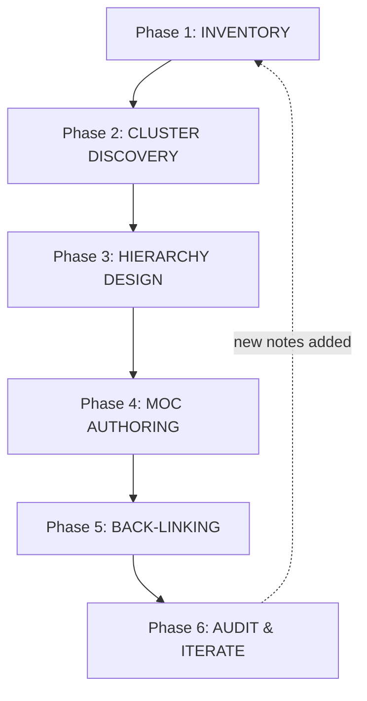

# MOC Development Workflow v1.0.0

> [!abstract] Purpose
> A repeatable, six-phase pipeline for transforming an unlinked corpus of permanent notes into a coherent, hierarchical Map of Content (MOC) network. Designed for the ~896-note inventory in [[wiki-link-permanent-note-names-2026-03-19]] but generalizes to any flat permanent-note collection.

> [!principle-point] Operating Principle
> [**MOC-Hierarchy-Principle**:: A MOC network is built **bottom-up from clusters**, not **top-down from taxonomies**. Discover the structure that exists in the notes; do not impose a structure that does not.]

[**Workflow-Domain**:: Personal knowledge base architecture, specifically the integration phase of the [[Zettelkasten-Method]] where atomic notes are connected into [[Map-of-Content]] structures.]

---

## 🗺️ Workflow Overview



[**Process-Name**:: Six-Phase MOC Pipeline — Inventory → Cluster → Hierarchy → Author → Back-Link → Audit, executed iteratively as the note corpus grows.]

---

## Phase 1 — INVENTORY

> [!what-this-does]
> Builds a structured manifest of every permanent note with extracted metadata (title, tags, domain, referenced-by-count, outlinks). This manifest is the single source of truth for clustering decisions.

### 1.1 Run the inventory script

Use the existing `99-scripts/` ecosystem. Create `99-scripts/moc_inventory.py`:

```python
"""
Inventory all permanent notes, extracting frontmatter for cluster analysis.
Output: CSV/JSON manifest consumed by Phase 2 clustering.
"""
import json
from pathlib import Path
import yaml

NOTES_DIR = Path(r"D:\10_pur3v4d3r's-vault\999-report-organizing\_permanent-notes\llm-generated-permanent-notes")
OUTPUT = Path(r"D:\10_pur3v4d3r's-vault\999-report-organizing\_maps-of-content-for-permenent-notes\_inventory.json")

def parse_frontmatter(path: Path) -> dict:
    text = path.read_text(encoding="utf-8", errors="ignore")
    if not text.startswith("---"):
        return {}
    try:
        end = text.index("\n---", 3)
        return yaml.safe_load(text[3:end]) or {}
    except (ValueError, yaml.YAMLError):
        return {}

def extract_outlinks(path: Path) -> list[str]:
    import re
    text = path.read_text(encoding="utf-8", errors="ignore")
    return re.findall(r"\[\[([^\]|#]+)", text)

manifest = []
for note in sorted(NOTES_DIR.glob("*.md")):
    fm = parse_frontmatter(note)
    manifest.append({
        "filename": note.stem,
        "wikilink": f"[[{note.stem}]]",
        "title": fm.get("title", note.stem),
        "domain": fm.get("domain"),
        "tags": fm.get("tags", []),
        "status": fm.get("status"),
        "referenced_by_count": fm.get("referenced-by-count", 0),
        "outlinks": extract_outlinks(note),
        "size_bytes": note.stat().st_size,
    })

OUTPUT.write_text(json.dumps(manifest, indent=2, ensure_ascii=False), encoding="utf-8")
print(f"Inventoried {len(manifest)} notes → {OUTPUT}")
```

### 1.2 Verify

```bash
python 99-scripts/moc_inventory.py
# Expect: ~896 entries with populated tags + domain fields
```

> [!helpful-tip]
> The existing notes already carry `domain:` and `tags:` frontmatter from the extraction pipeline. Lean on them. Do not re-classify what is already classified.

[**Phase-1-Output**:: A single JSON manifest enumerating every note with its tags, domain, reference count, and outgoing links — the substrate for all downstream clustering.]

---

## Phase 2 — CLUSTER DISCOVERY

> [!what-this-does]
> Identifies natural thematic clusters from the inventory using three complementary signals: **domain field**, **tag co-occurrence**, and **citation gravity** (referenced-by-count).

### 2.1 Three signals, three lenses

| Signal | Source | Reveals |
|--------|--------|---------|
| **Domain field** | `frontmatter.domain` | Author-assigned high-level category |
| **Tag co-occurrence** | `frontmatter.tags` array intersections | Emergent thematic affinity |
| **Citation gravity** | `referenced-by-count` ≥ threshold | Hub notes — natural MOC anchors |

### 2.2 Cluster discovery script

Create `99-scripts/moc_cluster.py`:

```python
"""
Discover clusters from inventory. Outputs candidate cluster groupings.
"""
import json
from collections import Counter, defaultdict
from pathlib import Path

INVENTORY = Path(r"D:\10_pur3v4d3r's-vault\999-report-organizing\_maps-of-content-for-permenent-notes\_inventory.json")
OUT = INVENTORY.parent / "_clusters.json"

manifest = json.loads(INVENTORY.read_text(encoding="utf-8"))

# Signal 1: Group by domain
by_domain = defaultdict(list)
for note in manifest:
    domain = note.get("domain") or "UNCATEGORIZED"
    by_domain[domain].append(note["filename"])

# Signal 2: Tag frequency (identifies dominant themes)
tag_counts = Counter()
for note in manifest:
    for tag in (note.get("tags") or []):
        tag_counts[tag] += 1

# Signal 3: Hub identification (top 5% most-referenced)
sorted_notes = sorted(manifest, key=lambda n: n.get("referenced_by_count", 0), reverse=True)
hub_threshold = max(20, sorted_notes[len(sorted_notes) // 20].get("referenced_by_count", 0))
hubs = [n for n in manifest if n.get("referenced_by_count", 0) >= hub_threshold]

result = {
    "domains": {k: v for k, v in sorted(by_domain.items(), key=lambda x: -len(x[1]))},
    "top_tags": tag_counts.most_common(50),
    "hubs": [{"filename": h["filename"], "count": h.get("referenced_by_count", 0)} for h in hubs],
    "stats": {
        "total_notes": len(manifest),
        "domains_count": len(by_domain),
        "uncategorized_count": len(by_domain.get("UNCATEGORIZED", [])),
    }
}
OUT.write_text(json.dumps(result, indent=2, ensure_ascii=False), encoding="utf-8")
print(f"Discovered {len(by_domain)} domains, {len(hubs)} hub notes → {OUT}")
```

### 2.3 Review the output

> [!important]
> Phase 2 is **diagnostic, not prescriptive**. The script proposes clusters; you (or Copilot) make the final groupings. Open `_clusters.json` and answer:
>
> 1. Which domains have ≥10 notes? → candidates for **top-level MOCs**
> 2. Which domains have 3-9 notes? → candidates for **sub-MOCs** under a parent
> 3. Which domains have <3 notes? → candidates for **merging into a related MOC**
> 4. Which hub notes appear in many other notes' outlinks? → these become **MOC entry points**

[**Cluster-Discovery-Heuristic**:: Domain field provides the skeleton; tag co-occurrence reveals cross-cutting themes that warrant Synthesis MOCs; citation gravity surfaces the hubs that anchor each MOC.]

---

## Phase 3 — HIERARCHY DESIGN

> [!what-this-does]
> Translates discovered clusters into a three-tier MOC hierarchy that mirrors the conceptual landscape of the corpus without imposing artificial structure.

### 3.1 The three-tier model

```
┌─────────────────────────────────────────────────────────┐
│ TIER 1 — DOMAIN MOCs (5-10 total)                       │
│ Broad disciplinary categories                           │
│ e.g., cognitive-science-moc, motivation-theory-moc      │
└────────────────┬────────────────────────────────────────┘
                 │
                 ▼
┌─────────────────────────────────────────────────────────┐
│ TIER 2 — SUB-DOMAIN MOCs (15-40 total)                  │
│ Coherent sub-fields within a domain                     │
│ e.g., metacognition-moc, self-determination-theory-moc  │
└────────────────┬────────────────────────────────────────┘
                 │
                 ▼
┌─────────────────────────────────────────────────────────┐
│ TIER 3 — CONCEPT-CLUSTER MOCs (variable, optional)      │
│ Tight conceptual groups requiring focused navigation    │
│ e.g., flavell-metacognitive-framework-moc               │
└─────────────────────────────────────────────────────────┘
```

### 3.2 Proposed Tier-1 MOCs for *this* corpus

Based on the inventory of ~896 notes, the following Tier-1 MOCs are warranted:

| Tier-1 MOC | Estimated Notes | Anchor Concepts |
|------------|----------------|-----------------|
| `cognitive-science-moc` | ~150 | [[cognitive-psychology]], [[working-memory]], [[Cognitive-Load-Theory]], [[dual-process-theory]] |
| `metacognition-moc` | ~100 | [[Flavell's-Metacognitive-Framework]], [[Nelson-and-Narens]], [[metacognitive-monitoring]] |
| `self-regulated-learning-moc` | ~80 | [[Zimmerman's-Cyclical-Model-of-Self-Regulated-Learning]], [[Winne's-information-processing-model]], [[forethought-phase]] |
| `motivation-theory-moc` | ~120 | [[Self-Determination-Theory]], [[achievement-goal-theory]], [[expectancy-value-theory]], [[Social-Cognitive-Theory-—-Bandura]] |
| `learning-strategies-moc` | ~70 | [[Active-Recall]], [[Spaced-Repetition]], [[Interleaving-Practice]], [[deliberate-practice]] |
| `reading-and-comprehension-moc` | ~40 | [[reading-comprehension]], [[construction-integration-model]], [[Shanahan-disciplinary-literacy]] |
| `pkm-and-knowledge-systems-moc` | ~60 | [[personal-knowledge-management]], [[Zettelkasten-Method]], [[Building-a-Second-Brain]], [[Evergreen-Notes]] |
| `software-engineering-moc` | ~50 | [[Python]], [[vs-code]], [[Test-Driven-Development]], [[Software-Architecture]] |
| `ai-and-llm-tooling-moc` | ~40 | [[Large-Language-Model]], [[AI-Agents]], [[Claude-Code]], [[Retrieval-Augmented-Generation-RAG]] |
| `researchers-and-theorists-moc` | ~80 | Person notes ([[albert-bandura]], [[john-flavell]], [[carol-dweck]], etc.) |
| `synthesis-and-original-work-moc` | ~10 | Notes prefixed `original-synthesis-*` |

### 3.3 Tier-2 examples (children of Tier-1)

Under `motivation-theory-moc`:
- `self-determination-theory-moc` — SDT-specific cluster (~30 notes)
- `achievement-goal-theory-moc` — AGT cluster (~20 notes)
- `attribution-theory-moc` — Weiner-tradition cluster (~15 notes)
- `mindset-and-implicit-theories-moc` — Dweck cluster (~10 notes)

Under `metacognition-moc`:
- `metacognitive-monitoring-moc` — JOL/FOK/calibration (~25 notes)
- `metacognitive-control-moc` — strategy selection, regulation (~20 notes)
- `flavell-framework-moc` — declarative/procedural/conditional (~15 notes)

> [!warning]
> Do not create Tier-3 MOCs prematurely. Build Tier-1 + Tier-2 first, then promote a concept cluster to Tier-3 only when navigation actually demands it (≥15 tightly-bound notes that share no other natural home).

[**Hierarchy-Design-Rule**:: Three tiers maximum. Each MOC must justify its existence by aggregating ≥10 notes OR serving as an essential bridge. MOCs with <5 children should be merged upward.]

---

## Phase 4 — MOC AUTHORING

> [!what-this-does]
> Produces each MOC file using a standardized template that satisfies vault formatting protocols (frontmatter, callouts, wiki-link density, expansion section).

### 4.1 MOC file template

Save as `99-scripts/templates/moc-template.md` and adapt per MOC:

```markdown
---
title: <Domain Name> MOC
aliases:
  - <Domain> Map
  - <Domain> Index
  - <Domain> Hub
created: {{date:YYYY-MM-DD}}
modified: {{date:YYYY-MM-DD}}
status: evergreen
type: moc
tags:
  - <primary-domain-tag>
  - moc
  - knowledge-hub
parent-moc: [[parent-moc-name]]   # omit if Tier-1
child-mocs:
  - [[child-moc-1]]
  - [[child-moc-2]]
---

# <Domain Name> MOC

> [!abstract] Scope
> Single-paragraph definition of what this MOC covers and what it explicitly does NOT cover (its boundaries with sibling MOCs).

> [!principle-point] Organizing Principle
> The conceptual axis along which this MOC organizes its child notes.

---

## 🎯 Core Concepts
*The 5-8 highest-leverage notes — read these first to understand the domain.*

- [[Hub-Note-1]] — One-line description
- [[Hub-Note-2]] — One-line description
- [[Hub-Note-3]] — One-line description

## 📚 Foundational Theory
*Theoretical frameworks and seminal models.*

- [[Framework-1]]
- [[Framework-2]]

## 👥 Key Theorists
*Person notes for primary contributors to this domain.*

- [[Theorist-1]]
- [[Theorist-2]]

## 🧩 Sub-Topics
*Tier-2 MOCs nested under this domain.*

- [[Sub-MOC-1]]
- [[Sub-MOC-2]]

## 🔧 Applied Concepts
*Notes covering practical application, methods, instruments.*

- [[Applied-Note-1]]
- [[Applied-Note-2]]

## 🌐 Cross-Domain Connections
*Bridges to sibling MOCs.*

- [[Adjacent-MOC-1]] — How they connect
- [[Adjacent-MOC-2]] — How they connect

## 📖 All Notes in This Domain (Auto-Generated)

```dataview
TABLE 
  status,
  referenced-by-count as "Refs"
FROM "999-report-organizing/_permanent-notes/llm-generated-permanent-notes"
WHERE domain = "<domain-value>"
SORT referenced-by-count DESC
```

---

# 🔗 Related Topics for PKB Expansion

## 🎯 Core Extensions
1. **[[Adjacent Domain 1]]** — Connection · Depth Potential · Knowledge Graph Role · Priority

## 🌐 Cross-Domain Connections
2. **[[Adjacent Domain 2]]** — Connection rationale

## 📚 Foundational Prerequisites
- **[[Prerequisite]]** — Why this foundation matters

## 🛠️ Practical Applications
- **[[Application]]** — How concepts apply
```

### 4.2 Authoring sequence

> [!how-to] Build order
> 1. **Tier-1 MOCs first** — establish the skeleton (11 files for this corpus)
> 2. **Tier-2 MOCs next** — under their Tier-1 parents
> 3. **Tier-3 MOCs last** — only where genuinely needed
> 4. **Wiki-link consistency** — every link must match a filename in [[wiki-link-permanent-note-names-2026-03-19]]
> 5. **Bidirectional declaration** — Tier-1 declares its `child-mocs`; Tier-2 declares its `parent-moc`

### 4.3 Wiki-link verification

Before saving each MOC:

```bash
# Validate every wiki-link in the new MOC resolves to a real note
python 99-scripts/link_check.py "999-report-organizing/_maps-of-content-for-permenent-notes/<new-moc>.md"
```

[**MOC-Authoring-Standard**:: Each MOC file must include: scope statement, organizing principle, core/foundational/applied sections, parent/child declarations, a Dataview block listing all member notes by domain, and a cross-domain connections section.]

---

## Phase 5 — BACK-LINKING

> [!what-this-does]
> Adds reciprocal links from member notes back to their parent MOC, transforming the MOC from a one-way index into a true graph hub.

### 5.1 The reciprocity requirement

> [!key-claim]
> A MOC that is not back-linked is a **dead-end index**. The vault graph view will not surface it as a hub. Each member note must declare its parent MOC in frontmatter.

### 5.2 Back-link script

Create `99-scripts/moc_backlink.py`:

```python
"""
For each MOC, add 'parent-moc' field to every note linked from that MOC.
Idempotent — safe to re-run.
"""
import re
from pathlib import Path
import yaml

VAULT = Path(r"D:\10_pur3v4d3r's-vault")
MOC_DIR = VAULT / "999-report-organizing" / "_maps-of-content-for-permenent-notes"
NOTES_DIR = VAULT / "999-report-organizing" / "_permanent-notes" / "llm-generated-permanent-notes"

def extract_links(text: str) -> set[str]:
    return set(re.findall(r"\[\[([^\]|#]+)", text))

def add_parent_moc(note_path: Path, moc_name: str) -> bool:
    text = note_path.read_text(encoding="utf-8")
    if not text.startswith("---"):
        return False
    end = text.index("\n---", 3)
    fm = yaml.safe_load(text[3:end]) or {}
    parents = fm.get("parent-moc", [])
    if isinstance(parents, str):
        parents = [parents]
    link = f"[[{moc_name}]]"
    if link in parents:
        return False
    parents.append(link)
    fm["parent-moc"] = parents
    new_fm = yaml.safe_dump(fm, sort_keys=False, allow_unicode=True)
    note_path.write_text(f"---\n{new_fm}---{text[end+4:]}", encoding="utf-8")
    return True

for moc in MOC_DIR.glob("*-moc.md"):
    if moc.name.startswith("_"):
        continue
    links = extract_links(moc.read_text(encoding="utf-8"))
    updated = 0
    for link in links:
        target = NOTES_DIR / f"{link}.md"
        if target.exists() and add_parent_moc(target, moc.stem):
            updated += 1
    print(f"{moc.stem}: back-linked {updated} notes")
```

### 5.3 Verification

After running back-link:

```dataview
LIST
FROM "999-report-organizing/_permanent-notes/llm-generated-permanent-notes"
WHERE !parent-moc
```

This query lists notes still orphaned from the MOC structure. **Goal: list shrinks to zero** (or to a documented exclusion set).

[**Back-Link-Invariant**:: Every note appearing in a MOC's body must have that MOC's wiki-link in its `parent-moc` frontmatter field. Run `moc_backlink.py` after every MOC authoring session.]

---

## Phase 6 — AUDIT & ITERATE

> [!what-this-does]
> Closes the loop: measures graph health, identifies remaining gaps, and feeds findings back into Phase 1 for the next iteration.

### 6.1 Audit metrics

Run the existing diagnostic scripts (per [[CLAUDE]] tool inventory):

```bash
# Identify remaining orphans
python 99-scripts/orphan_check.py

# Verify no broken wiki-links in MOCs
python 99-scripts/link_check.py "999-report-organizing/_maps-of-content-for-permenent-notes/"

# Confirm metadata compliance on new MOC files
python 99-scripts/meta_audit.py "999-report-organizing/_maps-of-content-for-permenent-notes/"
```

### 6.2 Health benchmarks

| Metric | Target | Action if Failed |
|--------|--------|------------------|
| Notes without `parent-moc` | <5% | Re-run Phase 5 OR identify unclassifiable notes for new MOC |
| Broken wiki-links in MOCs | 0 | Cross-reference against `wiki-link-permanent-note-names-*.md` |
| Tier-1 MOCs with <10 children | 0 | Merge upward |
| MOCs with >100 direct children | 0 | Split into Tier-2 sub-MOCs |
| Average note degree (in+out links) | ≥4 | Add cross-domain connections |

### 6.3 Iteration triggers

Re-run the entire workflow when:
- ≥50 new permanent notes have been added since last MOC build
- A new domain emerges that no existing Tier-1 MOC covers
- Audit shows >10% orphan ratio
- Quarterly review (calendar-driven)

[**Audit-and-Iterate-Cadence**:: After each MOC authoring session run all three diagnostic scripts. Quarterly, re-run the full Phase 1-6 pipeline against the current note corpus.]

---

## 🧰 Workflow Quick-Reference

| Phase | Action | Script | Output |
|-------|--------|--------|--------|
| 1 | Inventory | `moc_inventory.py` | `_inventory.json` |
| 2 | Cluster | `moc_cluster.py` | `_clusters.json` |
| 3 | Hierarchy | manual + design | this document's Tier table |
| 4 | Authoring | template + manual | `<domain>-moc.md` files |
| 5 | Back-link | `moc_backlink.py` | `parent-moc` frontmatter on notes |
| 6 | Audit | `orphan_check.py`, `link_check.py`, `meta_audit.py` | health report |

---

## ⚠️ Anti-Patterns to Avoid

> [!danger] Critical Failure Modes
> - **Top-down taxonomy imposition** — designing the MOC hierarchy *before* inventorying the actual notes produces categories that don't fit the corpus
> - **Over-nesting** — Tier-4+ MOCs create navigation friction; flatten or merge
> - **Single-membership rigidity** — a note can legitimately belong to multiple MOCs (e.g., [[albert-bandura]] belongs in both `researchers-moc` and `motivation-theory-moc`)
> - **Skipping back-linking** — MOCs without reciprocal links are invisible to graph view
> - **Manually copy-pasting links** — use Dataview blocks for membership lists; they self-update as new notes arrive

[**Common-Pitfall**:: The most frequent MOC failure is treating the MOC as a static folder-equivalent. A MOC is a living query — author it with Dataview blocks so new domain-tagged notes appear automatically without manual maintenance.]

---

# 🔗 Related Topics for PKB Expansion

## 🎯 Core Extensions

1. **[[Map-of-Content]]**
   - **Connection**: Foundational concept this workflow operationalizes
   - **Depth Potential**: Theoretical grounding for why MOCs work as cognitive scaffolds
   - **Knowledge Graph Role**: Hub — every MOC file should link to this concept
   - **Priority**: High — required reading before executing this workflow

2. **[[Zettelkasten-Method]]**
   - **Connection**: Provides the philosophical basis for atomic-note + MOC architecture
   - **Depth Potential**: Luhmann's original Folgezettel vs. modern MOC-based approaches
   - **Knowledge Graph Role**: Bridge between PKM theory and Obsidian practice
   - **Priority**: High

## 🌐 Cross-Domain Connections

3. **[[Knowledge-Graph]]**
   - **Connection**: Computational substrate that MOCs surface and shape
   - **Depth Potential**: Graph centrality metrics for identifying MOC candidates
   - **Knowledge Graph Role**: Theoretical foundation for Phase 6 audit metrics
   - **Priority**: Medium

4. **[[Information-Architecture]]**
   - **Connection**: Discipline addressing analogous problems at web/app scale
   - **Depth Potential**: Card-sorting and tree-testing methodologies transfer to MOC design
   - **Knowledge Graph Role**: Cross-domain analog from UX to PKM
   - **Priority**: Medium

## 📚 Foundational Prerequisites

- **[[personal-knowledge-management]]** — The container discipline this workflow serves
- **[[Evergreen-Notes]]** — The note-quality standard that makes MOC construction worthwhile
- **[[Dataview]]** — The plugin that makes auto-updating MOC bodies possible

## 🛠️ Practical Applications

- **[[PKB-Automation]]** — Scripts and macros that extend this workflow
- **[[Obsidian-Automation]]** — Plugin synergies (Templater + Dataview + QuickAdd) for MOC maintenance

## 🔄 Related MOCs

- **[[pkb-and-llm-integration-moc]]** — Existing MOC; this workflow could feed into it
- **[[cognitive-science-moc]]** — Existing Tier-1 MOC; will be expanded by this workflow
