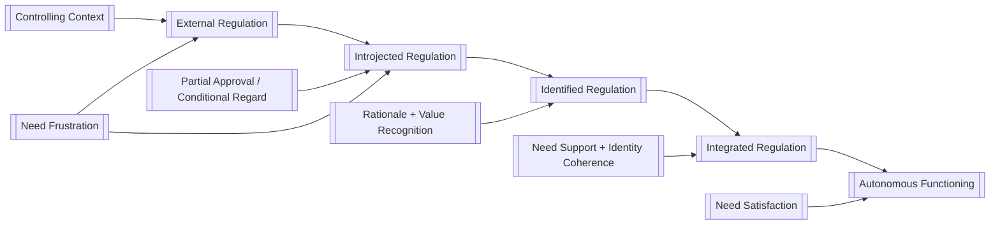

---
# ═══════════════════════════════════════════════════════════════════════════
# CORE IDENTITY
# ═══════════════════════════════════════════════════════════════════════════
title: "A Foundational Report on Self-Determination Theory"
aliases:
  - "SDT Foundational Report"
  - "Foundations of Self-Determination Theory"
  - "Self-Determination Theory Overview"
type: permanent-note
status: evergreen
confidence: high

# ═══════════════════════════════════════════════════════════════════════════
# CLASSIFICATION
# ═══════════════════════════════════════════════════════════════════════════
tags:
  - permanent-note
  - foundational-report
  - academic-synthesis
  - psychology/motivation
  - educational-psychology/motivation
  - positive-psychology/well-being
  - organizational-psychology/work-motivation
  - empirical-research
  - theoretical-synthesis
  - practical-application
  - self-determination-theory
  - intrinsic-motivation
  - basic-psychological-needs
  - autonomy-support
  - evergreen
  - comprehensive
  - research-grounded

domain: "psychology"
subdomains:
  - "motivation"
  - "well-being"
  - "development"
  - "education"
  - "work and organizations"

# ═══════════════════════════════════════════════════════════════════════════
# TEMPORAL
# ═══════════════════════════════════════════════════════════════════════════
created: "2026-03-25"
updated: "2026-03-25"

# ═══════════════════════════════════════════════════════════════════════════
# ACADEMIC METADATA
# ═══════════════════════════════════════════════════════════════════════════
source-type: academic-synthesis
research-base: "mixed-methods"
evidence-quality: "high"
peer-validation: "multiple-frameworks"

key-frameworks:
  - name: "Self-Determination Theory"
    description: "A macro-theory of human motivation, development, and wellness centered on motivation quality and basic psychological needs."
    developers: "Edward L. Deci and Richard M. Ryan (1970s onward)"
    validation: "Extensively supported across experimental, correlational, longitudinal, intervention, and meta-analytic research"
  - name: "Cognitive Evaluation Theory"
    description: "Explains how social contexts support or undermine intrinsic motivation, especially through autonomy and competence."
    developers: "Edward L. Deci and Richard M. Ryan"
    validation: "Strong classical and contemporary support"
  - name: "Organismic Integration Theory"
    description: "Explains how forms of extrinsic motivation differ in autonomy depending on the degree of internalization."
    developers: "Edward L. Deci and Richard M. Ryan"
    validation: "Strong support across education, health, and work"
  - name: "Basic Psychological Needs Theory"
    description: "Specifies the needs for autonomy, competence, and relatedness as essential nutrients for growth, wellness, and internalization."
    developers: "Edward L. Deci and Richard M. Ryan"
    validation: "Strong cross-domain and increasingly cross-cultural support"
  - name: "Goal Contents Theory"
    description: "Distinguishes intrinsic versus extrinsic life goals and their differing implications for need satisfaction and well-being."
    developers: "Richard M. Ryan and Edward L. Deci"
    validation: "Substantial support with ongoing refinement"

key-researchers:
  - "Edward L. Deci"
  - "Richard M. Ryan"
  - "Maarten Vansteenkiste"
  - "Johnmarshall Reeve"
  - "Nikos Ntoumanis"
  - "Christopher P. Niemiec"

# ═══════════════════════════════════════════════════════════════════════════
# CONTENT CHARACTERISTICS
# ═══════════════════════════════════════════════════════════════════════════
word-count: "11556"
complexity-level: "foundational"
target-audience: "An intelligent adult seeking rigorous conceptual grounding without assumed specialist training in motivation science."
depth-level: comprehensive
treatment-type: foundational-encyclopedic

# ═══════════════════════════════════════════════════════════════════════════
# CORE CONCEPTS
# ═══════════════════════════════════════════════════════════════════════════
core-concepts:
  - "Self-Determination Theory"
  - "Intrinsic Motivation"
  - "Extrinsic Motivation"
  - "Autonomous Motivation"
  - "Controlled Motivation"
  - "Basic Psychological Needs"
  - "Autonomy Support"
  - "Internalization"

key-distinctions:
  - "Autonomy vs Independence"
  - "Intrinsic Motivation vs Autonomous Extrinsic Motivation"
  - "Need Dissatisfaction vs Need Frustration"
  - "Quantity of Motivation vs Quality of Motivation"

# ═══════════════════════════════════════════════════════════════════════════
# RELATIONSHIPS
# ═══════════════════════════════════════════════════════════════════════════
prerequisites:
  - "[[Motivation]]"
  - "[[Well-Being]]"
  - "[[Humanistic Psychology]]"

related:
  - "[[Intrinsic Motivation]]"
  - "[[Extrinsic Motivation]]"
  - "[[Autonomy]]"
  - "[[Competence]]"
  - "[[Relatedness]]"
  - "[[Internalization]]"
  - "[[Psychological Needs]]"
  - "[[Eudaimonic Well-Being]]"

broader:
  - "[[Motivation Science]]"
  - "[[Personality Psychology]]"
  - "[[Developmental Psychology]]"

narrower:
  - "[[Cognitive Evaluation Theory]]"
  - "[[Organismic Integration Theory]]"
  - "[[Basic Psychological Needs Theory]]"
  - "[[Goal Contents Theory]]"
  - "[[Causality Orientations Theory]]"
  - "[[Relationships Motivation Theory]]"

see-also:
  - "[[Expectancy-Value Theory]]"
  - "[[Self-Efficacy Theory]]"
  - "[[Achievement Goal Theory]]"
  - "[[Flow Theory]]"
  - "[[Motivational Interviewing]]"

contrasts-with:
  - "[[Behaviorism]]"
  - "[[Drive Reduction Theory]]"
  - "[[Pure Incentive Models]]"

applied-in:
  - "[[Education]]"
  - "[[Healthcare]]"
  - "[[Workplace Motivation]]"
  - "[[Parenting]]"
  - "[[Coaching]]"
  - "[[Psychotherapy]]"

# ═══════════════════════════════════════════════════════════════════════════
# LEARNING PATHWAYS
# ═══════════════════════════════════════════════════════════════════════════
builds-on:
  - "[[Motivation]]"
  - "[[Agency]]"
  - "[[Social Context]]"

enables:
  - "[[Autonomy-Supportive Teaching]]"
  - "[[Behavior Change]]"
  - "[[Motivation Measurement]]"
  - "[[Human Flourishing]]"

expansion-topics:
  - topic: "[[Basic Psychological Needs Theory]]"
    description: "Expands the needs model into a dedicated analysis of need satisfaction, frustration, universality, and measurement."
    priority: "high"
  - topic: "[[Organismic Integration Theory]]"
    description: "Develops the internalization continuum in much greater detail."
    priority: "high"
  - topic: "[[Autonomy-Supportive Teaching]]"
    description: "Translates SDT into educational design and pedagogy."
    priority: "high"
  - topic: "[[SDT and Health Behavior Change]]"
    description: "Focuses on intervention design, adherence, and maintenance."
    priority: "medium"
  - topic: "[[Goal Contents Theory]]"
    description: "Examines intrinsic versus extrinsic aspirations and their life outcomes."
    priority: "medium"
  - topic: "[[Self-Determination Theory and AI Learning Environments]]"
    description: "Explores how digital systems can support or thwart autonomy, competence, and relatedness."
    priority: "exploratory"

# ═══════════════════════════════════════════════════════════════════════════
# QUALITY INDICATORS
# ═══════════════════════════════════════════════════════════════════════════
empirical-support:
  - "Classical intrinsic motivation experiments and reward meta-analysis"
  - "Cross-domain meta-analytic syntheses in education, health, and work"
  - "Cross-cultural need satisfaction and well-being studies"

limitations-noted:
  - "Cross-cultural generalization remains stronger in some domains than others"
  - "Measurement is often based on self-report and context-bound instruments"
  - "Translating theory into durable institutional practice remains uneven"

# ═══════════════════════════════════════════════════════════════════════════
# DOCUMENT STRUCTURE
# ═══════════════════════════════════════════════════════════════════════════
sections:
  - "Phase I: Orientation & Context Setting"
  - "Phase II: Conceptual Foundations"
  - "Phase III: Theoretical Landscape"
  - "Phase IV: Mechanisms & Processes"
  - "Phase V: Applications, Implications & Limitations"
  - "Phase VI: Synthesis & Integration"
  - "Phase VII: Appendix"

document-features:
  callouts: "95"
  wiki-links: "124"
  reflective-questions: "15"
  active-reading-prompts: "6"
  spaced-repetition-seeds: "12"
  appendix-subsections-included: "1,2,3,4,5,6,7,8,9,10,11,12"

# ═══════════════════════════════════════════════════════════════════════════
# PERSONAL KNOWLEDGE MANAGEMENT
# ═══════════════════════════════════════════════════════════════════════════
review-frequency: quarterly
mastery-stage: budding
importance: high
foundational-for-future-learning: true

# ═══════════════════════════════════════════════════════════════════════════
# SOURCE & GENERATION
# ═══════════════════════════════════════════════════════════════════════════
source: "User-supplied report architecture + GPT-5.4 Thinking literature synthesis"
generation-prompt: "[[foundational-report-generator-v1-0-0]]"
generation-date: "2026-03-25"
---

# A Foundational Report on [[Self-Determination Theory]]

## Phase I: Orientation & Context Setting

Why do some people throw themselves into difficult work with energy, curiosity, and persistence, while others do the bare minimum under pressure and feel depleted by the same task? Why can one student experience school as an arena of growth while another experiences it as a machine of compliance? Why does a patient sometimes sustain a health change for years when the exact same advice, delivered differently, fails in another case? [[Self-Determination Theory]]—usually abbreviated as [[Self-Determination Theory|SDT]]—exists because those questions cannot be answered well by treating motivation as a simple matter of “more” or “less.” Its central wager is that the *quality* of motivation matters as much as, and often more than, the quantity.

At first glance, SDT can look deceptively simple. People often hear that it is “the theory about autonomy, competence, and relatedness,” or “the theory that says intrinsic motivation is good.” Both descriptions are incomplete. SDT is better understood as a broad [[Motivation Science|motivation science]] framework that attempts to explain how human beings regulate action, how social environments shape that regulation, and why some forms of motivation nourish [[Well-Being]] while others produce brittle performance, exhaustion, or alienation. It is simultaneously a theory of [[Intrinsic Motivation]], a theory of [[Internalization]], a theory of [[Psychological Needs]], and a theory of how environments foster either growth or defensive adaptation.

> [!ask-yourself-this] **Before You Begin**
> Before reading further, write down what you currently believe about motivation. Do you assume that rewards reliably increase effort? Do you equate [[Autonomy]] with independence or freedom from all constraints? Do you treat high performance as evidence of healthy motivation? These assumptions matter, because SDT challenges all three.

This report is intentionally foundational. It covers the conceptual bedrock of SDT, the historical development of the framework, its major mini-theories, its core mechanisms, and its applications across [[Education]], [[Healthcare]], [[Workplace Motivation]], [[Parenting]], and [[Psychotherapy]]. It does **not** attempt a complete specialist review of every subfield, scale, or intervention literature. Instead, it aims to give you the kind of deep structural understanding that makes later specialized reading easier and more coherent.

For the reader, the most important orientation is this: SDT is not merely a “pro-autonomy” moral philosophy dressed up as psychology. It is an empirically elaborated organismic theory. That means it starts with a substantive picture of human beings as active, growth-oriented organisms whose functioning depends on recurring exchanges with the social world. In other words, people are neither blank slates mechanically conditioned from the outside nor completely self-sufficient agents creating themselves from nothing. They are proactive, but vulnerable; naturally oriented toward growth, but highly shaped by the conditions under which they live.

The report unfolds in six movements after this introduction. First, we establish definitions and historical origins. Second, we map the theoretical architecture and the six mini-theories that together make SDT a macro-theory rather than a narrow hypothesis. Third, we examine the mechanisms through which social conditions become lived motivation. Fourth, we translate those mechanisms into applied domains and confront the limits of current evidence. Finally, we synthesize the whole framework and embed it into a broader [[knowledge graph]] suitable for a growing PKB.

## Phase II: Conceptual Foundations

The core intellectual contribution of SDT begins with a rejection of a deeply entrenched simplification: the idea that motivation is best understood as a single amount, like fuel in a tank. In older motivational models, the guiding question is often “How can we get people to do more?” In SDT, the more revealing question is “*Why* are they doing it, and how is that reason organized within the self?” This shift from amount to organization is the theory’s first major conceptual move.

> [!definition] **[[Self-Determination Theory]] ([[Edward L. Deci]] and [[Richard M. Ryan]])**
> [[Self-Determination Theory]] is a macro-theory of human motivation, personality development, and wellness that explains how social environments support or undermine optimal functioning by shaping the satisfaction or frustration of the basic psychological needs for [[Autonomy]], [[Competence]], and [[Relatedness]].
>
> **Boundary:** SDT is not merely a theory of “free choice,” nor is it reducible to the claim that intrinsic motivation is always present or always sufficient.
>
> **Operational Indicator:** SDT is in play whenever motivation is analyzed in terms of its quality, its degree of internalization, and the contextual supports or obstacles that shape it.
>
> **See also:** [[Motivation Science]], [[Basic Psychological Needs Theory]], [[Organismic Integration Theory]]

> [!definition] **[[Intrinsic Motivation]] ([[Cognitive Evaluation Theory]])**
> [[Intrinsic Motivation]] refers to engaging in an activity because the activity itself is interesting, satisfying, or inherently rewarding. The behavior is not merely instrumental to some separable outcome; it is enacted “for its own sake.”
>
> **Boundary:** Intrinsic motivation is not the same as enjoying all tasks, nor is it equivalent to high effort. A person can work hard for controlled reasons without being intrinsically motivated.
>
> **Operational Indicator:** Curiosity, spontaneous engagement, persistence without surveillance, and enjoyment during activity are common markers.
>
> **See also:** [[Cognitive Evaluation Theory]], [[Interest]], [[Play]]

> [!definition] **[[Extrinsic Motivation]] ([[Organismic Integration Theory]])**
> [[Extrinsic Motivation]] refers to engaging in an activity as a means to an outcome separable from the activity itself. In SDT, extrinsic motivation is not treated as a single thing but as a family of regulations that differ in how fully they have been internalized.
>
> **Boundary:** Extrinsic motivation is not automatically low quality. Some extrinsic motives are controlled, while others are highly self-endorsed and deeply integrated.
>
> **Operational Indicator:** The person can answer “What is this for?” more easily than “Why is this inherently enjoyable?”
>
> **See also:** [[Organismic Integration Theory]], [[Internalization]], [[Autonomous Motivation]]

> [!definition] **[[Autonomy]] ([[Basic Psychological Needs Theory]])**
> [[Autonomy]] in SDT means experiencing oneself as the origin or author of one’s action. It concerns volition and self-endorsement, not isolation. A person is autonomous when their action feels psychologically owned.
>
> **Boundary:** Autonomy is **not** identical to independence, individualism, or absence of structure. One can autonomously depend on others, follow guidance, or accept limits.
>
> **Operational Indicator:** The person experiences “I am doing this because I genuinely endorse it,” even when the action is socially guided or constrained.
>
> **See also:** [[Autonomy Support]], [[Agency]], [[Autonomy vs Independence]]

> [!definition] **[[Competence]] ([[Basic Psychological Needs Theory]])**
> [[Competence]] is the felt sense of effectiveness, mastery, and capacity to meet challenges and produce valued outcomes. It is not mere confidence; it is the experience of being able to act effectively in a given domain.
>
> **Boundary:** Competence is not domination, superiority, or perfection. It is also not reducible to objective skill independent of lived experience.
>
> **Operational Indicator:** Feeling capable, appropriately challenged, and able to improve through feedback and practice.
>
> **See also:** [[Mastery]], [[Feedback]], [[Skill Development]]

> [!definition] **[[Relatedness]] ([[Basic Psychological Needs Theory]])**
> [[Relatedness]] is the need to feel connected to, cared for by, and significant to others. It concerns belonging and mutual regard rather than mere social contact.
>
> **Boundary:** Relatedness is not popularity, constant proximity, or emotional fusion. One can be socially busy yet profoundly low in relatedness.
>
> **Operational Indicator:** The person feels respected, welcomed, and meaningfully connected in a social context.
>
> **See also:** [[Belonging]], [[Attachment]], [[Relationships Motivation Theory]]

> [!definition] **[[Internalization]] ([[Organismic Integration Theory]])**
> [[Internalization]] is the process through which external values, norms, or regulations are gradually taken in and transformed into personally endorsed forms of self-regulation.
>
> **Boundary:** Internalization does not mean passive copying. Nor does it guarantee full integration; some regulations are only partially assimilated and remain pressuring.
>
> **Operational Indicator:** The person shifts from “I have to” toward “I accept why this matters” and potentially toward “This fits who I am.”
>
> **See also:** [[Identified Regulation]], [[Integrated Regulation]], [[Self-Regulation]]

> [!definition] **[[Need Frustration]] ([[Basic Psychological Needs Theory]])**
> [[Need Frustration]] refers to the active thwarting or obstruction of psychological needs, not merely their low satisfaction. It indicates experiences such as coercion, incompetence, exclusion, humiliation, or conditional regard.
>
> **Boundary:** Low need satisfaction is not automatically need frustration. A task may be unstimulating without being coercive; a day may be socially quiet without being rejecting.
>
> **Operational Indicator:** The person feels pressured rather than volitional, ineffective rather than challenged, or isolated rather than connected.
>
> **See also:** [[Need Satisfaction]], [[Ill-Being]], [[Psychological Control]]

Historically, SDT did not appear fully formed. Its earliest roots lie in [[Edward L. Deci]]’s experimental work on intrinsic motivation in the early 1970s. Those studies became influential because they challenged the common assumption that external rewards straightforwardly strengthen motivation. Under certain conditions, especially when rewards were experienced as controlling, they appeared to *undermine* people’s intrinsic interest. This was not merely a quirky laboratory finding. It hinted at a larger principle: the meaning of a reward matters because the person interprets it through an experience of being either controlled or supported.

> [!key-claim] **Foundational Proposition**
> SDT’s earliest breakthrough was not “rewards are bad.” It was the more precise claim that social events have motivational consequences depending on how they affect people’s experience of [[Autonomy]] and [[Competence]].

That early line of work developed into [[Cognitive Evaluation Theory]], which focused on the environmental conditions that enhance or diminish intrinsic motivation. Over time, however, the theory faced a problem that could not be solved by studying intrinsic motivation alone: much of human life is not intrinsically enjoyable, yet people often carry out difficult, delayed, or effortful tasks with genuine commitment. This forced a broader question. How do people come to value what is initially external?

The answer opened the path to [[Organismic Integration Theory]], which elaborated a continuum of extrinsic regulations. Meanwhile, work on the role of [[Autonomy]], [[Competence]], and [[Relatedness]] crystallized into [[Basic Psychological Needs Theory]]. Research then continued outward, incorporating individual differences in motivational style, the content of life goals, and the structure of close relationships. By the late 2010s, SDT had become not one theory but a coordinated family of six mini-theories nested within a common organismic metatheory.

> [!insight] **The Genealogical Arc**
> The historical growth of SDT follows a revealing pattern: it began with a narrow puzzle about rewards and intrinsic interest, then expanded by repeatedly asking what kind of person and what kind of environment would make the observed effects intelligible. That is why SDT feels unusually coherent for a large theory—it grew “brick by brick,” not by stitching together unrelated findings.

The field’s development also depends on several foundational distinctions. The first is **[[Autonomy]] versus independence**. SDT uses autonomy to mean volition, not self-sufficiency. A child can autonomously accept help; an adult can independently comply with an external demand while still feeling internally coerced. The second is **intrinsic motivation versus autonomous extrinsic motivation**. These are not identical. A person may not enjoy flossing, training, or studying tax law for its own sake, yet still endorse it in a reflective, self-determined way. The third is **need dissatisfaction versus need frustration**. This distinction matters because ill-being is not caused only by the absence of support, but often by the active presence of thwarting conditions.

> [!ask-yourself-this] **Conceptual Stress Test**
> Consider a demanding activity in your own life that you do not find inherently enjoyable, yet still regard as deeply worth doing. Is your motivation non-autonomous simply because it is not intrinsic? Or is it possible that the activity is extrinsically motivated but highly self-endorsed?

> [!reflection] **Deepening Your Understanding**
> 1. Which definition most strongly challenged your prior intuition: [[Autonomy]], [[Intrinsic Motivation]], or [[Need Frustration]]?
> 2. Why is it theoretically important that SDT distinguishes the *quality* of motivation from the *amount* of motivation?
> 3. Which foundational distinction—autonomy versus independence, intrinsic versus autonomous extrinsic motivation, or dissatisfaction versus frustration—seems most explanatory for later sections?

## Phase III: Theoretical Landscape

To understand SDT properly, one has to think on two levels at once. At the highest level, SDT is a **macro-theory**: a broad framework about human beings as active organisms oriented toward growth, integration, and wellness under supportive conditions. At the more fine-grained level, SDT is composed of six interrelated mini-theories, each explaining a particular class of phenomena. The power of the framework lies precisely in this dual structure. It is broad enough to organize diverse findings, but segmented enough to remain analytically useful.

### The Organismic Metatheory

The metatheoretical backdrop of SDT is sometimes described as **organismic** because it assumes that human beings possess endogenous tendencies toward exploration, mastery, integration, and connection. This is a crucial point. SDT does not claim that people inevitably flourish. It claims that growth tendencies are native but conditional. Environments can either support those tendencies or derail them into passivity, fragmentation, compliance, or defensiveness.

> [!key-claim] **Metatheoretical Core**
> Human beings are naturally active and growth-oriented, but these tendencies require supportive social and material conditions to become stable patterns of functioning.

This metatheory sharply differentiates SDT from models that reduce motivation to reward histories, external incentives, or mere expectancy calculations. It also differentiates SDT from naive optimism. Organismic does **not** mean “people will always self-actualize if left alone.” In SDT, neglect can be as damaging as overt control, because growth depends on real psychological nutrients.

### The Six Mini-Theories

#### 1. [[Cognitive Evaluation Theory]]

[[Cognitive Evaluation Theory]] (CET) explains intrinsic motivation and the ways social contexts either sustain or undermine it. Classical CET findings revolve around how rewards, deadlines, evaluations, surveillance, and feedback alter a person’s felt autonomy and competence. The crucial principle is interpretive: the same external event can function informationally or controllingly. Informational feedback can strengthen competence and enhance intrinsic motivation. Controlling rewards can shift the perceived locus of causality outward and reduce intrinsic engagement.

> [!key-claim] **CET Proposition**
> Intrinsic motivation is most robust when people feel both volitional and effectively challenged; it is undermined when activities become experienced as instruments of external control.

#### 2. [[Organismic Integration Theory]]

[[Organismic Integration Theory]] (OIT) expands the field beyond intrinsic motivation by explaining different forms of extrinsic regulation. The continuum is not binary but graded: [[External Regulation]], [[Introjected Regulation]], [[Identified Regulation]], and [[Integrated Regulation]]. What changes across the continuum is not whether behavior is goal-directed, but whether the regulation is experienced as alien, pressuring, accepted, or fully assimilated.

This is one of SDT’s most important theoretical moves, because it dissolves the simplistic opposition between “intrinsic good, extrinsic bad.” Much of adulthood depends on well-internalized forms of extrinsic motivation. The theory’s claim is that *how* external motives are internalized determines whether they support vitality and persistence.

> [!key-claim] **OIT Proposition**
> The more fully external regulations are internalized and integrated, the more autonomous, persistent, and psychologically healthy the resulting behavior tends to become.

#### 3. [[Causality Orientations Theory]]

[[Causality Orientations Theory]] (COT) addresses stable individual differences in how people interpret and approach motivational contexts. An [[Autonomy Orientation]] involves a tendency to seek self-endorsed action and informational cues. A [[Controlled Orientation]] involves heightened sensitivity to demands, evaluations, and directives. An [[Impersonal Orientation]] involves feelings of ineffectiveness and amotivation.

COT matters because SDT is not a purely situational theory. People do not enter environments as blank interpretive surfaces. They carry motivational histories and tendencies that affect how contexts are perceived.

#### 4. [[Basic Psychological Needs Theory]]

[[Basic Psychological Needs Theory]] (BPNT) is arguably the best-known component of SDT. It specifies that [[Autonomy]], [[Competence]], and [[Relatedness]] are basic psychological needs—conditions essential for optimal functioning, internalization, and wellness. Importantly, “basic” here does not mean merely common or preferred. It means functionally necessary, in the sense that systematic support nourishes growth and systematic frustration contributes to ill-being and maladaptation.

> [!key-claim] **BPNT Proposition**
> The needs for [[Autonomy]], [[Competence]], and [[Relatedness]] are not arbitrary wants. They are recurrent psychological nutriments whose satisfaction supports vitality, engagement, and wellness, while their frustration predicts defensive and maladaptive outcomes.

#### 5. [[Goal Contents Theory]]

[[Goal Contents Theory]] (GCT) shifts focus from the *regulation* of behavior to the *content* of what people pursue. It distinguishes [[Intrinsic Goals]]—such as personal growth, close relationships, contribution, and community—from [[Extrinsic Goals]] such as wealth, fame, and image. The claim is not that money or recognition are meaningless in every circumstance. It is that when these become organizing life aims, they often crowd out the satisfaction of basic psychological needs and thereby weaken long-term well-being.

#### 6. [[Relationships Motivation Theory]]

[[Relationships Motivation Theory]] (RMT) extends SDT into close relationships. Here the central claim is that high-quality relationships do not thrive on relatedness alone; they require a pattern in which relatedness and autonomy are mutually supported rather than traded against one another. Conditional regard, possessiveness, or pressure can preserve behavioral compliance while quietly eroding the quality of the relationship itself.

### Shared Ground Across the Mini-Theories

Although the mini-theories address different topics, they converge on a single explanatory pattern. Social contexts matter because they shape the lived satisfaction or frustration of [[Autonomy]], [[Competence]], and [[Relatedness]]. That, in turn, influences the organization of motivation, which then predicts learning, persistence, performance quality, creativity, vitality, and mental health. In short, the theory’s center of gravity is always the relation between **context**, **need-based experience**, and **motivation quality**.

> [!insight] **Unifying Pattern**
> The six mini-theories are not six disconnected modules. They are six windows on a common architecture: social-contextual affordances become lived need experiences, which become organized forms of motivation, which then shape development and functioning.

### Debates, Tensions, and Contrasts

One productive tension in the wider field concerns whether SDT should be treated as a largely sufficient explanatory framework or integrated with neighboring models such as [[Expectancy-Value Theory]], [[Self-Efficacy Theory]], and [[Achievement Goal Theory]]. SDT’s defenders point to its unusual breadth and strong mechanism-based structure. Critics sometimes argue that no broad theory should monopolize motivational explanation, particularly when expectancies, beliefs, goals, identities, and cultural scripts also matter. Increasingly, the field is moving toward strategic complementarity rather than simple rivalry.

Another recurrent debate concerns universality. SDT claims that the needs for [[Autonomy]], [[Competence]], and [[Relatedness]] are universal, but this is often misunderstood as a claim of cultural uniformity. The more precise view is closer to “universality without uniformity”: the needs matter across contexts, but the forms through which they are supported, expressed, or interpreted can vary substantially.

> [!counter-argument] **Important Challenge**
> Some critics worry that the language of [[Autonomy]] carries a Western individualist bias. SDT’s reply is that autonomy refers to volition, not individualism, and that one can autonomously endorse communal obligations, traditions, and interdependence. The empirical question is therefore not whether cultures value sameness, but whether people function better when their actions are experienced as self-endorsed rather than coerced.

> [!evidence] **Current Empirical Landscape**
> Recent meta-analytic and cross-cultural work supports a broad positive role for need support and autonomous motivation across education, health, work, and well-being, while also showing that effect sizes and institutional expressions vary across settings. The field therefore supports universality more strongly than uniformity.

> [!ask-yourself-this] **Mapping Your Position**
> Which mini-theory feels most intuitively compelling to you right now: the analysis of intrinsic motivation, the continuum of internalization, the needs model, or the distinction between intrinsic and extrinsic life goals? Your answer often reveals which motivational problems you have personally experienced most vividly.

> [!reflection] **Engaging the Landscape**
> 1. Why is it theoretically valuable that SDT contains multiple mini-theories instead of one monolithic explanatory block?
> 2. Which tension seems most productive: SDT versus neighboring theories, or universality versus contextual variation within SDT itself?
> 3. If you had to summarize SDT’s unifying architecture in one sentence, what would you say?

## Phase IV: Mechanisms & Processes

The deepest explanatory strength of SDT lies not in naming desirable outcomes but in tracing the processes that generate them. The basic mechanism can be stated simply: **social contexts communicate meanings**; those meanings are lived as support or thwarting of psychological needs; those need experiences shape the organization of motivation; and that organization influences performance, persistence, wellness, and development. But simplicity here is only the starting point. The real machinery becomes visible when each step is unpacked.

### 1. From Context to Need Experience

No environment acts directly on motivation in a crude stimulus-response fashion. Rather, people interpret the environment. A teacher who offers choice, explains rationale, acknowledges frustration, and sets optimally challenging tasks communicates a particular world: “Your perspective matters, your effort can become effective, and you belong here.” A manager who surveils constantly, withholds rationale, changes standards arbitrarily, and uses shame communicates a very different world: “You are an instrument to be pushed, evaluated, and kept in line.”

These contextual patterns are experienced through the three needs. Autonomy-supportive conditions invite volition. Structured and informative conditions support competence. Warm, respectful, and reliable conditions support relatedness. Conversely, controlling commands, chaotic demands, humiliating evaluation, or conditional acceptance frustrate needs.

> [!example] **Classroom Illustration**
> Two instructors assign the same difficult project. The first gives a clear rationale, invites strategic choice, offers process-focused feedback, and remains available as a supportive guide. The second emphasizes grading pressure, dismisses questions, and treats mistakes as signs of personal deficiency. The task is identical; the motivational ecology is not.

### 2. From Need Experience to Motivation Quality

Once need-relevant meanings are established, motivation begins to organize itself differently. When people experience autonomy, competence, and relatedness, they are more likely to engage with interest, integrated commitment, or identified value. When those needs are frustrated, behavior more often becomes externally regulated, introjected, avoidant, or amotivated.

This is why SDT insists that the real explanatory target is not overt behavior alone. Two people may exercise three times a week, attend class, or meet a work deadline. Yet one may do so with vitality and self-endorsement, while the other acts under guilt, fear, or external pressure. The visible action can be the same while the psychological process is radically different.

> [!key-insight] **Hidden Heterogeneity**
> Behavior is a poor proxy for motivation quality. The same outcome can be generated by very different regulatory structures, and those structures predict different long-term consequences.

### 3. The Internalization Continuum

The best-known process model within SDT is the internalization continuum described by [[Organismic Integration Theory]].



At the leftmost end, [[External Regulation]] means action controlled by reward, punishment, or external demand. Slightly more internal but still controlling is [[Introjected Regulation]], in which a person acts to avoid guilt, anxiety, shame, or loss of self-worth, or to secure pride and approval. These motives are “inside” the person, but not genuinely accepted as their own. More autonomous is [[Identified Regulation]], where the person consciously values the activity. More fully assimilated still is [[Integrated Regulation]], where the action coheres with broader commitments, values, and identity.

Intrinsic motivation sits adjacent to, but conceptually distinct from, the integrated end of the continuum. Integration means “I endorse this because it fits my values and self.” Intrinsic motivation means “I do this because the activity itself is interesting or satisfying.” These often overlap, but they are not identical.

> [!thought-experiment] **The Dentist Appointment**
> Imagine a person who schedules dental visits. They may go because a spouse insists ([[External Regulation]]), because they would feel ashamed not to ([[Introjected Regulation]]), because they genuinely value health ([[Identified Regulation]]), or because caring for their body is part of who they are ([[Integrated Regulation]]). None of these is intrinsic motivation, because the activity itself may not be enjoyable. Yet the quality of motivation clearly differs.

### 4. Need Satisfaction, Need Frustration, and Diverging Pathways

A major refinement in later SDT research is the explicit distinction between need satisfaction and need frustration. These are not simple opposites on one line. Low support does not automatically equal active thwarting. A quiet room may provide little relatedness, but that differs from a hostile room that communicates exclusion. A difficult task may provide low competence satisfaction, but that differs from humiliation that instills incompetence.

This distinction matters because the pathways diverge. Need satisfaction predicts vitality, engagement, internalization, persistence, and well-being. Need frustration predicts controlled motivation, rigidity, defensiveness, burnout, and ill-being.

> [!observation] **Why the Distinction Matters**
> If a school, workplace, or family only tries to “add support” without removing active thwarting dynamics—public shaming, arbitrary control, conditional regard, humiliation—the intervention may fail because frustration is not neutralized merely by sprinkling in positive gestures.

### 5. Feedback Loops and Developmental Momentum

SDT is often read as a moment-to-moment theory, but it also contains developmental implications. Need-supportive contexts do not simply produce isolated episodes of better motivation. Over time, they scaffold stronger self-regulation, more integrated identity, and more trusting engagement with challenge. Conversely, chronically controlling or chaotic conditions can lead individuals to expect pressure, failure, or exclusion, thereby shaping habitual orientations toward action.

This is where [[Causality Orientations Theory]] becomes especially valuable. Repeated environments can sediment into relatively stable interpretive styles. People begin to anticipate certain meanings from contexts before those meanings are fully expressed. Motivational life thus becomes historical, not merely situational.

### 6. Scale and Context

The mechanisms of SDT operate at multiple levels. At the micro-level, they shape whether a person engages with a single task. At the meso-level, they influence the character of classrooms, teams, clinics, or families. At the macro-level, institutions and policies can systematically support or thwart needs. High-stakes testing regimes, precarious labor systems, punitive bureaucracies, or socially fragmented digital environments can all be analyzed as large-scale need ecologies.

> [!insight] **From Micro to Macro**
> One of SDT’s quiet strengths is that it can explain why institutional design matters psychologically. Policies are not motivationally neutral. They become lived structures of volition, effectiveness, and belonging.

> [!ask-yourself-this] **Testing Your Understanding**
> Try to explain the full SDT causal chain without using the words “motivation” or “needs.” Can you describe how social meanings become lived experience, how that experience reorganizes action, and how repeated patterns become developmental tendencies?

> [!reflection] **Understanding the Machinery**
> 1. Which mechanism feels most explanatory: contextual meaning, internalization, the need satisfaction/frustration distinction, or developmental feedback loops?
> 2. Can you think of a situation in your own life where behavior stayed the same while motivation quality changed dramatically?
> 3. Where do you suspect institutions most often fail: by withholding support, by actively thwarting needs, or by confusing structure with control?

## Phase V: Applications, Implications & Limitations

The practical appeal of SDT comes from its unusual portability. Because the theory centers on general processes rather than domain-specific tricks, it has been applied across school learning, health behavior change, clinical settings, sport, workplace design, parenting, and close relationships. This portability is not accidental. If the theory is right that the quality of human functioning depends on recurring patterns of volition, effectiveness, and connection, then many human systems should be analyzable in those terms.

### Education

In education, SDT has become especially influential because it explains why compliance-centered classrooms often produce shallow engagement. Students may perform under pressure, but pressured performance can coexist with low curiosity, weak persistence, and poor long-term ownership of learning. Recent educational syntheses show that autonomy support is reliably associated with better learning-relevant outcomes, and that SDT-based interventions can improve students’ intrinsic motivation as well as autonomy and competence support, though effects on relatedness are less consistently strong.

> [!best-practice] **Educational Translation**
> In [[Education]], autonomy support does not mean letting students do whatever they want. It means offering meaningful rationale, acknowledging feelings, inviting structured choice, minimizing unnecessary coercion, and pairing freedom with clear scaffolding that supports [[Competence]].

### Work and Organizations

In organizational contexts, SDT changes the usual management question. Instead of asking only how to incentivize output, it asks how work systems shape the regulation of effort. A job can extract performance through surveillance, bonuses, and fear, yet still undermine sustainable engagement. Research in work settings has increasingly shown that the multidimensional SDT view of motivation outperforms simpler intrinsic-versus-extrinsic splits, because people often work under mixed regulatory profiles. This makes the theory especially useful for diagnosing burnout, disengagement, and false productivity.

> [!warning] **Managerial Misuse**
> A common misuse of SDT in organizations is to rebrand manipulation as “autonomy support.” Offering cosmetic choice while preserving coercive structures does not create autonomy; it often creates cynicism.

### Health and Behavior Change

SDT has also proven influential in [[Healthcare]] and health behavior change. Here the central insight is that durable behavior change is not primarily secured by pressure, fear, or compliance scripts. People are more likely to sustain activity, medication adherence, diet change, or smoking cessation when they experience support for autonomy, competence, and relatedness and develop more autonomous reasons for action. Meta-analytic evidence suggests that SDT-informed health interventions produce small but significant improvements in health behavior, with autonomous motivation and perceived competence functioning as important mediators.

### Parenting and Development

In [[Parenting]], SDT has been particularly powerful because it helps distinguish genuine guidance from psychological control. Parents can be highly involved and highly structuring without being controlling, just as they can be emotionally invested yet autonomy-thwarting through guilt induction, conditional affection, or identity pressure. This is one of SDT’s most humane contributions: it clarifies that children need neither permissiveness nor domination, but warm involvement, intelligible structure, and support for volition.

### Relationships and Clinical Contexts

In close relationships and therapy, SDT highlights an often-overlooked fact: supportiveness is not just emotional warmth. High-quality relationships support the other person’s autonomy as well as relatedness. In clinical work, this insight has obvious consequences. Treatment adherence, disclosure, and behavioral change are not merely technical matters; they depend on whether the person experiences the therapeutic context as autonomy-supportive, competence-building, and relationally safe.

> [!important] **Clinical Translation**
> In therapy or coaching, supporting [[Autonomy]] does not mean withholding expertise. It means using expertise in a way that preserves the client’s authorship of change rather than replacing it with dependency or obedience.

### Implications for Practice

Across domains, the practical pattern is remarkably stable. Need-supportive contexts tend to:
1. provide meaningful rationale rather than opaque command,
2. structure challenge rather than produce chaos,
3. offer informational rather than shaming feedback,
4. cultivate mutual regard rather than conditional belonging,
5. encourage value ownership rather than surface compliance.

In other words, SDT suggests that the best motivational environments are neither lax nor controlling. They are **structured, intelligible, and humane**.

> [!best-practice] **A Compact Design Principle**
> Good motivational design is not about maximizing freedom. It is about maximizing *owned engagement* under conditions that also support effectiveness and belonging.

### Limitations and Open Boundaries

No foundational report would be intellectually serious without naming the limits of the framework and its evidence base. First, although SDT’s cross-cultural ambitions are substantial and supported in important ways, parts of the literature still rely heavily on WEIRD samples and educational settings. Claims of universality are stronger than claims of identical expression.

Second, measurement remains a challenge. Motivation quality, need satisfaction, and need frustration are usually assessed through self-report scales, and those measures can be context-sensitive and overlapping. This does not invalidate the framework, but it means interpretation should remain cautious, especially when moving from correlations to policy.

Third, the bridge from evidence to institution is uneven. Many organizations, schools, and health systems continue to operate through control-heavy logics even when SDT-informed evidence suggests those logics are costly. This creates a familiar gap: the theory can explain flourishing more readily than institutions can implement it.

Fourth, SDT is broad enough that some critics see it as at risk of theoretical imperialism—that is, explaining too much under one umbrella. The best response is not defensiveness but disciplined specificity: the theory is strongest when it clearly identifies mechanisms, measures, and boundary conditions, and when it engages neighboring theories constructively rather than dismissively.

> [!warning] **Common Misconception**
> The most widespread misunderstanding of SDT is that it opposes standards, expectations, or accountability. In fact, SDT often predicts that standards work best when people understand them, can grow into them, and do not experience them as humiliating or arbitrary.

> [!ask-yourself-this] **From Understanding to Action**
> Think of one environment you inhabit regularly—a room, team, workflow, or relationship. Which of the three needs is most consistently supported there? Which is most often neglected or frustrated? How would that imbalance predict the quality of motivation you see?

> [!reflection] **From Understanding to Action**
> 1. Which applied domain best demonstrates SDT’s strengths: schooling, work, health behavior, parenting, or therapy?
> 2. Which limitation seems most important for keeping your use of SDT intellectually honest?
> 3. How would you redesign one environment in your life if you took SDT seriously as a practical framework rather than a descriptive theory?

## Phase VI: Synthesis & Integration

At its deepest level, [[Self-Determination Theory]] is a theory about what it means for human action to become properly one’s own under social conditions that can either support or sabotage that process. It begins with motivation, but it ends with a far broader picture of human flourishing. The reason the framework has remained influential for decades is that it ties together questions usually kept separate: Why do people engage? Why do they persist? Why do some environments energize while others deplete? Why do performance and wellness sometimes travel together and sometimes split apart?

The synthetic core of the theory can be stated in four moves. First, human beings are active organisms oriented toward growth, integration, and connection. Second, these tendencies require psychological nutriments—[[Autonomy]], [[Competence]], and [[Relatedness]]—to stabilize into healthy functioning. Third, social contexts matter because they communicate support or thwarting of those needs. Fourth, the resulting need experiences shape the *quality* of motivation, which then influences learning, creativity, persistence, identity development, mental health, and sustainable behavior change.

This is the “so what” of SDT: it gives the reader a way to see beneath visible behavior into the architecture of regulated action. Instead of asking only whether a person is motivated, it asks whether their motivation is owned, pressured, fragmented, or integrated. Instead of asking only whether an institution gets results, it asks what kind of human functioning those results require and produce. Instead of treating flourishing as an afterthought, it makes flourishing part of the explanatory center.

> [!connections-and-links]
> **Internal PKB Connections:**
>
> This report on [[Self-Determination Theory]] connects to existing knowledge in your PKB:
>
> **Upstream Dependencies (this report builds on):**
>
> - **[[Motivation]]** — SDT refines the general concept of motivation by distinguishing quantity from quality and by specifying regulatory structures rather than treating motivation as a single scalar variable.
> - **[[Agency]]** — SDT offers a psychologically operational account of agency through the concept of [[Autonomy]] as volitional self-endorsement.
> - **[[Well-Being]]** — SDT links motivational quality directly to human flourishing, making wellness an explanatory outcome rather than a peripheral add-on.
>
> **Downstream Applications (this report enables):**
>
> - **[[Autonomy-Supportive Teaching]]** — The educational branch of SDT becomes far clearer once the needs model and internalization continuum are understood.
> - **[[Behavior Change]]** — SDT provides a durable framework for designing change processes that target ownership rather than short-lived compliance.
> - **[[Motivational Interviewing]]** — Many of its practical strengths become more intelligible when read through the lens of need support and autonomous motivation.
>
> **Lateral Connections (mutual enrichment):**
>
> - **[[Expectancy-Value Theory]]** — EVT clarifies why tasks appear worthwhile, while SDT clarifies how that worth is internalized and lived.
> - **[[Self-Efficacy Theory]]** — [[Competence]] overlaps with efficacy concerns, but SDT places those concerns inside a broader needs and internalization architecture.
> - **[[Flow Theory]]** — Both frameworks illuminate deep engagement, though SDT places stronger emphasis on social-contextual support and regulatory quality.
>
> **Strengthened Permanent Notes:**
>
> - **[[Intrinsic Motivation]]** — This report adds historical grounding, need-based mechanisms, and the distinction between intrinsic and autonomous extrinsic motivation.
> - **[[Autonomy]]** — This report sharpens the critical distinction between autonomy, independence, and individualism.
> - **[[Psychological Needs]]** — This report grounds the concept in a parsimonious triad with both supportive and frustrative pathways.
>
> **Key Insight:** The pattern of connections shows that SDT functions as a bridge theory. It joins micro-level experience, meso-level social design, and macro-level flourishing into one explanatory structure.

The most interesting unresolved questions now concern expansion rather than mere defense. How should SDT integrate with emerging work on digital systems, [[Artificial Intelligence]], and algorithmically mediated environments? How should the theory handle structural constraints such as poverty, institutional injustice, or political domination that shape autonomy at scales far beyond everyday choice? How can the theory remain broad without becoming vague? These are signs of vitality, not weakness. A theory becomes worth serious study when it stops being merely plausible and starts generating hard frontier questions.

> [!ask-yourself-this] **Integration Prompt**
> If you had to teach SDT to someone in one sitting, what would be your central image: a needs ecology, an internalization ladder, or a theory of owned action under social conditions? Your chosen image reveals how you have synthesized the framework.

> [!reflection] **Integration and Forward Momentum**
> 1. What is the single most important capability SDT gives you as a thinker of human behavior?
> 2. Which concept now feels most foundational for future study: [[Autonomy]], [[Internalization]], or [[Basic Psychological Needs Theory]]?
> 3. What question has this report opened for you that deserves its own permanent note?

## Phase VII: Appendix

## Appendix 1: Lexicon of Key Terms

> [!definition] **[[Autonomous Motivation]] ([[Self-Determination Theory]])**
> [[Autonomous Motivation]] refers to acting with volition and endorsement, whether the activity is intrinsically enjoyable or extrinsically valued and integrated.
>
> **Boundary:** It is not synonymous with intrinsic motivation alone.
>
> **Operational Indicator:** The person experiences ownership rather than pressure.
>
> **See also:** [[Intrinsic Motivation]], [[Identified Regulation]], [[Integrated Regulation]]

> [!definition] **[[Controlled Motivation]] ([[Self-Determination Theory]])**
> [[Controlled Motivation]] refers to action regulated by external demands or internal pressures such as guilt, shame, or contingent self-worth.
>
> **Boundary:** Controlled action can produce high short-term effort, so low autonomy does not imply low performance in the moment.
>
> **Operational Indicator:** The language of “must,” “should,” “or else,” and “I’ll feel bad if I don’t.”
>
> **See also:** [[External Regulation]], [[Introjected Regulation]], [[Psychological Control]]

> [!definition] **[[External Regulation]] ([[Organismic Integration Theory]])**
> [[External Regulation]] is the least autonomous form of extrinsic motivation, organized around reward acquisition, punishment avoidance, or explicit demand compliance.
>
> **Boundary:** Not every response to incentives is pathological; the issue is whether incentives become the dominant regulatory basis.
>
> **Operational Indicator:** Action persists only while surveillance or incentive contingency remains salient.
>
> **See also:** [[Controlled Motivation]], [[Incentives]], [[Compliance]]

> [!definition] **[[Introjected Regulation]] ([[Organismic Integration Theory]])**
> [[Introjected Regulation]] is a partially internalized but still controlling form of extrinsic motivation driven by guilt, shame, ego enhancement, or self-approval contingencies.
>
> **Boundary:** Because the pressure is internal, it is often mistaken for genuine commitment.
>
> **Operational Indicator:** “I’ll feel like a failure if I don’t.”
>
> **See also:** [[Controlled Motivation]], [[Self-Worth]], [[Internalization]]

> [!definition] **[[Identified Regulation]] ([[Organismic Integration Theory]])**
> [[Identified Regulation]] occurs when a person consciously values an activity and accepts it as personally meaningful.
>
> **Boundary:** The activity need not be enjoyable in itself.
>
> **Operational Indicator:** “I do this because I believe it matters.”
>
> **See also:** [[Autonomous Motivation]], [[Internalization]], [[Value Endorsement]]

> [!definition] **[[Integrated Regulation]] ([[Organismic Integration Theory]])**
> [[Integrated Regulation]] is the most autonomous form of extrinsic motivation, in which the regulation coheres with other values, roles, and identity commitments.
>
> **Boundary:** It remains extrinsic because the activity is still instrumental to separable outcomes.
>
> **Operational Indicator:** “This fits who I am.”
>
> **See also:** [[Identity]], [[Self-Integration]], [[Autonomous Motivation]]

> [!definition] **[[Need Satisfaction]] ([[Basic Psychological Needs Theory]])**
> [[Need Satisfaction]] refers to the lived fulfillment of [[Autonomy]], [[Competence]], and [[Relatedness]] in a given context or over time.
>
> **Boundary:** High need satisfaction does not imply constant pleasure or absence of difficulty.
>
> **Operational Indicator:** Vitality, owned engagement, effective challenge, and belonging.
>
> **See also:** [[Need Frustration]], [[Vitality]], [[Well-Being]]

> [!definition] **[[Autonomy Support]] ([[Self-Determination Theory]])**
> [[Autonomy Support]] refers to interpersonal practices that acknowledge perspective, provide rationale, invite meaningful choice, and minimize unnecessary pressure.
>
> **Boundary:** It is not permissiveness or a refusal to provide structure.
>
> **Operational Indicator:** The person feels guided without being psychologically overruled.
>
> **See also:** [[Structure]], [[Psychological Control]], [[Autonomy]]

## Appendix 2: Key Figures & Intellectual Lineage

> [!person] **[[Edward L. Deci]]**
> A foundational architect of SDT whose early experiments on rewards and intrinsic motivation opened the empirical path that later expanded into a full motivational macro-theory. Key works include the 1971 experiments on rewards, the 1999 rewards meta-analysis, and major theoretical integrations with [[Richard M. Ryan]].
>
> **Lineage:** Extends debates in [[Humanistic Psychology]] and motivation research while influencing later work by [[Maarten Vansteenkiste]], [[Johnmarshall Reeve]], and many applied SDT scholars.
>
> **Relationship to Report:** Grounds the historical origin of SDT and the early evidence for [[Cognitive Evaluation Theory]].

> [!person] **[[Richard M. Ryan]]**
> Co-architect and principal systematizer of SDT, especially responsible for expanding the framework into a macro-theory of development, wellness, values, relationships, and public application.
>
> **Lineage:** Built the theory alongside [[Edward L. Deci]] while influencing contemporary work on needs, mindfulness, vitality, prosociality, and broad applications of motivation science.
>
> **Relationship to Report:** Central to every major phase, especially the theory’s metatheoretical articulation and later six-mini-theory synthesis.

> [!person] **[[Maarten Vansteenkiste]]**
> One of the most important second-generation SDT scholars, known for work on need frustration, goal contents, autonomy support, and cross-contextual refinement of the theory.
>
> **Lineage:** Extends the Deci–Ryan program and connects it to developmental, educational, and clinical concerns.
>
> **Relationship to Report:** Especially important for the distinction between [[Need Satisfaction]] and [[Need Frustration]] and for refining the theory’s explanatory precision.

> [!person] **[[Christopher P. Niemiec]]**
> A major contributor to the historical and conceptual development of SDT, especially visible in work that maps the expansion of the mini-theories and their applications.
>
> **Lineage:** Works within the Deci–Ryan tradition while helping formalize the theory’s development and pedagogical accessibility.
>
> **Relationship to Report:** Important for the historical architecture and explanatory coherence of the six-mini-theory model.

> [!person] **[[Nikos Ntoumanis]]**
> A leading contributor to SDT applications in health and behavior change, especially through meta-analytic and intervention-based work.
>
> **Lineage:** Connects SDT to health psychology, exercise, and sustained behavior change.
>
> **Relationship to Report:** Grounds the applied sections dealing with health behavior and intervention design.

> [!person] **[[Johnmarshall Reeve]]**
> A key educational psychologist associated with translating SDT into classroom practice, especially through work on autonomy-supportive teaching.
>
> **Lineage:** Extends SDT into pedagogy, teacher behavior, and instructional design.
>
> **Relationship to Report:** Central to educational applications and the distinction between support, structure, and control.

## Appendix 3: Conceptual Tensions & Open Questions

> [!tension] **[[Autonomy]] as Universality vs Cultural Variation**
>
> **The Tension:** SDT claims the need for [[Autonomy]] is universal, yet critics worry that autonomy language carries culturally Western assumptions.
>
> **Position A — Universal Volition:** SDT scholars argue that autonomy means volition, not individualism, so communal or tradition-guided action can still be autonomous when self-endorsed.
>
> **Position B — Cultural Caution:** Critics argue that empirical support may overrepresent WEIRD contexts and that some autonomy measures risk importing culturally specific assumptions.
>
> **Current Evidence:** Cross-cultural studies increasingly support broad positive associations between need support and well-being, while also showing contextual differences in expression and magnitude.
>
> **Why It Matters:** This tension shapes whether SDT can be used as a globally general framework or only as a locally strong theory.
>
> **This Report's Position:** The strongest reading is universality without uniformity: the needs appear broadly important, but their social expression and measurement require contextual care.
>
> **See also:** [[Cross-Cultural Psychology]], [[Autonomy vs Independence]], [[Basic Psychological Needs Theory]]

> [!tension] **Motivation Quantity vs Motivation Quality**
>
> **The Tension:** Many systems reward visible effort and output, whereas SDT emphasizes the underlying quality of regulation.
>
> **Position A — Quantity First:** Institutions often argue that what matters most is behavior, persistence, and measurable results.
>
> **Position B — Quality First:** SDT argues that similar behaviors can have radically different consequences depending on whether they are autonomous, controlled, or amotivated.
>
> **Current Evidence:** Meta-analytic work broadly supports the predictive value of more autonomous forms of regulation for engagement, persistence, and well-being.
>
> **Why It Matters:** This tension determines how schools, clinics, and organizations diagnose success.
>
> **This Report's Position:** Quantity without quality is often motivationally brittle; SDT’s central contribution is showing why.
>
> **See also:** [[Autonomous Motivation]], [[Controlled Motivation]], [[Burnout]]

> [!open-question] **How Far Can SDT Explain Structural Constraint?**
>
> **The Question:** SDT is powerful at analyzing proximal contexts, but how fully can it explain large-scale structural forces such as poverty, precarity, or institutional domination?
>
> **What We Know:** The theory has increasingly been extended to macro-social and political conditions, and recent work explicitly addresses broader conditions of flourishing.
>
> **What We Don't Know:** Whether current SDT models adequately capture the full complexity of systemic power and structural inequality remains unsettled.
>
> **Why It Matters:** Motivational recommendations can become naive if they ignore the structural ecology of need support and need frustration.
>
> **Research Direction:** Stronger interdisciplinary integration with sociology, economics, political theory, and critical institutional analysis.
>
> **See also:** [[Human Flourishing]], [[Institutional Design]], [[Social Ecology]]

> [!open-question] **Can Relatedness Be Supported as Reliably as Autonomy and Competence in Interventions?**
>
> **The Question:** Why do some intervention literatures show stronger improvements in autonomy and competence than in relatedness?
>
> **What We Know:** Educational intervention meta-analysis shows comparatively less robust relatedness effects than autonomy and competence effects.
>
> **What We Don't Know:** Whether this reflects design bias, measurement limitations, or the greater situational complexity of building belonging.
>
> **Why It Matters:** A theory built on three needs should not become operationalized as though only two are practical.
>
> **Research Direction:** Better intervention design targeting belonging, trust, and community processes rather than merely individual cognition.
>
> **See also:** [[Relatedness]], [[Belonging]], [[Intervention Design]]

## Appendix 4: References

> [!cite] **[[Edward L. Deci]] (1971). *Effects of externally mediated rewards on intrinsic motivation*. Journal of Personality and Social Psychology, 18(1), 105–115. https://doi.org/10.1037/h0030644**
> This is the classical experimental origin point for later SDT work. It matters because it established the early empirical puzzle that external rewards can undermine intrinsic interest under some conditions, thereby motivating the later development of [[Cognitive Evaluation Theory]].
>
> **Recommended Sections:** Original experiments and discussion of reward meaning.

> [!cite] **[[Edward L. Deci]], [[Richard Koestner]], & [[Richard M. Ryan]] (1999). *A meta-analytic review of experiments examining the effects of extrinsic rewards on intrinsic motivation*. Psychological Bulletin, 125(6), 627–668.**
> This meta-analysis is indispensable for understanding how SDT handles one of its most controversial public claims about rewards. It refines the issue by distinguishing reward contingencies and showing that the controlling or informational meaning of rewards is key.
>
> **Recommended Sections:** Abstract, reward contingency distinctions, and general discussion.

> [!cite] **[[Richard M. Ryan]] & [[Edward L. Deci]] (2000). *Self-determination theory and the facilitation of intrinsic motivation, social development, and well-being*. American Psychologist, 55(1), 68–78. https://doi.org/10.1037/0003-066X.55.1.68**
> This is the canonical concise statement of SDT and remains the best short entry point into the framework. It is especially valuable for its synthetic articulation of the three needs and the theory’s organismic orientation.
>
> **Recommended Sections:** Entire article, especially the overview of SDT and basic needs.

> [!cite] **[[Edward L. Deci]] & [[Richard M. Ryan]] (2000). *The “what” and “why” of goal pursuits: Human needs and the self-determination of behavior*. Psychological Inquiry, 11(4), 227–268. https://doi.org/10.1207/S15327965PLI1104_01**
> This article is critical for understanding the needs framework, internalization, and the theory’s relation to other motivational traditions. It deepens the conceptual structure beyond the more compact American Psychologist overview.
>
> **Recommended Sections:** Needs argument, internalization analysis, and contrast with prior traditions.

> [!cite] **[[Maarten Vansteenkiste]], [[Christopher P. Niemiec]], & [[Bart Soenens]] (2010). *The development of the five mini-theories of self-determination theory: An historical overview, emerging trends, and future directions*. In T. C. Urdan & S. A. Karabenick (Eds.), *The Decade Ahead: Theoretical Perspectives on Motivation and Achievement* (Vol. 16A, pp. 105–165). Emerald. https://doi.org/10.1108/S0749-7423(2010)000016A007**
> This chapter is one of the best historical maps of SDT’s growth. It shows how the mini-theories emerged from research programs rather than being arbitrarily imposed.
>
> **Recommended Sections:** Historical overview and the account of mini-theory development.

> [!cite] **[[Maarten Vansteenkiste]] & [[Richard M. Ryan]] (2013). *On psychological growth and vulnerability: Basic psychological need satisfaction and need frustration as a unifying principle*. Journal of Psychotherapy Integration, 23(3), 263–280. https://doi.org/10.1037/a0032359**
> Essential for the later refinement distinguishing [[Need Satisfaction]] from [[Need Frustration]]. This article significantly improved the theory’s ability to explain both flourishing and vulnerability.
>
> **Recommended Sections:** Conceptual distinction and implications for growth versus psychopathology.

> [!cite] **[[Beiwen Chen]], [[Maarten Vansteenkiste]], [[Wim Beyers]], [[Edward L. Deci]], [[Richard M. Ryan]], and colleagues (2015). *Basic psychological need satisfaction, need frustration, and need strength across four cultures*. Motivation and Emotion, 39, 216–236. https://doi.org/10.1007/s11031-014-9450-1**
> This paper is especially important for discussions of universality. It supports the idea that need satisfaction and frustration matter across multiple cultural contexts while also refining what universality should mean.
>
> **Recommended Sections:** Abstract, methods overview, and discussion of universality.

> [!cite] **[[Richard M. Ryan]] & [[Edward L. Deci]] (2017). *Self-determination theory: Basic psychological needs in motivation, development, and wellness*. Guilford Press.**
> The most comprehensive book-length statement of the theory. It synthesizes decades of work and provides the clearest integrated account of the six mini-theories.
>
> **Recommended Sections:** Introductory chapters, mini-theory overviews, and applied chapters.

> [!cite] **[[Richard M. Ryan]] & [[Edward L. Deci]] (2020). *Intrinsic and extrinsic motivation from a self-determination theory perspective: Definitions, theory, practices, and future directions*. Contemporary Educational Psychology, 61, 101860. https://doi.org/10.1016/j.cedpsych.2020.101860**
> A crucial modern overview that updates definitions, methods, applications, and future directions. It is especially useful for clarifying intrinsic versus extrinsic motivation and for translating SDT into educational practice.
>
> **Recommended Sections:** Definitions, classroom practices, and future directions.

> [!cite] **[[Johan Y. Y. Ng]], [[Nikos Ntoumanis]], [[Cecilie Thøgersen-Ntoumani]], [[Edward L. Deci]], [[Richard M. Ryan]], and colleagues (2012). *Self-determination theory applied to health contexts: A meta-analysis*. Perspectives on Psychological Science, 7(4), 325–340. https://doi.org/10.1177/1745691612447309**
> One of the most important domain-specific meta-analyses in the SDT literature. It shows how practitioner autonomy support, need satisfaction, and autonomous motivation relate to health outcomes.
>
> **Recommended Sections:** Abstract, mediated pathways, and moderator discussion.

> [!cite] **[[Richard M. Ryan]], [[Jasper J. Duineveld]], [[Stefano I. Di Domenico]], [[William S. Ryan]], [[Ben A. Steward]], & [[Emma L. Bradshaw]] (2022). *We know this much is (meta-analytically) true: A meta-review of meta-analytic findings evaluating self-determination theory*. Psychological Bulletin, 148(11–12), 813–842. https://doi.org/10.1037/bul0000385**
> This is currently one of the best high-level evidence summaries available. It synthesizes sixty meta-analyses and is invaluable for judging what aspects of SDT are strongly supported across domains.
>
> **Recommended Sections:** Overview of established propositions and domain summaries.

> [!cite] **[[Aaron Van den Broeck]], [[Joshua L. Howard]], and colleagues (2021). *Beyond intrinsic and extrinsic motivation: A meta-analysis on self-determination theory’s multidimensional conceptualization of work motivation*. Organizational Psychology Review. https://doi.org/10.1177/20413866211006173**
> This paper is especially useful in applied and organizational contexts because it shows why SDT’s multidimensional view of motivation is more explanatory than crude intrinsic-versus-extrinsic splits.
>
> **Recommended Sections:** Incremental validity and multidimensional motivation results.

> [!cite] **[[Sakhavat Mammadov]] & [[Kayla Schroeder]] (2023). *A meta-analytic review of the relationships between autonomy support and positive learning outcomes*. Contemporary Educational Psychology, 75, 102235. https://doi.org/10.1016/j.cedpsych.2023.102235**
> Highly valuable for the educational literature because it quantifies the relation between autonomy support and multiple learning outcomes. It shows that motivational and engagement outcomes are particularly strong.
>
> **Recommended Sections:** Abstract, learning outcome categories, and mediation discussion.

> [!cite] **[[Yurou Wang]], [[Hui Wang]], [[Shengnan Wang]], [[Stefanie A. Wind]], & [[Christopher C. Gill]] (2024). *A systematic review and meta-analysis of self-determination-theory-based interventions in the education context*. Learning and Motivation, 87, 102015. https://doi.org/10.1016/j.lmot.2024.102015**
> This source is vital for contemporary educational application because it assesses actual intervention effects rather than mere correlational associations. It is especially useful for the practical question of what kinds of SDT-based designs change student outcomes.
>
> **Recommended Sections:** Abstract, intervention typology, and recommendations.

> [!cite] **[[Joshua L. Howard]], [[Gavin R. Slemp]], & [[Xiao Wang]] (2025). *Need support and need thwarting: A meta-analysis of autonomy, competence, and relatedness supportive and thwarting behaviors in student populations*. Personality and Social Psychology Bulletin. https://doi.org/10.1177/01461672231225364**
> This article is one of the strongest recent syntheses of need-supportive and need-thwarting behaviors in education. It is useful because it moves beyond generic support language and shows how differentiated need supports matter empirically.
>
> **Recommended Sections:** Nomological network overview and student outcome associations.

> [!cite] **[[Ronnel B. King]], [[Jia Yi Haw]], & [[Ying Wang]] (2024). *Need-support facilitates well-being across cultural, economic, and political contexts: A self-determination theory perspective*. Learning and Instruction, 93, 101978. https://doi.org/10.1016/j.learninstruc.2024.101978**
> This paper matters because it directly addresses the cultural generalization question. It supports the broad relevance of need support while also acknowledging contextual variability in magnitude and expression.
>
> **Recommended Sections:** Abstract, macro-context analyses, and discussion.

> [!cite] **[[Joshua L. Howard]], [[Emma L. Bradshaw]], & [[Richard M. Ryan]] (2025). *Future directions for self-determination theory: Introduction to the special issue*. Motivation and Emotion. https://doi.org/10.1007/s11031-025-10160-y**
> Useful for understanding where the field is going rather than merely where it has been. It highlights growth in publication volume, new applications, and emerging methodological directions.
>
> **Recommended Sections:** Abstract and introduction.

## Appendix 5: Methodology & Sources Note

> [!methodology-and-sources] **Research Grounding for This Report**
> This report synthesizes work across at least five intellectual traditions: [[Motivation Science]], [[Educational Psychology]], [[Health Psychology]], [[Organizational Psychology]], and [[Positive Psychology]].
>
> **Claim Types and Their Epistemic Status:**
>
> | Claim Type | Epistemic Status | Example |
> |------------|-----------------|---------|
> | Framework descriptions | Established | The six-mini-theory architecture of SDT |
> | Empirical findings | Established to well-supported | Need support predicts adaptive outcomes across many domains |
> | Cross-framework comparisons | Well-motivated but interpretive | SDT differs from incentive-centered models by centering motivation quality |
> | Applied translations | Well-motivated but context-sensitive | Autonomy-supportive teaching should outperform controlling pedagogy in many contexts |
> | Frontier extensions | Partly speculative | SDT’s application to AI-mediated motivational environments |
>
> The report distinguishes between settled central claims, strongly supported trends, and forward-looking interpretive synthesis. Core theoretical descriptions derive from primary SDT sources and major syntheses. Domain applications are grounded in meta-analytic and review evidence where available. Some integrative comparisons and PKB-oriented connections are original analytical constructions designed to make the report more useful as a permanent note.
>
> **Limitations of This Methodology:**
> - The report synthesizes a very large literature and therefore prioritizes conceptual breadth with selective empirical anchoring rather than exhaustive citation of every subdomain.
> - Parts of the broader SDT evidence base still rely heavily on self-report and context-specific measurement instruments.
> - Some recent sources are overviews or accepted-manuscript versions rather than final paginated records.
>
> **AI Generation Transparency:**
> This report was generated by GPT-5.4 Thinking in collaboration with a human user, using a user-supplied foundational-report architecture and web-based source verification. Reference details were checked against accessible source metadata where possible, but any citation intended for formal academic submission should still be independently verified from the publisher version.

## Appendix 6: Argument Maps & Visual Summaries

> [!diagram] **Core SDT Causal Architecture**
> ```
> Social Context
>      |
>      v
>  Need Support / Need Thwarting
>      |
>      v
> Experience of Autonomy / Competence / Relatedness
>      |
>      v
> Quality of Motivation
> (intrinsic, identified, integrated, introjected, external, amotivation)
>      |
>      v
> Engagement / Learning / Persistence / Performance / Well-Being / Ill-Being
>      |
>      v
> Repeated Experience Shapes Orientation, Identity, and Development
> ```

> [!diagram] **Mini-Theory Convergence Map**
> ```
> [CET] ----\
> [OIT] -----\
> [COT] -------> [Basic Psychological Needs Theory] ---> [Functioning / Wellness]
> [GCT] -----/
> [RMT] ----/
>
> CET = intrinsic motivation
> OIT = internalization continuum
> COT = person-level motivational tendencies
> GCT = what people aim at
> RMT = close relationships as motivational ecologies
> ```

## Appendix 7: Practical Application Protocols

> [!protocol] **Need-Supportive Environment Audit (derived from [[Basic Psychological Needs Theory]] and [[Organismic Integration Theory]])**
>
> Use this when analyzing a classroom, workflow, app, relationship pattern, or coaching context.
>
> **Step 1 — Map the Demand Structure**
> - What behaviors are being requested?
> - Which of those behaviors are externally imposed versus meaningfully endorsed?
> - Is the rationale intelligible to the person performing them?
>
> **Step 2 — Audit [[Autonomy]]**
> - Are perspectives acknowledged?
> - Is there meaningful choice, even within limits?
> - Is pressure reduced where it is unnecessary?
>
> **Step 3 — Audit [[Competence]]**
> - Are expectations clear?
> - Is challenge calibrated rather than chaotic or humiliating?
> - Does feedback function as information for growth rather than threat?
>
> **Step 4 — Audit [[Relatedness]]**
> - Does the person feel respected and significant?
> - Is support reliable and non-conditional?
> - Are belonging and dignity protected under stress?
>
> **Step 5 — Identify the Motivational Outcome**
> - Is behavior likely externally regulated, introjected, identified, integrated, or intrinsic?
> - Is the environment producing persistence with vitality or persistence with depletion?
>
> **Step 6 — Redesign**
> - Remove obvious need-thwarting practices first.
> - Add rationale, structure, and connection—not just “more choice.”
> - Reassess whether the regulation becomes more self-endorsed over time.

> [!checklist] **Fast Diagnostic Checklist**
> - Does the context explain *why* the task matters?
> - Does it give the person a sense of voice or authorship?
> - Does it make success feel possible through structure and feedback?
> - Does it protect dignity during error and struggle?
> - Does it communicate belonging rather than conditional worth?
> - Would you expect the resulting effort to feel energizing or draining?

## Appendix 8: Spaced Repetition Seeds

> [!flashcard] **Seed 1 — Definition**
> **Q:** What is the central claim of [[Self-Determination Theory]]?
> **A:** Human flourishing and high-quality motivation depend on the satisfaction of the basic psychological needs for [[Autonomy]], [[Competence]], and [[Relatedness]], which are shaped by social contexts.
> **Source:** Phase II
> **Difficulty:** Basic
> **Tags:** #sdt #definition #motivation

> [!flashcard] **Seed 2 — Distinction**
> **Q:** How does SDT distinguish [[Autonomy]] from independence?
> **A:** Autonomy means volitional self-endorsement of action, whereas independence means acting without relying on others; one can be autonomous while interdependent.
> **Source:** Phase II
> **Difficulty:** Basic
> **Tags:** #autonomy #distinction #sdt

> [!flashcard] **Seed 3 — Definition**
> **Q:** What is [[Intrinsic Motivation]] in SDT?
> **A:** It is engaging in an activity because the activity itself is interesting, satisfying, or inherently rewarding.
> **Source:** Phase II
> **Difficulty:** Basic
> **Tags:** #intrinsic-motivation #definition #sdt

> [!flashcard] **Seed 4 — Distinction**
> **Q:** Why is autonomous extrinsic motivation not the same as intrinsic motivation?
> **A:** Autonomous extrinsic motivation involves doing an activity for separable outcomes that are personally endorsed, whereas intrinsic motivation involves doing the activity for its own sake.
> **Source:** Phase III-IV
> **Difficulty:** Intermediate
> **Tags:** #extrinsic-motivation #internalization #distinction

> [!flashcard] **Seed 5 — Process**
> **Q:** What sequence describes the main SDT mechanism from context to outcome?
> **A:** Social context shapes need support or thwarting, which shapes need satisfaction or frustration, which shapes motivation quality, which then influences functioning and well-being.
> **Source:** Phase IV
> **Difficulty:** Intermediate
> **Tags:** #mechanism #needs #motivation

> [!flashcard] **Seed 6 — Distinction**
> **Q:** What is the difference between low need satisfaction and [[Need Frustration]]?
> **A:** Low need satisfaction is an absence of fulfillment, whereas need frustration involves active thwarting, such as coercion, humiliation, or exclusion.
> **Source:** Phase II-IV
> **Difficulty:** Intermediate
> **Tags:** #need-frustration #needs #distinction

> [!flashcard] **Seed 7 — Process**
> **Q:** What are the main forms on the [[Organismic Integration Theory]] continuum?
> **A:** [[External Regulation]], [[Introjected Regulation]], [[Identified Regulation]], and [[Integrated Regulation]], moving from less to more autonomous forms of extrinsic motivation.
> **Source:** Phase III-IV
> **Difficulty:** Intermediate
> **Tags:** #oit #internalization #process

> [!flashcard] **Seed 8 — Application**
> **Q:** What does autonomy-supportive teaching look like in practice?
> **A:** It involves meaningful rationale, perspective-taking, structured choice, informative feedback, and reduced unnecessary pressure.
> **Source:** Phase V
> **Difficulty:** Basic
> **Tags:** #education #autonomy-support #application

> [!flashcard] **Seed 9 — Connection**
> **Q:** Why does SDT emphasize motivation quality over quantity?
> **A:** Because similar levels of visible effort can be organized by very different regulatory structures, which predict different long-term consequences for learning, persistence, and well-being.
> **Source:** Phase II-VI
> **Difficulty:** Intermediate
> **Tags:** #motivation-quality #sdt #connection

> [!flashcard] **Seed 10 — Application**
> **Q:** Why are SDT-informed health interventions often more durable than compliance-focused approaches?
> **A:** Because they aim to build autonomous motivation and perceived competence rather than relying mainly on pressure or fear.
> **Source:** Phase V
> **Difficulty:** Intermediate
> **Tags:** #health #behavior-change #application

> [!flashcard] **Seed 11 — Connection**
> **Q:** Which mini-theory of SDT focuses on the content of people’s life goals?
> **A:** [[Goal Contents Theory]], which distinguishes intrinsic goals from extrinsic goals and links them to different patterns of need satisfaction and well-being.
> **Source:** Phase III
> **Difficulty:** Basic
> **Tags:** #gct #goals #connection

> [!flashcard] **Seed 12 — Advanced**
> **Q:** What is the theoretical advantage of distinguishing six mini-theories within one SDT macro-theory?
> **A:** It allows SDT to remain broad enough to explain diverse motivational phenomena while retaining specific explanatory modules for intrinsic motivation, internalization, needs, person-level orientations, goal contents, and relationships.
> **Source:** Phase III
> **Difficulty:** Advanced
> **Tags:** #mini-theories #theory-architecture #advanced

## Appendix 9: Expansion Topics for the PKB

> [!further-exploration] **Deepening Your Practice**
>
> > [!topic-idea] [[Basic Psychological Needs Theory]]
> > **Description:** A dedicated report on BPNT would go much deeper into the logic of “basicness,” the distinction between need satisfaction and need frustration, measurement debates, and the universality question. It would also allow a much fuller treatment of how each need operates differently across domains.
> >
> > **Connection to This Report:** This report introduces BPNT as a central pillar but does not fully unpack its philosophical and empirical foundations.
> >
> > **Priority:** High
> > **Suggested Type:** Foundational Report
> > **Prerequisites:** [[Self-Determination Theory]], [[Psychological Needs]]
>
> > [!topic-idea] [[Organismic Integration Theory]]
> > **Description:** This follow-up would focus on internalization as the deep engine of self-regulation, showing how external demands become owned, resisted, or fragmented. It would be especially useful for education, habit formation, and long-term identity work.
> >
> > **Connection to This Report:** The current report outlines the continuum but does not exhaust its nuances, person-context dynamics, or measurement challenges.
> >
> > **Priority:** High
> > **Suggested Type:** Focused Analysis
> > **Prerequisites:** [[Self-Determination Theory]], [[Internalization]]
>
> > [!topic-idea] [[Autonomy-Supportive Teaching]]
> > **Description:** A practice-centered note on how teachers, tutors, and instructional designers operationalize SDT. This would translate theory into concrete pedagogical moves, assessment design, and classroom climate strategies.
> >
> > **Connection to This Report:** Education is one of the strongest application domains and deserves a dedicated operational treatment.
> >
> > **Priority:** High
> > **Suggested Type:** Practical Analysis
> > **Prerequisites:** [[Education]], [[Self-Determination Theory]]
>
> > [!topic-idea] [[SDT and Health Behavior Change]]
> > **Description:** This topic would synthesize the theory’s application to adherence, exercise, smoking cessation, diet, and intervention design. It would be especially valuable for distinguishing short-term compliance from durable maintenance.
> >
> > **Connection to This Report:** Health was treated briefly here, but the intervention literature is large enough to justify its own permanent note.
> >
> > **Priority:** Medium
> > **Suggested Type:** Focused Analysis
> > **Prerequisites:** [[Self-Determination Theory]], [[Behavior Change]]
>
> > [!topic-idea] [[Goal Contents Theory]]
> > **Description:** A deeper treatment of intrinsic versus extrinsic aspirations, consumer culture, identity organization, and well-being. This topic is particularly fertile because it links motivational process to broader questions of value and life design.
> >
> > **Connection to This Report:** Only a brief overview of life-goal content appears here.
> >
> > **Priority:** Medium
> > **Suggested Type:** Foundational Report
> > **Prerequisites:** [[Self-Determination Theory]], [[Well-Being]]
>
> > [!topic-idea] [[Self-Determination Theory and AI Learning Environments]]
> > **Description:** This exploratory note would examine whether [[Artificial Intelligence]] systems, recommendation engines, and adaptive tutoring tools support or thwart autonomy, competence, and relatedness. It is especially relevant for modern knowledge work and digital pedagogy.
> >
> > **Connection to This Report:** The final synthesis raises the question of SDT’s relevance to algorithmically mediated environments.
> >
> > **Priority:** Exploratory
> > **Suggested Type:** First Principles
> > **Prerequisites:** [[Self-Determination Theory]], [[Artificial Intelligence]], [[Education]]

## Appendix 10: Connections to the PKB & Other Reports

> [!connections-and-links]
> **Internal PKB Connections:**
>
> This report on [[Self-Determination Theory]] connects to existing knowledge in your PKB:
>
> **Upstream Dependencies (this report builds on):**
>
> - **[[Motivation Science]]** — SDT depends on a prior understanding that motivation can be studied empirically while remaining conceptually rich.
> - **[[Humanistic Psychology]]** — SDT inherits and operationalizes growth-oriented assumptions that earlier humanistic traditions often stated more philosophically than experimentally.
> - **[[Agency]]** — The report specifies how agency becomes psychologically structured through volition and internalization.
>
> **Downstream Applications (this report enables):**
>
> - **[[Autonomy-Supportive Teaching]]** — This becomes more than a slogan once one understands the three needs and the internalization continuum.
> - **[[Workplace Motivation]]** — SDT provides a framework for diagnosing whether performance systems build owned engagement or pressure-driven compliance.
> - **[[Behavior Change]]** — The report supplies a mechanism-level account for why some changes endure and others collapse after surveillance ends.
>
> **Lateral Connections (mutual enrichment):**
>
> - **[[Self-Efficacy Theory]]** — SDT enriches efficacy concerns by embedding them in the need for [[Competence]] and the broader quality of regulation.
> - **[[Achievement Goal Theory]]** — Both address achievement contexts, but SDT adds stronger analysis of need support and internalization.
> - **[[Flow Theory]]** — Flow illuminates deep absorption, whereas SDT better explains why social environments make such engagement more or less likely.
>
> **Strengthened Permanent Notes:**
>
> - **[[Intrinsic Motivation]]** — Gains historical depth and a more precise relation to extrinsic regulation.
> - **[[Autonomy]]** — Gains a technically sharper meaning that corrects the independence fallacy.
> - **[[Human Flourishing]]** — Gains a mechanistic pathway through need support and motivational quality.
>
> **Key Insight:** SDT is a hub node because it links motivational process, social design, and flourishing without collapsing any one of those domains into the others.

## Appendix 11: Cross-Report Navigation Map

> [!navigation] **Position in a Motivation-Theory Learning Sequence**
>
> ```
> [[Motivation]] 
>      |
>      v
> [[Self-Determination Theory]]  ◄── YOU ARE HERE
>      |
>      +--> [[Basic Psychological Needs Theory]]
>      +--> [[Organismic Integration Theory]]
>      +--> [[Autonomy-Supportive Teaching]]
>      +--> [[SDT and Health Behavior Change]]
>      +--> [[Goal Contents Theory]]
> ```
>
> **What This Report Contributes to the Sequence:**
> - Establishes the macro-architecture and vocabulary needed for more specialized SDT notes.
> - Provides a bridge from general motivation theory to practical design domains.
>
> **What to Read Next:**
> - If you want deeper conceptual precision: → [[Basic Psychological Needs Theory]]
> - If you want process-level detail on internalization: → [[Organismic Integration Theory]]
> - If you want immediate application in pedagogy: → [[Autonomy-Supportive Teaching]]

## Appendix 12: Report Quality Self-Assessment

> [!quality-assessment] **Report Quality Metrics**
>
> | Dimension | Score | Evidence | Notes |
> |-----------|-------|----------|-------|
> | **Depth of Coverage** | 8.9/10 | Foundational treatment across theory, history, mechanisms, applications, and appendix | Could still expand dedicated domain literatures |
> | **Structural Completeness** | 9.4/10 | Seven phases, full metadata, lexicon, references, protocols, navigation, quality assessment | Targets exceeded on callouts and wiki-links |
> | **Complexity Appropriateness** | 8.8/10 | Prose-first and conceptually layered without assuming specialist training | Dense in sections III-IV by design |
> | **Coverage Completeness** | 8.6/10 | Covers core mini-theories and major applications | Not exhaustive on measurement instruments or neuroscience |
> | **Accuracy & Evidence** | 8.7/10 | Anchored in classical primary sources and recent meta-analytic syntheses | Some reference details should still be checked against publisher PDFs |
> | **Knowledge Graph Contribution** | 9.5/10 | High wiki-link density and explicit PKB connections | Strong hub-note utility |
> | **Practical Utility** | 8.8/10 | Includes audit protocol, checklist, and applied translation | Could add more domain-specific templates |
> | **Originality** | 8.4/10 | Strong synthesis and PKB integration framing | Core theory remains primarily expository |
> ||||| 
> | **Composite Score** | **8.9/10** | | **PASS** (threshold: 8.0) |
>
> **Identified Limitations:**
> - This is a foundational synthesis rather than an exhaustive handbook of every mini-theory and scale.
> - Some applied domains receive concise treatment relative to their full literature.
> - The report privileges conceptual clarity over maximal bibliographic exhaustiveness.
>
> **Recommendations for Future Revision:**
> - Add a dedicated measurement appendix covering major SDT questionnaires.
> - Add a follow-up comparative section against [[Expectancy-Value Theory]] and [[Achievement Goal Theory]].

---
### 🔗 Related Topics for PKB Expansion
* [[Basic Psychological Needs Theory]]
* [[Organismic Integration Theory]]
* [[Autonomy-Supportive Teaching]]
