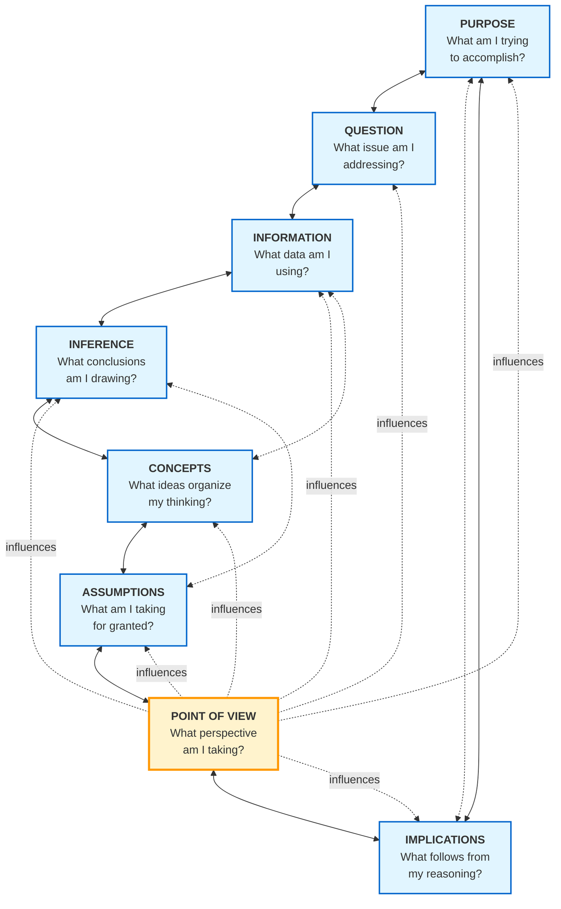
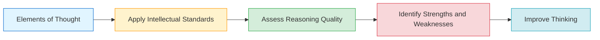

# Extraction Report: Cog Psy Fundamental Structures Of Reasoning 202512050320

> [!info] Auto-Generated Report
> This report was automatically generated by `pkb_extractor.py` on 2026-03-13 04:17.
> **Source**: `cog-psy-fundamental-structures-of-reasoning-202512050320.md` | **Items Extracted**: 335

---

## 📋 Document Overview

| Field | Value |
|-------|-------|
| **Source File** | `cog-psy-fundamental-structures-of-reasoning-202512050320.md` |
| **Extraction Date** | 2026-03-13 04:17 |
| **Word Count** | 14,619 |
| **Character Count** | 112,939 |
| **Line Count** | 1,031 |
| **Total Items Extracted** | 335 |

### Document Outline

- # The Elements of Thought: Fundamental Structures of Reasoning
- # 🧠 The Elements of Thought: Fundamental Structures of Reasoning
  - ## 📖 Extracted Definitions
  - ## 🎯 Introduction: The Architecture of Reasoning
    - ### The Universality of Thought Structures
    - ### Why Exactly Eight Elements?
    - ### Integration Within the Paul-Elder Framework
  - ## 📋 The Eight Elements of Thought: Comprehensive Analysis
    - ### 1. Purpose 🎯
      - #### Common Failures in Purpose
    - ### 2. Question at Issue ❓
      - #### Critical Questions for Identifying and Evaluating Questions
      - #### Common Failures in Questions
    - ### 3. Information 📊
      - #### Critical Questions for Evaluating Information
      - #### Common Failures in Information Handling
    - ### 4. Interpretation and Inference 🔍
      - #### Critical Questions for Evaluating Inferences
      - #### Common Failures in Inference
    - ### 5. Concepts 💡
      - #### Critical Questions for Evaluating Concepts
      - #### Common Failures in Conceptual Reasoning
    - ### 6. Assumptions 🔒
      - #### Critical Questions for Uncovering Assumptions
      - #### Common Failures Involving Assumptions
    - ### 7. Implications and Consequences ⚡
      - #### Critical Questions for Tracing Implications and Consequences
      - #### Common Failures in Examining Implications
    - ### 8. Point of View 👁️
      - #### Critical Questions for Examining Point of View
      - #### Common Failures Involving Point of View
  - ## 🔗 The Interrelationships: How Elements Form a System
    - ### The Non-Linear Nature of Element Relationships
    - ### Core Systemic Relationships
    - ### Visual Representation: The Elements Wheel
    - ### Practical Implications of Systemic Understanding
  - ## 🎓 Analytical Framework: Applying the Elements
    - ### Systematic Element-Based Analysis: A General Protocol
    - ### Application Example 1: Analyzing a Policy Argument
    - ### Application Example 2: Analyzing Your Own Thinking
  - ## 🛠️ Practical Tools and Templates
    - ### The Elements of Thought Analysis Checklist
    - ### Self-Assessment Template for Personal Reasoning
    - ### Comparative Analysis Template
  - ## 🎯 Integration With the Broader Paul-Elder Framework
    - ### How Elements Relate to Intellectual Standards
    - ### How Elements Develop Intellectual Traits
  - ## 📚 Connections and Links
  - ## 🔄 Synthesis & Reflection
    - ### The Transformative Power of Element Mastery
    - ### The Elements and Intellectual Autonomy
    - ### Moving Forward: From Learning to Application
  - ## 📚 References & Resources
- # 🔗 Related Topics for PKB Expansion

---

## 📊 Extraction Summary

| Item Type | Count |
|-----------|-------|
| Callouts | 37 |
| Code Blocks | 5 |
| Color Spans | 25 |
| Definitions | 52 |
| Embeds | 0 |
| External Links | 3 |
| Footnotes | 2 |
| Headings | 54 |
| Inline Fields | 52 |
| Mermaid Diagrams | 2 |
| Tables | 1 |
| Tags | 30 |
| Wiki Links | 65 |
| **TOTAL** | **335** |

---

## 🔔 Callouts (37)

> [!note] What are Callouts?
> Callouts are `> [!TYPE]` blocks used in Obsidian for structured annotation.
> They carry semantic meaning — definitions, insights, warnings, etc.

### By Type

| Callout Type | Count |
|-------------|-------|
| `[!]` | 1 |
| `[!abstract]` | 1 |
| `[!ask-yourself-this]` | 1 |
| `[!cite]` | 1 |
| `[!connections-and-links]` | 1 |
| `[!core-principle]` | 4 |
| `[!definition]` | 8 |
| `[!etched]` | 1 |
| `[!example]` | 8 |
| `[!helpful-tip]` | 1 |
| `[!key-claim]` | 7 |
| `[!methodology-and-sources]` | 2 |
| `[!overview]` | 1 |

### Full Callout List

#### 1. [OVERVIEW] ### <span style='color: #7200ff;'>Overview</span> *(Line 38)*

> [!overview] ### <span style='color: #7200ff;'>Overview</span>
> - **Title**: [[The-Elements-of-Thought-Fundamental-Structures-of-Reasoning|The Elements of Thought: Fundamental Structures of Reasoning]]
> - **MOC**: `=this.link-up`

#### 2. [] # In-Note Metadata Panel *(Line 42)*

> [!] # In-Note Metadata Panel
> - **Note-Type**: `= this.type`
> - **Development Status**: `= this.maturity`
> - **Epistemic Confidence**: `= this.confidence`
> - **Next Review**: `= this.next-review`
> - **Review Count**: `= this.review-count`
> - **Created**: `= this.created`
> - **Last Modified**: `= this.modified`
> 
> > [!purpose] ### 📝Content Metrics
> > **Word Count**: `= this.file.size`| **Est. Read Time**: `= round(this.file.size / 1300) + " min"`
> > **Depth Class**: `= choice(this.file.size < 500, "🌱Stub", choice(this.file.size < 2000, "📄Note", "📜Essay"))`
> ----
> > [!purpose] ### 🕰️Temporal Context
> > **Created**: `= this.file.ctime` | **Age**: `= (date(today) - this.file.ctime).days + " days"`
> > **Last Touch**: `= this.file.mtime` | **Staleness**: `= choice((date(today) - this.file.mtime).days > 180, "🕸️Cobwebs", choice((date(today) - this.file.mtime).days > 30, "🍂Cold", "🔥Fresh"))`
> > **Touch Frequency**: `= choice((date(today) - this.file.mtime).days < 7, "🔥Active", choice((date(today) - this.file.mtime).days < 30, "👌Regular", "❄️Dormant"))`
> ----
> > [!topic-idea] ### 🔗Network Connectivity
> > **In-Links**: `= length(this.file.inlinks)` | **Out-Links**: `= length(this.file.outlinks)`
> > **Network Status**: `= choice(length(this.file.inlinks) = 0, "🕸️Orphan", choice(length(this.file.inlinks) > 5, "⚡ Hub", "🌱Node"))`
> ```dataviewjs
> // SYSTEM: Semantic Bridge Engine
> // PURPOSE: Find "Sibling" notes that share the same Outlinks (Contexts)
> const current = dv.current();
> const myOutlinks = current.file.outlinks.map(l => l.path);
> 
> // 1. Filter the Vault
> const siblings = dv.pages()
>     .where(p => p.file.path !== current.file.path) // Exclude self
>     .where(p => !current.file.outlinks.map(l => l.path).includes(p.file.path)) // Exclude existing direct links
>     .map(p => {
>         // Find overlap between this page's links and the current page's links
>         const shared = p.file.outlinks.filter(l => myOutlinks.includes(l.path));
>         return { 
>             link: p.file.link, 
>             sharedCount: shared.length, 
>             sharedLinks: shared 
>         };
>     })
>     .where(p => p.sharedCount > 0) // Must share at least 1 connection
>     .sort(p => p.sharedCount, "desc") // Sort by strongest connection
>     .limit(5); // Only show top 5
> 
> // 2. Render the Bridge
> if (siblings.length > 0) {
>     dv.header(3, "Semantic Bridges (Missing Connections)");
>     dv.table(
>         ["Sibling Note", "Strength", "Shared Context"], 
>         siblings.map(s => [
>             s.link, 
>             "🔗" + s.sharedCount, 
>             s.sharedLinks.slice(0, 3).join(", ") + (s.sharedCount > 3 ? "…" : "")
>         ])
>     );
> } else {
>     dv.paragraph("*No semantic siblings found. This note is unique in its connections.*");
> }
> ```
> ---
> ### Related Notes
> ```dataview
> TABLE type, maturity, confidence
> FROM  ""
> WHERE  type = "report"
> SORT "maturity" DESC
> LIMIT 15
> ```
> ### Sources & References
> ```dataview
> TABLE 
>     source AS "Source Type",
>     file.ctime AS "Date Added"
> FROM ""
> WHERE source = "claude-sonnet-4.5"
> SORT file.ctime DESC
> LIMIT 10
> ```
> ### Backlinks & Connections
> ```dataview
> TABLE 
>     type AS "Type",
>     maturity AS "Maturity",
>     length(file.inlinks) AS "Its Backlinks",
>     dateformat(date(created), "MMM dd, yyyy") AS "Created"
> FROM [[#]]
> WHERE file.name != this.file.name
> SORT length(file.inlinks) DESC
> LIMIT 20
> ```
> ### <% dateNow %> - Initial Creation
> *Context*: `=this.title` **by**: `=this.source`
> *Maturity*: `= this.maturity`  
> *Confidence*: `= this.confidence`
> 
> ### Tags & Classification
> *Primary Tags*: `= this.tags`  
> *Type*: `= this.type`  
> *Source*: `= this.source`

#### 3. [ETCHED] ### Claude Thinking *(Line 145)*

> [!etched] ### Claude Thinking
> This is a comprehensive request for a foundational academic report on the Paul-Elder Elements of Thought. Let me analyze the requirements:
> **REQUEST CLASSIFICATION:**
> - Type: comprehensive_note (reference note)
> - Scope: reference (exhaustive coverage)
> - Research Required: YES - Need to verify Paul-Elder framework details, ensure accuracy on the 8 elements, find authoritative sources
> **RESEARCH STRATEGY:**
> I need to search for:
> 1. Paul-Elder Elements of Thought framework - official sources
> 2. Richard Paul and Linda Elder's work on critical thinking
> 3. Foundation for Critical Thinking materials
> 4. Academic sources on the Elements framework
> 5. Examples of Element-based analysis
> **STRUCTURAL PLANNING:**
> This will be a Reference Note with:
> - Metadata: tags (#critical-thinking #paul-elder #reasoning-framework #elements-of-thought #reference-note), aliases (Elements of Reasoning, Paul-Elder Elements, Eight Elements Framework)
> - Major sections: Introduction, Each of 8 Elements (detailed), Interrelationships, Analytical Framework, Examples, PKB Integration
> - Wiki-links: Each element, related concepts, broader framework components
> - Callouts: definitions, examples, key questions, warnings about common failures
> - Visual: Mermaid diagram of element relationships
> **WIKI-LINK OPPORTUNITIES:**
> [[Critical-Thinking|Critical Thinking]], [[Paul-Elder-Framework|Paul-Elder Framework]], [[Purpose-in-Reasoning|Purpose in Reasoning]], [[Question-at-Issue|Question at Issue]], [[Information]], [[Inference]], [[Concepts]], [[Assumptions]], [[Implications]], [[Point-of-View|Point of View]], [[Intellectual-Standards|Intellectual Standards]], [[Reasoning]], [[Logic]], [[Argumentation]], [[Analytical-Thinking|Analytical Thinking]], [[Metacognition]], [[Socratic-Questioning|Socratic Questioning]]
> Let me search for authoritative information on the Paul-Elder Elements of Thought.
> Now I have excellent foundational information. Let me search for more specific details about how the Elements interrelate and practical application examples.Excellent. Now I have comprehensive information about the Elements of Thought. Let me compile this into a detailed, encyclopedic report following all the specified formatting and content requirements. I have sufficient information about:
> 1. The 8 Elements of Thought
> 2. Their definitions and key questions
> 3. How they interrelate
> 4. The broader Paul-Elder framework context
> 5. How to apply them analytically
> Let me now generate the comprehensive report.

#### 4. [ABSTRACT] Executive Summary *(Line 183)*

> [!abstract] Executive Summary
> The **Elements of Thought**, developed by Richard Paul and Linda Elder as part of the [[Paul-Elder-Framework|Paul-Elder Framework]], represent the fundamental building blocks present in all human reasoning. These eight universal structures—Purpose, Question at Issue, Information, Interpretation and Inference, Concepts, Assumptions, Implications and Consequences, and Point of View—provide a systematic methodology for analyzing, deconstructing, and improving thinking across any domain. Mastering these elements transforms critical thinking from an abstract aspiration into a concrete analytical practice, enabling practitioners to identify weaknesses in reasoning, uncover hidden assumptions, trace logical consequences, and construct well-reasoned arguments grounded in intellectual rigor.

#### 5. [CORE-PRINCIPLE] The Universality Principle *(Line 228)*

> [!core-principle] The Universality Principle
> According to Paul and Elder, the Elements of Thought are **discipline-neutral** and **content-independent**. They apply with equal force to mathematics, literature, engineering, ethics, medicine, and everyday decision-making. This universality makes them extraordinarily powerful as analytical tools—once mastered in one domain, they transfer seamlessly to all others. The elements are not taught separately in physics versus history; rather, they represent the fundamental logic of human cognition itself.

#### 6. [METHODOLOGY-AND-SOURCES] The Three-Component Paul-Elder System *(Line 247)*

> [!methodology-and-sources] The Three-Component Paul-Elder System
> The complete framework consists of:
> 
> **1. Elements of Thought (Reasoning Structures)**: The eight fundamental components present in all thinking—the "parts" or "anatomy" of reasoning that this document examines in depth.
> 
> **2. [[Intellectual-Standards|Intellectual Standards]] (Quality Criteria)**: Universal criteria for assessing the quality of reasoning applied to each element—clarity, accuracy, precision, relevance, depth, breadth, logic, significance, and fairness. These standards function as evaluative lenses through which we assess each element.
> 
> **3. [[Intellectual-Traits|Intellectual Traits]] (Virtues of the Critical Thinker)**: Character dispositions developed through consistent application of the intellectual standards to the elements of thought—intellectual humility, courage, empathy, autonomy, integrity, perseverance, confidence in reason, and fair-mindedness.

#### 7. [DEFINITION] Purpose (Goal/Objective) *(Line 268)*

> [!definition] Purpose (Goal/Objective)
> [**Purpose**:: is the aim, goal, or objective that drives thinking.] It answers the question: *What am I trying to accomplish?* Every instance of reasoning pursues some end, whether explicitly articulated or implicitly operative. Purpose provides the teleological direction for thinking—it determines what counts as relevant information, which concepts to employ, what inferences to draw, and what implications matter.

#### 8. [KEY-CLAIM] Critical Questions for Identifying Purpose *(Line 275)*

> [!key-claim] Critical Questions for Identifying Purpose
> When analyzing thinking, ask these essential questions:
> 
> - **What exactly am I trying to accomplish?** State the purpose explicitly and precisely.
> - **Is my purpose clearly defined, or is it vague and unfocused?** Vague purposes produce vague thinking.
> - **Is my purpose trivial or significant?** Purpose determines the importance of the entire reasoning process.
> - **Is my purpose realistic and achievable?** Unrealistic purposes lead to frustration and failure.
> - **Do I have more than one purpose?** Multiple conflicting purposes fragment thinking.
> - **If I have conflicting purposes, which takes priority?** Prioritization clarifies thinking.
> - **Is my stated purpose my actual purpose?** Hidden agendas undermine intellectual integrity.
> - **Is my purpose ethical and fair-minded?** Purposes can be intellectually clear yet morally problematic.

#### 9. [EXAMPLE] Purpose in Action: Medical Diagnosis *(Line 289)*

> [!example] Purpose in Action: Medical Diagnosis
> Consider a physician examining a patient with chest pain. The *general purpose* is "providing effective medical care." But this remains too vague for quality reasoning. More specifically: "determining whether this chest pain indicates a cardiac emergency requiring immediate intervention." This specific purpose immediately constrains the inquiry—it makes cardiac markers highly relevant, makes dermatological information largely irrelevant, and makes speed essential to the reasoning process. The specific purpose determines which diagnostic tests to order, which information to prioritize, and what inferences to draw.

#### 10. [DEFINITION] Question at Issue (Problem/Topic) *(Line 302)*

> [!definition] Question at Issue (Problem/Topic)
> The [**Question at Issue**:: is the specific problem, question, or issue that the thinking addresses.] It defines the focal point of inquiry and determines the scope of relevant considerations. While Purpose establishes *why* you are thinking, the <span style='color: #ff0075;'>Question at Issue establishes *what* you are thinking about.</span> It converts general purpose into specific inquiry.

#### 11. [KEY-CLAIM] The Power of Question Formulation *(Line 307)*

> [!key-claim] The Power of Question Formulation
> <span style='color: #ff0075;'>Paul and Elder emphasize that how you frame the question dramatically constrains possible answers.</span> A poorly formulated question—vague, loaded, biased, or falsely dichotomous—makes good reasoning impossible regardless of subsequent cognitive work. Conversely, a well-formulated question—clear, precise, neutral, and appropriately scoped—creates the conditions for excellent reasoning.

#### 12. [EXAMPLE] Question Formulation: Criminal Justice *(Line 312)*

> [!example] Question Formulation: Criminal Justice
> Consider reasoning about criminal justice reform. Different questions produce radically different inquiries:
> 
> - *"What works to reduce crime?"* (Empirical/pragmatic focus on effectiveness)
> - *"What does justice require in criminal punishment?"* (Normative/ethical focus on principles)
> - *"How can we balance public safety with individual rights?"* (Synthetic question integrating multiple values)
> - *"Why do our opponents oppose prison reform?"* (Psychologizing question that presumes opposition stems from bad motives)
> 
> The first three questions, though different, all enable serious inquiry. The fourth question commits a logical error—it assumes opposition requires psychological explanation rather than engaging substantive arguments. Question formulation shapes the entire reasoning trajectory.

#### 13. [DEFINITION] Information (Data/Evidence) *(Line 350)*

> [!definition] Information (Data/Evidence)
> [**Information**:: comprises the facts, data, observations, experiences, and evidence used as the raw material for reasoning.] Information answers the question: *What information am I using to address this question?* It constitutes the empirical foundation upon which inferences are built. The quality of conclusions depends fundamentally on the quality of information supporting them—the principle "garbage in, garbage out" applies universally to reasoning.

#### 14. [KEY-CLAIM] The Information-Inference Distinction *(Line 355)*

> [!key-claim] The Information-Inference Distinction
> Paul and Elder emphasize the critical importance of distinguishing [**Information**:: (what we observe, what is given)] from [**inference**:: (what we conclude, what we interpret).] Confusion between these categories represents one of the most common reasoning failures. When someone says "He is lying," are they reporting information (observing false statements) or making an inference (interpreting motivation)? The distinction matters profoundly for reasoning quality.
> 
> Much poor reasoning results from treating inferences as if they were information—presenting interpretations as if they were observations, conclusions as if they were facts. <span style='color: #ff0075;'>Disciplined thinkers carefully distinguish what they *observe* from what they *infer* from observations.</span>

#### 15. [EXAMPLE] Information Quality in Medical Reasoning *(Line 372)*

> [!example] Information Quality in Medical Reasoning
> A physician diagnosing a patient must carefully distinguish types of information and assess quality:
> 
> **Patient symptoms (reported information)**: "I have chest pain." The physician notes this is the *patient's subjective experience*, not necessarily indicative of cardiac issues (could be anxiety, muscle strain, etc.).
> 
> **Physical examination (observational information)**: Measuring blood pressure, listening to heart sounds, palpating for tenderness. This direct sensory data carries high evidential value but requires skilled interpretation.
> 
> **Diagnostic tests (instrumental information)**: EKG readings, blood test results, imaging studies. These provide objective measurements but require understanding of what the instruments actually measure and their error rates.
> 
> **Medical literature (theoretical information)**: Research on cardiac conditions, treatment effectiveness, diagnostic accuracy. This provides general principles but requires judgment in applying them to individual cases.
> 
> The skilled physician recognizes that each information type serves different functions, carries different levels of certainty, and requires different interpretive frameworks. Diagnosis fails when information types are confused or quality is inadequately assessed.

#### 16. [DEFINITION] Interpretation and Inference (Conclusions/Solutions) *(Line 401)*

> [!definition] Interpretation and Inference (Conclusions/Solutions)
> [**Inference**:: is the intellectual act of drawing conclusions from information and reasoning.] [**Interpretation**:: is the process of making sense of information by placing it within conceptual frameworks.] Together, they represent the *active cognitive work* of reasoning—<span style='color: #ff6e00;'>moving from premises to conclusions, from data to understanding, from observations to explanations</span>. Inference answers: *What conclusions am I drawing? How am I interpreting this information?*

#### 17. [CORE-PRINCIPLE] The Inference Chain Principle *(Line 406)*

> [!core-principle] The Inference Chain Principle
> Complex reasoning rarely involves single inferences; rather, it consists of [**Chains of Inferences**:: where each conclusion becomes a premise for subsequent reasoning.] Understanding these chains is essential for analyzing argument structure:
> 
> *Information → Inference 1 → Inference 2 → Inference 3 → Final Conclusion*
> 
> Weakness anywhere in the chain undermines the final conclusion. Skilled critical thinkers trace inference chains backward, examining each step: "You conclude X. What evidence supports X? What intermediate conclusions connect your evidence to X? Does each step follow logically?"

#### 18. [EXAMPLE] Interpretation and Inference in Historical Reasoning *(Line 415)*

> [!example] Interpretation and Inference in Historical Reasoning
> Consider a historian examining a medieval document describing peasant protests. The raw **information** consists of words on parchment. But what do these words mean? 
> 
> **Interpretation** (making sense of information): The historian must interpret the document through understanding of medieval social structure, economic conditions, and political context. The same words might be read as evidence of widespread discontent (one interpretation) or as propaganda exaggerating isolated incidents (alternative interpretation). Interpretation requires applying conceptual frameworks about medieval society.
> 
> **Inference** (drawing conclusions): Once interpreted, the historian draws conclusions: "These protests indicate deteriorating feudal relations in this region during this period." This inference moves from the interpreted evidence to a historical claim. The inference quality depends on both the interpretation quality and the logical connection between interpreted evidence and historical conclusion.

#### 19. [DEFINITION] Concepts (Theories/Ideas) *(Line 452)*

> [!definition] Concepts (Theories/Ideas)
> **Concepts** are the organizing ideas, theories, principles, definitions, models, or axioms that structure thinking. They provide the abstract frameworks through which we understand and categorize experience. Concepts answer: *What key ideas am I using to organize my thinking? What theories shape my understanding?* All reasoning necessarily employs concepts—we cannot think without conceptual frameworks any more than we can see without eyes.

#### 20. [KEY-CLAIM] The Concept-Information Relationship *(Line 457)*

> [!key-claim] The Concept-Information Relationship
> Paul and Elder emphasize that concepts and information exist in reciprocal relationship. **Information** provides the empirical content; **concepts** provide the organizational form. Concepts without information remain empty abstractions. Information without concepts remains disorganized data. Excellence in reasoning requires both rich conceptual frameworks *and* careful attention to empirical detail. The relationship works bidirectionally: concepts shape what information we notice and how we interpret it, while information tests and refines our concepts.

#### 21. [EXAMPLE] Conceptual Frameworks in Political Reasoning *(Line 464)*

> [!example] Conceptual Frameworks in Political Reasoning
> Consider reasoning about political systems. Different conceptual frameworks produce different analyses:
> 
> **Classical Liberal Framework**: Organizes thinking around concepts of *individual rights*, *limited government*, *free markets*, *rule of law*. Through this lens, political questions become primarily about protecting individual liberty against government overreach.
> 
> **Socialist Framework**: Organizes thinking around concepts of *class conflict*, *exploitation*, *collective ownership*, *economic democracy*. Through this lens, political questions become primarily about achieving economic equality and worker control.
> 
> **Conservative Framework**: Organizes thinking around concepts of *tradition*, *organic community*, *hierarchy*, *social order*. Through this lens, political questions become primarily about maintaining stable social structures.
> 
> Notice how the *same information* (unemployment statistics, wealth distribution, policy outcomes) gets interpreted completely differently depending on the conceptual framework employed. The framework determines what counts as important, what requires explanation, and what solutions make sense.

#### 22. [DEFINITION] Assumptions (Presuppositions) *(Line 503)*

> [!definition] Assumptions (Presuppositions)
> **Assumptions** are the beliefs, ideas, or claims you take for granted—the presuppositions operating in your reasoning whether or not you recognize them. Assumptions answer: *What am I taking for granted? What must I believe for my reasoning to make sense?* Every instance of reasoning rests on assumptions, yet assumptions typically remain implicit and unexamined. Making assumptions explicit represents one of critical thinking's most powerful techniques.

#### 23. [CORE-PRINCIPLE] The Ubiquity of Assumptions *(Line 508)*

> [!core-principle] The Ubiquity of Assumptions
> According to Paul and Elder, it is *impossible* to reason without making assumptions. Every statement, argument, or theory presupposes certain background beliefs. When a scientist conducts an experiment, they assume instruments provide reliable measurements, natural laws operate consistently, and experimental results can be generalized. When a person plans their day, they assume continued existence, relatively predictable conditions, and their capacity for action. Reasoning could not begin without assumptions—we cannot verify everything; some beliefs must be accepted as starting points.
> 
> The critical question is not whether you make assumptions (you inevitably do) but whether you **recognize** your assumptions, whether they are **justified**, and whether you're **willing to examine them**.

#### 24. [EXAMPLE] Uncovering Hidden Assumptions: The Standardized Testing Debate *(Line 515)*

> [!example] Uncovering Hidden Assumptions: The Standardized Testing Debate
> Consider the argument: "We should expand standardized testing in schools because it improves educational outcomes."
> 
> **Explicit Premise**: Standardized testing improves educational outcomes.
> **Explicit Conclusion**: We should expand standardized testing.
> 
> But what **assumptions** does this reasoning require?
> 
> *Factual Assumptions*: That test scores correlate with genuine learning, that teachers respond to testing incentives by improving instruction (rather than teaching to the test), that improved outcomes outweigh testing costs and stress.
> 
> *Value Assumptions*: That measurable outcomes are what we should prioritize in education (rather than, say, creativity or critical thinking that resists standardized measurement), that educational efficiency justifies increased testing burden.
> 
> *Methodological Assumptions*: That quantitative metrics adequately capture educational quality, that standardized tests validly measure learning.
> 
> Notice that someone might challenge this reasoning not by disputing the explicit premise (test scores improve) but by challenging the underlying assumptions (that test scores represent genuine learning). Much productive disagreement occurs at the level of assumptions rather than explicit claims.

#### 25. [DEFINITION] Implications and Consequences *(Line 561)*

> [!definition] Implications and Consequences
> **Implications** are what logically follows from your reasoning—the conclusions that must be accepted if you accept your premises and reasoning. **Consequences** are the likely results or effects that would occur if your conclusions were acted upon. Together they answer: *If I accept this reasoning, what else follows? What would happen if I acted on these conclusions?* Tracing implications and consequences projects reasoning forward to examine what it commits you to.

#### 26. [KEY-CLAIM] The Implications Test *(Line 566)*

> [!key-claim] The Implications Test
> Paul and Elder identify tracing implications as one of critical thinking's most powerful techniques. Many arguments appear plausible when examined directly but reveal flaws when their implications are traced. The **implications test** asks: "If I consistently applied this principle, what would follow?" Often, unacceptable implications indicate flawed reasoning. Someone might argue "People should always follow their feelings." Trace the implications: this would justify acting on feelings of anger, vengeance, or greed. The unacceptable implications suggest the principle requires qualification.

#### 27. [EXAMPLE] Implications and Consequences in Ethical Reasoning *(Line 571)*

> [!example] Implications and Consequences in Ethical Reasoning
> Consider utilitarian ethical reasoning: "Actions are right insofar as they maximize happiness for the greatest number."
> 
> **Logical Implications**: This principle implies that an action producing great happiness for many could be right even if it requires sacrificing an innocent person's happiness entirely (if net happiness increases). It implies that intentions don't matter morally—only consequences. It implies that distributional questions don't matter—10 people experiencing happiness of 10 equals 100 people experiencing happiness of 1 (both sum to 100 units of happiness).
> 
> **Practical Consequences**: If society adopted this principle as policy, consequences might include: utilitarian calculations justifying violations of individual rights if doing so benefits the majority; difficult measurement problems (how do we quantify happiness?); potential for majority tyranny (majority happiness justifies minority suffering).
> 
> Critics of utilitarianism often focus on implications (it implies morally repugnant conclusions in thought experiments) or consequences (it would produce bad outcomes if implemented). Examining implications and consequences reveals whether a theory can withstand critical scrutiny.

#### 28. [DEFINITION] Point of View (Perspective/Frame of Reference) *(Line 610)*

> [!definition] Point of View (Perspective/Frame of Reference)
> **Point of View** is the perspective, frame of reference, or orientation from which you reason. It encompasses your vantage point, the lens through which you view issues, and the orientation that shapes your thinking. Point of View answers: *From what perspective am I viewing this? What is my frame of reference?* Every instance of reasoning necessarily proceeds from some point of view—thinking cannot occur from nowhere.

#### 29. [CORE-PRINCIPLE] The Necessity and Limitation of Perspective *(Line 615)*

> [!core-principle] The Necessity and Limitation of Perspective
> Paul and Elder emphasize a crucial tension: **Point of view is both necessary and limiting**. Necessary because thinking cannot occur from no perspective—you must view situations from somewhere. Limiting because every perspective highlights certain features while obscuring others. Like standing in a particular place in a room, your position determines what you can see—but also what remains outside your field of vision.
> 
> This creates an intellectual challenge: How can you recognize your own point of view (which shapes everything you perceive) while *viewing through* that perspective? The answer lies in **deliberately adopting multiple perspectives**—attempting to see situations from viewpoints different from your own, recognizing that each perspective illuminates some aspects while obscuring others.

#### 30. [EXAMPLE] Point of View in Historical Analysis *(Line 622)*

> [!example] Point of View in Historical Analysis
> Consider analysis of European colonization. Different points of view produce radically different histories:
> 
> **European Colonizer Perspective**: Emphasis on exploration, civilizing mission, technological advancement, spreading Christianity and European culture. Questions focus on colonial administration effectiveness, resistance to progress, economic development. Information highlights European achievements, institutions built, diseases conquered.
> 
> **Indigenous Peoples' Perspective**: Emphasis on invasion, genocide, cultural destruction, land theft, exploitation. Questions focus on survival strategies, resistance movements, cultural preservation. Information highlights population decimation, forced assimilation, resource extraction.
> 
> **Contemporary Western Academic Perspective**: Attempts to balance perspectives, recognize colonial harms while understanding European motivations, examine power dynamics and structural violence. Questions focus on long-term impacts, ongoing colonial legacies, possibilities for reconciliation.
> 
> Notice that the *same events* appear entirely different depending on perspective. Each viewpoint has access to certain information and interpretations while other aspects remain less visible. Understanding requires recognizing how perspective shapes historical narrative.

#### 31. [KEY-CLAIM] Elements as an Integrated System *(Line 667)*

> [!key-claim] Elements as an Integrated System
> According to Paul and Elder, "There is an intimate overlap among all of the elements by virtue of their interrelationship." This means that changes in any single element ripple throughout the entire reasoning structure. Clarifying your Purpose affects what Questions you ask, which determines what Information you seek, which you interpret through particular Concepts, and so forth. The elements don't operate sequentially (first purpose, then question, then information...) but simultaneously and reciprocally, each constraining and enabling the others.

#### 32. [METHODOLOGY-AND-SOURCES] The Element Analysis Protocol *(Line 743)*

> [!methodology-and-sources] The Element Analysis Protocol
> **Phase 1: Preliminary Reading/Observation**
> Begin by encountering the reasoning to be analyzed without immediately applying the Elements framework. Read the text, listen to the argument, or observe your own thinking process. Get an overall sense of the reasoning's direction and content.
> 
> **Phase 2: Purpose Identification**
> Ask: *What is the purpose of this reasoning? What is it trying to accomplish?* Identify both stated and unstated purposes. Evaluate: Is the purpose clear? Significant? Realistic? Does the reasoning serve its stated purpose, or does it serve some other hidden agenda?
> 
> **Phase 3: Question Analysis**
> Ask: *What question or problem does this reasoning address?* Identify the central question and any subsidiary questions. Evaluate: Is the question clearly formulated? Is it the right question? Is it answerable? Does the reasoning actually address this question, or does it substitute an easier question?
> 
> **Phase 4: Information Assessment**
> Ask: *What information does this reasoning use? What is the nature and source of this information?* Identify empirical data, testimonial evidence, statistical information, theoretical claims. Evaluate: Is the information accurate? Relevant? Sufficient? From credible sources? Is contrary information ignored? Is inference confused with information?
> 
> **Phase 5: Inference Examination**
> Ask: *What conclusions does this reasoning draw? What interpretations does it offer?* Trace the inferential path from premises to conclusions. Evaluate: Do conclusions follow logically? Are inferences valid? Strong? Are alternative inferences possible? Where are the inferential leaps?
> 
> **Phase 6: Conceptual Analysis**
> Ask: *What key concepts organize this reasoning? What theories or definitions does it employ?* Identify central concepts and how they're being used. Evaluate: Are concepts clearly defined? Used consistently? Adequate to complexity? Do conceptual confusions create problems?
> 
> **Phase 7: Assumption Uncovering**
> Ask: *What is being taken for granted? What must be true for this reasoning to work?* Identify factual, value, methodological, and paradigmatic assumptions. Evaluate: Are assumptions justified? Questionable? Controversial? Hidden? Do they beg questions?
> 
> **Phase 8: Implication Tracing**
> Ask: *What follows if this reasoning is accepted? What would result from acting on these conclusions?* Trace logical implications and practical consequences. Evaluate: Are implications acceptable? Recognized? Significant? Are consequences likely to be positive or negative?
> 
> **Phase 9: Point of View Recognition**
> Ask: *From what perspective does this reasoning proceed? What frame of reference does it adopt?* Identify the viewpoint and what it enables/limits. Evaluate: Is the perspective acknowledged? Limited? Fair to alternatives? Could other perspectives yield different conclusions?
> 
> **Phase 10: Synthetic Evaluation**
> Step back and assess the reasoning as a whole: Which elements are strongest? Which are weakest? Do elements work together coherently, or are there tensions? What would most improve this reasoning? Is the overall reasoning sound?

#### 33. [HELPFUL-TIP] Quick-Reference Analysis Tool *(Line 833)*

> [!helpful-tip] Quick-Reference Analysis Tool
> Use this checklist when analyzing any argument, text, policy, or decision:
> 
> **□ PURPOSE**: What is this reasoning trying to accomplish? Is the purpose clear, significant, realistic, and ethical?
> 
> **□ QUESTION**: What specific question does this address? Is the question clearly formulated, answerable, and the right question? 
> 
> **□ INFORMATION**: What data/evidence is used? Is the information accurate, relevant, sufficient, from credible sources, and fairly selected?
> 
> **□ INFERENCE**: What conclusions are drawn? Are inferences valid, strong, and clearly distinguished from information?
> 
> **□ CONCEPTS**: What key ideas organize this thinking? Are concepts clearly defined, consistently used, and adequate to complexity?
> 
> **□ ASSUMPTIONS**: What is taken for granted? Are assumptions justified, recognized, and open to examination?
> 
> **□ IMPLICATIONS**: What follows from this reasoning? Are implications recognized, acceptable, and carefully traced?
> 
> **□ POINT OF VIEW**: From what perspective does this reason? Is the viewpoint acknowledged, limited, and fair to alternatives?

#### 34. [CONNECTIONS-AND-LINKS] PKB Integration and Cross-References *(Line 945)*

> [!connections-and-links] PKB Integration and Cross-References
> The Elements of Thought connect to numerous other areas within a comprehensive personal knowledge base:
> 
> **Critical Thinking Foundations**: The Elements represent the core component of the [[Paul-Elder-Framework|Paul-Elder Framework]], working in conjunction with [[Intellectual-Standards|Intellectual Standards]] and [[Intellectual-Traits|Intellectual Traits]]. They provide the anatomical structure that Standards evaluate and Traits develop through practice.
> 
> **Logic and Argumentation**: Element analysis directly supports [[Argument-Analysis|Argument Analysis]], [[Premise-Conclusion-Structure|Premise-Conclusion Structure]], [[Validity-and-Soundness|Validity and Soundness]], and [[Informal-Fallacies|Informal Fallacies]]. Many fallacies are element failures—hasty generalization fails at Information sufficiency, ad hominem fails at relevance to the Question at Issue, false cause fails in Inference logic.
> 
> **Epistemology**: The Information and Inference elements connect to [[Epistemic-Autonomy-—-Epistemology|Epistemology]], [[Justified-True-Belief|Justified True Belief]], [[Sources-of-Knowledge|Sources of Knowledge]], and [[Skepticism]]. Questions about what counts as reliable information and warranted inference are fundamentally epistemological.
> 
> **Metacognition**: The Elements provide a framework for [[Metacognitive-Monitoring|Metacognitive Monitoring]], [[999-report-orginizing/_permanent-notes/_permanent-notes/Self-Regulated-Learning|Self-Regulated Learning]], and [[Reflective-Practice|Reflective Practice]]. Using elements to analyze your own thinking exemplifies metacognition—thinking about thinking.
> 
> **Scientific Reasoning**: Element analysis illuminates [[Scientific-Method|Scientific Method]], [[Hypothesis-Testing|Hypothesis Testing]], [[Experimental-Design|Experimental Design]], and [[Theory-Construction|Theory Construction]]. Scientific reasoning explicitly operationalizes the Elements—hypotheses frame Questions, experiments gather Information, results support Inferences, theories provide Concepts.
> 
> **Ethical Reasoning**: The Purpose, Implications, and Point of View elements are central to [[Ethical-Reasoning|Ethical Reasoning]], [[Moral-Philosophy|Moral Philosophy]], and [[Applied-Ethics|Applied Ethics]]. Ethical analysis requires clarifying purposes (what outcomes do we seek?), tracing implications (what consequences follow?), and considering perspectives (whose viewpoint matters?).
> 
> **Hermeneutics**: The Interpretation element connects to [[Hermeneutics]], [[Textual-Analysis|Textual Analysis]], and [[Historical-Interpretation|Historical Interpretation]]. Understanding that interpretation involves applying conceptual frameworks to information illuminates interpretive methodology.
> 
> **Cognitive Psychology**: The Elements align with findings in [[cognitive-psychology|Cognitive Psychology]], [[Heuristics and Biases]], [[Decision-Making|Decision Making]], and [[Judgment Under Uncertainty]]. Many documented biases represent element failures—confirmation bias affects Information gathering, anchoring affects Inference, framing effects operate through Point of View.
> 
> **Academic Writing**: Element analysis directly supports [[Academic Writing]], [[Thesis Development]], [[Evidence-Based Argumentation]], and [[Literature Review Methodology]]. Each academic paper should have clear Purpose, address specific Questions, marshal relevant Information, draw warranted Inferences, define key Concepts, acknowledge Assumptions, trace Implications, and situate arguments within scholarly conversations (Point of View).
> 
> **Socratic Questioning**: The Elements provide the structure for [[Socratic-Method|Socratic Method]], [[Probing Questions]], and [[Dialectical Reasoning]]. Socratic questions target specific elements—"What is your purpose?" "What evidence supports that?" "What assumptions does that presuppose?" "What implications follow?"

#### 35. [KEY-CLAIM] From Unconscious Incompetence to Conscious Mastery *(Line 981)*

> [!key-claim] From Unconscious Incompetence to Conscious Mastery
> Most people exist in a state of *unconscious incompetence* regarding reasoning—they think constantly but remain unaware of thinking's structure, unable to identify weaknesses or improve systematically. Learning the Elements moves you to *conscious incompetence*—recognizing reasoning's components but not yet skillfully employing them. Extensive practice develops *conscious competence*—deliberately and effectively analyzing thinking using the Elements. Eventually, with sufficient practice, element analysis becomes *unconscious competence*—an automatic habit where you instinctively notice purposes, question assumptions, trace implications, and consider perspectives without conscious effort. At this stage, the Elements have become internalized, transforming not just what you think but how you think.

#### 36. [ASK-YOURSELF-THIS] Reflective Questions for Deepening Understanding *(Line 1002)*

> [!ask-yourself-this] Reflective Questions for Deepening Understanding
> **On Element Relationships**: Can you identify a case where weakness in one element cascaded through the system to produce overall reasoning failure? How did the elements' interconnection amplify the initial problem?
> 
> **On Personal Reasoning**: Select a strong belief you hold. Can you trace all eight elements in your reasoning supporting this belief? Are there elements you've never explicitly examined? What happens when you scrutinize assumptions and implications you've taken for granted?
> 
> **On Perspective-Taking**: Can you articulate an opposing viewpoint on an issue you care deeply about, identifying all eight elements from that alternative perspective? Not a caricature or straw man, but the strongest version of reasoning from a point of view different from your own? What does this exercise reveal about perspective's power?

#### 37. [CITE] Primary Sources and Further Reading *(Line 1014)*

> [!cite] Primary Sources and Further Reading
> **Foundation for Critical Thinking Resources**:
> - Paul, R., & Elder, L. (2006). *The Miniature Guide to Critical Thinking: Concepts and Tools* (4th ed.). Foundation for Critical Thinking Press. [Comprehensive guide to the Paul-Elder framework, including detailed treatment of Elements]
> - Paul, R., & Elder, L. (2008). *The Thinker's Guide to Analytic Thinking*. Foundation for Critical Thinking Press. [Focused specifically on element-based analysis]
> - Paul, R., & Elder, L. (2002). *Critical Thinking: Tools for Taking Charge of Your Professional and Personal Life*. Prentice Hall. [Extensive application of Elements to practical reasoning]
> - Foundation for Critical Thinking. *Wheel of Reason*. https://community.criticalthinking.org/wheelOfReason.php [Visual representation and interactive exploration of Elements]
> - *The Elements of Thought Online Resource*. https://theelementsofthought.org/ [Educational resource specifically devoted to teaching the Elements]
> 
> **Academic Applications and Research**:
> - Ralston, P., & Bays, C. (2013). "Enhancing Critical Thinking Across The Undergraduate Experience: An Exemplar From Engineering." *American Journal of Engineering Education*, 4(2), 119-126. [Empirical study of Paul-Elder framework implementation in engineering curriculum]
> - University of Louisville Ideas to Action. "Paul-Elder Critical Thinking Framework." https://louisville.edu/ideastoaction/about/criticalthinking/framework [Comprehensive institutional adoption of framework]
> - Nosich, G. M. (2009). *Learning to Think Things Through: A Guide to Critical Thinking Across the Curriculum* (3rd ed.). Prentice Hall. [Application of Elements to disciplinary thinking]
> 
> **Philosophical Foundations**:
> - Paul, R., & Elder, L. (2009). *The Miniature Guide to Critical Thinking Concepts and Tools* (updated). Foundation for Critical Thinking Press.
> - Paul, R. (1992). "Critical Thinking: What, Why, and How." *New Directions for Community Colleges*, 1992(77), 3-24. [Theoretical foundations of Paul-Elder approach]
> 
> **Related Frameworks**:
> - Halpern, D. F. (2014). *Thought and Knowledge: An Introduction to Critical Thinking* (5th ed.). Psychology Press. [Cognitive psychology perspective on thinking skills]
> - Ennis, R. H. (1987). "A Taxonomy of Critical Thinking Dispositions and Abilities." In J. B. Baron & R. J. Sternberg (Eds.), *Teaching Thinking Skills: Theory and Practice*. W. H. Freeman. [Alternative framework for analyzing thinking]
> - Facione, P. A. (1990). *Critical Thinking: A Statement of Expert Consensus for Purposes of Educational Assessment and Instruction*. California Academic Press. [Delphi consensus on critical thinking components]

---

## 🔗 Wiki-Links (65 total, 56 unique targets)

> [!info] Knowledge Graph Connections
> These links represent connections to other notes in your PKB.
> **56** distinct notes are referenced.

### Unique Targets

- [[Academic Writing]]
- [[Analytical-Thinking|Analytical Thinking]]
- [[Applied-Ethics|Applied Ethics]]
- [[Argument-Analysis|Argument Analysis]]
- [[Argumentation]]
- [[Assumptions]]
- [[Cognitive Biases and Element Failures - Psychology of Reasoning Errors]]
- [[cognitive-psychology|Cognitive Psychology]]
- [[Concepts]]
- [[Critical-Thinking|Critical Thinking]]
- [[Decision-Making|Decision Making]]
- [[Dialectical Reasoning]]
- [[Epistemic-Autonomy-—-Epistemology|Epistemology]]
- [[Ethical-Reasoning|Ethical Reasoning]]
- [[Evidence-Based Argumentation]]
- [[Experimental-Design|Experimental Design]]
- [[Hermeneutics]]
- [[Heuristics and Biases]]
- [[Historical-Interpretation|Historical Interpretation]]
- [[Hypothesis-Testing|Hypothesis Testing]]
- [[Implications]]
- [[Inference]]
- [[Informal-Fallacies|Informal Fallacies]]
- [[Information]]
- [[Intellectual-Standards|Intellectual Standards]]
- [[Intellectual Standards - Universal Criteria for Reasoning Quality]]
- [[Intellectual-Traits|Intellectual Traits]]
- [[Intellectual Traits - Virtues of the Critical Thinker]]
- [[Judgment Under Uncertainty]]
- [[Justified-True-Belief|Justified True Belief]]
- [[Literature Review Methodology]]
- [[Logic]]
- [[MOC - Paul-Elder Framework]]
- [[Metacognition]]
- [[Metacognitive-Monitoring|Metacognitive Monitoring]]
- [[Moral-Philosophy|Moral Philosophy]]
- [[Paul-Elder-Framework|Paul-Elder Framework]]
- [[Point-of-View|Point of View]]
- [[Premise-Conclusion-Structure|Premise-Conclusion Structure]]
- [[Probing Questions]]
- [[Purpose-in-Reasoning|Purpose in Reasoning]]
- [[Question-at-Issue|Question at Issue]]
- [[Reasoning]]
- [[Reflective-Practice|Reflective Practice]]
- [[Scientific-Method|Scientific Method]]
- [[999-report-orginizing/_permanent-notes/_permanent-notes/Self-Regulated-Learning|Self-Regulated Learning]]
- [[Skepticism]]
- [[Socratic-Method|Socratic Method]]
- [[Socratic-Questioning|Socratic Questioning]]
- [[Socratic Questioning - Disciplined Interrogation of Thinking]]
- [[Sources-of-Knowledge|Sources of Knowledge]]
- [[Textual-Analysis|Textual Analysis]]
- [[The-Elements-of-Thought-Fundamental-Structures-of-Reasoning|The Elements of Thought: Fundamental Structures of Reasoning]]
- [[Theory-Construction|Theory Construction]]
- [[Thesis Development]]
- [[Validity-and-Soundness|Validity and Soundness]]

### All Occurrences

| # | Target | Display Text | Heading | Section | Line |
|---|--------|-------------|---------|---------|------|
| 1 | [[The-Elements-of-Thought-Fundamental-Structures-of-Reasoning|The Elements of Thought: Fundamental Structures of Reasoning]] | — | — | Document Start | 39 |
| 2 | [[Critical-Thinking|Critical Thinking]] | — | — | The Elements of Thought: Fundamental ... | 166 |
| 3 | [[Paul-Elder-Framework|Paul-Elder Framework]] | — | — | The Elements of Thought: Fundamental ... | 166 |
| 4 | [[Purpose-in-Reasoning|Purpose in Reasoning]] | — | — | The Elements of Thought: Fundamental ... | 166 |
| 5 | [[Question-at-Issue|Question at Issue]] | — | — | The Elements of Thought: Fundamental ... | 166 |
| 6 | [[Information]] | — | — | The Elements of Thought: Fundamental ... | 166 |
| 7 | [[Inference]] | — | — | The Elements of Thought: Fundamental ... | 166 |
| 8 | [[Concepts]] | — | — | The Elements of Thought: Fundamental ... | 166 |
| 9 | [[Assumptions]] | — | — | The Elements of Thought: Fundamental ... | 166 |
| 10 | [[Implications]] | — | — | The Elements of Thought: Fundamental ... | 166 |
| 11 | [[Point-of-View|Point of View]] | — | — | The Elements of Thought: Fundamental ... | 166 |
| 12 | [[Intellectual-Standards|Intellectual Standards]] | — | — | The Elements of Thought: Fundamental ... | 166 |
| 13 | [[Reasoning]] | — | — | The Elements of Thought: Fundamental ... | 166 |
| 14 | [[Logic]] | — | — | The Elements of Thought: Fundamental ... | 166 |
| 15 | [[Argumentation]] | — | — | The Elements of Thought: Fundamental ... | 166 |
| 16 | [[Analytical-Thinking|Analytical Thinking]] | — | — | The Elements of Thought: Fundamental ... | 166 |
| 17 | [[Metacognition]] | — | — | The Elements of Thought: Fundamental ... | 166 |
| 18 | [[Socratic-Questioning|Socratic Questioning]] | — | — | The Elements of Thought: Fundamental ... | 166 |
| 19 | [[Paul-Elder-Framework|Paul-Elder Framework]] | — | — | 🧠 The Elements of Thought: Fundamenta... | 184 |
| 20 | [[Paul-Elder-Framework|Paul-Elder Framework]] | — | — | Integration Within the Paul-Elder Fra... | 245 |
| 21 | [[Critical-Thinking|Critical Thinking]] | — | — | Integration Within the Paul-Elder Fra... | 245 |
| 22 | [[Intellectual-Standards|Intellectual Standards]] | — | — | Integration Within the Paul-Elder Fra... | 252 |
| 23 | [[Intellectual-Traits|Intellectual Traits]] | — | — | Integration Within the Paul-Elder Fra... | 254 |
| 24 | [[Intellectual-Standards|Intellectual Standards]] | — | — | How Elements Relate to Intellectual S... | 895 |
| 25 | [[Intellectual-Traits|Intellectual Traits]] | — | — | How Elements Develop Intellectual Traits | 921 |
| 26 | [[Paul-Elder-Framework|Paul-Elder Framework]] | — | — | 📚 Connections and Links | 949 |
| 27 | [[Intellectual-Standards|Intellectual Standards]] | — | — | 📚 Connections and Links | 949 |
| 28 | [[Intellectual-Traits|Intellectual Traits]] | — | — | 📚 Connections and Links | 949 |
| 29 | [[Argument-Analysis|Argument Analysis]] | — | — | 📚 Connections and Links | 951 |
| 30 | [[Premise-Conclusion-Structure|Premise-Conclusion Structure]] | — | — | 📚 Connections and Links | 951 |
| 31 | [[Validity-and-Soundness|Validity and Soundness]] | — | — | 📚 Connections and Links | 951 |
| 32 | [[Informal-Fallacies|Informal Fallacies]] | — | — | 📚 Connections and Links | 951 |
| 33 | [[Epistemic-Autonomy-—-Epistemology|Epistemology]] | — | — | 📚 Connections and Links | 953 |
| 34 | [[Justified-True-Belief|Justified True Belief]] | — | — | 📚 Connections and Links | 953 |
| 35 | [[Sources-of-Knowledge|Sources of Knowledge]] | — | — | 📚 Connections and Links | 953 |
| 36 | [[Skepticism]] | — | — | 📚 Connections and Links | 953 |
| 37 | [[Metacognitive-Monitoring|Metacognitive Monitoring]] | — | — | 📚 Connections and Links | 955 |
| 38 | [[Self-Regulated-Learning-—-SRL|Self-Regulated Learning]] | — | — | 📚 Connections and Links | 955 |
| 39 | [[Reflective-Practice|Reflective Practice]] | — | — | 📚 Connections and Links | 955 |
| 40 | [[Scientific-Method|Scientific Method]] | — | — | 📚 Connections and Links | 957 |
| 41 | [[Hypothesis-Testing|Hypothesis Testing]] | — | — | 📚 Connections and Links | 957 |
| 42 | [[Experimental-Design|Experimental Design]] | — | — | 📚 Connections and Links | 957 |
| 43 | [[Theory-Construction|Theory Construction]] | — | — | 📚 Connections and Links | 957 |
| 44 | [[Ethical-Reasoning|Ethical Reasoning]] | — | — | 📚 Connections and Links | 959 |
| 45 | [[Moral-Philosophy|Moral Philosophy]] | — | — | 📚 Connections and Links | 959 |
| 46 | [[Applied-Ethics|Applied Ethics]] | — | — | 📚 Connections and Links | 959 |
| 47 | [[Hermeneutics]] | — | — | 📚 Connections and Links | 961 |
| 48 | [[Textual-Analysis|Textual Analysis]] | — | — | 📚 Connections and Links | 961 |
| 49 | [[Historical-Interpretation|Historical Interpretation]] | — | — | 📚 Connections and Links | 961 |
| 50 | [[cognitive-psychology|Cognitive Psychology]] | — | — | 📚 Connections and Links | 963 |
| 51 | [[Heuristics and Biases]] | — | — | 📚 Connections and Links | 963 |
| 52 | [[Decision-Making|Decision Making]] | — | — | 📚 Connections and Links | 963 |
| 53 | [[Judgment Under Uncertainty]] | — | — | 📚 Connections and Links | 963 |
| 54 | [[Academic Writing]] | — | — | 📚 Connections and Links | 965 |
| 55 | [[Thesis Development]] | — | — | 📚 Connections and Links | 965 |
| 56 | [[Evidence-Based Argumentation]] | — | — | 📚 Connections and Links | 965 |
| 57 | [[Literature Review Methodology]] | — | — | 📚 Connections and Links | 965 |
| 58 | [[Socratic-Method|Socratic Method]] | — | — | 📚 Connections and Links | 967 |
| 59 | [[Probing Questions]] | — | — | 📚 Connections and Links | 967 |
| 60 | [[Dialectical Reasoning]] | — | — | 📚 Connections and Links | 967 |
| 61 | [[Intellectual Standards - Universal Criteria for Reasoning Quality]] | — | — | 🔗 Related Topics for PKB Expansion | 1041 |
| 62 | [[Intellectual Traits - Virtues of the Critical Thinker]] | — | — | 🔗 Related Topics for PKB Expansion | 1046 |
| 63 | [[Socratic Questioning - Disciplined Interrogation of Thinking]] | — | — | 🔗 Related Topics for PKB Expansion | 1051 |
| 64 | [[Cognitive Biases and Element Failures - Psychology of Reasoning Errors]] | — | — | 🔗 Related Topics for PKB Expansion | 1056 |
| 65 | [[MOC - Paul-Elder Framework]] | — | — | 🔗 Related Topics for PKB Expansion | 1064 |

---

## 📖 Definitions (52)

> [!tip] PKB Definitions
> These `[**Term**:: Definition]` fields define key concepts.
> They are queryable by Dataview.

### 1. Purpose

> [!definition] Purpose
> is the aim, goal, or objective that drives thinking.

*Source: Line 269 in `cog-psy-fundamental-structures-of-reasoning-202512050320.md`*

### 2. Clarifying purpose

> [!definition] Clarifying purpose
> represents the essential first step in analyzing any reasoning process—your own or others'.

*Source: Line 273 in `cog-psy-fundamental-structures-of-reasoning-202512050320.md`*

### 3. Purpose confusion

> [!definition] Purpose confusion
> occurs when the thinker lacks a clearly defined goal, leading to unfocused wandering rather than directed inquiry.

*Source: Line 294 in `cog-psy-fundamental-structures-of-reasoning-202512050320.md`*

### 4. Purpose substitution

> [!definition] Purpose substitution
> happens when an initial worthwhile purpose gets replaced mid-stream by a trivial or distracting purpose

*Source: Line 294 in `cog-psy-fundamental-structures-of-reasoning-202512050320.md`*

### 5. Hidden purposes

> [!definition] Hidden purposes
> undermine intellectual honesty when unstated agendas (protecting ego, winning arguments, maintaining comfortable beliefs) drive reasoning that claims different explicit purposes.

*Source: Line 294 in `cog-psy-fundamental-structures-of-reasoning-202512050320.md`*

### 6. Conflicting purposes

> [!definition] Conflicting purposes
> create logical incoherence when a single reasoning process attempts to serve incompatible ends simultaneously—trying both to pursue truth and to avoid uncomfortable conclusions.

*Source: Line 294 in `cog-psy-fundamental-structures-of-reasoning-202512050320.md`*

### 7. Question at Issue

> [!definition] Question at Issue
> is the specific problem, question, or issue that the thinking addresses.

*Source: Line 303 in `cog-psy-fundamental-structures-of-reasoning-202512050320.md`*

### 8. Simple factual questions

> [!definition] Simple factual questions
> ("What is the boiling point of water?") admit straightforward empirical answers.

*Source: Line 310 in `cog-psy-fundamental-structures-of-reasoning-202512050320.md`*

### 9. Conceptual questions

> [!definition] Conceptual questions
> ("What is justice?") require definitional analysis and theoretical interpretation.

*Source: Line 310 in `cog-psy-fundamental-structures-of-reasoning-202512050320.md`*

### 10. Evaluative questions

> [!definition] Evaluative questions
> ("Is this policy just?") demand application of criteria and value judgments.

*Source: Line 310 in `cog-psy-fundamental-structures-of-reasoning-202512050320.md`*

### 11. Complex synthetic questions

> [!definition] Complex synthetic questions
> ("How can we create a more just society?") integrate multiple question types and resist simple answers.

*Source: Line 310 in `cog-psy-fundamental-structures-of-reasoning-202512050320.md`*

### 12. Identification Questions

> [!definition] Identification Questions
> *What is the key question I am addressing? Is this question the central question, or is it peripheral? Am I addressing multiple questions that should be separated? Am I treating a complex question as if it were simple?*

*Source: Line 326 in `cog-psy-fundamental-structures-of-reasoning-202512050320.md`*

### 13. Clarity Questions

> [!definition] Clarity Questions
> *Is my question clear and precisely stated? Could someone else understand exactly what I'm asking? Does my question use ambiguous terms that need definition?*

*Source: Line 328 in `cog-psy-fundamental-structures-of-reasoning-202512050320.md`*

### 14. Complexity Questions

> [!definition] Complexity Questions
> *Is this question purely factual, conceptual, evaluative, or some combination? What type of answer does this question require—empirical evidence, logical analysis, value judgment? Have I broken a complex question into component questions?*

*Source: Line 330 in `cog-psy-fundamental-structures-of-reasoning-202512050320.md`*

### 15. Bias Questions

> [!definition] Bias Questions
> *Is my question loaded or slanted toward a particular answer? Does my question contain hidden assumptions? Am I asking a genuine open question, or merely a rhetorical one?*

*Source: Line 332 in `cog-psy-fundamental-structures-of-reasoning-202512050320.md`*

### 16. Question vagueness

> [!definition] Question vagueness
> plagues much reasoning. When the question remains fuzzy and ill-defined, thinking wanders without clear direction.

*Source: Line 336 in `cog-psy-fundamental-structures-of-reasoning-202512050320.md`*

### 17. Question substitution

> [!definition] Question substitution
> occurs when reasoning addresses an easier question instead of the actual question at issue.

*Source: Line 338 in `cog-psy-fundamental-structures-of-reasoning-202512050320.md`*

### 18. Loaded questions

> [!definition] Loaded questions
> embed assumptions or biases that prejudge the answer.

*Source: Line 340 in `cog-psy-fundamental-structures-of-reasoning-202512050320.md`*

### 19. Dichotomous framing

> [!definition] Dichotomous framing
> presents false either/or questions when reality contains additional options.

*Source: Line 342 in `cog-psy-fundamental-structures-of-reasoning-202512050320.md`*

### 20. Information

> [!definition] Information
> comprises the facts, data, observations, experiences, and evidence used as the raw material for reasoning.

*Source: Line 351 in `cog-psy-fundamental-structures-of-reasoning-202512050320.md`*

### 21. Raw sensory data

> [!definition] Raw sensory data
> (temperature readings, visual observations) represents the most concrete form.

*Source: Line 353 in `cog-psy-fundamental-structures-of-reasoning-202512050320.md`*

### 22. Reported facts

> [!definition] Reported facts
> (historical records, scientific measurements) add a layer of interpretation.

*Source: Line 353 in `cog-psy-fundamental-structures-of-reasoning-202512050320.md`*

### 23. Testimonial evidence

> [!definition] Testimonial evidence
> (eyewitness accounts, expert opinions) introduces human judgment.

*Source: Line 353 in `cog-psy-fundamental-structures-of-reasoning-202512050320.md`*

### 24. Statistical summaries

> [!definition] Statistical summaries
> (averages, correlations, trends) aggregate individual data points.

*Source: Line 353 in `cog-psy-fundamental-structures-of-reasoning-202512050320.md`*

### 25. Theoretical claims

> [!definition] Theoretical claims
> (scientific laws, economic principles) abstract from empirical particulars to general patterns.

*Source: Line 353 in `cog-psy-fundamental-structures-of-reasoning-202512050320.md`*

### 26. Information

> [!definition] Information
> (what we observe, what is given)

*Source: Line 356 in `cog-psy-fundamental-structures-of-reasoning-202512050320.md`*

### 27. inference

> [!definition] inference
> (what we conclude, what we interpret).

*Source: Line 356 in `cog-psy-fundamental-structures-of-reasoning-202512050320.md`*

### 28. Identification Questions

> [!definition] Identification Questions
> *What information am I using to address this question? What information do I need that I don't yet have? Is my information primarily empirical, testimonial, statistical, or theoretical?*

*Source: Line 364 in `cog-psy-fundamental-structures-of-reasoning-202512050320.md`*

### 29. Quality Questions

> [!definition] Quality Questions
> *Is my information accurate? How can I verify it? Is my information relevant to the question at issue? Is my information sufficient to support strong conclusions, or do I need more? Is my information biased or one-sided? Have I sought information that challenges my preferred conclusions?*

*Source: Line 366 in `cog-psy-fundamental-structures-of-reasoning-202512050320.md`*

### 30. Source Questions

> [!definition] Source Questions
> *Where does this information come from? Is the source credible and reliable? Does the source have biases or conflicts of interest? Am I relying on multiple independent sources or a single source?*

*Source: Line 368 in `cog-psy-fundamental-structures-of-reasoning-202512050320.md`*

### 31. Completeness Questions

> [!definition] Completeness Questions
> *Have I considered all relevant information? What information might I be ignoring or overlooking? Am I aware of contradictory information? Have I examined information that challenges my position?*

*Source: Line 370 in `cog-psy-fundamental-structures-of-reasoning-202512050320.md`*

### 32. Information insufficiency

> [!definition] Information insufficiency
> occurs when reasoning proceeds on inadequate data.

*Source: Line 387 in `cog-psy-fundamental-structures-of-reasoning-202512050320.md`*

### 33. Information bias

> [!definition] Information bias
> results from selective gathering or attention.

*Source: Line 389 in `cog-psy-fundamental-structures-of-reasoning-202512050320.md`*

### 34. Confirmation bias

> [!definition] Confirmation bias
> leads to seeking information supporting preexisting beliefs while avoiding contradictory data.

*Source: Line 389 in `cog-psy-fundamental-structures-of-reasoning-202512050320.md`*

### 35. Information confusion

> [!definition] Information confusion
> involves mistaking inference for observation, treating opinions as facts, or accepting unreliable sources as authoritative.

*Source: Line 391 in `cog-psy-fundamental-structures-of-reasoning-202512050320.md`*

### 36. Information overload

> [!definition] Information overload
> can paradoxically produce reasoning failures when excessive data prevents synthesis and pattern recognition.

*Source: Line 393 in `cog-psy-fundamental-structures-of-reasoning-202512050320.md`*

### 37. Inference

> [!definition] Inference
> is the intellectual act of drawing conclusions from information and reasoning.

*Source: Line 402 in `cog-psy-fundamental-structures-of-reasoning-202512050320.md`*

### 38. Interpretation

> [!definition] Interpretation
> is the process of making sense of information by placing it within conceptual frameworks.

*Source: Line 402 in `cog-psy-fundamental-structures-of-reasoning-202512050320.md`*

### 39. Valid inferences

> [!definition] Valid inferences
> follow logically from their premises.

*Source: Line 404 in `cog-psy-fundamental-structures-of-reasoning-202512050320.md`*

### 40. Strong inferences

> [!definition] Strong inferences
> rest on sufficient evidence.

*Source: Line 404 in `cog-psy-fundamental-structures-of-reasoning-202512050320.md`*

### 41. Weak inferences

> [!definition] Weak inferences
> leap beyond what the evidence supports.

*Source: Line 404 in `cog-psy-fundamental-structures-of-reasoning-202512050320.md`*

### 42. Invalid inferences

> [!definition] Invalid inferences
> simply do not follow from their premises.

*Source: Line 404 in `cog-psy-fundamental-structures-of-reasoning-202512050320.md`*

### 43. Chains of Inferences

> [!definition] Chains of Inferences
> where each conclusion becomes a premise for subsequent reasoning.

*Source: Line 407 in `cog-psy-fundamental-structures-of-reasoning-202512050320.md`*

### 44. Identification Questions

> [!definition] Identification Questions
> *What conclusions am I drawing? What am I inferring from this information? How am I interpreting this data? What alternative interpretations exist?*

*Source: Line 426 in `cog-psy-fundamental-structures-of-reasoning-202512050320.md`*

### 45. Logical Questions

> [!definition] Logical Questions
> *Do my conclusions follow logically from my information? Is my inference valid? Have I made logical leaps? Could someone reach different conclusions from the same information?*

*Source: Line 428 in `cog-psy-fundamental-structures-of-reasoning-202512050320.md`*

### 46. Strength Questions

> [!definition] Strength Questions
> *Is my inference strong or weak? Do I have sufficient information to support strong conclusions? Am I inferring beyond what my evidence warrants? Where am I most uncertain in my reasoning?*

*Source: Line 430 in `cog-psy-fundamental-structures-of-reasoning-202512050320.md`*

### 47. Alternative Questions

> [!definition] Alternative Questions
> *What alternative inferences could be drawn from this information? Have I considered competing interpretations? Why is my interpretation superior to alternatives? What would it take to change my interpretation?*

*Source: Line 432 in `cog-psy-fundamental-structures-of-reasoning-202512050320.md`*

### 48. Hasty generalization

> [!definition] Hasty generalization
> involves inferring general conclusions from insufficient particular cases. Observing a few instances and concluding "all X are Y" represents this error. The inference leaps beyond what the evidence supports.

*Source: Line 436 in `cog-psy-fundamental-structures-of-reasoning-202512050320.md`*

### 49. False cause

> [!definition] False cause
> confuses correlation with causation or mistakes temporal sequence for causal relation. "A occurred before B, therefore A caused B" (post hoc fallacy) exemplifies this failure. Valid causal inference requires more than temporal correlation.

*Source: Line 438 in `cog-psy-fundamental-structures-of-reasoning-202512050320.md`*

### 50. Interpretation bias

> [!definition] Interpretation bias
> occurs when conceptual frameworks distort understanding of information. Seeing data through strongly ideological lenses leads to interpreting ambiguous information in ways confirming preferred conclusions. The same facts receive radically different interpretations depending on the interpreter's framework.

*Source: Line 440 in `cog-psy-fundamental-structures-of-reasoning-202512050320.md`*

### 51. Inference confusion

> [!definition] Inference confusion
> involves treating weak inferences as if they were certain conclusions or failing to recognize that conclusions are inferences at all. When someone presents an interpretation as if it were simple observation—"He is lying" rather than "I infer from his behavior that he is lying"—they commit this error.

*Source: Line 442 in `cog-psy-fundamental-structures-of-reasoning-202512050320.md`*

### 52. Inference chains

> [!definition] Inference chains
> commonly break down when intermediate steps go unexamined. A person might hold a strong conviction but cannot trace the inferential path from evidence to conclusion—they "just know" without understanding how they know. Disciplined reasoning requires ability to articulate each inferential step.

*Source: Line 444 in `cog-psy-fundamental-structures-of-reasoning-202512050320.md`*

---

## 🏷️ Inline Fields (52)

> [!tip] Dataview Fields
> These `[FieldName:: Value]` pairs are queryable by Dataview.

| # | Field Name | Value | Format | Line |
|---|-----------|-------|--------|------|
| 1 | **Purpose** | is the aim, goal, or objective that drives thinking. | bracket | 269 |
| 2 | **Clarifying purpose** | represents the essential first step in analyzing any reasoning process—your o... | bracket | 273 |
| 3 | **Purpose confusion** | occurs when the thinker lacks a clearly defined goal, leading to unfocused wa... | bracket | 294 |
| 4 | **Purpose substitution** | happens when an initial worthwhile purpose gets replaced mid-stream by a triv... | bracket | 294 |
| 5 | **Hidden purposes** | undermine intellectual honesty when unstated agendas (protecting ego, winning... | bracket | 294 |
| 6 | **Conflicting purposes** | create logical incoherence when a single reasoning process attempts to serve ... | bracket | 294 |
| 7 | **Question at Issue** | is the specific problem, question, or issue that the thinking addresses. | bracket | 303 |
| 8 | **Simple factual questions** | ("What is the boiling point of water?") admit straightforward empirical answers. | bracket | 310 |
| 9 | **Conceptual questions** | ("What is justice?") require definitional analysis and theoretical interpreta... | bracket | 310 |
| 10 | **Evaluative questions** | ("Is this policy just?") demand application of criteria and value judgments. | bracket | 310 |
| 11 | **Complex synthetic questions** | ("How can we create a more just society?") integrate multiple question types ... | bracket | 310 |
| 12 | **Identification Questions** | *What is the key question I am addressing? Is this question the central quest... | bracket | 326 |
| 13 | **Clarity Questions** | *Is my question clear and precisely stated? Could someone else understand exa... | bracket | 328 |
| 14 | **Complexity Questions** | *Is this question purely factual, conceptual, evaluative, or some combination... | bracket | 330 |
| 15 | **Bias Questions** | *Is my question loaded or slanted toward a particular answer? Does my questio... | bracket | 332 |
| 16 | **Question vagueness** | plagues much reasoning. When the question remains fuzzy and ill-defined, thin... | bracket | 336 |
| 17 | **Question substitution** | occurs when reasoning addresses an easier question instead of the actual ques... | bracket | 338 |
| 18 | **Loaded questions** | embed assumptions or biases that prejudge the answer. | bracket | 340 |
| 19 | **Dichotomous framing** | presents false either/or questions when reality contains additional options. | bracket | 342 |
| 20 | **Information** | comprises the facts, data, observations, experiences, and evidence used as th... | bracket | 351 |
| 21 | **Raw sensory data** | (temperature readings, visual observations) represents the most concrete form. | bracket | 353 |
| 22 | **Reported facts** | (historical records, scientific measurements) add a layer of interpretation. | bracket | 353 |
| 23 | **Testimonial evidence** | (eyewitness accounts, expert opinions) introduces human judgment. | bracket | 353 |
| 24 | **Statistical summaries** | (averages, correlations, trends) aggregate individual data points. | bracket | 353 |
| 25 | **Theoretical claims** | (scientific laws, economic principles) abstract from empirical particulars to... | bracket | 353 |
| 26 | **Information** | (what we observe, what is given) | bracket | 356 |
| 27 | **inference** | (what we conclude, what we interpret). | bracket | 356 |
| 28 | **Identification Questions** | *What information am I using to address this question? What information do I ... | bracket | 364 |
| 29 | **Quality Questions** | *Is my information accurate? How can I verify it? Is my information relevant ... | bracket | 366 |
| 30 | **Source Questions** | *Where does this information come from? Is the source credible and reliable? ... | bracket | 368 |
| 31 | **Completeness Questions** | *Have I considered all relevant information? What information might I be igno... | bracket | 370 |
| 32 | **Information insufficiency** | occurs when reasoning proceeds on inadequate data. | bracket | 387 |
| 33 | **Information bias** | results from selective gathering or attention. | bracket | 389 |
| 34 | **Confirmation bias** | leads to seeking information supporting preexisting beliefs while avoiding co... | bracket | 389 |
| 35 | **Information confusion** | involves mistaking inference for observation, treating opinions as facts, or ... | bracket | 391 |
| 36 | **Information overload** | can paradoxically produce reasoning failures when excessive data prevents syn... | bracket | 393 |
| 37 | **Inference** | is the intellectual act of drawing conclusions from information and reasoning. | bracket | 402 |
| 38 | **Interpretation** | is the process of making sense of information by placing it within conceptual... | bracket | 402 |
| 39 | **Valid inferences** | follow logically from their premises. | bracket | 404 |
| 40 | **Strong inferences** | rest on sufficient evidence. | bracket | 404 |
| 41 | **Weak inferences** | leap beyond what the evidence supports. | bracket | 404 |
| 42 | **Invalid inferences** | simply do not follow from their premises. | bracket | 404 |
| 43 | **Chains of Inferences** | where each conclusion becomes a premise for subsequent reasoning. | bracket | 407 |
| 44 | **Identification Questions** | *What conclusions am I drawing? What am I inferring from this information? Ho... | bracket | 426 |
| 45 | **Logical Questions** | *Do my conclusions follow logically from my information? Is my inference vali... | bracket | 428 |
| 46 | **Strength Questions** | *Is my inference strong or weak? Do I have sufficient information to support ... | bracket | 430 |
| 47 | **Alternative Questions** | *What alternative inferences could be drawn from this information? Have I con... | bracket | 432 |
| 48 | **Hasty generalization** | involves inferring general conclusions from insufficient particular cases. Ob... | bracket | 436 |
| 49 | **False cause** | confuses correlation with causation or mistakes temporal sequence for causal ... | bracket | 438 |
| 50 | **Interpretation bias** | occurs when conceptual frameworks distort understanding of information. Seein... | bracket | 440 |
| 51 | **Inference confusion** | involves treating weak inferences as if they were certain conclusions or fail... | bracket | 442 |
| 52 | **Inference chains** | commonly break down when intermediate steps go unexamined. A person might hol... | bracket | 444 |

---

## 🏷️ Tags (30 occurrences, 8 unique)

### All Unique Tags

`#analytical-thinking`, `#critical-thinking`, `#elements-of-thought`, `#ff0075`, `#ff6e00`, `#paul-elder`, `#reasoning-framework`, `#reference-note`

---

## 💻 Code Blocks (5)

| Language | Count |
|----------|-------|
| `dataview` | 3 |
| `dataviewjs` | 2 |

### Code Block 1 — `dataviewjs` *(Lines 64-101)*

```dataviewjs
> // SYSTEM: Semantic Bridge Engine
> // PURPOSE: Find "Sibling" notes that share the same Outlinks (Contexts)
> const current = dv.current();
> const myOutlinks = current.file.outlinks.map(l => l.path);
> 
> // 1. Filter the Vault
> const siblings = dv.pages()
>     .where(p => p.file.path !== current.file.path) // Exclude self
>     .where(p => !current.file.outlinks.map(l => l.path).includes(p.file.path)) // Exclude existing direct links
>     .map(p => {
>         // Find overlap between this page's links and the current page's links
>         const shared = p.file.outlinks.filter(l => myOutlinks.includes(l.path));
>         return { 
>             link: p.file.link, 
>             sharedCount: shared.length, 
>             sharedLinks: shared 
>         };
>     })
>     .where(p => p.sharedCount > 0) // Must share at least 1 connection
>     .sort(p => p.sharedCount, "desc") // Sort by strongest connection
>     .limit(5); // Only show top 5
> 
> // 2. Render the Bridge
> if (siblings.length > 0) {
>     dv.header(3, "Semantic Bridges (Missing Connections)");
>     dv.table(
>         ["Sibling Note", "Strength", "Shared Context"], 
>         siblings.map(s => [
>             s.link, 
>             "🔗" + s.sharedCount, 
# ... (7 more lines truncated)
```

### Code Block 2 — `dataview` *(Lines 104-110)*

```dataview
> TABLE type, maturity, confidence
> FROM  ""
> WHERE  type = "report"
> SORT "maturity" DESC
> LIMIT 15
>
```

### Code Block 3 — `dataview` *(Lines 112-120)*

```dataview
> TABLE 
>     source AS "Source Type",
>     file.ctime AS "Date Added"
> FROM ""
> WHERE source = "claude-sonnet-4.5"
> SORT file.ctime DESC
> LIMIT 10
>
```

### Code Block 4 — `dataview` *(Lines 122-132)*

```dataview
> TABLE 
>     type AS "Type",
>     maturity AS "Maturity",
>     length(file.inlinks) AS "Its Backlinks",
>     dateformat(date(created), "MMM dd, yyyy") AS "Created"
> FROM [[#]]
> WHERE file.name != this.file.name
> SORT length(file.inlinks) DESC
> LIMIT 20
>
```

### Code Block 5 — `dataviewjs` *(Lines 187-220)*

```dataviewjs
const currentFile = dv.current().file;
const content = await dv.io.load(currentFile.path);
const bracketedFieldRegex = /\[\*\*([^*]+)\*\*::\s*([^\]]+)\]/g;

let definitions = [];
let match;

while ((match = bracketedFieldRegex.exec(content)) !== null) {
    definitions.push({
        key: match[1].trim(),
        value: match[2].trim()
    });
}

// Group by first letter
const grouped = {};
definitions.forEach(d => {
    const firstLetter = d.key[0].toUpperCase();
    if (!grouped[firstLetter]) grouped[firstLetter] = [];
    grouped[firstLetter].push(d);
});

// Display grouped results
const sortedLetters = Object.keys(grouped).sort();

for (let letter of sortedLetters) {
    dv.header(4, `${letter}`);
    dv.table(
        ["Term", "Definition"],
        grouped[letter].map(d => [`**${d.key}**`, d.value])
# ... (2 more lines truncated)
```

---

## 📊 Tables (1)

### Table 1 *(Line 823, 8 rows)*

| Element | Position A | Position B | Analysis |
| --- | --- | --- | --- |
| **Purpose** | What A aims to accomplish | What B aims to accomplish | Are purposes compatible or fundamentally opposed? |
| **Question** | The question A addresses | The question B addresses | Are they actually answering the same question? |
| **Information** | Evidence A uses | Evidence B uses | Do they have access to different information, or interpret the same information differently? |
| **Inference** | Conclusions A draws | Conclusions B draws | Where do the inferential paths diverge? |
| **Concepts** | Key concepts in A | Key concepts in B | Is this a conceptual dispute? Do they define terms differently? |
| **Assumptions** | What A takes for granted | What B takes for granted | What background beliefs differ? Is this the real source of disagreement? |
| **Implications** | What follows from A | What follows from B | Which set of implications is more acceptable? |
| **Point of View** | A's perspective | B's perspective | What does each perspective enable or limit? Can they be reconciled? |

---

## 🌐 External Links (3)

| # | Display Text | URL | Line |
|---|-------------|-----|------|
| 1 | https://community.criticalthinking.org/wheelOfR... | https://community.criticalthinking.org/wheelOfReason.php | 1020 |
| 2 | https://theelementsofthought.org/ | https://theelementsofthought.org/ | 1021 |
| 3 | https://louisville.edu/ideastoaction/about/crit... | https://louisville.edu/ideastoaction/about/criticalthinki... | 1025 |

---

## 📐 Mermaid Diagrams (2)

### Diagram 1 — graph *(Line 686)*



### Diagram 2 — graph *(Line 901)*



---

## 🎨 Semantic Color Spans (25)

> [!info] PKB Color System
> The PKB uses semantic color coding to distinguish concept types.

| # | Color | Semantic Role | Text | Line |
|---|-------|--------------|------|------|
| 1 | `#7200FF` | Custom (#7200FF) | Overview | 38 |
| 2 | `#FF6E00` | Custom (#FF6E00) | Purpose functions as the | 271 |
| 3 | `#FF6E00` | Custom (#FF6E00) | of reasoning. | 271 |
| 4 | `#FF0075` | Custom (#FF0075) | Without clear purpose, thinking drifts aimlessly | 271 |
| 5 | `#FF0075` | Custom (#FF0075) | The quality of reasoning depends fundamentally ... | 273 |
| 6 | `#7200FF` | Custom (#7200FF) | A confused purpose produces confused conclusions. | 273 |
| 7 | `#7200FF` | Custom (#7200FF) | A hidden purpose undermines intellectual honesty. | 273 |
| 8 | `#FF0075` | Custom (#FF0075) | Reasoning frequently fails at the level of purp... | 294 |
| 9 | `#FF0075` | Custom (#FF0075) | When analyzing arguments | 296 |
| 10 | `#7200FF` | Custom (#7200FF) | whether your own or others' | 296 |
| 11 | `#FF0075` | Custom (#FF0075) | always begin by identifying and evaluating the ... | 296 |
| 12 | `#7200FF` | Custom (#7200FF) | Poor purpose guarantees poor reasoning, regardl... | 296 |
| 13 | `#FF0075` | Custom (#FF0075) | Question at Issue establishes *what* you are th... | 303 |
| 14 | `#FF0075` | Custom (#FF0075) | Different questions can serve the same purpose,... | 305 |
| 15 | `#FF0075` | Custom (#FF0075) | Paul and Elder emphasize that how you frame the... | 308 |
| 16 | `#FF0075` | Custom (#FF0075) | The question type determines appropriate reason... | 310 |
| 17 | `#FF0075` | Custom (#FF0075) | Vague questions produce vague answers. | 336 |
| 18 | `#FF0075` | Custom (#FF0075) | "Why are opponents of policy X so foolish?" | 340 |
| 19 | `#7200FF` | Custom (#7200FF) | assumes opposition stems from foolishness rathe... | 340 |
| 20 | `#FF0075` | Custom (#FF0075) | The question itself prevents fair-minded inquiry. | 340 |
| 21 | `#FF0075` | Custom (#FF0075) | Disciplined thinkers carefully distinguish what... | 358 |
| 22 | `#FF0075` | Custom (#FF0075) | The pressure for quick answers often leads to p... | 387 |
| 23 | `#FF6E00` | Custom (#FF6E00) | moving from premises to conclusions, from data ... | 402 |
| 24 | `#FF0075` | Custom (#FF0075) | Every inference involves a logical move | 404 |
| 25 | `#FF0075` | Custom (#FF0075) | The quality of this move determines reasoning q... | 404 |

---

## 📝 Footnotes (0 definitions, 2 references)

---

## 🕸️ Knowledge Graph Analysis

### Unique Wiki-Link Targets (56)

> These represent all distinct notes referenced in the source document.
> Each is a candidate for backlink creation in your PKB.

- [[Academic Writing]]
- [[Analytical-Thinking|Analytical Thinking]]
- [[Applied-Ethics|Applied Ethics]]
- [[Argument-Analysis|Argument Analysis]]
- [[Argumentation]]
- [[Assumptions]]
- [[Cognitive Biases and Element Failures - Psychology of Reasoning Errors]]
- [[cognitive-psychology|Cognitive Psychology]]
- [[Concepts]]
- [[Critical-Thinking|Critical Thinking]]
- [[Decision-Making|Decision Making]]
- [[Dialectical Reasoning]]
- [[Epistemic-Autonomy-—-Epistemology|Epistemology]]
- [[Ethical-Reasoning|Ethical Reasoning]]
- [[Evidence-Based Argumentation]]
- [[Experimental-Design|Experimental Design]]
- [[Hermeneutics]]
- [[Heuristics and Biases]]
- [[Historical-Interpretation|Historical Interpretation]]
- [[Hypothesis-Testing|Hypothesis Testing]]
- [[Implications]]
- [[Inference]]
- [[Informal-Fallacies|Informal Fallacies]]
- [[Information]]
- [[Intellectual-Standards|Intellectual Standards]]
- [[Intellectual Standards - Universal Criteria for Reasoning Quality]]
- [[Intellectual-Traits|Intellectual Traits]]
- [[Intellectual Traits - Virtues of the Critical Thinker]]
- [[Judgment Under Uncertainty]]
- [[Justified-True-Belief|Justified True Belief]]
- [[Literature Review Methodology]]
- [[Logic]]
- [[MOC - Paul-Elder Framework]]
- [[Metacognition]]
- [[Metacognitive-Monitoring|Metacognitive Monitoring]]
- [[Moral-Philosophy|Moral Philosophy]]
- [[Paul-Elder-Framework|Paul-Elder Framework]]
- [[Point-of-View|Point of View]]
- [[Premise-Conclusion-Structure|Premise-Conclusion Structure]]
- [[Probing Questions]]
- [[Purpose-in-Reasoning|Purpose in Reasoning]]
- [[Question-at-Issue|Question at Issue]]
- [[Reasoning]]
- [[Reflective-Practice|Reflective Practice]]
- [[Scientific-Method|Scientific Method]]
- [[999-report-orginizing/_permanent-notes/_permanent-notes/Self-Regulated-Learning|Self-Regulated Learning]]
- [[Skepticism]]
- [[Socratic-Method|Socratic Method]]
- [[Socratic-Questioning|Socratic Questioning]]
- [[Socratic Questioning - Disciplined Interrogation of Thinking]]
- [[Sources-of-Knowledge|Sources of Knowledge]]
- [[Textual-Analysis|Textual Analysis]]
- [[The-Elements-of-Thought-Fundamental-Structures-of-Reasoning|The Elements of Thought: Fundamental Structures of Reasoning]]
- [[Theory-Construction|Theory Construction]]
- [[Thesis Development]]
- [[Validity-and-Soundness|Validity and Soundness]]

---

## 📁 Raw Data

> [!abstract] JSON File Available
> The full machine-readable extraction is saved alongside this report as:
> `cog-psy-fundamental-structures-of-reasoning-202512050320_extracted.json`

---

*Report generated by `pkb_extractor.py v1.1.0` · 2026-03-13 04:17:16*