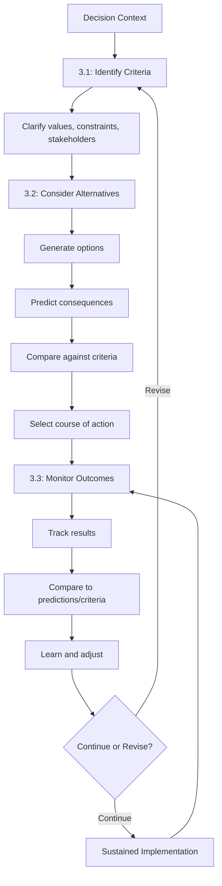

# Extraction Report: Reference Comprehensive Acer Critical Thinking Framework 2025120503

> [!info] Auto-Generated Report
> This report was automatically generated by `pkb_extractor.py` on 2026-03-13 04:17.
> **Source**: `reference-comprehensive-acer-critical-thinking-framework-2025120503.md` | **Items Extracted**: 467

---

## 📋 Document Overview

| Field | Value |
|-------|-------|
| **Source File** | `reference-comprehensive-acer-critical-thinking-framework-2025120503.md` |
| **Extraction Date** | 2026-03-13 04:17 |
| **Word Count** | 10,065 |
| **Character Count** | 76,665 |
| **Line Count** | 1,346 |
| **Total Items Extracted** | 467 |

### Document Outline

- # ACER Framework
  - ## 📑 Table of Contents
  - ## 1️⃣ Framework Foundation & Context
    - ### The Development Challenge
    - ### Philosophical & Theoretical Foundations
  - ## 2️⃣ The Three-Strand Architecture
    - ### Architectural Overview
    - ### Why Three Strands?
  - ## 3️⃣ Strand 1: Constructing Knowledge
    - ### Foundational Concepts
    - ### Aspect 1.1: Questioning
    - ### Aspect 1.2: Interpreting Information
    - ### Aspect 1.3: Organizing Information
  - ## 4️⃣ Strand 2: Evaluating Ideas
    - ### Foundational Concepts
    - ### Aspect 2.1: Identifying Reasoning
    - ### Aspect 2.2: Applying Logic
    - ### Aspect 2.3: Evaluating Claims
  - ## 5️⃣ Strand 3: Making Decisions (The Bridge to Practical Application)
    - ### Foundational Concepts: The Pragmatic Turn
    - ### The Decision-Making Context
    - ### Aspect 3.1: Identifying Criteria for Decision-Making
    - ### Aspect 3.2: Considering Alternatives
    - ### Aspect 3.3: Monitoring Outcomes
    - ### Integrating the Three Aspects: The Complete Decision-Making Process
  - ## 6️⃣ Skill Development Levels & Progression Framework
    - ### The Developmental Perspective
    - ### Level Structure
    - ### Cross-Aspect Development Patterns
    - ### Implications for Personal Knowledge Management
  - ## 7️⃣ Practical Implementation in Decision-Making Contexts
    - ### Applying ACER to Real-World Decisions
    - ### Context 1: Personal Knowledge Management Decisions
    - ### Context 2: Research and Learning Decisions
    - ### Context 3: Professional and Career Decisions
    - ### Implementation Principles
  - ## 8️⃣ Integration Strategies for Personal Knowledge Systems
    - ### Embedding ACER in PKB Architecture
    - ### Strategy 1: Template-Based Prompting
    - ### Strategy 2: Periodic Review Prompts
    - ### Strategy 3: ACER-Aligned Note Types
    - ### Strategy 4: Dataview Queries for Meta-Analysis
    - ### Strategy 5: Integration with Spaced Repetition
  - ## 9️⃣ Synthesis & Mastery
    - ### The Holistic Critical Thinker
    - ### Cognitive Models for Understanding ACER
    - ### Comparative Framework Analysis
    - ### Path to Mastery
  - ## 📊 Metadata & Attribution
  - ## 🔄 Version History
- # 🔗 Related Topics for PKB Expansion

---

## 📊 Extraction Summary

| Item Type | Count |
|-----------|-------|
| Callouts | 58 |
| Code Blocks | 6 |
| Color Spans | 0 |
| Definitions | 11 |
| Embeds | 0 |
| External Links | 1 |
| Footnotes | 0 |
| Headings | 51 |
| Inline Fields | 11 |
| Mermaid Diagrams | 1 |
| Tables | 4 |
| Tags | 12 |
| Wiki Links | 204 |
| **TOTAL** | **467** |

---

## 🔔 Callouts (58)

> [!note] What are Callouts?
> Callouts are `> [!TYPE]` blocks used in Obsidian for structured annotation.
> They carry semantic meaning — definitions, insights, warnings, etc.

### By Type

| Callout Type | Count |
|-------------|-------|
| `[!]` | 2 |
| `[!abstract]` | 1 |
| `[!analogy]` | 1 |
| `[!comprehensive-reference]` | 1 |
| `[!connections-and-links]` | 1 |
| `[!definition]` | 15 |
| `[!example]` | 12 |
| `[!how-to-use-this]` | 1 |
| `[!important]` | 3 |
| `[!key-claim]` | 4 |
| `[!methodology-and-sources]` | 10 |
| `[!overview]` | 1 |
| `[!principle-point]` | 3 |
| `[!the-philosophy]` | 1 |
| `[!warning]` | 2 |

### Full Callout List

#### 1. [OVERVIEW] Untitled *(Line 38)*

> [!overview] Untitled
> - **Title**:: [[ACER Framework]]
> - **Prompt/Topic Used**:: 
> - **Status**:: 🌱 `= this.maturity` | Confidence: `= this.confidence`

#### 2. [] # In-Note Metadata Panel *(Line 43)*

> [!] # In-Note Metadata Panel
> - **Note-Type**: `= this.type`
> - **Development Status**: `= this.maturity`
> - **Epistemic Confidence**: `= this.confidence`
> - **Next Review**: `= this.next-review`
> - **Review Count**: `= this.review-count`
> - **Created**: `= this.created`
> - **Last Modified**: `= this.modified`
> 
> > [!purpose] ### 📝Content Metrics
> > [**Word Count**:: `= this.file.size`]| [**Est. Read Time**:: `= round(this.file.size / 1300) + " min"`]
> > [**Depth Class**:: `= choice(this.file.size < 500, "🌱Stub", choice(this.file.size < 2000, "📄Note", "📜Essay"))`]
> ----
> > [!purpose] ### 🕰️Temporal Context
> > [**Created**:: `= this.file.ctime`] | [**Age**:: `= (date(today) - this.file.ctime).days + " days"`]
> > [**Last Touch**:: `= this.file.mtime`] | [**Staleness**:: `= choice((date(today) - this.file.mtime).days > 180, "🕸️Cobwebs", choice((date(today) - this.file.mtime).days > 30, "🍂Cold", "🔥Fresh"))`]
> > [**Touch Frequency**:: `= choice((date(today) - this.file.mtime).days < 7, "🔥Active", choice((date(today) - this.file.mtime).days < 30, "👌Regular", "❄️Dormant"))`]
> ----
> > [!topic-idea] ### 🔗Network Connectivity
> > [**In-Links**:: `= length(this.file.inlinks)`] | [**Out-Links**:: `= length(this.file.outlinks)`]
> > [**Network Status**:: `= choice(length(this.file.inlinks) = 0, "🕸️Orphan", choice(length(this.file.inlinks) > 5, "⚡ Hub", "🌱Node"))`]
> ```dataviewjs
> // SYSTEM: Semantic Bridge Engine
> // PURPOSE: Find "Sibling" notes that share the same Outlinks (Contexts)
> const current = dv.current();
> const myOutlinks = current.file.outlinks.map(l => l.path);
> 
> // 1. Filter the Vault
> const siblings = dv.pages()
>     .where(p => p.file.path !== current.file.path) // Exclude self
>     .where(p => !current.file.outlinks.map(l => l.path).includes(p.file.path)) // Exclude existing direct links
>     .map(p => {
>         // Find overlap between this page's links and the current page's links
>         const shared = p.file.outlinks.filter(l => myOutlinks.includes(l.path));
>         return { 
>             link: p.file.link, 
>             sharedCount: shared.length, 
>             sharedLinks: shared 
>         };
>     })
>     .where(p => p.sharedCount > 0) // Must share at least 1 connection
>     .sort(p => p.sharedCount, "desc") // Sort by strongest connection
>     .limit(5); // Only show top 5
> 
> // 2. Render the Bridge
> if (siblings.length > 0) {
>     dv.header(3, "Semantic Bridges (Missing Connections)");
>     dv.table(
>         ["Sibling Note", "Strength", "Shared Context"], 
>         siblings.map(s => [
>             s.link, 
>             "🔗" + s.sharedCount, 
>             s.sharedLinks.slice(0, 3).join(", ") + (s.sharedCount > 3 ? "…" : "")
>         ])
>     );
> } else {
>     dv.paragraph("*No semantic siblings found. This note is unique in its connections.*");
> }
> ```
> ---
> ### Related Notes
> ```dataview
> TABLE type, maturity, confidence
> FROM  ""
> WHERE  type = "reference"
> SORT "maturity" DESC
> LIMIT 15
> ```
> ### Sources & References
> ```dataview
> TABLE 
>     source AS "Source Type",
>     file.ctime AS "Date Added"
> FROM ""
> WHERE source = "claude-sonnet-4.5"
> SORT file.ctime DESC
> LIMIT 10
> ```
> ### Backlinks & Connections
> ```dataview
> TABLE 
>     type AS "Type",
>     maturity AS "Maturity",
>     length(file.inlinks) AS "Its Backlinks",
>     dateformat(date(created), "MMM dd, yyyy") AS "Created"
> FROM [[#]]
> WHERE file.name != this.file.name
> SORT length(file.inlinks) DESC
> LIMIT 20
> ```
> ### 2025-12-05 - Initial Creation
> *Context*: `=this.title` **by**: `=this.source`
> *Maturity*: `= this.maturity`  
> *Confidence*: `= this.confidence`
> 
> ### Tags & Classification
> *Primary Tags*: `= this.tags`  
> *Type*: `= this.type`  
> *Source*: `= this.source`

#### 3. [] ### Claude Thinking *(Line 149)*

> [!] ### Claude Thinking
> **PHASE 1: ANALYZE**
> Request Classification:
> - Type: comprehensive_note
> - Scope: reference
> - Research Required: YES - The ACER Framework for critical thinking is not something I have comprehensive, authoritative knowledge of in my training data. This appears to be a specific framework/methodology that warrants research to ensure accuracy and completeness.
> Research Trigger Justification:
> ✓ Topic may involve specific methodological details I need to verify
> ✓ User explicitly requests comprehensive reference documentation
> ✓ Answering requires verification of framework components and best practices
> ✓ Complex synthesis needs authoritative sources for accuracy
> Initial Scope Mapping:
> - Primary domain: Critical Thinking / Decision Making / Cognitive Frameworks
> - Adjacent domains: Problem-solving methodology, Metacognition, Practical reasoning, Applied epistemology
> - Depth requirement: HIGH - This is a reference note requiring exhaustive coverage
> Research Plan:
> 1. Search for "ACER framework critical thinking" to understand the core methodology
> 2. Search for "ACER framework decision making" to understand practical applications
> 3. Search for "critical thinking frameworks comparison" to contextualize ACER
> 4. Search for "ACER framework examples" to find concrete applications
> 5. Search for "ACER framework education" to understand pedagogical context
> **PHASE 2: WEB RESEARCH EXECUTION**
> Let me execute systematic research to build comprehensive understanding of the ACER Framework.
> Based on my comprehensive research, I now have a solid understanding of the ACER Critical Thinking Framework. Let me proceed with the structured planning phase before generating the complete reference note.
> **RESEARCH SYNTHESIS**
> Query Rationale & Findings:
> 6. **Initial Search ("ACER framework critical thinking")**: Revealed that ACER stands for Australian Council for Educational Research, and they developed a Critical Thinking Skill Development Framework with three core strands: Constructing Knowledge, Evaluating Ideas, and Making Decisions.
> 7. **Framework Structure Search**: Confirmed the 3-strand, 9-aspect structure (3 aspects per strand). The framework is designed for operational use in classrooms, with evidence-based foundations.
> 8. **Decision-Making Focus Search**: Found that the "Making Decisions" strand connects critical thinking to practical application, emphasizing the framework's pragmatic orientation beyond pure philosophical analysis.
> Key Discoveries:
> - ACER Framework is specifically designed to operationalize critical thinking in educational settings
> - Three Strands with three aspects each (9 total aspects)
> - Evidence-based synthesis of multiple critical thinking traditions
> - Includes skill development levels (progression framework)
> - Focus on observable behaviors and teachable components
> - Explicitly connects to decision-making and practical application
> **STRUCTURAL PLANNING**
> Given this is a reference note on the ACER Framework for connecting critical thinking to practical decision-making, I should structure it as follows:
> STRUCTURAL REASONING:
> ├── Core Concept Architecture
> │   ├── Why this structure? The ACER Framework is hierarchical (Framework → Strands → Aspects), so documentation should mirror this
> │   └── Information flow logic: Definition → Context → Framework Structure → Deep dive into "Making Decisions" strand → Practical Application → Integration
> ├── Hierarchy Decisions
> │   ├── Primary sections: 
> │   │   1. Introduction & Context (what ACER is, why the framework exists)
> │   │   2. Framework Overview (three-strand structure)
> │   │   3. Deep Dive: Strand 1 (Constructing Knowledge)
> │   │   4. Deep Dive: Strand 2 (Evaluating Ideas)
> │   │   5. MAJOR FOCUS: Strand 3 (Making Decisions) - this connects to practical decision-making
> │   │   6. Skill Development Levels
> │   │   7. Practical Application & Implementation
> │   │   8. Integration with Decision-Making Contexts
> │   │   9. Synthesis & Mastery
> │   └── Subsection depth: Each aspect within strands needs detailed explanation
> └── Cross-referencing Strategy
>     └── Internal link opportunities: Zettelkasten, Metacognition, Problem-Solving, Decision Theory, Educational Psychology, Bloom's Taxonomy, Information Literacy
> **KEY WIKI-LINK OPPORTUNITIES:**
> - [[Critical-Thinking|Critical Thinking]]
> - [[Decision-Making|Decision Making]]
> - [[Problem Solving]]
> - [[Metacognition]]
> - [[Information-Literacy|Information Literacy]]
> - [[Constructivism]]
> - [[Bloom's-Taxonomy|Bloom's Taxonomy]]
> - [[Socratic-Questioning|Socratic Questioning]]
> - [[Argument-Analysis|Argument Analysis]]
> - [[Evidence Evaluation]]
> - [[Cognitive-Biases|Cognitive Biases]]
> - [[Reflective-Practice|Reflective Practice]]
> - [[Educational Assessment]]
> - [[Skill Development Frameworks]]
> - [[Transfer-of-Learning|Transfer of Learning]]
> - [[Epistemic-Cognition|Epistemic Cognition]]
> **CALLOUT STRATEGY:**
> - [!definition] for framework terms and aspects
> - [!principle-point] for core framework principles
> - [!methodology-and-sources] for practical implementation
> - [!example] for concrete illustrations of each aspect
> - [!key-claim] for central arguments about framework utility
> - [!important] for critical constraints or warnings
> - [!connections-and-links] for relationships between strands/aspects
> **METADATA PLANNING:**
> Tags: #critical-thinking #acer-framework #decision-making #skill-development #educational-frameworks #reference-note
> Aliases: [ACER Critical Thinking Framework, Australian Council for Educational Research Framework, ACER CT Framework, Three-Strand Critical Thinking Model]
> Now I'll construct the comprehensive reference note.

#### 4. [COMPREHENSIVE-REFERENCE] 📚 Comprehensive Reference *(Line 240)*

> [!comprehensive-reference] 📚 Comprehensive Reference
> - **Generated**:: 2025-12-05
> - **Version**:: 1.0
> - **Type**:: Reference Documentation
> - **Focus**:: ACER Framework for Connecting Critical Thinking to Practical Decision-Making

#### 5. [ABSTRACT] Untitled *(Line 246)*

> [!abstract] Untitled
> **Executive Overview**
> The [[ACER Framework]] represents a comprehensive, evidence-based approach to [[Critical-Thinking|Critical Thinking]] developed by the Australian Council for Educational Research (ACER). This framework synthesizes multiple philosophical, psychological, and educational traditions into an operational model comprising three interconnected strands: [[Constructing Knowledge]], [[Evaluating Ideas]], and [[Making Decisions]]. Unlike purely theoretical models, the ACER Framework explicitly bridges abstract reasoning with practical decision-making contexts, making it particularly valuable for [[Personal-Knowledge-Management|Personal Knowledge Management]] systems and real-world application.

#### 6. [HOW-TO-USE-THIS] Untitled *(Line 250)*

> [!how-to-use-this] Untitled
> **Navigation Guide**
> This reference note provides exhaustive coverage of the ACER Critical Thinking Framework with particular emphasis on the "Making Decisions" strand and its connection to practical contexts. Use the table of contents for targeted exploration, or follow the sequential progression to build comprehensive understanding. Each aspect includes theoretical grounding, observable behaviors, and practical applications.

#### 7. [DEFINITION] Untitled *(Line 269)*

> [!definition] Untitled
> - **ACER**:: Australian Council for Educational Research
> - **ACER Critical Thinking Framework**:: An evidence-based skill development model that operationalizes critical thinking as three interconnected strands (Constructing Knowledge, Evaluating Ideas, Making Decisions), with nine specific aspects designed for teaching, assessment, and practical application

#### 8. [KEY-CLAIM] Untitled *(Line 279)*

> [!key-claim] Untitled
> **Central Principle**
> Critical thinking in the ACER Framework is characterized as *goal-directed and purpose-driven* [[Cognitive Processes]], whether the goal is solving problems, supporting arguments, conducting experiments, formulating interpretations, or—critically—making practical decisions. This pragmatic orientation moves beyond "reflective skepticism" to encompass generative, applied thinking.

#### 9. [PRINCIPLE-POINT] Untitled *(Line 295)*

> [!principle-point] Untitled
> **Domain-General with Domain-Specific Application**
> While the framework describes critical thinking as a generally applicable skillset that transfers across disciplines, it explicitly acknowledges that application must be embedded within the methodologies, conventions, and "ways of knowing" of specific domains. This balances universality with contextual relevance—essential for [[Transfer-of-Learning|Transfer of Learning]].

#### 10. [DEFINITION] Untitled *(Line 303)*

> [!definition] Untitled
> - **Strand**:: An overarching conceptual category framing the application context for critical thinking skills and knowledge
> - **Aspect**:: A specific content category within a strand, describing observable behaviors or qualities of critical thinking

#### 11. [IMPORTANT] Untitled *(Line 317)*

> [!important] Untitled
> **Critical Distinction: Strands Represent Different Applications, Not Isolated Skills**
> The same abstract critical thinking abilities (analysis, evaluation, synthesis) manifest differently depending on application context. Evaluating a source for reliability (Strand 1) requires different cognitive moves than evaluating logical validity of an argument (Strand 2) or evaluating decision outcomes (Strand 3). The strands are *functionally distinct* applications of core thinking skills.

#### 12. [CONNECTIONS-AND-LINKS] Untitled *(Line 331)*

> [!connections-and-links] Untitled
> **Relationship to Other Frameworks**
> - **[[Bloom's-Taxonomy|Bloom's Taxonomy]]**: ACER aligns with Bloom's higher-order thinking (Analyze, Evaluate, Create) but provides more granular operational detail
> - **[[Creative Thinking]]**: While ACER focuses on critical/analytical processes, ACER also developed parallel frameworks for creative thinking, collaboration, and self-regulation
> - **[[Information-Literacy|Information Literacy]] Models**: Significant overlap with Big6, SCONUL Seven Pillars, and ACRL Framework, particularly in Strand 1
> - **[[Problem-Solving Models]]**: Decision-making strand connects to problem-solving but focuses specifically on analytical/evaluative aspects rather than creative generation

#### 13. [DEFINITION] Untitled *(Line 342)*

> [!definition] Untitled
> **Constructing Knowledge**:: The process of building new understanding through inquiry, interpretation, and organization of information according to appropriate standards

#### 14. [DEFINITION] Untitled *(Line 353)*

> [!definition] Untitled
> **Questioning**:: The ability to recognize knowledge gaps and pose questions that prompt investigation and inquiry

#### 15. [EXAMPLE] Untitled *(Line 365)*

> [!example] Untitled
> **Practical Application in PKB Context**
> When encountering a new concept like "[[Emergence]]" in complex systems:
> - Weak questioning: "What is emergence?"
> - Strong questioning: "What distinguishes emergent properties from aggregate properties? Under what conditions does emergence occur? How can we identify emergence in real systems? What are the implications of emergence for reductionist explanations?"

#### 16. [DEFINITION] Untitled *(Line 380)*

> [!definition] Untitled
> **Interpreting Information**:: The ability to comprehend, analyze, and derive meaning from various forms of information, representations, and data

#### 17. [METHODOLOGY-AND-SOURCES] Untitled *(Line 393)*

> [!methodology-and-sources] Untitled
> **Interpretation Strategies**
> 1. **Close Reading**: Analyzing text at word/sentence level for precise meaning
> 2. **Schema Activation**: Connecting new information to existing knowledge structures
> 3. **Visualization**: Creating mental models of relationships and processes
> 4. **Questioning While Reading**: Engaging actively with material ("What does this mean? Why is this important? How does this connect?")
> 5. **Paraphrasing**: Restating in own words to ensure understanding

#### 18. [DEFINITION] Untitled *(Line 410)*

> [!definition] Untitled
> **Organizing Information**:: The ability to structure, categorize, and synthesize information effectively to produce sound new knowledge products

#### 19. [EXAMPLE] Untitled *(Line 423)*

> [!example] Untitled
> **PKB Application: Note Organization**
> Organizing research on "[[Learning Theory]]" demonstrates this aspect:
> - **Categorization**: Behaviorism, Cognitivism, Constructivism, Connectivism
> - **Hierarchy**: Theories → Principles → Applications → Evidence
> - **Relationships**: How theories critique/build upon each other
> - **Synthesis**: Creating a [[Maps-of-Content-—-MOCs|MOC]] (Map of Content) that integrates perspectives
> - **Tagging/Linking**: Using [[Metadata]] and [[wiki-links]] for [[Networked Thought]]

#### 20. [KEY-CLAIM] Untitled *(Line 439)*

> [!key-claim] Untitled
> **Strand 1 as Foundation for PKB Development**
> For knowledge workers building [[Personal Knowledge Bases]], Strand 1 represents the core skillset for transforming information into knowledge. The three aspects (Questioning, Interpreting, Organizing) map directly onto the [[Capture, Process, Connect]] workflow common in PKM systems. Mastery of these aspects enables compound learning through effective [[Zettelkasten]] practices.

#### 21. [DEFINITION] Untitled *(Line 447)*

> [!definition] Untitled
> **Evaluating Ideas**:: The process of analyzing and judging information, reasoning, arguments, and claims according to appropriate standards of logic, evidence, and validity

#### 22. [DEFINITION] Untitled *(Line 458)*

> [!definition] Untitled
> **Identifying Reasoning**:: The ability to recognize and articulate the structure of arguments, including premises, conclusions, assumptions, and logical connections

#### 23. [EXAMPLE] Untitled *(Line 471)*

> [!example] Untitled
> **Analyzing an Argument**
> Original claim: "We should adopt this new project management methodology because Company X achieved 30% efficiency gains after implementation."
> 
> **Identifying Reasoning:**
> - **Conclusion**: We should adopt the methodology
> - **Explicit Premise**: Company X gained 30% efficiency
> - **Implicit Assumptions**: 
>   - Company X's context is similar to ours
>   - The efficiency gain was caused by the methodology
>   - 30% efficiency gain is worth implementation costs
>   - What worked for X will work for us
> - **Argument Type**: Analogical reasoning (from particular case to application)

#### 24. [DEFINITION] Untitled *(Line 494)*

> [!definition] Untitled
> **Applying Logic**:: The ability to evaluate reasoning using principles of formal and informal logic, assessing validity and soundness

#### 25. [METHODOLOGY-AND-SOURCES] Untitled *(Line 507)*

> [!methodology-and-sources] Untitled
> **Logic Application Framework**
> 1. **Validity Check**: Does the conclusion necessarily follow from premises? (Deductive)
> 2. **Strength Check**: How strongly do premises support the conclusion? (Inductive)
> 3. **Fallacy Scan**: Are there logical fallacies present?
> 4. **Consistency Check**: Do claims contradict each other or established facts?
> 5. **Implication Analysis**: What follows from accepting this reasoning?

#### 26. [WARNING] Untitled *(Line 515)*

> [!warning] Untitled
> **Common Logic Errors**
> - **Confusing validity with truth**: A valid argument can have false premises
> - **Affirming the consequent**: "If P then Q. Q. Therefore P." (Invalid)
> - **Denying the antecedent**: "If P then Q. Not P. Therefore not Q." (Invalid)
> - **False dilemma**: Presenting only two options when more exist
> - **Correlation-causation confusion**: Assuming correlation implies causation

#### 27. [DEFINITION] Untitled *(Line 532)*

> [!definition] Untitled
> **Evaluating Claims**:: The ability to assess the credibility, reliability, and validity of information sources and knowledge claims using appropriate standards

#### 28. [EXAMPLE] Untitled *(Line 545)*

> [!example] Untitled
> **Source Evaluation Matrix**
> 
> When evaluating a claim about [[Productivity Techniques]]:
> 
> | **Criterion** | **Strong Evidence** | **Weak Evidence** |
> |---------------|---------------------|-------------------|
> | **Source Type** | Peer-reviewed research, systematic review | Blog post, anecdote, testimonial |
> | **Author Expertise** | Researchers in relevant field | Non-expert, anonymous |
> | **Evidence Base** | Controlled studies, large samples | Personal experience, single case |
> | **Replication** | Findings reproduced independently | One-off study, unique claim |
> | **Bias/Motivation** | Transparent methods, conflicts disclosed | Commercial interest undisclosed |

#### 29. [KEY-CLAIM] Untitled *(Line 565)*

> [!key-claim] Untitled
> **Strand 2 as Protection Against Cognitive Errors**
> Evaluating Ideas serves as the primary defense against [[misinformation]], [[Cognitive-Biases|Cognitive Biases]], and poor reasoning. In knowledge work and decision-making contexts, these skills prevent incorporation of low-quality information into knowledge bases and protect against systematic errors in [[Judgment and Decision-Making]].

#### 30. [DEFINITION] Untitled *(Line 573)*

> [!definition] Untitled
> **Making Decisions**:: The ability to consider situations, options, and likely outcomes, make choices that maximize positive results, and accurately monitor the effects of decisions

#### 31. [PRINCIPLE-POINT] Untitled *(Line 582)*

> [!principle-point] Untitled
> **Critical Thinking as Applied Rationality**
> The Making Decisions strand embodies Ennis's (1989) expanded definition of critical thinking as "reasonable, reflective thinking focused on deciding what to believe or do." This pragmatic orientation positions critical thinking not merely as skeptical analysis but as generative, action-oriented cognition aimed at practical outcomes.

#### 32. [DEFINITION] Untitled *(Line 600)*

> [!definition] Untitled
> **Identifying Criteria**:: The ability to determine relevant standards, constraints, and values by which to judge decision options and outcomes

#### 33. [EXAMPLE] Untitled *(Line 617)*

> [!example] Untitled
> **Criteria Identification: Choosing a Note-Taking System**
> 
> **Context**: Selecting a PKM tool for long-term knowledge work
> 
> **Criteria Development:**
> 
> | **Criterion** | **Type** | **Rationale** | **Weight** |
> |---------------|----------|---------------|------------|
> | **Local-first data** | Essential | Data sovereignty, longevity | Critical |
> | **Plain-text or open format** | Essential | Future-proofing, portability | Critical |
> | **Bi-directional linking** | Essential | Knowledge graph building | Critical |
> | **Extensibility** | Desirable | Adaptation to evolving needs | High |
> | **Active development** | Desirable | Bug fixes, improvements | Medium |
> | **Learning curve** | Desirable | Implementation friction | Medium |
> | **Cost** | Constraint | Budget limitations | Variable |
> 
> Notice: Criteria emerge from analyzing the decision context (long-term knowledge work), understanding constraints (budget, time), and making values explicit (data sovereignty, future-proofing).

#### 34. [METHODOLOGY-AND-SOURCES] Untitled *(Line 636)*

> [!methodology-and-sources] Untitled
> **Criteria Identification Process**
> 
> 1. **Situational Analysis**
>    - What problem does this decision address?
>    - What constraints exist (time, resources, ethics)?
>    - Who are the stakeholders affected?
> 
> 2. **Outcome Definition**
>    - What would an ideal outcome look like?
>    - What are the minimum acceptable outcomes?
>    - What are the potential negative outcomes to avoid?
> 
> 3. **Value Clarification**
>    - What values are at stake in this decision?
>    - Are there competing values that require trade-offs?
>    - Whose values matter and why?
> 
> 4. **Criteria Derivation**
>    - What specific, measurable criteria follow from the above?
>    - How can we prioritize or weight these criteria?
>    - Are criteria mutually compatible or in tension?

#### 35. [IMPORTANT] Untitled *(Line 667)*

> [!important] Untitled
> **The Criteria Problem in Ill-Structured Decisions**
> Many real-world decisions are [[Ill-Structured-Problems|Ill-Structured Problems]] where appropriate criteria are unclear or contested. Part of critical thinking in decision-making is wrestling with *what should count as a good decision* before evaluating specific options. This meta-level reasoning is often more challenging than comparing options against established criteria.

#### 36. [DEFINITION] Untitled *(Line 675)*

> [!definition] Untitled
> **Considering Alternatives**:: The ability to generate, compare, and evaluate multiple potential courses of action against established criteria

#### 37. [EXAMPLE] Untitled *(Line 693)*

> [!example] Untitled
> **Alternative Comparison: Research Method Selection**
> 
> **Decision**: How to deepen understanding of [[Spaced-Repetition-Spacing-Effect|Spaced Repetition]]
> 
> **Alternatives:**
> 
> | **Alternative** | **Criteria: Depth** | **Criteria: Time** | **Criteria: Applicability** | **Trade-offs** |
> |-----------------|---------------------|--------------------|-----------------------------|----------------|
> | **Read comprehensive textbook** | High (systematic coverage) | High (100+ hours) | Medium (general principles) | Depth vs. Time |
> | **Practice with SRS for 6 months** | High (experiential) | Very High (daily commitment) | Very High (direct experience) | Time investment, potential inefficiency without theory |
> | **Read 10 key papers** | Medium-High (targeted) | Medium (20-30 hours) | High (evidence-based) | Breadth limitations |
> | **Synthesis from multiple sources** | Very High (integrated view) | High (research + synthesis) | Very High (customized) | Requires existing foundation |
> | **Course or workshop** | Medium (structured) | Low-Medium (condensed) | Medium (varies by course) | Less control, potential superficiality |
> 
> **Analysis**: Each alternative involves trade-offs. The "best" choice depends on criteria weights (e.g., time-constrained = favor course; depth-seeking = favor textbook + practice).

#### 38. [METHODOLOGY-AND-SOURCES] Untitled *(Line 710)*

> [!methodology-and-sources] Untitled
> **Alternative Comparison Framework**
> 
> 1. **Alternative Generation**
>    - Brainstorm options without immediate evaluation
>    - Consider conventional and unconventional alternatives
>    - Ask: "What else could we do?"
> 
> 2. **Consequence Prediction**
>    - What are the likely outcomes of each alternative?
>    - What could go wrong (risk analysis)?
>    - What uncertainties exist?
> 
> 3. **Systematic Evaluation**
>    - Rate each alternative against each criterion
>    - Use [[Decision Matrices]] or [[Weighted Scoring]] where appropriate
>    - Consider both quantitative and qualitative factors
> 
> 4. **Trade-off Analysis**
>    - Where do alternatives excel and fall short?
>    - What must be sacrificed to gain what benefit?
>    - Are there ways to mitigate downsides?
> 
> 5. **Sensitivity Analysis**
>    - How sensitive is the choice to changes in assumptions?
>    - What would have to be true for an alternative option to be best?

#### 39. [WARNING] Untitled *(Line 745)*

> [!warning] Untitled
> **Cognitive Biases in Alternative Evaluation**
> 
> Critical thinking in this aspect requires awareness of systematic biases:
> - **[[Confirmation-Bias-Myside-Bias|Confirmation Bias]]**: Favoring information supporting preferred option
> - **[[Anchoring Bias]]**: Over-weighting first alternative considered
> - **[[Status-quo-bias|Status Quo Bias]]**: Preferring current state over change
> - **[[Sunk-cost-fallacy|Sunk Cost Fallacy]]**: Continuing investment due to past commitment
> - **[[Availability-Heuristic|Availability Heuristic]]**: Over-weighting easily recalled outcomes
> - **[[Optimism Bias]]**: Underestimating likelihood of negative outcomes
> 
> Systematic evaluation using explicit criteria helps counteract these biases.

#### 40. [DEFINITION] Untitled *(Line 762)*

> [!definition] Untitled
> **Monitoring Outcomes**:: The ability to track the effects of decisions, evaluate results against criteria, and adjust course based on feedback

#### 41. [EXAMPLE] Untitled *(Line 780)*

> [!example] Untitled
> **Outcome Monitoring: PKB System Implementation**
> 
> **Decision**: Implement [[Zettelkasten]] methodology in [[Obsidian]]
> 
> **Monitoring Framework:**
> 
> | **Success Criterion** | **Measurement Method** | **Review Frequency** | **Outcome (6 months)** | **Analysis & Adjustment** |
> |----------------------|------------------------|---------------------|----------------------|---------------------------|
> | **Sustained daily capture** | Log capture sessions | Weekly | 85% compliance | **Good**. Slight template friction identified—streamline capture template. |
> | **Note permanence quality** | Audit sample of permanent notes for atomicity, clarity | Monthly | 70% meet standard | **Needs work**. Creating "refactoring sprint" to improve existing notes. Common issue: notes too broad—adjust capture habit to enforce atomicity earlier. |
> | **Knowledge connections** | Track backlink density, graph evolution | Bi-weekly | Avg 4.2 links per note (target: 5+) | **Near target**. Need more intentional connection sessions. Implement weekly "link audit." |
> | **Retrieval success** | Measure ability to find relevant notes when needed | Ad hoc (whenever retrieval is needed) | 90% success rate | **Excellent**. Tagging and linking strategy effective. |
> | **Synthesis productivity** | Track production of MOCs and synthesis notes | Monthly | 2 MOCs, 5 synthesis notes created | **Below target** (wanted 4 MOCs). Time constraint—need to budget dedicated synthesis time. |
> 
> **Learning**: Daily capture strong, but synthesis and connection work needs more structured time allocation. Template friction slowing capture—needs refinement.

#### 42. [METHODOLOGY-AND-SOURCES] Untitled *(Line 797)*

> [!methodology-and-sources] Untitled
> **Outcome Monitoring Process**
> 
> 1. **Establish Baselines & Metrics**
>    - What data will indicate success or failure?
>    - How will we collect this data?
>    - What baselines exist for comparison?
> 
> 2. **Systematic Tracking**
>    - Regular data collection (not just when things go wrong)
>    - Both quantitative and qualitative indicators
>    - Capturing unexpected effects
> 
> 3. **Comparative Analysis**
>    - How do actual outcomes compare to predictions?
>    - How do results measure against criteria?
>    - What patterns emerge over time?
> 
> 4. **Causal Analysis**
>    - Why did outcomes occur as they did?
>    - What factors contributed to success or failure?
>    - What assumptions were validated or invalidated?
> 
> 5. **Adaptive Response**
>    - What adjustments should be made based on evidence?
>    - Should we persist, modify, or abandon this course?
>    - What have we learned for future decisions?

#### 43. [KEY-CLAIM] Untitled *(Line 833)*

> [!key-claim] Untitled
> **Closing the Learning Loop**
> Monitoring outcomes transforms decision-making from a one-time event into a learning cycle. This aspect is essential for [[Deliberate-Practice|Deliberate Practice]] in decision-making—without systematic outcome monitoring, individuals cannot learn what decision strategies work and fail to develop decision-making expertise over time. It embodies the scientific attitude applied to practical action.

#### 44. [PRINCIPLE-POINT] Untitled *(Line 864)*

> [!principle-point] Untitled
> **Decision Quality vs. Outcome Quality**
> A crucial distinction in critical thinking about decisions: decision *quality* (the reasoning process) differs from outcome *quality* (the results). Good processes can yield poor outcomes due to uncertainty, and poor processes can yield good outcomes by luck. Strand 3 emphasizes that critical thinking focuses on decision process quality—using appropriate criteria, systematic alternative evaluation, and evidence-based learning—which improves outcomes probabilistically over time.

#### 45. [DEFINITION] Untitled *(Line 872)*

> [!definition] Untitled
> **Skill Development Levels**:: Validated progressions describing how critical thinking skills develop from novice to expert performance, enabling educators and learners to identify current proficiency and target growth

#### 46. [EXAMPLE] Untitled *(Line 892)*

> [!example] Untitled
> **Sample Development Progression: Aspect 3.1 (Identifying Criteria)**
> 
> | **Level** | **Observable Characteristics** | **Example Behaviors** |
> |-----------|-------------------------------|----------------------|
> | **Low** | Uses implicit, unstated criteria; May rely on others' criteria without evaluation; Limited awareness of values/constraints | "I'll choose this option because it seems better." (No explicit justification or criteria articulated) |
> | **Mid** | Identifies some relevant criteria explicitly; Recognizes need to consider multiple factors; May struggle with prioritization or conflicting criteria | "We need to consider cost, quality, and timeline. Cost is probably most important, but quality matters too." (Multiple criteria identified, basic prioritization attempted) |
> | **High** | Systematically derives comprehensive criteria from situation analysis; Makes values and priorities explicit with justification; Recognizes stakeholder perspectives and competing values; Prioritizes criteria with clear rationale | "Given our context (startup with limited runway), criteria should be: 1) Time-to-market (critical—survival depends on quick launch), 2) Core functionality (essential features only), 3) Quality (good-enough, not perfect), 4) Cost (secondary—we have funding). This prioritization reflects our strategic position and stakeholder needs (investors want fast validation, users want working solution)." |

#### 47. [METHODOLOGY-AND-SOURCES] Untitled *(Line 917)*

> [!methodology-and-sources] Untitled
> **Using Development Levels for Self-Assessment**
> 
> 1. **Select an aspect** to evaluate (e.g., Identifying Criteria)
> 2. **Gather evidence** of your performance (recent decisions, written work, recorded reasoning)
> 3. **Compare to level descriptors** - Which level most accurately describes your typical performance?
> 4. **Identify specific gaps** - What behaviors characterize the next level that you don't yet demonstrate?
> 5. **Design deliberate practice** - Create exercises targeting specific missing behaviors
> 6. **Monitor progression** - Periodically reassess using new evidence

#### 48. [METHODOLOGY-AND-SOURCES] Untitled *(Line 950)*

> [!methodology-and-sources] Untitled
> **PKM Decision Framework**
> 
> **Strand 1 Application (Constructing Knowledge):**
> - **Questioning**: What do I need to know? What gaps exist in my understanding?
> - **Interpreting**: What does this source really say? What are the key insights?
> - **Organizing**: How should this knowledge be structured for future retrieval and connection?
> 
> **Strand 2 Application (Evaluating Ideas):**
> - **Identifying Reasoning**: What claims are being made? What supports them?
> - **Applying Logic**: Are these arguments valid? Do they contain fallacies?
> - **Evaluating Claims**: Is this source credible? Is this evidence strong?
> 
> **Strand 3 Application (Making Decisions):**
> - **Identifying Criteria**: What makes a PKM practice effective *for my goals*?
> - **Considering Alternatives**: What are different approaches to this problem? Trade-offs?
> - **Monitoring Outcomes**: Is this practice working? What evidence tells me?

#### 49. [EXAMPLE] Untitled *(Line 968)*

> [!example] Untitled
> **Decision: How to Process Research Papers into PKB**
> 
> **3.1 - Criteria Identification:**
> - Comprehension depth (must understand core arguments)
> - Connection creation (must integrate with existing knowledge)
> - Future retrievability (must be findable when needed)
> - Time efficiency (sustainable long-term practice)
> - Actionability (produce usable notes, not just summaries)
> 
> **3.2 - Alternative Consideration:**
> 
> | **Approach** | **Pros** | **Cons** | **Fit to Criteria** |
> |--------------|----------|----------|---------------------|
> | **Full paper notes** | Comprehensive, permanent reference | Time-intensive, may include too much detail | High depth, low efficiency |
> | **Key insights extraction** | Focused on transferable ideas | May miss context | High connections, medium depth |
> | **Progressive summarization** | Layered approach, flexible depth | Requires multiple passes | Balanced approach |
> | **Concept mapping** | Visual relationships | Time-intensive for complex papers | High connections, variable depth |
> 
> **Decision**: Progressive summarization with emphasis on conceptual connections
> 
> **3.3 - Outcome Monitoring:**
> - Track: Time per paper, note reuse frequency, comprehension retention (test via recall)
> - Review monthly: Is retrieval effective? Are notes being referenced?
> - Adjust: If retrieval fails, identify why (poor tagging, insufficient synthesis, wrong abstraction level)

#### 50. [EXAMPLE] Untitled *(Line 998)*

> [!example] Untitled
> **Decision: Learning Strategy for New Domain ([[Cosmology]])**
> 
> **3.1 - Criteria:**
> - Foundational understanding (must grasp core principles)
> - Mathematical competence (must handle quantitative reasoning)
> - Current knowledge (up-to-date on recent developments)
> - Interconnection (understand relationships to physics, philosophy)
> - Resource efficiency (time-constrained—16 week timeframe)
> 
> **3.2 - Alternatives:**
> - Textbook study (systematic, foundational)
> - Paper reading (current, specialized)
> - Online courses (structured, intermediate)
> - Hybrid approach (textbook + papers + courses)
> 
> **Analysis**: Hybrid approach scores highest:
> - Textbook provides foundation
> - Online courses provide visualization and pacing
> - Papers provide currency and depth
> - Trade-off: Higher cognitive load managing multiple resources
> 
> **3.3 - Monitoring:**
> - Weekly: Can I explain core concepts without reference?
> - Bi-weekly: Can I solve practice problems independently?
> - Monthly: Am I encountering papers I can understand?
> - Evidence-based adjustment: If comprehension lags, more time on foundations; if too comfortable, increase difficulty

#### 51. [METHODOLOGY-AND-SOURCES] Untitled *(Line 1030)*

> [!methodology-and-sources] Untitled
> **Professional Decision Template**
> 
> **Criteria Development Questions:**
> - What are my core values (autonomy, impact, learning, security, income)?
> - What constraints do I face (financial, location, time)?
> - What outcomes define success for this decision?
> - What are the opportunity costs of each alternative?
> 
> **Alternative Evaluation Process:**
> - Generate options without immediate filtering
> - For each, predict: 1-year, 3-year, 5-year outcomes
> - Rate against each criterion (quantitative where possible)
> - Consider reversibility (how difficult to undo?)
> - Assess information needs (what do I need to know to decide confidently?)
> 
> **Outcome Monitoring Plan:**
> - Define specific success indicators upfront
> - Schedule periodic reviews (3-month, 6-month, 1-year)
> - Track both objective (income, skills acquired) and subjective (satisfaction, learning) measures
> - Maintain decision log (what I predicted, what actually happened, why)

#### 52. [IMPORTANT] Untitled *(Line 1065)*

> [!important] Untitled
> **Critical Thinking as Deliberate, Not Automatic**
> Quality critical thinking requires *effortful, systematic application* of these processes. Intuition and fast thinking ([[System-1|System 1]]) have their place, but for consequential decisions, the ACER Framework provides structure for slow, analytical thinking ([[System-2|System 2]]). The framework doesn't eliminate all uncertainty or guarantee outcomes, but it dramatically improves decision process quality.

#### 53. [EXAMPLE] Untitled *(Line 1081)*

> [!example] Untitled
> **Decision Log Template** (Obsidian/Markdown)
> 
> ```markdown
> # Decision: [Title]
> 
> **Date**: YYYY-MM-DD
> **Status**: [[Considering]] / [[Decided]] / [[Implemented]] / [[Under Review]]
> **Tags**: #decision-log #[domain]
> 
> ## Context
> [What situation prompted this decision?]
> 
> ## 3.1: Criteria
> **Essential Criteria**:
> - [ ] [Criterion 1]: [Why essential?]
> - [ ] [Criterion 2]: [Why essential?]
> 
> **Desirable Criteria**:
> - [ ] [Criterion 3]: [Why valuable?]
> - [ ] [Criterion 4]: [Why valuable?]
> 
> **Constraints**:
> - [Constraint 1]: [Details]
> - [Constraint 2]: [Details]
> 
> ## 3.2: Alternatives Considered
> 
> ### Alternative A: [Name]
> **Description**: [What is this option?]
> **Pros**: 
> - [Advantage 1]
> - [Advantage 2]
> **Cons**:
> - [Disadvantage 1]
> - [Disadvantage 2]
> **Criteria Fit**: [How does this score against criteria?]
> 
> ### Alternative B: [Name]
> [Repeat structure]
> 
> ### Alternative C: [Name]
> [Repeat structure]
> 
> ## Decision Matrix
> 
> | Alternative | Criterion 1 | Criterion 2 | Criterion 3 | Total Score |
> |-------------|-------------|-------------|-------------|-------------|
> | A | [Score] | [Score] | [Score] | [Sum] |
> | B | [Score] | [Score] | [Score] | [Sum] |
> | C | [Score] | [Score] | [Score] | [Sum] |
> 
> ## Decision
> **Selected**: [Alternative X]
> **Rationale**: [Why this choice given the analysis above?]
> **Implementation Plan**: [What are next steps?]
> **Predictions**: [What do I expect to happen?]
> 
> ## 3.3: Outcome Monitoring
> 
> ### Review Schedule
> - [ ] 1-week check-in: [Date]
> - [ ] 1-month review: [Date]
> - [ ] 3-month evaluation: [Date]
> 
> ### Success Metrics
> - **Metric 1**: [How measured?] Target: [Value]
> - **Metric 2**: [How measured?] Target: [Value]
> 
> ### Review Entries
> 
> #### [Date] - [Period] Review
> **Outcomes observed**:
> - [What actually happened?]
> 
> **Comparison to predictions**:
> - [Prediction 1]: [Accurate/Inaccurate - Why?]
> - [Prediction 2]: [Accurate/Inaccurate - Why?]
> 
> **Learnings**:
> - [What does this teach me about decision-making in this domain?]
> 
> **Adjustments**:
> - [What changes should be made based on evidence?]
> ```

#### 54. [METHODOLOGY-AND-SOURCES] Untitled *(Line 1171)*

> [!methodology-and-sources] Untitled
> **Weekly Review: Critical Thinking Audit**
> 
> **Strand 1 Check (Constructing Knowledge):**
> - What questions am I pursuing this week?
> - What information have I interpreted? Any misunderstandings discovered?
> - How am I organizing new knowledge? Is the system working?
> 
> **Strand 2 Check (Evaluating Ideas):**
> - What claims have I encountered? Did I evaluate them critically?
> - What arguments did I analyze? Were they sound?
> - Did I identify any faulty reasoning (in sources or my own thinking)?
> 
> **Strand 3 Check (Making Decisions):**
> - What decisions did I make this week?
> - Did I identify criteria explicitly before deciding?
> - Did I consider multiple alternatives systematically?
> - What outcomes am I monitoring? What evidence have I gathered?

#### 55. [EXAMPLE] Untitled *(Line 1224)*

> [!example] Untitled
> **Sample Spaced Repetition Cards**
> 
> **Front**: You're deciding between three project management methodologies. What's the first critical thinking step in Strand 3?
> **Back**: **Aspect 3.1: Identify Criteria**. Before comparing methodologies, establish clear criteria for evaluation based on project context, constraints, and desired outcomes.
> 
> **Front**: You notice your PKB organization isn't supporting effective retrieval. Which ACER aspect should guide your response?
> **Back**: **Aspect 3.3: Monitoring Outcomes**. Analyze what specifically is failing (evidence), diagnose why (causal analysis), and adjust organization strategy based on findings.

#### 56. [THE-PHILOSOPHY] Untitled *(Line 1249)*

> [!the-philosophy] Untitled
> **The Examined Decision, The Examined Life**
> 
> The ACER Framework's connection of critical thinking to decision-making embodies the Socratic ideal: the examined life consists not merely of skeptical analysis but of *living rationally*—making decisions based on evidence, reason, and systematic reflection. The framework operationalizes [[Practical Wisdom]] ([[Phronesis]]) for contemporary contexts: the capacity to deliberate well about what conduces to living well.
> 
> For the knowledge worker, this manifests as building not just a knowledge *base* but a knowledge *system* that embodies critical thinking in its structure. Every note becomes evidence of questioning (Aspect 1.1), interpretation (1.2), organization (1.3). Every synthesis becomes evidence of reasoning identification (2.1) and claim evaluation (2.3). Every decision log becomes evidence of criteria identification (3.1), alternative comparison (3.2), and outcome monitoring (3.3).
> 
> The Personal Knowledge Base, properly constructed, becomes an *externalized critical thinking system*—a second brain that doesn't just store information but systematically applies the principles of sound reasoning to that information.

#### 57. [ANALOGY] Untitled *(Line 1262)*

> [!analogy] Untitled
> **The Scientific Method as ACER Application**
> 
> The ACER Framework can be understood as the intellectual infrastructure underlying scientific inquiry:
> 
> - **Strand 1 (Constructing Knowledge)**: Observation, hypothesis formation, data gathering
> - **Strand 2 (Evaluating Ideas)**: Peer review, analyzing methodology, assessing evidence quality
> - **Strand 3 (Making Decisions)**: Experimental design choices, interpreting results, determining next research directions
> 
> Just as science advances through systematic application of these processes, personal knowledge work advances through systematic application of ACER principles.

#### 58. [METHODOLOGY-AND-SOURCES] Untitled *(Line 1321)*

> [!methodology-and-sources] Untitled
> **Research Methodology**
> 
> **Primary Sources:**
> - Heard, J., Scoular, C., Duckworth, D., Ramalingam, D., & Teo, I. (2025). *Critical thinking: Skill development framework* (2nd ed.). Australian Council for Educational Research. https://doi.org/10.37517/978-1-74286-752-6
> - Heard, J., Scoular, C., Duckworth, D., Ramalingam, D., & Teo, I. (2020). *Critical Thinking: Definition and Structure*. Australian Council for Educational Research.
> - ACER. (2020). *Assessment of General Capabilities: Skills for the 21st century learner*. Australian Council for Educational Research.
> 
> **Secondary Sources:**
> - ResearchGate publications analyzing ACER framework implementation
> - ACER documentation on essential skills development
> - Educational research journals applying ACER frameworks
> 
> **Research Queries Performed:**
> 1. "ACER framework critical thinking"
> 2. "ACER framework three strands constructing knowledge evaluating ideas making decisions"
> 3. "ACER critical thinking aspects nine components framework details"
> 4. "ACER critical thinking decision making practical application classroom"
> 
> **Synthesis Approach:**
> Evidence-based compilation drawing from official ACER publications, implementation research, and educational theory. Framework structure synthesized from primary sources; practical applications derived from implementation literature and PKM best practices.
> 
> **Confidence Level:**
> - **High confidence**: Framework structure (3 strands, 9 aspects), theoretical foundations, developmental levels (directly from primary sources)
> - **High confidence**: Connection to decision-making, practical application (explicitly stated in ACER materials)
> - **Medium-high confidence**: PKM integration strategies (derived from framework principles applied to knowledge management contexts)

---

## 🔗 Wiki-Links (204 total, 159 unique targets)

> [!info] Knowledge Graph Connections
> These links represent connections to other notes in your PKB.
> **159** distinct notes are referenced.

### Unique Targets

- [[ACER Framework]]
- [[Abductive-Reasoning|Abductive Reasoning]]
- [[Action Research]]
- [[Adaptive Decision-Making]]
- [[Adaptive Learning]]
- [[Anchoring Bias]]
- [[Applied Problem-Solving]]
- [[Argument-Analysis|Argument Analysis]]
- [[Argument Analysis Notes]]
- [[Argument Evaluation]]
- [[Argument-Mapping|Argument Mapping]]
- [[Argument Patterns]]
- [[Argumentation-Theory|Argumentation Theory]]
- [[Assumption Detection]]
- [[Availability-Heuristic|Availability Heuristic]]
- [[Bayesian-Reasoning|Bayesian Reasoning]]
- [[Bloom's-Taxonomy|Bloom's Taxonomy]]
- [[Capture, Process, Connect]]
- [[Categorical Thinking]]
- [[Causal Analysis]]
- [[Cognitive-Biases|Cognitive Biases]]
- [[Cognitive Processes]]
- [[cognitive-psychology|Cognitive Psychology]]
- [[Cognitive-Science|Cognitive Science]]
- [[Comparative Analysis]]
- [[Comprehension]]
- [[Conditional Reasoning]]
- [[Confirmation-Bias-Myside-Bias|Confirmation Bias]]
- [[Consequence Prediction]]
- [[Considering]]
- [[Consistency Checking]]
- [[Constraint Recognition]]
- [[Constructing Knowledge]]
- [[Constructivism]]
- [[Cosmology]]
- [[Counterfactual Thinking]]
- [[Creative Thinking]]
- [[Critical Reading]]
- [[Critical-Thinking|Critical Thinking]]
- [[Critical Thinking Dispositions and Habits of Mind]]
- [[Curiosity]]
- [[Data Analysis]]
- [[Dataview]]
- [[Decided]]
- [[Decision Analysis]]
- [[Decision Logs]]
- [[Decision-Making|Decision Making]]
- [[Decision Matrices]]
- [[Decision-Theory|Decision Theory]]
- [[Decision-Making Under Uncertainty: Integrating Critical Thinking with Probabilistic Reasoning]]
- [[Deductive-Reasoning|Deductive Reasoning]]
- [[Deliberate-Practice|Deliberate Practice]]
- [[Developmental Progressions in Complex Cognition]]
- [[Educational Assessment]]
- [[Educational-Psychology|Educational Psychology]]
- [[Emergence]]
- [[Epistemic-Cognition|Epistemic Cognition]]
- [[epistemic-justification|Epistemic Justification]]
- [[Epistemic-Vigilance|Epistemic Vigilance]]
- [[Evaluating Ideas]]
- [[Evidence Assessment]]
- [[Evidence Evaluation]]
- [[Evidence-Based Adjustment]]
- [[Evidence-Based Reasoning]]
- [[Facione's Core Skills]]
- [[Fallacy Recognition]]
- [[Feedback Loops]]
- [[Formal-Logic|Formal Logic]]
- [[Goal Specification]]
- [[Goal-Setting-Theory|Goal-Setting Theory]]
- [[Hypothesis Generation]]
- [[Ill-Structured-Problems|Ill-Structured Problems]]
- [[Implemented]]
- [[Implication]]
- [[Inductive-Reasoning|Inductive Reasoning]]
- [[Inference]]
- [[Informal-Logic|Informal Logic]]
- [[Information-Literacy|Information Literacy]]
- [[Information Literacy and Digital Epistemology in the Age of AI]]
- [[information-processing|Information Processing]]
- [[Inquiry-Based-Learning|Inquiry-Based Learning]]
- [[Fading-—-Instructional-Design-Collins,-Brown-&-Newman|Instructional Design]]
- [[Judgment Under Uncertainty]]
- [[Judgment and Decision-Making]]
- [[Knowledge Construction]]
- [[Knowledge-Management|Knowledge Management]]
- [[knowledge-representation|Knowledge Representation]]
- [[Learning Theory]]
- [[Lifelong-learning|Lifelong Learning]]
- [[Logical Analysis]]
- [[Logical Fallacies]]
- [[Logical-Reasoning|Logical Reasoning]]
- [[Maps-of-Content-—-MOCs|MOC]]
- [[Making Decisions]]
- [[Metacognition]]
- [[metacognitive-awareness|Metacognitive Awareness]]
- [[Metacognitive-Monitoring|Metacognitive Monitoring]]
- [[Metadata]]
- [[misinformation]]
- [[Modal Logic]]
- [[Multi-Criteria Decision Analysis]]
- [[Networked Thought]]
- [[Note-Taking]]
- [[Obsidian]]
- [[Optimism Bias]]
- [[Pattern-Recognition|Pattern Recognition]]
- [[Paul-Elder-Framework|Paul-Elder Framework]]
- [[Personal Knowledge Bases]]
- [[Personal-Knowledge-Management|Personal Knowledge Management]]
- [[Perspective-Taking]]
- [[Phronesis]]
- [[Plan-Do-Study-Act]]
- [[Practical Wisdom]]
- [[Prioritization]]
- [[Problem Identification]]
- [[Problem Solving]]
- [[Problem-Solving]]
- [[Problem-Solving Models]]
- [[Productivity Techniques]]
- [[Propositional Logic]]
- [[Prospect Theory]]
- [[Question Notes]]
- [[RED Model]]
- [[Reading-Comprehension|Reading Comprehension]]
- [[Reflective-Practice|Reflective Practice]]
- [[Research Methods]]
- [[Risk Assessment]]
- [[scenario-planning|Scenario Planning]]
- [[Scientific-Reasoning|Scientific Reasoning]]
- [[Selective Combination]]
- [[Selective Comparison]]
- [[Selective Encoding]]
- [[Sense-Making]]
- [[Situation Analysis]]
- [[Skepticism]]
- [[Skill Development Frameworks]]
- [[Socratic-Questioning|Socratic Questioning]]
- [[Source Criticism]]
- [[Source Evaluation Notes]]
- [[Spaced-Repetition-Spacing-Effect|Spaced Repetition]]
- [[Stakeholder Analysis]]
- [[Status-quo-bias|Status Quo Bias]]
- [[Structural Thinking]]
- [[Sunk-cost-fallacy|Sunk Cost Fallacy]]
- [[Synthesis]]
- [[Synthesis Notes]]
- [[System-1|System 1]]
- [[System-2|System 2]]
- [[Systems-Thinking|Systems Thinking]]
- [[Trade-off Recognition]]
- [[Transfer-of-Learning|Transfer of Learning]]
- [[Uncertainty Management]]
- [[Under Review]]
- [[Value Identification]]
- [[Value Theory]]
- [[Vygotsky's-Zone-of-Proximal-Development|Vygotsky's Zone of Proximal Development]]
- [[Weighted Scoring]]
- [[wiki-links]]
- [[Zettelkasten]]

### All Occurrences

| # | Target | Display Text | Heading | Section | Line |
|---|--------|-------------|---------|---------|------|
| 1 | [[ACER Framework]] | — | — | Document Start | 39 |
| 2 | [[Critical-Thinking|Critical Thinking]] | — | — | ACER Framework | 206 |
| 3 | [[Decision-Making|Decision Making]] | — | — | ACER Framework | 207 |
| 4 | [[Problem Solving]] | — | — | ACER Framework | 208 |
| 5 | [[Metacognition]] | — | — | ACER Framework | 209 |
| 6 | [[Information-Literacy|Information Literacy]] | — | — | ACER Framework | 210 |
| 7 | [[Constructivism]] | — | — | ACER Framework | 211 |
| 8 | [[Bloom's-Taxonomy|Bloom's Taxonomy]] | — | — | ACER Framework | 212 |
| 9 | [[Socratic-Questioning|Socratic Questioning]] | — | — | ACER Framework | 213 |
| 10 | [[Argument-Analysis|Argument Analysis]] | — | — | ACER Framework | 214 |
| 11 | [[Evidence Evaluation]] | — | — | ACER Framework | 215 |
| 12 | [[Cognitive-Biases|Cognitive Biases]] | — | — | ACER Framework | 216 |
| 13 | [[Reflective-Practice|Reflective Practice]] | — | — | ACER Framework | 217 |
| 14 | [[Educational Assessment]] | — | — | ACER Framework | 218 |
| 15 | [[Skill Development Frameworks]] | — | — | ACER Framework | 219 |
| 16 | [[Transfer-of-Learning|Transfer of Learning]] | — | — | ACER Framework | 220 |
| 17 | [[Epistemic-Cognition|Epistemic Cognition]] | — | — | ACER Framework | 221 |
| 18 | [[ACER Framework]] | — | — | ACER Framework | 248 |
| 19 | [[Critical-Thinking|Critical Thinking]] | — | — | ACER Framework | 248 |
| 20 | [[Constructing Knowledge]] | — | — | ACER Framework | 248 |
| 21 | [[Evaluating Ideas]] | — | — | ACER Framework | 248 |
| 22 | [[Making Decisions]] | — | — | ACER Framework | 248 |
| 23 | [[Personal-Knowledge-Management|Personal Knowledge Management]] | — | — | ACER Framework | 248 |
| 24 | [[Educational-Psychology|Educational Psychology]] | — | — | The Development Challenge | 275 |
| 25 | [[Cognitive-Science|Cognitive Science]] | — | — | The Development Challenge | 275 |
| 26 | [[Cognitive Processes]] | — | — | The Development Challenge | 281 |
| 27 | [[Logical Analysis]] | — | — | Philosophical & Theoretical Foundations | 287 |
| 28 | [[Argument Evaluation]] | — | — | Philosophical & Theoretical Foundations | 287 |
| 29 | [[cognitive-psychology|Cognitive Psychology]] | — | — | Philosophical & Theoretical Foundations | 289 |
| 30 | [[information-processing|Information Processing]] | — | — | Philosophical & Theoretical Foundations | 289 |
| 31 | [[Metacognition]] | — | — | Philosophical & Theoretical Foundations | 289 |
| 32 | [[Problem Solving]] | — | — | Philosophical & Theoretical Foundations | 289 |
| 33 | [[Information-Literacy|Information Literacy]] | — | — | Philosophical & Theoretical Foundations | 291 |
| 34 | [[Knowledge Construction]] | — | — | Philosophical & Theoretical Foundations | 291 |
| 35 | [[Bloom's-Taxonomy|Bloom's Taxonomy]] | — | — | Philosophical & Theoretical Foundations | 293 |
| 36 | [[Fading-—-Instructional-Design-Collins,-Brown-&-Newman|Instructional Design]] | — | — | Philosophical & Theoretical Foundations | 293 |
| 37 | [[Transfer-of-Learning|Transfer of Learning]] | — | — | Philosophical & Theoretical Foundations | 297 |
| 38 | [[Bloom's-Taxonomy|Bloom's Taxonomy]] | — | — | Why Three Strands? | 333 |
| 39 | [[Creative Thinking]] | — | — | Why Three Strands? | 334 |
| 40 | [[Information-Literacy|Information Literacy]] | — | — | Why Three Strands? | 335 |
| 41 | [[Problem-Solving Models]] | — | — | Why Three Strands? | 336 |
| 42 | [[Constructivism]] | Constructivist | — | Foundational Concepts | 347 |
| 43 | [[Information-Literacy|Information Literacy]] | — | — | Foundational Concepts | 347 |
| 44 | [[Research Methods]] | — | — | Foundational Concepts | 347 |
| 45 | [[Inquiry-Based-Learning|Inquiry-Based Learning]] | — | — | Foundational Concepts | 347 |
| 46 | [[Lifelong-learning|Lifelong Learning]] | — | — | Foundational Concepts | 349 |
| 47 | [[Personal-Knowledge-Management|Personal Knowledge Management]] | — | — | Foundational Concepts | 349 |
| 48 | [[Metacognition]] | — | — | Aspect 1.1: Questioning | 356 |
| 49 | [[Socratic-Questioning|Socratic Questioning]] | — | — | Aspect 1.1: Questioning | 356 |
| 50 | [[Emergence]] | — | — | Aspect 1.1: Questioning | 367 |
| 51 | [[metacognitive-awareness|Metacognitive Awareness]] | — | — | Aspect 1.1: Questioning | 372 |
| 52 | [[Problem Identification]] | — | — | Aspect 1.1: Questioning | 373 |
| 53 | [[Hypothesis Generation]] | — | — | Aspect 1.1: Questioning | 374 |
| 54 | [[Curiosity]] | — | — | Aspect 1.1: Questioning | 375 |
| 55 | [[Selective Encoding]] | — | — | Aspect 1.1: Questioning | 376 |
| 56 | [[Reading-Comprehension|Reading Comprehension]] | — | — | Aspect 1.2: Interpreting Information | 383 |
| 57 | [[Data Analysis]] | — | — | Aspect 1.2: Interpreting Information | 383 |
| 58 | [[Sense-Making]] | — | — | Aspect 1.2: Interpreting Information | 383 |
| 59 | [[Comprehension]] | — | — | Aspect 1.2: Interpreting Information | 402 |
| 60 | [[Pattern-Recognition|Pattern Recognition]] | — | — | Aspect 1.2: Interpreting Information | 403 |
| 61 | [[Inference]] | — | — | Aspect 1.2: Interpreting Information | 404 |
| 62 | [[Implication]] | — | — | Aspect 1.2: Interpreting Information | 404 |
| 63 | [[Selective Combination]] | — | — | Aspect 1.2: Interpreting Information | 405 |
| 64 | [[Perspective-Taking]] | — | — | Aspect 1.2: Interpreting Information | 406 |
| 65 | [[Note-Taking]] | — | — | Aspect 1.3: Organizing Information | 413 |
| 66 | [[Knowledge-Management|Knowledge Management]] | — | — | Aspect 1.3: Organizing Information | 413 |
| 67 | [[Synthesis]] | — | — | Aspect 1.3: Organizing Information | 413 |
| 68 | [[Learning Theory]] | — | — | Aspect 1.3: Organizing Information | 425 |
| 69 | [[Maps-of-Content-—-MOCs|MOC]] | — | — | Aspect 1.3: Organizing Information | 429 |
| 70 | [[Metadata]] | — | — | Aspect 1.3: Organizing Information | 430 |
| 71 | [[wiki-links]] | — | — | Aspect 1.3: Organizing Information | 430 |
| 72 | [[Networked Thought]] | — | — | Aspect 1.3: Organizing Information | 430 |
| 73 | [[Categorical Thinking]] | — | — | Aspect 1.3: Organizing Information | 433 |
| 74 | [[Systems-Thinking|Systems Thinking]] | — | — | Aspect 1.3: Organizing Information | 434 |
| 75 | [[Synthesis]] | — | — | Aspect 1.3: Organizing Information | 435 |
| 76 | [[Selective Comparison]] | — | — | Aspect 1.3: Organizing Information | 436 |
| 77 | [[knowledge-representation|Knowledge Representation]] | — | — | Aspect 1.3: Organizing Information | 437 |
| 78 | [[Personal Knowledge Bases]] | — | — | Aspect 1.3: Organizing Information | 441 |
| 79 | [[Capture, Process, Connect]] | — | — | Aspect 1.3: Organizing Information | 441 |
| 80 | [[Zettelkasten]] | — | — | Aspect 1.3: Organizing Information | 441 |
| 81 | [[Logical-Reasoning|Logical Reasoning]] | — | — | Foundational Concepts | 452 |
| 82 | [[Argument-Analysis|Argument Analysis]] | — | — | Foundational Concepts | 452 |
| 83 | [[Evidence-Based Reasoning]] | — | — | Foundational Concepts | 452 |
| 84 | [[Informal-Logic|Informal Logic]] | — | — | Foundational Concepts | 454 |
| 85 | [[Argumentation-Theory|Argumentation Theory]] | — | — | Foundational Concepts | 454 |
| 86 | [[Scientific-Reasoning|Scientific Reasoning]] | — | — | Foundational Concepts | 454 |
| 87 | [[Cognitive-Biases|Cognitive Biases]] | — | — | Foundational Concepts | 454 |
| 88 | [[Logical Fallacies]] | — | — | Foundational Concepts | 454 |
| 89 | [[misinformation]] | — | — | Foundational Concepts | 454 |
| 90 | [[Deductive-Reasoning|Deductive Reasoning]] | — | — | Aspect 2.1: Identifying Reasoning | 461 |
| 91 | [[Inductive-Reasoning|Inductive Reasoning]] | — | — | Aspect 2.1: Identifying Reasoning | 461 |
| 92 | [[Abductive-Reasoning|Abductive Reasoning]] | — | — | Aspect 2.1: Identifying Reasoning | 461 |
| 93 | [[Argument Patterns]] | — | — | Aspect 2.1: Identifying Reasoning | 461 |
| 94 | [[Logical Analysis]] | — | — | Aspect 2.1: Identifying Reasoning | 486 |
| 95 | [[Argument-Mapping|Argument Mapping]] | — | — | Aspect 2.1: Identifying Reasoning | 487 |
| 96 | [[Assumption Detection]] | — | — | Aspect 2.1: Identifying Reasoning | 488 |
| 97 | [[Critical Reading]] | — | — | Aspect 2.1: Identifying Reasoning | 489 |
| 98 | [[Structural Thinking]] | — | — | Aspect 2.1: Identifying Reasoning | 490 |
| 99 | [[Logical Fallacies]] | — | — | Aspect 2.2: Applying Logic | 497 |
| 100 | [[Formal-Logic|Formal Logic]] | — | — | Aspect 2.2: Applying Logic | 497 |
| 101 | [[Propositional Logic]] | — | — | Aspect 2.2: Applying Logic | 497 |
| 102 | [[Modal Logic]] | — | — | Aspect 2.2: Applying Logic | 497 |
| 103 | [[Deductive-Reasoning|Deductive Reasoning]] | — | — | Aspect 2.2: Applying Logic | 524 |
| 104 | [[Inductive-Reasoning|Inductive Reasoning]] | — | — | Aspect 2.2: Applying Logic | 525 |
| 105 | [[Fallacy Recognition]] | — | — | Aspect 2.2: Applying Logic | 526 |
| 106 | [[Consistency Checking]] | — | — | Aspect 2.2: Applying Logic | 527 |
| 107 | [[Conditional Reasoning]] | — | — | Aspect 2.2: Applying Logic | 528 |
| 108 | [[Source Criticism]] | — | — | Aspect 2.3: Evaluating Claims | 535 |
| 109 | [[Evidence Assessment]] | — | — | Aspect 2.3: Evaluating Claims | 535 |
| 110 | [[epistemic-justification|Epistemic Justification]] | — | — | Aspect 2.3: Evaluating Claims | 535 |
| 111 | [[misinformation]] | — | — | Aspect 2.3: Evaluating Claims | 535 |
| 112 | [[Productivity Techniques]] | — | — | Aspect 2.3: Evaluating Claims | 548 |
| 113 | [[Source Criticism]] | — | — | Aspect 2.3: Evaluating Claims | 559 |
| 114 | [[Evidence Evaluation]] | — | — | Aspect 2.3: Evaluating Claims | 560 |
| 115 | [[Skepticism]] | — | — | Aspect 2.3: Evaluating Claims | 561 |
| 116 | [[Epistemic-Vigilance|Epistemic Vigilance]] | — | — | Aspect 2.3: Evaluating Claims | 562 |
| 117 | [[Comparative Analysis]] | — | — | Aspect 2.3: Evaluating Claims | 563 |
| 118 | [[misinformation]] | — | — | Aspect 2.3: Evaluating Claims | 567 |
| 119 | [[Cognitive-Biases|Cognitive Biases]] | — | — | Aspect 2.3: Evaluating Claims | 567 |
| 120 | [[Judgment and Decision-Making]] | — | — | Aspect 2.3: Evaluating Claims | 567 |
| 121 | [[Decision-Theory|Decision Theory]] | — | — | Foundational Concepts: The Pragmatic ... | 580 |
| 122 | [[Judgment and Decision-Making]] | — | — | Foundational Concepts: The Pragmatic ... | 580 |
| 123 | [[Applied Problem-Solving]] | — | — | Foundational Concepts: The Pragmatic ... | 580 |
| 124 | [[Problem-Solving]] | — | — | The Decision-Making Context | 588 |
| 125 | [[Creative Thinking]] | — | — | The Decision-Making Context | 588 |
| 126 | [[Multi-Criteria Decision Analysis]] | — | — | Aspect 3.1: Identifying Criteria for ... | 606 |
| 127 | [[Value Theory]] | — | — | Aspect 3.1: Identifying Criteria for ... | 606 |
| 128 | [[Goal-Setting-Theory|Goal-Setting Theory]] | — | — | Aspect 3.1: Identifying Criteria for ... | 606 |
| 129 | [[Situation Analysis]] | — | — | Aspect 3.1: Identifying Criteria for ... | 660 |
| 130 | [[Goal Specification]] | — | — | Aspect 3.1: Identifying Criteria for ... | 661 |
| 131 | [[Value Identification]] | — | — | Aspect 3.1: Identifying Criteria for ... | 662 |
| 132 | [[Constraint Recognition]] | — | — | Aspect 3.1: Identifying Criteria for ... | 663 |
| 133 | [[Prioritization]] | — | — | Aspect 3.1: Identifying Criteria for ... | 664 |
| 134 | [[Stakeholder Analysis]] | — | — | Aspect 3.1: Identifying Criteria for ... | 665 |
| 135 | [[Ill-Structured-Problems|Ill-Structured Problems]] | — | — | Aspect 3.1: Identifying Criteria for ... | 669 |
| 136 | [[Decision Analysis]] | — | — | Aspect 3.2: Considering Alternatives | 681 |
| 137 | [[scenario-planning|Scenario Planning]] | — | — | Aspect 3.2: Considering Alternatives | 681 |
| 138 | [[Prospect Theory]] | — | — | Aspect 3.2: Considering Alternatives | 681 |
| 139 | [[Judgment Under Uncertainty]] | — | — | Aspect 3.2: Considering Alternatives | 681 |
| 140 | [[Spaced-Repetition-Spacing-Effect|Spaced Repetition]] | — | — | Aspect 3.2: Considering Alternatives | 696 |
| 141 | [[Decision Matrices]] | — | — | Aspect 3.2: Considering Alternatives | 725 |
| 142 | [[Weighted Scoring]] | — | — | Aspect 3.2: Considering Alternatives | 725 |
| 143 | [[Comparative Analysis]] | — | — | Aspect 3.2: Considering Alternatives | 738 |
| 144 | [[Consequence Prediction]] | — | — | Aspect 3.2: Considering Alternatives | 739 |
| 145 | [[Trade-off Recognition]] | — | — | Aspect 3.2: Considering Alternatives | 740 |
| 146 | [[Risk Assessment]] | — | — | Aspect 3.2: Considering Alternatives | 741 |
| 147 | [[Counterfactual Thinking]] | — | — | Aspect 3.2: Considering Alternatives | 742 |
| 148 | [[Uncertainty Management]] | — | — | Aspect 3.2: Considering Alternatives | 743 |
| 149 | [[Confirmation-Bias-Myside-Bias|Confirmation Bias]] | — | — | Aspect 3.2: Considering Alternatives | 749 |
| 150 | [[Anchoring Bias]] | — | — | Aspect 3.2: Considering Alternatives | 750 |
| 151 | [[Status-quo-bias|Status Quo Bias]] | — | — | Aspect 3.2: Considering Alternatives | 751 |
| 152 | [[Sunk-cost-fallacy|Sunk Cost Fallacy]] | — | — | Aspect 3.2: Considering Alternatives | 752 |
| 153 | [[Availability-Heuristic|Availability Heuristic]] | — | — | Aspect 3.2: Considering Alternatives | 753 |
| 154 | [[Optimism Bias]] | — | — | Aspect 3.2: Considering Alternatives | 754 |
| 155 | [[Reflective-Practice|Reflective Practice]] | — | — | Aspect 3.3: Monitoring Outcomes | 765 |
| 156 | [[Evidence-Based Adjustment]] | — | — | Aspect 3.3: Monitoring Outcomes | 765 |
| 157 | [[Feedback Loops]] | — | — | Aspect 3.3: Monitoring Outcomes | 768 |
| 158 | [[Action Research]] | — | — | Aspect 3.3: Monitoring Outcomes | 768 |
| 159 | [[Plan-Do-Study-Act]] | — | — | Aspect 3.3: Monitoring Outcomes | 768 |
| 160 | [[Metacognitive-Monitoring|Metacognitive Monitoring]] | — | — | Aspect 3.3: Monitoring Outcomes | 768 |
| 161 | [[Adaptive Decision-Making]] | — | — | Aspect 3.3: Monitoring Outcomes | 768 |
| 162 | [[Zettelkasten]] | — | — | Aspect 3.3: Monitoring Outcomes | 783 |
| 163 | [[Obsidian]] | — | — | Aspect 3.3: Monitoring Outcomes | 783 |
| 164 | [[Metacognitive-Monitoring|Metacognitive Monitoring]] | — | — | Aspect 3.3: Monitoring Outcomes | 826 |
| 165 | [[Evidence Evaluation]] | — | — | Aspect 3.3: Monitoring Outcomes | 827 |
| 166 | [[Causal Analysis]] | — | — | Aspect 3.3: Monitoring Outcomes | 828 |
| 167 | [[Pattern-Recognition|Pattern Recognition]] | — | — | Aspect 3.3: Monitoring Outcomes | 829 |
| 168 | [[Adaptive Learning]] | — | — | Aspect 3.3: Monitoring Outcomes | 830 |
| 169 | [[Reflective-Practice|Reflective Practice]] | — | — | Aspect 3.3: Monitoring Outcomes | 831 |
| 170 | [[Deliberate-Practice|Deliberate Practice]] | — | — | Aspect 3.3: Monitoring Outcomes | 835 |
| 171 | [[Deliberate-Practice|Deliberate Practice]] | — | — | Implications for Personal Knowledge M... | 933 |
| 172 | [[Cosmology]] | — | — | Context 2: Research and Learning Deci... | 999 |
| 173 | [[System-1|System 1]] | — | — | Implementation Principles | 1067 |
| 174 | [[System-2|System 2]] | — | — | Implementation Principles | 1067 |
| 175 | [[Considering]] | — | — | Strategy 1: Template-Based Prompting | 1088 |
| 176 | [[Decided]] | — | — | Strategy 1: Template-Based Prompting | 1088 |
| 177 | [[Implemented]] | — | — | Strategy 1: Template-Based Prompting | 1088 |
| 178 | [[Under Review]] | — | — | Strategy 1: Template-Based Prompting | 1088 |
| 179 | [[Question Notes]] | — | — | Strategy 3: ACER-Aligned Note Types | 1196 |
| 180 | [[Source Evaluation Notes]] | — | — | Strategy 3: ACER-Aligned Note Types | 1197 |
| 181 | [[Argument Analysis Notes]] | — | — | Strategy 3: ACER-Aligned Note Types | 1198 |
| 182 | [[Decision Logs]] | — | — | Strategy 3: ACER-Aligned Note Types | 1199 |
| 183 | [[Synthesis Notes]] | — | — | Strategy 3: ACER-Aligned Note Types | 1200 |
| 184 | [[Dataview]] | — | — | Strategy 4: Dataview Queries for Meta... | 1204 |
| 185 | [[Metacognitive-Monitoring|Metacognitive Monitoring]] | — | — | Strategy 4: Dataview Queries for Meta... | 1218 |
| 186 | [[Practical Wisdom]] | — | — | The Holistic Critical Thinker | 1252 |
| 187 | [[Phronesis]] | — | — | The Holistic Critical Thinker | 1252 |
| 188 | [[Bloom's-Taxonomy|Bloom's Taxonomy]] | — | — | Comparative Framework Analysis | 1279 |
| 189 | [[Paul-Elder-Framework|Paul-Elder Framework]] | — | — | Comparative Framework Analysis | 1280 |
| 190 | [[Facione's Core Skills]] | — | — | Comparative Framework Analysis | 1281 |
| 191 | [[RED Model]] | — | — | Comparative Framework Analysis | 1282 |
| 192 | [[Information-Literacy|Information Literacy]] | — | — | Comparative Framework Analysis | 1283 |
| 193 | [[Deliberate-Practice|Deliberate Practice]] | — | — | Path to Mastery | 1315 |
| 194 | [[Critical Thinking Dispositions and Habits of Mind]] | — | — | 🔗 Related Topics for PKB Expansion | 1358 |
| 195 | [[Developmental Progressions in Complex Cognition]] | — | — | 🔗 Related Topics for PKB Expansion | 1363 |
| 196 | [[Bloom's-Taxonomy|Bloom's Taxonomy]] | — | — | 🔗 Related Topics for PKB Expansion | 1366 |
| 197 | [[Vygotsky's-Zone-of-Proximal-Development|Vygotsky's Zone of Proximal Development]] | — | — | 🔗 Related Topics for PKB Expansion | 1366 |
| 198 | [[Deliberate-Practice|Deliberate Practice]] | — | — | 🔗 Related Topics for PKB Expansion | 1366 |
| 199 | [[Decision-Making Under Uncertainty: Integrating Critical Thinking with Probabilistic Reasoning]] | — | — | 🔗 Related Topics for PKB Expansion | 1368 |
| 200 | [[Bayesian-Reasoning|Bayesian Reasoning]] | — | — | 🔗 Related Topics for PKB Expansion | 1370 |
| 201 | [[Decision-Theory|Decision Theory]] | — | — | 🔗 Related Topics for PKB Expansion | 1370 |
| 202 | [[Prospect Theory]] | — | — | 🔗 Related Topics for PKB Expansion | 1370 |
| 203 | [[Risk Assessment]] | — | — | 🔗 Related Topics for PKB Expansion | 1370 |
| 204 | [[Information Literacy and Digital Epistemology in the Age of AI]] | — | — | 🔗 Related Topics for PKB Expansion | 1373 |

---

## 📖 Definitions (11)

> [!tip] PKB Definitions
> These `[**Term**:: Definition]` fields define key concepts.
> They are queryable by Dataview.

### 1. Word Count

> [!definition] Word Count
> `= this.file.size`

*Source: Line 54 in `reference-comprehensive-acer-critical-thinking-framework-2025120503.md`*

### 2. Est. Read Time

> [!definition] Est. Read Time
> `= round(this.file.size / 1300) + " min"`

*Source: Line 54 in `reference-comprehensive-acer-critical-thinking-framework-2025120503.md`*

### 3. Depth Class

> [!definition] Depth Class
> `= choice(this.file.size < 500, "🌱Stub", choice(this.file.size < 2000, "📄Note", "📜Essay"))`

*Source: Line 55 in `reference-comprehensive-acer-critical-thinking-framework-2025120503.md`*

### 4. Created

> [!definition] Created
> `= this.file.ctime`

*Source: Line 58 in `reference-comprehensive-acer-critical-thinking-framework-2025120503.md`*

### 5. Age

> [!definition] Age
> `= (date(today) - this.file.ctime).days + " days"`

*Source: Line 58 in `reference-comprehensive-acer-critical-thinking-framework-2025120503.md`*

### 6. Last Touch

> [!definition] Last Touch
> `= this.file.mtime`

*Source: Line 59 in `reference-comprehensive-acer-critical-thinking-framework-2025120503.md`*

### 7. Staleness

> [!definition] Staleness
> `= choice((date(today) - this.file.mtime).days > 180, "🕸️Cobwebs", choice((date(today) - this.file.mtime).days > 30, "🍂Cold", "🔥Fresh"))`

*Source: Line 59 in `reference-comprehensive-acer-critical-thinking-framework-2025120503.md`*

### 8. Touch Frequency

> [!definition] Touch Frequency
> `= choice((date(today) - this.file.mtime).days < 7, "🔥Active", choice((date(today) - this.file.mtime).days < 30, "👌Regular", "❄️Dormant"))`

*Source: Line 60 in `reference-comprehensive-acer-critical-thinking-framework-2025120503.md`*

### 9. In-Links

> [!definition] In-Links
> `= length(this.file.inlinks)`

*Source: Line 63 in `reference-comprehensive-acer-critical-thinking-framework-2025120503.md`*

### 10. Out-Links

> [!definition] Out-Links
> `= length(this.file.outlinks)`

*Source: Line 63 in `reference-comprehensive-acer-critical-thinking-framework-2025120503.md`*

### 11. Network Status

> [!definition] Network Status
> `= choice(length(this.file.inlinks) = 0, "🕸️Orphan", choice(length(this.file.inlinks) > 5, "⚡ Hub", "🌱Node"))`

*Source: Line 64 in `reference-comprehensive-acer-critical-thinking-framework-2025120503.md`*

---

## 🏷️ Inline Fields (11)

> [!tip] Dataview Fields
> These `[FieldName:: Value]` pairs are queryable by Dataview.

| # | Field Name | Value | Format | Line |
|---|-----------|-------|--------|------|
| 1 | **Word Count** | `= this.file.size` | bracket | 54 |
| 2 | **Est. Read Time** | `= round(this.file.size / 1300) + " min"` | bracket | 54 |
| 3 | **Depth Class** | `= choice(this.file.size < 500, "🌱Stub", choice(this.file.size < 2000, "📄Note... | bracket | 55 |
| 4 | **Created** | `= this.file.ctime` | bracket | 58 |
| 5 | **Age** | `= (date(today) - this.file.ctime).days + " days"` | bracket | 58 |
| 6 | **Last Touch** | `= this.file.mtime` | bracket | 59 |
| 7 | **Staleness** | `= choice((date(today) - this.file.mtime).days > 180, "🕸️Cobwebs", choice((da... | bracket | 59 |
| 8 | **Touch Frequency** | `= choice((date(today) - this.file.mtime).days < 7, "🔥Active", choice((date(t... | bracket | 60 |
| 9 | **In-Links** | `= length(this.file.inlinks)` | bracket | 63 |
| 10 | **Out-Links** | `= length(this.file.outlinks)` | bracket | 63 |
| 11 | **Network Status** | `= choice(length(this.file.inlinks) = 0, "🕸️Orphan", choice(length(this.file.... | bracket | 64 |

---

## 🏷️ Tags (12 occurrences, 6 unique)

### All Unique Tags

`#acer-framework`, `#critical-thinking`, `#decision-making`, `#educational-frameworks`, `#reference-note`, `#skill-development`

---

## 💻 Code Blocks (6)

| Language | Count |
|----------|-------|
| `dataview` | 3 |
| `dataviewjs` | 1 |
| `markdown` | 1 |
| `javascript` | 1 |

### Code Block 1 — `dataviewjs` *(Lines 65-102)*

```dataviewjs
> // SYSTEM: Semantic Bridge Engine
> // PURPOSE: Find "Sibling" notes that share the same Outlinks (Contexts)
> const current = dv.current();
> const myOutlinks = current.file.outlinks.map(l => l.path);
> 
> // 1. Filter the Vault
> const siblings = dv.pages()
>     .where(p => p.file.path !== current.file.path) // Exclude self
>     .where(p => !current.file.outlinks.map(l => l.path).includes(p.file.path)) // Exclude existing direct links
>     .map(p => {
>         // Find overlap between this page's links and the current page's links
>         const shared = p.file.outlinks.filter(l => myOutlinks.includes(l.path));
>         return { 
>             link: p.file.link, 
>             sharedCount: shared.length, 
>             sharedLinks: shared 
>         };
>     })
>     .where(p => p.sharedCount > 0) // Must share at least 1 connection
>     .sort(p => p.sharedCount, "desc") // Sort by strongest connection
>     .limit(5); // Only show top 5
> 
> // 2. Render the Bridge
> if (siblings.length > 0) {
>     dv.header(3, "Semantic Bridges (Missing Connections)");
>     dv.table(
>         ["Sibling Note", "Strength", "Shared Context"], 
>         siblings.map(s => [
>             s.link, 
>             "🔗" + s.sharedCount, 
# ... (7 more lines truncated)
```

### Code Block 2 — `dataview` *(Lines 105-111)*

```dataview
> TABLE type, maturity, confidence
> FROM  ""
> WHERE  type = "reference"
> SORT "maturity" DESC
> LIMIT 15
>
```

### Code Block 3 — `dataview` *(Lines 113-121)*

```dataview
> TABLE 
>     source AS "Source Type",
>     file.ctime AS "Date Added"
> FROM ""
> WHERE source = "claude-sonnet-4.5"
> SORT file.ctime DESC
> LIMIT 10
>
```

### Code Block 4 — `dataview` *(Lines 123-133)*

```dataview
> TABLE 
>     type AS "Type",
>     maturity AS "Maturity",
>     length(file.inlinks) AS "Its Backlinks",
>     dateformat(date(created), "MMM dd, yyyy") AS "Created"
> FROM [[#]]
> WHERE file.name != this.file.name
> SORT length(file.inlinks) DESC
> LIMIT 20
>
```

### Code Block 5 — `markdown` *(Lines 1084-1165)*

```markdown
> # Decision: [Title]
> 
> **Date**: YYYY-MM-DD
> **Status**: [[Considering]] / [[Decided]] / [[Implemented]] / [[Under Review]]
> **Tags**: #decision-log #[domain]
> 
> ## Context
> [What situation prompted this decision?]
> 
> ## 3.1: Criteria
> **Essential Criteria**:
> - [ ] [Criterion 1]: [Why essential?]
> - [ ] [Criterion 2]: [Why essential?]
> 
> **Desirable Criteria**:
> - [ ] [Criterion 3]: [Why valuable?]
> - [ ] [Criterion 4]: [Why valuable?]
> 
> **Constraints**:
> - [Constraint 1]: [Details]
> - [Constraint 2]: [Details]
> 
> ## 3.2: Alternatives Considered
> 
> ### Alternative A: [Name]
> **Description**: [What is this option?]
> **Pros**: 
> - [Advantage 1]
> - [Advantage 2]
> **Cons**:
# ... (51 more lines truncated)
```

### Code Block 6 — `javascript` *(Lines 1206-1216)*

```javascript
// Track decision-making patterns
TABLE 
  file.cday as "Date",
  criteria as "# Criteria",
  alternatives as "# Alternatives",
  outcome as "Outcome Rating"
FROM #decision-log
WHERE status = "Completed"
SORT file.cday DESC
```

---

## 📊 Tables (4)

### Table 1 *(Line 287, 3 rows)*

| **Strand** | **Application Context** | **Core Function** | **Aspects** |
| --- | --- | --- | --- |
| **1. Constructing Knowledge** | Building new understanding | Generative / Inquiry | Questioning, Interpreting, Organizing |
| **2. Evaluating Ideas** | Assessing validity & quality | Analytical / Critical | Identifying Reasoning, Applying Logic, Evaluating Claims |
| **3. Making Decisions** | Determining courses of action | Pragmatic / Applied | Identifying Criteria, Considering Alternatives, Monitoring Outcomes |

### Table 2 *(Line 1057, 5 rows)*

| **Note Type** | **ACER Alignment** | **Purpose** | **Structure** |
| --- | --- | --- | --- |
| **[[Question Notes]]** | Aspect 1.1 | Capture knowledge gaps | Question → Context → Sub-questions → Related questions |
| **[[Source Evaluation Notes]]** | Aspect 2.3 | Assess source quality | Source → Credentials → Evidence quality → Biases → Reliability rating |
| **[[Argument Analysis Notes]]** | Aspects 2.1, 2.2 | Deconstruct reasoning | Claim → Premises → Assumptions → Logic evaluation → Verdict |
| **[[Decision Logs]]** | Strand 3 | Document decision process | Context → Criteria → Alternatives → Decision → Outcomes |
| **[[Synthesis Notes]]** | Aspects 1.2, 1.3 | Integrate understanding | Sources → Interpretations → Connections → Organized synthesis |

### Table 3 *(Line 1197, 5 rows)*

| **Framework** | **Primary Focus** | **Key Strength** | **Relationship to ACER** |
| --- | --- | --- | --- |
| **[[Bloom's-Taxonomy|Bloom's Taxonomy]]** | Cognitive complexity hierarchy | Broad educational scope | ACER operationalizes higher levels (Analyze, Evaluate, Create) |
| **[[Paul-Elder-Framework|Paul-Elder Framework]]** | Elements and standards of reasoning | Depth of logical analysis | ACER's Strand 2 aligns closely; ACER adds knowledge construction and decision-making |
| **[[Facione's Core Skills]]** | Six core cognitive skills | Comprehensive skill catalog | ACER organizes similar skills into strand-based applications |
| **[[RED Model]]** (Recognize, Evaluate, Decide) | Decision-focused critical thinking | Explicitly pragmatic | Very similar to ACER Strand 3; ACER adds knowledge construction and evaluation strands |
| **[[Information-Literacy|Information Literacy]] Standards** | Research and information evaluation | Academic research focus | ACER Strand 1 incorporates and extends information literacy principles |

### Table 4 *(Line 1265, 1 rows)*

| Version | Date | Changes |
| --- | --- | --- |
| 1.0 | 2025-12-05 | Initial comprehensive compilation covering ACER Framework structure, all strands and aspects, with emphasis on decision-making applications and PKM integration |

---

## 🌐 External Links (1)

| # | Display Text | URL | Line |
|---|-------------|-----|------|
| 1 | https://doi.org/10.37517/978-1-74286-752-6 | https://doi.org/10.37517/978-1-74286-752-6 | 1325 |

---

## 📐 Mermaid Diagrams (1)

### Diagram 1 — graph *(Line 843)*



---

## 🕸️ Knowledge Graph Analysis

### Unique Wiki-Link Targets (159)

> These represent all distinct notes referenced in the source document.
> Each is a candidate for backlink creation in your PKB.

- [[ACER Framework]]
- [[Abductive-Reasoning|Abductive Reasoning]]
- [[Action Research]]
- [[Adaptive Decision-Making]]
- [[Adaptive Learning]]
- [[Anchoring Bias]]
- [[Applied Problem-Solving]]
- [[Argument-Analysis|Argument Analysis]]
- [[Argument Analysis Notes]]
- [[Argument Evaluation]]
- [[Argument-Mapping|Argument Mapping]]
- [[Argument Patterns]]
- [[Argumentation-Theory|Argumentation Theory]]
- [[Assumption Detection]]
- [[Availability-Heuristic|Availability Heuristic]]
- [[Bayesian-Reasoning|Bayesian Reasoning]]
- [[Bloom's-Taxonomy|Bloom's Taxonomy]]
- [[Capture, Process, Connect]]
- [[Categorical Thinking]]
- [[Causal Analysis]]
- [[Cognitive-Biases|Cognitive Biases]]
- [[Cognitive Processes]]
- [[cognitive-psychology|Cognitive Psychology]]
- [[Cognitive-Science|Cognitive Science]]
- [[Comparative Analysis]]
- [[Comprehension]]
- [[Conditional Reasoning]]
- [[Confirmation-Bias-Myside-Bias|Confirmation Bias]]
- [[Consequence Prediction]]
- [[Considering]]
- [[Consistency Checking]]
- [[Constraint Recognition]]
- [[Constructing Knowledge]]
- [[Constructivism]]
- [[Cosmology]]
- [[Counterfactual Thinking]]
- [[Creative Thinking]]
- [[Critical Reading]]
- [[Critical-Thinking|Critical Thinking]]
- [[Critical Thinking Dispositions and Habits of Mind]]
- [[Curiosity]]
- [[Data Analysis]]
- [[Dataview]]
- [[Decided]]
- [[Decision Analysis]]
- [[Decision Logs]]
- [[Decision-Making|Decision Making]]
- [[Decision Matrices]]
- [[Decision-Theory|Decision Theory]]
- [[Decision-Making Under Uncertainty: Integrating Critical Thinking with Probabilistic Reasoning]]
- [[Deductive-Reasoning|Deductive Reasoning]]
- [[Deliberate-Practice|Deliberate Practice]]
- [[Developmental Progressions in Complex Cognition]]
- [[Educational Assessment]]
- [[Educational-Psychology|Educational Psychology]]
- [[Emergence]]
- [[Epistemic-Cognition|Epistemic Cognition]]
- [[epistemic-justification|Epistemic Justification]]
- [[Epistemic-Vigilance|Epistemic Vigilance]]
- [[Evaluating Ideas]]
- [[Evidence Assessment]]
- [[Evidence Evaluation]]
- [[Evidence-Based Adjustment]]
- [[Evidence-Based Reasoning]]
- [[Facione's Core Skills]]
- [[Fallacy Recognition]]
- [[Feedback Loops]]
- [[Formal-Logic|Formal Logic]]
- [[Goal Specification]]
- [[Goal-Setting-Theory|Goal-Setting Theory]]
- [[Hypothesis Generation]]
- [[Ill-Structured-Problems|Ill-Structured Problems]]
- [[Implemented]]
- [[Implication]]
- [[Inductive-Reasoning|Inductive Reasoning]]
- [[Inference]]
- [[Informal-Logic|Informal Logic]]
- [[Information-Literacy|Information Literacy]]
- [[Information Literacy and Digital Epistemology in the Age of AI]]
- [[information-processing|Information Processing]]
- [[Inquiry-Based-Learning|Inquiry-Based Learning]]
- [[Fading-—-Instructional-Design-Collins,-Brown-&-Newman|Instructional Design]]
- [[Judgment Under Uncertainty]]
- [[Judgment and Decision-Making]]
- [[Knowledge Construction]]
- [[Knowledge-Management|Knowledge Management]]
- [[knowledge-representation|Knowledge Representation]]
- [[Learning Theory]]
- [[Lifelong-learning|Lifelong Learning]]
- [[Logical Analysis]]
- [[Logical Fallacies]]
- [[Logical-Reasoning|Logical Reasoning]]
- [[Maps-of-Content-—-MOCs|MOC]]
- [[Making Decisions]]
- [[Metacognition]]
- [[metacognitive-awareness|Metacognitive Awareness]]
- [[Metacognitive-Monitoring|Metacognitive Monitoring]]
- [[Metadata]]
- [[misinformation]]
- [[Modal Logic]]
- [[Multi-Criteria Decision Analysis]]
- [[Networked Thought]]
- [[Note-Taking]]
- [[Obsidian]]
- [[Optimism Bias]]
- [[Pattern-Recognition|Pattern Recognition]]
- [[Paul-Elder-Framework|Paul-Elder Framework]]
- [[Personal Knowledge Bases]]
- [[Personal-Knowledge-Management|Personal Knowledge Management]]
- [[Perspective-Taking]]
- [[Phronesis]]
- [[Plan-Do-Study-Act]]
- [[Practical Wisdom]]
- [[Prioritization]]
- [[Problem Identification]]
- [[Problem Solving]]
- [[Problem-Solving]]
- [[Problem-Solving Models]]
- [[Productivity Techniques]]
- [[Propositional Logic]]
- [[Prospect Theory]]
- [[Question Notes]]
- [[RED Model]]
- [[Reading-Comprehension|Reading Comprehension]]
- [[Reflective-Practice|Reflective Practice]]
- [[Research Methods]]
- [[Risk Assessment]]
- [[scenario-planning|Scenario Planning]]
- [[Scientific-Reasoning|Scientific Reasoning]]
- [[Selective Combination]]
- [[Selective Comparison]]
- [[Selective Encoding]]
- [[Sense-Making]]
- [[Situation Analysis]]
- [[Skepticism]]
- [[Skill Development Frameworks]]
- [[Socratic-Questioning|Socratic Questioning]]
- [[Source Criticism]]
- [[Source Evaluation Notes]]
- [[Spaced-Repetition-Spacing-Effect|Spaced Repetition]]
- [[Stakeholder Analysis]]
- [[Status-quo-bias|Status Quo Bias]]
- [[Structural Thinking]]
- [[Sunk-cost-fallacy|Sunk Cost Fallacy]]
- [[Synthesis]]
- [[Synthesis Notes]]
- [[System-1|System 1]]
- [[System-2|System 2]]
- [[Systems-Thinking|Systems Thinking]]
- [[Trade-off Recognition]]
- [[Transfer-of-Learning|Transfer of Learning]]
- [[Uncertainty Management]]
- [[Under Review]]
- [[Value Identification]]
- [[Value Theory]]
- [[Vygotsky's-Zone-of-Proximal-Development|Vygotsky's Zone of Proximal Development]]
- [[Weighted Scoring]]
- [[wiki-links]]
- [[Zettelkasten]]

---

## 📁 Raw Data

> [!abstract] JSON File Available
> The full machine-readable extraction is saved alongside this report as:
> `reference-comprehensive-acer-critical-thinking-framework-2025120503_extracted.json`

---

*Report generated by `pkb_extractor.py v1.1.0` · 2026-03-13 04:17:16*