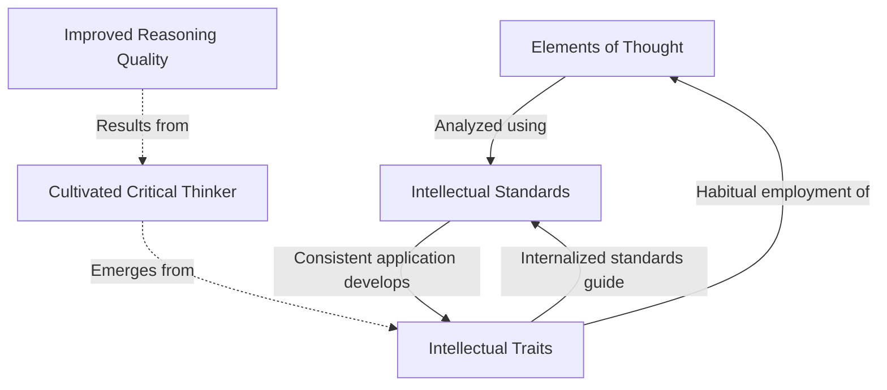

# Extraction Report: Reference Comprehensive Paul Elder Framework 2025120501

> [!info] Auto-Generated Report
> This report was automatically generated by `pkb_extractor.py` on 2026-03-13 04:17.
> **Source**: `reference-comprehensive-paul-elder-framework-2025120501.md` | **Items Extracted**: 662

---

## 📋 Document Overview

| Field | Value |
|-------|-------|
| **Source File** | `reference-comprehensive-paul-elder-framework-2025120501.md` |
| **Extraction Date** | 2026-03-13 04:17 |
| **Word Count** | 13,314 |
| **Character Count** | 98,081 |
| **Line Count** | 1,839 |
| **Total Items Extracted** | 662 |

### Document Outline

- # Paul-Elder Critical Thinking Model
  - ## 📑 Table of Contents
  - ## 1 ⏳ Historical Context & Developers
    - ### The Architects of the Framework
    - ### Development Timeline
    - ### Institutional Recognition
  - ## 2 🧭 Foundational Philosophy & Definition
    - ### Core Definition
    - ### Philosophical Underpinnings
    - ### Discipline-Neutral Architecture
    - ### Metacognitive Emphasis
  - ## 3 ⚙️ The Elements of Thought (Reasoning)
    - ### The Eight Universal Elements
      - #### 3.1 Purpose
      - #### 3.2 Question at Issue (Problem)
      - #### 3.3 Assumptions
      - #### 3.4 Point of View (Perspective)
      - #### 3.5 Information (Data, Evidence)
      - #### 3.6 Concepts (Ideas, Theories)
      - #### 3.7 Inferences (Interpretations, Conclusions)
      - #### 3.8 Implications and Consequences
    - ### The Interdependence of Elements
  - ## 4 📏 Universal Intellectual Standards
    - ### Purpose of the Standards
    - ### The Core Nine Standards
      - #### 4.1 Clarity
      - #### 4.2 Accuracy
      - #### 4.3 Precision
      - #### 4.4 Relevance
      - #### 4.5 Depth
      - #### 4.6 Breadth
      - #### 4.7 Logic
      - #### 4.8 Significance
      - #### 4.9 Fairness
    - ### Applying Standards to Elements
  - ## 5 🌟 Essential Intellectual Traits
    - ### The Developmental Nature of Traits
    - ### The Eight Essential Traits
      - #### 5.1 Intellectual Humility
      - #### 5.2 Intellectual Courage
      - #### 5.3 Intellectual Empathy
      - #### 5.4 Intellectual Autonomy
      - #### 5.5 Intellectual Integrity
      - #### 5.6 Intellectual Perseverance
      - #### 5.7 Confidence in Reason
      - #### 5.8 Fair-mindedness
    - ### The Cultivated Critical Thinker
  - ## 6 🔄 The Triadic Relationship: Integration Model
    - ### The Three-Component System
    - ### The Process Architecture
    - ### How the Components Interact
      - #### Phase 1: Analysis (Elements)
      - #### Phase 2: Evaluation (Standards)
      - #### Phase 3: Improvement (Application)
      - #### Phase 4: Habituation (Traits)
    - ### Practical Application Framework
  - ## 7 🛠️ Practical Implementation & Application
    - ### The Question-Based Analysis Method
      - #### Template for Comprehensive Analysis
    - ### The Structured Reasoning Checklist
    - ### Analyzing Arguments and Texts
    - ### Self-Directed Learning Protocol
      - #### Before Learning
      - #### During Learning
      - #### After Learning
    - ### Problem-Solving Framework
    - ### Daily Intellectual Routine
  - ## 8 🌐 Domain-Specific Applications
    - ### Educational Contexts
      - #### K-12 Education
      - #### Higher Education
    - ### Professional Applications
      - #### Healthcare
      - #### Engineering
      - #### Business & Management
    - ### Personal Life Applications
      - #### Decision-Making
      - #### Relationship Reasoning
      - #### Media Literacy
    - ### Interdisciplinary Integration
      - #### Science-Humanities Integration
      - #### Theory-Practice Integration
  - ## 9 ⚖️ Critical Analysis & Limitations
    - ### Strengths of the Framework
      - #### Comprehensive Coverage
      - #### Systematic Structure
      - #### Research Support
      - #### Practical Applicability
    - ### Acknowledged Limitations
      - #### Complexity and Learning Curve
      - #### Cultural and Contextual Considerations
      - #### Implementation Challenges
      - #### Trait Development Difficulty
      - #### The "Know-Do Gap"
    - ### Debates and Alternative Perspectives
      - #### Relationship to Domain Expertise
      - #### Cognitive vs. Dispositional Emphasis
      - #### Rationalist Assumptions
      - #### Assessment Challenges
    - ### Complementary Frameworks
      - #### Bloom's Taxonomy
      - #### Facione's Critical Thinking Framework
      - #### Informal Logic and Argumentation Theory
  - ## 10 🎯 Synthesis & Mastery
    - ### The Ultimate Goal: Fair-Minded Critical Thinking
    - ### Stages of Critical Thinking Development
    - ### The Philosophy Underlying the Framework
    - ### Cognitive Models for Understanding
    - ### Integration with Personal Knowledge Management
    - ### Mastery Indicators
    - ### The Lifelong Journey
    - ### The Transformative Potential
  - ## 📊 Metadata & Attribution
  - ## 🔄 Version History
- # 🔗 Related Topics for PKB Expansion

---

## 📊 Extraction Summary

| Item Type | Count |
|-----------|-------|
| Callouts | 57 |
| Code Blocks | 4 |
| Color Spans | 0 |
| Definitions | 11 |
| Embeds | 0 |
| External Links | 0 |
| Footnotes | 0 |
| Headings | 115 |
| Inline Fields | 11 |
| Mermaid Diagrams | 1 |
| Tables | 3 |
| Tags | 12 |
| Wiki Links | 98 |
| **TOTAL** | **662** |

---

## 🔔 Callouts (57)

> [!note] What are Callouts?
> Callouts are `> [!TYPE]` blocks used in Obsidian for structured annotation.
> They carry semantic meaning — definitions, insights, warnings, etc.

### By Type

| Callout Type | Count |
|-------------|-------|
| `[!]` | 2 |
| `[!abstract]` | 1 |
| `[!analogy]` | 2 |
| `[!comprehensive-reference]` | 1 |
| `[!definition]` | 31 |
| `[!example]` | 1 |
| `[!helpful-tip]` | 3 |
| `[!important]` | 3 |
| `[!methodology-and-sources]` | 4 |
| `[!overview]` | 1 |
| `[!principle-point]` | 4 |
| `[!thought-experiment]` | 2 |
| `[!warning]` | 2 |

### Full Callout List

#### 1. [OVERVIEW] Untitled *(Line 43)*

> [!overview] Untitled
> - **Title**:: [[Paul-Elder Critical Thinking Model]]
> - **Prompt/Topic Used**:: 
> - **Status**:: 🌱 `= this.maturity` | Confidence: `= this.confidence`

#### 2. [] # :FasClipboardList:In-Note Metadata Panel *(Line 48)*

> [!] # :FasClipboardList:In-Note Metadata Panel
> - **Note-Type**: `= this.type`
> - **Development Status**: `= this.maturity`
> - **Epistemic Confidence**: `= this.confidence`
> - **Next Review**: `= this.next-review`
> - **Review Count**: `= this.review-count`
> - **Created**: `= this.created`
> - **Last Modified**: `= this.modified`
> 
> > [!purpose] ### 📝Content Metrics
> > [**Word Count**:: `= this.file.size`]| [**Est. Read Time**:: `= round(this.file.size / 1300) + " min"`]
> > [**Depth Class**:: `= choice(this.file.size < 500, "🌱Stub", choice(this.file.size < 2000, "📄Note", "📜Essay"))`]
> ----
> > [!purpose] ### 🕰️Temporal Context
> > [**Created**:: `= this.file.ctime`] | [**Age**:: `= (date(today) - this.file.ctime).days + " days"`]
> > [**Last Touch**:: `= this.file.mtime`] | [**Staleness**:: `= choice((date(today) - this.file.mtime).days > 180, "🕸️Cobwebs", choice((date(today) - this.file.mtime).days > 30, "🍂Cold", "🔥Fresh"))`]
> > [**Touch Frequency**:: `= choice((date(today) - this.file.mtime).days < 7, "🔥Active", choice((date(today) - this.file.mtime).days < 30, "👌Regular", "❄️Dormant"))`]
> ----
> > [!topic-idea] ### 🔗Network Connectivity
> > [**In-Links**:: `= length(this.file.inlinks)`] | [**Out-Links**:: `= length(this.file.outlinks)`]
> > [**Network Status**:: `= choice(length(this.file.inlinks) = 0, "🕸️Orphan", choice(length(this.file.inlinks) > 5, "⚡ Hub", "🌱Node"))`]
> ```dataviewjs
> // SYSTEM: Semantic Bridge Engine
> // PURPOSE: Find "Sibling" notes that share the same Outlinks (Contexts)
> const current = dv.current();
> const myOutlinks = current.file.outlinks.map(l => l.path);
> 
> // 1. Filter the Vault
> const siblings = dv.pages()
>     .where(p => p.file.path !== current.file.path) // Exclude self
>     .where(p => !current.file.outlinks.map(l => l.path).includes(p.file.path)) // Exclude existing direct links
>     .map(p => {
>         // Find overlap between this page's links and the current page's links
>         const shared = p.file.outlinks.filter(l => myOutlinks.includes(l.path));
>         return { 
>             link: p.file.link, 
>             sharedCount: shared.length, 
>             sharedLinks: shared 
>         };
>     })
>     .where(p => p.sharedCount > 0) // Must share at least 1 connection
>     .sort(p => p.sharedCount, "desc") // Sort by strongest connection
>     .limit(5); // Only show top 5
> 
> // 2. Render the Bridge
> if (siblings.length > 0) {
>     dv.header(3, "Semantic Bridges (Missing Connections)");
>     dv.table(
>         ["Sibling Note", "Strength", "Shared Context"], 
>         siblings.map(s => [
>             s.link, 
>             "🔗" + s.sharedCount, 
>             s.sharedLinks.slice(0, 3).join(", ") + (s.sharedCount > 3 ? "…" : "")
>         ])
>     );
> } else {
>     dv.paragraph("*No semantic siblings found. This note is unique in its connections.*");
> }
> ```
> ---
> ### Related Notes
> ```dataview
> TABLE type, maturity, confidence
> FROM  ""
> WHERE  type = "reflection"
> SORT "maturity" DESC
> LIMIT 15
> ```
> ### Sources & References
> ```dataview
> TABLE 
>     source AS "Source Type",
>     file.ctime AS "Date Added"
> FROM ""
> WHERE source = "claude-sonnet-4.5"
> SORT file.ctime DESC
> LIMIT 10
> ```
> ### Backlinks & Connections
> ```dataview
> TABLE 
>     type AS "Type",
>     maturity AS "Maturity",
>     length(file.inlinks) AS "Its Backlinks",
>     dateformat(date(created), "MMM dd, yyyy") AS "Created"
> FROM [[#]]
> WHERE file.name != this.file.name
> SORT length(file.inlinks) DESC
> LIMIT 20
> ```
> ### 2025-12-05 - Initial Creation
> *Context*: `=this.title` **by**: `=this.source`
> *Maturity*: `= this.maturity`  
> *Confidence*: `= this.confidence`
> 
> ### Tags & Classification
> *Primary Tags*: `= this.tags`  
> *Type*: `= this.type`  
> *Source*: `= this.source`

#### 3. [] ### Claude Thinking *(Line 153)*

> [!] ### Claude Thinking
> **PHASE 1: ANALYZE**
> Request Classification:
> - Type: comprehensive_note (reference documentation)
> - Scope: reference (exhaustive coverage of a specific framework)
> - Research Required: YES - This requires verification of the framework's components, current applications, and authoritative sources to ensure accuracy
> User Context Integration:
> - Pur3v4d3r is building a sophisticated PKB with emphasis on cognitive science
> - Their system values evidence-based approaches and metacognitive frameworks
> - This topic aligns with their focus on "bias mitigation" and "metacognition" mentioned in their current state
> - The framework should be positioned within their broader knowledge architecture around critical thinking and cognitive tools
> Research Strategy:
> I need to execute web searches to:
> 1. Verify the exact components of the Paul-Elder framework (elements, standards, intellectual traits)
> 2. Find current applications and research supporting the framework
> 3. Identify authoritative sources and original publications
> 4. Discover practical implementation strategies
> 5. Understand criticisms or limitations of the framework
> **PHASE 2: STRUCTURAL PLANNING**
> Information Architecture:
> ├── Foundation Layer
> │   ├── Framework origins and developers
> │   ├── Core philosophy and purpose
> │   └── Position within critical thinking scholarship
> ├── Component Layer (the "what")
> │   ├── Elements of Reasoning (8 components)
> │   ├── Intellectual Standards (9 criteria)
> │   └── Intellectual Traits (8 virtues)
> ├── Application Layer (the "how")
> │   ├── Practical implementation strategies
> │   ├── Question frameworks
> │   └── Self-assessment tools
> ├── Integration Layer
> │   ├── Educational contexts
> │   ├── Professional applications
> │   └── Personal knowledge management connections
> └── Synthesis Layer
>     ├── Strengths and limitations
>     ├── Complementary frameworks
>     └── Advanced mastery pathways
> Wiki-Link Opportunities (anticipated):
> - [[Critical-Thinking|Critical Thinking]]
> - [[Metacognition]]
> - [[Cognitive-Biases|Cognitive Biases]]
> - [[Socratic-Questioning|Socratic Questioning]]
> - [[Intellectual-Humility|Intellectual Humility]]
> - [[Bloom's-Taxonomy|Bloom's Taxonomy]]
> - [[Argumentation-Theory|Argumentation Theory]]
> - [[Logic]]
> - [[Epistemic-Autonomy-—-Epistemology|Epistemology]]
> - [[999-report-orginizing/_permanent-notes/_permanent-notes/Self-Regulated-Learning|Self-Regulated Learning]]
> - [[Reasoning]]
> - [[Inference]]
> - [[Assumptions]]
> - [[Implications]]
> - [[Evidence]]
> - [[Point-of-View|Point of View]]
> - [[Concepts]]
> - [[Question Formulation]]
> - [[Clarity]]
> - [[Accuracy]]
> - [[Precision]]
> - [[Relevance]]
> - [[Depth]]
> - [[Breadth]]
> - [[Logic]] (as standard)
> - [[Significance]]
> - [[Fairness]]
> - [[Intellectual-Courage|Intellectual Courage]]
> - [[Intellectual-Empathy|Intellectual Empathy]]
> - [[Intellectual Autonomy]]
> - [[Intellectual-Integrity|Intellectual Integrity]]
> - [[Intellectual-Perseverance|Intellectual Perseverance]]
> - [[Confidence in Reason]]
> - [[Fair-mindedness]]
> Callout Strategy:
> - [!abstract] for executive overview
> - [!definition] for framework components
> - [!principle-point] for foundational principles
> - [!methodology-and-sources] for application frameworks
> - [!example] for concrete illustrations
> - [!important] for key integration points
> - [!helpful-tip] for practical implementation
> - [!thought-experiment] for critical thinking exercises
> - [!connections-and-links] for knowledge graph placement
> - [!analogy] for conceptual understanding
> Metadata Planning:
> Tags: #critical-thinking #cognitive-frameworks #paul-elder #metacognition #reference-note
> Aliases: [Paul-Elder Model, Elements of Reasoning Framework, Critical Thinking Framework, Paul-Elder Critical Thinking Model]
> Now executing research phase…
> I'll now conduct comprehensive research on the Paul-Elder Framework to ensure accuracy and completeness.Now I have comprehensive research data. Let me create the authoritative reference note on the Paul-Elder Framework for Critical Thinking.

#### 4. [COMPREHENSIVE-REFERENCE] 📚 Comprehensive Reference: Paul-Elder Framework for Critical Thinking *(Line 251)*

> [!comprehensive-reference] 📚 Comprehensive Reference: Paul-Elder Framework for Critical Thinking
> - **Generated**: 2024-12-04
> - **Version**: 1.0
> - **Type**: Reference Documentation

#### 5. [ABSTRACT] Untitled *(Line 256)*

> [!abstract] Untitled
> **Executive Overview**
> 
> The Paul-Elder Framework for Critical Thinking is the most comprehensive, discipline-neutral model for analyzing, assessing, and improving human reasoning across all domains of knowledge and professional practice. Developed by Dr. Richard Paul (1937-2015) and Dr. Linda Elder beginning in the 1990s, this framework provides a systematic architecture for metacognitive development through the structured application of Universal Intellectual Standards to the Elements of Thought, ultimately cultivating Essential Intellectual Traits that characterize fair-minded, rigorous thinkers.

#### 6. [PRINCIPLE-POINT] Untitled *(Line 261)*

> [!principle-point] Untitled
> **How to Use This Reference**
> 
> This comprehensive note serves as your authoritative single-source-of-truth for understanding and implementing the Paul-Elder Framework. The document is organized into nine major sections covering historical context, theoretical foundations, the three core components (Elements, Standards, Traits), practical implementation strategies, applications across domains, and advanced mastery considerations. Use the table of contents for direct navigation or employ Obsidian's search functionality to locate specific concepts through the extensive [[wiki-links]] integrated throughout.

#### 7. [DEFINITION] Untitled *(Line 285)*

> [!definition] Untitled
> **Key Developers**
> - **Dr. Richard Paul** (1937-2015): Philosopher and founding director of the Center for Critical Thinking at Sonoma State University. Earned Ph.D. in Philosophy from UC Santa Barbara and devoted his 35-year career to developing substantive, fair-minded critical thinking theory.
> - **Dr. Linda Elder** (b. 1947): Educational psychologist, current President of the Foundation for Critical Thinking and Executive Director of the Center for Critical Thinking. Earned Ph.D. in Educational Psychology from University of Memphis in 1992.

#### 8. [IMPORTANT] Untitled *(Line 296)*

> [!important] Untitled
> **Foundational Publications**
> 
> The framework's canonical articulation appears in:
> - *The Miniature Guide to Critical Thinking: Concepts and Tools* (2010) - The essential primer
> - *Critical Thinking: Tools for Taking Charge of Your Professional and Personal Life* (2001, updated 2013)
> - *30 Days to Better Thinking and Better Living Through Critical Thinking*
> - 24 specialized Thinker's Guides addressing specific applications

#### 9. [DEFINITION] Untitled *(Line 317)*

> [!definition] Untitled
> **Critical Thinking (Paul-Elder Definition)**
> 
> "Critical thinking is that mode of thinking – about any subject, content, or problem — in which the thinker improves the quality of his or her thinking by skillfully taking charge of the structures inherent in thinking and imposing intellectual standards upon them."
> 
> This definition emphasizes three essential components:
> 1. **Active agency**: The thinker consciously takes charge (not passive reception)
> 2. **Universal structures**: Inherent elements exist in all reasoning
> 3. **Quality assessment**: Systematic application of standards enables evaluation and improvement

#### 10. [PRINCIPLE-POINT] Untitled *(Line 337)*

> [!principle-point] Untitled
> **Central Principle: Fair-Minded Critical Thinking**
> 
> The framework distinguishes between "weak-sense" critical thinking (using skills to advance one's own agenda regardless of truth) and "strong-sense" or "fair-minded" critical thinking, which is predisposed toward [[Intellectual-Empathy|intellectual empathy]], [[Intellectual-Humility|intellectual humility]], [[Intellectual-Perseverance|intellectual perseverance]], [[Intellectual-Integrity|intellectual integrity]], and [[intellectual responsibility]]. This ethical dimension elevates critical thinking beyond mere technique to a virtue-based cognitive practice.

#### 11. [DEFINITION] Untitled *(Line 360)*

> [!definition] Untitled
> **Elements of Thought**
> 
> The Elements of Thought (also called Elements of Reasoning) are the fundamental structural components present in all reasoning, at all times, regardless of domain or complexity. The eight Elements of Thought are the parts or fundamental structures of thought, which are the essential dimensions when all reasoning occurs in all persons at any time.

#### 12. [DEFINITION] Untitled *(Line 371)*

> [!definition] Untitled
> **Purpose**
> - **Definition**: The goal, objective, or intended outcome that drives the reasoning process.
> - **Universal principle**: All reasoning has a purpose.

#### 13. [DEFINITION] Untitled *(Line 393)*

> [!definition] Untitled
> **Question at Issue**
> - **Definition**: The specific problem, issue, or question the reasoning attempts to settle or resolve.
> - **Universal principle**: All reasoning is an attempt to figure something out, to settle some question, to solve some problem.

#### 14. [DEFINITION] Untitled *(Line 415)*

> [!definition] Untitled
> **Assumptions**
> - **Definition**: Beliefs, presuppositions, or axioms taken for granted as true without proof or examination within the context of the reasoning.
> - **Universal principle**: All reasoning is based on assumptions.

#### 15. [DEFINITION] Untitled *(Line 442)*

> [!definition] Untitled
> **Point of View**
> - **Definition**: The conceptual framework, perspective, orientation, or worldview from which the reasoning proceeds.
> - **Universal principle**: All reasoning is done from some point of view.

#### 16. [THOUGHT-EXPERIMENT] Untitled *(Line 462)*

> [!thought-experiment] Untitled
> **The Multiple Perspectives Exercise**
> 
> Consider a controversial issue (e.g., artificial intelligence regulation). Systematically adopt multiple points of view:
> - Technology innovator seeking minimal regulation
> - Ethicist concerned about societal impact
> - Government regulator balancing interests
> - Worker whose job faces automation
> - Future generation inheriting the consequences
> 
> Notice how each perspective reveals different aspects of the issue, different relevant questions, and different seemingly "obvious" conclusions.

#### 17. [DEFINITION] Untitled *(Line 476)*

> [!definition] Untitled
> **Information**
> - **Definition**: The facts, data, observations, experiences, and evidence upon which reasoning is based.
> - **Universal principle**: All reasoning is based on data, information, and evidence.

#### 18. [DEFINITION] Untitled *(Line 506)*

> [!definition] Untitled
> **Concepts**
> - **Definition**: The ideas, theories, principles, axioms, rules, or mental categories through which reasoning is expressed and organized.
> - **Universal principle**: All reasoning is expressed through, and shaped by, concepts and ideas.

#### 19. [EXAMPLE] Untitled *(Line 530)*

> [!example] Untitled
> **Conceptual Ambiguity Example**
> 
> Consider the concept "freedom." Different conceptual frameworks yield different reasoning:
> - **Negative liberty**: Freedom as absence of external constraints (libertarian framework)
> - **Positive liberty**: Freedom as capacity for self-actualization (capability approach)
> - **Existential freedom**: Freedom as radical choice and responsibility (existentialist framework)
> 
> Policy reasoning about "protecting freedom" will reach radically different conclusions depending on which conceptual framework is operative.

#### 20. [DEFINITION] Untitled *(Line 542)*

> [!definition] Untitled
> **Inferences**
> - **Definition**: The conclusions, interpretations, solutions, or judgments drawn from information and reasoning processes.
> - **Universal principle**: All reasoning contains inferences or interpretations by which we draw conclusions and give meaning to data.

#### 21. [DEFINITION] Untitled *(Line 569)*

> [!definition] Untitled
> **Implications and Consequences**
> - **Definition**: The effects, results, outcomes, or ramifications that follow from reasoning, whether claimed or not, whether foreseen or not.
> - **Universal principle**: All reasoning leads somewhere, has implications and consequences.

#### 22. [WARNING] Untitled *(Line 588)*

> [!warning] Untitled
> **The Foreseeability Challenge**
> 
> Implications and consequences are often difficult to fully anticipate, particularly for complex systems. Good critical thinking requires:
> - Systematic scenario planning ("What if…?" thinking)
> - Consultation with diverse stakeholders who may experience consequences differently
> - [[Humility]] about the limits of foresight
> - Monitoring systems to detect unanticipated consequences early

#### 23. [IMPORTANT] Untitled *(Line 599)*

> [!important] Untitled
> **Non-Linear Relationships**
> 
> The Elements of Thought work together in a non-linear interrelationship to shape reasoning and provide a general logic to the use of thought, with intimate overlap among all elements by virtue of their interrelationship.

#### 24. [DEFINITION] Untitled *(Line 617)*

> [!definition] Untitled
> **Universal Intellectual Standards**
> 
> The Universal Intellectual Standards are the criteria, benchmarks, or evaluative dimensions used to assess the quality of reasoning. These are minimal or fundamental intellectual standards within a wider variety from which to choose, serving as guides to better reasoning.

#### 25. [DEFINITION] Untitled *(Line 632)*

> [!definition] Untitled
> **Clarity**
> - **Core Question**: Could you elaborate further? Could you give me an example? Could you illustrate what you mean?
> - **Definition**: The thinking is explained in a way that makes it readily understandable.

#### 26. [DEFINITION] Untitled *(Line 655)*

> [!definition] Untitled
> **Accuracy**
> - **Core Question**: Is that really true? How could we check? How could we verify or test that?
> - **Definition**: The information is correct, true, and free from error.

#### 27. [DEFINITION] Untitled *(Line 677)*

> [!definition] Untitled
> **Precision**
> - **Core Question**: Could you be more specific? Could you give me more details? Could you be more exact?
> - **Definition**: The expressions used are exact, detailed, and specific to the necessary degree.

#### 28. [DEFINITION] Untitled *(Line 697)*

> [!definition] Untitled
> **Relevance**
> - **Core Question**: How does that relate to the problem? How does that bear on the question? How does that help us with the issue?
> - **Definition**: All included information directly relates to and helps address the question at issue.

#### 29. [DEFINITION] Untitled *(Line 718)*

> [!definition] Untitled
> **Depth**
> - **Core Question**: What factors make this a difficult problem? What are some of the complexities of this question? What are some of the difficulties we need to address?
> - **Definition**: The reasoning explores the complexities, nuances, and underlying factors rather than remaining superficial.

#### 30. [DEFINITION] Untitled *(Line 738)*

> [!definition] Untitled
> **Breadth**
> - **Core Question**: Do we need to look at this from another perspective? Do we need to consider another point of view? Is there another way to look at this question?
> - **Definition**: The reasoning considers multiple perspectives, alternative frameworks, and diverse viewpoints.

#### 31. [DEFINITION] Untitled *(Line 758)*

> [!definition] Untitled
> **Logic**
> - **Core Question**: Does this really make sense? Does that follow from what you said? How does that follow? Before you implied this, and now you are saying that; how can both be true?
> - **Definition**: The reasoning is internally consistent, the components fit together coherently, and conclusions follow from premises.

#### 32. [DEFINITION] Untitled *(Line 780)*

> [!definition] Untitled
> **Significance**
> - **Core Question**: Is this the most important problem to consider? Is this the central idea to focus on? Which of these facts are most important?
> - **Definition**: The reasoning focuses on what is most important, addressing the most crucial aspects rather than trivial details.

#### 33. [DEFINITION] Untitled *(Line 801)*

> [!definition] Untitled
> **Fairness**
> - **Core Question**: Am I considering the viewpoints of others seriously, or am I just protecting my own interests? Am I being biased in my reasoning? Am I giving equal weight to evidence that contradicts my preferred conclusion?
> - **Definition**: The reasoning is balanced, unbiased, impartial, and genuinely considers alternative perspectives without distortion.

#### 34. [METHODOLOGY-AND-SOURCES] Untitled *(Line 836)*

> [!methodology-and-sources] Untitled
> **Standard Application Methodology**
> 
> To apply standards systematically:
> 1. **Select the element**: Choose which element of thought to examine
> 2. **Identify relevant standards**: Determine which standards are most applicable
> 3. **Generate diagnostic questions**: Formulate specific questions combining element and standard
> 4. **Evaluate honestly**: Assess the reasoning against the standard
> 5. **Identify improvements**: Note specific ways to strengthen the reasoning
> 6. **Revise iteratively**: Cycle through elements and standards multiple times

#### 35. [DEFINITION] Untitled *(Line 851)*

> [!definition] Untitled
> **Essential Intellectual Traits**
> 
> The Essential Intellectual Traits are developed by consistently applying the Universal Intellectual Standards to the Elements of Thought, representing tendencies or commitments towards the trait rather than skills or abilities. These are not techniques but character virtues—habitual dispositions that emerge through sustained practice.

#### 36. [DEFINITION] Untitled *(Line 866)*

> [!definition] Untitled
> **Intellectual Humility**
> - **Core Awareness**: Recognition of the limits of one's knowledge, awareness of biases and self-deception, and consciousness of what one actually knows versus what one assumes.
> - **Opposite**: Intellectual arrogance, overconfidence in one's judgments

#### 37. [WARNING] Untitled *(Line 887)*

> [!warning] Untitled
> **The Humility Paradox**
> 
> Intellectual humility does not mean lack of confidence in well-supported conclusions or paralyzing self-doubt. Rather, it involves calibrating confidence appropriately to epistemic justification—strong confidence in well-established claims, tentativeness about speculative ones, and recognition that all knowledge is revisable in principle.

#### 38. [DEFINITION] Untitled *(Line 894)*

> [!definition] Untitled
> **Intellectual Courage**
> - **Core Capacity**: Willingness to confront ideas, beliefs, or viewpoints that are threatening, unpopular, or emotionally challenging.
> - **Opposite**: Intellectual cowardice, conformity to popular opinion

#### 39. [DEFINITION] Untitled *(Line 923)*

> [!definition] Untitled
> **Intellectual Empathy**
> - **Core Capacity**: Ability to accurately reconstruct and genuinely understand viewpoints, frameworks, and experiences different from one's own.
> - **Opposite**: Intellectual narrow-mindedness, egocentric interpretation

#### 40. [THOUGHT-EXPERIMENT] Untitled *(Line 944)*

> [!thought-experiment] Untitled
> **The Steel-Man Exercise**
> 
> Unlike a straw-man argument (weakening an opponent's position), steel-manning involves constructing the strongest possible version of an opposing view:
> 1. Choose a position you disagree with
> 2. Research its most sophisticated advocates
> 3. Articulate it so compellingly that adherents would approve
> 4. Identify what would need to be true for the position to be correct
> 5. Only then critique from your actual position
> 
> This exercise simultaneously develops intellectual empathy, humility, and courage.

#### 41. [DEFINITION] Untitled *(Line 958)*

> [!definition] Untitled
> **Intellectual Autonomy**
> - **Core Capacity**: Independent thinking, self-directed inquiry, and personal ownership of one's beliefs and reasoning processes.
> - **Opposite**: Intellectual dependence, uncritical acceptance of authority

#### 42. [DEFINITION] Untitled *(Line 987)*

> [!definition] Untitled
> **Intellectual Integrity**
> - **Core Commitment**: Consistency between one's professed values/standards and one's actual reasoning and behavior; holding oneself to the same standards applied to others.
> - **Opposite**: Intellectual hypocrisy, double standards

#### 43. [DEFINITION] Untitled *(Line 1021)*

> [!definition] Untitled
> **Intellectual Perseverance**
> - **Core Commitment**: Persistence in pursuing understanding despite obstacles, confusion, frustration, or complexity.
> - **Opposite**: Intellectual laziness, giving up when thinking gets difficult

#### 44. [DEFINITION] Untitled *(Line 1051)*

> [!definition] Untitled
> **Confidence in Reason**
> - **Core Commitment**: Trust in well-executed reasoning processes to yield reliable conclusions; faith in the power of sound thinking over time to overcome error and superstition.
> - **Opposite**: Cynicism about reason, resort to non-rational decision-making

#### 45. [DEFINITION] Untitled *(Line 1080)*

> [!definition] Untitled
> **Fair-mindedness**
> - **Core Commitment**: Treating all viewpoints, evidence, and persons according to the same standards without bias; genuine commitment to impartiality and intellectual justice.
> - **Opposite**: Intellectual unfairness, motivated reasoning, bias

#### 46. [PRINCIPLE-POINT] Untitled *(Line 1121)*

> [!principle-point] Untitled
> **The Triadic Integration**
> 
> 1. **Elements of Thought** = The structural components to be analyzed
> 2. **Universal Intellectual Standards** = The criteria for evaluating quality
> 3. **Essential Intellectual Traits** = The dispositions developed through consistent practice
> 
> **Formula**: (Elements × Standards) → Consistent Application → Traits → Mastery

#### 47. [IMPORTANT] Untitled *(Line 1174)*

> [!important] Untitled
> **The Feedback Loop**
> 
> Developed traits, once internalized, transform how future reasoning proceeds:
> - **Intellectual humility** makes one more likely to examine assumptions
> - **Intellectual empathy** makes one more likely to consider alternative viewpoints
> - **Intellectual courage** makes one more likely to follow evidence despite discomfort
> - **Fair-mindedness** makes one more likely to apply standards consistently
> 
> This creates a positive feedback loop: Practice develops traits → Traits improve practice → Better practice further develops traits

#### 48. [METHODOLOGY-AND-SOURCES] Untitled *(Line 1234)*

> [!methodology-and-sources] Untitled
> **Eight-Step Comprehensive Reasoning Analysis**
> 
> Use this checklist for important reasoning tasks:
> 
> **1. Purpose & Question**
> - [ ] I have clearly stated my purpose
> - [ ] I have precisely formulated the question at issue
> - [ ] My purpose is significant and appropriate
> - [ ] My question is answerable with available methods
> 
> **2. Information**
> - [ ] I have identified the key information needed
> - [ ] I have verified information accuracy
> - [ ] I have considered information from multiple sources
> - [ ] I have distinguished facts from interpretations
> 
> **3. Assumptions**
> - [ ] I have identified my key assumptions
> - [ ] I have examined whether assumptions are warranted
> - [ ] I have considered alternative assumptions
> - [ ] I have recognized how assumptions shape conclusions
> 
> **4. Point of View**
> - [ ] I have articulated my perspective
> - [ ] I have recognized limitations of my viewpoint
> - [ ] I have seriously considered alternative perspectives
> - [ ] I have sought views from those with different experiences
> 
> **5. Concepts**
> - [ ] I have identified key concepts
> - [ ] I have defined concepts clearly
> - [ ] I have used concepts consistently
> - [ ] I have considered alternative conceptual frameworks
> 
> **6. Inferences**
> - [ ] I have stated my conclusions explicitly
> - [ ] I have verified inferences follow logically
> - [ ] I have considered alternative inferences
> - [ ] I have proportioned confidence to evidence quality
> 
> **7. Implications**
> - [ ] I have explored logical implications
> - [ ] I have considered practical consequences
> - [ ] I have thought through both short and long-term effects
> - [ ] I have examined unintended consequences
> 
> **8. Standards Application**
> - [ ] My reasoning is clear (understandable)
> - [ ] My reasoning is accurate (true, correct)
> - [ ] My reasoning is precise (detailed, specific)
> - [ ] My reasoning is relevant (on-topic, pertinent)
> - [ ] My reasoning has depth (addresses complexities)
> - [ ] My reasoning has breadth (considers alternatives)
> - [ ] My reasoning is logical (internally consistent)
> - [ ] My reasoning is significant (focuses on what matters)
> - [ ] My reasoning is fair (unbiased, balanced)

#### 49. [METHODOLOGY-AND-SOURCES] Untitled *(Line 1296)*

> [!methodology-and-sources] Untitled
> **Template for Analyzing the Logic of Articles and Texts**
> 
> *Based on Paul-Elder analytical framework:*
> 
> **1. Identify the author's purpose**
> - What is the author trying to accomplish?
> - What question or problem is being addressed?
> 
> **2. Identify the key question(s)**
> - What is the most fundamental question at stake?
> - Are there subsidiary questions?
> 
> **3. Identify key information**
> - What data, facts, observations, or experiences does the author use?
> - Is the information relevant and sufficient?
> - Is it accurate?
> 
> **4. Identify key concepts**
> - What are the most important ideas in the text?
> - How are key terms defined?
> - Are concepts used consistently?
> 
> **5. Identify the author's assumptions**
> - What is the author taking for granted?
> - What presuppositions underlie the reasoning?
> - Are assumptions warranted?
> 
> **6. Trace the author's reasoning**
> - What are the main conclusions?
> - What inferences lead to these conclusions?
> - Do conclusions follow logically from premises?
> 
> **7. Identify point of view**
> - From what perspective is the author writing?
> - What other perspectives might be considered?
> - How does the author's perspective shape the analysis?
> 
> **8. Identify implications**
> - If we accept the author's reasoning, what follows?
> - What are the practical consequences?
> - Are there unintended implications?
> 
> **9. Apply intellectual standards**
> - Rate the argument on: Clarity, Accuracy, Precision, Relevance, Depth, Breadth, Logic, Significance, Fairness
> - Where is the reasoning strongest?
> - Where are the weak points?

#### 50. [HELPFUL-TIP] Untitled *(Line 1369)*

> [!helpful-tip] Untitled
> **The Eight-Element Problem-Solving Protocol**
> 
> **1. Clarify Purpose**
> - What exactly are we trying to achieve?
> - Why is solving this problem important?
> 
> **2. Formulate the Question**
> - What is the precise problem to be solved?
> - What type of problem is this (technical, conceptual, ethical, practical)?
> 
> **3. Gather Information**
> - What facts do we know?
> - What information do we need?
> - How can we obtain reliable information?
> 
> **4. Surface Assumptions**
> - What are we taking for granted?
> - Which assumptions are justified? Which need examination?
> - How might different assumptions change the problem?
> 
> **5. Consider Perspectives**
> - How do different stakeholders view this problem?
> - What frameworks could be applied?
> - Are there cultural or historical perspectives we're missing?
> 
> **6. Clarify Concepts**
> - What key ideas are central to this problem?
> - How are important terms defined?
> - Are we using consistent terminology?
> 
> **7. Generate Solutions (Inferences)**
> - What solutions follow logically from our analysis?
> - What are the alternatives?
> - Which solution is best supported?
> 
> **8. Evaluate Implications**
> - What are the consequences of each solution?
> - What could go wrong?
> - What long-term effects must we consider?

#### 51. [HELPFUL-TIP] Untitled *(Line 1414)*

> [!helpful-tip] Untitled
> **Daily Critical Thinking Practice**
> 
> **Morning Reflection (5-10 minutes):**
> - What is my main goal today? (Purpose)
> - What key question will I focus on? (Question)
> - What assumptions am I making about today? (Assumptions)
> 
> **Midday Check-In (2-3 minutes):**
> - Am I focused on what's significant? (Significance)
> - Am I considering alternative viewpoints? (Breadth)
> - Am I being fair to others? (Fairness)
> 
> **Evening Review (5-10 minutes):**
> - What did I learn today? (Information)
> - What inferences am I drawing from today's experiences? (Inferences)
> - What implications do today's events have? (Implications)
> - Which intellectual trait did I practice? Which needs more attention? (Traits)
> 
> **Weekly Deep Analysis (30-60 minutes):**
> - Choose one important belief, decision, or argument
> - Conduct full 8-element analysis using standards
> - Identify improvements in reasoning
> - Commit to specific trait development

#### 52. [DEFINITION] Untitled *(Line 1688)*

> [!definition] Untitled
> **Six Stages of Critical Thinking Development**
> 
> 1. **Unreflective Thinker**: Unaware of role of thinking in life; no insight into problems in thinking
> 2. **Challenged Thinker**: Aware that thinking can have problems; beginning to recognize poor thinking
> 3. **Beginning Thinker**: Trying to improve but without regular practice; sporadic application
> 4. **Practicing Thinker**: Regular practice; recognizing need for systematic approach
> 5. **Advanced Thinker**: Active analysis of thinking; good habits forming; insight deepening
> 6. **Master Thinker**: Excellent thinking has become "second nature"; automatic excellence; deep internalization

#### 53. [PRINCIPLE-POINT] Untitled *(Line 1710)*

> [!principle-point] Untitled
> **Epistemological Foundation**
> 
> The framework rests on several philosophical commitments:
> 1. **Truth exists and is worth pursuing** (realism)
> 2. **Reasoning can reliably approach truth** (rationalism)
> 3. **Quality of thinking can be assessed** (objectivity)
> 4. **Thinking can be improved through practice** (development)
> 5. **Fair-mindedness is essential to truth-seeking** (ethics)

#### 54. [ANALOGY] Untitled *(Line 1724)*

> [!analogy] Untitled
> **The Mental Quality Assurance System**
> 
> Think of the Paul-Elder Framework as a quality assurance system for thinking:
> 
> - **Elements of Thought** = The components being manufactured (reasoning parts)
> - **Intellectual Standards** = The quality control specifications (what good looks like)
> - **Intellectual Traits** = The culture of quality (habitual commitment to excellence)
> 
> Just as manufacturing quality requires understanding components, applying standards, and building quality culture, cognitive quality requires analyzing elements, applying standards, and developing intellectual virtues.

#### 55. [ANALOGY] Untitled *(Line 1735)*

> [!analogy] Untitled
> **The Architectural Metaphor**
> 
> Critical thinking as building construction:
> 
> - **Elements** = Building materials (wood, steel, concrete)—the structural components
> - **Standards** = Building codes (safety, durability, efficiency)—the quality criteria
> - **Traits** = Craftsmanship (attention to detail, integrity, pride in work)—the character
> 
> Poor buildings result from low-quality materials, inadequate standards, or shoddy craftsmanship. Excellent structures require all three: good materials, rigorous standards, skilled craftspeople who care about quality.

#### 56. [HELPFUL-TIP] Untitled *(Line 1766)*

> [!helpful-tip] Untitled
> **Self-Assessment for Critical Thinking Development**
> 
> **Cognitive Indicators:**
> - [ ] I automatically analyze reasoning using the eight elements
> - [ ] I spontaneously apply intellectual standards without prompting
> - [ ] I notice reasoning quality in everyday contexts (news, conversations, own thinking)
> - [ ] I can articulate the logic of my own reasoning clearly
> - [ ] I regularly identify flaws in my own thinking before others point them out
> 
> **Dispositional Indicators:**
> - [ ] I feel genuine intellectual humility, recognizing knowledge limits
> - [ ] I seek out viewpoints that challenge my beliefs
> - [ ] I change my mind when evidence warrants, without defensiveness
> - [ ] I notice and compensate for my own biases
> - [ ] I value truth over being right
> 
> **Behavioral Indicators:**
> - [ ] Others seek my input on complex problems
> - [ ] I make better decisions with better outcomes
> - [ ] I communicate more clearly and persuasively
> - [ ] I resolve conflicts more effectively
> - [ ] I learn new domains more rapidly and deeply

#### 57. [METHODOLOGY-AND-SOURCES] Untitled *(Line 1818)*

> [!methodology-and-sources] Untitled
> **Research Methodology**
> 
> **Primary Sources:**
> - Paul, R. & Elder, L. (2010). *The Miniature Guide to Critical Thinking: Concepts and Tools*. Foundation for Critical Thinking Press.
> - Paul, R. & Elder, L. (2013). *Critical Thinking: Tools for Taking Charge of Your Professional and Personal Life*. Pearson Education.
> - Foundation for Critical Thinking website (criticalthinking.org)
> - Center for Critical Thinking resources
> 
> **Secondary Sources:**
> - University of Louisville Ideas to Action quality enhancement documentation
> - Academic publications on framework implementation and assessment
> - Peer-reviewed research on critical thinking education
> - Professional certification materials
> 
> **Research Queries Performed:**
> 1. "Paul-Elder Critical Thinking Framework elements of reasoning"
> 2. "Richard Paul Linda Elder Foundation for Critical Thinking intellectual traits"
> 3. "'Paul-Elder' critical thinking framework applications education professional"
> 4. "'Paul-Elder' critical thinking limitations criticisms weaknesses"
> 
> **Synthesis Approach:**
> This reference note synthesizes authoritative sources from the Foundation for Critical Thinking, academic implementations, peer-reviewed research, and educational applications. All factual claims are grounded in source material, with particular emphasis on original Paul-Elder publications and validated institutional implementations.
> 
> **Confidence Levels:**
> - **High confidence**: Framework structure (elements, standards, traits), core definitions, developers' backgrounds, major institutional adoptions
> - **Medium confidence**: Specific implementation strategies, stage theory details, comparative framework analysis
> - **Lower confidence**: Cultural universality claims, precise transfer effects, long-term trait stability

---

## 🔗 Wiki-Links (98 total, 87 unique targets)

> [!info] Knowledge Graph Connections
> These links represent connections to other notes in your PKB.
> **87** distinct notes are referenced.

### Unique Targets

- [[Accuracy]]
- [[Affirming the consequent]]
- [[Argumentation-Theory|Argumentation Theory]]
- [[Assumptions]]
- [[Bloom's-Taxonomy|Bloom's Taxonomy]]
- [[Breadth]]
- [[Circular reasoning]]
- [[Clarity]]
- [[Cognitive-Biases|Cognitive Biases]]
- [[Comparative Analysis: Critical Thinking Frameworks]]
- [[Concepts]]
- [[Confidence in Reason]]
- [[Critical-Thinking|Critical Thinking]]
- [[Denying the antecedent]]
- [[Depth]]
- [[Egocentric and Sociocentric Thinking]]
- [[Elements-of-Thought|Elements of Thought]]
- [[Epistemic-Autonomy-—-Epistemology|Epistemology]]
- [[Equivocation]]
- [[Evidence]]
- [[Fair-mindedness]]
- [[Fairness]]
- [[False dilemma]]
- [[Humility]]
- [[Implications]]
- [[Inference]]
- [[Intellectual Autonomy]]
- [[Intellectual-Courage|Intellectual Courage]]
- [[Intellectual-Empathy|Intellectual Empathy]]
- [[Intellectual-Humility|Intellectual Humility]]
- [[Intellectual-Integrity|Intellectual Integrity]]
- [[Intellectual-Perseverance|Intellectual Perseverance]]
- [[Intellectual-Standards|Intellectual Standards]]
- [[Logic]]
- [[Metacognition]]
- [[Paul-Elder Critical Thinking Model]]
- [[Point-of-View|Point of View]]
- [[Precision]]
- [[Question Formulation]]
- [[Reasoning]]
- [[Relevance]]
- [[SEE-I Method for Conceptual Clarity]]
- [[SEE-I method]]
- [[999-report-orginizing/_permanent-notes/_permanent-notes/Self-Regulated-Learning|Self-Regulated Learning]]
- [[Significance]]
- [[Socratic-Questioning|Socratic Questioning]]
- [[Stages of Critical Thinking Development]]
- [[Universal Intellectual Standards]]
- [[accurate]]
- [[anecdotal evidence]]
- [[Assumptions]]
- [[clarity]]
- [[Cognitive-Biases|cognitive biases]]
- [[Concepts]]
- [[Confirmation-Bias-Myside-Bias|confirmation bias]]
- [[consistency]]
- [[Distributed-Cognition|distributed cognition]]
- [[Egocentric-Thinking|egocentric thinking]]
- [[element of thought]]
- [[emotions]]
- [[Entropy]]
- [[frame of reference]]
- [[freedom]]
- [[human-cognition|human cognition]]
- [[Implications]]
- [[inferences]]
- [[Information]]
- [[Intellectual-Empathy|intellectual empathy]]
- [[Intellectual-Humility|intellectual humility]]
- [[Intellectual-Integrity|intellectual integrity]]
- [[Intellectual-Perseverance|intellectual perseverance]]
- [[intellectual responsibility]]
- [[Intellectual-Traits|intellectual traits]]
- [[justice]]
- [[Logic]]
- [[logical]]
- [[metacognitive]]
- [[paradigm]]
- [[Point-of-View|point of view]]
- [[purpose]]
- [[Question-at-Issue|question at issue]]
- [[Reasoning]]
- [[relevant]]
- [[999-report-orginizing/_permanent-notes/_permanent-notes/Self-Regulated-Learning|self-regulated learning]]
- [[Virtue-Ethics|virtue ethics]]
- [[wiki-links]]
- [[Working-Memory|working memory]]

### All Occurrences

| # | Target | Display Text | Heading | Section | Line |
|---|--------|-------------|---------|---------|------|
| 1 | [[Paul-Elder Critical Thinking Model]] | — | — | Document Start | 44 |
| 2 | [[Critical-Thinking|Critical Thinking]] | — | — | Paul-Elder Critical Thinking Model | 195 |
| 3 | [[Metacognition]] | — | — | Paul-Elder Critical Thinking Model | 196 |
| 4 | [[Cognitive-Biases|Cognitive Biases]] | — | — | Paul-Elder Critical Thinking Model | 197 |
| 5 | [[Socratic-Questioning|Socratic Questioning]] | — | — | Paul-Elder Critical Thinking Model | 198 |
| 6 | [[Intellectual-Humility|Intellectual Humility]] | — | — | Paul-Elder Critical Thinking Model | 199 |
| 7 | [[Bloom's-Taxonomy|Bloom's Taxonomy]] | — | — | Paul-Elder Critical Thinking Model | 200 |
| 8 | [[Argumentation-Theory|Argumentation Theory]] | — | — | Paul-Elder Critical Thinking Model | 201 |
| 9 | [[Logic]] | — | — | Paul-Elder Critical Thinking Model | 202 |
| 10 | [[Epistemic-Autonomy-—-Epistemology|Epistemology]] | — | — | Paul-Elder Critical Thinking Model | 203 |
| 11 | [[Self-Regulated-Learning-—-SRL|Self-Regulated Learning]] | — | — | Paul-Elder Critical Thinking Model | 204 |
| 12 | [[Reasoning]] | — | — | Paul-Elder Critical Thinking Model | 205 |
| 13 | [[Inference]] | — | — | Paul-Elder Critical Thinking Model | 206 |
| 14 | [[Assumptions]] | — | — | Paul-Elder Critical Thinking Model | 207 |
| 15 | [[Implications]] | — | — | Paul-Elder Critical Thinking Model | 208 |
| 16 | [[Evidence]] | — | — | Paul-Elder Critical Thinking Model | 209 |
| 17 | [[Point-of-View|Point of View]] | — | — | Paul-Elder Critical Thinking Model | 210 |
| 18 | [[Concepts]] | — | — | Paul-Elder Critical Thinking Model | 211 |
| 19 | [[Question Formulation]] | — | — | Paul-Elder Critical Thinking Model | 212 |
| 20 | [[Clarity]] | — | — | Paul-Elder Critical Thinking Model | 213 |
| 21 | [[Accuracy]] | — | — | Paul-Elder Critical Thinking Model | 214 |
| 22 | [[Precision]] | — | — | Paul-Elder Critical Thinking Model | 215 |
| 23 | [[Relevance]] | — | — | Paul-Elder Critical Thinking Model | 216 |
| 24 | [[Depth]] | — | — | Paul-Elder Critical Thinking Model | 217 |
| 25 | [[Breadth]] | — | — | Paul-Elder Critical Thinking Model | 218 |
| 26 | [[Logic]] | — | — | Paul-Elder Critical Thinking Model | 219 |
| 27 | [[Significance]] | — | — | Paul-Elder Critical Thinking Model | 220 |
| 28 | [[Fairness]] | — | — | Paul-Elder Critical Thinking Model | 221 |
| 29 | [[Intellectual-Courage|Intellectual Courage]] | — | — | Paul-Elder Critical Thinking Model | 222 |
| 30 | [[Intellectual-Empathy|Intellectual Empathy]] | — | — | Paul-Elder Critical Thinking Model | 223 |
| 31 | [[Intellectual Autonomy]] | — | — | Paul-Elder Critical Thinking Model | 224 |
| 32 | [[Intellectual-Integrity|Intellectual Integrity]] | — | — | Paul-Elder Critical Thinking Model | 225 |
| 33 | [[Intellectual-Perseverance|Intellectual Perseverance]] | — | — | Paul-Elder Critical Thinking Model | 226 |
| 34 | [[Confidence in Reason]] | — | — | Paul-Elder Critical Thinking Model | 227 |
| 35 | [[Fair-mindedness]] | — | — | Paul-Elder Critical Thinking Model | 228 |
| 36 | [[wiki-links]] | — | — | Paul-Elder Critical Thinking Model | 264 |
| 37 | [[human-cognition|human cognition]] | — | — | Philosophical Underpinnings | 329 |
| 38 | [[Reasoning]] | — | — | Philosophical Underpinnings | 329 |
| 39 | [[emotions]] | — | — | Philosophical Underpinnings | 335 |
| 40 | [[Cognitive-Biases|cognitive biases]] | — | — | Philosophical Underpinnings | 335 |
| 41 | [[Intellectual-Empathy|intellectual empathy]] | — | — | Philosophical Underpinnings | 340 |
| 42 | [[Intellectual-Humility|intellectual humility]] | — | — | Philosophical Underpinnings | 340 |
| 43 | [[Intellectual-Perseverance|intellectual perseverance]] | — | — | Philosophical Underpinnings | 340 |
| 44 | [[Intellectual-Integrity|intellectual integrity]] | — | — | Philosophical Underpinnings | 340 |
| 45 | [[intellectual responsibility]] | — | — | Philosophical Underpinnings | 340 |
| 46 | [[metacognitive]] | — | — | Metacognitive Emphasis | 348 |
| 47 | [[clarity]] | — | — | 3.1 Purpose | 376 |
| 48 | [[Point-of-View|point of view]] | — | — | 3.3 Assumptions | 433 |
| 49 | [[frame of reference]] | — | — | 3.4 Point of View (Perspective) | 447 |
| 50 | [[paradigm]] | — | — | 3.4 Point of View (Perspective) | 447 |
| 51 | [[anecdotal evidence]] | — | — | 3.5 Information (Data, Evidence) | 501 |
| 52 | [[justice]] | — | — | 3.6 Concepts (Ideas, Theories) | 512 |
| 53 | [[freedom]] | — | — | 3.6 Concepts (Ideas, Theories) | 512 |
| 54 | [[Entropy]] | — | — | 3.6 Concepts (Ideas, Theories) | 512 |
| 55 | [[SEE-I method]] | — | — | 3.6 Concepts (Ideas, Theories) | 528 |
| 56 | [[Humility]] | — | — | 3.8 Implications and Consequences | 594 |
| 57 | [[Distributed-Cognition|distributed cognition]] | — | — | The Interdependence of Elements | 611 |
| 58 | [[Working-Memory|working memory]] | — | — | The Interdependence of Elements | 611 |
| 59 | [[accurate]] | — | — | 4.1 Clarity | 637 |
| 60 | [[relevant]] | — | — | 4.1 Clarity | 637 |
| 61 | [[logical]] | — | — | 4.1 Clarity | 637 |
| 62 | [[purpose]] | — | — | 4.4 Relevance | 702 |
| 63 | [[Question-at-Issue|question at issue]] | — | — | 4.4 Relevance | 702 |
| 64 | [[Confirmation-Bias-Myside-Bias|confirmation bias]] | — | — | 4.6 Breadth | 743 |
| 65 | [[Affirming the consequent]] | — | — | 4.7 Logic | 772 |
| 66 | [[Denying the antecedent]] | — | — | 4.7 Logic | 773 |
| 67 | [[False dilemma]] | — | — | 4.7 Logic | 774 |
| 68 | [[Circular reasoning]] | — | — | 4.7 Logic | 775 |
| 69 | [[Equivocation]] | — | — | 4.7 Logic | 776 |
| 70 | [[purpose]] | — | — | 4.8 Significance | 785 |
| 71 | [[Question-at-Issue|question at issue]] | — | — | 4.8 Significance | 785 |
| 72 | [[Intellectual-Integrity|intellectual integrity]] | — | — | 4.9 Fairness | 806 |
| 73 | [[Egocentric-Thinking|egocentric thinking]] | — | — | 4.9 Fairness | 806 |
| 74 | [[element of thought]] | — | — | Applying Standards to Elements | 823 |
| 75 | [[consistency]] | — | — | 5.5 Intellectual Integrity | 992 |
| 76 | [[Elements-of-Thought|Elements of Thought]] | — | — | Phase 1: Analysis (Elements) | 1145 |
| 77 | [[purpose]] | — | — | Phase 1: Analysis (Elements) | 1146 |
| 78 | [[Question-at-Issue|question at issue]] | — | — | Phase 1: Analysis (Elements) | 1146 |
| 79 | [[Assumptions]] | — | — | Phase 1: Analysis (Elements) | 1147 |
| 80 | [[Point-of-View|point of view]] | — | — | Phase 1: Analysis (Elements) | 1147 |
| 81 | [[Information]] | — | — | Phase 1: Analysis (Elements) | 1148 |
| 82 | [[Concepts]] | — | — | Phase 1: Analysis (Elements) | 1148 |
| 83 | [[inferences]] | — | — | Phase 1: Analysis (Elements) | 1149 |
| 84 | [[Implications]] | — | — | Phase 1: Analysis (Elements) | 1149 |
| 85 | [[Universal Intellectual Standards]] | — | — | Phase 2: Evaluation (Standards) | 1152 |
| 86 | [[Elements-of-Thought|Elements of Thought]] | — | — | The Question-Based Analysis Method | 1203 |
| 87 | [[Intellectual-Standards|Intellectual Standards]] | — | — | The Question-Based Analysis Method | 1203 |
| 88 | [[Self-Regulated-Learning-—-SRL|self-regulated learning]] | — | — | Self-Directed Learning Protocol | 1346 |
| 89 | [[Intellectual-Traits|intellectual traits]] | — | — | Daily Intellectual Routine | 1412 |
| 90 | [[Epistemic-Autonomy-—-Epistemology|Epistemology]] | — | — | Comprehensive Coverage | 1567 |
| 91 | [[Logic]] | — | — | Comprehensive Coverage | 1567 |
| 92 | [[Virtue-Ethics|virtue ethics]] | — | — | Comprehensive Coverage | 1567 |
| 93 | [[metacognitive]] | — | — | Integration with Personal Knowledge M... | 1756 |
| 94 | [[Intellectual-Humility|intellectual humility]] | — | — | The Lifelong Journey | 1800 |
| 95 | [[Stages of Critical Thinking Development]] | — | — | 🔗 Related Topics for PKB Expansion | 1857 |
| 96 | [[Egocentric and Sociocentric Thinking]] | — | — | 🔗 Related Topics for PKB Expansion | 1862 |
| 97 | [[Comparative Analysis: Critical Thinking Frameworks]] | — | — | 🔗 Related Topics for PKB Expansion | 1867 |
| 98 | [[SEE-I Method for Conceptual Clarity]] | — | — | 🔗 Related Topics for PKB Expansion | 1872 |

---

## 📖 Definitions (11)

> [!tip] PKB Definitions
> These `[**Term**:: Definition]` fields define key concepts.
> They are queryable by Dataview.

### 1. Word Count

> [!definition] Word Count
> `= this.file.size`

*Source: Line 59 in `reference-comprehensive-paul-elder-framework-2025120501.md`*

### 2. Est. Read Time

> [!definition] Est. Read Time
> `= round(this.file.size / 1300) + " min"`

*Source: Line 59 in `reference-comprehensive-paul-elder-framework-2025120501.md`*

### 3. Depth Class

> [!definition] Depth Class
> `= choice(this.file.size < 500, "🌱Stub", choice(this.file.size < 2000, "📄Note", "📜Essay"))`

*Source: Line 60 in `reference-comprehensive-paul-elder-framework-2025120501.md`*

### 4. Created

> [!definition] Created
> `= this.file.ctime`

*Source: Line 63 in `reference-comprehensive-paul-elder-framework-2025120501.md`*

### 5. Age

> [!definition] Age
> `= (date(today) - this.file.ctime).days + " days"`

*Source: Line 63 in `reference-comprehensive-paul-elder-framework-2025120501.md`*

### 6. Last Touch

> [!definition] Last Touch
> `= this.file.mtime`

*Source: Line 64 in `reference-comprehensive-paul-elder-framework-2025120501.md`*

### 7. Staleness

> [!definition] Staleness
> `= choice((date(today) - this.file.mtime).days > 180, "🕸️Cobwebs", choice((date(today) - this.file.mtime).days > 30, "🍂Cold", "🔥Fresh"))`

*Source: Line 64 in `reference-comprehensive-paul-elder-framework-2025120501.md`*

### 8. Touch Frequency

> [!definition] Touch Frequency
> `= choice((date(today) - this.file.mtime).days < 7, "🔥Active", choice((date(today) - this.file.mtime).days < 30, "👌Regular", "❄️Dormant"))`

*Source: Line 65 in `reference-comprehensive-paul-elder-framework-2025120501.md`*

### 9. In-Links

> [!definition] In-Links
> `= length(this.file.inlinks)`

*Source: Line 68 in `reference-comprehensive-paul-elder-framework-2025120501.md`*

### 10. Out-Links

> [!definition] Out-Links
> `= length(this.file.outlinks)`

*Source: Line 68 in `reference-comprehensive-paul-elder-framework-2025120501.md`*

### 11. Network Status

> [!definition] Network Status
> `= choice(length(this.file.inlinks) = 0, "🕸️Orphan", choice(length(this.file.inlinks) > 5, "⚡ Hub", "🌱Node"))`

*Source: Line 69 in `reference-comprehensive-paul-elder-framework-2025120501.md`*

---

## 🏷️ Inline Fields (11)

> [!tip] Dataview Fields
> These `[FieldName:: Value]` pairs are queryable by Dataview.

| # | Field Name | Value | Format | Line |
|---|-----------|-------|--------|------|
| 1 | **Word Count** | `= this.file.size` | bracket | 59 |
| 2 | **Est. Read Time** | `= round(this.file.size / 1300) + " min"` | bracket | 59 |
| 3 | **Depth Class** | `= choice(this.file.size < 500, "🌱Stub", choice(this.file.size < 2000, "📄Note... | bracket | 60 |
| 4 | **Created** | `= this.file.ctime` | bracket | 63 |
| 5 | **Age** | `= (date(today) - this.file.ctime).days + " days"` | bracket | 63 |
| 6 | **Last Touch** | `= this.file.mtime` | bracket | 64 |
| 7 | **Staleness** | `= choice((date(today) - this.file.mtime).days > 180, "🕸️Cobwebs", choice((da... | bracket | 64 |
| 8 | **Touch Frequency** | `= choice((date(today) - this.file.mtime).days < 7, "🔥Active", choice((date(t... | bracket | 65 |
| 9 | **In-Links** | `= length(this.file.inlinks)` | bracket | 68 |
| 10 | **Out-Links** | `= length(this.file.outlinks)` | bracket | 68 |
| 11 | **Network Status** | `= choice(length(this.file.inlinks) = 0, "🕸️Orphan", choice(length(this.file.... | bracket | 69 |

---

## 🏷️ Tags (12 occurrences, 7 unique)

### All Unique Tags

`#cognitive-frameworks`, `#critical-thinking`, `#elements-of-reasoning`, `#intellectual-standards`, `#metacognition`, `#paul-elder`, `#reference-note`

---

## 💻 Code Blocks (4)

| Language | Count |
|----------|-------|
| `dataview` | 3 |
| `dataviewjs` | 1 |

### Code Block 1 — `dataviewjs` *(Lines 70-107)*

```dataviewjs
> // SYSTEM: Semantic Bridge Engine
> // PURPOSE: Find "Sibling" notes that share the same Outlinks (Contexts)
> const current = dv.current();
> const myOutlinks = current.file.outlinks.map(l => l.path);
> 
> // 1. Filter the Vault
> const siblings = dv.pages()
>     .where(p => p.file.path !== current.file.path) // Exclude self
>     .where(p => !current.file.outlinks.map(l => l.path).includes(p.file.path)) // Exclude existing direct links
>     .map(p => {
>         // Find overlap between this page's links and the current page's links
>         const shared = p.file.outlinks.filter(l => myOutlinks.includes(l.path));
>         return { 
>             link: p.file.link, 
>             sharedCount: shared.length, 
>             sharedLinks: shared 
>         };
>     })
>     .where(p => p.sharedCount > 0) // Must share at least 1 connection
>     .sort(p => p.sharedCount, "desc") // Sort by strongest connection
>     .limit(5); // Only show top 5
> 
> // 2. Render the Bridge
> if (siblings.length > 0) {
>     dv.header(3, "Semantic Bridges (Missing Connections)");
>     dv.table(
>         ["Sibling Note", "Strength", "Shared Context"], 
>         siblings.map(s => [
>             s.link, 
>             "🔗" + s.sharedCount, 
# ... (7 more lines truncated)
```

### Code Block 2 — `dataview` *(Lines 110-116)*

```dataview
> TABLE type, maturity, confidence
> FROM  ""
> WHERE  type = "reflection"
> SORT "maturity" DESC
> LIMIT 15
>
```

### Code Block 3 — `dataview` *(Lines 118-126)*

```dataview
> TABLE 
>     source AS "Source Type",
>     file.ctime AS "Date Added"
> FROM ""
> WHERE source = "claude-sonnet-4.5"
> SORT file.ctime DESC
> LIMIT 10
>
```

### Code Block 4 — `dataview` *(Lines 128-138)*

```dataview
> TABLE 
>     type AS "Type",
>     maturity AS "Maturity",
>     length(file.inlinks) AS "Its Backlinks",
>     dateformat(date(created), "MMM dd, yyyy") AS "Created"
> FROM [[#]]
> WHERE file.name != this.file.name
> SORT length(file.inlinks) DESC
> LIMIT 20
>
```

---

## 📊 Tables (3)

### Table 1 *(Line 791, 8 rows)*

| Element | Sample Questions Using Standards |
| --- | --- |
| **Purpose** | Is the purpose clear? (Clarity) Is it significant? (Significance) Is it fair to all stakeholders? (Fairness) |
| **Question** | Is the question clearly formulated? (Clarity) Is it the most important question? (Significance) Is it framed fairly? (Fairness) |
| **Information** | Is the information accurate? (Accuracy) Is it relevant to the question? (Relevance) Is it sufficient? (Breadth, Depth) |
| **Inferences** | Do the inferences follow logically? (Logic) Are they based on accurate information? (Accuracy) Are alternative inferences considered? (Breadth) |
| **Concepts** | Are concepts clearly defined? (Clarity, Precision) Are they used consistently? (Logic) Are they appropriate? (Relevance) |
| **Assumptions** | Are assumptions clearly stated? (Clarity) Are they accurate? (Accuracy) Are they justified? (Logic) Are hidden biases examined? (Fairness) |
| **Implications** | Are implications thoroughly explored? (Depth) Are unintended consequences considered? (Breadth) Are long-term effects addressed? (Significance) |
| **Point of View** | Is the perspective clearly articulated? (Clarity) Are alternative perspectives considered? (Breadth, Fairness) Are limitations acknowledged? (Depth) |

### Table 2 *(Line 1139, 5 rows)*

| Stage | Activity | Tool Component |
| --- | --- | --- |
| **1. Deconstruct** | "What am I working with?" | Elements of Thought |
| **2. Evaluate** | "How good is my reasoning?" | Intellectual Standards |
| **3. Improve** | "How can I strengthen this?" | Standards + Elements |
| **4. Iterate** | "Repeat until quality threshold met" | Systematic cycling |
| **5. Habituate** | "Make excellent thinking automatic" | Intellectual Traits |

### Table 3 *(Line 1808, 1 rows)*

| Version | Date | Changes |
| --- | --- | --- |
| 1.0 | 2024-12-04 | Initial comprehensive compilation from authoritative sources |

---

## 📐 Mermaid Diagrams (1)

### Diagram 1 — graph *(Line 1132)*



---

## 🕸️ Knowledge Graph Analysis

### Unique Wiki-Link Targets (87)

> These represent all distinct notes referenced in the source document.
> Each is a candidate for backlink creation in your PKB.

- [[Accuracy]]
- [[Affirming the consequent]]
- [[Argumentation-Theory|Argumentation Theory]]
- [[Assumptions]]
- [[Bloom's-Taxonomy|Bloom's Taxonomy]]
- [[Breadth]]
- [[Circular reasoning]]
- [[Clarity]]
- [[Cognitive-Biases|Cognitive Biases]]
- [[Comparative Analysis: Critical Thinking Frameworks]]
- [[Concepts]]
- [[Confidence in Reason]]
- [[Critical-Thinking|Critical Thinking]]
- [[Denying the antecedent]]
- [[Depth]]
- [[Egocentric and Sociocentric Thinking]]
- [[Elements-of-Thought|Elements of Thought]]
- [[Epistemic-Autonomy-—-Epistemology|Epistemology]]
- [[Equivocation]]
- [[Evidence]]
- [[Fair-mindedness]]
- [[Fairness]]
- [[False dilemma]]
- [[Humility]]
- [[Implications]]
- [[Inference]]
- [[Intellectual Autonomy]]
- [[Intellectual-Courage|Intellectual Courage]]
- [[Intellectual-Empathy|Intellectual Empathy]]
- [[Intellectual-Humility|Intellectual Humility]]
- [[Intellectual-Integrity|Intellectual Integrity]]
- [[Intellectual-Perseverance|Intellectual Perseverance]]
- [[Intellectual-Standards|Intellectual Standards]]
- [[Logic]]
- [[Metacognition]]
- [[Paul-Elder Critical Thinking Model]]
- [[Point-of-View|Point of View]]
- [[Precision]]
- [[Question Formulation]]
- [[Reasoning]]
- [[Relevance]]
- [[SEE-I Method for Conceptual Clarity]]
- [[SEE-I method]]
- [[999-report-orginizing/_permanent-notes/_permanent-notes/Self-Regulated-Learning|Self-Regulated Learning]]
- [[Significance]]
- [[Socratic-Questioning|Socratic Questioning]]
- [[Stages of Critical Thinking Development]]
- [[Universal Intellectual Standards]]
- [[accurate]]
- [[anecdotal evidence]]
- [[Assumptions]]
- [[clarity]]
- [[Cognitive-Biases|cognitive biases]]
- [[Concepts]]
- [[Confirmation-Bias-Myside-Bias|confirmation bias]]
- [[consistency]]
- [[Distributed-Cognition|distributed cognition]]
- [[Egocentric-Thinking|egocentric thinking]]
- [[element of thought]]
- [[emotions]]
- [[Entropy]]
- [[frame of reference]]
- [[freedom]]
- [[human-cognition|human cognition]]
- [[Implications]]
- [[inferences]]
- [[Information]]
- [[Intellectual-Empathy|intellectual empathy]]
- [[Intellectual-Humility|intellectual humility]]
- [[Intellectual-Integrity|intellectual integrity]]
- [[Intellectual-Perseverance|intellectual perseverance]]
- [[intellectual responsibility]]
- [[Intellectual-Traits|intellectual traits]]
- [[justice]]
- [[Logic]]
- [[logical]]
- [[metacognitive]]
- [[paradigm]]
- [[Point-of-View|point of view]]
- [[purpose]]
- [[Question-at-Issue|question at issue]]
- [[Reasoning]]
- [[relevant]]
- [[999-report-orginizing/_permanent-notes/_permanent-notes/Self-Regulated-Learning|self-regulated learning]]
- [[Virtue-Ethics|virtue ethics]]
- [[wiki-links]]
- [[Working-Memory|working memory]]

---

## 📁 Raw Data

> [!abstract] JSON File Available
> The full machine-readable extraction is saved alongside this report as:
> `reference-comprehensive-paul-elder-framework-2025120501_extracted.json`

---

*Report generated by `pkb_extractor.py v1.1.0` · 2026-03-13 04:17:16*