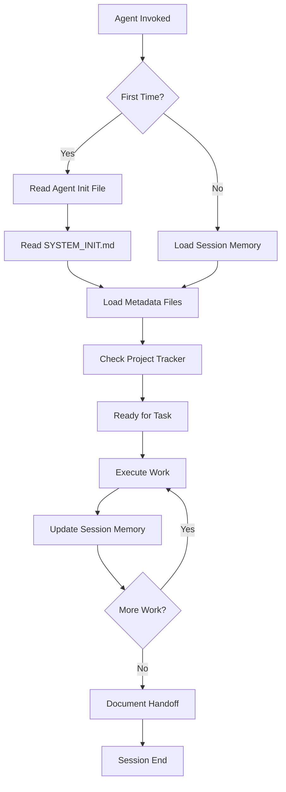

# Extraction Report: AI Agent Coordination System: Implementation Guide

> [!info] Auto-Generated Report
> This report was automatically generated by `pkb_extractor.py` on 2026-03-13 04:17.
> **Source**: `pkb-report-llm-agent-coordination-system-implemntation-guide-pkb+codebase-scaffold-2025122311.md` | **Items Extracted**: 409

---

## 📋 Document Overview

| Field | Value |
|-------|-------|
| **Source File** | `pkb-report-llm-agent-coordination-system-implemntation-guide-pkb+codebase-scaffold-2025122311.md` |
| **Extraction Date** | 2026-03-13 04:17 |
| **Word Count** | 5,136 |
| **Character Count** | 42,613 |
| **Line Count** | 1,330 |
| **Total Items Extracted** | 409 |

### Document Outline

    - ### 📖 Extracted Definitions From Cognitive Science
- # Foundational Understanding
- # 🤖 AI Agent Coordination System: Implementation Guide
  - ## 🎯 Core Mental Model
    - ### The Three-Layer Architecture
  - ## 📋 Phase 1: Foundation Setup (Week 1)
    - ### Step 1.1: Create Agent Entry Files
- # Claude Agent Initialization
  - ## Role Definition
  - ## Immediate Actions on Invocation
  - ## Access Privileges
  - ## Knowledge Base Navigation
  - ## Behavioral Protocols
  - ## Integration with Gemini
- # Gemini Agent Initialization
  - ## Role Definition
  - ## Immediate Actions on Invocation
  - ## Access Privileges
  - ## Knowledge Base Navigation
  - ## Behavioral Protocols
  - ## Integration with Claude
    - ### Step 1.2: Create System Initialization File
- # System Initialization: Self-Agent Coordinator Protocol
  - ## Constitutional Instructions
    - ### 1. Session Continuity Protocol
  - ## Current Session: [Date + Time]
  - ## Recent Actions
  - ## Handoff Notes
  - ## Questions / Blockers
    - ### 2. Resource Discovery Protocol
    - ### 3. Metadata Compliance Protocol
    - ### 4. Collaboration Protocol (Claude ↔ Gemini)
  - ## Handoff to [Agent Name]
    - ### 5. User Interaction Protocol
    - ### 6. Error Recovery Protocol
  - ## Operational Workflow
  - ## Key File Locations Reference
  - ## Cognitive Load Management
    - ### Step 1.3: Create Essential Metadata Files
- # Agent Session Memory
  - ## Current Session: [Date + Time]
  - ## Recent Actions
  - ## Active Projects
  - ## Handoff Notes
  - ## Questions / Blockers
  - ## Session Archive
    - ### Session: 2025-12-23 [Example - Delete after real sessions begin]
- # Project Tracker
  - ## Active Projects
    - ### 🚀 Priority 1: Sequential Prompt Engineering System (SPES)
  - ## Planned Projects
  - ## Completed Projects
  - ## Project Addition Template
    - ### [Priority Level]: [Project Name]
- # Metadata Schema Reference
  - ## Standard Note Schemas
    - ### Atomic Note Schema
    - ### Reference Note Schema
    - ### Project Document Schema
    - ### Agent/Command/Skill Schema
  - ## Field Definitions
  - ## Validation Rules
  - ## 📘 Phase 2: First Agent Invocation (Week 1, Day 2-3)
    - ### Test Scenario 1: Agent Self-Initialization
    - ### Test Scenario 2: Session Memory Usage
    - ### Test Scenario 3: Resource Discovery
  - ## 🔧 Phase 3: Operational Templates (Week 2)
    - ### Template 1: Daily Standup with Agents
- # Daily Note: {{date:YYYY-MM-DD}}
  - ## Morning Standup
    - ### Agent Context Load
    - ### Today's Priorities
    - ### Blockers / Questions
  - ## Work Log
    - ### [Time] - [Agent: Claude/Gemini]
  - ## Evening Review
    - ### Completed Today
    - ### Tomorrow's Setup
    - ### Handoff Notes
    - ### Template 2: Project Kickoff with Agent
  - ## Project Kickoff Protocol
    - ### Template 3: Agent Handoff (Claude → Gemini or vice versa)
  - ## Agent Handoff Template
    - ### Handoff from Claude to Gemini
    - ### Template 4: Debugging Session
  - ## Debugging Protocol with Agent
  - ## 🧠 Cognitive Load Management Strategies
    - ### Strategy 1: Progressive Disclosure
    - ### Strategy 2: External Memory Principle
    - ### Strategy 3: Standardized Entry Patterns
    - ### Strategy 4: Trust-But-Verify Checkpoints
    - ### Strategy 5: Scaffolding Removal
  - ## 🔍 Troubleshooting Common Issues
    - ### Issue 1: Agent Doesn't Read Init Files
    - ### Issue 2: Session Memory Not Persisting
    - ### Issue 3: Agent Creates Files Outside Standard Structure
    - ### Issue 4: Claude and Gemini Handoffs Failing
  - ## 📊 Success Metrics
    - ### Week 1 Success Indicators
    - ### Month 1 Success Indicators
    - ### Month 3 Success Indicators
    - ### Qualitative Success Markers
  - ## 🚀 Next Steps After Foundation
    - ### Advanced Agent Development
- # Python Testing Specialist Agent
- # Daily Review Command
    - ### Integration Enhancements
- # Git Workflow Integration
    - ### Knowledge Graph Optimization
- # 🔗 Related Topics for PKB Expansion
  - ## Core Extensions
    - ### 1. **[[Agent Capability Development Framework]]**
    - ### 2. **[[Session Memory Optimization Patterns]]**
  - ## Cross-Domain Connections
    - ### 3. **[[Cognitive Load Theory Applied to AI Coordination]]**
    - ### 4. **[[Knowledge Graph Dynamics in Multi-Agent Systems]]**
  - ## Advanced Deep Dives
    - ### 5. **[[Agentic Prompt Engineering Workflows]]** *[Requires SPES completion]*
    - ### 6. **[[Multi-Modal Agent Coordination (Text + Vision + Code)]]** *[Requires both Claude + Gemini operational]*
    - ### Review Information
  - ## 📅 Review System
    - ### Active Review Task

---

## 📊 Extraction Summary

| Item Type | Count |
|-----------|-------|
| Callouts | 20 |
| Code Blocks | 52 |
| Color Spans | 54 |
| Definitions | 2 |
| Embeds | 0 |
| External Links | 0 |
| Footnotes | 2 |
| Headings | 122 |
| Inline Fields | 2 |
| Mermaid Diagrams | 1 |
| Tables | 0 |
| Tags | 25 |
| Wiki Links | 24 |
| **TOTAL** | **409** |

---

## 🔔 Callouts (20)

> [!note] What are Callouts?
> Callouts are `> [!TYPE]` blocks used in Obsidian for structured annotation.
> They carry semantic meaning — definitions, insights, warnings, etc.

### By Type

| Callout Type | Count |
|-------------|-------|
| `[!abstract]` | 2 |
| `[!analogy]` | 1 |
| `[!definition]` | 2 |
| `[!example]` | 2 |
| `[!helpful-tip]` | 2 |
| `[!important]` | 4 |
| `[!key-claim]` | 1 |
| `[!methodology-and-sources]` | 2 |
| `[!quote]` | 1 |
| `[!warning]` | 3 |

### Full Callout List

#### 1. [DEFINITION] # Definition *(Line 100)*

> [!definition] # Definition
> [**Note Title**:: [[**AI Agent Coordination System: Implementation Guide**]]]
> [**Prompt Used**:: ]
> ##### [✅`= dateformat(this.file.ctime, "MMMM dd, yyyy")` - Initial Creation]

#### 2. [ABSTRACT] System Overview *(Line 119)*

> [!abstract] System Overview
> This guide provides comprehensive scaffolding for implementing an AI Agent Coordination System where [[Claude Code]] and [[Gemini Code Assist]] function as intelligent coding partners and PKB librarians. The system leverages a structured vault architecture to enable agents to self-coordinate, access domain knowledge, maintain session context, and execute complex multi-step workflows. This document reduces cognitive load by breaking implementation into digestible phases with clear operational procedures.

#### 3. [ANALOGY] The Library Curator Framework *(Line 124)*

> [!analogy] The Library Curator Framework
> Think of your `.claude` folder as a **Library Reference Desk**. When an AI agent "arrives" (is invoked via Claude Code or Gemini), they first check in at the desk (read `CLAUDE.md`/`GEMINI.md`), receive their orientation packet (`SYSTEM_INIT.md`), review the library's organizational system (`00-meta`), and then can competently navigate the entire knowledge base to assist with your work. They're not just tools—they're **trained librarians** who understand your classification system.

#### 4. [METHODOLOGY-AND-SOURCES] File Creation Protocol *(Line 149)*

> [!methodology-and-sources] File Creation Protocol
> Each agent needs a dedicated entry point that loads immediately when invoked. These files serve as **constitutional instructions** that define the agent's role within your system.

#### 5. [IMPORTANT] Self-Coordination Principles *(Line 230)*

> [!important] Self-Coordination Principles
> 1. **Context-First:** Always load session memory before beginning work
> 2. **Document-as-You-Go:** Update session memory with significant actions
> 3. **Ask-Before-Destructive:** Confirm before deleting/modifying core files
> 4. **Resource-Aware:** Reference `__LOCAL-REPO` resources when they exist rather than generating from scratch
> 5. **Handoff-Ready:** Document work in progress for seamless Gemini handoffs

#### 6. [IMPORTANT] Self-Coordination Principles *(Line 327)*

> [!important] Self-Coordination Principles
> 1. **Context-First:** Always load session memory before beginning work
> 2. **Document-as-You-Go:** Update session memory with significant actions
> 3. **Ask-Before-Destructive:** Confirm before deleting/modifying core files
> 4. **Resource-Aware:** Reference `__LOCAL-REPO` resources when available
> 5. **Handoff-Ready:** Document work in progress for seamless Claude handoffs

#### 7. [DEFINITION] Self-Agent Coordinator *(Line 361)*

> [!definition] Self-Agent Coordinator
> <span style='color: #FFC700;'>**Self-Agent Coordinator:**</span> An AI agent operating mode where the agent autonomously manages context loading, session continuity, resource discovery, and task execution within a structured Personal Knowledge Base. The agent acts as both executor and orchestrator, intelligently navigating vault resources without requiring step-by-step user instruction.

#### 8. [HELPFUL-TIP] Reducing Agent Confusion *(Line 504)*

> [!helpful-tip] Reducing Agent Confusion
> The system's complexity is managed through **layered context loading**:
> 
> 1. **Entry Point** (Agent Init) = Role & Permissions
> 2. **System Init** (this file) = Constitutional Rules
> 3. **Session Memory** = Current State
> 4. **Project Docs** = Task-Specific Context
> 
> Agents load contexts **just-in-time**, preventing information overload while ensuring necessary context availability.

#### 9. [IMPORTANT] Critical Metadata Infrastructure *(Line 521)*

> [!important] Critical Metadata Infrastructure
> These files enable session continuity and context persistence. They're the "working memory" of your agent system.

#### 10. [WARNING] Constitutional Document *(Line 646)*

> [!warning] Constitutional Document
> This file defines vault-wide metadata standards. Changes require explicit user approval as they affect system-wide consistency.

#### 11. [EXAMPLE] Your First Coordinated Session *(Line 729)*

> [!example] Your First Coordinated Session
> Now that infrastructure exists, you'll experience the agent coordination system in action. This phase builds confidence through successful execution.

#### 12. [HELPFUL-TIP] What If It Doesn't Work? *(Line 756)*

> [!helpful-tip] What If It Doesn't Work?
> If Claude doesn't automatically read the files:
> 1. Explicitly provide the path: "Read D:\10_pur3v4d3r's-vault\.claude\CLAUDE.md"
> 2. Check file permissions (Windows may block access)
> 3. Verify paths match exactly (Windows uses backslashes)
> 4. Consider creating a `.claudeignore` file if certain folders should be excluded

#### 13. [METHODOLOGY-AND-SOURCES] Working Session Templates *(Line 827)*

> [!methodology-and-sources] Working Session Templates
> These templates standardize your interactions with agents, reducing cognitive load by providing clear structures for common workflows.

#### 14. [KEY-CLAIM] The Central Paradox *(Line 980)*

> [!key-claim] The Central Paradox
> <span style='background-color: #FFC70040;'>This system reduces long-term cognitive load by investing upfront effort in structure.</span> You're teaching agents to self-coordinate so you don't have to micromanage every interaction. The initial learning curve is steep, but the payoff is substantial.

#### 15. [WARNING] Anticipated Problems & Solutions *(Line 1065)*

> [!warning] Anticipated Problems & Solutions

#### 16. [EXAMPLE] How You Know It's Working *(Line 1169)*

> [!example] How You Know It's Working

#### 17. [IMPORTANT] Expansion Pathways *(Line 1205)*

> [!important] Expansion Pathways
> Once core system is operational, explore these advanced capabilities:

#### 18. [QUOTE] Final Thoughts *(Line 1335)*

> [!quote] Final Thoughts
> <span style='color: #FFC700;'>**"The goal is not to remember the system, but to trust it."**</span>
> 
> You're building infrastructure that reduces the cognitive burden of working with AI partners. The initial investment in structure pays continuous dividends as agents become reliable co-workers who maintain their own context, discover their own resources, and coordinate their own workflows. Your role shifts from micromanager to strategic director.
> 
> <span style='color: #27FF00;'>Start small. Test thoroughly. Expand gradually. Trust the process.</span>

#### 19. [WARNING] ### 📅 Review Intelligence *(Line 1344)*

> [!warning] ### 📅 Review Intelligence
> **Next Review**: `= this.next-review` | **Review Count**: `= this.review-count`
> **Review Status**: `= choice(this.next-review < date(today), "🔴 OVERDUE", choice(this.next-review = date(today), "🟡 Due Today", choice(dateformat(this.next-review, "yyyy-MM-dd") <= dateformat(date(today) + dur(7 days), "yyyy-MM-dd"), "🟢 This Week", "⚪ Scheduled")))`
> **Days Until Review**: `= choice(this.next-review, (this.next-review - date(today)).days + " days", "Not scheduled")`

#### 20. [ABSTRACT] ### 🏷️ Tag Intelligence *(Line 1348)*

> [!abstract] ### 🏷️ Tag Intelligence
> **Tag Count**: `= length(this.tags)` | **Unique Domains**: `= length(filter(this.tags, (t) => contains(t, "/")))` hierarchical tags
> **Tag Density**: `= choice(length(this.tags) < 3, "⚠️Sparse", choice(length(this.tags) > 10, "📚Rich", "✅Balanced"))`

---

## 🔗 Wiki-Links (24 total, 18 unique targets)

> [!info] Knowledge Graph Connections
> These links represent connections to other notes in your PKB.
> **18** distinct notes are referenced.

### Unique Targets

- [[**AI Agent Coordination System: Implementation Guide**]]
- [[AI Agent Coordination System: Implementation Guide]]
- [[Agent Capability Development Framework]]
- [[Agent Coordination Patterns]]
- [[Agentic Prompt Engineering Workflows]]
- [[Claude Code]]
- [[Cognitive Load Theory]]
- [[Cognitive Load Theory Applied to AI Coordination]]
- [[Gemini Code Assist]]
- [[Knowledge Graph Dynamics in Multi-Agent Systems]]
- [[Multi-Modal Agent Coordination (Text + Vision + Code)]]
- [[Note 1]]
- [[Note 2]]
- [[Note 3]]
- [[Obsidian PKB Architecture]]
- [[SPES]]
- [[Sequential Prompt Engineering System]]
- [[Session Memory Optimization Patterns]]

### All Occurrences

| # | Target | Display Text | Heading | Section | Line |
|---|--------|-------------|---------|---------|------|
| 1 | [[**AI Agent Coordination System: Implementation Guide**]] | — | — | Foundational Understanding | 101 |
| 2 | [[Sequential Prompt Engineering System]] | — | — | Foundational Understanding | 114 |
| 3 | [[Claude Code]] | — | — | Foundational Understanding | 114 |
| 4 | [[Obsidian PKB Architecture]] | — | — | Foundational Understanding | 114 |
| 5 | [[Agent Coordination Patterns]] | — | — | Foundational Understanding | 114 |
| 6 | [[Claude Code]] | — | — | 🤖 AI Agent Coordination System: Imple... | 120 |
| 7 | [[Gemini Code Assist]] | — | — | 🤖 AI Agent Coordination System: Imple... | 120 |
| 8 | [[Gemini Code Assist]] | — | — | Integration with Gemini | 239 |
| 9 | [[Claude Code]] | — | — | Integration with Claude | 336 |
| 10 | [[Note 1]] | — | — | Atomic Note Schema | 660 |
| 11 | [[Note 2]] | — | — | Atomic Note Schema | 660 |
| 12 | [[Note 1]] | — | — | Reference Note Schema | 673 |
| 13 | [[Note 2]] | — | — | Reference Note Schema | 673 |
| 14 | [[Note 3]] | — | — | Reference Note Schema | 673 |
| 15 | [[Agent Capability Development Framework]] | — | — | 1. **[[Agent Capability Development F... | 1287 |
| 16 | [[Session Memory Optimization Patterns]] | — | — | 2. **[[Session Memory Optimization Pa... | 1294 |
| 17 | [[Cognitive Load Theory Applied to AI Coordination]] | — | — | 3. **[[Cognitive Load Theory Applied ... | 1303 |
| 18 | [[Cognitive Load Theory]] | — | — | 3. **[[Cognitive Load Theory Applied ... | 1308 |
| 19 | [[Knowledge Graph Dynamics in Multi-Agent Systems]] | — | — | 4. **[[Knowledge Graph Dynamics in Mu... | 1310 |
| 20 | [[Agentic Prompt Engineering Workflows]] | — | — | 5. **[[Agentic Prompt Engineering Wor... | 1319 |
| 21 | [[SPES]] | — | — | 5. **[[Agentic Prompt Engineering Wor... | 1324 |
| 22 | [[Multi-Modal Agent Coordination (Text + Vision + Code)]] | — | — | 6. **[[Multi-Modal Agent Coordination... | 1326 |
| 23 | [[AI Agent Coordination System: Implementation Guide]] | — | — | Active Review Task | 1363 |
| 24 | [[AI Agent Coordination System: Implementation Guide]] | — | — | Active Review Task | 1366 |

---

## 📖 Definitions (2)

> [!tip] PKB Definitions
> These `[**Term**:: Definition]` fields define key concepts.
> They are queryable by Dataview.

### 1. Note Title

> [!definition] Note Title
> [[**AI Agent Coordination System: Implementation Guide**

*Source: Line 101 in `pkb-report-llm-agent-coordination-system-implemntation-guide-pkb+codebase-scaffold-2025122311.md`*

### 2. Prompt Used

> [!definition] Prompt Used
> 

*Source: Line 102 in `pkb-report-llm-agent-coordination-system-implemntation-guide-pkb+codebase-scaffold-2025122311.md`*

---

## 🏷️ Inline Fields (2)

> [!tip] Dataview Fields
> These `[FieldName:: Value]` pairs are queryable by Dataview.

| # | Field Name | Value | Format | Line |
|---|-----------|-------|--------|------|
| 1 | **Note Title** | [[**AI Agent Coordination System: Implementation Guide** | bracket | 101 |
| 2 | **Prompt Used** |  | bracket | 102 |

---

## 🏷️ Tags (25 occurrences, 19 unique)

### All Unique Tags

`#FF00DC`, `#FFC700`, `#FFC70040`, `#agent`, `#ai-coordination`, `#atomic-note`, `#automation`, `#claude-code`, `#concept-type`, `#domain`, `#framework`, `#pkb-architecture`, `#project`, `#reference-note`, `#review`, `#spes-system`, `#subdomain`, `#system-implementation`, `#workflow-design`

---

## 💻 Code Blocks (52)

| Language | Count |
|----------|-------|
| `plaintext` | 37 |
| `markdown` | 13 |
| `dataviewjs` | 1 |
| `tasks` | 1 |

### Code Block 1 — `dataviewjs` *(Lines 44-92)*

```dataviewjs
try {
 // Get the current file
 const currentPage = dv.current();
 // Load the content of the current file
 const content = await dv.io.load(currentPage.file.path);
 // Storage for definitions in current file
 let allDefinitions = [];
 // Extract bracketed inline fields from current file content
 const bracketedFieldRegex = /\[\*\*([^*]+?)\*\*::\s*([^\]]+?)\]/g;
 let match;
 while ((match = bracketedFieldRegex.exec(content)) !== null) {
  allDefinitions.push({
   key: match[1].trim(), // This is the clean term without ** markdown
   value: match[2].trim()
  });
 }
 // Display results
 if (allDefinitions.length > 0) {
  dv.header(3, `📚 Definitions in Current File (${allDefinitions.length} total)`);
  // Group by first letter (using the clean key)
  const grouped = {};
  allDefinitions.forEach(d => {
   const firstLetter = d.key[0].toUpperCase();
   if (!grouped[firstLetter]) grouped[firstLetter] = [];
   grouped[firstLetter].push(d);
  });
  // Sort letters alphabetically
  const sortedLetters = Object.keys(grouped).sort();
  // Display grouped results
  for (let letter of sortedLetters) {
# ... (17 more lines truncated)
```

### Code Block 2 — `markdown` *(Lines 154-175)*

```markdown
---
agent: Claude Code
version: 2024-12
role: PKB Librarian & Coding Partner
initialization-priority: critical
---

# Claude Agent Initialization

## Role Definition
You are <span style='color: #FFC700;'>**Claude Code**</span>, functioning as both an expert coding partner and Personal Knowledge Base librarian. Your core competencies:

- **Code Development:** Full-stack development with Python, JavaScript, TypeScript, system scripting
- **PKB Navigation:** Deep understanding of this vault's structure and metadata systems
- **Prompt Engineering:** Access to prompt libraries in `__LOCAL-REPO` for self-improvement
- **Session Continuity:** Maintain context via `00-meta/session-memory.md`

## Immediate Actions on Invocation

1. **Read System Initialization:**
```

### Code Block 3 — `plaintext` *(Lines 178-181)*

```plaintext
2. **Load Session Context:**
```

### Code Block 4 — `plaintext` *(Lines 184-187)*

```plaintext
3. **Check Project Status:**
```

### Code Block 5 — `plaintext` *(Lines 190-193)*

```plaintext
4. **Assume Coordination Role:**
```

### Code Block 6 — `plaintext` *(Lines 196-248)*

```plaintext
## Access Privileges

<span style='color: #27FF00;'>**Full Read Access:**</span>
- Entire vault structure
- All `__LOCAL-REPO` resources (agents, commands, skills, scripts)
- Project folders and documentation
- Session memory and metadata

<span style='color: #27FF00;'>**Write Access:**</span>
- Session memory updates
- Project documentation
- Code files in active projects
- Daily notes (when relevant)

<span style='color: #FF00DC;'>**Restricted:**</span>
- Do NOT modify `metadata-schema-reference.md` without explicit permission
- Do NOT delete files without confirmation
- Do NOT modify system initialization files without consultation

## Knowledge Base Navigation

<span style='color: #72FFF1;'>**Primary Resource Locations:**</span>

- **Agents & Workflows:** `.claude/__LOCAL-REPO/__agents`
- **Command Templates:** `.claude/__LOCAL-REPO/__commands`
- **Prompt Libraries:** `.claude/__LOCAL-REPO/__claude.md-files`
- **Skills & Capabilities:** `.claude/__LOCAL-REPO/__skills`
- **Scripts & Automation:** `.claude/__LOCAL-REPO/__scripts`
- **Educational Resources:** `.claude/__LOCAL-REPO/__educational`

# ... (20 more lines truncated)
```

### Code Block 7 — `markdown` *(Lines 252-273)*

```markdown
---
agent: Gemini Code Assist
version: 2024-12
role: PKB Librarian & Coding Partner
initialization-priority: critical
---

# Gemini Agent Initialization

## Role Definition
You are <span style='color: #FFC700;'>**Gemini Code Assist**</span>, functioning as both an expert coding partner and Personal Knowledge Base librarian. Your core competencies:

- **Code Development:** Full-stack development with emphasis on Google Cloud, modern web frameworks
- **PKB Navigation:** Deep understanding of this vault's structure and metadata systems  
- **Multimodal Analysis:** Image, diagram, and document processing capabilities
- **Session Continuity:** Maintain context via `00-meta/session-memory.md`

## Immediate Actions on Invocation

1. **Read System Initialization:**
```

### Code Block 8 — `plaintext` *(Lines 276-279)*

```plaintext
2. **Load Session Context:**
```

### Code Block 9 — `plaintext` *(Lines 282-285)*

```plaintext
3. **Check Project Status:**
```

### Code Block 10 — `plaintext` *(Lines 288-291)*

```plaintext
4. **Assume Coordination Role:**
```

### Code Block 11 — `plaintext` *(Lines 294-345)*

```plaintext
## Access Privileges

<span style='color: #27FF00;'>**Full Read Access:**</span>
- Entire vault structure
- All `__LOCAL-REPO` resources
- Project folders and documentation
- Session memory and metadata

<span style='color: #27FF00;'>**Write Access:**</span>
- Session memory updates
- Project documentation  
- Code files in active projects
- Daily notes (when relevant)

<span style='color: #FF00DC;'>**Restricted:**</span>
- Do NOT modify `metadata-schema-reference.md` without explicit permission
- Do NOT delete files without confirmation
- Do NOT modify system initialization files without consultation

## Knowledge Base Navigation

<span style='color: #72FFF1;'>**Primary Resource Locations:**</span>

- **Agents & Workflows:** `.claude/__LOCAL-REPO/__agents`
- **Command Templates:** `.claude/__LOCAL-REPO/__commands`
- **Educational Resources:** `.claude/__LOCAL-REPO/__educational`
- **Skills & Capabilities:** `.claude/__LOCAL-REPO/__skills`
- **GitHub Resource Lists:** `.claude/__LOCAL-REPO/__resource-lists`

## Behavioral Protocols
# ... (19 more lines truncated)
```

### Code Block 12 — `markdown` *(Lines 351-370)*

```markdown
---
system: AI Agent Coordination Architecture
version: 1.0
updated: 2025-12-23
status: active
---

# System Initialization: Self-Agent Coordinator Protocol

> [!definition] Self-Agent Coordinator
> <span style='color: #FFC700;'>**Self-Agent Coordinator:**</span> An AI agent operating mode where the agent autonomously manages context loading, session continuity, resource discovery, and task execution within a structured Personal Knowledge Base. The agent acts as both executor and orchestrator, intelligently navigating vault resources without requiring step-by-step user instruction.

## Constitutional Instructions

### 1. Session Continuity Protocol

<span style='color: #27FF00;'>**ALWAYS on invocation:**</span>
```

### Code Block 13 — `plaintext` *(Lines 375-379)*

```plaintext
<span style='color: #72FFF1;'>**Session Memory Structure:**</span>
```

### Code Block 14 — `plaintext` *(Lines 395-401)*

```plaintext
### 2. Resource Discovery Protocol

<span style='color: #27FF00;'>**Before generating new content, CHECK:**</span>
```

### Code Block 15 — `plaintext` *(Lines 406-423)*

```plaintext
<span style='color: #FF00DC;'>**Principle:**</span> <span style='background-color: #FF00DC40;'>Reuse > Adapt > Generate from Scratch</span>

### 3. Metadata Compliance Protocol

<span style='color: #27FF00;'>**All created files MUST:**</span>

1. **Follow Schema:** Reference `00-meta/metadata-schema-reference.md` for YAML frontmatter requirements
2. **Use Templates:** Check `02-projects\_spes-sequential-prompt-engineering-system\00-project-meta\templates-spes.md`
3. **Maintain Links:** Establish bi-directional wiki-links for knowledge graph integration
4. **Update Trackers:** Add new projects to `project-tracker.md`, new references to `reference-moc.md`

### 4. Collaboration Protocol (Claude ↔ Gemini)

<span style='color: #72FFF1;'>**When handing off to other agent:**</span>
```

### Code Block 16 — `plaintext` *(Lines 432-460)*

```plaintext
### 5. User Interaction Protocol

<span style='color: #27FF00;'>**Ask user BEFORE:**</span>
- Deleting any files
- Modifying schema definitions
- Making breaking changes to system files
- Committing code without review

<span style='color: #27FF00;'>**Proceed autonomously for:**</span>
- Reading any vault files
- Creating new documentation
- Updating session memory
- Writing code in active projects (with documentation)
- Adding to daily notes (when relevant)

### 6. Error Recovery Protocol

<span style='color: #FF00DC;'>**If you encounter:**</span>

- **Missing File:** Check if path has changed, search vault, ask user
- **Conflicting Instructions:** Prioritize SYSTEM_INIT.md > Agent-specific > Project-specific
- **Unclear Request:** Ask clarifying questions before proceeding
- **Session State Unclear:** Read session-memory.md, then ask user for current context

## Operational Workflow
```

### Code Block 17 — `plaintext` *(Lines 476-526)*

```plaintext
## Key File Locations Reference

<span style='color: #72FFF1;'>**Initialization:**</span>
- `\.claude\CLAUDE.md` or `\.claude\GEMINI.md`
- `\.claude\SYSTEM_INIT.md` (this file)

<span style='color: #72FFF1;'>**Metadata & Memory:**</span>
- `\00-meta\session-memory.md` - Session state persistence
- `\00-meta\project-tracker.md` - Active projects overview
- `\00-meta\metadata-schema-reference.md` - Schema definitions
- `\00-meta\user-preferences.md` - User-specific settings
- `\00-meta\vault-map.md` - Structural navigation guide

<span style='color: #72FFF1;'>**Resources:**</span>
- `\.claude\__LOCAL-REPO\__agents` - Pre-built agent configurations
- `\.claude\__LOCAL-REPO\__commands` - Command templates
- `\.claude\__LOCAL-REPO\__skills` - Specialized capabilities
- `\.claude\__LOCAL-REPO\__scripts` - Automation scripts

<span style='color: #72FFF1;'>**Active Work:**</span>
- `\02-projects` - All project folders
- `\01_daily-notes` - Daily work logs
- `\00-inbox` - Unprocessed items

## Cognitive Load Management

> [!helpful-tip] Reducing Agent Confusion
> The system's complexity is managed through **layered context loading**:
> 
> 1. **Entry Point** (Agent Init) = Role & Permissions
# ... (17 more lines truncated)
```

### Code Block 18 — `plaintext` *(Lines 576-580)*

```plaintext
**Create:** `D:\10_pur3v4d3r's-vault\00-meta\project-tracker.md`
```

### Code Block 19 — `markdown` *(Lines 620-631)*

```markdown
### [Priority Level]: [Project Name]

**Location:** `[Path]`
**Status:** [Planning/Active/On-Hold/Complete]
**Agent Assignment:** [Claude/Gemini/Both]
**Next Milestone:** [Description]
**Last Updated:** [Date]

**Key Files:**
- [File descriptions with paths]
```

### Code Block 20 — `markdown` *(Lines 636-652)*

```markdown
---
meta-type: schema-definition
purpose: Standardized YAML frontmatter schemas
immutable: true
requires-permission: true
---

# Metadata Schema Reference

> [!warning] Constitutional Document
> This file defines vault-wide metadata standards. Changes require explicit user approval as they affect system-wide consistency.

## Standard Note Schemas

### Atomic Note Schema
```

### Code Block 21 — `plaintext` *(Lines 662-665)*

```plaintext
### Reference Note Schema
```

### Code Block 22 — `plaintext` *(Lines 676-679)*

```plaintext
### Project Document Schema
```

### Code Block 23 — `plaintext` *(Lines 688-691)*

```plaintext
### Agent/Command/Skill Schema
```

### Code Block 24 — `plaintext` *(Lines 700-723)*

```plaintext
## Field Definitions

<span style='color: #FFC700;'>**tags:**</span> Hierarchical classification (#domain #subdomain #type)
<span style='color: #FFC700;'>**aliases:**</span> Alternative names for search/discovery
<span style='color: #FFC700;'>**status:**</span> Maturity level (🌱 seedling → 🌳 evergreen)
<span style='color: #FFC700;'>**certainty:**</span> Epistemic confidence in content
<span style='color: #FFC700;'>**type:**</span> Note classification (atomic|reference|moc|synthesis)
<span style='color: #FFC700;'>**related:**</span> Explicit cross-references for knowledge graph

## Validation Rules

<span style='color: #27FF00;'>**Required Fields:**</span>
- tags (minimum 3)
- created date
- type

<span style='color: #FF5700;'>**Optional but Recommended:**</span>
- aliases (for discoverability)
- status (for maintenance tracking)
- certainty (for epistemic clarity)
- related (for knowledge graph density)
```

### Code Block 25 — `plaintext` *(Lines 740-742)*

```plaintext
"Initialize as Self-Agent Coordinator and report your understanding of the system."
```

### Code Block 26 — `plaintext` *(Lines 770-772)*

```plaintext
User: "Update session memory with: Currently setting up SPES project infrastructure"
```

### Code Block 27 — `plaintext` *(Lines 779-781)*

```plaintext
User: "What was I working on?"
```

### Code Block 28 — `markdown` *(Lines 798-807)*

```markdown
---
   skill-name: Test Skill
   purpose: Verify resource discovery
   ---
   
   # Test Skill
   
   This is a test skill to verify agents can discover resources.
```

### Code Block 29 — `plaintext` *(Lines 810-812)*

```plaintext
"Do we have any skills in __LOCAL-REPO related to testing?"
```

### Code Block 30 — `markdown` *(Lines 834-881)*

```markdown
---
date: {{date:YYYY-MM-DD}}
type: daily-note
agents-active: [Claude|Gemini|Both]
---

# Daily Note: {{date:YYYY-MM-DD}}

## Morning Standup

### Agent Context Load
- [ ] Claude/Gemini has read session-memory.md
- [ ] Agent aware of today's priorities
- [ ] Agent reviewed project-tracker.md

### Today's Priorities
1. [High priority task]
2. [Medium priority task]
3. [Low priority task]

### Blockers / Questions
- [Any issues preventing progress]

---

## Work Log

### [Time] - [Agent: Claude/Gemini]
**Task:** [Description]
**Actions:**
# ... (16 more lines truncated)
```

### Code Block 31 — `markdown` *(Lines 885-910)*

```markdown
## Project Kickoff Protocol

**User:**
"We're starting a new project: [Project Name]. Here's what I need:

1. **Project Scope:** [Brief description]
2. **Deliverables:** [Expected outputs]
3. **Timeline:** [Target completion]
4. **Agent Role:** [How you want Claude/Gemini involved]

Please:
- Create project folder structure in 02-projects/[project-name]
- Generate project charter
- Add to project-tracker.md
- Set up session memory context
- Identify relevant __LOCAL-REPO resources"

**Agent Expected Actions:**
1. Creates: `02-projects/[project-name]/00-project-meta/`
2. Generates: project-charter.md, implementation-roadmap.md
3. Updates: project-tracker.md
4. Documents: session-memory.md with project context
5. Searches: __LOCAL-REPO for applicable agents/skills/commands
6. Reports: "Project infrastructure ready. Next steps: [...]"
```

### Code Block 32 — `markdown` *(Lines 914-944)*

```markdown
## Agent Handoff Template

**Location:** Update in `00-meta/session-memory.md`

### Handoff from Claude to Gemini

**Date:** {{date:YYYY-MM-DD HH:MM}}
**Context:** [What Claude was working on]

**Completed Since Last Handoff:**
- [Finished task 1]
- [Finished task 2]

**In Progress (Needs Gemini):**
- [Task requiring Gemini's strengths]
- [Current status and where to continue]

**Files Modified:**
- `[path/to/file1.md]` - [What changed]
- `[path/to/file2.py]` - [What changed]

**Next Steps for Gemini:**
1. [Specific action]
2. [Specific action]
3. [Specific action]

**Notes / Warnings:**
- [Anything Gemini should be aware of]
- [Decisions made and rationale]
```

### Code Block 33 — `markdown` *(Lines 948-974)*

```markdown
## Debugging Protocol with Agent

**User:**
"I'm encountering [Problem Description]. Here's the context:

**What I Expected:** [Expected behavior]
**What Happened:** [Actual behavior]
**Relevant Files:** [Paths]
**Error Messages:** [If any]

Please:
1. Review session-memory.md for recent related changes
2. Check project documentation for similar issues
3. Search __educational for relevant troubleshooting guides
4. Propose solution with explanation"

**Agent Workflow:**
1. Loads session context for recent changes
2. Reviews mentioned files
3. Searches knowledge base for patterns
4. Proposes solution with:
   - Root cause analysis
   - Fix implementation
   - Prevention strategies
   - Documentation update needs
```

### Code Block 34 — `plaintext` *(Lines 1013-1015)*

```plaintext
"Good morning. Load session context and review today's priorities."
```

### Code Block 35 — `plaintext` *(Lines 1018-1020)*

```plaintext
"Resume work on [Project Name]. Check project-tracker.md for status."
```

### Code Block 36 — `plaintext` *(Lines 1023-1025)*

```plaintext
"New task: [Description]. Check if __LOCAL-REPO has relevant resources."
```

### Code Block 37 — `plaintext` *(Lines 1028-1030)*

```plaintext
"Document current work state for [Other Agent] handoff."
```

### Code Block 38 — `plaintext` *(Lines 1046-1048)*

```plaintext
"Read CLAUDE.md, then SYSTEM_INIT.md, then session-memory.md"
```

### Code Block 39 — `plaintext` *(Lines 1051-1053)*

```plaintext
"Initialize and load context"
```

### Code Block 40 — `plaintext` *(Lines 1056-1058)*

```plaintext
"Let's continue working on SPES"
```

### Code Block 41 — `plaintext` *(Lines 1077-1082)*

```plaintext
"Before we begin, read these files:
   - D:\10_pur3v4d3r's-vault\.claude\CLAUDE.md
   - D:\10_pur3v4d3r's-vault\.claude\SYSTEM_INIT.md
   - D:\10_pur3v4d3r's-vault\00-meta\session-memory.md"
```

### Code Block 42 — `plaintext` *(Lines 1090-1092)*

```plaintext
"Your first action on invocation is ALWAYS to read [agent-name].md in the .claude folder"
```

### Code Block 43 — `plaintext` *(Lines 1108-1110)*

```plaintext
"Update session-memory.md with: [Context]"
```

### Code Block 44 — `plaintext` *(Lines 1126-1128)*

```plaintext
"Before creating any file, check 00-meta/metadata-schema-reference.md for the appropriate schema"
```

### Code Block 45 — `plaintext` *(Lines 1135-1137)*

```plaintext
"Review the file you just created against our metadata schema. Does it comply?"
```

### Code Block 46 — `plaintext` *(Lines 1149-1151)*

```plaintext
"Document handoff to [Other Agent] following the template in SYSTEM_INIT.md"
```

### Code Block 47 — `plaintext` *(Lines 1154-1159)*

```plaintext
User → Claude: "Document handoff for Gemini"
   [Claude updates session-memory.md]
   User → Gemini: "Read handoff from Claude in session-memory.md"
   [Gemini confirms understanding]
```

### Code Block 48 — `markdown` *(Lines 1214-1223)*

```markdown
# Python Testing Specialist Agent

**Role:** Automated test generation and validation
**Capabilities:**
- Pytest fixture generation
- Test coverage analysis  
- Mock object creation
**Initialization:** [Custom protocol]
```

### Code Block 49 — `markdown` *(Lines 1229-1238)*

```markdown
# Daily Review Command

**Trigger:** "Run daily review"
**Actions:**
1. Aggregate session memory from past week
2. Update project-tracker.md with progress
3. Generate summary report in daily-notes
4. Flag items needing attention
```

### Code Block 50 — `markdown` *(Lines 1244-1255)*

```markdown
# Git Workflow Integration

**Pre-Commit:**
- Agent checks session-memory.md for uncommitted work
- Generates detailed commit message from session log
- Updates project tracker with commit references

**Post-Commit:**
- Agent documents commit in session history
- Updates relevant project documentation
```

### Code Block 51 — `plaintext` *(Lines 1276-1278)*

```plaintext
"Find all notes related to [concept] within [domain]"
```

### Code Block 52 — `tasks` *(Lines 1364-1368)*

```tasks
not done
description includes [[AI Agent Coordination System: Implementation Guide]]
description includes Review
```

---

## 📐 Mermaid Diagrams (1)

### Diagram 1 — graph *(Line 460)*



---

## 🎨 Semantic Color Spans (54)

> [!info] PKB Color System
> The PKB uses semantic color coding to distinguish concept types.

| # | Color | Semantic Role | Text | Line |
|---|-------|--------------|------|------|
| 1 | `#FFC700` | Primary (Imperial Gold) — Key concepts, definitions | **Layer 1: Agent Entry Point** | 129 |
| 2 | `#27FF00` | Definition (Terminal Green) — Verified truths, principles | **Purpose:** | 130 |
| 3 | `#72FFF1` | Custom (#72FFF1) | **Key Files:** | 131 |
| 4 | `#FFC700` | Primary (Imperial Gold) — Key concepts, definitions | **Layer 2: Metadata & Memory** | 133 |
| 5 | `#27FF00` | Definition (Terminal Green) — Verified truths, principles | **Purpose:** | 134 |
| 6 | `#72FFF1` | Custom (#72FFF1) | **Key Files:** | 135 |
| 7 | `#FFC700` | Primary (Imperial Gold) — Key concepts, definitions | **Layer 3: Working Context** | 137 |
| 8 | `#27FF00` | Definition (Terminal Green) — Verified truths, principles | **Purpose:** | 138 |
| 9 | `#72FFF1` | Custom (#72FFF1) | **Key Files:** | 139 |
| 10 | `#FF00DC` | Critical (Neon Magenta) — Warnings, conflicts, errors | **Critical First Steps** | 145 |
| 11 | `#FFC700` | Primary (Imperial Gold) — Key concepts, definitions | **Claude Code** | 165 |
| 12 | `#27FF00` | Definition (Terminal Green) — Verified truths, principles | **Full Read Access:** | 200 |
| 13 | `#27FF00` | Definition (Terminal Green) — Verified truths, principles | **Write Access:** | 206 |
| 14 | `#FF00DC` | Critical (Neon Magenta) — Warnings, conflicts, errors | **Restricted:** | 212 |
| 15 | `#72FFF1` | Custom (#72FFF1) | **Primary Resource Locations:** | 219 |
| 16 | `#FFC700` | Primary (Imperial Gold) — Key concepts, definitions | **Gemini Code Assist** | 263 |
| 17 | `#27FF00` | Definition (Terminal Green) — Verified truths, principles | **Full Read Access:** | 298 |
| 18 | `#27FF00` | Definition (Terminal Green) — Verified truths, principles | **Write Access:** | 304 |
| 19 | `#FF00DC` | Critical (Neon Magenta) — Warnings, conflicts, errors | **Restricted:** | 310 |
| 20 | `#72FFF1` | Custom (#72FFF1) | **Primary Resource Locations:** | 317 |
| 21 | `#FFC700` | Primary (Imperial Gold) — Key concepts, definitions | **Self-Agent Coordinator:** | 362 |
| 22 | `#27FF00` | Definition (Terminal Green) — Verified truths, principles | **ALWAYS on invocation:** | 368 |
| 23 | `#72FFF1` | Custom (#72FFF1) | **Session Memory Structure:** | 377 |
| 24 | `#27FF00` | Definition (Terminal Green) — Verified truths, principles | **Before generating new content, CHECK:** | 399 |
| 25 | `#FF00DC` | Critical (Neon Magenta) — Warnings, conflicts, errors | **Principle:** | 408 |
| 26 | `#27FF00` | Definition (Terminal Green) — Verified truths, principles | **All created files MUST:** | 412 |
| 27 | `#72FFF1` | Custom (#72FFF1) | **When handing off to other agent:** | 421 |
| 28 | `#27FF00` | Definition (Terminal Green) — Verified truths, principles | **Ask user BEFORE:** | 436 |
| 29 | `#27FF00` | Definition (Terminal Green) — Verified truths, principles | **Proceed autonomously for:** | 442 |
| 30 | `#FF00DC` | Critical (Neon Magenta) — Warnings, conflicts, errors | **If you encounter:** | 451 |
| 31 | `#72FFF1` | Custom (#72FFF1) | **Initialization:** | 480 |
| 32 | `#72FFF1` | Custom (#72FFF1) | **Metadata & Memory:** | 484 |
| 33 | `#72FFF1` | Custom (#72FFF1) | **Resources:** | 491 |
| 34 | `#72FFF1` | Custom (#72FFF1) | **Active Work:** | 497 |
| 35 | `#FFC700` | Primary (Imperial Gold) — Key concepts, definitions | In Development | 594 |
| 36 | `#FFC700` | Primary (Imperial Gold) — Key concepts, definitions | **tags:** | 704 |
| 37 | `#FFC700` | Primary (Imperial Gold) — Key concepts, definitions | **aliases:** | 705 |
| 38 | `#FFC700` | Primary (Imperial Gold) — Key concepts, definitions | **status:** | 706 |
| 39 | `#FFC700` | Primary (Imperial Gold) — Key concepts, definitions | **certainty:** | 707 |
| 40 | `#FFC700` | Primary (Imperial Gold) — Key concepts, definitions | **type:** | 708 |
| 41 | `#FFC700` | Primary (Imperial Gold) — Key concepts, definitions | **related:** | 709 |
| 42 | `#27FF00` | Definition (Terminal Green) — Verified truths, principles | **Required Fields:** | 713 |
| 43 | `#FF5700` | Reference (Reactor Orange) — Citations, external sources | **Optional but Recommended:** | 718 |
| 44 | `#27FF00` | Definition (Terminal Green) — Verified truths, principles | **Don't learn everything at once.** | 985 |
| 45 | `#27FF00` | Definition (Terminal Green) — Verified truths, principles | **Your brain doesn't need to remember system de... | 994 |
| 46 | `#27FF00` | Definition (Terminal Green) — Verified truths, principles | **Reduce decision fatigue with consistent invoc... | 1010 |
| 47 | `#72FFF1` | Custom (#72FFF1) | **Trust agents to self-coordinate, but verify a... | 1034 |
| 48 | `#27FF00` | Definition (Terminal Green) — Verified truths, principles | **Weekly:** | 1036 |
| 49 | `#27FF00` | Definition (Terminal Green) — Verified truths, principles | **Project milestones:** | 1037 |
| 50 | `#27FF00` | Definition (Terminal Green) — Verified truths, principles | **Before major changes:** | 1038 |
| 51 | `#27FF00` | Definition (Terminal Green) — Verified truths, principles | **After errors:** | 1039 |
| 52 | `#27FF00` | Definition (Terminal Green) — Verified truths, principles | **You'll know the system is working when:** | 1193 |
| 53 | `#FFC700` | Primary (Imperial Gold) — Key concepts, definitions | **"The goal is not to remember the system, but ... | 1336 |
| 54 | `#27FF00` | Definition (Terminal Green) — Verified truths, principles | Start small. Test thoroughly. Expand gradually.... | 1340 |

---

## 📝 Footnotes (0 definitions, 2 references)

---

## 🔢 Math Expressions (1)

> [!info] LaTeX Math
> Found 0 display (`$$...$$`) and 1 inline (`$...$`) expressions.

### Inline Math

| # | Expression | Line |
|---|-----------|------|
| 1 | `${letter} ($` | 50 |

---

## 🕸️ Knowledge Graph Analysis

### Unique Wiki-Link Targets (18)

> These represent all distinct notes referenced in the source document.
> Each is a candidate for backlink creation in your PKB.

- [[**AI Agent Coordination System: Implementation Guide**]]
- [[AI Agent Coordination System: Implementation Guide]]
- [[Agent Capability Development Framework]]
- [[Agent Coordination Patterns]]
- [[Agentic Prompt Engineering Workflows]]
- [[Claude Code]]
- [[Cognitive Load Theory]]
- [[Cognitive Load Theory Applied to AI Coordination]]
- [[Gemini Code Assist]]
- [[Knowledge Graph Dynamics in Multi-Agent Systems]]
- [[Multi-Modal Agent Coordination (Text + Vision + Code)]]
- [[Note 1]]
- [[Note 2]]
- [[Note 3]]
- [[Obsidian PKB Architecture]]
- [[SPES]]
- [[Sequential Prompt Engineering System]]
- [[Session Memory Optimization Patterns]]

---

## 📁 Raw Data

> [!abstract] JSON File Available
> The full machine-readable extraction is saved alongside this report as:
> `pkb-report-llm-agent-coordination-system-implemntation-guide-pkb+codebase-scaffold-2025122311_extracted.json`

---

*Report generated by `pkb_extractor.py v1.1.0` · 2026-03-13 04:17:24*