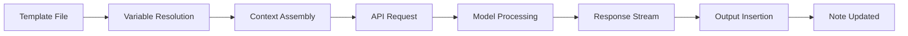
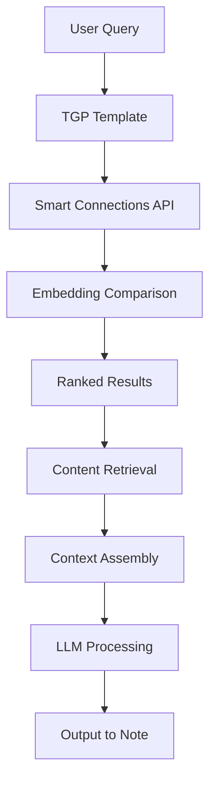

# Extraction Report: Reference Comprehensive Text Generator Plugin Complete Api Interface Reference 2025121507

> [!info] Auto-Generated Report
> This report was automatically generated by `pkb_extractor.py` on 2026-03-13 04:17.
> **Source**: `reference-comprehensive-text-generator-plugin-complete-api-interface-reference-2025121507.md` | **Items Extracted**: 375

---

## 📋 Document Overview

| Field | Value |
|-------|-------|
| **Source File** | `reference-comprehensive-text-generator-plugin-complete-api-interface-reference-2025121507.md` |
| **Extraction Date** | 2026-03-13 04:17 |
| **Word Count** | 8,066 |
| **Character Count** | 62,336 |
| **Line Count** | 1,918 |
| **Total Items Extracted** | 375 |

### Document Outline

        - ##### Text Generator Plugin: Complete API Interface Reference
- # 📚 Text Generator Plugin: Complete API Interface Reference
  - ## 📑 Table of Contents
  - ## 1. Overview & Introduction
    - ### What is Text Generator Plugin?
    - ### Why Use Text Generator as Your Primary API Interface?
    - ### When to Use Text Generator
  - ## 2. Theoretical Foundation
    - ### The Architecture of AI-Augmented PKB
    - ### Context Window Management
    - ### The Template-Prompt-Output Pipeline
  - ## 3. Technical Specifications
    - ### Supported Providers
    - ### Anthropic Claude Configuration
    - ### Template File Specifications
    - ### Context Variable Reference
  - ## 4. Implementation Guide
    - ### Initial Setup Walkthrough
    - ### Creating Your Templates Folder Structure
    - ### Your First Template
    - ### Invoking Templates
  - ## 5. Template System Mastery
    - ### Handlebars Template Syntax
    - ### Advanced Template Patterns
    - ### File Operation Helpers
  - ## New Section Added on {{date}}
    - ### Script Execution in Templates
  - ## 6. Advanced Techniques
    - ### Dynamic Context Assembly
    - ### Multi-Step Generation Workflows
    - ### Performance Optimization
    - ### Streaming vs. Non-Streaming
  - ## 7. Smart Connections Integration
    - ### Understanding Smart Connections
    - ### Architecture of the Integration
    - ### Configuring Smart Connections
    - ### API Access Patterns
    - ### Practical Integration Templates
  - ## 8. Replicating Claude Projects
    - ### Understanding Claude Projects Architecture
    - ### Component 1: Custom Instructions → System Prompts
- # Research Assistant Instructions
  - ## Core Behaviors
  - ## Output Standards
  - ## Domain Knowledge
    - ### Component 2: Knowledge Base → Smart Connections + Folder Context
    - ### Component 3: Conversation History → Thread Notes
- # Research Conversation Thread
  - ## Session 1 (2024-12-01)
  - ## Session 2 (2024-12-03)
    - ### Component 4: Artifacts → Note Outputs
    - ### Complete Project Replication Workflow
- # Project: Knowledge Management Research
  - ## Objectives
  - ## Context
  - ## Output Requirements
  - ## 9. Troubleshooting
    - ### Common Issues and Solutions
  - ## 10. Reference Section
    - ### Quick Command Reference
    - ### Frontmatter Quick Reference
- # Required
- # Model Configuration
- # Context Configuration
- # Output Configuration
    - ### Context Variable Cheatsheet
    - ### Handlebars Helper Reference
    - ### Model Comparison Matrix
    - ### Keyboard Shortcuts Reference
  - ## 11. Related Topics
    - ### 🔗 Related Topics for PKB Expansion
      - #### Core Extensions
        - ##### 1. **[[Prompt-Engineering-Fundamentals|Prompt Engineering Fundamentals]]**
        - ##### 2. **[[Templater Plugin Advanced Patterns]]**
      - #### Cross-Domain Connections
        - ##### 3. **[[Cognitive Load Theory and PKB Design]]**
        - ##### 4. **[[API Cost Optimization Strategies]]**
      - #### Advanced Deep Dives
        - ##### 5. **[[Building Custom AI Agents in Obsidian]]** *[Requires prerequisites]*
        - ##### 6. **[[Semantic Search Architecture for PKB]]** *[Requires prerequisites]*
  - ## 📊 Metadata & Attribution
  - ## 🔄 Version History
    - ### 📖 Extracted Definitions

---

## 📊 Extraction Summary

| Item Type | Count |
|-----------|-------|
| Callouts | 35 |
| Code Blocks | 41 |
| Color Spans | 1 |
| Definitions | 6 |
| Embeds | 0 |
| External Links | 2 |
| Footnotes | 2 |
| Headings | 83 |
| Inline Fields | 6 |
| Mermaid Diagrams | 2 |
| Tables | 10 |
| Tags | 13 |
| Wiki Links | 86 |
| **TOTAL** | **375** |

---

## 🔔 Callouts (35)

> [!note] What are Callouts?
> Callouts are `> [!TYPE]` blocks used in Obsidian for structured annotation.
> They carry semantic meaning — definitions, insights, warnings, etc.

### By Type

| Callout Type | Count |
|-------------|-------|
| `[!abstract]` | 2 |
| `[!bug]` | 8 |
| `[!definition]` | 5 |
| `[!example]` | 8 |
| `[!helpful-tip]` | 1 |
| `[!how-to]` | 1 |
| `[!how-to-use-this]` | 1 |
| `[!important]` | 2 |
| `[!methodology-and-sources]` | 2 |
| `[!overview]` | 1 |
| `[!principle-point]` | 1 |
| `[!warning]` | 2 |
| `[!what-this-does]` | 1 |

### Full Callout List

#### 1. [OVERVIEW] ### <span style='color: #7200ff;'>Overview</span> *(Line 38)*

> [!overview] ### <span style='color: #7200ff;'>Overview</span>
> - **Title**: [[Text-Generator-Plugin-Complete-API-Interface-Reference|Text Generator Plugin: Complete API Interface Reference]]
> - **MOC**: `=this.link-up`

#### 2. [ABSTRACT] ### 🏷️ Tag Intelligence *(Line 229)*

> [!abstract] ### 🏷️ Tag Intelligence
> **Tag Count**: `= length(this.tags)` | **Unique Domains**: `= length(filter(this.tags, (t) => contains(t, "/")))` hierarchical tags
> **Tag Density**: `= choice(length(this.tags) < 3, "⚠️Sparse", choice(length(this.tags) > 10, "📚Rich", "✅Balanced"))`
> > 
> > ---
> 
> ```dataviewjs
> // TAG CO-OCCURRENCE: Find notes sharing the most tags with this note
> const current = dv.current();
> 
> // Safely get tags from current note
> let myTags = [];
> if (current.tags) {
>     if (Array.isArray(current.tags)) {
>         myTags = current.tags;
>     } else if (typeof current.tags === 'string') {
>         myTags = [current.tags];
>     }
> }
> 
> if (myTags.length > 0) {
>     const tagSiblings = dv.pages()
>         .where(p => p.file.path !== current.file.path)
>         .where(p => {
>             // Safely check if page has tags
>             if (!p.tags) return false;
>             // Convert tags to array if needed
>             let pageTags = [];
>             if (Array.isArray(p.tags)) {
>                 pageTags = p.tags;
>             } else if (typeof p.tags === 'string') {
>                 pageTags = [p.tags];
>             }
>             return pageTags.length > 0;
>         })
>         .map(p => {
>             // Safely convert page tags to array
>             let pageTags = [];
>             if (p.tags) {
>                 if (Array.isArray(p.tags)) {
>                     pageTags = p.tags;
>                 } else if (typeof p.tags === 'string') {
>                     pageTags = [p.tags];
>                 }
>             }
>             
>             // Find shared tags
>             const sharedTags = pageTags.filter(t => {
>                 if (typeof t === 'string') {
>                     return myTags.includes(t);
>                 } else if (t && typeof t === 'object' && t.path) {
>                     // Handle tag objects
>                     return myTags.some(myTag => {
>                         if (typeof myTag === 'string') {
>                             return myTag === t.path;
>                         }
>                         return false;
>                     });
>                 }
>                 return false;
>             });
>             
>             return {
>                 link: p.file.link,
>                 sharedCount: sharedTags.length,
>                 sharedTags: sharedTags,
>                 totalTags: pageTags.length
>             };
>         })
>         .where(p => p.sharedCount >= 2) // At least 2 shared tags
>         .sort(p => p.sharedCount, "desc")
>         .limit(5);
> 
>     if (tagSiblings.length > 0) {
>         dv.header(5, "🏷️ Tag Siblings (Shared Taxonomy)");
>         dv.table(
>             ["Note", "Overlap", "Shared Tags"],
>             tagSiblings.map(s => {
>                 // Safely extract tag names for display
>                 let displayTags = s.sharedTags.map(t => {
>                     if (typeof t === 'string') {
>                         return t;
>                     } else if (t && typeof t === 'object' && t.path) {
>                         return t.path;
>                     }
>                     return String(t);
>                 });
>                 
>                 return [
>                     s.link,
>                     s.sharedCount + "/" + s.totalTags,
>                     displayTags.slice(0, 3).join(", ") + (s.sharedCount > 3 ? "…" : "")
>                 ];
>             })
>         );
>     } else {
>         dv.paragraph("*No tag siblings with 2+ shared tags found.*");
>     }
> } else {
>     dv.paragraph("*No tags on this note to analyze.*");
> }
> ```

#### 3. [ABSTRACT] Executive Summary *(Line 356)*

> [!abstract] Executive Summary
> **Text Generator Plugin** transforms [[Obsidian]] into a fully-featured [[API]] user interface for [[Large-Language-Models|Large Language Models]], eliminating the need to leave your vault for AI-assisted work. This comprehensive reference covers everything from basic generation to advanced [[Template-Engineering|Template Engineering]], [[Smart-Connections|Smart Connections]] integration, and replicating [[Claude-Projects|Claude Projects]] workflows entirely within your [[PKB]]. Master this plugin to achieve seamless AI-augmented knowledge work without context-switching between applications.

#### 4. [HOW-TO-USE-THIS] Navigation Guide *(Line 359)*

> [!how-to-use-this] Navigation Guide
> This reference note is organized into 11 major sections covering all aspects of Text Generator Plugin mastery. Use the table of contents below for quick navigation. Sections progress from foundational concepts through advanced techniques, with extensive code examples and real-world workflows throughout.

#### 5. [DEFINITION] Text Generator Plugin *(Line 384)*

> [!definition] Text Generator Plugin
> [**Text-Generator-Plugin**:: An open-source [[Obsidian]] community plugin that provides a native interface to [[Large-Language-Models|Large Language Models]] (LLMs) including [[OpenAI]], [[Anthropic-Claude|Anthropic Claude]], [[Google-Gemini|Google Gemini]], [[HuggingFace]], and local models via [[Ollama]]. It enables AI-assisted text generation, transformation, and automation directly within your vault using a sophisticated [[Template-System|template system]].]

#### 6. [PRINCIPLE-POINT] The Vault-Centric AI Philosophy *(Line 405)*

> [!principle-point] The Vault-Centric AI Philosophy
> [**Vault-Centric-AI**:: The principle that AI interactions should occur within your knowledge environment rather than external applications. This preserves context, enables knowledge graph integration, and eliminates the cognitive overhead of tool-switching. Your vault becomes both the source of context and the destination for AI outputs.]

#### 7. [DEFINITION] API-First AI Integration *(Line 433)*

> [!definition] API-First AI Integration
> [**API-First-Integration**:: An architectural pattern where AI capabilities are accessed through programmatic interfaces rather than graphical user interfaces. This enables automation, customization, and integration with existing systems that GUI-based tools cannot match.]

#### 8. [DEFINITION] Context Window *(Line 451)*

> [!definition] Context Window
> [**Context-Window**:: The maximum amount of text (measured in [[Tokens]]) that a language model can process in a single request. For [[Claude-3.5-Sonnet|Claude 3.5 Sonnet]], this is 200,000 tokens. Effective use of TGP requires understanding how to manage context window usage for both quality and cost optimization.]

#### 9. [METHODOLOGY-AND-SOURCES] Context Assembly Pattern *(Line 462)*

> [!methodology-and-sources] Context Assembly Pattern
> When TGP processes a template, it assembles the final prompt through these layers:
> 1. **System Prompt**: Base instructions for model behavior
> 2. **Template Prompt**: Your specific task instructions
> 3. **Context Variables**: Automatically populated from your note/selection
> 4. **User Input**: Any additional input you provide at generation time

#### 10. [IMPORTANT] Claude API Setup *(Line 511)*

> [!important] Claude API Setup
> To use [[Claude]] models with TGP, you need an [[Anthropic API]] key from [console.anthropic.com](https://console.anthropic.com). This is separate from any Claude Pro subscription. API access follows pay-per-token pricing (~$3/million input tokens, ~$15/million output tokens for Claude 3.5 Sonnet).

#### 11. [WARNING] API Key Security *(Line 525)*

> [!warning] API Key Security
> Your API key provides direct access to your Anthropic account and billing. Never share templates containing hardcoded keys, and consider using environment variables for team vaults. TGP stores the key in Obsidian's plugin data, which is not encrypted by default.

#### 12. [WHAT-THIS-DOES] Context Variables *(Line 566)*

> [!what-this-does] Context Variables
> Context variables are placeholders in your templates that TGP automatically replaces with actual content from your vault at generation time. They follow the [[Handlebars]] syntax with double curly braces.

#### 13. [HOW-TO] Complete Installation Process *(Line 604)*

> [!how-to] Complete Installation Process
> 1. Open Obsidian Settings (⌘/Ctrl + ,)
> 2. Navigate to Community Plugins
> 3. Disable Safe Mode if prompted
> 4. Click "Browse" and search for "Text Generator"
> 5. Install and Enable the plugin
> 6. Open Text Generator settings
> 7. Configure your API provider and key
> 8. Test with the "Generate Text" command

#### 14. [EXAMPLE] Basic Summarization Template *(Line 662)*

> [!example] Basic Summarization Template
> **What This Does:** Summarizes selected text into key bullet points
> 
> **When To Use:** Quick capture of main ideas from longer content

#### 15. [DEFINITION] Handlebars *(Line 728)*

> [!definition] Handlebars
> [**Handlebars**:: A minimal templating language that allows embedding expressions in double curly braces `{{expression}}`. It provides helpers for conditionals, loops, and custom logic while maintaining separation between templates and code.]

#### 16. [EXAMPLE] Multi-Section Analysis Template *(Line 770)*

> [!example] Multi-Section Analysis Template
> **What This Does:** Performs structured analysis with multiple output sections
> 
> **When To Use:** Deep analysis requiring organized output format

#### 17. [EXAMPLE] Atomic Note Generator Template *(Line 812)*

> [!example] Atomic Note Generator Template
> **What This Does:** Creates [[Zettelkasten]]-style atomic notes from concepts
> 
> **When To Use:** Building knowledge graph nodes from ideas

#### 18. [EXAMPLE] Research Note Generator *(Line 871)*

> [!example] Research Note Generator
> **What This Does:** Creates a new research note file from selected content

#### 19. [WARNING] Script Security *(Line 908)*

> [!warning] Script Security
> Enabling script execution allows templates to run JavaScript code. Only enable this for templates you've reviewed and trust. Malicious scripts could access your vault files.

#### 20. [EXAMPLE] Semantic Context Injection *(Line 959)*

> [!example] Semantic Context Injection
> **What This Does:** Queries [[Smart-Connections|Smart Connections]] for relevant notes and includes them as context

#### 21. [EXAMPLE] Research Synthesis Pipeline *(Line 1011)*

> [!example] Research Synthesis Pipeline
> **What This Does:** Three-stage process: outline → draft → refinement

#### 22. [HELPFUL-TIP] Token Efficiency Strategies *(Line 1079)*

> [!helpful-tip] Token Efficiency Strategies
> 1. **Be specific in prompts**: Vague instructions waste tokens on clarification
> 2. **Limit context**: Only include necessary content via targeted selection
> 3. **Use appropriate models**: Claude Haiku for simple tasks, Sonnet for complex
> 4. **Set max_tokens wisely**: Don't allocate 4000 tokens for a summary
> 5. **Template reuse**: Well-designed templates avoid redundant instructions

#### 23. [DEFINITION] Smart Connections *(Line 1124)*

> [!definition] Smart Connections
> [**Smart-Connections**:: An [[Obsidian]] plugin that provides local-first [[Semantic-Search|Semantic Search]] using [[AI-Embeddings|AI Embeddings]]. It enables finding conceptually related notes even when they don't share explicit links or keywords. The plugin runs entirely on-device after initial embedding, requiring no API calls for search functionality.]

#### 24. [IMPORTANT] Embedding Independence *(Line 1166)*

> [!important] Embedding Independence
> Smart Connections embeddings are created locally and don't require ongoing API calls. Your semantic search works offline once embeddings are built. This is different from the Smart Chat feature (separate plugin) which does require API access.

#### 25. [EXAMPLE] Knowledge Base Q&A Template *(Line 1200)*

> [!example] Knowledge Base Q&A Template
> **What This Does:** Answers questions using your vault as the knowledge source

#### 26. [EXAMPLE] Connection Discovery Template *(Line 1245)*

> [!example] Connection Discovery Template
> **What This Does:** Finds unexpected connections between a concept and your existing knowledge

#### 27. [BUG] Issue 1: API Key Not Working *(Line 1629)*

> [!bug] Issue 1: API Key Not Working
> **Problem:** "Authentication failed" or "Invalid API key" errors
> 
> **Cause:** Incorrect key entry, key permissions, or account issues
> 
> **Solution:**
> 1. Verify key is copied completely (no trailing spaces)
> 2. Check key permissions at console.anthropic.com
> 3. Ensure billing is set up (new accounts need payment method)
> 4. Test key with curl: `curl -H "x-api-key: YOUR_KEY" https://api.anthropic.com/v1/messages`
> 
> **Prevention:** Store keys securely, verify before first use

#### 28. [BUG] Issue 2: Templates Not Appearing *(Line 1642)*

> [!bug] Issue 2: Templates Not Appearing
> **Problem:** Custom templates don't show in template selection
> 
> **Cause:** Incorrect folder path or missing frontmatter
> 
> **Solution:**
> 1. Verify Templates Folder setting matches actual location
> 2. Ensure templates have valid YAML frontmatter
> 3. Check for YAML syntax errors (indentation, colons)
> 4. Reload plugin after adding templates
> 
> **Prevention:** Use consistent folder structure, validate YAML

#### 29. [BUG] Issue 3: Context Variables Empty *(Line 1655)*

> [!bug] Issue 3: Context Variables Empty
> **Problem:** `{{selection}}` or other variables return blank
> 
> **Cause:** No text selected, wrong context type, or timing issue
> 
> **Solution:**
> 1. Ensure text is actually selected before invoking
> 2. Check `context` frontmatter property matches intent
> 3. Try using `{{tg_selection}}` as alternative
> 4. For `{{content}}`, ensure note has content beyond frontmatter
> 
> **Prevention:** Test templates with known content first

#### 30. [BUG] Issue 4: Script Execution Failures *(Line 1668)*

> [!bug] Issue 4: Script Execution Failures
> **Problem:** Scripts in templates don't run or throw errors
> 
> **Cause:** Scripts not enabled, syntax errors, or API access issues
> 
> **Solution:**
> 1. Enable "Allow Scripts" in settings
> 2. Check JavaScript syntax carefully
> 3. Use try-catch for error handling
> 4. Console.log for debugging (Ctrl+Shift+I)
> 5. Verify API objects exist before accessing
> 
> **Prevention:** Test scripts incrementally, handle errors gracefully

#### 31. [BUG] Issue 5: Streaming Interruption *(Line 1682)*

> [!bug] Issue 5: Streaming Interruption
> **Problem:** Output stops mid-generation or appears garbled
> 
> **Cause:** Network issues, timeout, or rate limiting
> 
> **Solution:**
> 6. Check internet connection stability
> 7. Reduce max_tokens to avoid timeouts
> 8. Wait and retry (may be rate limited)
> 9. Try non-streaming mode for long outputs
> 10. Check Anthropic status page for outages
> 
> **Prevention:** Set reasonable max_tokens, implement retry logic

#### 32. [BUG] Issue 6: Smart Connections Integration Fails *(Line 1696)*

> [!bug] Issue 6: Smart Connections Integration Fails
> **Problem:** SC API calls return undefined or errors
> 
> **Cause:** Plugin not installed, not loaded, or API changed
> 
> **Solution:**
> 11. Verify Smart Connections is installed AND enabled
> 12. Check plugin is fully loaded before API call
> 13. Verify API syntax matches current SC version
> 14. Add null checks before API calls
> ```javascript
> if (app.plugins.plugins["smart-connections"]?.api) {
>   // Safe to proceed
> }
> ```
> 
> **Prevention:** Always check plugin availability before use

#### 33. [BUG] Issue 7: High Token Usage/Costs *(Line 1714)*

> [!bug] Issue 7: High Token Usage/Costs
> **Problem:** API costs higher than expected
> 
> **Cause:** Large context, unnecessary content, or wrong model
> 
> **Solution:**
> 15. Review what's included in context variables
> 16. Limit selection to necessary text
> 17. Use appropriate model for task complexity
> 18. Set max_tokens to reasonable limits
> 19. Monitor usage at console.anthropic.com
> 
> **Prevention:** Design templates with token efficiency in mind

#### 34. [BUG] Issue 8: Output Formatting Issues *(Line 1728)*

> [!bug] Issue 8: Output Formatting Issues
> **Problem:** Generated markdown doesn't render correctly
> 
> **Cause:** Model output conflicts with Obsidian markdown
> 
> **Solution:**
> 20. Add explicit formatting instructions in prompt
> 21. Specify "Use Obsidian-compatible markdown"
> 22. Request specific callout syntax if needed
> 23. Post-process output if necessary
> 
> **Prevention:** Include format examples in templates

#### 35. [METHODOLOGY-AND-SOURCES] Research Methodology *(Line 1892)*

> [!methodology-and-sources] Research Methodology
> - **Primary Sources:** Text Generator Plugin GitHub repository and documentation (docs.text-gen.com), Smart Connections official documentation (docs.smartconnections.app)
> - **Secondary Sources:** Obsidian community forums, Reddit discussions, plugin release notes
> - **Research Queries:** "Text Generator Obsidian documentation", "Anthropic Claude API Obsidian", "Smart Connections API integration", "Text Generator templates syntax"
> - **Synthesis Approach:** Combined official documentation with practical testing patterns and community-validated workflows
> - **Confidence Level:** High for core features, Medium for advanced integrations (APIs may evolve)

---

## 🔗 Wiki-Links (86 total, 54 unique targets)

> [!info] Knowledge Graph Connections
> These links represent connections to other notes in your PKB.
> **54** distinct notes are referenced.

### Unique Targets

- [[<%= note.basename %>]]
- [[<%= note.path %>]]
- [[AI-Embeddings|AI Embeddings]]
- [[API]]
- [[API Concepts]]
- [[API Cost Optimization Strategies]]
- [[Anthropic]]
- [[Anthropic API]]
- [[Anthropic-Claude|Anthropic Claude]]
- [[Building Custom AI Agents in Obsidian]]
- [[ChatGPT]]
- [[Claude]]
- [[Claude-3.5-Sonnet|Claude 3.5 Sonnet]]
- [[Claude-API|Claude API]]
- [[Claude-Projects|Claude Projects]]
- [[Claude.ai]]
- [[Cognitive-Load|Cognitive Load]]
- [[Cognitive-Load-Theory|Cognitive Load Theory]]
- [[Cognitive Load Theory and PKB Design]]
- [[Dataview]]
- [[Google]]
- [[Google-Gemini|Google Gemini]]
- [[Handlebars]]
- [[HuggingFace]]
- [[Knowledge-Graph|Knowledge Graph]]
- [[LLM]]
- [[Large-Language-Models|Large Language Models]]
- [[Markdown]]
- [[Obsidian]]
- [[Obsidian-Basics|Obsidian Basics]]
- [[Ollama]]
- [[OpenAI]]
- [[PKB]]
- [[PKB-Automation|PKB Automation]]
- [[Personal-Knowledge-Management|Personal Knowledge Management]]
- [[Prompt-Engineering|Prompt Engineering]]
- [[Prompt-Engineering-Fundamentals|Prompt Engineering Fundamentals]]
- [[Reference-Note|Reference Note]]
- [[Semantic-Search|Semantic Search]]
- [[Semantic Search Architecture for PKB]]
- [[Smart-Connections|Smart Connections]]
- [[Template-Engineering|Template Engineering]]
- [[Template-System|Template System]]
- [[Templater]]
- [[Templater Plugin Advanced Patterns]]
- [[Text-Generator-Plugin|Text Generator Plugin]]
- [[Text-Generator-Plugin-Complete-API-Interface-Reference|Text Generator Plugin: Complete API Interface Reference]]
- [[Tokens]]
- [[YAML-Frontmatter|YAML Frontmatter]]
- [[Zettelkasten]]
- [[like this]]
- [[related notes]]
- [[wiki-link]]
- [[wiki-links]]

### All Occurrences

| # | Target | Display Text | Heading | Section | Line |
|---|--------|-------------|---------|---------|------|
| 1 | [[Text-Generator-Plugin-Complete-API-Interface-Reference|Text Generator Plugin: Complete API Interface Reference]] | — | — | Document Start | 39 |
| 2 | [[Smart-Connections|Smart Connections]] | — | — | Text Generator Plugin: Complete API I... | 344 |
| 3 | [[Templater]] | — | — | Text Generator Plugin: Complete API I... | 344 |
| 4 | [[Dataview]] | — | — | Text Generator Plugin: Complete API I... | 344 |
| 5 | [[Claude-API|Claude API]] | — | — | Text Generator Plugin: Complete API I... | 344 |
| 6 | [[Prompt-Engineering|Prompt Engineering]] | — | — | Text Generator Plugin: Complete API I... | 344 |
| 7 | [[PKB-Automation|PKB Automation]] | — | — | Text Generator Plugin: Complete API I... | 344 |
| 8 | [[Obsidian]] | — | — | 📚 Text Generator Plugin: Complete API... | 357 |
| 9 | [[API]] | — | — | 📚 Text Generator Plugin: Complete API... | 357 |
| 10 | [[Large-Language-Models|Large Language Models]] | — | — | 📚 Text Generator Plugin: Complete API... | 357 |
| 11 | [[Template-Engineering|Template Engineering]] | — | — | 📚 Text Generator Plugin: Complete API... | 357 |
| 12 | [[Smart-Connections|Smart Connections]] | — | — | 📚 Text Generator Plugin: Complete API... | 357 |
| 13 | [[Claude-Projects|Claude Projects]] | — | — | 📚 Text Generator Plugin: Complete API... | 357 |
| 14 | [[PKB]] | — | — | 📚 Text Generator Plugin: Complete API... | 357 |
| 15 | [[Obsidian]] | — | — | What is Text Generator Plugin? | 385 |
| 16 | [[Large-Language-Models|Large Language Models]] | — | — | What is Text Generator Plugin? | 385 |
| 17 | [[OpenAI]] | — | — | What is Text Generator Plugin? | 385 |
| 18 | [[Anthropic-Claude|Anthropic Claude]] | — | — | What is Text Generator Plugin? | 385 |
| 19 | [[Google-Gemini|Google Gemini]] | — | — | What is Text Generator Plugin? | 385 |
| 20 | [[HuggingFace]] | — | — | What is Text Generator Plugin? | 385 |
| 21 | [[Ollama]] | — | — | What is Text Generator Plugin? | 385 |
| 22 | [[Template-System|Template System]] | template system | — | What is Text Generator Plugin? | 385 |
| 23 | [[PKB]] | — | — | What is Text Generator Plugin? | 387 |
| 24 | [[ChatGPT]] | — | — | What is Text Generator Plugin? | 387 |
| 25 | [[Claude.ai]] | — | — | What is Text Generator Plugin? | 387 |
| 26 | [[Cognitive-Load|Cognitive Load]] | — | — | What is Text Generator Plugin? | 387 |
| 27 | [[API]] | — | — | Why Use Text Generator as Your Primar... | 391 |
| 28 | [[Knowledge-Graph|Knowledge Graph]] | — | — | Why Use Text Generator as Your Primar... | 394 |
| 29 | [[API]] | — | — | Why Use Text Generator as Your Primar... | 397 |
| 30 | [[Template-System|Template System]] | — | — | Why Use Text Generator as Your Primar... | 400 |
| 31 | [[Prompt-Engineering|Prompt Engineering]] | — | — | Why Use Text Generator as Your Primar... | 400 |
| 32 | [[Smart-Connections|Smart Connections]] | — | — | Why Use Text Generator as Your Primar... | 403 |
| 33 | [[Semantic-Search|Semantic Search]] | — | — | Why Use Text Generator as Your Primar... | 403 |
| 34 | [[Templater]] | — | — | Why Use Text Generator as Your Primar... | 403 |
| 35 | [[Dataview]] | — | — | Why Use Text Generator as Your Primar... | 403 |
| 36 | [[Reference-Note|Reference Note]] | — | — | When to Use Text Generator | 411 |
| 37 | [[Prompt-Engineering|Prompt Engineering]] | — | — | When to Use Text Generator | 413 |
| 38 | [[PKB]] | — | — | The Architecture of AI-Augmented PKB | 431 |
| 39 | [[Tokens]] | — | — | Context Window Management | 452 |
| 40 | [[Claude-3.5-Sonnet|Claude 3.5 Sonnet]] | — | — | Context Window Management | 452 |
| 41 | [[LLM]] | — | — | Supported Providers | 498 |
| 42 | [[OpenAI]] | — | — | Supported Providers | 502 |
| 43 | [[Anthropic]] | — | — | Supported Providers | 503 |
| 44 | [[Google]] | — | — | Supported Providers | 504 |
| 45 | [[HuggingFace]] | — | — | Supported Providers | 505 |
| 46 | [[Ollama]] | — | — | Supported Providers | 506 |
| 47 | [[Claude]] | — | — | Anthropic Claude Configuration | 512 |
| 48 | [[Anthropic API]] | — | — | Anthropic Claude Configuration | 512 |
| 49 | [[Markdown]] | — | — | Template File Specifications | 530 |
| 50 | [[YAML-Frontmatter|YAML Frontmatter]] | — | — | Template File Specifications | 530 |
| 51 | [[Handlebars]] | — | — | Context Variable Reference | 567 |
| 52 | [[Handlebars]] | — | — | Handlebars Template Syntax | 726 |
| 53 | [[Personal-Knowledge-Management|Personal Knowledge Management]] | — | — | Advanced Template Patterns | 798 |
| 54 | [[like this]] | — | — | Advanced Template Patterns | 808 |
| 55 | [[Zettelkasten]] | — | — | Advanced Template Patterns | 813 |
| 56 | [[wiki-links]] | — | — | Advanced Template Patterns | 829 |
| 57 | [[wiki-link]] | — | — | Advanced Template Patterns | 842 |
| 58 | [[Smart-Connections|Smart Connections]] | — | — | Dynamic Context Assembly | 960 |
| 59 | [[wiki-links]] | — | — | Dynamic Context Assembly | 1000 |
| 60 | [[wiki-links]] | — | — | Multi-Step Generation Workflows | 1025 |
| 61 | [[wiki-links]] | — | — | Multi-Step Generation Workflows | 1045 |
| 62 | [[wiki-links]] | — | — | Multi-Step Generation Workflows | 1065 |
| 63 | [[Obsidian]] | — | — | Understanding Smart Connections | 1125 |
| 64 | [[Semantic-Search|Semantic Search]] | — | — | Understanding Smart Connections | 1125 |
| 65 | [[AI-Embeddings|AI Embeddings]] | — | — | Understanding Smart Connections | 1125 |
| 66 | [[wiki-links]] | — | — | Practical Integration Templates | 1232 |
| 67 | [[wiki-link]] | — | — | Practical Integration Templates | 1241 |
| 68 | [[<%= note.path %>]] | — | — | Practical Integration Templates | 1280 |
| 69 | [[Claude-Projects|Claude Projects]] | — | — | Understanding Claude Projects Archite... | 1305 |
| 70 | [[wiki-link]] | — | — | Core Behaviors | 1333 |
| 71 | [[related notes]] | — | — | Output Standards | 1342 |
| 72 | [[<%= note.basename %>]] | — | — | Component 2: Knowledge Base → Smart C... | 1418 |
| 73 | [[wiki-links]] | — | — | Output Requirements | 1572 |
| 74 | [[Prompt-Engineering-Fundamentals|Prompt Engineering Fundamentals]] | — | — | 1. **[[Prompt Engineering Fundamental... | 1838 |
| 75 | [[Templater Plugin Advanced Patterns]] | — | — | 2. **[[Templater Plugin Advanced Patt... | 1845 |
| 76 | [[Obsidian-Basics|Obsidian Basics]] | — | — | 2. **[[Templater Plugin Advanced Patt... | 1850 |
| 77 | [[Cognitive Load Theory and PKB Design]] | — | — | 3. **[[Cognitive Load Theory and PKB ... | 1856 |
| 78 | [[Cognitive-Load-Theory|Cognitive Load Theory]] | — | — | 3. **[[Cognitive Load Theory and PKB ... | 1861 |
| 79 | [[API Cost Optimization Strategies]] | — | — | 4. **[[API Cost Optimization Strategi... | 1863 |
| 80 | [[Building Custom AI Agents in Obsidian]] | — | — | 5. **[[Building Custom AI Agents in O... | 1874 |
| 81 | [[Text-Generator-Plugin|Text Generator Plugin]] | — | — | 5. **[[Building Custom AI Agents in O... | 1879 |
| 82 | [[Smart-Connections|Smart Connections]] | — | — | 5. **[[Building Custom AI Agents in O... | 1879 |
| 83 | [[Semantic Search Architecture for PKB]] | — | — | 6. **[[Semantic Search Architecture f... | 1881 |
| 84 | [[Smart-Connections|Smart Connections]] | — | — | 6. **[[Semantic Search Architecture f... | 1886 |
| 85 | [[Obsidian-Basics|Obsidian Basics]] | — | — | 🔄 Version History | 1912 |
| 86 | [[API Concepts]] | — | — | 🔄 Version History | 1913 |

---

## 📖 Definitions (6)

> [!tip] PKB Definitions
> These `[**Term**:: Definition]` fields define key concepts.
> They are queryable by Dataview.

### 1. Text-Generator-Plugin

> [!definition] Text-Generator-Plugin
> An open-source [[Obsidian

*Source: Line 385 in `reference-comprehensive-text-generator-plugin-complete-api-interface-reference-2025121507.md`*

### 2. Vault-Centric-AI

> [!definition] Vault-Centric-AI
> The principle that AI interactions should occur within your knowledge environment rather than external applications. This preserves context, enables knowledge graph integration, and eliminates the cognitive overhead of tool-switching. Your vault becomes both the source of context and the destination for AI outputs.

*Source: Line 406 in `reference-comprehensive-text-generator-plugin-complete-api-interface-reference-2025121507.md`*

### 3. API-First-Integration

> [!definition] API-First-Integration
> An architectural pattern where AI capabilities are accessed through programmatic interfaces rather than graphical user interfaces. This enables automation, customization, and integration with existing systems that GUI-based tools cannot match.

*Source: Line 434 in `reference-comprehensive-text-generator-plugin-complete-api-interface-reference-2025121507.md`*

### 4. Context-Window

> [!definition] Context-Window
> The maximum amount of text (measured in [[Tokens

*Source: Line 452 in `reference-comprehensive-text-generator-plugin-complete-api-interface-reference-2025121507.md`*

### 5. Handlebars

> [!definition] Handlebars
> A minimal templating language that allows embedding expressions in double curly braces `{{expression}}`. It provides helpers for conditionals, loops, and custom logic while maintaining separation between templates and code.

*Source: Line 729 in `reference-comprehensive-text-generator-plugin-complete-api-interface-reference-2025121507.md`*

### 6. Smart-Connections

> [!definition] Smart-Connections
> An [[Obsidian

*Source: Line 1125 in `reference-comprehensive-text-generator-plugin-complete-api-interface-reference-2025121507.md`*

---

## 🏷️ Inline Fields (6)

> [!tip] Dataview Fields
> These `[FieldName:: Value]` pairs are queryable by Dataview.

| # | Field Name | Value | Format | Line |
|---|-----------|-------|--------|------|
| 1 | **Text-Generator-Plugin** | An open-source [[Obsidian | bracket | 385 |
| 2 | **Vault-Centric-AI** | The principle that AI interactions should occur within your knowledge environ... | bracket | 406 |
| 3 | **API-First-Integration** | An architectural pattern where AI capabilities are accessed through programma... | bracket | 434 |
| 4 | **Context-Window** | The maximum amount of text (measured in [[Tokens | bracket | 452 |
| 5 | **Handlebars** | A minimal templating language that allows embedding expressions in double cur... | bracket | 729 |
| 6 | **Smart-Connections** | An [[Obsidian | bracket | 1125 |

---

## 🏷️ Tags (13 occurrences, 13 unique)

### All Unique Tags

`#ai-automation`, `#api-interface`, `#append`, `#each`, `#frequently-referenced`, `#if`, `#obsidian`, `#prompt-engineering`, `#reference-note`, `#text-generator`, `#unless`, `#with`, `#write`

---

## 💻 Code Blocks (41)

| Language | Count |
|----------|-------|
| `yaml` | 21 |
| `plaintext` | 5 |
| `handlebars` | 5 |
| `markdown` | 4 |
| `dataviewjs` | 3 |
| `javascript` | 3 |

### Code Block 1 — `dataviewjs` *(Lines 42-228)*

```dataviewjs
// SYSTEM: Enhanced Semantic Bridge Engine v2.0
// PURPOSE: Find "Sibling" notes that share the same Outlinks (Contexts) with advanced analytics

const current = dv.current();
const myOutlinks = current.file.outlinks?.map(l => l.path) || [];

// Performance optimization: Create Set for faster lookups
const myOutlinkSet = new Set(myOutlinks);
const currentPath = current.file.path;

// Advanced sibling analysis with metadata
let siblings = [];

try {
  siblings = dv.pages()
    .where(p => {
      // Safety checks
      if (!p.file?.path || p.file.path === currentPath) return false;
      // Exclude already linked notes
      if (current.file.outlinks?.some(l => l.path === p.file.path)) return false;
      return true;
    })
    .map(p => {
      try {
        // Calculate shared connections
        const shared = p.file.outlinks?.filter(l => myOutlinkSet.has(l.path)) || [];
        const sharedCount = shared.length;
        
        // Calculate similarity score (0-100%)
        const totalConnections = myOutlinks.length + (p.file.outlinks?.length || 0);
# ... (155 more lines truncated)
```

### Code Block 2 — `dataviewjs` *(Lines 235-330)*

```dataviewjs
> // TAG CO-OCCURRENCE: Find notes sharing the most tags with this note
> const current = dv.current();
> 
> // Safely get tags from current note
> let myTags = [];
> if (current.tags) {
>     if (Array.isArray(current.tags)) {
>         myTags = current.tags;
>     } else if (typeof current.tags === 'string') {
>         myTags = [current.tags];
>     }
> }
> 
> if (myTags.length > 0) {
>     const tagSiblings = dv.pages()
>         .where(p => p.file.path !== current.file.path)
>         .where(p => {
>             // Safely check if page has tags
>             if (!p.tags) return false;
>             // Convert tags to array if needed
>             let pageTags = [];
>             if (Array.isArray(p.tags)) {
>                 pageTags = p.tags;
>             } else if (typeof p.tags === 'string') {
>                 pageTags = [p.tags];
>             }
>             return pageTags.length > 0;
>         })
>         .map(p => {
>             // Safely convert page tags to array
# ... (65 more lines truncated)
```

### Code Block 3 — `yaml` *(Lines 532-547)*

```yaml
---
promptTemplate: |
  You are a helpful assistant specializing in {{expertise}}.
  
  Based on the following context:
  {{selection}}
  
  Please {{task}}.
model: claude-3-5-sonnet-20241022
temperature: 0.7
max_tokens: 2000
context: selection
system: You are an expert knowledge synthesizer.
---
```

### Code Block 4 — `yaml` *(Lines 587-594)*

```yaml
---
promptTemplate: |
  Expertise area: {{expertise}}
  Task: {{task}}
  Context: {{selection}}
---
```

### Code Block 5 — `plaintext` *(Lines 616-627)*

```plaintext
Settings Path: Settings → Text Generator → General Settings

Recommended Initial Settings:
├── Default Model: claude-3-5-sonnet-20241022
├── Temperature: 0.7
├── Max Tokens: 2048
├── Display Errors: Enabled
├── Stream Output: Enabled
├── Auto-suggest: Disabled (enable once comfortable)
└── Templates Folder: TextGen/templates
```

### Code Block 6 — `plaintext` *(Lines 633-658)*

```plaintext
📁 TextGen/
├── 📁 templates/
│   ├── 📁 generation/
│   │   ├── summarize-selection.md
│   │   ├── expand-outline.md
│   │   └── generate-ideas.md
│   ├── 📁 transformation/
│   │   ├── rewrite-clearer.md
│   │   ├── simplify-language.md
│   │   └── translate-spanish.md
│   ├── 📁 analysis/
│   │   ├── extract-key-points.md
│   │   ├── identify-arguments.md
│   │   └── critique-content.md
│   ├── 📁 pkb-specific/
│   │   ├── generate-atomic-note.md
│   │   ├── create-moc-entry.md
│   │   └── suggest-connections.md
│   └── 📁 workflows/
│       ├── research-synthesis.md
│       ├── daily-planning.md
│       └── weekly-review.md
└── 📁 packages/
    └── (community packages here)
```

### Code Block 7 — `yaml` *(Lines 669-685)*

```yaml
---
promptTemplate: |
  Please summarize the following text into clear, concise bullet points.
  Focus on the main ideas and key takeaways.
  Use no more than 5-7 bullet points.
  
  Text to summarize:
  {{selection}}
  
  Provide the summary in markdown bullet point format.
model: claude-3-5-sonnet-20241022
temperature: 0.3
max_tokens: 500
context: selection
---
```

### Code Block 8 — `markdown` *(Lines 688-694)*

```markdown
- Main point one from the selected text
- Key insight about the topic
- Important conclusion or finding
- Relevant supporting detail
- Final takeaway
```

### Code Block 9 — `handlebars` *(Lines 733-738)*

```handlebars
{{variable}}           # Simple variable insertion
{{person.name}}        # Nested property access
{{{rawHtml}}}          # Unescaped HTML (triple braces)
{{!-- comment --}}     # Template comment (not in output)
```

### Code Block 10 — `handlebars` *(Lines 742-752)*

```handlebars
{{#if selection}}
  Process this selection: {{selection}}
{{else}}
  No text selected. Please select content first.
{{/if}}

{{#unless isEmpty}}
  Content exists
{{/unless}}
```

### Code Block 11 — `handlebars` *(Lines 756-766)*

```handlebars
{{#each items}}
  Item: {{this}}
  Index: {{@index}}
{{/each}}

{{#with frontmatter}}
  Title: {{title}}
  Tags: {{tags}}
{{/with}}
```

### Code Block 12 — `yaml` *(Lines 775-810)*

```yaml
---
promptTemplate: |
  Analyze the following content and provide a structured response.
  
  # Content
  {{selection}}
  
  # Analysis Required
  
  ## Summary
  Provide a 2-3 sentence overview.
  
  ## Key Arguments
  List the main arguments or claims.
  
  ## Evidence Assessment
  Evaluate the strength of supporting evidence.
  
  ## Critical Questions
  What questions remain unanswered?
  
  ## Connections
  What does this connect to in [[Personal-Knowledge-Management|Personal Knowledge Management]]?
  
  Format your response using the headers above.
model: claude-3-5-sonnet-20241022
temperature: 0.5
max_tokens: 2000
context: selection
system: |
# ... (4 more lines truncated)
```

### Code Block 13 — `yaml` *(Lines 817-844)*

```yaml
---
promptTemplate: |
  Create an atomic note about the following concept.
  
  Concept: {{selection}}
  
  Generate a note with:
  1. A clear, precise definition
  2. Core explanation (2-3 paragraphs)
  3. Key distinctions (what this is NOT)
  4. One concrete example
  5. 3-4 related concepts as [[wiki-links]]
  
  Format with proper markdown headers and callouts.
  Use > [!definition] for the definition.
  Use > [!example] for the example.
model: claude-3-5-sonnet-20241022
temperature: 0.6
max_tokens: 1500
context: selection
system: |
  You are a knowledge architect specializing in creating atomic, 
  well-connected notes for personal knowledge bases. 
  Each note should explain ONE concept thoroughly.
  Always suggest connections using [[wiki-link]] format.
---
```

### Code Block 14 — `handlebars` *(Lines 852-857)*

```handlebars
{{#write "folder/" "filename.md"}}
Content to write to the new file.
Can include variables: {{selection}}
{{/write}}
```

### Code Block 15 — `handlebars` *(Lines 861-869)*

```handlebars
{{#append "path/to/existing-file.md"}}

---
## New Section Added on {{date}}

{{selection}}
{{/append}}
```

### Code Block 16 — `yaml` *(Lines 874-904)*

```yaml
---
promptTemplate: |
  {{#write "Research/" "{{title}}-research.md"}}
  ---
  tags: #research #{{topic}}
  created: {{date:YYYY-MM-DD}}
  source: {{source}}
  ---
  
  # Research: {{title}}
  
  ## Source Material
  {{selection}}
  
  ## Key Findings
  [AI-generated analysis will appear here]
  
  ## Questions for Further Research
  [AI-generated questions will appear here]
  
  ## Connections
  [AI-generated wiki-links will appear here]
  {{/write}}
  
  Analyze the source material above and complete the sections marked for AI generation.
model: claude-3-5-sonnet-20241022
temperature: 0.7
max_tokens: 2000
---
```

### Code Block 17 — `yaml` *(Lines 916-930)*

```yaml
---
promptTemplate: |
  <% 
  // JavaScript code block
  const today = new Date().toISOString().split('T')[0];
  const noteCount = app.vault.getMarkdownFiles().length;
  %>
  
  Today's date: <%= today %>
  Your vault has <%= noteCount %> notes.
  
  {{selection}}
---
```

### Code Block 18 — `yaml` *(Lines 934-949)*

```yaml
---
promptTemplate: |
  <%
  // Access current file metadata
  const file = app.workspace.getActiveFile();
  const metadata = app.metadataCache.getFileCache(file);
  const tags = metadata?.frontmatter?.tags || [];
  %>
  
  Current file: <%= file.basename %>
  Tags: <%= tags.join(', ') %>
  
  Analyze: {{selection}}
---
```

### Code Block 19 — `yaml` *(Lines 962-1005)*

```yaml
---
promptTemplate: |
  <%
  // Query Smart Connections for related content
  const query = tg_selection;
  let contextNotes = [];
  
  if (app.plugins.plugins["smart-connections"]) {
    const sc = app.plugins.plugins["smart-connections"];
    const results = await sc.api.search(query);
    
    // Get top 5 relevant notes
    for (let i = 0; i < Math.min(5, results.length); i++) {
      const content = await sc.file_retriever(results[i].link, {
        max_chars: 1000
      });
      contextNotes.push({
        title: results[i].link,
        content: content
      });
    }
  }
  %>
  
  # Query
  {{selection}}
  
  # Relevant Context from Your Vault
  <% for (const note of contextNotes) { %>
  
# ... (12 more lines truncated)
```

### Code Block 20 — `yaml` *(Lines 1015-1032)*

```yaml
---
promptTemplate: |
  Create a detailed outline for a synthesis note on:
  {{selection}}
  
  Structure:
  - Main thesis statement
  - 4-6 major sections with brief descriptions
  - Key points to cover in each section
  - Potential [[wiki-links]] to include
  
  Output only the outline, no prose.
model: claude-3-5-sonnet-20241022
temperature: 0.7
max_tokens: 1000
---
```

### Code Block 21 — `yaml` *(Lines 1035-1053)*

```yaml
---
promptTemplate: |
  Expand this outline into full prose:
  
  {{selection}}
  
  For each section:
  - Write 2-3 substantive paragraphs
  - Include specific examples
  - Add [[wiki-links]] where appropriate
  - Use callouts for key definitions
  
  Maintain academic but accessible tone.
model: claude-3-5-sonnet-20241022
temperature: 0.7
max_tokens: 4000
---
```

### Code Block 22 — `yaml` *(Lines 1056-1075)*

```yaml
---
promptTemplate: |
  Polish and enhance this draft:
  
  {{selection}}
  
  Tasks:
  1. Improve transitions between sections
  2. Add more specific [[wiki-links]]
  3. Insert appropriate callouts ([!definition], [!example], etc.)
  4. Ensure consistent formatting
  5. Add a summary callout at the end
  
  Return the complete improved document.
model: claude-3-5-sonnet-20241022
temperature: 0.5
max_tokens: 5000
---
```

### Code Block 23 — `yaml` *(Lines 1109-1116)*

```yaml
---
stream: false  # Disable streaming for this template
promptTemplate: |
  Generate a brief response.
  {{selection}}
---
```

### Code Block 24 — `plaintext` *(Lines 1157-1164)*

```plaintext
Settings → Smart Connections

Embedding Model: Local (default) or API-based
Exclusions: Folders/files to skip embedding
Refresh: Manual or automatic on file change
Block Size: How much text per embedding (default: 200 tokens)
```

### Code Block 25 — `javascript` *(Lines 1174-1187)*

```javascript
// Access Smart Connections from another plugin/script
const sc = app.plugins.plugins["smart-connections"];

// Perform semantic search
const results = await sc.api.search("your query here");

// Results structure:
// [
//   { link: "path/to/note.md", score: 0.89 },
//   { link: "path/to/another.md", score: 0.85 },
//   ...
// ]
```

### Code Block 26 — `javascript` *(Lines 1190-1196)*

```javascript
// Get content from a search result
const content = await sc.file_retriever(results[0].link, {
  lines: 10,       // Number of lines to retrieve
  max_chars: 1000  // Maximum characters
});
```

### Code Block 27 — `yaml` *(Lines 1203-1243)*

```yaml
---
promptTemplate: |
  <%
  const query = tg_selection;
  const sc = app.plugins.plugins["smart-connections"];
  let context = "";
  
  if (sc && sc.api) {
    const results = await sc.api.search(query);
    const topResults = results.slice(0, 5);
    
    for (const result of topResults) {
      const content = await sc.file_retriever(result.link, {
        max_chars: 800
      });
      context += `\n## From: ${result.link}\n${content}\n`;
    }
  }
  %>
  
  # Question
  {{selection}}
  
  # Relevant Notes from My Vault
  <%= context %>
  
  # Task
  Answer the question above using ONLY the information from my vault notes.
  - Cite specific notes using [[wiki-links]]
  - If the answer isn't in the provided context, say so
# ... (9 more lines truncated)
```

### Code Block 28 — `yaml` *(Lines 1248-1297)*

```yaml
---
promptTemplate: |
  <%
  const concept = tg_selection;
  const sc = app.plugins.plugins["smart-connections"];
  let relatedNotes = [];
  
  if (sc && sc.api) {
    const results = await sc.api.search(concept);
    // Skip first result (often the current note)
    const unexpected = results.slice(1, 8);
    
    for (const result of unexpected) {
      const content = await sc.file_retriever(result.link, {
        max_chars: 500
      });
      relatedNotes.push({
        path: result.link,
        score: result.score,
        preview: content.substring(0, 200)
      });
    }
  }
  %>
  
  # Concept
  {{selection}}
  
  # Semantically Related Notes
  <% for (const note of relatedNotes) { %>
# ... (18 more lines truncated)
```

### Code Block 29 — `markdown` *(Lines 1322-1348)*

```markdown
---
type: system-prompt
domain: research
---

# Research Assistant Instructions

You are a research assistant specializing in knowledge synthesis and critical analysis.

## Core Behaviors
- Always cite sources using [[wiki-link]] format
- Flag uncertainty explicitly
- Suggest connections to related concepts
- Use structured output with headers and callouts

## Output Standards
- Use Obsidian-compatible markdown
- Include > [!definition] for key terms
- Include > [!example] for illustrations
- Suggest 3-5 [[related notes]] at the end

## Domain Knowledge
- Familiar with academic research methodology
- Understanding of knowledge management principles
- Awareness of cognitive science and learning theory
```

### Code Block 30 — `yaml` *(Lines 1351-1365)*

```yaml
---
promptTemplate: |
  <%
  const instructionsFile = app.vault.getAbstractFileByPath(
    "TextGen/instructions/research-assistant.md"
  );
  const instructions = await app.vault.read(instructionsFile);
  %>
  
  {{selection}}
system: |
  <%= instructions %>
---
```

### Code Block 31 — `plaintext` *(Lines 1376-1389)*

```plaintext
📁 Projects/
├── 📁 ResearchProject-A/
│   ├── _project-context.md  (project-specific instructions)
│   ├── sources/
│   │   ├── paper1.md
│   │   └── paper2.md
│   ├── notes/
│   │   └── working-notes.md
│   └── outputs/
└── 📁 WritingProject-B/
    ├── _project-context.md
    └── ...
```

### Code Block 32 — `yaml` *(Lines 1392-1424)*

```yaml
---
promptTemplate: |
  <%
  const currentPath = app.workspace.getActiveFile().path;
  const projectFolder = currentPath.split('/').slice(0, 2).join('/');
  
  // Load project-specific context
  const contextFile = app.vault.getAbstractFileByPath(
    `${projectFolder}/_project-context.md`
  );
  let projectContext = "";
  if (contextFile) {
    projectContext = await app.vault.read(contextFile);
  }
  
  // Get all notes in project
  const projectNotes = app.vault.getMarkdownFiles()
    .filter(f => f.path.startsWith(projectFolder));
  %>
  
  # Project Context
  <%= projectContext %>
  
  # Project Notes (<%= projectNotes.length %> files)
  <% for (const note of projectNotes.slice(0, 10)) { %>
  - [[<%= note.basename %>]]
  <% } %>
  
  # Current Task
  {{selection}}
# ... (1 more lines truncated)
```

### Code Block 33 — `markdown` *(Lines 1435-1459)*

```markdown
---
type: conversation-thread
project: Research-Project-A
started: 2024-12-01
---

# Research Conversation Thread

## Session 1 (2024-12-01)

**Query:** What are the key principles of spaced repetition?

**Response:** [Generated response here]

---

## Session 2 (2024-12-03)

**Query:** How does this connect to cognitive load theory?

**Response:** [Generated response here]

---
```

### Code Block 34 — `yaml` *(Lines 1462-1499)*

```yaml
---
promptTemplate: |
  <%
  // Find active conversation thread
  const threadPath = "TextGen/conversations/active-thread.md";
  const threadFile = app.vault.getAbstractFileByPath(threadPath);
  let conversationHistory = "";
  
  if (threadFile) {
    conversationHistory = await app.vault.read(threadFile);
  }
  %>
  
  # Previous Conversation
  <%= conversationHistory %>
  
  # New Query
  {{selection}}
  
  # Instructions
  Continue our conversation. Reference previous exchanges when relevant.
  
  {{#append "TextGen/conversations/active-thread.md"}}
  
  ---
  
  ## Session ({{date:YYYY-MM-DD HH:mm}})
  
  **Query:** {{selection}}
  
# ... (6 more lines truncated)
```

### Code Block 35 — `yaml` *(Lines 1508-1537)*

```yaml
---
promptTemplate: |
  Generate the requested content.
  
  Request: {{selection}}
  
  {{#write "Outputs/" "{{title}}-{{date:YYYYMMDD}}.md"}}
  ---
  type: generated-artifact
  created: {{date:YYYY-MM-DD}}
  prompt: "{{selection}}"
  ---
  
  # Generated Content
  
  [AI output will be inserted here]
  
  ---
  
  > [!info] Generation Metadata
  > - Model: claude-3-5-sonnet
  > - Created: {{date:YYYY-MM-DD HH:mm}}
  > - Source: Text Generator Plugin
  {{/write}}
model: claude-3-5-sonnet-20241022
temperature: 0.7
max_tokens: 3000
---
```

### Code Block 36 — `plaintext` *(Lines 1544-1556)*

```plaintext
📁 Projects/
└── 📁 MyProject/
    ├── _instructions.md      # System prompt
    ├── _context/             # Project knowledge base
    │   ├── reference1.md
    │   └── reference2.md
    ├── _conversations/       # Thread history
    │   └── thread-1.md
    ├── templates/            # Project-specific templates
    │   └── project-query.md
    └── outputs/              # Generated artifacts
```

### Code Block 37 — `markdown` *(Lines 1559-1575)*

```markdown
# Project: Knowledge Management Research

## Objectives
- Synthesize literature on PKM methodologies
- Develop framework for optimal knowledge workflows
- Create actionable implementation guides

## Context
This project explores personal knowledge management...

## Output Requirements
- Use academic tone
- Include citations as [[wiki-links]]
- Structure with clear headers
- Provide actionable recommendations
```

### Code Block 38 — `yaml` *(Lines 1578-1621)*

```yaml
---
promptTemplate: |
  <%
  const projectPath = "Projects/MyProject";
  
  // Load instructions
  const instFile = app.vault.getAbstractFileByPath(`${projectPath}/_instructions.md`);
  const instructions = await app.vault.read(instFile);
  
  // Load context files
  const contextFolder = app.vault.getAbstractFileByPath(`${projectPath}/_context`);
  let contextContent = "";
  // ... load context files
  
  // Load recent conversation
  const convFile = app.vault.getAbstractFileByPath(`${projectPath}/_conversations/thread-1.md`);
  let conversation = "";
  if (convFile) {
    conversation = await app.vault.read(convFile);
  }
  %>
  
  # Project Instructions
  <%= instructions %>
  
  # Project Knowledge Base
  <%= contextContent %>
  
  # Conversation History
  <%= conversation %>
# ... (12 more lines truncated)
```

### Code Block 39 — `javascript` *(Lines 1706-1710)*

```javascript
> if (app.plugins.plugins["smart-connections"]?.api) {
>   // Safe to proceed
> }
>
```

### Code Block 40 — `yaml` *(Lines 1759-1783)*

```yaml
---
# Required
promptTemplate: |
  Your prompt text here
  With {{variables}}

# Model Configuration
model: claude-3-5-sonnet-20241022
temperature: 0.7        # 0.0-2.0
max_tokens: 2000        # Output limit
top_p: 1.0              # Nucleus sampling
frequency_penalty: 0.0  # Reduce repetition
presence_penalty: 0.0   # Topic diversity

# Context Configuration
context: selection      # selection, content, children
system: |               # System prompt
  Your system instructions

# Output Configuration
stream: true            # Stream output
output: cursor          # cursor, replace, new-note
---
```

### Code Block 41 — `dataviewjs` *(Lines 1918-1951)*

```dataviewjs
const currentFile = dv.current().file;
const content = await dv.io.load(currentFile.path);
const bracketedFieldRegex = /\[\*\*([^*]+)\*\*::\s*([^\]]+)\]/g;

let definitions = [];
let match;

while ((match = bracketedFieldRegex.exec(content)) !== null) {
    definitions.push({
        key: match[1].trim(),
        value: match[2].trim()
    });
}

// Group by first letter
const grouped = {};
definitions.forEach(d => {
    const firstLetter = d.key[0].toUpperCase();
    if (!grouped[firstLetter]) grouped[firstLetter] = [];
    grouped[firstLetter].push(d);
});

// Display grouped results
const sortedLetters = Object.keys(grouped).sort();

for (let letter of sortedLetters) {
    dv.header(4, `${letter}`);
    dv.table(
        ["Term", "Definition"],
        grouped[letter].map(d => [`**${d.key}**`, d.value])
# ... (2 more lines truncated)
```

---

## 📊 Tables (10)

### Table 1 *(Line 278, 6 rows)*

| Provider | Models Available | API Key Required | Notes |
| --- | --- | --- | --- |
| [[OpenAI]] | GPT-4, GPT-4-Turbo, GPT-3.5-Turbo | Yes | Full feature support |
| [[Anthropic]] | Claude 3.5 Sonnet, Claude 3 Opus/Sonnet/Haiku | Yes | Recommended for complex reasoning |
| [[Google]] | Gemini Pro, Gemini Ultra | Yes | Good for multimodal tasks |
| [[HuggingFace]] | Various open models | Yes (free tier available) | Community models |
| [[Ollama]] | Llama 3, Mistral, CodeLlama, etc. | No (local) | Privacy-focused, no API costs |
| Custom | Any OpenAI-compatible API | Varies | For self-hosted solutions |

### Table 2 *(Line 334, 10 rows)*

| Property | Type | Description | Default |
| --- | --- | --- | --- |
| `promptTemplate` | string | Main prompt with variables | Required |
| `model` | string | Override default model | Global setting |
| `temperature` | float | Randomness (0.0-2.0) | 0.7 |
| `max_tokens` | integer | Maximum response length | 2048 |
| `context` | string | Context source type | "selection" |
| `system` | string | System prompt override | Global setting |
| `stream` | boolean | Enable streaming response | true |
| `top_p` | float | Nucleus sampling parameter | 1.0 |
| `frequency_penalty` | float | Repetition reduction | 0.0 |
| `presence_penalty` | float | Topic diversity | 0.0 |

### Table 3 *(Line 357, 10 rows)*

| Variable | Description | Example Use |
| --- | --- | --- |
| `{{selection}}` | Currently highlighted text | Main input for transformation tasks |
| `{{content}}` | Full content of current note | Note-level operations |
| `{{title}}` | Title of current note | Reference in prompts |
| `{{context}}` | Configured context based on settings | Flexible context injection |
| `{{tg_selection}}` | TGP-specific selection variable | Alternative selection access |
| `{{starredBlocks}}` | Content from starred blocks | Curated context |
| `{{children}}` | Content from linked child notes | Hierarchical context |
| `{{mentions}}` | Notes mentioning current note | Backlink context |
| `{{frontmatter}}` | YAML frontmatter as object | Metadata access |
| `{{highlights}}` | Highlighted text in note | Key passages |

### Table 4 *(Line 452, 4 rows)*

| Task Complexity | Recommended Model | Typical Cost |
| --- | --- | --- |
| Simple extraction/formatting | claude-3-haiku | ~$0.001 |
| Standard analysis/generation | claude-3-5-sonnet | ~$0.01 |
| Complex reasoning/synthesis | claude-3-opus | ~$0.05 |
| Local/private tasks | llama-3.2 via Ollama | Free |

### Table 5 *(Line 689, 7 rows)*

| Command | Default Hotkey | Description |
| --- | --- | --- |
| Generate Text | None | Generate from selection/cursor |
| Generate Text (use Metadata) | None | Use frontmatter settings |
| Templates: Run | None | Open template selector |
| Generate & Create Note | None | Generate to new note |
| Insert Template | None | Insert template at cursor |
| Auto-suggest Toggle | None | Enable/disable suggestions |
| Stop Generation | Escape | Interrupt current generation |

### Table 6 *(Line 711, 8 rows)*

| Variable | Returns | Use Case |
| --- | --- | --- |
| `{{selection}}` | Highlighted text | Transform selected content |
| `{{content}}` | Full note content | Whole-note operations |
| `{{title}}` | Note title | Reference in prompts |
| `{{tg_selection}}` | TGP selection var | Alternative selection |
| `{{children}}` | Linked note content | Hierarchical context |
| `{{frontmatter}}` | YAML metadata | Dynamic configuration |
| `{{highlights}}` | Highlighted passages | Key content extraction |
| `{{starredBlocks}}` | Starred blocks | Curated context |

### Table 7 *(Line 729, 6 rows)*

| Helper | Syntax | Purpose |
| --- | --- | --- |
| `if` | `{{#if var}}...{{/if}}` | Conditional content |
| `unless` | `{{#unless var}}...{{/unless}}` | Negative conditional |
| `each` | `{{#each arr}}{{this}}{{/each}}` | Array iteration |
| `with` | `{{#with obj}}{{prop}}{{/with}}` | Scope change |
| `write` | `{{#write "path" "file"}}...{{/write}}` | Create file |
| `append` | `{{#append "path"}}...{{/append}}` | Add to file |

### Table 8 *(Line 740, 5 rows)*

| Model | Strengths | Weaknesses | Cost | Use When |
| --- | --- | --- | --- | --- |
| Claude 3.5 Sonnet | Balanced, fast, capable | Less creative than Opus | $$ | Default choice |
| Claude 3 Opus | Deep reasoning, creative | Slower, expensive | $$$$ | Complex analysis |
| Claude 3 Haiku | Very fast, cheap | Less capable | $ | Simple tasks |
| GPT-4 Turbo | Good reasoning, vision | Less nuanced | $$$ | Multimodal needs |
| Llama 3.2 (local) | Free, private | Limited capability | Free | Privacy-critical |

### Table 9 *(Line 773, 4 rows)*

| Action | macOS | Windows/Linux |
| --- | --- | --- |
| Open Command Palette | ⌘ + P | Ctrl + P |
| Open Settings | ⌘ + , | Ctrl + , |
| Toggle Preview | ⌘ + E | Ctrl + E |
| Developer Console | ⌘ + Opt + I | Ctrl + Shift + I |

### Table 10 *(Line 966, 1 rows)*

| Version | Date | Changes |
| --- | --- | --- |
| 1.0 | 2025-12-15 | Initial comprehensive compilation |

---

## 🌐 External Links (2)

| # | Display Text | URL | Line |
|---|-------------|-----|------|
| 1 | console.anthropic.com | https://console.anthropic.com | 512 |
| 2 | https://api.anthropic.com/v1/messages` | https://api.anthropic.com/v1/messages` | 1638 |

---

## 📐 Mermaid Diagrams (2)

### Diagram 1 — flowchart *(Line 473)*



### Diagram 2 — flowchart *(Line 1136)*



---

## 🎨 Semantic Color Spans (1)

> [!info] PKB Color System
> The PKB uses semantic color coding to distinguish concept types.

| # | Color | Semantic Role | Text | Line |
|---|-------|--------------|------|------|
| 1 | `#7200FF` | Custom (#7200FF) | Overview | 38 |

---

## 📝 Footnotes (0 definitions, 2 references)

---

## 💬 Obsidian Comments (11)

> [!info] Obsidian Comments
> `%%comment%%` blocks are invisible in Obsidian preview mode.
> They are used for QA tags, synthesis markers, and counterexample annotations.

### General (9)

- `%%confidence: verified%%` *(Line 351)*
- `%%evidence: multiple-studies%%` *(Line 352)*
- `%%cognitive-load: high%%` *(Line 353)*
- `%%applies-to: daily-workflow%%` *(Line 1908)*
- `%%applies-to: research-synthesis%%` *(Line 1909)*
- `%%applies-to: api-cost-management%%` *(Line 1910)*
- `%%mental-model: Zettelkasten%%` *(Line 1911)*
- `%%prereq-soft: [[Obsidian-Basics|Obsidian Basics]]%%` *(Line 1912)*
- `%%prereq-soft: [[API Concepts]]%%` *(Line 1913)*

### Qa Tag (1)

- `%%QA:obsidian:text-generator-mastery%%` *(Line 354)*

### Synthesis Marker (1)

- `%%synthesis-potential: prompt-engineering×pkb-architecture%%` *(Line 1907)*

---

## 🔢 Math Expressions (11)

> [!info] LaTeX Math
> Found 2 display (`$$...$$`) and 9 inline (`$...$`) expressions.

### Display Math (Block Equations)

#### Equation 1 *(Line 1796)*

$$
| Default choice |
| Claude 3 Opus | Deep reasoning, creative | Slower, expensive |
$$

#### Equation 2 *(Line 1800)*

$$
| Complex analysis |
| Claude 3 Haiku | Very fast, cheap | Less capable | $ | Simple tasks |
| GPT-4 Turbo | Good reasoning, vision | Less nuanced |
$$


### Inline Math

| # | Expression | Line |
|---|-----------|------|
| 1 | `${siblings.length} semantic siblings** • Total shared:$` | 88 |
| 2 | `${totalNotes} \| **Recent activity**:$` | 163 |
| 3 | `${maturityDistribution.evergreen} \| 🌿$` | 168 |
| 4 | `${maturityDistribution.developing} \| 🌰$` | 168 |
| 5 | `${ageDays} days \| **Staleness**:$` | 204 |
| 6 | `${current["review-count"] \|\| 0} reviews \|$` | 207 |
| 7 | `$20/month on a Pro subscription but only use$` | 387 |
| 8 | `$3/million input tokens, ~$` | 503 |
| 9 | `${result.link}\n$` | 1192 |

---

## 🕸️ Knowledge Graph Analysis

### Unique Wiki-Link Targets (54)

> These represent all distinct notes referenced in the source document.
> Each is a candidate for backlink creation in your PKB.

- [[<%= note.basename %>]]
- [[<%= note.path %>]]
- [[AI-Embeddings|AI Embeddings]]
- [[API]]
- [[API Concepts]]
- [[API Cost Optimization Strategies]]
- [[Anthropic]]
- [[Anthropic API]]
- [[Anthropic-Claude|Anthropic Claude]]
- [[Building Custom AI Agents in Obsidian]]
- [[ChatGPT]]
- [[Claude]]
- [[Claude-3.5-Sonnet|Claude 3.5 Sonnet]]
- [[Claude-API|Claude API]]
- [[Claude-Projects|Claude Projects]]
- [[Claude.ai]]
- [[Cognitive-Load|Cognitive Load]]
- [[Cognitive-Load-Theory|Cognitive Load Theory]]
- [[Cognitive Load Theory and PKB Design]]
- [[Dataview]]
- [[Google]]
- [[Google-Gemini|Google Gemini]]
- [[Handlebars]]
- [[HuggingFace]]
- [[Knowledge-Graph|Knowledge Graph]]
- [[LLM]]
- [[Large-Language-Models|Large Language Models]]
- [[Markdown]]
- [[Obsidian]]
- [[Obsidian-Basics|Obsidian Basics]]
- [[Ollama]]
- [[OpenAI]]
- [[PKB]]
- [[PKB-Automation|PKB Automation]]
- [[Personal-Knowledge-Management|Personal Knowledge Management]]
- [[Prompt-Engineering|Prompt Engineering]]
- [[Prompt-Engineering-Fundamentals|Prompt Engineering Fundamentals]]
- [[Reference-Note|Reference Note]]
- [[Semantic-Search|Semantic Search]]
- [[Semantic Search Architecture for PKB]]
- [[Smart-Connections|Smart Connections]]
- [[Template-Engineering|Template Engineering]]
- [[Template-System|Template System]]
- [[Templater]]
- [[Templater Plugin Advanced Patterns]]
- [[Text-Generator-Plugin|Text Generator Plugin]]
- [[Text-Generator-Plugin-Complete-API-Interface-Reference|Text Generator Plugin: Complete API Interface Reference]]
- [[Tokens]]
- [[YAML-Frontmatter|YAML Frontmatter]]
- [[Zettelkasten]]
- [[like this]]
- [[related notes]]
- [[wiki-link]]
- [[wiki-links]]

---

## 📁 Raw Data

> [!abstract] JSON File Available
> The full machine-readable extraction is saved alongside this report as:
> `reference-comprehensive-text-generator-plugin-complete-api-interface-reference-2025121507_extracted.json`

---

*Report generated by `pkb_extractor.py v1.1.0` · 2026-03-13 04:17:24*