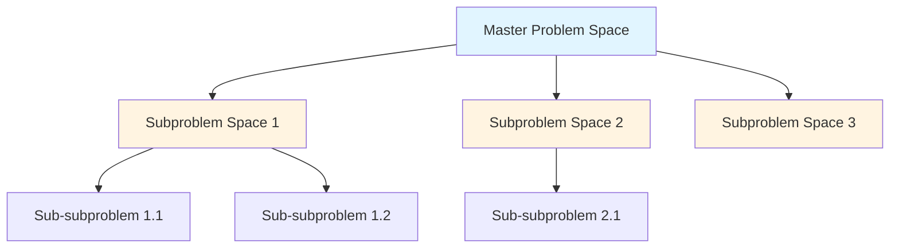
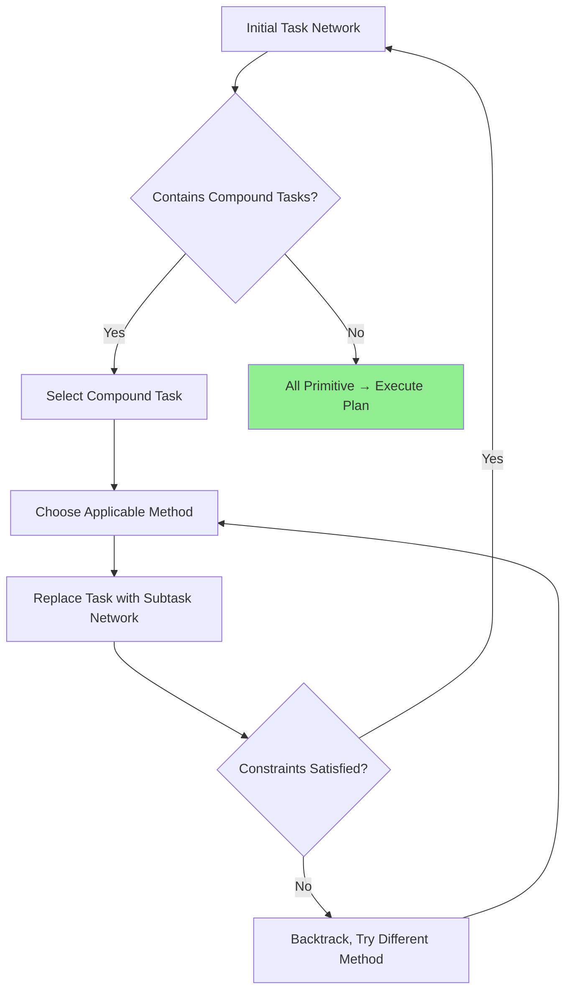
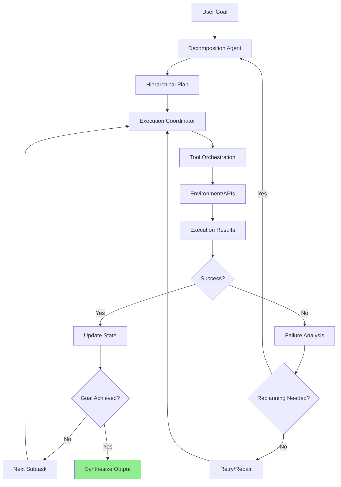

# Extraction Report: Hierarchical Task Decomposition: Plan-and-Solve as Cognitive Architecture

> [!info] Auto-Generated Report
> This report was automatically generated by `pkb_extractor.py` on 2026-03-13 04:17.
> **Source**: `prompt-report-hierarchical-task-decomposition-plan-and-solve-as-cognitive-architecture-2025122704.md` | **Items Extracted**: 526

---

## 📋 Document Overview

| Field | Value |
|-------|-------|
| **Source File** | `prompt-report-hierarchical-task-decomposition-plan-and-solve-as-cognitive-architecture-2025122704.md` |
| **Extraction Date** | 2026-03-13 04:17 |
| **Word Count** | 11,219 |
| **Character Count** | 95,038 |
| **Line Count** | 2,343 |
| **Total Items Extracted** | 526 |

### Document Outline

    - ### 📖 Extracted Definitions From Cognitive Science
- # Foundational Understanding
- # Hierarchical Task Decomposition: Plan-and-Solve as Cognitive Architecture
  - ## Table of Contents
  - ## Cognitive Science Foundations
    - ### The Human Problem-Solving Heritage
    - ### Cognitive Load Theory and Decomposition Efficiency
    - ### Problem Space Theory and Decomposition Dynamics
    - ### From Human Cognition to Computational Planning
  - ## Formal Planning Theory
    - ### STRIPS: The Foundation of Automated Planning
    - ### Hierarchical Task Networks (HTN)
    - ### Classical Planning and Complexity Analysis
    - ### Modern Extensions: Temporal, Probabilistic, and Continual Planning
  - ## Prompt Engineering for Decomposition
    - ### The Transition from Formal Planning to LLM Prompting
    - ### Zero-Shot Decomposition Prompting
    - ### Plan-and-Solve Prompting
  - ## Stage 1: Planning
  - ## Stage 2: Execution
    - ### Self-Ask Decomposition
    - ### Tree of Thoughts for Hierarchical Planning
  - ## Decomposition Approach 1: [Strategy Name]
  - ## Decomposition Approach 2: [Alternative Strategy]
  - ## Decomposition Approach 3: [Another Alternative]
  - ## Selection and Refinement:
    - ### Few-Shot Decomposition Learning
  - ## Example 1:
  - ## Example 2:
  - ## Now decompose this task:
    - ### Prompt Patterns for Hierarchical Structure
  - ## Phase 1: [Phase Name]
  - ## Phase 2: [Phase Name]
    - ### Decomposition Quality Evaluation Prompts
  - ## Decomposition A: [Strategy 1]
  - ## Decomposition B: [Strategy 2]
  - ## Decomposition C: [Strategy 3]
  - ## Dynamic Replanning Architecture
    - ### The Necessity of Adaptive Planning
    - ### Plan Monitoring and Failure Detection
  - ## Execution Attempt
  - ## Monitoring Check
  - ## Failure Diagnosis (if No)
  - ## Replanning Decision
    - ### Replanning Strategies
    - ### Prompt Architectures for Replanning
  - ## Current Situation
  - ## Replanning Analysis
  - ## Revised Plan
  - ## Execution Review
  - ## Environment Scan
  - ## Optimization Opportunities
  - ## Replanning Decision
    - ### HTN-Inspired Contingency Planning
    - ### Replanning Efficiency through Decomposition
  - ## Framework Implementations
    - ### HuggingGPT: Explicit Task Decomposition as DAG
- # Topological sort of dependency graph
- # Result: [task-1, task-3, task-2] (task-1 and task-3 parallel, task-2 after task-1)
    - ### AutoGPT: Iterative Decomposition with Memory
  - ## Current Status
  - ## Reflection
  - ## Planning Decision
    - ### BabyAGI: Minimalist Hierarchical Task Management
    - ### LangChain Planning Agents
- # Plan-and-execute agent automatically decomposes
- # Execution
- # Internal process (simplified):
- # 1. Generate plan:
- # - Search for AI planning papers
- # - Extract publication years
- # - Calculate count per year
- # - Compute average
- # 2. Execute steps with tools:
- # - serpapi for search
- # - llm-math for calculations
- # 3. Synthesize results
- # ReAct prompt includes planning
  - ## Integration with Execution Systems
    - ### The Plan-Execute Cycle
    - ### ReAct as Execution Framework for Decomposed Plans
  - ## High-Level Plan (from decomposition)
  - ## ReAct Execution Trace
    - ### Tool Selection and Subtask Matching
    - ### State Management Across Subtasks
- # Usage in execution
- # Execution coordinator
    - ### Prompt Patterns for Plan Execution
  - ## Plan Execution Framework
  - ## Execution Process
  - ## Evaluation Methodologies
    - ### Measuring Decomposition Quality
    - ### Benchmarking Planning Systems
    - ### Human Evaluation Frameworks
  - ## Plan Quality Assessment
    - ### Ablation Studies for Decomposition Components
  - ## 🔗 Related Topics for PKB Expansion
    - ### Review Information
  - ## 📅 Review System
    - ### Active Review Task

---

## 📊 Extraction Summary

| Item Type | Count |
|-----------|-------|
| Callouts | 17 |
| Code Blocks | 62 |
| Color Spans | 0 |
| Definitions | 32 |
| Embeds | 0 |
| External Links | 1 |
| Footnotes | 2 |
| Headings | 100 |
| Inline Fields | 32 |
| Mermaid Diagrams | 3 |
| Tables | 6 |
| Tags | 11 |
| Wiki Links | 60 |
| **TOTAL** | **526** |

---

## 🔔 Callouts (17)

> [!note] What are Callouts?
> Callouts are `> [!TYPE]` blocks used in Obsidian for structured annotation.
> They carry semantic meaning — definitions, insights, warnings, etc.

### By Type

| Callout Type | Count |
|-------------|-------|
| `[!abstract]` | 2 |
| `[!definition]` | 1 |
| `[!evidence]` | 1 |
| `[!example]` | 4 |
| `[!key-claim]` | 4 |
| `[!methodology-and-sources]` | 1 |
| `[!warning]` | 4 |

### Full Callout List

#### 1. [DEFINITION] # Definition *(Line 100)*

> [!definition] # Definition
> [**Note Title**:: [[**Hierarchical Task Decomposition: Plan-and-Solve as Cognitive Architecture**]]]
> [**Prompt Used**:: ]
> ##### [✅`= dateformat(this.file.ctime, "MMMM dd, yyyy")` - Initial Creation]

#### 2. [ABSTRACT] Core Thesis *(Line 121)*

> [!abstract] Core Thesis
> **Hierarchical Task Decomposition** represents the fundamental cognitive strategy enabling both humans and AI agents to tackle complex problems by recursively breaking goals into manageable subtasks, grounded in 60+ years of cognitive science research from Newell and Simon's General Problem Solver through modern LLM planning architectures. This framework bridges classical AI planning formalisms (STRIPS, HTN) with contemporary prompt engineering techniques, revealing decomposition as the essential precursor to effective execution in agentic systems.

#### 3. [KEY-CLAIM] Means-Ends Analysis as Universal Decomposition Strategy *(Line 144)*

> [!key-claim] Means-Ends Analysis as Universal Decomposition Strategy
> Newell and Simon demonstrated that human experts across domains (chess, mathematical proofs, cryptarithmetic) employ a consistent strategy: identify the difference between current state and goal state, select an operator that reduces this difference, recursively apply the same strategy to preconditions of that operator. This "difference reduction through operator application" pattern provides the cognitive template for all hierarchical planning systems.

#### 4. [EXAMPLE] Chess Master Chunking *(Line 164)*

> [!example] Chess Master Chunking
> [[Chase and Simon (1973)]] demonstrated that chess masters don't hold individual piece positions in working memory—they perceive meaningful configurations (pawn chains, king safety structures, piece coordination patterns) as single chunks. A position with 30 pieces might be represented as 5-7 strategic chunks, fitting within working memory limits. Similarly, hierarchical task decomposition allows agents to represent complex 50-step plans as 5-7 high-level phases.

#### 5. [METHODOLOGY-AND-SOURCES] Schema Construction Through Decomposition *(Line 212)*

> [!methodology-and-sources] Schema Construction Through Decomposition
> CLT posits that expertise develops through **schema construction**—organizing domain knowledge into coherent structures that can be retrieved and applied as single chunks. Hierarchical task decomposition directly facilitates schema formation: repeatedly decomposing "user authentication" into {credential validation, session management, token generation, permission checking} creates a reusable schema. Future authentication tasks activate this entire structure as one working memory chunk, rather than four separate elements.

#### 6. [WARNING] Decomposition Overhead and Suboptimality Trade-off *(Line 256)*

> [!warning] Decomposition Overhead and Suboptimality Trade-off
> While hierarchical decomposition dramatically reduces search complexity, it introduces two costs: (1) **Decomposition overhead**—the computational effort to determine appropriate subtask boundaries and ordering, and (2) **Potential suboptimality**—decomposition may prevent discovering optimal solutions that require coordinated cross-subtask actions. GPS-style planning accepts near-optimal solutions (satisficing rather than optimizing) in exchange for tractability. Modern planning systems address this through **hierarchical refinement** where initial coarse decomposition is progressively refined, or **anytime algorithms** that improve solution quality given additional computation time.

#### 7. [KEY-CLAIM] STRIPS as Hierarchical Decomposition Engine *(Line 313)*

> [!key-claim] STRIPS as Hierarchical Decomposition Engine
> While STRIPS appears as simple state-space search, it inherently implements hierarchical decomposition through **goal regression**. Each operator application creates a new subproblem (achieving the operator's preconditions), establishing a recursive goal hierarchy. A plan for "deliver package to RoomB" decomposes into {grasp package, navigate to door, open door, navigate through door, navigate to destination}—each with its own preconditions forming further subgoals.

#### 8. [EXAMPLE] HTN Planning for Package Delivery *(Line 423)*

> [!example] HTN Planning for Package Delivery
> **Initial Task**: `deliver_package(warehouse, customer_address)`
> 
> **Decomposition Trace**:
> ```
> Level 0: deliver_package(warehouse, customer_address)
> 
> Method Selected: standard_delivery
> Level 1 Network:
>   ├─ load_package(warehouse, truck)
>   ├─ transport(warehouse, customer_address, truck)  [compound]
>   └─ unload_package(truck, customer_address)
> 
> Expand transport(...):
> Method Selected: road_transport (train_transport preconditions failed)
> Level 2 Network:
>   ├─ load_package(warehouse, truck)
>   ├─ plan_route(warehouse, customer_address)  [compound]
>   ├─ drive_route(route, truck)  [compound]
>   └─ unload_package(truck, customer_address)
> 
> Expand plan_route(...):
> Method Selected: use_gps_routing
> Level 3 Network:
>   ├─ load_package(warehouse, truck)
>   ├─ query_gps(warehouse, customer_address)  [primitive]
>   ├─ optimize_route(gps_result)  [primitive]
>   ├─ drive_route(route, truck)  [compound]
>   └─ unload_package(truck, customer_address)
> 
> Expand drive_route(...):
> Method Selected: multi_segment_drive
> Level 4 Network (All Primitive):
>   1. load_package(warehouse, truck)
>   2. query_gps(warehouse, customer_address)
>   3. optimize_route(gps_result)
>   4. start_engine(truck)
>   5. drive_to_waypoint_1(truck)
>   6. drive_to_waypoint_2(truck)
>   ...
>   N. unload_package(truck, customer_address)
> ```

#### 9. [WARNING] HTN's Brittleness and Incompleteness *(Line 482)*

> [!warning] HTN's Brittleness and Incompleteness
> HTN's strength (encoding expert knowledge in methods) is also its weakness: if no method covers a novel situation, the planner **fails** even if a solution exists. STRIPS, lacking method constraints, can theoretically find any solution reachable through its operators (given unlimited computation). This **completeness vs. efficiency** trade-off drives hybrid approaches: HTN for standard cases, STRIPS-style search for novel situations.

#### 10. [EXAMPLE] Zero-Shot Decomposition Output *(Line 577)*

> [!example] Zero-Shot Decomposition Output
> **Task**: "Plan a surprise birthday party for 50 people"
> 
> **LLM Decomposition**:
> ```
> Plan:
> 
> 1. Set Date and Time
>    - Dependencies: None
>    - Preconditions: Know birthday person's availability
>    - Resources: Calendar
> 
> 2. Create Guest List
>    - Dependencies: None (parallel with step 1)
>    - Preconditions: Contact information access
>    - Resources: Phone contacts, social media
> 
> 3. Select and Book Venue  
>    - Dependencies: Step 1 (need date), Step 2 (need headcount)
>    - Preconditions: Budget established
>    - Resources: Venue search tools, payment method
> 
> 4. Send Invitations
>    - Dependencies: Step 2 (guest list), Step 3 (venue/date confirmed)
>    - Preconditions: RSVP tracking method
>    - Resources: Email/messaging platform
> 
> [Continues with catering, decorations, entertainment, etc.]
> ```

#### 11. [EVIDENCE] Plan-and-Solve Performance Gains *(Line 664)*

> [!evidence] Plan-and-Solve Performance Gains
> Wang et al. (2023) demonstrated Plan-and-Solve improves over zero-shot Chain of Thought across multiple reasoning benchmarks:
> - **GSM8K** (math word problems): 71.2% accuracy (vs. 40.7% zero-shot)
> - **MultiArith**: 93.0% (vs. 78.7% zero-shot)
> - **SVAMP**: 79.0% (vs. 69.5% zero-shot)  
> - **AQuA**: 48.4% (vs. 35.8% zero-shot)
> 
> The gains stem from decomposition reducing errors through systematic step isolation and dependency management—mirroring classical planning's advantage of contained search spaces.

#### 12. [KEY-CLAIM] Self-Ask Implements Implicit Goal Regression *(Line 744)*

> [!key-claim] Self-Ask Implements Implicit Goal Regression
> When Self-Ask generates "Who directed the film X?" as a follow-up to "Who was X's director's spouse?", it performs **backward chaining**: identifying the precondition (knowing the director) required to answer the goal question (knowing the spouse). This mirrors STRIPS goal regression, but expressed linguistically rather than through formal operators.

#### 13. [WARNING] ToT Computational Cost *(Line 809)*

> [!warning] ToT Computational Cost
> Generating 3-5 alternative decompositions, evaluating each, potentially backtracking and refining, imposes **5-10x token cost** versus zero-shot prompting. This investment is justified for complex, high-value planning tasks but excessive for routine problems with standard decompositions.

#### 14. [EXAMPLE] Replanning Efficiency in Software Development *(Line 1291)*

> [!example] Replanning Efficiency in Software Development
> **Scenario**: Deploying application
> 
> **Original Plan** (4 phases, 40 steps total):
> - Phase 1: Build (10 steps) ✓ Completed
> - Phase 2: Test (12 steps) ✓ Completed  
> - Phase 3: Deploy (8 steps) → Step 3.4 FAILED (credential error)
> - Phase 4: Monitor (10 steps) - Pending
> 
> **Without Decomposition**: Must replan all 40 steps (even though 22 succeeded)
> 
> **With Decomposition**: Replan only Phase 3, preserving Phases 1-2 and keeping Phase 4 unchanged
> - Replanning scope: 8 steps instead of 40 (80% reduction)
> - Phases 1-2 remain valid (22 steps preserved)
> - Phase 4 still applicable (10 steps unchanged)

#### 15. [KEY-CLAIM] HuggingGPT as HTN-to-Execution Bridge *(Line 1420)*

> [!key-claim] HuggingGPT as HTN-to-Execution Bridge
> HuggingGPT implements HTN-style hierarchical decomposition where:
> - **Compound tasks** = User request requiring decomposition
> - **Methods** = LLM-generated decomposition strategies  
> - **Primitive tasks** = Tool-executable subtasks (API calls to models)
> - **Task network** = Dependency DAG
> - **Execution** = Topologically sorted traversal respecting dependencies
> 
> This represents perhaps the clearest mapping from classical planning formalisms to modern LLM agent architecture.

#### 16. [WARNING] ### 📅 Review Intelligence *(Line 2357)*

> [!warning] ### 📅 Review Intelligence
> **Next Review**: `= this.next-review` | **Review Count**: `= this.review-count`
> **Review Status**: `= choice(this.next-review < date(today), "🔴 OVERDUE", choice(this.next-review = date(today), "🟡 Due Today", choice(dateformat(this.next-review, "yyyy-MM-dd") <= dateformat(date(today) + dur(7 days), "yyyy-MM-dd"), "🟢 This Week", "⚪ Scheduled")))`
> **Days Until Review**: `= choice(this.next-review, (this.next-review - date(today)).days + " days", "Not scheduled")`

#### 17. [ABSTRACT] ### 🏷️ Tag Intelligence *(Line 2361)*

> [!abstract] ### 🏷️ Tag Intelligence
> **Tag Count**: `= length(this.tags)` | **Unique Domains**: `= length(filter(this.tags, (t) => contains(t, "/")))` hierarchical tags
> **Tag Density**: `= choice(length(this.tags) < 3, "⚠️Sparse", choice(length(this.tags) > 10, "📚Rich", "✅Balanced"))`

---

## 🔗 Wiki-Links (60 total, 56 unique targets)

> [!info] Knowledge Graph Connections
> These links represent connections to other notes in your PKB.
> **56** distinct notes are referenced.

### Unique Targets

- [[**Hierarchical Task Decomposition: Plan-and-Solve as Cognitive Architecture**]]
- [[Abstraction-Hierarchy-Necessity]]
- [[Abstraction-Level-Control]]
- [[Agentic Reasoning]]
- [[Allen Newell]]
- [[AutoGPT]]
- [[BabyAGI]]
- [[Chain of Thought]]
- [[Chase and Simon (1973)]]
- [[Classical Planning]]
- [[Cognitive-Load-Theory|Cognitive Load Theory]]
- [[Cognitive-Architectures-for-Agent-Systems]]
- [[Combinatorial-Containment]]
- [[Contingent Planning]]
- [[Cowan's Capacity Limit]]
- [[Dana Nau]]
- [[Domain-Knowledge-Encoding]]
- [[Earl Sacerdoti]]
- [[Execution Monitoring]]
- [[Explainability-and-Interpretability-of-Agent-Plans]]
- [[General Problem Solver]]
- [[Goal-Regression-Efficiency]]
- [[HTN]]
- [[Herbert Simon]]
- [[Hierarchical Task Decomposition: Plan-and-Solve as Cognitive Architecture]]
- [[HuggingGPT]]
- [[James Hendler]]
- [[John Sweller]]
- [[Kutluhan Erol]]
- [[LangChain]]
- [[Learning-Hierarchical-Task-Networks-from-Demonstrations]]
- [[MDP]]
- [[Means-Ends Analysis]]
- [[Miller's 7±2]]
- [[Multi-Agent-Coordination-and-Decomposition]]
- [[Nils Nilsson]]
- [[Online Planning]]
- [[PDDL 2.1]]
- [[POMDP]]
- [[Press et al. (2022)]]
- [[ReAct]]
- [[Reusability]]
- [[Richard Fikes]]
- [[STRIPS]]
- [[Schema-Formation-Through-Decomposition]]
- [[Search-Space-Reduction]]
- [[Self-Ask]]
- [[Text-Generator-Plugin|TGP]]
- [[Temporal-and-Resource-Constrained-Planning]]
- [[Tree of Thoughts]]
- [[Tree of Thoughts (ToT)]]
- [[Verification-and-Validation-of-Hierarchical-Plans]]
- [[Wang et al. (2023)]]
- [[Working-Memory-as-Architectural-Constraint]]
- [[classical planning theory]]
- [[Working-Memory|working memory]]

### All Occurrences

| # | Target | Display Text | Heading | Section | Line |
|---|--------|-------------|---------|---------|------|
| 1 | [[**Hierarchical Task Decomposition: Plan-and-Solve as Cognitive Architecture**]] | — | — | Foundational Understanding | 101 |
| 2 | [[ReAct]] | — | — | Foundational Understanding | 114 |
| 3 | [[Tree of Thoughts]] | — | — | Foundational Understanding | 114 |
| 4 | [[Chain of Thought]] | — | — | Foundational Understanding | 114 |
| 5 | [[Agentic Reasoning]] | — | — | Foundational Understanding | 114 |
| 6 | [[General Problem Solver]] | — | — | Foundational Understanding | 115 |
| 7 | [[Means-Ends Analysis]] | — | — | Foundational Understanding | 115 |
| 8 | [[Cognitive-Load-Theory|Cognitive Load Theory]] | — | — | Foundational Understanding | 115 |
| 9 | [[STRIPS]] | — | — | Foundational Understanding | 116 |
| 10 | [[HTN]] | — | — | Foundational Understanding | 116 |
| 11 | [[Classical Planning]] | — | — | Foundational Understanding | 116 |
| 12 | [[Allen Newell]] | — | — | The Human Problem-Solving Heritage | 142 |
| 13 | [[Herbert Simon]] | — | — | The Human Problem-Solving Heritage | 142 |
| 14 | [[Working-Memory|working memory]] | — | — | The Human Problem-Solving Heritage | 153 |
| 15 | [[Cowan's Capacity Limit]] | — | — | The Human Problem-Solving Heritage | 153 |
| 16 | [[Miller's 7±2]] | — | — | The Human Problem-Solving Heritage | 153 |
| 17 | [[Chase and Simon (1973)]] | — | — | The Human Problem-Solving Heritage | 165 |
| 18 | [[John Sweller]] | — | — | Cognitive Load Theory and Decompositi... | 189 |
| 19 | [[Working-Memory-as-Architectural-Constraint]] | — | — | From Human Cognition to Computational... | 263 |
| 20 | [[Goal-Regression-Efficiency]] | — | — | From Human Cognition to Computational... | 264 |
| 21 | [[Abstraction-Hierarchy-Necessity]] | — | — | From Human Cognition to Computational... | 265 |
| 22 | [[Schema-Formation-Through-Decomposition]] | — | — | From Human Cognition to Computational... | 266 |
| 23 | [[Combinatorial-Containment]] | — | — | From Human Cognition to Computational... | 267 |
| 24 | [[STRIPS]] | — | — | From Human Cognition to Computational... | 269 |
| 25 | [[HTN]] | — | — | From Human Cognition to Computational... | 269 |
| 26 | [[classical planning theory]] | — | — | From Human Cognition to Computational... | 269 |
| 27 | [[Richard Fikes]] | — | — | STRIPS: The Foundation of Automated P... | 279 |
| 28 | [[Nils Nilsson]] | — | — | STRIPS: The Foundation of Automated P... | 279 |
| 29 | [[Earl Sacerdoti]] | — | — | Hierarchical Task Networks (HTN) | 360 |
| 30 | [[Kutluhan Erol]] | — | — | Hierarchical Task Networks (HTN) | 360 |
| 31 | [[James Hendler]] | — | — | Hierarchical Task Networks (HTN) | 360 |
| 32 | [[Dana Nau]] | — | — | Hierarchical Task Networks (HTN) | 360 |
| 33 | [[Domain-Knowledge-Encoding]] | — | — | Hierarchical Task Networks (HTN) | 468 |
| 34 | [[Abstraction-Level-Control]] | — | — | Hierarchical Task Networks (HTN) | 469 |
| 35 | [[Search-Space-Reduction]] | — | — | Hierarchical Task Networks (HTN) | 470 |
| 36 | [[Reusability]] | — | — | Hierarchical Task Networks (HTN) | 471 |
| 37 | [[PDDL 2.1]] | — | — | Modern Extensions: Temporal, Probabil... | 524 |
| 38 | [[Text-Generator-Plugin|TGP]] | — | — | Modern Extensions: Temporal, Probabil... | 524 |
| 39 | [[MDP]] | — | — | Modern Extensions: Temporal, Probabil... | 529 |
| 40 | [[POMDP]] | — | — | Modern Extensions: Temporal, Probabil... | 529 |
| 41 | [[Contingent Planning]] | — | — | Modern Extensions: Temporal, Probabil... | 529 |
| 42 | [[Online Planning]] | — | — | Modern Extensions: Temporal, Probabil... | 534 |
| 43 | [[Execution Monitoring]] | — | — | Modern Extensions: Temporal, Probabil... | 534 |
| 44 | [[Wang et al. (2023)]] | — | — | Plan-and-Solve Prompting | 620 |
| 45 | [[Self-Ask]] | — | — | Self-Ask Decomposition | 694 |
| 46 | [[Press et al. (2022)]] | — | — | Self-Ask Decomposition | 694 |
| 47 | [[Tree of Thoughts (ToT)]] | — | — | Tree of Thoughts for Hierarchical Pla... | 756 |
| 48 | [[HuggingGPT]] | — | — | HuggingGPT: Explicit Task Decompositi... | 1315 |
| 49 | [[AutoGPT]] | — | — | AutoGPT: Iterative Decomposition with... | 1432 |
| 50 | [[BabyAGI]] | — | — | BabyAGI: Minimalist Hierarchical Task... | 1516 |
| 51 | [[LangChain]] | — | — | LangChain Planning Agents | 1591 |
| 52 | [[ReAct]] | — | — | ReAct as Execution Framework for Deco... | 1694 |
| 53 | [[Cognitive-Architectures-for-Agent-Systems]] | — | — | 🔗 Related Topics for PKB Expansion | 2313 |
| 54 | [[Multi-Agent-Coordination-and-Decomposition]] | — | — | 🔗 Related Topics for PKB Expansion | 2319 |
| 55 | [[Temporal-and-Resource-Constrained-Planning]] | — | — | 🔗 Related Topics for PKB Expansion | 2325 |
| 56 | [[Verification-and-Validation-of-Hierarchical-Plans]] | — | — | 🔗 Related Topics for PKB Expansion | 2331 |
| 57 | [[Learning-Hierarchical-Task-Networks-from-Demonstrations]] | — | — | 🔗 Related Topics for PKB Expansion | 2337 |
| 58 | [[Explainability-and-Interpretability-of-Agent-Plans]] | — | — | 🔗 Related Topics for PKB Expansion | 2343 |
| 59 | [[Hierarchical Task Decomposition: Plan-and-Solve as Cognitive Architecture]] | — | — | Active Review Task | 2376 |
| 60 | [[Hierarchical Task Decomposition: Plan-and-Solve as Cognitive Architecture]] | — | — | Active Review Task | 2379 |

---

## 📖 Definitions (32)

> [!tip] PKB Definitions
> These `[**Term**:: Definition]` fields define key concepts.
> They are queryable by Dataview.

### 1. Note Title

> [!definition] Note Title
> [[**Hierarchical Task Decomposition: Plan-and-Solve as Cognitive Architecture**

*Source: Line 101 in `prompt-report-hierarchical-task-decomposition-plan-and-solve-as-cognitive-architecture-2025122704.md`*

### 2. Prompt Used

> [!definition] Prompt Used
> 

*Source: Line 102 in `prompt-report-hierarchical-task-decomposition-plan-and-solve-as-cognitive-architecture-2025122704.md`*

### 3. Hierarchical-Task-Decomposition

> [!definition] Hierarchical-Task-Decomposition
> A cognitive strategy where complex problems are recursively subdivided into smaller, more tractable subproblems, each potentially further decomposed until reaching directly executable primitive actions—originating from Newell and Simon's work on human problem-solving (1957-1972) and formalized in AI planning systems like STRIPS (1971) and HTN (1990s).

*Source: Line 140 in `prompt-report-hierarchical-task-decomposition-plan-and-solve-as-cognitive-architecture-2025122704.md`*

### 4. Means-Ends-Analysis

> [!definition] Means-Ends-Analysis
> Problem-solving strategy that recursively identifies differences between current and goal states, selects operators to reduce those differences, and recursively solves precondition subgoals—the foundational decomposition mechanism demonstrated by GPS and underlying modern hierarchical planning.

*Source: Line 147 in `prompt-report-hierarchical-task-decomposition-plan-and-solve-as-cognitive-architecture-2025122704.md`*

### 5. Goal-Regression

> [!definition] Goal-Regression
> Planning strategy that works backward from desired goal state, identifying immediate preconditions, then recursively planning for those preconditions—contrasts with forward search from initial state, offers computational advantages when goal more constrained than initial state.

*Source: Line 169 in `prompt-report-hierarchical-task-decomposition-plan-and-solve-as-cognitive-architecture-2025122704.md`*

### 6. Abstraction-Hierarchy

> [!definition] Abstraction-Hierarchy
> Multi-level representation where higher levels suppress irrelevant details, intermediate levels provide progressively more specificity, and lowest level contains full execution detail—enables planning at appropriate granularity for current decision without premature commitment to implementation details.

*Source: Line 177 in `prompt-report-hierarchical-task-decomposition-plan-and-solve-as-cognitive-architecture-2025122704.md`*

### 7. Intrinsic-Cognitive-Load

> [!definition] Intrinsic-Cognitive-Load
> Inherent complexity of material determined by element interactivity—how many pieces of information must be processed simultaneously to understand the concept. Decomposition reduces element interactivity by isolating subproblems.

*Source: Line 191 in `prompt-report-hierarchical-task-decomposition-plan-and-solve-as-cognitive-architecture-2025122704.md`*

### 8. Problem-Space

> [!definition] Problem-Space
> Formal representation consisting of (1) set of knowledge states, (2) operators that transform states, (3) constraints on operator application, (4) initial state, (5) goal test—problem-solving as search through this space from initial to goal state.

*Source: Line 219 in `prompt-report-hierarchical-task-decomposition-plan-and-solve-as-cognitive-architecture-2025122704.md`*

### 9. STRIPS

> [!definition] STRIPS
> Stanford Research Institute Problem Solver (1971)—the seminal automated planning system that formalized planning as search through state space using operator preconditions and effects, establishing the template for classical AI planning and influencing every planning formalism since.

*Source: Line 277 in `prompt-report-hierarchical-task-decomposition-plan-and-solve-as-cognitive-architecture-2025122704.md`*

### 10. STRIPS-Assumption

> [!definition] STRIPS-Assumption
> The closed-world assumption that any predicate not explicitly listed as true is false, and the frame assumption that operators only change predicates explicitly listed in their effects (all other predicates remain unchanged)—critical simplifications enabling tractable planning.

*Source: Line 311 in `prompt-report-hierarchical-task-decomposition-plan-and-solve-as-cognitive-architecture-2025122704.md`*

### 11. HTN-Planning

> [!definition] HTN-Planning
> Planning formalism where tasks are explicitly decomposed via methods that specify how compound (abstract) tasks reduce to networks of subtasks, continuing recursively until reaching primitive (directly executable) actions—introduced by Sacerdoti (1974) and formalized by Erol, Hendler, Nau (1994).

*Source: Line 358 in `prompt-report-hierarchical-task-decomposition-plan-and-solve-as-cognitive-architecture-2025122704.md`*

### 12. HTN-Decomposition-Strategy

> [!definition] HTN-Decomposition-Strategy
> Planning proceeds by selecting compound tasks from the current task network, choosing applicable methods based on current state and preconditions, replacing the compound task with its method's subtask network, and recursively continuing until all tasks are primitive.

*Source: Line 421 in `prompt-report-hierarchical-task-decomposition-plan-and-solve-as-cognitive-architecture-2025122704.md`*

### 13. HTN-vs-STRIPS-Distinction

> [!definition] HTN-vs-STRIPS-Distinction
> STRIPS performs goal regression (backward search from desired states), while HTN performs task decomposition (forward expansion from abstract to primitive tasks). STRIPS discovers plans through search; HTN constructs plans through application of domain knowledge encoded in methods.

*Source: Line 473 in `prompt-report-hierarchical-task-decomposition-plan-and-solve-as-cognitive-architecture-2025122704.md`*

### 14. Classical-Planning

> [!definition] Classical-Planning
> Planning framework with restrictive assumptions—deterministic actions, complete information, static environment, sequential execution, implicit time—enabling tractable analysis while limiting real-world applicability. Serves as theoretical foundation before relaxing assumptions for practical systems.

*Source: Line 489 in `prompt-report-hierarchical-task-decomposition-plan-and-solve-as-cognitive-architecture-2025122704.md`*

### 15. Hierarchical-Complexity-Reduction

> [!definition] Hierarchical-Complexity-Reduction
> Decomposition transforms exponential branching factor in depth into polynomial branching factor times polynomial depth, changing search from O(b^d) to O(b_decomp × k × b_subtask^(d/k)) where k is number of subtasks—practical improvement despite similar worst-case complexity.

*Source: Line 503 in `prompt-report-hierarchical-task-decomposition-plan-and-solve-as-cognitive-architecture-2025122704.md`*

### 16. Plan-Monitoring-Hierarchy

> [!definition] Plan-Monitoring-Hierarchy
> Multi-level execution monitoring where high-level tasks track coarse-grained progress and success criteria, intermediate levels detect constraint violations, and low-level monitors catch primitive action failures—matches decomposition hierarchy to enable localized replanning.

*Source: Line 539 in `prompt-report-hierarchical-task-decomposition-plan-and-solve-as-cognitive-architecture-2025122704.md`*

### 17. Prompt-Induced-Decomposition

> [!definition] Prompt-Induced-Decomposition
> The process of designing natural language prompts that activate LLM's latent decomposition capabilities, translating formal planning concepts (goal regression, task networks, abstraction hierarchies) into linguistic patterns that elicit systematic problem breakdown.

*Source: Line 557 in `prompt-report-hierarchical-task-decomposition-plan-and-solve-as-cognitive-architecture-2025122704.md`*

### 18. Plan-and-Solve-Prompting

> [!definition] Plan-and-Solve-Prompting
> Two-stage prompting technique where Stage 1 generates a high-level decomposition plan with explicit steps and dependencies, Stage 2 executes each step with detailed reasoning—separates planning from execution to reduce errors and improve systematic coverage.

*Source: Line 622 in `prompt-report-hierarchical-task-decomposition-plan-and-solve-as-cognitive-architecture-2025122704.md`*

### 19. PS-Plus-Enhancements

> [!definition] PS-Plus-Enhancements
> Augments Plan-and-Solve with explicit variable extraction, calculation breakdown, and verification steps—addresses numerical reasoning errors through fine-grained decomposition of arithmetic operations.

*Source: Line 690 in `prompt-report-hierarchical-task-decomposition-plan-and-solve-as-cognitive-architecture-2025122704.md`*

### 20. Self-Ask-Pattern

> [!definition] Self-Ask-Pattern
> Decomposition technique where LLM generates follow-up questions that must be answered to solve the original question, recursively continues until reaching answerable base questions, then composes answers bottom-up—mirrors goal regression in STRIPS planning.

*Source: Line 696 in `prompt-report-hierarchical-task-decomposition-plan-and-solve-as-cognitive-architecture-2025122704.md`*

### 21. ToT-Planning-Mode

> [!definition] ToT-Planning-Mode
> Application of Tree of Thoughts specifically to task decomposition where each "thought" represents a potential decomposition choice (how to break down a task), the tree structure captures alternative decomposition strategies, and search algorithms (BFS/DFS) explore the space of possible plans before committing to one.

*Source: Line 758 in `prompt-report-hierarchical-task-decomposition-plan-and-solve-as-cognitive-architecture-2025122704.md`*

### 22. Decomposition-Template-Learning

> [!definition] Decomposition-Template-Learning
> The process by which LLMs generalize from few-shot examples to extract reusable decomposition patterns (schemas) applicable to new tasks in similar domains—analogous to schema formation in human expertise development (CLT).

*Source: Line 874 in `prompt-report-hierarchical-task-decomposition-plan-and-solve-as-cognitive-architecture-2025122704.md`*

### 23. Replanning

> [!definition] Replanning
> The process of generating a revised plan when the current plan becomes invalid or suboptimal due to environmental changes, action failures, or goal modifications—essential for robust real-world agent operation.

*Source: Line 1011 in `prompt-report-hierarchical-task-decomposition-plan-and-solve-as-cognitive-architecture-2025122704.md`*

### 24. Failure-Escalation-Hierarchy

> [!definition] Failure-Escalation-Hierarchy
> When a primitive action fails, attempt local repair; if unsuccessful, escalate to subtask replanning; if that fails, escalate to high-level plan revision—hierarchical decomposition provides natural containment boundaries for failure handling.

*Source: Line 1033 in `prompt-report-hierarchical-task-decomposition-plan-and-solve-as-cognitive-architecture-2025122704.md`*

### 25. Plan-Repair-Efficiency

> [!definition] Plan-Repair-Efficiency
> Replanning strategy that modifies only the failed portion of a plan while preserving completed and still-valid portions—exploits hierarchical structure to contain changes, minimizing re-planning cost and maintaining context.

*Source: Line 1092 in `prompt-report-hierarchical-task-decomposition-plan-and-solve-as-cognitive-architecture-2025122704.md`*

### 26. Contingency-Method

> [!definition] Contingency-Method
> HTN method that includes conditional branches and failure-handling subtasks, enabling the plan to adapt to execution outcomes without external replanning—embeds common failure modes and recovery strategies in the decomposition itself.

*Source: Line 1257 in `prompt-report-hierarchical-task-decomposition-plan-and-solve-as-cognitive-architecture-2025122704.md`*

### 27. Replanning-Containment-Principle

> [!definition] Replanning-Containment-Principle
> Hierarchical decomposition limits replanning scope to the failed abstraction level and below, preserving completed work and unaffected portions—the practical benefit that makes decomposition essential for robust execution in dynamic environments.

*Source: Line 1307 in `prompt-report-hierarchical-task-decomposition-plan-and-solve-as-cognitive-architecture-2025122704.md`*

### 28. HuggingGPT-Architecture

> [!definition] HuggingGPT-Architecture
> LLM-based agent system that (1) decomposes user requests into structured task graphs with dependencies, (2) selects appropriate tools (Hugging Face models) for each subtask, (3) executes subtasks respecting dependency ordering, (4) synthesizes results into coherent response—pioneering architecture for explicit decomposition + tool orchestration.

*Source: Line 1317 in `prompt-report-hierarchical-task-decomposition-plan-and-solve-as-cognitive-architecture-2025122704.md`*

### 29. ReAct-Planning-Integration

> [!definition] ReAct-Planning-Integration
> ReAct's "Thought" step serves as micro-planning, generating next action based on current state—when augmented with explicit planning prompts, ReAct combines HTN-style decomposition (plan high-level strategy) with STRIPS-style execution (select actions achieving subgoals).

*Source: Line 1649 in `prompt-report-hierarchical-task-decomposition-plan-and-solve-as-cognitive-architecture-2025122704.md`*

### 30. Plan-Execute-Feedback-Loop

> [!definition] Plan-Execute-Feedback-Loop
> Architectural pattern where decomposition generates hierarchical plan, execution system attempts plan with monitoring, feedback returns results and failures, replanning updates plan based on feedback—iterates until goal achieved or deemed unreachable.

*Source: Line 1665 in `prompt-report-hierarchical-task-decomposition-plan-and-solve-as-cognitive-architecture-2025122704.md`*

### 31. Tool-Subtask-Mapping

> [!definition] Tool-Subtask-Mapping
> The process of analyzing decomposed subtask requirements (inputs needed, outputs expected, constraints) and selecting appropriate tools/APIs that satisfy those requirements—critical integration step enabling execution of hierarchical plans.

*Source: Line 1768 in `prompt-report-hierarchical-task-decomposition-plan-and-solve-as-cognitive-architecture-2025122704.md`*

### 32. Decomposition-Quality-Dimensions

> [!definition] Decomposition-Quality-Dimensions
> Six primary evaluation dimensions—(1) Completeness: all goal aspects covered, (2) Correctness: dependencies and ordering valid, (3) Granularity: appropriate subtask size, (4) Efficiency: no redundant steps, (5) Executability: subtasks are actionable, (6) Robustness: plan handles likely failures.

*Source: Line 1971 in `prompt-report-hierarchical-task-decomposition-plan-and-solve-as-cognitive-architecture-2025122704.md`*

---

## 🏷️ Inline Fields (32)

> [!tip] Dataview Fields
> These `[FieldName:: Value]` pairs are queryable by Dataview.

| # | Field Name | Value | Format | Line |
|---|-----------|-------|--------|------|
| 1 | **Note Title** | [[**Hierarchical Task Decomposition: Plan-and-Solve as Cognitive Architecture** | bracket | 101 |
| 2 | **Prompt Used** |  | bracket | 102 |
| 3 | **Hierarchical-Task-Decomposition** | A cognitive strategy where complex problems are recursively subdivided into s... | bracket | 140 |
| 4 | **Means-Ends-Analysis** | Problem-solving strategy that recursively identifies differences between curr... | bracket | 147 |
| 5 | **Goal-Regression** | Planning strategy that works backward from desired goal state, identifying im... | bracket | 169 |
| 6 | **Abstraction-Hierarchy** | Multi-level representation where higher levels suppress irrelevant details, i... | bracket | 177 |
| 7 | **Intrinsic-Cognitive-Load** | Inherent complexity of material determined by element interactivity—how many ... | bracket | 191 |
| 8 | **Problem-Space** | Formal representation consisting of (1) set of knowledge states, (2) operator... | bracket | 219 |
| 9 | **STRIPS** | Stanford Research Institute Problem Solver (1971)—the seminal automated plann... | bracket | 277 |
| 10 | **STRIPS-Assumption** | The closed-world assumption that any predicate not explicitly listed as true ... | bracket | 311 |
| 11 | **HTN-Planning** | Planning formalism where tasks are explicitly decomposed via methods that spe... | bracket | 358 |
| 12 | **HTN-Decomposition-Strategy** | Planning proceeds by selecting compound tasks from the current task network, ... | bracket | 421 |
| 13 | **HTN-vs-STRIPS-Distinction** | STRIPS performs goal regression (backward search from desired states), while ... | bracket | 473 |
| 14 | **Classical-Planning** | Planning framework with restrictive assumptions—deterministic actions, comple... | bracket | 489 |
| 15 | **Hierarchical-Complexity-Reduction** | Decomposition transforms exponential branching factor in depth into polynomia... | bracket | 503 |
| 16 | **Plan-Monitoring-Hierarchy** | Multi-level execution monitoring where high-level tasks track coarse-grained ... | bracket | 539 |
| 17 | **Prompt-Induced-Decomposition** | The process of designing natural language prompts that activate LLM's latent ... | bracket | 557 |
| 18 | **Plan-and-Solve-Prompting** | Two-stage prompting technique where Stage 1 generates a high-level decomposit... | bracket | 622 |
| 19 | **PS-Plus-Enhancements** | Augments Plan-and-Solve with explicit variable extraction, calculation breakd... | bracket | 690 |
| 20 | **Self-Ask-Pattern** | Decomposition technique where LLM generates follow-up questions that must be ... | bracket | 696 |
| 21 | **ToT-Planning-Mode** | Application of Tree of Thoughts specifically to task decomposition where each... | bracket | 758 |
| 22 | **Decomposition-Template-Learning** | The process by which LLMs generalize from few-shot examples to extract reusab... | bracket | 874 |
| 23 | **Replanning** | The process of generating a revised plan when the current plan becomes invali... | bracket | 1011 |
| 24 | **Failure-Escalation-Hierarchy** | When a primitive action fails, attempt local repair; if unsuccessful, escalat... | bracket | 1033 |
| 25 | **Plan-Repair-Efficiency** | Replanning strategy that modifies only the failed portion of a plan while pre... | bracket | 1092 |
| 26 | **Contingency-Method** | HTN method that includes conditional branches and failure-handling subtasks, ... | bracket | 1257 |
| 27 | **Replanning-Containment-Principle** | Hierarchical decomposition limits replanning scope to the failed abstraction ... | bracket | 1307 |
| 28 | **HuggingGPT-Architecture** | LLM-based agent system that (1) decomposes user requests into structured task... | bracket | 1317 |
| 29 | **ReAct-Planning-Integration** | ReAct's "Thought" step serves as micro-planning, generating next action based... | bracket | 1649 |
| 30 | **Plan-Execute-Feedback-Loop** | Architectural pattern where decomposition generates hierarchical plan, execut... | bracket | 1665 |
| 31 | **Tool-Subtask-Mapping** | The process of analyzing decomposed subtask requirements (inputs needed, outp... | bracket | 1768 |
| 32 | **Decomposition-Quality-Dimensions** | Six primary evaluation dimensions—(1) Completeness: all goal aspects covered,... | bracket | 1971 |

---

## 🏷️ Tags (11 occurrences, 11 unique)

### All Unique Tags

`#agentic-reasoning`, `#cognitive-architecture`, `#hierarchical-planning`, `#htn`, `#means-ends-analysis`, `#planning-systems`, `#problem-solving`, `#prompt-engineering`, `#review`, `#strips-planning`, `#task-decomposition`

---

## 💻 Code Blocks (62)

| Language | Count |
|----------|-------|
| `markdown` | 29 |
| `plaintext` | 19 |
| `python` | 10 |
| `json` | 2 |
| `dataviewjs` | 1 |
| `tasks` | 1 |

### Code Block 1 — `dataviewjs` *(Lines 44-92)*

```dataviewjs
try {
 // Get the current file
 const currentPage = dv.current();
 // Load the content of the current file
 const content = await dv.io.load(currentPage.file.path);
 // Storage for definitions in current file
 let allDefinitions = [];
 // Extract bracketed inline fields from current file content
 const bracketedFieldRegex = /\[\*\*([^*]+?)\*\*::\s*([^\]]+?)\]/g;
 let match;
 while ((match = bracketedFieldRegex.exec(content)) !== null) {
  allDefinitions.push({
   key: match[1].trim(), // This is the clean term without ** markdown
   value: match[2].trim()
  });
 }
 // Display results
 if (allDefinitions.length > 0) {
  dv.header(3, `📚 Definitions in Current File (${allDefinitions.length} total)`);
  // Group by first letter (using the clean key)
  const grouped = {};
  allDefinitions.forEach(d => {
   const firstLetter = d.key[0].toUpperCase();
   if (!grouped[firstLetter]) grouped[firstLetter] = [];
   grouped[firstLetter].push(d);
  });
  // Sort letters alphabetically
  const sortedLetters = Object.keys(grouped).sort();
  // Display grouped results
  for (let letter of sortedLetters) {
# ... (17 more lines truncated)
```

### Code Block 2 — `plaintext` *(Lines 157-162)*

```plaintext
Problem Complexity > Working Memory Capacity 
  → Decomposition Required
  → Abstract high-level plan (fits in WM)
  → Expand subtasks only during execution
```

### Code Block 3 — `plaintext` *(Lines 197-208)*

```plaintext
MONOLITHIC PLAN (20 steps, no decomposition):
- Element interactivity: O(20²) = 400 potential interactions
- Working memory load: Exceeds capacity
- Error propagation: Global (one mistake cascades)

HIERARCHICAL PLAN (4 phases × 5 steps):
- Phase-level interactivity: O(4²) = 16 interactions
- Within-phase interactivity: 4 × O(5²) = 100 interactions  
- Working memory load: Fits capacity at each level
- Error propagation: Localized (phase boundaries contain errors)
```

### Code Block 4 — `plaintext` *(Lines 247-254)*

```plaintext
Monolithic search: O(b^d) where b = branching factor, d = solution depth
Hierarchical search: O(k × b^(d/k)) where k = number of subproblems

Example: b=10, d=20
- Monolithic: 10^20 = 10 quintillion states
- Hierarchical (k=4, d/k=5): 4 × 10^5 = 400,000 states
```

### Code Block 5 — `plaintext` *(Lines 286-288)*

```plaintext
State = {At(Robot, RoomA), Empty(Hand), Closed(Door)}
```

### Code Block 6 — `plaintext` *(Lines 291-297)*

```plaintext
Operator: Move(from, to)
   Preconditions: {At(Robot, from), Open(Door_between)}
   Effects: 
     - Delete: {At(Robot, from)}
     - Add: {At(Robot, to)}
```

### Code Block 7 — `plaintext` *(Lines 300-302)*

```plaintext
I = {At(Robot, RoomA), Empty(Hand), Closed(Door1)}
```

### Code Block 8 — `plaintext` *(Lines 305-307)*

```plaintext
G = {At(Robot, RoomB), Holding(Package)}
```

### Code Block 9 — `plaintext` *(Lines 318-341)*

```plaintext
GOAL: At(Robot, RoomB) ∧ Holding(Package)

Decompose via Move(RoomA, RoomB):
├─ SUBGOAL 1: At(Robot, RoomA) ∧ Open(Door_AB)  [preconditions]
│  └─ Decompose via OpenDoor(Door_AB):
│     └─ SUBGOAL 1.1: At(Robot, Door_AB) ∧ Empty(Hand)
│        └─ Decompose via Move(CurrentLoc, Door_AB):
│           └─ SUBGOAL 1.1.1: At(Robot, CurrentLoc)  [satisfied by init state]
│
└─ SUBGOAL 2: Holding(Package)  [additional goal conjunct]
   └─ Decompose via Grasp(Package):
      └─ SUBGOAL 2.1: At(Robot, Package_Location) ∧ Empty(Hand)
         └─ [Further decomposition...]

PLAN (linearizing the goal tree):
1. Move(InitLoc, Package_Location)
2. Grasp(Package)  
3. Move(Package_Location, Door_AB)
4. PutDown(Package)  [to satisfy Empty(Hand) for opening door]
5. OpenDoor(Door_AB)
6. Grasp(Package)
7. Move(Door_AB, RoomB)
```

### Code Block 10 — `plaintext` *(Lines 365-369)*

```plaintext
primitive: drive(from, to)
   preconditions: {at(vehicle, from), road(from, to)}
   effects: {at(vehicle, to), ¬at(vehicle, from)}
```

### Code Block 11 — `plaintext` *(Lines 372-375)*

```plaintext
compound: travel(from, to)
   [No direct execution—must be decomposed]
```

### Code Block 12 — `plaintext` *(Lines 378-388)*

```plaintext
method: travel_by_car(from, to)
   task: travel(from, to)
   preconditions: {have_car, license_valid}
   subtasks: [
     get_in_car(car),
     drive(from, to),
     get_out_car(car)
   ]
   ordering: get_in_car → drive → get_out_car
```

### Code Block 13 — `plaintext` *(Lines 391-402)*

```plaintext
method: travel_by_train(from, to)
   task: travel(from, to)  
   preconditions: {train_available(from, to)}
   subtasks: [
     walk(current_loc, train_station),
     buy_ticket(from, to),
     board_train(from),
     ride_train(from, to),
     exit_train(to)
   ]
```

### Code Block 14 — `plaintext` *(Lines 427-464)*

```plaintext
> Level 0: deliver_package(warehouse, customer_address)
> 
> Method Selected: standard_delivery
> Level 1 Network:
>   ├─ load_package(warehouse, truck)
>   ├─ transport(warehouse, customer_address, truck)  [compound]
>   └─ unload_package(truck, customer_address)
> 
> Expand transport(...):
> Method Selected: road_transport (train_transport preconditions failed)
> Level 2 Network:
>   ├─ load_package(warehouse, truck)
>   ├─ plan_route(warehouse, customer_address)  [compound]
>   ├─ drive_route(route, truck)  [compound]
>   └─ unload_package(truck, customer_address)
> 
> Expand plan_route(...):
> Method Selected: use_gps_routing
> Level 3 Network:
>   ├─ load_package(warehouse, truck)
>   ├─ query_gps(warehouse, customer_address)  [primitive]
>   ├─ optimize_route(gps_result)  [primitive]
>   ├─ drive_route(route, truck)  [compound]
>   └─ unload_package(truck, customer_address)
> 
> Expand drive_route(...):
> Method Selected: multi_segment_drive
> Level 4 Network (All Primitive):
>   1. load_package(warehouse, truck)
>   2. query_gps(warehouse, customer_address)
# ... (7 more lines truncated)
```

### Code Block 15 — `plaintext` *(Lines 564-573)*

```plaintext
Task: {complex_task_description}

Break this task down into a step-by-step plan. For each step:
1. Describe what needs to be done
2. Identify any dependencies on previous steps
3. Note any resources or preconditions required

Plan:
```

### Code Block 16 — `plaintext` *(Lines 581-605)*

```plaintext
> Plan:
> 
> 1. Set Date and Time
>    - Dependencies: None
>    - Preconditions: Know birthday person's availability
>    - Resources: Calendar
> 
> 2. Create Guest List
>    - Dependencies: None (parallel with step 1)
>    - Preconditions: Contact information access
>    - Resources: Phone contacts, social media
> 
> 3. Select and Book Venue  
>    - Dependencies: Step 1 (need date), Step 2 (need headcount)
>    - Preconditions: Budget established
>    - Resources: Venue search tools, payment method
> 
> 4. Send Invitations
>    - Dependencies: Step 2 (guest list), Step 3 (venue/date confirmed)
>    - Preconditions: RSVP tracking method
>    - Resources: Email/messaging platform
> 
> [Continues with catering, decorations, entertainment, etc.]
>
```

### Code Block 17 — `markdown` *(Lines 626-655)*

```markdown
Task: {task_description}

## Stage 1: Planning

Let's devise a plan to solve this task. The plan should:
1. Break the task into clearly defined steps
2. Identify dependencies between steps  
3. Ensure all aspects of the task are covered
4. Provide enough detail that each step is actionable

Plan:
[LLM generates plan]

## Stage 2: Execution

Now let's execute the plan step-by-step, providing detailed reasoning for each:

Step 1: [Plan step 1 description]
Reasoning: [Detailed execution of step 1]
Result: [Output from step 1]

Step 2: [Plan step 2 description]
Reasoning: [Detailed execution, using Step 1 results]  
Result: [Output from step 2]

[Continue for all steps...]

Final Answer: [Synthesized result from all steps]
```

### Code Block 18 — `markdown` *(Lines 677-688)*

```markdown
Let's devise a plan to solve this task:
1. Extract relevant variables and their values
2. Break the task into clearly defined sub-tasks with dependencies
3. For each sub-task:
   a. Identify required calculations or logical steps  
   b. Execute step-by-step with explicit intermediate values
   c. Verify result before proceeding
4. Combine sub-task results for final answer

[Rest of template continues...]
```

### Code Block 19 — `markdown` *(Lines 700-714)*

```markdown
Question: {original_complex_question}

Are follow-up questions needed here: Yes.

Follow-up: {sub-question_1}
Intermediate answer: {answer_to_sub_question_1}

Follow-up: {sub-question_2}  
Intermediate answer: {answer_to_sub_question_2}

[Continue generating follow-ups until base knowledge reached]

So the final answer is: {composed_answer}
```

### Code Block 20 — `plaintext` *(Lines 718-730)*

```plaintext
Question: Who was the spouse of the director of film The Pursuit of Happyness?

Are follow-up questions needed here: Yes.

Follow-up: Who directed the film The Pursuit of Happyness?
Intermediate answer: Gabriele Muccino

Follow-up: Who is the spouse of Gabriele Muccino?
Intermediate answer: Unable to determine from training data.

[At this point, Self-Ask would trigger web search or knowledge retrieval]
```

### Code Block 21 — `markdown` *(Lines 762-793)*

```markdown
Task: {complex_task}

Let's explore different ways to decompose this task:

## Decomposition Approach 1: [Strategy Name]
Subtasks:
1. [Subtask 1.1]
2. [Subtask 1.2]  
3. [Subtask 1.3]

Evaluation: [Assess completeness, dependencies, feasibility]
Score: [1-10]

## Decomposition Approach 2: [Alternative Strategy]  
Subtasks:
1. [Subtask 2.1]
2. [Subtask 2.2]
3. [Subtask 2.3]

Evaluation: [Assess]
Score: [1-10]

## Decomposition Approach 3: [Another Alternative]
[Similar structure...]

## Selection and Refinement:
Best approach: [Selected approach with justification]

Refined Plan:
[Expand selected approach with detailed steps]
```

### Code Block 22 — `markdown` *(Lines 818-865)*

```markdown
I will show you examples of how to decompose tasks, then you will decompose a new task following the pattern.

## Example 1:
Task: Organize a professional conference

Decomposition:
1. Planning Phase (Month 1-2)
   1.1 Define conference theme and goals
   1.2 Form organizing committee
   1.3 Set budget and secure initial funding
   
2. Logistics Phase (Month 3-4)  
   2.1 Select and book venue
   2.2 Set up registration system
   2.3 Arrange accommodations
   
3. Content Phase (Month 4-5)
   3.1 Issue call for papers/presentations
   3.2 Review submissions
   3.3 Build program schedule
   
4. Promotion Phase (Month 5-6)
   4.1 Create marketing materials
   4.2 Launch social media campaign
   4.3 Send targeted invitations
   
5. Execution Phase (Conference Week)
   5.1 Final logistics check
   5.2 Run conference sessions
   5.3 Handle real-time adjustments
# ... (16 more lines truncated)
```

### Code Block 23 — `markdown` *(Lines 888-898)*

```markdown
Decompose this task using hierarchical numbering (1, 1.1, 1.1.1, etc.) to show:
- Top level (1, 2, 3): Major phases or modules
- Second level (1.1, 1.2): Significant subtasks  
- Third level (1.1.1, 1.1.2): Detailed steps
- Fourth level if needed (1.1.1.1): Atomic actions

Task: {task}

Hierarchical Decomposition:
```

### Code Block 24 — `markdown` *(Lines 901-922)*

```markdown
Decompose this task into distinct phases, each with subtasks:

Task: {task}

## Phase 1: [Phase Name]
**Purpose**: [What this phase achieves]
**Subtasks**:
1.1 [Subtask]
1.2 [Subtask]
**Outputs**: [What this phase produces]

## Phase 2: [Phase Name]  
**Purpose**: [What this phase achieves]
**Dependencies**: [What from Phase 1 is required]
**Subtasks**:
2.1 [Subtask]
2.2 [Subtask]
**Outputs**: [What this phase produces]

[Continue...]
```

### Code Block 25 — `markdown` *(Lines 925-938)*

```markdown
Create a task decomposition showing explicit dependencies:

For each subtask, specify:
- Subtask name and description
- **Depends on**: Which prior subtasks must complete first
- **Enables**: Which subsequent subtasks this unblocks  
- **Resources required**: What's needed to execute
- **Success criteria**: How to know it's complete

Task: {task}

Dependency-Explicit Decomposition:
```

### Code Block 26 — `markdown` *(Lines 947-961)*

```markdown
After generating a decomposition, evaluate it:

Decomposition Quality Checklist:
[ ] Completeness: All aspects of original task covered?
[ ] Granularity: Each step is actionable (not too abstract, not too detailed)?  
[ ] Dependencies: Correct ordering and prerequisite identification?
[ ] Feasibility: Each step is realistically achievable?
[ ] Efficiency: No redundant or unnecessary steps?
[ ] Clarity: Each step unambiguously defined?

Score: [X/6 checkmarks]

If score < 5, revise decomposition addressing failed criteria.
```

### Code Block 27 — `markdown` *(Lines 964-995)*

```markdown
I will generate 3 different decompositions, then select the best:

## Decomposition A: [Strategy 1]
[Subtasks...]

Evaluation:
- Strengths: [What this approach does well]
- Weaknesses: [Limitations or risks]  
- Score: [1-10]

## Decomposition B: [Strategy 2]  
[Subtasks...]

Evaluation:
- Strengths: [...]
- Weaknesses: [...]
- Score: [1-10]

## Decomposition C: [Strategy 3]
[Subtasks...]

Evaluation:
- Strengths: [...]
- Weaknesses: [...]
- Score: [1-10]

Selected Approach: [A/B/C with justification]

Refined Final Decomposition:
[Expand selected approach with improvements]
```

### Code Block 28 — `markdown` *(Lines 1037-1062)*

```markdown
Task: {task}
Plan: {current_plan}
Current Step: {step_N}

## Execution Attempt
Attempting: {step_N_description}
Result: {execution_result}

## Monitoring Check
Expected outcome: {expected_state}
Actual outcome: {actual_state}
Match: [Yes/No]

## Failure Diagnosis (if No)
Failure type: [Action failure | Precondition violation | Resource unavailability | Unexpected state]
Severity: [Minor | Moderate | Critical]
Scope: [Action-level | Subtask-level | Plan-level]

## Replanning Decision
If Minor + Action-level: Retry with modification
If Moderate + Subtask-level: Replan current subtask  
If Critical + Plan-level: Replan entire task

Action: {selected_replanning_strategy}
```

### Code Block 29 — `markdown` *(Lines 1070-1090)*

```markdown
Current Plan:
1. ✓ Completed: Setup environment
2. ✓ Completed: Install dependencies  
3. ✗ FAILED: Run tests (Error: pytest not found)
4. Pending: Deploy application
5. Pending: Run smoke tests

Plan Repair:
- Keep: Steps 1-2 (already completed)
- Replace: Step 3 with "Install pytest, then run tests"
- Keep: Steps 4-5 (still valid)

Repaired Plan:
1. ✓ Setup environment
2. ✓ Install dependencies
3. NEW: Install pytest  
4. RETRY: Run tests
5. Deploy application
6. Run smoke tests
```

### Code Block 30 — `markdown` *(Lines 1098-1121)*

```markdown
High-Level Plan (Still Valid):
Phase 1: ✓ Data Collection
Phase 2: ✗ Data Processing [FAILED - corrupt data detected]
Phase 3: Pending - Model Training
Phase 4: Pending - Deployment

Subtask Replanning for Phase 2:

Original Phase 2 Plan:
2.1 Load data
2.2 Normalize features
2.3 Handle missing values → FAILED (corruption exceeds threshold)

Revised Phase 2 Plan:
2.1 Validate data integrity
2.2 IF corruption > threshold: Request fresh dataset ELSE proceed
2.3 [Current branch: Requesting fresh dataset]
2.4 Re-load validated data
2.5 Normalize features  
2.6 Handle missing values

High-level plan unchanged; only Phase 2 internally revised.
```

### Code Block 31 — `markdown` *(Lines 1127-1153)*

```markdown
Original Goal: Deploy web application to cloud server

Original Plan:
1. Package application
2. Configure cloud server
3. Deploy to server
4. Run integration tests

Critical Failure: Cloud provider outage, ETA 24 hours

Goal Remains: Deploy application (urgency unchanged)
Constraint Changed: Cloud unavailable

Full Replan Required:

New Plan:
1. Identify alternative deployment target (local server, different cloud)
2. IF alternative available:
   2.1 Reconfigure for alternative target
   2.2 Deploy to alternative
   2.3 Run adapted integration tests
3. ELSE:  
   3.1 Notify stakeholders of delay
   3.2 Queue deployment for cloud restoration
   3.3 Prepare contingency manual deployment
```

### Code Block 32 — `markdown` *(Lines 1159-1170)*

```markdown
Current Plan: Analyze Q3 sales data manually

During Execution Discovery: Found automated analysis tool

Opportunistic Replan:
Original Step 3: Manually aggregate regional data (estimated 2 hours)
Revised Step 3: Use discovered tool to auto-aggregate (estimated 15 minutes)
Time saved: 1h 45m → reallocate to deeper trend analysis

New Plan incorporates tool, enhancing final output quality.
```

### Code Block 33 — `markdown` *(Lines 1176-1199)*

```markdown
## Current Situation
Task: {overall_task}
Plan: {current_plan}
Completed: {completed_steps}
Failed: {failed_step} - Error: {error_description}  
Remaining: {pending_steps}

## Replanning Analysis
1. Is the failure recoverable through retry? [Yes/No]
   - If Yes: What modification needed for retry?
   
2. Can the plan continue with subtask replanning? [Yes/No]
   - If Yes: Generate revised subtask plan
   
3. Do completed steps remain valid? [Yes/No]  
   - If No: Which must be redone?

4. Are high-level goals still achievable? [Yes/No]
   - If No: Require goal reformulation

## Revised Plan
[Generate new plan based on analysis]
```

### Code Block 34 — `markdown` *(Lines 1203-1226)*

```markdown
## Execution Review
Task: {task}
Plan: {current_plan}
Progress: {current_progress}

## Environment Scan
Changes detected: {environmental_changes}
New information: {discovered_information}  
Resource status: {resource_availability}

## Optimization Opportunities
Current plan efficiency: [Estimate]
Identified improvements:
1. {opportunity_1}
2. {opportunity_2}

## Replanning Decision
Should we revise the plan? [Criteria: >20% efficiency gain OR >50% risk reduction]

If Yes:
- Revised Plan: {optimized_plan}
- Expected improvement: {quantified_benefit}
```

### Code Block 35 — `markdown` *(Lines 1232-1255)*

```markdown
Method: data_processing_robust

Task: process_dataset(data_source)

Preconditions: {access_to_data_source}

Subtasks:
1. validate_data(data_source)
2. IF validation_passed:
     2.1 normalize_data(validated_data)
     2.2 transform_features(normalized_data)
   ELSE IF corruption_repairable:
     2.1 repair_data(corrupted_data)  
     2.2 revalidate_data(repaired_data)
     2.3 RECURSE to step 2 with repaired_data
   ELSE:
     2.1 log_failure(data_source, corruption_details)
     2.2 request_fresh_dataset(data_source)
     2.3 WAIT for fresh_dataset
     2.4 RESTART with fresh_dataset

3. export_results(processed_data)
```

### Code Block 36 — `markdown` *(Lines 1261-1274)*

```markdown
Create a robust task decomposition that includes contingency handling:

For each subtask, specify:
1. Primary execution path
2. Success criteria
3. Failure modes (what could go wrong)
4. Contingency actions for each failure mode  
5. Escalation conditions (when to give up and replan)

Task: {task}

Robust Decomposition with Contingencies:
```

### Code Block 37 — `json` *(Lines 1325-1357)*

```json
{
  "task": "Create a promotional image with text overlay and audio narration",
  "decomposition": [
    {
      "id": "task-1",
      "type": "image-generation",
      "description": "Generate base promotional image",
      "dependencies": [],
      "args": {"prompt": "modern tech product advertisement, clean design"}
    },
    {
      "id": "task-2",  
      "type": "text-to-image",
      "description": "Add promotional text overlay",
      "dependencies": ["task-1"],
      "args": {"image": "<TASK-1-OUTPUT>", "text": "Limited Time Offer"}
    },
    {
      "id": "task-3",
      "type": "text-to-speech",
      "description": "Generate promotional audio narration",  
      "dependencies": [],
      "args": {"text": "Visit our website for exclusive deals"}
    }
  ],
  "dependency_graph": {
    "task-1": [],
    "task-2": ["task-1"],
    "task-3": []
  }
# ... (1 more lines truncated)
```

### Code Block 38 — `json` *(Lines 1363-1378)*

```json
{
  "task-1": {
    "selected_model": "stabilityai/stable-diffusion-2-1",
    "reason": "Best image generation quality for marketing content"  
  },
  "task-2": {
    "selected_model": "salesforce/blip-image-captioning-large",
    "reason": "Supports text overlay on existing images"
  },
  "task-3": {
    "selected_model": "microsoft/speecht5_tts",  
    "reason": "Natural-sounding English TTS"
  }
}
```

### Code Block 39 — `python` *(Lines 1384-1397)*

```python
# Topological sort of dependency graph
execution_order = topological_sort(dependency_graph)
# Result: [task-1, task-3, task-2] (task-1 and task-3 parallel, task-2 after task-1)

results = {}
for task_id in execution_order:
    # Check dependencies satisfied
    if all(dep in results for dep in dependencies[task_id]):
        # Substitute dependency outputs
        args = substitute_placeholders(task.args, results)
        # Execute task  
        results[task_id] = execute_model(selected_models[task_id], args)
```

### Code Block 40 — `markdown` *(Lines 1403-1411)*

```markdown
I've created your promotional package:

1. Base Image: [displays generated image]
2. Image with Text Overlay: [displays final promotional image]  
3. Audio Narration: [provides audio player]

All components are ready for your marketing campaign.
```

### Code Block 41 — `python` *(Lines 1436-1472)*

```python
class AutoGPT:
    def __init__(self, goal):
        self.goal = goal
        self.task_queue = []
        self.completed_tasks = []
        self.memory = []
        
    def run(self):
        # Initial decomposition
        self.task_queue = self.decompose_goal(self.goal)
        
        while self.task_queue and not self.goal_achieved():
            # Get next task
            current_task = self.task_queue.pop(0)
            
            # Execute task
            result = self.execute_task(current_task)
            self.completed_tasks.append((current_task, result))
            self.memory.append({
                'task': current_task,
                'result': result,  
                'timestamp': now()
            })
            
            # Reflect and potentially replan
            if self.should_replan(result):
                new_tasks = self.replan(current_task, result)
                self.task_queue = new_tasks + self.task_queue
                
            # Generate new tasks based on results
# ... (5 more lines truncated)
```

### Code Block 42 — `markdown` *(Lines 1483-1501)*

```markdown
## Current Status
Goal: {overall_goal}
Completed Tasks: {task_history}
Current Task Queue: {pending_tasks}
Recent Result: {last_task_result}

## Reflection
1. Did the last task succeed? [Yes/Partial/No]
2. Does the task queue still lead to the goal? [Yes/Uncertain/No]
3. Did execution reveal new requirements? [Yes/No]  

## Planning Decision
Action: [Continue/Replan/Add-Tasks/Goal-Achieved]

If Replan: {generate_new_task_queue}
If Add-Tasks: {generate_additional_tasks}
If Continue: [Execute next task in queue]
```

### Code Block 43 — `python` *(Lines 1518-1580)*

```python
class BabyAGI:
    def __init__(self, objective):
        self.objective = objective
        self.task_list = []
        
    def run(self):
        # Create initial task
        self.task_list.append({
            'task_id': 1,
            'task': f'Develop initial plan for: {self.objective}'
        })
        
        while self.task_list:
            # Get highest priority task
            task = self.task_list.pop(0)
            
            # Execute task
            result = self.execute_task(task)
            
            # Generate new tasks based on result
            new_tasks = self.task_creation_agent(
                objective=self.objective,
                completed_task=task,
                result=result,
                task_list=self.task_list
            )
            
            # Prioritize task list
            self.task_list = self.prioritization_agent(
                objective=self.objective,
# ... (31 more lines truncated)
```

### Code Block 44 — `python` *(Lines 1595-1622)*

```python
from langchain.agents import PlanAndExecute, load_tools
from langchain.llms import OpenAI

llm = OpenAI(temperature=0)
tools = load_tools(["serpapi", "llm-math"], llm=llm)

# Plan-and-execute agent automatically decomposes
agent = PlanAndExecute(
    llm=llm,
    tools=tools,
    verbose=True
)

# Execution
result = agent.run("Research AI planning formalisms and calculate average paper count per year since 1970")

# Internal process (simplified):
# 1. Generate plan:
#    - Search for AI planning papers  
#    - Extract publication years
#    - Calculate count per year
#    - Compute average
# 2. Execute steps with tools:
#    - serpapi for search
#    - llm-math for calculations
# 3. Synthesize results
```

### Code Block 45 — `python` *(Lines 1626-1647)*

```python
from langchain.agents import create_react_agent

# ReAct prompt includes planning
react_prompt = """
Answer the following question: {question}

You have access to tools. Use this format:

Thought: Plan your approach to answering this question  
Action: First action to take
Action Input: Input for that action
Observation: Result from action
... (Thought/Action/Action Input/Observation can repeat)
Thought: I now have enough information
Final Answer: Complete response

Question: {question}
"""

agent = create_react_agent(llm, tools, react_prompt)
```

### Code Block 46 — `markdown` *(Lines 1698-1756)*

```markdown
## High-Level Plan (from decomposition)
1. Research current AI safety regulations
2. Analyze implications for autonomous vehicles
3. Draft policy recommendations

## ReAct Execution Trace

**Task 1: Research current AI safety regulations**

Thought: I need to find recent regulatory frameworks for AI safety. I'll search for government documents and recent legislation.

Action: Search
Action Input: "AI safety regulations 2024 government policy"

Observation: Found: EU AI Act (2024), US Executive Order on AI (2023), UK AI Safety Summit outcomes...

Thought: Good coverage. Let me fetch the EU AI Act full text as it's most comprehensive.

Action: Fetch  
Action Input: https://eur-lex.europa.eu/legal-content/EN/TXT/?uri=CELEX:32024R1689

Observation: [Full text retrieved - focusing on Title III: High-Risk AI Systems, Chapters on autonomous vehicles]

Thought: EU Act comprehensively covers autonomous vehicles as high-risk systems. Now need US perspective.

Action: Search
Action Input: "US autonomous vehicle AI regulation NHTSA 2024"

Observation: Found NHTSA standing general order on AV incidents, draft rule for AV safety standards...

# ... (27 more lines truncated)
```

### Code Block 47 — `plaintext` *(Lines 1773-1781)*

```plaintext
Subtask: "Extract key points from research paper"
   Requirements: {PDF input, text extraction, summarization}
   
   Tool Candidates:
   - PyPDF2 (PDF extraction only) ❌ Missing summarization
   - Claude API (full text processing) ✅ Meets all requirements
   - GPT-4 + LangChain PDF loader ✅ Meets all requirements
```

### Code Block 48 — `plaintext` *(Lines 1784-1796)*

```plaintext
Subtask Chain:
   A: Generate image → Output: image_data (PIL.Image)  
   B: Add text overlay → Input: image_data, text → Output: modified_image
   
   Tool Selection:
   A: DALL-E (outputs PIL-compatible format) ✅
   B: Pillow.ImageDraw (accepts PIL.Image input) ✅
   
   Incompatible Example:
   A: Stable Diffusion (outputs bytes) → B expects PIL.Image ❌
   Fix: Add conversion subtask or select compatible tools
```

### Code Block 49 — `plaintext` *(Lines 1799-1808)*

```plaintext
Subtask: "Deploy to AWS Lambda"
   
   Preconditions Check:
   - AWS credentials configured? [Verify via boto3]
   - Lambda function code packaged? [Check file existence]
   - IAM role created? [Query AWS IAM]
   
   If any precondition fails → Add prerequisite subtasks to plan
```

### Code Block 50 — `python` *(Lines 1825-1866)*

```python
class Blackboard:
    """Shared state accessible to all subtasks"""
    def __init__(self):
        self.completed_tasks = []
        self.results = {}  # task_id → result
        self.resources = {}  # resource_id → allocation
        self.context = {}  # key → value discoveries
        
    def record_completion(self, task_id, result):
        self.completed_tasks.append(task_id)
        self.results[task_id] = result
        
    def get_dependency_results(self, task_id, dependencies):
        """Retrieve results from prerequisite tasks"""
        return {dep: self.results[dep] for dep in dependencies}
        
    def allocate_resource(self, resource_id, amount):
        if resource_id not in self.resources:
            self.resources[resource_id] = 0
        self.resources[resource_id] += amount
        
    def add_context(self, key, value):
        """Store discovered information"""
        self.context[key] = value

# Usage in execution
blackboard = Blackboard()

for task in plan:
    # Get prerequisite results
# ... (10 more lines truncated)
```

### Code Block 51 — `python` *(Lines 1870-1911)*

```python
class SubtaskExecutor:
    def execute(self, task, input_message):
        """
        Execute task with input message, return output message
        """
        # Parse input
        params = self.extract_params(input_message)
        
        # Execute task logic
        result = self.run_task_logic(task, params)
        
        # Create output message for dependent tasks
        output_message = {
            'task_id': task.id,
            'result': result,
            'metadata': {
                'execution_time': elapsed_time,
                'resources_used': resource_log
            }
        }
        
        return output_message

# Execution coordinator
def execute_plan(plan):
    message_queue = {}
    
    for task in topological_sort(plan):
        # Collect messages from dependencies
        input_messages = [
# ... (10 more lines truncated)
```

### Code Block 52 — `markdown` *(Lines 1917-1961)*

```markdown
## Plan Execution Framework

Hierarchical Plan: {plan_structure}
Current Task: {current_task}
Available Tools: {tool_inventory}

## Execution Process

For the current task:

1. **Analyze Requirements**
   - What inputs are needed? (from dependencies or external)
   - What outputs must be produced?  
   - What constraints apply?

2. **Tool Selection**
   - Which tools can accomplish this task?
   - Do tool inputs match available data?
   - Are tool preconditions satisfied?
   
   Selected Tool: {tool_name}
   Justification: {why_this_tool}

3. **Execution**
   - Tool: {tool_name}
   - Inputs: {concrete_inputs}
   - Parameters: {tool_parameters}
   
   Result: {tool_output}

# ... (13 more lines truncated)
```

### Code Block 53 — `markdown` *(Lines 1977-1992)*

```markdown
Evaluation Prompt:

Original Goal: {goal_description}
Decomposed Plan: {plan}

Completeness Check:
1. List all goal requirements: {requirement_list}
2. For each requirement, identify which subtask(s) address it:
   Requirement A → Subtasks {X, Y}
   Requirement B → Subtasks {Z}
   ...
3. Identify any requirements not addressed: {uncovered_requirements}

Completeness Score: [Covered Requirements / Total Requirements]
```

### Code Block 54 — `python` *(Lines 1996-2017)*

```python
def assess_completeness(goal, plan):
    """
    Extract requirements from goal, check coverage by plan
    """
    # Extract requirements via LLM
    requirements = extract_requirements(goal)
    
    # For each requirement, check if plan addresses it
    coverage = {}
    for req in requirements:
        covering_tasks = find_covering_tasks(req, plan)
        coverage[req] = len(covering_tasks) > 0
    
    completeness_score = sum(coverage.values()) / len(requirements)
    uncovered = [req for req, covered in coverage.items() if not covered]
    
    return {
        'score': completeness_score,
        'uncovered_requirements': uncovered
    }
```

### Code Block 55 — `markdown` *(Lines 2023-2051)*

```markdown
Evaluation Prompt:

Plan: {plan_with_dependencies}

Correctness Checks:

1. **Dependency Validation**
   For each task with dependencies, verify:
   - Do dependencies produce outputs this task needs?
   - Are dependencies executed before this task?
   
   Invalid dependencies found: {list_invalid_deps}

2. **Ordering Validation**  
   - Can the plan execute in the specified order?
   - Are there circular dependencies?
   - Are there unnecessary sequential constraints (tasks that could be parallel)?
   
   Ordering issues: {issues_found}

3. **Logical Soundness**
   - Does the plan make sense for this domain?
   - Are there obvious logical errors (e.g., "deploy before building")?
   
   Logical problems: {logical_errors}

Correctness Score: [1 - (Total Issues / Total Tasks)]
```

### Code Block 56 — `python` *(Lines 2057-2083)*

```python
def assess_granularity(plan):
    """
    Evaluate if subtasks are appropriately sized
    """
    issues = []
    
    for task in plan:
        # Check if too coarse (contains implicit subtasks)
        if has_implicit_substeps(task):
            issues.append({
                'task': task.id,
                'problem': 'too_coarse',
                'suggestion': 'decompose further'
            })
        
        # Check if too atomic (trivial action)
        if is_trivial_action(task):
            issues.append({
                'task': task.id,  
                'problem': 'too_atomic',
                'suggestion': 'merge with related tasks'
            })
    
    granularity_score = 1 - (len(issues) / len(plan))
    return granularity_score, issues
```

### Code Block 57 — `markdown` *(Lines 2089-2113)*

```markdown
Efficiency Evaluation:

Plan: {plan}

1. **Redundancy Detection**
   - Are any subtasks duplicative?
   - Could any tasks be combined without loss?
   
   Redundant tasks identified: {redundant_task_pairs}

2. **Necessity Check**
   - For each task, is it necessary for goal achievement?
   - Could goal be achieved without this task?
   
   Potentially unnecessary: {questionable_tasks}

3. **Path Optimization**  
   - Are there more direct ways to achieve subtask outcomes?
   - Could steps be reordered for better efficiency?
   
   Optimization opportunities: {suggested_improvements}

Efficiency Score: [1 - (Redundant + Unnecessary) / Total Tasks]
```

### Code Block 58 — `python` *(Lines 2119-2149)*

```python
def assess_executability(plan, available_tools):
    """
    Check if plan can be executed with available capabilities
    """
    executable_tasks = 0
    execution_barriers = []
    
    for task in plan:
        # Check tool availability
        required_capabilities = extract_capabilities(task)
        available = all(
            has_tool_for(cap, available_tools) 
            for cap in required_capabilities
        )
        
        if available:
            executable_tasks += 1
        else:
            missing = [
                cap for cap in required_capabilities
                if not has_tool_for(cap, available_tools)
            ]
            execution_barriers.append({
                'task': task.id,
                'missing_capabilities': missing
            })
    
    executability_score = executable_tasks / len(plan)
    return executability_score, execution_barriers
```

### Code Block 59 — `markdown` *(Lines 2155-2180)*

```markdown
Robustness Check:

Plan: {plan}

1. **Failure Mode Identification**
   For each task, what could go wrong?
   Task 1 → Failures: {API timeout, invalid input, resource unavailable}
   Task 2 → Failures: {permission denied, disk full}
   ...

2. **Contingency Coverage**  
   - Which failure modes have contingency plans?
   - Which are unhandled?
   
   Covered: {failures_with_contingencies}
   Unhandled: {failures_without_contingencies}

3. **Recovery Capability**
   - Can the plan recover from partial failures?
   - Are there rollback mechanisms?
   
   Recovery assessment: {recovery_analysis}

Robustness Score: [Covered Failures / Total Likely Failures]
```

### Code Block 60 — `markdown` *(Lines 2219-2257)*

```markdown
## Plan Quality Assessment

Plan: {hierarchical_plan}
Goal: {original_goal}

Rate each dimension (1-5 scale):

1. **Strategic Soundness** (__/5)
   Does the high-level approach make sense?
   Are major phases logically organized?

2. **Operational Clarity** (__/5)  
   Are individual steps clearly described?
   Could a competent executor follow this plan?

3. **Dependency Accuracy** (__/5)
   Are dependencies correctly identified?
   Would this order of operations work?

4. **Completeness** (__/5)
   Are all necessary aspects covered?  
   Are there obvious omissions?

5. **Appropriateness** (__/5)
   Is the granularity appropriate for the task?
   Is the level of detail suitable?

6. **Robustness** (__/5)
   Does the plan anticipate potential issues?
   Are there contingency considerations?
# ... (7 more lines truncated)
```

### Code Block 61 — `markdown` *(Lines 2263-2277)*

```markdown
Task: {task_description}

Plan A: {plan_a}
Plan B: {plan_b}  
Plan C: {plan_c}

Rank these plans (best to worst) based on:
1. Would most likely succeed
2. Most efficient approach
3. Easiest to execute
4. Most robust to failures

Ranking: [Your ordering with rationale]
```

### Code Block 62 — `tasks` *(Lines 2377-2381)*

```tasks
not done
description includes [[Hierarchical Task Decomposition: Plan-and-Solve as Cognitive Architecture]]
description includes Review
```

---

## 📊 Tables (6)

### Table 1 *(Line 358, 5 rows)*

| Planning Variant | Complexity Class | Decomposition Impact |
| --- | --- | --- |
| **STRIPS (propositional)** | PSPACE-complete | Decomposition doesn't change worst-case, but improves average-case exponentially |
| **HTN (with full recursion)** | Undecidable | Expressive power comes at cost of incomputability |
| **HTN (bounded depth)** | EXPTIME-complete | Decomposition depth directly impacts complexity |
| **Linear HTN** | NP-complete | Restricted ordering makes tractable |
| **Totally Ordered HTN** | P | Strict sequencing admits polynomial algorithms |

### Table 2 *(Line 527, 5 rows)*

| HTN Concept | Self-Ask Equivalent |
| --- | --- |
| Compound Task | Complex question requiring decomposition |
| Method | Follow-up question generation pattern |
| Subtasks | Sub-questions |
| Primitive Task | Directly answerable question from training data |
| Task Network | Question dependency graph |

### Table 3 *(Line 732, 4 rows)*

| Replanning Scope | Search Space Size | Example |
| --- | --- | --- |
| **Action-Level** | O(b) actions | Retry failed API call with backoff |
| **Subtask-Level** | O(b^k) where k = subtask depth | Replan "data validation" (5-10 steps) |
| **Phase-Level** | O(b^m) where m = phase depth | Replan "deployment phase" (20-30 steps) |
| **Full Plan** | O(b^d) where d = full plan depth | Replan entire project (100+ steps) |

### Table 4 *(Line 837, 6 rows)*

| Dimension | HuggingGPT | AutoGPT |
| --- | --- | --- |
| **Decomposition** | Upfront DAG generation | Iterative queue building |
| **Dependencies** | Explicit edges in graph | Implicit in queue ordering |
| **Parallelization** | Automatic via DAG | Sequential execution |
| **Replanning** | Limited (requires full replan) | Continuous (queue modification) |
| **Memory** | Per-execution only | Persistent across sessions |
| **Tool Integration** | Explicit model selection | General-purpose tool use |

### Table 5 *(Line 1033, 6 rows)*

| Metric | Definition | Interpretation |
| --- | --- | --- |
| **Task Success Rate** | % of goals achieved | Overall effectiveness |
| **Plan Efficiency** | Actual steps / Optimal steps | Quality vs. baseline |
| **Decomposition Depth** | Average hierarchy levels | Abstraction utilization |
| **Replanning Frequency** | Replans per task | Robustness indicator |
| **Execution Time** | Total time to completion | Practical usability |
| **Resource Consumption** | API calls, tokens used | Cost efficiency |

### Table 6 *(Line 1085, 5 rows)*

| Configuration | Success Rate | Avg Plan Quality | Replanning Episodes |
| --- | --- | --- | --- |
| **Full System** | 87% | 4.2/5 | 1.3 |
| **No Hierarchy** | 62% | 3.1/5 | 3.7 |
| **No Dependencies** | 71% | 3.4/5 | 2.8 |
| **No Replanning** | 73% | 4.0/5 | 0 (fails instead) |
| **No Contingencies** | 79% | 3.9/5 | 2.1 |

---

## 🌐 External Links (1)

| # | Display Text | URL | Line |
|---|-------------|-----|------|
| 1 | https://eur-lex.europa.eu/legal-content/EN/TXT/... | https://eur-lex.europa.eu/legal-content/EN/TXT/?uri=CELEX... | 1718 |

---

## 📐 Mermaid Diagrams (3)

### Diagram 1 — graph *(Line 223)*



### Diagram 2 — graph *(Line 406)*



### Diagram 3 — graph *(Line 1669)*



---

## 📝 Footnotes (0 definitions, 2 references)

---

## 🔢 Math Expressions (1)

> [!info] LaTeX Math
> Found 0 display (`$$...$$`) and 1 inline (`$...$`) expressions.

### Inline Math

| # | Expression | Line |
|---|-----------|------|
| 1 | `${letter} ($` | 50 |

---

## 🕸️ Knowledge Graph Analysis

### Unique Wiki-Link Targets (56)

> These represent all distinct notes referenced in the source document.
> Each is a candidate for backlink creation in your PKB.

- [[**Hierarchical Task Decomposition: Plan-and-Solve as Cognitive Architecture**]]
- [[Abstraction-Hierarchy-Necessity]]
- [[Abstraction-Level-Control]]
- [[Agentic Reasoning]]
- [[Allen Newell]]
- [[AutoGPT]]
- [[BabyAGI]]
- [[Chain of Thought]]
- [[Chase and Simon (1973)]]
- [[Classical Planning]]
- [[Cognitive-Load-Theory|Cognitive Load Theory]]
- [[Cognitive-Architectures-for-Agent-Systems]]
- [[Combinatorial-Containment]]
- [[Contingent Planning]]
- [[Cowan's Capacity Limit]]
- [[Dana Nau]]
- [[Domain-Knowledge-Encoding]]
- [[Earl Sacerdoti]]
- [[Execution Monitoring]]
- [[Explainability-and-Interpretability-of-Agent-Plans]]
- [[General Problem Solver]]
- [[Goal-Regression-Efficiency]]
- [[HTN]]
- [[Herbert Simon]]
- [[Hierarchical Task Decomposition: Plan-and-Solve as Cognitive Architecture]]
- [[HuggingGPT]]
- [[James Hendler]]
- [[John Sweller]]
- [[Kutluhan Erol]]
- [[LangChain]]
- [[Learning-Hierarchical-Task-Networks-from-Demonstrations]]
- [[MDP]]
- [[Means-Ends Analysis]]
- [[Miller's 7±2]]
- [[Multi-Agent-Coordination-and-Decomposition]]
- [[Nils Nilsson]]
- [[Online Planning]]
- [[PDDL 2.1]]
- [[POMDP]]
- [[Press et al. (2022)]]
- [[ReAct]]
- [[Reusability]]
- [[Richard Fikes]]
- [[STRIPS]]
- [[Schema-Formation-Through-Decomposition]]
- [[Search-Space-Reduction]]
- [[Self-Ask]]
- [[Text-Generator-Plugin|TGP]]
- [[Temporal-and-Resource-Constrained-Planning]]
- [[Tree of Thoughts]]
- [[Tree of Thoughts (ToT)]]
- [[Verification-and-Validation-of-Hierarchical-Plans]]
- [[Wang et al. (2023)]]
- [[Working-Memory-as-Architectural-Constraint]]
- [[classical planning theory]]
- [[Working-Memory|working memory]]

---

## 📁 Raw Data

> [!abstract] JSON File Available
> The full machine-readable extraction is saved alongside this report as:
> `prompt-report-hierarchical-task-decomposition-plan-and-solve-as-cognitive-architecture-2025122704_extracted.json`

---

*Report generated by `pkb_extractor.py v1.1.0` · 2026-03-13 04:17:31*