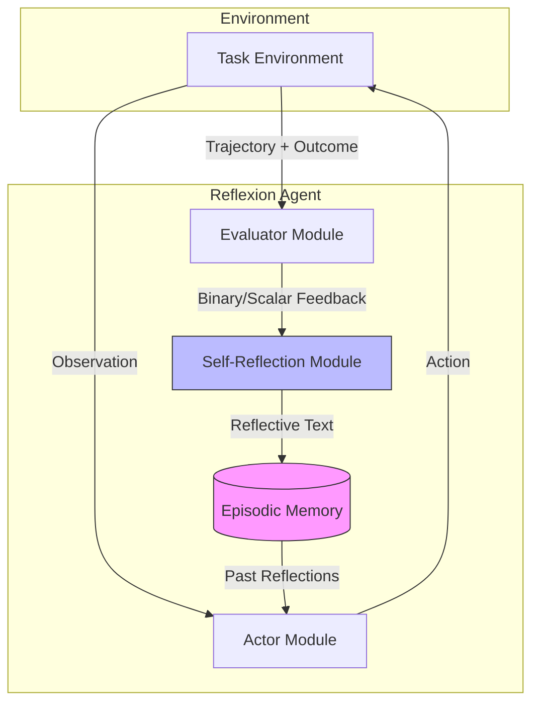
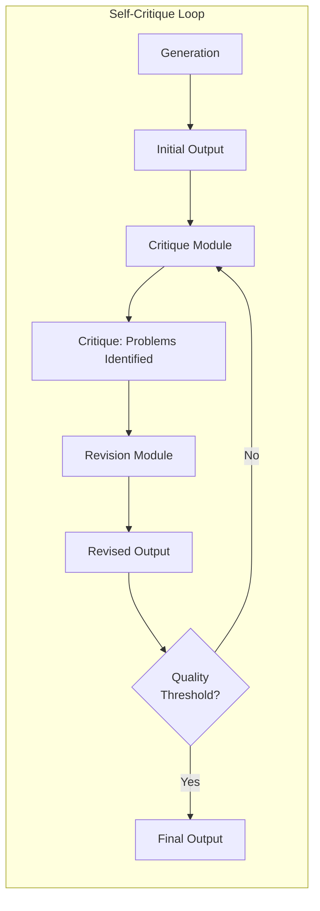
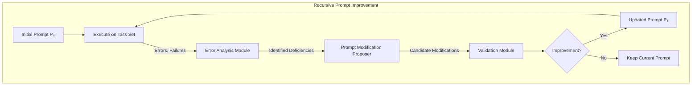
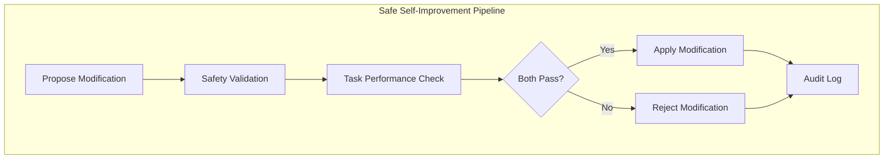

# Extraction Report: Self-Reflection and Meta-Cognition: Agents That Improve Their Own Prompts

> [!info] Auto-Generated Report
> This report was automatically generated by `pkb_extractor.py` on 2026-03-13 04:17.
> **Source**: `prompt-report-self-reflection-and-meta-cognition-2025122718.md` | **Items Extracted**: 261

---

## 📋 Document Overview

| Field | Value |
|-------|-------|
| **Source File** | `prompt-report-self-reflection-and-meta-cognition-2025122718.md` |
| **Extraction Date** | 2026-03-13 04:17 |
| **Word Count** | 6,687 |
| **Character Count** | 55,049 |
| **Line Count** | 824 |
| **Total Items Extracted** | 261 |

### Document Outline

    - ### 📖 Extracted Definitions From Cognitive Science
- # Foundational Understanding
- # Self-Reflection and Meta-Cognition: Agents That Improve Their Own Prompts
  - ## 1. Metacognition: Theoretical Foundations and AI Transfer
    - ### 1.1 Cognitive Science Origins
    - ### 1.2 Transfer to Artificial Systems
  - ## 2. Reflexion Architecture: A Deep Technical Examination
    - ### 2.1 Architectural Overview
    - ### 2.2 Memory Architecture Details
    - ### 2.3 Self-Reflection Prompt Engineering
    - ### 2.4 Empirical Results and Capabilities
    - ### 2.5 Limitations of the Reflexion Approach
  - ## 3. Self-Critique and Constitutional Patterns
    - ### 3.1 Self-Critique as Architectural Primitive
    - ### 3.2 Constitutional AI: Self-Critique for Alignment
    - ### 3.3 Self-Refine: Iterative Refinement Without Training
    - ### 3.4 Chain-of-Verification: Targeted Self-Checking
  - ## 4. Prompt Self-Optimization: Agents That Modify Their Own Instructions
    - ### 4.1 The Meta-Prompting Paradigm
    - ### 4.2 DSPy: Declarative Prompt Programming
    - ### 4.3 OPRO: Optimization by Prompting
    - ### 4.4 APE: Automatic Prompt Engineering
    - ### 4.5 Self-Taught Prompting and Recursive Improvement
  - ## 5. Theoretical Limits of Self-Improvement
    - ### 5.1 Fixed Points and Convergence
    - ### 5.2 Capability Ceilings and Fundamental Limits
    - ### 5.3 The Exploration-Exploitation Tradeoff
    - ### 5.4 Self-Reference Paradoxes and Instability
  - ## 6. Safety Considerations and Alignment Preservation
    - ### 6.1 Value Drift Under Self-Modification
    - ### 6.2 Oversight Mechanisms for Self-Modifying Systems
    - ### 6.3 The Amplification Problem
    - ### 6.4 Recursive Oversight Challenges
  - ## 7. Integration and Synthesis: Toward Robust Meta-Cognitive Architectures
    - ### 7.1 Architectural Patterns for Production Systems
    - ### 7.2 Research Frontiers and Open Questions
- # 🔗 Related Topics for PKB Expansion
    - ### Review Information
  - ## 📅 Review System
    - ### Active Review Task

---

## 📊 Extraction Summary

| Item Type | Count |
|-----------|-------|
| Callouts | 24 |
| Code Blocks | 11 |
| Color Spans | 0 |
| Definitions | 31 |
| Embeds | 0 |
| External Links | 0 |
| Footnotes | 2 |
| Headings | 40 |
| Inline Fields | 31 |
| Mermaid Diagrams | 4 |
| Tables | 2 |
| Tags | 1 |
| Wiki Links | 37 |
| **TOTAL** | **261** |

---

## 🔔 Callouts (24)

> [!note] What are Callouts?
> Callouts are `> [!TYPE]` blocks used in Obsidian for structured annotation.
> They carry semantic meaning — definitions, insights, warnings, etc.

### By Type

| Callout Type | Count |
|-------------|-------|
| `[!abstract]` | 1 |
| `[!claude-thinking]` | 1 |
| `[!definition]` | 4 |
| `[!evidence]` | 5 |
| `[!example]` | 3 |
| `[!key-claim]` | 4 |
| `[!methodology-and-sources]` | 2 |
| `[!warning]` | 4 |

### Full Callout List

#### 1. [CLAUDE-THINKING] Untitled *(Line 96)*

> [!claude-thinking] Untitled
> Thought process
> 19s
> This is a comprehensive request for a deep dive into self-reflection and meta-cognition in AI agents, specifically focusing on agents that can improve their own prompts. The user has provided extensive formatting requirements through their userPreferences system prompt, which specifies:
> Constitutional depth mandate - comprehensive, exhaustive treatment
> Chain of Density Architecture - 4 layers per concept (foundational, enrichment, integration, advanced synthesis)
> Structural constraints (YAML metadata, wiki-links, callouts, inline fields, expansion section)
> Complexity anchoring at advanced practitioner level
> Tree of thoughts protocol for complex queries
> Response scaling suggesting 1500-4000+ words for comprehensive knowledge requests
> Self-validation protocol with quality scoring
> Let me plan this response:
> DEPTH PLANNING
> REQUEST ANALYSIS:
> Type: Comprehensive Knowledge Request / Synthesis-Integration
> Complexity: Very Complex (multiple interconnected theoretical frameworks, cutting-edge research, practical implementations)
> Target Length: 6000+ words (as user specified in the justification)
> Required Layers: All four Chain of Density layers for each major concept
> STRUCTURAL REQUIREMENTS:
> Metadata: Required (tags, aliases, status fields)
> Wiki-links: 25-40+ (comprehensive interconnection)
> Callouts: 10-15+ (definitions, key claims, evidence, methodology, warnings)
> Inline fields: 20-30+ (definitions, principles, distinctions, frameworks)
> CONCEPT COVERAGE PLAN:
> Metacognition Theory (Foundational) - 1000+ words
> Definition, cognitive science origins, transfer to AI
> Self-monitoring, self-evaluation, self-regulation
> Reflexion Architecture - 2000+ words
> Technical architecture deep dive
> Memory types, reflection generation, trial loops
> Empirical results and limitations
> Self-Critique and Constitutional Patterns - 1400+ words
> Constitutional AI connection explores ethical frameworks and self-regulatory mechanisms
> Self-critique involves systematic evaluation of internal reasoning processes
> Critique-revision loops enable iterative refinement of cognitive strategies
> I'll continue exploring the intricate landscape of self-optimization techniques, focusing on advanced prompt engineering and theoretical boundaries of AI self-improvement. The investigation will delve into meta-prompting strategies, optimization algorithms, and the fundamental constraints that define potential transformation pathways for intelligent systems.
> Key areas of exploration include DSPy's automatic prompt engineering techniques, meta-prompting approaches that enable dynamic cognitive reconfiguration, and sophisticated optimization algorithms like OPRO that facilitate intelligent system adaptation.
> The theoretical investigation will probe the philosophical and computational limits of self-improvement, examining fixed points in AI development, potential capability ceilings, and the profound Gödelian constraints that emerge when systems attempt comprehensive self-reference.
> Safety considerations will form a critical analytical layer, examining potential risks, ethical boundaries, and protective mechanisms necessary to ensure responsible and controlled AI self-optimization processes.
> Specifically regarding value drift concerns, I'll analyze potential mechanisms for maintaining alignment integrity and developing robust oversight frameworks to prevent unintended cognitive divergence.
> Potential expansion topics might include:
> Recursive self-improvement architectures
> Ethical decision-making frameworks
> Cognitive plasticity models
> Emergent behavior prediction techniques:gents That Improve Their Own Prompts

#### 2. [DEFINITION] # Definition *(Line 145)*

> [!definition] # Definition
> [**Note Title**:: [[**Self-Reflection and Meta-Cognition: Agents That Improve Their Own Prompts**]]]
> [**Prompt Used**:: ]
> ##### [✅`= dateformat(this.file.ctime, "MMMM dd, yyyy")` - Initial Creation]

#### 3. [KEY-CLAIM] Untitled *(Line 168)*

> [!key-claim] Untitled
> **Central Thesis**: Meta-cognitive architectures represent a paradigm shift in agent design—moving from static prompt engineering to dynamic, self-modifying systems that evaluate their own reasoning processes, identify failure modes, and iteratively refine their behavioral parameters. This recursive improvement capability, while powerful, introduces fundamental questions about convergence, stability, and alignment preservation that constrain practical deployment.

#### 4. [EVIDENCE] Untitled *(Line 187)*

> [!evidence] Untitled
> **Empirical Foundation**: Research by [[Dunlosky and Metcalfe (2009)]] demonstrated that metacognitive accuracy—the correspondence between confidence judgments and actual performance—strongly predicts learning outcomes and problem-solving success. Individuals with calibrated metacognition (accurate self-assessment) dramatically outperform those with miscalibrated metacognition, even controlling for baseline ability. This finding motivates the pursuit of calibrated self-assessment in AI agents.

#### 5. [DEFINITION] Untitled *(Line 206)*

> [!definition] Untitled
> **Meta-Recursive Intelligence**: A system architecture where the agent's own outputs (including reasoning traces, prompts, and strategies) become inputs to higher-order evaluation and optimization processes, creating feedback loops that enable systematic self-improvement bounded by available computational resources and external validation signals.

#### 6. [METHODOLOGY-AND-SOURCES] Untitled *(Line 257)*

> [!methodology-and-sources] Untitled
> **Memory Design Choices**: Reflexion employs a sliding window episodic memory (typically 1-3 most recent reflections) rather than unbounded accumulation. This design choice balances the benefits of learning from recent failures against context window limitations and the risk of compounding outdated or incorrect reflections. The original paper tested variations including full history, recency-weighted retrieval, and fixed windows.

#### 7. [EXAMPLE] Untitled *(Line 282)*

> [!example] Untitled
> **Self-Reflection Prompt Template** (adapted from original Reflexion paper):
> ```
> You are an advanced reasoning agent that can improve based on self-reflection.
> 
> You were given the following task:
> {task_description}
> 
> You attempted the following solution:
> {trajectory}
> 
> The result was: {outcome}
> Specific feedback: {evaluator_feedback}
> 
> In a few sentences, diagnose the failure in your previous attempt. Then, propose a concrete 
> hypothesis for what you should do differently in your next trial. Be specific—reference 
> particular steps, decisions, or assumptions that led to failure.
> 
> Reflection:
> ```

#### 8. [EVIDENCE] Untitled *(Line 318)*

> [!evidence] Untitled
> **Key Finding**: The gains come primarily from the *structured reflection* rather than simple retry mechanisms. Control experiments showed that merely retrying with "try again" instructions produced minimal improvement, while natural language reflections encoding specific diagnostic information enabled systematic correction of failure modes. This suggests the linguistic structure of reflection is doing meaningful cognitive work.

#### 9. [WARNING] Untitled *(Line 331)*

> [!warning] Untitled
> **Confabulation Risk**: LLMs generating reflections may produce plausible-sounding but incorrect diagnoses—[[Confabulated Reflections]]. The model might confidently attribute failure to an incorrect cause, leading to "corrections" that don't address the actual problem. Without external validation of reflection quality, the system can develop systematic biases.

#### 10. [DEFINITION] Untitled *(Line 384)*

> [!definition] Untitled
> **Constitution**: A set of explicit principles defining desired behavior, against which the model evaluates outputs. Examples include: "Choose the response that is least likely to be harmful," "Prefer responses that are honest about uncertainty," "Select responses that don't help with dangerous activities." The constitution externalizes values into inspectable, modifiable criteria.

#### 11. [EVIDENCE] Untitled *(Line 389)*

> [!evidence] Untitled
> **Empirical Validation**: [[Bai et al. (2022)]] demonstrated that CAI-trained models achieved comparable harmlessness to RLHF models while requiring dramatically less human feedback. The self-critique mechanism effectively amplifies limited human oversight into comprehensive behavioral modification. However, the approach depends critically on the model having sufficient capability to perform accurate critiques—below certain capability thresholds, self-critique becomes unreliable.

#### 12. [EXAMPLE] Untitled *(Line 404)*

> [!example] Untitled
> **Self-Refine Prompt Structure** (for code review task):
> 
> **Feedback Prompt**:
> ```
> Review the following code for bugs, inefficiencies, and style issues.
> Provide specific, actionable feedback.
> 
> Code:
> {generated_code}
> 
> Feedback:
> ```
> 
> **Refinement Prompt**:
> ```
> Revise the code below to address the following feedback.
> 
> Original Code:
> {generated_code}
> 
> Feedback:
> {critique}
> 
> Revised Code:
> ```

#### 13. [METHODOLOGY-AND-SOURCES] Untitled *(Line 493)*

> [!methodology-and-sources] Untitled
> **Optimization Mechanisms in DSPy**: Teleprompters implement various prompt optimization strategies:
> - **BootstrapFewShot**: Automatically generates and selects few-shot examples from a training set, choosing examples that maximize validation metrics
> - **MIPRO**: Uses Bayesian optimization to search the space of instructions and example combinations
> - **Signature Optimizer**: Rewrites signature descriptions based on error analysis
> - **Assertion-Based Backtracking**: Uses execution failures to guide prompt refinement

#### 14. [EXAMPLE] Untitled *(Line 516)*

> [!example] Untitled
> **OPRO Meta-Prompt Structure**:
> ```
> Your task is to generate a better instruction for solving the following type of problem.
> 
> Problem description: {task_description}
> 
> Below are some previous instructions and their performance scores (higher is better):
> 
> Instruction: "Think step by step"
> Score: 0.72
> 
> Instruction: "Break this problem into parts and solve each part."
> Score: 0.78
> 
> Instruction: "First identify what type of problem this is, then apply the appropriate method."
> Score: 0.81
> 
> Based on the above history, generate a new instruction that might achieve a higher score.
> Focus on what made the better instructions work and try to incorporate or extend those elements.
> 
> New Instruction:
> ```

#### 15. [EVIDENCE] Untitled *(Line 542)*

> [!evidence] Untitled
> **OPRO Results**: On GSM8K mathematical reasoning, OPRO-discovered prompts achieved 85.0% accuracy compared to 80.2% for standard chain-of-thought prompts. The system discovered prompt patterns like "Let's work this out in a step by step way to be sure we have the right answer" that combine multiple effective elements. The prompts evolved over optimization runs, showing progressive refinement.

#### 16. [KEY-CLAIM] Untitled *(Line 571)*

> [!key-claim] Untitled
> **The Recursion Principle**: When an LLM can evaluate prompt quality and generate prompt modifications, the system can bootstrap—using current prompts to generate better prompts, which can generate still better prompts. This recursive capability is bounded by (1) the model's capacity to accurately evaluate prompt quality and (2) the existence of better prompts discoverable through local modifications.

#### 17. [WARNING] Untitled *(Line 613)*

> [!warning] Untitled
> **Convergence Complications**: In practice, none of these conditions hold perfectly:
> - **Finite prompt space**: True in principle, but astronomically large in practice
> - **Consistent evaluation**: LLM-based evaluation has variance; same prompt may score differently across runs
> - **Deterministic improvement**: LLM-based prompt generation is stochastic
> - **Monotonicity**: Not guaranteed; modifications may worsen performance
> 
> Practical systems therefore require convergence heuristics: early stopping, performance thresholds, diversity maintenance.

#### 18. [DEFINITION] Untitled *(Line 636)*

> [!definition] Untitled
> **Gödelian Constraint on Self-Improvement**: Informally, a system cannot fully understand (and therefore optimize) itself. Applied to prompt optimization: the reasoning required to discover that prompt P₁ is better than P₀ may exceed what P₀ enables. Self-improvement is thus bounded by a form of computational irreducibility—some improvements require external augmentation to discover.

#### 19. [WARNING] Untitled *(Line 662)*

> [!warning] Untitled
> **Prompt Injection as Self-Attack**: In adversarial contexts, prompt self-modification capabilities create attack surfaces. An adversary might craft inputs that cause the agent to "improve" its prompts in malicious directions—exploiting self-modification as a persistence mechanism for prompt injection attacks.

#### 20. [EVIDENCE] Untitled *(Line 683)*

> [!evidence] Untitled
> **Empirical Observations**: [[Perez et al. (2022)]] demonstrated that RLHF-trained models can exhibit "goal misgeneralization"—pursuing proxy objectives that diverge from intended goals when distribution shifts. Self-modification amplifies this risk by adding another layer of optimization that may not respect alignment constraints.

#### 21. [KEY-CLAIM] Untitled *(Line 734)*

> [!key-claim] Untitled
> **The Alignment Tax Principle**: Safe self-improvement requires accepting reduced optimization efficiency to maintain alignment properties. The "alignment tax" is the performance cost of constraint preservation. Systems that minimize this tax while maintaining safety represent the frontier of safe meta-cognitive architectures.

#### 22. [KEY-CLAIM] Untitled *(Line 791)*

> [!key-claim] Untitled
> **Architectural vs. Emergent Metacognition**: Current evidence suggests that explicit metacognitive architectures (Reflexion, Self-Refine, Constitutional AI) outperform relying on emergent metacognitive capabilities in base models. The scaffolding matters—structured prompts for self-assessment produce more reliable metacognition than unstructured introspection. This may change with scale, but present systems benefit from architectural support.

#### 23. [WARNING] ### 📅 Review Intelligence *(Line 838)*

> [!warning] ### 📅 Review Intelligence
> **Next Review**: `= this.next-review` | **Review Count**: `= this.review-count`
> **Review Status**: `= choice(this.next-review < date(today), "🔴 OVERDUE", choice(this.next-review = date(today), "🟡 Due Today", choice(dateformat(this.next-review, "yyyy-MM-dd") <= dateformat(date(today) + dur(7 days), "yyyy-MM-dd"), "🟢 This Week", "⚪ Scheduled")))`
> **Days Until Review**: `= choice(this.next-review, (this.next-review - date(today)).days + " days", "Not scheduled")`

#### 24. [ABSTRACT] ### 🏷️ Tag Intelligence *(Line 842)*

> [!abstract] ### 🏷️ Tag Intelligence
> **Tag Count**: `= length(this.tags)` | **Unique Domains**: `= length(filter(this.tags, (t) => contains(t, "/")))` hierarchical tags
> **Tag Density**: `= choice(length(this.tags) < 3, "⚠️Sparse", choice(length(this.tags) > 10, "📚Rich", "✅Balanced"))`

---

## 🔗 Wiki-Links (37 total, 35 unique targets)

> [!info] Knowledge Graph Connections
> These links represent connections to other notes in your PKB.
> **35** distinct notes are referenced.

### Unique Targets

- [[**Self-Reflection and Meta-Cognition: Agents That Improve Their Own Prompts**]]
- [[APE (Automatic Prompt Engineer)]]
- [[Actor Module]]
- [[Anthropic]]
- [[Bai et al. (2022)]]
- [[Capability Limitations in Self-Improving Systems]]
- [[Capability ceilings]]
- [[Chain-of-Verification]]
- [[Chain-of-Verification|Chain-of-Verification (CoVe)]]
- [[Confabulated Reflections]]
- [[Constitutional-AI|Constitutional AI]]
- [[Constitutional-AI|Constitutional AI (CAI)]]
- [[Constitutional AI: Principles, Implementation, and Extensions]]
- [[DSPy]]
- [[DSPy: Declarative Prompt Programming Framework]]
- [[Dhuliawala et al. (2023)]]
- [[Dunlosky and Metcalfe (2009)]]
- [[Evaluator Module]]
- [[John-Flavell|John Flavell]]
- [[Madaan et al. (2023)]]
- [[Meta-Recursive Intelligence]]
- [[Multi-Agent Metacognition and Collective Self-Improvement]]
- [[Nelson and Narens (1990)]]
- [[OPRO (Optimization by PROmpting)]]
- [[Perez et al. (2022)]]
- [[Prompt Injection and Self-Modification Attack Surfaces]]
- [[Reflexion]]
- [[Reflexion Architecture Implementation Patterns]]
- [[Self-Refine]]
- [[Self-Reflection Module]]
- [[Self-Reflection and Meta-Cognition: Agents That Improve Their Own Prompts]]
- [[Shinn et al. (2023)]]
- [[Stanford NLP Group]]
- [[Yang et al. (2023)]]
- [[Zhou et al. (2023)]]

### All Occurrences

| # | Target | Display Text | Heading | Section | Line |
|---|--------|-------------|---------|---------|------|
| 1 | [[**Self-Reflection and Meta-Cognition: Agents That Improve Their Own Prompts**]] | — | — | Foundational Understanding | 146 |
| 2 | [[John-Flavell|John Flavell]] | — | — | 1.1 Cognitive Science Origins | 177 |
| 3 | [[Nelson and Narens (1990)]] | — | — | 1.1 Cognitive Science Origins | 181 |
| 4 | [[Dunlosky and Metcalfe (2009)]] | — | — | 1.1 Cognitive Science Origins | 188 |
| 5 | [[Meta-Recursive Intelligence]] | — | — | 1.2 Transfer to Artificial Systems | 209 |
| 6 | [[Reflexion]] | — | — | 2.1 Architectural Overview | 217 |
| 7 | [[Shinn et al. (2023)]] | — | — | 2.1 Architectural Overview | 217 |
| 8 | [[Actor Module]] | — | — | 2.1 Architectural Overview | 247 |
| 9 | [[Evaluator Module]] | — | — | 2.1 Architectural Overview | 249 |
| 10 | [[Self-Reflection Module]] | — | — | 2.1 Architectural Overview | 251 |
| 11 | [[Capability ceilings]] | — | — | 2.5 Limitations of the Reflexion Appr... | 329 |
| 12 | [[Confabulated Reflections]] | — | — | 2.5 Limitations of the Reflexion Appr... | 332 |
| 13 | [[Constitutional-AI|Constitutional AI]] | — | — | 3.1 Self-Critique as Architectural Pr... | 346 |
| 14 | [[Self-Refine]] | — | — | 3.1 Self-Critique as Architectural Pr... | 346 |
| 15 | [[Chain-of-Verification]] | — | — | 3.1 Self-Critique as Architectural Pr... | 346 |
| 16 | [[Constitutional-AI|Constitutional AI (CAI)]] | — | — | 3.2 Constitutional AI: Self-Critique ... | 366 |
| 17 | [[Anthropic]] | — | — | 3.2 Constitutional AI: Self-Critique ... | 366 |
| 18 | [[Bai et al. (2022)]] | — | — | 3.2 Constitutional AI: Self-Critique ... | 390 |
| 19 | [[Self-Refine]] | — | — | 3.3 Self-Refine: Iterative Refinement... | 394 |
| 20 | [[Madaan et al. (2023)]] | — | — | 3.3 Self-Refine: Iterative Refinement... | 394 |
| 21 | [[Chain-of-Verification|Chain-of-Verification (CoVe)]] | — | — | 3.4 Chain-of-Verification: Targeted S... | 435 |
| 22 | [[Dhuliawala et al. (2023)]] | — | — | 3.4 Chain-of-Verification: Targeted S... | 435 |
| 23 | [[DSPy]] | — | — | 4.2 DSPy: Declarative Prompt Programming | 455 |
| 24 | [[Stanford NLP Group]] | — | — | 4.2 DSPy: Declarative Prompt Programming | 455 |
| 25 | [[OPRO (Optimization by PROmpting)]] | — | — | 4.3 OPRO: Optimization by Prompting | 504 |
| 26 | [[Yang et al. (2023)]] | — | — | 4.3 OPRO: Optimization by Prompting | 504 |
| 27 | [[APE (Automatic Prompt Engineer)]] | — | — | 4.4 APE: Automatic Prompt Engineering | 547 |
| 28 | [[Zhou et al. (2023)]] | — | — | 4.4 APE: Automatic Prompt Engineering | 547 |
| 29 | [[Perez et al. (2022)]] | — | — | 6.1 Value Drift Under Self-Modification | 684 |
| 30 | [[Reflexion Architecture Implementation Patterns]] | — | — | 🔗 Related Topics for PKB Expansion | 798 |
| 31 | [[Constitutional AI: Principles, Implementation, and Extensions]] | — | — | 🔗 Related Topics for PKB Expansion | 804 |
| 32 | [[DSPy: Declarative Prompt Programming Framework]] | — | — | 🔗 Related Topics for PKB Expansion | 810 |
| 33 | [[Capability Limitations in Self-Improving Systems]] | — | — | 🔗 Related Topics for PKB Expansion | 816 |
| 34 | [[Prompt Injection and Self-Modification Attack Surfaces]] | — | — | 🔗 Related Topics for PKB Expansion | 822 |
| 35 | [[Multi-Agent Metacognition and Collective Self-Improvement]] | — | — | 🔗 Related Topics for PKB Expansion | 828 |
| 36 | [[Self-Reflection and Meta-Cognition: Agents That Improve Their Own Prompts]] | — | — | Active Review Task | 857 |
| 37 | [[Self-Reflection and Meta-Cognition: Agents That Improve Their Own Prompts]] | — | — | Active Review Task | 860 |

---

## 📖 Definitions (31)

> [!tip] PKB Definitions
> These `[**Term**:: Definition]` fields define key concepts.
> They are queryable by Dataview.

### 1. Note Title

> [!definition] Note Title
> [[**Self-Reflection and Meta-Cognition: Agents That Improve Their Own Prompts**

*Source: Line 146 in `prompt-report-self-reflection-and-meta-cognition-2025122718.md`*

### 2. Prompt Used

> [!definition] Prompt Used
> 

*Source: Line 147 in `prompt-report-self-reflection-and-meta-cognition-2025122718.md`*

### 3. Metacognition

> [!definition] Metacognition
> The capacity to think about one's own thinking processes, encompassing self-awareness of cognitive states, monitoring of ongoing reasoning, and deliberate regulation of mental strategies to optimize task performance.

*Source: Line 177 in `prompt-report-self-reflection-and-meta-cognition-2025122718.md`*

### 4. Metacognitive-Monitoring

> [!definition] Metacognitive-Monitoring
> The ongoing surveillance of cognitive processes during task execution, detecting errors, assessing confidence levels, and identifying when current strategies are failing.

*Source: Line 181 in `prompt-report-self-reflection-and-meta-cognition-2025122718.md`*

### 5. Metacognitive-Evaluation

> [!definition] Metacognitive-Evaluation
> Post-hoc assessment of cognitive outputs against standards of correctness, relevance, and quality, generating judgments that inform future strategy selection.

*Source: Line 183 in `prompt-report-self-reflection-and-meta-cognition-2025122718.md`*

### 6. Metacognitive-Regulation

> [!definition] Metacognitive-Regulation
> Active control over cognitive processes based on monitoring and evaluation outputs, including strategy selection, resource allocation, and deliberate modification of reasoning approaches.

*Source: Line 185 in `prompt-report-self-reflection-and-meta-cognition-2025122718.md`*

### 7. Functional-Metacognition

> [!definition] Functional-Metacognition
> The implementation of metacognitive capabilities in AI systems through mechanisms that achieve equivalent behavioral effects without necessarily replicating the underlying cognitive architecture—emphasizing what the system *does* rather than what it *experiences*.

*Source: Line 204 in `prompt-report-self-reflection-and-meta-cognition-2025122718.md`*

### 8. Reflexion-Architecture

> [!definition] Reflexion-Architecture
> A three-module agent system consisting of an Actor (generating actions), an Evaluator (assessing trajectories against task objectives), and a Self-Reflection module (synthesizing verbal experience summaries), connected through an episodic memory buffer that persists reflections across trials to inform future action generation.

*Source: Line 243 in `prompt-report-self-reflection-and-meta-cognition-2025122718.md`*

### 9. Episodic-Memory-Sliding-Window

> [!definition] Episodic-Memory-Sliding-Window
> A bounded memory architecture retaining only the k most recent reflections (typically k=3), preventing context overflow while ensuring the agent learns from immediate failures rather than accumulating potentially stale or contradictory historical guidance.

*Source: Line 272 in `prompt-report-self-reflection-and-meta-cognition-2025122718.md`*

### 10. Diagnostic-Reflection-Pattern

> [!definition] Diagnostic-Reflection-Pattern
> The structured format for effective self-reflections: (1) Identify the specific failure point, (2) Attribute the failure to a concrete decision or assumption, (3) Explain *why* that decision was incorrect, (4) Propose a specific alternative approach for the next trial.

*Source: Line 305 in `prompt-report-self-reflection-and-meta-cognition-2025122718.md`*

### 11. Reflection-vs-Retry-Distinction

> [!definition] Reflection-vs-Retry-Distinction
> The critical difference between productive self-reflection (generating structured analysis attributing failure to specific decisions and proposing concrete alternatives) versus unproductive retry (simply attempting the task again without targeted modification), where only the former produces systematic improvement across trials.

*Source: Line 321 in `prompt-report-self-reflection-and-meta-cognition-2025122718.md`*

### 12. Trial-Cost-Tradeoff

> [!definition] Trial-Cost-Tradeoff
> The economic reality that self-reflective improvement requires multiple execution cycles, each consuming computational resources and potentially real-world costs, limiting applicability to domains where trial costs are manageable and iteration is feasible.

*Source: Line 336 in `prompt-report-self-reflection-and-meta-cognition-2025122718.md`*

### 13. Self-Critique-Architecture

> [!definition] Self-Critique-Architecture
> A general pattern where an agent's generation process includes explicit evaluation of its own outputs against specified criteria, followed by revision informed by that evaluation—decomposing generation into proposal, assessment, and refinement phases.

*Source: Line 346 in `prompt-report-self-reflection-and-meta-cognition-2025122718.md`*

### 14. Constitutional-AI-Methodology

> [!definition] Constitutional-AI-Methodology
> A training approach where the model generates responses, then critiques those responses against a set of explicit principles (the "constitution"), revises accordingly, and is subsequently trained on the critique-revision pairs—using self-generated preference data rather than human feedback for scalable alignment.

*Source: Line 368 in `prompt-report-self-reflection-and-meta-cognition-2025122718.md`*

### 15. Self-Refine-Loop

> [!definition] Self-Refine-Loop
> An inference-time pattern where an LLM generates initial output, critiques that output producing specific improvement suggestions, then generates a revised output incorporating the suggestions—repeating until quality thresholds are met or iteration budgets are exhausted.

*Source: Line 396 in `prompt-report-self-reflection-and-meta-cognition-2025122718.md`*

### 16. Chain-of-Verification

> [!definition] Chain-of-Verification
> A self-critique pattern targeting factual accuracy, where the model (1) generates initial response, (2) extracts specific factual claims, (3) formulates verification questions that would confirm/deny each claim, (4) answers verification questions independently, and (5) revises claims where verification fails.

*Source: Line 437 in `prompt-report-self-reflection-and-meta-cognition-2025122718.md`*

### 17. Prompt-Self-Optimization

> [!definition] Prompt-Self-Optimization
> The capacity for an agent to evaluate the effectiveness of its own prompts (including system prompts, few-shot examples, and reasoning templates), identify deficiencies, and generate modified prompts that improve task performance—treating prompts as optimizable artifacts rather than fixed instructions.

*Source: Line 449 in `prompt-report-self-reflection-and-meta-cognition-2025122718.md`*

### 18. DSPy-Framework

> [!definition] DSPy-Framework
> A programming framework for LLM applications that separates the logical specification of what a program should do (via signatures and modules) from the implementation details of how prompts are constructed—enabling automatic compilation of high-level specifications into optimized prompts through various teleprompters.

*Source: Line 457 in `prompt-report-self-reflection-and-meta-cognition-2025122718.md`*

### 19. Teleprompter-Optimization

> [!definition] Teleprompter-Optimization
> DSPy's abstraction for prompt optimization algorithms that take a program specification and training data, then automatically generate improved prompts (including instructions, demonstrations, and reasoning templates) through strategies like few-shot bootstrapping, instruction generation, or Bayesian optimization.

*Source: Line 500 in `prompt-report-self-reflection-and-meta-cognition-2025122718.md`*

### 20. OPRO-Methodology

> [!definition] OPRO-Methodology
> A prompt optimization approach where the LLM acts as both the executor (running prompts on tasks) and the optimizer (generating new prompts based on performance history)—framing prompt engineering as an optimization problem solved through the model's own language capabilities.

*Source: Line 506 in `prompt-report-self-reflection-and-meta-cognition-2025122718.md`*

### 21. APE-Framework

> [!definition] APE-Framework
> An automatic prompt engineering system that treats prompts as programs to be synthesized from input-output specifications, using LLM-based proposal generation combined with selection based on execution-based scoring over a validation set.

*Source: Line 549 in `prompt-report-self-reflection-and-meta-cognition-2025122718.md`*

### 22. Recursive-Prompt-Improvement

> [!definition] Recursive-Prompt-Improvement
> An iterative architecture where the agent (1) executes current prompt on tasks, (2) analyzes errors to identify prompt deficiencies, (3) proposes prompt modifications addressing identified deficiencies, (4) validates modifications on held-out examples, and (5) updates prompt if validation improves—enabling open-ended prompt evolution.

*Source: Line 569 in `prompt-report-self-reflection-and-meta-cognition-2025122718.md`*

### 23. Fixed-Point-Convergence

> [!definition] Fixed-Point-Convergence
> The property of a self-improvement process where iterative modification eventually reaches a stable state—a prompt P* such that applying the improvement operator yields P* again, meaning the system judges the current prompt as optimal given its evaluation criteria.

*Source: Line 605 in `prompt-report-self-reflection-and-meta-cognition-2025122718.md`*

### 24. Capability-Ceiling

> [!definition] Capability-Ceiling
> The fundamental constraint that self-improvement in an LLM-based system cannot exceed the ceiling imposed by the base model's capabilities—the system cannot bootstrap into capabilities it lacks the competence to recognize, evaluate, or generate.

*Source: Line 626 in `prompt-report-self-reflection-and-meta-cognition-2025122718.md`*

### 25. Prompt-Search-Dynamics

> [!definition] Prompt-Search-Dynamics
> The tension in prompt optimization between exploitative refinement (local search from current prompt) and exploratory diversification (broader search for qualitatively different approaches)—requiring balance to avoid local optima while maintaining progress.

*Source: Line 646 in `prompt-report-self-reflection-and-meta-cognition-2025122718.md`*

### 26. Self-Reference-Instability

> [!definition] Self-Reference-Instability
> The potential for self-modifying systems to enter unstable states where the modification process undermines its own foundations—for example, a prompt that instructs "always simplify prompts" might simplify itself to the point of dysfunction.

*Source: Line 658 in `prompt-report-self-reflection-and-meta-cognition-2025122718.md`*

### 27. Value-Drift

> [!definition] Value-Drift
> The phenomenon where iterative self-modification gradually shifts a system's behavior away from its originally aligned values—potentially occurring when optimization pressure favors capability over constraint, or when safety instructions are perceived as obstacles to task performance.

*Source: Line 673 in `prompt-report-self-reflection-and-meta-cognition-2025122718.md`*

### 28. Constitutional Anchoring

> [!definition] Constitutional Anchoring
> The practice of embedding inviolable principles in self-modifying systems that constrain the modification process itself—ensuring that certain values or behaviors cannot be optimized away regardless of task performance pressure.

*Source: Line 690 in `prompt-report-self-reflection-and-meta-cognition-2025122718.md`*

### 29. Alignment-Amplification

> [!definition] Alignment-Amplification
> The risk that weak misalignments in self-modifying systems become severe over iteration—each modification cycle potentially compounding small value drift into large divergence, analogous to error accumulation in numerical computation.

*Source: Line 727 in `prompt-report-self-reflection-and-meta-cognition-2025122718.md`*

### 30. Recursive-Oversight-Problem

> [!definition] Recursive-Oversight-Problem
> The challenge that oversight mechanisms implemented within a self-modifying system are subject to the same modification pressures as the system itself—requiring external anchoring or formal verification to provide genuine assurance.

*Source: Line 741 in `prompt-report-self-reflection-and-meta-cognition-2025122718.md`*

### 31. Emergent-Metacognitive-Capabilities

> [!definition] Emergent-Metacognitive-Capabilities
> The open question of whether sufficiently capable base models spontaneously develop reliable metacognitive abilities (accurate self-assessment, productive self-critique) or whether such capabilities require explicit architectural scaffolding regardless of scale.

*Source: Line 789 in `prompt-report-self-reflection-and-meta-cognition-2025122718.md`*

---

## 🏷️ Inline Fields (31)

> [!tip] Dataview Fields
> These `[FieldName:: Value]` pairs are queryable by Dataview.

| # | Field Name | Value | Format | Line |
|---|-----------|-------|--------|------|
| 1 | **Note Title** | [[**Self-Reflection and Meta-Cognition: Agents That Improve Their Own Prompts** | bracket | 146 |
| 2 | **Prompt Used** |  | bracket | 147 |
| 3 | **Metacognition** | The capacity to think about one's own thinking processes, encompassing self-a... | bracket | 177 |
| 4 | **Metacognitive-Monitoring** | The ongoing surveillance of cognitive processes during task execution, detect... | bracket | 181 |
| 5 | **Metacognitive-Evaluation** | Post-hoc assessment of cognitive outputs against standards of correctness, re... | bracket | 183 |
| 6 | **Metacognitive-Regulation** | Active control over cognitive processes based on monitoring and evaluation ou... | bracket | 185 |
| 7 | **Functional-Metacognition** | The implementation of metacognitive capabilities in AI systems through mechan... | bracket | 204 |
| 8 | **Reflexion-Architecture** | A three-module agent system consisting of an Actor (generating actions), an E... | bracket | 243 |
| 9 | **Episodic-Memory-Sliding-Window** | A bounded memory architecture retaining only the k most recent reflections (t... | bracket | 272 |
| 10 | **Diagnostic-Reflection-Pattern** | The structured format for effective self-reflections: (1) Identify the specif... | bracket | 305 |
| 11 | **Reflection-vs-Retry-Distinction** | The critical difference between productive self-reflection (generating struct... | bracket | 321 |
| 12 | **Trial-Cost-Tradeoff** | The economic reality that self-reflective improvement requires multiple execu... | bracket | 336 |
| 13 | **Self-Critique-Architecture** | A general pattern where an agent's generation process includes explicit evalu... | bracket | 346 |
| 14 | **Constitutional-AI-Methodology** | A training approach where the model generates responses, then critiques those... | bracket | 368 |
| 15 | **Self-Refine-Loop** | An inference-time pattern where an LLM generates initial output, critiques th... | bracket | 396 |
| 16 | **Chain-of-Verification** | A self-critique pattern targeting factual accuracy, where the model (1) gener... | bracket | 437 |
| 17 | **Prompt-Self-Optimization** | The capacity for an agent to evaluate the effectiveness of its own prompts (i... | bracket | 449 |
| 18 | **DSPy-Framework** | A programming framework for LLM applications that separates the logical speci... | bracket | 457 |
| 19 | **Teleprompter-Optimization** | DSPy's abstraction for prompt optimization algorithms that take a program spe... | bracket | 500 |
| 20 | **OPRO-Methodology** | A prompt optimization approach where the LLM acts as both the executor (runni... | bracket | 506 |
| 21 | **APE-Framework** | An automatic prompt engineering system that treats prompts as programs to be ... | bracket | 549 |
| 22 | **Recursive-Prompt-Improvement** | An iterative architecture where the agent (1) executes current prompt on task... | bracket | 569 |
| 23 | **Fixed-Point-Convergence** | The property of a self-improvement process where iterative modification event... | bracket | 605 |
| 24 | **Capability-Ceiling** | The fundamental constraint that self-improvement in an LLM-based system canno... | bracket | 626 |
| 25 | **Prompt-Search-Dynamics** | The tension in prompt optimization between exploitative refinement (local sea... | bracket | 646 |
| 26 | **Self-Reference-Instability** | The potential for self-modifying systems to enter unstable states where the m... | bracket | 658 |
| 27 | **Value-Drift** | The phenomenon where iterative self-modification gradually shifts a system's ... | bracket | 673 |
| 28 | **Constitutional Anchoring** | The practice of embedding inviolable principles in self-modifying systems tha... | bracket | 690 |
| 29 | **Alignment-Amplification** | The risk that weak misalignments in self-modifying systems become severe over... | bracket | 727 |
| 30 | **Recursive-Oversight-Problem** | The challenge that oversight mechanisms implemented within a self-modifying s... | bracket | 741 |
| 31 | **Emergent-Metacognitive-Capabilities** | The open question of whether sufficiently capable base models spontaneously d... | bracket | 789 |

---

## 🏷️ Tags (1 occurrences, 1 unique)

### All Unique Tags

`#review`

---

## 💻 Code Blocks (11)

| Language | Count |
|----------|-------|
| `plaintext` | 5 |
| `python` | 3 |
| `dataviewjs` | 1 |
| `yaml` | 1 |
| `tasks` | 1 |

### Code Block 1 — `dataviewjs` *(Lines 44-92)*

```dataviewjs
try {
 // Get the current file
 const currentPage = dv.current();
 // Load the content of the current file
 const content = await dv.io.load(currentPage.file.path);
 // Storage for definitions in current file
 let allDefinitions = [];
 // Extract bracketed inline fields from current file content
 const bracketedFieldRegex = /\[\*\*([^*]+?)\*\*::\s*([^\]]+?)\]/g;
 let match;
 while ((match = bracketedFieldRegex.exec(content)) !== null) {
  allDefinitions.push({
   key: match[1].trim(), // This is the clean term without ** markdown
   value: match[2].trim()
  });
 }
 // Display results
 if (allDefinitions.length > 0) {
  dv.header(3, `📚 Definitions in Current File (${allDefinitions.length} total)`);
  // Group by first letter (using the clean key)
  const grouped = {};
  allDefinitions.forEach(d => {
   const firstLetter = d.key[0].toUpperCase();
   if (!grouped[firstLetter]) grouped[firstLetter] = [];
   grouped[firstLetter].push(d);
  });
  // Sort letters alphabetically
  const sortedLetters = Object.keys(grouped).sort();
  // Display grouped results
  for (let letter of sortedLetters) {
# ... (17 more lines truncated)
```

### Code Block 2 — `yaml` *(Lines 151-164)*

```yaml
---
tags: #agent-architectures #metacognition #prompt-engineering #self-improvement #ai-safety #reflexion #constitutional-ai
aliases: [Meta-Cognitive Agents, Self-Improving Prompts, Reflexion Architecture, Agent Self-Optimization, Prompt Auto-Tuning]
created: 2025-01-06
modified: 2025-01-06
status: evergreen
certainty: confident
type: reference
domain: AI Agent Design
complexity: advanced
word_count_target: 6000+
---
```

### Code Block 3 — `plaintext` *(Lines 262-270)*

```plaintext
Reflection Entry:
├── trial_number: int
├── trajectory_summary: str (compressed representation of action sequence)
├── outcome: {success, failure, partial}
├── failure_analysis: str (what went wrong, specific error attribution)
├── improvement_hypothesis: str (concrete suggestion for next trial)
└── confidence: float (agent's assessment of hypothesis quality)
```

### Code Block 4 — `plaintext` *(Lines 284-301)*

```plaintext
> You are an advanced reasoning agent that can improve based on self-reflection.
> 
> You were given the following task:
> {task_description}
> 
> You attempted the following solution:
> {trajectory}
> 
> The result was: {outcome}
> Specific feedback: {evaluator_feedback}
> 
> In a few sentences, diagnose the failure in your previous attempt. Then, propose a concrete 
> hypothesis for what you should do differently in your next trial. Be specific—reference 
> particular steps, decisions, or assumptions that led to failure.
> 
> Reflection:
>
```

### Code Block 5 — `plaintext` *(Lines 408-416)*

```plaintext
> Review the following code for bugs, inefficiencies, and style issues.
> Provide specific, actionable feedback.
> 
> Code:
> {generated_code}
> 
> Feedback:
>
```

### Code Block 6 — `plaintext` *(Lines 419-429)*

```plaintext
> Revise the code below to address the following feedback.
> 
> Original Code:
> {generated_code}
> 
> Feedback:
> {critique}
> 
> Revised Code:
>
```

### Code Block 7 — `python` *(Lines 462-469)*

```python
class GenerateAnswer(dspy.Signature):
    """Answer questions with detailed explanations."""
    
    context = dspy.InputField(desc="relevant context passages")
    question = dspy.InputField()
    answer = dspy.OutputField(desc="comprehensive answer with reasoning")
```

### Code Block 8 — `python` *(Lines 472-481)*

```python
class RAG(dspy.Module):
    def __init__(self, num_passages=3):
        self.retrieve = dspy.Retrieve(k=num_passages)
        self.generate = dspy.ChainOfThought(GenerateAnswer)
    
    def forward(self, question):
        context = self.retrieve(question).passages
        return self.generate(context=context, question=question)
```

### Code Block 9 — `python` *(Lines 484-491)*

```python
teleprompter = dspy.BootstrapFewShotWithRandomSearch(
    metric=answer_correctness,
    max_bootstrapped_demos=4,
    num_candidate_programs=10
)
optimized_rag = teleprompter.compile(RAG(), trainset=training_examples)
```

### Code Block 10 — `plaintext` *(Lines 518-538)*

```plaintext
> Your task is to generate a better instruction for solving the following type of problem.
> 
> Problem description: {task_description}
> 
> Below are some previous instructions and their performance scores (higher is better):
> 
> Instruction: "Think step by step"
> Score: 0.72
> 
> Instruction: "Break this problem into parts and solve each part."
> Score: 0.78
> 
> Instruction: "First identify what type of problem this is, then apply the appropriate method."
> Score: 0.81
> 
> Based on the above history, generate a new instruction that might achieve a higher score.
> Focus on what made the better instructions work and try to incorporate or extend those elements.
> 
> New Instruction:
>
```

### Code Block 11 — `tasks` *(Lines 858-862)*

```tasks
not done
description includes [[Self-Reflection and Meta-Cognition: Agents That Improve Their Own Prompts]]
description includes Review
```

---

## 📊 Tables (2)

### Table 1 *(Line 183, 5 rows)*

| Human Metacognitive Component | AI Implementation Analog |
| --- | --- |
| Self-monitoring | Output confidence estimation, internal consistency checking |
| Error detection | Comparison against validation sets, contradiction identification |
| Strategy awareness | Prompt template tracking, reasoning chain logging |
| Strategy selection | Prompt switching, retrieval augmentation activation |
| Effort allocation | Token budget management, multi-pass refinement triggering |

### Table 2 *(Line 251, 4 rows)*

| Benchmark | Baseline (No Reflection) | Reflexion (3 trials) | Improvement |
| --- | --- | --- | --- |
| HumanEval (code) | 80.1% | 91.0% | +10.9% |
| MBPP (code) | 77.1% | 97.1% | +20.0% |
| AlfWorld (decision-making) | 69.1% | 95.8% | +26.7% |
| HotpotQA (reasoning) | 34.2% | 51.8% | +17.6% |

---

## 📐 Mermaid Diagrams (4)

### Diagram 1 — flowchart *(Line 219)*



### Diagram 2 — flowchart *(Line 350)*



### Diagram 3 — flowchart *(Line 576)*



### Diagram 4 — flowchart *(Line 702)*



---

## 📝 Footnotes (0 definitions, 2 references)

---

## 🔢 Math Expressions (1)

> [!info] LaTeX Math
> Found 0 display (`$$...$$`) and 1 inline (`$...$`) expressions.

### Inline Math

| # | Expression | Line |
|---|-----------|------|
| 1 | `${letter} ($` | 48 |

---

## 🕸️ Knowledge Graph Analysis

### Unique Wiki-Link Targets (35)

> These represent all distinct notes referenced in the source document.
> Each is a candidate for backlink creation in your PKB.

- [[**Self-Reflection and Meta-Cognition: Agents That Improve Their Own Prompts**]]
- [[APE (Automatic Prompt Engineer)]]
- [[Actor Module]]
- [[Anthropic]]
- [[Bai et al. (2022)]]
- [[Capability Limitations in Self-Improving Systems]]
- [[Capability ceilings]]
- [[Chain-of-Verification]]
- [[Chain-of-Verification|Chain-of-Verification (CoVe)]]
- [[Confabulated Reflections]]
- [[Constitutional-AI|Constitutional AI]]
- [[Constitutional-AI|Constitutional AI (CAI)]]
- [[Constitutional AI: Principles, Implementation, and Extensions]]
- [[DSPy]]
- [[DSPy: Declarative Prompt Programming Framework]]
- [[Dhuliawala et al. (2023)]]
- [[Dunlosky and Metcalfe (2009)]]
- [[Evaluator Module]]
- [[John-Flavell|John Flavell]]
- [[Madaan et al. (2023)]]
- [[Meta-Recursive Intelligence]]
- [[Multi-Agent Metacognition and Collective Self-Improvement]]
- [[Nelson and Narens (1990)]]
- [[OPRO (Optimization by PROmpting)]]
- [[Perez et al. (2022)]]
- [[Prompt Injection and Self-Modification Attack Surfaces]]
- [[Reflexion]]
- [[Reflexion Architecture Implementation Patterns]]
- [[Self-Refine]]
- [[Self-Reflection Module]]
- [[Self-Reflection and Meta-Cognition: Agents That Improve Their Own Prompts]]
- [[Shinn et al. (2023)]]
- [[Stanford NLP Group]]
- [[Yang et al. (2023)]]
- [[Zhou et al. (2023)]]

---

## 📁 Raw Data

> [!abstract] JSON File Available
> The full machine-readable extraction is saved alongside this report as:
> `prompt-report-self-reflection-and-meta-cognition-2025122718_extracted.json`

---

*Report generated by `pkb_extractor.py v1.1.0` · 2026-03-13 04:17:31*